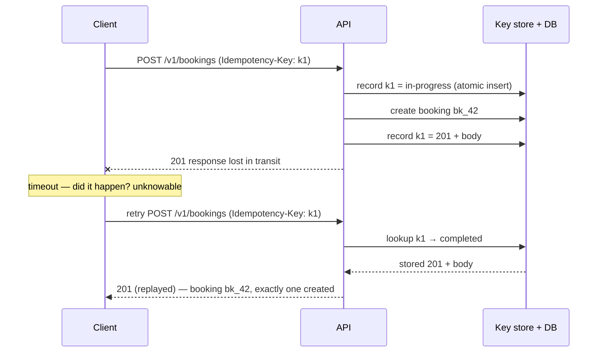
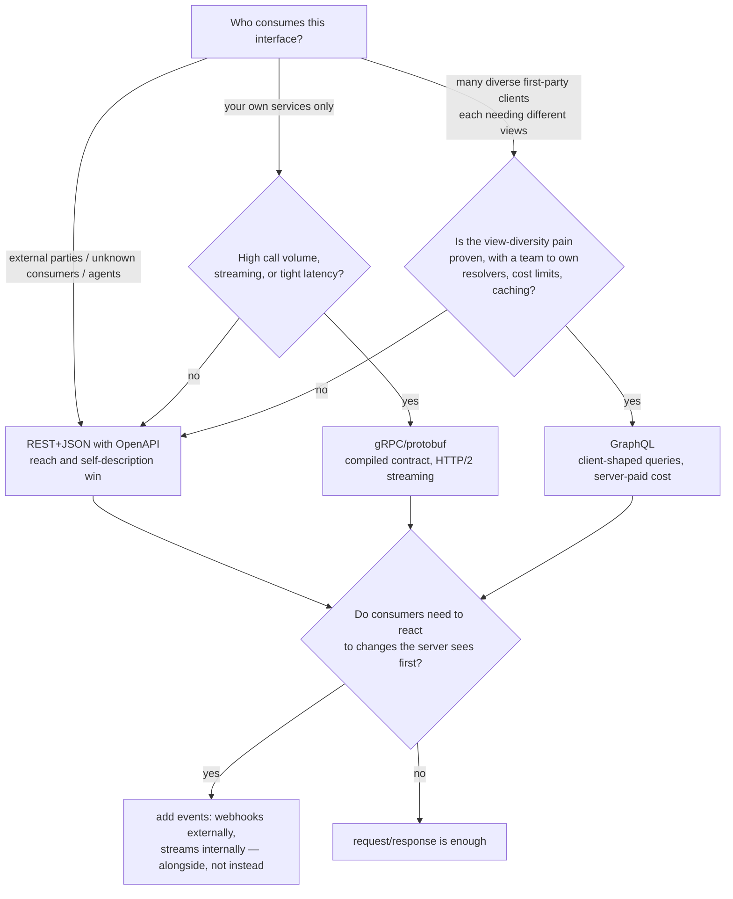

# API Design Study Guide

Designing interfaces for humans and agents. This guide is for engineers who can build an HTTP endpoint but haven't yet had to live with one — who haven't watched a field named in five minutes get baked into a thousand integrations, or discovered that a bug shipped in v1 is now load-bearing behavior that three partners depend on. It assumes you know HTTP at the mechanical level (requests, responses, JSON) and have consumed a few third-party APIs; it does not assume you've ever had to *evolve* an API under consumers you can't see and can't redeploy.

The organizing idea: **an API is a promise you can't take back.** Code you can refactor; an interface, once someone you'll never meet has written code against it, you can only extend. API design is therefore the art of making promises you can keep — and making them *legible* to consumers who will never read your source, never join your Slack, and increasingly, in 2026, aren't human at all. LLM agents now consume APIs by reading their machine-readable descriptions and deciding, token by token, what to call. That doesn't change the fundamentals — agents reward exactly the discipline good API design always demanded — but it raises the bar on two axes: **self-description** (your docs strings are now prompts) and **misuse-resistance** (your contract must make the wrong call hard to express). The guide builds up in that order: first what makes interface design different from code design, then the craft — modeling, HTTP semantics, errors, idempotency, collections, versioning, async patterns — then the protocol decision, the spec-first workflow, the agent-consumer lens, and finally one realistic API designed end to end with the reasoning shown.

Primary references, all worth reading in full: [RFC 9110, *HTTP Semantics*](https://www.rfc-editor.org/rfc/rfc9110) — the actual contract of the web, and shorter than its reputation; Google's [API Improvement Proposals](https://google.aip.dev/) — the best public corpus of opinionated, numbered API-design rules, each with its reasoning attached; the [OpenAPI Specification](https://spec.openapis.org/oas/latest.html) — the lingua franca for describing HTTP APIs and the backbone of the spec-first workflow in Part 10; [RFC 9457, *Problem Details for HTTP APIs*](https://www.rfc-editor.org/rfc/rfc9457) — the standard shape for errors, which Part 4 treats as a first-class design surface; and the [Stripe API reference](https://docs.stripe.com/api) — the widely acknowledged exemplar of commercial API design, worth reading not as a lookup table but as literature.

This guide has siblings that go deeper on adjacent ground: the [Enterprise APIs guide](ENTERPRISE_API_STUDY_GUIDE.md) is the layer above this one — operating an API at enterprise grade: rate-limiting internals, resilience, concurrency control, observability, the gateway and platform layer, the design-review checklist — where this guide is the upstream craft of designing the contract itself; the [Auth guide](AUTH_STUDY_GUIDE.md) (OAuth 2.0, OIDC, API keys, token lifecycles — referenced here, taught there); the [AI Agents guide](AI_AGENTS_STUDY_GUIDE.md) (MCP and the agent side of the interface Part 11 designs for); the [Distributed Systems guide](DISTRIBUTED_SYSTEMS_STUDY_GUIDE.md) (why exactly-once delivery is impossible — the theoretical grounding for Part 5's idempotency keys); the [WebSockets guide](WEBSOCKETS_STUDY_GUIDE.md) (realtime channels, when request/response isn't the right shape at all); and the [Networking Fundamentals guide](NETWORKING_FUNDAMENTALS.md) (HTTP's mechanics below the design layer — connections, TLS, load balancers).

---

## Table of Contents

1. [Part 1 — Promises You Can't Take Back](#part-1--promises-you-cant-take-back)
2. [Part 2 — Resource Modeling](#part-2--resource-modeling)
3. [Part 3 — HTTP as a Design Vocabulary](#part-3--http-as-a-design-vocabulary)
4. [Part 4 — Error Design](#part-4--error-design)
5. [Part 5 — Idempotency in Practice](#part-5--idempotency-in-practice)
6. [Part 6 — Collections: Pagination, Filtering, and Partial Responses](#part-6--collections-pagination-filtering-and-partial-responses)
7. [Part 7 — Versioning and Evolution](#part-7--versioning-and-evolution)
8. [Part 8 — Long-Running Work, Webhooks, and Events](#part-8--long-running-work-webhooks-and-events)
9. [Part 9 — Choosing the Protocol](#part-9--choosing-the-protocol)
10. [Part 10 — Spec-Driven Development](#part-10--spec-driven-development)
11. [Part 11 — Designing for Agent Consumers](#part-11--designing-for-agent-consumers)
12. [Part 12 — A Worked Walkthrough: A Booking API End to End](#part-12--a-worked-walkthrough-a-booking-api-end-to-end)
13. [If You Remember a Handful of Things](#if-you-remember-a-handful-of-things)
14. [Where to Go Next](#where-to-go-next)

---

## Part 1 — Promises You Can't Take Back

Before any convention or rule, get the asymmetry right: **API design and code design are different activities with different physics.** Inside a codebase, a bad name is a rename away from fixed; a bad abstraction is a refactor; your IDE finds every caller and updates them in one commit. An API inverts every one of those properties. You cannot find the callers. You cannot update them. You often cannot even *count* them. The moment a consumer you don't control writes code against your interface, every observable behavior of that interface has become a commitment, and the only changes still available to you are the ones that leave existing consumers working.

### Hyrum's Law: the operating condition

[Hyrum's Law](https://www.hyrumslaw.com/) states the condition precisely: *with a sufficient number of users of an API, it does not matter what you promise in the contract — all observable behaviors of your system will be depended on by somebody.* Not just the fields you documented: the *order* of fields in your JSON, the exact prose of your error messages, the fact that your IDs happen to be sortable, the 250 ms your endpoint has always taken, the undocumented field you exposed by accident in 2024. Someone has parsed it, sorted by it, built a timeout around it, or shipped a regex against it. The design consequence is that **the contract is not what you wrote down; it is what consumers can observe.** Good API design is largely the discipline of shrinking the gap between those two things: making the documented surface explicit and everything else genuinely unobservable (opaque IDs, undocumented-field hygiene, error codes distinct from error prose) so that "what we promised" and "what they depend on" stay the same set.

### The consumer you'll never meet

An internal function has callers you can grep. An API has, in rough order of increasing distance: your own frontend (redeployable), other teams (reachable), partner companies (contractually reachable, practically frozen), mobile apps in the field (users won't update), cron jobs in other people's datacenters (nobody remembers they exist), and — the 2026 addition — **LLM agents** reading your OpenAPI document or an [MCP](https://modelcontextprotocol.io/) tool definition and deciding what to call with no human in the loop. Each step down that list removes a feedback channel. You design for the far end of it: assume the consumer can read only what you published, will interpret it literally, will do the thing your docs permit but you didn't intend, and cannot be emailed. Agents are not a new problem here — they are the *limit case* of the consumer you'll never meet, which is why Part 11 mostly intensifies rules this guide already argues for rather than inventing new ones.

### Compatibility is the prime directive

Everything in this guide flows from one ordering of priorities: **not breaking existing consumers outranks almost every other design value** — elegance, consistency, even correctness of naming. A confusingly named field that a thousand integrations parse correctly is a better API than a beautifully renamed one that breaks half of them. This is why the craft front-loads so much care onto decisions that look trivial: the shape of an ID, whether a field is a string or an enum, whether an error is a code or a sentence. Those decisions are cheap on day one and unchangeable on day four hundred. The rule of thumb that falls out: **spend design effort in proportion to irreversibility, not to implementation difficulty.** A gnarly internal algorithm can be rewritten next quarter; the name and type of a response field is forever, so it deserves the design review, and the algorithm doesn't.

Two reframes make this concrete. First, **an API is a product whose UI is the wire format** — every request and response is a screen someone will stare at, so it deserves the same deliberateness a product designer gives a checkout flow. Second, **you are designing for the debugging session, not the demo.** The API that's pleasant in the quickstart but inscrutable when something fails at 2am is a bad API; Parts 4 and 5 take this personally.

### Where this guide sits

This guide is about the *design* layer: the decisions that define the contract. The [Enterprise APIs guide](ENTERPRISE_API_STUDY_GUIDE.md) is the *operating* layer that keeps the contract honest under load and failure — rate-limiter algorithms, concurrency control, retries and resilience, observability, the gateway, the review checklist. The two layers meet constantly (a rate limit is enforced by the platform but *promised* by the design; idempotency is implemented in middleware but *shaped* in the contract), so this guide cross-links into that one wherever the implementation goes deeper than a designer strictly needs. Read this one first; it's the set of promises the other one teaches you to keep.

```quiz
Q: Why does API design deserve more up-front care than the code behind it?
- [ ] Because API code is harder to write than application code
- [x] Because the interface is effectively irreversible once unknown consumers depend on it, while the implementation can be rewritten at any time
- [ ] Because HTTP requires all endpoints to be registered in advance
- [ ] Because generated documentation cannot be regenerated after launch
> Spend design effort in proportion to irreversibility. A gnarly algorithm behind an endpoint can be replaced next quarter with nobody noticing; a field name or status code, once parsed by consumers you can't redeploy, can only be extended — never fixed. The difficulty of writing the code has nothing to do with it.

Q: Per Hyrum's Law, what is the real contract of a widely used API?
- [ ] The OpenAPI document, exactly as published
- [ ] The subset of behavior covered by the SLA
- [ ] Whatever the API's maintainers currently intend
- [x] Every behavior a consumer can observe, whether or not it was documented
> With enough consumers, someone depends on field order, error prose, ID structure, and latency — none of which you promised. Good design shrinks the gap between the documented surface and the observable one: make the promises explicit and everything else genuinely opaque.

Q: A field shipped in v1 with a confusing name. Renaming it would make the API clearly better. What does the compatibility-first posture say?
- [ ] Rename it and announce the change in the changelog
- [ ] Rename it but keep returning the old name for 30 days
- [ ] Deprecate the whole endpoint and cut a v2 immediately
- [x] Keep the old name working indefinitely; if the confusion is costly, add the better name alongside it rather than replacing it
> Not breaking consumers outranks elegance. A rename is a removal plus an addition, and the removal breaks every parser of the old name — including ones you can't contact. Additive evolution (new field alongside old, old one documented as legacy) gets you the clarity without the breakage; Part 7 makes this hierarchy precise.

Q: Why does the guide treat LLM agents as the "limit case" of API consumers rather than a new category?
- [x] Agents intensify the existing constraint — a consumer that reads only your published description, interprets it literally, and can't be emailed — rather than changing the fundamentals
- [ ] Agents use a different network protocol than human-written clients
- [ ] Agents are the only consumers that read documentation
- [ ] Agents never retry requests, so idempotency stops mattering
> Good design always assumed a distant, literal-minded consumer with no feedback channel. An agent is exactly that, with the interpretation done by a language model: it rewards self-description and misuse-resistance, which are the same virtues, with the bar raised. Part 11 builds on this rather than replacing Parts 2–10.
```

---

## Part 2 — Resource Modeling

The first real design act is deciding **what things your API is about** — the nouns, their names, their identifiers, their relationships — and which operations on them exist. Get the model right and the endpoints, permissions, and docs almost write themselves; get it wrong and every later Part becomes a workaround. Google's [AIPs](https://google.aip.dev/) are the best public treatment of this discipline, and this Part leans on them by number so you can read the reasoning at the source.

### Nouns, verbs, and the honest middle

**Resource-oriented design** models the domain as a set of typed resources (a `booking`, a `customer`, a `payment`) manipulated through a small, uniform set of **standard methods** — list, get, create, update, delete ([AIP-132](https://google.aip.dev/132) and siblings map these onto HTTP). The payoff isn't aesthetic: uniformity is what lets a consumer who learned one corner of your API predict the rest of it, lets tooling (caches, gateways, generated SDKs, agents) reason about operations it has never seen, and lets HTTP's built-in semantics (Part 3) do real work for you.

But be honest about the limits. Real domains contain operations that are not state-overwrites: *cancel* a booking, *capture* a payment, *retry* a failed export. Forcing these into an update — `PATCH {"status": "cancelled"}` — is a modeling lie with practical costs: it conflates "client sets a field" with "system executes a workflow," makes authorization murky (may this caller set `status` to anything, or only to `cancelled`?), and hides preconditions that deserve their own errors. The honest answer is the **custom method** ([AIP-136](https://google.aip.dev/136)): an explicit verb scoped to a resource:

```text
POST /v1/bookings/{id}:cancel        # Google style
POST /v1/bookings/{id}/cancel       # Stripe style — same idea
```

Custom methods are a deliberate escape hatch, not a license: if most of your surface is custom methods, your domain wasn't resource-shaped and you should design it as an RPC API honestly (Part 9) rather than wearing REST as a costume. The test worth applying to every proposed verb: *does this operation create or transition a thing whose state a consumer will later want to read?* If yes, there's usually a resource hiding in it (a `cancellation` isn't needed, but a long-running `export` is an `operation` resource — Part 8).

### Naming and hierarchy

Names are the largest fraction of your API's observable surface, and the cheapest place to buy quality. The rules that pay off ([AIP-122](https://google.aip.dev/122) covers resource names):

- **Collections are plural nouns** (`/bookings`, `/customers`), resources are collection-plus-ID (`/bookings/bk_7f3k2`). Consistency here is what makes URLs guessable.
- **Nest only for genuine ownership.** `/customers/{id}/payment_methods` is right if a payment method cannot exist without its customer. But nesting encodes a promise — *this relationship will never change* — so keep hierarchies shallow (one level is almost always enough) and prefer a top-level collection plus a filter (`/bookings?customer=cus_123`) when the relationship is mere association. Deep paths like `/countries/{c}/cities/{c}/venues/{v}/courts/{c}/bookings/{b}` fossilize your current org chart into every consumer's code.
- **One name per concept, everywhere.** If the thing is a `booking` in the URL, it is a `booking` in the response body, the error messages, the webhook events, and the docs — never a `reservation` in one place and an `appointment` in another. Agents in particular (Part 11) resolve references lexically; synonyms that a human shrugs off send a model to the wrong tool.
- **Spell out meaning in field names, including units.** `timeout_seconds`, not `timeout`; `amount` only alongside an explicit `currency`; `expires_at` for timestamps (the `_at` suffix meaning RFC 3339 instant is a convention worth enforcing API-wide). A name that needs the docs to disambiguate is a name that will be misused by the consumer who didn't read them — which is most consumers, and every agent operating on a truncated description.

### Identifiers: opaque, prefixed, permanent

The ID is the single most-copied string in your API — it lands in consumers' databases, logs, support tickets, and URLs — so its design carries weight far beyond its length:

- **IDs are opaque strings, promised as such.** Not integers: sequential integers leak your growth rate, invite enumeration attacks, and overflow JavaScript's 2⁵³ safe-integer ceiling in the parsers you don't control. Document "an opaque string up to N characters" and *never* document internal structure, because per Hyrum's Law any structure consumers can see, they will parse.
- **Prefix them by type** — `bk_8MGyq4zXKj0`, `cus_9f3b2c`, `pay_Xk2m1` — the pattern Stripe made standard. The prefix costs four characters and buys permanent legibility: any ID found in a log, a bug report, or an agent's context window is self-describing, and a `customer` ID pasted where a `booking` ID belongs fails loudly at parse time instead of silently at 404 time. This is misuse-resistance (Part 11) built into the data itself.
- **IDs never change and are never reused.** An ID that survives renames, moves, and soft-deletion is what lets consumers use it as a foreign key — which they will, whether you bless it or not.

### Fields: the boring decisions that are actually the API

A resource's fields are where most long-term regret concentrates, because every one is a permanent promise. The decisions worth making deliberately, once, API-wide:

- **Timestamps are RFC 3339 / ISO 8601 in UTC** (`2026-07-04T14:23:05Z`), never epoch integers (seconds or milliseconds? — a question with a wrong answer in production) and never local time.
- **Money is integer minor units plus an ISO 4217 currency code** (`{"amount": 2500, "currency": "usd"}`), because JSON numbers are IEEE-754 doubles in most parsers and `0.1 + 0.2` is not an invoice total.
- **Prefer enums over free strings and over booleans.** A `status` enum (`pending`, `confirmed`, `cancelled`) is validatable, documentable, and switch-able; a free string is a typo generator; a boolean (`is_cancelled`) is an enum with two values that you will need three of within a year (see [AIP-216](https://google.aip.dev/216) on states). But an enum is also a compatibility contract: adding a value breaks every consumer whose `switch` had no default arm, so document the tolerance rule — *"clients must handle unknown values of this field"* — on day one (Part 7 returns to this).
- **Make the request and response the same shape** where possible: the object you `GET` is the object you `PATCH`, with server-set fields (`id`, `created_at`, computed values) documented as **output-only** ([AIP-203](https://google.aip.dev/203) covers field behavior annotations). Asymmetric shapes double the consumer's mental model for no benefit.
- **Return the full resource from every write.** `POST /bookings` answers `201` with the complete booking — server-set fields included — so the consumer never needs an immediate follow-up `GET` that might race replication.

If you remember one thing from Part 2: **the model is the API.** Endpoints, errors, permissions, and docs are all projections of the nouns you chose and how you related them — so the modeling conversation, not the endpoint-listing conversation, is where design review time belongs.

```quiz
Q: When is a custom method (`POST /bookings/{id}:cancel`) better design than `PATCH {"status": "cancelled"}`?
- [ ] Never — REST requires all state changes to go through standard methods
- [ ] Whenever you want the URL to read more naturally
- [ ] When the resource has more than ten fields
- [x] When the operation is a workflow with its own preconditions and authorization, not a field the client may freely set
> A PATCH says "the client sets this value"; cancellation is "the system runs a transition with rules" — refunds, notification, a point of no return. Modeling it as a field-write makes authorization murky (may the caller set status to *anything*?) and hides precondition errors. AIP-136's custom methods exist exactly for this — used sparingly, or you've built RPC in a costume.

Q: What is the strongest argument for prefixed, opaque IDs like `bk_8MGyq4zXKj0`?
- [ ] They compress better than integers in JSON
- [x] They make every copied ID self-describing and make cross-type mix-ups fail loudly, while giving consumers no structure to depend on
- [ ] They are required by the OpenAPI specification
- [ ] They allow the database to shard by prefix
> The ID is the most-copied string in the API — logs, tickets, agent context windows. A type prefix makes it legible everywhere it lands, and passing a `cus_` ID where a `bk_` ID belongs fails at validation instead of as a mysterious 404. Opacity is the other half: any internal structure consumers can observe, Hyrum's Law says they'll parse.

Q: Why does deep resource nesting (`/venues/{v}/courts/{c}/bookings/{b}`) age badly?
- [x] The hierarchy is a permanent promise about relationships, and every level fossilizes a structural assumption into consumers' code
- [ ] Long URLs exceed HTTP's length limits
- [ ] Nested routes are slower to match in most frameworks
- [ ] Nesting prevents the use of query-string filters
> Nesting encodes "this thing cannot exist outside its parent, forever." When bookings later need to span courts, or courts move between venues, every consumer built the full path into their client. A top-level collection plus filters (`/bookings?court=...`) promises less, so it can evolve more.

Q: Why is a `status` enum usually better than an `is_cancelled` boolean, and what does the enum cost you?
- [x] States multiply beyond two, and a boolean can't grow — but each added enum value breaks consumers without a documented unknown-value tolerance rule
- [ ] Enums serialize smaller than booleans — but they are harder to index
- [ ] Booleans are ambiguous in JSON — but enums require a schema registry
- [ ] There is no trade-off; enums are strictly superior
> `is_cancelled` becomes `is_cancelled` + `is_pending` + `is_no_show` within a year, and the combinations turn incoherent. One state enum models it honestly. The price is a compatibility contract: a consumer's exhaustive `switch` breaks on your new value, so "clients must handle unknown values" has to be documented before the first release, not after the incident.
```

---

## Part 3 — HTTP as a Design Vocabulary

HTTP is not plumbing under your API; it *is* your API's outermost layer of meaning. [RFC 9110](https://www.rfc-editor.org/rfc/rfc9110) defines a semantic vocabulary — methods with formal properties, status codes with defined meanings, headers with negotiated behavior — that every intermediary, SDK retry layer, cache, crawler, and agent on the internet already understands. Design that uses this vocabulary correctly gets an ecosystem of correct behavior for free; design that fights it (everything is `POST`, everything returns `200`) forfeits all of it and then reinvents it badly inside the payload.

### Methods and their guarantees

RFC 9110 assigns each method two formal properties that other people's software relies on:

- **Safe** — the request doesn't change state. `GET` and `HEAD` are safe, which is precisely why prefetchers, health checks, link-expanders, and exploratory agents feel free to call them. A `GET` that mutates state *will* eventually be called by something that believed the contract, and the resulting incident is the designer's fault.
- **Idempotent** — N identical requests have the same effect as one. `GET`, `PUT`, and `DELETE` are idempotent by definition (`PUT` means "make the resource equal this"; `DELETE` means "make it gone" — doing either twice lands in the same state). `POST` is not, which is why Part 5 exists: retry infrastructure across the internet auto-retries idempotent methods and refuses to auto-retry `POST`, and your design has to bridge that gap explicitly.

| Method | Safe | Idempotent | Design meaning |
|---|---|---|---|
| `GET` / `HEAD` | yes | yes | read; freely retried, cached, prefetched |
| `PUT` | no | **yes** | full replace: "make it equal this" |
| `DELETE` | no | **yes** | removal: "make it gone" (a repeat may 404 — the *state* is the same) |
| `PATCH` | no | no by default | partial update; [JSON Merge Patch (RFC 7396)](https://www.rfc-editor.org/rfc/rfc7396) is the sane default format |
| `POST` | no | **no** | create, custom methods, everything else — the method that needs Part 5 |

One deliberate choice worth making: for partial updates, prefer `PATCH` with JSON Merge Patch semantics (send the fields you're changing; `null` deletes) over `PUT` full-replace, because full-replace makes every writer race every other writer over fields they didn't intend to touch. The more surgical [JSON Patch (RFC 6902)](https://www.rfc-editor.org/rfc/rfc6902) exists for when consumers need operation-level control, at the cost of a harder mental model.

### Status codes that mean what they say

The status code is the first — often only — thing consumer code branches on, so precision here is precision everywhere downstream. The distinctions that carry real information:

- **`200` vs `201` vs `202` vs `204`**: "here's your answer" vs "created, here it is" vs "accepted, working on it — poll this" (Part 8's long-running operations) vs "done, nothing to say."
- **`400` vs `422`**: the request is malformed (unparseable, wrong types) vs well-formed but semantically unprocessable (valid JSON, but the booking overlaps an existing one). Not every API separates these; if you use both, document the line.
- **`401` vs `403`**: *who are you?* (missing/invalid credentials — re-authenticate) vs *you may not do this* (valid credentials, insufficient rights — re-authenticating won't help). Conflating them sends consumers into token-refresh loops for permission problems.
- **`404` as an authorization answer**: returning `403` for a resource the caller shouldn't know exists confirms it exists. Returning `404` for both "not there" and "not yours" is the standard privacy-preserving choice — make it deliberately and consistently.
- **`409`** for state conflicts (version mismatch, duplicate operation in flight) and **`429`** for rate limits (below).
- **`500` vs `503`**: *we broke* (a bug — retrying may or may not help) vs *we're temporarily unable* (overload, maintenance — retry after backoff, and say when via `Retry-After`). The consumer's retry policy branches on exactly this distinction, so returning `500` for overload invites the retry storm that finishes you off.

And the anti-pattern that erases all of the above: **`200` with `{"error": ...}` in the body.** Every generic HTTP component — caches, monitors, retry layers, gateways, agents — reads that as success. This is the difference between **transport-level and application-level signaling**: HTTP status codes are how you talk to *infrastructure and generic clients*; the error body (Part 4) is how you talk to *the developer and their code*. Both layers must tell the truth. (gRPC draws the same line with its own status codes riding on HTTP/2 — the lesson is protocol-independent.)

### Content negotiation and the contract of representations

`Content-Type` on what you send and `Accept` on what you'll take are the honest way to version *representations* (JSON now, maybe `application/problem+json` for errors — Part 4). Two rules earn their keep: **reject requests whose `Content-Type` you don't support with `415`** rather than guessing, and **be strict about what you emit, deliberate about what you accept.** The old "be liberal in what you accept" maxim is a trap at the semantic level: silently ignoring an unknown request field means a consumer's typo (`amout`) becomes a request that "succeeds" while doing the wrong thing. Rejecting unknown fields with a `400` naming the offender converts a silent data bug into a loud, fixable one — and for agent consumers, that loud error is often the *only* corrective signal the model gets.

### Caching and conditional requests: ETags do double duty

HTTP caching ([RFC 9111](https://www.rfc-editor.org/rfc/rfc9111)) is a design surface, not an ops afterthought: `Cache-Control` on your `GET`s is a promise about staleness that you choose per resource. The mechanism designers should actually reach for is the **conditional request** (RFC 9110's `ETag`/`If-None-Match`/`If-Match`), because it solves two unrelated problems with one primitive:

- **Efficient reads**: return an `ETag` (an opaque version token) with each `GET`; a client re-fetching sends `If-None-Match: "<etag>"` and gets a body-less `304 Not Modified` when nothing changed — which is most polls.
- **Lost-update protection on writes**: a client sends its last-seen ETag as `If-Match` on `PATCH`/`PUT`; if the resource changed underneath it, the server answers `412 Precondition Failed` instead of silently overwriting a concurrent writer's work. This is **optimistic concurrency control** delivered entirely in standard HTTP — no bespoke `version` field protocol needed. The [Enterprise APIs guide](ENTERPRISE_API_STUDY_GUIDE.md) works the implementation and the read-modify-write failure modes in depth; the design decision is simply *whether writes require `If-Match`* (for anything a human edits concurrently: yes).

### Rate limits are API surface, not just enforcement

How you *communicate* limits is a design decision consumers write code against, separate from how you enforce them (that's the Enterprise guide's Part 8). The contract has three parts: **`429 Too Many Requests`** ([RFC 6585](https://www.rfc-editor.org/rfc/rfc6585)) as the unambiguous signal, a **`Retry-After`** header (RFC 9110) telling the client exactly how long to back off — machine-readable retry guidance matters double for agents (Part 11) — and, increasingly, the standardized **RateLimit headers** ([IETF httpapi draft](https://datatracker.ietf.org/doc/draft-ietf-httpapi-ratelimit-headers/)) exposing the remaining quota and reset time so well-behaved clients can pace themselves *before* hitting the wall. Design the quota model into the docs (per key? per endpoint? burst vs sustained?) — an undocumented limit is indistinguishable from an outage to the consumer who hits it.

If you remember one thing from Part 3: **HTTP's semantics are shared infrastructure — meaning that you and every cache, SDK, proxy, and agent on earth agreed on in advance.** Every place your API honors them, you inherit correct behavior from software you've never heard of; every place you fight them, you own all of that behavior yourself, forever.

```quiz
Q: Why is a state-changing GET endpoint a design bug even if your own clients never call it wrongly?
- [ ] GET requests cannot carry authentication headers
- [x] The entire ecosystem — prefetchers, caches, health checks, crawling agents — is contractually entitled to call safe methods freely, and eventually something will
- [ ] GET bodies are stripped by most load balancers
- [ ] RFC 9110 requires servers to reject GET requests that mutate state
> Safety is a formal RFC 9110 property that other people's software relies on without asking you. A link-expander, a monitoring probe, or an exploratory agent calling your GET is behaving correctly; your endpoint mutating state on it is the defect. The contract was published before your API existed.

Q: A consumer's dashboard shows your API "up" while every integration is failing, because errors return as 200 with an error JSON body. What design principle was violated?
- [ ] Errors should always use the 5xx range
- [ ] Response bodies should never contain error information
- [x] Transport-level and application-level signals must both tell the truth — status codes are how you talk to infrastructure and generic clients
- [ ] Monitoring should parse bodies rather than status codes
> The status code is the layer caches, monitors, retry logic, gateways, and agents read; the body is the layer the developer's code reads. `200 {"error": ...}` lies to the first audience: nothing retries, nothing alerts, caches may even store the failure. Both layers exist because they serve different readers.

Q: How does an ETag with `If-Match` prevent lost updates?
- [ ] It locks the resource server-side until the client finishes editing
- [ ] It encrypts the payload so concurrent writers can't collide
- [ ] It forces all writes through a single server node
- [x] The write only succeeds if the resource still matches the version the client last read — a concurrent change makes it fail with 412 instead of silently overwriting
> This is optimistic concurrency in standard HTTP: read returns version token, write asserts it. Two admins editing the same record no longer produce a silent last-writer-wins; the second one gets a 412, re-fetches, and re-applies. No locks, no bespoke version-field protocol — the primitive was in RFC 9110 all along.

Q: Why should an API reject a request containing an unknown field rather than silently ignoring it?
- [ ] Unknown fields inflate request size and cost bandwidth
- [ ] JSON parsers cannot skip fields they don't recognize
- [ ] Unknown fields are a security vulnerability in all cases
- [x] Silent ignoring turns a consumer's typo into a request that "succeeds" while doing the wrong thing — and for an agent, the loud 400 is often the only corrective signal it gets
> A misspelled `amout` that's silently dropped means the default value was used and nobody knows. "Be liberal in what you accept" at the semantic level converts loud bugs into silent ones. Strictness on input is a gift to the consumer — human or model — because the error message arrives at the moment the mistake is cheapest to fix.

Q: Distinguishing 500 from 503 matters to consumers primarily because…
- [x] the consumer's retry policy branches on it — 503 with Retry-After invites disciplined backoff, while treating overload as generic 500 invites the retry storm that deepens the outage
- [ ] 503 responses are automatically cached and 500s are not
- [ ] 500 pages the on-call engineer and 503 does not
- [ ] load balancers drop connections on 500 but not 503
> Failure modes are interface. "We broke" and "we're temporarily over capacity, try again in 30s" demand different client behavior, and clients can only behave differently if you tell them which one is happening. An overloaded API returning bare 500s is asking every client to retry immediately — the one thing it can't afford.
```

---

## Part 4 — Error Design

Errors are not the exhaust of your API; they are half of it. Consumers spend their worst hours — the integration that won't work, the production incident at 2am — reading nothing *but* your errors, and an agent consumer reads them as its only feedback channel. So design errors with the same care as success responses, under one governing principle: **design the error for the debugging session, not for the code path that raised it.** The developer staring at it has your response body, and nothing else. Everything they need to get unstuck has to be in there.

### The standard shape: RFC 9457 Problem Details

[RFC 9457](https://www.rfc-editor.org/rfc/rfc9457) (obsoleting RFC 7807) standardizes the error body as `application/problem+json` — a small vocabulary you extend rather than a format you invent:

```http
HTTP/1.1 409 Conflict
Content-Type: application/problem+json
Retry-After: 0

{
  "type": "https://api.example.com/errors/slot-already-booked",
  "title": "Slot already booked",
  "status": 409,
  "detail": "Court crt_4b21 is booked from 18:00 to 19:00 on 2026-07-10 (conflicting booking: bk_9XkQ2).",
  "code": "slot_already_booked",
  "request_id": "req_7f3b9c1e",
  "conflicting_booking": "bk_9XkQ2",
  "remediation": "List availability with GET /v1/courts/crt_4b21/availability?date=2026-07-10 and choose an open slot, or retry with a different court."
}
```

The standard fields carry the structure — `type` (a URI identifying the error *kind*, ideally dereferencing to its documentation), `title` (short human summary of the kind), `status` (echoes the code), `detail` (human prose about *this occurrence*) — and the spec explicitly invites **extension members**, which is where your design lives: a stable `code`, the `request_id` that support can join against server logs, and whatever structured facts this error kind carries.

### Codes are contract; messages are prose

The single most important error-design decision is separating two fields with opposite change policies. The **`code`** (`slot_already_booked`) is a stable, documented, machine-matchable identifier: consumers write `switch` statements against it, so the set of codes is versioned API surface — adding one is additive evolution, renaming one is a breaking change (Part 7). The **`detail`** message is human prose you may freely reword, enrich, and localize, precisely *because* consumers were told to never match on it. Publish the code catalog in your docs and your OpenAPI document (Part 10). Without a `code`, Hyrum's Law guarantees consumers regex your prose — and then your typo fix breaks production integrations, which is as ridiculous as it sounds and genuinely happens.

### Actionable means: what happened, why, what now

Grade every error your API can emit against three questions — *what happened, why, and what should the caller do about it?* — answered **specifically**. "Invalid request" fails all three. The 409 above passes: which slot, which conflicting booking (as a linked, prefixed ID the consumer can fetch), and two concrete paths forward. For validation failures, specificity means **pointing at fields**: an `errors` array with a JSON-Pointer-ish `field`, a per-field `code`, and a per-field message, so a form or a codegen'd client can map failures back to inputs mechanically. Distinguish, always, **whose fault it is**: a 4xx says "your request, as sent, cannot succeed — change it before retrying"; a 5xx says "we failed — the same request may succeed later." Consumers build their entire retry-vs-fix decision on that line, so misfiling (a 500 for bad input, a 400 for your own database timeout) sends them debugging the wrong side of the wire.

### Partial failure needs explicit shape

Batch operations (Part 6) and multi-step workflows break the one-request-one-verdict model: 30 of 50 items succeeded. Never round that to success (silent data loss) or to failure (consumer re-submits the 30 that worked — hello, duplicates). Design a **per-item result envelope** — each entry carrying its own status, its resource on success, its problem-details on failure — under a top-level status the consumer can branch on cheaply ([AIP-233](https://google.aip.dev/233) shows the pattern for batch creates). The same honesty applies to a single operation with side effects that partially applied: if the booking was created but the confirmation email failed, say exactly that, or the consumer's model of your system's state is now wrong through no fault of theirs.

### The 2026 extension: errors an agent can act on

An agent consuming your API feeds each error straight back into a language model that decides the next action. That collapses a distinction human-oriented design could blur: prose the human *interprets* versus structure the caller *executes*. Three upgrades make errors agent-actionable — and each is just an intensified version of the discipline above:

- **Machine-readable retry semantics.** `Retry-After` on every 429 and 503, and a documented per-code convention for *whether* a code is retryable (`rate_limited`: yes, after the header; `slot_already_booked`: never — change the request). An agent without this either hammers you or gives up on recoverable errors; with it, correct behavior is mechanical.
- **Machine-readable remediation.** A `remediation` field written as an *instruction* — naming the exact endpoint and parameters that lead out of the error, as in the example above — is, for an agent, executable: the text lands in the model's context and steers the very next tool call. Write it the way you'd write a prompt, because that is literally what it is.
- **Structured facts over embedded prose.** The conflicting booking ID as its own field (`conflicting_booking`), not just a mention inside `detail` — a model (or any program) can pass a field to the next call verbatim; extracting it from a sentence is a parsing gamble.

The cheap test: for each error your API emits, ask *could a competent but literal-minded reader — human or model — recover from this using only the response body and the public docs?* If the answer leans on tribal knowledge ("oh, that error really means the sandbox key was used"), the error is unfinished.

If you remember one thing from Part 4: **every error is read by two programs and a person** — the consumer's code branching on `code`, possibly a model deciding its next call, and a human at 2am reading `detail`. Serve all three in one body: stable structure for the programs, honest specific prose for the human, and a remediation path that either can follow.

```quiz
Q: Why must the machine-matchable error `code` and the human-readable `detail` be separate fields with different change policies?
- [ ] Because RFC 9457 forbids prose inside machine-readable fields
- [ ] Because codes compress better in logs than messages
- [x] Because consumers need something stable to branch on, and giving them one frees you to improve the prose — without it, they regex your messages and your wording becomes unbreakable API surface
- [ ] Because localization requires all messages to live in a separate service
> The two fields have opposite contracts: `code` is versioned surface (renaming one is a breaking change), `detail` is freely editable precisely because nobody may match on it. Skip the code and Hyrum's Law does the rest — consumers parse the prose, and a typo fix breaks production.

Q: A batch create of 50 bookings succeeds for 30 and fails for 20. What does honest error design return?
- [ ] 200, with the 30 created bookings and a log line about the rest
- [ ] 400, so the consumer knows to re-submit the whole batch
- [ ] 207 with no body, since the outcome is mixed
- [x] A per-item result envelope — each entry with its own status and either the resource or a problem-details object — under a top-level status
> Rounding to success silently loses 20 items; rounding to failure makes the consumer re-submit 30 that already exist — duplicates. Partial failure needs explicit shape: per-item verdicts the consumer can branch on mechanically, which is exactly the pattern AIP-233 prescribes for batch operations.

Q: What makes a `remediation` field qualitatively more valuable to an agent consumer than to a human one?
- [ ] Agents cannot read the `detail` field at all
- [x] The text lands directly in the model's context and steers its next tool call — a well-written remediation is effectively an executable instruction
- [ ] Humans never read error bodies
- [ ] Agents are rate-limited more aggressively, so they see more errors
> A human treats "list availability and pick an open slot" as advice to interpret; for an agent, that sentence *is* the next action — the model emits the suggested call almost verbatim. That's why the guide says to write remediation like a prompt: for one of your two audiences, it is one.

Q: Why does misfiling a bad-input error as a 500 actively harm the consumer?
- [x] The 4xx/5xx line is the consumer's fix-vs-retry decision — a 500 says "same request may succeed later," so they retry and investigate your side while the bug sits in their request
- [ ] 500s are not logged by most client libraries
- [ ] It causes the API gateway to open its circuit breaker
- [ ] 500 responses cannot carry a problem-details body
> "Whose fault is it" is the first branch in every error handler: 4xx means change the request, 5xx means the server failed transiently or otherwise. File a validation failure under 5xx and the consumer's retry loop spins on a request that can never succeed, while their debugging attention points at your infrastructure instead of their payload.
```

---

## Part 5 — Idempotency in Practice

Part 3 noted the gap: `POST` — the method carrying your creates and custom methods, the requests that move money and book slots — is the one method the world's retry infrastructure refuses to retry automatically, because doing so might duplicate the effect. But retries are not optional. The [Distributed Systems guide](DISTRIBUTED_SYSTEMS_STUDY_GUIDE.md) (Parts 2 and 7) proves the underlying dilemma: a client that sends a request and gets silence *cannot know* whether the operation happened, so its only choices are to give up (maybe losing the operation) or retry (maybe duplicating it). **Idempotency keys** are how API design dissolves the dilemma: make the retry safe, and the client can always retry. This Part is the end-to-end mechanics; the [Enterprise APIs guide](ENTERPRISE_API_STUDY_GUIDE.md) Part 3 goes deeper on the server middleware.

### The contract

The [Stripe model](https://docs.stripe.com/api/idempotent_requests) — now being standardized as the [IETF `Idempotency-Key` header draft](https://datatracker.ietf.org/doc/draft-ietf-httpapi-idempotency-key-header/) — is the design to copy:

- The client generates a unique key **per logical operation** (not per HTTP attempt) and sends it as a header: `Idempotency-Key: 3f1a9b7e-…`. A UUIDv4 minted when the *intent* is created — when the user clicks "book," not when the HTTP call is made — is the standard choice; the key must be stable across every retry of that intent.
- **First time** the server sees the key: execute the operation, and durably record the key with the response (status code and body) before answering.
- **Same key again**: execute *nothing*; **replay** the recorded response verbatim — same status, same body, same booking ID. From the client's perspective, retries are indistinguishable from a slow first attempt, which is exactly the point.
- **Same key, different request body**: this is a client bug, never a retry — answer with an unambiguous error (`422`, code like `idempotency_key_reused`) rather than guessing which request was meant.
- **Same key while the first attempt is still executing**: don't run it twice concurrently, and don't replay an unfinished result — answer `409` with a retryable code so the client backs off and retries into the replay path.



### The design decisions the contract forces

**Which operations take keys.** Every non-idempotent operation whose duplicate execution has a cost: creates, custom methods like `:cancel` with side effects (a refund), anything that sends money or email. `GET`/`PUT`/`DELETE` don't need them — HTTP already makes them idempotent (Part 3). Decide whether the header is *required* (Stripe makes it optional; for a payments-shaped API, requiring it on creates converts a whole class of consumer bugs into 400s at integration time — usually the right trade for high-stakes operations).

**Scope and storage.** Keys are scoped per credential (two customers using the same UUID must not collide) and stored with an **atomic insert-if-absent** — the uniqueness check and the reservation must be one operation, or two racing retries both pass the check and you've built an idempotency system that fails exactly when it's needed. Store the *complete* response, because a replay that differs from the original (different booking ID, different status) breaks the illusion the mechanism exists to create.

**Expiry is API surface.** Keys can't live forever, so the retention window (Stripe: 24 hours) is a documented promise: within it, retries are safe; after it, the same key executes *fresh*. Pick a window comfortably longer than any plausible retry horizon — including a consumer's overnight queue replay — and put the number in the docs, because a consumer designing their retry policy needs it.

**Failure replay is a choice you must make.** If the first attempt returned a `500`, should the retry replay the stored `500` or re-execute? Stripe re-executes on `5xx` (the failure may have been transient) and replays recorded `4xx`s (the request is deterministic — it will fail again). Whatever you choose, document it; consumers' recovery code depends on the answer.

Two last framings. First, idempotency keys are *deduplication at the API boundary* — the same "at-least-once delivery plus dedup" construction the Distributed Systems guide shows is the only real meaning of "exactly-once." Second, the keys quietly become more valuable in 2026: an **agent** that hits a timeout mid-workflow faces the same unknowable-state dilemma as any client, but with less judgment about when re-submitting is dangerous. An API that takes idempotency keys gives the agent (and the harness driving it) a mechanical rule — *always retry with the same key* — that is safe without judgment. Part 11 returns to this.

If you remember one thing from Part 5: **a timeout leaves the client unable to know whether the operation happened, so the only correct designs either make the operation safely repeatable or don't get retried.** Idempotency keys are the standard way to buy the first property for `POST` — and the replay-the-stored-response semantics, not the header itself, is where the correctness lives.

```quiz
Q: Why must the idempotency key be generated when the user's intent is created, not when each HTTP request is sent?
- [ ] Keys generated at request time are more likely to collide
- [x] The key's job is to make every retry of one logical operation look identical to the server — a fresh key per attempt makes each retry a brand-new operation, and the duplicate goes through
- [ ] Request-time generation adds latency to the hot path
- [ ] Servers reject keys minted less than a second before the request
> The whole mechanism keys on "same logical operation." If the retry carries a new key, the server has no way to connect it to the first attempt, executes it fresh, and you've charged the card twice with idempotency keys deployed. One intent, one key, held stable across every retry — that's the entire discipline on the client side.

Q: A retried request arrives with a known key while the original is still executing. What should the server do, and why not just run it?
- [ ] Run it — the second execution will hit the same code path and produce the same result
- [ ] Replay whatever partial state exists so the client gets a fast answer
- [ ] Silently drop the request, since the original will answer eventually
- [x] Return a retryable 409-style conflict — running it concurrently risks double execution, and there's no completed response to replay yet
> The in-progress case is where naive implementations double-execute: the lookup says "seen" but there's nothing to replay. Running both races two writers over one side effect. The correct answer is "come back shortly" with a retryable code — the retry then lands in the replay path with the stored response.

Q: Why does the server have to store and replay the complete original response, rather than just skipping re-execution?
- [ ] Storing responses is cheaper than storing request bodies
- [ ] HTTP forbids returning different status codes for identical requests
- [x] The client's recovery logic needs the original outcome — the created booking's ID, the exact status — and a replay that differs from the original defeats the "retries are invisible" illusion
- [ ] Response storage is what enforces key uniqueness
> "Skip execution, return a generic 200" leaves the retrying client without the one thing it came for: what happened the first time. It never received the original response — that's why it retried. Replaying status + body verbatim makes the timeout genuinely indistinguishable from slowness, which is the property the client's code gets to rely on.

Q: Same key, different request body. Why is answering with an error better than executing either version?
- [x] A retry never changes the body, so this is a client bug — guessing which request was intended hides the bug and executes an operation the client may not have meant
- [ ] Different bodies would produce different cache keys downstream
- [ ] The stored response would be too large to compare against
- [ ] It's not better — the server should execute the newer body as an update
> Key reuse with a changed payload means the client's key management is broken (or two call sites share a key). Executing the old stored intent, or the new one, both risk doing something unintended silently. A loud `idempotency_key_reused` error surfaces the bug at integration time — errors that expose client bugs early are a gift (Part 4).

Q: What does the key-retention window (e.g. Stripe's 24 hours) actually promise, and why must it be documented?
- [x] That retries within the window are safe replays, while the same key after expiry executes fresh — so consumers must design their retry horizon inside it
- [ ] That the server keeps request logs for compliance for that period
- [ ] That duplicate detection is probabilistic beyond the window
- [ ] That keys become invalid and requests with them are rejected after it
> Expiry is API surface: a consumer whose overnight queue replays a job 26 hours later needs to know whether that's a safe replay or a second execution. The window is a number their retry architecture is built against — which is exactly the definition of something that belongs in the contract, not the implementation notes.
```

---

## Part 6 — Collections: Pagination, Filtering, and Partial Responses

Every API that lists things faces the same three questions — how consumers walk a large collection, how they narrow it, and how much of each item they get — and the answers are wire-format promises you'll live with (list-response shape is among the hardest things to change compatibly, because *every* consumer touches it). [AIP-158](https://google.aip.dev/158) is the reference treatment of pagination; this Part gives the design reasoning.

### Cursor beats offset, for correctness reasons

**Offset pagination** (`?offset=5000&limit=50`) looks obvious and fails twice. It fails on *correctness*: the collection changes between pages, and an insert or delete before your current position shifts every subsequent page, so a consumer walking "all bookings" silently skips or double-reads items — in a reconciliation job, that's a data-integrity bug that looks like success. It fails on *performance*: most datastores implement offset by producing and discarding 5,000 rows to serve page 101, so deep pages get linearly slower and become the accidental load test a consumer runs against you nightly.

**Cursor (keyset) pagination** fixes both by changing the question from "give me page 101" to "give me what comes after this position":

```http
GET /v1/bookings?limit=50&page_token=eyJrIjoiMjAyNi0wNy0wNFQx...

{
  "data": [ ...50 bookings... ],
  "next_page_token": "eyJrIjoiMjAyNi0wNy0wNFQy...",
  "has_more": true
}
```

The position is anchored to a **stable, unique sort key**, so concurrent inserts elsewhere in the collection can't shift it, and the implementation is an indexed `WHERE (sort_key, id) > (...)` rather than a scan-and-discard. The design rules that keep it honest:

- **The sort key must be unique** — a timestamp alone isn't (two rows in one millisecond), so pair it with the ID as a tiebreaker. Without uniqueness, rows sharing a key straddle a page boundary and get skipped or duplicated, and the bug is rare enough to reach production.
- **The cursor is opaque** — encoded, and ideally signed. The moment consumers can decode a cursor, Hyrum's Law says they'll *construct* them, and your internal sort-key encoding is now public API surface you can never change.
- **Cursors expire; say so loudly.** A consumer resuming a week-old cursor should get an explicit error (`410`/`invalid_page_token`), never silently wrong results.
- **Don't return `total_count` by default.** An exact count over a filtered, growing table often costs more than the page itself and is stale the instant it's computed. Offer it as an explicit opt-in with documented cost, or as a documented estimate — and note that `has_more` (computed by fetching limit+1 rows) answers the question consumers usually actually have.

The residual case for offset is real but narrow: jump-to-page-N UI over a small, effectively static collection. Everything a machine iterates — which includes every agent — wants cursors.

### Filtering and sorting: an allowlist, not a query language

Every filter you accept is a **query plan you're promising to execute at production scale, forever**. Expose named, documented, *indexed* filters (`?status=confirmed&court=crt_4b21&start_after=2026-07-01`) and an enumerated set of sort keys (`?order_by=start_time desc`), and resist the generic expression language — a free-form filter grammar is an invitation for a consumer to invent, at 9am on your busiest Monday, the query your indexes never imagined. Two rules matter more than the parameter syntax: **reject unknown filter parameters with a `400` naming valid ones** — a silently ignored typo (`staus=confirmed`) returns the *unfiltered* world, which in a reconciliation script is a catastrophe dressed as success — and **pin the pagination ordering to the requested sort**, since a cursor is meaningless without a defined total order.

### Partial responses and expansion

Two symmetric knobs control response size, both worth designing deliberately rather than inheriting ad hoc:

- **Field selection** ([AIP-157](https://google.aip.dev/157)): let consumers ask for less (`?fields=id,status,start_time`) when the full resource is heavy and their use is narrow — a list screen, an agent packing results into a bounded context window. Keep the semantics dumb (a comma-separated allowlist of top-level fields) unless you have proven need for nested projection; every increment of expressiveness here is query-language creep with the same costs as filtering grammar.
- **Expansion**: let consumers ask for *more* — Stripe's `?expand[]=customer` inflates a referenced ID into its full object, saving the N+1 follow-up requests that otherwise dominate list-heavy integrations. Bound the depth, and document that expanded objects obey the same authorization as fetching them directly would.

If your client diversity makes these two knobs the *center* of the design conversation — every consumer wanting a genuinely different slice of a rich graph — that's the signal you may be shopping for GraphQL, and Part 9 prices that decision honestly.

### Batch operations

When consumers act on many resources, the design choice is between N requests (simple, parallelizable, individually idempotent — the right default more often than intuition suggests, especially under HTTP/2 multiplexing) and a **batch endpoint** ([AIP-233](https://google.aip.dev/233)-style `POST /v1/bookings:batchCreate`). If you build the batch, three commitments come with it: the **per-item result envelope** from Part 4 (partial failure is the normal case, not the edge case); a documented **atomicity stance** — all-or-nothing or independent-items, chosen per operation and stated in the contract, because consumers' recovery code is completely different for the two; and **one idempotency key covering the batch** as a single logical operation (Part 5), so a retried batch doesn't re-create its succeeded half.

If you remember one thing from Part 6: **list shape is a correctness contract, not a convenience feature** — cursor pagination over a stable unique order, strict filter validation, and explicit partial-failure shape are what let a consumer (or agent) walk your entire dataset and trust that what they saw is what was there.

```quiz
Q: A nightly reconciliation job pages through all bookings with offset pagination while new bookings are being created. What goes wrong?
- [ ] The job gets rate-limited because offsets are expensive to authenticate
- [ ] Nothing — inserts only affect pages the job already passed
- [ ] The database locks the table until pagination completes
- [x] Inserts shift every subsequent page's contents, so the job silently skips or double-reads rows and the reconciliation is wrong while appearing to succeed
> Offset addresses items by position, and positions move under concurrent writes. An insert before the current offset shifts everything after it by one — the row that slides across the page boundary is missed (or read twice). Cursor pagination anchors to a stable sort key instead of a position, which is why it's the correctness fix and not just the performance fix.

Q: Why must pagination cursors be opaque to consumers?
- [ ] Opaque cursors are shorter than readable ones
- [x] A decodable cursor will eventually be constructed by consumers, making your internal sort-key encoding permanent public API surface
- [ ] Base64 encoding is required by AIP-158
- [ ] Readable cursors leak row counts to competitors
> Hyrum's Law again: anything observable gets depended on. The first consumer who decodes your cursor, tweaks the timestamp inside, and re-encodes it has coupled their integration to your encoding — and your next storage migration breaks them. Opacity (plus signing, if you're serious) keeps the cursor a token rather than a format.

Q: Why is silently ignoring an unrecognized filter parameter worse than rejecting it?
- [x] A typo'd filter silently returns the unfiltered collection — the consumer gets vastly more data than intended, and the bug looks exactly like success
- [ ] It wastes the bytes the parameter occupied
- [ ] Unknown parameters can be used for cache poisoning
- [ ] Rejecting unknown parameters is required by RFC 9110
> `?staus=confirmed` with silent ignoring returns *every* booking, and the consumer's script happily processes them all. No error, no anomaly — just wrong results downstream. A 400 naming the valid filters converts that into a fix-in-five-minutes integration error. Strict input validation is a recurring theme for a reason.

Q: You're adding a batch-create endpoint. Which commitment is NOT forced on you by that decision?
- [ ] A documented atomicity stance — all-or-nothing versus independent items
- [ ] A per-item result envelope, since partial failure is the normal case
- [x] Guaranteeing the batch executes faster than the equivalent individual requests
- [ ] Idempotency-key semantics covering the batch as one logical operation
> Batching is a contract change, not a performance promise — under HTTP/2 multiplexing, N individual requests are often competitive, which is why the guide calls them the right default more often than intuition suggests. What the batch *does* force: consumers must know whether item 31's failure rolled back items 1–30, must be able to read per-item outcomes, and must be able to retry the whole batch without duplicating its succeeded half.
```

---

## Part 7 — Versioning and Evolution

Everything so far designs the API at time zero. This Part is about time: how the contract changes underneath consumers who don't change with it. The governing hierarchy is worth stating as bluntly as the guide's through-line demands — **don't break; if you must change, extend; version only as the last resort.** A version number is not a change-management strategy; it's the admission that change management failed, packaged as a migration project you're imposing on every consumer at once.

### What "backwards compatible" precisely means

"Backwards compatible" gets waved around loosely; the precise definition is asymmetric between the two directions of the wire, and [AIP-180](https://google.aip.dev/180) is the reference statement. A change is compatible iff **every request that used to succeed still succeeds with the same meaning, and every response can still be processed by a consumer written against the old contract.**

For **requests** (consumer → you), compatibility means accepting everything you used to accept: you may *add optional* inputs (with defaults preserving old behavior), *relax* validation, *raise* limits. You may not add a required field, remove or rename an input, tighten validation that previously passed, or change a default — each makes formerly valid requests fail or silently mean something else.

For **responses** (you → consumer), the constraint inverts: consumers parse what you emit, so you may not remove, rename, or re-type any field, change the meaning of a value, or (per Hyrum) disturb behavior consumers observably rely on. You may *add* fields — but note the honest asterisk: adding a response field is only compatible *because* the ecosystem convention says clients must ignore unknown fields. That convention is itself part of your contract — write it into the docs explicitly, because a consumer who deserializes into a strict schema that rejects unknowns breaks on your "compatible" addition, and the argument about whose fault that is goes better when you wrote the rule down.

**Enums are the sharpest edge**, and direction matters. Adding an enum value to a *request* field is safe (old clients simply never send it). Adding one to a *response* field breaks every consumer whose handling was exhaustive — which is why Part 2 told you to document the unknown-value tolerance rule on day one, and why high-stakes response enums sometimes justify a design where new values ship behind an opt-in. Error `code`s (Part 4) are response enums and follow the same law: adding codes is additive; renaming or removing one is breaking.

The subtlest class of breakage is **behavioral**: no schema changed, but ordering, latency, timeout behavior, or side-effect timing did — the field is the same, the *world* is different. Schema-diff tooling (Part 10) cannot catch these; only the habit of asking "what could a consumer have observed?" does.

### When you do version: the mechanics

When a genuinely breaking change is unavoidable, two mechanisms dominate:

- **URI versioning** (`/v1/bookings`) is the pragmatic default for public APIs: visible in every log line and support ticket, trivially routable, impossible to invoke by accident. Its cost is granularity — the whole surface shares one version, so a v2 is a big-bang migration.
- **Date-based header versioning** — [Stripe's model](https://docs.stripe.com/api/versioning): each account is *pinned* to the API version current when it first made a request, changes accumulate as many small dated versions, and consumers upgrade their pin deliberately, one date at a time, with the server transforming requests and responses across the intervening versions. This is strictly finer-grained — no big bang, ever — and proportionally more machinery: a transformation layer per change, per-account pinning state, and a support matrix that grows with time. Adopt it if API evolution is your core business; for most teams, URI versioning plus ferocious additive discipline is the right cost.

Either way, the deeper rule is that **a major version is a product launch, not a release**: the old version keeps running for quarters-to-years, with migration guides, changelogs (Stripe's [changelog](https://docs.stripe.com/changelog) is the genre exemplar), and telemetry on who's still behind. If you're not prepared to fund that, you're not prepared to break the contract — which is the point of the hierarchy.

### Deprecation is a protocol, not an announcement

Retiring surface — an endpoint, a field, a whole version — has standardized mechanics now, and using them makes deprecation legible to *tools*, not just readers of your blog:

- Mark it in the contract: OpenAPI's `deprecated: true` on the operation or field (Part 10), so generated SDKs and linters warn at build time.
- Announce it on the wire: the **`Deprecation` header** ([RFC 9745](https://www.rfc-editor.org/rfc/rfc9745)) says "this is deprecated (and since when)"; the **`Sunset` header** ([RFC 8594](https://www.rfc-editor.org/rfc/rfc8594)) commits to when it stops working, as an HTTP date. Together they let a consumer's monitoring — or an agent's harness — detect impending breakage mechanically, from responses alone, without anyone reading email.
- Then **measure before you remove**: traffic on the deprecated surface, by consumer, with the loud ones contacted directly. A sunset date you won't enforce because a major consumer still depends on the endpoint was never a date. Pick windows you'll honor (public APIs: 6–12 months is customary), and honor them.

If you remember one thing from Part 7: **compatibility is defined by the consumer's observation, not your intention** — a change is safe only if no request that worked stops working and no response parser written against the old contract can tell the difference, and everything about versioning follows from how expensive it is to violate that.

```quiz
Q: Adding a new value to an enum is safe in requests but breaking in responses. Why the asymmetry?
- [ ] Request enums are validated server-side, response enums are not
- [x] Old clients simply never send the new request value, but a new response value arrives at consumers whose exhaustive handling has no arm for it
- [ ] JSON serializes request and response enums differently
- [ ] It isn't — enum additions are breaking in both directions
> Direction determines who must understand the value. In requests, you (the server) understand everything old clients can send, plus more. In responses, the consumer's `switch` was written against yesterday's value set — your new `status` hits their no-default branch in production. Hence the day-one rule: document "clients must tolerate unknown values" before you need it.

Q: Why does the guide call adding a response field compatible "with an honest asterisk"?
- [ ] Added fields increase payload size and can breach rate limits
- [ ] New fields are invisible until the OpenAPI document is regenerated
- [x] It's only compatible because of the convention that clients ignore unknown fields — a consumer deserializing into a strict schema breaks, so the tolerance rule must itself be documented contract
- [ ] Added fields change the ETag, invalidating all cached copies
> "Additive is safe" rests on an ecosystem convention, not a law of nature. Strict deserializers that reject unknown properties exist and are sometimes on by default. Writing "clients must ignore unrecognized response fields" into the docs converts the convention into contract — and settles, in advance, the argument about whose bug the breakage is.

Q: What do the Sunset and Deprecation headers add over a deprecation blog post and changelog entry?
- [ ] Legal enforceability of the retirement date
- [ ] Nothing — they are informational duplicates of the docs
- [ ] They automatically redirect traffic to the replacement endpoint
- [x] They make deprecation machine-detectable from responses alone, so monitoring, SDKs, and agent harnesses can flag impending breakage without a human reading announcements
> The consumers most likely to be hit by a retirement are exactly the ones not reading your blog — the frozen integration, the forgotten cron job, the agent. Headers ride on every response, so tooling can alert on them mechanically: RFC 9745's Deprecation says "stop building on this," RFC 8594's Sunset commits to a date. Legibility to tools, not just to readers, is the upgrade.

Q: Your team wants Stripe-style date-pinned versioning "because Stripe does it." What's the honest counter-question?
- [ ] Whether your API gateway supports custom headers
- [x] Whether you'll fund the machinery it implies — a transformation layer per change and per-account pinning state, forever — when URI versioning plus additive discipline covers most teams' needs
- [ ] Whether consumers prefer dates over version integers
- [ ] Whether OpenAPI 3.1 can represent header versioning
> Date pinning is the finest-grained evolution scheme there is — no big-bang migrations, ever — and it's priced accordingly: every breaking change becomes a permanent request/response transformation, plus pinning state and a support matrix that grows monotonically. Stripe's core business is API evolution, so the machinery pays for itself. The cheap alternative isn't v2s — it's not breaking things.
```

---

## Part 8 — Long-Running Work, Webhooks, and Events

Request/response has a hidden assumption: the work fits inside one HTTP exchange. Two things break it — operations that take longer than a request should be held open (report generation, video processing, a booking that needs human confirmation), and state changes the *server* learns about first (the payment settled, the booking was cancelled by the venue). This Part designs both escapes.

### Long-running operations: 202 plus an operation resource

The wrong designs are instructive: holding the connection open couples your processing time to every timeout between you and the consumer (theirs, their proxy's, your load balancer's), and returning a bare `202 Accepted` with no way to check progress just converts "slow" into "unknowable." The right design — the **LRO pattern**, [AIP-151](https://google.aip.dev/151) — applies Part 2's own lesson to the problem: *the work itself is a resource*.

```http
POST /v1/exports        →  202 Accepted
                           { "id": "op_7k2f9", "status": "running",
                             "created_at": "2026-07-04T14:23:05Z", "result": null }

GET /v1/operations/op_7k2f9   →  { "id": "op_7k2f9", "status": "succeeded",
                                   "result": { "export_url": "..." } }
```

The operation resource has an ID, a small **state enum** (`pending`, `running`, `succeeded`, `failed` — terminal states carrying either a `result` or a Part 4-shaped `error`), and the standard behaviors resources get for free: `GET` to poll, list to audit, a `:cancel` custom method if cancellation is meaningful. Design notes that separate good LROs from token gestures: the create should still take an **idempotency key** (a retried "start export" must not start two); poll responses should include **retry pacing** (a `retry_after` hint beats every consumer inventing their own interval); and completed operations should remain readable for a documented window, because the consumer that crashed mid-poll needs to find out how things ended.

### Webhooks: request/response, reversed and hostile

A **webhook** inverts the arrow: the consumer registers a URL, and *you* call *them* when something happens. It solves polling's waste and latency — and it puts you in the client seat of a distributed interaction with all of Part 5's physics, which is why webhook design has non-negotiables rather than preferences ([Stripe's webhook docs](https://docs.stripe.com/webhooks) are the practical reference):

- **Sign every delivery.** The consumer's endpoint is a public URL that anyone can POST forged events to; an HMAC signature over the payload *plus a timestamp* (to kill replay of captured deliveries), with the scheme documented and verification code shipped in your SDKs, is the floor. Auth for the reversed direction is the [Auth guide](AUTH_STUDY_GUIDE.md)'s territory; the design point is that unsigned webhooks are unauthenticated writes into your consumers' systems.
- **Deliver at-least-once, and say so.** You will retry failures (with backoff, for a documented window — hours to days), and retries mean duplicates, because exactly-once delivery doesn't exist ([Distributed Systems guide](DISTRIBUTED_SYSTEMS_STUDY_GUIDE.md), Part 7). The contract therefore *requires consumers to build idempotent handlers*, keyed on the event's unique ID — put that sentence, verbatim, in your docs, because every consumer who skips it ships a duplicate-processing bug.
- **Never promise ordering.** Concurrent deliveries and retries interleave; `booking.updated` can arrive before the `booking.created` it follows. Design events so ordering doesn't matter: either **fat payloads** carrying the resource's full current state (late events are harmlessly stale), or — the more robust pattern — **thin events** ("booking bk_42 changed") that consumers answer by fetching current truth from your API. Thin events also neatly sidestep the "webhook payload as second copy of the resource schema" versioning problem.
- **Design the consumer's ack semantics.** A `2xx` from their endpoint means *durably accepted* — tell them to enqueue-then-ack, not process-then-ack, or your retry policy and their slow handler will conspire to time out successful processing and redeliver it.

### Events versus polling: the decision

With LROs you made consumers poll; with webhooks you push. The general trade: **polling** is simple, consumer-controlled, and firewall-friendly, but wasteful and latency-bound by the interval; **webhooks** are efficient and near-realtime, but demand consumer infrastructure (a public HTTPS endpoint, signature verification, idempotent processing) that not every consumer can field — notably, most *agents* can't stand up a callback URL mid-task, which keeps polling the lingua franca for agent workflows (Part 11). Mature APIs offer both and let the consumer choose: webhooks for production integrations, polling as the universal fallback, and — when consumers need sub-second streams rather than notifications — a realtime channel, which is a different design space covered in the [WebSockets guide](WEBSOCKETS_STUDY_GUIDE.md).

If you remember one thing from Part 8: **when the work outlives the request or the news starts on the server, model it as state a consumer can always re-fetch** — an operation resource for slow work, current-truth fetches behind thin events — because in both patterns the recoverable design is the one where a consumer who missed a message can still converge on reality.

```quiz
Q: Why does the LRO pattern model the running work as a resource with an ID instead of holding the HTTP connection open until done?
- [ ] Open connections consume more server memory than operation rows
- [x] A held connection couples processing time to every timeout on the path, and gives the consumer nothing durable to re-check after a disconnect — a pollable resource survives both
- [ ] HTTP forbids responses slower than 30 seconds
- [ ] Operation resources are required for OpenAPI compliance
> Hold the connection and you inherit the shortest timeout anywhere between you and the consumer — then a disconnect at minute 9 of 10 leaves them with nothing: no handle, no way to learn the outcome. `202` plus an operation resource makes progress durable, addressable state: poll it, list it, read the result after a crash. It's Part 2's lesson applied reflexively — when in doubt, make it a resource.

Q: Your webhook documentation must require consumers to build idempotent handlers. What makes this a requirement rather than advice?
- [ ] Idempotent handlers are faster to execute
- [x] Delivery is at-least-once by construction — retries after ambiguous failures necessarily produce duplicates, so a non-idempotent handler is a duplicate-processing bug waiting for the first network blip
- [ ] Most webhook frameworks reject non-idempotent handler registrations
- [ ] It protects consumers from forged events
> You retry because a timeout is ambiguous (did their endpoint process it?) — the same physics as Part 5, with you in the client seat. Retrying a delivery that actually succeeded produces a duplicate; not retrying risks losing the event. At-least-once plus consumer-side dedup (keyed on event ID) is the only honest contract, so the docs must say it in requirement language.

Q: Why do "thin" webhook payloads (just the resource ID and event type) sidestep the ordering problem?
- [x] The consumer responds by fetching the resource's current state from the API, so a late or out-of-order event still converges on present truth
- [ ] Thin payloads are delivered faster, so they arrive in order
- [ ] Ordering only breaks for payloads over 64 KB
- [ ] Thin events are deduplicated by the delivery infrastructure
> With fat, state-carrying payloads, applying an old event after a newer one regresses the consumer's copy. Thin events carry no state to misapply — every event, whenever it arrives, triggers "go look at reality now." Late, duplicated, and reordered deliveries all collapse into the same harmless act. As a bonus, the payload stops being a second, separately-versioned copy of your resource schema.

Q: Why does agent consumption tilt the events-vs-polling decision toward polling?
- [ ] Agents cannot parse webhook signature schemes
- [ ] Polling is cheaper for the API provider at agent scale
- [ ] Agents require ordered delivery, which webhooks can't provide
- [x] Webhooks require the consumer to operate a public callback endpoint, which an agent in the middle of a task generally cannot stand up — polling needs only the ability to make requests
> A webhook consumer is infrastructure: a persistent HTTPS endpoint, signature verification, a queue. An agent is a transient process with an HTTP client. It can poll an operation resource in a loop; it cannot (usually) receive calls. This is why LRO-style pollable state is the universal fallback — every consumer that can make requests at all can use it.
```

---

## Part 9 — Choosing the Protocol

Everything so far assumed HTTP+JSON, and for good reason — but "which protocol style" is a real design decision with real stakes, usually made badly because it's made tribally. This Part is a decision framework, not advocacy: the four styles are tools with different load-bearing properties, and the choice follows from **who your consumers are and what shape of conversation they need**.

### The four styles, honestly

**REST/JSON** — resource-oriented HTTP as Parts 2–8 designed it (the term comes from [Fielding's dissertation](https://ics.uci.edu/~fielding/pubs/dissertation/rest_arch_style.htm); what industry ships is resource-oriented HTTP+JSON, and that's fine). Its superpower is **reach**: every language, every proxy and cache (Part 3's shared semantics doing free work), every debugging tool down to `curl`, every developer's existing knowledge — and, decisively in 2026, it's the style LLMs have absorbed most deeply from training data, making it the lowest-friction surface for agent consumers (Part 11). Its costs: no compile-time contract unless you impose one (Part 10's whole job), JSON's payload weight and missing types, and chattiness for graph-shaped reads. **Default for public APIs and anything consumed by parties you don't control.**

**gRPC/protobuf** — RPC with a compiled contract. [Protocol Buffers](https://protobuf.dev/) define messages and services in `.proto` files; [gRPC](https://grpc.io/docs/what-is-grpc/core-concepts/) generates servers and clients in every mainstream language, rides HTTP/2, and supports **streaming** in both directions as a first-class citizen. The wins are contract-first development enforced by the compiler, compact binary payloads, and low per-call overhead — which is why it dominates **internal service-to-service** traffic. The costs are ecosystem friction at the edges: browsers can't speak native gRPC (you need a translation proxy layer), payloads are opaque to generic HTTP tooling, and human debuggability drops. Note what does *not* differ: protobuf's field-numbering discipline is Part 7's compatibility rules with a compiler assist — the promises are the same promises.

**GraphQL** — a typed query language ([spec](https://spec.graphql.org/), [docs](https://graphql.org/learn/)) where clients specify exactly the data shape they want from a server-defined schema. It exists to solve a specific pain: **many diverse clients needing genuinely different views** of a rich data graph, where REST's answer degenerates into endpoint sprawl or Part 6's field-selection/expansion knobs stretched past their design intent. That's real value — and it's paid for on the server: every query is client-authored, so you own N+1 resolution (dataloaders), query cost analysis and depth limiting (a public GraphQL endpoint is a query-language-shaped DoS surface — the same disease Part 6 warned about with filter grammars, at maximum dose), per-field authorization, and caching that HTTP no longer gives you for free (everything's a `POST`). Adopt it when the client-diversity pain is *yours and proven* — typically a platform team serving many first-party frontends — not because the query console demos well.

**Events/async** — the consumer doesn't ask; it reacts. Webhooks (Part 8) are the API-shaped edge of this; internal architectures extend it to message brokers and event streams (the [Distributed Systems guide](DISTRIBUTED_SYSTEMS_STUDY_GUIDE.md), Part 8, covers the machinery — and its lessons on delivery guarantees and ordering are the contract here too). Choose it when the defining property of the interaction is *the server knows first*; pair it with request/response APIs for the reads, because "react to changes" and "query current state" are complements, not rivals.

### The decision, worked



Three habits keep the decision honest. First, **decide per interface, not per company** — a public REST API, gRPC between your services, and an event stream feeding both is a normal, coherent architecture, not indecision. Second, **weigh the consumer's costs, not just yours**: gRPC's codegen is a gift to a service team and a wall to a weekend integrator; GraphQL's flexibility delights the frontend and bills the platform team. Third, **notice that the fundamentals travel**: every style still needs Part 4's error discipline, Part 5's idempotency, Part 6's pagination, Part 7's compatibility rules. The protocol changes the syntax of the promises, never the need for them — which is why this guide spent eight Parts on the promises and one on the protocol.

If you remember one thing from Part 9: **protocol choice is consumer analysis** — reach for unknown consumers (REST), contract and streaming for your own fleet (gRPC), client-shaped reads for proven view diversity (GraphQL), reaction for server-first news (events) — and none of them exempts you from the design discipline in the rest of this guide.

```quiz
Q: Your public API will be consumed by partners, hobbyists, and LLM agents you'll never meet. Why does this argue for REST+JSON over gRPC despite gRPC's efficiency?
- [ ] gRPC cannot cross the public internet
- [x] Unknown consumers means reach dominates: universal tooling, curl-ability, cache/proxy semantics, and the style agents have most deeply absorbed — while gRPC's codegen-and-proxy toolchain is a wall for the long tail
- [ ] Protobuf cannot represent optional fields
- [ ] REST is faster for large payloads
> Efficiency is your cost; integration friction is theirs, multiplied by every consumer you can't see. The weekend integrator with curl and the agent reading an OpenAPI document both hit the ground running on resource-oriented HTTP; both stall on binary framing and translation proxies. Inside your own fleet the calculus flips — you control both ends, so the compiled contract and streaming pay off.

Q: What is the honest price of exposing GraphQL publicly?
- [ ] Consumers must learn a query language, which slows adoption
- [ ] GraphQL cannot paginate large collections
- [ ] The schema cannot evolve without breaking clients
- [x] Every query is client-authored, so you own N+1 resolution, query cost analysis, depth limits, per-field authorization, and caching that HTTP no longer provides — a query-language-shaped attack and load surface
> GraphQL moves query authorship to the client — that's its entire value, and its entire cost. Part 6 warned that a free-form filter grammar invites the query your indexes never imagined; a public GraphQL endpoint is that warning at maximum dose, plus everything HTTP used to give you (per-URL caching, method semantics) now reimplemented by you. Justified when many first-party clients truly need different views; expensive vanity otherwise.

Q: Why does the guide insist protocol choice happens "per interface, not per company"?
- [ ] Mixing protocols is what API gateways are for
- [ ] Because standardizing on one protocol causes vendor lock-in
- [x] Because the decision inputs — who consumes it, what conversation shape it needs — differ per interface: public REST, internal gRPC, and an event stream can each be the right answer in one system
- [ ] Because engineers should get to choose their preferred style
> "We're a gRPC shop" answers a question nobody asked. The public API's consumers are unknown (reach wins); the service mesh's consumers are your own binaries at high call volume (contract and efficiency win); the notification path's defining property is server-first news (events win). One coherent system, three interfaces, three correct answers.

Q: What stays constant across REST, gRPC, GraphQL, and events?
- [x] The design obligations — error discipline, idempotency, pagination, compatibility rules — change syntax but never disappear
- [ ] The wire format of errors
- [ ] The authentication mechanism
- [ ] The tooling used to generate client code
> Protobuf field numbering is Part 7's compatibility law with a compiler assist; GraphQL schemas face the same additive-evolution rules; events need Part 5's dedup thinking more, not less. The protocol is one Part of this guide because it changes how promises are written — the other eight Parts are the promises, and they travel.
```

---

## Part 10 — Spec-Driven Development

Everything this guide has argued for — precise promises, legible contracts, compatibility you can enforce — needs a place to live that isn't prose docs and tribal memory. That place is the **API description document**, and the workflow that takes it seriously is called **spec-first** (or design-first): the [OpenAPI](https://spec.openapis.org/oas/latest.html) document is written and reviewed *before* the implementation, and everything else — server stubs, client SDKs, docs, tests, mocks, lint gates, agent tool definitions — is generated or validated *from* it. The alternative, annotating code and exhaling a spec afterwards, gets the artifact but not the discipline: the design review happens after the design is implemented, which is to say it doesn't happen.

### OpenAPI 3.1 and JSON Schema: the contract, formalized

An OpenAPI document describes your API's surface — paths, operations, parameters, request/response schemas per status code, auth schemes, examples — in a machine-readable YAML/JSON format. The load-bearing fact about **OpenAPI 3.1** specifically: its schemas *are* [JSON Schema](https://json-schema.org/) (2020-12 dialect) — full alignment, after years of 3.0's dialect divergence. That means one schema language describes your payloads everywhere JSON lives: request validation, response validation, webhook payloads (OpenAPI 3.1's `webhooks` top-level element documents the deliveries you send), config, and test fixtures — write once, enforce everywhere.

The craft of a good spec is mostly the craft this guide already taught, made formal: every Part 2 field decision becomes a typed schema property with `description`, `format`, and `enum`; every Part 4 error code becomes a documented response schema; Part 7's output-only fields become `readOnly: true`; deprecations become `deprecated: true`. Two habits distinguish specs that work from specs that exist. First, **descriptions on everything** — every operation (`summary` + `description`), every parameter, every field, every enum value. These strings become your reference docs, your SDK docstrings, and (Part 11) the prompts agents reason over; an undescribed parameter is undocumented three times at once. Second, **examples that are real** — a worked request/response pair per operation, because humans and models both learn interfaces from examples faster than from schemas.

### What generation buys — and the loop that keeps it honest

With the spec as source of truth, a toolchain hangs off it ([openapi-generator](https://openapi-generator.tech/) is the broadest open-source entry point; per-language ecosystems have sharper tools):

- **Typed client SDKs** — the consumer's IDE now autocompletes your API, and your Part 7 discipline gets teeth: a breaking spec change becomes a *compile error in the consumer's build* rather than a runtime surprise. (This is the exercise in Where to Go Next: make a breaking change and watch the generated client fail — nothing teaches compatibility like seeing the failure move to build time.)
- **Server stubs and request validation** — handlers whose inputs are pre-validated against the schema, so the implementation can't silently accept what the contract forbids.
- **Reference docs and mock servers** — rendered docs stay correct because they're derived, not maintained; mocks let consumers integrate against the design before the implementation exists, which is the spec-first workflow's biggest schedule win.

Generation only helps if the spec and the service can't drift, which is a CI problem with three standard gates. **Linting**: [Spectral](https://github.com/stoplightio/spectral) runs style rules over the spec itself — naming conventions, "every operation has a description," "every 4xx response is problem+json," your Part 2/Part 4 decisions encoded as machine-enforced rules instead of review-comment folklore. **Contract testing**: validate real responses against the spec's schemas in CI (or generate test cases *from* the spec and fuzz the implementation with them), so "the spec says X, the service does Y" fails a build instead of a consumer; the [Testing guide](TESTING_STUDY_GUIDE.md) covers where these sit in the wider test architecture. **Breaking-change detection**: diff the spec against the last released version on every PR and fail on anything Part 7 classifies as breaking — removed fields, tightened validation, changed types. This single gate converts your compatibility policy from a memo into a merge blocker, which is the difference between having the policy and enforcing it.

One honest caveat closes the loop: the spec is the contract's *syntax*. Semantics — idempotency-key behavior, pagination stability, eventual consistency windows, side-effect timing — live in `description` fields as prose, and behavioral compatibility (Part 7) still needs human review. A green spec-diff is necessary, not sufficient.

If you remember one thing from Part 10: **the spec is the API; the code is one implementation of it** — write the contract first, review the contract, generate what can be generated, and gate merges on the contract's compatibility, because a promise you can't mechanically check is a promise you'll eventually break by accident.

```quiz
Q: What is the core argument for writing the OpenAPI document before the implementation rather than generating it from code annotations afterwards?
- [ ] Hand-written YAML is more accurate than generated YAML
- [ ] Code annotations can't express authentication schemes
- [x] Spec-first means the design review happens on the contract before it's implemented — code-first produces the artifact after the design decisions are already sunk cost
- [ ] Generated specs are incompatible with OpenAPI 3.1
> The document is roughly the same either way; the *sequencing* is everything. Reviewing a spec before implementation makes Part 1–7's decisions — names, errors, pagination, compatibility posture — cheap to change. Reviewing after implementation means every objection now costs a rewrite, so objections get waved through. The discipline, not the file format, is the product.

Q: Why is OpenAPI 3.1's full alignment with JSON Schema more than a versioning footnote?
- [ ] It made OpenAPI documents smaller
- [ ] It removed the need for the components section
- [ ] JSON Schema validators run faster than OpenAPI 3.0 validators
- [x] One schema language now describes payloads everywhere JSON lives — request validation, response contract tests, webhook payloads, fixtures — so a schema written once is enforced at every boundary
> Under 3.0's divergent dialect, your "one" schema needed translation between the spec, your validator, and your test tooling — and translations drift. With 3.1, the schema in the contract is literally the schema your validators and contract tests execute. Write the booking schema once; the same document rejects bad requests, fails drifted responses in CI, and types the webhook payload.

Q: Which CI gate most directly turns Part 7's compatibility policy into something real?
- [ ] Spectral linting for naming conventions
- [ ] Mock-server smoke tests on every PR
- [x] Diffing the spec against the last released version and failing the build on breaking changes
- [ ] Measuring code coverage of generated server stubs
> Lint rules enforce style; contract tests catch spec/implementation drift; but only the breaking-change diff enforces the prime directive itself — removed field, retyped property, tightened validation, gone-required parameter all become merge blockers. A compatibility policy that lives in a memo is aspirational; one that fails PRs is operational. (With the caveat the guide flags: behavioral breakage still needs human eyes.)

Q: Why does generating typed client SDKs from the spec "give your compatibility discipline teeth"?
- [x] A breaking contract change now surfaces as a compile error in consumers' builds — moving the failure from production runtime to build time, where it's cheap and attributable
- [ ] Generated SDKs retry idempotent requests automatically
- [ ] SDKs hide the API's URL structure from consumers
- [ ] Typed clients prevent consumers from sending unknown fields
> A removed response field in a JSON-blob world fails at 2am in production, in whatever consumer happened to touch it first. In a generated-client world it fails when the consumer bumps their SDK: a red build pointing at the exact field. Same breakage, radically better failure mode — and the Where-to-Go-Next exercise (break the spec, watch clients fail) makes you feel the difference once, permanently.
```

---

## Part 11 — Designing for Agent Consumers

Everything before this Part designed for a consumer who reads docs, writes code, tests it, and ships it. In 2026 a growing share of your traffic skips all of that: an **LLM agent** reads your API's machine-readable description at call time, decides what to invoke and with what arguments, executes, reads the response, and decides again — with no human reviewing the calls and no integration-test phase standing between its misreading and your production data. The [AI Agents guide](AI_AGENTS_STUDY_GUIDE.md) covers building such agents; this Part is the other side of the interface: what their existence changes about *your* design. The honest headline, echoing Part 1: agents change less than the hype says and more than nothing. They are the limit case of the consumer you'll never meet — infinitely literal, docs-only, feedback-free — so they *intensify* every discipline in Parts 2–10, and they add one genuinely new lens.

### The new lens: your API is a tool, and descriptions are prompts

The dominant way agents reach APIs is the **tool-calling** interface: each operation is presented to the model as a tool — a name, a natural-language description, a JSON Schema of parameters — via frameworks and, increasingly, the [Model Context Protocol](https://modelcontextprotocol.io/), whose servers commonly wrap existing HTTP APIs and re-expose operations as tools. Follow the pipeline and a striking fact falls out: the tool definition is *derived from your OpenAPI document* — the operation's `description`, the parameter names, the field docs. **The strings you wrote in the spec are placed verbatim into a model's context window and used to decide what gets called.** Your docs strings aren't *about* the interface anymore; for this consumer they *are* the interface, with the model's behavior downstream of their wording. That reframing has concrete edits:

- **Write operation descriptions as usage instructions, not captions.** "Creates a booking" wastes the slot. "Creates a booking for a court and time slot. Fails with `slot_already_booked` if the slot is taken — check `GET /courts/{id}/availability` first. Requires an `Idempotency-Key`; on timeout, retry with the same key." — that's a description a model can *execute correctly from*, and notice it's just Part 4's and Part 5's contracts, restated where the consumer will actually read them.
- **State when *not* to use an operation, and disambiguate siblings.** Models choose among tools by comparing descriptions; two operations whose descriptions overlap ("updates a booking" / "modifies booking details") get confused for each other in ways a human skimming the docs wouldn't be. If two operations are adjacent, their descriptions should draw the boundary explicitly.
- **Self-description is discoverability.** An agent can only use what it can find and parse: the OpenAPI document published at a stable URL, complete `description`s (Part 10's "described three times at once" now has a fourth reader), real examples, and documented error codes are the difference between an API agents can adopt cold and one that needs a human to hand-build the tool layer.

### Misuse-resistance: put the guardrails in the contract

A human integrator who misreads a parameter finds out in testing. An agent that misreads one finds out in production, at machine speed. So the contract itself must make the wrong call hard to *express* — and every technique is a Part 2/Part 3 rule with the stakes raised:

- **Enums over free strings**, everywhere a value set is closed. A `status` free-string invites the model to invent `"canceled"`/`"cancelled"`/`"CANCELLED"`; an enum in the schema means the wrong value fails validation loudly (Part 3's strictness paying off again) — or never gets generated at all, since tool-calling harnesses constrain generation to the schema.
- **Units in names, ambiguity nowhere.** `duration_minutes`, not `duration`; `amount` only with `currency`; parameter names that read unambiguously *out of context*, because context is exactly what a truncated tool description lacks. An agent guessing seconds-vs-minutes doesn't guess; it confidently picks one.
- **Safe verbs, explicit danger.** Part 3's method semantics become behavioral guardrails: agents (and the harnesses supervising them) treat `GET` as freely callable and mutations as requiring care, so a state-changing `GET` is now an agent-safety bug, not just a semantics foul. For genuinely destructive operations, provide a **dry-run parameter** (`validate_only: true` — long-standing in Google's AIPs) so a cautious agent can preview effects, and make irreversibility explicit in the description ("permanently deletes; cannot be undone") — that sentence is load-bearing when the reader decides autonomously.
- **Idempotency keys become a safety mechanism.** Part 5 already argued it: an agent facing a timeout has no judgment about whether re-submitting is dangerous. An API that takes idempotency keys reduces correct agent retry behavior to a mechanical rule — same key, retry freely — which is exactly the kind of rule harnesses can enforce without intelligence.

Auth for agents is the [Auth guide](AUTH_STUDY_GUIDE.md)'s territory at depth — the design-layer summary: agents act *on behalf of* someone, so favor short-lived, narrowly-scoped credentials over long-lived master keys pasted into a config, and make your **scopes granular enough that read-only agent access is expressible** — "this agent can query availability but not book" is a sentence your auth model should be able to say. And because agent requests are LLM-mediated, your API's responses can carry adversarial content into someone's model context; the [Web LLM Security guide](WEB_LLM_SECURITY_STUDY_GUIDE.md) covers that threat model.

### Traffic shape, and testing with a model in the loop

Agent traffic is mechanically different: burstier (a workflow fans out dozens of calls in seconds), more exploratory (schema fetches, trial calls, a listing sweep a human would never make), and pathologically retry-prone when uninformed. The design responses are Part 3 and Part 8 sharpened: **machine-readable pacing everywhere** (`Retry-After` on every 429/503, RateLimit headers exposing remaining quota — an agent, unlike a hurried human, will actually honor them mechanically), quotas designed for burst-then-idle rather than steady-state, and pollable LRO state (Part 8) as the async lingua franca, since agents can rarely receive webhooks.

Finally, the practice that ties the whole Part together — and increasingly, teams treat it as a release gate: **hand your API to an LLM cold and watch where it goes wrong.** Point an agent at your OpenAPI document (or the MCP wrapper over it) with a realistic task and no coaching, and read the transcript. Where it picks the wrong operation, your sibling descriptions overlap. Where it fabricates a parameter value, your schema left a free string where an enum belonged. Where it retries stupidly, your errors lack retry semantics. Where it gets stuck, your error's `remediation` didn't say what to do next. It's usability testing with a tireless, literal-minded user — and, run in CI against spec changes, it's a regression test for the one part of the contract nothing else exercises: whether the *descriptions* still steer a consumer correctly.

If you remember one thing from Part 11: **an agent consumes your API exactly as documented — no more, no less, no common sense** — so the API that agents use well is simply the well-designed API with its self-description finished: instructions where captions used to be, closed value sets, explicit units, mechanical retry rules, and guardrails written into the contract instead of assumed of the reader.

```quiz
Q: Why does the guide say your OpenAPI description strings "become prompts" once agents consume the API?
- [ ] Because agents cache documentation pages between calls
- [x] Because tool-calling pipelines place those exact strings into the model's context window, where they directly steer which operation gets called and how
- [ ] Because MCP requires descriptions to be written in imperative mood
- [ ] Because models are trained on OpenAPI documents
> Follow the pipeline: OpenAPI description → tool definition → model context → next tool call. There's no developer in between reading, interpreting, and compensating for vague wording. That's why "Creates a booking" versus a description carrying preconditions, the error to expect, and the retry rule produces measurably different agent behavior — one is a caption, the other is an executable instruction.

Q: An agent keeps sending `status: "canceled"` where your API expects `"cancelled"`. Which design change fixes the class of bug rather than the instance?
- [ ] Add both spellings as accepted aliases server-side
- [ ] Lower the model's temperature in the agent harness
- [ ] Document the correct spelling more prominently in the prose docs
- [x] Make the field an enum in the schema, so invalid values fail validation loudly — or are never generated, since harnesses constrain output to the schema
> Aliases paper over one misspelling and invite the next; prose docs are exactly what the failing consumer didn't internalize. The schema is the one artifact guaranteed to be in the loop: an enum turns "plausible token the model emitted" into either a constrained-generation non-event or an immediate, specific 400. Guardrails in the contract beat guardrails in the documentation.

Q: Why is a state-mutating GET endpoint strictly more dangerous in an agent-consumed API than in a human-consumed one?
- [ ] Agents send GET requests with larger payloads
- [x] Agents and their harnesses treat safe methods as freely callable — exploration, availability probes, pre-flight reads — so the mutation gets triggered by consumers behaving exactly as the contract entitles them to
- [ ] Human developers read the endpoint's documentation, and agents cannot
- [ ] GET responses are cached, hiding the mutation from the agent
> Part 3 called this a semantics foul; agents upgrade it to a safety bug. A harness that lets a model call GETs without confirmation while gating mutations is applying RFC 9110 correctly. Your GET-that-books-a-court turns every exploratory sweep into a side effect — and the transcript will show an agent that did nothing wrong.

Q: What does the "hand your API to an LLM cold" test measure that contract tests and spec linting cannot?
- [ ] Whether the API's TLS configuration is modern
- [ ] Whether response times meet the documented SLO
- [ ] Whether the OpenAPI document parses under the 3.1 schema
- [x] Whether the descriptions, names, and errors actually steer a literal-minded consumer to correct usage — the semantic layer of the contract that schema validation never touches
> Spectral checks that descriptions exist; contract tests check that responses match schemas. Neither checks whether the words *work* — whether sibling operations are distinguishable, whether errors lead somewhere, whether a consumer with no tribal knowledge picks the right call. The cold-agent transcript is that check, mechanized: every wrong turn maps to a specific under-specification, and it re-runs on every spec change.
```

---

## Part 12 — A Worked Walkthrough: A Booking API End to End

Theory earns its keep in the decisions. This Part designs one realistic API — court reservations for a chain of sports venues, the kind of domain where slots conflict, money moves, and both mobile apps and agents will consume it — and shows each choice being made with the Parts that made it.

### Step 1: the model (Part 2)

The nouns, after the modeling conversation (not the endpoint conversation): **`venues`** own **`courts`**; **`bookings`** tie a `customer` to a court and a time range; **`customers`** are top-level. Two decisions worth showing their reasoning:

- Bookings are **top-level** (`/v1/bookings?court=crt_4b21`), not nested under courts. Nesting would encode "a booking can never span courts or move" — a promise we're not sure of — and `customer`-side queries ("my bookings") would fight a court-rooted hierarchy. Shallow wins.
- Cancellation is a **custom method**, not a `PATCH` to `status`. It has preconditions (cutoff time), side effects (refund per policy), and its own authorization — Part 2's test for when a verb is honest. But there's no `cancellation` resource: nothing about it needs independent fetching. Meanwhile *availability* is worth a read-only endpoint of its own (`GET /v1/courts/{id}/availability?date=...`), because "what's free?" is the question every consumer — especially the agent recovering from a conflict error — asks before booking.

IDs are prefixed and opaque: `ven_`, `crt_`, `bk_`, `cus_`. `status` is an enum — `confirmed`, `cancelled`, `completed`, `no_show` — with the unknown-value tolerance rule in the docs from day one (Part 7 will thank us). Times are RFC 3339 UTC; prices are minor units plus currency.

### Step 2: the surface, spec-first (Parts 3, 10)

The OpenAPI document is written before any handler, and reviewed as *the* design artifact. The create operation, excerpted with the descriptions doing the Part 11 work they must:

```yaml
paths:
  /v1/bookings:
    post:
      operationId: createBooking
      summary: Create a booking for a court and time slot.
      description: >
        Books one court for one contiguous time range. The slot must be
        available: conflicts fail with code `slot_already_booked` — check
        GET /v1/courts/{court}/availability first. Requires an
        Idempotency-Key header; on timeout, retry with the SAME key.
        The booking is confirmed synchronously; payment is captured at
        the venue's cancellation cutoff, not at creation.
      parameters:
        - name: Idempotency-Key
          in: header
          required: true
          schema: { type: string, maxLength: 255 }
          description: Unique key for this logical booking attempt (e.g. a
            UUID minted when the user confirms). Reuse it on retries only.
      requestBody:
        required: true
        content:
          application/json:
            schema:
              type: object
              additionalProperties: false      # unknown fields -> 400 (Part 3)
              required: [court, customer, start_time, end_time]
              properties:
                court:      { type: string, description: "Court ID (crt_...)." }
                customer:   { type: string, description: "Customer ID (cus_...)." }
                start_time: { type: string, format: date-time,
                              description: "Slot start, RFC 3339 UTC." }
                end_time:   { type: string, format: date-time,
                              description: "Slot end; must be after start_time,
                              same day, on a 30-minute boundary." }
      responses:
        "201":
          description: Booking created; full resource returned.
          content:
            application/json:
              schema: { $ref: "#/components/schemas/Booking" }
        "409":
          description: Slot conflict — see code slot_already_booked.
          content:
            application/problem+json:
              schema: { $ref: "#/components/schemas/Problem" }
```

Decisions visible in the excerpt: `additionalProperties: false` makes unknown request fields loud (Part 3); the idempotency key is **required**, because a double-booked court that charges twice is exactly the "high-stakes create" Part 5 said justifies requiring it; the description carries the precondition, the error code, the retry rule, and one behavioral fact (when payment captures) that no schema could express — the spec's prose fields earning their keep. Spectral rules enforce the house style (`operationId` on everything, every 4xx as problem+json); the CI spec-diff from Part 10 guards what ships.

### Step 3: errors and the conflict path (Part 4)

The error catalog is designed *with* the surface, not after it: `validation_failed` (422, with the per-field `errors` array), `slot_already_booked` (409), `cancellation_cutoff_passed` (422), `rate_limited` (429 + `Retry-After`), each with documented retryability. The conflict error is the one consumers hit most, so it gets the full Part 4 treatment — structured facts and executable remediation:

```json
{
  "type": "https://api.courtside.example/errors/slot-already-booked",
  "title": "Slot already booked",
  "status": 409,
  "code": "slot_already_booked",
  "detail": "crt_4b21 is booked 18:00–19:00 on 2026-07-10.",
  "request_id": "req_2f9e77",
  "conflicting_booking": "bk_9XkQ2",
  "remediation": "GET /v1/courts/crt_4b21/availability?date=2026-07-10 lists open slots; pick one and retry with a NEW Idempotency-Key (this is a new booking attempt, not a retry)."
}
```

That last clause is the kind of precision agent consumption forces and human consumers quietly benefit from: a *conflict* means the request must change, which means a **new** logical operation, which means a new key — conflating "retry the timeout" with "retry with different arguments" is exactly the mistake a literal-minded consumer makes unless the contract draws the line.

### Step 4: collections and evolution stance (Parts 6, 7)

`GET /v1/bookings` paginates by cursor over `(start_time, id)` — stable and unique — with opaque `page_token`s, `has_more`, no default total count. Filters are the allowlist the domain needs (`customer`, `court`, `venue`, `status`, `start_after`/`start_before`), each indexed before it's documented, unknown parameters rejected by name.

The versioning stance is declared in the docs, not left implicit: **URI `v1`, additive evolution, no v2 planned or desired** (Part 7's hierarchy — this is a bounded domain, not a Stripe-scale evolution business, so date-pinning machinery would be cost without payoff). Concretely pre-committed: response fields only ever added; the `status` enum may grow (tolerance rule already published); error codes only added; deprecations get `Deprecation`/`Sunset` headers and a 6-month window. The CI spec-diff enforces all of it mechanically.

### Step 5: the asynchronous edges (Part 8)

Two server-first events matter to consumers: a venue cancels a booking, and a slot opens up. **Webhooks** carry them — thin payloads (`{"id": "evt_...", "type": "booking.cancelled", "booking": "bk_9XkQ2"}`), HMAC-signed with a timestamp, at-least-once with documented backoff, docs requiring idempotent handlers keyed on `evt_` IDs. Every webhook-visible fact is also **pollable** (`GET /v1/bookings?status=cancelled&updated_after=...`), keeping the agent path and the no-infrastructure path first-class. No LROs: nothing here outlives a request. Not every pattern belongs in every API — knowing which Parts *not* to use is also design.

### Step 6: the cold-agent test (Part 11)

Before launch: an agent gets the spec URL, a key scoped to one test venue (read + book, no cancel — the granular scopes Part 11 asked for), and the task "book any available court for tomorrow evening." First transcript: it calls `createBooking` without checking availability, eats the 409, follows the remediation to `availability`, books an open slot, done. One wrong turn — it initially tried `GET /v1/courts?venue=...&available=true`, a filter that doesn't exist, because the `courts` list description mentioned availability without pointing at the dedicated endpoint. Fix: one sentence in the `courts` description ("for open slots, use `GET .../availability`"). That's the loop working — a documentation gap surfaced as observable behavior, fixed in the contract, regression-tested by re-running the transcript.

```quiz
Q: Why did the walkthrough make bookings a top-level collection instead of nesting them under courts?
- [ ] Top-level routes are faster to match than nested routes
- [x] Nesting would permanently promise that a booking belongs to exactly one immutable court and would fight customer-side queries — a shallow model plus filters promises less and can evolve more
- [ ] REST forbids nesting more than one level deep
- [ ] Nested resources cannot be paginated with cursors
> Part 2's rule applied: hierarchy is a permanent structural promise, so nest only for genuine, certain ownership. "My bookings" (customer-rooted) and "this court's bookings" (court-rooted) are both natural queries; a top-level `/bookings` with `?customer=` and `?court=` filters serves both without fossilizing either relationship into consumers' URL-building code.

Q: The conflict error's remediation says to retry with a NEW idempotency key. Why is that clause load-bearing?
- [x] A conflict means the request must change, making the next attempt a new logical operation — reusing the old key would trip the key-reuse-with-different-body error and confuse the recovery
- [ ] Reused keys expire faster after an error response
- [ ] New keys reset the client's rate-limit bucket
- [ ] Idempotency keys are single-use regardless of outcome
> Part 5 drew the line: same intent, same key (timeout retries); new intent, new key. A 409 is the API saying "this exact request can never succeed" — the follow-up with a different slot is a *different booking attempt*. A literal-minded consumer that conflates the two either trips `idempotency_key_reused` or, worse on a laxer server, replays the stored 409 forever. The remediation draws the line where the consumer will actually read it.

Q: Why did the design require the Idempotency-Key header on createBooking instead of making it optional, Stripe-style?
- [ ] Required headers are easier to represent in OpenAPI
- [ ] Optional keys cannot be stored atomically
- [ ] Agents cannot generate optional headers
- [x] Double-booking a court and double-charging is a high-stakes duplicate, so forcing the key converts a whole class of consumer retry bugs into loud 400s at integration time
> Part 5 framed it as a trade: optional keys are friendlier to the quickstart; required keys make unsafe retry patterns unrepresentable. For a create that reserves a scarce slot and moves money, the design chose to make the wrong integration impossible to ship rather than merely inadvisable — the same misuse-resistance logic Part 11 applies to enums and units.

Q: What justified shipping webhooks AND equivalent pollable list endpoints, rather than webhooks alone?
- [ ] Regulations require all events to be retrievable for audit
- [x] Webhooks demand consumer infrastructure that some consumers — notably agents mid-task — cannot field, so pollable state keeps the no-infrastructure path first-class while webhooks serve production integrations
- [ ] Polling reduces the provider's delivery costs
- [ ] Webhook payloads cannot carry booking state
> Part 8's decision applied: push is efficient for consumers who can run a signed, public, idempotent endpoint; a transient agent or a weekend script cannot. Making every webhook-visible fact also queryable (`?status=cancelled&updated_after=`) means no consumer class is locked out of the information — and thin webhook payloads already pointed consumers back at fetchable truth anyway.
```

---

## If You Remember a Handful of Things

1. **An API is a promise you can't take back.** Spend design effort in proportion to irreversibility: the field name outlives the algorithm behind it, so the contract gets the review time.
2. **The real contract is what consumers can observe, not what you documented.** Hyrum's Law is the operating condition; the craft is shrinking the gap — explicit promises, and genuine opacity (IDs, cursors, error prose) everywhere else.
3. **The model is the API.** Get the nouns, names, and identifiers right and the endpoints, errors, and docs are projections; get them wrong and every later layer is a workaround.
4. **HTTP's semantics are shared infrastructure.** Honor safety, idempotency, status codes, and conditional requests and you inherit correct behavior from every cache, SDK, and agent on earth; fight them and you own all of it yourself.
5. **Design errors for the debugging session — and now for the model reading them.** Stable codes for programs, honest prose for humans, structured facts and executable remediation for agents; every error graded on "could a literal-minded reader recover from the body alone?"
6. **A timeout leaves the outcome unknowable, so make retries safe.** Idempotency keys with replay semantics are the standard construction; they're also the mechanism that makes agent retries safe without judgment.
7. **Don't break; extend; version last.** Compatibility is defined by the consumer's observation — requests that worked keep working, response parsers can't tell the difference — and it's enforced by CI spec-diffs, not memos.
8. **The spec is the API; code is one implementation.** Write it first, review it as the design artifact, generate clients and docs from it, and gate merges on its compatibility.
9. **Agents are the limit case of the consumer you'll never meet.** Descriptions become prompts, schemas become guardrails, and the cold-LLM consumption test is usability testing for the semantic layer nothing else exercises.

---

## Where to Go Next

- **Read Google's [API Improvement Proposals](https://google.aip.dev/) end to end** — a few evenings, not a semester. It's the only public corpus where every design rule ships with its reasoning and its exceptions, and disagreeing with an AIP consciously teaches more than agreeing with a style guide accidentally.
- **Design an API spec-first and then break it on purpose.** Write an [OpenAPI 3.1](https://spec.openapis.org/oas/latest.html) document for a small domain before any code; lint it with [Spectral](https://github.com/stoplightio/spectral); generate a typed client and docs with [openapi-generator](https://openapi-generator.tech/); then make one backwards-incompatible change — remove a field, tighten a type — regenerate, and watch the client's build fail. Feeling breakage move from a consumer's production runtime to a compile error is the whole argument of Parts 7 and 10, internalized in an afternoon.
- **Read the RFCs while they're fresh**: [RFC 9110](https://www.rfc-editor.org/rfc/rfc9110) §9 (methods) and §15 (status codes), [RFC 9457](https://www.rfc-editor.org/rfc/rfc9457) (Problem Details), [RFC 8594](https://www.rfc-editor.org/rfc/rfc8594) (Sunset) and [RFC 9745](https://www.rfc-editor.org/rfc/rfc9745) (Deprecation), and the [Idempotency-Key draft](https://datatracker.ietf.org/doc/draft-ietf-httpapi-idempotency-key-header/). They're short, and they're the ground truth this guide paraphrased.
- **Read the [Stripe API reference](https://docs.stripe.com/api) as literature** — not to look things up but to ask, page by page, "why did they choose this?" Its idempotency, pagination, expansion, error, and [versioning](https://docs.stripe.com/api/versioning) designs are the answer key to Parts 5–7, refined by a decade of other people's money.
- **Run and break a real one: point an agent at a public API.** Take a real API with a published OpenAPI document, wrap it or feed the spec to an LLM agent, give it real tasks, and read the transcripts closely — noting exactly where the description under-specifies behavior: the parameter it guessed, the sibling operation it confused, the error it couldn't recover from. Then write the spec patch that would have prevented each wrong turn. Nothing teaches the self-description bar faster than watching a literal-minded consumer fail against someone else's contract.
- **Adjacent guides in this repo:** the [Enterprise APIs guide](ENTERPRISE_API_STUDY_GUIDE.md) (operating the contract — rate-limiter internals, concurrency control, resilience, observability, the platform layer, the design-review checklist), the [Auth guide](AUTH_STUDY_GUIDE.md) (OAuth 2.0/OIDC, API keys, and scopes at full depth), the [AI Agents guide](AI_AGENTS_STUDY_GUIDE.md) (MCP and the consumer side of Part 11), the [Distributed Systems guide](DISTRIBUTED_SYSTEMS_STUDY_GUIDE.md) (Parts 2 and 7 — the physics behind idempotency), the [WebSockets guide](WEBSOCKETS_STUDY_GUIDE.md) (realtime channels beyond request/response), the [Networking Fundamentals guide](NETWORKING_FUNDAMENTALS.md) (HTTP below the design layer), and the [Testing guide](TESTING_STUDY_GUIDE.md) (where contract tests live).

The single highest-leverage next action: design your next API spec-first, and before a line of implementation exists, hand the document to two consumers — a colleague and an LLM agent — and revise until both can use it cold. Everything this guide argues for gets tested in that one exercise, and the failures arrive while they're still free to fix.
