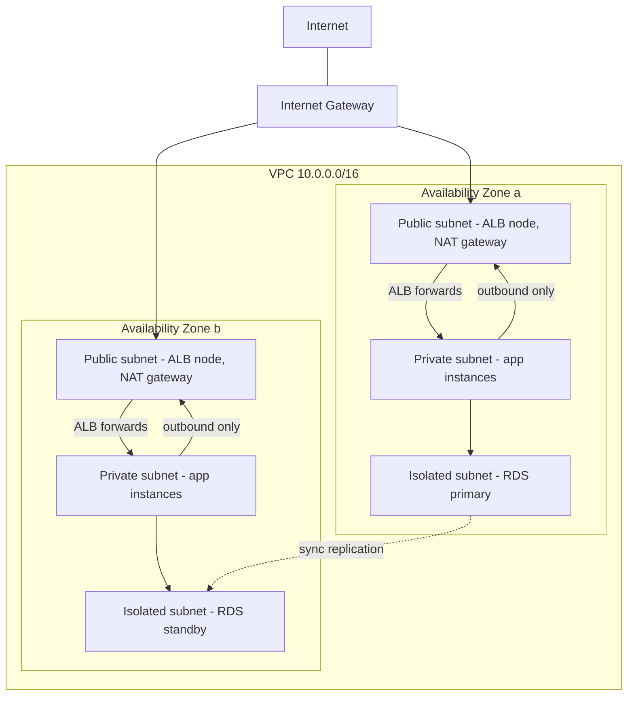
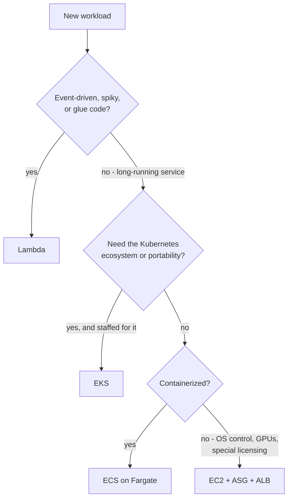
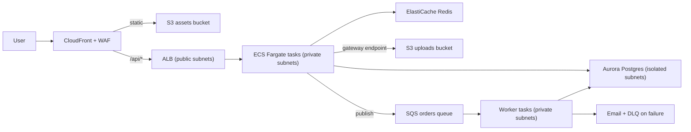

# AWS Fundamentals Study Guide

A from-scratch guide to Amazon Web Services for engineers who can build and deploy software but haven't worked seriously inside AWS. It assumes you know what a server, a network, and a database are — and nothing about what AWS calls them. This repo has long had guides that *assume* AWS fluency (the [Azure](AZURE_FOR_AWS_SOLUTIONS_ARCHITECT.md) and [GCP](GCP_FOR_AWS_SOLUTIONS_ARCHITECT.md) guides are both written *for AWS architects*); this is the guide that builds that fluency.

The organizing idea: **AWS is not a datacenter you rent — it is a programmable permission system wrapped around a software-defined network wrapped around two hundred services, and every single interaction with it is an authenticated, authorized, logged API call.** The console is just another API client. That's why this guide front-loads IAM and VPC before any compute or storage: they are the two layers *every* service sits inside, and once you can read an ARN, a policy document, and a VPC diagram, the service catalog stops being an intimidating wall of names and becomes legible — each service is "some infrastructure, an API in front of it, IAM deciding who may call it, and (usually) a VPC deciding what can reach it." The second through-line is that **the architecture diagram and the bill are the same diagram**: nearly every arrow you draw between components has a cost model attached, and the engineers who are good at AWS are the ones who can see both at once.

Primary references, all worth real time: the [AWS documentation](https://docs.aws.amazon.com/) — uneven but authoritative, and the per-service user guides are where the actual behavior lives; the [Well-Architected Framework](https://docs.aws.amazon.com/wellarchitected/latest/framework/welcome.html) — AWS's own statement of what good looks like, organized into pillars you'll see referenced everywhere; the [Amazon Builders' Library](https://aws.amazon.com/builders-library/) — Amazon's principal engineers writing about how AWS itself is built (timeouts, retries, shuffle sharding, cell-based architecture), the best free distributed-systems-in-practice reading anywhere; [*Amazon Web Services in Action*](https://www.manning.com/books/amazon-web-services-in-action-third-edition) (Wittig & Wittig) — the best book-length on-ramp; and the [Architecture Center](https://aws.amazon.com/architecture/) for reference architectures worth reading as worked examples.

Siblings in this repo go deeper on nearly every layer this guide touches: the [GCP](GCP_FOR_AWS_SOLUTIONS_ARCHITECT.md) and [Azure](AZURE_FOR_AWS_SOLUTIONS_ARCHITECT.md) guides (this guide is their prerequisite — read them after to become multi-cloud literate), the [Terraform guide](TERRAFORM_STUDY_GUIDE.md) (how real teams declare all of this as code), the [Kubernetes guide](k8s/KUBERNETES_STUDY_GUIDE.md) (what EKS manages for you), the [Distributed Systems guide](DISTRIBUTED_SYSTEMS_STUDY_GUIDE.md) (the replication and partitioning theory under Multi-AZ, read replicas, and DynamoDB), the [Advanced Postgres guide](ADVANCED_POSTGRES.md) (the engine inside RDS), the [Kafka guide](KAFKA_STUDY_GUIDE.md) (what MSK runs), and the [Redis guide](REDIS_STUDY_GUIDE.md) (what ElastiCache runs).

---

## Table of Contents

1. [Part 1 — The Lay of the Land](#part-1--the-lay-of-the-land)
2. [Part 2 — IAM: The Permission System Under Everything](#part-2--iam-the-permission-system-under-everything)
3. [Part 3 — VPC: The Network Under Everything Else](#part-3--vpc-the-network-under-everything-else)
4. [Part 4 — Compute: EC2, Lambda, and Containers](#part-4--compute-ec2-lambda-and-containers)
5. [Part 5 — Storage: S3 and the Block/File Tier](#part-5--storage-s3-and-the-blockfile-tier)
6. [Part 6 — Databases: RDS, Aurora, DynamoDB](#part-6--databases-rds-aurora-dynamodb)
7. [Part 7 — Messaging and Integration](#part-7--messaging-and-integration)
8. [Part 8 — Operating It: IaC, Observability, Cost, and Accounts](#part-8--operating-it-iac-observability-cost-and-accounts)
9. [Part 9 — The AI/ML Surface](#part-9--the-aiml-surface)
10. [Part 10 — Walkthrough: A Real Application, End to End](#part-10--walkthrough-a-real-application-end-to-end)

---

## Part 1 — The Lay of the Land

### Regions and Availability Zones: The Physical Truth

AWS is physically organized into **Regions** — isolated geographic areas like `us-east-1` (N. Virginia) or `eu-west-1` (Ireland) — and each Region contains multiple **Availability Zones (AZs)**: clusters of one or more datacenters with independent power, cooling, and networking, close enough for single-digit-millisecond links but far enough apart that a fire, flood, or power event in one shouldn't touch another. This two-level structure is the physical foundation of every availability promise in the platform, and it maps directly onto the [Distributed Systems guide](DISTRIBUTED_SYSTEMS_STUDY_GUIDE.md)'s replication story: **Multi-AZ is how you survive a datacenter failure** (synchronous-ish replication across AZs — the default unit of high-availability design), while **multi-Region is how you survive a regional disaster or serve distant users** (asynchronous, expensive, and a genuine engineering project rather than a checkbox).

Two practical notes newcomers learn the slow way. First, most resources are **Region-scoped** — an EC2 instance in `us-east-1` is invisible from the `eu-west-1` console view, and a surprising number of "where did my stuff go?" moments are just the Region selector in the top-right corner. Second, `us-east-1` is special: it's the oldest and largest Region, some global control planes live there (IAM is global but many global features anchor to it — CloudFront's TLS certificates must be issued in `us-east-1`, for example), and because so much of the internet runs there, its bad days make the news.

### Everything Is an API Call

The single most clarifying fact about AWS: the web console, the `aws` CLI, the SDKs, Terraform, and CloudFormation are all **clients of the same authenticated HTTPS APIs**. When you click "Launch instance" in the console, the browser calls `ec2:RunInstances` exactly as your script would. Three consequences follow. Anything you can click, you can automate — which is why infrastructure-as-code (Part 8) isn't a bolt-on but the natural way to use the platform. Every call is authorized by IAM (Part 2) — there is no side door. And every call is *recorded* by [CloudTrail](https://docs.aws.amazon.com/awscloudtrail/latest/userguide/cloudtrail-user-guide.html) (Part 8) — the audit log that answers "who deleted that bucket?" with an account, an identity, a source IP, and a timestamp.

Related vocabulary you'll meet constantly: the **control plane** (the APIs that create, configure, and delete resources) versus the **data plane** (the resource doing its actual job — the instance serving traffic, the bucket serving objects). They fail independently: during several famous outages, running instances kept serving (data plane fine) while nobody could launch or modify anything (control plane down). Architectures that only need the data plane during an incident — static failover, pre-provisioned capacity — ride out control-plane events that break "just scale up" plans.

### Accounts, ARNs, and the Shared Responsibility Line

An AWS **account** is the hard boundary: the container for resources, the unit of billing, and the blast-radius wall. Nothing inside one account can touch another account unless a policy on *both* sides explicitly allows it — which is why mature organizations run *many* accounts (prod, staging, dev, security tooling) under [AWS Organizations](https://docs.aws.amazon.com/organizations/latest/userguide/orgs_introduction.html) rather than one big shared one (Part 8).

Every resource has an **ARN** (Amazon Resource Name), and being able to read one fluently is basic literacy ([reference](https://docs.aws.amazon.com/IAM/latest/UserGuide/reference-arns.html)):

```text
arn:aws:s3:::my-bucket/reports/2026/q2.pdf
arn:aws:iam::123456789012:role/order-service-role
arn:aws:lambda:us-east-1:123456789012:function:resize-images
    │    │      │          │            │
    │    │      │          │            └─ resource (type + name/path)
    │    │      │          └─ account id
    │    │      └─ region (blank for global services like IAM and S3 bucket names)
    │    └─ service
    └─ partition (aws; aws-cn and aws-us-gov exist)
```

ARNs are what policies grant access *to*, what CloudTrail logs, and what services pass to each other — the universal name.

Finally, the [**shared responsibility model**](https://aws.amazon.com/compliance/shared-responsibility-model/): AWS is responsible for the security *of* the cloud (hardware, hypervisors, the datacenters), and you are responsible for security *in* the cloud (your IAM policies, your open security groups, your public buckets, your unpatched AMIs). Almost every headline "AWS breach" is a customer-side misconfiguration — which is good news, because it means the failure modes are in the layer you control, and Parts 2 and 3 teach exactly that layer.

### The Pricing Model: Why the Bill Is an Architecture Diagram

You pay for three broad things: **compute-time** (instance-hours, Lambda GB-seconds), **storage-months** (GB stored, per class), and **data transfer** — and the transfer rules shape architectures more than newcomers expect. The asymmetry to memorize: **traffic *into* AWS is free; traffic *out* to the internet costs real money** (on the order of $0.09/GB from most Regions), and even **traffic between AZs inside a Region is billed** (about a cent per GB, each direction). That's why chatty cross-AZ replication is a line item, why serving large media straight from EC2 is a mistake CloudFront exists to fix, and why "just ship all the data out to another cloud" surprises people at invoice time. Two smaller modern additions in the same spirit: every **public IPv4 address** now bills hourly (about $3.60/month each — idle Elastic IPs are no longer free mistakes), and the NAT gateway (Part 3) charges both hourly *and* per-GB processed. None of these numbers need memorizing precisely; the *shape* — egress and cross-AZ cost money, idle allocated things cost money — is the lesson. Set up a [budget alarm](https://docs.aws.amazon.com/cost-management/latest/userguide/what-is-costmanagement.html) before you create anything else; the [free tier](https://aws.amazon.com/free/) is generous enough for every exercise in this guide but has edges.

```quiz
Q: During a regional incident, running EC2 instances keep serving traffic but nobody can launch new ones or modify load balancers. What's happening?
- [ ] The Region's AZs have all failed simultaneously
- [x] The control plane (the create/configure/delete APIs) is impaired while the data plane (resources doing their jobs) keeps working
- [ ] IAM has revoked all credentials as a protective measure
- [ ] CloudTrail is blocking unaudited API calls
> Control plane and data plane fail independently, and this split is the classic signature. It's also an architecture lesson: designs that need control-plane actions mid-incident ("we'll scale up when it happens") fail exactly when static, pre-provisioned designs survive.

Q: Why do mature organizations run many AWS accounts instead of one big one?
- [ ] AWS limits the number of resources per account
- [ ] Each Region requires its own account
- [x] The account is the hard isolation and blast-radius boundary — nothing crosses it unless both sides explicitly allow it, so a compromise or runaway script in dev can't touch prod
- [ ] Multiple accounts qualify for volume discounts automatically
> Accounts are the strongest wall AWS offers — stronger than any IAM policy inside one account, because cross-account access requires explicit grants on both sides. Billing separation and per-environment guardrails (SCPs, Part 8) come along for free.

Q: Which of these data flows is free?
- [ ] An EC2 instance in us-east-1a sending 1 TB to an instance in us-east-1b
- [ ] Serving 1 TB of images from EC2 directly to internet users
- [x] Ingesting 1 TB of logs from your datacenter into S3
- [ ] An idle Elastic IP address sitting unattached for a month
> Ingress is free — AWS is happy to receive your data. Egress to the internet (~$0.09/GB), cross-AZ transfer (~$0.01/GB each way), and now even idle public IPv4 addresses all cost money. The bill and the architecture diagram are the same diagram.

Q: A teammate swears their EC2 instance vanished. What's the first thing to check?
- [x] The Region selector — most resources are Region-scoped and invisible from other Regions' views
- [ ] Whether CloudTrail deleted it for compliance
- [ ] Whether the instance's ARN expired
- [ ] Whether the AZ was decommissioned
> Region-scoping trips up every newcomer. ARNs don't expire, CloudTrail only records, and AZs don't silently take your instances with them — but the console showing eu-west-1 while your instance lives in us-east-1 produces exactly this panic.
```

---

## Part 2 — IAM: The Permission System Under Everything

If everything is an API call, then the system that decides whether a call is allowed is the platform's real foundation. That system is [**IAM**](https://docs.aws.amazon.com/IAM/latest/UserGuide/reference_policies_evaluation-logic.html) (Identity and Access Management), it is global (not per-Region), it is free, and it is involved in *every single request*. Most real-world AWS security incidents are IAM stories — an over-broad policy, a leaked long-lived key — so fluency here pays for itself faster than anywhere else.

### Principals: Users, Roles, and the Root User

A **principal** is an identity that can make API calls. The **root user** (the email you signed up with) can do absolutely everything including delete the account — secure it with MFA, use it only for the handful of tasks that require it, and never for daily work. **IAM users** are permanent identities with long-lived credentials; modern practice treats them as legacy for humans — people should come in through [IAM Identity Center](https://docs.aws.amazon.com/singlesignon/latest/userguide/what-is.html) (SSO with short-lived sessions) instead.

The load-bearing concept is the [**role**](https://docs.aws.amazon.com/IAM/latest/UserGuide/id_roles.html): an identity with permissions but **no permanent credentials**, that other principals *assume* to receive **temporary credentials** (via [STS](https://docs.aws.amazon.com/STS/latest/APIReference/welcome.html), the Security Token Service). Roles are how *everything* gets access: an EC2 instance gets a role through its instance profile, a Lambda function through its execution role, a Kubernetes pod on EKS through Pod Identity/IRSA, a CI pipeline through OIDC federation, an engineer in another account through cross-account AssumeRole. Same mechanism every time — **AssumeRole is the single most important verb in AWS** — and the credentials it mints expire in hours, which is why the alternative is an antipattern: a long-lived access key pasted into an environment variable or committed to a repo is the classic root cause of the "someone mined $50k of crypto in our account over the weekend" story. If code runs *on* AWS, it should get credentials from its role automatically (the SDKs do this without configuration); if it runs off AWS, federate.

### Policies and the Evaluation Logic

Permissions live in **policies** — JSON documents attached to identities (identity-based) or to resources like S3 buckets and SQS queues (resource-based). Roles additionally carry a **trust policy**: not what the role can do, but *who is allowed to assume it*. A least-privilege identity policy:

```json
{
  "Version": "2012-10-17",
  "Statement": [{
    "Effect": "Allow",
    "Action": ["s3:GetObject"],
    "Resource": "arn:aws:s3:::acme-reports/2026/*",
    "Condition": {"aws:SourceVpce": "vpce-0a1b2c3d"}
  }]
}
```

`Effect`, `Action`, `Resource`, and optional `Condition` — that's the whole grammar; everything else is vocabulary. The [evaluation logic](https://docs.aws.amazon.com/IAM/latest/UserGuide/reference_policies_evaluation-logic.html) has three rules worth engraving: **everything is denied by default**; a request is allowed only if *some* policy explicitly allows it; and **an explicit `Deny` anywhere overrides every `Allow`** — which is what makes organization-wide guardrails (SCPs, Part 8) trustworthy: no amount of Allow inside an account can climb over a Deny imposed above it. When access mysteriously fails, the debugging order is always: is there an Allow at all → is there a Deny anywhere → is a boundary (SCP, permissions boundary, session policy) narrowing things → for cross-account, do *both* sides allow it.

Least privilege in practice is less about heroic policy authorship than about habits: scope `Resource` to ARNs, not `*`; grant actions per service actually used; prefer AWS-managed policies only as a starting point; and read what CloudTrail says an identity *actually did* before widening anything. The mistake that recurs in postmortems is never the exotic one — it's `"Action": "*", "Resource": "*"` on something internet-reachable.

```quiz
Q: Why are roles preferred over IAM users with access keys for anything running on AWS?
- [ ] Roles evaluate policies faster than users
- [ ] Access keys can't be used from EC2 instances
- [x] Roles issue automatically-rotated temporary credentials via STS, so there's no long-lived secret to leak, commit, or forget to rotate
- [ ] Roles are free while IAM users are billed hourly
> The leaked long-lived access key is the single most common AWS breach vector. A role's credentials expire in hours and are delivered to the workload automatically (instance profile, execution role, Pod Identity) — there is simply nothing durable to steal from a repo or an env file.

Q: A request is covered by an Allow in the identity's policy and a Deny in an SCP above the account. What happens, and why does it matter?
- [ ] The Allow wins because identity policies are more specific
- [ ] The request is allowed but flagged in CloudTrail
- [x] The Deny wins — an explicit Deny anywhere overrides every Allow, which is exactly what makes org-wide guardrails trustworthy
- [ ] IAM asks the more privileged principal to arbitrate
> Deny-overrides-Allow is the rule that makes governance composable: a security team can impose "nobody deletes CloudTrail" or "no resources outside these Regions" at the organization level and know that no admin inside a member account can grant their way around it.

Q: What does a role's trust policy control?
- [ ] The maximum session duration of the role's credentials
- [x] Which principals are allowed to assume the role in the first place
- [ ] Which Regions the role's permissions apply in
- [ ] The set of actions the role may perform
> Permissions policies say what the role can do; the trust policy says who may become it. Cross-account access, CI OIDC federation, and service roles are all "edit the trust policy" problems — and an over-broad trust policy (e.g., trusting a whole account) is how confused-deputy holes open.

Q: Your Lambda function suddenly gets AccessDenied calling s3:GetObject on a bucket in another account, despite its execution role allowing s3:GetObject on that ARN. What's the most likely missing piece?
- [ ] The Lambda needs an IAM user instead of a role
- [ ] S3 requires MFA for cross-account reads
- [x] The bucket's resource-based policy must also allow the access — cross-account requires an explicit grant on both sides
- [ ] The function's trust policy doesn't trust S3
> Within one account, an identity-based Allow is enough. Across accounts, the resource side must independently agree via its bucket/queue/key policy. "Both sides must allow it" is the cross-account rule, and it's the account-as-blast-radius boundary from Part 1 doing its job.
```

---

## Part 3 — VPC: The Network Under Everything Else

IAM decides *who may call an API*; the [**VPC**](https://docs.aws.amazon.com/vpc/latest/userguide/what-is-amazon-vpc.html) (Virtual Private Cloud) decides *what can reach what over the network*. A VPC is a Region-scoped private network you define — a CIDR block like `10.0.0.0/16` — carved into **subnets**, each of which lives in exactly one AZ. That AZ-scoping is why the canonical setup has pairs (or triples) of every subnet tier: high availability means at least two AZs, which means at least two of each subnet.

### Public and Private Are Routes, Not Checkboxes

There is no "make subnet public" switch. A **public subnet** is just a subnet whose **route table** sends `0.0.0.0/0` (the default route) to an **Internet Gateway (IGW)**; instances there additionally need public IP addresses to be reachable. A **private subnet** has no route to the IGW — its instances can't be reached from the internet at all, and for *outbound* access (pulling packages, calling external APIs) they route through a [**NAT gateway**](https://docs.aws.amazon.com/vpc/latest/userguide/vpc-nat-gateway.html) sitting in a public subnet. Understanding that publicness is a *routing* property, not a flag, dissolves half of all VPC confusion.

The NAT gateway earns a special warning as the most notorious line item in small-company bills: it charges per-hour *and* per-GB processed, and one per AZ is the HA-correct (and cost-doubling) deployment. The standard mitigation is [**VPC endpoints**](https://docs.aws.amazon.com/vpc/latest/privatelink/what-is-privatelink.html): **gateway endpoints** for S3 and DynamoDB are *free* and keep that traffic off the NAT entirely (there is rarely a reason not to create them), while **interface endpoints** (PrivateLink) put a private network interface for other AWS services (or third-party services) directly into your subnets — hourly + per-GB, but traffic never leaves the AWS network and private-only workloads stop needing internet paths at all.



This three-tier, two-AZ layout — load balancer in public subnets, application in private, database in isolated subnets with no internet path in either direction — is the pattern behind most production VPCs, and it's the one Part 10 traces end to end.

### Security Groups and NACLs

The workhorse firewall is the [**security group**](https://docs.aws.amazon.com/vpc/latest/userguide/vpc-security-groups.html) (SG): attached to network interfaces (instances, load balancers, RDS, Lambda-in-VPC), **stateful** (a permitted inbound request's response is automatically allowed back out — no return rules needed), and allow-only (you can't write deny rules; anything not allowed is dropped). Its killer feature is that rules can reference *other security groups* instead of IP ranges: "the app SG allows :8080 **from the ALB's SG**; the database SG allows :5432 **from the app SG**." That chain expresses the architecture as intent, keeps working as instances churn, and is self-documenting in a way CIDR rules never are. **Network ACLs** are the other layer — subnet-level, **stateless** (return traffic needs its own rule), allow *and* deny — and in practice most teams leave them at default-allow and do everything with SGs, reaching for NACLs only for coarse subnet-level bans.

Beyond one VPC: **VPC peering** connects two VPCs point-to-point (non-transitive — with many VPCs the mesh explodes), and **Transit Gateway** is the hub-and-spoke answer at scale. File both as "know they exist"; the single-VPC patterns above are 90% of what application engineers touch.

```quiz
Q: What actually makes a subnet "public"?
- [ ] A public=true attribute set at subnet creation
- [ ] Being in the first availability zone of the Region
- [x] Its route table sends 0.0.0.0/0 to an Internet Gateway (and instances need public IPs to be reachable)
- [ ] Having a NAT gateway deployed in it
> Publicness is a routing property, not a flag. The same subnet becomes private by pointing its default route elsewhere. (A NAT gateway lives in a public subnet but exists to serve private ones.)

Q: Instances in a private subnet need to download OS updates. What's the standard path, and what's its cost profile?
- [ ] Attach public IPs temporarily during patch windows
- [x] Route outbound through a NAT gateway in a public subnet — which bills hourly plus per-GB, making it a notorious line item worth minimizing with free S3/DynamoDB gateway endpoints
- [ ] Open an inbound security-group rule for the package mirrors
- [ ] Use a Network ACL to permit outbound traffic
> NAT gives private instances outbound-only internet access. Because it meters every GB, teams route what they can around it: gateway endpoints for S3/DynamoDB are free and cover the biggest flows (packages, artifacts, logs to S3), and interface endpoints keep other AWS traffic private.

Q: Why is "allow :5432 from the app tier's security group" better than "allow :5432 from 10.0.2.0/24"?
- [ ] SG references evaluate faster than CIDR matches
- [x] It expresses intent and stays correct as instances churn — anything wearing the app SG is allowed, regardless of which IPs autoscaling hands out
- [ ] CIDR rules only work in public subnets
- [ ] SG references bypass the NAT gateway
> SG-to-SG references make the firewall mirror the architecture: ALB → app → DB as a chain of group references. IP-based rules rot the moment autoscaling replaces instances or subnets are resized.

Q: A security group allowed an inbound request on :443. What rule is needed for the response to get back out?
- [x] None — security groups are stateful, so return traffic for an allowed connection is automatically permitted
- [ ] An outbound rule for the client's IP and ephemeral port
- [ ] A matching Network ACL entry, since SGs delegate return traffic to NACLs
- [ ] An explicit outbound allow on :443
> Statefulness is the big SG/NACL difference: SGs track connections, NACLs don't (they're stateless and would need explicit ephemeral-port return rules). It's also why most teams do everything with SGs and leave NACLs at default.
```

---
## Part 4 — Compute: EC2, Lambda, and Containers

AWS offers a spectrum of compute, and the honest way to present it is as a trade of **control against operational burden**: EC2 gives you a machine, containers give you a packaging contract, Lambda gives you a function — and each step toward the managed end takes work off your plate by taking options out of your hands.

### EC2: The Machine

[**EC2**](https://docs.aws.amazon.com/AWSEC2/latest/UserGuide/instance-types.html) rents virtual machines. The [instance-type grammar](https://aws.amazon.com/ec2/instance-types/) is worth decoding once: in `m7g.large`, `m` is the family (m = general purpose, `c` = compute-heavy, `r` = memory-heavy, `t` = burstable — cheap but CPU-throttled after its credits run out, the source of many "why is my box slow" mysteries), `7` is the generation, `g` means Graviton (AWS's ARM chips — meaningfully cheaper per unit of performance, and the default choice in 2026 unless you have x86-only dependencies), and `large` is the size. GPU families (`p`, `g`) get their own treatment in Part 9. An instance boots from an **AMI** (the machine image), stores data on **EBS** (network-attached block storage that survives the instance — Part 5), and identifies itself to AWS through the **instance metadata service** — which must be used in its [IMDSv2](https://docs.aws.amazon.com/AWSEC2/latest/UserGuide/configuring-instance-metadata-service.html) session-token form: the v1 unauthenticated form is what let the Capital One SSRF attacker ask a proxy to fetch role credentials on their behalf, and that one breach is why v2 is now the default and v1 should be disabled everywhere.

Purchasing is its own dimension: **on-demand** (list price, no commitment), **Savings Plans / Reserved Instances** (commit to 1–3 years of baseline for ~30–60% off — buy these for steady-state load once you know it), and **Spot** (spare capacity at ~60–90% off that AWS can reclaim with two minutes' notice — ideal for stateless web tiers behind a load balancer, batch, and CI, and wrong for anything that can't die suddenly).

Single instances don't get you availability; **Auto Scaling Groups** ([ASGs](https://docs.aws.amazon.com/autoscaling/ec2/userguide/what-is-amazon-ec2-auto-scaling.html)) plus a [load balancer](https://docs.aws.amazon.com/elasticloadbalancing/latest/userguide/what-is-load-balancing.html) do. The ASG holds a launch template and a desired count, spreads instances across AZs, and replaces failures; the **ALB** (Application Load Balancer, L7 — path/host routing, TLS termination, the default) or **NLB** (Network Load Balancer, L4 — static IPs, extreme throughput, non-HTTP protocols) health-checks targets and routes traffic only to healthy ones. ASG + ALB across two AZs is the classic self-healing serving layer, and it's what "the machine died at 3 AM and nobody noticed until the morning standup" looks like when it goes *right*.

### Lambda: The Function

[**Lambda**](https://docs.aws.amazon.com/lambda/latest/dg/welcome.html) runs your code in response to events — an HTTP request via API Gateway or a function URL, an S3 object landing, an SQS message, a schedule — with no servers to manage, scaling from zero to thousands of concurrent executions automatically, billed per-millisecond of execution (memory allocation from 128 MB to 10 GB scales CPU proportionally; 15-minute maximum runtime). The honest trade-offs: **cold starts** (a new execution environment takes ~100 ms to a few seconds to initialize, which matters for latency-sensitive endpoints and has real mitigations — lighter runtimes, provisioned concurrency — but never fully disappears), per-invocation costs that cross over above steadily-high traffic (a busy service on Fargate or EC2 becomes cheaper than the same load on Lambda), and an execution model that rewards short, stateless, event-shaped work. Where Lambda is unbeatable: spiky or unpredictable load, glue between services (the S3-upload-triggers-thumbnail pipeline), and low-traffic endpoints where paying for an idle server is the real waste.

### Containers: ECS and EKS

For long-running services, containers are the mainstream packaging, and AWS has two orchestrators. [**ECS**](https://docs.aws.amazon.com/AmazonECS/latest/developerguide/Welcome.html) (Elastic Container Service) is AWS-native and deliberately simple: task definitions, services, and deep IAM/ALB/CloudWatch integration, with **Fargate** as the serverless capacity mode — you say "run 4 copies of this container with 2 vCPU each" and never see a host. [**EKS**](https://docs.aws.amazon.com/eks/latest/userguide/what-is-eks.html) is managed **Kubernetes** — the entire ecosystem the [Kubernetes guide](k8s/KUBERNETES_STUDY_GUIDE.md) covers, with AWS running the control plane. The decision is organizational as much as technical: choose **ECS + Fargate** when you want containers with minimal platform investment and all-in AWS integration; choose **EKS** when you need the Kubernetes ecosystem (operators, Helm charts, portability, an existing platform team) and are prepared to operate it — Kubernetes expertise is a real ongoing cost that "managed control plane" does not eliminate.



Like every decision tree, this one encodes defaults, not laws — but deviating from it should come with a reason you can say out loud.

```quiz
Q: Your t-family instance performs fine for an hour after boot, then throughput collapses. What's the likely cause?
- [ ] The instance store filled up
- [x] Burstable instances accumulate and spend CPU credits — sustained load exhausts them and the instance is throttled to baseline
- [ ] EBS volumes detach under sustained load
- [ ] The AZ is rebalancing capacity
> The t-family is cheap precisely because it assumes bursty usage. Sustained-CPU workloads on t-instances hit the credit wall and crawl — the fix is an m/c family instance (or unlimited-burst mode, which quietly bills you the difference).

Q: Why was IMDSv2 made the default, with v1 disabled as hardening guidance?
- [ ] v1 leaked instance pricing information
- [x] v1 answered unauthenticated GET requests, so any SSRF that could make the instance fetch a URL could steal the instance role's credentials — the Capital One breach mechanism
- [ ] v2 delivers credentials faster at boot
- [ ] v1 only supported x86 instances
> IMDSv2 requires a session token obtained via PUT with a hop-limit header — precisely the request shapes an SSRF proxy typically can't be tricked into making. One config setting, one entire breach class removed.

Q: Which workload is the right fit for Spot instances?
- [ ] The RDS database backing checkout
- [ ] A stateful WebSocket server holding long-lived connections
- [x] The stateless web tier behind an ALB, sized so losing instances on two minutes' notice just shifts traffic
- [ ] The NAT gateway
> Spot's 60–90% discount is compensation for reclaimability. Anything that dies gracefully behind a load balancer or checkpoint-restarts (batch, CI) collects the discount; anything whose sudden death users notice should not.

Q: Traffic to your API is steady at hundreds of requests per second all day. Why might Lambda be the wrong compute choice?
- [ ] Lambda can't sustain that request rate
- [ ] Lambda functions can't call databases
- [x] Per-invocation pricing crosses over at steady high volume — always-on containers or instances serve the same load cheaper, and Lambda's strengths (scale-to-zero, spike absorption) are wasted on flat traffic
- [ ] API Gateway caps requests per account at 100/s
> Lambda's economics shine when load is spiky or low (you pay only for use); flat heavy traffic is exactly the profile where provisioned capacity wins. The scaling ceiling and database access are red herrings — it's a cost-shape question.
```

---

## Part 5 — Storage: S3 and the Block/File Tier

### S3: The Center of Gravity

[**S3**](https://docs.aws.amazon.com/AmazonS3/latest/userguide/Welcome.html) (Simple Storage Service) is an object store: you PUT and GET whole **objects** by **key** inside **buckets** (whose names are globally unique). It is not a filesystem — the "folders" in the console are a fiction over key prefixes like `reports/2026/` — and that's a feature: no directory semantics means nothing stops it scaling to trillions of objects. S3 is designed for **eleven nines of durability** (data is redundantly stored across at least three AZs), offers **strong read-after-write consistency** (since 2020 — older tutorials warning about eventual consistency are out of date), encrypts everything at rest by default, and blocks public access by default on new buckets (the misconfigured-public-bucket era of breach headlines was bad enough that AWS changed the defaults). It has quietly become the platform's integration hub: build artifacts, log archives, data lakes, static websites, ML training sets — and its **event notifications** (object created → trigger Lambda / queue to SQS) make it a pipeline *source*, not just a sink.

Day-to-day patterns worth knowing by name: **presigned URLs** (your backend mints a time-limited URL so a client can upload or download directly to/from S3 — the standard way to keep large file traffic off your servers), **versioning** (keep every version of every object — the undo button for deletes and overwrites, and the substrate ransomware protection builds on), and **lifecycle rules** (automatically transition or expire objects by age).

Cost is managed through [**storage classes**](https://docs.aws.amazon.com/AmazonS3/latest/userguide/storage-class-intro.html): Standard for hot data; Standard-IA (infrequent access — cheaper storage, per-GB retrieval fee); the Glacier tiers for archives (Instant Retrieval through Deep Archive, the latter ~$1/TB-month with hours-long restores); and **Intelligent-Tiering**, which watches access patterns and moves objects automatically for a tiny monitoring fee — the honest default when you can't predict access. The trap in class-picking is the retrieval fees and minimum storage durations: put frequently-read data in IA and the retrieval fees exceed the savings.

### EBS, EFS, and Instance Store

The block/file tier is a fast decision once framed: [**EBS**](https://docs.aws.amazon.com/ebs/latest/userguide/what-is-ebs.html) is the network-attached block device under an EC2 instance (gp3 is the general-purpose default; volumes are AZ-locked, survive instance termination if you tell them to, and snapshot to S3), **EFS** is a shared NFS filesystem many instances can mount at once (pay several times EBS's per-GB rate for the shared-POSIX semantics — worth it only when you actually need them), and **instance store** is NVMe physically attached to the host: the fastest and the most ephemeral — everything on it vanishes when the instance stops, which makes it a cache/scratch tier, never a system of record.

```quiz
Q: Users upload multi-GB video files. Why route them via presigned URLs instead of through your API servers?
- [ ] S3 rejects uploads that arrive through EC2
- [x] The client uploads directly to S3 with a time-limited signed URL, so your servers never carry the bytes — no proxy fleet sized for peak upload throughput, no double transfer
- [ ] Presigned URLs compress the video in flight
- [ ] It's the only way to trigger S3 event notifications
> The backend authorizes (mints the URL, scoped to one key and a short expiry); S3 does the heavy lifting. Your API tier stays sized for API calls, and the upload path inherits S3's availability instead of yours.

Q: A team puts frequently-accessed thumbnails in Standard-IA to save money. What happens to the bill?
- [ ] Nothing — IA is strictly cheaper than Standard
- [x] It likely goes up: IA charges per-GB retrieval fees (plus a 30-day minimum), so hot data in a cold class pays the discount back with interest
- [ ] S3 automatically moves the objects back to Standard
- [ ] The thumbnails become eventually consistent
> Storage classes trade storage price against access price. IA and Glacier only save money on data you rarely touch; Intelligent-Tiering exists precisely because teams are bad at predicting which is which.

Q: Which storage should hold a database's data files if the instance may be replaced, and which should hold its temp/scratch space?
- [ ] EFS for data, EBS for scratch
- [x] EBS for data (persists independently of the instance, snapshots to S3), instance store for scratch (fastest, but vanishes with the instance)
- [ ] Instance store for data, EFS for scratch
- [ ] S3 for data files mounted directly
> EBS is the durable block device that outlives its instance; instance store is physically-attached ephemeral NVMe — phenomenal for temp files and caches, catastrophic as a system of record. (S3 isn't a block device; databases can't run on it directly.)

Q: An old tutorial tells you to add retry-until-visible logic after S3 PUTs because of eventual consistency. What's the current reality?
- [ ] Still required for overwrites, not for new objects
- [ ] Required only in us-east-1
- [x] Outdated — S3 has offered strong read-after-write consistency for all objects since 2020
- [ ] Consistency depends on the storage class
> S3 went strongly consistent in late 2020, ending the list-after-write and read-after-overwrite caveats. It's a good reminder that AWS tutorials age: the docs, not blog posts, are the source of truth for current behavior.
```

---

## Part 6 — Databases: RDS, Aurora, DynamoDB

### RDS and Aurora: Managed Relational

[**RDS**](https://docs.aws.amazon.com/AmazonRDS/latest/UserGuide/Welcome.html) runs the relational engines you already know — PostgreSQL, MySQL, MariaDB, and friends — and manages the undifferentiated toil: provisioning, patching, automated backups with **point-in-time recovery**, and failover. Be precise about what it does *not* manage: your schema, your queries, your indexes, and your vacuum behavior are still yours — everything in the [Advanced Postgres guide](ADVANCED_POSTGRES.md) applies unchanged inside RDS; you've outsourced the janitor, not the architect.

Two replication features get conflated constantly, and the [Distributed Systems guide](DISTRIBUTED_SYSTEMS_STUDY_GUIDE.md)'s Part 3 is the theory behind the distinction. **Multi-AZ** is *availability*: a synchronously-replicated standby in another AZ that serves no traffic and exists only to take over (typically within a minute or two) when the primary or its AZ fails. **Read replicas** are *scale*: asynchronous copies that serve read traffic — and because they're async, they lag, which resurrects every stale-read anomaly (read-your-own-writes, monotonic reads) that guide catalogs. Multi-AZ does not add read capacity; replicas do not give you zero-data-loss failover. Production wants both, for different reasons.

[**Aurora**](https://docs.aws.amazon.com/AmazonRDS/latest/AuroraUserGuide/CHAP_AuroraOverview.html) is AWS's cloud-native re-architecture of MySQL/Postgres compatibility: the storage layer is disaggregated into a shared, self-healing volume replicated **six ways across three AZs**, compute nodes attach to it, replicas share the same storage (so replica lag is milliseconds, not seconds), failover is faster, and **Aurora Serverless v2** scales capacity up and down automatically. It costs more per unit than plain RDS; the operational properties are why it's become the default answer for serious relational workloads on AWS.

### DynamoDB: Partitioning as a Product

[**DynamoDB**](https://docs.aws.amazon.com/amazondynamodb/latest/developerguide/Introduction.html) is the [Distributed Systems guide](DISTRIBUTED_SYSTEMS_STUDY_GUIDE.md)'s Part 5 shipped as a service: a key-value/document store that hashes the **partition key** to spread data across partitions, delivering single-digit-millisecond reads at any scale — *provided you design for it*. The discipline is inverted from relational practice: you enumerate your **access patterns first** and design keys to serve them, because you can only query efficiently by key (plus **GSIs** — global secondary indexes — for alternate patterns; each is effectively another copy of the data with its own key). [Partition-key design](https://docs.aws.amazon.com/amazondynamodb/latest/developerguide/bp-partition-key-design.html) is destiny: a low-cardinality or celebrity-skewed key concentrates traffic on one partition and throttles exactly like the hot-key problem the DS guide describes. Capacity comes in **on-demand** (pay per request — the right default until your traffic is high and predictable) or **provisioned** modes; **DynamoDB Streams** emit an ordered change feed per item (the outbox/CDC enabler); and the folklore around **single-table design** is real but advanced — start by getting the key design right for your actual access patterns. Choose DynamoDB when the access patterns are known and key-shaped and you want zero database operations at any scale; choose relational when you need ad-hoc queries, joins, and transactions across arbitrary rows — porting a relational schema to DynamoDB table-per-entity is the canonical way to get the worst of both.

[**ElastiCache**](https://docs.aws.amazon.com/AmazonElastiCache/latest/dg/WhatIs.html) rounds out the tier: managed Redis/Valkey (and Memcached) for the caching, session, and rate-limiting patterns the [Redis guide](REDIS_STUDY_GUIDE.md) covers — same engine, same semantics, minus the server babysitting.

```quiz
Q: Your RDS Multi-AZ deployment is at 90% read capacity. Will enabling Multi-AZ on a bigger standby help?
- [ ] Yes — the standby serves reads once promoted
- [x] No — the Multi-AZ standby serves no traffic at all; it exists purely for failover. Read scaling is what read replicas are for
- [ ] Yes, if the standby is in the same AZ
- [ ] Only for Aurora, not RDS
> Multi-AZ is availability (synchronous, idle standby, fast failover); read replicas are scale (asynchronous, serving reads, lagging). Conflating them is the classic RDS design error — production usually wants both, for different reasons.

Q: Reads from an RDS read replica occasionally return data that's seconds old, confusing users who just wrote it. Why, and where's the full treatment of this problem?
- [ ] The replica's cache is misconfigured
- [x] Replicas replicate asynchronously, so they lag the primary — this is the read-your-own-writes anomaly, covered in the Distributed Systems guide's replication part
- [ ] Multi-AZ failover rolled back the write
- [ ] RDS batches writes every 5 seconds
> Async replication trades freshness for primary-write latency. The fixes are session guarantees: route a user's reads to the primary briefly after their writes, or only to replicas known to have caught up.

Q: A DynamoDB table keyed on `status` (values: active/pending/done) starts throttling under load despite plenty of provisioned capacity. What's wrong?
- [ ] GSIs are missing
- [ ] On-demand mode is required above 1000 RPS
- [x] Three partition-key values means all traffic lands on a handful of partitions — a textbook hot-partition design; the key needs high cardinality that spreads load
- [ ] DynamoDB Streams is consuming the capacity
> The partition key is hashed to place data; capacity is per-partition. Low-cardinality keys concentrate everything, and no amount of table-level capacity fixes a key-design problem — exactly the hot-key lesson from the Distributed Systems guide's partitioning part.

Q: When is DynamoDB the wrong choice from day one?
- [ ] When traffic might reach millions of requests per second
- [ ] When items are small JSON documents
- [x] When the workload needs ad-hoc queries, joins, and cross-entity transactions whose shapes you can't enumerate in advance
- [ ] When you need change-data-capture
> DynamoDB rewards enumerable, key-shaped access patterns with effortless scale; it punishes exploratory querying (that's what SQL is for). Scale is its strength, streams provide CDC — the deal-breaker is unenumerable access patterns.
```

---

## Part 7 — Messaging and Integration

Every pattern in this Part is the [Distributed Systems guide](DISTRIBUTED_SYSTEMS_STUDY_GUIDE.md)'s Part 7–8 material — at-least-once delivery, idempotent consumers, the queue-vs-log distinction — sold as a service, and knowing that theory turns these products from a catalog into a menu.

### SQS: The Queue

[**SQS**](https://docs.aws.amazon.com/AWSSimpleQueueService/latest/SQSDeveloperGuide/welcome.html) is the work queue: producers send messages, competing consumers receive them, each message is processed once-ish and deleted. Its core mechanic is the **visibility timeout**: receiving a message doesn't delete it, it *hides* it — if the consumer finishes and deletes it, done; if the consumer crashes, the message reappears for another consumer after the timeout. That's **at-least-once delivery** implemented before your eyes, and it carries the standard corollary: a message can be delivered twice (consumer succeeded but crashed before deleting), so **consumers must be idempotent** — no exceptions, and the DS guide's Part 7 explains why no queue can relieve you of this. A **dead-letter queue** catches messages that fail repeatedly (poison messages) instead of letting them recirculate forever. **FIFO queues** add strict ordering and deduplication within a *message group* at a throughput cost — reach for them only when ordering is a genuine requirement, not a comfort.

### SNS, EventBridge, and Step Functions

[**SNS**](https://docs.aws.amazon.com/sns/latest/dg/welcome.html) is pub/sub fan-out: one published message, pushed to many subscribers. The canonical pairing is **SNS → multiple SQS queues** — the "one event, several independent consumers, each with their own queue, retries, and DLQ" pattern. [**EventBridge**](https://docs.aws.amazon.com/eventbridge/latest/userguide/eb-what-is.html) is the evolution: an event *bus* with content-based **rules** (match on any field of the JSON event, route to any of dozens of target types), native event sources from AWS services and SaaS vendors, plus scheduling. For new event-routing designs it's the default choice; SNS remains right for high-fan-out pub/sub and mobile push. [**Step Functions**](https://docs.aws.amazon.com/step-functions/latest/dg/welcome.html) is the managed state machine for multi-step workflows — retries, branching, human-approval waits, compensation on failure — i.e., the **saga pattern** from the DS guide with the coordinator's durability outsourced to AWS. If you find yourself persisting workflow state in a database and writing a poller, you're rebuilding it — and the [Durable Execution guide](DURABLE_EXECUTION_STUDY_GUIDE.md) covers this whole product category, Step Functions included, in depth.

### Streams: Kinesis and MSK

For the *log* shape — ordered, replayable, many independent consumers — AWS offers [**Kinesis Data Streams**](https://docs.aws.amazon.com/streams/latest/dev/introduction.html) (serverless-ish, shard-based, deeply integrated with Lambda) and [**MSK**](https://docs.aws.amazon.com/msk/latest/developerguide/what-is-msk.html), which is managed **Apache Kafka** — the actual thing the [Kafka guide](KAFKA_STUDY_GUIDE.md) teaches, protocol and ecosystem included. The decision: Kinesis when you want minimum operations and you're all-in on AWS; MSK when you need Kafka's ecosystem (Connect, Streams, exactly-once transactions, existing tooling) or portability. And the prior question — queue or log? — is the DS guide's: *handled once by some worker* → SQS; *replayable history consumed independently by many* → a stream.

```quiz
Q: An SQS consumer processes a message successfully but crashes before deleting it. What happens, and what does it demand of your code?
- [ ] The message is lost — SQS assumes success on delivery
- [x] After the visibility timeout it's redelivered to another consumer, so the work happens twice — which is why consumers must be idempotent
- [ ] SQS detects the crash and marks the message done
- [ ] The message moves to the dead-letter queue immediately
> The visibility timeout hides, not deletes — deletion is the consumer's explicit acknowledgment. Crash-after-success is indistinguishable from crash-before-success (the Two Generals lesson), so at-least-once plus idempotent processing is the contract.

Q: One "order placed" event must independently drive email, analytics, and fulfillment, each with its own retries. What's the canonical wiring?
- [ ] One SQS queue with three consumers sharing it
- [ ] Three Lambda functions polling the orders table
- [x] Publish once to SNS (or EventBridge), fan out to three SQS queues, one per consumer — each gets its own copy, pace, retries, and DLQ
- [ ] A FIFO queue with three message groups
> Competing consumers on one queue would split the messages (each event handled by only one of the three). Fan-out to per-consumer queues is the standard shape: pub/sub for distribution, queues for each consumer's reliability mechanics.

Q: You're writing a service that saves multi-step workflow state to a database and polls to resume failed steps, with compensation logic for partial failures. What should give you pause?
- [ ] Databases can't store workflow state
- [x] You're hand-rolling what Step Functions provides as a managed service — a durable state machine with retries, branching, and compensation (the saga pattern)
- [ ] Polling is forbidden by the Well-Architected Framework
- [ ] This only works with FIFO queues
> Sagas need a durable coordinator, and building one is subtle (crash-recovery, timeouts, exactly-once transitions). Step Functions is that coordinator as a product; the DIY version is justified mainly by portability requirements or cost at extreme scale.

Q: When does MSK earn its operational weight over Kinesis?
- [ ] When you need any form of streaming at all
- [x] When you need Kafka's protocol and ecosystem — Connect, Streams, transactions, existing consumers — or portability off AWS
- [ ] When throughput exceeds one shard's capacity
- [ ] When events must trigger Lambda functions
> Kinesis covers the generic ordered-replayable-stream need with far less to operate. MSK is real Kafka: choose it for the ecosystem and portability, per the Kafka guide — not because "Kafka" is the more famous word.
```

---
## Part 8 — Operating It: IaC, Observability, Cost, and Accounts

### Infrastructure as Code

Because everything is an API, the natural way to define infrastructure is code, and clicking the console for anything durable is the antipattern (unreproducible, unreviewable, undocumented). The native option is [**CloudFormation**](https://docs.aws.amazon.com/AWSCloudFormation/latest/UserGuide/Welcome.html) — declarative templates whose state AWS itself tracks as *stacks* — and the [**CDK**](https://docs.aws.amazon.com/cdk/v2/guide/home.html) layers real programming languages (TypeScript, Python) on top, synthesizing CloudFormation underneath. The third player is **Terraform/OpenTofu**, which the [Terraform guide](TERRAFORM_STUDY_GUIDE.md) covers in depth and which most multi-cloud or platform-minded teams choose. The honest summary: CDK if you're all-in on AWS and want to express infrastructure in a language your team already writes; Terraform for multi-cloud, a larger ecosystem, and the plan/apply discipline that guide teaches; raw CloudFormation mostly when a vendor or StackSets requires it. Any of the three beats the console; pick one and put *everything* in it.

### CloudWatch and CloudTrail

[**CloudWatch**](https://docs.aws.amazon.com/AmazonCloudWatch/latest/monitoring/WhatIsCloudWatch.html) is the built-in telemetry plane: **metrics** from every service (plus your custom ones), **Logs** (log groups with a queryable Insights syntax), **alarms** (metric threshold → SNS/autoscaling action), and dashboards. It's the floor, not the ceiling — the [Observability guide](OBSERVABILITY_STUDY_GUIDE.md)'s discipline (SLOs, burn rates, tracing via X-Ray or OpenTelemetry) applies on top — but every AWS incident response starts and usually ends in CloudWatch. [**CloudTrail**](https://docs.aws.amazon.com/awscloudtrail/latest/userguide/cloudtrail-user-guide.html) is the other half of Part 1's "everything is an API call": the durable record of *every* control-plane call — who, what, when, from where. Turn on an organization-wide trail to S3 on day one; it's the difference between "someone deleted the bucket" and "*this role, assumed by this principal, from this IP, at 02:13*".

### Cost as an Operational Discipline

The bill deserves the same monitoring rigor as latency. The mechanics: **tag everything** (`team`, `service`, `env`) so Cost Explorer can attribute spend; set **budgets with alerts** at thresholds you'd actually act on; review the top-ten line items monthly. The recurring traps have appeared throughout this guide, so here is the rogues' gallery in one place: **NAT gateway data processing** (fix: gateway endpoints, Part 3), **cross-AZ chatter** (Part 1), **internet egress** (put CloudFront in front of anything serving bytes at volume), **idle capacity** (dev instances running weekends, over-provisioned RDS), **unattached EBS volumes and forgotten snapshots**, **public IPv4 addresses** ($3.60/month each, silently multiplied by fleet size), and **retrieval fees from mis-tiered S3 classes** (Part 5). None is individually dramatic; together they're routinely 30–50% of a first serious bill audit.

### Many Accounts, One Organization

Part 1 called the account the blast-radius boundary; [**Organizations**](https://docs.aws.amazon.com/organizations/latest/userguide/orgs_introduction.html) is how you get the benefits without administrative chaos: consolidated billing, account factories, and — the governance keystone — **Service Control Policies (SCPs)**: organization-level policies that *cap* what any identity in a member account can ever do, including that account's administrators. "Nobody outside `eu-*` Regions," "nobody disables CloudTrail," "no root-user API calls" — written once, enforced everywhere, unbeatable from below because of IAM's deny-overrides-allow rule (Part 2). The standard starting topology (a management account that runs nothing, separate prod/staging/dev/security accounts) is what AWS packages as a *landing zone* via Control Tower. Even a solo developer benefits from prod/dev separation; it's two accounts, not twenty.

The [**Well-Architected Framework**](https://docs.aws.amazon.com/wellarchitected/latest/framework/welcome.html) ties the operating discipline together — six pillars (operational excellence, security, reliability, performance efficiency, cost optimization, sustainability) with per-pillar review questions. Treat it as a structured self-audit vocabulary, not a certification scripture.

```quiz
Q: Why does an SCP beat any permissions an admin grants themselves inside a member account?
- [ ] SCPs are evaluated before authentication
- [x] SCPs cap the maximum available permissions for the whole account, and IAM's explicit-deny-overrides-allow evaluation means nothing granted inside can exceed the cap
- [ ] SCPs rotate the account's credentials
- [ ] Member accounts have no IAM administrators
> An SCP isn't a grant, it's a ceiling. Combined with deny-overrides-allow (Part 2), it makes organization-level guardrails — protected Regions, untouchable audit trails — enforceable against even a fully-privileged insider in the member account.

Q: What's the day-one observability/audit baseline for any real account?
- [ ] X-Ray tracing on every Lambda
- [x] An organization-wide CloudTrail to S3, budget alarms, and CloudWatch alarms on the handful of metrics you'd page on
- [ ] A third-party SIEM
- [ ] Detailed monitoring on every EC2 instance
> CloudTrail answers "who did what" forensically (and can't be reconstructed after the fact if it wasn't on); budget alarms catch runaway spend; a few alarms catch outages. Everything else is refinement — this trio is the floor.

Q: Your first serious cost audit finds 40% waste. Based on the recurring traps, where did it most likely hide?
- [ ] Reserved Instance overcommitment
- [x] NAT data processing, idle/over-provisioned capacity, unattached EBS and old snapshots, per-hour public IPv4s, and egress that should be behind CloudFront
- [ ] CloudWatch Logs ingestion
- [ ] IAM per-role charges
> The classic waste is boring: metered traffic paths nobody routed around and allocated-but-idle resources nobody deleted. (IAM is free, and RI overcommitment is real but rarer than the idle-and-metered graveyard.)

Q: The team asks why they can't just keep click-building in the console since "it works." What's the substantive answer?
- [ ] The console is rate-limited for large accounts
- [x] Console changes are unreproducible, unreviewable, and undocumented — IaC makes environments rebuildable, changes diffable in review, and drift detectable
- [ ] AWS charges more for console-created resources
- [ ] The console can't create VPCs
> The console calls the same APIs, so nothing stops you — until you need a second environment, an audit, or a rollback. IaC (CloudFormation/CDK/Terraform) turns infrastructure into the thing your team already knows how to review: code.
```

---

## Part 9 — The AI/ML Surface

A growing share of AWS spend is AI workloads, and the surface splits into three layers by how much of the stack you want to own.

**Rent the model (Bedrock).** [**Bedrock**](https://docs.aws.amazon.com/bedrock/latest/userguide/what-is-bedrock.html) is serverless API access to foundation models — Anthropic's Claude among them — inside your AWS boundary: calls authorized by IAM, reachable over PrivateLink from private subnets, logged like any other API, billed per token. Around the raw invoke APIs it layers managed RAG (Knowledge Bases), guardrails, and agent tooling. Its pitch versus calling a model vendor's API directly is *governance and locality*, not capability: one bill, one IAM story, data that never leaves your VPC path. (For what to *build* with these APIs, the [LLM App Development](LLM_APP_DEV_STUDY_GUIDE.md) and [AI Agents](AI_AGENTS_STUDY_GUIDE.md) guides take over from here.)

**Rent the platform (SageMaker).** [**SageMaker**](https://docs.aws.amazon.com/sagemaker/latest/dg/whatis.html) is the ML platform — notebooks, training jobs, model registry, hosted endpoints. The honest framing: it's for teams doing real ML engineering (training or fine-tuning their own models, managing model lifecycles), and it's heavyweight for teams who just need inference — who are better served by Bedrock or by an API vendor.

**Rent the metal (GPU instances).** The `p` family (currently Blackwell-generation at the top) is training/frontier-inference iron — expensive, and chronically capacity-constrained enough that AWS sells reservations (Capacity Blocks); the `g` family is the cost-effective inference and graphics tier; **Trainium/Inferentia** are AWS's own accelerators, meaningfully cheaper *if* your stack supports them. Self-hosting open-weight models on these (with vLLM and friends) is the third layer: maximum control and, at sustained high utilization, the best unit economics — at the cost of owning everything the [CUDA guide](CUDA_STUDY_GUIDE.md) describes plus capacity planning. The honest decision rule: **API vendor for velocity and frontier models → Bedrock when governance/data-locality demands AWS-internal → self-hosted GPUs when utilization is high and steady enough that owning the serving stack pays.** Utilization is the whole game: a GPU instance is billed per hour whether it serves one request or saturates, so the crossover against per-token pricing arrives only with genuinely steady load.

```quiz
Q: What is Bedrock's actual value proposition versus calling a model vendor's API directly?
- [ ] Access to models unavailable anywhere else
- [ ] Lower per-token prices than any vendor API
- [x] Governance and locality — IAM authorization, PrivateLink from private subnets, CloudTrail logging, one AWS bill, data staying inside your cloud boundary
- [ ] Automatic fine-tuning of every model on your data
> Bedrock's pitch is that model calls become ordinary AWS API calls, inheriting the whole Part 2/Part 3/Part 8 apparatus. Capability and price parity vary by model; the differentiators are enterprise plumbing.

Q: When does self-hosting an open-weight model on GPU instances beat per-token APIs economically?
- [ ] Immediately — owned GPUs are always cheaper
- [ ] Never — APIs always win on price
- [x] At sustained high utilization: the instance bills hourly regardless of load, so steady traffic amortizes it below per-token pricing while spiky/low traffic makes it a money pit
- [ ] Only when using Trainium
> Per-hour metal versus per-token API is a utilization crossover. The hidden costs on the self-hosted side — the serving stack, capacity planning, the CUDA-guide expertise — push the true crossover higher than the naive math suggests.

Q: A product team needs to add LLM summarization to their app. When is SageMaker the wrong tool?
- [x] When they need inference on an existing model — Bedrock or a vendor API delivers that without owning notebooks, training infra, and endpoint management
- [ ] When the model must run in AWS
- [ ] When traffic exceeds one endpoint's capacity
- [ ] When the team writes Python
> SageMaker is the platform for teams doing ML engineering — training, fine-tuning, model lifecycle. "Call a good model" is a lighter-weight problem, and reaching for the ML platform to solve it is accidental complexity.
```

---

## Part 10 — Walkthrough: A Real Application, End to End

The capstone: trace one request through the standard three-tier architecture, naming the IAM role and security group at every hop — because being able to narrate this diagram *is* AWS fluency, and every part of this guide appears in it.

The application: a web store. Static assets and the SPA ship from S3 via CloudFront; the API runs as containers on ECS Fargate in private subnets behind an ALB; state lives in Aurora Postgres and ElastiCache; uploads land in S3; order processing happens asynchronously via SQS workers.



**The request path, hop by hop.** (1) DNS resolves through Route 53 to **CloudFront**, which serves cached static assets from the S3 bucket — via Origin Access Control, so the bucket stays private and *only* CloudFront can read it — and forwards `/api/*` to the ALB, with WAF rules screening requests at the edge. (2) The **ALB** lives in the two public subnets; its security group admits :443 from the internet (in practice, locked to CloudFront). It terminates TLS (certificate from ACM) and forwards to healthy targets. (3) The **ECS tasks** run in private subnets — no public IPs, unreachable from the internet by routing, and their SG admits :8080 *only from the ALB's SG* (Part 3's chain-of-groups idiom). Each task runs with a **task role** granting exactly its needs: `sqs:SendMessage` on the orders queue ARN, `s3:PutObject` on the uploads prefix, Secrets Manager read for the DB credential — no keys anywhere, temporary credentials throughout (Part 2). (4) **Aurora** sits in isolated subnets (no internet route in either direction), SG admitting :5432 only from the app and worker SGs, Multi-AZ with a reader endpoint; **ElastiCache** same posture. (5) An order placed means: write to Aurora, publish to **SQS**, return — the slow work (payment capture, email, fulfillment kickoff) happens in **worker** tasks that poll the queue, are idempotent because at-least-once delivery guarantees eventual duplicates (Part 7), and dead-letter poison messages after three failures. (6) Task S3/SQS traffic rides **VPC endpoints**, so the NAT gateways carry only genuine third-party egress (payment provider callbacks) — the Part 3 cost lesson applied. (7) **CloudWatch** alarms page on ALB 5xx rate, target health, queue depth/age, and Aurora failover events; **CloudTrail** records every control-plane touch; everything is Terraform, in Git, deployed by CI assuming a role via OIDC — no human credentials in the pipeline (Parts 2 and 8).

Read the diagram once more with the Part 1 lens: every arrow is an authenticated API call or an SG-gated network flow, and every arrow has a cost model. That double-reading — permissions and prices on the same edges — is the fluency this guide set out to build.

```quiz
Q: In the walkthrough, why can nothing on the internet reach the ECS tasks directly, even though they serve all API traffic?
- [ ] CloudFront blocks direct access with WAF rules
- [x] They're in private subnets (no route from the IGW, no public IPs) and their security group only admits traffic from the ALB's security group — two independent layers both pointing the same way
- [ ] ECS tasks refuse connections without an ALB header
- [ ] Their task role denies inbound network access
> Routing (private subnet) and firewalling (SG referencing the ALB's SG) each suffice alone; the design uses both. Note IAM plays no role here — task roles govern API calls the *task makes*, not network reachability.

Q: The worker occasionally processes the same order message twice. Per the architecture, is something broken?
- [ ] Yes — SQS FIFO should have been used and would eliminate the need for any handling
- [ ] Yes — the visibility timeout is misconfigured
- [x] No — at-least-once delivery makes occasional duplicates inevitable (e.g., worker success followed by crash-before-delete), which is exactly why the workers were built idempotent
- [ ] Yes — the DLQ should catch duplicates
> Duplicates are the contract, not a bug: delivery guarantees can't distinguish crash-before from crash-after processing. Idempotent handling (dedup on order ID) absorbs them; the DLQ is for *repeatedly failing* messages, a different problem.

Q: Why does the assets bucket stay private even though it serves every user's browser?
- [ ] Public buckets can't be used with Route 53
- [x] CloudFront reads it via Origin Access Control, so users get content from the CDN while the bucket itself accepts requests only from CloudFront — no direct public access to misconfigure
- [ ] The bucket policy allows GET from any IP, which isn't technically "public"
- [ ] S3 Transfer Acceleration requires private buckets
> Origin Access Control gives CloudFront a signed identity the bucket policy trusts. Users never touch S3 directly, egress rides CloudFront's cheaper edge, and the "public S3 bucket" breach class is structurally eliminated.

Q: CI deploys this whole stack without any stored AWS keys. How?
- [ ] The pipeline runs as the root user inside AWS
- [ ] Terraform embeds credentials in its state file
- [x] The CI provider federates via OIDC: the pipeline assumes an IAM role whose trust policy trusts the CI identity provider, receiving short-lived STS credentials per run
- [ ] Deploy permissions are attached to the S3 state bucket
> This is Part 2's AssumeRole pattern at work: trust policy names the CI OIDC provider (scoped to repo/branch), permissions policy grants deploy rights, STS mints hours-long credentials per pipeline run. Nothing durable exists to leak.
```

---

## If You Remember a Handful of Things

1. **Everything is an authenticated, logged API call.** The console is a client; IAM authorizes every request; CloudTrail records it. This single fact explains IaC, auditing, and why automation is native rather than bolted on.
2. **Roles and temporary credentials, never long-lived keys.** AssumeRole is the most important verb in AWS; the leaked access key is its most common breach.
3. **Deny by default, and explicit Deny beats every Allow.** That evaluation rule is what makes SCPs and org-wide guardrails actually trustworthy.
4. **Public vs. private is a routing decision.** A subnet is public because its route table says so; security groups (stateful, reference each other) express the architecture as intent.
5. **Multi-AZ is for surviving failure; replicas are for scale.** Synchronous standby vs. asynchronous, lagging readers — the Distributed Systems guide's replication trade-offs, productized.
6. **The bill is the architecture diagram.** Egress, cross-AZ, NAT processing, and idle allocations are where money leaks; gateway endpoints and CloudFront are where it stops.
7. **At-least-once delivery means idempotent consumers.** SQS's visibility timeout makes duplicates a matter of when, not if — design for them everywhere.
8. **Match the managed layer to what you actually need to own.** Lambda → Fargate → EKS → EC2, and API → Bedrock → self-hosted GPUs, are the same dial: every step toward control adds operational burden you must staff.

## Where to Go Next

- **Read [*Amazon Web Services in Action*](https://www.manning.com/books/amazon-web-services-in-action-third-edition)** (Wittig & Wittig) — the best book-length treatment of this material, with the hands-on labs this guide's format can't provide.
- **Build the Part 10 architecture for real.** Create a fresh account, set a budget alarm *first*, then stand up the three-tier app with [Terraform](TERRAFORM_STUDY_GUIDE.md) — VPC, ALB, Fargate service, Aurora (or RDS Postgres to stay in free-tier range), SQS worker. Nothing makes IAM and VPC concrete like debugging your own AccessDenied and timeout errors.
- **Then break it on purpose.** Kill tasks and watch ECS replace them; fail the database over and measure what your app experiences; delete the NAT route and watch outbound calls die while the ALB path keeps serving; read the CloudTrail entries your own experiments generated. Use [LocalStack](https://github.com/localstack/localstack) when you want fast, free iteration on the API surface without touching a real account.
- **Read the [Amazon Builders' Library](https://aws.amazon.com/builders-library/) while the concepts are fresh** — timeouts-retries-and-backoff, shuffle sharding, and cell-based architecture are the Distributed Systems guide's ideas as practiced by the people who run AWS itself.
- **Audit against the [Well-Architected Framework](https://docs.aws.amazon.com/wellarchitected/latest/framework/welcome.html)** once something of yours is running — the pillar questions are a genuinely useful structured review, best encountered with real resources to review.
- **Adjacent guides in this repo:** the [GCP](GCP_FOR_AWS_SOLUTIONS_ARCHITECT.md) and [Azure](AZURE_FOR_AWS_SOLUTIONS_ARCHITECT.md) guides now that you have the AWS vocabulary they assume; [Terraform](TERRAFORM_STUDY_GUIDE.md) for the IaC discipline; [Kubernetes](k8s/KUBERNETES_STUDY_GUIDE.md) before choosing EKS; [Distributed Systems](DISTRIBUTED_SYSTEMS_STUDY_GUIDE.md) for the theory under Multi-AZ, replicas, and queues; [Kafka](KAFKA_STUDY_GUIDE.md) for what MSK manages; and [Advanced Postgres](ADVANCED_POSTGRES.md) for the engine inside RDS.

The highest-leverage next step is the account itself: create one tonight, set the budget alarm, and build the walkthrough architecture by hand once before codifying it in Terraform — because AWS fluency is not knowing the service names, it's having personally debugged the permission, the route, and the bill.
