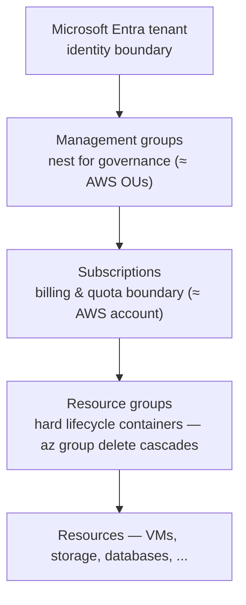

# Azure for AWS Solutions Architects Study Guide

A practical 15-section guide for architects who already know AWS and want to build strong Azure instincts without starting from zero.

This guide was assembled from official Microsoft Learn documentation and Azure Architecture Center comparisons reviewed on April 9, 2026. Use the linked docs as the current source of truth when a feature, limit, SLA, SKU, or pricing detail matters operationally.

Primary references: the [Azure Architecture Center's AWS-to-Azure comparison](https://learn.microsoft.com/en-us/azure/architecture/aws-professional/) (the official Rosetta stone this guide expands), [Microsoft Learn](https://learn.microsoft.com/en-us/azure/) (per-service docs), the [Cloud Adoption Framework](https://learn.microsoft.com/en-us/azure/cloud-adoption-framework/) (landing zones and governance), and the [Azure Well-Architected Framework](https://learn.microsoft.com/en-us/azure/well-architected/) (the pillar-review counterpart to AWS's).

Siblings in this repo go deeper on adjacent ground: the [GCP for AWS architects guide](GCP_FOR_AWS_SOLUTIONS_ARCHITECT.md) (the same translation method applied to Google's cloud), the [Terraform guide](TERRAFORM_STUDY_GUIDE.md) (declaring all of it as code), the [Kubernetes guide](k8s/KUBERNETES_STUDY_GUIDE.md) (AKS's substrate), and the [Enterprise API guide](ENTERPRISE_API_STUDY_GUIDE.md) (the API-management discipline Azure API Management productizes).

---

## How to Use This Guide

Study the sections in order if Azure is new to you; each opens by anchoring on the AWS mental model you already hold, then develops the genuine architectural differences rather than just listing the Azure service names — because the names are the easy part and the conceptual differences are where designs go right or wrong. Treat every mapping as *directional, not literal*: Azure and AWS frequently solve the same problem with a different control plane, a different resource hierarchy, or a different service boundary, and the value of this guide is in those differences, not in the one-to-one substitutions. Two patterns recur often enough to name up front. First, **several single-service AWS mental models split into multiple Azure products** — IAM becomes Entra ID plus Azure RBAC plus managed identities plus Azure Policy; Route 53 becomes Azure DNS plus Traffic Manager plus Front Door; CloudWatch becomes Azure Monitor plus Application Insights plus Log Analytics plus Activity Log — so a recurring skill is learning *which* of the several Azure answers a given problem wants. Second, **Azure consistently offers a managed-tier ladder** (most-managed PaaS up through self-managed VM) across compute, databases, and containers, and the right instinct everywhere is to start at the most-managed rung that meets your needs and only climb toward raw infrastructure when you can name the feature the managed tier doesn't give you.

### Translation Rules That Matter Early

- An Azure `subscription` is usually the closest match to an AWS account.
- An Azure `management group` is the closest match to an AWS Organization OU.
- An Azure `resource group` is a required lifecycle container. Deleting it deletes the resources inside it.
- Identity and authentication center on `Microsoft Entra ID`, while authorization to Azure resources typically uses `Azure RBAC`.
- Several AWS single-service mental models split into multiple Azure services.
- `Route 53` maps across `Azure DNS`, `Traffic Manager`, and sometimes `Front Door`.
- `IAM` maps across `Microsoft Entra ID`, `Azure RBAC`, `managed identities`, and `Azure Policy`.
- `CloudWatch` maps across `Azure Monitor`, `Application Insights`, `Log Analytics`, and `Activity Log`.

### AWS → Azure Service Translation Map

Internalize this before diving into sections. Treat mappings as directional — the consistency model, control plane, or billing dimension often differs.

| AWS | Azure | The difference that matters |
|---|---|---|
| Account / OU / Organization | Subscription / Management group / Tenant | Resource group is a *new* required layer; deleting it deletes its contents |
| IAM | Entra ID + Azure RBAC + Managed identities + Azure Policy | Identity (Entra) and resource authz (RBAC) are explicitly separate |
| VPC / Security Group + NACL | VNet / NSG | One NSG construct, no separate NACL layer |
| Route 53 | Azure DNS + Traffic Manager + Front Door | DNS, global routing, and edge delivery are three products |
| CloudFront / Global Accelerator | Front Door | One global edge/CDN/WAF product |
| ALB / NLB | Application Gateway (L7) / Load Balancer (L4) | Split by layer |
| EC2 / ASG | Virtual Machines / VM Scale Sets | Managed Disks are the default; no storage account to manage |
| S3 | Blob Storage | Redundancy (LRS/ZRS/GRS/GZRS) is an explicit, visible choice |
| EBS / EFS / FSx | Managed Disks / Azure Files / Azure NetApp Files | — |
| RDS / Aurora | Azure SQL Database / SQL Managed Instance / Flexible Server | No single Aurora-equivalent; choose by compatibility |
| DynamoDB | Cosmos DB | Multi-model, global, partition-key-sensitive; tunable consistency (5 levels) |
| ElastiCache | Azure Cache for Redis | — |
| Lambda | Azure Functions | — |
| Step Functions | Durable Functions (code) / Logic Apps (low-code) | Two distinct products |
| API Gateway | API Management | Broader: gateway + portal + lifecycle |
| ECS/EKS/Fargate | AKS / Container Apps / Container Instances | Container Apps is the serverless default; AKS for full K8s |
| ECR | Azure Container Registry | — |
| SQS / SNS | Queue Storage / Service Bus / Event Grid | Service Bus = enterprise queues+topics; Event Grid = events |
| Kinesis / MSK | Event Hubs (Kafka-compatible) | — |
| Redshift / Athena / EMR | Synapse / Databricks / Fabric | No single replacement |
| CloudWatch / X-Ray / CloudTrail | Azure Monitor / App Insights / Activity Log | KQL is the query language to learn |
| KMS / Secrets Manager / ACM | Key Vault (+ Managed HSM) | One vault covers keys, secrets, certs |
| GuardDuty / Security Hub | Microsoft Defender for Cloud | Unified posture + workload protection |
| WAF / Shield | Azure WAF (on App Gateway/Front Door) / DDoS Protection | WAF placement depends on your edge |
| CloudFormation / CDK | Bicep (+ ARM) / Terraform | Bicep is first-party; Terraform very common |
| Organizations SCP / Control Tower | Azure Policy / Landing Zones | Policy can *audit and remediate* existing resources |

### CLI & IaC Quickstart

Nearly every example below uses the Azure CLI (`az`) — the rough analog of the `aws` CLI — and **Bicep**, Azure's first-party IaC language (the CloudFormation/CDK analog).

```bash
az login
az account set --subscription "Production"          # pick the subscription (≈ AWS account)
az group create -n rg-app-prod -l eastus            # resource group = lifecycle container
az configure --defaults group=rg-app-prod location=eastus
az deployment group create -g rg-app-prod -f main.bicep   # deploy IaC (≈ aws cloudformation deploy)
```

```bicep
// main.bicep — declarative, ARM-native. `az bicep build` compiles to an ARM template.
param location string = resourceGroup().location
resource sa 'Microsoft.Storage/storageAccounts@2023-01-01' = {
  name: 'stappprod${uniqueString(resourceGroup().id)}'
  location: location
  sku: { name: 'Standard_ZRS' }
  kind: 'StorageV2'
}
```

---

## Table of Contents

1. [Azure Foundations: Tenants, Subscriptions, Resource Groups, Regions](#1-azure-foundations-tenants-subscriptions-resource-groups-regions)
2. [Identity and Access Management](#2-identity-and-access-management)
3. [Networking, Connectivity, and Edge Delivery](#3-networking-connectivity-and-edge-delivery)
4. [Compute, Virtual Machines, and Scaling](#4-compute-virtual-machines-and-scaling)
5. [Object, Block, and File Storage](#5-object-block-and-file-storage)
6. [Relational Databases](#6-relational-databases)
7. [NoSQL, Cache, and Search](#7-nosql-cache-and-search)
8. [Containers and Kubernetes](#8-containers-and-kubernetes)
9. [Serverless, APIs, and Workflow Orchestration](#9-serverless-apis-and-workflow-orchestration)
10. [Messaging and Event Streaming](#10-messaging-and-event-streaming)
11. [Analytics, Data Lake, and AI](#11-analytics-data-lake-and-ai)
12. [Observability and Operations](#12-observability-and-operations)
13. [Security, Secrets, and Perimeter Protection](#13-security-secrets-and-perimeter-protection)
14. [Governance, Landing Zones, and Cost Management](#14-governance-landing-zones-and-cost-management)
15. [DevOps, IaC, Migration, Backup, and Disaster Recovery](#15-devops-iac-migration-backup-and-disaster-recovery)

---

## 1. Azure Foundations: Tenants, Subscriptions, Resource Groups, Regions

In AWS, the structural unit you reason about constantly is the **account** — your billing boundary, your blast radius, your governance edge — organized into OUs under an Organization, with regions and availability zones beneath. The first thing to internalize about Azure is that the same job is done by a *deeper hierarchy* with one genuinely new layer that has no AWS equivalent, and getting comfortable with that hierarchy is most of getting comfortable with Azure: a **Microsoft Entra tenant** is the identity boundary (roughly the directory your whole organization lives in), beneath it **management groups** nest to organize governance (the analog of OUs), beneath those sit **subscriptions** (the closest match to an AWS account — a billing and quota boundary you'd typically use one of per environment), and inside each subscription live **resource groups**, which is the layer that surprises everyone.



Azure Resource Manager treats each level as a **scope**, and RBAC role assignments and Azure Policy assigned at any level **inherit downward** to everything beneath it.

A resource group is *not* a tag, and treating it like one is the most common early mistake. It is a hard **lifecycle container and deployment scope**: every resource belongs to exactly one resource group, `az group delete` cascades to everything inside it, and deployments, RBAC scopes, and policy all attach naturally at that level. Where an AWS architect's instinct is "one account per environment, tags for workloads within," the idiomatic Azure split is "one *subscription* per environment, then many *resource groups* by workload inside it" — so the resource group becomes the unit you create and destroy together, the thing you'd previously have approximated with a CloudFormation stack plus tag conventions, now made first-class and enforced.

Underneath all of this is **Azure Resource Manager (ARM)**, the single control plane through which every create, read, update, and delete flows, regardless of whether you used the portal, the CLI, or Bicep. Many Azure concepts that feel arbitrary at first click into place once you think in ARM's terms of *scopes* (management group → subscription → resource group → resource, with permissions and policy inheriting down the chain) and *resource providers*. One more difference worth wiring in early because it changes network and HA design: Azure **subnets are regional**, spanning all availability zones in a region, rather than being pinned to a single AZ the way AWS subnets are — so where an AWS architect places one subnet per AZ and distributes across them, an Azure architect places one regional subnet and makes zone-redundancy a property of the resources in it, layering availability zones and **paired regions** (Azure's built-in regional DR pairing) for high availability.

### Hands-On

```bash
# The hierarchy, top-down: tenant → management group → subscription → resource group
az account management-group create --name mg-platform --display-name "Platform"
az account management-group create --name mg-workloads --display-name "Workloads"
az account management-group subscription add --name mg-workloads --subscription "Production"

# Resource group = lifecycle boundary. `az group delete` cascades to everything inside.
az group create -n rg-network-prod -l eastus --tags env=prod owner=platform
az group create -n rg-app-prod     -l eastus --tags env=prod owner=appteam
```

> Mental shift: in AWS you'd often use one account per environment; in Azure the common split is one **subscription** per environment, then many **resource groups** by workload inside it. The resource group has no AWS equivalent — it's a hard lifecycle container, not a tag.

### Start With These Docs

- [Azure for AWS professionals](https://learn.microsoft.com/en-us/azure/architecture/aws-professional/)
- [Compare AWS and Azure accounts](https://learn.microsoft.com/en-us/azure/architecture/aws-professional/accounts)
- [Regions and zones on Azure](https://learn.microsoft.com/en-us/azure/architecture/aws-professional/regions-zones)
- [Compare AWS and Azure resource management](https://learn.microsoft.com/en-us/azure/architecture/aws-professional/resources)
- [What is Azure Resource Manager?](https://learn.microsoft.com/en-us/azure/azure-resource-manager/management/overview)

### Practice

- Design a tenant structure for `dev`, `test`, `prod`, and `shared-services`.
- Decide where management groups stop and subscriptions begin.
- Write down when you would separate workloads by subscription instead of only by resource group.

```quiz
Q: An AWS architect treats a resource group like a tag for organizing workloads. Why is that the most common early Azure mistake?
- [ ] Resource groups can't hold more than 100 resources
- [x] A resource group is a hard lifecycle container — every resource belongs to exactly one, and `az group delete` cascades to everything inside
- [ ] Tags are cheaper than resource groups
- [ ] Resource groups are billing boundaries, tags are not
> A resource group is a deployment scope and lifecycle boundary, not a label: a resource lives in exactly one, and deleting the group destroys everything in it. The idiomatic Azure split is one *subscription* per environment, then many *resource groups* by workload — the resource group becomes the unit you create and destroy together, replacing the AWS "CloudFormation stack plus tag conventions" approximation with a first-class, enforced container.

Q: How does Azure's subnet model differ from AWS, and why does it change HA design?
- [ ] Azure subnets are smaller, so you need more of them
- [x] Azure subnets are regional (spanning all AZs), so you place one subnet and make zone-redundancy a property of the resources, rather than one subnet per AZ
- [ ] Azure subnets are pinned to a single AZ like AWS
- [ ] Azure has no concept of availability zones
> An AWS architect places one subnet per AZ and distributes resources across them. In Azure a subnet spans every availability zone in the region, so you place one regional subnet and achieve high availability by making the *resources* zone-redundant, then layer paired regions for DR. Carrying the AWS one-subnet-per-AZ habit over leads to designs that fight the platform.

Q: What is the management group layer in Azure's hierarchy, and what AWS concept is it closest to?
- [ ] A billing account, like an AWS account
- [ ] A tag policy, like AWS Resource Groups
- [x] A governance grouping that nests above subscriptions, closest to AWS Organizations OUs
- [ ] An identity directory, like an Entra tenant
> The hierarchy is tenant (identity boundary) → management groups (nest to organize governance) → subscriptions (billing/quota boundary, the closest match to an AWS account) → resource groups. Management groups are the analog of AWS Organizations OUs: you attach policy and RBAC at that level and it inherits down the chain through ARM's scope model. The Entra tenant is the identity boundary above it all, not the governance grouping.
```

---

## 2. Identity and Access Management

In AWS, IAM is one service that does two conceptually different jobs at once: it holds identities (users, roles) and it expresses authorization (policies attached to those identities and to resources). The single most important conceptual shift in moving to Azure is that **these two jobs are split into two separate systems**, and once you see the seam, a great deal of Azure's identity model stops feeling foreign. **Microsoft Entra ID** (formerly Azure AD) owns *identity and authentication* — it is the directory of users, groups, service principals, and app registrations; it handles sign-in, federation, multi-factor authentication, and **Conditional Access** (policy on *how* and *whether* someone may authenticate, e.g. "require MFA from outside the corporate network"). **Azure RBAC** owns *authorization to Azure resources* — it answers "may this identity perform this action on this resource," through role assignments at an ARM scope.

The split means a permission grant in Azure is always a triple: a **principal** (from Entra), a **role** (a set of allowed actions, like the built-in "Storage Blob Data Reader"), and a **scope** (a management group, subscription, resource group, or single resource, with the grant inheriting downward). This is more verbose than attaching an IAM policy, but it is also cleaner to reason about, because identity questions ("who is this, and are they allowed to sign in this way?") and resource questions ("may they read this blob container?") live in different places and are administered by different teams. The mapping that an AWS architect needs most: an Entra **managed identity** is the clean equivalent of an EC2 instance profile or IRSA — an automatically-managed, secret-free identity you attach to a VM, App Service, or Function so the workload can authenticate to other Azure services with no credentials to rotate, and it is almost always the right answer wherever you'd have reached for a workload IAM role. The governance layer is **Azure Policy**, which overlaps with Organizations SCPs in intent but is genuinely more capable in one direction: where an SCP can only *deny* actions preemptively, Azure Policy can *audit existing resources* and even *remediate* them (deploy the missing diagnostic setting, add the required tag), making it a continuous compliance engine rather than only a guardrail at the door.

### AWS → Azure at a Glance

| AWS | Azure |
|---|---|
| IAM identity / users / SSO | Microsoft Entra ID |
| IAM policy on resources | Azure RBAC role assignment (at a scope) |
| EC2 instance profile / IRSA | Managed identity (system- or user-assigned) |
| STS AssumeRole | Entra workload identity federation |
| Organizations SCP | Azure Policy (deny/audit effects) |

### Hands-On

```bash
# Assign a built-in RBAC role at a scope (scope = MG / subscription / RG / resource)
az role assignment create \
  --assignee "alice@contoso.com" \
  --role "Storage Blob Data Reader" \
  --scope "/subscriptions/<sub-id>/resourceGroups/rg-app-prod"

# A managed identity is the clean equivalent of an EC2 instance role — no secrets to rotate
az identity create -n id-app -g rg-app-prod
# ...then grant THAT identity access to a resource, and attach it to the VM/App/Function.
```

```bicep
// Workload identity in IaC: a user-assigned identity + a role assignment on a Key Vault
resource id 'Microsoft.ManagedIdentity/userAssignedIdentities@2023-01-31' = {
  name: 'id-app'
  location: location
}
resource kvRole 'Microsoft.Authorization/roleAssignments@2022-04-01' = {
  name: guid(kv.id, id.id, 'kv-secrets-user')
  scope: kv
  properties: {
    principalId: id.properties.principalId
    principalType: 'ServicePrincipal'
    roleDefinitionId: subscriptionResourceId('Microsoft.Authorization/roleDefinitions', '4633458b-17de-408a-b874-0445c86b69e6') // Key Vault Secrets User
  }
}
```

### Start With These Docs

- [Compare AWS and Azure identity management solutions](https://learn.microsoft.com/en-us/azure/architecture/aws-professional/security-identity)
- [What is Microsoft Entra?](https://learn.microsoft.com/en-us/entra/fundamentals/what-is-entra)
- [Microsoft Entra ID documentation](https://learn.microsoft.com/en-us/entra/identity/)
- [Azure RBAC documentation](https://learn.microsoft.com/en-us/azure/role-based-access-control/)
- [Organize your resources with management groups](https://learn.microsoft.com/en-us/azure/governance/management-groups/overview)

### Practice

- Map an EC2 instance profile design to an Azure managed identity design.
- Recreate an AWS admin, read-only, and platform-ops model using Azure RBAC scopes.
- Identify where you would use Entra roles versus Azure RBAC roles.

```quiz
Q: AWS IAM does identity and authorization in one service. How does Azure split that, and why does the seam matter?
- [ ] Entra does authorization; RBAC does identity
- [x] Entra ID owns identity/authentication; Azure RBAC owns authorization to resources — so "who are you and may you sign in?" and "may you act on this resource?" live in separate systems
- [ ] Both jobs stay in a single service called Azure IAM
- [ ] RBAC handles both, Entra is only for external users
> Entra ID is the directory and sign-in/MFA/Conditional-Access layer; Azure RBAC answers whether a principal may perform an action on a resource at an ARM scope. The seam is the key insight for AWS architects: identity questions and resource-permission questions are administered separately, often by different teams, which is more verbose than an IAM policy but cleaner to reason about.

Q: What is an Azure RBAC permission grant always composed of?
- [ ] A policy document attached to a resource
- [x] A triple: a principal (from Entra), a role (set of allowed actions), and a scope (MG/subscription/RG/resource) that inherits downward
- [ ] A user and a password
- [ ] A managed identity and a secret
> Unlike attaching an IAM policy, an Azure grant binds an Entra principal to a built-in or custom role at a specific ARM scope, and the grant inherits down the hierarchy from that scope. Thinking in this principal-role-scope triple is what makes Azure authorization click — and the managed identity is the secret-free principal you'd use wherever AWS uses an instance profile or IRSA.

Q: How does Azure Policy go beyond what an AWS Organizations SCP can do?
- [ ] It can only deny actions, like an SCP
- [ ] It replaces Entra for authentication
- [x] Beyond preemptive deny, it can audit existing resources and even remediate them (add a missing tag, deploy a diagnostic setting)
- [ ] It assigns RBAC roles automatically
> An SCP is a guardrail at the door — it denies actions preemptively. Azure Policy does that *and* continuously audits already-deployed resources for compliance and can auto-remediate drift, making it a continuous compliance engine rather than only an entry gate. That audit-and-remediate capability is the main direction in which it's more capable than an SCP.
```

---

## 3. Networking, Connectivity, and Edge Delivery

Networking is the area where the AWS-to-Azure mapping is most one-to-many, and the confusion it causes is worth pre-empting. The core is familiar: a **Virtual Network (VNet)** is a VPC, subnets are subnets (regional, per Section 1), and traffic is shaped by **user-defined routes** the way route tables shape it in AWS. The first simplification an AWS architect notices is welcome: where AWS gives you *two* packet-filtering layers — stateful security groups attached to instances *and* stateless NACLs attached to subnets — Azure collapses both into one construct, the **Network Security Group (NSG)**, which you attach to a subnet or a NIC and which is stateful. One mental model instead of two, which removes a whole category of "did I open it in the SG or the NACL?" debugging.

The complications all live at the edge, where several distinct Azure products cover ground that a few AWS services covered, and choosing among them is the real skill. **Route 53 splits three ways**: plain authoritative DNS hosting is **Azure DNS**; DNS-level global routing (latency or priority-based, returning different answers to different users) is **Traffic Manager**; and modern global application delivery — anycast edge, CDN, WAF, and global HTTP load balancing in one — is **Front Door**, which itself absorbs what an AWS team would assemble from CloudFront, Global Accelerator, and an internet-facing load balancer. For *regional* load balancing the split is by OSI layer and is clean once stated: **Application Gateway** is the L7 (HTTP-aware, path-routing, WAF-capable) product and the closest match to an ALB, while **Azure Load Balancer** is the L4 (TCP/UDP) product matching an NLB. The connectivity story rounds it out with direct parallels — **Private Link / Private Endpoint** for PrivateLink, **VNet peering** and **Virtual WAN** for the Transit Gateway role, and **ExpressRoute** for Direct Connect — and the reference architecture you'll meet constantly is hub-spoke (a central hub VNet holding shared services and connectivity, with workload VNets peered as spokes), the Azure idiom for the multi-VPC designs Transit Gateway enables in AWS.

### AWS → Azure at a Glance

| AWS | Azure |
|---|---|
| VPC / subnet | VNet / subnet (regional, spans zones) |
| Security Group + NACL | NSG (one construct) |
| Route table | User-defined routes (UDRs) |
| Internet/NAT Gateway | Azure NAT Gateway |
| ALB / NLB | Application Gateway (L7) / Load Balancer (L4) |
| CloudFront + Global Accelerator + WAF | Front Door (Standard/Premium) |
| Route 53 (hosting / latency routing) | Azure DNS / Traffic Manager |
| PrivateLink | Private Link + Private Endpoint |
| Transit Gateway | Virtual WAN / VNet peering |
| Direct Connect | ExpressRoute |

### Hands-On

```bash
# A VNet with one subnet, an NSG, and a rule allowing HTTPS in
az network vnet create -g rg-network-prod -n vnet-prod \
  --address-prefix 10.0.0.0/16 --subnet-name snet-web --subnet-prefix 10.0.1.0/24
az network nsg create -g rg-network-prod -n nsg-web
az network nsg rule create -g rg-network-prod --nsg-name nsg-web -n allow-https \
  --priority 100 --destination-port-ranges 443 --access Allow --protocol Tcp --direction Inbound
az network vnet subnet update -g rg-network-prod --vnet-name vnet-prod -n snet-web --network-security-group nsg-web
```

> Unlike AWS, the subnet is *regional and spans all zones* — you do not create one subnet per AZ. Zonal HA is a property of the resources you place in the subnet, not the subnet itself.

### Start With These Docs

- [Compare AWS and Azure networking options](https://learn.microsoft.com/en-us/azure/architecture/aws-professional/networking)
- [What is Azure Front Door?](https://learn.microsoft.com/en-us/azure/frontdoor/front-door-overview)
- [What is Azure Application Gateway?](https://learn.microsoft.com/en-us/azure/application-gateway/overview)
- [Azure DNS documentation](https://learn.microsoft.com/en-us/azure/dns/)
- [Azure ExpressRoute documentation](https://learn.microsoft.com/en-us/azure/expressroute/)

### Practice

- Translate a three-tier VPC design into a hub-spoke Azure network.
- Decide when to use `Front Door`, `Application Gateway`, `Load Balancer`, or `Traffic Manager`.
- Rebuild an AWS `PrivateLink` pattern using `Private Endpoint`.

```quiz
Q: In AWS you debug "did I open it in the security group or the NACL?" What does Azure do differently?
- [ ] It has three filtering layers instead of two
- [x] It collapses both into one stateful construct, the NSG, attached to a subnet or NIC — one mental model instead of two
- [ ] It removes packet filtering entirely
- [ ] NSGs are stateless like NACLs
> AWS gives you stateful security groups on instances *and* stateless NACLs on subnets — two layers to reason about. Azure's Network Security Group is a single stateful construct you attach to a subnet or NIC, eliminating the whole "which layer blocked it?" category of debugging. It's one of the welcome simplifications when moving from AWS networking.

Q: An AWS team wants CloudFront + Global Accelerator + an internet-facing ALB + WAF for global delivery. Which single Azure product covers that ground?
- [ ] Application Gateway
- [ ] Traffic Manager
- [x] Front Door — anycast edge, CDN, WAF, and global HTTP load balancing in one
- [ ] Azure Load Balancer
> Route 53's job splits three ways in Azure (Azure DNS for hosting, Traffic Manager for DNS-level global routing, Front Door for modern global app delivery), and Front Door specifically absorbs what AWS assembles from CloudFront, Global Accelerator, and an internet-facing load balancer plus WAF. Application Gateway (L7) and Azure Load Balancer (L4) are *regional* load balancers, not global edge delivery.

Q: For regional load balancing, how do Application Gateway and Azure Load Balancer divide the work?
- [ ] By region, not by layer
- [x] By OSI layer — Application Gateway is L7 (HTTP-aware, path routing, WAF), the ALB analog; Azure Load Balancer is L4 (TCP/UDP), the NLB analog
- [ ] Application Gateway is L4; Load Balancer is L7
- [ ] They're interchangeable
> The regional split is clean once stated: Application Gateway operates at L7, understanding HTTP for path-based routing and WAF, matching an ALB; Azure Load Balancer operates at L4 for raw TCP/UDP, matching an NLB. Picking the right one is just asking whether you need HTTP-aware routing or plain transport-layer balancing.
```

---

## 4. Compute, Virtual Machines, and Scaling

The raw compute mapping is the most direct in the whole guide — an **Azure Virtual Machine** is an EC2 instance, a **VM Scale Set (VMSS)** is an Auto Scaling Group, a **Spot VM** is a Spot Instance, and an **Azure Compute Gallery** image is an AMI — so the value here is in the handful of defaults that differ and the one piece of architectural advice that matters more than any mapping. The defaults: **Managed Disks** are the normal, only-sane choice, and the relief they bring is that you no longer manage the underlying storage account for a VM's disk the way EC2 leaves you reasoning about EBS volume types and the instance's own store — you pick a disk SKU and Azure handles the placement, replication, and scaling beneath it. Spot VMs differ from AWS in a small but pleasant way: there is no bidding, just a fixed discount and an eviction when Azure needs the capacity, which removes the bid-price modeling AWS Spot demands. And high availability for VMs is expressed by *spreading the scale set across availability zones* (`--zones 1 2 3`), the direct analog of an ASG spanning subnets in multiple AZs, with the older **availability set** construct (anti-affinity within a single datacenter) as the fallback where zones aren't available.

The architectural advice, which is the part worth carrying: Azure's compute menu is broader than VMs, and AWS teams reliably *over-use the VM pattern* when an Azure PaaS or container option would be simpler and cheaper. The instinct from AWS — "I need to run code, so I provision instances and an ASG" — leaves a lot on the table in Azure, where App Service, Container Apps, and Functions (Sections 8–9) handle a large fraction of workloads with no VM to patch, scale, or secure. Treat raw VMs as the option you reach for when you specifically need OS control, not the default landing place for every workload.

### AWS → Azure at a Glance

| AWS | Azure |
|---|---|
| EC2 instance | Virtual Machine |
| AMI | Azure Compute Gallery image |
| Auto Scaling Group | VM Scale Set (VMSS) |
| Launch Template | VMSS model / Bicep |
| Spot Instance | Spot VM (fixed discount, no bidding) |
| EBS | Managed Disk |
| Instance store | Temporary (ephemeral) disk |

### Hands-On

```bash
# A scale set (≈ ASG) with autoscale on CPU
az vmss create -g rg-app-prod -n vmss-web --image Ubuntu2204 \
  --vnet-name vnet-prod --subnet snet-web --instance-count 2 --zones 1 2 3
az monitor autoscale create -g rg-app-prod --resource vmss-web \
  --resource-type Microsoft.Compute/virtualMachineScaleSets --name web-autoscale --min-count 2 --max-count 10 --count 2
az monitor autoscale rule create -g rg-app-prod --autoscale-name web-autoscale \
  --condition "Percentage CPU > 70 avg 5m" --scale out 2
```

> Spreading the scale set across `--zones 1 2 3` is the Azure way to get AZ resilience — the equivalent of an ASG spanning subnets in multiple AZs.

### Start With These Docs

- [Compute services on Azure and AWS](https://learn.microsoft.com/en-us/azure/architecture/aws-professional/compute)
- [Azure Virtual Machines documentation](https://learn.microsoft.com/en-us/azure/virtual-machines/)
- [Introduction to Azure Managed Disks](https://learn.microsoft.com/en-us/azure/virtual-machines/managed-disks-overview)
- [Virtual machine scale sets documentation](https://learn.microsoft.com/en-us/azure/virtual-machine-scale-sets/)

### Practice

- Map an EC2 fleet that uses ASGs and EBS to Azure VMs, VMSS, and Managed Disks.
- Decide when to use Spot VMs in Azure and what workloads should avoid them.
- Compare an availability-set design with an availability-zone design for the same app.

---

## 5. Object, Block, and File Storage

The storage mapping is mostly clean — **Blob Storage** is S3, **Managed Disks** are EBS, **Azure Files** is EFS (managed SMB/NFS shares), and **Azure NetApp Files** is the high-performance shared-file tier matching FSx — but two things differ enough to call out. First, **storage redundancy is an explicit, visible architectural decision in Azure** in a way it isn't in S3. Where S3 quietly gives you eleven-nines durability across a region, Azure makes you choose the replication model by name and pricing tier: **LRS** (three copies in one datacenter), **ZRS** (across availability zones in the region — the usual production floor), **GRS** (asynchronously replicated to the paired region), and **GZRS** (both zone- and geo-redundant). This is more decisions than S3 asks of you, but it is also more honest, because the cost and the disaster-recovery posture of your data are now things you chose rather than things you assumed — and getting it wrong (LRS for data you needed geo-redundant) is a real design error the visibility helps you avoid. The access tiers (**Hot**, **Cool**, **Archive**) map directly onto S3's storage classes and Glacier.

Second, a clarification that saves confusion: **Azure Data Lake Storage Gen2 is not a separate product** the way teams coming from a distinct S3-plus-Lake-Formation world often imagine. It *is* Blob Storage with a "hierarchical namespace" feature switched on, which adds real directories and POSIX-like permissions on top of the same object store — so a data lake on Azure is a Blob account with one checkbox flipped, not a different service to learn, which is a genuine simplification once you stop looking for the separate thing.

### AWS → Azure at a Glance

| AWS | Azure | Notes |
|---|---|---|
| S3 | Blob Storage | Tiers: Hot / Cool / Cold / Archive |
| S3 Glacier | Blob Archive tier | Rehydration latency applies |
| EBS | Managed Disk | Standard HDD / SSD / Premium / Ultra |
| EFS | Azure Files | SMB/NFS shares |
| FSx for NetApp | Azure NetApp Files | High-performance shared files |
| S3 cross-region replication | GRS / GZRS redundancy | Redundancy is a SKU choice, not a separate feature |

### Hands-On

```bash
# A storage account (the container for blobs/files/queues/tables), a container, and an upload.
# SKU encodes redundancy: Standard_LRS (zone-local) | Standard_ZRS | Standard_GRS | Standard_GZRS
az storage account create -g rg-app-prod -n stappprod001 --sku Standard_GZRS --kind StorageV2
az storage container create --account-name stappprod001 -n uploads --auth-mode login
az storage blob upload --account-name stappprod001 -c uploads -n report.pdf -f ./report.pdf --auth-mode login

# Lifecycle: tier to Cool after 30d, Archive after 90d, delete after 365d (≈ S3 lifecycle)
az storage account management-policy create --account-name stappprod001 -g rg-app-prod --policy @lifecycle.json
```

> The redundancy decision (`LRS` → `GZRS`) is made *at the storage account* and is far more front-and-center than in S3, where durability is implicit. Choose it deliberately per dataset.

### Start With These Docs

- [Compare storage in Azure and AWS](https://learn.microsoft.com/en-us/azure/architecture/aws-professional/storage)
- [Introduction to Azure Blob Storage](https://learn.microsoft.com/en-us/azure/storage/blobs/storage-blobs-introduction)
- [Introduction to Azure Files](https://learn.microsoft.com/en-us/azure/storage/files/storage-files-introduction)
- [Introduction to Azure Managed Disks](https://learn.microsoft.com/en-us/azure/virtual-machines/managed-disks-overview)
- [Azure Storage documentation](https://learn.microsoft.com/en-us/azure/storage/)

### Practice

- Take three AWS datasets and choose Azure storage types and redundancy modes for each.
- Explain when `Blob`, `Azure Files`, and `Managed Disks` are the wrong choice for a workload.
- Design an archival strategy that mirrors `S3 Standard`, `S3 IA`, and `Glacier` style thinking.

---

## 6. Relational Databases

Relational databases are where the "no single equivalent" warning matters most, because **Azure has nothing branded like Aurora** — there is no one managed relational engine that is the obvious default. Instead the choice is driven by *engine* and by *how much compatibility you need*, and an AWS architect should learn the decision rather than look for the mapping. For SQL Server workloads (the Microsoft-native case), there is a ladder of three rungs by compatibility-versus-PaaS-depth: **Azure SQL Database** is the cloud-native, most-managed option (a single database or elastic pool, serverless and auto-scaling tiers, but a curated subset of SQL Server's surface — the right choice for new applications); **Azure SQL Managed Instance** climbs toward near-full SQL Server compatibility (instance-level features, cross-database queries, SQL Agent — the right choice when you're lifting an existing SQL Server estate that uses features the cloud-native tier omits); and **SQL Server on an Azure VM** is the full, self-managed engine for when you need OS-level control or a feature neither PaaS tier offers. For the open-source engines, **Azure Database for PostgreSQL** and **for MySQL** (the Flexible Server deployment model) are the managed-RDS equivalents and the obvious homes for Postgres and MySQL workloads.

The decision discipline to carry over: as with compute, AWS teams arriving in Azure tend to reach for "run the engine on a VM" out of habit, and the right instinct is the opposite — start at the most-managed PaaS rung that meets your compatibility needs and only climb toward the VM when you can *name* the feature PaaS doesn't give you, because each rung down the ladder hands you back operational work (patching, backups, HA configuration, failover) that the PaaS tiers were doing for you.

### AWS → Azure at a Glance

| AWS | Azure | When |
|---|---|---|
| RDS for PostgreSQL/MySQL | Azure Database for PostgreSQL/MySQL — Flexible Server | Cloud-native OSS engines |
| RDS for SQL Server | Azure SQL Database | Cloud-native, SQL Server-compatible |
| RDS SQL Server (high compat) | Azure SQL Managed Instance | Near-100% SQL Server surface (CLR, Agent, cross-db) |
| Aurora | (no single equivalent) | Pick by engine + scale needs |
| SQL Server on EC2 | SQL Server on Azure VM | Only when PaaS can't meet a requirement |

### Hands-On

```bash
# Managed Postgres (Flexible Server) with zone-redundant HA — the RDS Multi-AZ analog
az postgres flexible-server create -g rg-app-prod -n pg-app-prod \
  --tier GeneralPurpose --sku-name Standard_D2ds_v5 \
  --high-availability ZoneRedundant --version 16 \
  --vnet vnet-prod --subnet snet-data

# Azure SQL Database (vCore, serverless tier auto-pauses like Aurora Serverless)
az sql server create -g rg-app-prod -n sql-app-prod --admin-user appadmin --admin-password '<secret>'
az sql db create -g rg-app-prod -s sql-app-prod -n appdb \
  --edition GeneralPurpose --compute-model Serverless --family Gen5 --capacity 2 --auto-pause-delay 60
```

> `--high-availability ZoneRedundant` is the Multi-AZ equivalent. For read scale-out, add read replicas; there's no Aurora-style shared storage layer, so replication is logical/physical per engine.

### Start With These Docs

- [Compare AWS and Azure database technology](https://learn.microsoft.com/en-us/azure/architecture/aws-professional/databases)
- [Azure SQL documentation](https://learn.microsoft.com/en-us/azure/azure-sql/)
- [What is Azure Database for PostgreSQL?](https://learn.microsoft.com/en-us/azure/postgresql/overview)
- [Azure Database for MySQL documentation](https://learn.microsoft.com/en-us/azure/mysql/)

### Practice

- Map one `Aurora PostgreSQL`, one `RDS SQL Server`, and one self-managed MySQL workload into Azure targets.
- Write down what would make you choose `SQL Managed Instance` over `Azure SQL Database`.
- Compare operational responsibilities across PaaS DB, managed instance, and DB-on-VM options.

---

## 7. NoSQL, Cache, and Search

**Cosmos DB** is one of the biggest mental-model shifts in the move, and it pays to understand *why* rather than just filing it under "DynamoDB equivalent." Cosmos is a globally-distributed, multi-model database with a design philosophy of putting hard guarantees in the SLA: single-digit-millisecond latency, turnkey multi-region writes, and — most distinctively — **five tunable consistency levels** (strong, bounded-staleness, session, consistent-prefix, eventual) where DynamoDB offers essentially two. That spectrum is genuinely useful (session consistency, the default, gives read-your-writes per client at much lower cost than strong) but it is also a decision DynamoDB never made you make. The two databases *feel* similar in application patterns — both are partition-key-driven NoSQL stores you provision throughput against — but their APIs, consistency models, and throughput accounting differ enough that you should not assume a DynamoDB design ports cleanly; in particular, Cosmos is *extremely* sensitive to partition-key choice (a hot partition caps your throughput and inflates your bill), so the partition-key modeling that's important in DynamoDB is *critical* in Cosmos.

The rest of the category is more direct. **Azure Cache for Redis** is ElastiCache for Redis — Redis is still Redis, so the work is the familiar cloud-architecture decisions around tier, networking, persistence, and failover. Search splits by what you actually need: application search (the "search box in my product" case) maps to **Azure AI Search**, which bundles vector and semantic search and is increasingly the RAG retrieval layer for AI features; log and time-series analytics at scale maps instead to **Azure Data Explorer**; and a full self-managed Elasticsearch cluster maps to Elastic on Azure — three different answers to what AWS lumps under OpenSearch, chosen by whether the problem is app search, log search, or cluster ownership.

### AWS → Azure at a Glance

| AWS | Azure |
|---|---|
| DynamoDB | Cosmos DB (NoSQL/Table/Mongo/Cassandra/Gremlin APIs) |
| DynamoDB DAX | Cosmos DB integrated cache |
| ElastiCache (Redis) | Azure Cache for Redis |
| DocumentDB | Cosmos DB for MongoDB |
| Keyspaces (Cassandra) | Cosmos DB for Apache Cassandra |
| OpenSearch (app search) | Azure AI Search |
| OpenSearch (log/time-series) | Azure Data Explorer |

### Hands-On

```bash
# Cosmos DB: account → database → container. Partition key choice is the #1 design decision.
az cosmosdb create -g rg-app-prod -n cosmos-app-prod --locations regionName=eastus failoverPriority=0 \
  --default-consistency-level Session     # 5 levels: Strong→BoundedStaleness→Session→ConsistentPrefix→Eventual
az cosmosdb sql database create -g rg-app-prod -a cosmos-app-prod -n appdb
az cosmosdb sql container create -g rg-app-prod -a cosmos-app-prod -d appdb -n orders \
  --partition-key-path "/tenantId" --throughput 400   # or --max-throughput for autoscale RU/s
```

> Two big shifts from DynamoDB: (1) Cosmos offers **five tunable consistency levels** (Session is the default sweet spot), not just eventual/strong; (2) throughput is provisioned in **Request Units (RU/s)**, shared or per-container — model your read/write mix in RUs the way you'd model DynamoDB RCU/WCU.

### Start With These Docs

- [Data and AI on Azure and AWS](https://learn.microsoft.com/en-us/azure/architecture/aws-professional/data-ai)
- [Azure Cosmos DB documentation](https://learn.microsoft.com/en-us/azure/cosmos-db/)
- [What is Azure Cache for Redis?](https://learn.microsoft.com/en-us/azure/azure-cache-for-redis/cache-overview)
- [Azure AI Search documentation](https://learn.microsoft.com/en-us/azure/search/)

### Practice

- Design a Cosmos DB data model for an app you would normally put on DynamoDB.
- Pick a partition key and explain the tradeoffs.
- Decide whether a given workload belongs on `Cosmos DB`, `Redis`, or a relational database.

```quiz
Q: What is the most distinctive design decision Cosmos DB forces that DynamoDB does not?
- [ ] Choosing a region for the table
- [x] Picking among five tunable consistency levels (strong, bounded-staleness, session, consistent-prefix, eventual) where DynamoDB offers essentially two
- [ ] Whether to use SQL or NoSQL
- [ ] Provisioning IOPS per partition
> Cosmos puts hard guarantees in the SLA and exposes a five-level consistency spectrum, with session consistency (the default) giving read-your-writes per client at much lower cost than strong. DynamoDB never made you choose along this spectrum, so a DynamoDB design doesn't port cleanly — the consistency model, APIs, and throughput accounting all differ enough to re-examine.

Q: Why is partition-key choice described as *critical* in Cosmos DB, even more than in DynamoDB?
- [ ] Cosmos charges per partition key created
- [x] A hot partition caps your throughput and inflates your bill, so a poor key directly throttles and over-costs the workload
- [ ] Partition keys can't be changed after creation, unlike DynamoDB
- [ ] Cosmos requires the partition key to be a GUID
> Both stores are partition-key-driven, but Cosmos is extremely sensitive to the choice: an uneven key creates a hot partition that limits the throughput you can actually achieve and raises cost. The partition-key modeling that's important in DynamoDB becomes the number-one design decision in Cosmos, which is why you can't assume a DynamoDB schema transplants without re-evaluating the key.

Q: An AWS team maps all of OpenSearch to one Azure product. What's the better-informed split?
- [ ] Everything maps to Azure AI Search
- [x] App search → Azure AI Search; log/time-series analytics → Azure Data Explorer; self-managed cluster → Elastic on Azure
- [ ] Everything maps to Cosmos DB
- [ ] App search → Redis; logs → Cosmos DB
> AWS lumps several jobs under OpenSearch, but Azure answers them with different products: the in-product search box maps to Azure AI Search (which bundles vector/semantic search for RAG), large-scale log and time-series analytics maps to Azure Data Explorer, and owning a full Elasticsearch cluster maps to Elastic on Azure. Choosing is just asking whether the problem is app search, log search, or cluster ownership.
```

---

## 8. Containers and Kubernetes

The single most common mistake AWS architects make in Azure containers is over-mapping everything to **AKS** because they know EKS — reaching for managed Kubernetes by reflex when a lighter option would serve. The registry mapping is trivial (**Azure Container Registry** is ECR), but the runtime choice is a three-way decision worth making deliberately. **AKS** is full managed Kubernetes, the right answer *only* when you genuinely want the Kubernetes control plane and its ecosystem — Helm, operators, custom controllers, a service mesh (Azure offers a first-party Istio add-on) — and are willing to own the operational complexity that comes with it. For the large fraction of app teams who just want to run containers that scale (including to zero) and respond to events *without* learning or operating Kubernetes, **Azure Container Apps** is the better first stop, and it is genuinely the serverless-container default: it absorbs the ground an AWS team typically spreads across ECS, Fargate, service discovery, and simple event-driven container jobs, with KEDA-based scaling built in. **Azure Container Instances** is the lowest rung — a single container with no orchestration, for short-lived or burst tasks.

The decision rule to carry: start at Container Apps and only climb to AKS when you can name the Kubernetes feature you actually need, because AKS hands you back the cluster-operations burden (upgrades, node pools, networking, the whole [Kubernetes Security](../k8s/KUBERNETES_SECURITY_STUDY_GUIDE.md) surface) that Container Apps was managing for you — the same most-managed-tier-first discipline that governs the compute and database choices above, applied to containers.

### AWS → Azure at a Glance

| AWS | Azure | Reach for it when |
|---|---|---|
| ECR | Azure Container Registry (ACR) | Always (image storage) |
| ECS on Fargate | Container Apps | Serverless containers, scale-to-zero, KEDA event scaling |
| EKS | AKS | You need full Kubernetes + ecosystem |
| Fargate one-off task | Container Instances (ACI) | Single short-lived container |
| App Mesh | Istio add-on for AKS / Container Apps built-in | Service mesh |

### Hands-On

```bash
# Build → push → run a serverless container, scale-to-zero, no cluster to manage (≈ ECS/Fargate)
az acr create -g rg-app-prod -n acrappprod --sku Standard
az acr build -r acrappprod -t api:v1 .                       # build in the cloud, push to ACR
az containerapp env create -g rg-app-prod -n cae-prod --location eastus
az containerapp create -g rg-app-prod -n api --environment cae-prod \
  --image acrappprod.azurecr.io/api:v1 --target-port 8080 --ingress external \
  --min-replicas 0 --max-replicas 10 --registry-server acrappprod.azurecr.io
```

> Default to **Container Apps** for app teams; only graduate to **AKS** when you genuinely need Kubernetes APIs, operators, or custom networking. The scale-to-zero + KEDA event scaling covers most ECS/Fargate use cases with far less to operate.

### Start With These Docs

- [Compute services on Azure and AWS](https://learn.microsoft.com/en-us/azure/architecture/aws-professional/compute)
- [What is Azure Kubernetes Service (AKS)?](https://learn.microsoft.com/en-us/azure/aks/what-is-aks)
- [Azure Container Apps overview](https://learn.microsoft.com/en-us/azure/container-apps/overview)
- [Azure Container Registry documentation](https://learn.microsoft.com/en-us/azure/container-registry/)

### Practice

- Take one `ECS on Fargate` workload and decide whether it belongs on `Container Apps` or `AKS`.
- Translate an `EKS + ECR + ALB ingress` pattern into Azure services.
- List the operational costs that change when you move from AKS to Container Apps.

---

## 9. Serverless, APIs, and Workflow Orchestration

**Azure Functions** is the primary Lambda equivalent and behaves much as you'd expect, but two of the surrounding services split in ways worth understanding. Step Functions has *two* Azure answers chosen by how you want to express orchestration: **Durable Functions** is the code-first model, where you write the workflow as ordinary code (an orchestrator function that `await`s activity functions) and the framework handles the durable checkpointing and replay — the right fit for developers who want orchestration *in code* and version it alongside the app; **Logic Apps** is the integration-centric, low-code model with hundreds of pre-built connectors to SaaS and enterprise systems, and it is frequently the *better* answer for enterprise integration ("when an email arrives, parse it, write to SharePoint, post to Teams") where Durable Functions would mean writing connectors by hand. Knowing which of the two a problem wants — developer orchestration versus connector-driven integration — is the real skill the split demands.

The other broadening is **API Management**, which is more than the API-front-door role API Gateway plays. It is a full API *platform*: the gateway itself, a rich policy engine (rate limiting, transformation, auth enforcement applied as composable policies), a developer portal for API consumers, versioning, and product/subscription lifecycle management. An AWS architect reaching for "API Gateway equivalent" gets that and a good deal more, which matters for sizing and cost — APIM is a heavier, more strategic component than a bare gateway, and you adopt it when the API *program* (many APIs, external consumers, governance) is the thing you're managing, not just a single API's front door.

### AWS → Azure at a Glance

| AWS | Azure |
|---|---|
| Lambda | Azure Functions |
| Lambda (provisioned concurrency) | Functions Premium plan (pre-warmed) |
| Step Functions (code-first) | Durable Functions |
| Step Functions (low-code/integration) | Logic Apps |
| API Gateway | API Management |

### Hands-On

```bash
# Create a Function App on the serverless Consumption plan, deploy code
az functionapp create -g rg-app-prod -n func-app-prod \
  --consumption-plan-location eastus --runtime node --runtime-version 20 \
  --functions-version 4 --storage-account stappprod001
func azure functionapp publish func-app-prod      # Azure Functions Core Tools
```

```js
// Durable Functions orchestrator — the Step Functions analog, but orchestration is *code*
const df = require("durable-functions");
module.exports = df.orchestrator(function* (ctx) {
  const order = yield ctx.df.callActivity("ReserveInventory", ctx.df.getInput());
  yield ctx.df.callActivity("ChargePayment", order);
  yield ctx.df.callActivity("SendConfirmation", order);   // fan-out/fan-in, retries, timers all in code
});
```

> Choose **Durable Functions** when engineers want orchestration expressed in code with source control and testing; choose **Logic Apps** when the workflow is integration-heavy (connectors to SaaS/enterprise systems) and better owned low-code.

### Start With These Docs

- [Azure Functions overview](https://learn.microsoft.com/en-us/azure/azure-functions/functions-overview)
- [Durable Functions overview](https://learn.microsoft.com/en-us/azure/azure-functions/durable-functions/durable-functions-overview)
- [Azure API Management - Overview and Key Concepts](https://learn.microsoft.com/en-us/azure/api-management/api-management-key-concepts)
- [What is Azure Logic Apps?](https://learn.microsoft.com/en-us/azure/logic-apps/logic-apps-overview)

### Practice

- Rebuild a `Lambda + API Gateway + Step Functions` design in Azure.
- Decide when orchestration should be in `Durable Functions` versus `Logic Apps`.
- Define where API auth, transformation, throttling, and developer onboarding belong in `API Management`.

---

## 10. Messaging and Event Streaming

Messaging is another one-to-many split, and the clarifying distinction Azure draws — sharper than AWS's — is between **messages** (commands you want a specific consumer to process reliably, exactly once, in order) and **events** (notifications that something happened, broadcast to whoever cares). That distinction maps the four Azure services cleanly. **Queue Storage** is the simplest queue, the lightweight SQS for basic decoupling. **Service Bus** is the enterprise message broker and the place to look whenever you need *durable queues, pub/sub via topics, ordering, sessions, dead-lettering, or transactions* — it covers both the richer end of SQS and the fan-out role of SNS (via Service Bus topics with multiple subscriptions). **Event Grid** is the event-routing service and the closest match to EventBridge — a serverless pub/sub for discrete events, with Azure's own resource events (a blob was created, a VM started) as first-class sources, ideal for reactive, event-driven glue. And **Event Hubs** is the high-throughput streaming ingestion service — millions of events per second, partitioned, replayable, *Kafka-protocol-compatible* — the one to reach for when the pattern is Kinesis or Kafka: telemetry, clickstreams, logs, anything you ingest as a stream and process with windowing.

The decision in one line: commands and enterprise messaging → Service Bus; reactive event routing → Event Grid; high-volume stream ingestion → Event Hubs; trivial decoupling → Queue Storage. Naming which of the four a problem wants, by whether it's a message or an event and at what throughput, is the whole skill here.

### AWS → Azure at a Glance

| AWS | Azure | Semantics |
|---|---|---|
| SQS (simple) | Queue Storage | Basic queue, huge scale, cheap |
| SQS (FIFO/DLQ/sessions) | Service Bus queue | Ordering, sessions, dead-lettering, transactions |
| SNS fan-out | Service Bus topics / Event Grid | Topics for messaging; Event Grid for events |
| EventBridge | Event Grid | Reactive event routing |
| Kinesis / MSK | Event Hubs | High-throughput streaming (Kafka-compatible endpoint) |

### Hands-On

```bash
# Service Bus topic + subscription = the SNS→SQS fan-out pattern, but one product
az servicebus namespace create -g rg-app-prod -n sb-app-prod --sku Standard
az servicebus topic create -g rg-app-prod --namespace-name sb-app-prod -n orders
az servicebus topic subscription create -g rg-app-prod --namespace-name sb-app-prod \
  --topic-name orders -n fulfillment --dead-lettering-on-message-expiration true

# Event Hubs for Kafka-style ingest (Kinesis analog) — partitions + consumer groups
az eventhubs namespace create -g rg-app-prod -n eh-app-prod --sku Standard --enable-kafka true
az eventhubs eventhub create -g rg-app-prod --namespace-name eh-app-prod -n telemetry --partition-count 8
```

> Decision rule: **Queue Storage** for dirt-simple queues; **Service Bus** the moment you need ordering, sessions, or DLQ; **Event Grid** for "react to a thing happened"; **Event Hubs** when you'd have reached for Kinesis or Kafka.

### Start With These Docs

- [Messaging services on Azure and AWS](https://learn.microsoft.com/en-us/azure/architecture/aws-professional/messaging)
- [Azure Service Bus Messaging documentation](https://learn.microsoft.com/en-us/azure/service-bus-messaging/)
- [What is Azure Event Grid?](https://learn.microsoft.com/en-us/azure/event-grid/overview)
- [What is Azure Event Hubs?](https://learn.microsoft.com/en-us/azure/event-hubs/event-hubs-about)
- [Queue Storage documentation](https://learn.microsoft.com/en-us/azure/storage/queues/)

### Practice

- Replace an `SNS -> SQS -> Lambda` fan-out design using Azure services.
- Decide when `Event Grid` is better than `Service Bus`.
- Decide when `Event Hubs` should sit in front of analytics or downstream processing.

---

## 11. Analytics, Data Lake, and AI

Analytics is the area where there is most emphatically *no single mapping*, and an AWS architect expecting "the Redshift equivalent" should reset to thinking in roles instead, because the AWS analytics stack (Redshift + Glue + Athena + EMR + Kinesis) spreads across several Azure products that overlap. **Azure Data Factory** is the integration and orchestration layer — the Glue-pipelines role, moving and transforming data on a schedule. **Azure Synapse Analytics** is the blended workspace that bundles a SQL warehouse, Spark, and pipelines under one roof, the nearest thing to a Redshift-plus-EMR-plus-Athena center of gravity. **Azure Databricks** is a genuinely first-class option (a deep Microsoft partnership, not a marketplace afterthought) and is frequently *the* answer for lakehouse, Spark, streaming, data engineering, and ML workflows — many Azure data platforms are built on Databricks rather than Synapse. **Azure Data Explorer** owns the log/time-series/high-ingest interactive-analytics niche. And the strategic wildcard you'll see across current Azure docs is **Microsoft Fabric**, a newer unified SaaS analytics platform that folds warehouse, lakehouse, data engineering, real-time, and BI into one product with a single storage foundation (OneLake) — worth knowing as the direction Microsoft is steering greenfield analytics even as Synapse and Databricks remain the established choices.

On the AI side, the same fragmentation holds: rather than one monolithic ML service, Azure splits into pre-built **Azure AI services** (vision, speech, language, document intelligence — the Rekognition/Comprehend-style turnkey APIs), Azure Machine Learning for custom model training and MLOps (the SageMaker role), and Azure OpenAI / AI Foundry for generative AI. The practical guidance is to choose by the *role* in your data architecture — ingest, orchestrate, warehouse, lakehouse, real-time, serve — rather than hunting for a one-to-one product swap that doesn't exist.

### AWS → Azure at a Glance

| AWS | Azure |
|---|---|
| Redshift | Synapse (dedicated SQL pool) / Microsoft Fabric Warehouse |
| Athena | Synapse serverless SQL / Fabric |
| Glue | Data Factory (orchestration/ETL) |
| EMR | Databricks / Synapse Spark |
| Kinesis Data Analytics | Stream Analytics / Data Explorer |
| SageMaker | Azure Machine Learning |
| Bedrock | Azure OpenAI / Azure AI Foundry |
| Rekognition / Comprehend / Textract | Azure AI services (Vision / Language / Document Intelligence) |

### Hands-On

```bash
# Serverless ad-hoc SQL over a data lake (≈ Athena): query Parquet in ADLS Gen2 directly
# (run inside Synapse serverless SQL pool)
```

```sql
-- Synapse serverless: external query over lake files, no cluster, pay per TB scanned (Athena-style)
SELECT region, SUM(amount) AS total
FROM OPENROWSET(
    BULK 'https://stappprod001.dfs.core.windows.net/lake/sales/*.parquet',
    FORMAT = 'PARQUET'
) AS rows
GROUP BY region;
```

> There is no single "Redshift replacement." For a modern build, evaluate **Microsoft Fabric** (the converged SaaS analytics platform) and **Databricks** first; reach for dedicated **Synapse** pools mainly for existing/portable warehouse workloads.

### Start With These Docs

- [Data and AI on Azure and AWS](https://learn.microsoft.com/en-us/azure/architecture/aws-professional/data-ai)
- [Introduction to Azure Data Factory](https://learn.microsoft.com/en-us/azure/data-factory/introduction)
- [What is Azure Synapse Analytics?](https://learn.microsoft.com/en-us/azure/synapse-analytics/overview-what-is)
- [What is Azure Databricks?](https://learn.microsoft.com/en-us/azure/databricks/introduction/)
- [What are Azure AI services?](https://learn.microsoft.com/en-us/azure/ai-studio/concepts/what-are-ai-services)

### Practice

- Map one `Athena + Glue` workload, one `Redshift` workload, and one `EMR/Spark` workload into Azure options.
- Explain when `Synapse` is enough and when `Databricks` is the better fit.
- Design a streaming path from ingestion to dashboard using `Event Hubs` plus an Azure analytics target.

---

## 12. Observability and Operations

CloudWatch is one monolith that does metrics, logs, dashboards, and alarms; Azure deliberately splits the same job into named pieces by concern, and the split confuses AWS architects until they see the shape. **Azure Monitor** is the umbrella brand and the metrics-and-alerts engine. **Application Insights** is the APM layer (distributed tracing, request maps, dependency tracking — the X-Ray role and more). **Log Analytics** is the *workspace* where logs land and are queried — and this is the piece that matters most operationally, because the query language is **KQL (Kusto Query Language)**, which is not optional knowledge: nearly every diagnostic, alert rule, and dashboard in Azure is a KQL query, so it becomes a core skill quickly, the way reading CloudWatch Logs Insights syntax does in AWS but more pervasively. **Activity Log** is the control-plane audit trail — who did what to which resource through ARM — the closest analog to CloudTrail. And **Azure Automation** covers the runbook/automation patterns an AWS team associates with Systems Manager.

The mental adjustment is to stop looking for "the CloudWatch service" and instead learn the four-part division: metrics and alerts in Monitor, app traces in App Insights, log queries in Log Analytics (via KQL), and the audit trail in Activity Log. Once you internalize that observability is split by concern rather than bundled, the Azure docs stop feeling scattered — and KQL is the single highest-leverage thing to learn early, because it unlocks all of it.

### AWS → Azure at a Glance

| AWS | Azure |
|---|---|
| CloudWatch Metrics/Alarms | Azure Monitor Metrics + Alerts |
| CloudWatch Logs | Log Analytics workspace |
| X-Ray | Application Insights (distributed tracing) |
| CloudTrail | Activity Log |
| Systems Manager runbooks | Azure Automation |
| CloudWatch Logs Insights | KQL (Kusto Query Language) |

### Hands-On

```kql
// KQL in Log Analytics — the language you must learn. Errors per Container App, last hour.
ContainerAppConsoleLogs_CL
| where TimeGenerated > ago(1h) and Log_s contains "ERROR"
| summarize errors = count() by ContainerAppName_s, bin(TimeGenerated, 5m)
| order by TimeGenerated desc
```

```bash
# Wire an alert off a metric (≈ CloudWatch alarm) and an uptime/availability test
az monitor metrics alert create -g rg-app-prod -n high-cpu \
  --scopes "/subscriptions/<sub>/resourceGroups/rg-app-prod/providers/Microsoft.Compute/virtualMachineScaleSets/vmss-web" \
  --condition "avg Percentage CPU > 80" --window-size 5m --evaluation-frequency 1m
```

> The split is deliberate: **Azure Monitor** is the umbrella, **Application Insights** is APM/tracing, **Log Analytics** is the queryable store, **Activity Log** is the control-plane audit trail (your CloudTrail). Almost everything is queried with **KQL** — budget time to learn it early.

### Start With These Docs

- [Azure Monitor overview](https://learn.microsoft.com/en-us/azure/azure-monitor/fundamentals/overview)
- [Introduction to Application Insights - OpenTelemetry observability](https://learn.microsoft.com/en-us/azure/azure-monitor/app/app-insights-overview)
- [Activity log in Azure Monitor](https://learn.microsoft.com/en-us/azure/azure-monitor/essentials/activity-log)
- [What is Azure Automation?](https://learn.microsoft.com/en-us/azure/automation/overview)
- [Azure for AWS professionals](https://learn.microsoft.com/en-us/azure/architecture/aws-professional/)

### Practice

- Draw the Azure equivalent of your standard `CloudWatch + X-Ray + CloudTrail` setup.
- Write down which data belongs in metrics, logs, traces, and activity logs.
- Build a short KQL learning list before you go deep into Azure ops.

---

## 13. Security, Secrets, and Perimeter Protection

Security is the one category where Azure *consolidates* rather than splits, and it's a welcome simplification. Where AWS gives you three separate services — KMS for keys, Secrets Manager for secrets, ACM for certificates — **Azure Key Vault** is one service that holds all three (keys, secrets, and certificates), with **Key Vault Managed HSM** as the FIPS-validated hardware-backed tier for the CloudHSM case. One vault, one access model (RBAC plus access policies), one audit trail for everything cryptographic. Likewise, **Microsoft Defender for Cloud** unifies what AWS spreads across Security Hub (posture management — "are my resources misconfigured?") and GuardDuty (workload threat protection — "is something attacking my resources?") into a single product that does both: continuous security-posture scoring against benchmarks *and* runtime threat detection across VMs, containers, databases, and storage.

The one genuine split to get right is at the edge, and it's architecturally correct: network-layer and application-layer defenses are separate concerns. **Azure DDoS Protection** handles volumetric L3/L4 attacks (the Shield role), while the **Azure WAF** handles L7 application attacks (the AWS WAF role) — but the WAF is not a standalone product you point at things; it is a *feature you enable on your edge*, so *where* you insert it depends on your edge choice from Section 3: WAF on **Application Gateway** for a regional edge, or WAF on **Front Door** for a global one. Choosing your edge product therefore also chooses where your WAF lives, which is why the networking and security decisions are coupled and best made together.

### AWS → Azure at a Glance

| AWS | Azure |
|---|---|
| KMS | Key Vault (keys) |
| CloudHSM | Key Vault Managed HSM |
| Secrets Manager | Key Vault (secrets) |
| Certificate Manager (ACM) | Key Vault (certificates) |
| GuardDuty + Security Hub | Microsoft Defender for Cloud |
| AWS WAF | Azure WAF (on Front Door or App Gateway) |
| Shield (Standard/Advanced) | Azure DDoS Protection (Network/IP) |

### Hands-On

```bash
# Key Vault holds keys, secrets, AND certs in one place. Grant access via RBAC (not access policies).
az keyvault create -g rg-app-prod -n kv-app-prod --enable-rbac-authorization true
az keyvault secret set --vault-name kv-app-prod -n db-password --value '<secret>'

# App reads it at runtime via its managed identity — no secret in code or config:
#   https://kv-app-prod.vault.azure.net/secrets/db-password
```

```bicep
// WAF policy attached to Front Door, OWASP managed ruleset in Prevention mode
resource waf 'Microsoft.Network/FrontDoorWebApplicationFirewallPolicies@2022-05-01' = {
  name: 'wafprod'
  location: 'global'
  sku: { name: 'Premium_AzureFrontDoor' }
  properties: {
    policySettings: { enabledState: 'Enabled', mode: 'Prevention' }
    managedRules: { managedRuleSets: [ { ruleSetType: 'Microsoft_DefaultRuleSet', ruleSetVersion: '2.1' } ] }
  }
}
```

> Put WAF on **Front Door** when the edge is global/CDN-fronted; put it on **Application Gateway** when the entry point is a regional L7 LB inside a VNet. Use both only when you have both edges.

### Start With These Docs

- [Compare AWS and Azure identity management solutions](https://learn.microsoft.com/en-us/azure/architecture/aws-professional/security-identity)
- [About Azure Key Vault](https://learn.microsoft.com/en-us/azure/key-vault/general/overview)
- [Microsoft Defender for Cloud documentation](https://learn.microsoft.com/en-us/azure/defender-for-cloud/)
- [Azure DDoS Protection Overview](https://learn.microsoft.com/en-us/azure/ddos-protection/ddos-protection-overview)
- [What Is Azure Web Application Firewall on Azure Application Gateway?](https://learn.microsoft.com/en-us/azure/web-application-firewall/ag/ag-overview)

### Practice

- Replace an `AWS KMS + Secrets Manager` design with Azure services and access controls.
- Decide whether WAF belongs on `Application Gateway`, `Front Door`, or both.
- Explain how you would centralize cloud security posture across multiple subscriptions.

```quiz
Q: AWS uses KMS, Secrets Manager, and ACM as three services. How does Azure handle the same jobs?
- [ ] Three separate Azure services mirror them one-to-one
- [x] Azure Key Vault is one service holding keys, secrets, *and* certificates, with one access model and audit trail
- [ ] Entra ID stores all three
- [ ] Each goes in a different storage account
> Security is the category where Azure consolidates rather than splits: Key Vault holds keys, secrets, and certificates together, with Managed HSM as the FIPS hardware-backed tier for the CloudHSM case. One vault, one RBAC access model, one audit trail for everything cryptographic — and an app reads a secret at runtime via its managed identity, so no secret lands in code or config.

Q: Why is the Azure WAF described as "not a standalone product" and how does that couple it to your networking choice?
- [ ] It only runs on VMs you manage
- [x] The WAF is a feature you enable on your edge, so it lives on Application Gateway (regional) or Front Door (global) — choosing your edge chooses where the WAF runs
- [ ] It must be bought separately from a marketplace
- [ ] It replaces DDoS Protection
> Azure splits edge defense correctly by concern — DDoS Protection for volumetric L3/L4, WAF for L7 application attacks — but the WAF isn't something you point at resources independently; it's enabled on an edge. So WAF-on-Application-Gateway is your regional option and WAF-on-Front-Door your global one, which is exactly why the Section 3 edge decision and the security decision are coupled and best made together.

Q: How does Microsoft Defender for Cloud map onto AWS security services?
- [ ] It replaces IAM
- [x] It unifies what AWS splits across Security Hub (posture management) and GuardDuty (threat detection) into one product doing both
- [ ] It only does compliance scoring, not threat detection
- [ ] It's the Azure equivalent of CloudTrail
> Defender for Cloud combines continuous security-posture scoring against benchmarks ("are my resources misconfigured?" — the Security Hub role) with runtime threat detection across VMs, containers, databases, and storage ("is something attacking me?" — the GuardDuty role). It's another instance of Azure consolidating two AWS services into one control plane.
```

---

## 14. Governance, Landing Zones, and Cost Management

Governance is where Azure's hierarchy from Section 1 pays off, because policy and cost both attach naturally to its scopes. **Azure Policy** is the engine, and its defining advantage over Organizations SCPs is worth restating: it doesn't only *prevent* non-compliant resources at creation, it *audits and remediates existing ones* — so "every storage account must enforce HTTPS" isn't just a guardrail for new deployments but a continuous scan that flags (and can auto-fix) the accounts already running, which genuinely changes how teams think about governance from "block at the door" to "continuously converge to compliant." **Azure landing zones** are the enterprise design pattern that ties it together, and the crucial reframe for an AWS architect is that a landing zone is *more than Control Tower's account vending machine* — it is a full platform-architecture baseline (the management-group hierarchy, the hub-spoke network, the identity model, the policy set, the logging and monitoring foundation, the platform automation) that you stamp out before any workload arrives, so that every subscription a team receives is already governed, networked, and observable. **Azure Advisor** is the Trusted Advisor analog (cost, performance, reliability, and security recommendations), and **Microsoft Cost Management** drives cost visibility and accountability at every scope — management group, subscription, and resource group — which is exactly why the Section 1 hierarchy matters for FinOps: the resource group you create-and-destroy together is also the unit you can budget and chargeback against.

### AWS → Azure at a Glance

| AWS | Azure |
|---|---|
| Organizations SCP | Azure Policy (deny effect at a scope) |
| Control Tower | Azure Landing Zones (Cloud Adoption Framework) |
| Config (rules/remediation) | Azure Policy (audit + remediate) |
| Trusted Advisor | Azure Advisor |
| Cost Explorer / Budgets | Microsoft Cost Management + Budgets |

### Hands-On

```bash
# Guardrail as policy: deny any resource created outside approved regions (≈ an SCP)
az policy assignment create --name allowed-locations \
  --scope "/providers/Microsoft.Management/managementGroups/mg-workloads" \
  --policy "e56962a6-4747-49cd-b67b-bf8b01975c4c" \
  --params '{ "listOfAllowedLocations": { "value": ["eastus","eastus2"] } }'

# Budget that fires an action group (email/webhook) at 80% of target
az consumption budget create --budget-name prod-monthly --amount 5000 --time-grain Monthly \
  --category Cost --resource-group rg-app-prod
```

> Unlike SCPs (which only deny), **Azure Policy** can `audit`, `deny`, **and** `deployIfNotExists`/`modify` to *remediate* existing resources — e.g., auto-tagging or enabling diagnostics on anything non-compliant. That changes governance from gatekeeping to continuous enforcement.

### Start With These Docs

- [Organize your resources with management groups](https://learn.microsoft.com/en-us/azure/governance/management-groups/overview)
- [What is Azure Policy?](https://learn.microsoft.com/en-us/azure/governance/policy/overview)
- [What is an Azure landing zone?](https://learn.microsoft.com/en-us/azure/cloud-adoption-framework/ready/landing-zone/)
- [Introduction to Azure Advisor](https://learn.microsoft.com/en-us/azure/advisor/advisor-overview)
- [What is Microsoft Cost Management](https://learn.microsoft.com/en-us/azure/cost-management-billing/costs/overview-cost-management)

### Practice

- Sketch a platform landing zone and at least two application landing zones.
- Define three guardrails you would implement with Azure Policy on day one.
- Decide what cost ownership belongs at management-group, subscription, and resource-group scope.

---

## 15. DevOps, IaC, Migration, Backup, and Disaster Recovery

The IaC story starts with the same ARM control plane from Section 1: everything you deploy is an ARM operation, and **Bicep** is the first-party authoring language that compiles to ARM templates — a far better day-to-day experience than hand-writing ARM JSON (which still exists beneath it), and the CloudFormation/CDK analog you should default to for Azure-native work, with **Terraform** the very common multi-cloud alternative (see the [Terraform guide](../TERRAFORM_STUDY_GUIDE.md)). For pipelines, Azure shops standardize on one of two platforms — **Azure DevOps** (the older, all-in-one suite with Repos, Pipelines, Boards) or **GitHub Actions** (increasingly the default for newer platform work, especially paired with Bicep or Terraform) — and an AWS architect's CodePipeline/CodeBuild/CodeDeploy mental model maps onto whichever the org has chosen.

The migration and resilience tools split by job in a way worth getting right. **Azure Migrate** is the discovery-assessment-migration hub (the Migration Hub role) and **Azure Database Migration Service** is DMS for databases. On resilience, the distinction that AWS architects must keep straight is **Backup versus Site Recovery**, because they solve different problems and are not interchangeable: **Azure Backup** protects *recoverable data states* (point-in-time restore of a VM, a database, a file share — the "I deleted something or it got corrupted" case), while **Azure Site Recovery** handles *replication and failover for business continuity* (continuously replicating workloads to another region and orchestrating a coordinated failover — the "the region is down" case). Confusing the two — assuming Backup gives you DR, or that Site Recovery gives you granular restore — is a real architecture error; you generally need both, for the two different failure modes they each address.

### AWS → Azure at a Glance

| AWS | Azure |
|---|---|
| CloudFormation | ARM templates / Bicep |
| CDK | Bicep (first-party) / Terraform |
| CodePipeline + CodeBuild | Azure Pipelines / GitHub Actions |
| CodeDeploy | Azure Pipelines deploy / Cloud-native rollouts |
| Migration Hub | Azure Migrate |
| DMS | Azure Database Migration Service |
| AWS Backup | Azure Backup |
| Elastic Disaster Recovery | Azure Site Recovery |

### Hands-On

```yaml
# GitHub Actions deploying Bicep with OIDC (no stored cloud secret — federated identity)
name: deploy
on: { push: { branches: [main] } }
permissions: { id-token: write, contents: read }
jobs:
  deploy:
    runs-on: ubuntu-latest
    steps:
      - uses: actions/checkout@v4
      - uses: azure/login@v2
        with:
          client-id: ${{ secrets.AZURE_CLIENT_ID }}
          tenant-id: ${{ secrets.AZURE_TENANT_ID }}
          subscription-id: ${{ secrets.AZURE_SUBSCRIPTION_ID }}
      - run: az deployment group create -g rg-app-prod -f main.bicep
```

> Prefer **OIDC workload-identity federation** (above) over a stored service-principal secret — it's the Azure equivalent of GitHub Actions assuming an AWS IAM role via OIDC, and it removes long-lived credentials from CI. Keep **Backup** (recover data states) and **Site Recovery** (replicate + fail over workloads) as separate line items in your DR plan; they answer different RPO/RTO questions.

### Start With These Docs

- [What is Bicep?](https://learn.microsoft.com/en-us/azure/azure-resource-manager/bicep/overview)
- [GitHub Actions for Azure](https://learn.microsoft.com/en-us/azure/developer/github/github-actions)
- [What is Azure Migrate?](https://learn.microsoft.com/en-us/azure/migrate/migrate-services-overview)
- [What is the Azure Backup service?](https://learn.microsoft.com/en-us/azure/backup/backup-overview)
- [About Site Recovery](https://learn.microsoft.com/en-us/azure/site-recovery/site-recovery-overview)

### Practice

- Translate one `CloudFormation` stack into a `Bicep` deployment plan.
- Design a migration runbook for VMs, databases, and web apps using `Azure Migrate`.
- Separate your backup strategy from your disaster recovery strategy in writing and make sure each service choice matches the right objective.

---

## Common Pitfalls for AWS Architects Moving to Azure

- **Forgetting the resource group is destructive.** It's not a tag — `az group delete` cascades to every resource inside. Group by lifecycle, not just by label.
- **Mapping everything to AKS because you know EKS.** Container Apps is the right first stop for most app teams; AKS is for when you truly need Kubernetes.
- **Treating Entra ID and Azure RBAC as one thing.** Entra is *identity*; RBAC is *resource authorization at a scope*. App registrations and directory roles live in Entra; "can this principal write to this storage account" is RBAC.
- **Ignoring the redundancy SKU.** `LRS` is zone-local. If you assumed S3-like durability, you may be one datacenter incident from data loss — choose `ZRS`/`GZRS` deliberately.
- **Putting WAF in the wrong place.** It belongs on whatever your actual edge is (Front Door *or* Application Gateway), not reflexively on both.
- **Underestimating Cosmos DB partition-key design.** A hot partition key caps throughput and inflates RU/s cost. This is the Cosmos equivalent of a bad DynamoDB partition key — design it up front.
- **Storing CI secrets instead of using OIDC.** Use workload-identity federation for GitHub Actions/Azure Pipelines; don't paste a service-principal secret.
- **Confusing Backup with Site Recovery.** Backup = recover data to a point in time. Site Recovery = replicate and fail a workload over to another region. You usually need both.
- **Assuming one subnet per AZ.** Azure subnets are regional and span zones; zonal HA is a property of the resources, not the subnet.

---

## Quick Reference: AWS → Azure

| Need | AWS | Azure |
|------|-----|-------|
| Account boundary | Account | Subscription (+ resource groups inside) |
| Org hierarchy | Organizations / OUs | Tenant / Management groups |
| Identity + authz | IAM | Entra ID + Azure RBAC |
| Workload identity | Instance profile / IRSA | Managed identity |
| Virtual network | VPC | VNet |
| Firewalling | Security Group + NACL | NSG |
| Global edge / CDN / WAF | CloudFront + GA + WAF | Front Door |
| L7 / L4 load balancer | ALB / NLB | App Gateway / Load Balancer |
| Object storage | S3 | Blob Storage |
| Managed relational | RDS / Aurora | Azure SQL / Flexible Server / SQL MI |
| Managed NoSQL | DynamoDB | Cosmos DB |
| Cache | ElastiCache | Azure Cache for Redis |
| Functions | Lambda | Azure Functions |
| Orchestration | Step Functions | Durable Functions / Logic Apps |
| Serverless containers | ECS/Fargate | Container Apps |
| Managed Kubernetes | EKS | AKS |
| Queue / pub-sub | SQS / SNS | Queue Storage / Service Bus / Event Grid |
| Streaming | Kinesis / MSK | Event Hubs |
| Data warehouse | Redshift | Synapse / Fabric / Databricks |
| ML platform | SageMaker | Azure ML / Azure AI Foundry |
| Secrets / keys / certs | KMS + Secrets Manager + ACM | Key Vault |
| Security posture | GuardDuty + Security Hub | Defender for Cloud |
| IaC | CloudFormation / CDK | Bicep / Terraform |
| Governance | SCP / Control Tower | Azure Policy / Landing Zones |
| Observability | CloudWatch / X-Ray / CloudTrail | Azure Monitor / App Insights / Activity Log |
| Backup vs DR | AWS Backup / Elastic DR | Azure Backup / Site Recovery |

---

## Where to Go Next

- **Read the [Azure for AWS professionals series](https://learn.microsoft.com/en-us/azure/architecture/aws-professional/)** — the official per-domain comparisons (compute, networking, identity, databases) are the canonical second pass over this guide's mapping tables.
- **Internalize Entra ID vs IAM** — identity is the deepest conceptual gap for AWS architects; the [Entra ID fundamentals docs](https://learn.microsoft.com/en-us/entra/fundamentals/whatis) and RBAC scope model deserve a dedicated session before anything else.
- **Build one landing zone** with the [Cloud Adoption Framework](https://learn.microsoft.com/en-us/azure/cloud-adoption-framework/ready/landing-zone/) — management groups, policy, hub-spoke networking — the structures that have no exact AWS-account-model equivalent.
- **Deploy one real workload twice** — the same app via App Service and AKS, with Azure Monitor wired up — to feel where Azure's PaaS-first culture diverges from AWS's primitives-first one.
- **Adjacent guides in this repo:** [GCP for AWS architects](GCP_FOR_AWS_SOLUTIONS_ARCHITECT.md) (the third cloud, same method), [Terraform](TERRAFORM_STUDY_GUIDE.md) (declaring all of it), and [Kubernetes](k8s/KUBERNETES_STUDY_GUIDE.md) (AKS's substrate).
