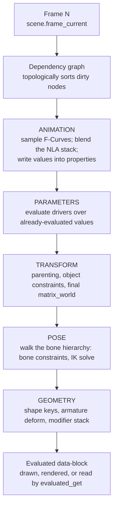
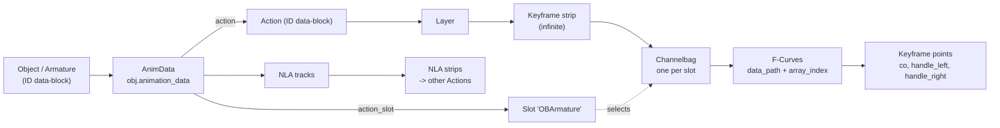
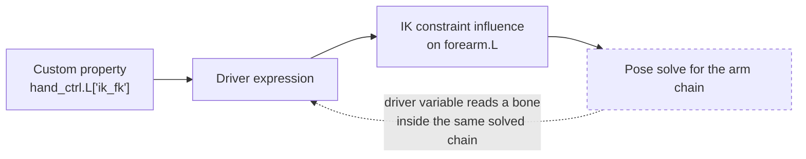
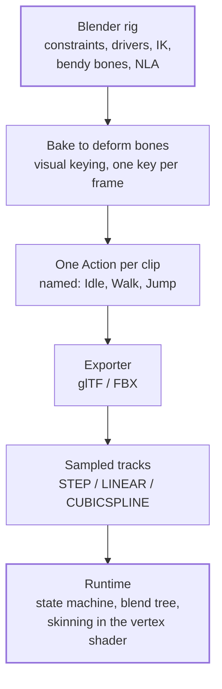

# Blender Animation — A Deep Study Guide

This is a sub-guide of the [Blender guide](BLENDER_STUDY_GUIDE.md), and it assumes you've read that guide's animation and rigging sections — or that you've already keyed a bouncing ball, opened the Graph Editor, and discovered that the buttons make sense but the *results* don't. It is written for a mid-level developer: someone who reads a data model faster than a tooltip, who wants to know what `I` actually writes into the `.blend` file, and who would rather understand the interpolation math once than memorize which handle type "looks right." You do not need graphics-programming background. You do need to be comfortable with the idea that a UI is a view over a data structure.

The organizing idea is a single claim, and everything here is a consequence of it: **an animated pose is a pure function of time, and Blender's animation system is the machinery for defining, composing, and evaluating that function.** Keyframes are sample points; F-Curves are the piecewise cubic Béziers interpolating them; Actions are named bundles of curves; the NLA is a compositing stack over Actions; drivers are the escape hatch where the function reads its own inputs from elsewhere in the scene; and the dependency graph is the evaluator that runs all of it in the right order, every frame, to produce one immutable evaluated copy of your scene. Once you see the pipeline as `frame → curves → properties → constraints → bone matrices → vertices`, the mysteries stop being mysteries: a foot that slides, a character that spins the long way round, a driver that won't update, an export that loses your eases — each one is a specific stage of that pipeline behaving exactly as specified. We go bottom-up through the stages, then spend the back half on the two things that separate a working rig from a shipped shot: **craft** (what makes motion read to a human eye) and **pipeline** (baking, scripting, and getting curves into an engine that has never heard of Bézier handles).

Primary references, in the order you'll actually reach for them: the [Blender Manual's Animation & Rigging chapter](https://docs.blender.org/manual/en/latest/animation/index.html) — parameter-level truth for every widget this guide explains conceptually, and the only source that tracks your exact version; the [Blender Python API reference](https://docs.blender.org/api/current/), whose [`FCurve`](https://docs.blender.org/api/current/bpy.types.FCurve.html) and [`Action`](https://docs.blender.org/api/current/bpy.types.Action.html) pages *are* the data model in machine-readable form; the [Blender source](https://projects.blender.org/blender/blender) (`source/blender/animrig/` and `blenkernel/intern/fcurve.cc`), which settles any argument about evaluation order in about ten minutes of reading; John Lasseter's [*Principles of Traditional Animation Applied to 3D Computer Animation*](https://dl.acm.org/doi/10.1145/37402.37407) (SIGGRAPH 1987) — the paper that carried Disney's twelve principles into computer graphics, and still the best eight pages on why your linear interpolation looks dead; and Ken Shoemake's [*Animating Rotation with Quaternion Curves*](https://dl.acm.org/doi/10.1145/325334.325242) (SIGGRAPH 1985), which is the reason your bone rotations have four channels instead of three. A full annotated bibliography — primary and third-party — is [Part 12](#part-12--the-literature).

Siblings in this repo cover the ground on every side: the [Blender guide](BLENDER_STUDY_GUIDE.md) (the parent — modeling, materials, rendering, and the rigging chapter this one builds on), the [Unreal Engine guide](UNREAL_ENGINE_STUDY_GUIDE.md) (where these animations end up: state machines, blend spaces, and the runtime side of Part 10), the [WebGL/OpenGL guide](WEBGL_OPENGL_STUDY_GUIDE.md) and [WebGPU guide](WEBGPU_STUDY_GUIDE.md) (skinning as it actually executes on a GPU — the vertex shader that consumes the matrices Part 6 produces), and the [Advanced Python guide](ADVANCED_PYTHON_STUDY_GUIDE.md) (for the `bpy` work in Parts 8 and 9).

> Targets Blender **5.2 LTS**; the animation data model changed materially in **4.4** with [Slotted Actions](https://developer.blender.org/docs/release_notes/4.4/upgrading/slotted_actions/), so version notes are called out where a 4.3-and-earlier file or script behaves differently.

---

## Table of Contents

1. [Part 1 — The Evaluation Model: A Pose Is a Function of Time](#part-1--the-evaluation-model-a-pose-is-a-function-of-time)
2. [Part 2 — F-Curves: The Math of Every In-Between](#part-2--f-curves-the-math-of-every-in-between)
3. [Part 3 — Rotation: Euler, Quaternion, and the Bugs They Cause](#part-3--rotation-euler-quaternion-and-the-bugs-they-cause)
4. [Part 4 — Actions, Slots, and the NLA](#part-4--actions-slots-and-the-nla)
5. [Part 5 — Drivers: Animation as Dependency-Tracked Computation](#part-5--drivers-animation-as-dependency-tracked-computation)
6. [Part 6 — Deformation: From Pose to Vertices](#part-6--deformation-from-pose-to-vertices)
7. [Part 7 — The Craft Layer: What Makes Motion Read](#part-7--the-craft-layer-what-makes-motion-read)
8. [Part 8 — Walkthrough: One Jump, Authored Twice](#part-8--walkthrough-one-jump-authored-twice)
9. [Part 9 — Scripting, Baking, and Motion Capture](#part-9--scripting-baking-and-motion-capture)
10. [Part 10 — Shipping: Real-Time Engines and glTF](#part-10--shipping-real-time-engines-and-gltf)
11. [Part 11 — Failure Modes: A Debugging Field Guide](#part-11--failure-modes-a-debugging-field-guide)
12. [Part 12 — The Literature](#part-12--the-literature)
13. [If You Remember a Handful of Things](#if-you-remember-a-handful-of-things)
14. [Where to Go Next](#where-to-go-next)

---

## Part 1 — The Evaluation Model: A Pose Is a Function of Time

### The one-sentence architecture

Set the frame, and Blender computes a scene. Nothing about that computation is incremental or stateful in the way a game engine's tick is: there is no "advance the animation by 16ms." You hand the system a frame number, it evaluates a dependency graph, and out comes a fully-formed scene state. Scrub backwards and you get the identical state you had before, because the state is a *function of the frame*, not an accumulation of updates. This is the single most useful thing to internalize, because it explains a whole class of behavior: why physics simulations (which *are* stateful accumulations) need baking before you can scrub them freely, why constraints never "drift," and why a script that reads a bone's position without telling the depsgraph which frame it wants gets stale data.

The evaluator is the **[dependency graph](https://docs.blender.org/api/current/bpy.types.Depsgraph.html)** ("depsgraph"). It is a DAG whose nodes are *operations* — sample this object's animation, run this driver, compute this object's transform, solve this armature's pose, build this mesh's geometry — and whose edges are the data dependencies between them. Blender topologically sorts it and evaluates the dirty parts, in parallel where the graph allows. Since 2.8, evaluation does not mutate your data: the depsgraph produces **evaluated copies** of data-blocks, leaving the originals (what you see in `bpy.data`) untouched. That split is why `obj.location` in a script returns the value you typed in the sidebar, not the value after constraints — and why the fix is `obj.evaluated_get(depsgraph)`.

### The pipeline, in order

For an animated character, one frame's evaluation runs roughly this sequence. The order is not arbitrary — it is the only order in which each stage's inputs exist:



Three consequences fall straight out of that diagram, and each one is a bug you will otherwise spend an afternoon on:

**Animation happens before constraints, always.** A keyframe on a bone's rotation sets the value that the bone's constraints then get to override. If you key a bone that's under a Copy Rotation constraint at full influence, your key does nothing visible — the constraint wins because it runs later. This is why you animate the *constraint's influence*, or animate the constraint's *target*, rather than fighting it.

**Drivers read evaluated values, so they can create cycles.** A driver is a node in the same graph. If a driver on bone A reads bone B's transform, and B is a child of A, the graph has a cycle; Blender prints `Dependency cycle detected` to the console and breaks the cycle by using a stale value from the previous evaluation. Everything still "works," just one frame late and non-deterministically — the worst possible failure mode. Part 5 covers how to design rigs that don't do this.

**Deformation is last, and it is a consumer.** The mesh doesn't participate in posing at all; the armature computes bone matrices, and the [Armature modifier](https://docs.blender.org/manual/en/latest/animation/armatures/skinning/index.html) reads them to move vertices. That's why the modifier's position in the stack matters (Part 6), and why exporting to a game engine — which does exactly the same thing in a vertex shader — is a matter of handing over the same two things: bone matrices per frame and weights per vertex.

### Where the animation data actually lives

Every animatable data-block can carry an **`AnimData`** block, reachable in Python as `obj.animation_data`. It holds the active **Action**, the **NLA tracks**, and the driver list. Note the plural sources: a property's final value can come from the active Action, from a stack of NLA strips, or from a driver, and they compose in that order.

Inside an Action, animation is addressed by **RNA data paths** — strings that name a property, paired with an integer index for vector components. This is the addressing scheme the whole system is built on, and it is worth reading a few of them out loud:

| Data path | Index | What it animates |
|---|---|---|
| `location` | `2` | The object's Z location |
| `rotation_quaternion` | `0` | The object's quaternion W |
| `pose.bones["hand_ik.L"].location` | `0` | A pose bone's X, in the bone's parent space |
| `pose.bones["torso"]["stretch"]` | — | A custom property on a bone (rig UI slider) |
| `key_blocks["smile"].value` | — | A shape key's slider, on the mesh's `shape_keys` |
| `nodes["Emission"].inputs[1].default_value` | — | A material node socket |

Two things follow. First, **anything with an RNA path is animatable** — that's why you can keyframe a modifier's parameter, a render setting, or a node socket with the same `I` you use on a bone. Second, **data paths are strings, so renaming breaks them.** Rename a bone after animating it and every F-Curve pointing at `pose.bones["old_name"]` goes gray and inert; Blender's rename does patch paths within the same file for bones, but a path stored in another Action, an NLA strip in another file, or a driver expression referencing the old name is exactly as broken as a stale string key anywhere else. Treat bone names as an API you version.

### Frames, seconds, and subframes

The timeline's unit is the **frame**, an integer index; seconds are derived by dividing by the scene's [frame rate](https://docs.blender.org/manual/en/latest/render/output/properties/frame_range.html). Keys live at *float* frame positions, though — the frame you evaluate at can be fractional (`scene.frame_subframe`), and the Graph Editor will happily let you drag a key to frame 12.37. That is almost never what you want: a key at a fractional frame is invisible to whole-frame playback, so the pose you carefully built never actually displays, and the curve near it does something you didn't author. Snap keys to whole frames (`Shift+S` in the Graph Editor, or Key ▸ Snap ▸ Nearest Frame) as a reflex, especially after scaling a block of keys to retime it — scaling by a non-integer factor is how fractional keys get created in the first place.

Frame rate is a project-level decision that changes the *meaning* of every key you set: 12 frames is half a second at 24 fps and a fifth of a second at 60. Pick it before animating. Changing it later doesn't rescale your curves — it reinterprets them, and every piece of timing you tuned by eye is now wrong by the ratio.

```quiz
Q: A script reads `bone.matrix` after setting a driver-controlled custom property, and gets the value from before the change. Why?
- [ ] Python caches bone matrices per session
- [x] It read the original data-block, not the evaluated copy — the depsgraph writes results into evaluated copies, and the script must re-evaluate and read through `evaluated_get(depsgraph)`
- [ ] Drivers only evaluate during rendering
- [ ] Bone matrices only update when the viewport redraws in the same thread
> Since 2.8 evaluation is copy-on-write: `bpy.data` holds your authored values, and the depsgraph produces a separate evaluated scene. Constraints, drivers, and modifiers all write to the evaluated copy, so any script asking "where is this actually" must go through the depsgraph.

Q: You keyframe a bone's rotation, but the bone doesn't move — it stays locked to another bone. What is the most likely cause, given the evaluation order?
- [ ] The keyframe was inserted on the wrong frame
- [ ] The armature's scale is not applied
- [x] A constraint on that bone runs after the animation stage and overrides the animated value, so the key is being computed and then discarded
- [ ] Quaternion channels cannot be keyed directly
> ANIMATION runs before POSE (where bone constraints are solved), so an animated channel is only a *proposal* that a full-influence constraint can overwrite. The fix is to animate the constraint's influence or its target, not the constrained channel.

Q: Why does scrubbing backwards through a keyframed animation always reproduce the same poses, while scrubbing backwards through an unbaked cloth simulation does not?
- [ ] Simulations use single-precision floats and keyframes use double
- [x] Keyframed animation is a pure function of the frame number, while a simulation is an accumulation of state from previous steps, so it must be integrated forward (or cached) rather than evaluated at an arbitrary frame
- [ ] The depsgraph skips simulation nodes when scrubbing backwards
- [ ] Simulation data is stored per-viewport
> This is the practical dividing line in Blender's evaluation model. Anything expressible as `f(frame)` is scrubbable and deterministic; anything stateful needs a cache, which is exactly what baking produces.

Q: What makes a bone's name effectively part of your rig's public API?
- [ ] Bone names are compiled into the armature's binary layout
- [x] F-Curves and drivers address properties by RNA data-path strings like `pose.bones["hand_ik.L"].location`, so a rename invalidates every stored path that isn't patched
- [ ] Exporters sort bones alphabetically
- [ ] Bone names are used as vertex group hashes at render time
> The string-keyed data path is the coupling. Renames inside one file are largely patched for you, but Actions in other files, linked rigs, and expressions that mention the name by hand break silently — the curve stays, it just stops pointing at anything.
```

---

## Part 2 — F-Curves: The Math of Every In-Between

### What a keyframe actually stores

Press `I` and Blender appends a **`BezTriple`** to an F-Curve: three 2D points in (frame, value) space — the key itself plus a left and right **handle** — along with per-key interpolation type, handle types, and easing type. So an F-Curve is not "a list of values" but a **piecewise cubic Bézier function** whose control points you're editing directly. The Graph Editor is a Bézier editor; the fact that you're animating is incidental to the geometry.

The evaluation for a Bézier segment is where an interesting problem hides. A cubic Bézier is parameterized by `t ∈ [0,1]`, giving `(x(t), y(t))` — but you don't want the curve at parameter `t`, you want its value at *frame* `x`. So Blender must invert `x(t)`: given a frame, solve the cubic `x(t) = frame` for `t`, then evaluate `y(t)`. That root-solve happens in [`fcurve.cc`](https://projects.blender.org/blender/blender) for every animated channel on every frame, and it imposes a hard requirement: **`x(t)` must be monotonic**, or the curve would have two values at one instant. Blender enforces this by clamping handle lengths in the time axis (the `correct_bezpart` step) so a handle can never reach past its neighbouring key. This is why dragging a handle far to the right eventually stops having any effect — you've hit the clamp, and the curve you *see* is the clamped one.

The practical consequence for animators is worth stating plainly: **you cannot author "time going backwards" with handles.** If you want a value to overshoot and come back, that's a second key, not a longer handle.

### Interpolation modes

Per-key [interpolation](https://docs.blender.org/manual/en/latest/animation/keyframes/editing.html) controls the segment *after* that key:

| Mode | Curve | Where it's right |
|---|---|---|
| **Constant** | Value holds, then jumps | Blocking passes, visibility toggles, integer-like properties, snap cuts |
| **Linear** | Straight segment, constant velocity | Mechanical motion, conveyor belts, anything genuinely uniform |
| **Bézier** | Cubic with editable handles | Everything else — the default, and where the craft lives |

Blender also ships the **easing equations** — Sinusoidal, Quadratic through Quintic, Exponential, Circular, Back, Bounce, Elastic — each with an Ease In / Ease Out / Ease In-Out variant. These are direct implementations of [Robert Penner's easing equations](https://robertpenner.com/easing/), the same set that motion designers and CSS authors have used for two decades. They're formulas, not editable curves: pick *Bounce Ease Out* and you get a canned bounce whose shape you cannot tune. That makes them excellent for motion graphics and UI-flavored work and a poor fit for character animation, where the whole job is authoring the specific shape.

### Handles: the tangents you're really editing

Each Bézier key has two handles, and the **handle type** is a constraint on how they may move:

- **Auto Clamped** (the default) — Blender picks a smooth tangent for you, *and* flattens the tangent at local extremes so the curve never overshoots past a neighbouring key's value. This is what stops a bouncing ball from dipping below the floor between keys. It's also why beginners think Blender "won't let them" create overshoot.
- **Auto** — smooth tangent chosen for you, without the anti-overshoot clamp.
- **Vector** — the handle points straight at the neighbouring key, making that side effectively linear. Useful for the sharp corner at a ball's contact frame.
- **Aligned** — the two handles stay collinear, so the curve passes through smoothly; drag one, the other mirrors. Symmetric ease.
- **Free** — each side moves independently, so you can have a hard stop coming in and a slow drift going out. Required for deliberate breaks in continuity.

Because the tangent *is* the derivative, reading a Graph Editor curve is reading velocity: **slope is speed, curvature is acceleration, a flat segment is a hold.** An animator squinting at the curve of a hand's Z location and saying "that's floaty" is saying "the slopes are too uniform — there's no acceleration anywhere." This is the single skill that most separates people who can fix their animation from people who can only re-pose it.

### F-Curve modifiers: a function stack on top of the keys

Keys aren't the last word. Each F-Curve carries a stack of [F-Curve modifiers](https://docs.blender.org/manual/en/latest/editors/graph_editor/fcurves/modifiers.html) evaluated *after* the keyframe interpolation, in stack order, each with an influence and an optional restricted frame range. They turn the curve into a small function pipeline:

- **Cycles** — repeats the keyed range forever. With *Repeat with Offset*, each repetition adds the delta between first and last key, which is how a 24-frame walk translates continuously instead of teleporting home. This is the correct way to loop; duplicating keys 40 times is not.
- **Noise** — adds fractal noise with scale, strength, and phase. A handheld camera, a flickering light, a nervous idle. Offsetting phase per channel is the cheap trick for organic-looking imperfection.
- **Generator** — replaces the curve with a polynomial. Perfect constant-rate rotation without keys at all.
- **Built-In Function** — sine, cosine, and friends, with amplitude/phase. Bobbing, breathing, hovering.
- **Stepped Interpolation** — quantizes evaluation to every N frames, non-destructively. This is how you preview "on twos" without touching your keys.
- **Limits** — clamps the curve's output range. A safety rail on a driven value.

Two gotchas that follow from "modifiers run after keys": a curve with a Cycles modifier still *shows* only its keyed range as editable keys — the repetitions are computed, not stored — and a Noise modifier at strength 0.5 makes the curve you see in the editor no longer the values being used, which is a fine way to lose an hour.

### Extrapolation

Outside the first and last key, a curve's **extrapolation** is Constant (hold the end value) by default; switch it to Linear (Channel ▸ Extrapolation Mode) to continue the end slope forever. Constant-hold is the safe default and the reason animation "stops dead" past your last key. Linear extrapolation plus a single pair of keys is the minimum-effort infinite spin.

```quiz
Q: You drag a Bézier handle far to the right, and past a certain point the curve stops changing. What is happening?
- [ ] The handle has hit the Graph Editor's view boundary
- [x] Blender clamps handle length along the time axis so `x(t)` stays monotonic — a non-monotonic time axis would make the curve multi-valued at one frame, which cannot be evaluated
- [ ] The handle type silently switched to Vector
- [ ] Keyframes limit handles to 1/3 of the interval by specification
> Evaluation works by solving `x(t) = frame` for the Bézier parameter and then reading `y(t)`. That inversion requires a single solution per frame, so handles get clamped to keep time strictly increasing. Overshoot in *value* is fine; overshoot in *time* is not representable.

Q: Why is Auto Clamped a good default for a bouncing ball but wrong once you want the ball to squash past its contact value?
- [ ] Auto Clamped disables handles entirely at contact frames
- [x] Auto Clamped flattens tangents at local extremes so the curve never overshoots a neighbouring key's value — exactly what prevents sinking through the floor, and exactly what prevents deliberate overshoot
- [ ] It converts the segment to Linear interpolation at extremes
- [ ] It rounds key values to two decimals
> The clamp is a guardrail against unwanted extrema between keys. When the extremum is the point — overshoot, follow-through, a whip-crack — switch those keys to Free or Aligned and place the tangents yourself.

Q: A 24-frame walk cycle needs to run for 500 frames and keep moving forward. What's the correct mechanism?
- [ ] Duplicate the keys 20 times along the timeline
- [ ] Set extrapolation to Linear on every channel
- [x] A Cycles F-Curve modifier with Repeat with Offset on the forward-translation channel, and plain repeat on the rest — the offset accumulates the per-cycle delta so translation continues instead of snapping back
- [ ] An NLA strip with Hold Forward extrapolation
> Cycles is evaluated after the keys, so the loop costs no extra keyframes and stays editable — fix the cycle once and all 500 frames update. Plain repeat is right for channels that return to their starting value; offset is right for the channel that shouldn't.

Q: What does a long, straight, uniformly-sloped section of an F-Curve tell you about the motion?
- [ ] The keys are on fractional frames
- [ ] The curve has a Noise modifier
- [x] Constant velocity with no acceleration — the classic "floaty" look, because nothing in the physical world starts and stops without easing
- [ ] The interpolation is set to Constant
> Slope is velocity and curvature is acceleration, so a straight run means zero acceleration for its whole duration. Real motion accelerates in and decelerates out; the fix is shaping the tangents, not moving the keys.
```

---

## Part 3 — Rotation: Euler, Quaternion, and the Bugs They Cause

### Three representations, three sets of trade-offs

Blender lets every object and pose bone pick a **rotation mode**, and the choice changes what gets stored in F-Curves — which means it changes what *interpolation* means for that channel. Objects default to XYZ Euler; pose bones default to Quaternion.

**Euler (XYZ and five other orders)** stores three angles applied in a fixed order. It is human-readable, each channel is independently animatable ("rotate only the head's tilt"), and the curves mean something you can reason about. Its failure is **gimbal lock**: when the middle axis rotates 90°, the first and third axes align and you lose a degree of freedom — the rig can still reach every orientation, but not from where you are, and the curves needed to get out are violent. Blender's viewport has a **Gimbal** transform-orientation mode that draws the actual, current rotation axes; watching them collapse onto each other is the fastest way to understand the problem. The mitigation is to pick a rotation order that puts the axis with the least travel in the middle — for a head or a wrist, that's often not XYZ.

**Quaternion (WXYZ)** stores four numbers on the unit 4-sphere. No gimbal lock, and — the reason it exists in graphics — it interpolates cleanly along the shortest arc between orientations. This is [Shoemake's 1985 contribution](https://dl.acm.org/doi/10.1145/325334.325242): spherical linear interpolation ("slerp") on quaternions gives constant-angular-velocity rotation with no singularities. Blender uses quaternions as the default for pose bones because IK, constraints, and blending all behave better in them.

**Axis-Angle** stores an axis plus an angle. Occasionally the clearest way to animate a single hinge-like rotation with an explicit axis; rare in practice.

### The thing nobody tells you: Blender's F-Curves don't slerp

Here is the nuance that costs people entire afternoons. An F-Curve interpolates *one scalar channel*. A quaternion animated with keyframes is **four independent scalar F-Curves** (`rotation_quaternion[0..3]`), each Bézier-interpolated on its own, with the result normalized at evaluation. That is **not** slerp. For small rotations the difference is invisible; for large ones the angular velocity isn't constant, and the interpolated path can bulge in ways you didn't author.

This matters in two ways. First, **you cannot meaningfully hand-edit a single quaternion channel.** Dragging the `W` curve alone changes the rotation in a way no one can predict; quaternion channels are edited as a group or not at all. Second, and much worse: **quaternions double-cover the rotation group.** `q` and `−q` describe the identical orientation, but they are opposite points in the four-dimensional space the curves interpolate through. If one key stores `q` and the next stores `−q`, the componentwise interpolation travels the long way — and you get the notorious **"my character's arm spins 350° between two nearly-identical poses"** bug.

The fix is mechanical: select the offending key's four quaternion channels and negate all four values (`W,X,Y,Z → −W,−X,−Y,−Z`). Same orientation, other hemisphere, short path restored. Blender's Graph Editor also has a **Discontinuity (Euler) Filter** (Key ▸ Discontinuity Filter) which solves the analogous problem for Euler channels — where a value jumps by 360° between keys, usually after importing motion capture or baking constraints — by adding or subtracting full turns to make the sequence continuous. Run it on every Euler channel of freshly baked or imported animation; it's a one-click fix for a class of bug that otherwise looks like the rig exploding for two frames.

### Practical rules

- **Bones that do big, multi-axis rotations** (shoulders, hips, spine, anything under IK) — quaternion. Accept that you edit them as a group.
- **Bones and objects that hinge on one axis** (knees, elbows, doors, wheels, a camera's pan) — Euler, and lock the axes you don't want. The curves stay readable and you can animate a single channel meaningfully.
- **Anything you'll drive with an expression** — Euler, usually, because a driver reading "how much is the elbow bent" wants one number, and `rotational difference` between bones (Part 5) is the alternative when it doesn't.
- **After any bake or import** — run the Euler discontinuity filter, and eyeball quaternion channels for sign flips.

```quiz
Q: Two adjacent keys hold visually identical arm poses, yet the arm swings almost all the way around between them. What happened?
- [ ] Gimbal lock at the shoulder
- [x] The two keys store `q` and `−q` — the same orientation on opposite sides of the quaternion double cover — so componentwise interpolation takes the long path; negating all four components on one key fixes it
- [ ] The rotation mode changed between the keys
- [ ] The F-Curve handles are set to Vector
> Quaternions map two-to-one onto rotations. Blender's curves interpolate the four numbers, not the rotation, so which representative each key stores determines the path taken. Nothing about the poses is wrong — only their coordinates.

Q: Why is editing a single `rotation_quaternion[0]` (W) F-Curve by hand a bad idea?
- [ ] W is read-only in the Graph Editor
- [x] The four channels only mean something together as a unit-length quaternion; changing one and letting normalization fix it up produces a rotation nobody authored or can predict
- [ ] W stores the rotation order, not a value
- [ ] Editing W silently converts the bone to Euler mode
> Each channel is an independent scalar curve, but the *semantics* live in the 4-vector. Edit quaternion keys by posing and re-keying, and reserve single-channel curve surgery for Euler.

Q: When is Euler the better rotation mode for a bone, despite gimbal lock?
- [ ] When the bone is under an IK constraint
- [ ] When the bone rotates more than 180° on two axes
- [x] When the bone is effectively a hinge — a knee, an elbow, a wheel — because a single readable channel can be curve-edited, driven, and locked, and lock is impossible to reach
- [ ] Never; quaternions are strictly better
> Gimbal lock only bites when the middle axis approaches 90° with real motion on the other two. A hinge never gets there, and in exchange you get a curve whose slope you can read as "how fast the knee is bending."

Q: What does the Discontinuity (Euler) Filter fix, and when should it be part of your routine?
- [ ] It removes duplicate keyframes on the same frame
- [x] It removes 360° jumps in Euler channels by adding or subtracting whole turns to keep the sequence continuous — run it after baking constraints or importing motion capture
- [ ] It converts Euler channels to quaternion
- [ ] It snaps keys to whole frames
> Baking samples a rotation matrix into Euler angles frame by frame, and the conversion can pick a different-but-equivalent angle from one frame to the next. The values are all "correct"; the sequence isn't continuous, and interpolation between them spins.
```

---

## Part 4 — Actions, Slots, and the NLA

### Actions are clips, and they're data-blocks

An **[Action](https://docs.blender.org/manual/en/latest/animation/actions.html)** is a named container of F-Curves — a clip. It's a full ID data-block, which brings two consequences a developer will recognize immediately. First, actions are **reference-counted**: an Action with zero users is discarded when the file is saved and reloaded, which is why "I unlinked my walk cycle to try something and it was gone after reload" is a rite of passage. Give any action you care about a **fake user** (the shield icon, `action.use_fake_user = True`) and it survives with zero real users. Second, actions can be **linked and appended between files** like any other data-block, which is the basis of every animation-library workflow.

### Slotted Actions (4.4+)

Before 4.4, one Action animated one data-block, full stop. A character whose animation touched the armature, a mesh's shape keys, and a light's energy needed three Actions moving in lockstep. [Slotted Actions](https://developer.blender.org/docs/release_notes/4.4/upgrading/slotted_actions/) fixed that by adding a level of indirection: an Action contains **slots**, each slot identified by a name and an ID type (e.g. `OBArmature`), and each animated data-block points at both an Action *and* a slot within it. One Action can now carry a whole character's animation, and assigning it to a rig assigns the right subset automatically.

Underneath, the model got a layer of forward-looking structure — the groundwork for the [layered actions](https://developer.blender.org/docs/features/animation/animation_system/layered/) work that is still landing:



In Python, the **channelbag** is what the old `action.fcurves` used to be:

```python
# 4.4+ : explicit slot / layer / strip / channelbag
action = bpy.data.actions.new("Run")
slot   = action.slots.new(id_type='OBJECT', name="Ball")
layer  = action.layers.new("Base")
strip  = layer.strips.new(type='KEYFRAME')
bag    = strip.channelbag(slot, ensure=True)
fcu    = bag.fcurves.new("location", index=2)

obj.animation_data_create()
obj.animation_data.action = action
obj.animation_data.action_slot = slot
```

The legacy `action.fcurves` accessor still exists as a proxy over `layers[0].strips[0].channelbag(slots[0])`, but it was deprecated in 4.4 with removal announced for the 5.x series — write new code against slots, and write *reading* code defensively if it must open older files:

```python
def fcurves_of(action, slot=None):
    """F-Curves of an Action across the 4.4 data-model change."""
    if getattr(action, "layers", None):
        slot = slot or action.slots[0]
        return action.layers[0].strips[0].channelbag(slot).fcurves
    return action.fcurves          # pre-4.4 files
```

### The NLA: a compositing stack over Actions

The **[NLA editor](https://docs.blender.org/manual/en/latest/editors/nla/index.html)** (Non-Linear Animation) treats Actions as clips on tracks, and evaluates the stack bottom-to-top to produce the final property values. If you've used a video editor's track stack or a DAW's mixer, you already have the model — with one important difference, which is that the things being blended are poses, not pixels or samples.

Each **strip** carries the properties that make the stack expressive:

- **Blend mode** — *Replace* (the strip's values win, weighted by influence), *Combine* (blend *relative to the underlying value* — additive for location, multiplicative for scale, quaternion multiplication for rotation), *Add*, *Subtract*, *Multiply*. **Combine is the one to reach for when layering**, because it's the only mode that composes rotations correctly; naïvely adding quaternion components is not a rotation operation, and looks like it.
- **Influence** — a 0–1 weight, itself animatable, which is how you cross-fade from a walk into an idle.
- **Extrapolation** — *Nothing*, *Hold* (the strip's last pose persists past its end), *Hold Forward*. This is the source of the classic "my character snaps back to rest pose at frame 200" and its opposite, "my character is frozen in a pose set 300 frames ago."
- **Playback scale and repeat** — retime a clip without touching its keys.
- **Action clip range** — which slice of the source Action this strip plays, so one Action can serve several strips.

**Tweak mode** (`Tab` on a strip) drops you into editing the strip's underlying Action in place, with the rest of the stack still evaluating around you. It is enormously useful and the source of the single most common NLA confusion: keys inserted while in tweak mode go into *that strip's* Action, and the pose you see is the *blended* result, so what you key and what you see can differ. Exit tweak mode before wondering why your keys "didn't take."

The honest summary: for a single shot of character animation, most animators live in one Action and never open the NLA. It earns its keep for **reusable clip libraries** (game character states), for **layering** a corrective pass on top of a locked-off base without destroying it, and for **assembling** long-form sequences from shot Actions. If you're fighting it on a one-shot, you're probably using it because it exists rather than because you need it.

### Action Constraints and pose assets

Two adjacent mechanisms round out the picture. The **Action constraint** drives a bone's pose from a *frame range of an Action*, indexed by another bone's transform — turn the wrist and the fingers curl, because the wrist's rotation is scrubbing a stored Action. It's the classic pre-shape-key way to build corrective poses and mechanical setups. And **pose assets** — the Asset Browser–based replacement for the old Pose Library — store single poses as tiny Actions you can browse, blend into the current pose with a drag, and share across files, which is how facial-expression libraries and pose kits get built now.

```quiz
Q: You unlink an Action from a rig to test a second version, save, reopen — and the first Action is gone. Why, and what prevents it?
- [ ] Blender deletes Actions not used in the last render
- [x] Actions are reference-counted data-blocks and zero-user data-blocks aren't written on save; setting a fake user (`use_fake_user`) keeps it alive with no real users
- [ ] The Action was moved to the NLA stack automatically
- [ ] Unlinking clears the F-Curves in place
> This is generic ID data-block behavior, not an animation quirk — the same rule that discards unused materials. The shield icon exists precisely because animation clips are routinely parked with no user.

Q: Layering a corrective animation pass on top of a base walk, which NLA blend mode composes bone rotations correctly?
- [ ] Add, because rotations sum
- [ ] Replace with influence 0.5
- [x] Combine — it blends relative to the underlying value, using quaternion multiplication for rotation and multiplication for scale rather than componentwise addition
- [ ] Multiply, because quaternions compose by multiplication
> Componentwise addition of two quaternions is not a rotation and normalizing the sum doesn't make it one. Combine exists because "layer this on top of whatever is underneath" needs per-channel-type semantics, and Replace can't express a relative offset at all.

Q: What does Slotted Actions (4.4+) change about how one Action relates to animated data-blocks?
- [ ] Actions can now contain NLA strips directly
- [x] An Action holds multiple slots, each bound to one animated data-block, so a single Action can carry a whole character's armature, shape-key, and object animation instead of needing one Action per data-block
- [ ] Actions became non-ID data and stop being reference-counted
- [ ] F-Curves moved from Actions onto the objects themselves
> The slot is the indirection: `animation_data.action` plus `animation_data.action_slot` together select a channelbag of F-Curves. It's a packaging change; individual F-Curves are addressed by data path exactly as before.

Q: Keys inserted while in NLA tweak mode seem not to affect the visible pose. What is going on?
- [ ] Tweak mode makes Actions read-only until exited
- [x] The keys go into the tweaked strip's Action, but what you see is that strip blended with the rest of the stack — so an authored value and a displayed value legitimately differ
- [ ] Tweak mode always uses Replace blending at influence 0
- [ ] The keys land on the strip rather than the Action
> Tweak mode edits one layer of a composite. Until you understand which layer you're on and how it blends, the discrepancy looks like keys being ignored; exiting tweak mode and re-checking the same frame settles it instantly.
```

---

## Part 5 — Drivers: Animation as Dependency-Tracked Computation

### What a driver is

A **[driver](https://docs.blender.org/manual/en/latest/animation/drivers/index.html)** replaces a property's value with a computed one. It's a small function whose inputs are named **variables** — each pulling a value from somewhere in the scene — and whose output is written into the driven property every evaluation. Structurally it's a spreadsheet cell: a formula over named references, recomputed whenever a reference changes, with the dependency tracking done for you by the depsgraph.

The variable types are the interesting part, because they define what a driver can *see*:

- **Single Property** — any RNA path on any data-block. The workhorse: read a custom property, a modifier setting, a node socket.
- **Transform Channel** — a specific location/rotation/scale component of an object or bone, in a chosen space (World / Transform / Local). Ask "how far up is this bone," not "what did someone type in the sidebar."
- **Rotational Difference** — the angle between two bones or objects. Exactly what a corrective shape key wants: "how bent is this elbow?"
- **Distance** — between two objects/bones. Stretch factors, proximity effects.
- **Context Property** — reads from the evaluation context (the active scene or view layer), useful for expressions that need scene-level values.

### Simple expressions run without Python

The expression field accepts Python, but Blender first tries to compile it with a **built-in simple-expression parser** that handles arithmetic, comparisons, and a set of math functions with no Python interpreter involved. Staying inside that subset matters more than it looks: simple expressions can be evaluated in parallel across the depsgraph, while a Python expression must take the interpreter lock, serializing driver evaluation on heavily-driven rigs. A rig with 300 Python drivers will scrub visibly worse than the same rig with 300 arithmetic drivers.

Python expressions also collide with security. Blender does not auto-run Python drivers from untrusted files unless [Auto Run Python Scripts](https://docs.blender.org/manual/en/latest/advanced/scripting/security.html) is enabled — a downloaded rig whose drivers "don't work" is usually this, not a broken rig. If you need custom functions, register them into `bpy.app.driver_namespace` from an add-on rather than importing modules inside expressions.

### The rig-as-API pattern

The idiom that makes drivers worth learning is this: **put custom properties on a control bone, and let drivers translate them into rig behavior.** The animator sees `ik_fk`, `stretch`, `finger_curl` sliders in the sidebar; the rigger wires those to constraint influences, bone visibility, and corrective shapes. The property *is* the interface, and the drivers are the implementation. Two canonical uses:

```python
# Driver on the IK constraint's influence, from a custom property on the control.
# Variable `switch` = Single Property -> pose.bones["hand_ctrl.L"]["ik_fk"]
#   expression:  switch                      # 0 = FK, 1 = IK

# Driver on a corrective shape key's value, from how bent the elbow is.
# Variable `bend` = Rotational Difference between "upper_arm.L" and "forearm.L"
#   expression:  clamp(bend / (pi/2), 0, 1)  # full correction at 90 degrees
```

That second one is a working approximation of **pose space deformation** ([Lewis, Cordner & Fong, SIGGRAPH 2000](https://scribblethink.org/Work/PSD/index.html)) — the idea that a corrective shape should be a function of *pose*, not of time. Read that paper once and every corrective-shape workflow in every DCC package stops looking like a bag of tricks.

### Dependency cycles

Because drivers are graph nodes, they can close a loop. The archetypal mistake:



If the driver's variable reads a bone whose evaluation depends on the driver's output, Blender reports `Dependency cycle detected` in the console and resolves it by feeding the driver a *stale* value — typically from the previous frame. The animation then works, one frame late, sometimes, depending on evaluation order. It is far worse than a hard error because it looks fine while scrubbing slowly.

Three ways out, in order of preference: **read from outside the loop** (drive from a control bone that isn't part of the solved chain — this is why rigs have so many non-deform "helper" bones); **split the dependency across data-blocks** (an empty or a separate helper armature that's evaluated independently); and, as a last resort, **bake the driver's input** to keyframes so it stops being a live dependency. The console is the diagnostic tool here — launch Blender from a terminal while rigging, because cycle warnings appear there and nowhere else.

```quiz
Q: A downloaded character rig's face controls do nothing, and no errors appear in the UI. What is the first thing to check?
- [ ] Whether the rig's armature scale is applied
- [x] Whether Auto Run Python Scripts is enabled — Python driver expressions are not evaluated in untrusted files, so drivers silently return nothing
- [ ] Whether the NLA stack has a Replace strip at influence 1
- [ ] Whether the shape keys have a fake user
> This is a security feature, not a bug: a `.blend` can execute arbitrary Python through driver expressions. The tell is that everything else about the rig works and only driven behavior is inert.

Q: Why prefer `sin(angle) * 0.5` over a driver expression that imports a helper module?
- [ ] Imports are forbidden in driver expressions
- [x] Expressions inside Blender's simple-expression subset compile to a fast path that evaluates without the Python interpreter, so they parallelize across the depsgraph instead of serializing on the GIL
- [ ] Python expressions are evaluated only on render, not in the viewport
- [ ] The simple parser caches results between frames
> On a rig with hundreds of drivers this is the difference between a scrubbable rig and a slideshow. Keep expressions arithmetic; push anything genuinely complex into `bpy.app.driver_namespace` or, better, out of drivers entirely.

Q: What makes a dependency cycle in a driver more dangerous than an outright error?
- [ ] It corrupts the Action's F-Curves
- [x] Blender resolves it by using a stale value from a previous evaluation, so the rig appears to work while producing order-dependent, one-frame-late results that only show up in a render or a fast scrub
- [ ] It disables all other drivers in the file
- [ ] It forces the depsgraph into single-threaded mode permanently
> Silent degradation is the worst failure class: nothing prompts you to investigate until frames disagree with the viewport. Watching the console for `Dependency cycle detected` while building a rig turns it back into a loud failure.

Q: A corrective shape key should activate as an elbow bends. Which driver variable type expresses that most directly?
- [ ] Single Property on the forearm's `rotation_quaternion[1]`
- [ ] Distance between the hand and the shoulder
- [x] Rotational Difference between the upper arm and forearm bones — one scalar angle that means exactly "how bent is this joint," independent of rotation mode or quaternion representation
- [ ] Transform Channel on the forearm's local Y scale
> Reading a raw quaternion component ties the driver to a representation that can flip sign and doesn't map linearly to bend angle. Rotational Difference is the pose-space quantity you actually mean — the same quantity Lewis et al.'s pose space deformation parameterizes corrections by.
```

---

## Part 6 — Deformation: From Pose to Vertices

### Linear blend skinning, precisely

Once the pose is solved, moving the mesh is a small, exact piece of math. Each vertex `v` (in rest position) belongs to some bones with weights `w_i` summing to 1. Each bone `i` has a rest ("bind") matrix `B_i` and a current posed matrix `M_i`. The deformed position is:

```
v' = Σ  w_i · ( M_i · B_i⁻¹ ) · v
```

`B_i⁻¹` takes the vertex from world/object space into the bone's rest space; `M_i` puts it back using the bone's current pose. The weighted sum of the results is **linear blend skinning** (LBS) — the same equation running in a game engine's vertex shader, in a browser's WebGL skinning pass ([WebGL/OpenGL guide](WEBGL_OPENGL_STUDY_GUIDE.md)), and in Blender's Armature modifier.

The equation also tells you exactly how skinning fails. Blending *matrices* linearly is not the same as blending *transformations*: for two bones rotated far apart, the averaged matrix shrinks. That's the **candy-wrapper artifact** — twist a forearm 180° and the mesh pinches to a thin waist at the midpoint. It isn't a weighting mistake; it's inherent to averaging rotation matrices.

Blender's answer is the Armature modifier's **Preserve Volume** checkbox, which switches to **dual quaternion skinning** ([Kavan et al., 2007](https://www.cs.utah.edu/~ladislav/kavan07skinning/kavan07skinning.html)) — blending rigid transformations in a space where the interpolation stays rigid, so the twist keeps its volume. It has its own artifact (a bulge at joints under heavy bending) and costs a little more, which is why it's a checkbox rather than the default. The professional's version of this: **twist bones**. Split the forearm into two or three bones that each take a fraction of the wrist's roll, so no single blend spans 180° and both LBS and DQS behave. Every production rig does this, and it's the reason [Rigify](https://docs.blender.org/manual/en/latest/addons/rigify/index.html) generates them for you.

### Weights are a sparse matrix, and weight painting edits it

**Vertex groups** are the storage: per vertex, a sparse list of (group, weight) pairs, where group names match bone names. Weight painting is a brush-shaped editor over that matrix, and the mental model that makes it tractable is that you're editing a partition of unity — every vertex's weights should sum to 1, and the interesting work is entirely in the *transition regions* around joints.

The operational rules that save the most time:

- **Normalize All** (with *Lock Active* where appropriate) after any bulk edit; unnormalized weights produce vertices that shrink or explode, and the symptom (mesh subtly deflating when posed) doesn't look like a weighting problem.
- **Automatic Weights** (`Ctrl+P` ▸ With Automatic Weights) computes an initial solve from bone heat diffusion. It's a starting point, not a result, and it fails predictably where geometry is close but topologically distant — the classic "posing the arm drags the ribcage with it."
- **Mirror weights** rather than painting both sides: name bones and groups `.L`/`.R`, then use *Weights ▸ Mirror* or the *Symmetrize* tooling. Hand-painting both sides guarantees asymmetry you'll notice only in a render.
- **Test with rotation, not translation.** Deformation problems appear at extreme joint angles. Pose the shoulder to its limit, the knee to a full bend, the wrist to a full twist, and fix what tears.
- **Bone envelopes** exist as an alternative weighting scheme and are largely a legacy path for quick blocking; vertex groups are what you ship.

### Shape keys and the pose-space idea

**[Shape keys](https://docs.blender.org/manual/en/latest/animation/shape_keys/index.html)** (blend shapes, morph targets) store per-vertex *offsets* from a Basis shape, blended by a 0–1 slider. They're evaluated before the modifier stack, so a shape key changes the mesh that the Armature modifier then deforms — the right order, and the reason a corrective shape can fix a skinning artifact.

Two uses dominate. **Facial animation**, where the vocabulary of shapes is the rig: the industry's shared taxonomy descends from Ekman's [Facial Action Coding System](https://www.paulekman.com/facial-action-coding-system/), and the de-facto naming standard for real-time work is Apple's [52 ARKit blendshapes](https://developer.apple.com/documentation/arkit/arfaceanchor/blendshapelocation) — worth matching even outside iOS, because every face-capture pipeline speaks it. And **corrective shapes**, driven by joint angle rather than keyed by hand (Part 5), which is [pose space deformation](https://scribblethink.org/Work/PSD/index.html) in practice.

Two mechanical constraints to know: shape keys require **matching vertex counts**, so any topology change after authoring invalidates them; and you cannot apply most modifiers to a mesh that has shape keys, because the operation would have to be applied to every stored shape independently.

### Where the Armature modifier goes in the stack

Modifier order is evaluation order, so it decides what deforms what:

- **Mirror → Armature → Subdivision Surface** is the standard rig order. Mirror first so the mesh is whole before it deforms; subdivide *after* deformation so the smooth surface follows the posed cage rather than deforming an already-dense mesh.
- A **Subdivision Surface before the Armature** is both slower (more vertices to skin) and worse-looking (skinning artifacts get subdivided along with everything else).
- **Corrective Smooth** after the Armature is the standard patch for pinching that weight painting can't reasonably fix.

Finally, the deformation gotcha that eats whole evenings: **apply scale before rigging** (`Ctrl+A` ▸ Scale, on both mesh and armature). Non-unit object scale on an armature makes bone lengths, IK, constraint distances, and exported bone matrices all disagree with what you see, and the symptoms — an IK chain that snaps, a rig that deforms fine in Blender and wrongly in an engine — never point back at the cause.

```quiz
Q: A forearm twisted 180° pinches to a thin waist halfway along. What is the cause, and what is the production fix?
- [ ] Weights don't sum to 1; normalize them
- [ ] The Subdivision Surface modifier is above the Armature modifier
- [x] Linear blend skinning averages rotation matrices, and averaging two far-apart rotations shrinks the result — the standard fix is twist bones that split the roll so no single blend spans a large angle (with Preserve Volume/dual quaternions as the alternative)
- [ ] The mesh has unapplied scale
> Candy-wrapper is inherent to the LBS equation, not to bad weighting, so no amount of painting removes it. Splitting the rotation across intermediate bones keeps every individual blend small enough to behave.

Q: Why does Subdivision Surface belong *after* the Armature modifier?
- [ ] Subdivision cannot read vertex groups
- [x] Modifier order is evaluation order: skinning the low-density cage and then subdividing is both faster and smoother than subdividing first and skinning many more vertices, which also magnifies skinning artifacts
- [ ] The Armature modifier requires a triangulated mesh
- [ ] Subdivision resets shape key values
> The stack is a pipeline, so the question is always "what should this stage consume?" Deform the control cage, smooth the result.

Q: What does the Armature modifier's Preserve Volume option actually switch on?
- [ ] Automatic weight normalization
- [x] Dual quaternion skinning, which blends rigid transformations instead of matrices so twists keep their volume — at the cost of a bulge artifact at heavily bent joints
- [ ] A post-deformation smoothing pass
- [ ] Bone envelope weighting in addition to vertex groups
> It's a different skinning algorithm, from Kavan et al.'s 2007 paper, not a corrective filter. Knowing which artifact each algorithm has is what lets you pick per-character rather than per-habit.

Q: Why can't you apply a Subdivision Surface modifier to a mesh that carries shape keys?
- [ ] Shape keys are stored on the armature, not the mesh
- [x] Applying a modifier that changes vertex count would have to be applied consistently to the Basis and every stored shape, which Blender doesn't do — shape keys are per-vertex offsets and depend on a fixed vertex count
- [ ] The modifier stack is evaluated before shape keys
- [ ] Shape keys lock the mesh data-block against edits
> Shape keys are offsets indexed by vertex, so vertex count and ordering are part of their contract. This is also why retopology after facial work means rebuilding the shapes.
```

---

## Part 7 — The Craft Layer: What Makes Motion Read

Everything up to here is machinery. None of it makes motion look alive, and no amount of it substitutes for the craft — which has its own literature, mostly older than computer graphics.

### The twelve principles, and why they're technical

The canonical source is Thomas & Johnston's [*The Illusion of Life*](https://openlibrary.org/works/OL2924610W) (1981); the source that translated them for 3D — and the one to read if you read one thing — is [Lasseter's 1987 SIGGRAPH paper](https://dl.acm.org/doi/10.1145/37402.37407). It is short, direct, and makes an argument that lands harder now than it did then: computer animation's default output (uniform interpolation between poses) violates nearly every principle simultaneously, so the tooling actively pushes you toward dead motion unless you push back.

Four of the twelve do most of the work, and each maps onto something concrete in the Graph Editor:

**Timing and spacing are different things, and spacing is the one that matters.** Timing is *how many frames* an action takes; spacing is *how the movement is distributed* across them. Two animations with identical keys on identical frames read completely differently depending on the curve between them. Spacing is literally the shape of your F-Curve, and "fix the spacing" means "fix the tangents."

**Slow in / slow out** is easing, and it exists because mass has inertia. Its absence is the number-one tell of amateur 3D. Its overuse is the number-two: everything easing identically reads as syrup. Snappy motion is a *fast* ease-out and a slow ease-in, not the absence of easing.

**Arcs.** Limbs rotate around joints, so their extremities travel on arcs. Straight-line motion reads as robotic, and you cannot judge arcs by scrubbing — you need [motion paths](https://docs.blender.org/manual/en/latest/animation/motion_paths.html), which draw the trajectory with a dot per frame. Read them twice: once for *shape* (is the path a clean arc or a jagged zig-zag?) and once for *spacing* (are the dots bunching at the ends, or evenly distributed like a metronome?). Even dot spacing is the visual signature of missing ease.

**Follow-through and overlap.** Nothing in a body stops at the same time. The hips lead, the chest follows a frame or two later, the head later still, the hair later than that. Mechanically this is just **offsetting keys in the Dope Sheet** — select a channel group, `G`, move two frames right. Doing it is what turns a rig moving from a creature moving.

### The three passes, and why the interpolation mode enforces them

Professional pose-to-pose animation runs in named passes, and Blender's interpolation modes are what make each pass honest:

1. **Blocking** — key only the storytelling poses, all channels on **Constant** interpolation. The character snaps pose to pose like a slideshow. This is deliberate: with no in-betweens to look at, you can only judge *poses and timing*, which are the things that are expensive to change later. Show blocking to your director; approving it is approving the shot.
2. **Splining** — switch to **Bézier** and add **breakdowns**: the in-between poses that decide *how* you travel from A to B (which arc the hand takes, whether the chest leads or lags). The [Breakdowner](https://docs.blender.org/manual/en/latest/animation/armatures/posing/editing/index.html) (`Ctrl+E` in Pose Mode, and since 5.2 also available in Object Mode) interpolates a new pose between the neighbouring keys and lets you slide its bias, which is much faster than hand-posing an in-between. This is the pass where everything goes floaty; that's expected.
3. **Polish** — Graph Editor work. Fix arcs with motion paths, kill floatiness by sharpening eases, offset channels for overlap, add overshoot with Free handles, and hunt down foot slip frame by frame.

Skipping blocking is the most expensive mistake available, because it buries timing problems under smooth curves where they're invisible until someone senior looks at the shot.

### Moving holds, favoring, and the two other things pros do

- **A dead hold is dead.** Holding a pose by repeating an identical key for 20 frames reads as a freeze-frame, not as a character standing still. A **moving hold** keeps a tiny drift — a few centimetres of settle over those 20 frames — so the character stays alive. Mechanically: two keys with slightly different values and long, flat eases.
- **Favor a pose.** Place the breakdown closer to one extreme than the middle. A breakdown at the exact midpoint reads mechanical; favoring it toward the outgoing pose creates anticipation, toward the incoming pose creates impact.
- **Break the joints, then fix.** Push the pose past what the rig "should" do at the extreme frame — that's *exaggeration*, and it reads correct at speed even when it looks wrong on a still.
- **Judge at speed, never while scrubbing.** Scrubbing plays at whatever rate your hand moves, which is not the rate anyone will watch. Play the range on loop (`Space`), and if the viewport can't hit your frame rate, set Playback ▸ Sync ▸ **Frame Dropping** so timing stays truthful. For anything you want a real opinion on, do a **viewport render** ("playblast": Render ▸ View Render Animation, or the OpenGL render button) — minutes instead of hours, and it plays at exact frame rate.

### Physics gives you numbers, use them

Animation is not free-form when gravity is involved, and this is where a developer has an advantage: **compute the frame counts instead of guessing them.** A body in free fall rises and falls under `h = ½gt²`, so for a jump apex of height `h`, the airborne time up is `t = √(2h/g)`. At 24 fps:

| Apex height | Time up | Frames up | Total airborne |
|---|---|---|---|
| 0.25 m | 0.226 s | ~5 | ~11 frames |
| 0.55 m | 0.335 s | ~8 | ~16 frames |
| 1.00 m | 0.451 s | ~11 | ~22 frames |

If your character hangs in the air for 40 frames on a half-metre hop, no amount of curve polish will make it read — the *spacing* is asserting a gravity that isn't Earth's. The same reasoning fixes falling objects, pendulums, and the timing of a bounce (each bounce's height decays by the coefficient of restitution, so the frame counts decay by its square root). Anchor to the numbers, then break them deliberately for style — a cartoon character can hang, but you should know by how much.

```quiz
Q: Two shots have keys on exactly the same frames but read completely differently — one snappy, one mushy. Which principle distinguishes them, and where does it live in Blender?
- [ ] Timing; it lives in the scene frame rate
- [x] Spacing — how the movement is distributed between the keys — which is literally the tangent shape of the F-Curves in the Graph Editor
- [ ] Staging; it lives in the camera
- [ ] Exaggeration; it lives in the pose extremes
> Timing is the frame count, and it's identical in both shots by construction. Everything left is the curve between keys, which is why polish is Graph Editor work rather than key-moving work.

Q: Why block with Constant ("stepped") interpolation rather than starting in Bézier?
- [ ] Constant interpolation evaluates faster on heavy rigs
- [x] With no in-betweens, only poses and timing are visible — so the expensive-to-change decisions get judged and approved before smooth interpolation hides their problems
- [ ] Bézier handles cannot be added to keys created later
- [ ] Constant interpolation prevents auto-keying mistakes
> Blocking is a review gate as much as a technique. Splining a shot whose timing is wrong means redoing the splining, which is why "straight to spline" costs more time than it saves.

Q: A character holds a pose for 20 frames using two identical keys, and the hold reads as a freeze. What's the fix?
- [ ] Add a Noise F-Curve modifier to every channel
- [ ] Switch the segment to Linear interpolation
- [x] Make it a moving hold — a small value change across the hold with long flat eases, so the character keeps drifting almost imperceptibly instead of becoming a still frame
- [ ] Insert a breakdown at the midpoint with the Breakdowner
> Identical keys produce a mathematically flat segment, and human eyes read perfectly flat motion as a broken video. A few centimetres of settle over 20 frames is enough to keep it alive.

Q: Your character's half-metre hop is airborne for 40 frames at 24 fps and looks wrong no matter how you polish the curves. Why?
- [ ] The vertical channel needs Auto Clamped handles
- [x] The spacing implies a gravitational acceleration far below Earth's — for a 0.55 m apex the airborne time is about 16 frames, so the timing itself is asserting physics the audience won't accept
- [ ] Motion paths were not recalculated after retiming
- [ ] The frame rate should be 30 fps for jumps
> Ballistic motion is fully determined by height and gravity, so frame counts are computable rather than a matter of taste. Compute first, then deviate on purpose when the style calls for a hang time.
```

---

## Part 8 — Walkthrough: One Jump, Authored Twice

The rest of this guide is theory until you trace one motion end to end. We'll build a jump — anticipation, launch, ballistic arc, landing, settle — first as an animator would in the UI, then as the same data constructed in Python, and compare what the two produce. A jump is the right example because half of it is physics you should not art-direct and half is entirely performance.

### The plan, in numbers

Scene at 24 fps, ball (or character root) starting on the ground at `z = 0`. Using `t = √(2h/g)` for an apex of ~0.55 m, the airborne half is about 8 frames up and 8 down:

| Frame | Pose | Why |
|---|---|---|
| 1 | Rest, standing | Establish the starting state |
| 8 | Start of crouch | Anticipation begins — the audience needs warning |
| 12 | Deepest crouch, squash | The lowest point; weight loaded |
| 14 | Full extension, toes leaving | Launch: the last contact frame, fully stretched |
| 22 | Apex, `z ≈ 0.55` | Slowest point; hangs a touch |
| 30 | Contact, feet down | Landing — same shape as launch, mirrored |
| 33 | Deepest absorb, squash | Recoil; the impact frame the eye actually reads |
| 40 | Recovered to standing | Settle with a moving hold, not a snap |

Note the asymmetry that makes it read: the anticipation takes 6 frames (8→14), the recovery takes 10 (30→40). Loading is quick and deliberate; recovering from an impact takes longer than causing it.

### Authoring it in the UI

1. **Block it.** Pose at each of the eight frames above and key the whole thing each time — with the *Whole Character* [keying set](https://docs.blender.org/manual/en/latest/animation/keyframes/keying_sets.html) on a rig, or `I` ▸ Location/Rotation/Scale on a simple object. Set all keys to **Constant** interpolation (`T` ▸ Constant in the Dope Sheet or Graph Editor) and play it. You're judging only whether the poses and their frame numbers tell the story.
2. **Spline the vertical.** Switch to Bézier and look at the `Z location` curve alone. The ballistic section must be a **parabola**: flat tangent at the apex (frame 22), and *straight* tangents at launch (14) and contact (30), because gravity gives a non-zero vertical velocity at both — a smoothed tangent there produces the classic "floating into and out of the air" look. Set the launch and contact keys' airborne-side handles to **Vector** or **Free** and match their slope to the launch speed. (A cubic Bézier can represent a quadratic exactly, so a correctly-handled arc is not an approximation of the parabola — it *is* one.)
3. **Shape the ground contact.** The crouch (12) and absorb (33) are the frames with real curve work: fast in, slow out of the crouch; a hard, fast entry into the absorb. This is the frame the viewer reads as "weight."
4. **Squash and stretch.** Scale down/wide at 12 and 33, up/thin at 14, with **volume preserved** by eye (down 20% in Z, up ~10% in X and Y). Key scale on the same frames so the deformation stays synchronized with the vertical.
5. **Offset the secondary.** Arms, head, anything trailing: select those channels in the Dope Sheet and move them 1–2 frames later. Nothing arrives on the same frame.
6. **Check the arc.** Enable motion paths over 1–40 and look at the dot spacing. It should bunch tightly at the apex (slow) and spread near launch and contact (fast). If it's even, gravity is missing.

### Authoring it in Python

The same curve, constructed explicitly. This is worth doing once even if you never script animation, because it shows you exactly what the UI writes:

```python
import bpy

FPS    = bpy.context.scene.render.fps      # 24
G      = 9.81                              # m/s²
LAUNCH, APEX, LAND = 14, 22, 30

t_up   = (APEX - LAUNCH) / FPS             # 0.333 s
height = 0.5 * G * t_up ** 2               # 0.545 m
v0     = G * t_up                          # 3.27 m/s  ->  0.136 m per frame
v_frame = v0 / FPS

obj = bpy.data.objects["Ball"]
obj.animation_data_create()

# Ground -> launch -> apex -> land, on the Z channel only.
keys = [(LAUNCH, 0.0), (APEX, height), (LAND, 0.0)]
for frame, z in keys:
    obj.location.z = z
    obj.keyframe_insert(data_path="location", index=2, frame=frame)

fcu = next(fc for fc in fcurves_of(obj.animation_data.action)
           if fc.data_path == "location" and fc.array_index == 2)

# Handles: flat at the apex, sloped by the real launch/landing velocity.
dx = (APEX - LAUNCH) / 3.0
for kp in fcu.keyframe_points:
    kp.handle_left_type = kp.handle_right_type = 'FREE'
    f, z = kp.co
    if f == APEX:                                  # apex: zero vertical velocity
        kp.handle_left  = (f - dx, z)
        kp.handle_right = (f + dx, z)
    elif f == LAUNCH:                              # leaving the ground, moving up
        kp.handle_left  = (f - dx, z)
        kp.handle_right = (f + dx, z + v_frame * dx)
    else:                                          # landing, moving down
        kp.handle_left  = (f - dx, z + v_frame * dx)
        kp.handle_right = (f + dx, z)

fcu.update()        # recompute cached handle data after direct assignment
```

Three details in that snippet are the whole lesson. `keyframe_insert` is the same operator path the `I` key uses, so scripted and hand-made keys are indistinguishable in the file. Writing `handle_left`/`handle_right` directly requires calling `fcu.update()` afterwards, because the F-Curve caches derived data that direct assignment bypasses — omit it and the curve draws wrong until something else dirties it. And `fcurves_of` is the version-tolerant accessor from [Part 4](#part-4--actions-slots-and-the-nla), because on 4.4+ the curves live in a channelbag, not directly on the Action.

Now verify the result numerically, without touching the viewport:

```python
for f in range(LAUNCH, LAND + 1, 2):
    print(f, round(fcu.evaluate(f), 4))
```

`FCurve.evaluate()` runs the same interpolation the depsgraph does, with no scene update — the fast, side-effect-free way to inspect a curve. Compare its output to the closed form `z(t) = v0·t − ½g·t²` and you'll find the Bézier reproduces it to within float noise, which is the concrete proof that "shape the tangents correctly" and "obey physics" are the same instruction.

### What the two authoring paths teach

The UI version is faster for everything with taste in it: the crouch's ease, the squash proportions, the offsets. The script version is unbeatable for everything determined by arithmetic — ballistic arcs, cycles with exact periods, gear ratios, mechanical rigs, and retiming a hundred shots to a new frame rate. Real pipelines use both, and the boundary is exactly the line between "computable" and "art-directed." Knowing which side of that line a problem sits on is most of what makes a technical animator useful.

---

## Part 9 — Scripting, Baking, and Motion Capture

### The `bpy` animation API in one page

```python
import bpy
import math

obj = bpy.data.objects["Cube"]

# 1. Insert / delete keys through the same path the UI uses
obj.keyframe_insert(data_path="location", index=2, frame=10)
obj.keyframe_delete(data_path="location", index=2, frame=10)

# 2. Bulk-create keys efficiently: allocate once, fill with foreach_set
fcu  = ...                                    # an FCurve from a channelbag
n    = 240
flat = []
for f in range(1, n + 1):
    flat += [float(f), math.sin(f / 12.0)]    # (frame, value) pairs
fcu.keyframe_points.add(n)
fcu.keyframe_points.foreach_set("co", flat)
fcu.update()

# 3. Evaluate a curve without touching the scene
value = fcu.evaluate(37.0)

# 4. Read what the scene *actually* is, after constraints and drivers
deps = bpy.context.evaluated_depsgraph_get()
eval_obj = obj.evaluated_get(deps)
world_pos = eval_obj.matrix_world.translation

# 5. Read a posed bone's world matrix
arm = bpy.data.objects["Rig"].evaluated_get(deps)
hand = arm.pose.bones["hand.L"]
world_hand = arm.matrix_world @ hand.matrix
```

Performance notes that matter as soon as your script touches more than a few hundred keys. `keyframe_insert` is convenient and slow — it goes through RNA, finds-or-creates curves, and re-sorts; for bulk work, `add(n)` + [`foreach_set`](https://docs.blender.org/api/current/bpy.types.FCurve.html) writes a flat float buffer in one call and is orders of magnitude faster. `scene.frame_set(f)` forces a full depsgraph re-evaluation, so a loop that steps 1,000 frames to sample a constrained bone is doing 1,000 scene evaluations — unavoidable when you need constraint results, and worth avoiding by using `fcu.evaluate()` when you only need curve values. And the original/evaluated split from Part 1 is the rule: `obj.location` is authored data, `obj.evaluated_get(deps).matrix_world` is truth.

### Baking: collapsing computation into keys

**Baking** samples the evaluated result of constraints, drivers, IK, and physics into plain keyframes, one per frame. You bake for four reasons: to export (engines don't have your constraints), to hand off (another animator shouldn't need your rig), to freeze a simulation into editable animation, and to break a dependency cycle. The cost is bulk and loss of editability — a baked curve has a key on every frame, so the smooth control of eight keys is gone.

```python
bpy.ops.nla.bake(
    frame_start=1, frame_end=48,
    only_selected=True,          # selected bones only
    visual_keying=True,          # key the CONSTRAINT RESULT, not the authored value
    clear_constraints=False,     # True to strip constraints after baking
    use_current_action=True,
    bake_types={'POSE'},         # or {'OBJECT'}
)
```

`visual_keying` is the flag that matters: without it you key the underlying, pre-constraint values and get nothing useful. After any bake, run the **Euler discontinuity filter** (Part 3) and consider a **key decimation** pass (Graph Editor ▸ Key ▸ Clean Keyframes, or the Decimate operator with an error tolerance) to get from one-key-per-frame back to something a human can edit.

### Motion capture and the retargeting problem

Importing motion is easy — Blender reads [BVH](https://docs.blender.org/manual/en/latest/files/import_export/index.html) and FBX skeletal animation directly. **Retargeting** it is the hard part, and it's a real research problem: the captured skeleton has different bone lengths, a different rest pose, and a different hierarchy than your character, so copying joint rotations naively puts the feet through the floor and the hands through the hips. The foundational treatment is [Michael Gleicher's *Retargetting Motion to New Characters*](https://dl.acm.org/doi/10.1145/280814.280820) (SIGGRAPH 1998), which frames it as constrained optimization: preserve the *constraints that matter* (the foot is planted, the hand is on the door handle) while adapting everything else to the new proportions — a framing that every modern retargeting tool still implements some approximation of.

In practice you'll use tooling: Blender's own constraint-based approach (Copy Rotation from source bones to target bones, then bake with `visual_keying`), or third-party add-ons — **Auto-Rig Pro**'s remapper and **Rokoko**'s free Blender add-on are the two most common. Whatever you use, the workflow is the same shape: match rest poses, map bones, transfer, bake, then *fix the contacts by hand*, because that's exactly what the algorithm can't infer.

### Headless rendering and pipeline glue

The [command line](https://docs.blender.org/manual/en/latest/advanced/command_line/render.html) is where animation work becomes automation:

```bash
# Render frames 1-48 of a file to PNGs, on a build server with no display
blender -b shot_010.blend -o //render/shot_010_#### -F PNG -s 1 -e 48 -a

# Run a script against a file, passing your own args after the -- separator
blender -b rig.blend --factory-startup -P export_clips.py -- --out ./build --fps 30
```

`-b` is background (no UI), `--factory-startup` ignores user preferences and add-ons so builds are reproducible, and everything after `--` is invisible to Blender and available to your script via `sys.argv`. This is the basis of every "export every action as a separate glTF clip on CI" pipeline, and it's a natural fit for the [GitHub Actions guide](GITHUB_ACTIONS_STUDY_GUIDE.md)'s patterns if you want the exports built on push.

```quiz
Q: A script bakes a constrained IK arm to keyframes but the baked animation ignores the constraints entirely. What was wrong?
- [ ] `bake_types` was set to `{'POSE'}` instead of `{'OBJECT'}`
- [x] `visual_keying=False` — without it the bake records the authored channel values rather than the evaluated, post-constraint result
- [ ] The frame range excluded the constrained frames
- [ ] Constraints must be deleted before baking
> Baking exists to snapshot the *evaluated* pipeline, and visual keying is the switch that reads from the evaluated side. It's the same original-vs-evaluated distinction as `evaluated_get`, exposed as an operator flag.

Q: Why is `keyframe_points.add(n)` plus `foreach_set("co", ...)` dramatically faster than a loop of `keyframe_insert` calls?
- [ ] It skips creating BezTriples entirely
- [x] It allocates the keys once and writes a flat float buffer in a single C-level call, instead of going through RNA property resolution, curve lookup, and re-sorting on every individual insert
- [ ] It defers evaluation to render time
- [ ] `keyframe_insert` always triggers a full depsgraph rebuild
> This is the standard Blender-Python performance pattern — `foreach_get`/`foreach_set` on any collection of simple values. The cost is that you must call `fcurve.update()` yourself afterwards, since you bypassed the code that maintains cached handle data.

Q: What does the `--` separator do in `blender -b rig.blend -P script.py -- --out ./build`?
- [ ] It tells Blender to run the script after rendering
- [x] It ends Blender's own argument parsing, so everything after it is ignored by Blender and available to the script through `sys.argv` — the standard way to pass parameters into a headless job
- [ ] It enables factory startup for the script's session
- [ ] It suppresses the script's stdout
> Without it, Blender tries to interpret `--out` as one of its own flags and errors. With it, a Blender script gets ordinary CLI ergonomics, which is what makes CI-driven export pipelines practical.

Q: Why does retargeting motion capture require more than copying joint rotations from the source skeleton?
- [ ] Rotations are stored as quaternions in BVH and Euler in Blender
- [x] Bone lengths, rest poses, and hierarchies differ, so identical joint rotations produce different world-space contacts — the constraints that matter (planted feet, hands on objects) must be preserved explicitly, which is the optimization problem Gleicher's 1998 paper formalizes
- [ ] Motion capture data is always recorded at 120 fps
- [ ] BVH files store world-space positions that cannot be converted
> Rotations transfer; *contacts* don't. Every retargeting tool is some approximation of "keep the constraints, adapt the rest," and the leftover foot slide is why a human always finishes the job.
```

---

## Part 10 — Shipping: Real-Time Engines and glTF

### The impedance mismatch

Blender's animation model is richer than any real-time runtime's. A game engine wants, per animation clip, a set of **sampled tracks** — bone translation/rotation/scale at times, plus morph-target weights — and nothing else. It has no concept of your constraints, your drivers, your NLA blend modes, your bendy bones, or your Bézier handles. Everything you built to make animation *authorable* has to collapse into something *evaluable* at 60 Hz on a phone.



### glTF, concretely

[glTF 2.0](https://registry.khronos.org/glTF/specs/2.0/glTF-2.0.html) is the open standard and the sane default target; Blender's [exporter](https://docs.blender.org/manual/en/latest/addons/scene_gltf2.html) is maintained by Khronos as [glTF-Blender-IO](https://github.com/KhronosGroup/glTF-Blender-IO). What the format gives you, and what it costs:

- **Interpolation is `STEP`, `LINEAR`, or `CUBICSPLINE`** — there are no editable tangents. Blender's Bézier eases don't survive as curves; the exporter *samples* them (one key per frame by default) so the motion is preserved even though the representation isn't. That's why an exported file is much larger in key count than your source, and why disabling sampling to "optimize" silently changes your eases into straight lines.
- **Skinning is joints + weights, four per vertex per set.** Vertices influenced by more bones get their smallest weights dropped and the rest renormalized at export. If a character deforms subtly differently in-engine, this is a prime suspect — limit weights (Weights ▸ Limit Total, 4) *in Blender* so you see the result you're shipping.
- **Morph targets are supported**, so shape-key animation exports as animated weights — the path for ARKit-style facial animation.
- **Constraints, drivers, and IK do not exist.** They must be baked. The exporter does this for you when exporting animation, but knowing it is happening explains the output.
- **Clip organization** comes from the exporter's animation mode: active Action, all Actions, NLA tracks, or scene range. "One Action per clip, named like the engine expects" is the pipeline convention that makes the rest easy.
- **Y-up.** glTF is Y-up and Blender is Z-up; the exporter converts. Don't pre-rotate your scene to compensate — you'll double-apply it.

FBX remains common for Unreal and Maya-centric pipelines. Its extra hazards are conventions rather than capabilities: **unit scale** (Blender metres vs FBX centimetres — set the exporter's scale properly rather than scaling your scene), **bone axis conventions** (the exporter's Primary/Secondary Bone Axis settings, which decide whether your bones arrive rotated), and **leaf bones** (added by default, and usually unwanted in engines).

Two rig-side habits make either format behave. **Export deform bones only** — control bones, IK targets, and pole targets have no meaning in an engine and just inflate the skeleton; mark deform bones and use the exporter's "only deform bones" option. And **decide about root motion explicitly**: either animate in place and let the engine's locomotion move the character, or drive a dedicated root bone and export the motion with it. Ambiguity here is the source of characters that moonwalk or that translate twice as fast as intended.

### What happens on the other side

In the engine, your clips become nodes in a graph: a **state machine** picks which clip is playing, a **blend tree** or blend space mixes several by parameters like speed and direction, and the result is sampled and skinned. The modern alternative is **motion matching** — introduced to the industry in Büttner and Clavet's [GDC 2015 talk](https://www.gdcvault.com/play/1022985/Motion-Matching-and-The-Road) — which throws out the graph and instead searches a large database of motion each frame for the pose that best matches the current trajectory and desired direction. Its descendants use learned models to compress that database: Holden's [Phase-Functioned Neural Networks](https://theorangeduck.com/page/phase-functioned-neural-networks-character-control) (SIGGRAPH 2017) and [Learned Motion Matching](https://theorangeduck.com/page/learned-motion-matching) (SIGGRAPH 2020) are the canonical reads, both from the author's own site with the papers attached.

The practical implication for you as the person producing clips: **motion-matching pipelines want long, continuous, un-looped captures with clean contacts; state-machine pipelines want short, tightly-looped, precisely-named clips.** They are different deliverables from the same rig, and finding out which one the engine team expects is a conversation to have before you animate 40 clips. The [Unreal Engine guide](UNREAL_ENGINE_STUDY_GUIDE.md) covers the runtime side in depth.

```quiz
Q: An exported glTF plays your animation correctly but the file has a key on every frame, where your source had eight. Why?
- [ ] The exporter duplicated keys to work around a precision bug
- [x] glTF's samplers only support STEP, LINEAR, and CUBICSPLINE — there are no editable Bézier tangents, so the exporter samples the curve per frame to preserve the motion the tangents produced
- [ ] Blender bakes all animation on save
- [ ] The NLA stack was flattened into keys
> The format models sampled tracks, not authoring curves. This is also why turning sampling off to shrink the file changes the motion: without the samples, the eases the tangents encoded are simply gone.

Q: A character deforms slightly differently in-engine than in Blender, especially around the shoulders. What's the likely cause?
- [ ] The engine uses dual quaternion skinning and Blender uses linear blend
- [x] glTF/FBX carry four bone influences per vertex per set, so vertices weighted to more bones lose their smallest weights and get renormalized at export — running Limit Total (4) in Blender makes the shipped result visible while authoring
- [ ] The bind pose was exported in Y-up
- [ ] Shape keys were exported as morph targets
> Shoulders and hips are where weight counts creep past four. Limiting in Blender turns a surprise into an authoring decision you can compensate for.

Q: Why export deform bones only, rather than the whole rig?
- [ ] Exporters cannot handle bones with custom shapes
- [x] Control bones, IK targets, and pole targets are authoring machinery with no runtime meaning — the engine only needs the bones that actually skin vertices, and shipping the rest inflates the skeleton and every animation track
- [ ] Control bones break the four-weight limit
- [ ] Non-deform bones cannot be baked
> The engine's skeleton is a deformation skeleton. Every extra bone costs per-frame track data and per-instance matrices for nothing.

Q: How do motion-matching and state-machine pipelines differ in what they want from you as the animator?
- [ ] Motion matching requires all clips to be exactly 24 frames
- [x] State machines want short, cleanly-looped, precisely-named clips to blend between; motion matching wants long continuous motion with good contacts, because it searches a database each frame rather than following authored transitions
- [ ] Motion matching cannot use hand-keyed animation
- [ ] State machines require morph targets for all transitions
> They're different deliverables from the same rig, so the question "which one is the runtime using?" belongs at the start of production, not after 40 clips exist.
```

---

## Part 11 — Failure Modes: A Debugging Field Guide

Most animation bugs are one of about a dozen things. Each of these maps to a stage of the Part 1 pipeline, which is the fastest way to diagnose an unfamiliar one: ask *which stage produced this value*, and check that stage's inputs.

**Feet slide along the ground.** The planted foot's controller isn't actually held still across the contact frames — either the keys around the plant differ slightly, or the curve between two identical keys overshoots. Fix with IK feet (so the foot is a world-space target rather than the end of an FK chain), identical keys on the plant frames, and **Auto Clamped or flat handles** across the hold. Motion paths on the foot make even a two-centimetre slip obvious.

**A limb spins the long way between two similar poses.** Quaternion sign flip: one key holds `q`, the next `−q`. Negate all four channels on one key (Part 3).

**A rotation goes crazy for two frames after a bake or import.** Euler discontinuity — a 360° jump between samples. Run Key ▸ Discontinuity (Euler) Filter on the affected channels.

**The mesh moves twice as far as the bone.** Double transform: the mesh is both parented to the armature (or a bone) *and* carrying an Armature modifier, so the transform is applied twice. Keep the modifier, clear the parent-inverse relationship, or use exactly one of the two mechanisms.

**IK snaps, bones stretch weirdly, or the export is scaled wrong.** Unapplied object scale on the armature or mesh. `Ctrl+A` ▸ Scale, in Object Mode, before rigging — and if you're past that point, apply and re-check weights.

**An animation vanished after reload.** The Action had zero users and wasn't saved. Fake user (Part 4). Same rule for pose assets and anything else parked without a link.

**A driver does nothing on a downloaded file.** Auto Run Python Scripts is disabled (Part 5), and Python-expression drivers are inert. Enable it only for files you trust.

**A driven value is right sometimes and one frame late other times.** Dependency cycle. Check the console for `Dependency cycle detected`; restructure so the driver reads something outside the loop.

**Keys "don't take" while working in the NLA.** You're in tweak mode, and what you see is the blended stack, not the Action you're keying (Part 4). `Tab` out and re-check.

**Everything snaps back to rest pose partway through the timeline.** An NLA strip's extrapolation is *Nothing* rather than *Hold*, or the active Action ends and there's nothing beneath it.

**Playback looks stepped when nothing is set to Constant.** A Stepped Interpolation F-Curve modifier is still enabled from a previewing pass, or the viewport is dropping frames. Check both — one is your data, the other is your monitor.

**Motion paths show an arc you already fixed.** Paths are a cached calculation; they don't update live. Recalculate after every change you want to judge.

**Curves are covered in keys you didn't mean to set.** Auto-keying with everything being keyed. Turn on *Only Insert Needed* (Preferences ▸ Animation) so channels are keyed only when their value actually changes, and prefer an explicit keying set over `I` ▸ All Transforms.

**Keys have landed on fractional frames.** Someone scaled a block of keys by a non-integer factor. Select all and Key ▸ Snap ▸ Nearest Frame, then re-check the poses that moved.

```quiz
Q: A mesh moves roughly twice as far as its armature bone. What's the standard cause?
- [ ] The Armature modifier is below the Subdivision Surface modifier
- [x] Double transform — the mesh is parented to the armature or a bone *and* has an Armature modifier, so the deformation is applied twice
- [ ] Vertex weights sum to 2 instead of 1
- [ ] The bone's rotation mode is Axis-Angle
> Parenting and the modifier are two different mechanisms for the same result, and using both stacks them. Blender's `Ctrl+P` ▸ With Automatic Weights sets up exactly one of them, which is why the bug usually appears in hand-assembled rigs.

Q: The console prints `Dependency cycle detected` but the rig looks fine while you scrub. Why not ignore it?
- [ ] Cycles disable undo for the session
- [x] The cycle is resolved with a stale value, so results depend on evaluation order and can differ between the viewport and a render — a class of bug that shows up only in the final output
- [ ] It prevents the file from being saved
- [ ] It silently switches drivers to Python evaluation
> "Works while scrubbing" is precisely the trap. Deterministic evaluation is the property you're giving up, and you find out you gave it up at render time.

Q: An animator reports that keys they set are being ignored, and they're working with an NLA stack open. What do you check first?
- [ ] Whether the Action has a fake user
- [x] Whether they're in tweak mode — keys go into the tweaked strip's Action while the viewport shows the blended stack, so authored and displayed values legitimately differ
- [ ] Whether Only Insert Needed is enabled
- [ ] Whether the strip's blend mode is Combine
> The stack is a composite, so "what I keyed" and "what I see" are different quantities by design. Exiting tweak mode resolves the confusion in one keystroke.

Q: What is the most reliable general method for diagnosing an animation bug you've never seen before?
- [ ] Re-import the rig into a fresh file
- [x] Identify which stage of the evaluation pipeline produced the wrong value — animation, drivers, constraints, pose solve, or deformation — and inspect that stage's inputs, since each stage's output is fully determined by the ones before it
- [ ] Bake everything to keyframes and compare
- [ ] Disable modifiers one at a time until the symptom disappears
> The pipeline is a chain of pure functions, so bugs localize. Baking and bisecting are useful tactics, but they're searches; knowing the order turns the search into a lookup.
```

---

## Part 12 — The Literature

Animation is unusual among software-adjacent disciplines in having a genuine canon, split cleanly between **the papers and specs that define the machinery** and **the books and courses that teach the craft**. Both halves are load-bearing; an animator who has read only the second will produce beautiful work that won't export, and an engineer who has read only the first will ship technically perfect motion that nobody wants to watch.

### Primary literature

**Official documentation and source.**

- [Blender Manual — Animation & Rigging](https://docs.blender.org/manual/en/latest/animation/index.html). Version-tracked, parameter-complete, and the arbiter when this guide and your Blender build disagree. The [Graph Editor](https://docs.blender.org/manual/en/latest/editors/graph_editor/index.html), [NLA](https://docs.blender.org/manual/en/latest/editors/nla/index.html), and [Drivers](https://docs.blender.org/manual/en/latest/animation/drivers/index.html) chapters correspond to Parts 2, 4, and 5 here.
- [Blender Python API reference](https://docs.blender.org/api/current/). The [`FCurve`](https://docs.blender.org/api/current/bpy.types.FCurve.html), [`Keyframe`](https://docs.blender.org/api/current/bpy.types.Keyframe.html), [`Action`](https://docs.blender.org/api/current/bpy.types.Action.html), [`ActionSlot`](https://docs.blender.org/api/current/bpy.types.ActionSlot.html), [`ActionChannelbag`](https://docs.blender.org/api/current/bpy.types.ActionChannelbag.html), and [`NlaStrip`](https://docs.blender.org/api/current/bpy.types.NlaStrip.html) pages are the data model stated precisely; read them as a schema.
- [Slotted Actions upgrade notes](https://developer.blender.org/docs/release_notes/4.4/upgrading/slotted_actions/) and the [layered actions design docs](https://developer.blender.org/docs/features/animation/animation_system/layered/). The rationale for the 4.4 data model and where the system is heading — the only place the design intent is written down.
- [The Blender source](https://projects.blender.org/blender/blender). `source/blender/animrig/` for the animation data model, `blenkernel/intern/fcurve.cc` for evaluation and handle clamping. When a behavior seems inexplicable, thirty minutes here beats three hours of experiments.

**Papers that define the machinery.** All are short by modern standards and all are still directly applicable:

- John Lasseter, [*Principles of Traditional Animation Applied to 3D Computer Animation*](https://dl.acm.org/doi/10.1145/37402.37407) (SIGGRAPH 1987). The bridge document between Disney's craft and computer graphics. Read first.
- Ken Shoemake, [*Animating Rotation with Quaternion Curves*](https://dl.acm.org/doi/10.1145/325334.325242) (SIGGRAPH 1985). Why your bones have four rotation channels, and what slerp is actually doing.
- Doris Kochanek & Richard Bartels, [*Interpolating Splines with Local Tension, Continuity, and Bias Control*](https://dl.acm.org/doi/10.1145/964965.808575) (SIGGRAPH 1984). TCB splines — the interpolation model Maya and 3ds Max grew up on, and the reason curve behavior differs between packages.
- Nestor Burtnyk & Marceli Wein, [*Interactive Skeleton Techniques for Enhancing Motion Dynamics in Key Frame Animation*](https://dl.acm.org/doi/10.1145/360271.360288) (CACM 1976). The origin of computer-assisted keyframing and skeletal deformation, from the National Research Council of Canada.
- J.P. Lewis, Matt Cordner & Nickson Fong, [*Pose Space Deformation*](https://scribblethink.org/Work/PSD/index.html) (SIGGRAPH 2000). Corrective shapes as a function of pose — the theory behind every driven corrective in every package.
- Ladislav Kavan et al., [*Skinning with Dual Quaternions*](https://www.cs.utah.edu/~ladislav/kavan07skinning/kavan07skinning.html) (I3D 2007). What Preserve Volume turns on, and the artifact trade it makes.
- Michael Gleicher, [*Retargetting Motion to New Characters*](https://dl.acm.org/doi/10.1145/280814.280820) (SIGGRAPH 1998). Motion capture retargeting as constrained optimization.
- Andrew Witkin & Zoran Popović, [*Motion Warping*](https://dl.acm.org/doi/10.1145/218380.218422) (SIGGRAPH 1995). Editing existing motion by deforming it in time and space — the conceptual ancestor of every "adjust the bake without destroying it" layer.
- Andreas Aristidou & Joan Lasenby, [*FABRIK: A fast, iterative solver for the Inverse Kinematics problem*](http://www.andreasaristidou.com/publications/papers/FABRIK.pdf) (2011). A readable modern IK solver, useful for understanding what your IK constraint is doing and why it sometimes flips.
- Daniel Holden et al., [*Phase-Functioned Neural Networks for Character Control*](https://theorangeduck.com/page/phase-functioned-neural-networks-character-control) (2017) and [*Learned Motion Matching*](https://theorangeduck.com/page/learned-motion-matching) (2020). Where real-time character animation went after state machines.

**Specs and platform references.** [glTF 2.0](https://registry.khronos.org/glTF/specs/2.0/glTF-2.0.html) and the Khronos-maintained [glTF-Blender-IO](https://github.com/KhronosGroup/glTF-Blender-IO) exporter; Apple's [ARKit blend shape locations](https://developer.apple.com/documentation/arkit/arfaceanchor/blendshapelocation) as the de-facto facial vocabulary; [Robert Penner's easing equations](https://robertpenner.com/easing/), which Blender's easing interpolation modes implement; and Paul Ekman's [Facial Action Coding System](https://www.paulekman.com/facial-action-coding-system/), the taxonomy underneath facial rig naming.

### Third-party literature

**Books.**

- Frank Thomas & Ollie Johnston, [*The Illusion of Life: Disney Animation*](https://openlibrary.org/works/OL2924610W) (1981). The source of the twelve principles. Slow, expensive, and worth it; read it as a primary historical document rather than a manual.
- Richard Williams, [*The Animator's Survival Kit*](https://www.faber.co.uk/product/9780571238347-the-animators-survival-kit/). The single most practical book on the craft — walks, runs, weight, timing charts, and spacing — and the one most working animators reach for. Read this before *Illusion of Life* if you only read one.
- Rick Parent, [*Computer Animation: Algorithms and Techniques*](https://shop.elsevier.com/books/computer-animation/parent/978-0-12-415842-9). The textbook for the machinery side: interpolation, quaternions, IK, skinning, and physically-based motion, with the math written out. This guide's Parts 2, 3, and 6 are a tour of its table of contents.
- Jason Osipa, [*Stop Staring: Facial Modeling and Animation Done Right*](https://openlibrary.org/works/OL16944675W). Still the clearest treatment of building a facial rig that an animator can actually perform with, shape-key vocabulary included.
- Jason Gregory, [*Game Engine Architecture*](https://www.gameenginebook.com/). Its animation chapter is the best explanation of what happens to your clips after export — clip storage, blend trees, and skinning at runtime.

**Courses and structured practice.**

- [Blender Studio](https://studio.blender.org/training/) — first-party but not documentation, so it lands here: the [Animation Fundamentals](https://studio.blender.org/training/animation-fundamentals/) course is taught by the animators who make Blender's own open movies, and the accompanying [production character rigs](https://studio.blender.org/characters/) are free, professional, and the best thing to practice on. Reading a production rig is the animation equivalent of reading a well-written codebase.
- [11 Second Club](https://www.11secondclub.com/) — a monthly acting competition with a supplied audio clip and public critique. Structured deadlines and honest feedback are what actually move animation skill; this is the cheapest source of both.
- [CGDive](https://cgdive.com/) — the most thorough independent coverage of Blender rigging specifically (Rigify internals, constraint systems, bone mechanics), which is where most animation problems turn out to originate.
- [P2Design Academy](https://p2design-academy.com/) (Pierrick Picaut) — Blender-specific animation courses from a working animator, notable for teaching the Graph Editor as a first-class tool rather than an afterthought.
- Büttner & Clavet's [Motion Matching and The Road to Next-Gen Animation](https://www.gdcvault.com/play/1022985/Motion-Matching-and-The-Road) (GDC 2015) — the industry talk that reset how real-time animation is authored and shipped.

---

## If You Remember a Handful of Things

1. **A pose is a pure function of the frame, evaluated by a dependency graph.** Every stage — animation, drivers, constraints, pose solve, deformation — consumes the one before it, so any wrong value can be localized to the stage that produced it.
2. **Blender's original data and its evaluated data are different objects.** `bpy.data` is what you authored; the depsgraph's evaluated copy is what's true. Half of all scripting confusion is reading the wrong one.
3. **F-Curves are piecewise cubic Béziers, and the tangent is the velocity.** Fixing "floaty" or "snappy" means editing slopes, not moving keys — and handle clamping exists because time must stay monotonic.
4. **Quaternion channels are four scalar curves, not a rotation.** They don't slerp, they can flip sign, and the long-way-round spin is a coordinate problem with a one-click fix.
5. **Actions are reference-counted data-blocks; the NLA is a blend stack over them.** Fake users prevent lost work, and Combine is the only blend mode that composes rotations correctly.
6. **Drivers are spreadsheet cells in the dependency graph.** Keep expressions in the simple-expression subset for speed, expose rig behavior as custom properties, and treat `Dependency cycle detected` as an error even though Blender doesn't.
7. **Skinning is a weighted sum of matrices, so its artifacts are inherent, not mistakes.** Candy-wrapping comes from averaging rotations; twist bones and dual quaternions are the two real answers.
8. **Block in stepped, spline second, polish in the Graph Editor.** The interpolation mode is what keeps each pass honest, and skipping blocking hides timing errors under smooth curves.
9. **Where physics applies, compute the frame counts.** Ballistic arcs, bounce decay, and pendulum periods are arithmetic; art-direct the parts that aren't.
10. **Engines want sampled tracks and deform bones only.** Everything that makes a rig authorable — constraints, drivers, IK, Bézier handles — has to be baked away at the border, so design your rig knowing where that border is.

---

## Where to Go Next

- **Read [*The Animator's Survival Kit*](https://www.faber.co.uk/product/9780571238347-the-animators-survival-kit/) cover to cover, with Blender open.** It is the definitive craft book and the only one whose exercises translate one-to-one into keys on a timeline. Do its walk and run charts in Blender rather than reading them.
- **Do the [Blender Studio Animation Fundamentals](https://studio.blender.org/training/animation-fundamentals/) course on a [production rig](https://studio.blender.org/characters/).** Building beats reading, and using a professionally built rig removes the "is this me or the rig?" ambiguity that wastes months of self-teaching.
- **Read the source papers while the machinery is fresh** — [Lasseter 1987](https://dl.acm.org/doi/10.1145/37402.37407) first, then [Shoemake 1985](https://dl.acm.org/doi/10.1145/325334.325242) and [Lewis et al. 2000](https://scribblethink.org/Work/PSD/index.html). Each one turns a Blender feature you now use into a design decision you understand.
- **Break one real rig on purpose.** Take a Blender Studio character, twist a forearm 180° and find the candy-wrapper, deliberately negate one quaternion key and watch the long-way spin, wire a driver into a dependency cycle and read the console warning, then bake it all and export it to glTF and diff the key counts. Every failure mode in Part 11 takes about five minutes to reproduce, and reproducing them is what makes them recognizable at 2 a.m. later.
- **Enter one [11 Second Club](https://www.11secondclub.com/) round.** A deadline, a fixed audio clip, and public critique will teach you more about acting and timing in a month than another year of tutorials.
- **Adjacent guides in this repo:** the [Blender guide](BLENDER_STUDY_GUIDE.md) (the parent — rigging, modeling, and rendering context for everything here), the [Unreal Engine guide](UNREAL_ENGINE_STUDY_GUIDE.md) (state machines, blend spaces, and what your exported clips become), the [WebGL/OpenGL guide](WEBGL_OPENGL_STUDY_GUIDE.md) and [WebGPU guide](WEBGPU_STUDY_GUIDE.md) (the vertex-shader side of the skinning equation in Part 6), the [Advanced Python guide](ADVANCED_PYTHON_STUDY_GUIDE.md) (for serious `bpy` tooling), and the [GitHub Actions guide](GITHUB_ACTIONS_STUDY_GUIDE.md) (for turning the headless exports in Part 9 into CI).

If you do exactly one thing after this guide, make it this: animate a ball bouncing across the screen — no rig, no character, one object and three channels — and refuse to call it done until the arcs are clean in motion paths, the contact frames are sharp, the squash preserves volume, and the frame counts match the gravity you claim. Every skill in this guide is in that exercise, and the Graph Editor fluency it builds is the thing that transfers to everything else.
