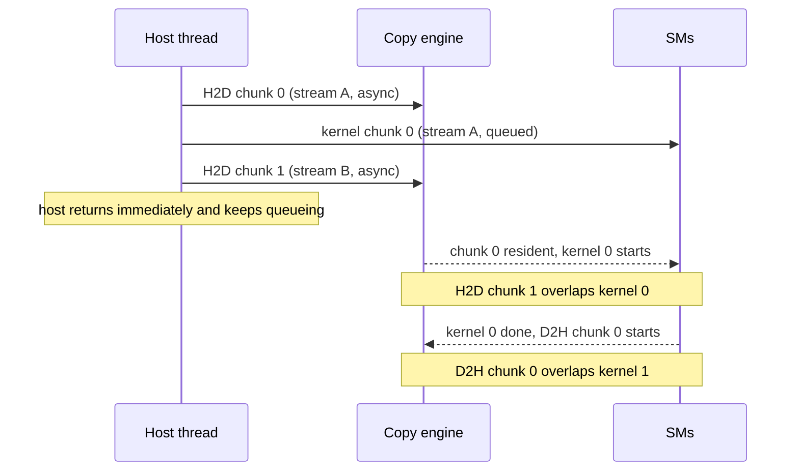
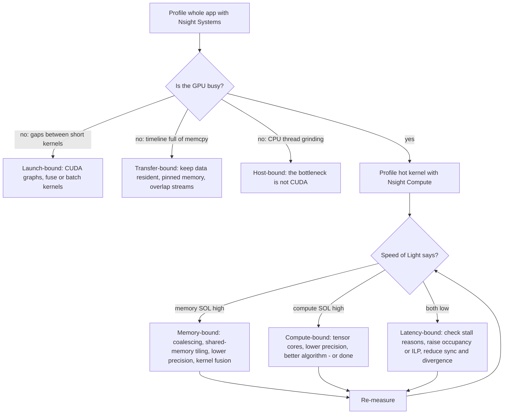

# GPU Programming with CUDA Study Guide

A depth-first guide to CUDA and the GPU performance stack for engineers who are comfortable in C/C++ or Python and want to understand what actually happens on the GPU — not just how to call `model.cuda()`. It assumes you can read C++ and reason about memory and caches on a CPU, but not that you've ever written a kernel, thought in warps, or read a profiler timeline. By the end you should be able to write a correct kernel, explain *why* it's slow, and make it fast — or, just as importantly, recognize when the right move is to call a library someone else spent a decade tuning.

The organizing idea, which every section returns to: **a GPU is a throughput machine.** A CPU is built to make one thread finish as soon as possible; a GPU is built to keep tens of thousands of threads in flight and doesn't care when any individual one finishes. Every CUDA concept — warps, blocks, occupancy, streams, shared memory, coalescing, tensor cores — is a strategy for keeping that army of threads fed. And because feeding threads means feeding them *data*, performance work on a GPU is almost always memory work: the guide's spine is the memory hierarchy, from registers down to HBM, and the single most useful mental model is the roofline — the question "is this kernel limited by bytes or by FLOPs?" The payoff of that framing is the final third of the guide, where the same memory-hierarchy reasoning that speeds up a matmul turns out to be exactly how FlashAttention made transformers dramatically faster.

Primary references, each worth the slot: the [CUDA C++ Programming Guide](https://docs.nvidia.com/cuda/cuda-c-programming-guide/) — the authoritative description of the programming model, from thread hierarchy to memory semantics, and the document every claim in this guide can be checked against; [*Programming Massively Parallel Processors*](https://shop.elsevier.com/books/programming-massively-parallel-processors/hwu/978-0-323-91231-0) (Hwu, Kirk & El Hajj, 4th ed.) — the definitive textbook, which teaches the *reasoning* (tiling, coarsening, roofline thinking) rather than API trivia; the [CUDA C++ Best Practices Guide](https://docs.nvidia.com/cuda/cuda-c-best-practices-guide/) — NVIDIA's own distillation of what actually matters for performance, in priority order; the [Triton documentation and tutorials](https://triton-lang.org/main/index.html) — the Python-embedded kernel language that has become the default way ML engineers write custom GPU code; and the [Nsight Compute documentation](https://docs.nvidia.com/nsight-compute/) — because the profiler is where GPU intuition actually gets built.

This guide has siblings in this repo that go deeper on adjacent ground: the [WebGPU guide](WEBGPU_STUDY_GUIDE.md) (portable, browser-sandboxed GPU compute — the cross-platform counterpoint to everything native and NVIDIA-specific here), the [C++26 guide](CPP26_STUDY_GUIDE.md) (host-language depth — CUDA C++ is C++, and the host side of a CUDA program is ordinary modern C++), the [Compiler Internals guide](COMPILER_INTERNALS_STUDY_GUIDE.md) (what `nvcc`, PTX, and SASS actually involve — CUDA compilation is a two-stage compiler pipeline), the [LLM Application Development guide](LLM_APP_DEV_STUDY_GUIDE.md) and [AI Agents guide](AI_AGENTS_STUDY_GUIDE.md) (the workloads that made this skill white-hot), and the [Advanced Linux guide](ADVANCED_LINUX_STUDY_GUIDE.md) (drivers, `perf`-style tooling culture, and the OS layer your GPU sits on).

---

## Table of Contents

1. [Part 1 — Why GPUs: The Throughput Machine](#part-1--why-gpus-the-throughput-machine)
2. [Part 2 — The SIMT Execution Model and the Hardware](#part-2--the-simt-execution-model-and-the-hardware)
3. [Part 3 — The Memory Hierarchy](#part-3--the-memory-hierarchy)
4. [Part 4 — CUDA C++ Basics](#part-4--cuda-c-basics)
5. [Part 5 — The Matmul Ladder](#part-5--the-matmul-ladder)
6. [Part 6 — Streams, Graphs, and Cooperation](#part-6--streams-graphs-and-cooperation)
7. [Part 7 — Profiling as a Discipline](#part-7--profiling-as-a-discipline)
8. [Part 8 — Tensor Cores, Mixed Precision, and Libraries First](#part-8--tensor-cores-mixed-precision-and-libraries-first)
9. [Part 9 — Triton and the AI Performance Stack](#part-9--triton-and-the-ai-performance-stack)
10. [Part 10 — The Ecosystem Beyond CUDA](#part-10--the-ecosystem-beyond-cuda)

---

## Part 1 — Why GPUs: The Throughput Machine

Before any syntax, get the design philosophy right, because every confusing thing about CUDA stops being confusing once you see what the hardware is optimizing for.

### Latency Machines vs. Throughput Machines

A modern CPU core is a **latency-oriented** design. Its transistor budget goes overwhelmingly to making *one instruction stream finish sooner*: megabytes of cache to avoid memory waits, branch predictors to avoid pipeline stalls, out-of-order execution to find something useful to do during the waits it can't avoid, and high clock speeds. The arithmetic units — the part that does the actual math — are a small fraction of the die. This is the right trade for workloads where a single thread's latency matters: parsing a request, chasing pointers through a B-tree, running a state machine.

A GPU is a **throughput-oriented** design, and it makes the opposite trade everywhere. Cores are simple, in-order, and slower-clocked; there is no branch prediction worth the name and no out-of-order window. In exchange, the die is packed with arithmetic units — a modern data-center GPU has over a hundred **streaming multiprocessors (SMs)**, each with dozens of execution lanes, for tens of thousands of concurrent hardware threads. The numbers are lopsided enough to be qualitative: a server CPU socket delivers on the order of 1–2 FP32 TFLOPS and a few hundred GB/s of memory bandwidth; a current data-center GPU delivers tens of FP32 TFLOPS, *petaFLOP-class* throughput on its matrix units at low precision, and 2–8 TB/s of memory bandwidth from on-package **HBM** (high-bandwidth memory). That bandwidth gap — roughly an order of magnitude — is the single most consequential number in this guide, and Part 3 is built around it.

The key mechanism to internalize: **a GPU hides latency with parallelism instead of avoiding it with caches and speculation.** When a group of GPU threads issues a memory load that will take ~500 cycles, the hardware doesn't stall and it doesn't speculate — its scheduler simply switches to *another* group of resident threads, in a single cycle, with zero context-switch cost, because every resident thread's registers live permanently in an enormous register file. As long as enough threads are resident, the arithmetic units never starve, and the 500-cycle latency is invisible. This is why "keep tens of thousands of threads fed" is the through-line of the whole guide: the machine only works when it's oversubscribed. A CPU with 64 runnable threads is thrashing; a GPU with 64 runnable threads is essentially idle.

### Amdahl, Gustafson, and Why GPUs Won Anyway

[Amdahl's law](https://docs.nvidia.com/cuda/cuda-c-best-practices-guide/) is the classic argument *against* parallel hardware: if a fraction `s` of your program is serial, speedup is capped at `1/s` no matter how many processors you add — 10% serial code caps you at 10× forever. Taken at face value, that makes a 100,000-thread machine look pointless.

Gustafson's reframing explains why GPUs won anyway: **you don't run a fixed problem faster, you run a bigger problem in the same time.** The parallel fraction isn't a constant of nature — it grows with problem size. Graphics scaled from thousands of pixels to millions; scientific simulation scaled grid resolution; and deep learning is the purest Gustafson workload in history — when the hardware got 10× faster, the field didn't finish training 10× sooner, it trained models 10× (then 1000×) bigger. The workloads grew to fill the machine. When you evaluate whether something belongs on a GPU, ask the Gustafson question — "does the parallel part scale with the problem?" — not just the Amdahl one.

### What Maps Well, and What Doesn't

Workloads that thrive on a GPU share three properties: **massive data parallelism** (the same operation over millions of independent elements), **regularity** (neighboring threads do the same thing to neighboring data), and enough **arithmetic per byte** — or at least enough sheer parallelism — to keep the units busy. Dense linear algebra, convolutions, image and signal processing, physics simulation, sorting and prefix-scans at scale, ray tracing, and — the reason you're probably reading this — every layer of a transformer.

Workloads that map badly: pointer-chasing with unpredictable access patterns, workloads dominated by branching on per-element state, small problems (launching work on a GPU costs microseconds and thousands of threads of setup — a 1,000-element loop is faster on the CPU), and anything whose data lives on the host and is touched once. That last one deserves its own warning: the GPU is connected to the host over PCIe at roughly 64 GB/s ([Gen5 x16](https://docs.nvidia.com/cuda/cuda-c-best-practices-guide/)) — 30–100× slower than the GPU's own memory. A computation that reads each byte once from host memory is bounded by PCIe no matter how fast the GPU is. The rule, straight from the [Best Practices Guide](https://docs.nvidia.com/cuda/cuda-c-best-practices-guide/): **move data to the GPU once, keep it resident, and run as much of the pipeline there as possible.** "Copy over, run one fast kernel, copy back" is the signature shape of a disappointing first CUDA program.

If you remember one thing from Part 1: **the GPU trades single-thread latency for aggregate throughput, and hides memory latency with oversubscription rather than caches.** Every design rule in the following parts — why warps exist, why occupancy matters, why divergence hurts, why coalescing is non-negotiable — is downstream of that trade.

```quiz
Q: A warp of GPU threads issues a load that takes ~500 cycles. What does the hardware do?
- [x] Switches to another resident warp in a single cycle and keeps computing
- [ ] Speculatively executes past the load using branch prediction
- [ ] Stalls the SM until the data arrives
- [ ] Serves the load from a large per-thread cache so the wait never happens
> GPUs hide latency with parallelism, not avoidance. Registers for every resident thread stay in the register file permanently, so swapping warps is free — but this only works when enough warps are resident, which is why occupancy (Part 2) exists as a concept.

Q: Your pipeline copies 10 GB to the GPU over PCIe, runs one kernel that reads each byte once, and copies results back. Why will a faster GPU barely help?
- [ ] The kernel cannot use more than one SM
- [x] The job is bounded by the ~64 GB/s PCIe link, which is 30-100x slower than HBM
- [ ] GPUs cannot process data larger than their L2 cache
- [ ] The copy invalidates the GPU's caches
> Data touched once from the host makes PCIe the bottleneck regardless of on-device speed. The fix is architectural, not kernel-level: keep data resident and run more of the pipeline on the GPU, or accept that this workload doesn't belong there.

Q: Amdahl's law says 10% serial code caps speedup at 10x. Why did massively parallel GPUs succeed anyway?
- [ ] Modern compilers eliminate the serial fraction automatically
- [ ] GPUs execute the serial fraction faster than CPUs
- [ ] Amdahl's law only applies to shared-memory machines
- [x] Real workloads grew with the hardware — the parallel fraction scales with problem size, which is Gustafson's framing
> Amdahl assumes a fixed problem; Gustafson observes that you run a bigger problem in the same time. Deep learning is the extreme case: faster hardware led to bigger models, not shorter runs. Evaluate GPU-worthiness by whether the parallel part scales.

Q: Which workload is the worst candidate for a GPU?
- [x] Walking a linked list of 100,000 nodes where each step depends on the previous pointer
- [ ] Applying the same filter to 20 million pixels
- [ ] Multiplying two 8192x8192 matrices
- [ ] Summing 500 million floats
> Pointer-chasing is serial by construction — each load depends on the last, so there's no parallelism to hide latency with, and the GPU's simple in-order cores lose badly to a CPU's caches and prefetchers. The other three are regular, massively data-parallel, and scale.
```

---

## Part 2 — The SIMT Execution Model and the Hardware

CUDA's programming model has three levels — you write code for one *thread*, threads are grouped into *blocks*, and blocks form a *grid* — and the hardware adds a fourth level you never declare but must always think about: the *warp*. Getting these four straight, and knowing which guarantees each level does and doesn't give you, is the difference between reading CUDA and understanding it.

### Threads, Blocks, Grids

A **kernel** is a function that runs on the GPU, executed by every thread in a **grid**. The grid is divided into **thread blocks** (up to 1,024 threads each); you choose both sizes at launch. Inside the kernel, built-in variables tell each thread who it is: `threadIdx` (position within the block), `blockIdx` (block's position in the grid), `blockDim` and `gridDim` (the sizes). The idiom that starts nearly every kernel computes a global index from them — you'll see it in Part 4.

The two levels have sharply different guarantees, and the difference is load-bearing:

- **Threads within a block** can cooperate: they share a fast on-chip **shared memory** scratchpad and can synchronize at a barrier with `__syncthreads()`. A block always runs on a single SM, which is what makes that cooperation physically possible.
- **Blocks are independent by contract.** They may run in any order, on any SM, concurrently or sequentially, and cannot (in the basic model) synchronize with each other or exchange data mid-kernel. This restriction is not a limitation to route around — it is *the* scalability mechanism. Because blocks are independent, the same binary saturates a laptop GPU with 20 SMs and a data-center GPU with 150: the hardware just schedules blocks onto whatever SMs exist, like a work queue. (The escape hatch for the rare grid-wide sync is cooperative groups, Part 6.)

```text
Grid
├── Block (0,0) ──────────────┐   ├── Block (1,0) ─────────── ...
│   threads 0..1023           │   │
│   ┌────────────────────┐    │   │   Blocks: independent,
│   │ Warp 0: t0  ..t31  │    │   │   schedulable on any SM,
│   │ Warp 1: t32 ..t63  │    │   │   in any order.
│   │ Warp 2: t64 ..t95  │    │   │
│   │  ...               │    │   │   Threads in a block: share
│   └────────────────────┘    │   │   shared memory, can barrier.
│   shared memory (on-chip)   │   │
└──────────────────────────────┘   │   Warps: the unit the
                                       hardware actually runs.
```

### The Warp: SIMT, Precisely

The hardware does not execute threads one at a time. It executes them in **warps** of 32: the SM's scheduler picks a warp and issues *one instruction* that all 32 threads (called *lanes*) execute together, each on its own data. NVIDIA calls this **SIMT** — single instruction, multiple threads ([Programming Guide, SIMT architecture](https://docs.nvidia.com/cuda/cuda-c-programming-guide/)).

How SIMT differs from SIMD matters more than it first appears. In **SIMD** (SSE/AVX on CPUs), *one thread* explicitly issues vector instructions over vector registers — the width is baked into the ISA and your code (`_mm512_add_ps` is unmistakably 16 floats wide). In **SIMT**, you write ordinary scalar code for one logical thread — with per-thread control flow, per-thread pointers, per-thread everything — and the *hardware* groups 32 of those threads and runs them in lockstep. The vectorization is implicit. That's the model's genius (scalar code, vector hardware) and its trap: the lockstep is real even though your code doesn't show it, and two consequences follow.

**Consequence 1: warp divergence.** If threads *within one warp* take different branches, the warp executes *both* paths, with the threads on the inactive path masked off. A branch where half the warp goes each way costs the sum of both sides. Diverging on `threadIdx.x % 2` is the worst case; branching on something uniform across the warp (or across the whole block) costs nothing. Divergence between *different* warps is completely free — warps are independent instruction streams. So the rule is: **organize your data and thread mapping so that the 32 threads of a warp make the same decisions.** (Since the Volta generation, each thread has its own program counter — *independent thread scheduling* — which fixes some deadlock hazards, but it does not repeal the economics: the SM still issues one instruction per warp per cycle, so divergent paths still serialize.)

**Consequence 2: memory access is per-warp too.** The 32 loads a warp issues in one instruction are coalesced — or not — into memory transactions as a group. This is the subject of Part 3, and it dwarfs divergence in practical importance.

### Inside an SM, and Occupancy

An **SM** is the unit of the hardware worth holding in your head: it contains a large **register file** (typically 64K 32-bit registers), a block of on-chip memory split between **shared memory and L1 cache** (100–228 KB on recent generations), four **warp schedulers**, the CUDA cores (FP32/INT32 lanes), and the **tensor cores** (Part 8). A GPU is just an array of 20–150+ of these plus an L2 and memory controllers.

Each SM can host a limited number of **resident warps** — typically 48–64 — and here Part 1's latency-hiding story becomes a concrete budget. **Occupancy** is the ratio of resident warps to that maximum, and what limits it is resource division: every resident thread needs its registers *permanently allocated* (that's what makes warp switching free), and every resident block needs its shared memory carved out. Use 128 registers per thread and at most 512 threads' worth of warps fit the 64K register file; ask for 100 KB of shared memory per block and only one block fits an SM. The [occupancy calculator built into Nsight Compute](https://docs.nvidia.com/nsight-compute/) does this arithmetic for you.

The mature view on occupancy — the one the [Best Practices Guide](https://docs.nvidia.com/cuda/cuda-c-best-practices-guide/) itself takes — is that it's **a means, not a score**. You need *enough* resident warps to hide latency; beyond that, more occupancy buys nothing. A kernel with high instruction-level parallelism or heavy data reuse in registers can run at full memory bandwidth at 25–50% occupancy, and *chasing* 100% by squeezing register usage can backfire spectacularly: the compiler spills registers to "local" memory, which physically lives in slow global DRAM, and your kernel gets slower while its occupancy metric improves. The right question is never "is occupancy high?" but "is the kernel's limiting resource actually latency?" — which is what the profiler (Part 7) tells you.

If you remember one thing from Part 2: **you write code for one thread, but the hardware runs warps of 32 in lockstep and schedules independent blocks onto SMs** — so cooperation happens inside a block, performance happens at the granularity of a warp, and scalability comes from blocks being independent.

```quiz
Q: Inside a kernel, half the threads of each warp take the `if` branch and half take the `else`. What does this cost?
- [ ] Nothing — GPUs predict branches like CPUs do
- [ ] The kernel deadlocks because warps must stay in lockstep
- [ ] Only the first warp is penalized; the scheduler reorders the rest
- [x] Each warp executes both paths with inactive lanes masked off, paying the sum of the two branch costs
> SIMT issues one instruction per warp per cycle, so intra-warp divergence serializes the paths. The same branch taken uniformly per warp — or diverging only across different warps — costs nothing, which is why data layout and thread mapping should align decisions to warp boundaries.

Q: Why does CUDA forbid synchronization between thread blocks in the basic model?
- [x] Block independence is what lets the same binary scale across GPUs with any number of SMs — blocks are scheduled like items on a work queue
- [ ] Inter-block synchronization is physically impossible on shared silicon
- [ ] Blocks would corrupt each other's registers
- [ ] It is a legacy restriction kept for backward compatibility
> Because blocks may run in any order on any SM, the hardware can fill whatever machine you have. A guaranteed-concurrent grid-wide sync would require all blocks resident at once, which is exactly what cooperative launch (Part 6) negotiates — and why it's opt-in and constrained.

Q: How does SIMT differ from CPU SIMD?
- [x] In SIMD one thread issues explicit vector instructions; in SIMT you write scalar per-thread code and the hardware runs 32 threads in lockstep implicitly
- [ ] SIMT is just marketing for SIMD; the programming models are identical
- [ ] SIMD executes scalar code; SIMT requires explicit vector intrinsics
- [ ] SIMT vectorizes only floating-point code, SIMD any code
> SIMT hides the vector width behind the thread abstraction: per-thread branches and pointers are legal, and the hardware masks lanes as needed. The convenience is real, but so is the hidden lockstep — divergence and per-warp memory behavior are where the abstraction leaks.

Q: You force your kernel from 64 to 32 registers per thread to raise occupancy from 50% to 100%, and it gets slower. What most likely happened?
- [ ] Higher occupancy increased warp divergence
- [ ] The extra warps overflowed the L2 cache
- [ ] The scheduler cannot handle more than 50% occupancy
- [x] The compiler spilled the evicted values to local memory, which lives in slow global DRAM — trading cheap register reads for memory traffic
> Occupancy is a means (enough warps to hide latency), not a score. Register spills convert the cheapest storage on the chip into the most expensive, and a kernel with good ILP or data reuse may already have been hiding latency fine at 50%.
```

---

## Part 3 — The Memory Hierarchy

This is the spine of the guide. GPU arithmetic is so fast relative to memory that nearly every kernel's fate is decided by how it moves bytes, and every optimization in Parts 5–9 is a memory-hierarchy maneuver. Learn the levels, their round-number costs, and the two access rules (coalescing and bank conflicts), and most GPU performance behavior stops being mysterious.

### The Levels and Their Round Numbers

```text
                     scope        size (per SM / GPU)     latency        bandwidth
  ┌──────────────┐
  │  registers   │  per thread   256 KB per SM            ~1 cycle       widest — effectively free
  ├──────────────┤
  │ shared / L1  │  per block    up to ~228 KB per SM     ~20-30 cyc     ~TB/s per SM aggregate
  ├──────────────┤
  │      L2      │  whole GPU    tens of MB               ~200 cyc       ~10 TB/s
  ├──────────────┤
  │  HBM (DRAM)  │  whole GPU    24-192 GB                ~400-800 cyc   2-8 TB/s
  ├──────────────┤
  │ host link    │  CPU <-> GPU  system RAM               ~microseconds  PCIe ~64 GB/s
  └──────────────┘                                                       NVLink ~900+ GB/s
```

Exact numbers shift each generation; the *ratios* are stable and are what you should memorize. Each level down costs roughly an order of magnitude in latency or bandwidth. Registers are private per thread and effectively free. **Shared memory** is a *programmer-managed* scratchpad — the same physical array as L1, but you decide what lives there and when, which is what makes the tiling in Part 5 possible. L2 is shared by the whole chip. **HBM** — "global memory" in CUDA terms — is where `cudaMalloc` puts things: vast, and 10–20× further away than shared memory, while serving 100+ SMs simultaneously. And the host link is so much slower than everything above it that Part 1's rule (move data once, keep it resident) is really just this table read aloud.

*Docs:* the [Programming Guide's memory hierarchy chapter](https://docs.nvidia.com/cuda/cuda-c-programming-guide/) and the [Best Practices Guide's memory optimizations chapter](https://docs.nvidia.com/cuda/cuda-c-best-practices-guide/) are the canonical references for everything in this part.

### Coalescing: The One Rule of Global Memory

Global memory is not accessed per thread — it's accessed per *warp*. When a warp executes a load, the hardware looks at the 32 addresses across the lanes and services them with as few memory transactions (32-byte sectors) as possible. This is **coalescing**, and it is the single highest-leverage fact in CUDA performance:

- **Best case:** the 32 lanes read 32 consecutive 4-byte words (thread `i` reads element `base + i`). The warp's 128 bytes arrive in 4 sectors — the minimum. You get full bandwidth.
- **Worst case:** the 32 lanes read addresses scattered hundreds of bytes apart (a large stride, or pointer-chasing). Every lane needs its own sector: 32 transactions, of which each delivers 4 useful bytes out of 32 fetched. You get ~1/8 of bandwidth or worse, and the profiler will show it as 32 "sectors per request" instead of 4.

Two worked examples that cover most real code:

**Row-major matrix access.** For `A[row * N + col]`, consecutive `col` values are adjacent in memory. So if `col` is derived from `threadIdx.x` (the fastest-varying thread index), the warp reads a contiguous row segment — coalesced. If instead each thread walks a *column* (`A[k * N + col]` with `col` fixed per thread varying by `threadIdx.y`... or the classic transposed-mapping mistake in Part 5), consecutive lanes touch addresses `N` floats apart — one sector per lane, bandwidth destroyed. The fix is almost always a *mapping* change (which thread reads what), not an algorithm change.

**Array-of-structs vs. struct-of-arrays.** With `struct Particle { float x, y, z, vx, vy, vz; }` in an array, a warp reading every particle's `x` touches addresses 24 bytes apart — uncoalesced by construction. Store six separate arrays (`x[]`, `y[]`, …) and the same read is perfectly contiguous. **SoA is the GPU-native layout**; this is the same reasoning that makes columnar formats win in analytics databases.

### Shared Memory Bank Conflicts

Shared memory is fast because it's divided into **32 banks**, each 4 bytes wide, that can all be read in the same cycle — one lane per bank. Addresses map to banks round-robin (`bank = (addr / 4) % 32`). If the 32 lanes hit 32 different banks (stride-1 does this naturally), the access takes one cycle. If `k` lanes hit the *same* bank at different addresses, the access serializes into `k` cycles — a **bank conflict**. The classic offender is column access into a `__shared__ float tile[32][32]`: every element of a column lands in the same bank (stride 32 × 4 bytes = exactly one full rotation), producing a 32-way conflict. The classic fix is one character: declare `tile[32][33]`. The padding column shifts each row's start by one bank, so columns now hit 32 different banks. (Broadcast is exempt: all lanes reading the *same* address is one cycle.)

### The Roofline Model: The Mental Model for All of It

The [roofline model](https://www2.eecs.berkeley.edu/Pubs/TechRpts/2008/EECS-2008-134.html) (Williams, Waterman & Patterson) compresses everything above into one question. Define a kernel's **arithmetic intensity (AI)** as FLOPs performed per byte moved from memory. Then its attainable performance is:

```text
attainable FLOP/s = min( peak FLOP/s,  AI × memory bandwidth )
```

Plot performance against AI and you get a bandwidth-sloped roof that flattens at peak compute. The **ridge point** — where the roofs meet, at `AI = peak FLOP/s ÷ bandwidth` — divides all kernels into two species. On an H100-class part doing FP32 (≈67 TFLOPS, ≈3.35 TB/s), the ridge sits at ~20 FLOPs/byte; against the FP16 tensor-core roof (≈990 TFLOPS) it's nearly 300. Two worked classifications:

- **Vector add** (`c[i] = a[i] + b[i]`): 1 FLOP per 12 bytes moved (two 4-byte loads, one store) → AI ≈ 0.08. That's 250× below the FP32 ridge: **memory-bound**, forever, by construction. Its speed limit is `0.08 × 3.35 TB/s ≈ 280 GFLOPS` — under 0.5% of peak compute — *and that's fine*. A memory-bound kernel's success metric is **GB/s achieved vs. bandwidth**, not FLOPS; a vector add running at 90% of memory bandwidth is a finished, optimal kernel.
- **Matmul** (`C = A×B`, N×N): 2N³ FLOPs over 12N² bytes of *mandatory* traffic → algorithmic AI ≈ N/6, which grows with N — thousands, for real sizes. Matmul is **compute-bound in theory**. But a naive implementation re-reads inputs from HBM so redundantly that its *realized* AI collapses to ~0.25 (Part 5 does the arithmetic), leaving it memory-bound in practice. The entire matmul ladder in Part 5 — and FlashAttention in Part 9 — is the project of dragging realized AI up toward the algorithmic ceiling by exploiting reuse in the upper levels of the hierarchy.

This is the diagnosis framework for every kernel you will ever profile: compute the (realized) AI, place it against the ridge, and you know both what limits the kernel and what "fast" even means for it. Memory-bound → your levers are coalescing, tiling/reuse, smaller data types, and fusion (all reduce bytes). Compute-bound → your levers are tensor cores and lower precision (raise the roof). Below both roofs → you have a latency/occupancy problem (Part 2), not a roofline problem.

If you remember one thing from Part 3: **count bytes, not FLOPs.** The hierarchy's levels differ by orders of magnitude, warps access memory as a unit, and the roofline tells you whether bytes or FLOPs are your binding constraint — almost always bytes.

```quiz
Q: Thread `i` of a warp reads `data[i * 64]` (floats). Why is this slow?
- [ ] It causes warp divergence in the load instruction
- [ ] The addresses overflow the L1 cache
- [x] Consecutive lanes touch addresses 256 bytes apart, so each needs its own memory sector — up to 32 transactions where contiguous access needs 4
- [ ] Strided access is illegal and traps to the driver
> Coalescing happens per warp: the hardware merges the 32 lane addresses into as few 32-byte sectors as possible. A large stride defeats the merge entirely, fetching 32 bytes to deliver 4 useful ones per lane. Fix the thread-to-data mapping so lane index is the fastest-varying dimension.

Q: Why does changing `__shared__ float tile[32][32]` to `tile[32][33]` speed up column-wise access?
- [ ] The extra column aligns rows to 128-byte cache lines
- [x] The padding shifts each row's start by one bank, so a column's 32 elements land in 32 different banks instead of one
- [ ] It gives the compiler room to vectorize the loads
- [ ] It prevents out-of-bounds reads during the transpose
> Shared memory has 32 four-byte banks assigned round-robin. With a row width of exactly 32 floats, every element of a column maps to the same bank — a 32-way conflict that serializes into 32 cycles. Width 33 rotates the mapping; the wasted column is the cheapest speedup in CUDA.

Q: A vector-add kernel achieves 0.4% of the GPU's peak FLOPS. What should you conclude?
- [ ] It needs shared-memory tiling to increase reuse
- [ ] Its occupancy is far too low for the scheduler to hide latency
- [ ] The kernel should be rewritten to use tensor cores
- [x] Nothing is wrong — at ~0.08 FLOPs/byte it is memory-bound by construction, and its real success metric is achieved GB/s versus peak bandwidth
> Roofline first: attainable FLOP/s = min(peak, AI x bandwidth). With AI 250x below the ridge point, peak FLOPS is unreachable and irrelevant. There is no reuse to tile (each element is used once) — if it sustains ~90% of memory bandwidth, it is optimal.

Q: Matmul has arithmetic intensity that grows with N, yet naive GPU matmul runs memory-bound. Why?
- [ ] The algorithmic FLOP count is wrong for row-major layouts
- [ ] Matmul's intensity only materializes above the L2 cache size
- [x] The naive kernel re-reads each input element from global memory O(N) times, collapsing realized intensity to a constant far below the ridge
- [ ] FP32 multiply-adds are slower than loads on modern SMs
> Algorithmic AI assumes each byte is moved once; the naive kernel honors no reuse, so every dot product re-fetches its row and column from HBM. The whole optimization ladder (Part 5) is about capturing that reuse in shared memory and registers to push realized AI toward the algorithmic ceiling.
```

---

## Part 4 — CUDA C++ Basics

Time to write code. CUDA C++ is standard C++ with a small set of extensions — function qualifiers, a launch syntax, built-in index variables, and a runtime API — compiled by [`nvcc`](https://docs.nvidia.com/cuda/cuda-compiler-driver-nvcc/). This part covers the working vocabulary and the two disciplines (error checking and honest memory management) that separate reliable CUDA programs from ones that fail silently.

### Compilation in One Paragraph

`nvcc` splits each `.cu` file: host code goes to your normal C++ compiler; device code is compiled to **PTX**, a stable virtual ISA ([PTX ISA docs](https://docs.nvidia.com/cuda/parallel-thread-execution/)), and then to **SASS**, the actual machine code for specific GPU generations. Binaries usually embed both ("fatbin"): SASS for the architectures you compiled for (`-arch=sm_90` and friends — see the [compute capability table](https://developer.nvidia.com/cuda-gpus)), plus PTX that the driver can JIT-compile for GPUs newer than your build. That two-stage design is why 2015 CUDA binaries still run on 2026 hardware, and it's a textbook compiler pipeline — the [Compiler Internals guide](COMPILER_INTERNALS_STUDY_GUIDE.md) covers the general shape.

### The Complete Minimal Program

Everything essential in ~40 lines — kernel qualifiers, indexing, memory management, launch syntax, and error checking:

```cpp
#include <cstdio>
#include <cuda_runtime.h>

// Every CUDA runtime call returns a cudaError_t. Check all of them.
#define CUDA_CHECK(call)                                              \
  do {                                                                \
    cudaError_t err = (call);                                         \
    if (err != cudaSuccess) {                                         \
      fprintf(stderr, "CUDA error %s at %s:%d\n",                     \
              cudaGetErrorString(err), __FILE__, __LINE__);           \
      exit(1);                                                        \
    }                                                                 \
  } while (0)

// __global__ = runs on the GPU, callable from the host.
// (__device__ = GPU-only helper; __host__ = default CPU code.)
__global__ void vecAdd(const float* a, const float* b, float* c, int n) {
  int i = blockIdx.x * blockDim.x + threadIdx.x;  // the canonical global index
  if (i < n) c[i] = a[i] + b[i];                  // guard: grid may overshoot n
}

int main() {
  int n = 1 << 24;                       // 16M elements
  size_t bytes = n * sizeof(float);

  float *a, *b, *c;                      // device pointers
  CUDA_CHECK(cudaMalloc(&a, bytes));
  CUDA_CHECK(cudaMalloc(&b, bytes));
  CUDA_CHECK(cudaMalloc(&c, bytes));
  // ... fill host arrays h_a, h_b ...
  // CUDA_CHECK(cudaMemcpy(a, h_a, bytes, cudaMemcpyHostToDevice)); etc.

  int threads = 256;                     // block size: multiple of 32, 128-256 typical
  int blocks  = (n + threads - 1) / threads;   // ceil division — cover all n
  vecAdd<<<blocks, threads>>>(a, b, c, n);     // launch: <<<grid, block>>>
  CUDA_CHECK(cudaGetLastError());              // catch launch-config errors
  CUDA_CHECK(cudaDeviceSynchronize());         // catch execution errors (dev builds)

  // ... cudaMemcpy results back, verify on the CPU ...
  cudaFree(a); cudaFree(b); cudaFree(c);
}
```

Three things in that listing carry most of the weight:

**The index idiom and the guard.** `blockIdx.x * blockDim.x + threadIdx.x` flattens the two-level hierarchy into a global element index, and the ceil-division launch means the last block usually overshoots `n` — hence `if (i < n)`, without which the trailing threads write past the end of the array. Out-of-bounds device writes don't segfault helpfully; they corrupt memory or kill the kernel with an "illegal memory access" that surfaces *later*, on some unrelated API call. This guard is not optional style; it's the first thing to check in any misbehaving kernel.

**Error checking is a discipline, not a nicety** — because the failure model is asynchronous. A kernel launch returns immediately (Part 6); if the kernel then hits an illegal access, the error is recorded as *sticky* and reported by whatever runtime call happens to run next, which can be a `cudaMemcpy` three files away. Uncheck one call and you've disconnected the symptom from the cause. The working discipline: wrap every runtime call in `CUDA_CHECK`, call `cudaGetLastError()` after launches, and keep a `cudaDeviceSynchronize()` after launches in debug builds (it serializes, so gate it out of release). For memory bugs, [`compute-sanitizer`](https://docs.nvidia.com/cuda/) is CUDA's valgrind — run it before believing any "works on my machine."

**Explicit memory movement** — `cudaMalloc` + `cudaMemcpy` ([runtime API reference](https://docs.nvidia.com/cuda/cuda-runtime-api/)) — makes every host↔device byte visible in the code. That verbosity is a feature: PCIe is the slowest link in the machine (Part 1), and the explicit API makes the expensive thing look expensive.

### Unified Memory, Honestly

`cudaMallocManaged` gives you **unified memory**: one pointer valid on both host and device, with pages migrated on demand by the driver. The honest assessment: it is a genuine convenience for prototyping, for code where transfer patterns are data-dependent and hard to schedule by hand, and for oversubscribing GPU memory (touching more data than fits, at a steep paging cost). But demand paging means your kernel's first touch of each page eats a fault and a migration — kernels that scream on `cudaMalloc` data can crawl on naively-used managed memory. If you use it for performance code, `cudaMemPrefetchAsync` (bulk-migrate before the kernel needs it) is what restores predictability, at which point you've re-stated the explicit copies in different syntax. On tightly-coupled systems (Grace-Hopper/Grace-Blackwell superchips, where CPU and GPU share coherent NVLink-C2C), the economics genuinely shift — but on a PCIe workstation, **explicit copies remain the performance-predictable default**, and unified memory is best treated as a prototyping accelerator, not a transparency guarantee.

One more allocation worth knowing now, because Part 6 depends on it: **pinned (page-locked) host memory** via `cudaMallocHost`. Ordinary pageable host memory can't be DMA'd directly (the OS might move it — see the [Advanced Linux guide](ADVANCED_LINUX_STUDY_GUIDE.md) for why), so transfers from it get staged through an internal pinned buffer — slower, and never truly asynchronous. Pinned memory transfers faster and is a *prerequisite* for overlapping copies with compute.

If you remember one thing from Part 4: **the API is small — the disciplines are the content.** Guard your indexes, check every return code because errors surface asynchronously and far from their cause, and keep data movement explicit so the expensive thing stays visible.

```quiz
Q: A kernel writes garbage, but the CUDA error appears on a `cudaMemcpy` far downstream. Why?
- [ ] cudaMemcpy validates all previous kernels' arithmetic
- [x] Kernel launches are asynchronous and errors are sticky — an illegal access during execution is reported by whichever runtime call runs next
- [ ] The memcpy raced with the kernel on the default stream
- [ ] Device-side printf flushed the error buffer late
> The launch returns before the kernel runs, so execution failures can't be reported at the launch site. This is why disciplined code wraps every call in a check macro, calls cudaGetLastError() after launches, and adds cudaDeviceSynchronize() in debug builds to pin errors to their source.

Q: Why does nearly every kernel start with `if (i < n)`?
- [x] Grid size is rounded up by ceil division, so trailing threads have indexes past the end of the data and would write out of bounds
- [ ] To prevent warp divergence in the main loop
- [ ] Because blockDim can change while the kernel runs
- [ ] To keep the compiler from unrolling past the array
> With n = 1000 and 256-thread blocks you launch 1024 threads; the last 24 must do nothing. Out-of-bounds device writes don't fail cleanly — they corrupt memory or surface as a delayed illegal-access error — so the guard is correctness, not style.

Q: When is unified memory (`cudaMallocManaged`) the wrong choice?
- [ ] When the same pointer must be dereferenced on both host and device
- [ ] When the working set is larger than GPU memory
- [ ] When running on a Grace-Hopper class system with coherent NVLink
- [x] In a performance-critical loop where you can schedule transfers explicitly — demand paging adds per-page fault and migration costs on first touch
> Managed memory trades control for convenience: great for prototyping and data-dependent access, costly when a kernel's first touches page-fault their way through the working set. Prefetching restores performance but re-creates explicit scheduling. Oversubscription and coherent-link systems are actually its strong cases.

Q: What does compiling device code to PTX before SASS buy you?
- [ ] PTX executes faster than native SASS on new GPUs
- [x] PTX is a stable virtual ISA the driver can JIT for GPU generations newer than your build, so old binaries run on new hardware
- [ ] It lets one warp mix instructions from different architectures
- [ ] It removes the need to choose block sizes at compile time
> SASS is generation-specific machine code; PTX is the forward-compatibility layer. A fatbin ships SASS for the architectures you targeted plus PTX as insurance — which is why -arch flags matter for performance today but don't doom your binary tomorrow.
```

---

## Part 5 — The Matmul Ladder

Matrix multiplication is the canonical CUDA teaching example for a reason: it's simple to state, it's the economic engine of deep learning, and each rung of its optimization ladder introduces exactly one concept from Parts 2–3 and pays it off with a measurable speedup. We compute `C = A × B` for N×N FP32 matrices, row-major. Keep the roofline in mind throughout: matmul is compute-bound *in theory* (AI grows like N), and every rung works by dragging *realized* arithmetic intensity toward that ceiling.

### Rung 1 — Naive: One Thread per Output Element

```cpp
__global__ void matmulNaive(const float* A, const float* B, float* C, int N) {
  int row = blockIdx.y * blockDim.y + threadIdx.y;
  int col = blockIdx.x * blockDim.x + threadIdx.x;
  if (row < N && col < N) {
    float acc = 0.0f;
    for (int k = 0; k < N; ++k)
      acc += A[row * N + k] * B[k * N + col];
    C[row * N + col] = acc;
  }
}
```

Each thread computes one dot product: 2N FLOPs against 2N global loads (8N bytes) — realized AI ≈ 0.25 FLOPs/byte, hopelessly below the ridge. Every element of A is fetched N times across the grid (once per column of C), every element of B N times. The GPU spends its life re-reading HBM.

Note one deliberate choice already embedded here: `col` — the *fastest-varying* matrix dimension — comes from `threadIdx.x`, the fastest-varying thread index. That makes the `B[k * N + col]` load coalesced (lanes read consecutive floats of a row of B) and the `A[row * N + k]` load a *broadcast* (all lanes in a warp share the same `row` and `k` — one address, one transaction). Swap the mapping — derive `row` from `threadIdx.x` — and B's load becomes stride-N scatter: the kernel does identical arithmetic and runs several times slower. This is Part 3's lesson in one line: **the mapping between threads and data is a first-class performance decision**, and the cheapest rung on the ladder is just not getting it backwards.

### Rung 2 — Shared-Memory Tiling: Capture the Reuse

The naive kernel's sin is ignoring reuse. Threads in one block collectively need a *block-row* of A and a *block-column* of B — and they re-fetch them from HBM per-thread. The fix is the most important pattern in CUDA: **stage the shared data in shared memory, cooperatively, then compute out of the fast level.**

```cpp
#define TILE 32

__global__ void matmulTiled(const float* A, const float* B, float* C, int N) {
  __shared__ float As[TILE][TILE];
  __shared__ float Bs[TILE][TILE];

  int row = blockIdx.y * TILE + threadIdx.y;
  int col = blockIdx.x * TILE + threadIdx.x;
  float acc = 0.0f;

  for (int t = 0; t < N / TILE; ++t) {          // march tiles along k
    As[threadIdx.y][threadIdx.x] = A[row * N + (t * TILE + threadIdx.x)];
    Bs[threadIdx.y][threadIdx.x] = B[(t * TILE + threadIdx.y) * N + col];
    __syncthreads();                            // tile fully loaded before use

    for (int k = 0; k < TILE; ++k)
      acc += As[threadIdx.y][k] * Bs[k][threadIdx.x];
    __syncthreads();                            // done reading before overwrite
  }
  C[row * N + col] = acc;
}
```

Walk the economics: each thread now loads *two* floats per tile-step from global memory (one element of each tile, coalesced — check the index math: `threadIdx.x` multiplies nothing), then performs 2·TILE FLOPs against shared memory. Each global element is loaded **once per block** instead of once per thread that needs it: global traffic drops by a factor of TILE (32×), and realized AI rises by the same factor — from 0.25 to ~8 FLOPs/byte. The two `__syncthreads()` barriers are load-bearing: the first prevents threads from computing against a half-loaded tile, the second prevents fast threads from overwriting a tile slower threads are still reading. Omit either and you get answers that are *usually* right — the worst kind of bug.

```text
        A                ;    B          ;      C
  ┌────┬────┬────┐   ┌────┬────┬────┐   ┌────┬────┬────┐
  │    │████│    │   │    │▒▒▒▒│    │   │    │    │    │
  ├────┼────┼────┤   ├────┼────┼────┤   ├────┼────┼────┤
  │    │████│    │ × │    │▒▒▒▒│    │ = │    │ ██ │    │  each block computes
  ├────┼────┼────┤   ├────┼────┼────┤   ├────┼────┼────┤  one C tile by marching
  │    │    │    │   │    │▒▒▒▒│    │   │    │    │    │  paired A/B tiles
  └────┴────┴────┘   └────┴────┴────┘   └────┴────┴────┘  through shared memory
```

### Rung 3 — Register Tiling and Beyond: Know Where the Ladder Goes

Tiled matmul at TILE=32 typically lands within striking distance of an order of magnitude over naive — and is still several-fold short of cuBLAS. The remaining rungs, sketched so you recognize them in real kernels (CUTLASS, Triton output) rather than to implement today:

- **Thread coarsening / register tiling:** each thread computes a small *sub-tile* of C (say 8×8) held in registers — the level above shared memory — pushing reuse higher still and amortizing index arithmetic. This is why production kernels use fewer, fatter threads than beginners expect.
- **Double buffering with async copies:** load tile `t+1` from global memory (Ampere-and-later `cp.async` hardware path, exposed via [CUDA's asynchronous copy APIs](https://docs.nvidia.com/cuda/cuda-c-programming-guide/)) *while* computing on tile `t`, hiding the load latency entirely.
- **Tensor cores:** hand the inner tile-multiply to dedicated matrix units for a further ~8–15× (Part 8, via WMMA/[CUTLASS](https://github.com/NVIDIA/cutlass)).

And here is the honest punchline of the ladder: climb all of it and you will have re-implemented a worse [cuBLAS](https://docs.nvidia.com/cuda/cublas/). NVIDIA employs teams who tune SGEMM per architecture with instruction-level care you will not match part-time. **The ladder's value is the reasoning it teaches** — every rung is "identify the reuse, capture it one level higher in the hierarchy," and that reasoning transfers to the kernels that *aren't* in a library: your fused attention variant, your odd-shaped batched op, your custom loss. When the shape is standard, call the library (Part 8). When it isn't, you now know what the library would do.

If you remember one thing from Part 5: **every rung of the matmul ladder is the same move — find redundant global-memory traffic and capture the reuse one level up the hierarchy** (L2 → shared → registers → tensor-core fragments). That one move, iterated, is most of GPU optimization.

```quiz
Q: Tiling matmul with TILE=32 shared-memory tiles reduces global-memory traffic by roughly what factor, and why?
- [ ] 2x, because A and B are each loaded once instead of twice
- [x] 32x, because each element is loaded once per block instead of once per thread that needs it — every loaded element is reused TILE times from shared memory
- [ ] 1024x, because a 32x32 tile has 1024 elements
- [ ] It doesn't reduce traffic; it only improves coalescing
> The naive kernel fetches each A and B element from HBM for every one of the TILE threads that consumes it; the tiled kernel stages it in shared memory once and serves the TILE consumers on-chip. Realized arithmetic intensity rises by the same factor — the roofline moved, not the FLOP count.

Q: In the tiled kernel, what breaks if the second `__syncthreads()` (after the inner product loop) is removed?
- [ ] Nothing — the first barrier already ordered the loads
- [ ] The kernel deadlocks because barriers must come in pairs
- [ ] Coalescing is lost on the next tile load
- [x] Fast threads begin overwriting the shared tile with iteration t+1 data while slower threads are still reading iteration t values — a race that corrupts results intermittently
> Barriers guard both directions: loaded-before-read (first barrier) and read-before-overwritten (second). Races through shared memory are the classic "usually right" bug — correct at small sizes, wrong under load — which is why the paired-barrier pattern should be reflexive.

Q: Swapping the naive kernel's thread mapping so `row` comes from `threadIdx.x` slows it several-fold with identical arithmetic. What changed?
- [x] The load of B went from consecutive-lane coalesced access to stride-N scatter, multiplying memory transactions per warp
- [ ] The kernel now diverges on the row bound check
- [ ] Row-major C can only be written by y-indexed threads
- [ ] The change reduces occupancy below the latency-hiding threshold
> Thread-to-data mapping determines what addresses a warp's 32 lanes touch together. With col on threadIdx.x, lanes read consecutive floats of B's row (coalesced) and broadcast A; flipped, lanes read floats N apart. Same FLOPs, several times the memory transactions.

Q: You've hand-tiled matmul and you're still 4x behind cuBLAS. What's the guide's recommendation?
- [ ] Keep optimizing — parity with cuBLAS is the expected outcome of the ladder
- [ ] Raise occupancy until the gap closes
- [x] Use cuBLAS for standard shapes; the ladder's value is transferable reasoning for the custom kernels no library covers
- [ ] Switch the kernel to unified memory to reduce transfer overhead
> The remaining rungs (register tiling, async double-buffering, tensor cores, per-architecture tuning) are a full-time specialty NVIDIA already staffs. Libraries-first is the professional default; the reasoning you built — capture reuse one level up — is for the fused, odd-shaped kernels that don't have a library entry.
```

---

## Part 6 — Streams, Graphs, and Cooperation

So far every program had one queue of work and threads that only cooperated inside a block. This part adds the machinery for *concurrency between* operations — streams, events, and graphs on the host side — and *cooperation across* threads — atomics, reductions, warp primitives — on the device side. The unifying theme is still throughput: streams keep the copy engines and SMs busy simultaneously; graphs keep the GPU busy when kernels are too short; warp primitives keep cooperation from serializing.

### Streams: Ordered Queues, Overlapping Hardware

A **stream** is a FIFO queue of GPU operations (kernels, copies). Operations within one stream execute in order; operations in *different* streams may run concurrently ([Programming Guide, asynchronous concurrent execution](https://docs.nvidia.com/cuda/cuda-c-programming-guide/)). Nearly every API you met has an `Async` variant taking a stream argument, and kernel launches take a stream as the fourth launch parameter. If you never name a stream, everything lands in the default stream and serializes — which is why naive CUDA programs show the sad timeline: copy, *gap*, kernel, *gap*, copy.

The hardware reason overlap works: the GPU has **copy engines** — dedicated DMA units — separate from the SMs, able to move data over PCIe in both directions *while* kernels compute. Exploiting them takes exactly three ingredients: **pinned host memory** (Part 4 — pageable memory silently de-asyncs the copy), **`cudaMemcpyAsync`**, and **distinct streams**. The canonical pattern chunks a big job into a pipeline:

```cpp
for (int i = 0; i < nChunks; ++i) {
  int s = i % nStreams;
  cudaMemcpyAsync(d_in + off(i), h_in + off(i), chunkBytes,
                  cudaMemcpyHostToDevice, stream[s]);
  process<<<blocks, threads, 0, stream[s]>>>(d_in + off(i), d_out + off(i));
  cudaMemcpyAsync(h_out + off(i), d_out + off(i), chunkBytes,
                  cudaMemcpyDeviceToHost, stream[s]);
}
```

Chunk `i+1`'s upload rides the copy engine while chunk `i`'s kernel rides the SMs; in the steady state the transfer cost of all middle chunks disappears. **Events** (`cudaEventRecord` / `cudaStreamWaitEvent`) add cross-stream dependencies without blocking the host, and `cudaEventElapsedTime` is the correct way to time GPU work (host-side timers measure launch, not execution).



The deeper point the diagram makes: **the host thread and the GPU are two asynchronous machines**, and the host's job is to stay far enough ahead that the GPU's queues never drain. Which leads directly to the failure mode graphs fix.

### CUDA Graphs: When Launch Overhead Is the Bottleneck

Each kernel launch costs single-digit microseconds of CPU-side work. Irrelevant for a 10 ms kernel; fatal for a workload that launches *hundreds of short kernels per step* — which is precisely the shape of LLM inference decode, where each token triggers a long chain of small kernels. When kernels run 5 µs and launching costs 3 µs, the GPU idles half the time and the profiler shows a picket fence of gaps.

[CUDA Graphs](https://developer.nvidia.com/blog/cuda-graphs/) fix this by separating *definition* from *execution*: capture the whole sequence of operations (typically by recording an existing stream's activity between `cudaStreamBeginCapture` / `cudaStreamEndCapture`), instantiate it once into an executable graph, then replay it with a single `cudaGraphLaunch` per step. The CPU cost of N launches collapses to one, and the driver can pre-optimize the whole DAG. This is not an exotic feature: PyTorch exposes it as `torch.cuda.CUDAGraph`, and every serious inference engine leans on it. The trade: a captured graph freezes shapes and parameters' addresses — dynamic control flow needs re-capture or graph update APIs.

### Atomics and the Reduction Pattern

Blocks can't synchronize, but they *can* communicate through global memory with **atomics** — `atomicAdd`, `atomicCAS`, `atomicMax`, etc. ([Programming Guide, atomic functions](https://docs.nvidia.com/cuda/cuda-c-programming-guide/)). Atomics are correct under any interleaving but serialize under contention: 100,000 threads doing `atomicAdd(&total, x[i])` on *one* address turns your parallel machine into a queue.

The canonical answer is the **hierarchical reduction**, worth knowing cold because it's the shape of every "combine all the values" operation (sums, norms, softmax denominators, loss values):

1. **Warp level:** the 32 lanes combine their values with **shuffle instructions** — `__shfl_down_sync` moves register values directly between lanes, no shared memory, no barrier:

```cpp
__inline__ __device__ float warpSum(float v) {
  for (int offset = 16; offset > 0; offset >>= 1)
    v += __shfl_down_sync(0xffffffff, v, offset);
  return v;  // lane 0 holds the warp's sum
}
```

2. **Block level:** each warp's lane 0 writes its partial to shared memory; after a `__syncthreads()`, the first warp loads those partials and warp-reduces them.
3. **Grid level:** each block's thread 0 does *one* `atomicAdd` of the block's total to the global result — contention drops from per-element to per-block, a factor of tens of thousands.

Warp shuffles are the fastest cooperation on the machine — register-to-register, single instruction — and they're the reason modern reductions barely touch shared memory. (The `_sync` suffix and mask exist because post-Volta threads can diverge; the mask names which lanes participate.)

### Cooperative Groups, Briefly

[Cooperative groups](https://docs.nvidia.com/cuda/cuda-c-programming-guide/) is the modern API that makes thread cooperation explicit and composable: `this_thread_block()`, `tiled_partition<32>(block)` (a warp, or sub-warp tiles, as a first-class object with its own `.sync()` and shuffle methods), and — the headline capability — `this_grid().sync()`, a true grid-wide barrier, available only when the kernel is launched *cooperatively* (`cudaLaunchCooperativeKernel`) so the runtime can guarantee all blocks are resident simultaneously. That guarantee costs you: the grid must fit the machine, which is exactly the constraint Part 2 said block-independence exists to avoid. Use it for the rare genuinely-iterative kernel (solvers that alternate global phases); default to the independent-blocks model otherwise.

If you remember one thing from Part 6: **the GPU is several machines — SMs, copy engines, a host feeding them — and throughput means keeping all of them busy at once:** streams overlap the engines, graphs keep short-kernel pipelines fed, and hierarchical reduction keeps cooperation from collapsing into a serial queue.

```quiz
Q: Your `cudaMemcpyAsync` calls show zero overlap with kernels in the profiler despite using two streams. What's the most likely cause?
- [ ] The GPU has no copy engines
- [x] The host buffers are pageable, so the "async" copies silently stage through a pinned buffer and synchronize
- [ ] Kernels in different streams can never overlap with copies
- [ ] The chunks are too large for the L2 cache
> Async DMA requires page-locked memory — the OS must promise the pages won't move. From pageable memory the runtime falls back to staged, effectively synchronous copies. Allocate the host side with cudaMallocHost and the same code overlaps; it's the most common silent de-optimization in stream code.

Q: LLM inference decode launches hundreds of ~5 microsecond kernels per token and the GPU sits half-idle. Which fix targets the actual bottleneck?
- [ ] Raise occupancy of each kernel
- [ ] Move the KV cache into shared memory
- [ ] Use wider thread blocks so fewer blocks launch
- [x] Capture the per-token kernel sequence into a CUDA graph and replay it with one launch per step
> The picket-fence timeline means CPU launch overhead (microseconds per kernel) rivals kernel runtime — no per-kernel optimization helps. Graphs amortize N launches into one, which is why inference engines and torch.cuda.CUDAGraph exist. Occupancy fixes a different disease.

Q: Why does the three-level reduction (shuffle, then shared memory, then one atomicAdd per block) beat a single global atomicAdd per element?
- [x] Contention on the global counter drops by a factor of the block size, and the intra-block work uses register and shared-memory paths that don't serialize
- [ ] Atomics are incorrect when more than 32 threads use them
- [ ] Shuffles are the only way to avoid warp divergence
- [ ] It avoids allocating the output variable in global memory
> Atomics stay correct under contention but serialize: a million-element atomicAdd to one address is a million-entry queue. Warp shuffles combine 32 values register-to-register, shared memory combines warps, and only one add per block touches the contended address.

Q: `this_grid().sync()` gives a true grid-wide barrier. What does it cost you?
- [ ] Shared memory becomes unavailable to the kernel
- [ ] Each block is pinned to a single warp scheduler
- [x] The kernel must launch cooperatively with all blocks resident at once, so the grid can no longer exceed what fits on the machine simultaneously
- [ ] The barrier flushes L2, evicting all cached data
> Ordinary grids scale because blocks queue up and run whenever an SM frees (Part 2). A grid-wide barrier is only sound if no block is still waiting to start — so cooperative launch caps the grid at resident capacity. Reach for it only when the algorithm genuinely alternates global phases.
```

---

## Part 7 — Profiling as a Discipline

Everything before this part gave you theory to predict performance; this part is how you stop predicting and start measuring. The professional habit is absolute: **never optimize without a profile.** GPU performance intuition — even good intuition — is wrong often enough that the two Nsight tools are where real optimization work happens, and they encode the guide's whole framework (roofline, occupancy, coalescing, overlap) as measurements.

### Two Tools, Two Questions

The tools divide cleanly by the question they answer:

**[Nsight Systems](https://docs.nvidia.com/nsight-systems/)** (`nsys`) answers *"where does the wall-clock time go?"* It records a whole-application timeline — CPU threads, CUDA API calls, kernel executions, memory transfers, and (via [NVTX](https://docs.nvidia.com/nsight-systems/) ranges you add) your own program phases — with low overhead. `nsys profile -o report ./app`, open the timeline, and the first question of every optimization session gets answered visually: **is the GPU even busy?** The classic pathologies are unmistakable — a picket fence of tiny kernels separated by launch-overhead gaps (→ CUDA graphs, Part 6); a wall of `cudaMemcpy` before every kernel (→ keep data resident, overlap with streams); long GPU idle while one CPU thread grinds (→ your bottleneck isn't CUDA at all). Most first-time profiles of real applications are won *here*, without ever opening a kernel.

**[Nsight Compute](https://docs.nvidia.com/nsight-compute/)** (`ncu`) answers *"why is this kernel slow?"* It replays a single kernel repeatedly, collecting hardware counters — much slower to run, incomparably deeper. `ncu --set full -o report ./app` (filter with `-k name` — a full-app `--set full` run can take minutes). Three of its report sections do most of the diagnostic work:

- **Speed of Light (SOL):** the kernel's achieved percentage of the GPU's peak compute throughput and peak memory throughput — the empirical roofline, and the single fastest read on a kernel. Memory SOL 85%, compute SOL 15%? Memory-bound; you already know the levers (coalescing, tiling, precision, fusion). Compute 80%? You're near the roof; only a cheaper algorithm or tensor cores help. **Both low?** The kernel is *latency-bound* — it can't issue enough work to saturate either pipe — and the next two sections say why.
- **Warp State / stall reasons:** what resident warps were doing when they couldn't issue. The vocabulary is worth learning: **Long Scoreboard** = waiting on global-memory loads (the memory-latency signature — more occupancy, more ILP, or fewer/better loads); **Barrier** = waiting at `__syncthreads()` (imbalanced work within blocks); **Not Selected** = warp was ready but the scheduler picked another (fine — that's *healthy* oversubscription); **Stall Wait / short scoreboard** = dependency chains on shared memory or arithmetic.
- **Memory Workload Analysis:** the coalescing verdict, as **sectors per request** — a warp-wide 4-byte load should average ~4 sectors; a value near 32 is Part 3's scatter diagnosed by hardware counter, and it points at the exact load instruction.

Plus **Occupancy**, which reports achieved (not just theoretical) occupancy and names the limiter — registers, shared memory, or block size — turning Part 2's budget arithmetic into a printed fact.

### The Loop, and the Decision Tree

The discipline is a loop: **measure → identify the limiter → fix only the limiter → re-measure.** Fixing a non-limiter does nothing (improving coalescing on a compute-bound kernel is invisible), and every fix moves the bottleneck somewhere else, so the loop repeats until the kernel is near a roof — at which point *stop*; a memory-bound kernel at 90% of bandwidth is done, *by physics*, no matter how far from peak FLOPS it sits.



A last habit that pays for itself: **profile at real sizes.** Kernels change regime with scale — a matmul that's latency-bound at N=256 (too few blocks to fill the machine — the "tail effect") is compute-bound at N=8192; a reduction that fits in L2 behaves nothing like one that streams from HBM. The profile that matters is the one at the shapes production runs.

If you remember one thing from Part 7: **Nsight Systems tells you *whether* the GPU is the problem; Nsight Compute tells you *why* the kernel is slow — and Speed of Light is the roofline made empirical.** Measure, fix the limiter only, re-measure, and stop when you hit a roof.

```quiz
Q: Nsight Compute shows a kernel at 12% compute SOL and 14% memory SOL. What is the diagnosis?
- [ ] Memory-bound — start with coalescing fixes
- [ ] Compute-bound — move to tensor cores
- [x] Latency-bound — the kernel can't issue enough parallel work to saturate either pipe; check stall reasons and occupancy
- [ ] The profiler failed to collect counters correctly
> Low on both roofs means the limiter is neither bytes nor FLOPs but issue rate: too few resident warps, long dependency chains, sync overhead, or a grid too small to fill the machine. The Warp State section names the culprit — this is the case SOL exists to catch.

Q: The dominant stall reason in a kernel is "Long Scoreboard." What is the hardware telling you?
- [x] Warps spend their time waiting on global-memory loads — the classic memory-latency signature
- [ ] Threads are queuing at __syncthreads barriers
- [ ] The warp scheduler is oversubscribed with ready warps
- [ ] The kernel is bound by double-precision arithmetic
> Long Scoreboard tracks dependencies on long-latency (global memory) operations. Remedies attack either the latency exposure (more resident warps, more independent loads in flight) or the loads themselves (coalescing, shared-memory staging, fewer bytes). Barrier stalls and "Not Selected" mean entirely different things.

Q: Why is "Nsight Systems first, Nsight Compute second" the right order?
- [ ] Nsight Compute cannot attach to running applications
- [x] Per-kernel tuning is wasted if the timeline shows the GPU idle between kernels or starved by transfers — whole-app problems dominate first profiles
- [ ] Nsight Systems collects more detailed hardware counters
- [ ] Nsight Compute only works on kernels shorter than 1 ms
> A kernel at 95% efficiency inside a timeline that's 60% gaps is a solved problem inside an unsolved one. Systems answers "is the GPU the bottleneck, and which kernel matters"; Compute answers "why is that kernel slow." Inverting the order optimizes the wrong thing precisely.

Q: A memory-bound kernel reaches 90% of peak HBM bandwidth but 3% of peak FLOPS. What's the correct next action?
- [ ] Keep optimizing until FLOPS utilization exceeds 50%
- [ ] Raise occupancy to convert bandwidth into FLOPS
- [ ] Rewrite it with cooperative groups for grid-wide scheduling
- [x] Stop — at its arithmetic intensity the roofline caps it near this point, and further kernel-level effort cannot help; only moving fewer bytes (fusion, precision) or a different algorithm would
> The roofline is a physical ceiling: attainable FLOP/s = AI x bandwidth for memory-bound kernels, and this one is at 90% of that. FLOPS utilization is the wrong metric for this species of kernel. The only levers left change the byte count, not the kernel schedule.
```

---

## Part 8 — Tensor Cores, Mixed Precision, and Libraries First

The FP32 CUDA cores you've been programming are no longer where the FLOPs live. Since Volta, the overwhelming majority of a data-center GPU's arithmetic throughput sits in **tensor cores** — and unlocking them reshaped numerical practice (mixed precision) and reinforced the field's most important professional norm (call the library).

### What a Tensor Core Is, and Why Matmul Gets 10×+

A [tensor core](https://www.nvidia.com/en-us/data-center/tensor-cores/) is a hardware unit that executes a small **matrix multiply-accumulate** — `D = A×B + C` on tile-sized operands (e.g., 16×16 fragments) — as, effectively, one instruction. Where a CUDA core does one fused multiply-add per cycle, a tensor core does a whole tile's worth: hundreds of FLOPs per instruction, thousands per SM per cycle. The throughput ratio versus FP32 CUDA cores runs ~8–15× at FP16/BF16 and doubles again with each halving of precision.

Why can hardware pull this off for matmul and not in general? Roofline reasoning, one last time: matmul's operands have massive *structural reuse* (each element participates in N multiply-adds), so a dedicated unit can be fed tiles from registers and keep silicon busy without touching memory. Pointwise work has no such reuse — no clever unit can help `c[i] = a[i] + b[i]` because its ceiling was never compute. **Tensor cores raise the compute roof, so only kernels that were compute-bound — matmul-shaped kernels — benefit.** That is why the AI era's hardware race is "how much matmul per watt," and why Part 9's workloads all funnel toward matrix multiplies.

You program them at three levels, and should default to the highest: (1) **libraries** — cuBLAS and cuDNN use tensor cores automatically when types and shapes allow; (2) **templates** — [CUTLASS](https://github.com/NVIDIA/cutlass) if you're composing a custom matmul-shaped kernel (fused epilogues, exotic layouts); (3) **intrinsics** — the [WMMA API](https://docs.nvidia.com/cuda/cuda-c-programming-guide/) (`nvcuda::wmma`), where a *warp* cooperatively owns opaque matrix *fragments* (`load_matrix_sync`, `mma_sync`, `store_matrix_sync`). Note the granularity shift: WMMA operations are per-warp, not per-thread — the SIMT abstraction gives way to the warp as the true unit, which by Part 2 it always was.

### The Precision Menu

Mixed precision is two optimizations in one — and the second is the sneaky one. Lower precision multiplies tensor-core throughput, yes; but it also **halves the bytes**, which by the roofline helps *memory-bound* work too. Half the bytes means double the effective bandwidth, double the cache capacity, and half the KV-cache footprint (Part 9). The working menu:

| Format | Bits | The trade | Where it lives |
|---|---|---|---|
| FP32 | 32 | The correctness baseline | Accumulators, reductions, "just make it work" |
| TF32 | 19 (in 32) | FP32 range, 10-bit mantissa; automatic on tensor cores for FP32 matmul — a free ~8× | Default training matmul precision since Ampere |
| FP16 | 16 | Narrow exponent (max ~65k) → overflow risk, needs **loss scaling** in training | Inference, older mixed-precision training |
| BF16 | 16 | FP32's full exponent range, only 8 mantissa bits — trades precision for never overflowing | The training default of the LLM era |
| FP8 (E4M3/E5M2) | 8 | Needs per-tensor/per-block scaling factors; Hopper+ | Frontier training and high-throughput inference |
| FP4 / NVFP4 | 4 | Microscaled (shared exponents per small block); Blackwell's headline format | Weight quantization, inference serving |

The pattern across every row: **compute in low precision, accumulate in high** (FP16 inputs, FP32 accumulator — which tensor cores support natively), and spend engineering effort on *scaling* so values stay in the narrow formats' ranges. Each step down the table roughly doubles matmul throughput and halves memory traffic, which is why inference economics in 2026 are substantially a quantization story.

### Libraries First: The Professional Default

Now the norm this part has been building toward. For any standard-shaped operation, an NVIDIA library team has already written a per-architecture-tuned kernel that you will not beat:

- **[cuBLAS](https://docs.nvidia.com/cuda/cublas/)** — dense linear algebra; the GEMM implementations are the most-tuned code in the ecosystem.
- **[cuDNN](https://docs.nvidia.com/deeplearning/cudnn/)** — deep-learning primitives: convolutions, normalization, and fused attention (it ships FlashAttention-class kernels — Part 9's case study, productized).
- **[CUB and Thrust](https://github.com/NVIDIA/cccl)** (now unified in the CCCL repo) — the parallel-algorithms layer: device-wide and block-level sort, reduce, scan, histogram. Part 6's hierarchical reduction, hand-tuned per architecture, is `cub::DeviceReduce::Sum` in one line. Thrust wraps the same machinery in an STL-like host API.
- **[CUTLASS](https://github.com/NVIDIA/cutlass)** — the white box: matmul as a composable C++ template library, for when you need cuBLAS-class performance *plus* a custom twist (fused activation, unusual data type or layout).
- **[NCCL](https://docs.nvidia.com/deeplearning/nccl/)** — multi-GPU collectives (all-reduce, all-gather); the substrate of distributed training.

The decision rule: **write a custom kernel only when composition of library calls can't express the operation — most often for *fusion*** (several memory-bound ops that should make one pass over the data instead of three) **or genuinely novel access patterns.** Even then, reach for Triton (Part 9) before raw CUDA. This isn't defeatism; it's the same economics as not writing your own `memcpy` — except the gap is wider, because GPU kernels are re-tuned per hardware generation and yours won't be.

If you remember one thing from Part 8: **tensor cores raise the compute roof for matmul-shaped work only, lower precision simultaneously raises throughput and halves bytes — and for any standard shape, the library already won.** Your kernels are for the shapes that don't have a library entry.

```quiz
Q: Why do tensor cores speed up matmul ~10x but do nothing for a vector add?
- [ ] Vector adds use integer units, not floating-point units
- [x] Tensor cores raise the compute roof, and vector add was never compute-bound — its roofline ceiling is memory bandwidth, which tensor cores don't touch
- [ ] Vector adds can't be expressed as matrix fragments
- [ ] Tensor cores require shared memory, which vector add doesn't use
> Matmul's structural reuse (each element feeds N multiply-adds) lets a dedicated unit compute furiously from register-resident tiles. A pointwise op at 0.08 FLOPs/byte hits the bandwidth roof at a fraction of a percent of even the old compute peak — a higher compute roof changes nothing it could reach.

Q: Why did BF16 displace FP16 as the LLM training default?
- [x] BF16 keeps FP32's full exponent range, so gradients don't overflow or underflow and loss scaling becomes unnecessary — trading mantissa precision for range robustness
- [ ] BF16 has more mantissa bits, giving better precision per step
- [ ] BF16 is twice as fast on tensor cores
- [ ] FP16 is not supported on data-center GPUs after Ampere
> Both are 16 bits; the split differs. FP16's 5-bit exponent caps magnitude near 65k, forcing loss-scaling machinery to keep gradients in range. BF16 spends its bits on an 8-bit exponent instead — noisier arithmetic, but training tolerates noise far better than overflow.

Q: You need a device-wide sum of 100M floats in production code. The guide's recommended move is:
- [ ] Write the three-level shuffle reduction from Part 6 — it's the canonical pattern
- [ ] A single atomicAdd per element, since atomics are correct under contention
- [x] Call `cub::DeviceReduce::Sum` — the library ships the tuned version of the exact pattern, re-optimized per architecture
- [ ] Copy the array back and sum on the CPU to avoid kernel complexity
> Part 6 taught the pattern so you understand it; Part 8's norm is that standard shapes belong to libraries. CUB's reduction is the hierarchical pattern with per-generation tuning you won't maintain. Hand-write kernels for fusion and novel patterns, not solved ones.

Q: Quantizing inference weights from FP16 to FP8 helps even kernels that never touch a tensor core. Why?
- [ ] FP8 values skip the L2 cache, reducing pollution
- [ ] The driver schedules FP8 kernels at higher priority
- [ ] It doesn't help; quantization only pays off via tensor-core throughput
- [x] Half the bytes means half the memory traffic — for memory-bound kernels (like inference decode) that's directly a ~2x roofline improvement, independent of compute speed
> Precision is a bandwidth optimization as much as a compute one. Decode-phase inference is bound by reading weights and KV cache from HBM (Part 9), so shrinking every weight shrinks the bill directly — plus more of the model fits in cache. This is the roofline's memory roof moving, not the compute roof.
```

---

## Part 9 — Triton and the AI Performance Stack

This part connects everything to the workload that made GPU skills a hiring bottleneck: transformers. It covers Triton — how ML engineers actually write kernels in 2026 — and then reads FlashAttention as the definitive case study of this guide's thesis: memory-hierarchy reasoning, applied where everyone else was counting FLOPs, produced the single most important kernel of the era.

### Triton: Block-Level Kernels in Python

[Triton](https://triton-lang.org/main/index.html) is a Python-embedded kernel language: you decorate a function with `@triton.jit`, and it JIT-compiles through an MLIR pipeline to PTX. Its pivotal design choice is the **programming granularity**: where CUDA makes you program *threads* (and manually orchestrate warps, shared memory, coalescing, and syncs), Triton makes you program **blocks operating on tiles**. You write loads, stores, and arithmetic on whole *blocks of pointers* (`tl.load(ptr + tl.arange(0, BLOCK))`), and the **compiler** chooses the thread mapping, stages tiles through shared memory, arranges coalesced access, inserts barriers, and vectorizes. Parts 2–5 of this guide are, in a real sense, the list of things Triton automates:

```python
import triton
import triton.language as tl

@triton.jit
def add_kernel(x_ptr, y_ptr, out_ptr, n, BLOCK: tl.constexpr):
    pid = tl.program_id(axis=0)                  # ~ blockIdx.x
    offs = pid * BLOCK + tl.arange(0, BLOCK)     # a whole tile of indices
    mask = offs < n                              # the bounds guard, vectorized
    x = tl.load(x_ptr + offs, mask=mask)         # block-level load
    y = tl.load(y_ptr + offs, mask=mask)
    tl.store(out_ptr + offs, x + y, mask=mask)   # block-level store
```

No `threadIdx`, no warps, no `__syncthreads` — yet the [Triton tutorials](https://triton-lang.org/main/getting-started/tutorials/index.html) show this style reaching near-cuBLAS matmul in ~a hundred lines, and a fused softmax that beats naive PyTorch by a wide margin. Why it became the ML default: it lives *in* Python next to PyTorch; its autotuner searches tile sizes per hardware; it's the code-generation backend of `torch.compile`, so idiomatic PyTorch already runs on generated Triton kernels; and its sweet spot — **fusion of memory-bound operations** — is exactly the custom-kernel case Part 8 left open. The honest limits: peak-of-peak kernels (frontier attention implementations, FP8/FP4 GEMMs) still get written in CUTLASS/CUDA by specialists, and Triton's abstractions can fight you on exotic patterns. The division of labor that's settled in: **libraries for standard shapes, Triton for your fusions, raw CUDA/CUTLASS for the last 10% that earns headlines.**

### Why Attention and Matmul Dominate

A transformer is, computationally, a stack of large matmuls (the QKV projections, the attention-output projection, the MLP layers) plus the attention score computation — itself two batched matmuls wrapped around a softmax. Essentially every FLOP funnels through tensor cores, which is why Part 8's hardware exists in its current form. The interesting engineering is in the parts *between* the matmuls — and in attention's memory behavior, which brings us to the case study.

### FlashAttention: The Guide's Thesis, Proven at Research Scale

Standard attention computes `softmax(QKᵀ/√d)·V`. The naive implementation materializes the N×N score matrix `S = QKᵀ` in HBM, reads it back for softmax, writes the probabilities, reads them again to multiply by V — O(N²) *memory traffic* for what is fundamentally matmul-shaped (high-AI) work. For long sequences, the kernel is memory-bound on a computation that should be compute-bound: precisely the naive-matmul disease from Part 5, at O(N²) scale.

[FlashAttention](https://arxiv.org/abs/2205.14135) (Dao et al., 2022) fixed it with *IO-awareness* — the paper's explicit framing is that algorithm analysis should count **HBM accesses, not FLOPs**. The mechanism is Part 5's tiling, applied with one twist: tile Q, K, V through shared memory, compute attention block-by-block, and — the enabling trick — use **online softmax**, which incrementally renormalizes running outputs as each new block of scores arrives, so the full row of scores never needs to exist anywhere. The N×N matrix is never materialized in HBM at all. The kernel performs *more* FLOPs than the naive version (the backward pass recomputes attention blocks rather than storing them) and runs several times faster — because FLOPs were never the constraint; bytes were. [FlashAttention-2](https://arxiv.org/abs/2307.08691) reworked the parallelization and warp partitioning to push GPU utilization toward its ceiling, successors continue per-generation ([official repo](https://github.com/Dao-AILab/flash-attention)), and the technique now ships inside cuDNN and every serving stack. Read the 2022 paper cover to cover: it is this entire guide — roofline, tiling, memory-hierarchy reasoning — executed at research quality on the kernel that mattered most.

### Training vs. Inference: Two Different Machines' Workloads

The same model stresses the hardware oppositely in its two lives, and the roofline explains both:

- **Training** processes big batches: every weight read from HBM is amortized over thousands of tokens' worth of FLOPs. High arithmetic intensity → **compute-bound** → the metric is tensor-core utilization (MFU), and the levers are Part 8's precision ladder plus multi-GPU scaling over [NCCL](https://docs.nvidia.com/deeplearning/nccl/).
- **Inference decode** generates one token at a time per sequence: producing a token requires reading *every weight* (and the sequence's whole **KV cache**) from HBM to do a batch-1 matrix-*vector* multiply's worth of work per matrix. Arithmetic intensity near 1 → brutally **memory-bound** → tokens/second is approximately *bytes of weights ÷ memory bandwidth*, and compute sits ~99% idle. Every major inference technique is a response to this: **quantization** (FP8/FP4 — fewer bytes per weight, Part 8), **batching** many concurrent requests (amortize each weight read across users — raising AI directly), **speculative decoding** (make each expensive weight-read pass emit multiple tokens), and **CUDA graphs** (Part 6 — the decode step is hundreds of short kernels).

The **KV cache** deserves its concept-level paragraph, because it's the memory-pressure story of the inference era: attention over past tokens requires keeping every layer's keys and values for every token of every active sequence — growing linearly with sequence length × batch × layers × heads. At long contexts the cache rivals or exceeds the weights themselves, competing for the same HBM that bounds decode speed. Managing it — paged allocation (the vLLM insight: treat KV memory like virtual memory pages), quantizing it, sharing prefixes, evicting — is a substantial fraction of what inference engineers do, and it's why "GPU memory capacity" became as fought-over as bandwidth. For how these serving constraints surface at the application layer, see the [LLM Application Development guide](LLM_APP_DEV_STUDY_GUIDE.md); for what frameworks do with streams and allocators under the hood, PyTorch's [CUDA semantics notes](https://pytorch.org/docs/stable/notes/cuda.html) are the canonical reference.

If you remember one thing from Part 9: **FlashAttention is the existence proof that this guide's mental model wins** — count bytes, tile through the hierarchy, and you can beat the whole field's FLOP-counting; and inference decode is the same lesson as constraint: tokens/second is a bandwidth number, not a FLOPs number.

```quiz
Q: FlashAttention performs more FLOPs than standard attention yet runs several times faster. What does this reveal?
- [ ] The extra FLOPs execute on tensor cores, which are effectively free
- [ ] Standard attention was bottlenecked by warp divergence in the softmax
- [ ] The speedup comes entirely from FP16 precision, not the algorithm
- [x] Attention at long sequence lengths was memory-bound — eliminating the materialized N-by-N matrix cut HBM traffic, and FLOPs were never the constraint
> The paper's own framing is IO-awareness: count HBM accesses, not operations. Tiling through shared memory with online softmax means the score matrix never exists in HBM; recomputing blocks in the backward pass adds FLOPs but removes bytes — a winning trade on the memory roof.

Q: At what level does Triton have you program, and what follows from it?
- [ ] Individual threads, like CUDA — but in Python syntax
- [x] Blocks operating on tiles — so the compiler, not you, handles thread mapping, shared-memory staging, coalescing, and barriers
- [ ] Whole GPUs — you describe the dataflow graph and it partitions work
- [ ] Warps — you write one function per 32 lanes
> tl.load and tl.store act on whole blocks of pointers with masks; there is no threadIdx or __syncthreads. That granularity is why fused memory-bound kernels — Triton's sweet spot and torch.compile's output — take dozens of lines instead of hundreds, at some cost in control for frontier kernels.

Q: Why is single-sequence LLM decode memory-bound even on a GPU with petaFLOP-class tensor cores?
- [ ] Softmax cannot run on tensor cores, serializing every layer
- [ ] The KV cache evicts the weights from L2 between tokens
- [x] Each generated token must read every weight and the KV cache from HBM to do only a vector's worth of math per matrix — arithmetic intensity near 1, far below the ridge point
- [ ] Kernel launch overhead consumes the compute budget
> Batch-1 decode turns matmuls into matrix-vector products: bytes read scale with the full weight matrix, FLOPs with one column. Tokens/sec approaches weights-bytes over bandwidth, with compute ~99% idle. Batching, quantization, and speculative decoding all attack exactly this ratio.

Q: Why does batching many concurrent requests raise inference throughput so dramatically?
- [x] Every weight read from HBM is amortized across all sequences in the batch, multiplying arithmetic intensity and moving decode up the roofline toward compute-bound
- [ ] It reduces the number of CUDA streams the server must manage
- [ ] Larger batches lower each request's latency
- [ ] It shrinks the KV cache by sharing entries between users
> Decode's disease is reading gigabytes of weights to do batch-1 vector math. With B sequences, the same weight traffic serves B tokens of work — AI scales with B. Per-request latency actually rises slightly; it's aggregate throughput (and cost per token) that transforms. KV cache grows with batch, which is the countervailing pressure.
```

---

## Part 10 — The Ecosystem Beyond CUDA

An honest map of the territory outside NVIDIA's walls, and — since none of this guide sticks without hardware — how to get GPU time cheaply.

### The Moat, Stated Precisely

CUDA's dominance is not the language — the C-with-kernels model is straightforward and every competitor has cloned it. The moat is **eighteen years of everything else**: the tuned libraries (Part 8's cuBLAS/cuDNN/NCCL tier and dozens more), the profilers, `compute-sanitizer`, the driver stability, the fact that every ML paper's artifact and every framework's fast path was validated on NVIDIA first, and the compounding effect of every performance engineer's accumulated instincts targeting one vendor's hardware. When you evaluate an alternative, the question is never "can it run a kernel?" — it's "does the *library and tooling tier* exist, and who debugs the long tail?"

The contenders, honestly assessed as of 2026:

- **[ROCm / HIP](https://rocm.docs.amd.com/en/latest/)** (AMD) is the serious one. [HIP](https://rocm.docs.amd.com/projects/HIP/en/latest/) is deliberately CUDA-shaped — `hipMalloc`, `hipMemcpy`, same kernel syntax, warp-equivalent "wavefronts" (of 32 or 64 lanes, a real porting wrinkle) — with `hipify` tooling that mechanically translates most CUDA source. Everything in Parts 1–7 of this guide transfers almost verbatim. MI300-class hardware is competitive on paper (and especially on HBM capacity, which Part 9 explained the value of); PyTorch and Triton ship ROCm backends; major labs run production LLM inference on it. The gap is the long tail — library coverage, kernel maturity off the blessed path, tooling polish — narrowing year over year but still real.
- **[SYCL / oneAPI](https://www.khronos.org/sycl/)** (Khronos standard, Intel champion): single-source modern C++ targeting multiple vendors. Technically credible, strongest in HPC and Intel-GPU contexts; thin presence in the ML stack.
- **[Metal](https://developer.apple.com/metal/)** (Apple): not portable, but Apple-silicon Macs — with their unified CPU/GPU memory — are a genuinely good place to *learn* GPU-shaped thinking and run local inference; just not CUDA.
- **[WebGPU](WEBGPU_STUDY_GUIDE.md)**: the portable, sandboxed answer for GPU compute *in the browser and beyond* — the sibling guide covers it in full. Its compute model (workgroups, bind groups, WGSL) will feel familiar after this guide; its role (portability and reach over peak performance) is complementary, not competitive.
- **The pragmatic portability layer is higher up the stack:** most teams don't port kernels — they write PyTorch/Triton and let the framework's backends target the vendor. Portability in practice increasingly means "Triton compiles to it."

### Getting Hardware Cheaply

You do not need to own an H100 — or any NVIDIA card — to do everything in this guide:

- **[Google Colab](https://colab.research.google.com/)** gives free (T4-class) and cheap (L4/A100-class) GPU notebooks; `nvcc` and `ncu` are usable from notebook shells, and every lab in this guide fits. Kaggle notebooks offer a similar free weekly GPU quota.
- **Cloud by the hour:** consumer-adjacent GPU clouds and the big providers' spot/preemptible instances rent everything from RTX-class parts for well under a dollar an hour to H100/B200-class parts for a few. Rule of thumb: an evening of profiler-driven matmul work costs less than lunch. Check what you got with `nvidia-smi`, and target your compile at its [compute capability](https://developer.nvidia.com/cuda-gpus).
- **Any consumer NVIDIA card you already own is enough.** A mid-range RTX has the same warp size, the same coalescing rules, the same shared-memory banks, tensor cores, and full Nsight support. The bandwidth and SM counts are smaller; the *ratios* — which is what Parts 1–7 taught — are the same, so the lessons transfer straight up the product line.

If you remember one thing from Part 10: **the moat is the library-and-tooling tier, not the language** — skills transfer across vendors (HIP is deliberately CUDA-shaped, and Triton abstracts the vendor entirely), and hardware access is an evening's pocket money, not a capital expense.

```quiz
Q: What is CUDA's actual moat, per the guide?
- [ ] The kernel language, which competitors cannot legally implement
- [x] The accumulated tier of tuned libraries, profilers, driver maturity, and ecosystem validation — every competitor can run kernels; few can replace cuBLAS, Nsight, and the long tail
- [ ] The SIMT execution model, which is patented
- [ ] HBM memory, which only NVIDIA GPUs use
> HIP clones the language nearly line-for-line, which proves the language was never the barrier. The switching cost lives in Part 8's libraries-first tier: who tuned the GEMMs, who ships the profiler, whose long tail of edge cases has 18 years of fixes.

Q: You port a CUDA kernel to HIP for an AMD GPU whose wavefronts are 64 lanes wide. Which class of code needs the closest review?
- [ ] cudaMalloc/cudaMemcpy calls, which have no HIP equivalents
- [ ] The <<<grid, block>>> launch configuration syntax
- [x] Warp-level code — shuffle reductions, masks, and anything assuming 32 lanes per warp
- [ ] Shared-memory tiling, which HIP does not support
> HIP maps the API and kernel syntax almost mechanically — that's its design goal. What doesn't translate mechanically is the hardware constant baked into warp-level primitives: a 32-lane shuffle tree and a 0xffffffff mask assume exactly 32 siblings. Everything else in Parts 1-7 transfers.

Q: Why is a mid-range consumer RTX card an adequate platform for learning everything in this guide?
- [ ] Consumer cards have higher memory bandwidth than data-center parts
- [ ] Nsight tools only run on consumer hardware
- [ ] It isn't — occupancy behaves fundamentally differently below 100 SMs
- [x] The architecture's shape — warp size, coalescing rules, shared-memory banks, tensor cores, the hierarchy's ratios — is the same; only the absolute scale differs, and the lessons are about ratios
> Parts 1-7 taught relationships: order-of-magnitude gaps between memory levels, per-warp access rules, roofline reasoning. Those hold from a laptop GPU to a B200. A kernel that profiles clean on an RTX 4060 embodies the same disciplines that matter at datacenter scale.
```

---

## If You Remember a Handful of Things

1. **The GPU is a throughput machine that hides latency with oversubscription, not caches.** Every rule — warps, occupancy, coalescing — exists to keep tens of thousands of threads fed.
2. **You write threads, but the machine runs warps of 32 in lockstep** — divergence and memory behavior are per-warp facts, and block independence is what makes the model scale.
3. **Count bytes, not FLOPs.** The hierarchy spans orders of magnitude per level, and the roofline — realized arithmetic intensity against the ridge point — tells you what limits any kernel and what "fast" even means for it.
4. **Coalescing is the one non-negotiable:** a warp's 32 addresses become 4 transactions or 32, and the fix is almost always the thread-to-data mapping, not the algorithm.
5. **All optimization is the same move: find redundant global-memory traffic and capture the reuse one level up** — L2 → shared memory → registers → tensor-core fragments. The matmul ladder and FlashAttention are that move at different scales.
6. **Never optimize without a profile.** Nsight Systems answers "is the GPU busy"; Nsight Compute's Speed of Light answers "bytes or FLOPs"; fix only the limiter; stop at a roof.
7. **Libraries first.** cuBLAS/cuDNN/CUB have already won on standard shapes; your kernels — increasingly in Triton — are for fusion and shapes without a library entry.
8. **Precision is a bandwidth optimization, not just a compute one.** Every halving of bits doubles tensor-core throughput *and* halves memory traffic — which is why quantization rules inference economics.

## Where to Go Next

- **Read [*Programming Massively Parallel Processors*](https://shop.elsevier.com/books/programming-massively-parallel-processors/hwu/978-0-323-91231-0) (4th ed.) cover to cover.** It is the definitive textbook: it teaches the tiling/coarsening/roofline *reasoning* this guide compressed, with exercises, and its chapter sequence extends each Part here. Keep the [CUDA C++ Programming Guide](https://docs.nvidia.com/cuda/cuda-c-programming-guide/) and [Best Practices Guide](https://docs.nvidia.com/cuda/cuda-c-best-practices-guide/) open beside it as the authority on details.
- **Do the matmul ladder yourself — building beats reading.** Write naive, coalescing-fixed, and shared-memory-tiled matmul from scratch (no peeking at Part 5), profile each rung with [Nsight Compute](https://docs.nvidia.com/nsight-compute/), and confirm the Speed-of-Light and sectors-per-request numbers move the way Part 3 predicts. Then do the same climb in Triton via its [tutorials](https://triton-lang.org/main/getting-started/tutorials/index.html) and compare what the compiler did for you. Nothing else builds the instincts.
- **Read the source papers and docs while they're fresh:** the [FlashAttention paper](https://arxiv.org/abs/2205.14135) (the memory-hierarchy thesis at research quality — read it after doing the tiled matmul, when every design choice will feel familiar), [FlashAttention-2](https://arxiv.org/abs/2307.08691), the original [roofline paper](https://www2.eecs.berkeley.edu/Pubs/TechRpts/2008/EECS-2008-134.html), and skim the [PTX ISA](https://docs.nvidia.com/cuda/parallel-thread-execution/) once so compiler output stops being opaque.
- **Profile a real model and break its bottleneck.** Run a small open-weights LLM's inference under [Nsight Systems](https://docs.nvidia.com/nsight-systems/), find the decode phase's picket-fence launches and the bandwidth-bound kernels Part 9 predicted, pick the hottest kernel, and either make it measurably faster (fuse it, quantize it, graph-capture the step) or write down precisely *why the roofline says you can't* — both outcomes are the skill. An evening of [Colab](https://colab.research.google.com/) or spot-instance time covers it.
- **Adjacent guides in this repo:** the [WebGPU guide](WEBGPU_STUDY_GUIDE.md) (the portable/browser counterpart to this native stack), the [C++26 guide](CPP26_STUDY_GUIDE.md) (the host language in depth), the [Compiler Internals guide](COMPILER_INTERNALS_STUDY_GUIDE.md) (what nvcc/PTX/SASS and Triton's MLIR pipeline involve), the [LLM Application Development guide](LLM_APP_DEV_STUDY_GUIDE.md) and [AI Agents guide](AI_AGENTS_STUDY_GUIDE.md) (the layer above the kernels), and the [Advanced Linux guide](ADVANCED_LINUX_STUDY_GUIDE.md) (drivers and the perf-tooling culture this field inherits).

That's the guide. The highest-leverage next step is the ladder: write the naive matmul tonight, make the profiler tell you it's memory-bound, and climb one rung at a time until the numbers match the theory — because on a throughput machine, intuition is only trustworthy after the profiler has agreed with it.
