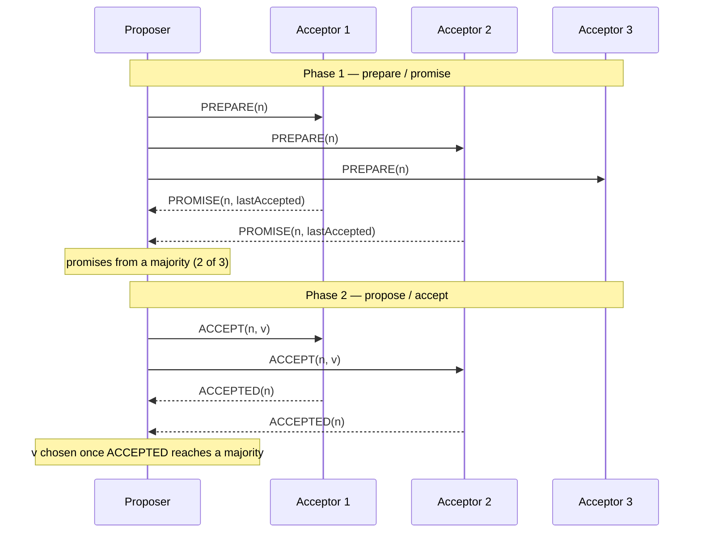

# Distributed Algorithms

A textbook-level study guide to the algorithms beneath every distributed system — written for engineers who have read the practical literature and want the level beneath it: the formal models, the impossibility results, the algorithms in full pseudocode, and the proofs (or honest proof sketches) of why they're correct. The sibling [Distributed Systems guide](DISTRIBUTED_SYSTEMS_STUDY_GUIDE.md) teaches what the CAP theorem says and which systems embody which trade-offs; this guide teaches *why* CAP is true, why consensus is impossible in the asynchronous model and how real systems sidestep the proof, what invariant makes Paxos safe, and what algebraic property lets CRDTs merge without coordination. Every chapter ends with exercises — doing them is the difference between having read this material and knowing it.

The style is that of a textbook, but a readable one: definitions are precise, theorems are stated exactly, and proofs are given as arguments a working engineer can follow and reconstruct, with pointers to the full formal versions in the literature. Pseudocode is meant to be transcribable into a real implementation — MIT's 6.5840 labs are the natural companion exercise set.

Primary references: Nancy Lynch, [*Distributed Algorithms*](https://groups.csail.mit.edu/tds/distalgs.html) (the rigorous standard); Cachin, Guerraoui & Rodrigues, [*Introduction to Reliable and Secure Distributed Programming*](https://distributedprogramming.net/) (the modular abstractions this guide's broadcast and consensus chapters follow in spirit); Attiya & Welch, *Distributed Computing*; Martin Kleppmann's [Cambridge lecture notes](https://www.cl.cam.ac.uk/teaching/2122/ConcDisSys/dist-sys-notes.pdf); and the primary papers linked throughout — Lamport's [Time, Clocks](https://lamport.azurewebsites.net/pubs/time-clocks.pdf), [FLP](https://groups.csail.mit.edu/tds/papers/Lynch/jacm85.pdf), [Paxos Made Simple](https://lamport.azurewebsites.net/pubs/paxos-simple.pdf), the [Raft paper](https://raft.github.io/raft.pdf), [Chandy–Lamport](https://lamport.azurewebsites.net/pubs/chandy.pdf), the [CRDT report](https://hal.inria.fr/inria-00555588/document), and [PBFT](http://pmg.csail.mit.edu/papers/osdi99.pdf). The empirical companion literature is [Kyle Kingsbury's Jepsen reports](https://jepsen.io/analyses) — nearly every failure documented there is a violation of a property defined in this guide.

---

## Table of Contents

1. [Chapter 1 — Models of Distributed Computation](#chapter-1--models-of-distributed-computation)
2. [Chapter 2 — Time, Clocks, and Causality](#chapter-2--time-clocks-and-causality)
3. [Chapter 3 — Broadcast and Ordering](#chapter-3--broadcast-and-ordering)
4. [Chapter 4 — Global States and Distributed Snapshots](#chapter-4--global-states-and-distributed-snapshots)
5. [Chapter 5 — Impossibility: FLP and Failure Detectors](#chapter-5--impossibility-flp-and-failure-detectors)
6. [Chapter 6 — Consensus I: Paxos](#chapter-6--consensus-i-paxos)
7. [Chapter 7 — Consensus II: Raft](#chapter-7--consensus-ii-raft)
8. [Chapter 8 — Replication, Quorums, and Linearizability](#chapter-8--replication-quorums-and-linearizability)
9. [Chapter 9 — Atomic Commitment: 2PC, 3PC, and Beyond](#chapter-9--atomic-commitment-2pc-3pc-and-beyond)
10. [Chapter 10 — Conflict-Free Replicated Data Types](#chapter-10--conflict-free-replicated-data-types)
11. [Chapter 11 — Gossip and Epidemic Algorithms](#chapter-11--gossip-and-epidemic-algorithms)
12. [Chapter 12 — Byzantine Fault Tolerance](#chapter-12--byzantine-fault-tolerance)
13. [Chapter 13 — From Algorithms to Systems](#chapter-13--from-algorithms-to-systems)

---

## Chapter 1 — Models of Distributed Computation

Every theorem in this guide is a statement *about a model*, and every production war story is a statement about which model reality chose that day. Get the models straight first, because "consensus is impossible" and "consensus runs in my cluster right now" are both true — about different models.

### 1.1 Processes and channels

A **distributed system** is a set of *n* processes `p1 … pn`, each a deterministic state machine with local state, connected by **channels** over which they exchange messages. Processes share *nothing* else: no shared memory, no shared clock. An **execution** is an interleaved sequence of *events* — message sends, message receipts, and internal steps — one sequence per run of the system. An **algorithm** specifies, for each process, how its state changes and which messages it sends in response to each event.

Channel assumptions must be stated, because algorithms break when they're wrong:

- **Reliable (perfect) link**: a message sent is eventually delivered, exactly once, unmodified — but with *no bound on when*. This is the standard assumption, and it is *achieved*, not given: real networks drop and duplicate, and the transport layer (sequence numbers, retransmission, dedup) builds reliable links from fair-lossy ones. The construction matters: retransmission means *duplication at the application level is the default*, which is why idempotent message handling recurs in every later chapter.
- **FIFO link**: messages between a fixed pair are delivered in send order (TCP gives you this per connection — but *not* across connection re-establishment, a gap real bugs crawl through).
- **Fair-lossy link**: may drop messages, but a message sent infinitely often is delivered infinitely often. The weakest assumption under which anything works.

### 1.2 The synchrony spectrum

The single most consequential modeling decision is what you assume about *time*:

- **Synchronous model**: there are known bounds Δ on message delay and Φ on relative process speeds. Powerful: you can detect a crash by timeout *with certainty* (no reply within Δ ⟹ dead), and algorithms can proceed in lock-step **rounds**. Real networks do not honor known bounds, so purely synchronous algorithms are mostly of theoretical interest — but the round structure they enable is the cleanest setting for lower bounds (Chapter 12's 3f+1 result is proved in it).
- **Asynchronous model**: *no* timing assumptions at all. Messages take arbitrary finite time; processes run at arbitrary speeds. Anything proved possible here works everywhere — and the central impossibility result (FLP, Chapter 5) lives here, saying consensus is *not* possible. The deep reason: in an asynchronous system, **a crashed process is indistinguishable from a slow one**. Sit with that sentence; it generates half of this guide.
- **Partially synchronous model** (Dwork, Lynch, Stockmeyer 1988): bounds exist but are unknown, or hold only after some unknown **Global Stabilization Time (GST)**. This is the model that matches production: networks are *usually* timely, *occasionally* arbitrary. It is exactly the modeling sweet spot in which Paxos, Raft, and PBFT live — **safe always** (under asynchrony), **live whenever the network behaves** (after GST). That phrase, *safety unconditionally, liveness conditionally*, is the design signature of every consensus algorithm you will ever run.

### 1.3 Failure models

What can go wrong with a process, in increasing order of malice:

- **Crash-stop**: a faulty process halts at some point and does nothing further. The default model for Chapters 5–9. "Up to *f* of *n* processes may crash" is the standard parameterization.
- **Crash-recovery**: processes crash and may return, having kept only what they wrote to stable storage. This is the *actual* model your deployment lives in, and it's why Paxos acceptors and Raft servers must fsync their promises before answering — an in-memory promise that dies with the process silently converts crash-recovery into something worse than crash-stop.
- **Omission**: a process may fail to send or receive some messages (a crashed-and-recovered process that lost in-memory state is an omission-faulty process in disguise).
- **Byzantine**: a faulty process may do *anything* — lie, equivocate (tell different things to different peers), collude. Chapter 12. Between crash and Byzantine sits the practically important *arbitrary-but-not-malicious* corruption (bit flips, fsync lies, the disk that reads back zeros) — Byzantine-tolerant protocols cover it; crash-tolerant ones silently don't, which is why "Raft plus checksums" is not paranoia.

A **correct** process is one that is never faulty in the given execution. Theorems are stated as "tolerates f faults among n processes": the resilience bounds — `f < n/2` for crash-tolerant consensus, `f < n/3` for Byzantine — are not engineering folklore but theorems (Chapters 6, 12), and they dictate cluster sizes: 3 nodes tolerate 1 crash; 5 tolerate 2; 4 nodes tolerate 1 *Byzantine* fault, never more.

### 1.4 Safety, liveness, and how to read a problem specification

Every property you will ever want from a distributed algorithm decomposes into two kinds (Alpern & Schneider proved the decomposition is fully general):

- A **safety property** says *nothing bad ever happens*. Formally: if it's violated, it's violated at a finite point in the execution, and no continuation can un-violate it. "No two nodes decide different values." "The lock is never held twice." Safety violations are forever — the duplicate payment cleared, the split-brain wrote both halves.
- A **liveness property** says *something good eventually happens*. "Every request eventually gets a response." A liveness violation can never be exhibited by a finite prefix — there's always hope. Stalls are liveness failures; they're the *recoverable* kind of failure.

The engineering asymmetry follows from the logic: **algorithms are designed to preserve safety under all conditions and achieve liveness under reasonable ones** — never the reverse trade. When you read any specification in this guide (consensus: *Agreement*, *Validity*, *Termination*), sort the clauses into safety (Agreement, Validity) and liveness (Termination) first; the algorithm's structure will mirror the sort, and impossibility results (FLP) are invariably about the liveness clause, because safety alone is trivially achievable by doing nothing forever.

**Complexity measures**, for comparing algorithms: *message complexity* (total messages), *round/time complexity* (in synchronous models, rounds; in asynchronous ones, longest causal chain), and — often dominant in practice — *message delays on the critical path of one client request* (Multi-Paxos and Raft both answer in one round trip from leader to majority; that, not asymptotics, is why they won).

### Exercises 1

1. Reliable links are built from fair-lossy links by retransmit-until-ack plus dedup at the receiver. Show that without the dedup half, the construction delivers every message at least once; show by example that an application-level operation ("append item to list") behaves differently under at-least-once than exactly-once delivery. Which later-chapter concept repairs this without exactly-once delivery?
2. In the asynchronous model, prove there is no algorithm by which a process can decide "p has crashed" that is never wrong. (Hint: take an execution where p crashed and the detector fires; build an indistinguishable execution where p is merely slow.)
3. Classify each as safety or liveness: (a) "no committed transaction is lost"; (b) "every replica eventually reflects every write"; (c) "reads return the value of the latest completed write"; (d) "the leader lease is held by at most one node at a time". For each, describe what its violation looks like in a production incident report.
4. A 5-node cluster is deployed across 2 datacenters (3+2). Using only the definition of "tolerates f crash faults," explain why no placement makes the cluster survive the loss of either datacenter, and what n and placement would.

---

## Chapter 2 — Time, Clocks, and Causality

Physical clocks on different machines disagree, drift, and jump. The foundational move of the field — Lamport, 1978 — is to replace "when did it happen" with "what could have caused what," and then to build *logical* clocks that measure exactly that and nothing more.

### 2.1 The happens-before relation

**Definition.** The **happens-before** relation `→` on events is the smallest transitive relation such that:

1. If a and b are events at the same process and a comes first, then `a → b`.
2. If a is the send of a message and b is its receipt, then `a → b`.

If neither `a → b` nor `b → a`, then a and b are **concurrent**, written `a ∥ b`. Concurrency here has nothing to do with wall-clock simultaneity: two events years apart are "concurrent" if no chain of messages connects them. `→` captures *potential causality* — the only ordering a distributed system can actually know about itself, because influence travels only by messages.

### 2.2 Lamport clocks

Assign each event a number such that causality implies order:

```
on local event or send at process p:
    t_p := t_p + 1                      # tag the event (and message) with t_p
on receive of message carrying t_m:
    t_p := max(t_p, t_m) + 1            # tag the receive event with t_p
```

**Theorem (Lamport).** If `a → b` then `L(a) < L(b)`.

*Proof sketch.* Induction along the definition of →: a process-local step increments the clock, so clause 1 holds; a receive sets the clock above the message's timestamp, so clause 2 holds; transitivity follows because < is transitive. ∎

**The converse is false**, and this is the crucial limitation: `L(a) < L(b)` does *not* imply `a → b` — two concurrent events can carry any pair of timestamps. Lamport clocks give you a *consistent* order (extendable to a total order by tie-breaking on process ID — used for fairness in Lamport's own mutual-exclusion algorithm and in many "highest timestamp wins" schemes), but they **cannot detect concurrency**: looking at `L(a) = 5, L(b) = 9`, you cannot tell whether b causally followed a or never heard of it. Detecting concurrency is precisely what replicated data needs (is this write a successor of that one, or a *conflict*?), which motivates:

### 2.3 Vector clocks

Each process keeps a vector `V_p[1..n]`, one entry per process:

```
on local event or send at process p:
    V_p[p] := V_p[p] + 1                # attach the whole vector to messages
on receive of message carrying V_m:
    V_p[i] := max(V_p[i], V_m[i])  for all i
    V_p[p] := V_p[p] + 1
```

Order vectors componentwise: `V ≤ W` iff `V[i] ≤ W[i]` for all i; `V < W` iff `V ≤ W` and `V ≠ W`.

**Theorem (Fidge, Mattern).** `a → b` **iff** `V(a) < V(b)`.

*Proof sketch.* (⇒) is the same induction as before, componentwise. (⇐) is the direction Lamport clocks lack: suppose `V(a) < V(b)` and let a be at process p. Then `V(b)[p] ≥ V(a)[p]`, and the only way information about p's local counter reaching value `V(a)[p]` can arrive at b's process is along a chain of messages departing p at or after event a — such a chain is exactly a causal path, so `a → b`. ∎

So vector clocks decide, for any two tagged events, *which of three relations holds*: `a → b`, `b → a`, or `a ∥ b` (vectors incomparable). That third verdict is conflict detection. Dynamo-style stores attach version vectors to objects: a write that supersedes (`>`) the stored version replaces it; incomparable versions are *siblings* — true concurrent conflicts — kept for the application or a CRDT (Chapter 10) to merge. (Pedantic but consequential distinction: **version vectors** count *writes to one object* per replica rather than all events per process, and only writes increment them; the comparison theory is identical.)

The costs, honestly: O(n) space per tag, the requirement that the set of participants be known and stable (dynamic membership needs dotted version vectors or ID retirement — a real engineering literature), and the fact that vectors grow with actor count, which is why Dynamo pruned them (trading away some causality information, documented in the paper) and why per-client-ID vectors blow up in web-scale systems.

### 2.4 Clocks that real databases use

- **Last-writer-wins on physical timestamps** is the seductive wrong default: clock skew means the "last" writer can be the earlier event, silently discarding causally *later* writes. Cassandra's LWW is exactly this trade, made deliberately and documented; Jepsen reports are full of systems that made it accidentally.
- **Hybrid Logical Clocks** (Kulkarni et al.) embed a Lamport clock in the low bits of a physical timestamp: timestamps stay close to wall time (useful for humans, TTLs, debugging) while preserving `a → b ⟹ HLC(a) < HLC(b)` exactly. CockroachDB's timestamps are HLCs.
- **TrueTime** (Spanner) is the hardware route: GPS+atomic clocks expose an *interval* [earliest, latest] guaranteed to contain real time; Spanner orders transactions by intervals and **waits out the uncertainty** (commit-wait) before acknowledging, buying linearizability from physics plus patience. The lesson generalizes: you can substitute engineering (bounded clock error) for coordination, but the bound must be *guaranteed*, not observed-in-practice.

### Exercises 2

1. Three processes; messages m1: p1→p2 and m2: p2→p3, where p2 sends m2 after receiving m1. Tag every event with Lamport and vector clocks. Exhibit two concurrent events whose Lamport timestamps differ by at least 3.
2. Prove from the definitions that `a ∥ b` iff `V(a)` and `V(b)` are incomparable. Then explain in one paragraph why no scalar clock (any function from events to a totally ordered set satisfying the Lamport condition) can decide concurrency.
3. A replicated counter uses LWW with NTP-synced clocks (max error 50ms observed, not bounded). Construct an execution in which a user's increment is lost even though every message is delivered and no process crashes. Which property from Chapter 1 (safety/liveness) did the system violate, and against what specification?
4. Design the vector-clock pruning rule you'd use for a shopping-cart store where clients are browsers (unbounded actor set). What causality errors does your rule admit, and what is the user-visible symptom?

---

## Chapter 3 — Broadcast and Ordering

Point-to-point links plus an application that wants "tell everyone" yields the broadcast abstractions — and a ladder of strengthening guarantees that ends, surprisingly, at consensus itself. This modular ladder (following Cachin–Guerraoui–Rodrigues) is the cleanest way to see what each increment of ordering *costs*.

### 3.1 The ladder of guarantees

**Best-effort broadcast**: sender sends to all; if the *sender* doesn't crash, all correct processes deliver. One crash at the wrong moment and some processes have the message, others never will.

**Reliable broadcast** adds *all-or-nothing among correct processes*: if **any correct process delivers m, every correct process delivers m** — even if the sender crashed mid-send. The classic implementation is elegant and brutal: every process that delivers a message for the first time *re-broadcasts it* before delivering ("eager reliable broadcast") — O(n²) messages, and the reason gossip (Chapter 11) exists as the probabilistic discount version. Note what is *not* promised: nothing about order, and a faulty process may deliver things correct ones don't (closing *that* gap is **uniform** reliable broadcast, which matters when delivery has external side effects — a crashed process that emailed a customer first still emailed the customer).

**FIFO broadcast**: messages from the *same sender* deliver in send order. Cheap: sequence numbers per sender, hold back gaps.

**Causal broadcast**: if `broadcast(m1) → broadcast(m2)` (happens-before, Chapter 2), every process delivers m1 before m2. Implementation = reliable broadcast + vector-clock hold-back:

```
state: V[1..n] := all zeros          # deliveries seen from each sender
on broadcast(m) at p:
    rb_broadcast(⟨m, W := V with W[p] := V[p]+1⟩)   # plus pending self-delivery
on rb_deliver(⟨m, W⟩ from sender q):
    add to pending
    while ∃⟨m', W', q'⟩ in pending such that
          W'[q'] = V[q'] + 1  and  W'[i] ≤ V[i] for all i ≠ q':
        deliver(m');  V[q'] := V[q'] + 1
```

The guard reads as: deliver q's next message only once you've delivered everything q had delivered when it sent. **Theorem**: this delivers in causal order. *Proof sketch*: the guard ensures a message is delivered only when the local vector dominates its causal dependencies; induction on → does the rest. Causal broadcast is the strongest ordering achievable *without consensus* — it never blocks on remote coordination (you can always deliver your own messages immediately), which is why collaborative editors and causal-consistency stores (COPS, the academic line behind several products) build on it.

**Total order broadcast** (= **atomic broadcast**): all correct processes deliver *all* messages in the *same* order (whether or not causally related). This is the abstraction that state machine replication actually consumes: same start state + same deterministic state machine + same total order of inputs = same state everywhere — the **state machine replication theorem**, one line of argument and the architecture of etcd, ZooKeeper, Kafka's controller quorum, and every Raft-replicated store.

### 3.2 The equivalence theorem

**Theorem.** Total order broadcast and consensus are interreducible (in the crash-stop asynchronous model).

*Proof sketch.* (TOB ⇒ consensus): to reach consensus, TOB-broadcast your proposal and decide the first value TOB-delivered — agreement on order of the first message *is* agreement. (Consensus ⇒ TOB): run a sequence of consensus instances, the k-th deciding the *batch* of messages occupying slot k; deliver slots in order. ∎

The corollary sets the price list for the whole field: **FLP (Chapter 5) applies to total order broadcast verbatim** — deterministic TOB is impossible in the asynchronous model — and everything in the ladder *below* total order (FIFO, causal) is FLP-free and therefore cheap. When a design review asks "do we need total order here, or just causal?", it is asking "do we need to pay for consensus?", and the honest answer changes architectures: shopping carts don't need it; replicated logs do; a surprising amount of middle ground (counters, sets, presence) can drop to Chapter 10 and pay nothing.

### Exercises 3

1. Show by explicit 3-process execution that FIFO broadcast does not imply causal broadcast (find the causal violation that sequence-numbers-per-sender admit).
2. Prove the safety half of the causal-broadcast algorithm above: if `broadcast(m1) → broadcast(m2)`, no process delivers m2 first. Where exactly does the proof use reliability of the underlying broadcast?
3. The TOB⇒consensus reduction decides the first delivered value. Verify each consensus clause (validity, agreement, termination) against the TOB properties; which TOB property carries each clause?
4. Your team replicates a counter by causal-broadcasting `increment` operations. Does every replica converge to the same value? Does the same hold for `set(x)` operations? Reconcile the two answers, and name the Chapter 10 concept lurking in the first one.

---

## Chapter 4 — Global States and Distributed Snapshots

"What is the current state of the system?" is, in a distributed system, not a well-posed question — there is no instant, no global observer. The well-posed replacement is a **consistent global state**, and the Chandy–Lamport algorithm captures one while the system keeps running. This chapter is short, beautiful, and the direct ancestor of how Flink checkpoints a streaming job under load.

### 4.1 Cuts and consistency

A **cut** assigns to each process a prefix of its execution; the cut's *frontier* is "where we pretend to stop each process." A cut is **consistent** if it is closed under happens-before: if event e is in the cut and `e' → e`, then e' is in the cut too. The litmus violation: a cut containing the *receipt* of a message but not its *send* describes a state in which a message materialized from nowhere — no global observer could ever have seen it. (The reverse — send included, receipt not — is fine: the message is "in the channel," and channel contents are part of global state.)

**Theorem (Mattern).** A cut is consistent iff its frontier events are pairwise concurrent — equivalently, iff it could have been an instantaneous snapshot in *some* execution indistinguishable from the real one. Consistent cuts are exactly the states the system "might have been in"; any predicate you evaluate on one (deadlock, total money in the bank, lag) is meaningful; anything evaluated on an inconsistent cut is fiction (the classic demo: count money in flight between bank accounts with an inconsistent cut and watch conservation fail).

### 4.2 The Chandy–Lamport snapshot algorithm

Assumes reliable **FIFO** channels, crash-free run during the snapshot. The idea: flood a *marker* that acts as a dye separating "before the snapshot" from "after" on every channel.

```
initiator (any process, spontaneously):
    record own state
    send MARKER on every outgoing channel
    start recording arrivals on every incoming channel

every process p, on first receiving MARKER on channel c:
    record own state
    record channel c as EMPTY
    send MARKER on every outgoing channel
    start recording arrivals on all other incoming channels

on receiving MARKER on channel c, not the first marker:
    stop recording c; channel c's state := messages recorded on c
    (snapshot at p complete when markers received on all incoming channels)
```

**Theorem.** The recorded process states plus recorded channel states form a consistent global state.

*Proof sketch.* Orient every event as pre-snapshot (before its process recorded) or post-snapshot. Suppose the cut were inconsistent: some message m is sent post-snapshot but received pre-snapshot. The sender recorded before sending m, hence sent a marker on that channel before m; FIFO delivers the marker first; so the receiver had recorded before receiving m — contradiction with "received pre-snapshot." Channel recordings capture exactly the messages that crossed the dye line (sent pre, received post). ∎

Two properties worth internalizing: the snapshot is consistent but may correspond to *no instant that actually occurred* — it is a state from an indistinguishable reordering of the real execution, and Mattern's theorem says that's the most any observer can have; and the algorithm is **non-blocking** — the application never pauses, which is the entire point.

**Where you run this today**: Flink's *asynchronous barrier snapshots* are Chandy–Lamport with markers renamed "barriers," channel recording replaced by barrier *alignment*, and the snapshot shipped to object storage — that's "exactly-once state" in stream processing, demystified. The other classic consumer is **stable-property detection**: a predicate that, once true, stays true (deadlock, termination, "log fully replicated") and that is true in a consistent snapshot is true *now* — the snapshot may be stale, but stability makes staleness harmless.

### Exercises 4

1. Two bank accounts on two processes, transfers in flight. Construct an inconsistent cut in which total money ≠ invariant, then run Chandy–Lamport by hand on the same execution and verify the recorded state conserves money (count the channel recordings).
2. Where exactly does the proof use FIFO? Exhibit a non-FIFO execution in which the algorithm records an inconsistent state.
3. Explain why "is there currently a deadlock" is answerable from a snapshot but "is the system currently idle" is not. (Name the property of the predicate that makes the difference.)
4. Flink aligns barriers (pausing one input of a two-input operator until the other's barrier arrives) instead of recording channel state. Argue that alignment computes the same cut with empty channel recordings; what does the pause cost, and what does Flink's "unaligned checkpoint" mode trade to remove it?

---

## Chapter 5 — Impossibility: FLP and Failure Detectors

This chapter is the intellectual center of the guide: the theorem that says the thing every datacenter does is impossible, the precise sense in which that's true, and the exact loopholes through which Paxos and Raft escape. Engineers who internalize FLP stop being surprised by leader-election flapping and start designing for it.

### 5.1 The consensus problem

Each process starts with an input value. **Consensus** requires:

- **Agreement** (safety): no two correct processes decide different values.
- **Validity** (safety): the decided value was some process's input (rules out the trivial "always decide 0").
- **Termination** (liveness): every correct process eventually decides.

### 5.2 The FLP theorem

**Theorem (Fischer, Lynch, Paterson 1985).** In the asynchronous model, no deterministic algorithm solves consensus while tolerating even **one** crash failure.

The proof is a masterpiece of adversary argument; here is its skeleton, faithful enough to reconstruct:

*Proof sketch.* Call a global configuration **bivalent** if both decisions (0 and 1) are still reachable from it, **univalent** if only one is. The adversary's goal: keep the system bivalent forever — an infinite undecided execution violates Termination.

**Step 1 (a bivalent start exists).** Consider initial configurations along a chain that flips inputs one process at a time from all-0 to all-1. Adjacent configurations differ at one process p; if every initial configuration were univalent, somewhere along the chain valence flips between neighbors, and an execution in which p crashes immediately is identical from both — so both must decide the same way, contradicting opposite valences. Hence some initial configuration is bivalent.

**Step 2 (bivalence can always be preserved).** From any bivalent configuration, take any enabled event e (delivery of some message to some process). One shows — this is the heart, a case analysis on commuting independent events — that there is always a finite schedule after which applying e *still* leaves the system bivalent. The crux case: if applying e now leads univalent-0 and applying it after some other event leads univalent-1, the two diverging configurations differ only in the state of *one* process; crash that process, and the rest of the system, unable to distinguish the two, must decide both 0 and 1 from indistinguishable states — contradiction with Agreement.

**Step 3.** Iterate step 2 fairly (every message eventually considered): an infinite execution, every step bivalent, no decision ever — and crucially, an execution in which every message is delivered and at most the one adversarially-chosen process is slow. Termination fails. ∎

Read the theorem precisely — three readings, two of them wrong:

- *Wrong*: "consensus is impossible, so etcd is doing something fake." FLP is about the **fully asynchronous** model with a **deterministic** algorithm and **guaranteed** termination. Real networks are partially synchronous; real algorithms give up *guaranteed* termination.
- *Wrong*: "consensus randomly fails, so expect data loss." The execution FLP constructs is a *liveness* failure — eternal indecision — not a safety failure. Paxos and Raft never violate Agreement, in any execution whatsoever; what they inherit from FLP is the possibility of (vanishingly rare, adversarially-scheduled) *non-termination*.
- *Right*: **any consensus protocol has executions in which it makes no progress, and the adversary that produces them is "unlucky timing."** Raft's dueling-candidates livelock — two candidates splitting votes forever in lockstep — is not a bug in Raft; it is FLP, visiting. Raft's randomized election timeouts make the lockstep measure-zero. That's the loophole, used.

### 5.3 The loopholes, catalogued

1. **Partial synchrony** (the production answer): assume timing bounds hold *eventually* (after GST). Safety is proven without any timing assumption; termination is proven under the eventual bound. Paxos, Raft, Zab, PBFT.
2. **Randomization**: with coin flips, consensus terminates *with probability 1* in the asynchronous model (Ben-Or's algorithm — exponential expected rounds in the naive form, but the door FLP leaves open since it only bars *deterministic* algorithms; modern shared-coin protocols and Nakamoto-style longest-chain consensus both live here).
3. **Failure detectors** (the abstraction that *measures* the loophole): augment the model with an oracle giving (unreliable) crash hints. Chandra & Toueg's hierarchy classifies them by how wrong they may be; the celebrated result names the *weakest* one that suffices:

**Theorem (Chandra, Hadzilacos, Toueg).** **Ω** — the *eventual leader elector*, guaranteeing only that eventually all correct processes trust the same correct process — is the weakest failure detector for consensus (with f < n/2).

Ω is exactly what timeout-based leader election implements *in the good case*: it may flap arbitrarily during chaos (and consensus stalls, harming no safety), but once the network calms down, one stable leader emerges and consensus terminates. Every "leader lease," "election timeout," and "heartbeat interval" knob in your etcd config is tuning the real-world quality of an Ω implementation — and FLP is why the knob exists.

### 5.4 Leader election as an algorithmic problem

Beyond its role as Ω, election in its own right, two classics worth knowing:

- **Chang–Roberts ring election**: processes in a logical ring forward the highest ID seen; a process receiving its own ID is leader. O(n log n) messages expected, O(n²) worst case. Mostly pedagogical — rings are fragile — but the "highest ID circulates" pattern recurs.
- **Bully algorithm** (Garcia-Molina): on suspecting the leader, a process challenges all higher IDs; any live higher ID takes over the election; the highest live ID wins and announces. Synchronous-model assumptions (timeouts as proof of death) — which is exactly its production weakness: a *slow* highest-ID node and a fast one bully-elect a split brain. The lesson generalizes and matters: **election without quorum acknowledgment is unsafe under asynchrony**; Raft's election (Chapter 7) is "bully with votes and a majority rule," and the majority is what converts it from heuristic to theorem.

### Exercises 5

1. In FLP Step 1, write out the 3-process case concretely: list the input configurations, and exhibit the crash execution that forces a contradiction between adjacent univalent configurations of opposite valence.
2. Explain why FLP does not apply to the *synchronous* model — which step of the proof breaks, and what algorithm (sketch one in rounds: exchange values for f+1 rounds, decide min) solves synchronous consensus with f crash faults?
3. Raft with fixed (non-random) election timeouts: construct the infinite dueling-candidates execution explicitly (message schedule per round). Verify no safety property is violated along the way.
4. Ω only requires *eventual* agreement on a *correct* leader. Show by execution that a system can have two simultaneous self-believed leaders for an arbitrary finite duration without violating Ω — and name the Chapter 7/8 mechanism that keeps such periods harmless to the data.

```quiz
Q: FLP says consensus is impossible. What does it actually rule out?
- [x] A *deterministic* algorithm with *guaranteed* termination in the *fully asynchronous* model tolerating even one crash — real systems escape via partial synchrony, randomization, or failure detectors
- [ ] That etcd and Raft can ever agree safely
- [ ] That consensus can be safe — it predicts random data loss
- [ ] Consensus on more than two values
> FLP's failure is liveness (eternal indecision under adversarial timing), never safety. Raft/Paxos never violate Agreement in any execution; they only inherit vanishingly-rare non-termination — which Raft's randomized timeouts make measure-zero.

Q: Raft's dueling-candidates livelock — two candidates splitting votes in lockstep forever — is best understood as what?
- [x] FLP visiting in the flesh; it's not a Raft bug. Randomized election timeouts break the lockstep with probability 1
- [ ] A safety violation that loses committed entries
- [ ] A network partition
- [ ] A bug fixed by adding more nodes
> The livelock is the impossibility theorem made concrete. The fix is the randomization loophole FLP explicitly leaves open (it bars only *deterministic* algorithms) — every election-timeout knob tunes this.

Q: Ω, the eventual leader elector, is the weakest failure detector for consensus. What does "weakest" buy you in practice?
- [x] It guarantees only that *eventually* all correct processes trust the same correct leader — it may flap during chaos (consensus stalls, no safety harm) and stabilizes when the network calms
- [ ] It detects every crash instantly and correctly
- [ ] It prevents leader election entirely
- [ ] It works only in the synchronous model
> Timeout-based leader election *is* an Ω implementation in the good case. Your etcd lease/heartbeat/election-timeout config is tuning a real-world Ω — and FLP is precisely why those knobs exist.

Q: Why is the Bully algorithm's leader election unsafe under asynchrony, and how does Raft fix it?
- [x] It treats timeouts as proof of death, so a slow highest-ID node and a fast one can bully-elect a split brain; Raft adds vote + majority rule, converting the heuristic to a theorem (at most one leader per term)
- [ ] It uses too many messages
- [ ] It requires a ring topology
- [ ] It can't handle more than 3 nodes
> Election without quorum acknowledgment is unsafe under asynchrony — the chapter's closing lesson. Raft is "bully with votes and a majority," and the majority's pairwise intersection is what makes two leaders-per-term impossible.
```

---

## Chapter 6 — Consensus I: Paxos

Paxos (Lamport, "The Part-Time Parliament," then mercifully "Paxos Made Simple") is the historically first practical answer to FLP and still the conceptual core of half the consensus systems running. The way to understand Paxos is not to memorize the two phases but to *derive* them — each rule is forced by a failure scenario, and the proof is one invariant.

### 6.1 The cast and the goal

Roles (one machine usually plays all three): **proposers** push values, **acceptors** vote (the fault-tolerant memory of the protocol — f < n/2 may crash), **learners** observe what was chosen. A value is **chosen** when a **majority of acceptors** accept it. Majorities are the load-bearing choice: *any two majorities intersect*, so two different values can't both be chosen by disjoint juries, and the protocol survives minority crashes. (Generalization: any *quorum system* with pairwise intersection works — Chapter 8.)

### 6.2 Deriving single-decree Paxos

Try the naive protocol: acceptors accept the first value they hear; chosen = majority accepted. It fails immediately — two proposers, votes split three ways, nothing has a majority, and *acceptors can never change their vote* (changing votes lets a second value get chosen after a first — safety violation). So acceptors must be able to accept *again* — but then late proposals can overwrite a chosen value. The escape: number proposals, and force a proposer to *learn about possibly-chosen values before proposing*. That is the two-phase structure:

```
# Phase 1 — prepare/promise
proposer:  choose unique ballot n; send PREPARE(n) to acceptors
acceptor on PREPARE(n):
    if n > maxBallotPromised:
        maxBallotPromised := n                        # persist before replying!
        reply PROMISE(n, lastAcceptedBallot, lastAcceptedValue)
    else: reject (hint current ballot)

# Phase 2 — propose/accept
proposer on PROMISE from a majority:
    v := value of the highest-ballot acceptance reported in promises,
         or proposer's own value if none reported          # ← the crux rule
    send ACCEPT(n, v) to acceptors
acceptor on ACCEPT(n, v):
    if n ≥ maxBallotPromised:
        accept: persist (n, v); reply ACCEPTED(n)
learner: value chosen when some ballot's ACCEPTED reaches a majority
```

Every line is forced. The promise ("I will never accept anything numbered < n") freezes the past so the proposer's read of it stays true. The crux rule — *adopt the highest-ballot accepted value you heard, propose your own only if you heard none* — is what makes a new proposer the *servant* of any possibly-chosen earlier value instead of its overwriter. And persistence before replying is the crash-recovery model (Chapter 1) collecting its toll: an acceptor that forgets a promise un-freezes the past.

The message flow makes the two phases — and the majorities that carry them — concrete:



### 6.3 The safety proof

**Invariant P2c.** If a proposal with ballot n and value v is issued, then there is a majority S such that either (a) no acceptor in S has accepted any proposal numbered < n, or (b) v equals the value of the highest-numbered proposal below n accepted within S.

The crux rule *is* P2c restated as code. From it:

**Theorem (Agreement).** If value v is chosen at ballot n, every proposal issued at any ballot n' > n has value v.

*Proof sketch.* Strong induction on n'. v chosen at n means a majority C accepted (n, v). Consider proposal (n', v') with n' > n, justified by its promise-majority S. S ∩ C ≠ ∅; pick a ∈ S ∩ C. Acceptor a accepted (n, v) and promised n'; by the promise rule it accepted (n, v) *before* promising n' (afterward it would refuse ballots < n' — and n < n'). So a's promise reported an acceptance with ballot ≥ n. By induction hypothesis every acceptance in S with ballot in (n, n') also carries value v; the highest one reported is therefore v; the crux rule forces v' = v. Two chosen values are impossible: each would propagate itself up all higher ballots. ∎

Notice what the proof never mentions: time. No step depends on message delay or speed — Agreement holds in the raw asynchronous model. What *can* fail without timing luck is termination: two proposers can alternate PREPAREs forever, each invalidating the other's ballot — FLP's shadow, in the flesh. The standard fix is the standard loophole: elect a distinguished proposer (an Ω implementation via timeouts) and let only it propose in the steady state.

### 6.4 Multi-Paxos and the gap Raft filled

Consensus on *one* value generalizes to a replicated log by running an instance per log slot — and the steady-state optimization is the entire reason the protocol is deployable: a stable leader runs Phase 1 *once* for its ballot across all future slots, then commits each client command with a single Phase-2 round trip to a majority. One round trip per operation, plus fsyncs — the same wire cost as Raft, because at this layer they are the same algorithm.

What "Paxos Made Simple" famously does *not* specify is everything between the invariant and a running system: log gaps and their repair, leader change choreography, membership change, snapshotting, state transfer to lagging replicas. Every production Paxos (Chubby, Spanner's, etc.) filled the gap with bespoke, subtly different engineering — Google's "Paxos Made Live" paper is the honest war diary. That under-specification is the actual problem statement of the next chapter: Raft is best read not as a different algorithm but as **Multi-Paxos with all engineering decisions made, in the order that makes the safety argument teachable**.

### Exercises 6

1. Run single-decree Paxos by hand: 3 acceptors, proposers P1 (ballot 1, value A) and P2 (ballot 2, value B), where P1 completes Phase 1, then P2 completes both phases, then P1 resumes. What does P1 end up proposing/achieving? Now reorder so P1's ACCEPT reaches 2 acceptors before P2's PREPARE — trace how P2 is forced to adopt A.
2. The acceptor persists `maxBallotPromised` before replying. Construct the safety violation if it replies first and crashes/restarts in between.
3. Why must ballot numbers be unique across proposers (e.g., round-robin or ⟨counter, proposerID⟩)? Exhibit the bad execution with duplicate ballots.
4. Prove that Paxos still satisfies Agreement if "majority" is replaced by any quorum system in which every two quorums intersect; identify each proof step that uses intersection. Give a non-majority quorum system over 6 nodes and discuss what it trades.
5. (Termination) Describe the dueling-proposers livelock precisely, and explain why adding randomized proposal backoff yields termination with probability 1 under partial synchrony.

```quiz
Q: Why are majorities the load-bearing choice in Paxos acceptors?
- [x] Any two majorities intersect, so two different values can't both be chosen by disjoint juries — and the protocol still works with a minority of acceptors crashed
- [ ] Majorities are faster to contact than all acceptors
- [ ] A majority is the minimum to detect Byzantine faults
- [ ] They reduce message count to O(1)
> Pairwise quorum intersection is the entire safety mechanism — generalizable to any quorum system where every two quorums intersect. It's what survives minority crashes while preventing split decisions.

Q: What is Paxos's "crux rule" in Phase 2, and what does it accomplish?
- [x] A proposer adopts the highest-ballot accepted value reported in its promises, proposing its own only if none was reported — making a new proposer the *servant* of any possibly-chosen earlier value, not its overwriter
- [ ] It picks the lowest ballot number to break ties
- [ ] It always proposes the proposer's own value
- [ ] It waits for all acceptors before proposing
> The promise freezes the past ("never accept anything below n") so the proposer's read of it stays true; the crux rule then ensures a chosen value propagates up all higher ballots. That's the whole Agreement proof, in two rules.

Q: The Paxos Agreement proof never mentions time. What does that tell you, and what *can* still fail?
- [x] Safety (Agreement) holds in the raw asynchronous model with no timing assumption; only termination can fail — two proposers can alternate PREPAREs forever (FLP's shadow), fixed by electing a distinguished proposer
- [ ] Nothing fails; Paxos always terminates
- [ ] Both safety and termination depend on synchronized clocks
- [ ] Agreement can be violated under high latency
> Time-independence of safety is the deep property. The distinguished-proposer fix is an Ω implementation — the standard loophole used to recover liveness without touching the safety argument.

Q: How does Raft relate to Multi-Paxos, per the guide?
- [x] Raft is best read as Multi-Paxos with all the engineering decisions (log gaps, leader change, membership, snapshots) made in the order that makes the safety argument teachable — same wire cost, same algorithm at the consensus layer
- [ ] Raft is a fundamentally different, weaker algorithm
- [ ] Raft tolerates Byzantine faults; Paxos doesn't
- [ ] Raft avoids the need for a leader
> A stable Multi-Paxos leader commits each command in one Phase-2 round trip — identical to Raft. The difference is that "Paxos Made Simple" under-specifies everything around the invariant; Raft specified it.
```

---

## Chapter 7 — Consensus II: Raft

Raft (Ongaro & Ousterhout, 2014) solves exactly Multi-Paxos's problem — a fault-tolerant replicated log — decomposed for understandability: leader election, log replication, and a safety argument hinging on one voting restriction. This chapter walks the protocol at the message level, because the message level is where operators live.

### 7.1 Terms, roles, and the heartbeat skeleton

Time divides into **terms**, numbered monotonically; each term has at most one leader. Every server is **follower**, **candidate**, or **leader**, and carries persistent state — `currentTerm`, `votedFor`, and the log (entries `⟨term, command⟩`) — fsynced before any reply (Chapter 1's crash-recovery toll, again). Every RPC carries the sender's term; **any server seeing a higher term adopts it and reverts to follower** — this one rule retires stale leaders the moment they hear from the future.

Followers expect periodic `AppendEntries` heartbeats from the leader. A follower hearing nothing for a randomized **election timeout** (e.g., 150–300ms) assumes the leader dead and stands for election. The randomization is, as established in Chapter 5, the anti-FLP measure: it breaks symmetric candidate duels with probability 1.

### 7.2 Leader election

```
candidate, on election timeout:
    currentTerm += 1; vote for self; reset timeout
    send RequestVote(term, candidateId, lastLogIndex, lastLogTerm) to all

server, on RequestVote(t, c, lli, llt):
    if t < currentTerm: refuse
    if votedFor in this term ∉ {null, c}: refuse        # one vote per term
    if candidate's log is not at least as up-to-date as mine: refuse   # §7.4
       ("up-to-date": higher lastLogTerm wins; ties → longer log wins)
    else: grant vote (persist votedFor first)

candidate: majority of votes → leader (send heartbeats immediately)
           AppendEntries from a leader with term ≥ mine → follower
           timeout again → new term, retry
```

One vote per term plus majority-to-win yields, immediately: **at most one leader per term** (two majorities would share a voter who voted twice). This is the bully algorithm cured of its split-brain disease by quorum (Chapter 5's closing lesson, realized) — and note it does *not* prevent two simultaneous self-believed leaders of *different* terms; the old one is harmless because it can no longer commit (it can't assemble a majority that hasn't moved on — §7.3).

### 7.3 Log replication and the commit rule

The leader appends client commands to its log and replicates:

```
AppendEntries(term, leaderId,
              prevLogIndex, prevLogTerm,     # the consistency check
              entries[], leaderCommit)

follower:
    if term < currentTerm: refuse
    if log lacks an entry at prevLogIndex with term prevLogTerm: refuse
    delete any conflicting suffix; append entries
    commitIndex := min(leaderCommit, index of last new entry)
```

The `prevLogIndex/prevLogTerm` check is an induction in protocol form: if a follower's log matches the leader's at one position, it matches at all earlier positions (**Log Matching property** — provable by induction on appends, since a leader creates at most one entry per index per term and never overwrites its own log). A refused AppendEntries makes the leader decrement that follower's `nextIndex` and retry — walking back to the divergence point, then overwriting the follower's conflicting suffix with the leader's truth.

**Commit rule**: an entry is committed when the leader has replicated it on a majority *and* the entry's term is the leader's **current** term. Committed entries are applied to the state machine and acknowledged to clients. The italicized clause is the subtlest sentence in the paper (its Figure 8): a leader must never count replicas of an *earlier term's* entry toward commitment, because such an entry — majority-replicated or not — can still be overwritten by a later-term leader elected on a different majority; the new leader commits old entries only *indirectly*, by committing one entry of its own term on top (production Rafts append a no-op at election for exactly this).

### 7.4 The safety argument

The voting restriction (§7.2) — *grant votes only to candidates whose log is at least as up-to-date as yours* — is Raft's entire replacement for Paxos's Phase 1 value adoption. It buys:

**Leader Completeness theorem.** If an entry is committed in term T, it is present in the log of every leader of every term > T.

*Proof sketch.* The entry was replicated to a majority C (and counted in term T, by the commit rule). A leader of any later term won a majority of votes V. C ∩ V ≠ ∅: some voter holds the committed entry *and* judged the winner's log at-least-as-up-to-date. Induct on terms: the winner's log either has higher last term — but any entry of a term between T and it sits atop a chain rooted in a leader that (by induction) held the committed entry, and Log Matching propagates it down — or equal last term and ≥ length, which contains the entry directly by Log Matching. Either way the new leader has it. ∎

From Leader Completeness, the safety chain is short: leaders never overwrite their own logs and followers are forced into agreement with leaders (Log Matching + the walk-back), so a committed entry can never be replaced — **State Machine Safety**: no two servers apply different commands at the same log index. That, plus the equivalence theorem of Chapter 3, is total order broadcast, is state machine replication, is etcd not losing your Kubernetes cluster.

Compare the philosophies, because the exam question writes itself: **Paxos lets anyone lead and forces the new leader to adopt the past (Phase 1); Raft only elects leaders that already contain the past (vote restriction).** Same invariant — "the chosen survives" — enforced at proposal time vs. at election time. Raft's choice makes logs flow strictly leader→follower (never backward), which is most of why it's easier to implement and verify.

### 7.5 The rest of a real Raft

- **Membership change**: switching configurations naively lets old-majority and new-majority elect two leaders. The paper's joint-consensus approach (decisions require majorities of *both* configs during transition) and the simpler now-standard **single-server changes** (alter membership one node at a time — old and new majorities of configs differing by one node necessarily intersect) are both quorum-intersection arguments in disguise.
- **Log compaction**: snapshot the state machine at index k, truncate the log; lagging followers receive `InstallSnapshot` instead of ancient entries.
- **Linearizable reads without log writes**: a leader may serve reads locally only after confirming leadership against a majority (ReadIndex) or within a clock-based **lease** — note the lease quietly reintroduces a timing assumption into a protocol whose safety needed none; bounded clock error becomes part of the TCB. (This exact corner is where more than one production system met Jepsen.)
- **Pre-vote and check-quorum**: a partitioned node otherwise increments its term forever and, on heal, disrupts a healthy leader; pre-vote asks "would you vote for me?" without incrementing terms. The lesson: term inflation is harmless to safety but costly to liveness — and production Raft is largely liveness engineering.

### Exercises 7

1. Five servers, leader L1 of term 2 replicates index 5 to itself + S2, then partitions away. Trace the election that follows (who can win, who can't, and why, citing the vote restriction), the repair of S2's log if a new leader L2 of term 3 has a different entry at index 5, and the fate of L1's entry.
2. Reconstruct the Figure-8 scenario: build the 5-server execution in which an entry replicated on a majority is later overwritten. Identify the exact step the commit rule's current-term clause forbids.
3. Prove Log Matching by induction on AppendEntries, from: leaders create ≤1 entry per index per term; the prevLog check.
4. Why is `votedFor` persisted? Construct the double-vote (and resulting two-leaders-one-term) execution if a server votes, crashes, restarts, and votes again.
5. A leader serving lease-based reads has a clock running 2× fast. Construct the stale read. Which Jepsen-style consistency violation is this, and what does ReadIndex cost instead?

```quiz
Q: How does "one vote per term + majority to win" immediately guarantee at most one leader per term?
- [x] Two leaders would each need a majority, and two majorities share a voter — who would have voted twice in one term, which the rule forbids
- [ ] The highest-ID candidate always wins
- [ ] Terms are assigned by a central coordinator
- [ ] Leaders renew leases that prevent rivals
> It's the bully algorithm cured of split-brain by quorum. Note it doesn't prevent two self-believed leaders of *different* terms — the old one is harmless because it can't assemble a majority that hasn't moved on.

Q: Raft's commit rule says an entry is committed only when replicated on a majority AND the entry is of the leader's *current* term. Why the second clause?
- [x] An earlier-term entry, even majority-replicated, can still be overwritten by a later-term leader elected on a different majority (Figure 8); committing one current-term entry on top commits the old ones indirectly
- [ ] To reduce the number of fsyncs
- [ ] Current-term entries replicate faster
- [ ] It prevents clock skew from affecting commits
> This is the subtlest sentence in the paper. Production Rafts append a no-op at election precisely to commit inherited entries safely — counting old-term replicas toward commitment is the classic safety bug.

Q: Raft's vote restriction (grant votes only to candidates at least as up-to-date as you) replaces which Paxos mechanism, and what does it buy?
- [x] Paxos's Phase 1 value adoption — Raft only elects leaders that *already contain* the committed past (Leader Completeness), so logs flow strictly leader→follower and are never adopted backward
- [ ] Paxos's majority requirement
- [ ] The need for terms
- [ ] Log compaction
> Same invariant — "the chosen survives" — enforced at election time (Raft) vs proposal time (Paxos). The leader-only-forward log flow is most of why Raft is easier to implement and verify.

Q: A lease-based read on a Raft leader whose clock runs 2× fast can return stale data. What's the deeper lesson?
- [x] Leases reintroduce a timing assumption into a protocol whose safety needed none — bounded clock error becomes part of the trusted computing base; ReadIndex avoids it by confirming leadership against a majority instead
- [ ] Leases are always unsafe and should never be used
- [ ] The fix is faster hardware clocks
- [ ] This is a liveness bug, not a safety one
> It's a real-time-order (linearizability) violation, and exactly the corner where production systems met Jepsen. ReadIndex trades a round trip for not trusting the clock — the safety-vs-latency dial.
```

---

## Chapter 8 — Replication, Quorums, and Linearizability

Consensus replicates a *log*; this chapter studies replicating *data* directly — the quorum systems beneath Dynamo-style stores, the precise definition of the consistency level everyone names and few define, an algorithm (ABD) that achieves it *without* consensus, and the theorem (CAP) that bounds the whole design space.

### 8.1 Linearizability, precisely

**Definition (Herlihy & Wing).** An execution of operations (each an invocation→response interval in real time) on an object is **linearizable** if each operation can be assigned a *linearization point* inside its interval such that the results are exactly those of executing the operations sequentially in linearization-point order.

Operationally: every operation appears to take effect atomically at some instant between its start and its completion. The two clauses to respect: **real-time order** (if op A completed before op B began, A's effect is visible to B — this is what makes "I wrote it, then my other client read it" hold) and **single order** (all clients agree on it). Linearizability is *composable* (objects linearizable separately are linearizable jointly — not true of weaker conditions) and is the strongest practical single-object guarantee; it is what "strong consistency" should mean when a vendor says it, and what Jepsen's Knossos checker tests by searching for a valid assignment of linearization points. Weaker named points on the spectrum, for calibration: **sequential consistency** (single order, but not real-time — a fresh write may be invisible to a *later*-starting read), **causal consistency** (Chapter 2's → respected; achievable without consensus via causal broadcast), **eventual consistency** (replicas converge if writes stop — a liveness-only promise; alone, it permits almost anything in the meantime).

### 8.2 Read/write quorums, and the theorem they do *not* prove

N replicas; writes go to W of them, reads consult R. The folklore condition:

**Quorum intersection.** If `R + W > N`, every read quorum intersects every write quorum, so a read sees at least one replica bearing the latest completed write (pick the value with the highest version among the R replies).

Necessary — and **not sufficient for linearizability**, a gap worth understanding exactly because most "tunable consistency" stores live in it. Two canonical violations with `R + W > N`:

1. **Read-during-write skew**: a write is in flight (landed on 1 of 3 replicas). Reader X reads {replica with new value}, returns new; later reader Y reads {two stale replicas}, returns old. New-then-old violates any single order respecting real time.
2. **Failed/partial writes leave siblings**: a write that died after one replica has no defined outcome, and later reads flip-flop depending on quorum composition.

The repair is **read repair done synchronously as part of the read**: before returning a value, write it back to a quorum. That is precisely:

### 8.3 The ABD algorithm — linearizable registers without consensus

Attiya, Bar-Noy, Dolev (1995): a single-writer (extendable to multi-writer) read/write register, linearizable, in the *fully asynchronous* model, tolerating f < n/2 crashes. Pseudocode for the multi-writer form:

```
write(v) at client:
    phase 1: query a quorum for current ⟨ts, _⟩ pairs;
             ts := ⟨max timestamp + 1, clientId⟩
    phase 2: send ⟨ts, v⟩ to all; wait for W=majority acks
replica on store⟨ts, v⟩: keep iff ts > local ts; ack regardless

read() at client:
    phase 1: query a majority; pick ⟨ts*, v*⟩ with maximal ts*
    phase 2 (the crux): write ⟨ts*, v*⟩ back to a majority; then return v*
```

**Theorem.** Every execution is linearizable. *Proof sketch.* Order operations by timestamp (reads adopt the timestamp they return). Real-time order is respected: a completed operation placed ⟨ts, v⟩ on a majority; any later-starting operation's phase-1 majority intersects it and thus observes ts or higher — so no later operation returns or writes anything older. The write-back is what extends this to read/read pairs: once a read returns v*, v* sits on a majority, and no subsequent read can return anything older. ∎

Two morals. First, FLP is not violated — registers are weaker than consensus (Herlihy's consensus hierarchy: read/write registers have consensus number 1; you cannot build consensus from them — so "linearizable storage without consensus" is consistent with everything in Chapter 5). Second, the cost is visible: **reads write**. Every linearizable read costs a round trip *plus* a write-back (skippable only when the read quorum is already unanimous). Dynamo-style stores that do asynchronous, best-effort read repair instead are choosing to be non-linearizable; ABD is the price tag that makes the choice legible.

### 8.4 The CAP theorem, as a theorem

**Theorem (Gilbert & Lynch 2002).** No read/write register implementation in an asynchronous network can guarantee all three of: **C**onsistency (linearizability), **A**vailability (every request to a non-failed node eventually receives a response), and **P**artition tolerance (the guarantees hold even when the network drops all messages between two groups).

*Proof — and it is short.* Partition nodes into G1, G2 with all cross-messages lost. A client writes v (replacing v0) at a node in G1: by Availability it must complete, having touched only G1. A client then reads at a node in G2: by Availability it must respond, having seen only G2 — necessarily v0. The read began after the write completed yet returned the older value: linearizability violated. ∎

Reading it honestly: P is not a knob — partitions happen, so the real choice is **what to do during one**: refuse some requests (CP: the minority side of a Raft cluster stalls — correct and unavailable) or answer from what you have (AP: Dynamo serves both sides — available and divergent, repaying the debt later via Chapter 10 machinery). And CAP says nothing about the 99.9% of life *without* partitions — **PACELC** completes it: if Partitioned, A-vs-C; **E**lse, **L**atency-vs-**C**onsistency (linearizable operations cost quorum round trips even on a healthy network — ABD made that concrete). The theorem's practical residue is a design question you can now phrase precisely per data item: *which side of Gilbert–Lynch's partition do these bytes sit on?*

### 8.5 Primary-backup and chain replication, briefly

Two non-quorum schemes worth having in the catalog: **primary-backup** (writes through a primary, synchronously copied to backups; consistency hinges entirely on safe failover, i.e., on the election problem — done without quorum it's the split-brain generator of Chapter 5) and **chain replication** (van Renesse & Schneider: nodes in a chain, writes enter at the head and flow down, reads served at the tail — linearizable by construction since the tail sees only fully-replicated writes; throughput-friendly; reconfiguration delegated to an external Raft/ZK "configuration master," a clean division of labor that CRAQ and several object stores inherit).

### Exercises 8

1. Decide linearizability (find linearization points or prove none exist): W(x=1) by A during [0,10]; R(x)→1 by B during [2,4]; R(x)→0 by C during [5,7].
2. With N=3, R=2, W=2, construct the read-during-write execution above in full message detail; then re-run it under ABD and show where the write-back blocks the anomaly.
3. Prove that single-writer ABD reads can skip the write-back when all R replies carry the same timestamp. Why does the optimization not extend to the multi-writer case as stated?
4. In Gilbert–Lynch, weaken C to *sequential consistency*. Does the proof survive? (Careful: the read no longer must see the write merely because it started later in real time.) What does this say about systems claiming "sequential but not linearizable" under partition?
5. Compute, for a 5-replica system, all (R, W) pairs with R+W>N, and for each: tolerated crash faults for writes, for reads, and the PACELC latency profile. Which pair is etcd, and which is Cassandra QUORUM/QUORUM?

```quiz
Q: What two clauses must a linearizable execution satisfy?
- [x] Real-time order (if A completes before B begins, A's effect is visible to B) and single order (all clients agree on it) — each operation taking effect atomically at some instant in its interval
- [ ] Eventual convergence and causal delivery
- [ ] Majority agreement and bounded staleness
- [ ] Sequential ordering without real-time constraints
> The real-time clause is what makes "I wrote it, then my other client read it" hold. Linearizability is also composable (separately-linearizable objects compose) — unlike weaker conditions — and is what "strong consistency" should mean.

Q: R + W > N gives quorum intersection but is NOT sufficient for linearizability. What's a canonical violation?
- [x] Read-during-write skew: with a write landed on 1 of 3 replicas, reader X sees the new value while a later reader Y reads two stale replicas and returns old — new-then-old violates real-time single order
- [ ] Two reads returning the same value
- [ ] A write timing out
- [ ] Reading from the leader
> Most "tunable consistency" stores live in this gap. The fix is synchronous read-repair (write the chosen value back to a quorum before returning) — which is exactly what ABD does.

Q: ABD achieves linearizable registers without consensus. What's the visible cost, and why doesn't it violate FLP?
- [x] Reads write — every linearizable read costs a round trip plus a write-back to a majority; FLP isn't violated because registers are weaker than consensus (consensus number 1 — you can't build consensus from them)
- [ ] It requires a leader, secretly using consensus
- [ ] It only works synchronously
- [ ] It sacrifices the real-time guarantee
> The write-back is what makes read/read pairs monotone. Dynamo-style stores that do async best-effort read-repair are choosing non-linearizability — ABD is the price tag that makes the choice legible.

Q: What is CAP actually forcing you to choose, per Gilbert–Lynch?
- [x] Since partitions happen, the choice is what to do *during* one: refuse some requests (CP — minority side stalls) or answer from available state (AP — both sides diverge, repay later); PACELC adds latency-vs-consistency for the no-partition case
- [ ] Any two of three properties at design time
- [ ] Whether partitions can occur
- [ ] Consistency vs availability permanently
> P isn't a knob — the proof is one partitioned write-then-read. The practical residue is per-data-item: which side of the partition do these bytes sit on, and even unpartitioned, do linearizable round trips cost too much latency?
```

---

## Chapter 9 — Atomic Commitment: 2PC, 3PC, and Beyond

Consensus decides *one value among proposals*; **atomic commitment** decides *commit vs. abort, unanimously*: a transaction touching several nodes must either happen everywhere or nowhere. The constraint that distinguishes it from consensus — *any single NO vote forces abort* — is what makes it, in a precise sense, harder under failure.

### 9.1 Two-phase commit, and the blocking theorem

```
coordinator:                          participant:
  send PREPARE to all                   on PREPARE: if able to commit,
  collect votes                            persist undo/redo state and vote,
  if all YES: decide COMMIT;              fsync VOTE-YES (the point of no return:
  else:       decide ABORT                 may no longer unilaterally abort)
  fsync decision; send to all           on decision: fsync; apply; ack
```

Safety (all-or-nothing) is easy to argue and genuinely holds, crashes included, given write-ahead logging at every step. The problem is liveness, and it is not an implementation defect:

**Theorem (blocking).** A participant that has voted YES and then observes the coordinator fail cannot decide — it must wait, holding its locks.

*Why, in one execution*: you voted YES and hear nothing. World A: the coordinator committed (some other participant may already have applied) and crashed mid-broadcast. World B: another participant voted NO, the coordinator decided ABORT and crashed. Your local state is *identical in both worlds*, and the two safe actions differ. Polling other participants helps only if one of them knows the decision; if the coordinator crashed before telling anyone — or the only-told participant crashed too — every survivor is in your position, and the protocol is **blocked** on the coordinator's recovery, in-flight transactions pinning locks across the fleet. (This is not hypothetical; "XA coordinator crashed, database full of in-doubt transactions, on-call paged" is a genre.)

**Theorem (Skeen).** No atomic commitment protocol with a single coordinator round avoids blocking under coordinator + participant failure; more generally, non-blocking atomic commit in the crash-stop asynchronous model is exactly as hard as consensus.

### 9.2 Three-phase commit, and why you don't run it

3PC inserts a **pre-commit** phase between vote-collection and commit, establishing "everyone knows that everyone voted YES" before anyone commits; survivors of a coordinator crash can then elect a recovery coordinator and decide from their phase-states without waiting. The theorem it proves: non-blocking atomic commit is possible — **in the synchronous, no-partition model**. Under real conditions (timeouts that fire on slow-not-dead nodes, partitions that split the survivors), the two sides of a partition can reconstruct *opposite* decisions — a safety violation, which is strictly worse than 2PC's liveness violation. 3PC's enduring value is pedagogical: it marks precisely where the synchrony assumption does the work, and why the production answer went a different way:

### 9.3 The modern resolution: commit *through* consensus

The blocking analysis localizes the disease: the **decision lived in one mortal place**. The cure is mechanical once Chapters 6–7 exist — make the decision durable and highly available by *replicating the coordinator's decision via consensus*:

- **Replicated coordinator**: the coordinator is a Raft/Paxos group; "decide COMMIT" means "commit record committed to the group's log." Coordinator crash = leader failover, decision survives, nobody blocks (modulo consensus's own conditional liveness — FLP is conserved, never destroyed). This is **Paxos Commit** (Gray & Lamport), and in production dress it is **Spanner**: 2PC across shards, where every participant *and* the coordinator is itself a Paxos-replicated group; locks are held by groups, not machines.
- **Transaction-as-log-entry**: where one consensus group spans the relevant data (CockroachDB ranges, etcd, FoundationDB's resolver design), the commit *is* a log entry, and "atomic commitment" dissolves into Chapter 7 entirely; cross-group transactions reintroduce 2PC-over-consensus as above.
- **Deterministic databases** (Calvin): order transactions *first* via consensus/total-order broadcast, then execute deterministically everywhere — no per-transaction commit protocol at all; the trade is that transactions must be known/declared up front (no interactive sessions).

The compact way to file this chapter: 2PC answers "did everyone agree?", consensus answers "what is the durable truth?", and reliable distributed transactions need the first question's answer stored in the second question's machinery.

### Exercises 9

1. Write out 2PC's coordinator-recovery procedure from its log (cases: no record, PREPARE sent, decision logged). Which case leaves participants in doubt, for how long, and holding what?
2. Make the indistinguishability argument of §9.1 fully formal: define the two executions, show the YES-voted participant has identical views, conclude no deterministic rule decides both safely.
3. Trace 3PC's safety violation under partition: 5 participants, coordinator crashes after pre-committing to 2 of them, network splits 2/3. Show both sides deciding, differently, each following the recovery rule correctly.
4. In Spanner-style 2PC-over-Paxos, enumerate which failure of which role still stalls a transaction, and for how long (relate each to a Chapter 7 timeout). What survives a whole-region loss that plain 2PC would not survive losing one machine for?
5. A team proposes "2PC, but participants auto-commit YES-voted transactions after a 30s timeout if the coordinator is silent." Construct the atomicity violation, and name the consistency debt this turns into (which later chapter would have to repay it?).

```quiz
Q: Why does a 2PC participant that voted YES and then sees the coordinator fail have to *block*, holding its locks?
- [x] Its local state is identical whether the coordinator committed (and crashed mid-broadcast) or another participant voted NO and it aborted — the two safe actions differ but its view can't distinguish them
- [ ] Locks are required for the network protocol
- [ ] It must wait for a quorum of participants
- [ ] The timeout hasn't expired yet
> Polling other participants helps only if one knows the decision; if the coordinator crashed before telling anyone, every survivor is stuck. Skeen's theorem: non-blocking atomic commit in the crash-stop async model is exactly as hard as consensus.

Q: Why don't production systems run 3PC despite it being "non-blocking"?
- [x] Its non-blocking guarantee holds only in the synchronous, no-partition model; under real timeouts and partitions the two sides can reconstruct *opposite* decisions — a safety violation, strictly worse than 2PC's liveness block
- [ ] It's too slow with the extra phase
- [ ] It requires too many coordinators
- [ ] Modern hardware made it unnecessary
> 3PC's value is pedagogical — it marks exactly where the synchrony assumption does the work. Trading a liveness failure for a safety failure is the wrong trade, which is why the real answer went elsewhere.

Q: What's the modern resolution to 2PC's blocking, and what is it in production dress?
- [x] Replicate the coordinator's decision via consensus — "decide COMMIT" means committing a record to a Raft/Paxos group's log, so coordinator crash is just leader failover; this is Paxos Commit, and Spanner is 2PC across shards where every participant *and* coordinator is a Paxos group
- [ ] Add more participants for redundancy
- [ ] Use 3PC with a recovery coordinator
- [ ] Make all transactions single-node
> The disease was "the decision lived in one mortal place." 2PC answers "did everyone agree?", consensus answers "what is the durable truth?" — reliable distributed transactions store the first answer in the second's machinery.
```

---

## Chapter 10 — Conflict-Free Replicated Data Types

Chapters 6–9 bought agreement with coordination: quorums, leaders, round trips. CRDTs are the other deal — **no coordination on the write path at all**, every replica accepts updates locally (AP under CAP, available even when partitioned), and convergence is guaranteed by *algebra* instead of protocol. The trick is to restrict what "merge" can mean until conflict is mathematically impossible.

### 10.1 Strong eventual consistency, and the lattice theorem

**Definition.** A replicated object is **strongly eventually consistent (SEC)** if (i) updates eventually reach all replicas (eventual delivery), and (ii) any two replicas that have received the *same set* of updates are in the *same state* (confluence) — regardless of arrival order. SEC upgrades eventual consistency's "they'll converge eventually, somehow" to a *safety* property: same knowledge ⟹ same state, no reconciliation step, no sibling resolution left to the app.

**State-based CRDTs (CvRDTs).** Let the state space S form a **join-semilattice**: a partial order ⊑ in which every pair has a least upper bound (join, ⊔). Require: updates only move state *upward* (monotone: s ⊑ update(s)), and replicas exchange states, merging by `merge(s1, s2) = s1 ⊔ s2`.

**Theorem (Shapiro, Preguiça, Baquero, Zawirski).** A state-based object whose states form a join-semilattice, whose updates are inflations, and whose merge is the join, is SEC.

*Proof sketch.* Join is associative, commutative, idempotent — therefore the merged result of any set of states is independent of merge order and of duplication. A replica's state is always the join of (its own updates' contributions and every state it merged); two replicas having received the same updates hold joins of the same set, hence equal states. Duplicate delivery is literally absorbed by idempotence (`x ⊔ x = x`) — which is why CRDT replication runs happily over at-least-once, unordered transport (Chapter 1's cheap links, gossip from Chapter 11) with no dedup machinery. ∎

That theorem is the entire magic. Everything else is constructing useful lattices.

### 10.2 The standard constructions, worked

**G-Counter** (grow-only). State: vector `c[1..n]`, one slot per replica; `increment` at replica i bumps `c[i]`; `value = Σ c[i]`; `merge` = pointwise max. (Pointwise max over vectors is a join-semilattice; increments inflate. Note why the naive single integer with max fails: two concurrent increments 5→6, merged by max, lose one — the per-replica vector is exactly what makes "sum of maxes" count every event once.)

**PN-Counter**: two G-Counters, P and N; `value = ΣP − ΣN`. Decrements are *additions to N* — the trick of recasting a non-monotone operation as growth of a different component recurs everywhere in CRDT design.

**LWW-Register**: state ⟨value, timestamp⟩, merge keeps the larger timestamp (ties by replica ID). A legitimate lattice — and a deliberate *semantic* loss: concurrent writes are resolved by clock, so one user's write silently vanishes; with skewed physical clocks, possibly the causally later one (Chapter 2's warning, now in the data type). LWW is the CRDT that admits "we drop conflicts" in its name; use it where that's true (config flags, presence) and not where it isn't (carts — famously).

**OR-Set** (observed-remove). The problem: naive two-set add/remove (G-Set of adds, G-Set of tombstones) makes removal *final* — re-adding after a remove is impossible, and concurrent add∥remove resolves arbitrarily. OR-Set's resolution: every `add(e)` generates a unique tag; `remove(e)` tombstones *exactly the tags it has observed*:

```
state:  A = set of ⟨element, unique-tag⟩      # adds
        T = set of tags                        # removed (observed) tags
add(e):     A := A ∪ {⟨e, newTag()⟩}
remove(e):  T := T ∪ { t : ⟨e,t⟩ ∈ A }         # kills only what it has seen
lookup(e):  ∃t: ⟨e,t⟩ ∈ A ∧ t ∉ T
merge:      pointwise union (a product of grow-only sets — a lattice)
```

The semantics this buys: **add wins over concurrent remove** — a remove cannot kill a tag it never observed, so an element added concurrently with a remove survives the merge. That is a *choice* (the sane one for carts: concurrent "add item" beats "empty cart"), and the worked example to do by hand is replica 1 `remove(x)` ∥ replica 2 `add(x)`: merge leaves the new tag alive, x present. Cost: tombstones and tags grow forever; the production fix (causal-context compression / dotted version vectors — Riak's implementation) bounds metadata to O(replicas) by tracking observed-event *ranges* per replica instead of individual tags — Chapter 2's machinery, redeployed as garbage collection.

```quiz
Q: What does "strongly eventually consistent" (SEC) upgrade over plain eventual consistency?
- [x] It makes convergence a *safety* property: any two replicas that received the same *set* of updates are in the same state, regardless of order — no reconciliation step, no sibling resolution left to the app
- [ ] It guarantees linearizability
- [ ] It requires a leader for writes
- [ ] It bounds staleness to a fixed window
> Eventual consistency only promises "they'll converge somehow, eventually." SEC's same-knowledge-implies-same-state is what lets CRDTs accept writes with zero coordination on the write path — AP under CAP, available even when partitioned.

Q: Why does a CRDT's merge need to be associative, commutative, AND idempotent?
- [x] Those three properties make the merged result independent of order and of duplication, so replicas converge over at-least-once, unordered transport with no dedup machinery — idempotence literally absorbs duplicate delivery (x ⊔ x = x)
- [ ] To minimize network bandwidth
- [ ] To support more than two replicas
- [ ] To guarantee real-time ordering
> The join-semilattice theorem (Shapiro et al.) is the entire magic — everything else is constructing useful lattices. It's why CRDT replication runs happily over gossip and cheap links.

Q: A naive single-integer counter merged by max loses concurrent increments. How does a G-Counter fix this?
- [x] It keeps a per-replica vector — increment bumps your own slot, merge is pointwise max, value is the sum — so two concurrent increments live in different slots and both count
- [ ] It uses a lock during increment
- [ ] It timestamps each increment and keeps the latest
- [ ] It routes all increments through one replica
> "Sum of pointwise maxes" counts every event once because each replica owns its slot. PN-Counters extend this by recasting decrement as growth of a separate N-component — the recurring CRDT trick of turning a non-monotone op into inflation of something else.

Q: An OR-Set gives "add wins over concurrent remove." What's the mechanism, and the cost?
- [x] Each add generates a unique tag; remove tombstones only the tags it has *observed* — so an element added concurrently with a remove survives, because the remove couldn't have seen its tag; the cost is unbounded tombstone/tag growth
- [ ] It uses last-write-wins timestamps
- [ ] Removes always lose to adds via a priority field
- [ ] It blocks concurrent operations
> The "kills only what it has seen" rule is the sane choice for carts (concurrent "add item" beats "empty cart"). Production bounds the metadata with dotted version vectors (Chapter 2's machinery as garbage collection). LWW-Register is the opposite trade — it admits "we drop conflicts" in its name.
```

**Sequence CRDTs** (collaborative text: RGA, Treedoc, LSEQ, Yjs/Automerge's internals): assign each character a stable, totally ordered, dense identifier so concurrent inserts at "the same place" commute; deletion tombstones. The identifiers are where all the difficulty hides (interleaving anomalies, identifier growth) — the honest summary is that sequences are the frontier where CRDT elegance meets real pain, and the engineering literature (Automerge's columnar encoding, Yjs's optimizations) is as important as the math.

**Op-based CRDTs (CmRDTs)**: replicate *operations* instead of states; require concurrent operations to commute, and demand more from transport — **causal delivery** (Chapter 3's causal broadcast) and exactly-once (or operation dedup). Same expressive power as state-based (formally interconvertible); the trade is bandwidth (small ops vs. whole states — mitigated on the state side by **delta-CRDTs**, which gossip only recent inflations) versus transport strength.

### 10.3 What CRDTs cannot do, stated as a theorem-shaped fact

Confluence has a price: any *global invariant that concurrent updates could jointly violate* is unenforceable. "Account balance never negative," "username unique," "at most N seats sold" all require an arbiter between concurrent updates — that arbiter is consensus, by Chapter 3's equivalence (deciding which of two conflicting updates "came first" *is* total ordering). The design method that follows is the **CALM principle** (consistency as logical monotonicity): the parts of your domain expressible as monotone accumulation of facts (sets that grow, counters that sum, registers where any winner is acceptable) replicate coordination-free as CRDTs; the non-monotone residue (invariants, uniqueness, exactly-N) is the part — and *only* the part — for which you pay Chapters 6–7 prices. Drawing that line through a data model is the most directly applicable skill this guide teaches.

### Exercises 10

1. Verify the three join properties (associative, commutative, idempotent) for pointwise-max vectors, and exhibit the lost-increment execution for the naive max-of-one-integer counter.
2. Two replicas of an OR-Set: r1 does add(x), syncs to r2; then concurrently r1 remove(x), r2 add(x). Compute A and T at each step and the merged lookup(x). Now redo it with remove-wins semantics (tombstone by element, not tag) and compare cart behavior.
3. Design a bounded counter CRDT enforcing value ≤ 100 — or prove informally you can't without coordination, then design the standard escrow compromise (pre-partition the budget across replicas; local spend against local escrow; coordinate only on rebalance). Which operations remained monotone?
4. Show that op-based counters lose increments under at-least-once delivery without dedup, while state-based G-Counters don't. Which lattice property is doing the work?
5. Take your product's data model and apply CALM: list three fields that are monotone (name their CRDT) and one invariant that is not (name where the consensus hides in your current architecture — there is one, even if it's "the single Postgres primary").

---

## Chapter 11 — Gossip and Epidemic Algorithms

Reliable broadcast's O(n²) eager flood (Chapter 3) buys certainty with bandwidth. Gossip buys *near*-certainty with O(n log n) and randomness: each node periodically tells a few random peers what it knows, and information spreads like infection — which is not a metaphor but the actual mathematical model (Demers et al., the classic Xerox PARC paper, borrowed epidemiology wholesale).

### 11.1 The convergence mathematics

**Push gossip**: each round, every *infected* (informed) node sends the rumor to one uniformly random peer. Starting from one infected node among n: while the infected fraction is small, each round nearly doubles it (every push likely hits a fresh node) — exponential growth phase, reaching half the cluster in ≈ log₂ n rounds. In the endgame the dynamics flip: pushes mostly hit already-infected nodes, and the *susceptible* fraction decays by the factor e⁻¹ per round — finishing costs another O(log n) rounds, and pure push provably leaves stragglers with non-negligible probability if stopped early. **Pull gossip** (uninformed nodes ask random peers) has the mirror profile — slow start, ferocious endgame: the uninformed fraction squares each round once most nodes know (a node stays ignorant only if its pull target was also ignorant), which is super-exponential decay. **Push–pull** combines both phases' strengths: Θ(log n) rounds to full dissemination with high probability, robust to message loss (a dropped message delays; the next round retries by construction) and to node failure (no node is structurally special). Those two robustness properties — no critical path, no critical node — are why gossip is the substrate for the *unglamorous-but-vital* layer of real clusters: membership, failure detection, and metadata in Cassandra, Riak, Consul (Serf), and DynamoDB-internals.

The knobs and their trades, honestly: **fanout** (peers per round) divides latency but multiplies bandwidth; **round period** trades the same pair; **rumor death** (stop forwarding after k contacts with already-informed peers — "rumor mongering") caps traffic at the price of probabilistic incompleteness, which is why rumor mongering is always backstopped by:

### 11.2 Anti-entropy and Merkle trees

**Anti-entropy** is gossip of *state* rather than rumors: periodically, pairs of replicas reconcile their full datasets, guaranteeing (slowly, surely) that nothing is ever permanently missed — the eventual-delivery half of SEC (Chapter 10) in production form. Comparing full datasets naively is O(data); the standard fix is the **Merkle tree**: hash the key-range leaves, hash the hashes up to a root; two replicas compare roots and descend only into subtrees whose hashes differ — O(log n + δ) comparisons for δ actual differences. This is Cassandra repair and Riak AAE, and the operational folklore (repairs are expensive, schedule them, watch for over-streaming when trees are built at different times) is the engineering shadow of the same math.

### 11.3 SWIM: gossip-shaped failure detection

Heartbeat-to-everyone failure detection is O(n²) per period and conflates one slow link with one dead node. **SWIM** (Das, Gupta, Motivala — the protocol inside Serf/Consul memberlist) restructures it:

- **Probe**: each period, each node pings one *random* member.
- **Indirect probe**: on timeout, ask k other members to ping the suspect on your behalf — distinguishing "the suspect is dead" from "my link to it is bad" before accusing.
- **Suspicion**: a failed probe yields *suspected*, disseminated by gossip (piggybacked on the probe traffic itself — the protocol gossips its own metadata); the suspect, seeing its own accusation, refutes it with a higher **incarnation number**. Only an un-refuted suspicion times out into *confirmed dead*.
- Detection latency averages one probe period regardless of n; load is O(1) messages per node per period; false positives decay exponentially in k.

The incarnation-number refutation is a Chapter-2 idea in disguise (a per-node logical clock establishing which assertion about me is newest), and the whole protocol is a worked example of this guide's recurring trade: SWIM's verdicts are *eventually accurate, probabilistically fast* — exactly an Ω-grade oracle (Chapter 5), suitable for routing and membership, **not** a license to make safety-critical decisions (that still takes quorum: Consul gossips membership via Serf but stores the catalog and elects leaders via Raft — both layers, each doing the job priced for it).

### Exercises 11

1. Simulate (or compute) push gossip on n = 1024 from one source, fanout 1: expected infected counts per round through round 12. Where does growth visibly leave the doubling regime, and why?
2. Prove the pull endgame: if a fraction s of nodes is susceptible and the rest informed, the expected susceptible fraction next round is s² (uniform random pulls). How many rounds from s = 1/2 to s < 1/n for n = 10⁶?
3. Two replicas hold 10⁶ keys differing in 3; depth-20 binary Merkle trees. Count hash comparisons exchanged. Now let one replica's tree be built mid-write-burst — explain over-streaming.
4. In SWIM, node A's link to B is broken but both are alive and k = 3. Walk the protocol: who pings whom, what gets gossiped, why B does not get marked dead. Then break enough links to *make* SWIM wrongly confirm B dead — what does this cost the system above it (relate to which layer holds safety)?
5. Design the gossip payload for cluster-wide config distribution with last-writer-wins per key, node restarts, and at-least-once delivery. Which chapter-2 and chapter-10 pieces are you obligated to include, and what breaks without each?

---

## Chapter 12 — Byzantine Fault Tolerance

Everything so far trusted processes to fail *honestly* — by stopping. Byzantine fault tolerance drops that courtesy: a faulty process may lie, send conflicting messages to different peers (**equivocation** — the signature Byzantine move), or collude. The chapter's three landmarks: the resilience bound (3f+1), the protocol that made BFT practical (PBFT), and the line connecting it to blockchains.

### 12.1 The 3f+1 bound

**Theorem (Pease, Shostak, Lamport 1980).** Byzantine agreement among n processes tolerating f Byzantine faults requires **n ≥ 3f + 1** (without message signatures; and the bound persists for *asynchronous* BFT consensus even with them).

*The intuition that is almost the proof* (n = 3, f = 1, the "Byzantine generals" triangle): commander C orders lieutenant A "attack" and lieutenant B "retreat" (C is the traitor). A and B compare notes; each hears from the other a report conflicting with its own order. From A's chair, the world where C is loyal-but-B-lies is *indistinguishable* from the world where C lies — same two messages in hand. Any rule that makes A obey C in the first world makes A attack while B retreats in the second: agreement broken. The general impossibility lifts this triangle by partitioning n ≤ 3f processes into three groups of ≤ f and letting each group play one corner. ∎

The quorum-arithmetic restatement, which is how the bound shows up in protocol design: with n = 3f+1, quorums of size **2f+1** guarantee that (i) any two quorums intersect in ≥ f+1 processes, hence in **at least one honest one** (intersection minus f traitors) — the honest witness that prevents two conflicting decisions each backed by a quorum; and (ii) a quorum can always be assembled from honest processes alone (2f+1 ≤ n−f), so progress never waits on traitors. Compare Chapter 6: crash tolerance needed majorities so quorums merely *intersect*; Byzantine tolerance needs the intersection to *outvote the liars*. Same idea, one notch stronger arithmetic — f+1 more processes per fault tolerated, and that's the whole price difference between Raft (2f+1 nodes) and PBFT (3f+1 nodes).

### 12.2 PBFT, the practical construction

Castro & Liskov (1999) — Byzantine state machine replication in the partial-synchrony mold of Chapters 6–7: safety unconditional, liveness after GST, leader ("primary") based, view-changed when the primary misbehaves. The normal-case flow for n = 3f+1, quorum q = 2f+1:

```
client  → primary:     REQUEST(op)
primary → all:         PRE-PREPARE(view v, sequence k, op)      # primary proposes order
replica → all:         PREPARE(v, k, digest)                    # round 1 of agreement
  ... on collecting 2f+1 matching PREPAREs (incl. own): "prepared"
replica → all:         COMMIT(v, k, digest)                     # round 2
  ... on collecting 2f+1 matching COMMITs: execute op, reply to client
client:  accepts result on f+1 matching replies                 # ≥1 honest replica
```

Why *two* all-to-all rounds where Raft needs one leader round-trip — the question that decodes the protocol: PREPARE quorums stop a Byzantine *primary* from equivocating within a view (two conflicting assignments of sequence k would each need 2f+1 PREPAREs; the honest process in the quorum intersection won't sign both). But a view change can occur mid-protocol, and the new primary reconstructs what was in flight from 2f+1 replicas' claims; the COMMIT round establishes "2f+1 replicas *know* the prepare-quorum existed," which is exactly the strength needed so that anything *executed* by anyone provably survives into every later view (the BFT analogue of Raft's Leader Completeness, proved with the honest-witness arithmetic above). One round establishes a fact; the second establishes that the fact is *known widely enough to survive amnesia about the leader*. The view change itself — the protocol's notorious complexity — is the same reconstruction discipline, certificates all the way down.

Costs, honestly: O(n²) messages per operation (every replica multicasts to every replica — modern descendants attack exactly this: **HotStuff** linearizes communication through the leader with threshold signatures, O(n) per round, three leader rounds, and is the design inside several proof-of-stake chains), MACs/signatures on everything, and 3f+1 replicas *with independent failure modes* — which is the deployment rub: four replicas running the same code in the same cloud account fail Byzantine-*correlated*, and the model's independence assumption quietly evaporates. BFT in production is for *trust* boundaries (multiple organizations, consortium ledgers, firmware roots) more than for bit flips.

### 12.3 Nakamoto consensus, located on this map

Bitcoin's longest-chain protocol is BFT consensus with the cast changed: open membership (no fixed n — Sybil resistance via proof-of-work makes *identities* expensive instead of counting them), probabilistic finality (a block's reversal probability decays exponentially with confirmations — never zero; PBFT's finality is absolute the moment the quorum certificate exists), and a different tolerance currency (>50% of *hashpower* honest, vs. >2/3 of *replicas*). The trade is the open-vs-closed membership axis, and the modern synthesis — proof-of-stake chains running HotStuff-family protocols among stake-weighted validators — is literally the Chapter-12 lineage deployed at planetary scale: the most widely run consensus code on earth now descends from PBFT, a sentence that would have sounded absurd when Castro & Liskov published.

### Exercises 12

1. Work the n=4, f=1 generals case to a *positive* result: give the message pattern (one round of relaying — "C told me X") by which the three lieutenants agree despite any one traitor among the four, and show where n=3 made the same pattern fail.
2. From q = 2f+1 and n = 3f+1, derive both quorum properties (honest intersection; honest availability) and show each fails at n = 3f.
3. PBFT executes at 2f+1 COMMITs but the client accepts at f+1 matching replies. Why are the thresholds different? What does each one defend against?
4. Construct the equivocation attempt: a Byzantine primary sends PRE-PREPARE(v, k, op₁) to one half and (v, k, op₂) to the other, n = 7, f = 2. Trace the PREPARE counts and show neither operation reaches *prepared* — then show what *does* happen (timeout → view change) and why liveness, not safety, paid.
5. Your company runs 4 PBFT replicas: same binary, same cloud region, same ops team with root on all four. Enumerate which Byzantine faults the deployment actually tolerates, and re-derive what independence would require. At what point does this become "Raft plus an audit log," and is that wrong?

---

## Chapter 13 — From Algorithms to Systems

The final chapter closes the loop with the practical literature: which algorithm is running where, how to read an incident through this guide's lenses, and where to go next.

### 13.1 The map

| System | What this guide calls it |
| --- | --- |
| etcd, Consul (catalog), TiKV's PD | Raft (Ch. 7) → total order broadcast (Ch. 3) → state machine replication; lease reads = Ch. 7's timing caveat |
| ZooKeeper | Zab — a Raft sibling (primary-order atomic broadcast); the differences from Raft are real but Chapter-7-shaped |
| Kafka (KRaft mode) | Raft for the controller; per-partition leader/ISR replication = primary-backup with quorum-ish acks (Ch. 8) |
| CockroachDB, TiDB, Spanner | Per-range Raft/Paxos (Ch. 7/6) + 2PC over consensus groups for cross-range transactions (Ch. 9) + HLC/TrueTime timestamps (Ch. 2) |
| Cassandra, Riak, Dynamo | Quorum replication without ABD's write-back (Ch. 8 — hence not linearizable at tunable levels), LWW or vector-clock versions (Ch. 2), anti-entropy with Merkle trees + gossip membership (Ch. 11); Riak data types / Cassandra counters = CRDTs (Ch. 10) |
| Consul/Serf membership, Cassandra gossip | SWIM and friends (Ch. 11) feeding, but never replacing, the quorum layer |
| Flink checkpoints | Chandy–Lamport (Ch. 4) |
| Automerge/Yjs, Redis CRDTs, Riak DTs | Chapter 10, shipped |
| Tendermint/CometBFT, Aptos/Sui-style PoS, consortium ledgers | PBFT lineage / HotStuff (Ch. 12) |
| Your Postgres primary + sync replica + failover scripts | Primary-backup (Ch. 8) whose correctness is exactly the quality of its election; if the scripts don't take a quorum, Chapter 5 names the day they split-brain |

### 13.2 How to read a Jepsen report (or your own incident) with this guide

The Jepsen corpus is the field's empirical literature, and after this guide it reads as a taxonomy of chapter violations: *stale reads* under "strong consistency" → linearizability's real-time clause (Ch. 8), usually via lease/clock shortcuts (Ch. 7§7.5); *lost updates with R+W>N* → the missing ABD write-back (Ch. 8§8.2); *split-brain after failover* → election without quorum (Ch. 5/7); *aborted-then-visible transactions* → 2PC in-doubt handling (Ch. 9); *divergent replicas that never converge* → SEC promised, lattice absent (Ch. 10); *cluster amnesia after restart* → unfsynced promises (the crash-recovery toll, Ch. 1/6/7). The diagnostic method is always the same three questions, and they are this guide in miniature: **What was the safety property, exactly?** (If it can't be stated, that's the finding.) **What did the algorithm assume** — about synchrony, clocks, fsync, independence — **and which assumption did reality decline?** **Was the failure safety or liveness** — and if a liveness mechanism (timeout, lease, retry) caused a safety violation, which chapter's price was being dodged?

### 13.3 Where to go next

In rough order: do the [MIT 6.5840 labs](https://pdos.csail.mit.edu/6.824/) (implement Raft, then a KV store, then sharding on top — there is no substitute); read [Cachin–Guerraoui–Rodrigues](https://distributedprogramming.net/) for the modular abstraction stack this guide compressed; Lynch's *Distributed Algorithms* for the full proofs (especially FLP and the synchronous lower bounds); the primary papers linked in each chapter — they are almost all shockingly readable, Lamport especially; [TLA⁺](https://lamport.azurewebsites.net/tla/tla.html) when you want to *check* an algorithm instead of trusting prose (the Raft and Paxos specs are published; industrial use at AWS is documented in "How Amazon Web Services Uses Formal Methods"); and the [Jepsen analyses](https://jepsen.io/analyses) continuously, as they publish — they are the ongoing exam.

The single-sentence summary of the field, to leave with: **distributed algorithms are the discipline of buying exactly as much agreement as your invariants require — and the bill, denominated in round trips, replicas, and assumptions, is non-negotiable; the only choice you have is whether to pay it on purpose.**
