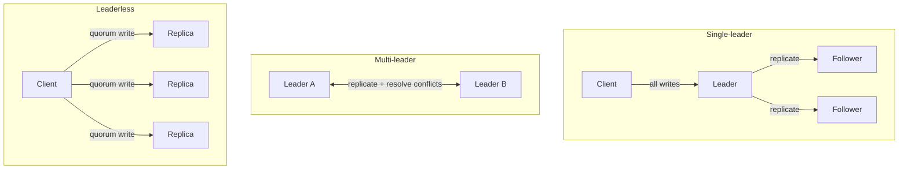
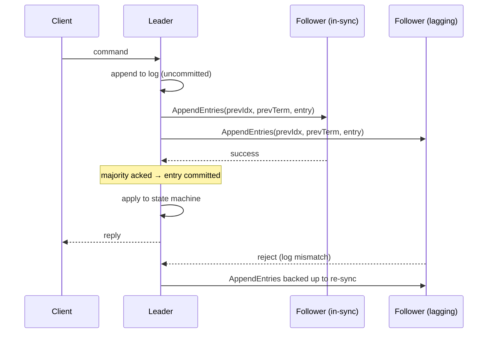

# Distributed Systems Study Guide

A practical, depth-first guide to distributed systems for engineers who build and operate them. It assumes you can write and run a single-process service, but not that you've reasoned carefully about what changes when that service becomes three processes on three machines talking over a network that sometimes lies. The approach is concept-first but relentlessly grounded: every idea here is anchored in real open-source systems you can download and run — Kafka, Cassandra, etcd, ZooKeeper, Consul, Redis Cluster, CockroachDB, Elasticsearch, Kubernetes — because the abstractions only stick once you've seen which production system embodies them and why.

The guide builds from the bottom up. First the *physics* — why a network of computers is qualitatively, not just quantitatively, harder than one computer. Then the core techniques layered on top of that physics: replication, consensus, and partitioning. Then the things you assemble from those primitives — coordination services, transactions, and messaging. Then what it takes to keep the result alive in production. It closes with a field guide that maps the concepts onto the OSS systems you'll actually run, and walks through how a few of them work end to end.

Primary references, all worth reading in full: [*Designing Data-Intensive Applications*](https://dataintensive.net/) (Kleppmann) — the single best book on this material; the [Raft paper](https://raft.github.io/raft.pdf) and [interactive visualization](https://raft.github.io/); the [Dynamo paper](https://www.allthingsdistributed.com/files/amazon-dynamo-sosp2007.pdf); the [Kafka design docs](https://kafka.apache.org/documentation/#design); and [MIT 6.5840 (formerly 6.824)](https://pdos.csail.mit.edu/6.824/), whose labs are the best way to actually internalize this.

This guide has siblings that go deeper on adjacent ground: the [Redis guide](REDIS_STUDY_GUIDE.md), the [Data Engineering guide](DATA_ENGINEERING_STUDY_GUIDE.md) (Kafka, Spark), the [Observability guide](OBSERVABILITY_STUDY_GUIDE.md) (tracing, SLOs), the [Kubernetes guide](k8s/KUBERNETES_STUDY_GUIDE.md), the [Postgres guide](ADVANCED_POSTGRES.md) (replication), and the [Networking Fundamentals guide](NETWORKING_FUNDAMENTALS.md) (load balancing, TCP).

---

## Table of Contents

1. [Part 1 — Foundations & Mental Model](#part-1--foundations--mental-model)
2. [Part 2 — The Physics of Failure & Time](#part-2--the-physics-of-failure--time)
3. [Part 3 — Replication & Consistency](#part-3--replication--consistency)
4. [Part 4 — Consensus](#part-4--consensus)
5. [Part 5 — Partitioning & Sharding](#part-5--partitioning--sharding)
6. [Part 6 — Coordination & Distributed Primitives](#part-6--coordination--distributed-primitives)
7. [Part 7 — Transactions & Ordering](#part-7--transactions--ordering)
8. [Part 8 — Messaging & Streaming](#part-8--messaging--streaming)
9. [Part 9 — Operating Distributed Systems](#part-9--operating-distributed-systems)
10. [Part 10 — A Field Guide to Distributed OSS](#part-10--a-field-guide-to-distributed-oss)

---

## Part 1 — Foundations & Mental Model

Before any algorithm, get the model right. Almost every distributed-systems bug — the duplicate charge, the data that came back stale, the cluster that froze when one node got slow, the deploy that caused a cascading outage — traces back to a single failure of imagination: treating the network as if it were a function call, and treating other machines as if they fail the way your own process does.

### What Makes a System "Distributed"

A system is distributed when it spans **multiple machines that coordinate by passing messages over a network, with no shared memory and no shared clock.** That's the whole definition, and every hard part follows from it. Two threads in one process share memory and a CPU clock; if one crashes, the OS knows immediately and cleanly. Two machines share neither, and when one crashes, the other *cannot tell* — all it sees is silence, which is indistinguishable from "slow" or "the network ate my packet."

You are already running distributed systems, whether or not you've called them that:

- The web app talking to a **Postgres replica** for reads and the primary for writes is a distributed system with all the replication-lag hazards in Part 3.
- A **Kubernetes** cluster is a distributed system whose brain (`etcd`) runs a consensus algorithm (Part 4) and whose controllers run reconcile loops over a replicated log.
- A **Kafka** cluster, a **Cassandra** ring, an **Elasticsearch** index, a **Redis Cluster**, a CDN, a globally load-balanced API — all distributed, all embodying the ideas in this guide.

### Why Build Them At All

Distributed systems are strictly harder than single machines, so you should have a reason. There are exactly four, and most real systems are chasing more than one:

1. **Scale beyond one machine.** A dataset that doesn't fit on one disk, or a write rate that saturates one box, forces you to *partition* (Part 5) across many machines.
2. **Fault tolerance / availability.** One machine has a single power supply, one disk, one kernel. If "the service is down when that machine is down" is unacceptable, you must *replicate* (Part 3) so another machine can take over.
3. **Lower latency via geography.** Physics caps how fast a packet crosses an ocean (~70 ms one way, and that's the speed of light in fiber — you can't optimize it away). Serving users from a nearby region means copies of your system and data near them.
4. **Throughput via parallelism.** Some workloads (analytics, indexing, ML training) finish faster split across many workers — Spark, Flink, MapReduce.

Notice that (1) and (4) push you toward **partitioning** (split the work/data), while (2) and (3) push you toward **replication** (copy the work/data). Those two forces — split and copy — are the load-bearing beams of the entire field, and they fight each other: more copies means more things to keep consistent; more splits means more coordination to answer a single question. Nearly every design in this guide is managing the tension between them.

### Why They're Hard: Partial Failure

On a single machine, failure is **total and observable**: the process is up or it's down, and your code either runs or doesn't. In a distributed system, failure is **partial and ambiguous**: some components work while others don't, and *you cannot reliably tell which*.

The canonical example is a request with no response. You sent it; nothing came back. What happened?

- The request was lost on the way out (the recipient never saw it).
- The recipient processed it successfully, but the *response* was lost on the way back.
- The recipient is alive but slow (GC pause, overloaded disk) and the response is still coming.
- The recipient crashed before processing.
- The recipient crashed *after* processing but before replying.

**These are indistinguishable to you.** Every one produces the identical observation: silence. This single fact — that you cannot distinguish a slow node from a dead node from a lost message — is the root of consensus being hard (Part 4), of "exactly-once delivery" being impossible (Part 7), and of why **idempotency** (Part 7) is the most useful word in the field. Hold onto it; we'll return to it constantly.

### The Eight Fallacies of Distributed Computing

In 1994 Peter Deutsch (with Bill Joy and Tom Lyon) wrote down the false assumptions that newcomers reliably make. Three decades later, every one still draws blood:

1. **The network is reliable.** It isn't — packets drop, links flap, switches reboot.
2. **Latency is zero.** A local call is nanoseconds; a cross-region call is tens of milliseconds — a factor of a million. A loop that's fine in-process is a catastrophe over the wire.
3. **Bandwidth is infinite.** Fan out a 1 MB response to 10,000 subscribers and you've created 10 GB of egress.
4. **The network is secure.** Assume eavesdroppers and forged packets; see the [Cryptography guide](CRYPTO_FUNDAMENTALS.md).
5. **Topology doesn't change.** Nodes are added, removed, and rescheduled constantly — especially under Kubernetes, where pods are cattle.
6. **There is one administrator.** Real systems span teams, clouds, and versions that disagree.
7. **Transport cost is zero.** Serialization, TLS handshakes, and connection setup all cost real CPU and time.
8. **The network is homogeneous.** Different links, MTUs, and middleboxes behave differently.

If you internalize only the first two — the network drops things and is slow in ways you can't predict — you'll avoid most beginner disasters. The rest of this guide is, in a sense, the disciplined response to these eight lies.

### A Map of What Follows

The guide is layered, and the layers build on each other:

```text
                 ┌─────────────────────────────────────────────┐
   Operating     │ Part 9: timeouts, retries, circuit breakers, │
   (survival)    │          cascading & metastable failure      │
                 ├─────────────────────────────────────────────┤
   Assemble      │ Part 6: coordination services & primitives   │
   into systems  │ Part 7: transactions, idempotency, sagas     │
                 │ Part 8: messaging, queues, the log           │
                 ├─────────────────────────────────────────────┤
   Core          │ Part 3: replication & consistency            │
   techniques    │ Part 4: consensus (Raft/Paxos)               │
                 │ Part 5: partitioning / sharding              │
                 ├─────────────────────────────────────────────┤
   Physics       │ Part 2: partial failure, unreliable network, │
   (the floor)   │          no shared clock, impossibility       │
                 └─────────────────────────────────────────────┘
```

If you remember one thing from Part 1: **a distributed system is one where partial, ambiguous failure is the normal case, not the exception.** Everything else is the disciplined response to that fact.

```quiz
Q: You send a request to another service and get no response. What does that tell you?
- [ ] The request was lost on the way out
- [ ] The recipient crashed before processing it
- [x] Nothing — a lost request, a lost response, a slow node, and a crash before or after processing all look identical
- [ ] The recipient processed it but the response was lost
> Silence is ambiguous by nature: every one of those failures produces the same observation. This five-way ambiguity is why consensus is hard, why exactly-once delivery is impossible, and why idempotency matters so much.

Q: Why do replication and partitioning — the field's two load-bearing techniques — fight each other?
- [ ] Replication requires consensus but partitioning forbids it
- [x] More copies means more things to keep consistent; more splits means more coordination to answer a single question
- [ ] Partitioning only works on data that is never replicated
- [ ] They don't — every well-designed system maximizes both
> Copy for availability, split for scale — and each makes the other harder. Nearly every design in this guide is managing the tension between those two forces.

Q: Which motivation for going distributed pushes you toward replication rather than partitioning?
- [ ] A dataset too big for one disk
- [ ] Analytics that finish faster split across workers
- [x] Surviving the loss of a machine without downtime
- [ ] A write rate that saturates one box
> Fault tolerance (and latency-via-geography) call for copies of the data; scale and throughput call for splitting it. The other three options all force partitioning.

Q: Per the guide, internalizing which two of the Eight Fallacies avoids most beginner disasters?
- [x] "The network is reliable" and "latency is zero"
- [ ] "The network is secure" and "topology doesn't change"
- [ ] "Bandwidth is infinite" and "transport cost is zero"
- [ ] "There is one administrator" and "the network is homogeneous"
> The network drops things, and it is slow in ways you can't predict — a factor of a million between a local call and a cross-region one. Most of the guide is the disciplined response to those two lies.
```

---

## Part 2 — The Physics of Failure & Time

Part 1 said failure is partial and ambiguous. This part makes that precise: *exactly* what guarantees the network does and doesn't give you, why you cannot trust a wall clock across machines, what tools recover ordering when clocks fail you, and the two famous results that bound what's even possible. This is the floor everything else stands on.

### The Network Gives You Almost Nothing

The only honest model of an asynchronous network is: **you send a message; eventually it might arrive, or might not, possibly more than once, possibly out of order, after an arbitrary delay.** Concretely, the network may:

- **Drop** a message (congestion, a full buffer, a flapping link).
- **Delay** it arbitrarily — there is no upper bound you can rely on.
- **Duplicate** it (a retransmit you thought was lost actually arrived, twice).
- **Reorder** it relative to other messages.
- **Partition** — split the cluster into groups that can each talk internally but not across the divide.

TCP papers over *some* of this within a single connection: it retransmits drops, reorders back into sequence, and dedupes. But TCP cannot save you from the cases that matter most — a connection that *breaks* mid-stream, a peer that's slow, or a network partition. And TCP's guarantees stop at the socket: "the bytes were ACKed by the kernel" is not "my application processed the request." The hard problems live in that gap.

### The Timeout: The Only Tool, and an Imperfect One

Since the network gives no delivery bound, your only practical way to *act* on the possibility of failure is the **timeout**: wait some duration, and if no reply comes, assume something went wrong. Timeouts are unavoidable and they are also a guess. Set the timeout too short and you'll declare healthy-but-slow nodes dead, retry needlessly, and amplify load (Part 9). Set it too long and your system hangs for minutes on a node that died instantly.

Crucially, **a timeout does not tell you what failed.** It returns you to the five-way ambiguity from Part 1. This is why a timeout must almost always be paired with two other tools:

- **Retries** — try again, because the failure may be transient. But retrying a request that *did* succeed (you just lost the response) means doing the operation twice. That's only safe if the operation is **idempotent** (Part 7). Retries also need **backoff and jitter** or they become a stampede (Part 9).
- **Idempotency** — design operations so that doing them twice has the same effect as doing them once. This is what makes "retry on timeout" safe, and it's the single most important defensive habit in the whole field.

### There Is No "Now": Clocks Lie

Each machine has its own clocks, and they disagree. You must distinguish two kinds, and using the wrong one is a classic bug:

- **Time-of-day clock** (`System.currentTimeMillis()`, `time.time()`): wall-clock time since the epoch, synchronized to the outside world by **NTP**. It can **jump backward** (an NTP correction, a leap second), drift, or be wildly wrong on a freshly booted VM. **Never use it to measure elapsed time or to order events.**
- **Monotonic clock** (`System.nanoTime()`, `time.monotonic()`, `CLOCK_MONOTONIC`): only ever moves forward, at a roughly steady rate, with no fixed meaning to its absolute value. Use it for timeouts, latency, and "how long did this take." **It is meaningless to compare across machines** — each box's monotonic clock starts at an arbitrary point.

NTP typically keeps wall clocks within a few milliseconds to tens of milliseconds of each other on a good network, but skews of hundreds of milliseconds (or worse, on a misconfigured or virtualized host) happen in the real world. So here is the rule that prevents a whole class of data-corruption bugs:

> **Never decide which of two events on different machines happened first by comparing their wall-clock timestamps.** A clock skew of 50 ms across nodes means a "later" timestamp can belong to the event that truly happened first.

This is not academic. **Cassandra resolves conflicting writes by last-write-wins using client/coordinator timestamps** — so two writes within the clock-skew window can silently resolve in the wrong order and *lose data*. Knowing this is why mature Cassandra deployments obsess over tight NTP and avoid LWW for anything where order matters.

### Logical Time: Ordering Without Clocks

If physical clocks can't order events, what can? **Causality**, captured by logical clocks. The foundational idea is Lamport's **happens-before** relation (→):

- If `a` and `b` are in the same process and `a` comes first, then `a → b`.
- If `a` is sending a message and `b` is receiving it, then `a → b`.
- It's transitive: `a → b` and `b → c` imply `a → c`.

If neither `a → b` nor `b → a`, the events are **concurrent** — and crucially, *no ordering between them is meaningful*. Concurrency isn't a problem to be eliminated; it's a fact to be represented.

**Lamport clocks** implement a weak version with a single counter per node: increment on every event, attach it to every message, and on receive set your counter to `max(local, received) + 1`. This guarantees `a → b ⟹ L(a) < L(b)`. But the converse fails: `L(a) < L(b)` does *not* imply `a → b` — they might be concurrent. Lamport clocks give a consistent *total* order (useful — e.g., for tie-breaking) but can't *detect* concurrency.

**Vector clocks** can. Each node keeps a vector of counters, one slot per node, and merges element-wise on receive. Now you can compare two events precisely: if every component of `V(a) ≤ V(b)` (and at least one is strictly less), then `a → b`; if some components are greater and others less, they're **concurrent** — a genuine conflict that something must resolve. This is exactly how **Dynamo-style databases (Riak, early Cassandra, DynamoDB)** detect that two clients wrote conflicting versions of the same key during a partition, surfacing *siblings* the application (or a CRDT, Part 3) must merge. The cost is that the vector grows with the number of writers, which is why production systems prune it.

**Hybrid Logical Clocks (HLC)** combine a physical-time component with a logical counter, giving timestamps that are close to wall-clock (so they're human-meaningful and roughly comparable across nodes) yet still respect causality. **CockroachDB** uses HLCs as the backbone of its transaction ordering — a pragmatic answer to "we want timestamps that mean something *and* don't lie about causality."

### Detecting Failure: Heartbeats and Gossip

Since you can't ask "are you dead?", you infer liveness from silence. The basic tool is the **heartbeat**: nodes periodically ping; miss enough and you suspect the peer is down. But a fixed threshold is brittle (Part 9's timeout dilemma again). Two refinements show up across real systems:

- **Phi-accrual failure detectors** output a *suspicion level* (φ) that rises smoothly as silence lengthens, adapting to observed network variance instead of a hard cutoff. **Cassandra** and **Akka** use this.
- **Gossip / SWIM protocols** scale failure detection to large clusters: instead of everyone pinging everyone (O(n²)), each node periodically exchanges state with a few random peers, and information about who's up/down/joining propagates epidemically in O(log n) rounds. **Cassandra**, **Consul** (via Serf), and **HashiCorp's** tooling use gossip for membership and failure detection. It's eventually-consistent membership — fast and robust, but a node's view can briefly lag reality.

### Two Impossibility Results You Should Know

You don't need the proofs, but you must know the shape of these, because they explain why certain "obvious" features don't exist:

- **The Two Generals Problem.** Two generals must coordinate an attack by messengers crossing enemy territory (an unreliable channel). It is provably impossible to *guarantee* they ever reach certain agreement — any final confirming message could be the one that's lost, requiring a confirmation of the confirmation, forever. The practical lesson: **guaranteed exactly-once delivery over an unreliable network is impossible.** You can have at-most-once (don't retry) or at-least-once (retry until acked), and you bridge the gap with idempotency. "Exactly-once" only ever means "at-least-once delivery plus deduplication" (Part 7).
- **FLP (Fischer–Lynch–Paterson, 1985).** In a fully asynchronous system (no clock bounds) where even *one* node may crash, **no deterministic algorithm can guarantee it will reach consensus** — there's always some unlucky timing that makes it run forever. This sounds like it kills consensus entirely. It doesn't, because real systems sidestep it: they use **timeouts** (a touch of synchrony) and **randomization** to guarantee *termination in practice* while never sacrificing *safety*. That distinction — safety (never wrong) vs. liveness (eventually makes progress) — is the lens through which Part 4's Raft is best understood: Raft is always safe, and is live whenever the network behaves well enough for long enough.

If you remember one thing from Part 2: **the network and the clock are both unreliable narrators.** You order events by causality, not timestamps; you detect failure by inference, not certainty; and you make retries safe with idempotency because the impossibility results say you have no other choice.

```quiz
Q: Why must you never order two events on different machines by comparing their wall-clock timestamps?
- [ ] Wall clocks have insufficient resolution for ordering
- [ ] NTP is not available in most datacenters
- [x] Clock skew means the "later" timestamp can belong to the event that truly happened first
- [ ] Timestamps cannot be attached to network messages
> NTP keeps clocks within milliseconds at best, and 50 ms of skew across nodes is enough to invert the apparent order. Cassandra's last-write-wins resolves conflicts this way — which is how concurrent writes within the skew window can silently lose data.

Q: What can vector clocks do that Lamport clocks cannot?
- [ ] Provide a total order useful for tie-breaking
- [ ] Guarantee that `a → b` implies `L(a) < L(b)`
- [ ] Stay a fixed size regardless of the number of writers
- [x] Detect that two events are concurrent — neither happened before the other
> Lamport clocks give `L(a) < L(b)` whenever `a → b`, but the converse fails, so they can't distinguish "ordered" from "concurrent." Vector clocks compare element-wise and surface genuine conflicts — exactly how Dynamo-style stores detect conflicting siblings.

Q: Which clock should you use to measure a timeout, and why?
- [x] The monotonic clock — it only moves forward, though its absolute value is meaningless across machines
- [ ] The time-of-day clock — it is synchronized by NTP
- [ ] Either, as long as both machines run NTP
- [ ] The time-of-day clock, but only in UTC
> The time-of-day clock can jump backward on an NTP correction, turning an elapsed-time measurement into garbage. Monotonic clocks exist precisely for durations — and comparing them across machines is meaningless, since each starts at an arbitrary point.

Q: What is the practical lesson of the Two Generals Problem?
- [ ] Two nodes can reach certain agreement if they exchange enough confirmations
- [ ] Reliable delivery requires TCP rather than UDP
- [x] Guaranteed exactly-once delivery over an unreliable network is impossible — you bridge at-least-once with idempotency
- [ ] Consensus requires an odd number of participants
> Any final confirming message could be the one that's lost, requiring a confirmation of the confirmation, forever. So delivery is at-most-once or at-least-once, and "exactly-once" only ever means at-least-once plus deduplication.

Q: FLP proves consensus can't be guaranteed to terminate in a fully asynchronous system. How do Raft and friends live with that?
- [ ] They run on networks with bounded delay, where FLP doesn't apply
- [x] They are always safe, and use timeouts and randomization to be live whenever the network cooperates
- [ ] They sacrifice safety in rare timing scenarios
- [ ] They require a majority of nodes to share a hardware clock
> FLP rules out guaranteed termination, not correctness. Practical algorithms never produce two different answers (safety) and make progress in practice (liveness) by adding a touch of synchrony — Raft's randomized election timeouts being the canonical example.
```

---

## Part 3 — Replication & Consistency

Replication means keeping a copy of the same data on multiple machines. You do it for the three reasons from Part 1: **availability** (a replica takes over when one dies), **read scaling** (spread reads across copies), and **latency** (a copy near the user). If the data never changed, replication would be trivial — copy it once and you're done. All the difficulty comes from **propagating writes to every copy**, and from the question that dominates the rest of this part: *when a client reads, which version does it see?*

### Three Architectures for Replication

Essentially every replicated system is one of three shapes, distinguished by **where writes are allowed**:

**1. Single-leader (primary/replica, "master/slave").** All writes go to one designated leader; the leader streams its changes to followers, which serve reads. This is the default in **Postgres** (streaming replication), **MySQL**, **MongoDB** (replica sets), **Redis** (primary/replica), and **Kafka** (per-partition leader). It's popular because it sidesteps write conflicts entirely — there's one place writes are ordered. The cost is that the leader is a write bottleneck and a failure point, so you need **failover**.

**2. Multi-leader.** Several nodes accept writes and replicate to each other. Used across datacenters (each region has a local leader for low write latency) and in offline-capable clients. The price is **write conflicts**: two leaders accept conflicting updates to the same key concurrently, and now you must resolve them (last-write-wins, application merge, or CRDTs). MySQL's multi-source replication and **CouchDB** are examples. Conflict resolution is genuinely hard; avoid multi-leader unless you need it.

**3. Leaderless (Dynamo-style).** Any replica accepts writes; the client (or a coordinator) writes to several replicas and reads from several, using **quorums** to get consistency. This is **Cassandra**, **Riak**, **ScyllaDB**, and Amazon's original **Dynamo**. No leader means no failover step — the system just keeps serving — at the cost of pushing consistency decisions onto every read and write.



### Synchronous vs. Asynchronous, and Replication Lag

When the leader gets a write, does it wait for followers before acking the client?

- **Synchronous:** wait for the follower to confirm. The follower is guaranteed current, but a slow or dead follower stalls writes. You almost never make *all* followers synchronous.
- **Asynchronous:** ack the client immediately, propagate in the background. Fast and available, but if the leader dies before a write reaches any follower, that write is **lost**. And followers lag.
- **Semi-synchronous** (the common compromise): require *one* follower to confirm, the rest async. Postgres (`synchronous_standby_names`), MySQL, and Kafka (via `acks=all` + `min.insync.replicas`, Part 8) all offer this knob. It bounds data loss to "we lost the leader *and* the one synced replica simultaneously."

**Replication lag** — the window where followers are behind the leader — is where asynchronous replication bites users, in three classic ways. They're worth memorizing because they explain confusing production reports:

- **Read-your-own-writes:** a user updates their profile (write → leader), immediately reloads (read → lagging follower), and sees the *old* data. They think the save failed. Fix: route a user's reads to the leader for a short window after their write, or track the write's position and read from a follower caught up to it.
- **Monotonic reads:** a user refreshes twice, hits two followers with different lag, and sees data *go backward in time*. Fix: pin a given user to one replica.
- **Consistent-prefix reads:** a reader sees an answer before its question — effects before causes — because independent partitions replicated at different speeds. Fix: ensure causally-related writes go through the same partition, or use a system that tracks causality.

These three are the everyday face of weak consistency. Note that they're **session guarantees** — properties about what a single client sees over time — and a system can offer them cheaply even without global strong consistency.

### Failover and the Split-Brain Trap

When a single leader dies, something must promote a follower. Doing this *automatically and correctly* is deceptively hard, and it's where the Part 2 ambiguity returns with teeth:

- If the old leader was only *slow* (not dead) and you promote a new one, you now have **two leaders** — **split-brain** — both accepting writes that conflict. This is how data gets corrupted and how the [Redis](REDIS_STUDY_GUIDE.md) Sentinel/Cluster docs spend so many words on quorum.
- If async replication was on, the promoted follower is missing the old leader's last writes. When the old leader rejoins, those writes must be **discarded** — silent data loss.
- Deciding the leader is *really* dead requires agreement among the survivors, which is **consensus** (Part 4). This is the deep reason production systems lean on a coordination service: **Redis Sentinel** needs a quorum of sentinels to agree; **Kafka** historically used **ZooKeeper** (now **KRaft**, its own Raft) to elect the controller; **Patroni** uses **etcd/Consul/ZooKeeper** to make Postgres failover safe. The lesson recurs: *don't hand-roll leader election; delegate it to a system that does consensus correctly.*

### The Consistency Spectrum

"Consistency" is overloaded, so pin it down. Here it means: **what guarantees does a read give about how recent and how ordered the data is?** From strongest (most intuitive, most expensive) to weakest (cheapest, most surprising):

| Model | Guarantee | Cost | Where you see it |
|---|---|---|---|
| **Linearizable** (strong) | Every operation appears to take effect atomically at a single instant between its call and return; once a write completes, *all* reads see it. The system behaves like one machine. | Requires coordination (consensus) on the critical path; can't stay available under partition. | etcd, ZooKeeper, Spanner, a single-node DB, Cassandra `ALL`/`QUORUM`+`QUORUM` with care |
| **Sequential** | All nodes see operations in the *same* order, but not necessarily real-time order. | Slightly cheaper than linearizable; rarely the explicit target in practice. | Some replicated logs |
| **Causal** | Operations that are causally related (Part 2's happens-before) are seen in order by everyone; concurrent ops may be seen in different orders. | Much cheaper; stays available under partition; the strongest model compatible with availability. | MongoDB causal sessions, CockroachDB, research systems (COPS) |
| **Eventual** | If writes stop, all replicas *eventually* converge. Says nothing about *when* or about ordering meanwhile. | Cheapest, always available. | Cassandra/Riak default, DNS, S3 (historically), CDN caches |

A few traps in this table:

- **Linearizability ≠ serializability.** They get conflated constantly. **Linearizability** is about *single objects* and *real-time recency* — it's a guarantee about freshness and a total order on one register. **Serializability** (Part 7) is a *transaction* isolation property — multiple objects, multiple operations, appearing to run in *some* serial order (not necessarily real-time). The gold standard, **strict serializability**, is both at once (Spanner, CockroachDB aim here). You can have one without the other.
- **"Eventually consistent" is a real guarantee, just a weak one.** It promises convergence, not freshness. The danger is reading "eventual" as "usually fine" and being blindsided when a partition makes "eventually" mean "minutes."
- **Stronger is not better — it's a tradeoff.** Linearizability costs latency and availability (next section). Most of a real system is fine with weaker models; you spend strong consistency only where correctness truly demands it (account balances, unique-username claims, leader election).

### Quorums: Tunable Consistency Without a Leader

Leaderless systems get consistency from **quorum overlap**. With `N` replicas, require every write to be acknowledged by `W` of them and every read to consult `R` of them. If you choose:

```text
W + R > N
```

then the read set and write set must **overlap in at least one replica** — so a read is guaranteed to see at least one copy of the most recent write. This is the core trick of Dynamo-style systems, and it's *tunable per operation*:

- `N=3, W=3, R=1`: writes are slow and fragile (one dead node blocks writes) but reads are fast and fresh. Good for read-heavy, write-rare data.
- `N=3, W=1, R=3`: writes are fast and always available; reads are slower. Good for write-heavy.
- `N=3, W=2, R=2`: the balanced default — tolerate one node down for both reads and writes, and `2+2 > 3` holds.
- `N=3, W=1, R=1`: `1+1 = 2 ≤ 3`, no overlap — **maximum availability, eventual consistency.** Cassandra calls this `CL=ONE`.

In **Cassandra/cqlsh** you set this per query as the *consistency level*:

```sql
-- Strong-ish: QUORUM write + QUORUM read on a keyspace with RF=3
-- (2 + 2 > 3), survives one node down, reads see latest committed write.
CONSISTENCY QUORUM;
INSERT INTO users (id, email) VALUES (123, 'a@b.com');
SELECT email FROM users WHERE id = 123;

-- Fast & available, may read stale:
CONSISTENCY ONE;
```

Quorums alone don't make replicas converge after failures, so leaderless systems add three repair mechanisms — worth knowing by name because they appear in every Cassandra/Riak postmortem:

- **Read repair:** on a quorum read, if replicas disagree, push the newest value to the stale ones during the read.
- **Hinted handoff:** if a replica is down during a write, a live node stores a "hint" and replays it when the dead node returns. (A *sloppy quorum* uses non-home nodes to hit `W` during a partition — higher availability, weaker guarantee.)
- **Anti-entropy:** a slow background process compares replicas (Cassandra uses **Merkle trees** to find differences cheaply) and reconciles them.

### When Writes Conflict: LWW and CRDTs

Multi-leader and leaderless systems must resolve concurrent writes to the same key. Two approaches dominate:

- **Last-write-wins (LWW):** attach a timestamp, keep the highest. Simple, and the Cassandra default — but as Part 2 warned, it *silently discards* the "losing" write and depends on clocks you can't trust. Fine for "latest sensor reading," dangerous for anything where both writes carry intent (e.g., adding two different items to a cart — LWW throws one away).
- **CRDTs (Conflict-free Replicated Data Types):** data structures (counters, sets, maps, sequences) designed so that concurrent updates *merge automatically and deterministically* without coordination, because the merge function is commutative, associative, and idempotent. A grow-only counter merges by taking the max per node and summing; an add-wins set tracks adds and removes so a concurrent add+remove resolves predictably. **Riak** ships CRDTs, **Redis Enterprise** uses them for active-active geo-replication, and **Automerge/Yjs** power collaborative editors (Google-Docs-style multi-user editing). CRDTs are the principled answer to multi-leader conflicts — at the cost of being restricted to data types whose semantics you can express as a clean merge.

### CAP, Honestly — and PACELC

The **CAP theorem** is the most cited and most misunderstood result in the field. The precise statement: when a **network partition (P)** occurs, a distributed system must choose between **consistency (C, meaning linearizability)** and **availability (A, meaning every request to a live node gets a non-error response).** You cannot have both *during a partition*.

The misreadings to discard:

- It is **not** "pick two of three." Partitions are not optional — networks partition whether you like it or not — so P is a given. The real choice is **CP vs. AP**, and only *when partitioned*.
- When there's **no** partition (the normal case, >99% of the time), CAP says nothing — you get both C and A. So CAP describes behavior in a rare failure mode, not your everyday tradeoff.

That last gap is what **PACELC** fills, and it's the more useful framing for design: **if Partitioned, choose Availability or Consistency; Else (normal operation), choose Latency or Consistency.** Even with no partition, keeping replicas linearizable costs round-trips — so you trade latency against consistency *all the time*, not just during failures. Examples:

- **etcd / ZooKeeper / Spanner:** PC/EC — consistent always, sacrificing availability under partition (the minority side stops serving writes) and latency in normal operation (consensus round-trips). You *want* this for the cluster's brain.
- **Cassandra / Dynamo / Riak:** PA/EL — stay available and low-latency, accept eventual consistency. You *want* this for a shopping cart or a feed.
- **CockroachDB / Spanner** lean CP/EC but work hard to keep the latency cost low (HLC/TrueTime, Part 7).

The design takeaway is to **choose per-data, not per-system.** A single product has both a balance ledger (wants CP) and a "recently viewed" list (happily AP). Mature architectures route different data to different stores, or use a database with tunable consistency, rather than forcing one global answer.

If you remember one thing from Part 3: **replication is easy until data changes, and then every hard choice reduces to "how stale and how ordered a read will tolerate, versus how much latency and availability you'll pay to avoid it."** CAP/PACELC name the axis; quorums, leases, and consensus are how you pick a point on it.

```quiz
Q: A user saves their profile, immediately reloads the page, and sees the old data. What most likely happened?
- [ ] The write was lost in a failover
- [ ] The cache returned a stale entry that will never converge
- [x] The write went to the leader, but the read hit an asynchronously replicated follower that hadn't caught up
- [ ] The database rolled back the transaction
> This is the read-your-own-writes anomaly — the everyday face of replication lag. The fix is a session guarantee: route the user's reads to the leader briefly after a write, or read from a replica known to have caught up to the write's position.

Q: With N replicas, why does requiring W write acks and R read acks with W + R > N give you fresh reads?
- [x] The read set and write set must overlap in at least one replica, so every read consults some replica holding the latest write
- [ ] It forces all replicas to be synchronously updated
- [ ] It guarantees the coordinator is always the freshest node
- [ ] It prevents network partitions from occurring
> Quorum overlap is pure pigeonhole: any W-set and R-set with W + R > N share a member. That's the whole trick behind Dynamo-style tunable consistency — and why N=3, W=1, R=1 (no overlap) is eventual consistency.

Q: Why is automatic failover the birthplace of split-brain?
- [ ] Followers cannot be promoted without operator approval
- [x] A leader that is merely slow is indistinguishable from a dead one, so you can promote a new leader while the old one still accepts writes
- [ ] Replication lag makes the new leader reject all writes
- [ ] DNS caches the old leader's address
> Part 2's ambiguity returns with teeth: silence doesn't mean dead. Two simultaneous leaders accept conflicting writes and corrupt data — which is why deciding "the leader is really dead" requires consensus among the survivors, not a timer on one box.

Q: What distinguishes linearizability from serializability?
- [ ] They are two names for the same guarantee
- [ ] Serializability implies real-time ordering; linearizability does not
- [x] Linearizability is about real-time recency on single objects; serializability is about transactions appearing to run in some serial order
- [ ] Linearizability applies only to leaderless systems
> They get conflated constantly. Linearizability: once a write completes, all reads see it (freshness, one object). Serializability: multi-object transactions appear to execute one at a time, in some order that needn't match real time. Strict serializability is both at once.

Q: What does the CAP theorem actually let you choose?
- [ ] Any two of consistency, availability, and partition tolerance, at design time
- [ ] Whether your network will experience partitions
- [x] Consistency or availability, and only while a partition is happening
- [ ] Latency or consistency during normal operation
> Partitions aren't optional, so "pick two of three" is a misreading — the real choice is CP vs. AP during a partition. PACELC adds the part CAP is silent on: even with no partition, you trade latency against consistency all the time.
```

## Part 4 — Consensus

Consensus is the crown jewel of the field: getting a group of nodes to **agree on a single value (or a sequence of values) despite crashes, restarts, and a lying network — and never producing two different answers.** Part 2's FLP result says you can't guarantee this terminates in a fully asynchronous system, yet practical algorithms (Raft, Paxos, ZAB) achieve it every day by being *always safe* and *live whenever the network cooperates*. This part is the densest in the guide; it pays off because consensus is the engine inside etcd, ZooKeeper, Consul, Kafka's controller, and every distributed SQL database.

### Where Consensus Actually Shows Up

You rarely call a "consensus API" directly, but you constantly depend on one underneath:

- **Leader election** — agree on *who* is in charge (Part 3's failover, Kafka's controller, a Kubernetes controller-manager).
- **Distributed locks / atomic compare-and-swap** — agree that *exactly one* client got the lock (Part 6).
- **Atomic commit** — agree that a transaction commits *everywhere or nowhere* (Part 7's alternative to 2PC).
- **A consistent, ordered log** — agree on the *order* of operations. This is the big one, because it generalizes all the others.

### The Replicated State Machine: Consensus as an Ordered Log

The unifying model — the one to actually remember — is the **replicated state machine (RSM)**:

> If every replica starts in the same state and applies the **same sequence of deterministic commands in the same order**, every replica ends in the same state.

So replication-of-anything reduces to **agreeing on the order of commands in a log**. Each replica keeps an append-only log; consensus is the protocol that ensures all replicas' logs hold the same commands in the same positions. Apply the log in order and you have identical state machines — identical key-value stores, identical databases, identical anything. This is precisely how etcd, ZooKeeper, and CockroachDB's per-range replicas work: **a consensus-replicated log driving a deterministic state machine.** Get the log right and everything else is "just" applying it.

### Paxos, In Spirit

**Paxos** (Lamport, 1998) was the first proven-correct consensus algorithm and dominated the literature for a decade. Single-decree Paxos agrees on *one* value via two phases over majority quorums, using ever-increasing proposal numbers:

1. **Prepare/Promise:** a proposer picks a proposal number `n`, asks a majority of acceptors to "promise" not to accept anything numbered below `n`. If an acceptor already accepted a value, it returns it.
2. **Accept/Accepted:** the proposer asks the majority to accept value `v` under number `n` (using any value already in flight from phase 1). Once a majority accepts, `v` is chosen — permanently.

Majority quorums are the magic: **any two majorities overlap in at least one node**, so a previously-chosen value can't be missed by a later round. **Multi-Paxos** chains this to agree on a *log* of values, electing a stable leader to skip phase 1 in the common case.

Paxos is correct and influential — and notoriously hard to understand and *even harder to implement correctly*. Google's Chubby team famously documented the wide gap between "Paxos the algorithm in a paper" and "Paxos the working system," full of underspecified engineering decisions. That difficulty is the entire reason the next algorithm exists.

### Raft, In Depth

**Raft** (Ongaro & Ousterhout, 2014) was explicitly designed for **understandability**, and it won — it's what you'll find in **etcd, Consul, Nomad, CockroachDB, TiKV, and Kafka's KRaft mode**. It decomposes consensus into three subproblems — leader election, log replication, and safety — and you can hold all three in your head at once.

**Roles and terms.** Every node is a **follower**, **candidate**, or **leader**. Time is divided into **terms** — an integer that increments with each election and acts as a logical clock. *At most one leader per term.* Every message carries its term; a node seeing a higher term immediately steps down to follower and adopts it. This single rule quietly resolves most split-brain scenarios: an old, partitioned leader returning with a stale term is instantly demoted.

**Leader election.** Followers expect periodic **heartbeats** (empty `AppendEntries`) from the leader. If a follower hears nothing for its **election timeout**, it becomes a candidate, increments the term, votes for itself, and sends `RequestVote` to all peers. A candidate that collects votes from a **majority** becomes leader and starts sending heartbeats. The election timeout is **randomized** (e.g., 150–300 ms) per node — this is the elegant trick that makes split votes (two candidates tying) rare and self-correcting: whoever's random timer fires first usually wins outright, and ties just trigger another randomized round.

**Log replication.** The leader is the only node that accepts client writes:

1. Client sends a command to the leader.
2. Leader appends it to its own log (uncommitted) and sends `AppendEntries` to followers.
3. Once a **majority** have written the entry to *their* logs, the leader marks it **committed**, applies it to its state machine, and replies to the client.
4. Followers learn the commit point from later `AppendEntries` and apply it too.



`AppendEntries` includes the index and term of the *preceding* entry; a follower rejects it if that doesn't match its log (the **Log Matching Property**), forcing the leader to back up and re-sync that follower until logs converge. This is how a follower that fell behind or has divergent uncommitted entries gets repaired.

**Safety — the one rule that makes it correct.** What stops a newly elected leader from clobbering committed data it never received? The **election restriction**: a node won't vote for a candidate whose log is *less up-to-date* than its own (compared by last-entry term, then index). Since a committed entry lives on a majority, and any winning candidate needs votes from a majority, **the two majorities overlap — so any candidate that can win already has every committed entry.** Committed entries are therefore never lost. That, plus "the leader's log is append-only; it never overwrites its own entries," is the safety core.

**Why an odd number of nodes.** Consensus needs a majority alive to make progress (`⌊n/2⌋ + 1`):

| Nodes | Majority | Failures tolerated |
|---|---|---|
| 3 | 2 | 1 |
| 4 | 3 | 1 |
| 5 | 3 | 2 |
| 7 | 4 | 3 |

Note 4 tolerates the *same* one failure as 3 but needs a larger quorum (so it's *slower* and *less* available, not more) — which is why production etcd/ZooKeeper/Consul clusters are almost always **3 or 5 nodes**: odd sizes maximize fault tolerance per node, and going past 5 mostly just slows writes (every write waits for a bigger majority) without buying meaningful resilience. Membership itself is changed safely via **joint consensus** (Raft) — transitioning through a combined old+new configuration so no two disjoint majorities can ever form mid-change.

### Don't Forget: Reads Need Consensus Too

A subtle trap: a stale leader (one that was partitioned out and doesn't know it lost leadership) can serve a **stale read** even though writes are safe. Strongly-consistent reads therefore need their own care. etcd's default is **linearizable reads** via the **ReadIndex** mechanism — before answering, the leader confirms with a quorum that it's still leader and waits until its state machine has applied up to the current commit index. The cheaper **serializable read** in etcd skips that and may return slightly stale data from the local node. Knowing this distinction is the difference between "my read is guaranteed fresh" and "my read is fast" — and etcd makes you choose.

### ZAB and the Real-World Landscape

**ZooKeeper** predates Raft and uses **ZAB (ZooKeeper Atomic Broadcast)** — a primary-backup atomic broadcast protocol that, like Raft, elects a leader and replicates an ordered log of state changes with majority quorums. The guarantees are equivalent in spirit (linearizable writes, FIFO client order); the mechanics differ. Raft is often described as a cousin of (Multi-)Paxos and ZAB that traded cleverness for clarity.

Here's where each consensus engine lives in the wild:

| System | Algorithm | Language | You'll meet it as the brain of… |
|---|---|---|---|
| **etcd** | Raft | Go | **Kubernetes** (all cluster state), CoreDNS, many operators |
| **ZooKeeper** | ZAB | Java | **Kafka** (pre-KRaft), HBase, Hadoop, Solr, Pulsar |
| **Consul** | Raft (+ gossip) | Go | Service discovery, service mesh, KV, multi-DC |
| **CockroachDB / TiKV** | Raft (per range) | Go / Rust | Distributed SQL — *thousands* of independent Raft groups, one per data range |
| **Kafka (KRaft)** | Raft | Java | Kafka's own metadata, replacing its ZooKeeper dependency |

Note the CockroachDB pattern: rather than one giant consensus group for the whole database (which wouldn't scale — every write through one majority), it runs **one Raft group per ~512 MB range** of the keyspace, so consensus is partitioned (Part 5) and writes to different ranges proceed in parallel. That combination — *partition the data, run consensus per partition, replicate each partition* — is the architecture of essentially every modern scale-out strongly-consistent database (Spanner, CockroachDB, YugabyteDB, TiDB).

If you remember one thing from Part 4: **consensus turns "agree on a value" into "agree on the order of a log," and it costs a majority round-trip per decision.** That cost is why you use it for the small, critical control plane — who's leader, what's the config, the metadata — and lean on cheaper replication (Part 3) for the bulk data path.

```quiz
Q: What is the unifying model that reduces "replicate anything" to a consensus problem?
- [ ] Two-phase commit across all replicas
- [x] The replicated state machine: agree on the order of commands in a log, and identical deterministic replicas stay identical
- [ ] Quorum reads with read repair
- [ ] Last-write-wins with tightly synchronized clocks
> If every replica applies the same commands in the same order from the same start, they end in the same state. So consensus on a log generalizes leader election, locks, and atomic commit — and it's literally how etcd, ZooKeeper, and CockroachDB ranges work.

Q: Why is a 4-node consensus cluster no more fault-tolerant than a 3-node one?
- [ ] Four nodes cannot form a ring topology
- [x] The majority of 4 is 3, so it still tolerates only one failure — while needing a bigger quorum for every write
- [ ] Even node counts cause permanent split votes
- [ ] Raft only supports odd cluster sizes
> Tolerated failures = n minus majority. 3 nodes tolerate 1; 4 nodes also tolerate 1 but wait on a 3-node majority for every decision — slower and less available, not more. Hence production clusters of 3 or 5.

Q: In Raft, what stops a newly elected leader from missing entries that were already committed?
- [ ] The new leader copies the old leader's log before taking office
- [ ] Committed entries are stored on every node
- [x] Nodes refuse to vote for a candidate with a less up-to-date log, and any winning majority overlaps the majority holding each committed entry
- [ ] A higher term number automatically includes all prior entries
> That's the election restriction. A committed entry lives on a majority; a winner needs votes from a majority; two majorities always overlap — so no candidate can win without already holding everything committed.

Q: Why are Raft election timeouts randomized per node?
- [x] So split votes are rare and self-correcting — whoever's timer fires first usually wins outright
- [ ] To spread CPU load evenly across the cluster
- [ ] Because synchronized timeouts would violate the FLP result
- [ ] To prevent followers from learning the leader's identity
> If all followers timed out together, they'd all become candidates together and tie, repeatedly. Randomized timeouts (e.g. 150–300 ms) make one node move first almost every time — the touch of randomness that buys liveness.

Q: Even with Raft replicating writes correctly, why can a read still return stale data — and what does etcd do about it?
- [ ] Followers serve reads from uncommitted entries
- [ ] Raft logs are only eventually consistent
- [x] A partitioned-out leader may not know it lost leadership; etcd's linearizable reads confirm leadership with a quorum (ReadIndex) before answering
- [ ] Reads bypass the state machine entirely
> Write safety doesn't make reads fresh: a deposed leader can happily answer from stale state. ReadIndex makes the leader check with a quorum first; etcd's cheaper "serializable" reads skip that check and may be slightly stale — it makes you choose.
```

---

## Part 5 — Partitioning & Sharding

Replication (Part 3) makes copies of the *same* data; **partitioning** (a.k.a. **sharding**) splits *different* data across nodes so the dataset and write load can grow past one machine — Part 1's "scale" and "throughput" drivers. The two are orthogonal and you almost always do both at once: **the data is split into partitions, and each partition is independently replicated.** A single node therefore holds many partition-replicas — say, the leader for partition 3, a follower for partition 8, a follower for partition 12. Keep that picture in mind; it's the real topology of Kafka, Cassandra, Elasticsearch, and CockroachDB.

### How to Choose Which Node Holds a Key

There are two base strategies, and the choice has sharp consequences:

**Range partitioning.** Keep keys sorted and assign contiguous ranges to partitions (`A–F` here, `G–M` there). **Pro:** efficient range scans — "all events from Tuesday" is one partition's contiguous slice. **Con:** **hotspots.** If the key is a timestamp or a monotonic ID, *all* writes hammer the single partition holding the newest range while the rest sit idle. Used by **HBase**, Google **Bigtable**, **CockroachDB** (ranges), and MongoDB's ranged sharding.

**Hash partitioning.** Hash the key and assign by hash value. **Pro:** spreads load evenly, killing the monotonic-key hotspot. **Con:** destroys range scans — adjacent keys land on different partitions, so "Tuesday's events" becomes a scatter-gather across all of them. Most key-value and wide-column stores default to this.

### Consistent Hashing: Why `hash(key) % N` Is a Trap

The obvious hash scheme is `partition = hash(key) % N` for `N` nodes. It distributes evenly — and it's a disaster to operate, because **changing `N` remaps almost every key.** Add one node (N: 4→5) and ~80% of keys now hash to a different node, triggering a near-total reshuffle of your data — exactly when you're trying to grow gracefully.

**Consistent hashing** fixes this. Hash both keys *and* nodes onto the same circular space (the "ring"); a key is owned by the next node clockwise from its position. Now adding or removing a node only remaps the keys between it and its neighbor — about **`K/N` keys**, not `K`. The catches and their fixes:

- Random placement gives uneven load and uneven rebalancing. The fix is **virtual nodes (vnodes)**: each physical node claims *many* points on the ring, so load averages out and a departing node's share spreads across *all* survivors instead of dumping onto one neighbor.
- This is the literal mechanism behind **Cassandra** and **ScyllaDB** (token ring + vnodes), Amazon **Dynamo** and **Riak**, the **ketama** algorithm in memcached client libraries, and **Envoy's** ring-hash load balancer.

### Hotspots Survive Even Good Hashing

A perfectly uniform hash still can't save you from a **single hot key** — a celebrity's account, a viral post, a `global_counter`. All its traffic hashes to one partition, overwhelming one node. There's no automatic fix; you re-shape the data:

- **Split the hot key** by appending a random suffix (`celebrity_id:00`…`celebrity_id:15`), spreading writes across 16 partitions — at the cost of **scatter-gather on reads** (you must query all 16 and merge). You apply this surgically, only to known-hot keys.
- Or absorb the read load with a cache (the [Redis guide](REDIS_STUDY_GUIDE.md)) in front of the hot partition.

This asymmetry — writes need splitting, reads need fan-in — is a recurring tax of partitioning.

### Rebalancing Without an Outage

As you add/remove nodes, partitions must move. Good rebalancing **moves the minimum data and keeps serving throughout**; bad rebalancing saturates the network and triggers the cascading failures of Part 9. Two design choices dominate:

- **Fixed number of partitions** (Kafka's partitions, Elasticsearch's primary shards, Riak): create *many more partitions than nodes* up front; rebalancing just **reassigns whole partitions** between nodes — no keys are resplit. Simple and predictable. The cost is you must pick the count up front: **Elasticsearch's primary shard count is immutable after index creation** — too few caps your scalability, too many wastes overhead, and changing it means a full reindex. That single gotcha is one of the most common Elasticsearch operational regrets.
- **Dynamic partitioning** (HBase, CockroachDB, Bigtable): partitions **split when they grow past a threshold** and merge when they shrink, adapting to data volume automatically. More flexible, more moving parts.

A hard-won operational rule: **make rebalancing deliberate, not fully automatic.** An automatic rebalance that fires *because* a node looked dead (when it was only slow) can dump huge data movement onto an already-stressed cluster and turn a blip into an outage.

### Request Routing: "Which Node Has My Key?"

Once data is spread out, a client must find the right node — the **service-discovery / routing** problem. Three architectures recur:

1. **Smart client:** the client library knows the partition map and connects directly (Cassandra drivers, Redis Cluster clients). Fewest hops; the map must be kept fresh on every client.
2. **Routing tier / proxy:** a middle layer (Vitess's `vtgate`, a MongoDB `mongos`, an Envoy proxy) holds the map and forwards. Clients stay dumb; the proxy is an extra hop and a thing to scale.
3. **Any-node forwarding:** hit any node; if it doesn't own the key, it forwards or redirects. Cassandra calls the receiving node the **coordinator**; **Redis Cluster** replies `MOVED`/`ASK` to redirect the client to the right node.

The partition map *itself* is metadata that must stay consistent across all these actors — which is exactly the job of a coordination service (Part 6). MongoDB keeps it in **config servers** (their own replica set); older systems kept it in **ZooKeeper**; Cassandra **gossips** it (Part 2).

### Partitioning the OSS Systems You'll Run

The same idea, many dialects — this table is worth internalizing because it's how you reason about each system's failure and scaling behavior:

| System | Unit | How a key maps to it | Notes |
|---|---|---|---|
| **Kafka** | Partition | `hash(key) % partitions` (default murmur2); null key → round-robin | Partition is the unit of **ordering and parallelism** (Part 8); each replicated via leader+ISR |
| **Cassandra / Scylla** | Token range | `Murmur3(partition_key)` → position on token ring → replica set | Vnodes; tunable RF; leaderless quorum (Part 3) |
| **Elasticsearch / OpenSearch** | Shard | `hash(routing) % num_primary_shards` | **Primary count fixed at index creation**; each shard replicated |
| **Redis Cluster** | Hash slot (16384) | `CRC16(key) % 16384`, slots assigned to nodes | `{tag}` in keys co-locates related keys on one slot; `MOVED`/`ASK` redirects |
| **MongoDB** | Chunk | hashed or ranged **shard key** | Balancer moves chunks; config servers hold the map |
| **CockroachDB / TiKV** | Range (~512 MB) | sorted key ranges, auto-split | Each range is its own Raft group (Part 4) |
| **Vitess (MySQL) / Citus (Postgres)** | Shard | sharding key → keyspace shard | Adds scale-out sharding to a single-node SQL engine |

If you remember one thing from Part 5: **partitioning is the answer to "too much data/load for one node," consistent hashing is how you grow without reshuffling everything, and choosing the partition key is the highest-leverage schema decision you'll make** — a bad key bakes in hotspots that no amount of hardware fixes.

```quiz
Q: Why is `partition = hash(key) % N` a trap for a growing cluster?
- [ ] The modulo operation biases load toward low-numbered nodes
- [ ] Hash functions cannot distribute keys evenly
- [x] Changing N remaps almost every key, triggering a near-total data reshuffle exactly when you're trying to grow
- [ ] It cannot handle string keys
> Adding one node (N: 4→5) moves ~80% of keys. Consistent hashing fixes this: nodes and keys share a ring, and adding a node only remaps the ~K/N keys between it and its neighbor.

Q: You range-partition events by timestamp. What happens?
- [ ] Range scans become impossible
- [x] Every write lands on the partition holding the newest range while the others sit idle
- [ ] Reads must scatter-gather across all partitions
- [ ] Keys are silently dropped when ranges fill
> A monotonic key under range partitioning is the textbook hotspot: all inserts hammer one partition. Hash partitioning spreads them out — at the cost of turning "Tuesday's events" into a scatter-gather.

Q: What problem do virtual nodes (vnodes) solve in consistent hashing?
- [ ] They let the ring hold more physical nodes
- [ ] They make hash collisions impossible
- [x] They even out load and spread a departing node's share across all survivors instead of dumping it on one neighbor
- [ ] They let two nodes own the same key simultaneously
> With one point per physical node, random ring placement is lumpy, and a node's departure dumps its whole range on its clockwise neighbor. Many points per node averages both problems away — the literal mechanism in Cassandra and Riak.

Q: A single celebrity key is overwhelming its partition despite perfectly uniform hashing. What's the fix?
- [ ] Re-hash with a stronger hash function
- [ ] Add more nodes to the cluster
- [x] Split the key with a random suffix to spread writes, accepting scatter-gather on reads — applied surgically to known-hot keys
- [ ] Switch from hash to range partitioning
> Hashing distributes keys, not one key's traffic — all of a hot key's load hits one partition no matter what. Re-shaping the data (key splitting, or a cache absorbing the reads) is the only fix; more nodes just adds idle ones.

Q: Why is Elasticsearch's primary shard count a decision to sweat over?
- [x] It's immutable after index creation — changing it means a full reindex
- [ ] Each primary shard requires its own dedicated master node
- [ ] Lucene caps the shard count at 16
- [ ] Replica count cannot exceed the primary count
> Fixed-partition systems make rebalancing simple (move whole shards, never resplit keys), but you must pick the count up front. Too few caps scalability, too many wastes overhead — one of the most common Elasticsearch operational regrets.
```

---

## Part 6 — Coordination & Distributed Primitives

Parts 3–5 are techniques. This part is about a *pattern*: rather than make every application solve consensus, you run **one** small, strongly-consistent, highly-available service and build coordination primitives on top of it. That service is **etcd, ZooKeeper, or Consul**, and "what do I actually use it for" is the most practical question in this guide. Your core question — *which OSS gets run distributed and how* — is answered most directly here, because these are the systems whose entire job is to coordinate other distributed systems.

### Why a Coordination Service Exists

Consensus is expensive (Part 4: a majority round-trip per write) and easy to get wrong. So the field converged on a division of labor: **concentrate the hard, slow, must-be-correct shared state in one place, and keep it tiny.** A coordination service is essentially a **linearizable key-value store** (backed by Raft/ZAB) with three superpowers that turn it from a database into a coordination tool:

- **Watches.** Subscribe to a key (or prefix) and get *pushed* a notification the instant it changes — no polling. This is how 10,000 clients learn about a config change or a new leader at once.
- **Leases / sessions / ephemeral keys.** A key tied to a client's liveness: the client holds a lease it must periodically renew (a heartbeat), and if it stops (crash, partition), the lease expires and the key **automatically disappears**. This is the bridge from Part 2's failure detection to actionable state: "this key exists" *means* "this client is alive."
- **Atomic compare-and-swap.** Update a key only if its current version matches what you expect. This single primitive is what makes leader election and locks possible.

What it is **not** is a general database. Every write is a consensus round, so throughput is modest (thousands of writes/sec, not millions) and the dataset must be small (etcd defaults to an 8 GB cap and is unhappy near it). **Putting bulk application data in etcd/ZooKeeper is a classic abuse** that takes down the cluster's brain. Store *metadata and coordination state* there; store data elsewhere.

### Service Discovery and Dynamic Configuration

The two most common uses, and the gentlest:

- **Service discovery.** A service instance registers itself on startup — `PUT /services/api/10.0.0.5:8080` under a lease — and clients **list + watch** that prefix to maintain a live set of healthy endpoints. When an instance dies, its lease expires and it drops out automatically. **Consul** specializes here, adding **health checks** (HTTP/TCP/script probes that gate registration) and a **DNS interface** so even DNS-only clients can resolve `api.service.consul`. Kubernetes does the same job with a different shape — `Service` objects backed by endpoints in etcd, resolved via cluster DNS.
- **Dynamic configuration / feature flags.** Store config under a key; every instance watches it and **hot-reloads on change** — flip a flag once and the whole fleet reacts in milliseconds, no redeploy. The linearizability matters: everyone sees the *same* config transition in the same order.

A concrete taste with `etcdctl` — a lease-backed registration that self-cleans, plus a watch:

```bash
# Create a 15-second lease; the returned ID ties keys to this client's liveness.
LEASE=$(etcdctl lease grant 15 | awk '{print $2}')

# Register under the lease. Stop renewing (crash) and this key vanishes in <=15s.
etcdctl put /services/api/node-1 '10.0.0.5:8080' --lease="$LEASE"
etcdctl lease keep-alive "$LEASE" &     # heartbeat in the background

# Any client watches the whole prefix and gets pushed every add/remove:
etcdctl watch --prefix /services/api/
```

### Leader Election

Many systems need *exactly one* active instance — one Kafka controller, one active controller-manager in Kubernetes, one job scheduler — while keeping hot standbys ready. That's leader election, and it's a thin layer over the primitives:

- **The CAS/lease way (etcd):** candidates race to create a single key with a lease; the winner holds leadership and keeps renewing; if it dies, the lease expires, the key vanishes, and the watchers race again. etcd exposes this directly:

```bash
# Blocks until this node is leader; holds it until the process exits or its lease lapses.
etcdctl elect scheduler node-1
```

  Kubernetes uses exactly this pattern via `Lease` objects so that, e.g., `kube-controller-manager` and `kube-scheduler` run as active/standby — only the lease-holder acts, the others wait.

- **The sequential-ephemeral way (ZooKeeper):** each candidate creates an **ephemeral sequential** znode under `/election/` (getting `n_0000000001`, `n_0000000002`, …). The lowest sequence number is the leader. The elegant detail: instead of every node watching the leader (a **thundering herd** when it dies — Part 9), each node watches *only the znode just below its own*. When a node leaves, exactly one successor is notified and checks whether it's now lowest. Herd avoided.

### Distributed Locks — and Why They're Dangerous

Now the most important cautionary tale in this part. "I'll just grab a distributed lock" is intuitive and **frequently wrong**, and understanding why separates engineers who've been burned from those about to be.

**The setup.** You want only one process in a critical section (e.g., writing a file). You acquire a lock with a **TTL** so a crashed holder doesn't deadlock everyone forever. Reasonable — and the source of the bug.

**The failure.** Consider this sequence:

```text
1. Process A acquires the lock (TTL = 30s) and starts writing.
2. Process A hits a stop-the-world GC pause (or is partitioned) for 40s.
3. At 30s the lock EXPIRES. The lock service, correctly, frees it.
4. Process B acquires the lock and starts writing.
5. Process A wakes up — still believing it holds the lock — and writes.
   >> Two writers in the "exclusive" section. Corruption.
```

The TTL that prevents deadlock is *exactly* what creates the two-holders window — and Part 2 guarantees you cannot tell a paused/partitioned A from a dead A. **No lock service can prevent this on its own,** because the danger is on the *client* side, after the grant. This is the heart of Martin Kleppmann's [widely-cited critique of Redlock](https://martin.kleppmann.com/2016/02/08/how-to-do-distributed-locking.html) (Redis's multi-node lock): even a perfectly correct lock service can't stop a paused client from acting after its lease lapsed, and Redlock additionally leans on clock assumptions Part 2 told you not to trust.

**The fix: fencing tokens.** The lock service issues a **monotonically increasing token** with every grant (A gets 33, B gets 34). The **protected resource itself** must record the highest token it has seen and **reject any write carrying a lower one.** Now when paused A finally writes with token 33, the storage — which already saw B's 34 — rejects it. Safety restored:

```text
A acquires lock, token=33 ----[40s pause]------------------> writes with token 33  ✗ REJECTED (saw 34)
                          B acquires lock, token=34 -> writes with token 34  ✓ (now highest)
```

The catch is that **the resource has to participate** in the fencing check, which many storage systems don't natively support. That difficulty drives the real-world guidance:

- **Distinguish efficiency from correctness.** If a lock is only an *optimization* — "avoid two workers redundantly processing the same job" — a best-effort lock (even Redis `SET NX PX`) is fine; the worst case is wasted work, not corruption. If a lock is for *correctness* — "never two writers" — a TTL lock alone is **not safe**; you need fencing tokens or a different approach.
- **Prefer not needing the lock.** Push atomicity into the datastore instead: a **conditional write / compare-and-swap** (`UPDATE … WHERE version = ?`), a unique constraint, or a real transaction (Part 7) makes the *data layer* enforce single-writer correctness — no separate lock, no fencing gap. Or make the operation **idempotent** (Part 7) so running it twice is harmless. The best distributed lock is often the one you designed away.
- **If you must lock, use a real consensus service** (etcd `etcdctl lock`, ZooKeeper recipe) with session-tied (ephemeral) ownership, not a best-effort store — and still add fencing for correctness-critical sections.

### Choosing a Coordination Service

| | **ZooKeeper** | **etcd** | **Consul** |
|---|---|---|---|
| Consensus | ZAB | Raft | Raft (+ Serf/gossip for membership) |
| Implemented in | Java | Go | Go |
| Data model | Hierarchical znodes | Flat KV (MVCC, prefixes) | KV + rich service catalog |
| Interface | Custom TCP client | gRPC / HTTP | HTTP / DNS |
| Killer feature | Battle-tested recipes, sequential nodes | Watches + leases, Kubernetes-native | Service discovery, health checks, multi-DC, service mesh |
| You meet it in | Kafka (legacy), HBase, Hadoop, Solr, Pulsar | **Kubernetes**, CoreDNS, M3, operators | Service discovery, Nomad ecosystem, Consul Connect mesh |

Practical defaults: if you're in the **Kubernetes world**, you're already running **etcd** and should use its primitives (Leases, leader election). If you need **service discovery with health checks across heterogeneous infrastructure** (VMs + containers + multi-datacenter), **Consul** is purpose-built. **ZooKeeper** remains the substrate under much of the Hadoop/Kafka-legacy ecosystem and has the most mature recipe catalog, but new green-field designs usually reach for etcd or Consul. And remember the throughput ceiling: none of these is where your application data goes.

If you remember one thing from Part 6: **outsource consensus to a coordination service and build leader election, discovery, and config on its watches and leases — but treat distributed locks with suspicion, because a TTL that prevents deadlock is also a window for two holders, and only fencing tokens (or pushing atomicity into the datastore) actually close it.**

```quiz
Q: Why shouldn't you store bulk application data in etcd or ZooKeeper?
- [ ] Their APIs only accept keys under 1 KB
- [x] Every write is a consensus round-trip and the dataset must stay small — bulk data takes down the cluster's brain
- [ ] They cannot replicate data across nodes
- [ ] Watches stop working past 1,000 keys
> A coordination service is a linearizable KV store paid for with majority round-trips: thousands of writes per second, not millions, and etcd defaults to an 8 GB cap. Metadata and coordination state go there; data goes elsewhere.

Q: What makes a lease-backed (ephemeral) key the bridge between failure detection and actionable state?
- [ ] It encrypts the key until the client returns
- [ ] It guarantees the client is reachable by all other clients
- [x] The key exists only while its client keeps renewing the lease — so "this key exists" means "this client is alive"
- [ ] It prevents any other client from reading the key
> Crash or get partitioned, stop renewing, and the key vanishes on its own — service registrations self-clean and leadership lapses automatically. Watches then push that change to every client instantly.

Q: Process A holds a 30-second TTL lock, pauses for a 40-second GC, then resumes writing. Why is this the canonical distributed-lock disaster?
- [ ] The lock service crashes when a holder pauses
- [x] The lock expired during the pause and B acquired it — A resumes writing while believing it still holds the lock, and no lock service can prevent that
- [ ] GC pauses corrupt the lock's TTL counter
- [ ] B is blocked forever because A never released
> The TTL that prevents deadlock is exactly what creates the two-holders window, and the danger is on the client side, after the grant — the heart of Kleppmann's Redlock critique. Fencing tokens fix it, but only if the protected resource rejects stale tokens.

Q: A lock only prevents two workers from redundantly processing the same job — wasted work, not corruption. What does the guide recommend?
- [x] A best-effort lock is fine here; reserve fencing tokens and consensus-backed locks for correctness-critical sections
- [ ] Always use fencing tokens regardless of the stakes
- [ ] Never use locks for any purpose
- [ ] Use two independent lock services and require both
> Distinguish efficiency locks from correctness locks. For efficiency, even Redis `SET NX PX` is fine — the worst case is duplicate work. For correctness, a TTL lock alone is unsafe; better still, push atomicity into the datastore (CAS, unique constraint) and design the lock away.

Q: How does ZooKeeper's leader-election recipe avoid a thundering herd when the leader dies?
- [ ] All candidates poll the leader on a randomized schedule
- [ ] The leader broadcasts a farewell message before exiting
- [x] Each candidate watches only the znode immediately below its own, so exactly one node is notified per departure
- [ ] Elections are rate-limited to one per minute
> If every standby watched the leader's znode, its death would wake all of them at once (the herd). Watching only your predecessor means one notification, one check, no stampede.
```

## Part 7 — Transactions & Ordering

A single database gives you transactions for free: ACID, all-or-nothing, isolated. The moment your state spans **two systems** — a database *and* a cache, a database *and* a message broker, two microservices each with their own store — that guarantee evaporates, and you're left holding the hardest everyday problem in the field. This part is about keeping data correct across that boundary, and the surprising answer is that the heavyweight solution (distributed transactions) is usually the *wrong* one, while a humble idea (idempotency) does most of the work.

### The Dual-Write Problem

Here is the bug that ships to production constantly:

```python
order = db.insert(order)             # 1. succeeds
broker.publish("order_created", order)  # 2. process crashes here
```

You wrote to the database, then crashed before publishing the event. Now the order exists but no downstream system knows — inventory isn't decremented, no confirmation email. Swap the order and you get the opposite: an event for an order that doesn't exist. **Two writes to two systems can't be made atomic by wishing.** Worse, "retry the publish" can double-publish if the *first* publish actually succeeded and only the ack was lost (Part 2). Every "update the DB and tell another system" is a dual-write trap. Hold this example; the Outbox pattern below is its proper fix.

### Idempotency: The Workhorse

Before any heavy machinery: **make operations idempotent, and most distributed-data pain dissolves.** An operation is idempotent if performing it twice has the same effect as performing it once. Because Part 2 proved you *will* sometimes retry an operation that already succeeded, idempotency is what makes "retry on timeout" safe — it converts unavoidable at-least-once delivery into *effectively*-once results.

- Some operations are **naturally idempotent**: `SET balance = 100` (vs. the non-idempotent `balance = balance + 10`), `DELETE WHERE id = 5`, "ensure this user exists."
- For the rest, use an **idempotency key**: the client generates a unique ID (a UUID) per logical operation and sends it with every retry; the server records processed keys and **short-circuits duplicates**, returning the original result. This is exactly how Stripe's API, payment systems, and well-built webhooks dedupe — `Idempotency-Key: <uuid>`.

```python
def charge(idempotency_key, amount):
    if (prior := store.get(idempotency_key)) is not None:
        return prior                  # duplicate retry -> return the original result
    result = payment_gateway.charge(amount)
    store.put(idempotency_key, result)  # ideally atomic with the charge
    return result
```

### Delivery Semantics, Pinned Down

Part 2's Two Generals result means delivery is always one of:

- **At-most-once:** send and don't retry. Messages may be **lost**, never duplicated. Fine for disposable telemetry.
- **At-least-once:** retry until acknowledged. Messages are never lost but may be **duplicated.** The sane default for anything that matters.
- **"Exactly-once":** *not a delivery guarantee that exists.* In practice it's **at-least-once delivery + idempotent processing (deduplication).** When a vendor says "exactly-once," look for the dedup mechanism underneath — there always is one. (Kafka's version is below.)

The design rule that follows: **prefer at-least-once + idempotent consumers** over chasing a mythical exactly-once.

### Two-Phase Commit, and Why It's Avoided

The textbook way to make a write atomic across systems is **two-phase commit (2PC)** with a **coordinator**:

1. **Prepare:** the coordinator asks every participant "can you commit?" Each does the work tentatively, locks the rows, and votes *yes* (durably promising it *can* commit) or *no*.
2. **Commit/Abort:** if all voted yes, the coordinator tells everyone to commit; if any said no, everyone aborts.

It's correct, and it's used (XA transactions, distributed databases internally). But for cross-service work it has crippling flaws:

- **The coordinator is a single point of failure that can *block* participants.** If it crashes *after* participants voted yes but *before* sending the decision, those participants are stuck **in-doubt** — they've locked rows and promised to commit, but mustn't decide unilaterally (the coordinator might have told someone else to abort). They hold locks until the coordinator recovers. The whole system can stall on one crash.
- It's **synchronous and holds locks across network round-trips**, so throughput and availability are poor — exactly the properties Part 1 said distribution was supposed to *improve*.
- **3PC** adds a phase to avoid blocking but only works under timing assumptions Part 2 says you can't rely on, so it's essentially unused.

The lesson: **don't reach for 2PC across services.** Use it only where a single vendor implements it internally with a fault-tolerant coordinator (which is what NewSQL databases do — below).

### Sagas: Atomicity Without Locks

For long-lived, cross-service workflows, the dominant pattern is the **saga**: break the distributed transaction into a **sequence of local transactions**, each in one service's own database, where each step has a **compensating action** that semantically undoes it. If step 4 fails, you run the compensations for 3, 2, 1 in reverse — money refunded, reservation cancelled, inventory released.

```text
Book trip:  reserve flight → charge card → reserve hotel → reserve car
If "reserve car" fails, compensate backward:
            cancel hotel ← refund card ← cancel flight
```

Two coordination styles:

- **Orchestration:** a central coordinator (a **workflow engine** like **Temporal**, **Netflix Conductor**, **Camunda**, or AWS Step Functions) explicitly drives the steps and compensations. Easy to see the whole flow, easy to monitor; the orchestrator is a component to run. Temporal is especially popular because it makes the workflow *durable* — it survives process crashes and resumes where it left off.
- **Choreography:** no central brain — each service reacts to events emitted by others (`OrderCreated` → payment service charges → emits `PaymentDone` → shipping reacts…). Loosely coupled, but the end-to-end flow is implicit and hard to trace; with many services it becomes "what happens next? nobody knows."

The crucial caveat: **sagas give you atomicity (all steps complete or all compensate) but NOT isolation.** Intermediate states are *visible* — between "charge card" and "reserve hotel," the world can see a charge with no booking. You must design for that explicitly (semantic locks, "pending" states, commutative operations), because the database isolation that normally hides intermediate state is gone.

### The Outbox Pattern: The Right Fix for the Dual-Write

Back to the dual-write problem — here's its canonical solution, and it's beautiful because it needs **no distributed transaction at all.** Write the business change *and* the event into the **same database** in one **local** transaction (which is atomic — single database, no distribution):

```sql
BEGIN;
  INSERT INTO orders (id, ...) VALUES (...);
  INSERT INTO outbox (id, topic, payload) VALUES (...);  -- the "event", same txn
COMMIT;  -- both or neither. No dual write.
```

Then a **separate relay process** reads the `outbox` table and publishes to the broker **at-least-once**, marking rows as sent. If the relay crashes mid-publish, it re-publishes on restart — so consumers must **dedup** (idempotency, above). The elegant production version tails the database's replication log directly with **Change Data Capture (CDC)** — **Debezium** reading the Postgres WAL or MySQL binlog — so there's no polling and the outbox is drained the instant it's committed. This — *atomic local write + CDC relay + idempotent consumers* — is how mature event-driven systems "update the database and emit an event" correctly. (More on CDC in the [Data Engineering guide](DATA_ENGINEERING_STUDY_GUIDE.md).)

### Distributed Transactions Done Right: NewSQL and Clock Tricks

Sometimes you genuinely need cross-shard, serializable transactions — and a class of databases (**Spanner, CockroachDB, YugabyteDB, TiDB**) deliver them at scale. They do it by combining everything in this guide: **partition** the keyspace into ranges (Part 5), replicate each range via **Raft** (Part 4), and coordinate cross-range transactions with a *fault-tolerant* commit protocol whose coordinator state is itself consensus-replicated (so no single-coordinator blocking like classic 2PC). The remaining problem is **ordering**: to make transactions across independent shards appear in one serial, real-time order, you need a trustworthy global timestamp — and Part 2 said clocks lie. Two answers:

- **Spanner's TrueTime:** Google equips datacenters with **GPS receivers and atomic clocks** so every server knows the time within a *bounded uncertainty* ε (a few ms). The trick is **commit-wait**: after picking a commit timestamp, a transaction *waits out ε* before releasing locks, guaranteeing its timestamp is in the real past for everyone — yielding **external consistency** (strict serializability). It buys correctness with a few milliseconds of deliberate waiting and special hardware.
- **CockroachDB's HLC:** no atomic clocks — it uses **Hybrid Logical Clocks** (Part 2) plus an assumed **maximum clock offset**. When a read encounters data within the uncertainty window, it may **restart** the transaction at a higher timestamp ("uncertainty restart") rather than risk a stale read. It's serializable on commodity hardware, paying with occasional retries instead of commit-wait.

You don't need to implement these, but recognizing the shape — *partition + per-range consensus + clock-bounded ordering* — lets you read any modern distributed-SQL architecture and know what you're looking at. (For single-node isolation levels — read committed, snapshot isolation, write skew, serializable — see the [Postgres guide](POSTGRES.md); the distributed versions build on exactly those.)

If you remember one thing from Part 7: **avoid distributed transactions; make operations idempotent, keep multi-step changes inside one database with the outbox pattern, use sagas with compensations for cross-service workflows, and reach for a NewSQL database only when you truly need cross-shard serializability.**

```quiz
Q: Your service inserts an order into its database, then publishes an event to a broker. What's wrong?
- [ ] Nothing, as long as both calls are inside a try/except
- [ ] The broker should be written before the database
- [x] A crash between the two writes leaves them permanently inconsistent — two systems can't be made atomic by wishing
- [ ] Events must always be published inside the database transaction
> This is the dual-write problem, and retrying the publish can double-publish if only the ack was lost. The outbox pattern is the fix: write the order and the event into the same database in one local transaction, and let a relay publish at-least-once to idempotent consumers.

Q: Why is 2PC avoided for cross-service transactions?
- [ ] It cannot guarantee atomicity even when everything works
- [x] A coordinator crash after the prepare phase leaves participants in-doubt, holding locks until it recovers
- [ ] It requires all participants to share one database
- [ ] It only works with exactly two participants
> Participants that voted yes mustn't decide unilaterally, so they block with locks held — one crash can stall the whole system. NewSQL databases use 2PC internally only because their coordinator state is itself consensus-replicated, removing the single point of blocking.

Q: Sagas give you atomicity across services. What do they NOT give you?
- [ ] Compensating actions for failed steps
- [x] Isolation — intermediate states are visible to the rest of the world
- [ ] The ability to span more than two services
- [ ] A way to orchestrate steps with a workflow engine
> Between "charge card" and "reserve hotel," anyone can observe a charge with no booking. The database isolation that normally hides in-progress state is gone, so you must design for visibility explicitly — pending states, semantic locks, commutative steps.

Q: A vendor advertises "exactly-once delivery." What should you look for?
- [x] The deduplication mechanism underneath — exactly-once is always at-least-once delivery plus idempotent processing
- [ ] The patented protocol that beats the Two Generals Problem
- [ ] Whether they use TCP instead of UDP
- [ ] A synchronous replication option
> The Two Generals result makes exactly-once *delivery* impossible over an unreliable network. What exists is effectively-once *results*: retries (at-least-once) made safe by dedup — Kafka's producer IDs and sequence numbers being the canonical example.

Q: How does an idempotency key make a payment API safe to retry?
- [ ] It encrypts the request so duplicates are rejected by TLS
- [ ] It instructs the network to deliver the request only once
- [x] The server records processed keys and returns the original result for any duplicate, so a retried charge happens once
- [ ] It makes the charge reversible for 24 hours
> The client attaches the same UUID to every retry of one logical operation; the server short-circuits keys it has already processed. This converts unavoidable at-least-once delivery into effectively-once effects — exactly how Stripe's `Idempotency-Key` header works.
```

---

## Part 8 — Messaging & Streaming

Synchronous RPC — service A calls service B and waits — is simple and often right, but it **couples availability**: if B is down or slow, A is down or slow, and Part 9's cascades follow. **Asynchronous messaging** breaks that coupling by putting a durable **broker** between producers and consumers. This part is about what brokers buy you, the two fundamental shapes they come in, and how the flagship — **Apache Kafka** — actually achieves durable, ordered, parallel delivery, because it's the clearest worked example of every Part 3–5 idea at once.

### What a Broker Buys You

- **Decoupling:** the producer doesn't know who consumes, or how many, or whether they're up right now. Add a new consumer without touching the producer.
- **Load leveling (buffering):** a traffic spike fills the broker instead of crushing a slow downstream; consumers drain at their own pace. The broker is a shock absorber.
- **Reliability:** the broker persists messages, so a consumer can crash, restart, and resume — nothing is lost while it's down.
- **Fan-out:** one event, many independent consumers (analytics, search indexing, notifications) each getting their own copy.

The price is real: an extra system to run, **eventual** rather than immediate processing, and the dedup/ordering concerns below. Don't add a broker when a synchronous call with a timeout would do — you need a *reason* (decoupling, buffering, fan-out, replay).

### Two Shapes: Queue vs. Log

This distinction governs everything else:

- **Queue (work distribution).** A message is delivered to **one** worker among many competing consumers, then **removed**. Scale throughput by adding workers. Ordering is generally *not* preserved across workers. This is **RabbitMQ**, AWS **SQS**, Redis lists, Celery. Ideal for **task queues**: "resize this image," "send this email" — independent jobs, each done once, by whichever worker is free.
- **Log (replayable stream).** An **append-only, ordered** sequence; consumers track their **own offset** (position) and messages are **retained regardless of consumption** (by time or size). Many independent consumers read the same log at their own pace, and any can **rewind and replay**. This is **Kafka**, **Pulsar**, **Redis Streams**, AWS Kinesis. Ideal for **event streaming**: a durable history multiple systems derive state from — the foundation of event sourcing and stream processing.

The mental test: *"do I need each message handled once by some worker (queue), or a durable replayable history that many consumers independently process (log)?"*

### Kafka, As a Worked Example

Kafka is worth understanding in detail because it *is* Parts 3–5 made concrete.

**Topics and partitions.** A **topic** is split into **partitions**, and each partition is an ordered, immutable, append-only **log** (Part 4's log abstraction, used directly). The two load-bearing facts:

- **Ordering is per-partition only.** Kafka guarantees order *within* a partition, never across partitions. To keep related events ordered (all events for `user-42`), give them the **same key** — Kafka maps `hash(key) % partitions` to a partition (Part 5), so one key's events always land in one ordered partition.
- **The partition is the unit of parallelism.** Within a **consumer group**, each partition is assigned to **exactly one** consumer. So a topic with 12 partitions supports up to 12 parallel consumers in a group; a 13th sits idle. You choose partition count to set your maximum consumer parallelism — and you can't easily *reduce* it later, so it's a Part 5 sizing decision.

**Replication and durability.** Each partition has a **leader** and **follower** replicas (Part 3's single-leader replication, per partition). Followers that are caught up form the **In-Sync Replica set (ISR)**. Producer durability is a knob — `acks`:

- `acks=0` — fire and forget (may lose data), `acks=1` — leader only (lost if leader dies before a follower copies), `acks=all` — wait for all ISR.
- The **durable** recipe: `acks=all` + `min.insync.replicas=2` + replication factor 3. A write is acknowledged only once at least 2 replicas have it, so you survive losing one broker with **zero data loss**. If too few replicas are in-sync, writes *fail* rather than silently risk loss — a deliberate CP-leaning choice (Part 3).

When a leader's broker dies, the **controller** (historically elected via ZooKeeper, now via Kafka's own Raft, **KRaft** — Part 4) promotes an ISR member. Only in-sync replicas are eligible, so no committed write is lost.

**Consumers and offsets.** A consumer commits its **offset** (how far it has read) back to Kafka. *When* it commits sets the semantics: commit **after** processing → at-least-once (a crash before commit reprocesses the last batch — so **consumers must be idempotent**, Part 7); commit **before** processing → at-most-once (a crash loses that batch). **Consumer lag** — how far behind the log's head a group is — is *the* health metric for a Kafka pipeline.

**Retention and compaction.** Messages persist by **time or size** (e.g., 7 days), independent of consumption — that's what enables replay and adding new consumers that read history. **Log compaction** instead keeps only the *latest* value per key, turning a topic into a replayable "current state" changelog — the substrate for CDC and event-sourced state.

**Kafka's "exactly-once" (EOS), demystified.** Per Part 7, this is at-least-once + dedup, implemented in two layers: an **idempotent producer** tags messages with a producer ID + sequence number so the broker discards duplicate retries; and **transactions** let a consumer atomically *read-process-write* — consume from one topic, produce to another, and commit the consumed offset, all-or-nothing. It's genuine exactly-once **within Kafka's boundary**; the instant you write to an external system, you're back to needing an idempotent consumer.

### Backpressure and Flow Control

When consumers can't keep up, you have four options, and choosing wrong causes Part 9 outages: **buffer** (the broker absorbs, bounded by retention/disk), **drop/shed** (discard excess — acceptable for telemetry), **slow the producer** (true backpressure), or fall over (the default if you ignore it). The **pull vs. push** model matters here:

- **Pull (Kafka, Redis Streams):** consumers fetch at their own pace, so backpressure is *automatic* — a slow consumer just polls less and lag grows visibly, but nothing is overwhelmed.
- **Push (RabbitMQ):** the broker pushes to consumers, so you **must** bound it with a **prefetch limit** (`prefetch_count`) — how many unacked messages a consumer may hold — or a fast broker drowns a slow consumer.

And the safety valve: a **dead-letter queue (DLQ)**. A message that fails repeatedly (a "poison message") is moved aside to a DLQ after N attempts, so it doesn't block the partition/queue forever while you investigate. Without one, a single un-processable message can wedge an entire ordered partition.

### The Broker Landscape

| System | Shape | Sweet spot | Distributed-systems notes |
|---|---|---|---|
| **Kafka** | Log | High-throughput streaming, event sourcing, replay, ordered-per-key | Partitioned + replicated log; ISR; KRaft consensus; the de-facto streaming standard |
| **RabbitMQ** | Queue | Task queues, complex routing, RPC, per-message ack | AMQP exchanges/bindings; flexible routing; lower throughput than Kafka; quorum queues use Raft |
| **NATS / JetStream** | Both | Lightweight pub/sub, microservice messaging, edge/IoT | Tiny and fast; **JetStream** adds persistence, streams, and replication |
| **Apache Pulsar** | Both | Unified queue+stream, multi-tenant, tiered storage | Separates serving (brokers) from storage (**BookKeeper**); geo-replication |
| **Redis Streams** | Log | Lightweight streaming when you already run Redis | Consumer groups, `XADD`/`XREADGROUP`; see the [Redis guide](REDIS_STUDY_GUIDE.md) |

Kafka gets its own future deep-dive in [TOPICS.md](TOPICS.md); for stream *processing* on top of these (Spark, Flink, exactly-once stateful pipelines) see the [Data Engineering guide](DATA_ENGINEERING_STUDY_GUIDE.md), and for using a Redis pub/sub backplane to scale stateful connections, the [WebSockets guide](WEBSOCKETS_STUDY_GUIDE.md).

If you remember one thing from Part 8: **a broker decouples availability and absorbs load, but you must choose queue (each message handled once) vs. log (replayable ordered history), accept at-least-once with idempotent consumers, and bound the system with prefetch/backpressure and a DLQ — or the buffer that was supposed to protect you becomes the thing that fills up and fails.**

```quiz
Q: What's the test for choosing a queue versus a log?
- [x] Queue: each message handled once by some worker. Log: a durable, replayable history many consumers process independently
- [ ] Queue for small messages, log for large ones
- [ ] Queue when you need durability, log when you don't
- [ ] Logs are always better; queues are legacy
> Work distribution ("resize this image" — one worker, then gone) wants a queue like RabbitMQ or SQS. Event streaming (a history that analytics, search, and notifications each consume at their own pace, with rewind) wants a log like Kafka.

Q: You need all events for `user-42` processed in order through Kafka. What do you do?
- [ ] Set `acks=all` on the producer
- [ ] Use a single consumer for the whole topic
- [x] Give them all the same key, so they hash to the same partition — Kafka only orders within a partition
- [ ] Enable idempotence on the brokers
> Ordering is per-partition, never per-topic. Same key → same partition → one ordered sequence. That's also why partition count is the parallelism ceiling: each partition is assigned to exactly one consumer in a group.

Q: What does the durable recipe — `acks=all`, `min.insync.replicas=2`, RF=3 — do when only one replica is in sync?
- [ ] Acknowledges the write from the leader alone
- [ ] Buffers writes in the producer until replicas recover
- [x] Fails the write rather than accept it with too little redundancy — a deliberate CP-leaning choice
- [ ] Silently lowers the replication factor
> The point of `min.insync.replicas` is to refuse acknowledged-but-fragile writes: an ack means at least 2 replicas hold the record, so one broker can die with zero loss. Failing loudly beats losing data silently.

Q: Why does a pull-based consumer (Kafka) get backpressure "for free" while a push-based one (RabbitMQ) needs a prefetch limit?
- [x] A pull consumer fetches at its own pace, so it can't be overwhelmed; a push broker will drown a slow consumer unless unacked deliveries are bounded
- [ ] Pull consumers are single-threaded by design
- [ ] Push brokers cannot persist messages
- [ ] Prefetch limits exist for ordering, not flow control
> With pull, a slow consumer just polls less and lag grows visibly — nothing is overwhelmed. With push, the broker sets the pace, so `prefetch_count` bounds how many unacked messages a consumer holds; forget it and a fast broker buries a slow worker.

Q: What is a dead-letter queue for?
- [ ] Storing messages from producers that have shut down
- [ ] Archiving processed messages for compliance
- [x] Moving a repeatedly failing poison message aside so it can't wedge the partition or queue forever
- [ ] Replaying the log from the beginning
> Without a DLQ, one un-processable message blocks everything behind it in an ordered partition — a single bad record becomes an outage. After N failed attempts, set it aside and investigate offline.
```

---

## Part 9 — Operating Distributed Systems

Everything so far helps you *build* a distributed system. This part is about keeping it alive — and operating one is qualitatively different from operating a single service, because there's **no global view, no global clock, and failures interact in ways no component predicts.** The system as a whole has behaviors none of its parts have. This is the part that separates "it works in the demo" from "it survived Black Friday."

### Debugging Without a God's-Eye View

A single request now touches a dozen services across as many machines, each with its own logs and its own slightly-wrong clock (Part 2). Grepping one log tells you nothing. Two practices make distributed debugging tractable:

- **Correlation IDs:** stamp every incoming request with a unique ID and **propagate it through every downstream call and log line.** Now you can reconstruct one request's journey across all services by filtering on that ID.
- **Distributed tracing:** the structured version. A **trace** follows one request across service boundaries; each hop is a **span** with timing; context propagates via standard headers (**W3C `traceparent`**). Tools built on **OpenTelemetry** (Jaeger, Tempo, Zipkin) then *show you the causal tree and the latency breakdown* — instantly answering "which of the 12 services made this request slow?" This is the single highest-leverage investment for operating microservices; the [Observability guide](OBSERVABILITY_STUDY_GUIDE.md) covers instrumenting it end to end, along with the metrics and SLOs you alert on.

### The Failure Modes You Will Actually Hit

These aren't textbook curiosities — they're the recurring shapes of real outages. Learn to recognize them by name:

- **Cascading failure.** One dependency slows down; its callers block waiting (no timeout), pile up threads/connections, exhaust their own resources, and fail — propagating *upward* until the whole system is down. The original culprit may even recover while everything downstream stays dead.
- **Retry storm (retry amplification).** Each layer retries 3×, so a failure gets amplified 3ⁿ across `n` layers. A briefly-overloaded service gets hit *harder* the moment it tries to recover, and can never climb out. Unbounded retries are how a small blip becomes a total outage.
- **Thundering herd / cache stampede.** A hot cache key expires; thousands of concurrent requests all miss and hit the origin database *simultaneously*; the origin (sized for the cache-hit load) collapses. Variants strike whenever many clients act in lockstep (all reconnecting after a blip, all waking on the same cron).
- **Tail-latency amplification.** A request that fans out to 100 services is only as fast as the **slowest** of the 100. Even a 1-in-100 slow response (p99) becomes the *common* case once you fan out wide enough — your p50 inherits everyone else's p99. (The classic treatment is Dean & Barroso's *The Tail at Scale*.)
- **Gray failure.** A node is "up" — it answers health checks — but is *degraded*: a failing disk, 5% packet loss, GC thrashing. It's the worst kind because crude failure detectors don't catch it, yet it poisons every request routed to it. Detecting it needs *differential* observation (this node vs. its peers).
- **Metastable failure.** The system gets stuck in a degraded **equilibrium sustained by a feedback loop** (usually retries) and **won't recover on its own even after the original trigger is gone.** A load spike triggers retries; the retries sustain the overload after the spike passes; the system stays down until you manually break the loop. This is why "it'll recover when traffic drops" sometimes just... doesn't.

### The Survival Toolkit

The patterns that prevent the above — each is a direct countermeasure, and mature systems use all of them together:

- **Timeouts on everything** (Part 2). An unbounded wait is the seed of every cascade. Propagate **deadlines** down the call chain so a request that's already doomed doesn't waste work three services deep.
- **Retries with exponential backoff + jitter, capped, idempotent-only, on a budget.** Backoff spaces attempts out; **jitter** (randomization) prevents synchronized retry waves; a **retry budget** (e.g., retries ≤ 10% of requests) caps amplification; and retry at **one** layer, not every layer. Only retry idempotent operations (Part 7).
- **Circuit breakers.** Track the failure rate to a dependency; when it crosses a threshold, **trip open** and fail *fast* for a cooldown instead of piling up against a dead service; periodically go **half-open** to test recovery. (Hystrix, resilience4j, Envoy outlier detection.) This is the primary defense against cascades.
- **Bulkheads.** Isolate resource pools per dependency (separate thread/connection pools), so one slow dependency can't consume *all* your capacity and sink the ship — named for a ship's watertight compartments.
- **Load shedding.** When overloaded, **reject excess work early** (return 503, drop low-priority requests) to protect the core. Serving 80% of traffic well beats collapsing to 0%. This is also the cure for metastability — deliberately shed to break the feedback loop.
- **Backpressure** (Part 8): signal upstream to slow down rather than buffer without bound.
- **Graceful degradation:** serve stale cache, default values, or reduced functionality when a dependency is down, instead of failing the whole response.

### Health Checks, Deploys, and Headroom — Where Outages Are Born

Three operational realities that cause more incidents than exotic algorithms ever do:

- **Health checks: liveness vs. readiness.** Kubernetes draws the distinction everyone should: **liveness** ("am I broken? restart me") vs. **readiness** ("am I ready for traffic? route to me or not"). The classic self-inflicted outage: a *readiness* check that depends on a **shared** backend (a database). The DB hiccups, **every** replica simultaneously reports not-ready, the load balancer pulls the *entire* fleet, and a minor blip becomes a total outage. Keep health checks shallow and local; don't let a shared dependency fail your whole fleet at once.
- **Most outages are caused by change.** Deploys and config changes, not random hardware failure, trigger the majority of incidents — so deploy *progressively* and make rollback instant. **Rolling** (replace instances gradually), **blue-green** (stand up the new version, switch traffic, keep the old for instant rollback), and **canary** (send 1% → 5% → 50% → 100%, watching error/latency at each step) all exist to shrink blast radius. Feature flags (the dynamic config of Part 6) let you decouple *deploy* from *release* and kill a bad feature without a redeploy.
- **Run with headroom.** A system at 90% utilization has no slack to absorb the load that a *failover* redistributes onto survivors — so the failover that was supposed to save you triggers the *next* failure (a cascade). Capacity planning for distributed systems means **N+1 or N+2**: enough spare that losing a node (or an availability zone) doesn't push the rest past their limit.

### Don't Trust It Until You've Broken It

The final operational truth: distributed systems behave differently under failure than under test, so you must **inject failure deliberately**:

- **Chaos engineering** (Netflix's **Chaos Monkey** and successors): randomly kill nodes, add latency, drop packets, and partition the network *in production-like environments* to verify your timeouts, retries, and failovers actually work — before reality tests them for you. Run **game days** where the team rehearses an outage.
- **Jepsen** (Kyle Kingsbury): the gold-standard framework for testing whether a database *actually* provides the consistency it advertises, by hammering it under network partitions and checking the history for violations. Jepsen has caught *many* well-known databases violating their own guarantees — a humbling reminder that "we're linearizable" is a claim to verify, not trust. When you evaluate a distributed datastore, **read its Jepsen report.**

If you remember one thing from Part 9: **operating a distributed system is about containing failure, not preventing it — every dependency gets a timeout, every retry gets backoff/jitter/a budget, every cascade gets a circuit breaker, and you assume the network will betray you and test that assumption on purpose.**

```quiz
Q: Each of 4 layers in your call chain retries failed requests 3 times. What does a brief outage at the bottom become?
- [ ] 12 extra requests, evenly spread over time
- [x] Up to 3⁴ = 81× amplification hammering the recovering service
- [ ] Nothing — retries are absorbed by timeouts
- [ ] A clean failover to the secondary
> Retry amplification is multiplicative across layers, so the service gets hit hardest at the exact moment it tries to recover. The cures: retry at one layer only, exponential backoff with jitter, and a retry budget.

Q: Why is a readiness check that pings the database a fleet-wide outage waiting to happen?
- [x] A shared dependency hiccup makes every replica report not-ready simultaneously, so the load balancer pulls the entire fleet
- [ ] Database pings are too slow for the check interval
- [ ] Readiness checks cannot reach external systems
- [ ] It causes the database to restart
> Health checks must be shallow and local. When all replicas share the failure condition, "remove unhealthy instances" removes everything — turning a minor DB blip into zero serving capacity.

Q: A load spike triggered an outage; the spike has long passed, but the system stays down until you intervene. What is this?
- [ ] A gray failure
- [ ] Tail-latency amplification
- [x] A metastable failure — a degraded equilibrium sustained by a feedback loop, usually retries
- [ ] A cache stampede
> The retries (or reconnects) the failure provoked now sustain the overload by themselves, even though the trigger is gone. "It'll recover when traffic drops" doesn't apply; you must break the loop, typically by deliberately shedding load.

Q: Your service fans a request out to 100 backends, each with a 1-in-100 chance of being slow. How often is the overall request slow?
- [ ] About 1% of the time
- [x] Most of the time — the fan-out is as slow as its slowest backend, so everyone's p99 becomes your common case
- [ ] Never, if you use connection pooling
- [ ] Only during deployments
> 1 − 0.99¹⁰⁰ ≈ 63%. Tail-latency amplification is why wide fan-outs obsess over p99s, hedged requests, and tight per-hop deadlines — the subject of Dean & Barroso's *The Tail at Scale*.

Q: What does a circuit breaker do that a timeout alone doesn't?
- [ ] It retries the request on a backup connection
- [x] After enough failures it trips open and fails fast for a cooldown, so callers stop piling up against a dead dependency
- [ ] It extends the timeout adaptively under load
- [ ] It guarantees the dependency recovers
> A timeout bounds one call; a tripped breaker stops sending entirely, freeing threads and connections instead of queueing doomed work — the primary defense against cascading failure. Half-open probes then test for recovery.
```

## Part 10 — A Field Guide to Distributed OSS

The whole guide has been pointing here: seeing the concepts alive in systems you can `docker run` tonight. This part is a map — which open-source systems embody which ideas — followed by three end-to-end walkthroughs of systems with *deliberately different* architectures, so you can watch the same fundamentals (replication, consensus, partitioning, failure handling) play out three ways.

### The Map: Which System Embodies Which Idea

Read this table as "if I want to *see* concept X running, go look at system Y." The "Key ideas" column points back to the Parts.

| Category | Systems (OSS) | Distributed model | Key ideas it embodies |
|---|---|---|---|
| **Coordination / consensus** | etcd, ZooKeeper, Consul, Nomad | Consensus-replicated log; 3–5 node quorum | Raft/ZAB (P4), leader election, leases, watches (P6), linearizable reads |
| **Wide-column / leaderless DB** | Cassandra, ScyllaDB, Riak | Leaderless, consistent-hash ring | Quorums R+W>N, tunable consistency, hinted handoff, read repair (P3), vnodes (P5), gossip (P2) |
| **NewSQL / distributed SQL** | CockroachDB, YugabyteDB, TiDB, Vitess, Citus | Partitioned + per-range consensus | Range sharding (P5), Raft per range (P4), distributed txns, HLC/TrueTime (P7) |
| **Document / general DB** | MongoDB, Elasticsearch / OpenSearch | Single-leader replica sets + sharding | Leader election & failover (P3), shards (P5), local secondary indexes (P5) |
| **Caching** | Redis Cluster, Memcached | Sharded (hash slots / client hashing) | Partitioning (P5), primary/replica replication, best-effort locks (P6) |
| **Messaging / streaming** | Kafka, Pulsar, RabbitMQ, NATS JetStream | Replicated partitioned log / replicated queues | The log (P4), partitions = order+parallelism (P5,P8), ISR replication (P3), delivery semantics (P7) |
| **Object / file storage** | MinIO, Ceph, SeaweedFS, HDFS | Replicated/erasure-coded across nodes | Replication & durability (P3), partitioning by object/block (P5), rebalancing |
| **Orchestration** | Kubernetes, Nomad | Consensus-backed control plane + agents | etcd/Raft (P4,P6), reconcile loops, leader election, health checks (P9) |
| **Compute / analytics** | Spark, Flink, Trino, Hadoop MapReduce | Coordinator + parallel workers | Partitioned parallelism (P1,P5), shuffle, checkpointing, exactly-once state (P7) |
| **Service mesh / LB** | Envoy, Linkerd, HAProxy | Distributed data plane + control plane | Load balancing, health/outlier detection, circuit breaking, retries (P9) |
| **Observability backends** | Prometheus+Thanos/Mimir/Cortex, Loki, Jaeger | Sharded + replicated TSDB / trace store | Partitioning by series (P5), replication (P3), distributed tracing (P9) |

A pattern jumps out once you read the table this way: **the same handful of ideas recur everywhere.** A consensus core (etcd/ZK) guards critical metadata; bulk data is partitioned and replicated; consistency is a tunable choice; and the operational layer contains failure. Learn the ideas once and every system above becomes legible.

### Walkthrough 1 — A Write Through Kafka (single-leader-per-partition + the log)

Trace one `produce("orders", key="user-42", value=...)` with `acks=all`, RF=3, `min.insync.replicas=2`:

1. **Partitioning (P5).** The producer computes `partition = hash("user-42") % num_partitions`. Every event for `user-42` lands in the *same* partition, so they stay ordered relative to each other. The producer looks up that partition's **leader** broker from cluster metadata.
2. **Append to the leader's log (P4, P3).** The leader appends the record to its partition log at the next offset. The log is the Part 4 abstraction made literal — an ordered, immutable, append-only sequence.
3. **Replicate to the ISR (P3).** Follower brokers fetch the new record. Once the **in-sync replica set** has copied it, it counts toward the `acks=all` requirement.
4. **Acknowledge (P3, P7).** With `min.insync.replicas=2`, the leader acks the producer only after ≥2 replicas hold the record — so a single broker loss costs **zero** data. If fewer than 2 replicas are in-sync, the write is *rejected* rather than risked: a deliberate CP-leaning choice. The idempotent-producer ID + sequence number let the broker discard duplicate retries (P7).
5. **Consume (P8, P7).** A consumer group reads the partition; that partition is assigned to exactly **one** consumer in the group (parallelism = partition count). The consumer processes the record and **commits its offset afterward** → at-least-once, so the consumer is built to be **idempotent**.
6. **A broker dies (P3, P4).** The **controller** (KRaft/Raft) detects the failed leader and promotes an in-sync follower. Producers/consumers transparently reconnect to the new leader. No committed record is lost, because only ISR members were eligible.

Every numbered step is a concept from an earlier Part. Kafka is Parts 3–8 in one binary.

### Walkthrough 2 — A Write Then Read in Cassandra (leaderless quorum)

Now a deliberately *opposite* architecture — no leader at all. Keyspace with `RF=3`, `CONSISTENCY QUORUM`:

1. **Any node is the coordinator (P3, P5).** The client connects to *any* node, which becomes the **coordinator** for this request — there's no leader to find.
2. **Token → replicas (P5).** The coordinator hashes the partition key with **Murmur3** to a token, finds its place on the **ring**, and identifies the `RF=3` replicas that own it (walking the ring, respecting vnodes and rack/DC awareness).
3. **Write to a quorum (P3).** The coordinator sends the write to all 3 replicas and waits for **`QUORUM` = 2** acks (`W=2`). With `R=2` on reads, `W+R=4 > N=3`, so reads and writes overlap — a quorum read will see this write.
4. **A replica is down → hinted handoff (P3, P2).** If one replica is unreachable, the coordinator still gets its 2 acks from the others (success) and stores a **hint** to replay to the third when it recovers. Failure detection here is **gossip + phi-accrual** (P2), not a leader's heartbeat.
5. **The read path (P3).** A `QUORUM` read contacts 2 replicas: one returns the full data, the other a checksum (digest). If they **disagree**, the coordinator fetches both, returns the newest, and triggers **read repair** to fix the stale replica inline.
6. **Conflict resolution = LWW (P2, P3).** "Newest" is decided by **last-write-wins on timestamps** — which (Part 2!) means tight NTP matters and concurrent writes within the clock-skew window can resolve in the "wrong" order and silently drop data. This is the price of leaderless availability, and exactly why you'd reach for the *next* architecture when you can't tolerate it.

### Walkthrough 3 — Kubernetes Is Itself a Distributed System (consensus + reconciliation)

The capstone, because Kubernetes uses *almost every concept in this guide* and you probably run it. What happens when you `kubectl apply` a Deployment that wants 3 replicas?

1. **etcd holds the truth via Raft (P4, P6).** The API server writes your desired state (the Deployment object) into **etcd**, whose 3–5 nodes commit it through **Raft** — a consensus-replicated log driving a replicated key-value state machine (the literal Part 4 RSM). etcd is the *only* strongly-consistent store in the cluster; everything else derives from it.
2. **The API server is the sole gatekeeper (P3).** Every other component reads and writes cluster state *only* through the API server (which fronts etcd) — a single-writer discipline that keeps the consensus core small and the rest of the system stateless and horizontally scalable.
3. **Controllers watch and reconcile (P6, P9).** The deployment controller **watches** (Part 6's watch primitive) for changes. Seeing "want 3, have 0," it creates a ReplicaSet; the ReplicaSet controller creates 3 Pods. This is **level-triggered reconciliation**: controllers continuously drive *actual* state toward *desired* state, re-running on every change — a design that's robust to missed events and crashes (just reconcile again), which is the Part 9 philosophy of *containing* failure rather than requiring perfect delivery.
4. **Leader election keeps it single-active (P6).** `kube-controller-manager` and `kube-scheduler` run multiple replicas for availability, but only one acts at a time — they hold a **`Lease`** object (etcd-backed leader election, Part 6) so exactly one is active and a standby takes over instantly if it dies.
5. **The scheduler and kubelets (P5, P9).** The scheduler assigns each Pod to a node (a placement/partitioning decision). Each node's **kubelet** watches for Pods assigned to it and starts containers, reporting status back up. **Liveness/readiness probes** (Part 9) gate restarts and load-balancer membership.
6. **A node dies (P2, P3, P9).** Its kubelet stops heartbeating; after a timeout the node is marked NotReady (Part 2's failure-by-inference); controllers reconcile by rescheduling its Pods elsewhere — self-healing that is just "notice the gap between desired and actual, close it again."

Kubernetes is, in the end, **a strongly-consistent log of desired state (etcd/Raft) plus a swarm of reconcile loops driving reality toward it** — Parts 4, 6, and 9 wearing a trench coat. Once you see it that way, its behavior stops being magic.

```quiz
Q: Reading the field-guide table, what pattern recurs across nearly every distributed OSS system?
- [ ] Every system runs its own consensus protocol for all of its data
- [x] A small consensus core guards critical metadata while bulk data is partitioned and replicated more cheaply
- [ ] Leaderless designs have replaced leader-based ones everywhere
- [ ] Each system invents fundamentally new primitives
> Spend consensus on the control plane (who leads, where data lives, what the config is); use quorums or leader-follower replication for the data path. Learn that shape once and Kafka, Cassandra, CockroachDB, and Kubernetes all become legible.

Q: In the Cassandra walkthrough, what is the price paid for leaderless availability?
- [ ] Writes block whenever any replica is down
- [ ] Reads require contacting every replica
- [x] Conflicts resolve by last-write-wins on timestamps, so clock skew can silently drop a concurrent write
- [ ] There is no way to repair stale replicas
> No leader means no failover pause — hinted handoff and quorums keep the system serving. But "newest wins" is decided by wall clocks Part 2 told you not to trust; when that's intolerable, you reach for per-range consensus instead.

Q: Why is Kubernetes' level-triggered reconciliation robust to missed events and controller crashes?
- [ ] The API server retries every event until acknowledged
- [ ] Controllers subscribe to an exactly-once event stream
- [x] Controllers continuously compare desired state to actual state and close the gap, so a missed event is simply fixed on the next reconcile
- [ ] etcd replays all events after a crash
> Edge-triggered designs must never miss an event; level-triggered ones only need the current state of the world. Crash, restart, reconcile again — the Part 9 philosophy of containing failure, built into the control loop.

Q: In Kubernetes, which component is the only strongly consistent store, and how does everything else relate to it?
- [ ] The kubelet — it holds the authoritative pod list per node
- [ ] The scheduler — it owns the cluster's desired state
- [x] etcd, behind the API server — every other component is stateless and derives its view from it through watches
- [ ] CoreDNS — it resolves the state of every service
> etcd's Raft-replicated log is the cluster's single source of truth, and the API server is the sole gatekeeper. That single-writer discipline keeps the consensus core small and everything else horizontally scalable — the coordination-service pattern from Part 6.
```

### If You Remember a Handful of Things

The through-lines of the entire guide, distilled:

1. **Partial, ambiguous failure is the normal case.** You can't tell slow from dead from lost. Everything else follows from this.
2. **Two forces, in tension: split (partition) for scale, copy (replicate) for availability.** Every architecture is balancing them.
3. **Order events by causality, never by wall clocks** — clocks across machines lie.
4. **Consensus is correct but expensive, so spend it on the small critical core** (metadata, leader election, config) and use cheaper replication for bulk data.
5. **Idempotency makes retries safe**, and since retries are unavoidable, idempotency is your most-used tool. "Exactly-once" is always "at-least-once + dedup."
6. **Avoid distributed transactions**; keep changes in one database (outbox) or use sagas with compensations.
7. **Consistency is a per-data choice, not a per-system one** — CAP/PACELC name the axis; quorums and consensus pick the point.
8. **Operating is about containing failure, not preventing it** — timeouts, backoff+jitter, circuit breakers, bulkheads, load shedding, and headroom.

### Where to Go Next

- **Read [*Designing Data-Intensive Applications*](https://dataintensive.net/)** cover to cover — it is the definitive treatment of everything here, in more depth.
- **Do the [MIT 6.5840 labs](https://pdos.csail.mit.edu/6.824/)** — you implement Raft and a sharded key-value store. Nothing internalizes this material like building it; it's the highest-return exercise in the field.
- **Read the source papers** while they're fresh: [Raft](https://raft.github.io/raft.pdf), [Dynamo](https://www.allthingsdistributed.com/files/amazon-dynamo-sosp2007.pdf), [Spanner](https://research.google/pubs/pub39966/), [Kafka](https://kafka.apache.org/documentation/#design), and Aphyr's [*Notes on Distributed Systems for Young Bloods*](https://aphyr.com/posts/288-the-network-is-reliable) and the [Jepsen analyses](https://jepsen.io/analyses).
- **Run one system deeply.** Stand up a 3-node etcd, Cassandra, or Kafka cluster locally, then *break* it — kill a node mid-write, partition it with `iptables`, slow a disk — and watch the concepts from this guide play out. The fundamentals only become instincts once you've seen them fail.
- **Adjacent guides in this repo:** the [Redis](REDIS_STUDY_GUIDE.md), [Data Engineering](DATA_ENGINEERING_STUDY_GUIDE.md), [Observability](OBSERVABILITY_STUDY_GUIDE.md), [Kubernetes](k8s/KUBERNETES_STUDY_GUIDE.md), [Postgres](POSTGRES.md), and [Networking Fundamentals](NETWORKING_FUNDAMENTALS.md) guides each go deeper on a slice of this picture.

That's the guide. From here the highest-leverage next step is the one that turns reading into knowing: stand up a real cluster, put load on it, and break it on purpose — because in distributed systems the only guarantee is that the network eventually will, and the engineers who sleep at night are the ones who've already watched it happen.

