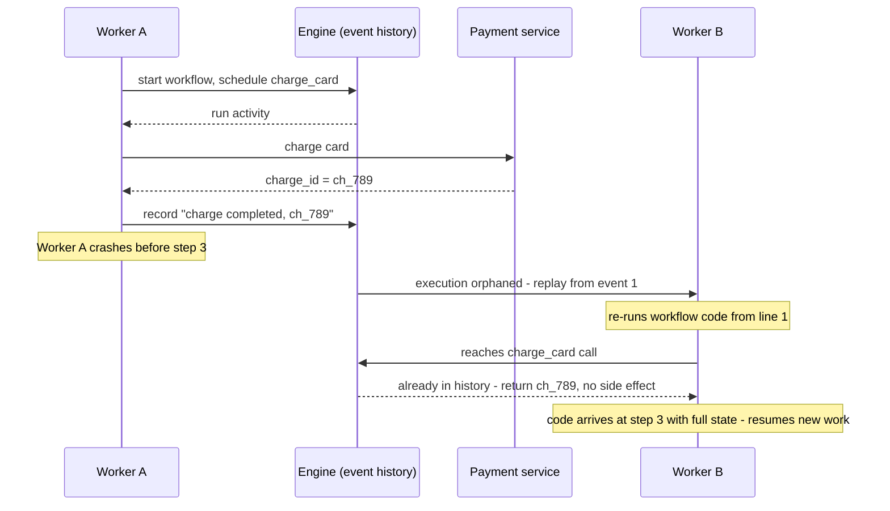
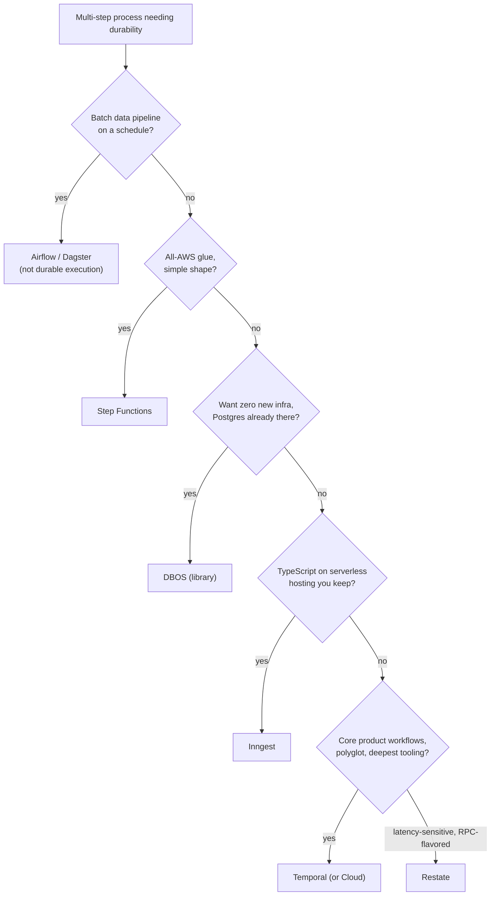

# Durable Execution & Workflow Engines Study Guide

A depth-first guide to durable execution — the technique behind Temporal, Restate, Inngest, DBOS, and their kin — for engineers who build multi-step processes that must survive crashes, deploys, and weeks of wall-clock time. It assumes you've built services that talk to queues and databases, and ideally that you've read the [Distributed Systems guide](DISTRIBUTED_SYSTEMS_STUDY_GUIDE.md)'s Part 7: this guide is what happens when the problems named there — sagas, compensation, idempotency, the dual-write trap — get a purpose-built runtime instead of another hand-rolled pile of status columns and cron sweepers.

The organizing idea: **durable execution is event sourcing applied to the call stack.** Every workflow engine in this guide is built on the same trick — record every step a program takes as an immutable event history, and when the process dies, *re-execute the code from the top*, feeding it the recorded results instead of re-running the side effects, until it catches up to where it crashed. The program counter itself becomes durable. Everything else follows from that one mechanism: the **determinism contract** (replayed code must make the same decisions twice, so workflow code is banned from clocks, randomness, and I/O), **activities** as the escape hatch where side effects actually live, and **versioning** as the ongoing tax, because code that replays histories from last month must still be able to make last month's decisions. Understand replay and the rest of the field stops being a catalog of products and becomes one idea with different packaging.

Primary references, all worth real time: the [Temporal documentation](https://docs.temporal.io/) — the de-facto reference implementation's docs double as the field's best textbook, especially the [workflow](https://docs.temporal.io/workflows) and [event-history](https://docs.temporal.io/encyclopedia/event-history) pages; the original [sagas paper](https://www.cs.cornell.edu/andru/cs711/2002fa/reading/sagas.pdf) (Garcia-Molina & Salem, 1987) — eleven pages from before microservices existed that define the compensation model every engine implements; Martin Fowler's [Event Sourcing](https://martinfowler.com/eaaDev/EventSourcing.html) — the underlying pattern, worth reading to see exactly what durable execution borrows; and the [Azure Durable Functions overview](https://learn.microsoft.com/en-us/azure/azure-functions/durable/durable-functions-overview) — the serverless pioneer of the replay model, and the clearest short explanation of orchestrator determinism anywhere.

Siblings in this repo cover the ground on every side: the [Distributed Systems guide](DISTRIBUTED_SYSTEMS_STUDY_GUIDE.md) (Part 7's sagas, outbox, and idempotency are this guide's prerequisites), the [AI Agents guide](AI_AGENTS_STUDY_GUIDE.md) (agent loops are durable execution's newest and neediest customer), the [Kafka guide](KAFKA_STUDY_GUIDE.md) (the log that plays the same role for data that event histories play for code), the [AWS Fundamentals guide](AWS_FUNDAMENTALS_STUDY_GUIDE.md) (Step Functions in platform context), and the [API Design guide](API_DESIGN_STUDY_GUIDE.md) (the long-running-operation pattern these engines implement behind an API).

---

## Table of Contents

1. [Part 1 — The Problem: Processes That Outlive Their Processes](#part-1--the-problem-processes-that-outlive-their-processes)
2. [Part 2 — The Idea: Replay and the Durable Program Counter](#part-2--the-idea-replay-and-the-durable-program-counter)
3. [Part 3 — The Programming Model](#part-3--the-programming-model)
4. [Part 4 — Failure Semantics, Precisely](#part-4--failure-semantics-precisely)
5. [Part 5 — Versioning: The Tax on Durable Code](#part-5--versioning-the-tax-on-durable-code)
6. [Part 6 — The Engines](#part-6--the-engines)
7. [Part 7 — Durable Execution and AI Agents](#part-7--durable-execution-and-ai-agents)
8. [Part 8 — Production: Operating, Testing, and Knowing When Not To](#part-8--production-operating-testing-and-knowing-when-not-to)
9. [Part 9 — Walkthrough: One Order, One Crash, One Deploy](#part-9--walkthrough-one-order-one-crash-one-deploy)

---

## Part 1 — The Problem: Processes That Outlive Their Processes

Start with the workload every backend eventually grows: an order comes in, and the business process is *charge the card, reserve inventory, create the shipment, email the customer* — four steps, three external services, and a rule that a failure partway through must undo what came before. Written naively, it's twenty lines of sequential code, and it works right up until the process crashes between steps two and three. Now the card is charged, inventory is reserved, no shipment exists, no one was emailed, and — the genuinely bad part — **nothing anywhere knows this**. The program counter that knew "we're between steps 2 and 3" lived in a call stack that no longer exists.

The industry's traditional answer is to reify that program counter into infrastructure, one piece at a time. Progress goes into a database status column (`state = 'CHARGED'`). Steps become messages on queues so they retry. A cron-driven **sweeper** scans for rows stuck in intermediate states and nudges them along. Timeouts become `deadline_at` columns the sweeper also checks. Compensation becomes more states (`REFUNDING`, `REFUND_FAILED`). Every arrow in the diagram grows retry logic, and every handler must be idempotent because everything is at-least-once ([Distributed Systems guide](DISTRIBUTED_SYSTEMS_STUDY_GUIDE.md), Part 7). None of these pieces is wrong — each is the correct local fix — but notice what you've built in aggregate: **a distributed, hand-rolled, implicit state machine whose logic is smeared across a schema, several queue consumers, a cron job, and the heads of the two engineers who understand it.** The business process — four steps and an undo rule — is nowhere written down as a process; it's an emergent property of the plumbing.

The failure modes of this architecture are so consistent across companies that they deserve names. **Stuck states**: a row sits in `CHARGED` forever because the sweeper's query missed an edge case. **Duplicate side effects**: a retry fires an email twice because one handler forgot its idempotency check. **Ambiguous recovery**: after an outage, nobody can say which of 40,000 in-flight orders are fine, which need a nudge, and which need a human. **Invisible history**: answering "what happened to order 8812?" means joining logs across five systems. And the meta-failure: every new step or business rule means touching the schema, the sweeper, and three consumers, so the process ossifies. The [saga pattern](https://www.cs.cornell.edu/andru/cs711/2002fa/reading/sagas.pdf) — a sequence of local transactions, each with a compensating action — names the *what* of the solution, and choreographed sagas over queues are exactly the architecture just described. What's missing is a runtime for the *how*: something that keeps the process's state, retries, timers, and history in one place, and lets the process itself be written down as — ideally — just code. That runtime is what the rest of this guide is about.

```quiz
Q: The naive sequential order-processing code fails between "charge card" and "create shipment." What is the fundamental reason recovery is hard?
- [ ] The card charge cannot be refunded through the API
- [x] The knowledge of where the process was — the program counter — lived only in the crashed process's call stack, so nothing durable records that steps 1–2 happened but 3–4 didn't
- [ ] The database transaction rolled back the charge
- [ ] Queues reorder messages during crashes
> The side effects landed in external systems, but the coordination state was in-memory. Every technique in this guide is a strategy for making that coordination state durable — the DIY way (status columns, sweepers) or the durable-execution way (persist the execution itself).

Q: Why does the status-column-plus-sweeper architecture ossify as the business process grows?
- [ ] Databases limit the number of enum values per column
- [ ] Cron jobs cannot run more than hourly
- [x] The process logic is smeared implicitly across schema, queue consumers, and sweeper queries, so every new step or rule means coordinated changes to all of them — there is no single artifact that IS the process
- [ ] Queues cannot express branching logic
> The hand-rolled approach isn't wrong so much as diffuse: each piece is a reasonable local fix, but the aggregate has no single place where "the process" lives, so evolving it requires archeology across every piece. Durable execution's core pitch is collapsing that back into one readable definition.

Q: In the DIY architecture, what guarantees does every step handler need, and why?
- [ ] Exactly-once delivery from the queue, so no special handling
- [x] Idempotency — queues and sweepers deliver at-least-once, so any step may run twice, and the second run must be harmless
- [ ] Ordering guarantees across all steps
- [ ] Synchronous confirmation from downstream services
> At-least-once is the only reliable delivery contract available (Distributed Systems guide, Part 2/7), so duplicates are inevitable and idempotent handlers are mandatory. Hold this thought: durable execution changes a lot, but as Part 4 shows, it does NOT change this.

Q: What does the saga pattern define, and what does it deliberately not provide?
- [x] It defines the shape — local transactions each paired with a compensating action, run forward or compensated backward — but not the runtime that tracks progress, retries, and drives the compensations reliably
- [ ] It provides distributed locks for multi-service transactions
- [ ] It defines two-phase commit for microservices
- [ ] It guarantees isolation between concurrent sagas
> The 1987 paper is a model, not a system: it tells you to decompose and compensate, and explicitly gives up isolation (intermediate states are visible). Making sagas run reliably — durable progress, retries, timers — is precisely the job workflow engines took on.
```

---

## Part 2 — The Idea: Replay and the Durable Program Counter

Durable execution's move is audacious: instead of reifying the program counter into status columns, **keep writing the process as ordinary sequential code — and make the runtime persist the execution itself.** The order workflow stays twenty readable lines with a try/catch for compensation. What changes is what happens underneath when those lines run.

The mechanism has two halves. First, **every interaction between the workflow code and the outside world is recorded** in an append-only, per-execution **event history**: "activity X scheduled," "activity X completed with result R," "timer for 30 days started," "timer fired," "signal received with payload P." The history lives in the engine's persistence layer and *is* the workflow's state — no status column exists, because the full log of what happened is strictly more information than any summary of it. (This is why the intro called durable execution [event sourcing](https://martinfowler.com/eaaDev/EventSourcing.html) applied to the call stack: same pattern, but the "aggregate" being sourced is a program's execution.)

Second — the actual magic trick — **recovery is re-execution.** When the process running a workflow dies (crash, deploy, autoscale-down, spilled coffee), some other worker picks up the orphaned execution and runs the workflow function *again from the first line*. But this replay runs in a harness: every time the code reaches a step whose outcome is already in the history, the recorded result is returned instantly *without performing the side effect again* — the card is not re-charged; the recorded `charge_id` is handed back. The code re-makes every decision, re-builds its local variables, re-arrives at the exact point where history runs out — and only there does it resume doing new work. The call stack has been reconstructed from the log. The program counter survived the death of the program.



Three consequences make this more than a fault-tolerance trick. **Time becomes free.** `await sleep(30 days)` just writes a timer event and releases the worker — no process sleeps, no cron exists, and when the timer fires (past any number of deploys), replay reconstructs the stack and the next line runs. Long-running stops meaning "long-running process" and starts meaning "long-lived history." **Waiting becomes expressible.** "Pause here until a human approves or 72 hours pass" is a race between a signal and a timer — one line, not a schema. And **the history is an audit log you didn't build**: "what happened to order 8812" is answered by reading its events, timestamped and complete.

The price of the trick is the constraint the whole next Part lives inside: replay only reconstructs the same state if the code makes **the same decisions on every execution**. Workflow code must be deterministic — and everything nondeterministic about real programs (clocks, randomness, network calls, iteration order, the environment) has to be pushed somewhere else. That somewhere is the activity, and the discipline of the split is the actual skill of writing durable code.

```quiz
Q: A worker crashes mid-workflow. How does another worker resume the execution at the right point?
- [ ] It reads the crashed worker's memory snapshot from the engine
- [ ] It queries a status column the engine maintains per step
- [x] It re-executes the workflow function from the first line, with recorded results substituted for every already-completed step, until the code reaches the point where history runs out
- [ ] It rolls back all completed steps and starts the workflow over, side effects included
> There is no snapshot and no status column — the event history is the state, and replay reconstructs the call stack from it. Completed side effects are not re-performed; their recorded results are injected, so the code re-arrives at the crash point with identical local variables.

Q: Why does `await sleep(30 days)` in a workflow cost essentially nothing?
- [ ] The engine spins up a dedicated low-power process per sleeping workflow
- [x] It's recorded as a durable timer event and the worker is released — nothing runs during the wait, and the firing timer triggers replay to reconstruct the stack whenever it comes due, deploys included
- [ ] The SDK converts it to a cron expression
- [ ] Workers batch all sleeping workflows onto one thread
> Sleeping is just an entry in the history plus a timer in the engine. This is what makes month-long processes (trials, renewals, escalations) natural to express as straight-line code rather than as cron jobs reading deadline columns.

Q: In what precise sense is durable execution "event sourcing applied to the call stack"?
- [ ] It stores workflow code in a Kafka topic
- [ ] It requires CQRS on all your databases
- [x] The execution's state is never stored as a snapshot — it's derived by replaying an append-only log of what the execution did, exactly as an event-sourced aggregate derives state by replaying its events
- [ ] It emits domain events for downstream consumers
> Same pattern, different subject: event sourcing rebuilds an entity's state from its event log; durable execution rebuilds a program's *execution state* — locals, position, pending steps — from its history. The analogy also predicts the costs: growing logs (Part 8's continue-as-new) and schema-evolution pain (Part 5's versioning).

Q: What is the fundamental precondition that makes replay-based recovery correct?
- [ ] Activities must complete in under a minute
- [x] Workflow code must be deterministic — replaying it against the same history must reproduce the same decisions and calls, or the reconstructed state diverges from what originally happened
- [ ] The engine must run on the same machine as the database
- [ ] Histories must fit in worker memory
> If the code consults a wall clock, a random number, or a live service and decides differently on replay, the injection of recorded results goes off the rails ("nondeterminism error" in Temporal terms). The entire programming model of Part 3 exists to make determinism achievable in practice.
```

---
## Part 3 — The Programming Model

Every code-first engine splits the world the same way, whatever names it uses (Temporal's terms below; Part 6 maps the synonyms). A [**workflow**](https://docs.temporal.io/workflows) is the deterministic orchestration function — the process definition, the thing that replays. An [**activity**](https://docs.temporal.io/activities) is a plain function where side effects live — call the payment API, write the database, send the email. **Workers** ([docs](https://docs.temporal.io/workers)) are your stateless processes that host both and poll the engine's task queues for work; the engine itself runs no user code, which is why a worker fleet can be deployed, scaled, and killed freely without losing executions.

### The Determinism Contract

Workflow code gets replayed, so it must decide identically every time. That bans, inside the workflow function: reading the wall clock (`datetime.now()` differs on replay — use the SDK's `workflow.now()`, which returns history-derived time), randomness and UUID generation (use SDK-provided deterministic equivalents), direct network/database/file I/O (that's what activities are for), spawning threads or using non-deterministic concurrency, iterating collections with unstable order, and reading environment/config that may change between executions. Some SDKs enforce this mechanically — Temporal's Python SDK runs workflow code in a sandbox that intercepts illegal calls; the TypeScript SDK runs workflows in isolated V8 contexts — while Go relies on discipline plus a replay checker. The contract sounds oppressive and in practice isn't: orchestration code mostly sequences steps, branches on their results, and waits — all naturally deterministic. The skill is noticing when logic has crossed the line ("compute discount based on today's date" — get the date from an activity or workflow-time, not the OS).

Everything effectful goes in **activities**, which the engine treats as retryable black boxes: each gets a **retry policy** (backoff, max attempts) and **timeouts**, and — the critical mirror of Part 1 — activities execute **at-least-once**, so they must be idempotent, same as any queue consumer. Long activities prove liveness by **heartbeating**, which also carries progress details so a retry can resume rather than restart.

### The Waiting Toolkit

What elevates the model from "retries with extra steps" is the vocabulary for *waiting* — the thing multi-step processes actually spend their lives doing. **Timers** are durable sleeps (Part 2). **Signals** deliver external events into a running execution ("payment webhook arrived," "user clicked approve") — the workflow just `await`s them. **Queries** read a running workflow's state without disturbing it ("where is order 8812?" answered by the workflow itself). Temporal's **updates** add validated, synchronous mutations. **Child workflows** decompose big processes; **continue-as-new** restarts an execution with fresh history when it would otherwise grow unboundedly (Part 8). Composed, these turn gnarly infrastructure into prose:

```python
@workflow.defn
class OrderWorkflow:
    def __init__(self) -> None:
        self.approved: bool | None = None

    @workflow.signal
    def approve(self, ok: bool) -> None:
        self.approved = ok

    @workflow.run
    async def run(self, order: Order) -> str:
        charge = await workflow.execute_activity(
            charge_card, order, start_to_close_timeout=timedelta(seconds=30),
            retry_policy=RetryPolicy(maximum_attempts=5))
        try:
            if order.total > 10_000:
                # human-in-the-loop: approval signal races a 72h escalation timer
                await workflow.wait_condition(
                    lambda: self.approved is not None, timeout=timedelta(hours=72))
                if not self.approved:
                    raise ApplicationError("rejected")
            await workflow.execute_activity(reserve_inventory, order, ...)
            await workflow.execute_activity(create_shipment, order, ...)
        except Exception:
            # compensation is just code: the saga pattern as a try/except
            await workflow.execute_activity(refund, charge, ...)
            raise
        await workflow.execute_activity(send_confirmation, order, ...)
        return charge.id
```

Read what's *not* there: no status enum, no sweeper, no `deadline_at`, no outbox relay — and the compensation logic is a `try/except` you can review in one screen. That readability is not cosmetic; it's the Part 1 diffuseness problem actually solved, because this function *is* the process.

```quiz
Q: Why must `datetime.now()` never appear in workflow code, and what's the correct alternative?
- [ ] It's too slow inside the replay loop
- [x] Replay would see a different time than the original run and could branch differently, diverging from history — SDKs provide workflow-time (derived from the event history) instead
- [ ] Timezones aren't available inside workers
- [ ] It works fine as long as the workflow finishes within a day
> Any branch on live wall-clock time makes replay non-reproducible. `workflow.now()` returns the deterministic, history-anchored time, so original run and every replay see identical values. The same logic bans randomness, live config reads, and direct I/O in workflow code.

Q: Where does "call the payment provider" belong, and what obligations come with that placement?
- [ ] In the workflow, wrapped in a try/except
- [x] In an activity — which the engine may run more than once, so it needs an idempotency strategy, plus a timeout and retry policy
- [ ] In a signal handler
- [ ] In the worker's startup hook
> Side effects live in activities precisely so replay can skip them. But activities are at-least-once — a worker can crash after the charge succeeds but before recording it — so the Part 1 idempotency lesson survives intact: durable execution moves the retry machinery into the engine without repealing duplicates.

Q: A workflow must pause until a human approves, but escalate after 72 hours. How does the model express this?
- [ ] Poll an approvals table from the workflow every minute
- [ ] Store state=WAITING_APPROVAL and let a cron job check deadlines
- [x] Await a signal with a 72-hour timeout — a durable race between an external event and a timer, in one line
- [ ] Spawn a thread that sleeps 72 hours
> Signals + timers are the waiting vocabulary: the execution parks (consuming no worker), the approval webhook signals it awake, or the durable timer fires first. The DIY equivalent is exactly the status-column-plus-sweeper machinery Part 1 catalogued.

Q: What makes the try/except compensation in the code sample trustworthy in a way the same code in a normal service wouldn't be?
- [ ] Python exceptions are more reliable inside workflows
- [ ] The engine wraps it in a distributed transaction
- [x] The workflow's progress is durable, so even if the worker dies mid-compensation, replay resumes and the refund still runs — the catch block cannot be lost to a crash
- [ ] Activities inside except blocks get higher priority
> In a normal service, a crash between the failure and the compensating call orphans the saga. Here the decision to compensate is itself in the history, and the refund activity will be driven to completion (with retries) by whichever worker picks the execution up. That's the saga paper's model finally given a reliable runtime.
```

---

## Part 4 — Failure Semantics, Precisely

Marketing says "code that can't crash"; engineering needs the exact guarantees. They're worth stating carefully because durable execution's magic is real but bounded — and the boundary is where production incidents live.

**Workflow code executes effectively-once.** Not because it runs once — replay may run it hundreds of times — but because reruns are pure reconstruction: recorded results in, no side effects out. The *decisions* of the workflow are made once and preserved. **Activities execute at-least-once** (with retries per policy), and this is a law, not an implementation gap: the engine cannot distinguish "activity crashed before doing the work" from "did the work, crashed before reporting" — the Two Generals ambiguity from the [Distributed Systems guide](DISTRIBUTED_SYSTEMS_STUDY_GUIDE.md) Part 2 — so it must retry, and your activity must tolerate the duplicate. The honest slogan is therefore: **durable execution gives you exactly-once *orchestration* around at-least-once *side effects***. What it removes is the hand-rolled coordination (status, retries, timers, recovery); what it cannot remove is idempotency at the edges — payment APIs still need idempotency keys ([API Design guide](API_DESIGN_STUDY_GUIDE.md)), emails still need dedup.

Timeouts come in a taxonomy worth learning from Temporal because every engine has some subset: **schedule-to-start** (how long a task may wait in queue — a worker-capacity alarm), **start-to-close** (the attempt timeout — the one you should always set), **schedule-to-close** (total including retries), and **heartbeat** (liveness for long activities). Retries are governed per-activity by policy — initial interval, backoff, maximum attempts, and **non-retryable error types**, the mechanism for the crucial distinction between *transient* failures (network blip: retry) and *business* failures (card declined: don't retry — raise it to the workflow, which decides to compensate or take another path). Confusing those two classes is the classic beginner incident: a declined card retried five times, or a flaky network error propagated as a permanent business failure.

One more structural clarity the model buys: because the engine persists every state transition, the **dual-write problem** from the Distributed Systems guide's Part 7 dissolves *inside* the workflow — "record the decision" and "drive the next step" are not two systems that can disagree; they're one history. You still meet dual-writes at the edges (an activity that writes a DB *and* publishes an event still needs the outbox treatment), but the orchestration layer itself stops being a place where they can occur.

```quiz
Q: What is the precise meaning of "exactly-once" in durable execution?
- [ ] Activities are guaranteed to run exactly once
- [x] The workflow's orchestration decisions happen effectively once (replay reconstructs rather than re-decides), while activities remain at-least-once and must be idempotent
- [ ] The engine deduplicates all side effects automatically
- [ ] Each workflow may only be started once per input
> The engine can make its own log exactly-once but cannot repeal the Two Generals problem at the activity boundary — "did the work, lost the ack" is indistinguishable from "never did it," so it retries. Orchestration certainty around edge idempotency is the honest contract.

Q: A payment activity fails with "card declined." What should happen, and via what mechanism?
- [ ] The retry policy retries it with exponential backoff
- [ ] The workflow crashes and replays from the beginning
- [x] "Card declined" should be a non-retryable error type, so it propagates immediately to the workflow, which handles it as a business outcome (compensate, notify, alternate path)
- [ ] The activity heartbeats until a human intervenes
> Transient vs business failure is the load-bearing distinction: backoff-and-retry is for the network, not for deterministic rejections. Retrying a decline hammers the payment provider and delays the real handling; the fix is one line of retry-policy configuration.

Q: Which timeout answers "my workers are underprovisioned and tasks are sitting in queue"?
- [ ] Start-to-close
- [ ] Heartbeat
- [x] Schedule-to-start
- [ ] Schedule-to-close
> Schedule-to-start bounds queue wait, so breaching it signals capacity problems rather than slow activities. Start-to-close bounds one attempt (always set it), schedule-to-close bounds the whole retried effort, heartbeat detects hung long-running attempts.

Q: Why does the dual-write problem disappear inside the workflow but not at its edges?
- [ ] The engine uses two-phase commit for activities
- [x] Within the workflow, "record the decision" and "drive the next step" are the same event history — one system, nothing to disagree. An activity that writes a database and publishes an event still spans two systems and still needs the outbox pattern
- [ ] Activities are wrapped in distributed transactions
- [ ] Signals serialize all external writes
> Durable execution collapses orchestration state and orchestration action into one log, eliminating the "wrote the row, crashed before enqueueing" class inside the process. The classic dual-write remains wherever a single activity must atomically touch two external systems — same fix as ever (Distributed Systems guide, Part 7).
```

---

## Part 5 — Versioning: The Tax on Durable Code

Here is the cost that separates durable execution from a free lunch, and the discipline that separates teams that thrive on it from teams that get 3 a.m. pages. Ordinary code only ever runs *now*; workflow code **replays the past**. An execution started three weeks ago on v1 of `OrderWorkflow` may be woken today — by a timer, a signal, a crashed worker — and replayed by a worker running v3. If v3 makes different decisions than v1 did (a reordered step, a removed activity, a new branch taken), replay diverges from the recorded history and the engine refuses with a **nondeterminism error**. Deploying workflow code is therefore never just deploying code: it's deploying code *that must still be able to re-make every decision any live execution ever made.* The right mental model is database schema migration — you wouldn't drop a column with live rows pointing at it; don't change a decision path with live histories depending on it.

The strategies, in the order teams usually adopt them. **Patching** (Temporal's `patched()` / Go's `GetVersion`): branch in code on a version marker that replay resolves from history — old executions take the old branch, new executions record and take the new one; after the last old execution finishes, the dead branch is deleted. Precise but crufty at scale, like `if` statements accumulating in a migration file. [**Worker versioning**](https://docs.temporal.io/worker-versioning): tag worker deployments with build IDs and let the engine **pin** each execution to the build that started it — old workflows drain on old workers while new ones start on new workers; no in-code branching, at the cost of running multiple worker versions side by side. **Ride it out**: for short-lived workflows (minutes–hours), simply keep deploys compatible until the fleet drains — many teams' de facto strategy, workable exactly as long as no workflow lives longer than a deploy cycle. And orthogonally to all three: **keep workflows small** — the less logic in the workflow (push complexity into activities, which are *not* replayed and version freely), the smaller the surface that must stay history-compatible. That last point quietly shapes good durable design more than any feature: thin deterministic orchestration over fat idempotent activities.

```quiz
Q: A deploy changes a workflow to skip the fraud-check activity for small orders. Executions started before the deploy begin failing with nondeterminism errors. Why?
- [ ] The fraud-check activity was deleted from the worker binary
- [x] Replaying an old execution with the new code takes a different path than its history records (history says fraud-check was scheduled; the code no longer schedules it), and the engine detects the divergence
- [ ] Old executions cannot run on new worker processes at all
- [ ] The retry policy changed implicitly
> Old histories encode old decisions. New code must either re-make those exact decisions during replay (patching: branch on a version marker) or never see old histories at all (worker versioning: pin executions to their build). Deploying blind does neither — hence the error.

Q: What does worker versioning with pinned builds buy over in-code patching?
- [ ] Faster replay performance
- [x] No version branches accumulate in workflow code — old executions drain on old worker builds while new starts route to the new build, at the operational cost of running multiple worker versions simultaneously
- [ ] It removes the determinism requirement
- [ ] It migrates old histories to the new code shape
> Patching keeps one fleet but pollutes code with version conditionals; pinning keeps code clean but multiplies deployments. Teams with long-lived workflows generally converge on pinning plus occasional patches for urgent fixes to in-flight executions.

Q: Why does "thin workflows, fat activities" reduce versioning pain?
- [ ] Activities replay faster than workflow code
- [ ] Thin workflows produce smaller Docker images
- [x] Activities are never replayed, so their internals can change freely on any deploy — only the workflow's decision structure must stay history-compatible, and less logic there means less compatibility surface
- [ ] The engine bills per workflow line
> Replay reconstructs the orchestration, not the side effects: history records that an activity ran and what it returned, not how. Pushing business logic into activities (and keeping workflows to sequencing and branching) shrinks the code that versioning discipline applies to.

Q: Which workflows can safely use the "just keep deploys compatible and let executions drain" non-strategy?
- [x] Short-lived ones — where no execution outlives a deploy cycle, so old histories are gone before incompatible code arrives
- [ ] Workflows with many activities
- [ ] Workflows that use signals
- [ ] None — the engine forbids deploying during execution
> The versioning tax scales with workflow lifetime: a 90-second workflow can ignore most of it; a 90-day subscription workflow will meet many deploys and needs patching or pinning. Know your longest-lived execution before choosing the lazy option.
```

---
## Part 6 — The Engines

One idea, several packagings. The differences that matter are: code or DSL? where does the history live? what do you operate? and how does it price waiting?

**[Temporal](https://temporal.io/)** is the reference point — the open-source successor to Uber's **[Cadence](https://cadenceworkflow.io/)**, built by the engineers who also built AWS's Simple Workflow Service, which makes the lineage explicit: SWF (2012) → Azure Durable Functions (2017) → Cadence (2016) → Temporal (2019). It's the full code-first model of Parts 2–5 with mature SDKs (Go, Java, TypeScript, Python, .NET, PHP, Ruby), a self-hostable cluster (frontend/history/matching services over Cassandra or SQL persistence, with Elasticsearch-backed visibility) that is a genuine distributed system to operate, and **Temporal Cloud** for those who'd rather not. Default choice when workflows are core to the product and polyglot teams need the deepest tooling.

**[AWS Step Functions](https://docs.aws.amazon.com/step-functions/latest/dg/welcome.html)** is the DSL counterpoint: state machines defined in JSON (Amazon States Language), not general code. That costs expressiveness — branching/looping in JSON is nobody's favorite — but buys zero operations, per-transition pricing, IAM-native integration with two-hundred-plus AWS services, and a visual console non-engineers can read. [Standard vs Express](https://docs.aws.amazon.com/step-functions/latest/dg/concepts-standard-vs-express.html) is the internal split: Standard for long-running exactly-once-style orchestration (up to a year), Express for high-volume short-lived at-least-once flows. The right answer for AWS-native glue ([AWS guide](AWS_FUNDAMENTALS_STUDY_GUIDE.md), Part 7); the wrong one when the process is complex enough to want a programming language.

**[Restate](https://restate.dev/)** re-architects the idea: a single Rust binary whose own replicated log *is* the persistence ([docs](https://docs.restate.dev/)), journaling **durable async/await** at the RPC-handler level — services and stateful "virtual objects" whose handlers are durable by default, with lower per-step latency than history-service architectures. The newest serious entrant; attractive when you want durable execution to feel like ordinary service code rather than a separate workflow tier. **[Inngest](https://www.inngest.com/docs)** packages the idea for the TypeScript/serverless world: event-triggered functions whose `step.run()` blocks are the durable units, executing on your existing serverless/edge hosting with Inngest driving via HTTP — the lowest-friction on-ramp for product teams already on Vercel-shaped infrastructure. **[DBOS](https://docs.dbos.dev/)** goes the other direction: a *library*, not a server — workflows are decorated Python/TypeScript functions whose steps checkpoint into Postgres tables in your own database; no new infrastructure at all, ideal for the "we just need our background jobs to survive restarts" tier. **[Azure Durable Functions](https://learn.microsoft.com/en-us/azure/azure-functions/durable/durable-functions-overview)** remains the Azure-native original of code-first replay, and **[Conductor](https://conductor-oss.org/)** (Netflix's, now community/Orkes) holds the JSON-DSL middle ground for teams that want definitions as data.

Two disambiguations save meetings. **Airflow/Dagster are not this**: they schedule *batch data DAGs* on a calendar — the [Data Engineering guide](DATA_ENGINEERING_STUDY_GUIDE.md)'s territory — and lack the per-execution histories, signals, and long-lived waiting that transactional processes need (using Airflow as a saga engine is a known anti-pattern; using Temporal as a dbt scheduler is merely eccentric). And **BPMN engines** (Camunda and kin) are the older enterprise lineage — diagrams-as-definitions with human tasks built in; philosophically DSL-first, organizationally suited to processes that business analysts co-own.



```quiz
Q: What is the fundamental design split between Temporal and Step Functions?
- [ ] Temporal is at-least-once while Step Functions is exactly-once
- [x] Code versus DSL: Temporal workflows are general programs (replayed for durability), Step Functions are JSON state machines — trading expressiveness for zero operations and native AWS/IAM integration
- [ ] Step Functions cannot run longer than an hour
- [ ] Temporal only supports Go
> Both are durable orchestrators; the divide is whether the process definition is a program or data. Complex branching/looping logic wants a language; simple AWS-service glue wants the managed JSON machine with the visual console.

Q: A team wants their existing Python background jobs to survive restarts, has Postgres, and refuses new infrastructure. Which engine fits the constraint?
- [ ] Temporal self-hosted
- [ ] Step Functions
- [x] DBOS — durable execution as a library checkpointing into their existing Postgres, no server to run
- [ ] Cadence
> The engines differ most in what you operate: Temporal/Cadence are clusters, Step Functions is someone else's service, Inngest drives your serverless hosting, and DBOS is `pip install` plus tables in the database already there. Matching operational appetite matters as much as features.

Q: Why is Airflow the wrong tool for the order-fulfillment saga, even though it "runs DAGs of tasks with retries"?
- [ ] Airflow cannot call payment APIs
- [x] It's a batch scheduler: no per-order execution with its own history, no signals for webhooks/approvals, no month-long durable waits — its unit is the scheduled pipeline run, not the long-lived transactional process
- [ ] Airflow only supports Python
- [ ] DAGs cannot express compensation
> The confusion is natural ("workflows" both times) but the shapes differ: data orchestrators run calendar-triggered batch DAGs over datasets; durable execution runs one stateful, signalable, possibly months-long execution per business entity. Each is an anti-pattern in the other's role.

Q: What architectural bet does Restate make that Temporal doesn't?
- [ ] Storing histories in Elasticsearch
- [ ] Defining workflows in JSON
- [x] Collapsing the engine into a single log-based runtime that journals durable async/await at the RPC-handler level — durability as a property of ordinary service handlers, with lower per-step overhead
- [ ] Running only in the browser
> Temporal separates concerns into history/matching services over external persistence; Restate makes its own replicated log the store and pushes durability into the RPC programming model itself. Same replay idea, different packaging and latency profile.
```

---

## Part 7 — Durable Execution and AI Agents

The newest customer for this machinery arrived around 2025, and it's the neediest one yet. An [AI agent](AI_AGENTS_STUDY_GUIDE.md) loop is, structurally, a long-running multi-step process with unreliable steps: LLM calls that take seconds and fail transiently, tool executions that touch external systems, human approvals that gate consequential actions, and total runtimes that stretch to hours or days for research or coding agents. That is *exactly* the workload profile of Parts 1–4 — which is why agent frameworks keep reinventing checkpointing, and why the mature answer increasingly is "run the agent loop as a workflow" (the agent-framework/Temporal integrations appearing across the ecosystem are this realization productized).

The mapping is clean and each piece earns its keep. **The LLM call is an activity** — twice over, in fact: operationally because it's a slow, flaky network call wanting retries and timeouts, and *architecturally* because it's nondeterministic — the same prompt yields different tokens tomorrow, so it must never live in replayed workflow code. Recording the completion in history is what makes an agent's trajectory replayable at all: on recovery, the workflow re-reads the recorded response rather than re-rolling the dice. **Tool calls are activities** with per-tool retry policies and idempotency (the [agents guide](AI_AGENTS_STUDY_GUIDE.md)'s tool-safety material and Part 4's transient-vs-business error distinction both apply directly — "API 503" retries, "insufficient funds" goes back to the model). **Human-in-the-loop is a signal racing a timer** — the Part 3 pattern verbatim, which converts "agent pauses for approval" from a persistence design project into one awaited line. **The event history is the agent trace**: every prompt, response, and tool result durably recorded in order — auditability that agent observability tooling otherwise reconstructs from telemetry. And **durable timers** give long-horizon agents (monitor this, follow up in three days) a substrate that doesn't involve a fleet of crons.

One caution keeps the enthusiasm honest: context windows and event histories both grow with agent verbosity, and stuffing full LLM payloads into workflow history hits the size limits Part 8 discusses. The working pattern is to keep *references* in history (store bulky prompts/responses in object storage from within the activity) and lean on continue-as-new for long agent sessions — the same "thin orchestration" instinct from Part 5, applied to token-heavy traffic.

```quiz
Q: Why must the LLM call live in an activity rather than in workflow code, beyond ordinary flakiness?
- [ ] LLM SDKs are not importable inside workflow sandboxes
- [x] It's nondeterministic — replay would get a different completion and the reconstructed execution would diverge from history; as an activity, the original response is recorded and replay reuses it
- [ ] Activities have larger memory limits
- [ ] Workflow code cannot make HTTPS calls even deterministically
> The determinism contract meets its purest violator: sampling. Recording the completion turns a nondeterministic step into a durable fact, which is precisely what makes a crashed agent resumable mid-trajectory instead of re-planning from scratch (possibly differently).

Q: An agent must pause for human approval before executing a risky tool, with auto-rejection after 24 hours. What does this cost to build on a workflow engine?
- [ ] A polling loop in the agent and an approvals microservice
- [x] Essentially one line — await a signal with a 24-hour timeout; the execution parks durably, and either the approval signal or the timer resumes it
- [ ] A dedicated queue per pending approval
- [ ] It can't be done without keeping a worker pinned
> This is Part 3's signal-vs-timer race serving the agents guide's human-in-the-loop requirement. The DIY version (persist agent state, build resume machinery, sweep for expiries) is exactly the Part 1 architecture agents keep reinventing as "checkpointing."

Q: What operational trap does a verbose agent create for its workflow, and what's the mitigation?
- [ ] Too many signals per second
- [x] Full prompts and completions bloat the event history toward its size limits — keep payload references in history (bulky content in object storage) and use continue-as-new for long sessions
- [ ] Worker CPU exhaustion from replaying token generation
- [ ] Retry storms against the LLM provider
> Histories are for coordination facts, not bulk data. Replay doesn't re-generate tokens (results are recorded), so CPU isn't the issue — size is: an agent that logs every 50KB completion into history will hit the limits Part 8 covers mid-session.

Q: What does the event history give an agent system "for free" that agent tooling otherwise builds separately?
- [ ] Prompt optimization
- [x] A complete, ordered, durable trace of every model call, tool invocation, and decision — the audit trail and replay substrate that agent observability platforms reconstruct from telemetry
- [ ] Automatic evals of output quality
- [ ] Model routing between providers
> "What did the agent do and why" is answered by the same log that powers recovery. Quality evaluation and routing remain application concerns (the agents and LLM guides' territory) — durability gives you the faithful record, not the judgment.
```

---

## Part 8 — Production: Operating, Testing, and Knowing When Not To

**The metrics that page you.** Task-queue backlog and schedule-to-start latency are the load-bearing signals — they mean "not enough workers," the durable-execution analogue of consumer lag in the [Kafka guide](KAFKA_STUDY_GUIDE.md). Watch also workflow-task failure rates (often a nondeterminism bug post-deploy — a Part 5 escape), activity retry/failure rates by type, and history growth. Self-hosting Temporal means operating a real distributed system (multiple services plus Cassandra/SQL persistence plus Elasticsearch — [Distributed Systems guide](DISTRIBUTED_SYSTEMS_STUDY_GUIDE.md) material in your own basement); the managed offerings exist precisely because that's a team's worth of work to do well.

**History limits and continue-as-new.** Event histories have hard ceilings (Temporal warns around 10K events and caps execution around 50K events / 50MB); replay time also grows with history. Long-lived or looping workflows must periodically **continue-as-new** — close the current execution and atomically start a fresh one carrying forward compact state — the durable-execution version of log compaction. Design entity-style workflows ("one workflow per subscription, alive for years") around this from day one.

**Testing is a genuine superpower.** Because time is virtualized (Part 2), SDK [test environments](https://docs.temporal.io/develop/python/testing-suite) **skip time**: a workflow with a 30-day timer completes in milliseconds, with mocked activities, as an ordinary unit test. Processes that were previously testable only by staging-environment archaeology become TDD-able — including timeout paths, escalations, and compensation chains. Replay testing (run recorded production histories against new code in CI) is the versioning-safety companion: it catches Part 5's nondeterminism errors *before* deploy.

**When not to use it.** Durable execution is a **control-plane** tool, and the [Distributed Systems guide](DISTRIBUTED_SYSTEMS_STUDY_GUIDE.md)'s "spend consensus on the control plane, not the data path" logic transfers exactly: every step writes history, so per-step latency and cost are orders of magnitude above a function call. Wrong: request/response APIs (just handle the request), high-throughput per-event data processing (that's [Kafka](KAFKA_STUDY_GUIDE.md)/Flink's job), simple single-step retries (a queue with a DLQ is fine), scheduled batch data pipelines (Airflow/Dagster, Part 6). Right: multi-step processes whose *coordination* must survive failure — checkout and fulfillment, provisioning, onboarding, billing cycles, human-gated approvals, agent loops. A useful smell in both directions: if you're about to add a second status column and a sweeper, you want a workflow engine; if you're about to run millions of one-step workflows an hour, you wanted a queue.

```quiz
Q: Schedule-to-start latency is climbing across all task queues. What is this telling you?
- [x] Worker capacity is short — tasks are waiting in queue for pollers, the durable-execution equivalent of consumer lag; scale or fix the worker fleet
- [ ] Histories are approaching their size limits
- [ ] The persistence layer is corrupting events
- [ ] Workflows have nondeterminism bugs
> Schedule-to-start measures queue wait, and queue wait means demand exceeds worker supply (or workers are wedged). Nondeterminism shows up as workflow-task *failures*, history growth as size warnings — each signal has its own failure story.

Q: A per-customer "subscription lifecycle" workflow is designed to live for years. What must its design include from day one?
- [ ] A dedicated worker per customer
- [x] Periodic continue-as-new — closing the execution and starting a fresh one with carried-forward state — because event histories have hard size/count ceilings and replay cost grows with history
- [ ] Elasticsearch indexing of every event
- [ ] Monthly manual resets by operators
> Entity workflows accumulate events forever unless truncated. Continue-as-new is the log-compaction move: same logical entity, fresh history. Retrofitting it after executions have grown huge is far more painful than designing the loop boundary up front.

Q: Why can a workflow with a 30-day timer be unit-tested in milliseconds?
- [ ] Test mode deletes all timers
- [x] Time in workflows is virtual (history-derived), so the test environment skips it — the timer "fires" immediately while the workflow logic, including timeout branches, executes exactly as in production
- [ ] The test server runs at higher CPU priority
- [ ] Timers under 60 days are simulated by default
> Time-skipping falls straight out of the replay model: the workflow never reads the OS clock, so the harness controls time entirely. Timeout paths, escalation chains, and compensation flows — historically the least-tested code in any backend — become ordinary fast tests.

Q: Which workload is a clear misuse of durable execution?
- [ ] A seven-step provisioning process with rollback on failure
- [ ] An agent session with human approval gates
- [x] Parsing and enriching two hundred thousand events per second from a firehose
- [ ] A billing cycle that wakes monthly per customer
> Per-step history writes make durable execution a control-plane tool: superb for coordinating consequential multi-step processes, ruinous as a high-throughput data plane. The firehose belongs on a stream processor; the engine can *orchestrate* that pipeline's lifecycle instead.
```

---

## Part 9 — Walkthrough: One Order, One Crash, One Deploy

Run the Part 3 workflow through a production week, watching the history — because reading histories is to durable execution what reading `EXPLAIN` is to SQL.

**The happy-path history.** Order 8812 starts; the engine appends events as the workflow makes decisions and activities complete:

```text
 1  WorkflowExecutionStarted   {order: 8812, total: 12000}
 2  WorkflowTaskCompleted      (code ran to first await)
 3  ActivityTaskScheduled      charge_card
 4  ActivityTaskCompleted      result: {charge_id: ch_789}
 5  WorkflowTaskCompleted      (total > 10000 → wait for approval)
 6  TimerStarted               72h escalation
 7  WorkflowExecutionSignaled  approve(true)
 8  TimerCanceled
 9  ActivityTaskScheduled      reserve_inventory
10  ActivityTaskCompleted      result: {reservation: rsv_312}
11  ActivityTaskScheduled      create_shipment
...
```

**Tuesday: the crash.** The worker dies between events 10 and 11's completion. Nothing is lost and nobody is paged: the engine notices the abandoned workflow task, another worker picks it up, replays events 1–10 (charging no card — event 4's result is injected), re-arrives inside the `try` block with `charge` and the reservation in scope, and schedules `create_shipment` as if nothing happened. The customer support view of order 8812 is the history itself: every step, timestamped.

**Wednesday: the business failure.** A different order's `create_shipment` fails with a non-retryable "address unserviceable." The exception propagates into the workflow's `except`: the refund activity is scheduled, retried through a payment-provider blip (attempts 1–2 fail with 503s, attempt 3 succeeds — visible as one scheduled activity with three attempts), and the workflow completes as `Failed` with compensation done. The saga executed; nobody wrote a saga engine.

**Thursday: the deploy.** A developer inserts a new `fraud_check` activity before `reserve_inventory` and — having read Part 5 — wraps it: `if workflow.patched("fraud-check-v2"):`. In-flight executions replay the old path (their histories lack the patch marker); new orders record the marker and run the check. The replay-test suite ran every recorded history from last week against the new build in CI before any of this reached production. Three weeks later, a search shows zero pre-patch executions remain, and the conditional is deleted.

The week's lesson is the guide's thesis in miniature: the *process* was twenty lines of code the whole time; the crash-recovery, retries, escalation timer, audit trail, and safe evolution were the runtime's job — bought at the price of determinism and versioning discipline, which is a trade you now know how to price.

```quiz
Q: During Tuesday's replay, why isn't the customer's card charged a second time?
- [ ] The payment provider's idempotency key rejects the duplicate
- [x] Replay never re-executes completed activities — event 4 already records charge_card's result, so the recorded charge_id is injected and the code moves on
- [ ] The engine locks the payment API during recovery
- [ ] Charges are queued until the workflow completes
> This is the mechanism, not a safeguard: history injection is how replay works. (The idempotency key on the payment API is still there — it protects the at-least-once *first* execution of the activity, per Part 4, not the replay.)

Q: In Wednesday's failure, what distinguishes the shipment error from the refund's 503s, and where is that encoded?
- [ ] Shipment errors are always fatal in Temporal
- [x] "Address unserviceable" is a business failure configured as non-retryable (it propagates to the workflow's compensation logic), while 503s are transient and consumed by the refund activity's retry policy
- [ ] The except block catches only shipping exceptions
- [ ] Refunds bypass retry policies entirely
> Part 4's distinction doing real work: retry policies absorb transient infrastructure noise invisibly; non-retryable error types promote business outcomes to the workflow layer, where code decides — here, by compensating.

Q: How did Thursday's deploy avoid nondeterminism errors on in-flight orders?
- [ ] The team drained all executions before deploying
- [ ] New code is automatically backward-compatible
- [x] The new activity is gated behind a patch marker: old histories (no marker) replay the old path, new executions record the marker and take the new path — and replay tests against recorded histories verified this in CI
- [ ] Fraud checks run outside the workflow
> The patched() branch makes one binary speak both history dialects, and replay testing proves it before production finds out. The cleanup step (delete the branch once old executions age out) is what keeps patch-based versioning from becoming sediment.

Q: What single artifact answered the support question "what happened to order 8812," and why is that notable?
- [x] The workflow's event history — a complete, ordered, timestamped record of every step, produced as a byproduct of the durability mechanism rather than built as a feature
- [ ] The aggregated logs of the four services involved
- [ ] A status column joined against the audit table
- [ ] CloudWatch traces stitched by correlation ID
> In Part 1's architecture that question meant cross-system log archeology. Here the coordination log *is* the audit trail — one of durable execution's quietest wins, and (per Part 7) exactly the property agent systems prize as a trace.
```

---

## If You Remember a Handful of Things

1. **Durable execution is event sourcing applied to the call stack.** Record every step; recover by replaying the code with recorded results injected. One mechanism explains every engine.
2. **Determinism is the contract, activities are the escape hatch.** Workflow code makes decisions and must replay identically; everything effectful, slow, or random lives in activities.
3. **Exactly-once orchestration around at-least-once side effects.** The engine cannot repeal the Two Generals problem — activities still need idempotency, payments still need idempotency keys.
4. **Transient and business failures are different species.** Retry policies eat the first invisibly; non-retryable errors promote the second to the workflow, where code decides to compensate.
5. **Versioning is the tax.** Live histories must replay on future code — patch, pin worker builds, or keep workflows short; and keep workflows thin so the compatible surface stays small.
6. **The waiting toolkit is the point.** Durable timers, signals racing timeouts, and human-in-the-loop gates turn the hardest parts of process code into single lines.
7. **It's a control-plane tool.** Per-step history writes buy coordination durability; keep the high-throughput data path on streams and queues, and orchestrate it from here.
8. **Agent loops are workflows.** LLM calls are (nondeterministic) activities, approvals are signals, the history is the trace — the newest workload is the oldest pattern.

## Where to Go Next

- **Do Temporal's [hands-on courses](https://docs.temporal.io/)** — the "build an app from scratch" path in your language, then the versioning course, which is where the real discipline lives.
- **Build the order saga yourself, then kill it.** Run Temporal locally, implement this guide's workflow with intentionally flaky activities, `kill -9` workers mid-execution, and read the event history after every experiment until Part 9's walkthrough feels obvious. Then deploy a breaking change without a patch, savor the nondeterminism error, and fix it with `patched()`.
- **Read the [sagas paper](https://www.cs.cornell.edu/andru/cs711/2002fa/reading/sagas.pdf) and Fowler's [Event Sourcing](https://martinfowler.com/eaaDev/EventSourcing.html)** while the mechanism is fresh — thirty minutes total, and every engine's docs become "oh, it's that."
- **Compare one alternative hands-on** — rebuild the same saga on [Restate](https://docs.restate.dev/) or [DBOS](https://docs.dbos.dev/) (or [Step Functions](https://docs.aws.amazon.com/step-functions/latest/dg/welcome.html) if you live in AWS) to feel which trade-offs are the idea and which are the packaging.
- **Adjacent guides in this repo:** [Distributed Systems](DISTRIBUTED_SYSTEMS_STUDY_GUIDE.md) (Part 7 is this guide's theoretical foundation), [AI Agents](AI_AGENTS_STUDY_GUIDE.md) (the workload pushing this field forward), [Kafka](KAFKA_STUDY_GUIDE.md) (the data-plane complement), [AWS Fundamentals](AWS_FUNDAMENTALS_STUDY_GUIDE.md) (Step Functions in context), and [API Design](API_DESIGN_STUDY_GUIDE.md) (idempotency keys and long-running operations at the API surface).

The highest-leverage next step is the local cluster tonight: one workflow, one deliberately murdered worker, one read-through of the event history that brings it back — because durable execution stops feeling like magic and starts feeling like infrastructure at the exact moment you watch replay reconstruct your own call stack.
