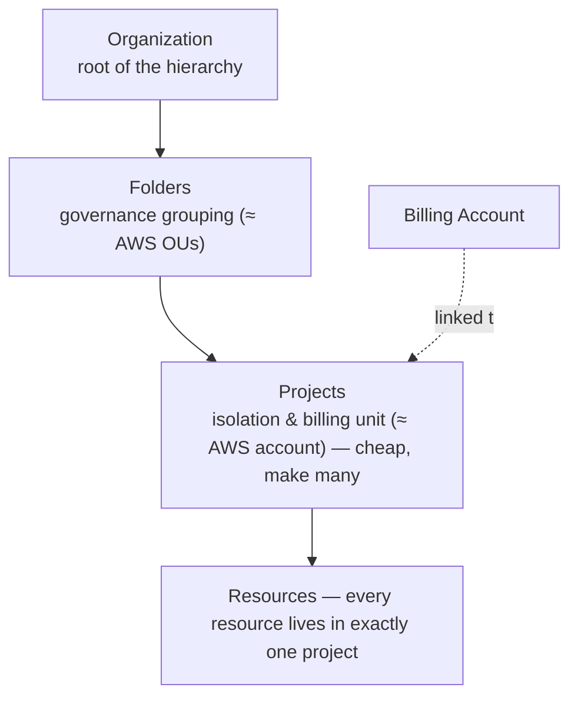

# Google Cloud Platform (GCP) for AWS Solutions Architects Study Guide

A practical 15-section guide for architects who already know AWS and want to build strong GCP instincts without starting from zero.

This guide is updated to reflect the Google Cloud architecture and services landscape in 2026. Use the linked official documentation as the current source of truth when a feature, limit, SLA, SKU, or pricing detail matters operationally.

Primary references: Google's [GCP for AWS professionals comparison](https://cloud.google.com/docs/get-started/aws-azure-gcp-service-comparison) (the official service mapping this guide expands), the [Google Cloud documentation](https://cloud.google.com/docs) (per-service), the [Architecture Framework](https://cloud.google.com/architecture/framework) (Google's well-architected counterpart), and the [Cloud Architecture Center](https://cloud.google.com/architecture) (reference architectures).

Siblings in this repo go deeper on adjacent ground: the [Azure for AWS architects guide](AZURE_FOR_AWS_SOLUTIONS_ARCHITECT.md) (the same translation method applied to Microsoft's cloud), the [Terraform guide](TERRAFORM_STUDY_GUIDE.md) (the IaC layer you'll drive all three clouds with), the [Kubernetes guide](k8s/KUBERNETES_STUDY_GUIDE.md) (GKE is the reference managed Kubernetes), and the [Data Engineering guide](DATA_ENGINEERING_STUDY_GUIDE.md) (BigQuery's world).

---

## How to Use This Guide

Study the sections in order if Google Cloud is new to you; each opens by anchoring on the AWS mental model you already hold and then develops the genuine architectural differences rather than just listing GCP's service names — because the names are the easy part and the conceptual differences are where designs go right or wrong. Treat every mapping as *directional, not literal*: Google Cloud and AWS frequently solve the same problem with a different resource hierarchy, network structure, or service boundary, and the value here is in those differences. A few patterns recur and are worth holding up front. GCP's **project is a lightweight unit you create many of**, where an AWS account is a heavy unit you ration — which inverts how you structure an estate. GCP **collapses several AWS services into one** more often than it splits them: Pub/Sub is SQS-plus-SNS, BigQuery is Redshift-plus-Athena, Cloud Load Balancing is global where AWS needs Route 53 plus regional balancers. Its **global resources** (the VPC, the load balancer, multi-region storage) mean you reach for explicit cross-region plumbing far less than AWS trains you to. And as on every cloud, GCP offers a **managed-tier ladder** (Cloud Run before GKE, Cloud SQL before self-managed) where the right instinct is to start at the most-managed rung that meets your needs.

### Translation Rules That Matter Early

- An AWS **Organization** maps to a GCP **Organization**.
- An AWS **Account** maps to a GCP **Project**. Projects are the primary resource container and billing unit in GCP.
- A GCP **Folder** acts as an intermediate organizational unit (similar to an AWS OU) to group projects.
- Identity and authentication center on **Google Cloud Identity** and **Google Accounts**, while authorization to GCP resources uses **IAM Policies** bound to resources.
- A major networking difference: AWS VPCs are regional (subnets are AZ-bound); **GCP VPCs are global** (subnets are regional).
- **Amazon CloudWatch** maps across the **Google Cloud Operations Suite** (formerly Stackdriver), including Cloud Logging, Cloud Monitoring, Cloud Trace, and Profiler.

### AWS → GCP Service Translation Map

Internalize this before the sections. Mappings are directional — GCP frequently differs in scope (global vs. regional), consistency model, or billing dimension.

| AWS | GCP | The difference that matters |
|---|---|---|
| Account / OU / Organization | Project / Folder / Organization | Projects are lightweight; create many, share one billing account |
| IAM (policy on principal) | IAM (policy bound to *resource*) | Identities live in a directory; no in-cloud "IAM users" |
| EC2 instance role | Service account (identity *and* resource) | `actAs` / `roles/iam.serviceAccountUser` matters |
| STS AssumeRole / IRSA | Workload Identity Federation / GKE Workload Identity | Keyless federation for AWS, GitHub, GKE |
| VPC (regional) | VPC (**global**) | One VPC spans all regions; subnets are regional |
| Security Group + NACL | VPC firewall rules (tag/SA-targeted) | Rules target instances by network tag or service account |
| Route 53 latency + ALB | Global External Application Load Balancer | One anycast IP, global, closest healthy backend |
| CloudFront | Cloud CDN | Enabled on the load balancer backend |
| PrivateLink | Private Service Connect (PSC) | — |
| Transit Gateway | Network Connectivity Center | Hub-and-spoke |
| EC2 / ASG | Compute Engine / Managed Instance Groups | MIGs can be *regional* (multi-zone) by default |
| Spot Instances | Spot VMs | Fixed discount, no bidding, no 24h cap |
| S3 | Cloud Storage (GCS) | Regional / dual-region / multi-region buckets |
| Glacier | GCS Archive class | Millisecond retrieval (same API), not hours |
| EBS / EFS | Persistent Disk / Filestore | Regional PD = synchronous cross-zone replication |
| RDS / Aurora | Cloud SQL / AlloyDB | AlloyDB ≈ Aurora-Postgres |
| (no equivalent) | Cloud Spanner | Global, strongly consistent, horizontal SQL (TrueTime) |
| DynamoDB | Firestore / Bigtable | Firestore = serverless doc; Bigtable = wide-column at scale |
| ElastiCache | Memorystore | Redis/Memcached |
| Lambda | Cloud Functions (2nd gen) / Cloud Run | 2nd gen runs on Cloud Run; concurrency per instance |
| ECS/Fargate | Cloud Run | Serverless containers, scale-to-zero |
| EKS | GKE (Standard / Autopilot) | Autopilot bills per-pod, Google runs nodes |
| ECR | Artifact Registry | — |
| Step Functions | Workflows | YAML/JSON state machine |
| SQS + SNS | Pub/Sub | One service covers both queue + fan-out |
| Kinesis | Pub/Sub Lite / Pub/Sub | — |
| EventBridge | Eventarc | — |
| Redshift + Athena | BigQuery | Serverless, separates compute/storage |
| Glue | Dataflow (Apache Beam) | Unified batch + stream |
| EMR | Dataproc | Managed Spark/Hadoop |
| SageMaker / Bedrock | Vertex AI (incl. Gemini) | — |
| KMS / Secrets Manager | Cloud KMS / Secret Manager | — |
| WAF + Shield | Cloud Armor | On the global load balancer edge |
| GuardDuty + Security Hub | Security Command Center | — |
| (no equivalent) | VPC Service Controls | Data-exfiltration perimeter around managed services |
| CloudFormation / CDK | Terraform (de facto) / Deployment Manager | Google co-maintains the TF provider |
| Organizations SCP | Organization Policy Service | Restricts *what* can be done |

### CLI & IaC Quickstart

Examples use the `gcloud` CLI (the `aws` CLI analog) and **Terraform**, the de facto IaC standard on GCP.

```bash
gcloud auth login
gcloud projects create my-app-prod --folder=<folder-id>
gcloud config set project my-app-prod
gcloud services enable run.googleapis.com compute.googleapis.com   # APIs are off by default — enable per project
gcloud config set compute/region us-central1
```

```hcl
# main.tf — the Google provider is the standard way to manage GCP
provider "google" {
  project = "my-app-prod"
  region  = "us-central1"
}
resource "google_storage_bucket" "assets" {
  name                        = "my-app-prod-assets"
  location                    = "US"          # multi-region
  uniform_bucket_level_access = true
}
```

> Unlike AWS, GCP **APIs are disabled per project until you enable them** (`gcloud services enable`). A "permission denied / API not enabled" error on a brand-new project is almost always this.

---

## Table of Contents

1. [GCP Foundations: Resource Hierarchy, Billing, Regions, and Zones](#1-gcp-foundations-resource-hierarchy-billing-regions-and-zones)
2. [Identity and Access Management](#2-identity-and-access-management)
3. [Networking, Connectivity, and Edge Delivery](#3-networking-connectivity-and-edge-delivery)
4. [Compute, Virtual Machines, and Scaling](#4-compute-virtual-machines-and-scaling)
5. [Object, Block, and File Storage](#5-object-block-and-file-storage)
6. [Relational Databases](#6-relational-databases)
7. [NoSQL, Cache, and Search](#7-nosql-cache-and-search)
8. [Containers and Kubernetes](#8-containers-and-kubernetes)
9. [Serverless, APIs, and Workflow Orchestration](#9-serverless-apis-and-workflow-orchestration)
10. [Messaging and Event Streaming](#10-messaging-and-event-streaming)
11. [Analytics, Data Lake, and AI/ML](#11-analytics-data-lake-and-aiml)
12. [Observability and Operations](#12-observability-and-operations)
13. [Security, Secrets, and Perimeter Protection](#13-security-secrets-and-perimeter-protection)
14. [Governance, Policy Control, and Cost Management](#14-governance-policy-control-and-cost-management)
15. [DevOps, IaC, Migration, Backup, and Disaster Recovery](#15-devops-iac-migration-backup-and-disaster-recovery)

---

## 1. GCP Foundations: Resource Hierarchy, Billing, Regions, and Zones

In AWS you reason constantly about the **account** — your billing boundary, your isolation edge, the heavy unit you ration because spinning up and governing one is real work — organized into OUs under an Organization. GCP's foundational difference, the one that reshapes how you structure everything, is that it replaces the heavy account with a *lightweight project* inside a strict, mandatory hierarchy: **Organization → Folders → Projects → Resources**, with the rule that *every resource must belong to a project* — there is no equivalent of a "loose" resource floating outside the structure. A **project** is the rough analog of an AWS account as the isolation-and-billing unit, but it is so much cheaper to create and interconnect that the idiom inverts: where AWS teams ration accounts, GCP teams make *many* projects — commonly one per service per environment — because they all share a central **Billing Account**, nest under **Folders** for governance (the OU analog), and interconnect easily via Shared VPC. The mental shift to make early is "projects are cheap, make many," because designing a GCP estate as if projects were precious accounts produces a cramped, hard-to-govern structure.



IAM policies set at the Organization or Folder level **inherit down** to every project and resource beneath, so you grant broadly at the top and narrowly where needed.

Two naming subtleties trip up AWS architects and are worth pinning down. First, GCP overloads the word "tags": it has **labels** (free-form key-value pairs for querying, filtering, and cost breakdown — the closest match to AWS tags) *and* **tags** (a separate Resource Manager construct that can be referenced in IAM conditions and firewall rules to apply policy conditionally) — so "tag" means two different things depending on context, and you'll use labels for organization and tags for policy. Second, the geography model adds a tier above regions and zones: GCP defines **multi-regions** (a geographic area spanning several regions, like `us` or `eu`) that storage and database services use for *out-of-the-box geo-replication* — so where an AWS architect explicitly designs cross-region replication, several GCP services offer a multi-region location that handles it for you, a genuine simplification to know exists.

### Hands-On

```bash
# The hierarchy: organization → folder → project. Projects are cheap; make many.
gcloud resource-manager folders create --display-name="workloads" --organization=<org-id>
gcloud projects create app-prod --folder=<folder-id>
gcloud projects create app-staging --folder=<folder-id>

# Link a billing account (projects are the billing + isolation unit)
gcloud billing projects link app-prod --billing-account=<billing-id>
# Enable only the APIs this project needs
gcloud services enable compute.googleapis.com run.googleapis.com --project=app-prod
```

> Mental shift from AWS: an AWS account is a heavy boundary, so teams ration them. A GCP **project** is lightweight — the idiom is *many* projects (often per service × per environment) under shared folders and one billing account, interconnected via Shared VPC.

### Start With These Docs

- [GCP Resource Hierarchy Overview](https://cloud.google.com/resource-manager/docs/cloud-platform-resource-hierarchy)
- [Geography and regions on Google Cloud](https://cloud.google.com/about/locations)
- [GCP Projects overview](https://cloud.google.com/resource-manager/docs/creating-managing-projects)

### Practice

- Design a folder and project structure for a multi-tenant application with `development`, `staging`, and `production` environments.
- Contrast when you would separate components of an application into different Projects vs. different Folders.
- Map an AWS account-per-environment topology to a GCP project-and-folder topology.

```quiz
Q: Why does the "AWS account → GCP project" mapping invert how many you create?
- [ ] Projects cost more, so you make fewer
- [x] A project is lightweight and easily interconnected, so the GCP idiom is many projects (often per service per environment) under shared folders and one billing account
- [ ] Projects can't be deleted, so you reuse them
- [ ] GCP limits you to one project per organization
> An AWS account is a heavy boundary teams ration; a GCP project is cheap to create and interconnect (via Shared VPC) and shares a central billing account. So the idiom flips to "projects are cheap, make many" — commonly one per service per environment. Designing a GCP estate as if projects were precious accounts produces a cramped, hard-to-govern structure.

Q: GCP "overloads" the word tags. What's the distinction between labels and tags?
- [ ] They're identical; tags is just the newer name
- [x] Labels are free-form key-value pairs for querying/filtering/cost; tags are a Resource Manager construct referenceable in IAM conditions and firewall rules for conditional policy
- [ ] Labels are for billing only; tags are for billing only
- [ ] Tags are AWS-only; GCP has just labels
> GCP labels are the closest match to AWS tags — organization, filtering, cost breakdown. GCP *tags* are a separate construct that policy can reference: IAM conditions and firewall rules can apply conditionally based on a tag. So "tag" means two different things by context — use labels for organization, tags for policy.

Q: What does a GCP multi-region location give you that an AWS architect normally designs explicitly?
- [ ] Lower per-GB storage pricing
- [x] Out-of-the-box geo-replication — storage/database services using a multi-region (like `us` or `eu`) handle cross-region replication for you
- [ ] A single global IP address
- [ ] Automatic cost optimization
> GCP adds a tier above regions and zones: multi-regions span several regions, and several storage and database services offer a multi-region location that handles geo-replication automatically. Where an AWS architect explicitly builds cross-region replication, the GCP service can provide it as a location choice — a genuine simplification worth knowing exists.
```

---

## 2. Identity and Access Management

GCP's IAM reorganizes the same concepts AWS bundles into one service around two structural differences that, once seen, make the rest fall into place. The first is that **GCP has no native cloud-console "IAM users."** Human identities don't originate in GCP the way an `aws iam create-user` does; they live in a *directory* — **Cloud Identity** (Google's free IDaaS), **Google Workspace**, or an external IdP federated via SAML/OIDC — and GCP reasons about those directory identities. The clean path for an existing Okta or Entra shop is **Workforce Identity Federation**, which lets your users authenticate with the IdP you already run *without* syncing them into Google. The takeaway for an AWS architect: your human-identity strategy in GCP is fundamentally a choice of *which directory you point GCP at*, not a set of users you mint inside it.

The second and more important difference is the *direction* of policy attachment. In AWS you typically attach a policy *to a principal* ("Alice may read S3"). In GCP, **policies are attached to resources** ("this project / this bucket grants the Reader role to Alice"), and a binding is a triple of *who* (a principal — a user, group, or service account), *what* (a role, which is a bag of permissions), and *where* (the resource the policy sits on, with grants inheriting down the Organization → Folder → Project → resource hierarchy). This resource-centric model pairs with **IAM Conditions** — grants that apply only when a condition holds (a time window, an IP range, a resource-name prefix) — to express fine-grained access without proliferating roles. Two GCP-specific concepts complete the picture and matter daily. A **Service Account** is the workload identity (a VM, a Cloud Run service) and is unusual in being *both a principal and a resource* — it can be granted roles, *and* other users can be granted permission to *use* it via the `Service Account User` role (`actAs`), which is the permission that lets a deploy pipeline run something *as* a service account and a frequent source of "why can't my CI deploy?" confusion. And **Workload Identity Federation** is GCP's answer to long-lived keys: an external workload (an EC2 instance, a GitHub Actions run) impersonates a GCP service account using its own platform identity, with no static credential stored anywhere — the same secret-free workload-identity pattern every cloud has converged on, and always the right choice over downloading a service-account key file.

### AWS → GCP at a Glance

| AWS | GCP |
|---|---|
| IAM users | Identities in Cloud Identity / Workspace / federated IdP |
| IAM policy on principal | IAM policy **bound to a resource** |
| IAM role | Predefined / custom role (a bag of permissions) |
| EC2 instance profile | Service account attached to the VM |
| IRSA (EKS) | GKE Workload Identity |
| STS AssumeRole (cross-account) | Workload Identity Federation |
| SCP | Organization Policy |

### Hands-On

```bash
# A service account = both an identity and a resource. Bind a role at a scope.
gcloud iam service-accounts create app-sa --display-name="App runtime"
gcloud projects add-iam-policy-binding app-prod \
  --member="serviceAccount:app-sa@app-prod.iam.gserviceaccount.com" \
  --role="roles/storage.objectViewer"

# Grant access only on ONE bucket (least privilege) instead of project-wide:
gcloud storage buckets add-iam-policy-binding gs://app-prod-assets \
  --member="serviceAccount:app-sa@app-prod.iam.gserviceaccount.com" \
  --role="roles/storage.objectViewer"
```

> Two gotchas for AWS architects: (1) policies attach to the **resource**, and a member can be a user, group, or service account; (2) granting someone `roles/iam.serviceAccountUser` on a service account lets them *act as* it — treat that like handing over an IAM role's permissions.

### Start With These Docs

- [GCP IAM Overview](https://cloud.google.com/iam/docs/overview)
- [Understanding Service Accounts](https://cloud.google.com/iam/docs/service-accounts)
- [Workload Identity Federation](https://cloud.google.com/iam/docs/workload-identity-federation)

### Practice

- Write a Terraform block or IAM policy that grants a user group read-only access to a specific Cloud Storage bucket but denies it project-wide.
- Implement an IAM Condition that grants an external contractor access to BigQuery only during standard business hours.
- Explain the security implications of granting a developer the `roles/iam.serviceAccountUser` role.
- Map the concept of an AWS IAM Role assumed by an EC2 instance to a GCP Service Account attached to a Compute Engine instance.

```quiz
Q: In AWS you attach a policy to a principal ("Alice may read S3"). How does GCP invert this?
- [ ] It attaches policies to IAM users only
- [x] Policies attach to the *resource* ("this bucket grants Reader to Alice"), as a who/what/where triple inheriting down the org→folder→project→resource hierarchy
- [ ] GCP has no concept of roles
- [ ] Policies attach to regions
> GCP's model is resource-centric: a binding sits on a resource and names a principal (who), a role (what), and inherits down from the scope it's attached to (where). Combined with IAM Conditions for fine-grained, conditional grants, this expresses least privilege without proliferating roles — but it means you reason about "what does this resource grant?" rather than "what is this user allowed?"

Q: Why does GCP have "no native IAM users," and what's the implication for an AWS architect?
- [ ] Users are disabled by default for security
- [x] Human identities live in a directory (Cloud Identity, Workspace, or a federated IdP), so your identity strategy is choosing which directory GCP points at, not minting users inside GCP
- [ ] You must create users via Terraform only
- [ ] GCP only supports service accounts, never humans
> Unlike `aws iam create-user`, GCP doesn't originate human identities — they come from a directory, and an existing Okta/Entra shop uses Workforce Identity Federation to authenticate users without syncing them into Google. So the human-identity decision is fundamentally "which directory do I federate?" rather than a set of users you manage in the cloud.

Q: What does granting someone `roles/iam.serviceAccountUser` (actAs) on a service account let them do, and why is it a frequent CI gotcha?
- [ ] It lets them delete the service account
- [x] It lets them run workloads *as* that service account — so a deploy pipeline needs actAs to deploy as the SA, and missing it causes "why can't my CI deploy?"
- [ ] It grants them billing access
- [ ] It rotates the SA's keys automatically
> A service account is unusual in being both a principal and a resource: others can be granted permission to *use* it via the Service Account User role (`actAs`). That's exactly the permission a deploy pipeline needs to launch something as the SA, and its absence is a classic source of CI deploy failures. Treat granting actAs like handing over that SA's permissions.
```

---

## 3. Networking, Connectivity, and Edge Delivery

GCP networking has one headline difference that an AWS architect must absorb before anything else, because it changes how you draw every diagram: **a GCP VPC is a global resource.** Where an AWS VPC lives in one region and a subnet is pinned to one availability zone, a GCP VPC spans *all* regions, and a subnet is *regional* (covering all zones in its region). The consequence is liberating — instances in `us-central1` and `europe-west1` on the same VPC talk to each other over Google's internal backbone with no peering, no gateway, no cross-region plumbing — and it means the multi-VPC, Transit-Gateway-stitched topologies AWS forces are often simply unnecessary in GCP. Where you *do* need to connect separate networks (multi-project, hybrid, multi-cloud), **Network Connectivity Center** provides the hub-and-spoke model, and **Shared VPC** — a host project owning a VPC whose subnets are shared with service projects — is GCP's preferred way to give many of those cheap projects (Section 1) a common, centrally-governed network.

The rest of the mapping rewards a few specific reframings. Instead of AWS's two filtering layers (security groups plus NACLs), GCP uses **VPC Firewall Rules** applied to the network and *targeted* at instances by network tag, service account, or IP range — one model, and notably one that can match by *identity* (service account) rather than only by network position. **Cloud Load Balancing** is the standout: it is software-defined and *global*, so a single anycast IP can balance traffic across backends worldwide, routing each user to the nearest healthy region automatically — collapsing what AWS builds from Route 53 latency routing plus regional ALBs into one service. The connectivity analogs are direct: **Cloud DNS** for Route 53, **Cloud CDN** for CloudFront, **Cloud Interconnect** for Direct Connect, and **Private Service Connect** for PrivateLink (private cross-VPC, cross-project service consumption). The throughline: GCP's global-VPC-and-global-LB design means you reach for explicit cross-region networking far less often than AWS trains you to.

### AWS → GCP at a Glance

| AWS | GCP |
|---|---|
| VPC (regional) | VPC (**global**) |
| Subnet (AZ-bound) | Subnet (regional, spans zones) |
| Security Group + NACL | VPC firewall rules (tag/SA-targeted) |
| Route table | Routes / Cloud Router |
| NAT Gateway | Cloud NAT |
| ALB + Route 53 latency | Global External Application Load Balancer |
| NLB | Regional/Network Load Balancer |
| CloudFront | Cloud CDN (on the LB backend) |
| PrivateLink | Private Service Connect |
| Transit Gateway | Network Connectivity Center |
| Direct Connect | Cloud Interconnect |

### Hands-On

```bash
# A global VPC, a regional subnet, and a firewall rule scoped by network tag (not CIDR alone)
gcloud compute networks create vpc-prod --subnet-mode=custom
gcloud compute networks subnets create snet-us \
  --network=vpc-prod --region=us-central1 --range=10.10.0.0/20
gcloud compute firewall-rules create allow-https \
  --network=vpc-prod --allow=tcp:443 --direction=INGRESS --target-tags=web
# Only instances tagged "web" get the rule:
#   gcloud compute instances create ... --tags=web
```

> The headline difference: **one VPC is global**. Instances in `us-central1` and `europe-west1` in the same VPC talk over Google's backbone with no peering or gateway. A single global load balancer with one anycast IP then routes each user to the closest healthy backend — collapsing Route 53 latency routing + regional ALBs into one resource.

### Start With These Docs

- [GCP VPC Network Overview](https://cloud.google.com/vpc/docs/vpc)
- [Shared VPC Overview](https://cloud.google.com/vpc/docs/shared-vpc)
- [Cloud Load Balancing Overview](https://cloud.google.com/load-balancing/docs/load-balancing-overview)
- [VPC Firewall Rules Overview](https://cloud.google.com/firewall/docs/firewalls)

### Practice

- Design a hub-and-spoke topology using a Shared VPC where the hub project controls all egress via Cloud NAT, and spoke projects host the workloads.
- Compare GCP's Global Load Balancing routing logic with AWS Route 53 latency-based routing combined with ALBs.
- Configure a GCP firewall rule that allows port 80/443 traffic only to virtual machines running with a specific Service Account.

```quiz
Q: A GCP VPC is global. How does that change a multi-region topology versus AWS?
- [ ] You need a Transit Gateway equivalent to connect regions
- [x] Instances in different regions on the same VPC talk over Google's backbone with no peering or gateway, so the multi-VPC stitched topologies AWS forces are often unnecessary
- [ ] Each region still needs its own VPC like AWS
- [ ] Global VPCs can't have subnets
> An AWS VPC is regional and a subnet is AZ-bound, so cross-region communication means peering or Transit Gateway. A GCP VPC spans all regions with regional subnets, so `us-central1` and `europe-west1` instances on one VPC communicate over the internal backbone directly — collapsing much of the cross-region plumbing AWS trains you to build.

Q: GCP firewall rules can target instances by network tag *or service account*. Why is the service-account option notable?
- [ ] It's faster to evaluate than tags
- [x] It matches by *identity* rather than network position, so a rule can apply to "instances running as this SA" regardless of IP or tag
- [ ] It's the only way to write a firewall rule
- [ ] Service accounts replace CIDR ranges entirely
> AWS filters by network position (security groups, NACLs). GCP firewall rules are one model targeted by tag, IP range, *or* service account — and targeting by SA means the rule follows workload identity, not where the instance sits in the address space. That's a cleaner expression of "these workloads may receive this traffic" than tag/CIDR alone.

Q: Why is GCP's Cloud Load Balancing called out as collapsing multiple AWS pieces into one?
- [ ] It's cheaper than an ALB
- [x] It's software-defined and global — one anycast IP balances across worldwide backends, routing each user to the nearest healthy region, replacing Route 53 latency routing plus regional ALBs
- [ ] It only works in one region
- [ ] It requires Cloud CDN to function
> GCP's global external load balancer presents a single anycast IP and routes each request to the closest healthy backend region automatically. That single resource does the job AWS assembles from Route 53 latency-based routing plus per-region ALBs — another expression of GCP's global-by-default networking design.
```

---

## 4. Compute, Virtual Machines, and Scaling

The compute mapping is direct — **Compute Engine** is EC2, **Managed Instance Groups** are Auto Scaling Groups, **Instance Templates** are Launch Templates, **Spot VMs** are Spot Instances, **Persistent Disk** is EBS — so the value is in a handful of genuinely better defaults that an AWS architect should adopt rather than work around. The standout is **custom machine types**: instead of choosing from a fixed menu of instance sizes and over-provisioning to the nearest fit, you specify the exact vCPU and memory your workload needs, which both saves money and removes the "no instance type is quite right" friction. Access works differently and better too: rather than EC2's static SSH key pairs (which you create, distribute, and rotate), GCP **OS Login** ties SSH directly to IAM, provisioning short-lived keys from a user's IAM role and supporting MFA — so off-boarding someone removes their server access by removing an IAM binding, not by hunting down distributed keys. Spot VMs improve on AWS Spot in two ways worth noting: no bidding (a fixed discount, up to ~91%) and no 24-hour cap (the legacy preemptible-VM limit is gone).

Two areas reward knowing the GCP-specific options exist. On resilience, a **Managed Instance Group can be regional**, automatically spreading instances across the zones of a region with auto-healing and rolling updates built in — the AWS-ASG-across-multiple-AZ pattern, but as a first-class property rather than something you configure. On security, Compute Engine bakes in hardware-rooted protections: **Shielded VMs** give verifiable boot integrity against rootkits, and **Confidential VMs** encrypt data *in use* (while being processed in memory, not just at rest and in transit) — a capability with no simple AWS one-liner equivalent and a real differentiator for regulated workloads. **Sole-Tenant Nodes** cover the dedicated-hardware case (compliance, BYOL licensing). The same most-managed-first discipline from the platform applies: reach for raw Compute Engine when you need OS control, and prefer Cloud Run or GKE (Sections 8–9) for the large fraction of workloads that don't.

### AWS → GCP at a Glance

| AWS | GCP |
|---|---|
| EC2 instance | Compute Engine instance |
| Fixed instance types | Predefined **or custom** machine types |
| AMI | Custom / machine image |
| Launch Template | Instance template |
| Auto Scaling Group | Managed Instance Group (often **regional**) |
| Spot Instance | Spot VM (fixed discount, no bid, no 24h cap) |
| EC2 Key Pairs (static SSH) | OS Login (SSH tied to IAM) |
| Dedicated Hosts | Sole-Tenant Nodes |
| EBS / instance store | Persistent Disk / Local SSD |

### Hands-On

```bash
# Regional MIG (spans zones automatically) + autoscaling + autohealing — the ASG analog
gcloud compute instance-templates create web-tmpl \
  --machine-type=e2-standard-2 --tags=web --image-family=debian-12 --image-project=debian-cloud
gcloud compute instance-groups managed create web-mig \
  --template=web-tmpl --size=2 --region=us-central1     # regional = multi-zone HA out of the box
gcloud compute instance-groups managed set-autoscaling web-mig --region=us-central1 \
  --max-num-replicas=10 --min-num-replicas=2 --target-cpu-utilization=0.7
```

> Two AWS-architect surprises: **custom machine types** let you size CPU/RAM exactly instead of jumping instance families, and a **regional MIG** spreads instances across zones automatically (no manual multi-AZ subnet wiring). SSH is via **OS Login** (IAM-driven, ephemeral keys), not static key pairs.

### Start With These Docs

- [GCP Compute Engine Documentation](https://cloud.google.com/compute/docs)
- [Managed Instance Groups (MIGs) Overview](https://cloud.google.com/compute/docs/instance-groups)
- [Spot VMs Overview](https://cloud.google.com/compute/docs/instances/spot-vms)
- [Persistent Disk Overview](https://cloud.google.com/compute/docs/disks)

### Practice

- Create a regional Managed Instance Group with an auto-scaling policy based on CPU utilization and an auto-healing health check.
- Decide when to use Local SSDs (ephemeral) versus Extreme/SSD Persistent Disks (network storage) for a high-performance database.
- Determine the lifecycle configurations needed to run a batch processing job cost-effectively using Spot VMs.

---

## 5. Object, Block, and File Storage

Storage maps cleanly — **Cloud Storage (GCS)** is S3, **Persistent Disk** is EBS, **Filestore** is EFS (managed NFS) — with a few GCP characteristics that genuinely simplify designs. The most striking is **GCS storage classes share one API and one latency profile**: where AWS Glacier and Deep Archive impose a separate retrieval workflow and hours-long restore times, fetching an object from GCS's Archive class takes *milliseconds*, exactly like Standard — you pay more for the retrieval, but the access model is identical, so cold data is a pricing decision rather than an architectural one and you never write the "submit a restore job, wait, then read" code Glacier forces. GCS also matches the multi-region story from Section 1: a bucket can be regional, dual-regional, or multi-regional, getting geo-replication as a location choice rather than a replication configuration. And bucket naming is namespaced by project rather than requiring the globally-unique-across-all-customers names S3 demands.

On block storage, **Persistent Disk** has two capabilities EBS lacks that occasionally matter: a PD can be attached to *multiple* VMs simultaneously in read-only mode (handy for shared reference data), and *Regional* PDs do active-active synchronous replication across two zones in a region, giving a disk that survives a zone failure with no application involvement. The storage-class ladder (Standard, Nearline, Coldline, Archive) plus Object Lifecycle Management and Bucket Lock (WORM, for compliance) round out the parity with S3's classes and Object Lock.

### AWS → GCP at a Glance

| AWS | GCP | Notes |
|---|---|---|
| S3 | Cloud Storage (GCS) | Regional / dual-region / multi-region |
| S3 IA | Nearline / Coldline | Same API, same low latency |
| Glacier / Deep Archive | Archive class | **Milliseconds** to retrieve, not hours |
| EBS | Persistent Disk | Regional PD = sync replication across 2 zones |
| Instance store | Local SSD | Ephemeral |
| EFS | Filestore | Managed NFS |
| S3 Object Lock (WORM) | Bucket Lock | — |

### Hands-On

```bash
# A bucket with uniform access + a lifecycle rule (tier to Coldline at 30d, delete at 365d)
gcloud storage buckets create gs://app-prod-assets --location=US --uniform-bucket-level-access
cat > lifecycle.json <<'JSON'
{ "rule": [
  { "action": {"type":"SetStorageClass","storageClass":"COLDLINE"}, "condition": {"age":30} },
  { "action": {"type":"Delete"}, "condition": {"age":365} }
]}
JSON
gcloud storage buckets update gs://app-prod-assets --lifecycle-file=lifecycle.json
gcloud storage cp ./report.pdf gs://app-prod-assets/   # gcloud storage ≈ aws s3
```

> Key contrast with AWS: **all GCS storage classes share one API and millisecond latency** — fetching from `Archive` is instant (you pay a retrieval fee), unlike Glacier's hours-long restores. Redundancy is chosen by bucket *location* (regional vs. dual/multi-region), and a **Regional Persistent Disk** gives you synchronous block-storage replication across two zones for instant failover — something EBS doesn't offer natively.

### Start With These Docs

- [Cloud Storage Documentation](https://cloud.google.com/storage/docs)
- [GCS Storage Classes](https://cloud.google.com/storage/docs/storage-classes)
- [Persistent Disk Replication Options](https://cloud.google.com/compute/docs/disks/high-availability-regional-persistent-disk)
- [Filestore Overview](https://cloud.google.com/filestore/docs/reference/rest)

### Practice

- Configure a GCS bucket with a lifecycle policy that transitions objects to Coldline after 30 days and deletes them after 365 days.
- Design a disaster recovery storage setup using a dual-regional GCS bucket.
- Architect a high-availability application using Regional Persistent Disks to enable instant failover of block storage between zones.

---

## 6. Relational Databases

GCP's relational lineup is a three-rung ladder by how much scale and consistency you need, and choosing the right rung is the skill. **Cloud SQL** is the straightforward RDS equivalent — managed MySQL, PostgreSQL, and SQL Server — and the right default for ordinary applications. **AlloyDB** is the Aurora-Postgres analog: a Postgres-compatible engine with a separated compute-and-storage architecture for much higher performance and faster replication, plus built-in vector-search optimization that makes it a natural fit for AI/RAG workloads — reach for it when Cloud SQL's single-node Postgres runs out of headroom but you want to stay Postgres-compatible.

The rung with no AWS equivalent at all, and GCP's signature database, is **Cloud Spanner** — a fully managed relational database that is *both* globally distributed *and* strongly consistent, holding ACID transactions across continents while scaling horizontally to thousands of nodes. The reason that combination is normally considered impossible (the CAP-theorem tension the [Distributed Systems guide](DISTRIBUTED_SYSTEMS_STUDY_GUIDE.md) and [Distributed Algorithms guide](DISTRIBUTED_ALGORITHMS_STUDY_GUIDE.md) develop) is that Spanner cheats with hardware: **TrueTime**, a globally-synchronized clock built from atomic clocks and GPS receivers in every datacenter, gives every node a tightly-bounded notion of "now," and Spanner uses that bounded uncertainty to order transactions globally without the coordination chatter that would otherwise make global strong consistency impractical. There is genuinely no AWS product like it, so a workload that needs a globally-consistent relational store at scale is a real reason to choose GCP. (**Bare Metal Solution** covers the legacy-Oracle case with dedicated hardware adjacent to GCP.)

### AWS → GCP at a Glance

| AWS | GCP | When |
|---|---|---|
| RDS (MySQL/Postgres/SQL Server) | Cloud SQL | Standard managed relational |
| Aurora PostgreSQL | AlloyDB for PostgreSQL | High-performance Postgres, compute/storage split |
| (no equivalent) | Cloud Spanner | Global, strongly consistent, horizontal SQL |
| Oracle on RDS / on EC2 | Bare Metal Solution | Legacy/licensed engines |

### Hands-On

```bash
# Cloud SQL Postgres with HA (regional, synchronous standby in another zone = Multi-AZ analog)
gcloud sql instances create pg-app-prod --database-version=POSTGRES_16 \
  --tier=db-custom-2-8192 --region=us-central1 --availability-type=REGIONAL
gcloud sql databases create appdb --instance=pg-app-prod
```

```hcl
# Cloud Spanner: provision once, scale horizontally to thousands of nodes, ACID across regions
resource "google_spanner_instance" "main" {
  config       = "regional-us-central1"   # or a multi-region config for global writes
  display_name = "app-prod"
  processing_units = 1000                  # 1000 PU = 1 node; scale by PU
}
```

> The standout with no AWS analog is **Cloud Spanner**: globally distributed, externally consistent SQL using TrueTime (atomic clocks + GPS) to order transactions across continents. Reach for it when you need horizontal write scale *and* strong consistency — a combination RDS/Aurora can't give you. For most apps, **Cloud SQL** (≈ RDS) or **AlloyDB** (≈ Aurora-Postgres) is the right, cheaper answer.

### Start With These Docs

- [Cloud SQL Overview](https://cloud.google.com/sql/docs)
- [AlloyDB for PostgreSQL Overview](https://cloud.google.com/alloydb/docs/overview)
- [Cloud Spanner Overview](https://cloud.google.com/spanner/docs/overview)
- [TrueTime and External Consistency in Spanner](https://cloud.google.com/spanner/docs/truetime-external-consistency)

### Practice

- Contrast the architectural differences between deploying PostgreSQL on Cloud SQL, AlloyDB, and Cloud Spanner.
- Analyze when an application requires Cloud Spanner over a traditional primary-replica relational database.
- Design a high-availability failover topology for a Cloud SQL database instance across two zones.

```quiz
Q: What makes Cloud Spanner's combination of global distribution and strong consistency normally considered impossible, and how does it achieve it?
- [ ] It relaxes consistency to eventual under load
- [x] Global strong consistency usually needs heavy coordination; Spanner uses TrueTime (atomic clocks + GPS) to give bounded clock uncertainty and order transactions globally without that chatter
- [ ] It restricts writes to one region at a time
- [ ] It caches all reads in Memorystore
> The CAP-theorem tension makes globally-distributed *and* strongly-consistent SQL hard because ordering transactions across continents normally demands expensive coordination. Spanner "cheats with hardware": TrueTime provides every node a tightly-bounded notion of "now" from atomic clocks and GPS, and Spanner waits out that bounded uncertainty to order transactions globally. There's no AWS equivalent, so a workload genuinely needing this is a real reason to choose GCP.

Q: When should you reach for Cloud Spanner versus Cloud SQL or AlloyDB?
- [ ] Always — Spanner is the cheapest option
- [ ] For any PostgreSQL workload
- [x] Only when you need horizontal write scale *and* strong consistency at global scale; otherwise Cloud SQL (≈RDS) or AlloyDB (≈Aurora-Postgres) is the right, cheaper answer
- [ ] For caching frequently-read rows
> Spanner is the signature product but also the expensive, specialized rung. The ladder is Cloud SQL for ordinary managed relational, AlloyDB when single-node Postgres runs out of headroom but you want to stay Postgres-compatible, and Spanner reserved for the genuine need: global horizontal write scale with strong consistency. Defaulting to Spanner for an app that doesn't need that combination overpays for capability it won't use.

Q: How do Firestore and Cloud Bigtable divide the NoSQL space?
- [ ] They're interchangeable document stores
- [x] Firestore is the serverless document DB for application data; Bigtable is a wide-column store for petabyte-scale, low-latency, row-key-accessed workloads
- [ ] Bigtable is for documents; Firestore is for caching
- [ ] Both are relational engines
> GCP's NoSQL splits by access pattern: Firestore (the DynamoDB/DocumentDB analog) suits flexible application documents with real-time sync, while Bigtable is a wide-column engine for enormous operational/analytical workloads accessed by row key — the engine behind Search and Maps. You match data shape and scale to the engine rather than treating one as the universal NoSQL answer.
```

---

## 7. NoSQL, Cache, and Search

GCP's NoSQL offerings split by access pattern, and the key is matching the workload's shape to the right engine rather than defaulting to one. **Firestore** is the serverless document database — the DynamoDB/DocumentDB analog — with sub-second queries, real-time sync, and offline support, running in Native mode (built for mobile and web clients) or Datastore mode (for high-throughput backend services); it's the right reach for application data with flexible documents. **Cloud Bigtable** is a different beast for a different job: a wide-column store engineered for *enormous* low-latency operational and analytical workloads (billions of rows, petabytes), and it is literally the engine behind Google Search and Maps — so it maps to AWS Keyspaces or the heaviest wide-column DynamoDB patterns, and you reach for it when the scale is extreme and the access is by row key. **Memorystore** is managed Redis and Memcached (ElastiCache), and **Vertex AI Search** provides turnkey semantic search and RAG, the retrieval layer for AI features. The decision in one line: Firestore for application documents, Bigtable for petabyte-scale key-row workloads, Memorystore for caching — chosen by data shape and scale, not by treating one as the universal NoSQL answer.

### AWS → GCP at a Glance

| AWS | GCP |
|---|---|
| DynamoDB (serverless doc) | Firestore (Native mode) |
| DynamoDB (high-throughput wide-column) | Cloud Bigtable |
| DocumentDB | Firestore |
| Keyspaces (Cassandra) | Bigtable (wide-column patterns) |
| ElastiCache (Redis/Memcached) | Memorystore |
| OpenSearch / Kendra (semantic) | Vertex AI Search |

### Hands-On

```bash
# Firestore (serverless document DB; pick Native mode for apps, Datastore mode for backend scale)
gcloud firestore databases create --location=nam5 --type=firestore-native

# Bigtable for billions-of-rows / low-latency wide-column workloads — row key design is everything
gcloud bigtable instances create app-bt --display-name="App Bigtable" \
  --cluster-config=id=app-bt-c1,zone=us-central1-b,nodes=3

# Memorystore (managed Redis) = ElastiCache
gcloud redis instances create app-cache --size=1 --region=us-central1 --tier=STANDARD_HA
```

> Like DynamoDB, the hard part is the **key design**: in Bigtable a sequential/monotonic row key creates a hotspot that caps throughput (the same lesson as a bad DynamoDB partition key — field-promote or hash to spread writes). Firestore is the closer drop-in for DynamoDB-style serverless document access with real-time listeners.

### Start With These Docs

- [Firestore Documentation](https://cloud.google.com/firestore/docs)
- [Cloud Bigtable Overview](https://cloud.google.com/bigtable/docs/overview)
- [Memorystore for Redis Overview](https://cloud.google.com/memorystore/docs/redis)

### Practice

- Design a Firestore schema utilizing subcollections and outline how indexes are generated.
- Determine the correct partition key strategy for a Cloud Bigtable instance to prevent hotspotting.
- Choose between Firestore, Bigtable, and Memorystore for a real-time gaming leaderboard application.

---

## 8. Containers and Kubernetes

Containers are a GCP strength, and an AWS architect should arrive knowing that the two products to understand are GKE and Cloud Run, with the choice between them mirroring the AKS-vs-Container-Apps decision from the Azure world. **Google Kubernetes Engine (GKE)** is widely regarded as the best managed Kubernetes — unsurprising, since Google created Kubernetes — and it offers two operating modes that matter: **GKE Standard** (you manage the worker nodes, full control) and **GKE Autopilot** (Google provisions, sizes, and scales the nodes from your Pod specs and bills you only for running Pods, removing node operations entirely). For most teams Autopilot is the better starting point, the same most-managed-first instinct that runs through this guide. The networking default to know is **VPC-native clusters**, which use alias IPs so Pod addresses are natively routable in the VPC (the flat, no-NAT Pod network the [Kubernetes networking guide](../k8s/DOCKER_KUBERNETES_NETWORKING_STUDY_GUIDE.md) describes), and for multi-cloud or hybrid, **GKE Enterprise** (formerly Anthos) with Fleet Management applies consistent policy across clusters spanning GCP, AWS, Azure, and on-prem.

The product that often *replaces* Kubernetes for app teams is **Cloud Run** — GCP's flagship serverless-container platform, and frequently the right first reach. It runs stateless containers, scales them from zero to thousands of instances on request volume, and handles HTTPS, TLS certificates, and routing for you, so you deploy a container and get a production HTTPS endpoint with no cluster to operate. It's the rough equivalent of ECS-on-Fargate but with dramatically less configuration, and the decision rule mirrors Azure's: start at Cloud Run, climb to GKE only when you can name the Kubernetes capability you actually need. **Artifact Registry** (the ECR analog, and broader — Docker, Maven, npm, Python, Helm) is where the images live.

### AWS → GCP at a Glance

| AWS | GCP | Reach for it when |
|---|---|---|
| ECR | Artifact Registry | Always (image/package storage) |
| ECS on Fargate | Cloud Run | Serverless containers, scale-to-zero |
| EKS | GKE Standard | Full K8s, you manage nodes |
| EKS + Fargate | GKE Autopilot | K8s API, Google manages/bills per-pod |
| App Mesh | Cloud Service Mesh | Service mesh |
| EKS Anywhere / multi-cloud | GKE Enterprise (Anthos) + Fleets | Hybrid/multi-cloud K8s |

### Hands-On

```bash
# Build → push → deploy a serverless container with scale-to-zero (≈ ECS/Fargate, far less config)
gcloud artifacts repositories create app --repository-format=docker --location=us-central1
gcloud builds submit --tag us-central1-docker.pkg.dev/app-prod/app/api:v1 .
gcloud run deploy api --image=us-central1-docker.pkg.dev/app-prod/app/api:v1 \
  --region=us-central1 --allow-unauthenticated --concurrency=80 --min-instances=0 --max-instances=20
```

```bash
# GKE Autopilot: you submit pod specs, Google provisions/scales/bills the nodes for you
gcloud container clusters create-auto app-cluster --region=us-central1
```

> Default to **Cloud Run** for stateless request/response or event-driven containers (note `--concurrency=80`: one instance serves many requests, unlike Lambda's 1-per-instance). Choose **GKE Autopilot** when you need the Kubernetes API but not node management; **GKE Standard** when you need full control of the node pool.

### Start With These Docs

- [Google Kubernetes Engine (GKE) Documentation](https://cloud.google.com/kubernetes-engine/docs)
- [GKE Autopilot vs. Standard](https://cloud.google.com/kubernetes-engine/docs/concepts/autopilot-overview)
- [Cloud Run Overview](https://cloud.google.com/run/docs/overview)
- [Artifact Registry Overview](https://cloud.google.com/artifact-registry/docs)

### Practice

- Write a Dockerfile and deploy it to Cloud Run, configuring it to scale to zero when idle and setting custom concurrency limits.
- Deploy an application on GKE Autopilot using Workload Identity to grant the Kubernetes service account access to a GCP bucket.
- Compare the operational complexity of deploying a microservice on Cloud Run versus GKE Autopilot.

---

## 9. Serverless, APIs, and Workflow Orchestration

GCP's serverless story has a structural twist an AWS architect should grasp: **Cloud Functions (2nd gen) is built on top of Cloud Run and Eventarc**, running on standard container runtimes rather than a bespoke Lambda sandbox. That architecture gives it capabilities Lambda lacks — up to 32 GB of memory, execution times up to 60 minutes for HTTP, and, crucially, *multiple concurrent requests per instance* (where Lambda is one-invocation-per-instance, so a Lambda handling 100 simultaneous requests spins up 100 micro-VMs while a Cloud Functions/Cloud Run instance can serve many on one container). The practical consequence is that the GCP line between "function" and "container service" is blurry by design — Cloud Functions for event-driven glue, Cloud Run for request-driven services, both on the same underlying platform — and many teams simply use Cloud Run for everything.

For the API-management layer, GCP splits by sophistication: **API Gateway** is the lightweight option for securing and managing Cloud Run and Cloud Functions endpoints (the basic API Gateway role), while **Apigee** is the enterprise API *platform* (full lifecycle, developer portal, monetization, deep policy) for organizations managing an API program rather than a single API — the same gateway-vs-platform distinction Azure draws with API Management. **Workflows** is the Step Functions analog: a serverless orchestration engine defining steps, retries, and error handling in YAML or JSON, for coordinating multi-step processes across services.

### AWS → GCP at a Glance

| AWS | GCP |
|---|---|
| Lambda | Cloud Functions (2nd gen) or Cloud Run |
| Lambda (provisioned concurrency) | `--min-instances` on Cloud Run/Functions |
| API Gateway (simple) | API Gateway |
| API Gateway (enterprise) | Apigee |
| Step Functions | Workflows |

### Hands-On

```yaml
# workflow.yaml — a Workflows definition (≈ Step Functions): call a service, branch, store result
main:
  steps:
    - reserve:
        call: http.post
        args:
          url: https://api-xyz.run.app/reserve
          body: { item: "sku-1" }
        result: r
    - decide:
        switch:
          - condition: ${r.body.ok}
            next: confirm
        next: fail
    - confirm:
        call: http.post
        args: { url: https://api-xyz.run.app/confirm, body: "${r.body}" }
        next: end
    - fail:
        raise: "reservation failed"
```

```bash
gcloud workflows deploy order-flow --source=workflow.yaml --location=us-central1
gcloud workflows run order-flow --location=us-central1
```

> Note the **Cloud Functions 2nd gen** difference from Lambda: it runs on Cloud Run, so one instance can handle **concurrent** requests (not 1-invocation-per-instance), supports up to 32 GB RAM and long timeouts, and warms via `--min-instances` instead of provisioned concurrency.

### Start With These Docs

- [Cloud Functions (2nd gen) Overview](https://cloud.google.com/functions/docs/2nd-gen/overview)
- [Workflows Overview](https://cloud.google.com/workflows/docs/overview)
- [Apigee API Management](https://cloud.google.com/apigee/docs/api-platform/get-started/what-apigee)

### Practice

- Build a serverless workflow using GCP Workflows that calls a Cloud Function, parses the JSON response, and stores the result in Firestore.
- Configure a Cloud Function to run with a minimum instance count of 1 to eliminate cold-start latency.
- Diagram the API Gateway placement in front of a multi-project Cloud Run microservice mesh.

---

## 10. Messaging and Event Streaming

GCP's messaging story is strikingly simpler than AWS's, and the simplification is the headline: where AWS gives you SQS for queuing *and* SNS for pub/sub *and* Kinesis for streaming as separate services, **Pub/Sub is one global service that covers queuing and pub/sub together.** Publishers send to a topic; subscribers attach subscriptions and either pull messages or have them pushed — and because each subscription gets its own copy of the topic's messages, the same topic serves both the "one consumer processes each message" (queue) pattern and the "every consumer sees every message" (fan-out) pattern, with no infrastructure to provision or scale. For an AWS architect this collapses a decision (SQS or SNS or both?) into "use Pub/Sub and choose your subscription shape." **Pub/Sub Lite** is the lower-cost, zonal variant for high-volume log/stream ingestion where you're willing to manage partitioning and ordering client-side (the Kinesis-shaped niche), and **Eventarc** is the EventBridge analog — routing events from GCP services, custom sources, and SaaS into Cloud Run, Cloud Functions, or GKE. The takeaway: reach for Pub/Sub by default, Pub/Sub Lite only when its cost/throughput profile specifically wins, and Eventarc for event-driven routing.

### AWS → GCP at a Glance

| AWS | GCP |
|---|---|
| SQS **and** SNS | Pub/Sub (one service does both) |
| Kinesis Data Streams | Pub/Sub Lite (or Pub/Sub) |
| EventBridge | Eventarc |
| SQS DLQ | Pub/Sub dead-letter topic |
| SNS ordered topics | Pub/Sub message ordering keys |

### Hands-On

```bash
# Pub/Sub: a topic + a push subscription to Cloud Run + a pull subscription, with a DLQ
gcloud pubsub topics create orders
gcloud pubsub topics create orders-dead
gcloud pubsub subscriptions create orders-push \
  --topic=orders --push-endpoint=https://api-xyz.run.app/events \
  --dead-letter-topic=orders-dead --max-delivery-attempts=5
gcloud pubsub subscriptions create orders-pull --topic=orders --enable-message-ordering

# Eventarc: trigger a Cloud Run service whenever an object is finalized in a bucket (≈ EventBridge)
gcloud eventarc triggers create gcs-trigger \
  --destination-run-service=api --destination-run-region=us-central1 \
  --event-filters="type=google.cloud.storage.object.v1.finalized" \
  --event-filters="bucket=app-prod-assets" --location=us-central1
```

> The big simplification: **Pub/Sub is one service that covers both SQS-style queuing and SNS-style fan-out** — multiple subscriptions on a topic each get their own copy. Use **Eventarc** for "react to a GCP/SaaS event," and **Pub/Sub Lite** only for cost-sensitive, partition-managed Kinesis-like ingest.

### Start With These Docs

- [Pub/Sub Overview](https://cloud.google.com/pubsub/docs/overview)
- [Eventarc Overview](https://cloud.google.com/eventarc/docs/overview)
- [Pub/Sub vs. Pub/Sub Lite](https://cloud.google.com/pubsub/docs/choosing-pubsub-or-lite)

### Practice

- Create a Pub/Sub topic with two subscriptions: one push subscription pointing to a Cloud Run endpoint, and one pull subscription for manual worker processing.
- Configure Eventarc to trigger a Cloud Function whenever a new object is finalized in a Cloud Storage bucket.
- Explain how message ordering and dead-letter queues are configured in GCP Pub/Sub.

---

## 11. Analytics, Data Lake, and AI/ML

Analytics is the area where GCP is widely considered to lead, and the reason is one product: **BigQuery**, Google's crown jewel and frequently the single biggest reason organizations choose GCP. It is a serverless data warehouse that separates compute from storage and runs SQL over *petabytes* in seconds with zero management — no clusters to size, no warehouse to pause, you write SQL and pay for the bytes scanned. For an AWS architect it collapses two services into one: it is Redshift (the warehouse) *and* Athena (ad-hoc SQL over data) at once, without Redshift's cluster management or Athena's separateness. The multi-cloud extensions are genuinely distinctive — **BigQuery Omni** and **BigLake** let you run BigQuery SQL over data sitting in AWS S3 or Azure Blob *without copying it into GCP*, which is a real answer to "our data is in another cloud but we want Google's analytics engine."

The supporting cast maps cleanly: **Dataflow** runs managed Apache Beam pipelines for unified stream-and-batch processing (the Glue/Kinesis-Analytics role), **Dataproc** is managed Spark and Hadoop (EMR), and **Data Fusion** is visual data integration. On AI/ML, **Vertex AI** is the end-to-end platform unifying feature stores, training, pipelines, and deployment (the SageMaker analog), and in 2026 it is also the hub for foundation models — serving and fine-tuning **Gemini** via API through Vertex AI Studio. The decision guidance, as with Azure's analytics: choose by role in the data architecture (warehouse, pipeline, Spark, ML platform), with BigQuery as the gravitational center that makes GCP analytics distinctive.

### AWS → GCP at a Glance

| AWS | GCP |
|---|---|
| Redshift **+** Athena | BigQuery (warehouse + ad-hoc, serverless) |
| Glue | Dataflow (Apache Beam) |
| EMR | Dataproc (managed Spark/Hadoop) |
| Kinesis Data Analytics | Dataflow streaming |
| Data lake on S3 + Athena | BigLake / BigQuery external tables |
| Multi-cloud query | BigQuery Omni (query S3/Blob in place) |
| SageMaker / Bedrock | Vertex AI (incl. Gemini) |

### Hands-On

```sql
-- BigQuery: serverless warehouse, separates compute/storage. Partition + cluster to cut cost.
-- (cost ≈ bytes scanned; partitioning prunes the scan, like Athena partitions)
SELECT region, DATE_TRUNC(order_ts, MONTH) AS m, SUM(amount) AS total
FROM `app-prod.sales.orders`
WHERE order_ts >= '2026-01-01'        -- prunes partitions
GROUP BY region, m;
```

```bash
# Run it; --dry-run reports bytes that WOULD be scanned (cost estimate) before you pay
bq query --use_legacy_sql=false --dry_run 'SELECT * FROM `app-prod.sales.orders`'
```

> **BigQuery** is the crown jewel and collapses Redshift (warehouse) + Athena (ad-hoc SQL) into one serverless engine billed by bytes scanned. The single most important cost lever for AWS architects: **partition and cluster tables** so queries prune scans — the BigQuery equivalent of partitioning S3 data for Athena. **BigQuery Omni** can even query data sitting in S3/Blob without copying it.

### Start With These Docs

- [BigQuery Documentation](https://cloud.google.com/bigquery/docs)
- [Vertex AI Platform Overview](https://cloud.google.com/vertex-ai/docs/start/introduction-unified-platform)
- [Cloud Dataflow Overview](https://cloud.google.com/dataflow/docs/guides/concepts)
- [Cloud Dataproc Overview](https://cloud.google.com/dataproc/docs/concepts)

### Practice

- Run a BigQuery SQL query analyzing a public dataset, analyzing how slot allocation and partitioned tables affect query costs.
- Design an ingestion pipeline using Cloud Pub/Sub, Cloud Dataflow, and BigQuery.
- Deploy a Gemini model endpoint in Vertex AI, configuring system instructions and safety settings.

```quiz
Q: Which two AWS services does BigQuery collapse into one, and how is it billed?
- [ ] Glue + EMR, billed per cluster-hour
- [x] Redshift (warehouse) + Athena (ad-hoc SQL), billed by bytes scanned with no clusters to manage
- [ ] Kinesis + Lambda, billed per invocation
- [ ] DynamoDB + S3, billed per request
> BigQuery is a serverless warehouse that separates compute from storage and runs SQL over petabytes without sizing or pausing clusters — so it's Redshift *and* Athena at once, without Redshift's cluster management or Athena's separateness. You pay for bytes scanned, which is why the data model directly drives cost.

Q: What's the single most important BigQuery cost lever for an AWS architect used to Athena?
- [ ] Choosing a larger slot reservation
- [x] Partitioning and clustering tables so queries prune the scan — fewer bytes scanned, lower cost
- [ ] Copying data into Redshift first
- [ ] Running queries with `--dry_run` in production
> Because billing is by bytes scanned, partitioning and clustering (so a `WHERE` clause prunes partitions instead of scanning the whole table) is the equivalent of partitioning S3 data for Athena — the highest-leverage cost control. `--dry_run` is useful to *estimate* the bytes before you pay, but it's the partition pruning that actually reduces the bill.

Q: What does BigQuery Omni / BigLake enable that's distinctive for multi-cloud shops?
- [ ] It copies S3 data into GCP automatically each night
- [x] It runs BigQuery SQL over data sitting in AWS S3 or Azure Blob *without copying it into GCP*
- [ ] It migrates Redshift clusters to BigQuery
- [ ] It mirrors BigQuery tables to S3
> BigQuery Omni and BigLake let you query data in place in another cloud's object storage using BigQuery's engine, so "our data is in S3/Blob but we want Google's analytics" doesn't require an ETL copy into GCP. That in-place cross-cloud query is a genuine differentiator for organizations whose data gravity sits outside GCP.
```

---

## 12. Observability and Operations

GCP's observability — unified as the **Cloud Operations Suite** (formerly Stackdriver) — splits CloudWatch's monolith into named services much as Azure does, but with two genuinely nice properties an AWS architect will appreciate. First, **Cloud Logging captures logs with little-to-no agent setup**: standard output and error from serverless runtimes, Compute Engine VMs, and GKE containers are collected automatically in many cases, indexed, and queryable with the Logging query language — so you get logs without the per-host agent fuss CloudWatch often requires. Second, the **Log Router / Log Sink** pattern is a clean, central operational idiom: all logs flow through a router, and you attach sinks that *export* them — to Pub/Sub for an external SIEM, or (the distinctive one) directly into **BigQuery** for long-term retention and SQL analysis, so "query a year of audit logs with SQL" is a sink configuration rather than a pipeline you build.

The rest maps directly: **Cloud Monitoring** for metrics, dashboards, and alerts (natively wired to GKE and Compute Engine); **Cloud Trace** for distributed tracing (X-Ray); **Cloud Profiler** for continuous production profiling of CPU and memory (a capability with no zero-effort AWS equivalent); and **Error Reporting**, which automatically aggregates and groups runtime exceptions and alerts on new ones — turning a flood of stack traces into a deduplicated list of distinct bugs. The control-plane audit trail is in Cloud Logging's audit logs (the CloudTrail role), routable to BigQuery via the same sink pattern.

### AWS → GCP at a Glance

| AWS | GCP |
|---|---|
| CloudWatch Metrics/Alarms | Cloud Monitoring |
| CloudWatch Logs | Cloud Logging |
| CloudWatch Logs Insights | Logging query language |
| X-Ray | Cloud Trace |
| CloudTrail | Cloud Audit Logs (in Cloud Logging) |
| (CodeGuru Profiler) | Cloud Profiler |
| Systems Manager | VM Manager |

### Hands-On

```bash
# Logging query (≈ Logs Insights): errors for one Cloud Run service in the last hour
gcloud logging read \
  'resource.type="cloud_run_revision" AND resource.labels.service_name="api" AND severity>=ERROR' \
  --freshness=1h --limit=50

# Export logs to BigQuery for long-term retention + SQL analysis (the Log Sink pattern)
gcloud logging sinks create app-logs-bq \
  bigquery.googleapis.com/projects/app-prod/datasets/app_logs \
  --log-filter='resource.type="cloud_run_revision"'
```

> A core GCP ops pattern with no single AWS equivalent: **Log Sinks / Log Router** route logs at ingestion to BigQuery (SQL analysis), Pub/Sub (stream to a SIEM), or GCS (cheap archive). **Cloud Audit Logs** (your CloudTrail) live *inside* Cloud Logging rather than a separate service.

### Start With These Docs

- [Google Cloud Operations Suite Overview](https://cloud.google.com/products/operations)
- [Cloud Logging Overview](https://cloud.google.com/logging/docs/overview)
- [Cloud Monitoring Overview](https://cloud.google.com/monitoring/docs/overview)
- [Error Reporting Overview](https://cloud.google.com/error-reporting/docs)

### Practice

- Write a Cloud Logging query to filter errors in a specific Cloud Run service and create a metric-based alert from it.
- Set up an uptime check in Cloud Monitoring that pings an external load balancer and sends notifications on failure.
- Instrument a Go or Node.js application to send trace data to Cloud Trace.

---

## 13. Security, Secrets, and Perimeter Protection

GCP's security maps the familiar AWS pieces — **Cloud KMS** for key management and CMEK, **Secret Manager** for secrets, **Cloud Armor** for the edge WAF and DDoS protection (running at Google's global network edge, filtering before traffic reaches your load balancers), and **Security Command Center** unifying posture management and threat detection (Security Hub plus GuardDuty in one). But two GCP-specific products are worth understanding deeply because they have no clean AWS equivalent and embody Google's security philosophy. **Identity-Aware Proxy (IAP)** is the cornerstone of BeyondCorp, Google's zero-trust model: it lets employees reach internal web apps or SSH/RDP into VMs *from the public internet*, gated on identity and device context, with no VPN at all — so "internal app, accessible anywhere, exposed to nothing, no VPN" is a product feature rather than an architecture you assemble (the same posture the [Cloudflare guide](../CLOUDFLARE_STUDY_GUIDE.md)'s Access achieves by a different route).

The other is **VPC Service Controls (VPC SC)**, a genuinely distinctive control that addresses a threat IAM alone can't: data exfiltration by a *legitimately authenticated* identity. IAM answers "may this principal access this resource?" — but a user with valid credentials (or stolen ones) could still copy a BigQuery dataset or a Cloud Storage bucket *out* to somewhere they shouldn't. VPC SC draws a *security perimeter* around Google-managed services and enforces ingress/egress rules and access levels at that boundary, so data physically cannot leave the designated projects even for someone holding valid IAM permissions. For regulated or high-sensitivity data this is a major capability, and it's the kind of control an AWS architect should know GCP offers because building its equivalent elsewhere is hard.

### AWS → GCP at a Glance

| AWS | GCP |
|---|---|
| KMS | Cloud KMS |
| CloudHSM | Cloud HSM / Cloud KMS HSM keys |
| Secrets Manager | Secret Manager |
| WAF + Shield | Cloud Armor |
| GuardDuty + Security Hub | Security Command Center |
| (no equivalent) | VPC Service Controls (exfiltration perimeter) |
| Verified Access / Client VPN | Identity-Aware Proxy (IAP) |

### Hands-On

```bash
# Secret Manager: store, version, and grant access to a secret (≈ Secrets Manager)
echo -n 's3cr3t' | gcloud secrets create db-password --data-file=-
gcloud secrets add-iam-policy-binding db-password \
  --member="serviceAccount:app-sa@app-prod.iam.gserviceaccount.com" --role="roles/secretmanager.secretAccessor"

# Cloud Armor: a security policy that blocks a region and enables the OWASP/SQLi preconfigured rule
gcloud compute security-policies create app-armor
gcloud compute security-policies rules create 1000 --security-policy=app-armor \
  --expression="origin.region_code == 'CN'" --action=deny-403
gcloud compute security-policies rules create 2000 --security-policy=app-armor \
  --expression="evaluatePreconfiguredExpr('sqli-v33-stable')" --action=deny-403
```

> Two GCP-specific tools worth real study: **IAP** (BeyondCorp) gives identity-aware access to internal apps and SSH/RDP without a VPN, and **VPC Service Controls** draws an exfiltration perimeter around managed services (BigQuery, GCS) so data can't leave even with valid IAM creds — there's no direct AWS analog for the latter.

### Start With These Docs

- [GCP Security Documentation](https://cloud.google.com/security)
- [Secret Manager Overview](https://cloud.google.com/secret-manager/docs/overview)
- [Cloud Armor Overview](https://cloud.google.com/armor/docs/cloud-armor-overview)
- [VPC Service Controls Overview](https://cloud.google.com/vpc-service-controls/docs/overview)

### Practice

- Design a secure storage pipeline where a Cloud Storage bucket is encrypted using a Customer-Managed Encryption Key (CMEK) managed in Cloud KMS.
- Define a Cloud Armor security policy that blocks traffic from specific geographic regions and protects against SQL injection.
- Configure a VPC Service Controls perimeter to protect a critical BigQuery dataset from exfiltration.

---

## 14. Governance, Policy Control, and Cost Management

Governance in GCP turns on one clean distinction worth stating precisely: **IAM controls *who* can do things; the Organization Policy Service controls *what* can be done at all.** Where IAM grants a principal permission, an Org Policy is a constraint applied across the hierarchy (Organization → Folder → Project) that forbids a class of action regardless of permission — "no VM may have an external IP," "resources may only be created in EU regions," "service-account keys must rotate" — which is exactly the preemptive-guardrail role AWS SCPs play, inheriting down the same hierarchy that structures everything else. **Assured Workloads** extends this for regulated industries: it creates folders that *automatically* enforce a compliance regime (FedRAMP, HIPAA, data residency) on every resource beneath them, so compliance becomes a property of where you put a workload rather than a checklist you re-verify.

The intelligence and cost layers complete it. **Recommender** is an active advisor that analyzes usage to suggest right-sizing, flag idle disks, surface over-broad IAM grants, and find savings (the Trusted Advisor role, but continuous and resource-specific), and **Cloud Billing** plus **Resource Quotas** drive cost visibility and hard limits — quotas being strictly enforced ceilings (requested via the console for large deployments) that double as a guard against runaway cost and resource abuse. **Asset Inventory** gives the queryable record of everything that exists. As with the platform overall, governance leans on the Section 1 hierarchy: policy, compliance, and cost all attach to folders and projects, which is why a thoughtful folder/project structure pays off across every one of these concerns.

### AWS → GCP at a Glance

| AWS | GCP |
|---|---|
| Organizations SCP | Organization Policy Service |
| Control Tower | (Org Policies + landing-zone blueprints) |
| Config | Org Policy + Security Command Center |
| Trusted Advisor | Recommender |
| Cost Explorer / Budgets | Cloud Billing reports / Budgets |
| (compliance regimes) | Assured Workloads |

### Hands-On

```bash
# Org Policy guardrail: restrict which regions resources may be created in (≈ an SCP)
gcloud resource-manager org-policies allow gcp.resourceLocations \
  in:us-central1-locations in:us-east1-locations \
  --organization=<org-id>

# Budget that publishes to a Pub/Sub topic at thresholds (wire it to a Slack webhook Function)
gcloud billing budgets create --billing-account=<billing-id> --display-name="prod-monthly" \
  --budget-amount=5000 --threshold-rule=percent=0.8 \
  --all-updates-rule-pubsub-topic=projects/app-prod/topics/budget-alerts
```

> Like SCPs, **Organization Policies restrict *what* can be done** (no external IPs, allowed regions, enforced CMEK) independent of IAM's *who*. **Recommender** is an active engine that flags idle disks, oversized VMs, and over-broad IAM grants — treat it as continuously-running Trusted Advisor.

### Start With These Docs

- [GCP Organization Policy Service](https://cloud.google.com/resource-manager/docs/organization-policy/overview)
- [GCP Recommender Overview](https://cloud.google.com/recommender/docs/recommender-overview)
- [Understanding GCP Billing](https://cloud.google.com/billing/docs)

### Practice

- Implement an Organization Policy that restricts all future VM instances to running in the `us-central1` and `us-east1` regions.
- Set up a billing alert budget that triggers a Pub/Sub topic to notify a Slack webhook when costs reach 80% of the target.
- Query your active cloud resources using Cloud Asset Inventory to identify unencrypted storage buckets.

---

## 15. DevOps, IaC, Migration, Backup, and Disaster Recovery

The one thing to know up front about IaC on GCP is a notable departure from AWS: **Terraform, not a first-party tool, is the de facto standard.** Where AWS pushes CloudFormation and CDK as the native path, GCP's own Deployment Manager exists but is rarely used, and Google instead collaborates closely with HashiCorp on the GCP Terraform provider — so the idiomatic GCP shop writes Terraform (see the [Terraform guide](../TERRAFORM_STUDY_GUIDE.md)), and an AWS architect arriving in GCP should expect to standardize on it rather than hunt for the CloudFormation equivalent. For pipelines, **Cloud Build** is the serverless CI/CD platform that runs build steps as containers (the CodeBuild role), and **Cloud Deploy** handles managed continuous delivery to GKE, Cloud Run, and Anthos with built-in release gates, approvals, and canary rollouts (the CodeDeploy/CodePipeline role for deployment).

Migration and resilience map directly: **Database Migration Service** is DMS for databases, and the **Backup and DR Service** centralizes backup and recovery of applications, databases, and VMs (the AWS Backup role). The same Backup-vs-DR distinction the Azure guide draws applies here in spirit — point-in-time recoverable backups are a different concern from continuous replication and orchestrated regional failover, and a complete posture addresses both — so when designing for resilience on GCP, separate "recover a corrupted or deleted thing" from "survive a region loss" and confirm the chosen services cover each.

### AWS → GCP at a Glance

| AWS | GCP |
|---|---|
| CloudFormation / CDK | Terraform (de facto) / Deployment Manager |
| CodeBuild | Cloud Build |
| CodePipeline / CodeDeploy | Cloud Deploy |
| Migration Hub | Migrate to Virtual Machines |
| DMS | Database Migration Service |
| AWS Backup | Backup and DR Service |
| Elastic Disaster Recovery | (DR via Backup and DR + replication) |

### Hands-On

```hcl
# Terraform deploying a Cloud Run service + its least-privilege service account
resource "google_service_account" "api" { account_id = "api-sa" }

resource "google_cloud_run_v2_service" "api" {
  name     = "api"
  location = "us-central1"
  template {
    service_account = google_service_account.api.email
    containers { image = "us-central1-docker.pkg.dev/app-prod/app/api:v1" }
    scaling { min_instance_count = 0, max_instance_count = 20 }
  }
}
```

```yaml
# cloudbuild.yaml — build → push → deploy on git push (≈ CodeBuild + CodeDeploy)
steps:
  - name: gcr.io/cloud-builders/docker
    args: ['build','-t','us-central1-docker.pkg.dev/$PROJECT_ID/app/api:$SHORT_SHA','.']
  - name: gcr.io/cloud-builders/docker
    args: ['push','us-central1-docker.pkg.dev/$PROJECT_ID/app/api:$SHORT_SHA']
  - name: gcr.io/google.com/cloudsdktool/cloud-sdk
    entrypoint: gcloud
    args: ['run','deploy','api','--image','us-central1-docker.pkg.dev/$PROJECT_ID/app/api:$SHORT_SHA','--region','us-central1']
```

> **Terraform is the de facto IaC standard on GCP** (Google co-maintains the provider) — most teams pick it over the first-party Deployment Manager. Prefer **Workload Identity Federation** for CI (GitHub Actions impersonating a service account) over downloading a service-account key file, which is the GCP long-lived-credential footgun.

### Start With These Docs

- [Terraform on Google Cloud](https://cloud.google.com/docs/terraform)
- [Cloud Build Documentation](https://cloud.google.com/build/docs)
- [Cloud Deploy Overview](https://cloud.google.com/deploy/docs/overview)
- [Backup and DR Service Overview](https://cloud.google.com/backup-disaster-recovery/docs)

### Practice

- Write a Terraform configuration that deploys a Cloud Run service, its corresponding service account, and a Cloud Storage bucket, adhering to least-privilege IAM permissions.
- Create a Cloud Build configuration file (`cloudbuild.yaml`) that triggers on a git push, builds a container image, pushes it to Artifact Registry, and deploys it to Cloud Run.
- Design a backup and restore schedule for a multi-region database setup using Backup and DR Service.

---

## Common Pitfalls for AWS Architects Moving to GCP

- **"API not enabled" on a new project.** GCP disables service APIs per project by default. `gcloud services enable <api>` before you use anything.
- **Thinking of projects like accounts.** Projects are cheap and disposable — design for many of them under folders + one billing account, not one mega-project.
- **Assuming the VPC is regional.** It's **global**; subnets are regional. You don't peer to cross regions inside one VPC, and one global load balancer fronts them all.
- **Firewalling by CIDR only.** GCP firewall rules target instances by **network tag or service account** — far more powerful than IP ranges; use them.
- **Ignoring service-account `actAs`.** Granting `roles/iam.serviceAccountUser` lets a principal *become* that identity. Audit it like you'd audit `iam:PassRole`.
- **Downloading service-account key files.** They're long-lived credentials. Use Workload Identity Federation (CI) or attached service accounts (workloads) instead.
- **Bigtable/Firestore hot keys.** A monotonic row key (timestamps, sequential IDs) creates a hotspot that caps throughput — the same lesson as a bad DynamoDB partition key.
- **Unpartitioned BigQuery tables.** Cost ≈ bytes scanned. Without partitioning/clustering, every query scans the whole table. `--dry_run` before you run.
- **Reaching for Spanner by reflex.** It's globally consistent and powerful but expensive; most apps want Cloud SQL or AlloyDB. Use Spanner when you genuinely need horizontal write scale *and* strong consistency.
- **Over-mapping to GKE.** Cloud Run handles most ECS/Fargate workloads with far less to operate; pick GKE when you truly need Kubernetes.

---

## Quick Reference: AWS → GCP

| Need | AWS | GCP |
|------|-----|-----|
| Account boundary | Account | Project |
| Org hierarchy | Organizations / OUs | Organization / Folders |
| Identity + authz | IAM | Cloud Identity + IAM (resource-bound) |
| Workload identity | Instance profile / IRSA | Service account / Workload Identity Federation |
| Virtual network | VPC (regional) | VPC (global) |
| Firewalling | Security Group + NACL | VPC firewall rules (tag/SA-targeted) |
| Global LB / CDN | Route 53 + ALB + CloudFront | Global External ALB + Cloud CDN |
| Object storage | S3 | Cloud Storage |
| Managed relational | RDS / Aurora | Cloud SQL / AlloyDB |
| Global consistent SQL | (none) | Cloud Spanner |
| Managed NoSQL | DynamoDB | Firestore / Bigtable |
| Cache | ElastiCache | Memorystore |
| Functions | Lambda | Cloud Functions (2nd gen) |
| Serverless containers | ECS/Fargate | Cloud Run |
| Managed Kubernetes | EKS | GKE (Autopilot / Standard) |
| Orchestration | Step Functions | Workflows |
| Queue + pub/sub | SQS + SNS | Pub/Sub |
| Event routing | EventBridge | Eventarc |
| Streaming | Kinesis / MSK | Pub/Sub (Lite) / Dataflow |
| Data warehouse | Redshift + Athena | BigQuery |
| ETL / Spark | Glue / EMR | Dataflow / Dataproc |
| ML platform | SageMaker / Bedrock | Vertex AI (Gemini) |
| Secrets / keys | KMS + Secrets Manager | Cloud KMS + Secret Manager |
| WAF / DDoS | WAF + Shield | Cloud Armor |
| Security posture | GuardDuty + Security Hub | Security Command Center |
| Exfiltration perimeter | (none) | VPC Service Controls |
| Zero-trust app access | Verified Access | Identity-Aware Proxy |
| IaC | CloudFormation / CDK | Terraform / Deployment Manager |
| Governance | SCP / Control Tower | Organization Policy |
| Observability | CloudWatch / X-Ray / CloudTrail | Cloud Monitoring / Trace / Audit Logs |

---

## Where to Go Next

- **Read Google's [service-comparison page](https://cloud.google.com/docs/get-started/aws-azure-gcp-service-comparison)** as the living version of this guide's mapping tables, and the [Architecture Framework](https://cloud.google.com/architecture/framework) for the design-review lens.
- **Internalize the two deepest differences first:** the [resource hierarchy](https://cloud.google.com/resource-manager/docs/cloud-platform-resource-hierarchy) (projects ≠ accounts) and [VPC global scope](https://cloud.google.com/vpc/docs/vpc) (one network spanning regions) — most AWS-instinct mistakes on GCP trace back to these two.
- **Spend real time with BigQuery and Spanner docs** — they are the services with no true AWS equivalent and the usual reason teams choose GCP; the [BigQuery docs](https://cloud.google.com/bigquery/docs) repay reading beyond the quickstart.
- **Deploy one workload on Cloud Run** end to end (build → deploy → IAM → monitoring) — Cloud Run is the platform's center of gravity in a way Lambda isn't on AWS, and one deployment teaches the IAM/service-account model concretely.
- **Adjacent guides in this repo:** [Azure for AWS architects](AZURE_FOR_AWS_SOLUTIONS_ARCHITECT.md), [Terraform](TERRAFORM_STUDY_GUIDE.md), [Kubernetes](k8s/KUBERNETES_STUDY_GUIDE.md) (GKE is the managed-K8s reference implementation), and [Data Engineering](DATA_ENGINEERING_STUDY_GUIDE.md) (BigQuery's world).
