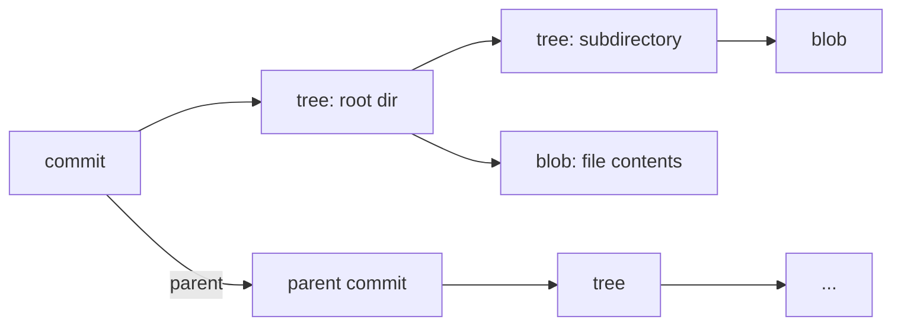
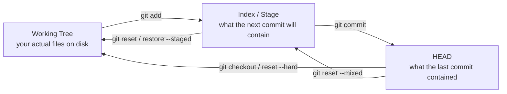

# Git Deep Dive

A practical guide to Git focused on understanding the internals well enough to use the tool fluently and recover from anything. Assumes you can commit, push, pull, and branch. Skips the tutorial-level material and goes straight to the machinery, the workflows that matter, and the recovery techniques that save your work.

Primary references: [Pro Git (free book)](https://git-scm.com/book/en/v2), [Git Reference](https://git-scm.com/docs), [Git Internals](https://git-scm.com/book/en/v2/Git-Internals-Plumbing-and-Porcelain)

---

## Table of Contents

1. [The Object Model](#1-the-object-model)
2. [Refs, HEAD & the Ref Log](#2-refs-head--the-ref-log)
3. [The Index (Staging Area)](#3-the-index-staging-area)
4. [Commits in Depth](#4-commits-in-depth)
5. [Branching & Merging](#5-branching--merging)
6. [Rebasing](#6-rebasing)
7. [Cherry-Pick](#7-cherry-pick)
8. [Reset, Restore & Revert](#8-reset-restore--revert)
9. [Stash](#9-stash)
10. [The Reflog — Your Safety Net](#10-the-reflog--your-safety-net)
11. [Interactive Rebase](#11-interactive-rebase)
12. [Worktrees](#12-worktrees)
13. [Remotes & Fetch vs Pull](#13-remotes--fetch-vs-pull)
14. [Tags](#14-tags)
15. [Diff, Log & Blame](#15-diff-log--blame)
16. [Bisect](#16-bisect)
17. [Hooks](#17-hooks)
18. [Submodules & Subtrees](#18-submodules--subtrees)
19. [Rewriting History](#19-rewriting-history)
20. [Configuration That Matters](#20-configuration-that-matters)
21. [Recovery Recipes](#21-recovery-recipes)
22. [Common Mistakes](#22-common-mistakes)

---

## 1. The Object Model

Reference: [Git Objects](https://git-scm.com/book/en/v2/Git-Internals-Git-Objects)

Git is a content-addressable filesystem. Everything is stored as objects in `.git/objects/`, identified by their SHA-1 hash. There are four object types:

### Blobs — File Contents

A blob stores the contents of a single file. It has no filename, no permissions — just raw content.

```bash
# see the hash of a file's current contents
git hash-object README.md

# see the contents of a blob
git cat-file -p <hash>
```

Two files with identical contents share the same blob, even across commits and branches. Git deduplicates automatically.

### Trees — Directories

A tree maps filenames to blobs (files) and other trees (subdirectories):

```bash
git cat-file -p HEAD^{tree}
# 100644 blob a1b2c3...   README.md
# 100644 blob d4e5f6...   main.py
# 040000 tree 7a8b9c...   src/
```

The `100644` is the file mode (regular file). `040000` is a directory. `100755` is executable.

### Commits — Snapshots

A commit points to a tree (the root directory at that moment), one or more parent commits, and metadata:

```bash
git cat-file -p HEAD
# tree 4b825dc...
# parent 8a7b6c5...
# author Alice <alice@example.com> 1700000000 -0500
# committer Alice <alice@example.com> 1700000000 -0500
#
# Fix the login bug
```

A commit is a snapshot of the entire repository, not a diff. Git reconstructs diffs by comparing the trees of two commits.

### Tags — Named Objects

An annotated tag is an object that points to a commit with a message, tagger, and optional GPG signature. Lightweight tags are just refs (see Section 2).

### The Whole Picture



Every commit captures the full state of the repository through its tree. Branches, tags, and HEAD are just pointers to commits.

### Why This Matters

- **Nothing is ever truly lost** until garbage collection runs. If you know a commit's hash, you can get it back.
- **Git is fast** because comparing two snapshots is just comparing tree hashes — if the hash is the same, the entire subtree is identical, no need to recurse.
- **Branches are cheap** — creating a branch is writing 41 bytes to a file (the hash).
- **Understanding the object model makes every other Git concept obvious.** A merge is just a commit with two parents. A rebase is copying commits to new parents. A reset is moving a pointer.

```quiz
Q: Two branches both contain an identical, unchanged 500-line file. How many times is that file's content stored in `.git/objects`?
- [ ] Once per branch, so twice
- [x] Once — a blob is addressed by the hash of its contents, so identical content deduplicates automatically
- [ ] Once per commit that references it
- [ ] It depends on the file mode
> Git is content-addressable: a blob's identity *is* the SHA-1 of its bytes, with no filename or path attached. Identical content produces an identical hash and therefore a single stored object, shared across every commit, branch, and path that references it. This is why branching and copying files is cheap.

Q: A commit stores a tree pointer, not a diff. So how does `git show` produce a diff for that commit?
- [ ] It reads a stored patch from the commit object
- [x] Git reconstructs the diff on the fly by comparing the commit's tree to its parent's tree
- [ ] It replays the reflog
- [ ] Diffs are cached in `.git/diffs`
> Each commit is a full snapshot — it points to a tree representing the entire repository state. Git computes diffs by comparing two trees, and because identical subtrees share a hash, it can skip any subtree whose hash matches and only recurse where things changed. That tree-hash comparison is also why Git is fast.

Q: Why is creating a branch in Git essentially free?
- [ ] It copies the working tree into a new directory
- [ ] It duplicates all reachable commit objects
- [x] A branch is just a ref — a file containing a 40-char commit hash — so creating one writes ~41 bytes
- [ ] It compresses history into a pack file
> Branches, tags, and HEAD are all just pointers to commits. Creating a branch writes a tiny ref file holding one commit hash; no objects are copied. The same insight explains the rest of Git: a merge is a commit with two parents, a rebase copies commits onto new parents, and a reset just moves a pointer.
```

---

## 2. Refs, HEAD & the Ref Log

Reference: [Git References](https://git-scm.com/book/en/v2/Git-Internals-Git-References)

### Refs Are Just Pointers

A ref is a file containing a commit hash:

```bash
cat .git/refs/heads/main
# 8a7b6c5d4e3f2a1b0c9d8e7f6a5b4c3d2e1f0a9b

cat .git/refs/tags/v1.0.0
# 1a2b3c4d5e6f7a8b9c0d1e2f3a4b5c6d7e8f9a0b
```

That's all a branch is — a file containing 40 hex characters. Creating a branch is writing a new file. Deleting a branch is removing it. Moving a branch is changing the hash in the file.

### HEAD

`HEAD` is a special ref that points to the current branch (or directly to a commit in detached state):

```bash
cat .git/HEAD
# ref: refs/heads/main    ← normal: HEAD points to a branch

# or in detached HEAD state:
# 8a7b6c5d4e3f2a1b0c9d8e7f6a5b4c3d2e1f0a9b
```

When you commit, Git:
1. Creates a new commit object whose parent is the commit HEAD currently points to
2. Updates the branch ref that HEAD points to → the new commit

This is why committing on a detached HEAD doesn't update any branch.

### Ref Syntax

Git has a rich syntax for referring to commits relative to refs:

| Syntax | Meaning |
|---|---|
| `HEAD` | Current commit |
| `HEAD~1` or `HEAD~` | Parent of HEAD |
| `HEAD~3` | Great-grandparent of HEAD (3 commits back) |
| `HEAD^` | First parent (same as `HEAD~1` for non-merge commits) |
| `HEAD^2` | Second parent (the merged branch's tip) |
| `main` | Tip of the main branch |
| `origin/main` | Last known tip of main on the remote |
| `HEAD@{2}` | Where HEAD was 2 moves ago (reflog) |
| `main@{yesterday}` | Where main pointed yesterday |
| `@{-1}` | The branch you were on before the last checkout |

```bash
# these are all equivalent ways to see a commit
git show HEAD~1
git show main~1
git show abc1234
```

### Detached HEAD

You're in detached HEAD state when HEAD points directly to a commit instead of a branch:

```bash
# these put you in detached HEAD
git checkout abc1234
git checkout v1.0.0
git checkout origin/main
```

Any commits you make won't be on a branch. If you switch away, they become unreachable (but recoverable via the reflog). To keep them, create a branch:

```bash
git checkout -b my-branch
```

---

## 3. The Index (Staging Area)

Reference: [Git Staging Area](https://git-scm.com/book/en/v2/Git-Basics-Recording-Changes-to-the-Repository)

The index is the staging area between your working tree and the next commit. It's a binary file at `.git/index` that contains the list of files, their modes, sizes, timestamps, and blob hashes.

### Three Trees Model

Git operates on three trees simultaneously:



```bash
# see the difference between working tree and index
git diff

# see the difference between index and HEAD
git diff --staged   # (or --cached, same thing)

# see the difference between working tree and HEAD
git diff HEAD
```

### Staging Granularly

```bash
# stage everything in a file
git add file.py

# stage hunks interactively
git add -p file.py
# y = stage this hunk
# n = skip
# s = split into smaller hunks
# e = manually edit the hunk

# stage parts of a new (untracked) file
git add -N file.py   # track the file but don't stage content
git add -p file.py   # now -p works on the new file
```

`git add -p` is the single most useful Git feature for clean commits. It lets you commit logically related changes even when you've made multiple unrelated edits to the same file.

### Unstaging

```bash
# unstage a file (keep changes in working tree)
git restore --staged file.py

# unstage everything
git restore --staged .

# the old way (still works)
git reset HEAD file.py
```

### The Index and Merge Conflicts

During a conflict, the index holds three versions of each conflicted file:

| Stage | Meaning |
|---|---|
| Stage 1 | Common ancestor (base) |
| Stage 2 | Ours (current branch) |
| Stage 3 | Theirs (incoming branch) |

```bash
# see all stages during a conflict
git ls-files -u
# 100644 abc1234 1  file.py    ← base
# 100644 def5678 2  file.py    ← ours
# 100644 9ab0cde 3  file.py    ← theirs

# check out a specific side
git checkout --ours file.py
git checkout --theirs file.py
```

When you `git add` a conflicted file, the three stages collapse into stage 0 (resolved).

```quiz
Q: You've edited a file but `git diff` shows nothing, while `git diff --staged` shows your changes. What does that tell you?
- [ ] The file is untracked
- [x] Your changes are already staged — `git diff` compares working tree to index, `--staged` compares index to HEAD
- [ ] The file is in a merge conflict
- [ ] Git is misconfigured
> `git diff` (no args) shows working-tree-vs-index, so it's empty once changes are staged; `git diff --staged` shows index-vs-HEAD, i.e. what the next commit will contain. The three-trees model — working tree, index, HEAD — is exactly what these two diffs let you inspect, and `git diff HEAD` shows the combined working-tree-vs-last-commit difference.

Q: You made several unrelated edits to one file and want two clean, separate commits. Which tool is built for that?
- [ ] `git stash`
- [x] `git add -p`, which stages individual hunks so one file's edits can be split across commits
- [ ] `git commit --amend`
- [ ] `git reset --hard`
> `git add -p` walks you through each hunk (with split and edit options), letting you stage only the changes belonging to one logical commit even though they live in the same file. It's the canonical way to keep commits coherent when your working tree mixes unrelated work — the alternative of committing the whole file forces unrelated changes together.

Q: During a merge conflict, what does the index hold for each conflicted file?
- [ ] Just your version until you resolve it
- [x] Three versions — stage 1 (base/ancestor), stage 2 (ours), stage 3 (theirs) — which collapse to stage 0 when you `git add` the resolution
- [ ] A single merged blob with conflict markers
- [ ] Nothing; conflicts live only in the working tree
> The index represents a conflict by holding all three inputs simultaneously: the common ancestor, your side, and the incoming side. That's what lets `git checkout --ours/--theirs` pick a side and tools reconstruct a three-way merge. Staging the resolved file collapses those three stages into the normal stage-0 entry, marking it resolved.
```

---

## 4. Commits in Depth

### Anatomy of a Commit

Every commit contains exactly:
- A pointer to a tree (snapshot of the repository)
- Zero or more parent pointers (zero for the initial commit, one for normal commits, two+ for merges)
- Author (who wrote the change) — name, email, timestamp
- Committer (who applied the change) — name, email, timestamp
- Message

Author and committer differ when patches are emailed (author is the writer, committer is the applier) or after a rebase (author is preserved, committer changes).

### Writing Good Commit Messages

```
Short summary line (50 chars or less)

Longer explanation of WHY this change was made. Wrap at 72 characters.
Explain the problem this solves, not what the code does (the diff
shows that). Reference issues if relevant.

Fixes #42
```

The 50/72 convention exists because `git log --oneline`, GitHub, and many tools truncate or wrap at these widths.

### Empty Commits

```bash
# create a commit with no file changes (useful for triggering CI)
git commit --allow-empty -m "Trigger rebuild"
```

### Signing Commits

```bash
# configure GPG signing
git config --global commit.gpgsign true
git config --global user.signingkey <key-id>

# or use SSH signing (simpler, works with GitHub)
git config --global gpg.format ssh
git config --global user.signingkey ~/.ssh/id_ed25519.pub

# verify a commit's signature
git verify-commit HEAD
git log --show-signature
```

---

## 5. Branching & Merging

Reference: [Branching and Merging](https://git-scm.com/book/en/v2/Git-Branching-Basic-Branching-and-Merging)

### Branch Operations

```bash
# create a branch
git branch feature

# create and switch to it
git switch -c feature
git checkout -b feature     # older equivalent

# switch branches
git switch main
git checkout main           # older equivalent

# rename a branch
git branch -m old-name new-name

# delete a merged branch
git branch -d feature

# delete an unmerged branch (force)
git branch -D feature

# list branches
git branch          # local
git branch -r       # remote-tracking
git branch -a       # all
git branch -v       # with last commit
git branch --merged # branches merged into current
```

### Merge Strategies

When you run `git merge feature`, Git chooses a strategy:

**Fast-Forward** — when the current branch hasn't diverged:

```
Before:  main ──A──B     feature ──C──D
After:   main ──A──B──C──D
```

No merge commit. The branch pointer just moves forward. The history is linear.

```bash
# force a merge commit even if fast-forward is possible
git merge --no-ff feature

# only merge if fast-forward is possible
git merge --ff-only feature
```

**Three-Way Merge** — when both branches have new commits:

```
Before:  main ──A──B──E
                  \
         feature   C──D

After:   main ──A──B──E──M    (M is the merge commit)
                  \      /
         feature   C──D
```

Git finds the common ancestor (A), then combines the changes from both branches.

**Recursive** (default for two-way merges) handles the case where the common ancestor itself has multiple merge bases by recursively merging the bases.

### Merge Conflicts

A conflict happens when both branches modified the same lines:

```
<<<<<<< HEAD
our version of the code
=======
their version of the code
>>>>>>> feature
```

Resolution workflow:

```bash
# 1. see which files are conflicted
git status

# 2. edit each conflicted file — remove the markers, keep the right code

# 3. mark as resolved
git add resolved-file.py

# 4. complete the merge
git commit

# or abort the whole merge
git merge --abort
```

### Merge Tools

```bash
# use a visual merge tool
git mergetool

# configure a default tool
git config --global merge.tool vimdiff
# or: meld, kdiff3, opendiff, vscode
```

### Squash Merge

Collapse an entire branch into a single commit on the target branch:

```bash
git merge --squash feature
git commit -m "Add feature X"
```

The feature branch's individual commits don't appear in the target branch's history. Useful for keeping a clean main history from messy feature branches.

**Trade-off**: you lose the granular commit history. The feature branch technically isn't "merged" in Git's eyes (`git branch --merged` won't list it), so you need to delete it manually.

---

## 6. Rebasing

Reference: [Git Rebasing](https://git-scm.com/book/en/v2/Git-Branching-Rebasing)

Rebase replays commits from one branch onto another, creating new commits with new hashes but the same changes:

```
Before:  main ──A──B──E
                  \
         feature   C──D

After:   main ──A──B──E
                       \
         feature        C'──D'   (C' and D' are new commits)
```

```bash
# rebase feature onto the tip of main
git switch feature
git rebase main

# or, equivalently
git rebase main feature
```

### Why Rebase

- **Linear history**: the feature branch's commits appear as if they were written after main's latest commit. No merge commits.
- **Easier code review**: each commit in a PR applies cleanly on top of the base branch.
- **Cleaner `git log`**: one straight line instead of a tangle of merge commits.

### When NOT to Rebase

**Never rebase commits that have been pushed and shared.** Rebasing rewrites history — it creates new commits with different hashes. If someone else has the old commits, their history diverges from yours.

The rule: **rebase local commits before pushing. Merge after pushing.**

### Handling Rebase Conflicts

```bash
git rebase main
# CONFLICT in file.py

# 1. resolve the conflict in file.py
# 2. stage the resolution
git add file.py

# 3. continue rebasing
git rebase --continue

# or abort and go back to where you were
git rebase --abort

# or skip this commit entirely
git rebase --skip
```

During a rebase, you might resolve the same conflict multiple times if multiple commits touch the same lines. `git rerere` (Section 20) can automate this.

### Rebase onto

Transplant a branch from one base to another:

```bash
# move feature from branching off develop to branching off main
git rebase --onto main develop feature
```

```
Before:  main ──A──B
                  \
         develop   C──D
                        \
         feature         E──F

After:   main ──A──B──E'──F'    (feature is now based on main)
         develop ──C──D          (unchanged)
```

```quiz
Q: Why does `git rebase main` produce commits with *new* hashes even though the changes are identical?
- [ ] Rebase recompiles the diffs
- [x] A commit's hash includes its parent, so replaying commits onto a new base changes their parents and therefore their hashes
- [ ] Git randomizes hashes on rebase
- [ ] The author timestamp is removed
> A commit object hashes its tree, parent(s), author, and message — so changing the parent (which rebase does by replaying commits onto a new base) yields a different hash even when the tree change is the same. That's why `C` and `D` become `C'` and `D'`: same changes, new identities. It's also exactly why rebasing shared commits is dangerous.

Q: What's the rule of thumb for when rebasing is safe versus when to merge?
- [ ] Always rebase; merge is obsolete
- [x] Rebase local commits before pushing; merge after pushing — because rebasing rewrites history others may already have
- [ ] Always merge; rebase corrupts history
- [ ] Rebase only on the main branch
> Rebasing rewrites history by creating new commits, so if collaborators already have the old commits, your histories diverge and they're forced into painful recovery. The discipline is to clean up your own unpushed commits with rebase, then once they're shared, integrate with merge (which adds a commit rather than rewriting). "Rebase local, merge shared" captures it.

Q: What does `git rebase --onto main develop feature` do?
- [ ] Merges develop into main
- [x] Transplants `feature`'s commits so they branch off `main` instead of `develop`, leaving develop unchanged
- [ ] Deletes the develop branch
- [ ] Rebases main onto feature
> The three-argument form transplants a branch from one base to another: it takes the commits unique to `feature` (those after `develop`) and replays them onto `main`. This is how you re-parent a feature that was accidentally branched off the wrong base, without disturbing `develop` itself.
```

---

## 7. Cherry-Pick

Reference: [git-cherry-pick](https://git-scm.com/docs/git-cherry-pick)

Cherry-pick applies the changes from a specific commit onto the current branch:

```bash
# apply a single commit
git cherry-pick abc1234

# apply multiple commits
git cherry-pick abc1234 def5678

# apply a range (exclusive start, inclusive end)
git cherry-pick abc1234..def5678

# apply without committing (stage the changes)
git cherry-pick --no-commit abc1234
```

### When to Cherry-Pick

- **Hotfixes**: apply a fix from a development branch to a release branch
- **Backports**: bring a specific feature commit back to an older version
- **Selective merges**: when you want one commit from a branch but not the rest

### When NOT to Cherry-Pick

- When a regular merge or rebase would work — cherry-pick creates duplicate commits (same change, different hashes). If both branches are later merged, you get the same change applied twice (Git usually handles this cleanly, but not always).

---

## 8. Reset, Restore & Revert

These three commands sound similar but do fundamentally different things.

### `git reset` — Move the Branch Pointer

Reference: [git-reset](https://git-scm.com/docs/git-reset)

`reset` moves the current branch pointer to a different commit. The three modes control what happens to the index and working tree:

| Mode | Branch pointer | Index (staging) | Working tree |
|---|---|---|---|
| `--soft` | Moves | Unchanged | Unchanged |
| `--mixed` (default) | Moves | Reset to match commit | Unchanged |
| `--hard` | Moves | Reset to match commit | Reset to match commit |

```bash
# undo the last commit but keep changes staged
git reset --soft HEAD~1

# undo the last commit and unstage changes (keep in working tree)
git reset HEAD~1

# undo the last commit and discard all changes (destructive!)
git reset --hard HEAD~1

# unstage a file (doesn't touch working tree)
git reset HEAD file.py
```

**`--soft`** is useful when you want to redo a commit (wrong message, forgot a file, want to squash several commits into one).

**`--hard`** is destructive — uncommitted changes are gone (but committed changes are recoverable via the reflog).

### `git restore` — Restore File Contents

Reference: [git-restore](https://git-scm.com/docs/git-restore)

`restore` operates on files, not branches. It's the modern replacement for the file-targeting uses of `git checkout`:

```bash
# discard working tree changes (restore from index)
git restore file.py

# discard changes to all tracked files
git restore .

# restore from a specific commit
git restore --source HEAD~3 file.py

# unstage a file (restore index from HEAD)
git restore --staged file.py

# restore both index and working tree from a commit
git restore --source HEAD~1 --staged --worktree file.py
```

### `git revert` — Undo a Commit Safely

Reference: [git-revert](https://git-scm.com/docs/git-revert)

`revert` creates a **new commit** that undoes the changes of a previous commit. It doesn't rewrite history — safe for shared branches:

```bash
# revert a single commit
git revert abc1234

# revert without auto-committing
git revert --no-commit abc1234

# revert a merge commit (must specify which parent to keep)
git revert -m 1 <merge-commit>
# -m 1 = keep the first parent (the branch you merged INTO)
# -m 2 = keep the second parent (the branch you merged FROM)
```

### When to Use Which

| Situation | Command |
|---|---|
| Undo last commit, redo it differently | `git reset --soft HEAD~1` |
| Completely discard last N commits (local only) | `git reset --hard HEAD~N` |
| Undo a commit on a shared branch | `git revert <hash>` |
| Discard uncommitted changes to a file | `git restore file.py` |
| Unstage a file | `git restore --staged file.py` |

```quiz
Q: You want to undo your last commit but keep all its changes staged so you can recommit with a better message. Which reset mode?
- [x] `git reset --soft HEAD~1` — moves the branch pointer but leaves index and working tree untouched
- [ ] `git reset --hard HEAD~1`
- [ ] `git reset --mixed HEAD~1`
- [ ] `git revert HEAD`
> `--soft` moves only the branch pointer back, leaving the index (and working tree) exactly as they were — so the commit's changes remain staged, ready to recommit. `--mixed` (the default) would additionally unstage them, and `--hard` would discard them entirely. `revert` is wrong here because it makes a *new* commit rather than undoing the last one.

Q: Why is `git revert` the right tool to undo a commit that's already pushed to a shared branch, where `git reset --hard` is wrong?
- [ ] revert is faster
- [x] revert creates a new commit that inverts the change without rewriting history; reset moves the pointer, rewriting history others have already pulled
- [ ] reset doesn't work on remote branches
- [ ] revert automatically force-pushes
> On a shared branch, rewriting history (what `reset --hard` does by moving the pointer to drop commits) breaks everyone who already has those commits, forcing painful recovery. `revert` instead appends a new commit that undoes the target's changes, leaving history intact and fast-forwardable for collaborators. Reset is for local-only cleanup; revert is for shared branches.

Q: You ran `git reset --hard HEAD~3` and realize you needed those three commits. Are they gone?
- [ ] Yes, `--hard` permanently deletes commits
- [x] No — committed work is recoverable via the reflog until garbage collection prunes it
- [ ] Only if you hadn't pushed them
- [ ] Only the most recent one is recoverable
> `--hard` discards *uncommitted* changes irretrievably, but the three commits still exist as objects; the branch pointer just no longer references them. The reflog records where HEAD was before the reset, so you can find those commit hashes and reset back. This is why "nothing is truly lost until gc runs" — the object model keeps unreachable commits around for a grace period.
```

---

## 9. Stash

Reference: [git-stash](https://git-scm.com/docs/git-stash)

Stash temporarily shelves uncommitted changes so you can work on something else:

```bash
# stash everything (tracked files with changes)
git stash

# stash with a description
git stash push -m "work in progress on login flow"

# stash including untracked files
git stash -u

# stash including untracked AND ignored files
git stash -a

# stash specific files
git stash push -m "partial work" file1.py file2.py

# stash interactively (by hunk)
git stash push -p
```

### Retrieving Stashes

```bash
# list stashes
git stash list
# stash@{0}: On main: work in progress on login flow
# stash@{1}: WIP on feature: abc1234 Fix header

# apply the most recent stash (keep it in the stash list)
git stash apply

# apply and remove from list
git stash pop

# apply a specific stash
git stash apply stash@{2}

# see what's in a stash
git stash show stash@{0}       # summary
git stash show -p stash@{0}    # full diff
```

### Stash Cleanup

```bash
# drop a specific stash
git stash drop stash@{1}

# clear all stashes
git stash clear
```

### Stash to a Branch

If a stash conflicts with the current state, apply it to a new branch:

```bash
git stash branch new-feature stash@{0}
# creates the branch, checks out the commit from when you stashed,
# applies the stash, and drops it
```

### Practical Pattern: Quick Context Switch

```bash
# you're mid-work on feature, need to fix a bug on main
git stash push -m "feature WIP"
git switch main
# ... fix the bug, commit ...
git switch feature
git stash pop
```

---

## 10. The Reflog — Your Safety Net

Reference: [git-reflog](https://git-scm.com/docs/git-reflog)

The reflog records every time HEAD or a branch ref moves. It's local to your machine and is the primary recovery mechanism for "I lost my commits."

```bash
# see HEAD's movement history
git reflog
# abc1234 HEAD@{0}: commit: Add login page
# def5678 HEAD@{1}: checkout: moving from main to feature
# 9ab0cde HEAD@{2}: reset: moving to HEAD~3
# 1234567 HEAD@{3}: commit: The commit you "lost"

# see a specific branch's reflog
git reflog show main

# see reflog with timestamps
git reflog --date=relative
```

### Recovery Examples

```bash
# you ran git reset --hard and lost commits
git reflog
# find the commit hash from before the reset
git reset --hard HEAD@{3}   # go back to that state

# you deleted a branch
git reflog
# find the commit hash that was the branch tip
git branch recovered-branch abc1234

# you rebased and want the pre-rebase version
git reflog
# the entry before the rebase shows where the branch was
git reset --hard HEAD@{5}
```

### Reflog Expiration

Reflog entries expire after 90 days by default (30 days for unreachable commits). Until then, nothing is truly lost:

```bash
# check expiration settings
git config gc.reflogExpire          # default: 90 days
git config gc.reflogExpireUnreachable  # default: 30 days
```

```quiz
Q: After a bad `git rebase` you can't find your pre-rebase commits via `git log`. Why does the reflog still recover them?
- [ ] The reflog stores a backup copy of every commit's diff
- [x] The reflog records every position HEAD/branch refs held, so the pre-rebase commit hash is still listed even though no branch points to it
- [ ] The reflog re-downloads them from the remote
- [ ] `git log` is broken after a rebase
> `git log` only shows commits reachable from current refs, so rebased-away commits become invisible to it — but they still exist as objects, and the reflog records each previous ref position. Finding the `HEAD@{n}` entry from before the rebase gives you the hash to `git reset --hard` back to. The reflog is local-only and is the primary "I lost my commits" recovery tool.

Q: Why is the reflog described as local and temporary rather than a permanent history?
- [ ] It's stored on the remote and synced down
- [x] It lives only in your repository and entries expire (≈90 days, 30 for unreachable), after which gc can prune the objects
- [ ] It's deleted on every commit
- [ ] It only records merges
> The reflog is your machine's record of where refs moved; it isn't pushed or shared, and a teammate's clone has its own. Entries expire on a timer (default 90 days, 30 for unreachable commits), and once expired the unreachable objects become eligible for garbage collection. So it's a generous safety net, not an eternal archive — recover lost work promptly rather than assuming it's there forever.
```

---

## 11. Interactive Rebase

Reference: [Rewriting History](https://git-scm.com/book/en/v2/Git-Tools-Rewriting-History)

Interactive rebase lets you edit, reorder, squash, split, and drop commits before pushing:

```bash
# rebase the last 5 commits interactively
git rebase -i HEAD~5

# rebase everything since branching from main
git rebase -i main
```

This opens an editor with a list of commits:

```
pick abc1234 Add user model
pick def5678 Fix typo in user model
pick 9ab0cde Add user controller
pick 1234567 WIP debugging
pick fedcba9 Add user tests
```

### Commands

| Command | What it does |
|---|---|
| `pick` | Keep the commit as-is |
| `reword` | Keep the commit, edit the message |
| `edit` | Stop at this commit so you can amend it |
| `squash` | Meld into previous commit, combine messages |
| `fixup` | Meld into previous commit, discard this message |
| `drop` | Delete this commit entirely |

### Practical: Clean Up Before a PR

```
# original (messy development history)
pick abc1234 Add user model
pick def5678 Fix typo in user model
pick 9ab0cde Add user controller
pick 1234567 WIP debugging
pick fedcba9 Add user tests

# cleaned up
pick abc1234 Add user model
fixup def5678 Fix typo in user model       ← fold typo fix into the original
pick 9ab0cde Add user controller
drop 1234567 WIP debugging                 ← remove debugging commit
pick fedcba9 Add user tests
```

Result: three clean, logical commits instead of five messy ones.

### Splitting a Commit

Use `edit` to stop at a commit, then split it:

```bash
git rebase -i HEAD~3
# mark the target commit as "edit"

# when rebase stops at that commit:
git reset HEAD~1          # undo the commit, keep changes in working tree
git add model.py
git commit -m "Add user model"
git add controller.py
git commit -m "Add user controller"
git rebase --continue
```

### Autosquash

Name your fixup commits with `fixup!` or `squash!` prefix, and `--autosquash` reorders them automatically:

```bash
# make a fixup commit that targets "Add user model"
git commit --fixup abc1234

# or with a message
git commit --squash abc1234

# rebase with autosquash — fixup commits are moved next to their targets
git rebase -i --autosquash main
```

```bash
# enable autosquash by default
git config --global rebase.autosquash true
```

---

## 12. Worktrees

Reference: [git-worktree](https://git-scm.com/docs/git-worktree)

Worktrees let you check out multiple branches simultaneously in separate directories, sharing a single `.git` repository:

```bash
# create a worktree for a branch
git worktree add ../hotfix-branch hotfix/urgent

# create a worktree with a new branch
git worktree add -b feature/new-thing ../new-thing main

# list worktrees
git worktree list

# remove a worktree
git worktree remove ../hotfix-branch
```

### When to Use Worktrees

- **Reviewing a PR while mid-work**: don't stash — open the PR branch in a separate directory
- **Running tests on one branch while developing on another**
- **Comparing behavior across branches** side by side
- **Long-running builds**: start a build in one worktree, continue coding in another

### Worktrees vs Stash

| | Worktree | Stash |
|---|---|---|
| Context switch cost | None — both branches open | Must stash, switch, then pop |
| Disk usage | Duplicate working tree | None |
| Parallel work | Yes | No |
| IDE support | Open as separate project | N/A |

Worktrees are strictly better for anything more than a 30-second context switch.

---

## 13. Remotes & Fetch vs Pull

Reference: [Working with Remotes](https://git-scm.com/book/en/v2/Git-Basics-Working-with-Remotes)

The single idea that demystifies all of Git's remote handling is that **a remote-tracking branch like `origin/main` is a local snapshot, not a live connection.** It is an ordinary ref in your own repository that records "where `main` was on the remote *the last time I checked*," and it changes only when you explicitly sync. Git is fundamentally distributed — your clone is a complete repository with its own full history, not a thin view onto a server — so there is no continuous link to the remote, and every interaction with it is a discrete, manual transfer. Hold that and the otherwise-confusing distinctions below become obvious: they are all just questions of *when* you copy commits between your repository and the remote's, and *what* you do with them once copied.

### Remote Tracking Branches

When you clone a repo, Git creates **remote-tracking branches** — read-only refs like `origin/main` that represent the state of branches on the remote as of the last fetch:

```bash
# see remote-tracking branches
git branch -r
# origin/main
# origin/feature-a
# origin/feature-b

# see what a remote-tracking branch points to
git log origin/main --oneline -5
```

These only update when you `fetch` or `pull`. They're not live connections.

### Fetch vs Pull

```bash
# fetch: download new commits from remote, update remote-tracking branches
# does NOT touch your working tree or local branches
git fetch origin

# pull: fetch + merge (or rebase) into current branch
git pull origin main
# equivalent to:
git fetch origin
git merge origin/main

# pull with rebase instead of merge
git pull --rebase origin main
# equivalent to:
git fetch origin
git rebase origin/main
```

The distinction between fetch and pull is worth understanding rather than memorizing, because it is the source of most remote-related confusion. **`git fetch` is always safe** precisely because of the snapshot model above: it downloads new commits from the remote and updates your remote-tracking branches (`origin/main` moves forward), but it touches *nothing* you're working on — not your local `main`, not your working tree, not your index. After a fetch, your work is exactly as it was, and you've simply learned what the remote now looks like; you can inspect the difference (`git log main..origin/main`) and decide what to do at your leisure. **`git pull` is fetch plus an immediate integration** — it fetches and then merges (or, with `--rebase`, rebases) the remote's new commits into your current branch in one step, which is convenient but conflates "find out what changed" with "integrate it now," and the integration is where conflicts and surprises live. The professional habit many engineers adopt is to `fetch` first, look at what arrived, then integrate deliberately — turning one unpredictable command into two predictable ones. The choice between `pull`'s merge and `pull --rebase` is the same merge-vs-rebase decision from sections 5 and 6, applied to keeping your branch current: merge preserves the true history with a merge commit, rebase replays your local commits on top of the remote's for a linear history; `git config --global pull.rebase true` makes rebase the default if you prefer linear.

### Remote Management

```bash
# list remotes
git remote -v

# add a remote
git remote add upstream https://github.com/original/repo.git

# remove a remote
git remote remove upstream

# rename a remote
git remote rename origin old-origin

# prune remote-tracking branches for deleted remote branches
git fetch --prune
# or configure automatic pruning
git config --global fetch.prune true
```

### Push

```bash
# push current branch
git push

# push and set upstream tracking
git push -u origin feature

# push a specific branch
git push origin feature

# push all branches
git push --all

# push tags
git push --tags
git push origin v1.0.0

# delete a remote branch
git push origin --delete feature
```

### Force Push — When and How

```bash
# force push (dangerous — overwrites remote history)
git push --force

# force push with lease (safer — fails if remote has commits you haven't seen)
git push --force-with-lease
```

`--force-with-lease` checks that the remote branch still points where your remote-tracking branch says it does. If someone else pushed in the meantime, it fails instead of silently overwriting their work.

**Use `--force-with-lease` instead of `--force` whenever you must force-push** (e.g., after an interactive rebase on a feature branch).

### Upstream Tracking

```bash
# see tracking configuration
git branch -vv
# * feature  abc1234 [origin/feature: ahead 2] Latest commit
#   main     def5678 [origin/main] Up to date

# set upstream for existing branch
git branch --set-upstream-to=origin/feature

# push and set upstream at the same time
git push -u origin feature
```

```quiz
Q: What does `origin/main` actually represent in your local repository?
- [ ] A live connection to the remote's main branch
- [x] A local snapshot ref recording where the remote's main was as of your last fetch — it only moves when you sync
- [ ] The remote server's working directory
- [ ] An alias for your local main
> Git is distributed: your clone is a complete repository, and a remote-tracking branch like `origin/main` is just an ordinary local ref recording "where main was the last time I checked." It updates only on `fetch`/`pull`, never on its own. Internalizing this snapshot model is what makes every remote command obvious — they're all about *when* you copy commits and *what* you do with them.

Q: Why is `git fetch` always safe while `git pull` can produce surprises?
- [ ] fetch is read-only on the remote; pull writes to it
- [x] fetch only updates remote-tracking branches and touches nothing you're working on; pull additionally merges/rebases into your current branch, where conflicts live
- [ ] fetch is faster so there's less to go wrong
- [ ] pull skips the working tree
> `git fetch` downloads commits and advances refs like `origin/main`, leaving your local branch, index, and working tree untouched — so afterward you simply *know* what changed and can integrate at your leisure. `git pull` is fetch plus an immediate merge or rebase into your branch, conflating "find out what changed" with "integrate it now." Fetching first, inspecting, then integrating turns one unpredictable step into two predictable ones.

Q: Why prefer `git push --force-with-lease` over `git push --force` after rewriting a feature branch?
- [ ] It's faster
- [x] It fails if someone else pushed commits you haven't fetched, rather than silently overwriting their work
- [ ] It doesn't actually force-push
- [ ] It automatically merges the remote changes
> `--force-with-lease` checks that the remote branch still points where your remote-tracking ref says it does; if a teammate pushed in the meantime, the push is rejected instead of clobbering their commits. Plain `--force` overwrites unconditionally, which is how shared work gets lost. When a force-push is genuinely needed (e.g. after an interactive rebase), the lease variant is the safe default.
```

---

## 14. Tags

Reference: [Git Tagging](https://git-scm.com/book/en/v2/Git-Basics-Tagging)

### Lightweight vs Annotated

```bash
# lightweight — just a pointer to a commit (like a branch that doesn't move)
git tag v1.0.0

# annotated — a full object with tagger, date, message, optional signature
git tag -a v1.0.0 -m "Release 1.0.0"

# see tag details
git show v1.0.0
```

Use annotated tags for releases (they have metadata). Use lightweight tags for temporary markers.

### Tag Operations

```bash
# list tags
git tag
git tag -l "v1.*"       # filter

# tag a past commit
git tag -a v0.9.0 abc1234 -m "Pre-release"

# push tags (tags aren't pushed by default)
git push origin v1.0.0     # one tag
git push --tags             # all tags

# delete a tag
git tag -d v1.0.0                  # local
git push origin --delete v1.0.0    # remote

# checkout a tag (detached HEAD)
git checkout v1.0.0
```

### Semantic Versioning with Tags

```bash
# list tags sorted by version
git tag --sort=-v:refname

# find the most recent tag reachable from HEAD
git describe --tags
# v1.2.3-14-gabc1234
# = 14 commits after v1.2.3, at commit abc1234
```

---

## 15. Diff, Log & Blame

### `git diff`

```bash
# working tree vs index (unstaged changes)
git diff

# index vs HEAD (staged changes)
git diff --staged

# working tree vs HEAD (all uncommitted changes)
git diff HEAD

# between two commits
git diff abc1234 def5678

# between two branches
git diff main..feature
git diff main...feature    # changes since they diverged (three-dot)

# just file names
git diff --name-only
git diff --name-status     # with A/M/D status

# specific file
git diff HEAD~3 -- file.py

# word-level diff (useful for prose)
git diff --word-diff

# stat summary
git diff --stat
```

### Two-Dot vs Three-Dot

```bash
# two-dot: diff between the tips of two branches
git diff main..feature
# shows ALL differences between the two snapshots

# three-dot: changes on feature since it diverged from main
git diff main...feature
# shows only what feature added — excludes changes on main

# for git log, the meaning is reversed:
git log main..feature     # commits on feature but not on main
git log main...feature    # commits on either but not both
```

### `git log`

```bash
# compact one-line format
git log --oneline

# with graph
git log --oneline --graph --all

# show files changed per commit
git log --stat

# show full diff per commit
git log -p

# filter by author
git log --author="Alice"

# filter by date
git log --since="2024-01-01" --until="2024-06-01"

# filter by message content
git log --grep="login"

# filter by code changes (pickaxe — find commits that add/remove a string)
git log -S "function_name"

# filter by code changes (regex)
git log -G "def.*login"

# filter by file
git log -- src/auth.py

# commits on feature that aren't on main
git log main..feature

# pretty format
git log --pretty=format:"%h %an %ar %s"

# show merge commit parents
git log --first-parent     # only follow the first parent (mainline)
```

### `git blame`

```bash
# who changed each line and when
git blame file.py

# blame a specific range of lines
git blame -L 10,20 file.py

# ignore whitespace changes
git blame -w file.py

# detect lines moved from other files
git blame -C file.py

# detect lines moved from other files in the same commit
git blame -C -C file.py

# detect lines moved from any commit
git blame -C -C -C file.py

# show blame at a specific commit (before that commit's changes)
git blame abc1234^ -- file.py
```

### `git shortlog`

```bash
# commits per author (useful for release notes)
git shortlog -sn
#   142  Alice
#    89  Bob
#    23  Carol

# commits per author since a tag
git shortlog v1.0.0..HEAD
```

---

## 16. Bisect

Reference: [git-bisect](https://git-scm.com/docs/git-bisect)

`git bisect` is one of Git's most underused power tools, and understanding the algorithm behind it is what makes you reach for it instead of squinting at diffs for an afternoon. The problem it solves: a bug exists now, you know it didn't exist at some older commit, and somewhere in the hundreds of commits between "known good" and "known bad" is the one that introduced it. Reading every commit is O(n); **bisect finds the culprit in O(log n)** by binary search over history. You tell it one good commit and one bad commit, and it checks out the commit *halfway* between them; you test, tell it `good` or `bad`, and it halves the remaining range again — so 1,000 commits is found in about 10 tests instead of 1,000 reads. The conceptual requirement is that the bug be *monotonic* — once introduced it stays present — so that history divides cleanly into a "good" prefix and a "bad" suffix with a single boundary, which is the assumption binary search needs. The real multiplier is automation: if you can write a script that exits 0 when the code is good and non-zero when it's bad (a failing test, a reproduction command), `git bisect run ./test.sh` performs the entire search unattended and hands you the exact offending commit. The mental shift bisect teaches is that "which change broke this?" is not a question you answer by *reading* — it is a search you *run*, and Git turns your version history into the search space.

The mechanics — binary search through history to find which commit introduced a bug:

```bash
# start bisect
git bisect start

# mark the current commit as bad (has the bug)
git bisect bad

# mark a known good commit
git bisect good v1.0.0

# Git checks out the midpoint — test it, then:
git bisect good    # if this commit doesn't have the bug
git bisect bad     # if this commit has the bug

# Git narrows the range and checks out another midpoint
# repeat until Git identifies the exact commit

# done — go back to where you were
git bisect reset
```

### Automated Bisect

If you can write a script that returns 0 for good and non-zero for bad:

```bash
git bisect start HEAD v1.0.0
git bisect run ./test-for-bug.sh
```

```bash
# example: bisect to find which commit broke a test
git bisect start HEAD v1.0.0
git bisect run python -m pytest tests/test_login.py -x
```

Git runs the script at each midpoint automatically. For N commits, it finds the culprit in ~log₂(N) steps (1000 commits → ~10 tests).

### Skip

If a commit can't be tested (doesn't build, for example):

```bash
git bisect skip
```

---

## 17. Hooks

Reference: [Git Hooks](https://git-scm.com/book/en/v2/Customizing-Git-Git-Hooks)

Hooks are scripts that run at specific points in Git's workflow. They live in `.git/hooks/` (local, not committed) or can be shared via a hooks directory.

### Common Hooks

| Hook | When it runs | Common use |
|---|---|---|
| `pre-commit` | Before a commit is created | Linting, formatting, running fast tests |
| `commit-msg` | After message is entered | Enforce message format (e.g., conventional commits) |
| `prepare-commit-msg` | Before editor opens | Pre-fill commit message template |
| `pre-push` | Before push | Run full test suite |
| `post-merge` | After a merge completes | Install dependencies, run migrations |
| `post-checkout` | After checkout/switch | Install dependencies for the new branch |
| `pre-rebase` | Before rebase starts | Prevent rebasing published branches |

### Setting Up Hooks

```bash
# hooks are just executable scripts
cat > .git/hooks/pre-commit << 'EOF'
#!/bin/sh
npm run lint --quiet
EOF
chmod +x .git/hooks/pre-commit
```

### Sharing Hooks with the Team

Hooks in `.git/hooks/` aren't committed. To share them:

```bash
# option 1: configure a shared hooks directory
mkdir .githooks
# put hooks in .githooks/
git config core.hooksPath .githooks
# commit .githooks/ to the repo

# option 2: use a tool
# husky (Node.js) — most popular
npx husky init

# pre-commit (Python) — language-agnostic
pip install pre-commit
# configure .pre-commit-config.yaml
pre-commit install
```

### Bypassing Hooks

```bash
# skip pre-commit and commit-msg hooks
git commit --no-verify

# skip pre-push hooks
git push --no-verify
```

Useful for emergencies, but if you're bypassing hooks regularly, the hooks are either too slow or too aggressive.

---

## 18. Submodules & Subtrees

### Submodules

Reference: [Git Submodules](https://git-scm.com/book/en/v2/Git-Tools-Submodules)

Submodules are Git's most notoriously confusing feature, and the confusion evaporates once you understand precisely what the parent repository stores: **not the submodule's code, but a single pinned commit hash pointing into the submodule's separate history.** The parent repo records "at this path, check out the other repository *at exactly this commit*," and that's all — the two repositories remain entirely independent histories, and the parent just holds a pointer (a *gitlink*) to one specific commit in the child. Every famous submodule pain follows directly from this design. A fresh `git clone` of the parent gets the pointer but *not* the submodule's contents, leaving you with empty directories until you `git submodule update --init` to actually fetch the pinned commits — the "I cloned the repo but it's broken" surprise. Updating is two-sided: pulling the parent updates the *pointer* but not the checked-out submodule content unless you run `submodule update`, and changing the submodule means committing *inside* the submodule first and *then* committing the moved pointer in the parent — two commits in two repositories for one logical change. The reason to accept this complexity is exactly the pinning: a submodule locks a dependency to an audited, exact commit that cannot drift, which is genuinely valuable for vendored libraries or shared code where reproducibility matters. The reason teams often avoid it is that the two-repository dance is easy to get wrong, which is why the package-manager and monorepo alternatives exist. Knowing that the parent stores only a commit pointer is the whole mental model; every command below is just managing that pointer and the separate repository it points into.

```bash
# add a submodule
git submodule add https://github.com/lib/library.git vendor/library

# clone a repo that has submodules
git clone --recurse-submodules https://github.com/myorg/myapp.git

# or initialize after cloning
git submodule update --init --recursive

# update submodule to latest remote commit
cd vendor/library
git pull
cd ../..
git add vendor/library
git commit -m "Update library submodule"

# update all submodules
git submodule update --remote
```

**How it works**: Git stores two things — a `.gitmodules` file (URL and path) and a tree entry pointing to the submodule's exact commit hash. The submodule's repository is cloned into the path but is an independent Git repo.

**Pain points**:
- Everyone must run `git submodule update --init` after cloning
- Detached HEAD inside submodules catches people off guard
- Forgetting to push the submodule before pushing the parent leaves a broken reference
- Merge conflicts on submodule pointers are confusing

### Subtrees

Subtrees merge an external repository's history into your repository as a subdirectory:

```bash
# add a subtree
git subtree add --prefix=vendor/library https://github.com/lib/library.git main --squash

# pull updates
git subtree pull --prefix=vendor/library https://github.com/lib/library.git main --squash

# push changes back upstream
git subtree push --prefix=vendor/library https://github.com/lib/library.git main
```

**Trade-offs vs submodules**:

| | Submodules | Subtrees |
|---|---|---|
| Clone works out of the box | No (need `--recurse-submodules`) | Yes |
| External repo's history | Separate | Merged into yours |
| Update workflow | `submodule update` | `subtree pull` |
| Push changes upstream | Normal push from submodule dir | `subtree push` |
| Complexity for contributors | Higher | Lower |

Subtrees are simpler for most cases. Submodules are better when you need the external project to remain a distinct repository (e.g., you're developing it independently).

---

## 19. Rewriting History

Rewriting history feels dangerous because it *is* — but understanding exactly *why* turns it from a thing to fear into a tool with a clear rule for when it's safe. The object model from section 1 is the key: a commit is immutable and identified by the hash of its contents *including its parent*, so you can never truly "edit" a commit — every operation here (`amend`, `rebase`, `filter-repo`) actually creates *new* commits with new hashes and moves a branch ref to point at them, abandoning the old commits (which the reflog can still recover, section 10). Because the hash includes the parent, rewriting one commit changes the hash of *every commit after it*, since each descendant's parent pointer now refers to a different hash — which is why rebasing a ten-commit branch rewrites all ten.

This is also exactly why the cardinal rule exists: **never rewrite history that others have based work on.** When you rewrite commits you've already pushed and someone has pulled, you create a fork — they have the old commits, you have new ones with different hashes representing the "same" changes, and Git cannot tell they're related, so reconciling becomes a mess of duplicated commits and conflicts. The safe boundary is therefore *publication*: rewriting your own local, unpushed commits (tidying messages, squashing work-in-progress, reordering) is harmless and good practice, because nobody else has seen them; rewriting shared history is the act that breaks collaborators. The whole discipline reduces to that one line — clean up freely before you push, treat history as immutable after — and once you see that rewriting is really "make new commits and move the ref," both the power and the danger become concrete rather than mysterious.

### Amending the Last Commit

```bash
# change the message
git commit --amend -m "Better message"

# add forgotten files to the last commit
git add forgotten-file.py
git commit --amend --no-edit

# change the author
git commit --amend --author="Alice <alice@example.com>"
```

`--amend` replaces the last commit with a new one (new hash). Don't amend commits that have been pushed and shared.

### Filter-Repo (Replacing filter-branch)

[git-filter-repo](https://github.com/newren/git-filter-repo) is the modern tool for bulk history rewriting:

```bash
# install
pip install git-filter-repo

# remove a file from ALL history (accidentally committed secrets)
git filter-repo --invert-paths --path secrets.env

# remove a directory from all history
git filter-repo --invert-paths --path old-vendor/

# change author email across all history
git filter-repo --email-callback '
    return email.replace(b"old@example.com", b"new@example.com")
'

# extract a subdirectory into its own repo
git filter-repo --subdirectory-filter src/lib/
```

**`git filter-branch` is deprecated.** Use `git-filter-repo` instead — it's faster, safer, and handles edge cases correctly.

### Removing Sensitive Data

If you accidentally commit a secret:

```bash
# 1. rotate the secret immediately — it's in the reflog, push history, forks, CI logs

# 2. remove from history
git filter-repo --invert-paths --path .env

# 3. force-push all branches
git push --force --all

# 4. force-push all tags
git push --force --tags

# 5. ask GitHub/GitLab to garbage-collect (contact support for cached views)
```

The secret must be considered compromised regardless of history rewriting — anyone who cloned or forked the repo before the rewrite has it.

---

## 20. Configuration That Matters

Reference: [Git Configuration](https://git-scm.com/docs/git-config)

### Configuration Levels

```bash
# system — all users on this machine
git config --system

# global — this user, all repos
git config --global

# local — this repo only (default)
git config --local

# worktree — this worktree only
git config --worktree
```

Priority: worktree > local > global > system.

### Essential Settings

```bash
# identity
git config --global user.name "Your Name"
git config --global user.email "you@example.com"

# default branch name
git config --global init.defaultBranch main

# auto-prune deleted remote branches on fetch
git config --global fetch.prune true

# rebase on pull instead of merge
git config --global pull.rebase true

# auto-setup rebase for new branches that track a remote
git config --global branch.autoSetupRebase always

# enable rerere (reuse recorded resolution)
git config --global rerere.enabled true

# autosquash in interactive rebase
git config --global rebase.autoSquash true

# better diff algorithm
git config --global diff.algorithm histogram

# show original (base) in merge conflicts
git config --global merge.conflictStyle zdiff3

# sort branches by most recently committed
git config --global branch.sort -committerdate

# sort tags by version number
git config --global tag.sort -v:refname

# push only the current branch by default
git config --global push.default current

# auto-create remote tracking branch on push
git config --global push.autoSetupRemote true

# colored output
git config --global color.ui auto
```

### `rerere` — Reuse Recorded Resolution

When you resolve a merge conflict, `rerere` records the resolution. If the same conflict appears again (e.g., during a repeated rebase), Git applies the same resolution automatically:

```bash
git config --global rerere.enabled true
```

This is invaluable when rebasing long-lived branches — you resolve each conflict once and Git remembers.

### Useful Aliases

```bash
git config --global alias.st "status -sb"
git config --global alias.lg "log --oneline --graph --all --decorate"
git config --global alias.last "log -1 HEAD --stat"
git config --global alias.unstage "restore --staged"
git config --global alias.amend "commit --amend --no-edit"
git config --global alias.wip "commit -am 'WIP'"
git config --global alias.undo "reset --soft HEAD~1"
git config --global alias.branches "branch --sort=-committerdate --format='%(refname:short) %(committerdate:relative) %(subject)'"
```

### Conditional Includes

Use different configs for different directories (e.g., work vs personal):

```ini
# ~/.gitconfig
[includeIf "gitdir:~/work/"]
    path = ~/.gitconfig-work

[includeIf "gitdir:~/personal/"]
    path = ~/.gitconfig-personal
```

```ini
# ~/.gitconfig-work
[user]
    email = you@company.com
    signingkey = ~/.ssh/work_ed25519.pub
```

### `.gitattributes`

Control how Git handles specific files:

```
# normalize line endings
* text=auto

# force LF for scripts
*.sh text eol=lf

# binary files — don't try to diff or merge
*.png binary
*.jpg binary
*.zip binary

# use a custom diff driver for lockfiles
package-lock.json -diff
yarn.lock -diff
```

---

## 21. Recovery Recipes

### "I committed to the wrong branch"

```bash
# move the last commit to the correct branch
git switch correct-branch
git cherry-pick wrong-branch
git switch wrong-branch
git reset --hard HEAD~1
```

### "I need to undo a push"

```bash
# safe: revert the commit (creates a new commit)
git revert <hash>
git push

# nuclear: rewrite history (force-push)
git reset --hard HEAD~1
git push --force-with-lease
```

### "I deleted a branch I need"

```bash
git reflog
# find the commit that was the branch tip
git branch recovered <hash>
```

### "I messed up a rebase"

```bash
# find the pre-rebase state
git reflog
# look for the entry before "rebase (start)"
git reset --hard HEAD@{N}
```

### "I committed a huge file and can't push"

```bash
# if it was the last commit
git reset --soft HEAD~1
# remove the file, re-commit

# if it's buried in history
git filter-repo --invert-paths --path huge-file.bin
```

### "I have merge conflicts I can't resolve"

```bash
# abort and start over
git merge --abort
# or
git rebase --abort

# accept one side entirely
git checkout --ours .
git add .
# or
git checkout --theirs .
git add .
```

### "I accidentally ran git reset --hard"

```bash
# your commits are still in the reflog for 30+ days
git reflog
git reset --hard <hash-from-reflog>
```

### "My working tree is a mess and I want to start clean"

```bash
# discard all uncommitted changes to tracked files
git restore .

# also remove untracked files
git clean -fd

# also remove ignored files (like node_modules, build artifacts)
git clean -fdx

# dry run first to see what would be removed
git clean -fdn
```

### "I need the version of a file from another branch"

```bash
git restore --source other-branch -- path/to/file.py
```

### "I want to find when a bug was introduced"

```bash
git bisect start
git bisect bad HEAD
git bisect good v1.0.0
git bisect run ./test.sh
git bisect reset
```

---

## 22. Common Mistakes

### 1. Committing Secrets

Secrets in Git history are compromised forever, even after rewriting history (forks, caches, reflog on other machines). Use `.gitignore` for `.env` files and secret management tools for credentials.

### 2. Working Directly on Main

Always branch. Even for "quick fixes." The cost of creating a branch is one command and 41 bytes. The cost of an accidental force-push to main is much higher.

### 3. Giant Commits

Commits should be atomic — one logical change per commit. A commit that adds a feature, fixes a bug, and reformats three files is impossible to revert or cherry-pick partially. Use `git add -p` to stage surgically.

### 4. Meaningless Commit Messages

`"fix"`, `"update"`, `"stuff"`, `"WIP"` — these tell you nothing 6 months later. At minimum, say what changed and why. Interactive rebase lets you clean up WIP commits before pushing.

### 5. Never Fetching

If you don't `git fetch` regularly, your remote-tracking branches are stale. You're making decisions based on outdated information about what's on the remote.

### 6. Using `git pull` Without Thinking

`git pull` is fetch + merge. If the remote has diverged, you get a merge commit that may not be what you want. Use `git pull --rebase` or configure `pull.rebase true` to default to rebasing.

### 7. Force-Pushing Without `--force-with-lease`

`--force` blindly overwrites the remote. `--force-with-lease` checks that nobody pushed since your last fetch. Always use the lease variant.

### 8. Not Using `.gitignore`

Every project should have a `.gitignore` from the start. At minimum:

```
# OS
.DS_Store
Thumbs.db

# editors
.idea/
.vscode/
*.swp
*.swo

# dependencies
node_modules/
venv/
.venv/
__pycache__/

# environment
.env
.env.local

# build output
dist/
build/
*.o
*.pyc
```

GitHub maintains a [collection of templates](https://github.com/github/gitignore).

### 9. Confusing `reset`, `restore`, and `revert`

- `reset` moves the branch pointer (operates on commits)
- `restore` restores file contents (operates on files)
- `revert` creates an undo commit (safe for shared history)

See [Section 8](#8-reset-restore--revert).

### 10. Not Knowing About the Reflog

The reflog is the reason "I lost my work" is almost never true in Git. Before panicking, check `git reflog`. Your commits are there.

---

## Quick Reference

### The Daily Workflow

```bash
git switch -c feature/thing main    # branch from main
# ... make changes ...
git add -p                          # stage hunks selectively
git commit                          # commit with a good message
# ... more changes and commits ...
git fetch origin                    # update remote-tracking branches
git rebase origin/main              # rebase onto latest main
git push -u origin feature/thing    # push and set upstream
# open PR, get review, merge
git switch main
git pull
git branch -d feature/thing        # clean up
```

### Undo Cheat Sheet

| What happened | Fix |
|---|---|
| Staged a file by mistake | `git restore --staged file` |
| Edited a file, want to discard | `git restore file` |
| Committed too early | `git reset --soft HEAD~1` |
| Committed the wrong thing entirely | `git reset --hard HEAD~1` |
| Pushed a bad commit | `git revert <hash>` then push |
| Lost a commit/branch | `git reflog` → find hash → recover |
| Messed up a rebase | `git reflog` → `git reset --hard HEAD@{N}` |
| Merge gone wrong | `git merge --abort` |
| Rebase gone wrong | `git rebase --abort` |

### Object Model Cheat Sheet

```
ref (branch/tag)  →  commit  →  tree  →  blob
      name              │         dir     file contents
                        │
                        └→  parent commit(s)
```

Everything is a hash. Branches are movable pointers. Tags are fixed pointers. HEAD points to the current branch (or commit if detached). The reflog records every pointer movement.

---

## Where to Go Next

- **Read [Pro Git](https://git-scm.com/book/en/v2)** — free, official, and the book-length version of this guide; chapters 7 (Git Tools) and 10 (Internals) reward even long-time users, and the [Git Internals chapter](https://git-scm.com/book/en/v2/Git-Internals-Plumbing-and-Porcelain) is the canonical companion to Part 1's object model.
- **Make `git help <command>` a habit** — the [official reference pages](https://git-scm.com/docs) are dense but complete, and the ones worth reading whole are [`git-reset(1)`](https://git-scm.com/docs/git-reset) (the table of what moves), [`git-rebase(1)`](https://git-scm.com/docs/git-rebase), and [`git-log(1)`](https://git-scm.com/docs/git-log) (the pretty-format and revision-range syntax).
- **Spelunk a repo by hand once:** `git cat-file -p HEAD`, walk the tree to a blob, inspect `.git/refs/`, then watch `git reflog` after a rebase. Thirty minutes of plumbing makes Part 1 permanent — after that no Git operation is mysterious, only inconvenient.
- **Practice the recoveries before you need them.** Run Part 21's recipes on a throwaway repo: delete a branch and reflog it back, reset --hard and recover, rebase and abort. Recovery confidence is what makes the powerful commands usable.
- **Adjacent guides in this repo:** [GitHub Actions](GITHUB_ACTIONS_STUDY_GUIDE.md) (CI on top of these primitives) and [Vim](VIM_STUDY_GUIDE.md) (the editor Git drops you into).
