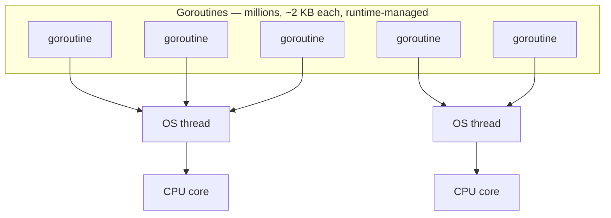

# Golang for Python Developers

A study guide that skips the basics and focuses on what actually trips up Python developers learning Go.

Primary references: the [Tour of Go](https://go.dev/tour/) (the 90-minute on-ramp), [Effective Go](https://go.dev/doc/effective_go) and the [Go FAQ](https://go.dev/doc/faq) (the idiom and *why* documents), the [language spec](https://go.dev/ref/spec) (unusually readable), and [Go by Example](https://gobyexample.com/) (the snippet reference this guide's format echoes).

---

## Table of Contents

1. [Type System & Compilation](#1-type-system--compilation)
2. [Structs, Methods & Interfaces](#2-structs-methods--interfaces)
3. [Error Handling](#3-error-handling)
4. [Pointers & Memory](#4-pointers--memory)
5. [Goroutines & Concurrency](#5-goroutines--concurrency)
6. [Channels](#6-channels)
7. [Concurrency Patterns](#7-concurrency-patterns)
8. [The `sync` Package](#8-the-sync-package)
9. [Packages, Modules & Visibility](#9-packages-modules--visibility)
10. [Slices, Maps & Gotchas](#10-slices-maps--gotchas)
11. [Defer, Panic & Recover](#11-defer-panic--recover)
12. [Generics](#12-generics)
13. [Testing & Benchmarking](#13-testing--benchmarking)
14. [Context & Cancellation](#14-context--cancellation)
15. [Common Pitfalls for Python Developers](#15-common-pitfalls-for-python-developers)

---

## 1. Type System & Compilation

For Python developers, this section is the first real reset. Go asks you to decide shapes and constraints up front, and in return the compiler catches a large class of mistakes before the program ever runs. That tends to feel slower at first, but it also means fewer "how did this become a string?" debugging sessions in production.

The deeper shift is that types in Go are part of design, not just documentation. Function signatures, zero values, and custom defined types are all tools for making invalid states harder to represent, which is a very different workflow from Python's flexible-but-late runtime model.

### The Mental Shift

Python is dynamically typed and interpreted. Go is **statically typed and compiled**. This isn't just a trivia fact -- it changes how you design everything.

```python
# Python: types resolved at runtime
def add(a, b):
    return a + b  # works with int, float, str, list...

add(1, 2)       # 3
add("a", "b")   # "ab"
```

```go
// Go: types resolved at compile time
func add(a int, b int) int {
    return a + b
}

// add("a", "b")  // compile error
```

Official docs: [A Tour of Go](https://go.dev/tour), [Language Spec](https://go.dev/ref/spec)

### Zero Values (No `None` by Default)

In Python, uninitialized variables don't exist -- you get a `NameError`. In Go, every type has a **zero value**:

| Type | Zero Value |
|------|-----------|
| `int`, `float64` | `0` |
| `string` | `""` (empty string) |
| `bool` | `false` |
| `pointer`, `slice`, `map`, `channel`, `interface`, `function` | `nil` |
| `struct` | all fields set to their zero values |

This means bugs can be silent. A zero-value struct is valid and won't panic -- it just might do the wrong thing.

### Multiple Return Values Are Idiomatic

```go
// Go functions routinely return 2+ values
func divide(a, b float64) (float64, error) {
    if b == 0 {
        return 0, fmt.Errorf("division by zero")
    }
    return a / b, nil
}

result, err := divide(10, 0)
```

Official docs: [Language Spec: Function types](https://go.dev/ref/spec#Function_types)

Python's equivalent would be returning a tuple, but in Go this is the **primary error handling mechanism**, not a convenience.

### Type Aliases & Defined Types

```go
type Celsius float64
type Fahrenheit float64

// These are distinct types -- you can't mix them accidentally
func boil(t Celsius) { /* ... */ }
// boil(Fahrenheit(212))  // compile error: cannot use Fahrenheit as Celsius
```

Official docs: [Language Spec: Type definitions](https://go.dev/ref/spec#Type_definitions), [Language Spec: Alias declarations](https://go.dev/ref/spec#Alias_declarations)

Python has no equivalent enforcement without runtime validation libraries.

---

## 2. Structs, Methods & Interfaces

Python developers usually look for the class hierarchy first. In Go, that instinct is mostly unhelpful. The language keeps object modeling deliberately simple: plain data in structs, behavior in methods, and abstraction through small interfaces instead of inheritance trees.

That simplicity is not a missing feature so much as a design constraint. Go pushes you toward composition and narrow contracts, which often produces code that is easier to test and easier to move across packages than class-heavy Python code.

### No Classes -- Structs + Methods Instead

Go has no classes, no inheritance, no constructors, no `self`. You define data with structs and attach behavior with methods.

```go
type User struct {
    Name  string
    Email string
    Age   int
}

// Method with a receiver (this is how you attach behavior to a type)
func (u User) Greet() string {
    return "Hi, I'm " + u.Name
}

// Pointer receiver -- can modify the struct
func (u *User) SetEmail(email string) {
    u.Email = email
}
```

```python
# Python equivalent
class User:
    def __init__(self, name, email, age):
        self.name = name
        self.email = email
        self.age = age

    def greet(self):
        return f"Hi, I'm {self.name}"
```

Official docs: [Language Spec: Struct types](https://go.dev/ref/spec#Struct_types), [Language Spec: Method declarations](https://go.dev/ref/spec#Method_declarations)

### No Constructors -- Use Factory Functions

```go
func NewUser(name, email string, age int) *User {
    return &User{
        Name:  name,
        Email: email,
        Age:   age,
    }
}
```

Official docs: [Effective Go](https://go.dev/doc/effective_go)

The `New<Type>` naming convention is Go's version of `__init__`.

### Composition Over Inheritance (Embedding)

Go has no inheritance. Instead, you **embed** structs:

```go
type Animal struct {
    Name string
}

func (a Animal) Speak() string {
    return a.Name + " makes a sound"
}

type Dog struct {
    Animal  // embedded -- Dog "inherits" Animal's methods
    Breed string
}

d := Dog{Animal: Animal{Name: "Rex"}, Breed: "Labrador"}
d.Speak()  // "Rex makes a sound" -- promoted method
d.Name     // "Rex" -- promoted field
```

Official docs: [Effective Go: Embedding](https://go.dev/doc/effective_go#embedding), [Language Spec: Struct types](https://go.dev/ref/spec#Struct_types)

This is **not** inheritance. There's no polymorphism via embedding, no `super()`, no method resolution order.

### Interfaces Are Implicit (Duck Typing, but at Compile Time)

This is the single biggest conceptual difference from Python's OOP. Go interfaces are **satisfied implicitly** -- you never write `implements`.

```go
type Speaker interface {
    Speak() string
}

// Dog satisfies Speaker automatically because it has a Speak() method
// No "implements" keyword needed

func MakeNoise(s Speaker) {
    fmt.Println(s.Speak())
}

MakeNoise(d)  // works -- Dog has Speak()
```

```python
# Python equivalent uses ABC or just duck typing
from abc import ABC, abstractmethod

class Speaker(ABC):
    @abstractmethod
    def speak(self) -> str: ...

# Must explicitly inherit from Speaker
class Dog(Speaker):
    def speak(self) -> str:
        return "Woof"
```

Official docs: [Language Spec: Interface types](https://go.dev/ref/spec#Interface_types), [Effective Go: Interfaces and other types](https://go.dev/doc/effective_go#interfaces_and_types)

**Key insight:** In Go, the implementor doesn't know about the interface. You can define an interface in package A that types in package B satisfy without B ever importing A. This enables powerful decoupling.

### The Empty Interface

```go
// interface{} (or 'any' since Go 1.18) accepts any type
func printAnything(v any) {
    fmt.Println(v)
}
```

Official docs: [Language Spec: Interface types](https://go.dev/ref/spec#Interface_types), [Effective Go: Interface conversions and type assertions](https://go.dev/doc/effective_go#interface_conversions)

This is Go's escape hatch for dynamic typing -- similar to Python's `object`. Use sparingly.

```quiz
Q: How does a Go type come to satisfy an interface?
- [ ] By declaring `implements Speaker`
- [x] Implicitly — having the required methods is enough; there's no `implements` keyword and the type need not know the interface exists
- [ ] By embedding the interface
- [ ] By registering with the runtime
> Go interfaces are satisfied structurally: any type with a `Speak() string` method satisfies `Speaker` automatically, with no explicit declaration. This is duck typing checked at compile time. The implementor doesn't reference the interface at all — unlike Python's `class Dog(Speaker)` or Java's `implements`.

Q: Why does implicit interface satisfaction enable strong decoupling?
- [ ] It makes interfaces optional
- [x] A consumer package can define an interface that types in another package satisfy without those types (or their package) ever importing the interface
- [ ] It removes the need for methods
- [ ] It lets interfaces inherit from each other
> Because the implementor doesn't know about the interface, you can declare an interface where it's *used* (package A) describing exactly the behavior you need, and any type in package B satisfies it without B importing A. Dependencies point inward to the consumer's needs rather than outward to a shared base type — the opposite of explicit-implements coupling.

Q: Go's `Dog` embeds `Animal` and calls promoted methods. Why is this "not inheritance"?
- [ ] Embedding copies the methods at compile time
- [x] It's composition — methods/fields are promoted, but there's no polymorphism via embedding, no `super()`, and no method resolution order
- [ ] Embedding only works for one level
- [ ] Embedded structs can't have methods
> Embedding promotes the inner type's fields and methods so `d.Speak()` works, but Go deliberately omits inheritance machinery: an `Animal` method can't be virtually overridden to change behavior through a `Dog`, there's no `super`, and no MRO. It's "has-a" composition with convenient forwarding, which Go pairs with implicit interfaces to get polymorphism instead.
```

---

## 3. Error Handling

Go's error model feels repetitive until the tradeoff clicks. Instead of a control-flow system built around exceptions, Go treats failure as part of the normal function contract. That makes error paths more visible in code review and forces you to decide locally whether to handle, wrap, or return an error.

For a Python developer, the important adjustment is stylistic as much as technical. Idiomatic Go favors explicit propagation over clever central handling, so good Go error code reads more like a series of deliberate checks than a `try` block with a few broad `except` clauses.

### No Exceptions

This is where most Python developers feel the most friction. Go has **no try/except/finally**. Errors are values returned from functions.

```go
file, err := os.Open("config.json")
if err != nil {
    return fmt.Errorf("opening config: %w", err)  // wrap and propagate
}
defer file.Close()
```

```python
# Python equivalent
try:
    file = open("config.json")
except OSError as e:
    raise RuntimeError(f"opening config: {e}") from e
finally:
    file.close()
```

Official docs: [Effective Go: Errors](https://go.dev/doc/effective_go#errors)

### The `if err != nil` Pattern

You will write this hundreds of times. It's not a flaw -- it's a design choice that forces you to handle errors at every call site.

```go
func loadConfig(path string) (*Config, error) {
    data, err := os.ReadFile(path)
    if err != nil {
        return nil, fmt.Errorf("reading file: %w", err)
    }

    var cfg Config
    if err := json.Unmarshal(data, &cfg); err != nil {
        return nil, fmt.Errorf("parsing JSON: %w", err)
    }

    return &cfg, nil
}
```

Official docs: [Effective Go: Errors](https://go.dev/doc/effective_go#errors), [fmt.Errorf](https://pkg.go.dev/fmt#Errorf)

### Error Wrapping & Unwrapping

```go
// Wrap errors with context using %w
err := fmt.Errorf("failed to connect to DB: %w", originalErr)

// Check for specific error types
if errors.Is(err, os.ErrNotExist) {
    // handle missing file
}

// Extract a specific error type
var pathErr *os.PathError
if errors.As(err, &pathErr) {
    fmt.Println("failed path:", pathErr.Path)
}
```

Official docs: [Package errors](https://pkg.go.dev/errors)

### Custom Errors

```go
type ValidationError struct {
    Field   string
    Message string
}

func (e *ValidationError) Error() string {
    return fmt.Sprintf("validation failed on %s: %s", e.Field, e.Message)
}

// Anything implementing the error interface (Error() string) is an error
```

Official docs: [Package errors](https://pkg.go.dev/errors)

```quiz
Q: How does Go's error model fundamentally differ from Python's exceptions?
- [ ] Go errors are faster to raise
- [x] Go treats failure as a value returned from a function (part of its contract), not a control-flow mechanism — there's no try/except/finally
- [ ] Go errors can't carry messages
- [ ] Go automatically logs every error
> Go functions return errors as ordinary values (typically the last return), so failure is part of the visible function signature rather than an out-of-band exception. The `if err != nil` check at each call site forces a local decision: handle, wrap, or propagate. The trade is verbosity for making every error path explicit in the code and in review.

Q: What does the `%w` verb in `fmt.Errorf("reading file: %w", err)` provide that `%v` would not?
- [ ] It formats the error in color
- [x] It *wraps* the original error so it stays in the chain, letting callers later match it with `errors.Is`/`errors.As`
- [ ] It converts the error to a string permanently
- [ ] It panics if err is nil
> `%w` wraps the underlying error, preserving it in an unwrappable chain; `%v` would only interpolate its text, discarding the typed error. Wrapping lets you add context at each layer while still allowing `errors.Is(err, os.ErrNotExist)` or `errors.As(err, &pathErr)` to inspect the original cause far up the stack. It's the idiom for contextful-yet-inspectable error propagation.

Q: What makes a Go value an `error`?
- [ ] Inheriting from a base Error class
- [x] Implementing the error interface — having an `Error() string` method — so any custom type with that method is an error
- [ ] Being returned from a function
- [ ] Registering with the errors package
> `error` is just an interface with a single `Error() string` method, satisfied implicitly like any interface. So a custom struct like `ValidationError` becomes an error simply by defining that method — no inheritance, no registration. This is why error handling composes with the rest of Go's interface system rather than being a special language feature.
```

### Sentinel Errors

```go
var ErrNotFound = errors.New("not found")
var ErrUnauthorized = errors.New("unauthorized")

func GetUser(id int) (*User, error) {
    // ...
    return nil, ErrNotFound
}

// Caller checks with errors.Is
if errors.Is(err, ErrNotFound) {
    // handle 404
}
```

Official docs: [errors.New](https://pkg.go.dev/errors#New), [errors.Is](https://pkg.go.dev/errors#Is)

---

## 4. Pointers & Memory

Pointers are where many Python developers overcorrect and assume Go is about to feel like C. It usually does not. You rarely think about manual allocation or freeing memory, but you do need to understand when you are copying a value versus sharing access to the same underlying data.

That distinction matters because Go gives you both models on purpose. Structs often behave like independent values, while slices, maps, and channels carry reference-like behavior. Knowing which one you have explains a lot of "why did that mutation stick?" moments.

### Pointers Exist (But No Pointer Arithmetic)

Python hides all references behind the scenes. Go makes them explicit with pointers.

```go
func increment(x *int) {
    *x++  // dereference and modify
}

val := 10
increment(&val)  // pass address
fmt.Println(val) // 11
```

Official docs: [Language Spec: Pointer types](https://go.dev/ref/spec#Pointer_types), [A Tour of Go: Pointers](https://go.dev/tour/moretypes/1)

### When to Use Pointer vs Value Receivers

| Use pointer receiver (`*T`) when: | Use value receiver (`T`) when: |
|---|---|
| Method modifies the receiver | Method only reads the receiver |
| Struct is large (avoids copy) | Struct is small (a few fields) |
| Consistency -- if one method uses `*T`, all should | Type is a basic type (int, string) |

### Value vs Reference Semantics

```go
// Structs are COPIED on assignment (unlike Python objects)
a := User{Name: "Alice"}
b := a       // b is a copy
b.Name = "Bob"
fmt.Println(a.Name)  // "Alice" -- unchanged

// Slices, maps, and channels are reference types (like Python lists/dicts)
s1 := []int{1, 2, 3}
s2 := s1
s2[0] = 99
fmt.Println(s1[0])  // 99 -- changed!
```

Official docs: [Effective Go: Pointers vs. Values](https://go.dev/doc/effective_go#pointers_vs_values), [Language Spec: Slice types](https://go.dev/ref/spec#Slice_types)

### Stack vs Heap (Escape Analysis)

Go decides whether to allocate on the stack or heap automatically via **escape analysis**. You don't manage memory manually, but understanding this helps performance:

```go
func newUser() *User {
    u := User{Name: "Alice"}  // allocated on heap (escapes via pointer return)
    return &u
}

func process() {
    u := User{Name: "Bob"}  // may stay on stack (doesn't escape)
    fmt.Println(u.Name)
}
```

Official docs: [Go FAQ: Stack or heap?](https://go.dev/doc/faq#stack_or_heap)

Python allocates everything on the heap with reference counting + GC. Go's approach is faster for short-lived objects.

---

## 5. Goroutines & Concurrency

This is one of Go's biggest selling points, and it lands differently if you are coming from Python. In Python, concurrency often means choosing between threads, processes, or `asyncio`, each with its own operational model. In Go, goroutines are the default building block, and they are cheap enough that you can use them freely without turning the codebase into an async-specific architecture.

The practical consequence is that concurrent code often looks like regular blocking code with a few extra coordination primitives. That removes a lot of ceremony, but it also means you need to be disciplined about waiting, cancellation, and shared state so that "easy to start" does not become "hard to shut down."

### The Big Picture: Python vs Go Concurrency

| | Python | Go |
|---|---|---|
| Concurrency primitive | `asyncio` coroutines / `threading.Thread` | Goroutines |
| Parallelism | Limited by GIL (CPython) | True parallelism across OS threads |
| Overhead per unit | ~8KB+ per thread, coroutines lighter | ~2KB per goroutine |
| Scaling | Thousands of coroutines, ~hundreds of threads | **Millions** of goroutines |
| Communication | Queues, shared state, async primitives | Channels (CSP model) |
| Scheduler | OS (threads) or event loop (asyncio) | Go runtime (M:N scheduler) |

### Goroutines Are Not Threads

A goroutine is a **lightweight, runtime-managed concurrent function**, and understanding the mechanism that makes it lightweight explains both why Go scales to millions of them and why Go code has none of the `async`/`await` ceremony Python's asyncio demands. The key is **M:N scheduling**: the Go runtime multiplexes many (M) goroutines onto a small number (N, roughly one per CPU core) of OS threads. An OS thread is expensive — a fixed ~1–8 MB stack and a kernel-managed context switch — which is why you can have hundreds of threads but not millions. A goroutine is cheap because the *runtime*, not the kernel, manages it: it starts with a tiny ~2 KB stack that *grows and shrinks on demand*, and switching between goroutines is a cheap user-space operation the Go scheduler performs, not a kernel trap. So millions of goroutines is genuinely practical, where millions of threads is impossible.



The Go runtime scheduler multiplexes the many goroutines onto the few OS threads (M:N) — parking one and running another whenever it blocks.

The deeper payoff — and the biggest relief for a Python developer — is that **Go has no colored functions**. In Python's asyncio, a function is either `async` or not, `await` is mandatory at every suspension point, and the two worlds don't mix freely (you can't `await` in a sync function, and a blocking call in an async function freezes the event loop); concurrency *colors your whole codebase*. Go's scheduler erases this entirely: when a goroutine makes a blocking call (a network read, a channel receive), the runtime quietly *parks* that goroutine and runs another one on the same OS thread, then resumes the first when its I/O is ready — all invisibly. So you write ordinary, straight-line blocking code (`resp, err := http.Get(url)`), and it's automatically concurrent when run in a goroutine, with no `async`, no `await`, no event loop to avoid blocking. That's why concurrent Go "looks like regular blocking code with a few coordination primitives": the scheduler does the suspension Python makes you annotate by hand. The discipline this shifts onto you is not *coloring* but *lifecycle* — starting a goroutine is trivial, so the hard part becomes knowing when it finishes, how to cancel it, and how to avoid leaking it (the rest of this part).

```go
func fetchURL(url string) {
    resp, err := http.Get(url)
    if err != nil {
        log.Println(err)
        return
    }
    defer resp.Body.Close()
    fmt.Println(url, resp.StatusCode)
}

func main() {
    urls := []string{
        "https://example.com",
        "https://golang.org",
        "https://python.org",
    }

    for _, url := range urls {
        go fetchURL(url)  // launch goroutine -- that's it
    }

    time.Sleep(2 * time.Second)  // bad way to wait -- use sync.WaitGroup
}
```

```python
# Python equivalent with asyncio
import asyncio
import aiohttp

async def fetch_url(session, url):
    async with session.get(url) as resp:
        print(url, resp.status)

async def main():
    async with aiohttp.ClientSession() as session:
        tasks = [fetch_url(session, url) for url in urls]
        await asyncio.gather(*tasks)

asyncio.run(main())
```

Official docs: [A Tour of Go: Concurrency](https://go.dev/tour/concurrency), [Effective Go: Concurrency](https://go.dev/doc/effective_go#concurrency)

Key differences:
- **No `async`/`await`** -- goroutines look like normal synchronous code
- **No colored function problem** -- any function can be run as a goroutine
- **Blocking is fine** -- the runtime handles it by scheduling other goroutines

```quiz
Q: Why can Go run millions of goroutines where you can only have hundreds of OS threads?
- [ ] Goroutines run on the GPU
- [x] M:N scheduling multiplexes many goroutines onto few OS threads; each goroutine starts with a tiny ~2KB growable stack and switches in user space, avoiding the ~MB stack and kernel context-switch of a thread
- [ ] Goroutines don't actually run concurrently
- [ ] The OS schedules goroutines directly
> A goroutine is runtime-managed, not kernel-managed: the Go scheduler maps many goroutines onto roughly one OS thread per core, each goroutine begins with a ~2KB stack that grows/shrinks on demand, and switching is a cheap user-space operation. OS threads carry a fixed multi-MB stack and kernel-trap context switches, which caps them in the hundreds. That cost difference is why millions of goroutines is practical.

Q: Why does Go have "no colored functions" while Python's asyncio does?
- [ ] Go forbids blocking calls
- [x] When a goroutine makes a blocking call, the runtime invisibly parks it and runs another on the same thread — so you write straight-line blocking code that's automatically concurrent, with no async/await coloring the call chain
- [ ] Go functions are all async by default
- [ ] Go uses callbacks instead
> Python's asyncio requires `async`/`await` at every suspension point, and the async/sync split infects the whole call chain. Go's scheduler does that suspension automatically: a blocking `http.Get` in a goroutine parks it and resumes when I/O is ready, so any function works as a goroutine with no annotations. The work shifts from *coloring* to *lifecycle* — knowing when a goroutine finishes, how to cancel it, and how not to leak it.

Q: The example ends `main` with `time.Sleep(2 * time.Second)` to wait for goroutines, calling it "bad." Why?
- [ ] Sleep is too slow
- [x] It guesses at timing rather than actually waiting for completion — if the work takes longer the program exits early; you should use `sync.WaitGroup` to wait deterministically
- [ ] Sleep blocks other goroutines
- [ ] Goroutines can't outlive main anyway
> A fixed sleep is a race: it assumes the goroutines finish within the guessed window, and `main` returning kills any still running. The correct tool is a `sync.WaitGroup` (add per goroutine, `Done` when each finishes, `Wait` to block until all complete) so you wait exactly as long as needed. Lifecycle management — knowing when concurrent work is done — is the discipline goroutines demand.
```

### The "Colored Function" Problem Python Has

In Python, if a function calls `await`, it must be `async`. This "infects" the entire call chain:

```python
async def get_data():          # must be async
    return await fetch()       # because this awaits

async def process():           # must be async
    data = await get_data()    # because this awaits

asyncio.run(process())         # special entry point
```

In Go, there's no distinction. Every function can be launched concurrently:

```go
func getData() Data {          // normal function
    return fetch()             // normal call
}

func process() {
    data := getData()          // normal call
}

go process()                   // runs concurrently -- no changes to process()
```

Official docs: [A Tour of Go: Concurrency](https://go.dev/tour/concurrency), [Go FAQ: Goroutines](https://go.dev/doc/faq#goroutines)

### WaitGroup -- The Proper Way to Wait

```go
func main() {
    var wg sync.WaitGroup

    urls := []string{"https://example.com", "https://golang.org"}

    for _, url := range urls {
        wg.Add(1)
        go func() {
            defer wg.Done()
            fetchURL(url)
        }()
    }

    wg.Wait()  // blocks until all goroutines call Done()
}
```

Official docs: [sync.WaitGroup](https://pkg.go.dev/sync#WaitGroup)

---

## 6. Channels

Channels are the other half of the goroutine story. If goroutines make it easy to run work concurrently, channels give that work a structured way to communicate without immediately reaching for shared mutable state and locks.

For Python developers, the closest analog is a queue plus synchronization rules, but channels are more central to the language's concurrency style than `queue.Queue` usually is in Python code. They are not mandatory for all concurrency, but understanding them is essential because so many idiomatic patterns build on top of them.

### Communicating Sequential Processes (CSP)

Go's concurrency philosophy:

> **"Don't communicate by sharing memory; share memory by communicating."**

Python's default is shared state + locks. Go's default is **channels**.

### Channel Basics

```go
// Create a channel
ch := make(chan string)

// Send a value (blocks until someone receives)
go func() {
    ch <- "hello"
}()

// Receive a value (blocks until someone sends)
msg := <-ch
fmt.Println(msg)  // "hello"
```

Official docs: [A Tour of Go: Channels](https://go.dev/tour/concurrency), [Language Spec: Channel types](https://go.dev/ref/spec#Channel_types)

### Buffered vs Unbuffered

```go
// Unbuffered -- sender blocks until receiver is ready (synchronous handoff)
ch := make(chan int)

// Buffered -- sender only blocks when buffer is full
ch := make(chan int, 10)
```

Official docs: [Effective Go: Channels](https://go.dev/doc/effective_go#channels)

| | Unbuffered | Buffered |
|---|---|---|
| `make(chan T)` | `make(chan T, N)` |
| Send blocks until receive | Send blocks when buffer full |
| Guarantees synchronization | Decouples sender/receiver timing |
| Use for handoffs | Use for producer/consumer |

### Directional Channels

```go
// Send-only channel
func producer(ch chan<- int) {
    ch <- 42
}

// Receive-only channel
func consumer(ch <-chan int) {
    val := <-ch
    fmt.Println(val)
}
```

Official docs: [Language Spec: Channel types](https://go.dev/ref/spec#Channel_types)

The compiler enforces direction -- you can't accidentally read from a send-only channel.

### `select` -- Multiplexing Channels

`select` is like a `switch` for channel operations. It blocks until one case is ready.

```go
select {
case msg := <-ch1:
    fmt.Println("from ch1:", msg)
case msg := <-ch2:
    fmt.Println("from ch2:", msg)
case <-time.After(5 * time.Second):
    fmt.Println("timeout")
default:
    fmt.Println("nothing ready")  // non-blocking if included
}
```

Official docs: [Language Spec: Select statements](https://go.dev/ref/spec#Select_statements), [A Tour of Go: Select](https://go.dev/tour/concurrency)

Python equivalent requires `asyncio.wait` with `FIRST_COMPLETED`, which is more verbose and less flexible.

### Closing Channels

```go
ch := make(chan int)

go func() {
    for i := 0; i < 5; i++ {
        ch <- i
    }
    close(ch)  // signal "no more values"
}()

// Range over channel -- exits when channel is closed
for val := range ch {
    fmt.Println(val)
}
```

Official docs: [builtin.close](https://pkg.go.dev/builtin#close), [Language Spec: Receive operator](https://go.dev/ref/spec#Receive_operator)

**Rules:**
- Only the **sender** should close a channel
- Sending on a closed channel **panics**
- Receiving from a closed channel returns the zero value immediately

```quiz
Q: What's the behavioral difference between `make(chan int)` and `make(chan int, 10)`?
- [ ] The buffered one is faster
- [x] Unbuffered blocks the sender until a receiver is ready (synchronous handoff); buffered only blocks the sender when the buffer is full (decouples sender/receiver timing)
- [ ] Buffered channels can't be closed
- [ ] Unbuffered channels lose messages
> An unbuffered channel is a synchronization point: the send doesn't complete until a receiver takes the value, guaranteeing a rendezvous. A buffered channel lets the sender deposit up to N values without a waiting receiver, blocking only when full — useful for producer/consumer decoupling. Choosing between them is choosing whether you want a guaranteed handoff or some slack.

Q: Go's concurrency motto is "don't communicate by sharing memory; share memory by communicating." What does that mean in practice versus Python?
- [ ] Go forbids shared memory entirely
- [x] Go's default is to pass data through channels (CSP) so ownership moves with the message, where Python's default is shared state guarded by locks
- [ ] Go has no locks at all
- [ ] It means goroutines can't share variables
> The CSP style moves data between goroutines over channels, so at any moment one goroutine "owns" the value and there's no contended shared state to lock. Python typically reaches for shared objects plus `Lock`. Go still *has* mutexes (the `sync` package) for when sharing is simpler, but channels are the idiomatic first choice precisely because they sidestep many race conditions.

Q: Who should close a channel, and what happens if you send on a closed one?
- [ ] The receiver closes it; sending returns an error
- [x] Only the sender should close it; sending on a closed channel panics, while receiving from a closed channel returns the zero value immediately
- [ ] Either side can close it safely
- [ ] Closing is optional and never needed
> Closing is the sender's signal of "no more values," which is why only the sender should do it — a receiver closing could leave another sender to panic. Sending on a closed channel panics (a real bug), and receiving from one yields the zero value at once (the two-value receive `v, ok := <-ch` reports `ok=false`), which is how `for range ch` knows to stop.
```

---

## 7. Concurrency Patterns

The raw primitives in Go are intentionally small, which means the real power shows up in repeatable patterns. Once you understand goroutines, channels, and cancellation, you can assemble higher-level workflows like worker pools or pipelines with very little framework code.

This section matters because many production Go systems are mostly these patterns composed together. A Python developer might reach first for Celery workers, `ThreadPoolExecutor`, or an async task graph; in Go, you often build the needed coordination directly from the standard library primitives.

### Fan-Out / Fan-In

Distribute work across goroutines, then collect results.

```go
func fanOut(urls []string) []string {
    ch := make(chan string, len(urls))

    // Fan out -- one goroutine per URL
    for _, url := range urls {
        go func() {
            ch <- fetch(url)
        }()
    }

    // Fan in -- collect all results
    results := make([]string, 0, len(urls))
    for range urls {
        results = append(results, <-ch)
    }
    return results
}
```

Official docs: [Go Blog: Pipelines and cancellation](https://go.dev/blog/pipelines)

### Worker Pool

```go
func workerPool(jobs <-chan int, results chan<- int, numWorkers int) {
    var wg sync.WaitGroup
    for range numWorkers {
        wg.Add(1)
        go func() {
            defer wg.Done()
            for job := range jobs {
                results <- process(job)
            }
        }()
    }
    wg.Wait()
    close(results)
}
```

```python
# Python equivalent
from concurrent.futures import ThreadPoolExecutor

with ThreadPoolExecutor(max_workers=5) as pool:
    results = list(pool.map(process, jobs))
```

Official docs: [Go Blog: Pipelines and cancellation](https://go.dev/blog/pipelines), [sync.WaitGroup](https://pkg.go.dev/sync#WaitGroup)

### Pipeline

Chain stages together with channels:

```go
func generate(nums ...int) <-chan int {
    out := make(chan int)
    go func() {
        for _, n := range nums {
            out <- n
        }
        close(out)
    }()
    return out
}

func square(in <-chan int) <-chan int {
    out := make(chan int)
    go func() {
        for n := range in {
            out <- n * n
        }
        close(out)
    }()
    return out
}

func main() {
    // Pipeline: generate -> square -> print
    for val := range square(generate(1, 2, 3, 4)) {
        fmt.Println(val)  // 1, 4, 9, 16
    }
}
```

Official docs: [Go Blog: Pipelines and cancellation](https://go.dev/blog/pipelines)

### Done Channel / Cancellation

```go
func worker(done <-chan struct{}, jobs <-chan int) {
    for {
        select {
        case <-done:
            return  // cancelled
        case job := <-jobs:
            process(job)
        }
    }
}

// Signal cancellation by closing the done channel
done := make(chan struct{})
close(done)  // all workers reading from done will unblock
```

Official docs: [Go Blog: Pipelines and cancellation](https://go.dev/blog/pipelines), [Package context](https://pkg.go.dev/context)

In practice, use `context.Context` instead (see section 14).

---

## 8. The `sync` Package

Go's slogan about sharing memory by communicating is useful, but it is not a rule that bans shared state. Real programs still need caches, counters, lazy initialization, and other stateful structures, and that is where `sync` comes in.

The key mindset shift is to treat these tools as precise low-level coordination primitives, not as a casual default. Python developers often get away with vague locking strategy because concurrency is either limited or hidden; in Go, misuse of `sync` shows up quickly as races, deadlocks, or throughput issues.

### Mutex -- When You Need Shared State

```go
type SafeCounter struct {
    mu sync.Mutex
    v  map[string]int
}

func (c *SafeCounter) Inc(key string) {
    c.mu.Lock()
    defer c.mu.Unlock()
    c.v[key]++
}

func (c *SafeCounter) Value(key string) int {
    c.mu.Lock()
    defer c.mu.Unlock()
    return c.v[key]
}
```

```python
# Python equivalent
import threading

class SafeCounter:
    def __init__(self):
        self.lock = threading.Lock()
        self.v = {}

    def inc(self, key):
        with self.lock:
            self.v[key] = self.v.get(key, 0) + 1
```

Official docs: [sync.Mutex](https://pkg.go.dev/sync#Mutex)

### RWMutex -- Multiple Readers, Single Writer

```go
type Cache struct {
    mu   sync.RWMutex
    data map[string]string
}

func (c *Cache) Get(key string) string {
    c.mu.RLock()          // multiple goroutines can read simultaneously
    defer c.mu.RUnlock()
    return c.data[key]
}

func (c *Cache) Set(key, value string) {
    c.mu.Lock()           // exclusive write access
    defer c.mu.Unlock()
    c.data[key] = value
}
```

Official docs: [sync.RWMutex](https://pkg.go.dev/sync#RWMutex)

### Once -- Run Something Exactly Once

```go
var (
    instance *Database
    once     sync.Once
)

func GetDB() *Database {
    once.Do(func() {
        instance = connectToDatabase()
    })
    return instance
}
```

Official docs: [sync.Once](https://pkg.go.dev/sync#Once)

Python equivalent is more awkward (double-checked locking or module-level initialization).

### sync.Map -- Concurrent Map

```go
var m sync.Map

m.Store("key", "value")
val, ok := m.Load("key")
m.Delete("key")
```

Official docs: [sync.Map](https://pkg.go.dev/sync#Map)

Use `sync.Map` only when keys are mostly stable and there's high contention. For most cases, a regular `map` with `sync.Mutex` is faster.

---

## 9. Packages, Modules & Visibility

Go organizes code with far fewer language mechanisms than Python, but the conventions are much tighter. There is no equivalent of mixing package-level conventions, dunder naming, import-time side effects, and dynamic module structure however you like. Instead, Go leans on directories, package boundaries, and naming rules that the compiler and tooling understand well.

For Python developers, this usually feels restrictive at first and then refreshingly predictable. Once you know how capitalization, `internal/`, and module paths work, most Go projects become easy to navigate because there are fewer competing patterns in the ecosystem.

### Visibility Is By Capitalization

This is one of Go's most distinctive features:

```go
type User struct {
    Name  string  // Exported (public) -- uppercase first letter
    email string  // Unexported (private) -- lowercase first letter
}

func NewUser() *User { }  // Exported
func validate() { }       // Unexported
```

Official docs: [Language Spec: Exported identifiers](https://go.dev/ref/spec#Exported_identifiers), [A Tour of Go: Exported names](https://go.dev/tour/basics/3)

There are no `public`/`private`/`protected` keywords. No `__init__.py`. No `__all__`.

### Package Organization

```
myproject/
├── go.mod              # like requirements.txt + pyproject.toml combined
├── go.sum              # like pip's lock file
├── main.go             # entry point
├── internal/           # private to this module -- can't be imported externally
│   └── auth/
│       └── auth.go
├── pkg/                # convention (not enforced) for public packages
│   └── models/
│       └── user.go
└── cmd/                # convention for multiple entry points
    ├── server/
    │   └── main.go
    └── cli/
        └── main.go
```

Official docs: [How to Write Go Code](https://go.dev/doc/code), [Managing dependencies](https://go.dev/doc/modules/managing-dependencies)

### The `internal` Directory

Any package under `internal/` can only be imported by code rooted at `internal`'s parent. This is **compiler-enforced** -- not a convention.

```
github.com/you/project/internal/auth  -- only importable by github.com/you/project/...
```

Official docs: [cmd/go: Internal Directories](https://pkg.go.dev/cmd/go#hdr-Internal_Directories)

Python has `_private` conventions. Go has `internal/` that the compiler actually enforces.

### `init()` Functions

```go
package mypackage

func init() {
    // Runs automatically when package is imported
    // Used for setup, registration, validation
    // Can have multiple init() per file
}
```

Official docs: [Effective Go: Initialization](https://go.dev/doc/effective_go#init), [Language Spec: Package initialization](https://go.dev/ref/spec#Package_initialization)

Similar to Python module-level code, but more structured. Use sparingly.

---

## 10. Slices, Maps & Gotchas

This is where Go's "simple" collection story becomes a little deceptive. Slices and maps are easy to use, but their behavior is not the same as Python lists and dicts, especially around copying, mutation, and zero values.

Most bugs here come from assuming Python semantics. If you keep in mind that slices are lightweight views over arrays and maps need explicit initialization before writes, the sharp edges become predictable instead of surprising.

### Slices Are Not Arrays

```go
// Array -- fixed length, value type (copied on assignment)
arr := [3]int{1, 2, 3}

// Slice -- dynamic length, reference type (shares underlying array)
slc := []int{1, 2, 3}
```

Official docs: [Language Spec: Array types](https://go.dev/ref/spec#Array_types), [Language Spec: Slice types](https://go.dev/ref/spec#Slice_types)

### Slice Gotchas (Python Developers Beware)

**Gotcha 1: Slicing shares memory**

```go
original := []int{1, 2, 3, 4, 5}
sub := original[1:3]  // [2, 3]
sub[0] = 99
fmt.Println(original)  // [1, 99, 3, 4, 5] -- original modified!
```

Official docs: [Go Blog: Go Slices: usage and internals](https://go.dev/blog/slices-intro)

In Python, slicing creates a copy. In Go, it creates a view.

**Gotcha 2: `append` may or may not create a new array**

```go
a := []int{1, 2, 3}
b := a[:2]           // [1, 2], shares backing array with capacity 3
b = append(b, 99)    // fits in capacity -- overwrites a[2]!
fmt.Println(a)       // [1, 2, 99]

// Safe copy:
b := make([]int, len(a))
copy(b, a)
```

Official docs: [builtin.append](https://pkg.go.dev/builtin#append), [Go Blog: Go Slices: usage and internals](https://go.dev/blog/slices-intro)

**Gotcha 3: `nil` slice vs empty slice**

```go
var s []int          // nil slice  -- s == nil is true
s = []int{}          // empty slice -- s == nil is false
// Both have len 0, both work with append, range, etc.
// json.Marshal: nil -> "null", empty -> "[]"
```

Official docs: [Language Spec: Slice types](https://go.dev/ref/spec#Slice_types)

### Maps

```go
m := map[string]int{
    "alice": 30,
    "bob":   25,
}

// Check existence (don't just read -- zero value is ambiguous)
age, ok := m["charlie"]
if !ok {
    fmt.Println("not found")
}

// Delete
delete(m, "bob")

// Iteration order is randomized (like Python 2 dicts, unlike Python 3.7+)
for key, value := range m {
    fmt.Println(key, value)
}
```

Official docs: [Language Spec: Map types](https://go.dev/ref/spec#Map_types), [Go Blog: Go maps in action](https://go.dev/blog/maps)

### `nil` Map Gotcha

```go
var m map[string]int  // nil map
_ = m["key"]          // fine -- returns zero value
m["key"] = 1          // PANIC: assignment to nil map

// Always initialize:
m = make(map[string]int)
// or
m = map[string]int{}
```

Official docs: [Language Spec: Map types](https://go.dev/ref/spec#Map_types), [builtin.make](https://pkg.go.dev/builtin#make)

```quiz
Q: `sub := original[1:3]; sub[0] = 99` changes `original` too. Why does Go behave differently from Python here?
- [ ] Go has a bug in slicing
- [x] A Go slice is a view over a shared backing array, so the sub-slice and original alias the same memory; Python slicing copies
- [ ] `sub` is a pointer to `original`
- [ ] Only happens with integer slices
> A Go slice is a lightweight header (pointer, length, capacity) over an underlying array, so slicing creates a *view* sharing that array — mutating through one is visible through the other. Python's list slicing produces an independent copy. To get copy semantics in Go you allocate and `copy` explicitly. Assuming Python semantics is the root of most slice surprises.

Q: `a := []int{1,2,3}; b := a[:2]; b = append(b, 99)` leaves `a` as `[1, 2, 99]`. Why?
- [ ] append always mutates the original
- [x] `b` shares `a`'s backing array and still has spare capacity, so the append writes into the existing array (overwriting `a[2]`) rather than allocating a new one
- [ ] append is undefined behavior
- [ ] b is a reference to a
> `append` reuses the backing array when there's spare capacity, only allocating a new one when the slice would overflow. Since `b` (len 2) shares `a`'s array of capacity 3, appending fits and overwrites `a[2]`. Whether append copies is therefore *unpredictable from the call alone* — it depends on capacity. The safe pattern when you need independence is `make` + `copy`.

Q: `var m map[string]int` then `m["key"] = 1` panics, but reading `m["key"]` is fine. Why?
- [ ] Reading initializes the map
- [x] A nil map can be read (returns the zero value) but writing to it panics — you must initialize with `make` or a literal before assigning
- [ ] Maps can't hold ints
- [ ] The key must be declared first
> A nil map behaves like an empty read-only map: lookups return the value type's zero value safely, but there's no allocated structure to store into, so assignment panics. Always initialize with `make(map[string]int)` or `map[string]int{}` before writing. This asymmetry (read-ok, write-panic) is a common Go-newcomer crash.
```

---

## 11. Defer, Panic & Recover

These three features are often mentioned together, but they solve very different problems. `defer` is everyday cleanup and is used constantly; `panic` and `recover` are escape hatches for exceptional situations and should stay relatively rare in application code.

Python developers sometimes map all of this onto `try`/`except`/`finally`, but the fit is imperfect. The safer mental model is: `defer` is structured cleanup, `panic` is a crash signal, and `recover` is a boundary tool for keeping one bad path from taking down the whole process.

### `defer` -- Go's Version of `finally`

```go
func readFile(path string) ([]byte, error) {
    f, err := os.Open(path)
    if err != nil {
        return nil, err
    }
    defer f.Close()  // runs when function returns, no matter what

    return io.ReadAll(f)
}
```

```python
# Python equivalent
def read_file(path):
    with open(path) as f:  # context manager handles cleanup
        return f.read()
```

Official docs: [Language Spec: Defer statements](https://go.dev/ref/spec#Defer_statements), [Go Blog: Defer, Panic, and Recover](https://go.dev/blog/defer-panic-and-recover)

### `defer` Execution Order

Defers execute in **LIFO** (stack) order:

```go
defer fmt.Println("first")
defer fmt.Println("second")
defer fmt.Println("third")
// Output: third, second, first
```

Official docs: [Language Spec: Defer statements](https://go.dev/ref/spec#Defer_statements), [Go Blog: Defer, Panic, and Recover](https://go.dev/blog/defer-panic-and-recover)

### `defer` Gotcha: Loop Variable Capture

```go
// BUG: all defers will use the final value of i
for i := 0; i < 5; i++ {
    defer fmt.Println(i)  // prints 4, 3, 2, 1, 0 (LIFO, but captures correctly in modern Go)
}

// Note: as of Go 1.22, loop variables are per-iteration, fixing
// the classic closure bug that also affects Python
```

Official docs: [Go 1.22 Release Notes](https://go.dev/doc/go1.22#language), [Language Spec: Defer statements](https://go.dev/ref/spec#Defer_statements)

### `panic` and `recover` -- Not for Normal Errors

```go
// panic is like Python's unhandled exception -- crashes the program
func mustParseConfig() Config {
    cfg, err := parseConfig()
    if err != nil {
        panic("invalid config: " + err.Error())
    }
    return cfg
}

// recover catches panics -- like except Exception in Python
func safeHandler() {
    defer func() {
        if r := recover(); r != nil {
            log.Println("recovered from panic:", r)
        }
    }()

    riskyFunction()  // if this panics, we recover
}
```

Official docs: [builtin.panic](https://pkg.go.dev/builtin#panic), [builtin.recover](https://pkg.go.dev/builtin#recover), [Go Blog: Defer, Panic, and Recover](https://go.dev/blog/defer-panic-and-recover)

**Convention:** Use `panic`/`recover` only for truly unrecoverable situations (programmer errors, impossible states). Use error returns for everything else.

---

## 12. Generics

Generics arrived late in Go, and that history explains their style. They were added to solve specific problems around reusable typed code, not to enable the kind of heavily abstracted type programming you sometimes see in other languages.

That makes them especially interesting for Python developers. If you are used to type hints that help editors but do not change runtime behavior, Go generics feel much stricter and more valuable in core library code, while still being a feature many everyday programs can use sparingly.

### Added in Go 1.18 (2022)

Before generics, you'd use `interface{}` (like Python's `Any`) and lose type safety.

```go
// Generic function
func Map[T any, U any](slice []T, fn func(T) U) []U {
    result := make([]U, len(slice))
    for i, v := range slice {
        result[i] = fn(v)
    }
    return result
}

// Usage
numbers := []int{1, 2, 3, 4}
strings := Map(numbers, strconv.Itoa)  // ["1", "2", "3", "4"]
```

Official docs: [Tutorial: Getting started with generics](https://go.dev/doc/tutorial/generics)

### Type Constraints

```go
// Constraint: T must support < operator
type Ordered interface {
    ~int | ~float64 | ~string  // ~ means "underlying type"
}

func Min[T Ordered](a, b T) T {
    if a < b {
        return a
    }
    return b
}
```

Official docs: [Tutorial: Getting started with generics](https://go.dev/doc/tutorial/generics), [Language Spec](https://go.dev/ref/spec)

### Compared to Python

```python
# Python uses TypeVar (typing module) -- but it's only for static analysis
from typing import TypeVar, Sequence

T = TypeVar('T')

def first(items: Sequence[T]) -> T:
    return items[0]  # no runtime enforcement
```

Official docs: [Tutorial: Getting started with generics](https://go.dev/doc/tutorial/generics)

Go generics are **compiler-enforced**. Python type hints are advisory (unless you use mypy/pyright).

---

## 13. Testing & Benchmarking

Go treats testing as part of the language workflow rather than an aftermarket ecosystem choice. You do not need to pick a dominant community framework before writing useful tests, benchmarks, or race checks, and that standardization is a big reason Go projects tend to have predictable test layouts.

For Python developers, this can feel less ergonomic than `pytest` at first because there is less magic. The upside is that the defaults scale well across teams: tests are easy to run, benchmarks live next to the code they measure, and concurrency bugs can be checked with first-party tooling.

### Built-in Testing (No pytest Needed)

```go
// user_test.go -- must end in _test.go
package user

import "testing"

func TestUserGreet(t *testing.T) {
    u := User{Name: "Alice"}
    got := u.Greet()
    want := "Hi, I'm Alice"

    if got != want {
        t.Errorf("Greet() = %q, want %q", got, want)
    }
}
```

```bash
go test ./...           # run all tests
go test -v ./...        # verbose
go test -run TestUser   # run specific tests
go test -race ./...     # detect race conditions
```

Official docs: [Package testing](https://pkg.go.dev/testing), [Tutorial: Add a test](https://go.dev/doc/tutorial/add-a-test)

### Table-Driven Tests (Idiomatic Go)

```go
func TestDivide(t *testing.T) {
    tests := []struct {
        name    string
        a, b    float64
        want    float64
        wantErr bool
    }{
        {"normal", 10, 2, 5, false},
        {"zero divisor", 10, 0, 0, true},
        {"negative", -10, 2, -5, false},
    }

    for _, tt := range tests {
        t.Run(tt.name, func(t *testing.T) {
            got, err := divide(tt.a, tt.b)
            if (err != nil) != tt.wantErr {
                t.Fatalf("error = %v, wantErr %v", err, tt.wantErr)
            }
            if got != tt.want {
                t.Errorf("divide(%v, %v) = %v, want %v", tt.a, tt.b, got, tt.want)
            }
        })
    }
}
```

Official docs: [Package testing](https://pkg.go.dev/testing), [Go Blog: Using Subtests and Sub-benchmarks](https://go.dev/blog/subtests)

### Benchmarking (Built-in)

```go
func BenchmarkUserGreet(b *testing.B) {
    u := User{Name: "Alice"}
    for range b.N {
        u.Greet()
    }
}
```

```bash
go test -bench=. ./...
```

Official docs: [Package testing](https://pkg.go.dev/testing)

Python requires external tools (`timeit`, `pytest-benchmark`). Go ships this.

### Race Detector

```bash
go test -race ./...   # detects data races at runtime
go run -race main.go  # also works with run/build
```

Official docs: [Data Race Detector](https://go.dev/doc/articles/race_detector)

Python has no equivalent -- the GIL hides most races (but doesn't prevent all bugs).

---

## 14. Context & Cancellation

`context.Context` is one of the most important conventions in modern Go, especially for servers and networked code. It gives requests, background jobs, and RPC calls a shared way to carry deadlines, cancellation signals, and a small amount of request-scoped metadata.

Python developers often learn cancellation through framework-specific APIs, especially in `asyncio`. Go pushes that concern into ordinary function signatures instead, which means the discipline is more visible: if work might block or outlive its caller, it probably needs a context.

### `context.Context` -- Go's Cancellation & Deadline Propagation

Every long-running or I/O function in Go should accept a `context.Context` as the first parameter. This is Go's answer to Python's `asyncio.CancelledError` and `signal` handling.

```go
func fetchData(ctx context.Context, url string) ([]byte, error) {
    req, err := http.NewRequestWithContext(ctx, "GET", url, nil)
    if err != nil {
        return nil, err
    }
    resp, err := http.DefaultClient.Do(req)
    if err != nil {
        return nil, err  // returns error if context was cancelled
    }
    defer resp.Body.Close()
    return io.ReadAll(resp.Body)
}
```

Official docs: [Package context](https://pkg.go.dev/context), [context.Context](https://pkg.go.dev/context#Context)

### Timeout

```go
ctx, cancel := context.WithTimeout(context.Background(), 5*time.Second)
defer cancel()  // always defer cancel to release resources

data, err := fetchData(ctx, "https://api.example.com/data")
if errors.Is(err, context.DeadlineExceeded) {
    log.Println("request timed out")
}
```

Official docs: [context.WithTimeout](https://pkg.go.dev/context#WithTimeout)

### Cancellation

```go
ctx, cancel := context.WithCancel(context.Background())

go func() {
    time.Sleep(2 * time.Second)
    cancel()  // signal all functions using this context to stop
}()

// In your function:
select {
case <-ctx.Done():
    return ctx.Err()  // context.Canceled
case result := <-doWork():
    return result
}
```

Official docs: [context.WithCancel](https://pkg.go.dev/context#WithCancel), [context.Context](https://pkg.go.dev/context#Context)

### Context Values (Use Sparingly)

```go
type contextKey string

const userIDKey contextKey = "userID"

ctx = context.WithValue(ctx, userIDKey, "user-123")

// Later:
userID := ctx.Value(userIDKey).(string)
```

Official docs: [context.WithValue](https://pkg.go.dev/context#WithValue)

Use context values for **request-scoped** data (request IDs, auth tokens) that crosses API boundaries, not as a general-purpose data bag.

---

## 15. Common Pitfalls for Python Developers

Most of these mistakes are not about forgetting syntax. They come from bringing the wrong defaults across from Python: assuming reference semantics, expecting truthiness, or treating concurrency as something the runtime will quietly smooth over.

Use this section as a debugging checklist. When a Go program behaves strangely, it is often because one of these assumptions slipped in unnoticed, and the fix is usually to become more explicit about state, ownership, or control flow.

### 1. Forgetting That Structs Are Copied

```go
type Config struct {
    Debug bool
}

func toggleDebug(c Config) {
    c.Debug = true  // modifies the copy, not the original!
}

// Fix: use a pointer
func toggleDebug(c *Config) {
    c.Debug = true
}
```

Official docs: [Effective Go: Pointers vs. Values](https://go.dev/doc/effective_go#pointers_vs_values)

### 2. Unused Variables Are Compile Errors

```go
x := 42  // compile error if x is never used
```

Python silently allows this. In Go, use `_` for intentionally unused values:

```go
_, err := someFunction()
```

Official docs: [Effective Go: The blank identifier](https://go.dev/doc/effective_go#blank)

### 3. No Default Parameters or Keyword Arguments

```go
// Python: def connect(host="localhost", port=5432, ssl=True)
// Go: not supported -- use options pattern instead

type Options struct {
    Host string
    Port int
    SSL  bool
}

func Connect(opts Options) (*Conn, error) { /* ... */ }

// Or the functional options pattern:
func Connect(opts ...Option) (*Conn, error) { /* ... */ }
```

Official docs: [Language Spec: Calls](https://go.dev/ref/spec#Calls), [Language Spec: Passing arguments to ... parameters](https://go.dev/ref/spec#Passing_arguments_to_..._parameters)

### 4. No List Comprehensions

```python
# Python
squares = [x**2 for x in range(10) if x % 2 == 0]
```

```go
// Go -- write the loop
var squares []int
for x := range 10 {
    if x%2 == 0 {
        squares = append(squares, x*x)
    }
}
```

Official docs: [Effective Go: For](https://go.dev/doc/effective_go#for), [builtin.append](https://pkg.go.dev/builtin#append)

### 5. Shadowing Variables with `:=`

```go
err := firstOperation()

if true {
    err := secondOperation()  // new variable! shadows outer err
    _ = err
}
// outer err still has firstOperation's result
```

Official docs: [Effective Go: Redeclaration and reassignment](https://go.dev/doc/effective_go#redeclaration)

### 6. Goroutine Leaks

```go
// Leaked goroutine -- blocks forever if nobody reads
func leaky() {
    ch := make(chan int)
    go func() {
        ch <- 42  // blocks forever if leaky() returns without reading
    }()
    // ch is never read if we return early
}

// Fix: use buffered channel or context cancellation
func fixed() {
    ch := make(chan int, 1)  // buffered -- sender won't block
    go func() {
        ch <- 42
    }()
}
```

Official docs: [Go Blog: Pipelines and cancellation](https://go.dev/blog/pipelines), [Package context](https://pkg.go.dev/context)

### 7. Range Loop Variable Behavior (Pre-Go 1.22)

```go
// Before Go 1.22, this was a bug:
for _, url := range urls {
    go func() {
        fetch(url)  // all goroutines would use the last url
    }()
}

// Go 1.22+ fixed this -- loop variables are now per-iteration
// But be aware if working with older Go versions
```

Official docs: [Go 1.22 Release Notes](https://go.dev/doc/go1.22#language)

### 8. No Truthiness

```go
// Python: if my_list:  if my_string:  if my_dict:
// Go: conditions must be explicit booleans

if len(mySlice) > 0 { }  // not: if mySlice
if myString != "" { }     // not: if myString
if myMap != nil { }       // not: if myMap
```

Official docs: [Language Spec: If statements](https://go.dev/ref/spec#If_statements)

---

## Quick Reference Cheat Sheet

This cheat sheet is meant as a translation layer, not a one-to-one equivalence table. Many of the entries are close enough to get you oriented, but the sections above matter because the surrounding idioms are often more important than the syntax itself.

If you are switching between Python and Go regularly, this is the part to skim before coding and the earlier sections are the part to reread when something feels awkward. Most Go friction for Python developers comes from applying the wrong mental model, not from forgetting keywords.

| Python | Go |
|--------|-----|
| `class` | `type Foo struct{}` + methods |
| `self.method()` | Receiver: `func (f *Foo) Method()` |
| `try/except` | `if err != nil` |
| `with open() as f` | `defer f.Close()` |
| `threading.Thread` | `go func()` |
| `queue.Queue` | `chan T` |
| `asyncio.gather` | `sync.WaitGroup` + goroutines |
| `asyncio.wait(FIRST_COMPLETED)` | `select` |
| `threading.Lock` | `sync.Mutex` |
| `@property` | No equivalent (use methods) |
| `**kwargs` | Options struct or functional options |
| `list comprehension` | `for` loop with `append` |
| `pip install` | `go get` |
| `requirements.txt` | `go.mod` + `go.sum` |
| `pytest` | `go test` (built-in) |
| `None` | `nil` (only for pointer/reference types) |
| `isinstance()` | Type assertion: `v, ok := x.(Type)` |
| `import module` | `import "path/to/package"` |

---

## Where to Go Next

- **Do the [Tour of Go](https://go.dev/tour/) and then read [Effective Go](https://go.dev/doc/effective_go)** — the Tour for mechanics, Effective Go for idiom; together they're an afternoon and cover what "Pythonic → Goish" translation requires.
- **Read the [Go FAQ](https://go.dev/doc/faq)** when a design choice annoys you — "why no exceptions/generics-before-1.18/sets" all have considered answers there, and knowing the *why* dissolves most resistance.
- **Write Go with the race detector and linter on from day one:** `go test -race`, `go vet`, and [staticcheck](https://staticcheck.dev/) — Go's tooling is the language's best feature; let it teach you.
- **Port one real Python tool** — a CLI or small HTTP service — and resist recreating Python patterns: no inheritance hierarchies, return errors instead of raising, use channels/goroutines only where concurrency is real.
- **Adjacent guides in this repo:** [Advanced Go](ADVANCED_GO_STUDY_GUIDE.md) (the runtime/performance deep-dive this guide on-ramps to), [Python Concurrency](PYTHON_CONCURRENCY.md) (the model you're leaving), and [Rust for Python devs](RUST_FOR_PYTHON_DEVS.md)/[.NET for Python devs](DOTNET_FOR_PYTHON_DEVS.md) (the sibling translations).
