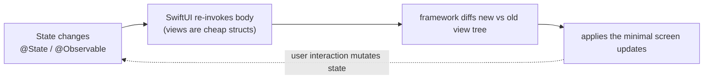

# iOS Development

A depth-first guide to building iOS apps in 2026 — for engineers who can program but have never shipped an iOS app, or who learned iOS years ago and need to understand the modern landscape. SwiftUI is now the default UI framework, Swift 6 strict concurrency is enforced in new projects, `@Observable` has replaced `ObservableObject`, SwiftData has replaced Core Data for most use cases, and the tooling (Xcode, Instruments, Swift Package Manager) has matured significantly. This guide covers the full stack from Swift the language through SwiftUI, concurrency, architecture, persistence, networking, platform APIs, testing, and distribution.

Assumes general programming experience. No prior Swift or Apple platform knowledge required.

Primary references: [The Swift Programming Language](https://docs.swift.org/swift-book/), Apple's [SwiftUI documentation](https://developer.apple.com/documentation/swiftui), the [Human Interface Guidelines](https://developer.apple.com/design/human-interface-guidelines/), and the [App Store Review Guidelines](https://developer.apple.com/app-store/review/guidelines/).

---

## Table of Contents

1. [Part 1 — Swift: The Language](#part-1--swift-the-language)
2. [Part 2 — SwiftUI: Declarative UI](#part-2--swiftui-declarative-ui)
3. [Part 3 — State Management](#part-3--state-management)
4. [Part 4 — Navigation](#part-4--navigation)
5. [Part 5 — Swift Concurrency](#part-5--swift-concurrency)
6. [Part 6 — Architecture](#part-6--architecture)
7. [Part 7 — Data Persistence](#part-7--data-persistence)
8. [Part 8 — Networking](#part-8--networking)
9. [Part 9 — Platform APIs](#part-9--platform-apis)
10. [Part 10 — UIKit Interop](#part-10--uikit-interop)
11. [Part 11 — Testing](#part-11--testing)
12. [Part 12 — Tooling](#part-12--tooling)
13. [Part 13 — Distribution](#part-13--distribution)

---

## Part 1 — Swift: The Language

Swift is a compiled, statically typed language with type inference, generics, protocol-oriented programming, and value semantics as first-class concerns. If you know TypeScript, Rust, or Kotlin, much of Swift will feel familiar — but the details matter.

### Types: Value vs. Reference

Swift makes a sharp distinction between **value types** and **reference types**. This is the most important mental model in the language.

**Value types** (structs, enums, tuples) are **copied** when assigned or passed. Each variable has its own independent copy:

```swift
struct Point {
    var x: Double
    var y: Double
}

var a = Point(x: 1, y: 2)
var b = a        // b is a copy
b.x = 99        // a.x is still 1
```

**Reference types** (classes) are **shared**. Variables hold a reference to the same object:

```swift
class Account {
    var balance: Double
    init(balance: Double) { self.balance = balance }
}

let a = Account(balance: 100)
let b = a        // b points to the same object
b.balance = 0    // a.balance is also 0
```

**The rule in 2026:** prefer structs by default. Use classes only when you need identity (the object *is* something, not just holds a value), reference semantics, or inheritance. SwiftUI views are all structs. Most of your model types should be structs. Swift's copy-on-write optimization means structs are efficient even for large data — the actual copy is deferred until mutation.

### Optionals

Optionals are Swift's mechanism for representing the absence of a value. Every type `T` has a companion type `T?` (equivalent to `Optional<T>`) that can hold either a value of `T` or `nil`:

```swift
var name: String? = "Alice"    // has a value
var age: Int? = nil            // no value

// unwrapping — you MUST handle the nil case before using the value

// 1. if let (optional binding)
if let name = name {
    print("Hello, \(name)")    // name is String here, not String?
}

// 2. guard let (early return)
func greet(_ name: String?) {
    guard let name = name else {
        print("No name provided")
        return
    }
    print("Hello, \(name)")    // name is String for the rest of the function
}

// 3. nil-coalescing
let displayName = name ?? "Anonymous"    // String, not String?

// 4. optional chaining
let count = name?.count    // Int? — nil if name is nil

// 5. force unwrap (AVOID in production code)
let unsafeName = name!     // crashes if name is nil
```

**Never force-unwrap (`!`) in production code** except in truly impossible-nil cases (like `IBOutlet` connections, which are being replaced by SwiftUI anyway). Use `guard let` for early returns and `if let` for branching.

### Enums: More Than Constants

Swift enums are **algebraic data types** — they can carry associated values, making them far more powerful than enums in C or Java:

```swift
// simple enum
enum Direction {
    case north, south, east, west
}

// enum with associated values — models complex variants
enum NetworkError: Error {
    case noConnection
    case timeout(seconds: Int)
    case httpError(statusCode: Int, body: String)
    case decodingFailed(underlying: Error)
}

// pattern matching
func handle(_ error: NetworkError) {
    switch error {
    case .noConnection:
        showOfflineUI()
    case .timeout(let seconds):
        print("Timed out after \(seconds)s")
    case .httpError(let code, _) where code == 401:
        redirectToLogin()
    case .httpError(let code, let body):
        log("HTTP \(code): \(body)")
    case .decodingFailed(let underlying):
        log("Decoding failed: \(underlying)")
    }
}

// enum without cases — namespace pattern (can't be instantiated)
enum Constants {
    static let apiBaseURL = "https://api.example.com"
    static let maxRetries = 3
}
```

The `switch` must be **exhaustive** — the compiler enforces that you handle every case. When you add a new case to an enum, every `switch` that doesn't have a `default` will fail to compile, forcing you to handle the new case. This is why enums are preferred over stringly-typed error handling.

### Protocols and Protocol-Oriented Programming

Protocols are Swift's answer to interfaces (and more). They define a contract — a set of requirements that a conforming type must satisfy:

```swift
protocol Persistable {
    func save() throws
    static func load(id: String) async throws -> Self
}

// protocol extensions provide default implementations
extension Persistable {
    func saveAndLog() throws {
        try save()
        print("Saved \(Self.self)")
    }
}

// any type can conform — structs, enums, classes
struct UserProfile: Persistable {
    let id: String
    var name: String
    
    func save() throws { /* ... */ }
    static func load(id: String) async throws -> UserProfile { /* ... */ }
}
```

**`some` vs. `any`:** these keywords control how protocols are used as types:

```swift
// 'some' — opaque type (compiler knows the concrete type, you don't)
// more performant: static dispatch, no heap allocation
func makeView() -> some View {
    Text("Hello")    // compiler knows this is Text
}

// 'any' — existential type (runtime polymorphism)
// less performant: dynamic dispatch, may heap-allocate
func process(items: [any Persistable]) {
    for item in items {
        try? item.save()
    }
}
```

**Rule:** use `some` (generics) when a function always returns the same concrete type. Use `any` when you truly need a heterogeneous collection or runtime polymorphism. SwiftUI uses `some View` everywhere.

### Closures

Closures are anonymous functions. They capture variables from their surrounding scope:

```swift
// explicit syntax
let add: (Int, Int) -> Int = { (a: Int, b: Int) -> Int in
    return a + b
}

// shorthand (type inference, $0/$1 for arguments, implicit return)
let add = { $0 + $1 }

// trailing closure syntax — when the last parameter is a closure
let sorted = numbers.sorted { $0 < $1 }

// multiple trailing closures
Button("Save") {
    save()
} label: {
    Label("Save", systemImage: "square.and.arrow.down")
}

// escaping closures — survive beyond the function call
func fetchData(completion: @escaping (Data) -> Void) {
    // completion is called later, after fetchData returns
}

// Sendable closures — can be safely passed across concurrency boundaries
func onMainThread(_ work: @Sendable @MainActor () -> Void) {
    Task { @MainActor in work() }
}
```

### Generics

```swift
// generic function
func firstElement<T>(of array: [T]) -> T? {
    array.first
}

// generic type with constraint
struct Cache<Key: Hashable, Value> {
    private var storage: [Key: Value] = [:]
    
    mutating func set(_ value: Value, for key: Key) {
        storage[key] = value
    }
    
    func get(_ key: Key) -> Value? {
        storage[key]
    }
}

// constrained extensions
extension Array where Element: Numeric {
    var total: Element {
        reduce(0, +)
    }
}
```

### Error Handling

Swift uses typed, thrown errors — not unchecked exceptions:

```swift
enum ValidationError: Error {
    case tooShort(minimum: Int)
    case invalidCharacters
}

func validate(_ password: String) throws(ValidationError) {
    guard password.count >= 8 else {
        throw .tooShort(minimum: 8)
    }
    guard password.allSatisfy(\.isASCII) else {
        throw .invalidCharacters
    }
}

// caller must handle errors
do {
    try validate(input)
} catch .tooShort(let min) {
    showError("Password must be at least \(min) characters")
} catch .invalidCharacters {
    showError("Only ASCII characters allowed")
}

// or convert to optional
let isValid = try? validate(input)    // nil if it threw

// Result type — for async or callback-based APIs
func fetch() -> Result<User, NetworkError> {
    // ...
}
```

### Property Wrappers

Property wrappers encapsulate getter/setter logic — you'll encounter them constantly in SwiftUI:

```swift
@propertyWrapper
struct Clamped<Value: Comparable> {
    var wrappedValue: Value {
        didSet { wrappedValue = min(max(wrappedValue, range.lowerBound), range.upperBound) }
    }
    let range: ClosedRange<Value>
    
    init(wrappedValue: Value, _ range: ClosedRange<Value>) {
        self.range = range
        self.wrappedValue = min(max(wrappedValue, range.lowerBound), range.upperBound)
    }
}

struct Volume {
    @Clamped(0...100) var level: Int = 50
}

var v = Volume()
v.level = 150    // clamped to 100
```

SwiftUI's `@State`, `@Binding`, `@Environment`, `@AppStorage` are all property wrappers.

---

## Part 2 — SwiftUI: Declarative UI

SwiftUI is a declarative UI framework: you describe *what* the UI should look like for a given state, and the framework figures out *how* to update the screen when the state changes. This is fundamentally different from UIKit (imperative: you mutate views directly).



### Your First View

```swift
import SwiftUI

struct ContentView: View {
    var body: some View {
        VStack(spacing: 16) {
            Image(systemName: "globe")
                .font(.system(size: 48))
                .foregroundStyle(.tint)
            
            Text("Hello, World!")
                .font(.title)
                .fontWeight(.bold)
            
            Text("Welcome to SwiftUI")
                .font(.subheadline)
                .foregroundStyle(.secondary)
        }
        .padding()
    }
}

#Preview {
    ContentView()
}
```

**Key concepts:**
- Every view is a **struct** conforming to the `View` protocol.
- The `body` property returns `some View` — the framework handles rendering.
- Views are composed by nesting them inside layout containers (`VStack`, `HStack`, `ZStack`).
- **Modifiers** (`.font()`, `.padding()`, `.foregroundStyle()`) return new views — they don't mutate in place.
- `#Preview` is a macro that renders a live preview in Xcode's canvas.

### Layout System

```swift
// VStack — vertical, HStack — horizontal, ZStack — layered
VStack(alignment: .leading, spacing: 12) {
    Text("Title")
    Text("Subtitle")
}

// LazyVStack/LazyHStack — only renders visible items (for scrollable lists)
ScrollView {
    LazyVStack {
        ForEach(items) { item in
            ItemRow(item: item)
        }
    }
}

// Grid (iOS 16+)
Grid(alignment: .leading, horizontalSpacing: 16, verticalSpacing: 12) {
    GridRow {
        Text("Name")
        Text("Score")
    }
    GridRow {
        Text("Alice")
        Text("95")
    }
}

// Spacer — pushes content apart
HStack {
    Text("Leading")
    Spacer()
    Text("Trailing")
}

// frame — explicit sizing
Image("photo")
    .resizable()
    .aspectRatio(contentMode: .fill)
    .frame(width: 200, height: 200)
    .clipShape(RoundedRectangle(cornerRadius: 16))
```

### Lists

```swift
struct TaskList: View {
    let tasks: [Task]
    
    var body: some View {
        List {
            ForEach(tasks) { task in
                HStack {
                    Image(systemName: task.isComplete ? "checkmark.circle.fill" : "circle")
                        .foregroundStyle(task.isComplete ? .green : .secondary)
                    Text(task.title)
                }
            }
            .onDelete(perform: delete)
            .onMove(perform: move)
        }
        .listStyle(.insetGrouped)
    }
}
```

### Modifiers: The Building Blocks

Modifiers are chained method calls that transform views. **Order matters** — modifiers apply from inner to outer:

```swift
Text("Hello")
    .padding()              // 1. add padding around text
    .background(.blue)      // 2. blue background covers the padded area
    .clipShape(Capsule())   // 3. clip the entire thing to a capsule shape

// vs.
Text("Hello")
    .background(.blue)      // 1. blue background tight around text
    .padding()              // 2. padding outside the blue box
    // result: blue text box with transparent padding around it
```

### Common Modifiers Reference

```swift
// typography
.font(.title)
.fontWeight(.semibold)
.foregroundStyle(.primary)
.multilineTextAlignment(.center)
.lineLimit(2)

// spacing and sizing
.padding()                     // default padding on all sides
.padding(.horizontal, 16)     // specific axis
.frame(maxWidth: .infinity)   // expand to fill
.frame(height: 200)           // fixed height

// appearance
.background(.ultraThinMaterial)   // blur/glass effect
.overlay(RoundedRectangle(cornerRadius: 12).stroke(.blue, lineWidth: 2))
.shadow(color: .black.opacity(0.15), radius: 8, y: 4)
.opacity(0.8)
.clipShape(Circle())

// interaction
.onTapGesture { /* ... */ }
.onLongPressGesture { /* ... */ }
.swipeActions { Button("Delete", role: .destructive) { delete() } }
.contextMenu { Button("Copy") { copy() } }

// animation
.animation(.spring(duration: 0.3), value: isExpanded)
.transition(.slide)
.matchedGeometryEffect(id: item.id, in: namespace)

// conditional
.disabled(isLoading)
.redacted(reason: .placeholder)    // skeleton loading effect
.opacity(isVisible ? 1 : 0)
```

```quiz
Q: `Text("Hi").padding().background(.blue)` versus `Text("Hi").background(.blue).padding()` — why do they look different?
- [ ] They render identically
- [x] Modifiers apply inner-to-outer, each wrapping the previous result: the first pads then colors the padded area (blue extends past the text); the second colors tight around the text then pads outside it (transparent margin)
- [ ] `.background` can only be applied once
- [ ] The order only matters for animations
> Each modifier returns a *new* view wrapping the prior one, so the chain order is the nesting order. Padding-then-background colors the enlarged (padded) view; background-then-padding colors the text snugly and adds transparent space around the colored box. This "modifiers wrap, order matters" rule is the most common SwiftUI layout surprise.

Q: A SwiftUI view is a `struct` whose `body` returns `some View`. What does that design imply?
- [ ] Views are expensive heap objects you reuse
- [x] Views are cheap value types describing the UI for the current state; SwiftUI recreates `body` freely on state change and diffs it — you compose by nesting, and modifiers return new views rather than mutating
- [ ] `some View` means the type is dynamic at runtime
- [ ] body runs on a background thread
> Because views are lightweight structs, SwiftUI can recompute `body` cheaply whenever state changes and reconcile the result — the declarative model. You never mutate a view in place (modifiers return new views); you change *state* and let the framework re-derive the UI. `some View` is an opaque return type letting the compiler keep the concrete (often huge) view type while you write `some View`.

Q: For a long scrollable list, why prefer `LazyVStack` over a plain `VStack` inside a `ScrollView`?
- [ ] LazyVStack scrolls faster
- [x] `LazyVStack` only creates views for items as they become visible, where a plain `VStack` builds all of them up front — lazy rendering keeps memory and startup cost bounded for large lists
- [ ] VStack can't go inside ScrollView
- [ ] LazyVStack animates by default
> A `VStack` realizes every child immediately, so a thousand-row list builds a thousand views before anything appears. `LazyVStack` (and `List`, `LazyHStack`, `LazyVGrid`) instantiate rows on demand as they scroll into view and can release off-screen ones, which is what makes long lists performant. Use lazy containers whenever the item count is large or unbounded.
```

### SF Symbols

Apple provides 5,000+ free vector icons via SF Symbols. Use them with `systemName:`:

```swift
Image(systemName: "heart.fill")
    .font(.title)
    .foregroundStyle(.red)

Label("Favorites", systemImage: "heart.fill")    // icon + text

// multicolor symbols
Image(systemName: "externaldrive.fill.badge.checkmark")
    .symbolRenderingMode(.multicolor)
```

---

## Part 3 — State Management

State management is the core challenge of SwiftUI. The framework re-renders views when state changes. Understanding *which* state wrapper to use and *where* to put your state determines whether your app is responsive or laggy.

### `@State` — View-Local State

For simple, view-private state — toggle visibility, text field input, animation state:

```swift
struct CounterView: View {
    @State private var count = 0
    
    var body: some View {
        VStack {
            Text("\(count)")
                .font(.largeTitle)
            Button("Increment") {
                count += 1
            }
        }
    }
}
```

`@State` is owned by the view. When the value changes, SwiftUI re-invokes `body` and updates the UI. Use `@State` for **simple value types** (Int, Bool, String, small structs). **Never** use `@State` for complex model objects or shared state.

### `@Binding` — Two-Way Connection

Passes a reference to state owned by a parent view:

```swift
struct ToggleRow: View {
    let label: String
    @Binding var isOn: Bool    // owned by the parent
    
    var body: some View {
        Toggle(label, isOn: $isOn)    // $ creates a binding
    }
}

struct SettingsView: View {
    @State private var notificationsEnabled = true
    
    var body: some View {
        ToggleRow(label: "Notifications", isOn: $notificationsEnabled)
    }
}
```

### `@Observable` — The Modern Way (iOS 17+)

The `@Observable` macro is the **primary way to create observable model objects in 2026**. It replaces the older `ObservableObject` protocol and `@Published` property wrapper:

```swift
import Observation

@Observable
class UserViewModel {
    var name: String = ""
    var email: String = ""
    var isLoading: Bool = false
    var errorMessage: String?
    
    func loadUser() async {
        isLoading = true
        defer { isLoading = false }
        
        do {
            let user = try await api.fetchCurrentUser()
            name = user.name
            email = user.email
        } catch {
            errorMessage = error.localizedDescription
        }
    }
}
```

```swift
struct ProfileView: View {
    @State private var viewModel = UserViewModel()
    
    var body: some View {
        Form {
            if viewModel.isLoading {
                ProgressView()
            } else {
                TextField("Name", text: $viewModel.name)
                TextField("Email", text: $viewModel.email)
            }
            
            if let error = viewModel.errorMessage {
                Text(error).foregroundStyle(.red)
            }
        }
        .task {
            await viewModel.loadUser()
        }
    }
}
```

**Why `@Observable` is better than `ObservableObject`:**
- **Granular tracking:** the view only re-renders when the *specific properties it reads* change. With `ObservableObject`, changing *any* `@Published` property re-rendered *every* view observing that object.
- **Less boilerplate:** no `@Published` on every property, no `@StateObject` or `@ObservedObject` in views — just `@State` for owned instances.
- **Works with structs and enums too** (via `@Observable` on reference types, and automatic observation of value types in `@State`).

### `@Environment` — Injected Values

SwiftUI provides a dependency injection mechanism via the environment:

```swift
// reading system-provided values
struct MyView: View {
    @Environment(\.colorScheme) private var colorScheme
    @Environment(\.dismiss) private var dismiss
    @Environment(\.horizontalSizeClass) private var sizeClass
    
    var body: some View {
        Text(colorScheme == .dark ? "Dark mode" : "Light mode")
        Button("Close") { dismiss() }
    }
}

// injecting your own objects
@Observable
class AuthManager {
    var isLoggedIn = false
    var currentUser: User?
}

// inject at the root
@main
struct MyApp: App {
    @State private var authManager = AuthManager()
    
    var body: some Scene {
        WindowGroup {
            ContentView()
                .environment(authManager)
        }
    }
}

// read anywhere in the view tree
struct ProfileView: View {
    @Environment(AuthManager.self) private var auth
    
    var body: some View {
        if let user = auth.currentUser {
            Text("Welcome, \(user.name)")
        }
    }
}
```

### `@AppStorage` — UserDefaults Bridge

Reads and writes UserDefaults, automatically updating the view:

```swift
struct SettingsView: View {
    @AppStorage("isDarkMode") private var isDarkMode = false
    @AppStorage("fontSize") private var fontSize = 16.0
    
    var body: some View {
        Form {
            Toggle("Dark Mode", isOn: $isDarkMode)
            Slider(value: $fontSize, in: 12...24, step: 1) {
                Text("Font Size: \(Int(fontSize))")
            }
        }
    }
}
```

### State Wrapper Decision Table

| Wrapper | Owns the data? | Use case |
|---|---|---|
| `@State` | Yes | Simple value types local to this view |
| `@Binding` | No (parent owns it) | Child view needs read-write access to parent's state |
| `@Observable` class + `@State` | Yes (view owns the instance) | View model with business logic |
| `@Observable` class + `@Environment` | No (injected from above) | Shared services (auth, settings, network) |
| `@AppStorage` | Yes (backed by UserDefaults) | Simple persisted preferences |

```quiz
Q: What does SwiftUI do when a `@State` value changes?
- [ ] It mutates the view in place
- [x] It re-invokes the view's `body` and diffs the result to update only the changed UI — `@State` is owned by the view and drives this re-render
- [ ] It posts a notification you must observe
- [ ] Nothing until you call `setNeedsDisplay`
> SwiftUI is declarative: `body` is a pure function of state, and changing `@State` tells the framework to recompute `body` and reconcile the difference against the screen. `@State` should hold simple value types local to the view (Int, Bool, small structs); complex model objects and shared state belong in `@Observable` classes, not `@State` value storage.

Q: Why does `@Observable` (iOS 17+) re-render more efficiently than the older `ObservableObject`/`@Published`?
- [ ] It caches the entire view tree
- [x] It tracks reads granularly — a view re-renders only when the *specific properties it actually reads* change, whereas any `@Published` change re-rendered every view observing that object
- [ ] It runs on a background thread
- [ ] It disables animations
> The `@Observable` macro instruments property access so SwiftUI knows exactly which properties each view depends on, re-rendering only those affected by a given mutation. `ObservableObject` fired `objectWillChange` for *any* `@Published` write, re-rendering every observing view regardless of what it read. The macro also drops boilerplate: no `@Published` per property, and views own instances with plain `@State`.

Q: You have an `AuthManager` that login state, the profile screen, and a settings screen all need. Which wrapper combination fits?
- [ ] `@State` in each view that needs it
- [x] An `@Observable` class injected once with `.environment(authManager)` at the root and read via `@Environment(AuthManager.self)` anywhere in the tree
- [ ] `@Binding` passed down through every intermediate view
- [ ] `@AppStorage` for the whole object
> Shared services that many distant views depend on are the environment's job: inject the `@Observable` instance once near the root, and any descendant reads it with `@Environment(AuthManager.self)` without prop-drilling through intermediate views. `@State` owns a view-local instance; `@Binding` threads one value to a child; `@AppStorage` is for simple persisted preferences, not service objects.
```

---

## Part 4 — Navigation

### NavigationStack (iOS 16+)

`NavigationStack` is the modern navigation container. It replaces the deprecated `NavigationView`:

```swift
struct ContentView: View {
    var body: some View {
        NavigationStack {
            List(recipes) { recipe in
                NavigationLink(value: recipe) {
                    RecipeRow(recipe: recipe)
                }
            }
            .navigationTitle("Recipes")
            .navigationDestination(for: Recipe.self) { recipe in
                RecipeDetailView(recipe: recipe)
            }
        }
    }
}
```

### Programmatic Navigation with a Router

For complex apps, decouple navigation from views using a router:

```swift
// define all possible destinations as an enum
enum Route: Hashable {
    case home
    case profile(userId: String)
    case settings
    case detail(item: Item)
}

@Observable
class Router {
    var path = NavigationPath()
    
    func navigate(to route: Route) {
        path.append(route)
    }
    
    func goBack() {
        path.removeLast()
    }
    
    func goToRoot() {
        path.removeLast(path.count)
    }
}
```

```swift
struct RootView: View {
    @State private var router = Router()
    
    var body: some View {
        NavigationStack(path: $router.path) {
            HomeView()
                .navigationDestination(for: Route.self) { route in
                    switch route {
                    case .home:
                        HomeView()
                    case .profile(let userId):
                        ProfileView(userId: userId)
                    case .settings:
                        SettingsView()
                    case .detail(let item):
                        DetailView(item: item)
                    }
                }
        }
        .environment(router)
    }
}

// any child view can navigate
struct HomeView: View {
    @Environment(Router.self) private var router
    
    var body: some View {
        Button("Go to Settings") {
            router.navigate(to: .settings)
        }
    }
}
```

```quiz
Q: In `NavigationStack`, what's the relationship between `NavigationLink(value:)` and `navigationDestination(for:)`?
- [ ] The link directly instantiates the destination view
- [x] The link pushes a *value* onto the stack, and `navigationDestination(for:)` maps that value type to the view to show — decoupling "what to navigate to" from "how to build it"
- [ ] They're redundant; you only need the link
- [ ] navigationDestination replaces NavigationStack
> The data-driven model separates intent from construction: a `NavigationLink(value: recipe)` says "navigate to this value," and a single `navigationDestination(for: Recipe.self)` declares how any `Recipe` value becomes a detail view. This is what enables programmatic navigation — appending values to a `NavigationPath` drives the same destination resolution without a tapped link.

Q: Why bind `NavigationStack(path: $router.path)` to an `@Observable` router holding a `NavigationPath`?
- [ ] To make navigation animations smoother
- [x] It makes the navigation stack *programmatically controllable* — any view can append/remove routes (deep links, "go to root", back) by mutating the shared path, decoupled from the view hierarchy
- [ ] NavigationStack requires a router
- [ ] It disables the back button
> Binding the stack to an observable `NavigationPath` turns navigation into state you can drive from anywhere: a router injected via the environment lets a deep-linked button push `.profile(userId:)`, a logout flow call `goToRoot()`, etc., all by editing the path array. Without it, navigation is implicit in `NavigationLink` taps and hard to control from code.
```

### Tab Navigation

```swift
struct MainTabView: View {
    @State private var selectedTab = 0
    
    var body: some View {
        TabView(selection: $selectedTab) {
            Tab("Home", systemImage: "house", value: 0) {
                HomeView()
            }
            Tab("Search", systemImage: "magnifyingglass", value: 1) {
                SearchView()
            }
            Tab("Profile", systemImage: "person", value: 2) {
                ProfileView()
            }
        }
    }
}
```

### Sheets and Full-Screen Covers

```swift
struct MyView: View {
    @State private var showingSheet = false
    @State private var showingFullScreen = false
    
    var body: some View {
        VStack {
            Button("Show Sheet") { showingSheet = true }
            Button("Show Full Screen") { showingFullScreen = true }
        }
        .sheet(isPresented: $showingSheet) {
            SheetContent()
                .presentationDetents([.medium, .large])    // half-sheet
                .presentationDragIndicator(.visible)
        }
        .fullScreenCover(isPresented: $showingFullScreen) {
            FullScreenContent()
        }
    }
}
```

---

## Part 5 — Swift Concurrency

Swift's concurrency model (async/await, actors, structured concurrency) is mandatory in 2026. Swift 6 enforces strict concurrency checking — the compiler proves your code is free of data races at compile time.

### async/await

```swift
// async function — can be suspended
func fetchUser(id: String) async throws -> User {
    let url = URL(string: "https://api.example.com/users/\(id)")!
    let (data, response) = try await URLSession.shared.data(from: url)
    
    guard let http = response as? HTTPURLResponse, http.statusCode == 200 else {
        throw NetworkError.badResponse
    }
    
    return try JSONDecoder().decode(User.self, from: data)
}

// calling async code from SwiftUI
struct UserView: View {
    @State private var user: User?
    
    var body: some View {
        Group {
            if let user {
                Text(user.name)
            } else {
                ProgressView()
            }
        }
        .task {    // .task automatically cancels when the view disappears
            user = try? await fetchUser(id: "123")
        }
    }
}
```

### Structured Concurrency: TaskGroup

For concurrent work with dynamic parallelism:

```swift
func fetchAllUsers(ids: [String]) async throws -> [User] {
    try await withThrowingTaskGroup(of: User.self) { group in
        for id in ids {
            group.addTask {
                try await fetchUser(id: id)
            }
        }
        
        var users: [User] = []
        for try await user in group {
            users.append(user)
        }
        return users
    }
}
```

### async let — Static Parallelism

When you know exactly how many parallel tasks you need:

```swift
func loadDashboard() async throws -> Dashboard {
    async let profile = fetchProfile()
    async let notifications = fetchNotifications()
    async let feed = fetchFeed()
    
    return try await Dashboard(
        profile: profile,
        notifications: notifications,
        feed: feed
    )
}
```

### Actors — Thread-Safe Shared State

An actor protects its mutable state from concurrent access. Only one task can access an actor's properties at a time:

```swift
actor ImageCache {
    private var cache: [URL: UIImage] = [:]
    
    func image(for url: URL) -> UIImage? {
        cache[url]
    }
    
    func store(_ image: UIImage, for url: URL) {
        cache[url] = image
    }
}

// usage — must await access
let cache = ImageCache()
await cache.store(image, for: url)
let cached = await cache.image(for: url)
```

### @MainActor — UI Thread Safety

`@MainActor` guarantees code runs on the main thread. All SwiftUI view bodies already run on `@MainActor`. Mark your view models with `@MainActor`:

```swift
@MainActor
@Observable
class FeedViewModel {
    var posts: [Post] = []
    var isLoading = false
    
    func loadPosts() async {
        isLoading = true
        defer { isLoading = false }
        
        do {
            posts = try await api.fetchPosts()
        } catch {
            // handle error
        }
    }
}
```

### Sendable

`Sendable` marks types that can safely cross concurrency boundaries. Value types (structs with only `Sendable` properties) are implicitly `Sendable`. Classes must be carefully designed:

```swift
// structs with Sendable properties are implicitly Sendable
struct User: Sendable {
    let id: String
    let name: String
}

// classes must be final and have only immutable, Sendable properties
final class Config: Sendable {
    let apiKey: String
    let baseURL: URL
    init(apiKey: String, baseURL: URL) {
        self.apiKey = apiKey
        self.baseURL = baseURL
    }
}

// or use @unchecked Sendable when you manage thread safety manually
final class ThreadSafeStore: @unchecked Sendable {
    private let lock = NSLock()
    private var data: [String: Any] = [:]
    
    func set(_ key: String, value: Any) {
        lock.lock()
        defer { lock.unlock() }
        data[key] = value
    }
}
```

### Task Cancellation

Tasks can be cancelled cooperatively — your code must check for cancellation:

```swift
func processItems(_ items: [Item]) async throws {
    for item in items {
        try Task.checkCancellation()    // throws if cancelled
        await process(item)
    }
}

// or check without throwing
func processItems(_ items: [Item]) async {
    for item in items {
        if Task.isCancelled { return }
        await process(item)
    }
}
```

SwiftUI's `.task` modifier automatically cancels the task when the view disappears — you don't need to manage this manually.

```quiz
Q: Why attach async work with `.task { ... }` rather than starting a `Task {}` in `onAppear`?
- [ ] `.task` runs on a background thread
- [x] `.task` ties the work to the view's lifetime and automatically cancels it when the view disappears, so you don't leak a running task or update a gone view
- [ ] `onAppear` can't call async functions
- [ ] `.task` retries on failure automatically
> `.task` scopes the async work to the view: it starts when the view appears and cancels when it disappears, giving you cooperative cancellation for free (a navigated-away screen's fetch stops). A bare `Task {}` in `onAppear` keeps running after the view is gone unless you manually store and cancel it — a common source of wasted work and "updating a dead view" bugs.

Q: Why mark a SwiftUI view model `@MainActor`, given that view bodies already run on the main actor?
- [ ] To make it run faster
- [x] So all its property mutations happen on the main thread — UI-bound state must update on the main actor, and `@MainActor` guarantees it even when the view model is touched from background async contexts
- [ ] @MainActor disables concurrency
- [ ] It's required for @Observable to compile
> SwiftUI reads view-model state while rendering on the main actor, so that state must be mutated there too — updating UI-driving properties off the main thread is a classic crash/glitch source. Marking the `@Observable` view model `@MainActor` makes the compiler enforce main-thread access; its `async` methods can still `await` background work, and results land back on the main actor automatically.
```

---

## Part 6 — Architecture

### MVVM: The Default

MVVM (Model-View-ViewModel) is the standard architecture for SwiftUI apps:

```
┌─────────┐       ┌─────────────┐       ┌──────────┐
│  View    │──────▶│  ViewModel  │──────▶│  Model   │
│ (SwiftUI)│◀──────│ (@Observable)│◀──────│ (struct) │
└─────────┘       └──────┬──────┘       └──────────┘
                         │
                  ┌──────▼──────┐
                  │  Repository │
                  │ (data layer)│
                  └──────┬──────┘
                         │
              ┌──────────┼──────────┐
              ▼          ▼          ▼
          Network    Database    Cache
```

**View:** renders state, sends user actions to the ViewModel. No business logic.

**ViewModel:** holds state, contains business logic, calls repositories. Marked `@Observable` and `@MainActor`.

**Model:** plain data types (structs). `Codable`, `Identifiable`, `Hashable`.

**Repository:** abstracts data sources. The ViewModel doesn't know if data comes from the network, local database, or cache.

```swift
// Model
struct Article: Identifiable, Codable, Hashable {
    let id: String
    let title: String
    let body: String
    let publishedAt: Date
}

// Repository (protocol for testability)
protocol ArticleRepository: Sendable {
    func fetchArticles() async throws -> [Article]
    func fetchArticle(id: String) async throws -> Article
}

struct RemoteArticleRepository: ArticleRepository {
    let client: HTTPClient
    
    func fetchArticles() async throws -> [Article] {
        try await client.get("/articles")
    }
    
    func fetchArticle(id: String) async throws -> Article {
        try await client.get("/articles/\(id)")
    }
}

// ViewModel
@MainActor
@Observable
class ArticleListViewModel {
    var articles: [Article] = []
    var isLoading = false
    var error: String?
    
    private let repository: ArticleRepository
    
    init(repository: ArticleRepository) {
        self.repository = repository
    }
    
    func loadArticles() async {
        isLoading = true
        error = nil
        defer { isLoading = false }
        
        do {
            articles = try await repository.fetchArticles()
        } catch {
            self.error = error.localizedDescription
        }
    }
}

// View
struct ArticleListView: View {
    @State private var viewModel: ArticleListViewModel
    
    init(repository: ArticleRepository) {
        _viewModel = State(initialValue: ArticleListViewModel(repository: repository))
    }
    
    var body: some View {
        List(viewModel.articles) { article in
            NavigationLink(value: article) {
                VStack(alignment: .leading) {
                    Text(article.title).font(.headline)
                    Text(article.publishedAt, style: .date)
                        .font(.caption)
                        .foregroundStyle(.secondary)
                }
            }
        }
        .overlay {
            if viewModel.isLoading {
                ProgressView()
            }
        }
        .task {
            await viewModel.loadArticles()
        }
        .refreshable {
            await viewModel.loadArticles()
        }
    }
}
```

```quiz
Q: In MVVM, why is the repository defined as a `protocol` (`ArticleRepository`) that the view model depends on, rather than a concrete network class?
- [ ] Protocols are faster than classes
- [x] It abstracts the data source so the view model doesn't know whether data comes from network, database, or cache — and lets tests inject a fake repository for fast, deterministic unit tests
- [ ] SwiftUI requires repositories to be protocols
- [ ] It's needed for Codable
> Depending on a protocol inverts the dependency: the view model is written against an interface, and `RemoteArticleRepository` (or a `MockArticleRepository` in tests) satisfies it. This makes the data layer swappable (add caching, change backends) and the view model testable without real network calls — you inject a stub that returns canned articles or throws, and assert the view model's state transitions.

Q: What's each layer's responsibility in the SwiftUI MVVM split?
- [ ] The view holds business logic; the model renders UI
- [x] The view renders state and forwards user actions with no business logic; the @Observable/@MainActor view model holds state and logic and calls repositories; the model is plain Codable/Identifiable data
- [ ] The view model renders the UI directly
- [ ] The repository owns the view's state
> The discipline keeps each layer thin and testable: views are pure state-renderers that delegate actions upward, the view model owns the state machine and orchestrates repositories (on the main actor for UI safety), and models are inert value types. Business logic in views or networking in models is the smell MVVM exists to prevent — and the protocol-based repository keeps the view model free of data-source details.
```

### Project Structure: Feature-Based

Organize by **feature**, not by file type:

```
MyApp/
├── App/
│   ├── MyApp.swift                 # @main entry point
│   └── AppDependencies.swift       # DI container
├── Core/
│   ├── Networking/
│   │   ├── HTTPClient.swift
│   │   └── APIEndpoint.swift
│   ├── Persistence/
│   │   └── DatabaseManager.swift
│   └── DesignSystem/
│       ├── Theme.swift
│       └── Components/
├── Features/
│   ├── Auth/
│   │   ├── AuthView.swift
│   │   ├── AuthViewModel.swift
│   │   ├── AuthRepository.swift
│   │   └── Models/
│   ├── Feed/
│   │   ├── FeedView.swift
│   │   ├── FeedViewModel.swift
│   │   └── FeedRepository.swift
│   └── Profile/
│       ├── ProfileView.swift
│       └── ProfileViewModel.swift
└── SharedModels/
    ├── User.swift
    └── Article.swift
```

For larger apps, each feature folder becomes a **Swift Package** — separate build targets with explicit dependencies. This improves build times (only rebuild changed modules) and enforces dependency boundaries.

---

## Part 7 — Data Persistence

### SwiftData (iOS 17+) — The Default

SwiftData is the modern persistence framework. It replaces Core Data for most use cases with a declarative, macro-based API:

```swift
import SwiftData

@Model
class Task {
    var title: String
    var isComplete: Bool
    var createdAt: Date
    var notes: String?
    
    @Relationship(deleteRule: .cascade)
    var subtasks: [Subtask]
    
    init(title: String) {
        self.title = title
        self.isComplete = false
        self.createdAt = .now
        self.subtasks = []
    }
}

@Model
class Subtask {
    var title: String
    var isComplete: Bool
    var task: Task?
    
    init(title: String) {
        self.title = title
        self.isComplete = false
    }
}
```

```swift
// setup in the App
@main
struct MyApp: App {
    var body: some Scene {
        WindowGroup {
            ContentView()
        }
        .modelContainer(for: [Task.self, Subtask.self])
    }
}

// query and mutate in views
struct TaskListView: View {
    @Query(sort: \Task.createdAt, order: .reverse)
    private var tasks: [Task]
    
    @Environment(\.modelContext) private var context
    
    var body: some View {
        List(tasks) { task in
            HStack {
                Button {
                    task.isComplete.toggle()    // SwiftData auto-saves
                } label: {
                    Image(systemName: task.isComplete ? "checkmark.circle.fill" : "circle")
                }
                Text(task.title)
            }
        }
        .toolbar {
            Button("Add") {
                let task = Task(title: "New Task")
                context.insert(task)
            }
        }
    }
}
```

**Key points:**
- `@Model` macro automatically makes the class observable and persistable.
- `@Query` is a property wrapper that fetches data and keeps the view updated.
- Changes are **auto-saved** — mutating a `@Model` property automatically persists the change.
- `@Relationship` defines relationships between models. `deleteRule` controls cascade behavior.
- The underlying storage is SQLite (same as Core Data).

### When to Use Core Data Instead

- Your app must support iOS < 17.
- You have a massive dataset (100k+ entities) and need fine-grained fetch control (batch fetching, faulting).
- You need `NSPersistentHistoryTracking` for complex multi-process sync.
- You're migrating an existing Core Data app incrementally.

### Keychain — For Secrets

Never store tokens, passwords, or API keys in UserDefaults or SwiftData. Use the Keychain:

```swift
import Security

enum KeychainHelper {
    static func save(_ data: Data, for key: String) throws {
        let query: [String: Any] = [
            kSecClass as String: kSecClassGenericPassword,
            kSecAttrAccount as String: key,
            kSecValueData as String: data,
            kSecAttrAccessible as String: kSecAttrAccessibleWhenUnlocked
        ]
        
        SecItemDelete(query as CFDictionary)    // remove existing
        let status = SecItemAdd(query as CFDictionary, nil)
        guard status == errSecSuccess else {
            throw KeychainError.saveFailed(status)
        }
    }
    
    static func load(for key: String) throws -> Data? {
        let query: [String: Any] = [
            kSecClass as String: kSecClassGenericPassword,
            kSecAttrAccount as String: key,
            kSecReturnData as String: true
        ]
        
        var result: AnyObject?
        let status = SecItemCopyMatching(query as CFDictionary, &result)
        
        switch status {
        case errSecSuccess: return result as? Data
        case errSecItemNotFound: return nil
        default: throw KeychainError.loadFailed(status)
        }
    }
}
```

In practice, use a lightweight Keychain wrapper library rather than the raw `Security` framework API.

---

## Part 8 — Networking

### URLSession with async/await

```swift
struct APIClient {
    let baseURL: URL
    let session: URLSession
    let decoder: JSONDecoder
    
    init(baseURL: URL, session: URLSession = .shared) {
        self.baseURL = baseURL
        self.session = session
        self.decoder = JSONDecoder()
        self.decoder.dateDecodingStrategy = .iso8601
        self.decoder.keyDecodingStrategy = .convertFromSnakeCase
    }
    
    func get<T: Decodable>(_ path: String) async throws -> T {
        let url = baseURL.appendingPathComponent(path)
        var request = URLRequest(url: url)
        request.setValue("application/json", forHTTPHeaderField: "Accept")
        
        let (data, response) = try await session.data(for: request)
        
        guard let http = response as? HTTPURLResponse else {
            throw APIError.invalidResponse
        }
        
        switch http.statusCode {
        case 200..<300:
            return try decoder.decode(T.self, from: data)
        case 401:
            throw APIError.unauthorized
        case 404:
            throw APIError.notFound
        default:
            throw APIError.httpError(statusCode: http.statusCode)
        }
    }
    
    func post<T: Decodable, Body: Encodable>(
        _ path: String,
        body: Body
    ) async throws -> T {
        let url = baseURL.appendingPathComponent(path)
        var request = URLRequest(url: url)
        request.httpMethod = "POST"
        request.setValue("application/json", forHTTPHeaderField: "Content-Type")
        request.httpBody = try JSONEncoder().encode(body)
        
        let (data, response) = try await session.data(for: request)
        guard let http = response as? HTTPURLResponse, (200..<300).contains(http.statusCode) else {
            throw APIError.httpError(statusCode: (response as? HTTPURLResponse)?.statusCode ?? 0)
        }
        
        return try decoder.decode(T.self, from: data)
    }
}
```

### Image Loading

For remote images, SwiftUI provides `AsyncImage`:

```swift
AsyncImage(url: URL(string: user.avatarURL)) { phase in
    switch phase {
    case .empty:
        ProgressView()
    case .success(let image):
        image
            .resizable()
            .aspectRatio(contentMode: .fill)
    case .failure:
        Image(systemName: "person.circle.fill")
            .foregroundStyle(.secondary)
    @unknown default:
        EmptyView()
    }
}
.frame(width: 80, height: 80)
.clipShape(Circle())
```

For production apps with caching needs, use a library like **Kingfisher** or **Nuke** — they handle disk/memory caching, progressive loading, and downsampling.

---

## Part 9 — Platform APIs

### Push Notifications

```swift
import UserNotifications

func requestNotificationPermission() async -> Bool {
    let center = UNUserNotificationCenter.current()
    
    do {
        let granted = try await center.requestAuthorization(options: [.alert, .sound, .badge])
        if granted {
            await MainActor.run {
                UIApplication.shared.registerForRemoteNotifications()
            }
        }
        return granted
    } catch {
        return false
    }
}

// handle the device token in your AppDelegate
class AppDelegate: NSObject, UIApplicationDelegate {
    func application(
        _ application: UIApplication,
        didRegisterForRemoteNotificationsWithDeviceToken deviceToken: Data
    ) {
        let token = deviceToken.map { String(format: "%02.2hhx", $0) }.joined()
        // send token to your server
    }
}

// use @UIApplicationDelegateAdaptor in SwiftUI
@main
struct MyApp: App {
    @UIApplicationDelegateAdaptor(AppDelegate.self) var appDelegate
    
    var body: some Scene {
        WindowGroup { ContentView() }
    }
}
```

**Best practice:** don't request notification permission on first launch. Wait for a contextual moment (e.g., after the user creates their first item: "Would you like reminders?").

### Background Tasks

```swift
import BackgroundTasks

// register in AppDelegate
func application(
    _ application: UIApplication,
    didFinishLaunchingWithOptions launchOptions: [UIApplication.LaunchOptionsKey: Any]?
) -> Bool {
    BGTaskScheduler.shared.register(
        forTaskWithIdentifier: "com.myapp.sync",
        using: nil
    ) { task in
        handleSync(task: task as! BGAppRefreshTask)
    }
    return true
}

func scheduleSync() {
    let request = BGAppRefreshTaskRequest(identifier: "com.myapp.sync")
    request.earliestBeginDate = Date(timeIntervalSinceNow: 15 * 60)
    try? BGTaskScheduler.shared.submit(request)
}
```

### Biometric Authentication

```swift
import LocalAuthentication

func authenticateWithBiometrics() async -> Bool {
    let context = LAContext()
    var error: NSError?
    
    guard context.canEvaluatePolicy(.deviceOwnerAuthenticationWithBiometrics, error: &error) else {
        return false
    }
    
    do {
        return try await context.evaluatePolicy(
            .deviceOwnerAuthenticationWithBiometrics,
            localizedReason: "Access your secure data"
        )
    } catch {
        return false
    }
}
```

### WidgetKit

```swift
import WidgetKit
import SwiftUI

struct MyWidget: Widget {
    let kind = "MyWidget"
    
    var body: some WidgetConfiguration {
        StaticConfiguration(kind: kind, provider: MyProvider()) { entry in
            MyWidgetView(entry: entry)
                .containerBackground(.fill.tertiary, for: .widget)
        }
        .configurationDisplayName("My Widget")
        .description("Shows your daily summary.")
        .supportedFamilies([.systemSmall, .systemMedium])
    }
}

struct MyProvider: TimelineProvider {
    func placeholder(in context: Context) -> MyEntry {
        MyEntry(date: .now, title: "Loading...")
    }
    
    func getSnapshot(in context: Context, completion: @escaping (MyEntry) -> Void) {
        completion(MyEntry(date: .now, title: "Preview"))
    }
    
    func getTimeline(in context: Context, completion: @escaping (Timeline<MyEntry>) -> Void) {
        let entry = MyEntry(date: .now, title: "Hello")
        let timeline = Timeline(entries: [entry], policy: .after(.now.addingTimeInterval(3600)))
        completion(timeline)
    }
}
```

---

## Part 10 — UIKit Interop

You'll encounter UIKit in legacy code, third-party SDKs, and for features SwiftUI doesn't yet support natively.

### Using UIKit Views in SwiftUI

```swift
// wrap a UIKit view for use in SwiftUI
struct MapView: UIViewRepresentable {
    let coordinate: CLLocationCoordinate2D
    
    func makeUIView(context: Context) -> MKMapView {
        let mapView = MKMapView()
        mapView.delegate = context.coordinator
        return mapView
    }
    
    func updateUIView(_ mapView: MKMapView, context: Context) {
        let region = MKCoordinateRegion(
            center: coordinate,
            span: MKCoordinateSpan(latitudeDelta: 0.05, longitudeDelta: 0.05)
        )
        mapView.setRegion(region, animated: true)
    }
    
    func makeCoordinator() -> Coordinator {
        Coordinator()
    }
    
    class Coordinator: NSObject, MKMapViewDelegate {
        // handle delegate callbacks
    }
}
```

### Using SwiftUI Views in UIKit

```swift
// wrap a SwiftUI view for use in UIKit
let swiftUIView = ProfileView(user: user)
let hostingController = UIHostingController(rootView: swiftUIView)

// add as a child view controller
addChild(hostingController)
view.addSubview(hostingController.view)
hostingController.view.translatesAutoresizingMaskIntoConstraints = false
NSLayoutConstraint.activate([
    hostingController.view.topAnchor.constraint(equalTo: view.topAnchor),
    hostingController.view.leadingAnchor.constraint(equalTo: view.leadingAnchor),
    hostingController.view.trailingAnchor.constraint(equalTo: view.trailingAnchor),
    hostingController.view.bottomAnchor.constraint(equalTo: view.bottomAnchor),
])
hostingController.didMove(toParent: self)
```

---

## Part 11 — Testing

### Unit Testing ViewModels

```swift
import Testing

@Suite("ArticleListViewModel Tests")
struct ArticleListViewModelTests {
    
    @Test("loads articles successfully")
    @MainActor
    func loadArticles() async {
        let mockRepo = MockArticleRepository(articles: [
            Article(id: "1", title: "Test", body: "Body", publishedAt: .now)
        ])
        let vm = ArticleListViewModel(repository: mockRepo)
        
        await vm.loadArticles()
        
        #expect(vm.articles.count == 1)
        #expect(vm.articles[0].title == "Test")
        #expect(vm.isLoading == false)
        #expect(vm.error == nil)
    }
    
    @Test("handles fetch error")
    @MainActor
    func loadArticlesError() async {
        let mockRepo = MockArticleRepository(error: NetworkError.noConnection)
        let vm = ArticleListViewModel(repository: mockRepo)
        
        await vm.loadArticles()
        
        #expect(vm.articles.isEmpty)
        #expect(vm.error != nil)
    }
}

// mock
struct MockArticleRepository: ArticleRepository {
    var articles: [Article] = []
    var error: Error?
    
    func fetchArticles() async throws -> [Article] {
        if let error { throw error }
        return articles
    }
    
    func fetchArticle(id: String) async throws -> Article {
        if let error { throw error }
        return articles.first { $0.id == id }!
    }
}
```

### Snapshot Testing

Use the [swift-snapshot-testing](https://github.com/pointfreeco/swift-snapshot-testing) library to verify UI doesn't change unexpectedly:

```swift
import SnapshotTesting
import XCTest

class ProfileViewSnapshotTests: XCTestCase {
    func testProfileView() {
        let view = ProfileView(user: .mock)
        assertSnapshot(of: view, as: .image(layout: .device(config: .iPhone13)))
    }
}
```

### UI Testing

```swift
import XCTest

class AppUITests: XCTestCase {
    let app = XCUIApplication()
    
    override func setUpWithError() throws {
        continueAfterFailure = false
        app.launchArguments = ["--uitesting"]
        app.launch()
    }
    
    func testAddTask() throws {
        app.buttons["Add"].tap()
        
        let textField = app.textFields["Task title"]
        textField.tap()
        textField.typeText("Buy groceries")
        
        app.buttons["Save"].tap()
        
        XCTAssertTrue(app.staticTexts["Buy groceries"].exists)
    }
}
```

---

## Part 12 — Tooling

### Xcode

Xcode is the IDE. You cannot develop for iOS without it (it runs only on macOS).

**Essential shortcuts:**

| Shortcut | Action |
|---|---|
| `⌘B` | Build |
| `⌘R` | Run |
| `⌘U` | Run tests |
| `⌘⇧O` | Open Quickly (fuzzy file/symbol search) |
| `⌘⇧J` | Reveal current file in navigator |
| `⌃⌘J` | Jump to definition |
| `⌘⇧K` | Clean build folder |
| `⌘⌥P` | Resume SwiftUI preview |
| `⌘/` | Toggle comment |

### SwiftUI Previews

Live previews render your views in the Xcode canvas without running the full app:

```swift
#Preview("Light Mode") {
    ContentView()
        .environment(\.colorScheme, .light)
}

#Preview("Dark Mode") {
    ContentView()
        .environment(\.colorScheme, .dark)
}

#Preview("Large Text") {
    ContentView()
        .environment(\.dynamicTypeSize, .xxxLarge)
}
```

**Debugging view updates:**

```swift
// print which properties caused a view to re-render
struct MyView: View {
    var body: some View {
        let _ = Self._printChanges()    // debug only
        Text("Hello")
    }
}
```

### Instruments

Instruments is Xcode's profiling tool. Essential instruments:

| Instrument | What it reveals |
|---|---|
| **Time Profiler** | Where CPU time is spent (build flame graphs) |
| **Allocations** | Memory usage and allocation patterns |
| **Leaks** | Retain cycles and leaked objects |
| **Network** | HTTP request timing, payload sizes |
| **Core Animation** | Frame rate, offscreen rendering, blending |
| **Energy Log** | Battery impact of your app |

**Launch Instruments:** `⌘I` in Xcode, or Product → Profile.

### Swift Package Manager

SPM is the standard dependency manager (CocoaPods and Carthage are legacy):

```swift
// Package.swift for a local module
// swift-tools-version: 6.0
import PackageDescription

let package = Package(
    name: "NetworkingKit",
    platforms: [.iOS(.v17)],
    products: [
        .library(name: "NetworkingKit", targets: ["NetworkingKit"]),
    ],
    targets: [
        .target(name: "NetworkingKit"),
        .testTarget(name: "NetworkingKitTests", dependencies: ["NetworkingKit"]),
    ]
)
```

Add external dependencies in Xcode: File → Add Package Dependencies, paste the Git URL.

---

## Part 13 — Distribution

### Development Workflow

```
 Write Code → Preview (⌘⌥P) → Build (⌘B) → Run on Simulator (⌘R)
                                                      │
                                               Run on Device (⌘R)
                                               (requires Apple ID)
```

### Certificates and Provisioning

Apple requires cryptographic signing for all apps:

- **Development certificate:** lets you run on your physical devices.
- **Distribution certificate:** lets you submit to the App Store or TestFlight.
- **Provisioning profile:** ties your certificate to specific app IDs and devices.

**Automatic Signing** (recommended): Xcode manages all of this for you. Just select a Team in Signing & Capabilities.

### TestFlight

TestFlight is Apple's beta distribution platform:

1. Archive your app: Product → Archive.
2. Upload to App Store Connect via Xcode Organizer.
3. Add internal testers (up to 100, instant access) or external testers (up to 10,000, requires beta review).
4. Testers install via the TestFlight app.

### App Store Submission Checklist

1. **App Icons:** provide all required sizes (1024×1024 for the App Store, plus app icon set).
2. **Screenshots:** required for each device size you support (iPhone 6.7", 6.5", 5.5"; iPad).
3. **Privacy:** complete the App Privacy "nutrition label" in App Store Connect — declare all data your app collects.
4. **App Review Guidelines:** read the [guidelines](https://developer.apple.com/app-store/review/guidelines/). Common rejection reasons:
   - Crashes or bugs (test thoroughly).
   - Incomplete features (no placeholder content).
   - Missing login credentials for reviewers (provide a demo account).
   - Privacy policy missing or inadequate.
   - Misleading metadata.
5. **Build with latest Xcode:** Apple requires the latest SDK. Apps built with old Xcode versions will be rejected.

### The Yearly Cycle

Apple's development year follows a predictable cadence:

| When | What |
|---|---|
| **June (WWDC)** | New iOS version announced, beta Xcode released |
| **June–September** | Developers adopt new APIs, test against betas |
| **September** | New iOS released publicly, new iPhones announced |
| **September–October** | App updates with new features submitted |
| **December 23–27** | App Store Connect closes for holiday (no submissions) |

Stay current: apps that haven't been updated in 2+ years may be removed from the App Store.

---

That's the guide. The 2026 iOS stack is: Swift 6 (strict concurrency, actors, `Sendable`), SwiftUI (`@Observable` macro, `NavigationStack`, declarative state), SwiftData for persistence, `async/await` for all async work, and MVVM with feature-based modularization via Swift Package Manager. UIKit is still there for interop and edge cases, but new screens should be SwiftUI. The ecosystem rewards staying on the latest Xcode and SDK — Apple actively deprecates and removes old patterns faster than most platforms.

---

## Where to Go Next

- **Do Apple's official [SwiftUI tutorials](https://developer.apple.com/tutorials/swiftui)** — interactive, current, and the best first month of iOS practice; follow with the [develop-in-Swift tutorials](https://developer.apple.com/tutorials/develop-in-swift) for the broader platform tour.
- **Keep three references open while you build:** the [SwiftUI documentation](https://developer.apple.com/documentation/swiftui), the [Human Interface Guidelines](https://developer.apple.com/design/human-interface-guidelines) (what reviewers and users expect), and [Hacking with Swift](https://www.hackingwithswift.com/) (Paul Hudson's site — the most useful unofficial reference in the ecosystem).
- **Watch the relevant [WWDC sessions](https://developer.apple.com/videos/)** for each framework as you reach it — Apple's session videos are the actual documentation for *why* APIs are shaped the way they are, especially for SwiftData, Observation, and Swift concurrency adoption.
- **Ship one app through the whole gauntlet** — provisioning, TestFlight, review, release. Parts 10–12 only become real on your own bundle ID; budget a weekend for your first provisioning fight and App Store rejection.
- **Adjacent guides in this repo:** [Swift](SWIFT_STUDY_GUIDE.md) (the language at full depth), [CB8 iOS](CB8_IOS_STUDY_GUIDE.md) (a worked, end-to-end app port using everything here), and [Electron](ELECTRON_STUDY_GUIDE.md) (the desktop contrast — same shipping problems, different gatekeeper).
