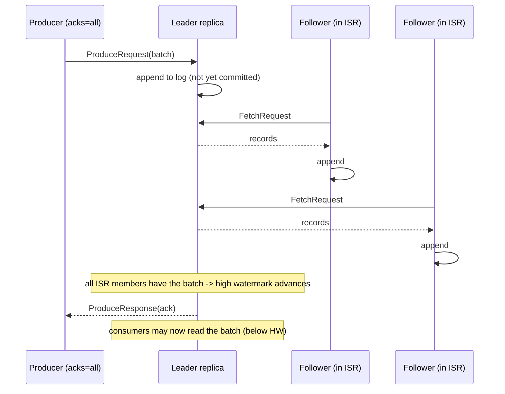
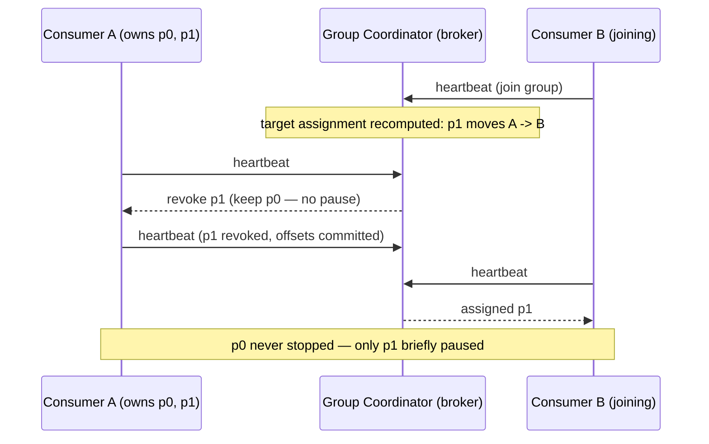
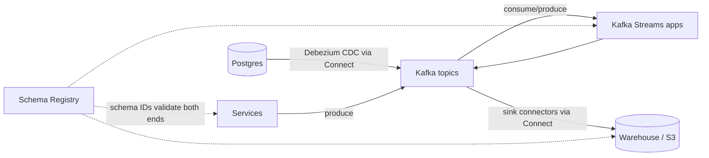

# Apache Kafka & Stream Processing Study Guide

A depth-first guide to Apache Kafka for engineers who have produced to a topic or consumed from one — perhaps through a wrapper library, perhaps in a hurry — but haven't reasoned carefully about what the machine underneath is doing, and therefore can't yet predict what it will do when a broker dies mid-write, a consumer group doubles in size, or a topic quietly accumulates two years of retention. It assumes you're comfortable on a command line and have met the basic ideas of replication and partitioning; it does not assume you can explain why `acks=all` alone doesn't make a write durable, or what actually happens during the two seconds your pipeline stalls on a rebalance.

The organizing idea is this: **Kafka is the replicated log made into infrastructure, and every feature is a consequence of the log abstraction.** A log — an append-only, ordered, immutable sequence of records — is the humblest data structure in computing, and it turns out to be the load-bearing one: it's what databases write before they update pages, what consensus algorithms replicate, and what lets two systems agree on what happened and in what order. Kafka's bet, made at LinkedIn in 2010 and vindicated everywhere since, was that if you build *one* first-class, distributed, fault-tolerant log service, an enormous amount of glue code disappears into it. Read every Kafka feature through that lens and it stops being a pile of configuration: partitions are logs, consumers are readers with bookmarks, compacted topics are logs viewed as tables, exactly-once is a protocol for moving log positions atomically, and — the pleasing self-referential twist — since Kafka 4.0 the cluster's own metadata is itself a Kafka-style replicated log driven by Raft. The guide builds in that order: the log itself, then the cluster that serves it, then replication, then the two client halves (producers and consumers), then the hard guarantee (exactly-once), then how the log lives on disk, then the ecosystem grown around it, and finally what it takes to run it — ending with when you shouldn't.

Primary references, all worth your time: the [official Kafka documentation](https://kafka.apache.org/documentation/) — in particular the [design section](https://kafka.apache.org/documentation/#design), which is unusually honest engineering writing that explains *why* each choice was made, not just what the knobs are; [*Kafka: The Definitive Guide*, 2nd edition](https://www.confluent.io/resources/ebook/kafka-the-definitive-guide/) (Shapira, Palino, Sivaram, Petty) — the best book-length treatment, strongest on the producer/consumer internals and operations chapters; Jay Kreps's essay [*The Log: What every software engineer should know about real-time data's unifying abstraction*](https://web.archive.org/web/20240105095933/https://engineering.linkedin.com/distributed-systems/log-what-every-software-engineer-should-know-about-real-time-datas-unifying) (archived — LinkedIn has since taken the original down), the founding document that makes the log-centric worldview click; and the [KIP index](https://cwiki.apache.org/confluence/display/KAFKA/Kafka+Improvement+Proposals) — every significant change to Kafka arrives as a Kafka Improvement Proposal with its motivation and rejected alternatives spelled out, so the KIPs are simultaneously the changelog and the best design-rationale reading in the project.

This guide has siblings that carry adjacent weight: the [Distributed Systems guide](DISTRIBUTED_SYSTEMS_STUDY_GUIDE.md) is the theoretical substrate — replication, consensus, the log as the replicated-state-machine backbone, and the delivery-semantics arguments this guide leans on constantly; the [Data Engineering guide](DATA_ENGINEERING_STUDY_GUIDE.md) covers the Spark/Flink pipelines that live downstream of Kafka and the lakehouse Kafka feeds; the [Redis guide](REDIS_STUDY_GUIDE.md) covers Redis Streams, the right lightweight alternative when a full Kafka deployment is overkill; and the [Observability guide](OBSERVABILITY_STUDY_GUIDE.md) covers the metrics-and-alerting machinery you'll aim at consumer lag, the one number that tells you whether a Kafka pipeline is healthy.

---

## Table of Contents

1. [Part 1 — The Log, Topics, and Partitions](#part-1--the-log-topics-and-partitions)
2. [Part 2 — Brokers, the Controller, and KRaft](#part-2--brokers-the-controller-and-kraft)
3. [Part 3 — Replication: ISR, the High Watermark, and Durability](#part-3--replication-isr-the-high-watermark-and-durability)
4. [Part 4 — Producers: Batching, Compression, and Idempotence](#part-4--producers-batching-compression-and-idempotence)
5. [Part 5 — Consumers: Groups, Rebalancing, and Lag](#part-5--consumers-groups-rebalancing-and-lag)
6. [Part 6 — Exactly-Once Semantics, Demystified](#part-6--exactly-once-semantics-demystified)
7. [Part 7 — Storage: Segments, Compaction, and Tiered Storage](#part-7--storage-segments-compaction-and-tiered-storage)
8. [Part 8 — The Ecosystem: Streams, Connect, and Schemas](#part-8--the-ecosystem-streams-connect-and-schemas)
9. [Part 9 — Operating Kafka in Production](#part-9--operating-kafka-in-production)

---

## Part 1 — The Log, Topics, and Partitions

Everything in Kafka is a view of one data structure, so start by taking that data structure seriously.

### The Log Abstraction

A **log** is an append-only sequence of records, ordered by time of arrival, in which existing entries are never modified. Each record gets a sequential ID — in Kafka, its **offset** — at the moment it's appended, and that offset is permanent. Two properties follow immediately, and they're the whole reason Kafka exists:

- **The log is a definition of order.** Two readers who process the same log from the same position, in offset order, will see exactly the same history and reach exactly the same state. This is the replicated-state-machine idea from the [Distributed Systems guide](DISTRIBUTED_SYSTEMS_STUDY_GUIDE.md)'s consensus part, applied as a product rather than an internal mechanism: the log doesn't just store data, it *arbitrates what happened first*.
- **Reading is non-destructive and positional.** A reader holds a bookmark (its offset) and advances it; the log doesn't care. That single design choice — the reader owns the position, not the broker — is what makes Kafka cheap to fan out (a hundred readers cost the broker little more than one, since they're all reading the same shared, mostly-page-cached bytes) and what makes **replay** possible: rewind your bookmark and history re-runs.

Contrast this with a classic message queue (RabbitMQ, SQS), where delivering a message *consumes* it: the broker tracks per-message state, fan-out requires duplicating messages, and replay is impossible because the data is gone. The queue-vs-log distinction is developed properly in the Distributed Systems guide's messaging part; here it's enough to note that Kafka sits firmly on the log side, and that Part 5's share groups are the recent, deliberate re-introduction of queue semantics *on top of* the log.

Kreps's [log essay](https://web.archive.org/web/20240105095933/https://engineering.linkedin.com/distributed-systems/log-what-every-software-engineer-should-know-about-real-time-datas-unifying) generalizes the point: a database's WAL, a filesystem journal, and a consensus algorithm's replicated log are all the same structure serving the same role — a durable record of ordered changes from which state can be derived. Kafka's contribution was to rip that structure out of the inside of databases and make it a shared, subscribe-able piece of infrastructure between systems.

### Topics, Partitions, and Offsets

A **topic** is a named category of records — `orders`, `page-views`, `postgres.public.users`. But a topic is not itself a log; it's a set of them. Each topic is split into **partitions**, and *the partition is the actual log*: an ordered, immutable, append-only sequence living on specific brokers' disks. Records within one partition are totally ordered by offset; records in different partitions of the same topic have **no defined order relative to each other**.

```text
topic "orders", 3 partitions:

partition 0:  | 0 | 1 | 2 | 3 | 4 | 5 | 6 | 7 | 8 | ...  <- appends go here
partition 1:  | 0 | 1 | 2 | 3 | 4 | 5 |
partition 2:  | 0 | 1 | 2 | 3 | 4 | 5 | 6 | 7 |
                                    ^
                      a consumer's offset (bookmark) into partition 2
```

An offset therefore only means something as the triple *(topic, partition, offset)* — offset 4 in partition 0 and offset 4 in partition 1 are unrelated records. Partitions exist for two reasons, and both are about limits:

- **Scale.** One log lives on one broker (plus replicas), so one log is bounded by one machine's disk and network. Splitting the topic across partitions spreads it across the cluster.
- **Parallelism.** As Part 5 develops, within a consumer group each partition is consumed by exactly one consumer, so the partition count is the ceiling on parallel consumption. A 12-partition topic can be consumed by at most 12 members of a group doing useful work.

The price is the loss of total order: **Kafka guarantees ordering per partition, never per topic.** This is the single most load-bearing fact in the system, the one that shapes schema design, key choice, partition-count decisions, and every downstream consumer. If a business process needs events in order, those events must share a partition.

### Keys and Partitioning

Which partition a record lands in is decided by the *producer* (the broker just appends what it's told). The default partitioner in the Java client and [librdkafka](https://github.com/edenhill/kcat)-based clients:

- **If the record has a key**, partition = `murmur2(key) % num_partitions`. Same key → same partition → same log → ordered. Give every event for `user-42` the key `user-42` and that user's history is totally ordered, while different users' events spread across partitions and process in parallel. This is the standard trick, and it's also a *contract*: change the partition count and `hash(key) % N` changes for almost every key, so ordering-by-key holds only within one partition-count era (Part 9 returns to this when sizing).
- **If the key is null**, modern producers use the **sticky partitioner** ([KIP-480](https://cwiki.apache.org/confluence/display/KAFKA/KIP-480%3A+Sticky+Partitioner), refined by [KIP-794](https://cwiki.apache.org/confluence/display/KAFKA/KIP-794%3A+Strictly+Uniform+Sticky+Partitioner)): fill a batch to one partition, then switch, rather than round-robining record-by-record. Same uniform distribution over time, dramatically better batching (Part 4 explains why batches matter).

A record is more than key and value: it carries a **timestamp** (producer-assigned event time by default, or broker-assigned append time if the topic sets `message.timestamp.type=LogAppendTime`) and optional **headers** (string→bytes metadata used for tracing, schema hints, and routing without deserializing the payload). Records travel and are stored in **batches**, which is where Kafka's compression and much of its throughput live.

### Consumption Is a Position, Retention Is a Policy

Because readers are just bookmarks, Kafka needs a separate answer to "when does data disappear?" — and the answer has nothing to do with whether anyone has read it. Each topic has a **retention policy**: keep records for a time window (`retention.ms`, default 7 days), up to a size (`retention.bytes`), or — the special mode Part 7 covers — keep the latest record per key forever (**compaction**). Within retention, any consumer can read any record any number of times. This decoupling is what enables the patterns that make Kafka more than plumbing:

- **Fan-out without coordination:** analytics, search indexing, and fraud detection all consume `orders` independently, each at its own pace, each with its own offsets, none affecting the others or the producer.
- **Replay:** deploy a fixed consumer, reset its offsets to yesterday (`kafka-consumer-groups.sh --reset-offsets --to-datetime ...`), and reprocess. Bugs become re-runnable instead of data-loss incidents.
- **Late-arriving consumers:** a system built next quarter can bootstrap from history that's still within retention (or, with tiered storage, from months of it).

### Getting Hands-On in Five Minutes

Everything above is observable on a laptop. The [quickstart](https://kafka.apache.org/quickstart) boils down to (Kafka 4.x, single combined-mode node):

```bash
# One-time: format a storage directory with a cluster ID (KRaft — Part 2)
KAFKA_CLUSTER_ID="$(bin/kafka-storage.sh random-uuid)"
bin/kafka-storage.sh format --standalone -t "$KAFKA_CLUSTER_ID" -c config/server.properties

bin/kafka-server-start.sh config/server.properties

# A topic with 3 partitions
bin/kafka-topics.sh --bootstrap-server localhost:9092 \
  --create --topic orders --partitions 3 --replication-factor 1

# Produce keyed records, then read them back with metadata
bin/kafka-console-producer.sh --bootstrap-server localhost:9092 \
  --topic orders --property parse.key=true --property key.separator=:
bin/kafka-console-consumer.sh --bootstrap-server localhost:9092 \
  --topic orders --from-beginning \
  --property print.partition=true --property print.offset=true --property print.key=true
```

Produce `user-42:created`, `user-7:created`, `user-42:paid` and watch the partition column: both `user-42` events land in the same partition with increasing offsets, while `user-7` likely lands elsewhere. For day-to-day poking, [`kcat`](https://github.com/edenhill/kcat) (formerly kafkacat) is the tool worth installing: `kcat -b localhost:9092 -t orders -C -f '%p @ %o: %k = %s\n'` prints partition/offset/key/value in one line.

```quiz
Q: Two records are produced to the topic `orders` a millisecond apart, with different keys. What does Kafka guarantee about the order consumers see them in?
- [ ] They'll be seen in produce order, because offsets are assigned cluster-wide
- [ ] They'll be seen in timestamp order, because records carry timestamps
- [x] Nothing, unless they happened to land in the same partition — ordering is per-partition only
- [ ] They'll be seen in produce order as long as the producer uses `acks=all`
> Different keys hash to (usually) different partitions, and partitions are independent logs with no cross-partition order. Timestamps are metadata, not an ordering mechanism, and `acks` is about durability, not order. If order between events matters, they must share a key.

Q: Why can Kafka support a hundred independent consumers of one topic where a traditional queue struggles?
- [x] Consumers are just offsets into a shared immutable log, so added readers reuse the same stored (and page-cached) bytes instead of requiring per-consumer message state
- [ ] Kafka brokers are simply faster at delivering messages than queue brokers
- [ ] Kafka copies each message into a per-consumer inbox at produce time
- [ ] Kafka limits each consumer to one partition, capping the load each can generate
> In a destructive-read queue the broker tracks per-message, per-consumer delivery state, and fan-out multiplies stored data. In a log, the reader owns its position and the data is written once — which is also exactly what makes replay possible.

Q: A team increases `orders` from 12 to 24 partitions to add consumer parallelism. What did they silently break?
- [ ] Existing offsets, which are renumbered across the new partition layout
- [ ] Retention, which restarts from zero for the whole topic
- [x] Key-to-partition affinity — `hash(key) % N` changed, so a key's new records land in a different partition than its old ones, breaking per-key ordering across the boundary
- [ ] Nothing; adding partitions is fully transparent to keyed producers
> Existing records never move (offsets are permanent), but future records for a given key now hash to a different partition. A consumer replaying `user-42`'s history sees old events in one partition and new events in another, with no order between them. Partition count is a contract to size up front (Part 9).

Q: Whether a Kafka record is deleted depends on what?
- [ ] Whether every subscribed consumer group has committed an offset past it
- [x] The topic's retention policy — time, size, or compaction — regardless of consumption
- [ ] Whether the producer requested acknowledged delivery
- [ ] Whether it has been read at least once
> Consumption and retention are fully decoupled: that's what allows replay, fan-out, and late-arriving consumers. The corollary bites both ways — data vanishes on schedule even if nobody has read it yet (lag past retention = silent loss), and data lingers even after everyone has read it.
```

---

## Part 2 — Brokers, the Controller, and KRaft

A Kafka cluster is a set of **brokers** — JVM processes, each owning a slice of the partitions — plus a **controller** that decides who owns what. This part is about that control plane, because it changed fundamentally in the 4.0 era and because the change is the guide's through-line applied to Kafka itself.

### What a Broker Does

Each broker hosts some set of partition replicas and does three jobs: serve **produce** requests (append batches to the partitions it leads), serve **fetch** requests (hand consumers and follower replicas ranges of the log, heavily assisted by the OS page cache — Part 7), and participate in **replication** (fetch from the leaders of partitions it follows). Clients don't need a load balancer: they bootstrap against any broker (`bootstrap.servers`), request cluster **metadata** — which broker leads which partition — and then talk *directly* to each partition's leader. When leadership moves, clients get an error, refresh metadata, and retry; the [wire protocol](https://kafka.apache.org/protocol.html) is versioned and bidirectionally negotiated, which is why old clients keep working against new clusters.

The important mental picture: brokers are *not* interchangeable front-ends over shared storage (that's Pulsar's design, see Part 9's landscape note). A broker owns the disks its replicas live on, so data placement, leadership, and load are all per-partition facts about specific machines — and rebalancing them is real data movement.

### The Controller: The Cluster's Brain

Somebody must maintain the authoritative cluster state — which brokers are alive, which replica leads each partition, what topics exist with what configs — and drive changes to it: broker joins, broker dies, elect new leaders for its partitions, propagate the new metadata to everyone. That somebody is the **controller**.

Through Kafka 2.x this was one broker, elected via an ephemeral znode in **ZooKeeper**, with all cluster metadata stored in ZooKeeper and mirrored into every broker's memory. It worked, but with structural problems that got worse as clusters grew: metadata lived in two places (ZooKeeper and the controller's cache) that could diverge; a controller failover had to reload *all* metadata from ZooKeeper and re-push state to every broker, making failover time — and thus partition unavailability windows — scale with partition count; and every Kafka deployment carried a second distributed system with its own consensus protocol, configuration, monitoring, and failure modes.

### KRaft: Kafka's Metadata Is a Log Too

The fix, proposed in [KIP-500](https://cwiki.apache.org/confluence/display/KAFKA/KIP-500%3A+Replace+ZooKeeper+with+a+Self-Managed+Metadata+Quorum), is the guide's thesis eating its own tail: **store the cluster metadata in a Kafka-style replicated log, managed by Kafka itself, replicated by [Raft](https://raft.github.io/raft.pdf).** In **KRaft** mode:

- A small **controller quorum** (3 or 5 nodes, standard consensus sizing) replicates a single-partition internal topic, `__cluster_metadata`, using a Raft variant adapted to Kafka's pull-based replication. The quorum leader *is* the active controller; leader election is Raft's, not ZooKeeper's.
- Every metadata change — topic created, broker fenced, leader changed, config altered — is an **event appended to that log**. Brokers replicate the metadata log like consumers and apply it to build their local view; a broker that restarts doesn't re-fetch the world, it resumes from its last applied offset (with periodic snapshots to bound catch-up, exactly like Raft snapshotting).
- Controller failover is near-instant regardless of cluster size: the standby controllers *already have* the metadata log applied, so the new leader starts leading rather than start loading. This is the concrete payoff — clusters that can hold millions of partitions with failover measured in hundreds of milliseconds rather than minutes.

Deployment is two `server.properties` decisions: `process.roles=broker`, `controller`, or `broker,controller` (**combined mode** — fine for dev and small clusters; dedicated controller nodes are the production norm at scale), and `controller.quorum.bootstrap.servers` pointing at the quorum. The [KRaft section of the docs](https://kafka.apache.org/documentation/#kraft) covers the ops details.

The timeline you need for real-world archaeology: KRaft went production-ready in 3.3 (2022), Kafka **3.9** (late 2024) was the final 3.x line and the designated **bridge release** for ZooKeeper→KRaft migrations, and **Kafka 4.0 (March 2025) removed ZooKeeper support entirely** — a 4.x broker cannot join a ZooKeeper-mode cluster, and the migration path for a ZK-era cluster is *through* 3.9 (see the [4.0 release announcement](https://kafka.apache.org/blog) for the full removal list, which also dropped MirrorMaker 1 and long-deprecated client APIs, and made brokers require Java 17). In mid-2026, KRaft is simply how Kafka works; ZooKeeper is history you'll meet in older clusters, stale blog posts, and interview questions. When you read tuning advice that mentions `zookeeper.connect`, check its date.

One thing KRaft deliberately did *not* change: the data plane. Partition replication (Part 3) still uses Kafka's own leader/ISR protocol, not Raft. Raft's majority-quorum replication is spent where it belongs — on the small, critical metadata — while the bulk data path keeps the cheaper, more tunable ISR scheme. That division (consensus for the control plane, lighter replication for the data plane) is the standard architecture of modern distributed systems, and Kafka now exhibits it internally.

```quiz
Q: In KRaft mode, how does a newly elected controller get the cluster metadata it needs to lead?
- [ ] It reloads the full cluster state from the `__cluster_metadata` topic's snapshot on the old leader
- [ ] It queries every broker for its current view and reconciles the answers
- [x] It already has it — standby controllers continuously replicate and apply the metadata log, so failover is a leadership change, not a data load
- [ ] It replays the ZooKeeper transaction log from the last checkpoint
> This is precisely what fixed the old design's worst property: ZooKeeper-era controller failover reloaded all metadata and re-pushed it to every broker, so recovery time grew with partition count. In KRaft the metadata is a replicated log every quorum member has already applied — the new leader just starts appending.

Q: Why do Kafka clients not need a load balancer in front of the brokers?
- [ ] Brokers gossip each request to whichever broker owns the data
- [x] Clients fetch cluster metadata from a bootstrap broker and then connect directly to each partition's leader, refreshing metadata when leadership moves
- [ ] All brokers can serve writes for all partitions
- [ ] The controller proxies all produce and fetch traffic
> Kafka pushes routing into the client: metadata says which broker leads which partition, and the client goes straight there. A stale view produces a retriable "not leader" error that triggers a metadata refresh — which is why leadership changes cause brief error blips rather than outages.

Q: KRaft replaced ZooKeeper for metadata. What still does NOT use Raft in a 4.x cluster?
- [ ] Controller leader election
- [ ] Propagation of topic configuration changes
- [x] Replication of ordinary topic partitions, which still uses the leader/ISR protocol
- [ ] Storage of the cluster metadata log
> KIP-500 moved the control plane onto Raft and left the data plane alone. Majority-quorum consensus is comparatively expensive and inflexible; the ISR scheme (Part 3) lets operators tune the durability/latency trade per topic. Spending consensus only on small critical state is the classic division of labor.

Q: You inherit a cluster running Kafka 3.5 with ZooKeeper and want to get to 4.x. What's the required shape of the path?
- [x] Upgrade to the 3.9 bridge release, migrate the metadata from ZooKeeper to a KRaft quorum there, then upgrade to 4.x
- [ ] Upgrade brokers directly to 4.0, which auto-imports the ZooKeeper state on first boot
- [ ] Run 4.x brokers alongside the 3.5 cluster and mirror the topics across
- [ ] No migration is needed; 4.x brokers can join a ZooKeeper cluster in compatibility mode
> Kafka 4.0 removed ZooKeeper support entirely — a 4.x broker can't even join a ZK-mode cluster, so there's no in-place jump. The supported route is through the designated bridge release (3.9), where the ZK→KRaft migration tooling lives. Mirroring into a fresh cluster works but is a data migration, not an upgrade.
```

---

## Part 3 — Replication: ISR, the High Watermark, and Durability

A log on one disk is a promise waiting to be broken. This part is Kafka's replication protocol in enough depth to answer the only question that matters: *under exactly what configuration, and exactly which failures, is an acknowledged write guaranteed to survive?*

### Leaders, Followers, and the ISR

Every partition with replication factor N has one **leader** replica and N−1 **followers**, spread across brokers (and, with `broker.rack` configured, across racks or availability zones). All produces go to the leader; followers replicate by sending the leader fetch requests — the same pull mechanism consumers use — and appending what comes back to their own copy of the log. Pull-based replication matters: a slow follower simply falls behind, exerting backpressure on itself rather than forcing the leader to buffer or block.

The leader tracks which followers are keeping up. A follower that has caught up to the leader's log end within the last `replica.lag.time.max.ms` (default 30 s) is **in-sync**; the set of in-sync replicas — always including the leader — is the **ISR**. Fall behind longer and you're removed from the ISR (an **ISR shrink**, a metric worth alerting on — Part 9); catch back up and you're re-added. The ISR is Kafka's pragmatic middle path between "wait for all replicas" (one slow disk stalls the world) and "wait for a majority" (fixed quorum, no per-topic tuning): **the acknowledgement set adapts to who is actually healthy**, and the membership change is itself recorded through the controller so everyone agrees on it.

### The High Watermark: What "Committed" Means

A record appended to the leader's log is not yet *committed* — the leader might die before any follower copies it. The **high watermark (HW)** is the offset up to which *every current ISR member* has replicated; everything below it is committed, and **consumers can only read up to the high watermark**. That rule is load-bearing: if consumers could read uncommitted records, a leader failure could destroy records that had already been consumed and acted on — history would rewrite itself. By hiding records until the whole ISR has them, Kafka guarantees that anything a consumer has seen will survive any failover that promotes an ISR member.

Failover is exactly that: when a leader's broker dies (its session with the controller lapses), the controller picks a **new leader from the ISR** and bumps the partition's **leader epoch** — a monotonic counter stamped into the log with every leadership change ([KIP-101](https://cwiki.apache.org/confluence/display/KAFKA/KIP-101+-+Alter+Replication+Protocol+to+use+Leader+Epoch+rather+than+High+Watermark+for+Truncation)). Epochs are Kafka's fencing tokens: a deposed leader that comes back and tries to act on its stale view is rejected, and a recovering follower uses epoch information to find exactly where its log diverged from the new leader's and truncate precisely there, rather than guessing from the high watermark (which, pre-KIP-101, could truncate too much or too little and silently diverge replicas).

### `acks` and `min.insync.replicas`: The Durability Contract

Producer-side, [`acks`](https://kafka.apache.org/documentation/#producerconfigs) sets what "the write succeeded" means:

- `acks=0` — don't wait at all. Data can vanish without an error. Only for streams where loss is genuinely fine.
- `acks=1` — the leader appended it. If the leader dies before any follower fetches it, the write is lost *after* being acknowledged.
- `acks=all` (the default since 3.0) — the write is acknowledged only when **every current ISR member** has it.

Here is the subtlety that has bitten many teams: `acks=all` waits for the ISR, *whatever the ISR currently is*. If two of your three replicas have fallen out of sync, the ISR is just the leader, and `acks=all` degenerates to `acks=1` — acknowledged writes on a single disk. The broker/topic setting [`min.insync.replicas`](https://kafka.apache.org/documentation/#brokerconfigs) closes the hole: with `min.insync.replicas=2`, a produce with `acks=all` is **rejected** (`NotEnoughReplicasException`) whenever the ISR has fewer than 2 members. The durable recipe is therefore a three-legged stool — **RF=3, `acks=all`, `min.insync.replicas=2`** — and it means: every acknowledged write is on at least 2 machines, you survive one broker failure with zero acknowledged-data loss, and if the cluster degrades so far it can't honor that, it *fails writes loudly* instead of accepting them fragile. Choosing to reject writes rather than risk them is a deliberate consistency-over-availability stance; know that you're making it, and that with `min.insync.replicas=2` and RF=3 you can only tolerate one down replica before producers stall.

Two more legs the stool quietly stands on:

- **Kafka does not fsync per message.** Records are written to the filesystem page cache and flushed by the OS; `log.flush.interval.messages` exists but the [design docs](https://kafka.apache.org/documentation/#design) recommend leaving it alone. Durability comes from **replication across machines**, not from disk flushes on one machine — a simultaneous power loss across all replicas can lose the page-cache tail. Rack-aware replica placement is what makes "simultaneous" implausible; treat it as part of the durability config, not an optimization.
- **The producer must not give up or reorder.** `acks=all` guarantees nothing if the producer drops the batch after a transient error; Part 4's idempotence and `delivery.timeout.ms` are the client half of the contract.

### Unclean Leader Election: The Last Resort You Configure in Advance

What if a partition's *entire* ISR is gone — every in-sync replica dead — but an out-of-sync follower is still alive, missing the last stretch of committed records? Kafka faces the naked availability/durability trade:

- **Wait** for an ISR member to come back (`unclean.leader.election.enable=false`, the default): the partition is unavailable until then, but no committed data is lost.
- **Promote the stale replica** (`=true`): the partition serves immediately, and every committed record the stale replica lacks is *gone* — worse, consumers ahead of the new (lower) log end are non-monotonically rewound.

The default was `true` until Kafka 0.11, and silent data loss under exactly this scenario is a centerpiece of Kyle Kingsbury's [Jepsen analysis of early Kafka](https://aphyr.com/posts/293-jepsen-kafka) — worth reading as the canonical demonstration that replication protocols are claims to verify, not trust. Leave it `false` for anything you care about; enable it, per topic, only where availability genuinely outranks data (metrics firehoses, say).

### The Write Path, End to End



One reading of the diagram to internalize: followers *pull*, so the leader learns a follower has a record from the *offset in the follower's next fetch* — replication progress rides on the fetch loop itself. And because the acknowledgement waits on the slowest current ISR member, produce latency at `acks=all` is a tail-latency story about your worst in-sync disk, which is why ISR shrinks and produce p99 spikes so often arrive together.

A last replication feature to file away: consumers normally fetch from the leader, but [KIP-392](https://cwiki.apache.org/confluence/display/KAFKA/KIP-392%3A+Allow+consumers+to+fetch+from+closest+replica) lets a consumer read from the *closest* replica (`client.rack` on the consumer, `replica.selector.class` on the broker) — a large cross-AZ traffic saving in cloud deployments, at the cost of slightly staler reads (follower HW lags leader HW).

```quiz
Q: A producer runs with `acks=all` against a topic with RF=3 and default `min.insync.replicas=1`. Two replicas have been out of sync for a minute when the producer's write is acknowledged, and then the leader's disk dies. What happened to the write?
- [ ] It's safe on the remaining followers, because `acks=all` waited for all three replicas
- [ ] It was rejected with NotEnoughReplicas, so the producer knows to retry
- [x] It's likely lost — `acks=all` waits only for the *current* ISR, which had shrunk to just the leader
- [ ] It's recoverable because followers truncate to the leader epoch
> `acks=all` means "all in-sync replicas," and the ISR adapts to health — with two replicas lagging, it was just the leader, so the ack meant one machine had the data. `min.insync.replicas=2` exists precisely to make this situation a loud produce failure instead of a silent single-copy ack.

Q: Why are consumers forbidden from reading past the high watermark?
- [ ] To give the leader time to compress batches before delivery
- [x] Records above the HW aren't yet on every ISR member, so a failover could erase them — after a consumer had already acted on them
- [ ] Because offsets above the HW haven't been assigned yet
- [ ] To ensure consumers in a group see records at the same time
> The HW marks what's committed: guaranteed to survive any ISR-member promotion. Serving uncommitted records would let history rewrite itself — a record consumed, then destroyed by failover. Hiding the tail until it's replicated is what makes "consumed" imply "durable."

Q: What problem do leader epochs (KIP-101) solve during failover?
- [ ] They let the controller choose the follower with the longest log as leader
- [ ] They prevent the ISR from shrinking below `min.insync.replicas`
- [x] They fence stale leaders and let recovering replicas find the exact divergence point to truncate, instead of guessing from the high watermark
- [ ] They allow consumers to keep fetching during the election
> The epoch is a monotonic fencing token stamped into the log at each leadership change. A deposed leader's requests are rejected, and a rejoining replica asks "where did epoch N end?" to truncate precisely — pre-KIP-101, HW-based truncation could leave replicas silently divergent.

Q: Your three-replica partition has lost its entire ISR; one stale follower is alive. With `unclean.leader.election.enable=false`, what does Kafka do, and why might you ever flip it?
- [ ] Promote the stale follower after `replica.lag.time.max.ms` expires, to bound downtime
- [x] Keep the partition offline until an ISR member returns; you'd flip it only for data where availability outranks the committed records you'd destroy
- [ ] Elect the stale follower but mark the topic read-only
- [ ] Rebuild the partition from the metadata log
> This is the raw durability/availability trade with no third option: wait (unavailable, nothing lost) or promote stale (available, committed records gone and consumer offsets rewound). The default has been "wait" since 0.11 — the earlier default of `true` is how early Kafka lost acknowledged writes in the Jepsen analysis.

Q: Kafka acknowledges writes that are only in the page cache of several machines, not fsynced. Why is this considered acceptable?
- [x] Durability is delegated to replication — loss requires simultaneous failure of all replicas, made implausible by rack-aware placement — while fsync-per-message would destroy throughput
- [ ] The OS guarantees page-cache contents survive power loss
- [ ] Because the metadata log is fsynced, partition data can always be reconstructed
- [ ] It isn't; production clusters must set `log.flush.interval.messages=1`
> Kafka's design bet: independent failures across racks/AZs are the realistic threat model, and surviving them needs copies on other machines, which fsync doesn't provide anyway. The flush settings exist but the design docs recommend leaving durability to replication — meaning rack awareness is part of your durability posture, not a nicety.
```

---

## Part 4 — Producers: Batching, Compression, and Idempotence

The producer is not a thin wrapper around a socket; it's a small buffering, batching, retrying state machine, and most Kafka throughput and delivery-semantics problems are configured (or misconfigured) here.

### Anatomy of a Send

When application code calls `send()`, the record passes through a **serializer** (your bytes-in-bytes-out contract — Part 8's schemas live here), the **partitioner** (Part 1), and lands in the **record accumulator**: an in-memory pool (`buffer.memory`, default 32 MB) of per-partition batches. A background **sender thread** drains batches to the brokers that lead their partitions, many batches to one broker per request. `send()` returns a future immediately; blocking happens only if the accumulator is full (`max.block.ms`). Two knobs shape the batching:

- [`batch.size`](https://kafka.apache.org/documentation/#producerconfigs) (default 16 KB) — the target size per partition-batch. A batch ships when full…
- `linger.ms` (default 0) — …or when it has waited this long. The default sends as soon as the sender is free, which under low load means tiny batches. Setting `linger.ms=5–20` deliberately trades a few milliseconds of latency for dramatically fewer, larger requests — one of the highest-leverage single-line changes in Kafka tuning, because *everything downstream is per-batch*: compression ratio, broker CPU per record, replication efficiency, and disk layout.

**Compression** (`compression.type`: `lz4`, `zstd`, `snappy`, `gzip`) is applied per batch on the producer, and — crucially — the broker stores and replicates the batch *still compressed*, and consumers decompress it. The cluster pays network and disk for compressed bytes while the CPU cost sits at the edges. `zstd` (since 2.1) is the usual modern choice: near-gzip ratios at near-lz4 speed. Compression is also why bigger batches matter squared: ratio improves with batch size.

### Retries Without Duplicates or Reordering: The Idempotent Producer

A transient error — leader moved, connection reset, request timed out — must be retried, and the Distributed Systems guide's delivery-semantics argument applies in full: the timed-out request may have *succeeded*, so a blind retry writes the batch twice. Worse, with multiple requests in flight (`max.in.flight.requests.per.connection`, default 5), batch 1 can fail and be retried *after* batch 2 landed — reordering the log.

The **idempotent producer** ([KIP-98](https://cwiki.apache.org/confluence/display/KAFKA/KIP-98+-+Exactly+Once+Delivery+and+Transactional+Messaging), default-on since Kafka 3.0 via `enable.idempotence=true`) fixes both with the classic dedup recipe: the broker assigns each producer a **producer ID (PID)**, and the producer stamps every batch with a per-partition, monotonically increasing **sequence number**. The partition leader tracks the last sequences per PID and: discards a batch it has already appended (duplicate retry — the too-old sequence is acknowledged again, not re-written), and rejects a batch that would skip ahead (out-of-order retry), forcing the client to resolve order before proceeding. With idempotence on, `retries` can be huge (it defaults to effectively-infinite) and up to 5 in-flight requests remain safe, because the broker holds enough per-PID state to sequence them.

Scope matters: idempotence deduplicates **within one producer session, per partition**. It will not catch your *application* calling `send()` twice for the same logical event (that's an application-level idempotency key), and a restarted producer is a new PID (unless transactional — Part 6). What it eliminates is the infrastructure-level duplicate: the retry-after-lost-ack.

The end-to-end give-up knob is `delivery.timeout.ms` (default 120 s): total time a record may spend between `send()` and success, spanning batching, in-flight time, and all retries. When it expires, the future fails — and what your code does with that failure *is* your real delivery guarantee. Log-and-drop means at-most-once with extra steps.

### Seeing It: Config and a Throughput Baseline

A durable, high-throughput producer config in the Java-properties dialect every client mirrors:

```properties
bootstrap.servers=broker1:9092,broker2:9092
acks=all
enable.idempotence=true
compression.type=zstd
linger.ms=10
batch.size=65536
delivery.timeout.ms=120000
```

And the same ideas from Python, via [confluent-kafka-python](https://github.com/confluentinc/confluent-kafka-python) (a binding over librdkafka, the C client that powers most non-JVM ecosystems):

```python
from confluent_kafka import Producer

p = Producer({
    "bootstrap.servers": "localhost:9092",
    "enable.idempotence": True,          # implies acks=all, safe retries
    "compression.type": "zstd",
    "linger.ms": 10,
})

def on_delivery(err, msg):
    if err is not None:
        # This callback firing with an error IS your delivery guarantee.
        # Dead-letter it, alert, or crash -- but don't just log it.
        raise SystemExit(f"delivery failed: {err}")

p.produce("orders", key="user-42", value=b'{"event":"paid"}', on_delivery=on_delivery)
p.flush(10)
```

Measure the batching effect yourself with the bundled load generator — run it twice, with `linger.ms=0` versus `linger.ms=20`, and compare records/sec and request rates:

```bash
bin/kafka-producer-perf-test.sh --topic orders --num-records 1000000 \
  --record-size 1024 --throughput -1 \
  --producer-props bootstrap.servers=localhost:9092 acks=all linger.ms=20 compression.type=zstd
```

```quiz
Q: Under low traffic, a service produces 200 records/sec and the broker sees 200 produce requests/sec. What single change most improves this, and what does it cost?
- [ ] Raising `batch.size` — at the cost of more producer memory
- [x] Setting `linger.ms` to a few milliseconds, so batches accumulate — at the cost of that much added produce latency
- [ ] Enabling `acks=0` — at the cost of durability
- [ ] Raising `max.in.flight.requests.per.connection` — at the cost of ordering
> With the default `linger.ms=0`, an idle sender ships each record the moment it arrives — one record per batch, so `batch.size` never fills and raising it changes nothing. Lingering trades bounded latency for fewer, larger, better-compressed batches, and every downstream cost (broker CPU, replication, disk) is per-batch.

Q: How does the idempotent producer prevent a retried batch from being appended twice?
- [ ] The producer checksums each batch and the broker rejects known checksums
- [ ] The broker holds retried batches until the original request times out
- [x] Each batch carries a producer ID and per-partition sequence number; the leader discards batches whose sequence it has already appended
- [ ] The producer reads the log end before retrying to check whether the batch landed
> It's the classic at-least-once-plus-dedup construction, pushed into the broker: the retry after a lost ack arrives with an already-seen sequence and is acknowledged without being re-appended. Sequence tracking is also what keeps 5 in-flight requests from reordering the log.

Q: Which duplicate does `enable.idempotence=true` NOT protect against?
- [ ] A batch retried because the acknowledgement was lost in the network
- [ ] A batch re-sent after a leader failover
- [x] The application calling `send()` twice for the same logical event
- [ ] Reordering between two in-flight batches during retries
> Idempotence dedups at the infrastructure layer — one producer session, per partition, by sequence number. Two `send()` calls are two records with two sequences, both appended faithfully. Application-level duplicates need application-level identity: an idempotency key, or the transactional read-process-write pattern of Part 6.

Q: Where does the CPU cost of Kafka compression land, and why is that a design win?
- [x] On producers and consumers — brokers store, replicate, and serve batches still compressed, so the cluster pays only for smaller bytes
- [ ] On the brokers, which recompress batches into the configured storage codec
- [ ] On the leader only; followers receive decompressed records
- [ ] Nowhere — Kafka compression is metadata-only
> Compression is per-batch at the producer, and the batch travels the whole pipeline — network, leader disk, follower replication, consumer fetch — in compressed form. The horizontally-abundant resource (client CPU) is spent to save the broker-side resources that are hardest to scale.
```

---

## Part 5 — Consumers: Groups, Rebalancing, and Lag

Producers are simple compared to what follows. Consumers carry the two genuinely stateful problems of the client side: *who reads which partition* (group membership and rebalancing) and *where was I* (offset management) — and the operational failures Kafka is famous for (rebalance storms, silent reprocessing, lag spirals) all live here.

### The Poll Loop and Consumer Groups

A Kafka consumer is a loop: `poll()` fetches batches from its assigned partitions, application code processes them, offsets get committed, repeat. There's no push and no per-message server-side delivery state — flow control is inherent, because a slow consumer simply polls less and its bookmark advances slower.

A **consumer group** (all consumers sharing a `group.id`) is how you parallelize: the group's members divide the topic's partitions among themselves, **each partition to exactly one member**, so the log's per-partition ordering survives parallel consumption. Groups are also the fan-out unit: two different group IDs each get the whole topic independently. Each group's progress lives in **`__consumer_offsets`**, an internal *compacted topic* (Part 7) keyed by (group, topic, partition) — offsets are themselves log entries whose latest value per key is the group's position; the log abstraction again. One broker per group acts as its **group coordinator**, managing membership and offset commits.

**When you commit determines your delivery semantics**, exactly as the Distributed Systems guide's Part 7 frames it. Commit *after* processing (the default pattern; `enable.auto.commit=false` plus explicit `commitSync()`/`commitAsync()`) and a crash between processing and commit means those records are processed *again* on restart — **at-least-once, so processing must be idempotent**. Commit *before* processing and a crash loses that batch — at-most-once. Auto-commit (`enable.auto.commit=true`, every 5 s from the poll thread) is approximately at-least-once but can also *lose* records if you hand records to another thread and crash — the classic subtle default; turn it off the moment correctness matters. And a consumer with *no* committed offset starts where `auto.offset.reset` says: `latest` (default — silently skips history) or `earliest`; a wrong value here is the classic "my new consumer read nothing / read everything twice" incident.

### Rebalancing: The Classic Protocol and Its Cost

When membership or subscription changes — a consumer joins, leaves, crashes, or a topic grows partitions — the group **rebalances**: partition ownership is recomputed. In the **classic protocol**, a rebalance is a group-wide barrier: every member is told to rejoin, ownership is recomputed (by one member, the "group leader," running the configured `partition.assignment.strategy`), and the new assignment is distributed. The original **eager** flavor made this a stop-the-world event — every consumer *revokes all its partitions first*, waits for reassignment, and only then resumes. The whole group stops consuming during every rebalance, even though most partitions end up back where they started.

Two mitigations arrived within the classic protocol. **Incremental cooperative rebalancing** ([KIP-429](https://cwiki.apache.org/confluence/display/KAFKA/KIP-429%3A+Kafka+Consumer+Incremental+Rebalance+Protocol), the `CooperativeStickyAssignor`) restructured the dance: members keep their partitions through the rebalance and revoke *only the ones actually moving*, in a second small round — turning stop-the-world into a ripple. **Static membership** (`group.instance.id`) gives each member a stable identity so a bounced pod (deploys, Kubernetes rescheduling) reclaims its old partitions within `session.timeout.ms` without triggering a rebalance at all.

But rebalances are triggered by *liveness judgments*, and those come from two separate timers worth keeping straight: the background heartbeat (`session.timeout.ms`, default 45 s — "is the process alive?") and **`max.poll.interval.ms`** (default 5 min — "is the *poll loop* alive?"). A consumer that takes six minutes to process a batch is declared dead *while working*, its partitions are reassigned, its eventual commit is rejected, and the records are reprocessed elsewhere — which, if processing is slow because of load, makes the load worse. That feedback loop is the **rebalance storm**, and Part 9 treats it as the operational pitfall it is.

### KIP-848: The Next-Generation Rebalance Protocol

Kafka 4.0 shipped the deeper fix as GA: [KIP-848](https://cwiki.apache.org/confluence/display/KAFKA/KIP-848%3A+The+Next+Generation+of+the+Consumer+Rebalance+Protocol) replaces the client-driven, barrier-based protocol with a **broker-driven, fully incremental** one. The group coordinator itself computes assignments (no client-side "group leader," no group-wide JoinGroup/SyncGroup barrier) and reconciles the group *member by member*, piggybacking assignment changes on each member's regular heartbeats: revoke this partition from A on A's next heartbeat; once A confirms, grant it to B on B's. Nobody else notices. A membership change becomes a local event between the coordinator and the affected members rather than a group-wide pause — killing both the stop-the-world stall and the thundering-herd rejoin. Brokers in 4.x speak the new protocol by default; consumers opt in with `group.protocol=consumer`, and the classic protocol remains for older clients during the transition.



### Lag: The Health Metric

**Consumer lag** is, per partition, the distance between the log end offset and the group's committed offset — how far behind live data a consumer is. It is *the* health metric of any Kafka pipeline, because it's the integral of every other problem: slow processing, undersized groups, rebalance churn, poison messages, and broker trouble all present as lag. Three readings matter: absolute lag (how stale are results?), **lag trend** (flat lag is a capacity statement; *growing* lag is an outage in progress — the consumer is slower than the producer and will never catch up without change), and lag vs. **retention** (lag approaching the retention window means records will be deleted *before being read* — at-least-once silently becomes at-most-once). Inspect it directly:

```bash
bin/kafka-consumer-groups.sh --bootstrap-server localhost:9092 \
  --describe --group billing
# TOPIC  PARTITION  CURRENT-OFFSET  LOG-END-OFFSET  LAG  CONSUMER-ID ...
```

For continuous evaluation, [Burrow](https://github.com/linkedin/Burrow) (LinkedIn's lag checker, which judges *trend* rather than thresholds) and the standard Prometheus exporters feed the alerting practices in the [Observability guide](OBSERVABILITY_STUDY_GUIDE.md); alert on trend and on lag-vs-retention, not on any fixed number.

### Share Groups: Queue Semantics on the Log (KIP-932)

The consumer-group model has a structural limit: parallelism ≤ partition count, and one slow record blocks everything behind it in its partition. For genuine *work-queue* workloads — independent jobs, no ordering requirement, want 500 workers on a 12-partition topic — Kafka historically forced awkward workarounds. [KIP-932 "Queues for Kafka"](https://cwiki.apache.org/confluence/display/KAFKA/KIP-932%3A+Queues+for+Kafka) adds **share groups**: many members consume the *same* partition concurrently, with the broker handing out records in short-lived **acquisition locks**; each record is individually **acknowledged, released** (redeliver), or **rejected**, with per-record delivery counts to cap redelivery. It's SQS-style semantics *on top of* the unchanged log — the log still stores and retains; only the consumption protocol changes, so ordering is deliberately given up and processing must tolerate redelivery, out-of-order delivery, and duplicates. Share groups shipped as early access in 4.0 and preview in 4.1 on the road to GA — check the KIP for current status before betting production on it, but learn the model now: it removes the main reason teams bolted a second queueing system alongside Kafka.

```quiz
Q: A consumer group processes records, then commits offsets. A consumer crashes after processing a batch but before committing. What happens, and what does it demand of your code?
- [ ] The batch is lost; the next consumer starts after it — code needs no special care
- [x] The batch is reprocessed by whichever member takes over the partition — so processing must be idempotent
- [ ] The coordinator replays only the records that weren't processed
- [ ] The group halts until the crashed member returns with its offsets
> Commit-after-processing is at-least-once: the committed offset is the only record of progress, and it's behind reality at the moment of the crash. Kafka can't know the batch was processed — dedup is the consumer's job. (Commit-before-processing flips the failure to loss: at-most-once.)

Q: Why was the eager rebalance protocol so painful for large groups on frequent deploys?
- [ ] Offsets were discarded on every rebalance, forcing a re-read from `auto.offset.reset`
- [ ] Rebalancing required a broker restart to install the new assignment
- [x] Every member revoked all partitions before any reassignment, so the entire group stopped consuming on every membership change — even for partitions that didn't move
- [ ] Each rebalance doubled the group's memory usage during the handoff
> Stop-the-world was the design, not a bug: revoke everything, rejoin, reassign. A 50-member group deploying one pod at a time triggered 50 full pauses. Cooperative rebalancing (KIP-429) moved only the affected partitions; static membership avoids the rebalance for bounced pods; KIP-848 removes the global barrier entirely.

Q: What is the key architectural change in the KIP-848 rebalance protocol?
- [ ] Assignments are computed by the largest consumer instead of the group leader
- [x] The group coordinator computes assignments and reconciles members one at a time via their heartbeats — no client-side group leader, no group-wide synchronization barrier
- [ ] Partitions are reassigned only when a consumer explicitly requests more work
- [ ] Consumers elect a leader through the Raft metadata quorum
> Moving assignment into the broker and making reconciliation per-member turns "the group rebalances" into "these two members exchange a partition." The blast radius of a membership change shrinks from the whole group to the partitions actually moving.

Q: Your pipeline's consumer lag has been growing linearly for six hours and retention on the topic is 24 hours. What is the correct reading?
- [ ] The pipeline is healthy as long as lag is below the partition count times `batch.size`
- [ ] It's a latency problem only; data is safe because Kafka retains by policy
- [x] Consumption is slower than production and, unchanged, the group will eventually lag past retention — at which point unread records are deleted and the pipeline silently loses data
- [ ] The group coordinator will trigger a rebalance to fix it automatically
> Growing lag means throughput deficit, not momentary staleness — no rebalance conjures capacity. And retention doesn't care about readers: once lag crosses the retention window, deletion outruns consumption. Lag *trend* and lag-vs-retention are the two alerts that matter.

Q: A team wants 200 workers processing independent jobs from a 10-partition topic, with per-job retry. Which fits, and what do they give up?
- [ ] A consumer group with 200 members — the coordinator multiplexes partitions across them
- [ ] Raising `max.poll.interval.ms` so 10 consumers can each run 20 threads
- [ ] Reading with 200 distinct group IDs and dividing jobs by hash in the application
- [x] A share group (KIP-932): members share partitions with per-record acks and delivery counts — giving up ordering and accepting redelivery/duplicates
> A classic group caps useful members at 10 here (190 idle), and one slow job blocks its partition. Share groups trade the log's consumption-order guarantee for queue semantics — individual acquisition, ack/release/reject, bounded redelivery — while the underlying storage stays the same log.
```

---

## Part 6 — Exactly-Once Semantics, Demystified

"Exactly-once" is the most oversold phrase in messaging, and the [Distributed Systems guide](DISTRIBUTED_SYSTEMS_STUDY_GUIDE.md) already made the theoretical point: exactly-once *delivery* over an unreliable network is impossible, and every real "exactly-once" is at-least-once delivery plus deduplication plus atomicity somewhere. Kafka's exactly-once semantics (**EOS**) is the honest, engineered version of exactly that — and understanding *where its boundary lies* is the difference between using it correctly and being surprised in production.

### The Problem EOS Actually Solves

Consider the canonical stream-processing shape, **read-process-write**: consume a record from topic A, compute something, produce a result to topic B, and record your progress. Progress, remember, is an offset commit — which is itself a write to the `__consumer_offsets` topic. So one logical step is *two writes to two Kafka topics* (the output and the offset), and a crash between them yields either a duplicate (output written, offset not — reprocess and re-produce) or a loss (offset written, output not). This is the dual-write problem from the Distributed Systems guide's transactions part, except that *both writes land in Kafka* — and that's the opening: writes to one system can be made atomic by that system.

### The Machinery: Transactions

Kafka transactions ([KIP-98](https://cwiki.apache.org/confluence/display/KAFKA/KIP-98+-+Exactly+Once+Delivery+and+Transactional+Messaging), refined for 4.0 by [KIP-890](https://cwiki.apache.org/confluence/display/KAFKA/KIP-890%3A+Transactions+Server-Side+Defense)'s server-side defenses) let a producer group writes to *multiple partitions* — including the offsets topic — into one atomic unit:

- The producer sets a **`transactional.id`**, a stable, application-chosen identity that survives restarts. On startup it calls `initTransactions()`, which registers with a **transaction coordinator** (a broker module; state lives in the internal, replicated, compacted `__transaction_state` topic — the log abstraction, fourth appearance) and — critically — bumps the producer's **epoch**. Any *previous* incarnation of the same `transactional.id` (a "zombie": the old pod that's frozen in a GC pause, not dead) is thereby **fenced**: its next produce or commit is rejected with a stale epoch. This is the fencing-token pattern, solving the same paused-client hazard as in distributed locking.
- Within `beginTransaction()` … `commitTransaction()`, the producer sends to output partitions normally and adds the consumed offsets via `sendOffsetsToTransaction()` — making "what I read" and "what I wrote" part of the same atomic decision.
- On commit, the coordinator runs a two-phase protocol: it durably logs "preparing to commit" in `__transaction_state`, then writes **transaction markers** (commit or abort) into *every partition the transaction touched*, then logs completion. The markers are how readers learn the verdict.
- Consumers opt in with **`isolation.level=read_committed`**: they buffer/skip records from open transactions and deliver only up to the **last stable offset (LSO)** — the point below which no transaction is still undecided — hiding aborted records entirely. The default `read_uncommitted` sees everything, aborted included.

The end-to-end effect for read-process-write: either the output records *and* the offset advance become visible together, or neither does. A crash mid-transaction aborts it; the replacement processor (same `transactional.id`, new epoch) re-reads from the last committed offset and re-executes — the retry is invisible because the aborted attempt was never visible. That is exactly-once *processing semantics*, built from at-least-once execution + fencing + atomic visibility. In Kafka Streams (Part 8), all of this is one config line: `processing.guarantee=exactly_once_v2`. The [Confluent EOS deep-dive](https://www.confluent.io/blog/exactly-once-semantics-are-possible-heres-how-apache-kafka-does-it/) by the feature's authors is the best long-form walkthrough.

### The Boundary Caveats

Every one of these is a real production surprise waiting for teams that read "exactly-once" as a spell:

- **EOS ends at Kafka's edge.** The transaction can atomically cover *Kafka* writes and *Kafka* offsets — nothing else. The moment your processor also writes to Postgres, calls a payment API, or sends an email, that side effect is outside the transaction: an aborted-and-retried attempt will have executed it twice (or a committed one, zero times, if it crashed first). External effects need their own idempotency — an upsert keyed by event ID, an idempotency key on the API call, or the outbox pattern run in the *other* direction (as in the Distributed Systems guide's Part 7). "Exactly-once into the warehouse" is the *sink's* achievement (transactional/idempotent writes in the connector), not Kafka's.
- **Latency is coupled to transaction cadence.** `read_committed` consumers can't read past the LSO, so end-to-end latency is bounded below by the producer's commit interval — and one *hung* transaction (a zombie that fencing hasn't caught yet, or `transaction.timeout.ms` not yet expired) holds the LSO back and stalls every downstream `read_committed` consumer on those partitions. Short, regular commits are part of the design, not an optimization.
- **Throughput pays a real, usually modest, tax** — markers, coordinator round-trips, and commit-interval batching. It's far cheaper post-KIP-890 than folklore suggests, but it isn't free, and at-least-once + idempotent consumers remains the right default when duplicates are cheap to absorb.
- **The dedup that isn't there:** transactions don't deduplicate your *inputs*. If the upstream producer wrote the same logical event twice (application-level duplicate, Part 4), EOS will faithfully process both, exactly once each.

```quiz
Q: What pair of writes does Kafka's read-process-write transaction make atomic, and why is that exactly the right pair?
- [ ] The input topic append and the output topic append
- [x] The output records and the consumed-offset commit — so reprocessing after a crash is invisible, because an attempt whose offsets never advanced also never published output
- [ ] The producer's batch and the follower's replication of it
- [ ] The offset commit and the consumer group rebalance
> Progress in Kafka *is* an offset write, so "did I process this?" and "did I publish the result?" are two writes to two topics — a dual-write problem that happens to live entirely inside Kafka, where a transaction can cover both. Input appends were already durable; replication is orthogonal.

Q: How does Kafka prevent a zombie producer — an old instance frozen in a GC pause — from corrupting a transactional stream after its replacement starts?
- [ ] The transaction coordinator pings producers and revokes unresponsive ones
- [ ] The zombie's TCP connection is closed when the new instance registers
- [x] `initTransactions()` bumps the epoch for that `transactional.id`, so the zombie's subsequent writes are rejected as stale — a fencing token
- [ ] Zombies are harmless because their batches carry duplicate sequence numbers
> The paused-client hazard from distributed locking applies verbatim: the zombie doesn't know it's been replaced and will resume mid-transaction. Epoch fencing makes its identity stale at the brokers. Sequence numbers alone wouldn't help — the zombie's next batch may be a *new* write, not a duplicate.

Q: A `read_committed` consumer's progress on a partition suddenly stalls even though producers are appending normally. What EOS-specific cause should you check first?
- [x] An open transaction is pinning the last stable offset — a hung or slow-committing transactional producer blocks all read_committed readers behind it
- [ ] The consumer has fallen out of the ISR
- [ ] Transaction markers are being compacted away before delivery
- [ ] `read_committed` mode disables fetching from followers
> Consumers in read_committed can't pass the LSO, which sits below the *oldest undecided* transaction. One zombie or long-interval producer holds every downstream reader hostage on those partitions until it commits, aborts, or times out — which is why commit cadence is a latency knob, not housekeeping.

Q: Your exactly-once Streams job also inserts a row into Postgres for each record. After a crash and recovery, what should you expect?
- [ ] Exactly one row per record — the Kafka transaction rolled the insert back
- [ ] Missing rows only, never duplicates
- [x] Possible duplicate rows — the insert is outside Kafka's transaction, so the aborted, invisible attempt still executed it; the insert needs its own idempotency (e.g., upsert on event ID)
- [ ] A deadlock, because Postgres participates in the transaction markers
> EOS's atomicity boundary is Kafka: output topics and offsets, nothing else. The retried attempt is invisible *in Kafka*, but any external side effect it performed already happened. This is the single most common EOS misunderstanding — the fix is idempotent external writes, not more Kafka config.
```

---

## Part 7 — Storage: Segments, Compaction, and Tiered Storage

Kafka's performance reputation — millions of records per second through a JVM process — comes less from clever code than from arranging *all* work as sequential I/O and letting the operating system do what it's already good at. This part is how the log actually lives on disk, and what the retention machinery (delete, compact, tier) does to it.

### Segments and Indexes

A partition is not one giant file; it's a directory of **segments** — consecutive chunks of the log, each named by the offset of its first record:

```text
orders-2/                            <- topic "orders", partition 2
  00000000000000000000.log           <- records 0 .. 611403
  00000000000000000000.index         <- sparse: relative offset -> byte position
  00000000000000000000.timeindex     <- sparse: timestamp -> offset
  00000000000000611404.log           <- records 611404 .. 1203991
  00000000000000611404.index
  00000000000000611404.timeindex
  00000000000001203992.log           <- ACTIVE segment: appends go here only
  00000000000001203992.index
  00000000000001203992.timeindex
```

Only the **active segment** is ever written; it **rolls** — closes and starts a successor — when it reaches `log.segment.bytes` (default 1 GiB) or `log.roll.ms`/`.hours` (default 7 days). Everything behind the active segment is immutable, which is the property the whole retention system leans on: **deletion is dropping whole closed segments** (cheap: an `rm`, not a scan), and compaction rewrites only closed segments. Segment size therefore sets retention *granularity* — with 1 GiB segments and time-based retention, expired data leaves in 1 GiB chunks, only when the whole segment is past its window.

The `.index` file answers "where in the file is offset X?" and it's deliberately **sparse** — one entry per `log.index.interval.bytes` (4 KiB) of log, not per record. A fetch binary-searches the index to the nearest preceding entry, then scans forward a few KB. Sparse indexes stay small enough to memory-map, and the design accepts a tiny scan per lookup because *fetches are overwhelmingly sequential anyway* — consumers read forward. The `.timeindex` does the same for timestamps, powering `--to-datetime` offset resets and `retention.ms` enforcement.

Three OS-level mechanics complete the performance picture, all consequences of append-only sequential layout: writes go to the **page cache** and flush in the background (Part 3 covered why that's safe *enough* under replication); tailing consumers are served **from the page cache**, usually never touching disk; and transfers to consumers historically used **zero-copy `sendfile`** — kernel moves bytes from page cache to socket without copying through user space — which still applies on plaintext listeners, while TLS listeners give it up (the JVM must touch bytes to encrypt; batched, compressed payloads keep even that cheap).

### Retention by Deletion, and Retention by Compaction

`cleanup.policy=delete` (default) drops closed segments once wholly past `retention.ms` (default 7 days) or beyond `retention.bytes` (default unlimited — surprise number one for capacity planning: **by default, size is unbounded**). Retention is a *floor*, not a promise of promptness — data lives at least this long, and disappears segment-at-a-time thereafter.

`cleanup.policy=compact` is a different contract: **keep at least the latest record per key, forever.** A background **log cleaner** rewrites closed segments, dropping records that a *later* record with the same key has superseded. A record with a null value is a **tombstone**: it marks the key deleted, propagates that fact to consumers, and is itself removed after `delete.retention.ms` (default 24 h) — the grace period a rebuilding consumer has to see the deletion before it vanishes. Compaction turns a topic from "recent events" into "**a durable changelog whose replay reconstructs current state**" — read it end-to-end and you hold the latest value of every key. That's precisely a *table*, derived from a stream, and it's what backs `__consumer_offsets` (latest committed offset per group-partition), Kafka Streams state-store changelogs (Part 8), and CDC topics mirroring database tables.

Two operational truths about compaction: it's **eventual, not immediate** — the active segment is never compacted and the cleaner runs on its own schedule (`min.cleanable.dirty.ratio`), so readers *will* see superseded values and must treat "later record wins" as their merge rule (compaction is a space bound, not a dedup guarantee); and it needs headroom — the cleaner rewrites segments side-by-side and holds an in-memory map of keys, so a compacted topic with enormous key cardinality is a real memory/IO commitment.

### Tiered Storage: Breaking the Disk = Retention Equation

Classic Kafka couples retention to broker disk: keeping 6 months of a busy topic means buying 6 months of (replicated, expensive, fast) disk on brokers, and every re-replication drags history along. **Tiered storage** ([KIP-405](https://cwiki.apache.org/confluence/display/KAFKA/KIP-405%3A+Kafka+Tiered+Storage), production-ready since Kafka 3.9) decouples them: closed segments are asynchronously copied to **remote storage** (S3-compatible object stores, via a pluggable `RemoteStorageManager`), local disk keeps only a configured recent window (`local.retention.ms`), and total retention (`retention.ms`, now feasibly months or `-1`) is enforced against the remote tier. Consumers notice nothing: a fetch for an offset that's only remote is served by the broker streaming it back from object storage — slower and no longer page-cache-warm, which is fine, because whoever reads six-month-old data is a backfill job, not a latency-sensitive tailer.

The consequences are architectural, not incremental: brokers get small and cheap (fast disk only for the hot window), re-replication and rebalancing move only local data, and "replay from history" patterns (Part 1) stop being rationed by disk budgets — the log becomes genuinely long-term. Current limits worth knowing: **compacted topics are not supported** (tiering assumes immutable closed segments; the cleaner rewrites them), and the hot path's performance now depends on keeping tailing reads inside the local window.

```quiz
Q: Why does Kafka delete expired data by dropping whole segments rather than removing individual records?
- [ ] Because individual records are encrypted and can't be located
- [x] Closed segments are immutable, so retention becomes a cheap file deletion instead of a rewrite — at the cost of retention being granular to segment boundaries
- [ ] Because the sparse index cannot address single records
- [ ] To keep offsets contiguous after deletion
> Append-only layout means the past never changes, so "expire old data" is `rm` on files whose newest record is past the window. The trade is granularity: a 1 GiB segment leaves only when *all* of it has expired — one reason segment size is a tuning knob, not trivia.

Q: A service rebuilds its cache by reading a compacted topic from the beginning, and its logic assumes each key appears exactly once. What's wrong?
- [ ] Nothing — compaction guarantees one record per key
- [ ] Compacted topics can't be read from the beginning
- [x] Compaction is eventual: the active segment and not-yet-cleaned segments still hold superseded values, so the reader must apply "last record for a key wins"
- [ ] Tombstones make the topic unreadable after `delete.retention.ms`
> Compaction promises *at least* the latest record per key — a space bound, not a dedup service. The cleaner lags writes by design (dirty ratio, active segment excluded), so replays see older values before newer ones. Merge-by-key-order is the required reading discipline; that's also exactly how `__consumer_offsets` is consumed.

Q: What is a tombstone in a compacted topic, and why does it persist for `delete.retention.ms` before disappearing?
- [x] A null-value record marking a key deleted; it lingers so that consumers rebuilding state have a window to observe the deletion before the marker itself is compacted away
- [ ] A corrupted record retained for forensic analysis
- [ ] A marker the broker writes when a segment rolls
- [ ] A placeholder that prevents the key from ever being reused
> Deleting a key from a changelog must itself be communicated — silently dropping all records for the key would leave rebuilt caches holding the stale value forever. The tombstone is the deletion event; after the grace period, the key vanishes from the log entirely.

Q: With tiered storage enabled, what still lives on broker disk, and what got cheaper?
- [ ] Everything lives on disk; the remote tier is a backup copy
- [ ] Only the indexes stay local; all record data is remote
- [x] The active segment plus a configured recent window stay local; long retention, broker disk sizing, and re-replication all stop scaling with history
- [ ] Compacted topics stay local while delete-policy topics go remote
> Hot reads (tailing consumers) stay on local disk and page cache; closed segments are copied to object storage and deleted locally after `local.retention.ms`. Retention decouples from hardware — months of history without months of NVMe — and a rebuilt replica copies only the local window. The current exclusion runs the other way: compacted topics can't tier.
```

---

## Part 8 — The Ecosystem: Streams, Connect, and Schemas

Kafka's core is bytes-in, bytes-out. Three layers turn it into a data platform: a processing library (Kafka Streams), an integration framework (Kafka Connect, with Debezium as its most important inhabitant), and a contract system (Schema Registry). Each gets overview depth here — enough to know what it's for and where its sharp edges are — with the heavyweight stream-processing engines left to the [Data Engineering guide](DATA_ENGINEERING_STUDY_GUIDE.md).



### Kafka Streams: Processing as a Library

[Kafka Streams](https://kafka.apache.org/documentation/streams/) is a JVM **library, not a cluster**: your stream processor is an ordinary service you deploy like any other, and that's its defining trade. You give up a managed engine's resource manager and get operational simplicity — scaling is "run more instances," and the instances coordinate *as a consumer group*, inheriting everything from Part 5 (partition assignment, rebalancing, lag as the health metric).

The programming model rests on the **stream–table duality**, which is Part 7's compaction insight made first-class: a **KStream** is a topic read as events (each record is a fact that happened); a **KTable** is a topic read as evolving state (each record is an update to its key — the latest value wins, exactly a compacted topic's contract). A stream aggregated becomes a table; a table's changes form a stream. Concretely:

- **Stateless operations** (map, filter, branch) are plain per-record functions.
- **Stateful operations** (counts, aggregations, joins) need somewhere to keep state, and Streams keeps it *local*: a **state store** (RocksDB on the instance's disk) for fast access, backed by a **changelog topic** — compacted, in Kafka — to which every state update is also written. An instance that dies loses nothing: its replacement restores the store by replaying the changelog (or from a warm **standby replica**, `num.standby.replicas`, to skip the replay wait). State management is thus delegated to the same replicated log as everything else.
- **Windowing** bounds state over time: **tumbling** windows (fixed, non-overlapping — "orders per minute"), **hopping** (fixed, overlapping), **session** windows (activity-gap-defined), plus a **grace period** for late records — because event time and processing time diverge, and "the minute is over" is a decision, not a fact. Late-vs-window tension is the heart of stream processing; the Data Engineering guide develops it fully (watermarks, Flink's model).
- **Exactly-once** is Part 6 with one line: `processing.guarantee=exactly_once_v2` wraps every consume-transform-state-update-produce cycle in a Kafka transaction.

When Streams stops being the right tool: it's JVM-only, Kafka-to-Kafka only, and its scaling unit is the partition. Cross-system sources/sinks inside the processor, very large joins, sophisticated event-time handling at scale, or SQL-first teams point to **Flink** (or Spark Structured Streaming) — the comparison and the streaming-SQL options (ksqlDB, RisingWave, Materialize) live in the [Data Engineering guide](DATA_ENGINEERING_STUDY_GUIDE.md).

### Kafka Connect and CDC with Debezium

[Kafka Connect](https://kafka.apache.org/documentation/#connect) is the framework for the boring, critical edges: **source connectors** pull external systems into topics, **sink connectors** push topics out (S3, Elasticsearch, JDBC, warehouses). You configure connectors with JSON against a REST API; a cluster of **workers** runs them, splitting each connector into parallel **tasks**, storing its own config/offsets/status in — of course — internal Kafka topics, and rebalancing tasks across workers on failure. The framework also owns the retry/dead-letter policy (`errors.tolerance`, `errors.deadletterqueue.topic.name` — one of the few *built-in* DLQs in the Kafka world, Part 9 picks this up). Use Connect before writing a custom copier: the failure handling you'd have to reinvent is the actual product.

The flagship source is [**Debezium**](https://debezium.io/), which does **change data capture**: it tails a database's replication log — the Postgres WAL, MySQL binlog — and turns every committed row change into an event (before-image, after-image, operation, source position) on a per-table topic. Log-based CDC matters because it's *complete and honest* in a way query-polling can't be: it sees deletes, sees every intermediate update, imposes no query load, and orders events exactly as the database committed them. Two framings from the sibling guides meet here: Debezium is the standard *relay* in the outbox pattern (Distributed Systems guide, Part 7) — the database commit is the atomic act, Debezium faithfully publishes it — and CDC-into-the-lakehouse is a backbone pattern of the [Data Engineering guide](DATA_ENGINEERING_STUDY_GUIDE.md). With keyed, compacted CDC topics, Kafka ends up holding a live, replayable mirror of the database — the log as the database's public interface, which is the Kreps essay's thesis realized in a product.

### Schema Registry: Contracts for Bytes

Kafka won't save you from yourself: brokers validate nothing about record contents, so the day a producer changes a field name, every downstream consumer breaks *at read time*, possibly hours later, possibly in a replay next month. A **schema registry** — [Confluent Schema Registry](https://docs.confluent.io/platform/current/schema-registry/index.html) is canonical ([Karapace](https://www.karapace.io/) is the open-source drop-in) — turns the payload format into an enforced contract. Producers register schemas per **subject** (conventionally `<topic>-value`); each record's wire format carries a small header with the **schema ID**, not the schema; consumers resolve IDs (cached) and deserialize confidently. The registry stores schemas in — once more — a compacted Kafka topic.

The formats: [**Avro**](https://avro.apache.org/) (compact binary, rich schema-evolution rules, the streaming default), [**Protobuf**](https://protobuf.dev/) (best cross-language codegen; natural if gRPC already owns your IDL), and JSON Schema (readable, loosest). More important than the format is the **compatibility mode** enforced at registration — the registry *rejects* a schema change that would break the declared contract ([schema evolution rules](https://docs.confluent.io/platform/current/schema-registry/fundamentals/schema-evolution.html)):

- **BACKWARD** (default): new schema can read old data → **upgrade consumers first**, then producers. Allows deleting fields and adding optional ones.
- **FORWARD**: old schema can read new data → upgrade producers first.
- **FULL**: both; the `*_TRANSITIVE` variants check against *all* prior versions, not just the latest — what you actually want when topics hold long retention and consumers replay history.

The mode is a *deployment-order policy*: pick the one matching who you can upgrade first, and treat registry rejection in CI as the system working. The deepest reason to care is Part 1's decoupling promise — producers and consumers that never meet can only stay compatible if the contract between them is versioned and enforced somewhere; the registry is that somewhere.

```quiz
Q: A Kafka Streams instance holding a large aggregation dies. Why is its state not lost, and what's the cost of recovery?
- [ ] State is replicated synchronously to all other instances, so recovery is free
- [x] Every state-store update was also written to a compacted changelog topic; the replacement replays it to rebuild the store — a wait that standby replicas exist to avoid
- [ ] The state was in the broker, so the new instance just reattaches
- [ ] RocksDB persists to shared storage that any instance can mount
> Streams keeps state local (RocksDB) for speed and durable in Kafka (changelog) for recovery — the same log-backed pattern as everything else. Restore time scales with state size, which is why `num.standby.replicas` keeps a warm copy on another instance for fast failover.

Q: Why is log-based CDC (Debezium tailing the WAL) preferred over polling the database with `SELECT ... WHERE updated_at > ?`?
- [ ] Polling requires a JDBC driver while log tailing does not
- [x] The replication log contains every committed change in commit order — including deletes and intermediate updates polling misses — at no query cost to the database
- [ ] Log-based CDC compresses better on the wire
- [ ] Polling cannot be scheduled more often than once a minute
> Query-based capture is sampling: rows deleted between polls vanish without trace, rapid successive updates collapse into one, and `updated_at` needs app discipline. The WAL is the database's own ground truth — complete, ordered, and free to read — which is also why Debezium is the standard relay for the outbox pattern.

Q: Your registry enforces BACKWARD compatibility. What does that let you do safely, and in what order?
- [ ] Add required fields, upgrading producers first
- [ ] Rename fields freely, since consumers resolve schemas by ID
- [x] Delete fields or add optional ones, upgrading consumers first — the new (consumer) schema must be able to read data written with the old one
- [ ] Change any type as long as the field name is stable
> BACKWARD means "new reader, old data," so consumers roll out ahead of producers. Renames are breaks under every mode (a delete plus an add of a required field). And if consumers ever replay deep history, plain BACKWARD (checked against only the latest version) is too weak — you want transitive.

Q: A team writes a bespoke service to copy a topic into S3, with hand-rolled retries. What did they leave on the table by not using Kafka Connect?
- [x] The framework's operational machinery — parallel tasks, offset tracking, worker failover, and a built-in dead-letter-queue/error-tolerance policy — which is most of the actual engineering in a reliable copier
- [ ] Nothing; Connect only supports source connectors
- [ ] Lower latency, since Connect batches by design
- [ ] Schema enforcement, which is impossible outside Connect
> Moving bytes is the easy 20%; the hard 80% is what happens on poison records, task crashes, worker loss, and offset management during all of the above — precisely what Connect standardizes (and where its DLQ support lives). Custom copiers earn their keep only when the transformation logic outgrows the framework.
```

---

## Part 9 — Operating Kafka in Production

Everything so far is design; this part is what it's like to be responsible for a cluster. It opens with the capstone walkthrough — one record, end to end, every knob named — because operating a system well is mostly the ability to replay this sequence in your head while reading a graph.

### A Record's Journey, End to End

The setup: topic `orders`, 12 partitions, RF=3, `min.insync.replicas=2`; producer with `acks=all`, `enable.idempotence=true`, `linger.ms=10`, `compression.type=zstd`; a consumer group `billing` of 4 members committing after processing. One record: key `user-42`, value `{"event":"paid"}`.

1. **Partition selection (Part 1).** The producer's partitioner computes `murmur2("user-42") % 12` → partition 7, guaranteeing this record follows every previous `user-42` record in one ordered log. Cluster metadata (fetched via `bootstrap.servers`, cached, refreshed on error) says broker 2 leads partition 7.
2. **Batching (Part 4).** The record joins partition 7's open batch in the accumulator. Ten milliseconds later (`linger.ms`), the batch — now 40 records — is zstd-compressed and the sender ships it to broker 2, stamped with the producer's PID and the next sequence number for partition 7.
3. **Append (Parts 3, 7).** Broker 2 checks the sequence (a retry would be discarded here), appends the still-compressed batch to partition 7's active segment via the page cache — no fsync — and assigns offsets; our record becomes `orders-7 @ 8_014_233`.
4. **Replication (Part 3).** Brokers 4 and 5, the followers in the ISR, fetch the batch on their next replication cycle and append it. When both fetches confirm, the high watermark advances past 8_014_233: the record is now *committed* — on three machines, visible to consumers.
5. **Acknowledgement (Parts 3, 4).** Only now — `acks=all`, ISR of 3 ≥ `min.insync.replicas=2` — does broker 2 acknowledge the batch. The producer's future completes, ~15 ms after `send()`. Had a follower died mid-flight, the ISR would shrink and the ack would wait on the survivors; had the ISR dropped below 2, the produce would *fail* rather than land fragile.
6. **Consumption (Part 5).** In group `billing`, partition 7 is assigned to consumer C3 (the KIP-848 coordinator's current target assignment). C3's next `poll()` fetches a range of committed records — served from broker 2's page cache, since C3 is tailing — decompresses the batch, and hands our record to application code.
7. **Progress (Parts 5, 7).** C3 charges the customer — *idempotently, keyed on the event ID*, because everything before this step guarantees at-least-once, not exactly-once — then commits offset 8_014_234 for `orders-7`, which is an append to the compacted `__consumer_offsets` topic. If C3 dies instead, the coordinator reassigns partition 7 (cooperatively — nobody else pauses) and its successor re-reads from the last committed offset; the duplicate charge is absorbed by the idempotency key.
8. **Afterlife (Part 7).** The record ages through its segment: the segment rolls at 1 GiB, gets copied to object storage if tiered storage is on, and is deleted when `retention.ms` says so — regardless of who has or hasn't read it.

Fifteen milliseconds of machinery, and every step is one of this guide's parts doing its job. When a dashboard goes red, the diagnosis is always "which step stopped?"

### Sizing Partitions

Partition count is the decision you make early, cheaply, and live with expensively. The forces:

- **Floor — throughput and parallelism:** partitions ≥ max(target throughput ÷ per-partition throughput you've *measured* with `kafka-producer-perf-test.sh`, peak consumer parallelism you'll ever want in one group). Per-partition throughput is typically limited by the consumer's processing, not the broker.
- **Ceiling — overhead:** every partition is files, index memory, replication fetcher work, and client batching state; thousands of near-idle partitions make everything a little worse and some things (leadership moves during a broker bounce, producer memory across many topics) a lot worse. KRaft removed the old *cluster-wide* partition-count agony (controller failover no longer scales with it — Part 2), but the per-broker and per-client costs remain.
- **The asymmetry:** you can add partitions (`kafka-topics.sh --alter`) but that breaks key→partition affinity for all future records (Part 1), and you can *never* remove them. So size for the workload's growth, round up — for a keyed topic, a modest multiple of today's need (say 2–3×) buys years — and treat repartitioning as what it really is: creating a new topic and migrating.

A related honesty check for keyed topics: partition load is only as even as your key distribution. One pathological key (the celebrity problem from the [Distributed Systems guide](DISTRIBUTED_SYSTEMS_STUDY_GUIDE.md)'s partitioning part) hot-spots one partition, and no partition count fixes it — the key design does.

### What to Watch

The [monitoring section](https://kafka.apache.org/documentation/#monitoring) lists hundreds of JMX metrics; these are the ones that page people, in rough order of urgency:

| Signal | Meaning | Healthy |
|---|---|---|
| **Offline partitions** | Partitions with *no* leader — unavailable | 0, always |
| **Under-replicated partitions (URP)** | Partitions with ISR < replication factor | 0 in steady state; nonzero during a broker bounce is expected, *persistent* nonzero is a sick broker or overloaded cluster |
| **ISR shrink/expand rate** | Churn in ISR membership | ~0; flapping means followers can't keep up — look at disk, network, or GC on the lagging broker |
| **Active controller count** | Exactly one active controller in the quorum | 1, exactly |
| **Consumer lag (trend, and vs. retention)** | Part 5 — the pipeline health metric | Flat or shrinking; alert on growth and on approaching retention |
| **Request handler / network idle ratio** | Broker thread-pool headroom | Falling toward zero = saturation before latency graphs say so |
| **Produce/fetch p99 latency** | Client-visible health | Your SLO; produce p99 spikes correlate with ISR trouble (Part 3) |

Feed these into the practices of the [Observability guide](OBSERVABILITY_STUDY_GUIDE.md). For keeping the cluster *balanced* — leadership and partition placement drift as topics grow and brokers come and go — [Cruise Control](https://github.com/linkedin/cruise-control) is the standard automation (it models broker load and generates reassignment plans); on Kubernetes, the [Strimzi](https://strimzi.io/) operator packages cluster lifecycle, rolling restarts, and Cruise Control integration declaratively.

### The Pitfalls That Actually Page You

- **Rebalance storms (Part 5).** Slow processing trips `max.poll.interval.ms` → member evicted → rebalance → reprocessing adds load → more evictions. Fixes, in order: make the poll loop fast (move heavy work out, or `pause()`/`resume()` partitions while working), raise `max.poll.interval.ms` to match reality, use static membership for restart-heavy platforms, and be on KIP-848 so each incident stays local. The storm's signature in metrics: lag sawtooth + rebalance rate + duplicate processing, all at once.
- **Poison messages.** A record that reliably crashes its consumer wedges its partition forever — ordering means nothing behind it moves. Kafka's core has no consumer-side DLQ (Connect does — Part 8; share groups' reject/delivery-count is one — Part 5), so the classic group pattern is yours to build: catch, retry N times (often via retry topics with increasing delay), then produce to a `orders.dlq` topic with failure context in headers, commit, and move on. **Deciding what happens to a bad record is application design, not configuration.**
- **Lag past retention.** Part 5's silent killer: a consumer down for a weekend on a 3-day-retention topic loses data with no error anywhere. Alert on lag-vs-retention, and lengthen retention (tiered storage makes it cheap — Part 7) on anything whose consumers might legitimately stop for a while.
- **Giant messages.** Brokers default to ~1 MB per batch (`message.max.bytes`); raising it works but degrades everything (memory per request, replication, page-cache efficiency). Past a few MB, use the **claim check** pattern: payload to object storage, pointer in the record.
- **Stale internet advice.** Post-4.0, any guidance mentioning ZooKeeper tuning, `zookeeper.connect`, or eager-rebalance workarounds describes a system that no longer exists. Check dates; prefer the docs and KIPs.

### When NOT to Use Kafka

The strongest sign of understanding a tool is knowing its edges:

- **Modest scale, simple needs.** A few thousand messages per second between a handful of services is well inside what one Postgres table (`SELECT ... FOR UPDATE SKIP LOCKED`) or [Redis Streams](REDIS_STUDY_GUIDE.md) handles — with radically less operational surface. Kafka's costs (a cluster, partitions to size, consumer groups to babysit, this entire guide) buy replay, fan-out, ordering, and horizontal scale; if you aren't using those, you're paying for nothing.
- **Request/response.** Kafka is one-way by design. Building RPC over topics (correlation IDs, reply topics) recreates a worse gRPC; if the caller waits for the answer, call.
- **Per-message routing and priorities.** Header-based routing, per-message TTLs, priority queues — that's RabbitMQ's model, where the broker routes and tracks messages individually. The log's strength (dumb, fast, ordered storage) is exactly what makes those features unnatural.
- **A database.** Compacted topics hold state, but there's no query language, no index other than offset and timestamp, no point reads. Kafka is the *changelog between* systems of record, not one itself — project it into Postgres or the lakehouse and query there.
- **Millisecond-deadline delivery.** Kafka's latency is good (tens of ms end-to-end, tuned) but it's a throughput-optimized batching system; hard real-time or ultra-low-latency fan-out (trading systems' internal buses) uses purpose-built tech.
- **A team with no appetite for ops.** Self-managing Kafka is a real, ongoing job. If the use case is right but the ops appetite is absent, that's what managed services and the Kafka-protocol-compatible ecosystem — Confluent Cloud, AWS MSK, [Redpanda](https://redpanda.com/) (a C++ reimplementation of the protocol), [Apache Pulsar](https://pulsar.apache.org/) (a different architecture: stateless brokers over BookKeeper storage) — exist to absorb. The protocol has become the standard; the server is a choice.

```quiz
Q: In the end-to-end walkthrough, at which moment is the record "committed," and what makes that the right definition?
- [ ] When the producer's `send()` returns a future
- [ ] When the leader appends it to the active segment
- [x] When every ISR member has replicated it and the high watermark passes it — the earliest point at which no single-broker failure can un-happen it, and exactly when consumers may see it
- [ ] When the consumer commits its offset past it
> The append (step 3) is one machine's page cache; the ack (step 5) merely *reports* commitment. The HW advance (step 4) is the event that makes the record both durable-under-failover and visible — durability and visibility are deliberately the same line. The consumer's offset commit is that group's private progress, not the record's status.

Q: Why is under-sizing partitions on a keyed topic expensive to fix later?
- [ ] Adding partitions requires a full cluster restart
- [x] You can add partitions, but the key→partition mapping changes, so per-key ordering breaks across the boundary — a true fix is a new topic and a migration
- [ ] Old records must be rewritten into the new partitions
- [ ] Consumer groups cannot span topics with altered partition counts
> `kafka-topics.sh --alter` happily adds partitions, and for unkeyed topics that's the whole story. For keyed topics the hash contract breaks: `user-42`'s history now spans two partitions with no order between them. Hence the sizing rule — measure, project growth, round up — and hence why partition count is schema, not tuning.

Q: A consumer crashes every time it reaches offset 5,000,112 in a partition; the group is otherwise healthy. What's the correct shape of the fix?
- [ ] Raise `max.poll.interval.ms` so the consumer has time to get past it
- [ ] Reset the group's offsets to `latest` to skip the backlog
- [x] Application-level handling: bounded retries, then publish the record (with context) to a dead-letter topic, commit past it, and investigate offline
- [ ] Delete the record from the partition with an admin tool
> This is a poison message: ordering means nothing behind it moves, and no timeout helps a deterministic crash. Core Kafka gives consumers no built-in DLQ — the catch/retry/dead-letter/commit sequence is yours to write. Skipping to `latest` "fixes" it by silently discarding the entire backlog; the log is immutable, so deletion isn't a tool.

Q: Persistent under-replicated partitions on one broker, ISR shrink/expand flapping, and produce p99 spikes appear together. What story do these metrics tell?
- [x] That broker's followers can't keep up — disk, network, or GC pressure — so it drops in and out of ISRs, and `acks=all` produces stall on the slowest in-sync replica each time it rejoins
- [ ] The controller quorum has lost its leader
- [ ] Consumers are committing offsets too frequently
- [ ] Retention is deleting segments faster than replication copies them
> URP + ISR churn localizes the problem to replication health on that broker; the produce-latency coupling is Part 3's tail-latency fact — `acks=all` waits on the slowest current ISR member. A dead controller would show as active-controller-count ≠ 1, and offsets/retention touch neither URP nor produce latency.

Q: Which workload is the clearest case for NOT reaching for Kafka?
- [ ] An audit trail that three teams replay independently
- [ ] CDC from Postgres into a warehouse with month-long backfills
- [x] A checkout service that must call the payment service and wait for approval before responding to the user
- [ ] Clickstream fan-out to analytics, personalization, and fraud pipelines
> The caller waits for the answer: that's request/response, and a topic-based reply-queue contraption is a worse RPC. The other three are Kafka's home turf — replay, ordered change capture, and multi-consumer fan-out are exactly what the log buys.
```

---

## If You Remember a Handful of Things

1. **Kafka is a replicated log, and every feature is downstream of that.** Partitions are logs, consumers are bookmarks, tables are compacted logs, EOS is atomic bookmark-moving, and the cluster's own metadata is a Raft-replicated log. When a behavior surprises you, re-derive it from the log and it usually stops being surprising.
2. **Ordering is per-partition, and the key is the ordering instrument.** Same key, same partition, same order — within one partition-count era. Partition count and key choice are schema decisions wearing configuration's clothes.
3. **Durability is a contract with three clauses:** RF=3, `acks=all`, `min.insync.replicas=2` — plus a producer that doesn't give up and `unclean.leader.election.enable=false`. Drop any clause and "acknowledged" quietly stops meaning "safe."
4. **The high watermark is where durability and visibility meet.** Consumers see only what the whole ISR holds, so nothing a consumer has acted on can be un-happened by failover.
5. **Everything Kafka gives you is at-least-once by default; exactly-once is a bounded, engineered exception.** Idempotent consumers are the workhorse; transactions buy atomic read-process-write *within Kafka's boundary* and not one inch past it.
6. **Consumer lag is the health metric.** Its trend tells you whether you're keeping up; its distance from retention tells you whether you're about to silently lose data; nearly every other failure eventually presents as lag.
7. **Retention is a policy about data, not readers.** That decoupling is what buys replay, fan-out, and late consumers — and what deletes unread records on schedule without a flicker of remorse.
8. **Kafka earns its complexity through replay, fan-out, ordering, and scale.** Where you don't need those, a Postgres table or Redis Stream is the better system — and where you do, KRaft-era Kafka is dramatically simpler to run than its reputation, which was earned by its ZooKeeper-era self.

## Where to Go Next

- **Read [*Kafka: The Definitive Guide*, 2nd edition](https://www.confluent.io/resources/ebook/kafka-the-definitive-guide/) cover to cover.** It's the definitive book-length treatment — the producer/consumer internals and the operations chapters go a level deeper than this guide, and the reliability chapter is the best available expansion of Part 3.
- **Do hands-on labs while the concepts are fresh.** [Confluent Developer](https://developer.confluent.io/) hosts free, well-built courses with runnable exercises (Kafka 101, Streams, Connect, EOS internals); working through the Streams and internal-architecture tracks turns this guide's diagrams into muscle memory.
- **Read the sources.** The [design section of the docs](https://kafka.apache.org/documentation/#design) end to end; Kreps's [log essay](https://web.archive.org/web/20240105095933/https://engineering.linkedin.com/distributed-systems/log-what-every-software-engineer-should-know-about-real-time-datas-unifying); then the KIPs behind what you now understand — [KIP-500](https://cwiki.apache.org/confluence/display/KAFKA/KIP-500%3A+Replace+ZooKeeper+with+a+Self-Managed+Metadata+Quorum) (KRaft), [KIP-98](https://cwiki.apache.org/confluence/display/KAFKA/KIP-98+-+Exactly+Once+Delivery+and+Transactional+Messaging) (EOS), [KIP-848](https://cwiki.apache.org/confluence/display/KAFKA/KIP-848%3A+The+Next+Generation+of+the+Consumer+Rebalance+Protocol) (rebalancing), [KIP-405](https://cwiki.apache.org/confluence/display/KAFKA/KIP-405%3A+Kafka+Tiered+Storage) (tiered storage), [KIP-932](https://cwiki.apache.org/confluence/display/KAFKA/KIP-932%3A+Queues+for+Kafka) (share groups) — and [Chapter 11 of *Designing Data-Intensive Applications*](https://dataintensive.net/) for the stream-processing theory around it all.
- **Run a real cluster and break it on purpose.** Stand up three KRaft brokers (Docker Compose or three processes), create an RF=3 topic with `min.insync.replicas=2`, and run `kafka-producer-perf-test.sh` against it while you: `kill -9` the partition leader mid-load and watch failover in `kafka-topics.sh --describe`; kill *two* brokers and watch produces fail with NotEnoughReplicas; bounce a member of a loaded consumer group and watch the rebalance in `kafka-consumer-groups.sh --describe`; then stop a consumer, set `retention.ms=60000`, and watch lag turn into silent loss. An afternoon of this teaches Part 3 and Part 5 better than any rereading.
- **Adjacent guides in this repo:** the [Distributed Systems guide](DISTRIBUTED_SYSTEMS_STUDY_GUIDE.md) for the replication, consensus, and delivery-semantics theory under everything here; the [Data Engineering guide](DATA_ENGINEERING_STUDY_GUIDE.md) for Flink/Spark and the pipelines downstream of your topics; the [Redis guide](REDIS_STUDY_GUIDE.md) for Streams as the lightweight alternative; and the [Observability guide](OBSERVABILITY_STUDY_GUIDE.md) for turning Part 9's metrics into alerts you can live with.

The single highest-leverage next action is the fourth bullet: get three brokers running tonight, put load on them, and kill the leader — because the difference between knowing that the ISR protects acknowledged writes and having *watched* it do so, offset by offset, is the difference between reading about Kafka and being able to operate it.
