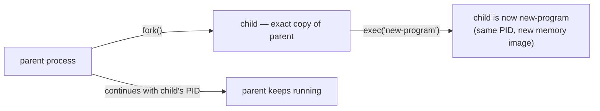
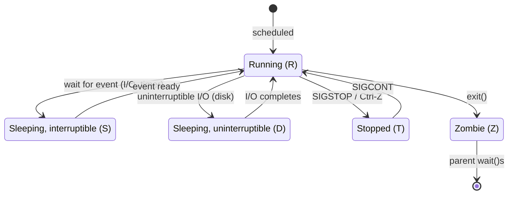

# Linux Fundamentals Study Guide

A depth-first guide to how Linux actually works — the process model, file descriptors, signals, the filesystem, users and permissions, systemd, and the container primitives (cgroups and namespaces) — for engineers who use Linux daily but have never looked beneath the surface of `ps`, `kill`, and `chmod`. It assumes you can navigate a shell, edit files, and install packages, but not that you understand *why* `kill -9` is different from `kill -15`, what a file descriptor actually is, how a container is "just a process," or what happens between pressing Enter and seeing output.

This is the guide I called "the most load-bearing gap in the collection," and the reason is simple: **Linux is the substrate under almost everything else in this repo.** Docker containers are cgroups + namespaces (Part 8 here connects directly to the [Docker guide](DOCKER_STUDY_GUIDE.md)). Kubernetes pods are namespaced, cgroup-limited processes (the [Kubernetes guides](k8s/KUBERNETES_STUDY_GUIDE.md)). The [Kali guide](KALI_LINUX_STUDY_GUIDE.md) runs on this OS. The [Networking guide](NETWORKING_FUNDAMENTALS.md) assumes a Linux network stack. Signals are how your [Node](ADVANCED_NODEJS_STUDY_GUIDE.md) and [Go](ADVANCED_GO_STUDY_GUIDE.md) services shut down gracefully. File descriptors are what your async event loops poll. systemd is how your services start. Understanding this layer retroactively deepens half the repo and directly explains behaviors you've observed but never traced to their source.

Primary references: the [Linux man pages](https://man7.org/linux/man-pages/) (the authoritative source — `man 2 open`, `man 7 signal`, `man 7 namespaces`), Michael Kerrisk's [*The Linux Programming Interface*](https://man7.org/tlpi/) (the definitive book), the [kernel documentation](https://www.kernel.org/doc/html/latest/), and Brendan Gregg's [systems performance work](https://www.brendangregg.com/).

---

## Table of Contents

1. [Part 1 — Everything Is a File (Almost)](#part-1--everything-is-a-file-almost)
2. [Part 2 — Processes](#part-2--processes)
3. [Part 3 — File Descriptors & I/O](#part-3--file-descriptors--io)
4. [Part 4 — Signals](#part-4--signals)
5. [Part 5 — Users, Permissions & Capabilities](#part-5--users-permissions--capabilities)
6. [Part 6 — The Filesystem in Depth](#part-6--the-filesystem-in-depth)
7. [Part 7 — systemd](#part-7--systemd)
8. [Part 8 — Namespaces & cgroups (How Containers Work)](#part-8--namespaces--cgroups-how-containers-work)
9. [Part 9 — The Network Stack From the OS Side](#part-9--the-network-stack-from-the-os-side)
10. [Part 10 — The Diagnostic Toolkit](#part-10--the-diagnostic-toolkit)

---

## Part 1 — Everything Is a File (Almost)

The single most important design principle in Unix/Linux, and the one that explains the most about how the system fits together: **almost every system resource is exposed as a file — or something that behaves like one — in a hierarchical namespace.**

### The Principle

Regular files on disk are files, obviously. But so are:

- **Directories** — files that contain name-to-inode mappings.
- **Devices** — `/dev/sda` (a disk), `/dev/null` (a sink), `/dev/urandom` (random bytes). Read from and write to them like files.
- **Pipes** — `|` in the shell creates a pipe; `mkfifo` creates a named pipe. Data flows in one direction, byte-stream semantics.
- **Sockets** — network connections and local IPC, accessible as file descriptors (Part 3).
- **Symlinks** — pointers to other paths.
- **`/proc`** — a *virtual* filesystem (no disk backing) that exposes **kernel and process state** as readable files. `/proc/[pid]/status` shows a process's state; `/proc/meminfo` shows memory; `/proc/[pid]/fd/` lists its open file descriptors. This is where `ps`, `top`, and every monitoring tool get their data — they just read files.
- **`/sys`** — another virtual filesystem exposing **hardware and kernel subsystem information** (devices, drivers, cgroups, network interfaces) as files. `echo 1 > /sys/class/leds/…/brightness` turns on an LED. On the Pi Zero 2 W, GPIO is exposed through `/sys/class/gpio/`.

The practical consequence: **the same small set of operations — open, read, write, close, stat — works on an enormous range of resources.** A tool that reads files can read process state, device output, and kernel parameters without special APIs. This uniformity is the design genius of Unix, and it's why shell pipelines are so powerful — every tool speaks the same byte-stream protocol.

### The Filesystem Hierarchy

Where things live, and why it matters when your [Docker guide](DOCKER_STUDY_GUIDE.md) images mount volumes or your [Ansible guide](ANSIBLE_STUDY_GUIDE.md) playbooks template files:

| Path | Contains |
|---|---|
| `/` | the root — everything hangs off this |
| `/bin`, `/sbin` | essential binaries (merged into `/usr/bin`, `/usr/sbin` on modern distros) |
| `/etc` | system-wide configuration (the place Ansible, Terraform, and your playbooks target) |
| `/home` | user home directories |
| `/var` | variable data — logs (`/var/log`), caches, spool, database files |
| `/tmp` | temporary files (cleared on reboot, or mounted as tmpfs — i.e., RAM) |
| `/proc` | virtual — process and kernel state (no disk) |
| `/sys` | virtual — hardware and subsystem state (no disk) |
| `/dev` | device files |
| `/usr` | user-space programs, libraries, and shared data |
| `/opt` | optional/third-party software |
| `/run` | runtime state since boot (PID files, sockets) — tmpfs |

### The Virtual Filesystems You'll Actually Use

**`/proc`** is the one you'll read constantly:

```bash
cat /proc/cpuinfo              # CPU info — model, cores, flags
cat /proc/meminfo              # memory: total, free, buffers, cached
cat /proc/loadavg              # load averages (1, 5, 15 min) — the "how busy" metric
cat /proc/[pid]/status         # a single process: state, memory, threads, UID
cat /proc/[pid]/cmdline        # the full command that started it
cat /proc/[pid]/environ        # its environment variables
ls -l /proc/[pid]/fd/          # its open file descriptors (Part 3)
cat /proc/[pid]/maps           # its memory map (shared libraries, heap, stack)
cat /proc/[pid]/limits         # its resource limits (open files, stack size, etc.)
```

Every monitoring and debugging tool you use — `ps`, `top`, `htop`, `free`, Prometheus's `node_exporter` — is reading `/proc`. When a tool is unavailable (a minimal container with no `ps`), you can *always* read `/proc` directly because it's the kernel itself.

If you remember one thing from Part 1: **Linux exposes processes, devices, and kernel state as files in `/proc` and `/sys` — so the tools you use daily (ps, top, free) are just reading files, and when the tools aren't available, the files still are.**

```quiz
Q: You're in a minimal container with no ps, top, or free. How do you inspect processes and memory?
- [ ] You can't without installing procps
- [x] Read /proc directly — /proc/[pid]/status, /proc/meminfo, /proc/loadavg are the same data those tools read
- [ ] Use docker exec from the host only
- [ ] Check the container runtime's logs
> Every monitoring tool is a formatter over /proc. The kernel exposes the state as files, so cat works where ps doesn't — one of the most practically useful consequences of "everything is a file."

Q: What's the design payoff of exposing devices, pipes, sockets, and kernel state as files?
- [x] One small set of operations — open, read, write, close — works on all of them, which is why shell pipelines compose so well
- [ ] Files are faster than dedicated APIs
- [ ] It makes everything persistent across reboots
- [ ] It removes the need for permissions
> Uniform byte-stream semantics mean any tool that handles files handles devices and process state too. That's the Unix composition model: small tools, one protocol.

Q: What's special about /proc and /sys compared to /var or /etc?
- [ ] They're read-only for root
- [x] They're virtual filesystems with no disk backing — the kernel generates their contents on read
- [ ] They're cleared by logrotate
- [ ] They're tmpfs mounts that consume RAM per file
> Reading /proc/meminfo doesn't touch a disk; the kernel synthesizes the answer. Writing /sys files (like sysctl via /proc/sys) changes live kernel state — files as a control interface, not storage.

Q: A program writes a large scratch file to /tmp and the machine's RAM usage jumps. Why?
- [ ] The file cache always doubles memory usage
- [x] /tmp is often a tmpfs mount — RAM-backed, so "disk" writes there consume memory
- [ ] The kernel mirrors /tmp into swap eagerly
- [ ] It's a memory leak in the program
> tmpfs lives in RAM (and swap) and is cleared on reboot — fast, but not free disk. The same mechanism backs Docker's --tmpfs and K8s emptyDir medium: Memory.
```

---

## Part 2 — Processes

A process is the fundamental unit of execution in Linux — every program you run, every service, every container, is one or more processes. Understanding the process model explains how programs start, how they relate to each other, how they die, and what happens when they don't die cleanly.

### What a Process Is

A process is the kernel's record of a running program: its **memory space** (code, data, heap, stack), its **open file descriptors** (Part 3), its **credentials** (user, group), its **signal handlers** (Part 4), its **PID** (a unique integer), and its **state** (running, sleeping, stopped, zombie). Critically, each process has its own **virtual address space** — processes are isolated from each other by the CPU's memory management hardware (the MMU). One process cannot read or write another's memory (without explicit shared-memory setup). This isolation is fundamental to OS security and stability.

### `fork` and `exec`: How Processes Are Born

Every process in Linux (except PID 1) is created by **`fork()`**: the kernel *duplicates* the calling process — same code, same data, same file descriptors, same everything — and returns twice: once in the parent (with the child's PID) and once in the child (with 0). The child is an *almost-exact copy* of the parent, running from the same point in the same code.

Then, usually, the child calls **`exec()`** — which *replaces* its entire memory image with a new program (loaded from a binary on disk). `exec` does **not** create a new process (the PID stays the same); it *transforms* the existing one into a different program. So the idiom is:



This `fork`+`exec` pair is how *every* program launch works — your shell, `systemd`, Docker, Kubernetes's kubelet. When you type `ls` in bash, bash `fork`s itself, the child `exec`s `/usr/bin/ls`, `ls` runs and exits, and bash (the parent) continues. The [Docker guide](DOCKER_STUDY_GUIDE.md)'s `docker run` ultimately does `fork`+`exec` of your container's entrypoint process, inside namespaces and cgroups (Part 8).

(Modern Linux also has `clone()`, a more flexible version of `fork` that lets you share specific resources — memory, file descriptors, PID namespace — between parent and child. `clone` is the actual syscall that creates threads and, critically, namespaced processes for containers.)

### The Process Tree

Because every process is `fork`ed from a parent, all processes form a **tree** rooted at PID 1 (the init system, usually `systemd` — Part 7). You can see it:

```bash
pstree -p
# systemd(1)─┬─sshd(800)───sshd(1200)───bash(1201)───vim(1300)
#             ├─dockerd(900)───containerd(901)───...
#             └─nginx(850)─┬─nginx(851)
#                           └─nginx(852)
```

The parent-child relationship matters for three things: **signals** (sending `SIGTERM` to a parent can be configured to cascade to children), **wait** (a parent must `wait()` on a child to collect its exit status — see zombies below), and **namespaces** (a child inherits its parent's namespace memberships, which is how containers scope their children).

### Process States

At any moment, a process is in one of these states (visible in `ps` and `/proc/[pid]/status`):

| State | Code | Meaning |
|---|---|---|
| **Running** | `R` | executing on a CPU or ready to run (in the run queue) |
| **Sleeping (interruptible)** | `S` | waiting for an event (I/O, timer, signal) — the normal "idle" state for most processes |
| **Sleeping (uninterruptible)** | `D` | waiting for I/O that *cannot* be interrupted (typically disk) — cannot be killed, even with `SIGKILL`, until the I/O completes. A process stuck in `D` usually means a disk/NFS/storage problem. |
| **Stopped** | `T` | paused by a signal (`SIGSTOP` or `SIGTSTP` — Ctrl-Z) |
| **Zombie** | `Z` | finished executing but its parent hasn't `wait()`ed for it yet — the process is dead but its entry in the process table remains so the parent can read the exit status |

**Zombies** are the state that confuses people. A zombie is *not* running and consumes *no* CPU or memory (its memory is already freed). It's just a process-table entry — a few bytes — waiting for its parent to call `wait()`. Normally this happens instantly, but if the parent is buggy (never calls `wait`) or if the parent died without cleaning up its children, zombies accumulate. They're mostly harmless individually, but a buildup can exhaust the PID space. When the parent dies, orphaned children are **re-parented to PID 1** (`systemd`), which `wait()`s on them and cleans up the zombies — this is one of PID 1's essential jobs, and it's why running your own app as PID 1 in a Docker container (without an init) can lead to zombie accumulation (the app doesn't `wait()` on children it didn't know about). The fix: use `tini` or `--init` in Docker, or `shareProcessNamespace` in Kubernetes — both are covered in the [Docker guide](DOCKER_STUDY_GUIDE.md).



### Threads

A thread in Linux is **just a process that shares its memory space, file descriptors, and signal handlers with another process.** Internally, Linux doesn't distinguish threads from processes at the scheduler level — both are "tasks." Threads are created with `clone()` with the `CLONE_VM | CLONE_FILES | CLONE_SIGHAND` flags (sharing virtual memory, file table, and signal handlers). They share the same PID (from userspace's perspective — `gettid()` returns the thread's unique "TID," and `/proc/[pid]/task/` lists them all).

This is directly relevant to the [Advanced Go guide](ADVANCED_GO_STUDY_GUIDE.md): Go's Ms (OS threads) are Linux threads (`clone`d with shared memory), and goroutines are user-space "green threads" multiplexed onto them. The GMP scheduler from that guide is running on top of this kernel mechanism.

### Exit, Wait, and Exit Codes

When a process finishes (`exit()` or returning from `main`), it becomes a zombie until its parent calls `wait()`. The exit code (0–255) is the universal success/failure signal:

- **0** = success — every well-behaved program returns 0 on success.
- **Non-zero** = failure — by convention, different non-zero values mean different errors, but the convention varies.
- **128 + N** = killed by signal N — e.g., exit code **137 = 128 + 9 (SIGKILL)**, the code you see when Kubernetes OOM-kills a container. Exit code **143 = 128 + 15 (SIGTERM)** = normal graceful-shutdown signal.

So when your Kubernetes pod shows `exitCode: 137`, you now know: it was killed by SIGKILL — most likely the OOM killer, because the process exceeded its cgroup memory limit (Part 8, and the [Advanced Go guide](ADVANCED_GO_STUDY_GUIDE.md)'s `GOMEMLIMIT` discussion).

If you remember one thing from Part 2: **every process is born from `fork`+`exec`, lives in a tree rooted at PID 1, and dies by exiting (or being killed by a signal) — and exit code 137 means SIGKILL (probably OOM), which connects directly to container memory limits in Docker and Kubernetes.**

```quiz
Q: What do fork() and exec() each do in launching a program?
- [ ] fork loads the binary; exec starts its main()
- [x] fork duplicates the calling process; exec replaces the child's memory image with the new program, keeping the same PID
- [ ] fork creates an empty process; exec copies the parent into it
- [ ] They're two names for one syscall
> The pair is how every launch works: bash forks itself, the child execs /usr/bin/ls. exec transforms, never creates — which is why fd inheritance and the `exec` shell built-in (replacing the shell in container entrypoints) behave the way they do.

Q: A zombie process is consuming…
- [ ] CPU, until its parent kills it
- [ ] All its original memory
- [x] Almost nothing — just a process-table entry holding the exit status until the parent calls wait()
- [ ] One file descriptor per child
> Zombies are already dead; the kernel keeps a stub so the parent can read the exit code. They become a problem only in bulk (PID exhaustion) — typically a parent that never waits, or a container whose PID 1 doesn't reap re-parented orphans (hence tini/--init).

Q: Your Kubernetes pod exited with code 137. What happened?
- [x] 137 = 128 + 9: killed by SIGKILL — most likely the OOM killer enforcing the cgroup memory limit
- [ ] 137 is the application's own error code
- [ ] The liveness probe failed 137 times
- [ ] The node rebooted
> The 128+N convention encodes the fatal signal. 143 = SIGTERM (graceful stop); 137 = SIGKILL — and since nothing sends SIGKILL casually, the memory limit is the first suspect.

Q: A process is stuck in state D and even kill -9 does nothing. What does that tell you?
- [ ] The process is ignoring signals via a handler
- [x] It's in uninterruptible sleep — blocked on I/O (usually disk or NFS) that must complete before any signal can be delivered
- [ ] It's a zombie
- [ ] It's been SIGSTOPped
> D-state is the one state SIGKILL can't touch: the kernel won't interrupt the I/O. A pile-up of D-state processes points at storage trouble — and they count toward load average, which is why load can be high with idle CPUs.
```

---

## Part 3 — File Descriptors & I/O

Part 1 said "everything is a file." File descriptors are *how* — the kernel's handle for an open resource. Understanding them explains how your programs talk to files, pipes, sockets, and devices; how I/O redirection works; and what the event loop in your [Node](ADVANCED_NODEJS_STUDY_GUIDE.md) and [Python async](ASYNCIO_STUDY_GUIDE.md) runtimes is actually polling.

### What a File Descriptor Is

A **file descriptor (fd)** is a small non-negative integer that identifies an open file (or pipe, socket, device, etc.) within a process. When you `open()` a file, the kernel creates an entry in the process's **file descriptor table** pointing to an internal file object (which tracks the current offset, the mode, and the underlying inode or device). The fd is the handle you use for all subsequent operations — `read(fd, ...)`, `write(fd, ...)`, `close(fd)`.

Every process starts with three:

| fd | Name | Default | Shell symbol |
|---|---|---|---|
| 0 | **stdin** | the terminal (keyboard) | `<` |
| 1 | **stdout** | the terminal (screen) | `>` |
| 2 | **stderr** | the terminal (screen) | `2>` |

Shell redirection is *just fd manipulation*: `cmd > out.txt` means "open `out.txt` for writing, make fd 1 point to it instead of the terminal, then exec `cmd`." Piping `cmd1 | cmd2` creates a kernel pipe, connects cmd1's fd 1 (stdout) to the write end and cmd2's fd 0 (stdin) to the read end. No temporary file, no copying — data flows through a kernel buffer directly.

### File Descriptors Are Inherited Across `fork` and Survive `exec`

When a process `fork`s, the child gets **a copy** of the parent's file descriptor table — the same fds, pointing to the same kernel file objects (sharing the file offset). This is *why* piping works: the shell sets up the pipe fds, forks, and the child inherits them before exec'ing the target program. It's also why a leaked fd in a parent process leaks into every child (a security and resource concern — set `O_CLOEXEC` / `FD_CLOEXEC` on fds you don't want inherited).

### The `ulimit` and the "Too Many Open Files" Error

Each process has a **limit** on how many fds it can hold open (the `nofile` rlimit). The default soft limit is often **1024**, and the hard limit is higher. When a busy server (or a leaking one) tries to open its 1025th fd, it gets `EMFILE: too many open files` — a classic production failure for high-connection servers:

```bash
ulimit -n              # show the current soft limit (often 1024)
ulimit -n 65536        # raise it for this shell session
cat /proc/[pid]/limits # show a running process's limits
```

For production services, raise the limit in your systemd unit (`LimitNOFILE=65536` — Part 7) or container config. The [Advanced Node.js guide](ADVANCED_NODEJS_STUDY_GUIDE.md)'s "the netpoller handles tens of thousands of connections" is only true if the fd limit allows it.

### Blocking vs. Non-Blocking I/O (and How the Event Loop Works)

By default, a `read()` on a socket **blocks** — the process (or thread) sleeps until data arrives. A server handling 10,000 connections with blocking I/O needs 10,000 threads, each mostly sleeping — expensive.

The alternative: mark the fd as **non-blocking** (`O_NONBLOCK`), and `read()` returns immediately with `EAGAIN` if no data is ready. But then you need to *know when to try again* — and that's what **[`epoll`](https://man7.org/linux/man-pages/man7/epoll.7.html)** (Linux), **`kqueue`** (macOS), and **`IOCP`** (Windows) provide: a system call that watches *many* fds at once and tells you which ones are ready for I/O. You register thousands of fds with `epoll_create` + `epoll_ctl`, then call `epoll_wait` — it blocks until *any* of them is ready, and returns the set of ready fds. Now one thread handles thousands of connections, checking only the ones that have data.

This is **the** mechanism underneath:

- **libuv** (Node.js's event loop and Python's uvloop) — wraps `epoll`/`kqueue` into a portable event loop.
- **Go's netpoller** — the runtime registers socket fds with epoll and parks goroutines until their fd is ready (the [Advanced Go guide](ADVANCED_GO_STUDY_GUIDE.md), Part 2).
- **Python's asyncio** — the default `SelectorEventLoop` uses `epoll` (or `select`/`kqueue`); uvloop uses libuv which uses `epoll`.

So when the [Advanced Node.js guide](ADVANCED_NODEJS_STUDY_GUIDE.md) says "the event loop polls for I/O in the poll phase," this is what it's doing: calling `epoll_wait` on every socket fd the process has registered, waking up callbacks when data arrives. **The event loop *is* an `epoll` loop.** And when Node or Go or asyncio handle tens of thousands of concurrent connections on one thread, it's because `epoll` scales to hundreds of thousands of fds with O(ready) cost, not O(total).

### Pipes: The Simplest IPC

A pipe is a unidirectional byte stream between two fds — one for writing, one for reading — backed by a kernel buffer (default ~64 KB on Linux). Pipes are anonymous (created by `pipe()`, used between parent and child via `fork`+`exec`) or named (`mkfifo`, exists as a file on disk). Shell pipes (`|`) are anonymous pipes, and they're the foundation of the Unix "small tools, composed" philosophy.

The key property: pipes have **backpressure built in.** If the reader is slow, the pipe buffer fills, and the writer's `write()` blocks (or returns `EAGAIN` for non-blocking). If the writer closes, the reader gets EOF. If the reader closes, the writer gets `SIGPIPE` (Part 4). This natural flow control is the same concept the [Advanced Node.js guide](ADVANCED_NODEJS_STUDY_GUIDE.md)'s streams chapter describes at a higher level — it's the OS primitive underneath `highWaterMark` and `drain`.

If you remember one thing from Part 3: **a file descriptor is the kernel's handle for an open file/socket/pipe/device, every process starts with three (stdin/stdout/stderr), the `nofile` limit caps how many you can open (raise it for servers), and `epoll` watching many fds at once is the mechanism underneath every event loop you use — Node's, Go's, and Python's.**

```quiz
Q: What does `cmd > out.txt` actually do, mechanically?
- [ ] Tells cmd to write to a file instead of printing
- [x] The shell opens out.txt and makes fd 1 point at it before exec'ing cmd — the program just writes to stdout as always
- [ ] Creates a pipe between cmd and the file
- [ ] Buffers cmd's output and copies it after exit
> Redirection is pure fd manipulation; the program neither knows nor cares. Pipes are the same trick doubled: cmd1's fd 1 and cmd2's fd 0 both point at a kernel pipe buffer — no temp file, no copy.

Q: A busy server starts failing with EMFILE: too many open files. What's the situation?
- [x] It hit its nofile rlimit (often a 1024 default) — each connection is an fd; raise the limit (ulimit, LimitNOFILE) or fix the fd leak
- [ ] The disk is out of inodes
- [ ] The kernel's global file table is full
- [ ] Too many files exist in one directory
> Every socket, file, and pipe costs an fd against the per-process limit. High-connection servers need 65536+; "handles tens of thousands of connections" claims are only true if the rlimit allows it.

Q: How does one thread handle 10,000 connections without 10,000 threads?
- [ ] Each read is given a short timeout
- [x] Non-blocking fds registered with epoll — epoll_wait sleeps until any are ready and returns just the ready set
- [ ] The kernel merges idle sockets into one fd
- [ ] Connections are queued and served one at a time
> This is the mechanism under every event loop: libuv (Node), Go's netpoller, asyncio. epoll's cost scales with ready fds, not total fds — which is why an idle connection is nearly free.

Q: What gives shell pipes built-in backpressure?
- [x] The pipe's kernel buffer (~64 KB) — when it fills, the writer's write() blocks until the reader drains it
- [ ] The shell throttles the producer process
- [ ] SIGSTOP is sent to the faster process
- [ ] There is none; data is dropped when the buffer fills
> A slow reader naturally stalls a fast writer — flow control with no protocol. Reader closes → writer gets SIGPIPE; writer closes → reader sees EOF. Node's highWaterMark/drain is this same idea one level up.
```

---

## Part 4 — Signals

Signals ([`signal(7)`](https://man7.org/linux/man-pages/man7/signal.7.html)) are Linux's oldest inter-process communication — asynchronous notifications sent to a process by the kernel, by another process, or by the process itself. They're how your services shut down gracefully, how Ctrl-C works, and why containers sometimes die mysteriously. This is one of the most practically important chapters for anyone running services.

### The Signal Catalog (the Ones That Matter)

There are ~30 standard signals; you need to know ~8:

| Signal | Number | Default | Sent by | What it means |
|---|---|---|---|---|
| `SIGTERM` | 15 | terminate | `kill`, Docker/K8s on shutdown | "please shut down gracefully" — the polite request. **Catchable.** |
| `SIGKILL` | 9 | terminate | `kill -9`, OOM killer, K8s after grace period | "die now" — **cannot be caught, blocked, or ignored.** Instant death. |
| `SIGINT` | 2 | terminate | Ctrl-C in the terminal | "user wants to interrupt" — like SIGTERM but interactive. Catchable. |
| `SIGHUP` | 1 | terminate | terminal closes, or manual | traditionally "reload config" (Nginx, Apache). Catchable. |
| `SIGQUIT` | 3 | terminate + core dump | Ctrl-\ | "quit and dump core" — Go uses this to print all goroutine stacks. |
| `SIGSTOP` | 19 | stop (pause) | `kill -STOP` | pause the process — **cannot be caught.** |
| `SIGTSTP` | 20 | stop | Ctrl-Z | interactive pause — catchable (but usually not caught). |
| `SIGCONT` | 18 | continue | `fg`, `bg`, `kill -CONT` | resume a stopped process. |
| `SIGCHLD` | 17 | ignore | kernel → parent | "your child exited or stopped" — the signal that triggers `wait()`. |
| `SIGPIPE` | 13 | terminate | kernel | "you wrote to a broken pipe/socket" — the reader closed. |

### Graceful Shutdown: SIGTERM → cleanup → exit

This is the pattern every production service must implement, and understanding it from the OS side ties together Docker, Kubernetes, systemd, and your application code:

1. **Something sends `SIGTERM`** — `systemctl stop`, `docker stop`, Kubernetes sending `SIGTERM` before killing a pod.
2. **Your process catches it** and begins cleanup — flush buffers, close database connections, finish in-flight requests, drain a work queue.
3. **Your process exits** (exit code 0 for clean shutdown).
4. **If it doesn't exit within the grace period**, the sender sends `SIGKILL` — which cannot be caught. The process is killed instantly, mid-operation.

The grace period varies: Docker defaults to 10 seconds (`docker stop`), Kubernetes defaults to 30 seconds (`terminationGracePeriodSeconds`), systemd defaults to 90 seconds (`TimeoutStopSec`).

```python
# Python: catch SIGTERM for graceful shutdown
import signal, sys

def handle_sigterm(signum, frame):
    print("SIGTERM received, shutting down...")
    # flush, close connections, drain work queue
    sys.exit(0)

signal.signal(signal.SIGTERM, handle_sigterm)
```

```go
// Go: catch SIGTERM with signal.Notify + context
ctx, stop := signal.NotifyContext(context.Background(), syscall.SIGTERM, syscall.SIGINT)
defer stop()
// ... start server with ctx ...
<-ctx.Done()   // blocks until SIGTERM/SIGINT
// graceful drain, close connections, exit
```

```javascript
// Node: catch SIGTERM (the Electron guide's graceful-shutdown recipe is this)
process.on("SIGTERM", async () => {
  console.log("SIGTERM received");
  await server.close();   // stop accepting, drain in-flight
  await pool.end();       // close DB connections
  process.exit(0);
});
```

### The PID 1 Problem in Containers

PID 1 in Linux has special signal behavior: **SIGTERM is ignored by default** (unlike other processes, where the default is to terminate). Normal processes *don't* handle SIGTERM unless they register a handler — but the default action is "terminate." PID 1 gets *no* default action for most signals; it must explicitly register a handler, or the signal is silently dropped.

This is why running your app directly as PID 1 in a container (`CMD ["myapp"]` in a Dockerfile, without an init) leads to a common problem: `docker stop` sends SIGTERM to PID 1 (your app), your app *ignores it* (no handler, PID 1 default), Docker waits 10 seconds, then sends SIGKILL. Your "graceful" shutdown is always a hard kill. Fixes:

- **`docker run --init`** — injects `tini` as PID 1, which forwards signals to your app (now PID 2, with normal signal defaults).
- **Use `exec` in shell entrypoints** — `CMD ["sh", "-c", "exec myapp"]` replaces the shell with your app, so your app *is* PID 1 and receives the signal (provided it has a handler).
- **In Kubernetes**, `shareProcessNamespace: true` or running an init container serves a similar purpose.

### `SIGPIPE` — The Silent Killer

When a process writes to a pipe or socket whose read end is closed, the kernel sends `SIGPIPE` — and the default action is *terminate*. This is why a long pipeline like `cmd | head -1` doesn't leave `cmd` running forever after `head` exits — `cmd` gets `SIGPIPE` on its next write and dies. But it's also why a server writing to a client that disconnected can *unexpectedly crash*. Go ignores SIGPIPE by default (smart); Python and Node don't, but frameworks typically handle it. Know that it exists, and if your service is dying mysteriously after a client disconnect, SIGPIPE is the first suspect.

### `SIGQUIT` — The Debugging Signal

Sending `SIGQUIT` (signal 3, Ctrl-\ in the terminal) to a Go program makes the runtime print **every goroutine's stack trace** and then exit. This is invaluable for debugging hung Go services — it's the emergency "what are all goroutines doing right now?" button:

```bash
kill -QUIT [pid]    # prints all goroutine stacks to stderr, then exits
```

If you remember one thing from Part 4: **SIGTERM is "please stop" (catchable, your code must handle it for graceful shutdown), SIGKILL is "die now" (uncatchable), and the PID 1 signal problem in containers is why `docker stop` sometimes hard-kills your app after the grace period — fix it with `--init` or `exec` in your entrypoint.**

```quiz
Q: Why does docker stop sometimes hard-kill an app that handles SIGTERM correctly outside containers?
- [ ] Docker sends SIGKILL first by design
- [x] As PID 1 the app gets no default signal actions — without an explicit handler, SIGTERM is silently dropped, so Docker waits out the grace period and SIGKILLs
- [ ] Containers block all signals from the host
- [ ] The grace period is 0 by default
> PID 1 is special: signals without registered handlers are ignored, not defaulted to terminate. Fixes: --init (tini becomes PID 1 and forwards), `exec` in the entrypoint so your handler-equipped app receives signals directly.

Q: What's the fundamental difference between SIGTERM and SIGKILL?
- [x] SIGTERM is catchable — your cleanup handler runs; SIGKILL cannot be caught, blocked, or ignored — instant death mid-operation
- [ ] SIGKILL is just SIGTERM with higher priority
- [ ] SIGTERM only works on child processes
- [ ] SIGKILL waits for I/O to finish first
> The whole graceful-shutdown contract lives in that difference: SIGTERM → drain and exit within the grace period (10 s Docker, 30 s K8s, 90 s systemd) or SIGKILL ends the discussion. Code that doesn't handle SIGTERM never shuts down gracefully.

Q: A service crashes "randomly," and investigation shows it dies right after clients disconnect. Suspect?
- [ ] The OOM killer
- [x] SIGPIPE — writing to a socket whose peer closed delivers a signal whose default action is terminate
- [ ] SIGHUP from the terminal
- [ ] A failed health check
> The same mechanism that cleanly ends `cmd | head -1` kills servers that write to gone clients. Go ignores SIGPIPE by default; elsewhere the framework usually handles it — but "dies after disconnect" should trigger this suspicion immediately.

Q: A Go service is hung and you can't attach a debugger. What's the one-command diagnostic?
- [x] kill -QUIT [pid] — the runtime prints every goroutine's stack trace before exiting
- [ ] kill -9 and read the core dump
- [ ] kill -HUP to force a config reload
- [ ] kill -STOP then kill -CONT
> SIGQUIT is Go's "what is everyone doing right now?" button — the fastest way to see whether goroutines are stuck on locks, channels, or I/O. (SIGHUP's convention is config reload — nginx and friends.)
```

---

## Part 5 — Users, Permissions & Capabilities

The Unix security model is simple and load-bearing: **every process runs as a user, every file has an owner and permission bits, and the kernel enforces access.** This is the layer your [Kubernetes Security guide](k8s/KUBERNETES_SECURITY_STUDY_GUIDE.md)'s `runAsNonRoot` and `securityContext` are sitting on top of.

### Users and Groups

- Every process has a **UID** (user ID) and a **GID** (primary group ID), plus supplementary groups. These are numbers; names (`root`, `www-data`) are just lookups in `/etc/passwd` and `/etc/group`.
- **UID 0 is root** — the traditional superuser, which bypasses most permission checks. Running as root in a container is the security risk the K8s security guide warns about, because root inside the container is (by default, without user namespaces) root on the host.
- **Non-root users** are subject to permission checks. Running your service as a non-root user is the first and simplest container-security hardening.

### File Permissions

Every file has three permission sets — **owner**, **group**, and **other** — each with **read (r=4)**, **write (w=2)**, and **execute (x=1)** bits:

```bash
ls -l file.txt
# -rw-r--r-- 1 sanjee staff 1024 Jan 1 00:00 file.txt
#  │├─┤├─┤├─┤
#  │ │   │  │
#  │ │   │  └── other: r-- (read only)
#  │ │   └───── group: r-- (read only)
#  │ └───────── owner: rw- (read, write)
#  └──────────── type: - (regular file; d for directory, l for symlink)
```

`chmod 755 file` = owner rwx, group r-x, other r-x (a common pattern for scripts and binaries). `chmod 600 file` = owner rw, nobody else (private keys, `.env` files). The octal math: add up r(4)+w(2)+x(1) per set.

For **directories**, the bits mean slightly different things: **read** lets you list contents, **write** lets you create/delete files in it, and **execute** lets you `cd` into it and access files by name. A directory without `x` is inaccessible even if you can read its listing.

### The Sticky Bit, SUID, and SGID

Three special permission bits that have outsized security implications:

- **Sticky bit** (`chmod +t`, shown as `t` in the other-execute position): on a directory, only the file's owner (or root) can delete it — even if the directory is world-writable. This is why `/tmp` is `drwxrwxrwt`: anyone can create files, but only you (or root) can delete yours.
- **SUID** (`chmod u+s`): when an executable has the SUID bit set, it runs as the **file's owner**, not the user who launched it. `/usr/bin/passwd` is SUID root — it needs root to modify `/etc/shadow`, but any user can run it. SUID is a common attack vector (a SUID-root binary with a vulnerability gives the attacker root), which is why the K8s security guide's `no-new-privileges` and `allowPrivilegeEscalation: false` exist: they prevent SUID from working inside a container.
- **SGID** on a directory: files created inside inherit the directory's group (not the creator's primary group) — useful for shared project directories.

### Linux Capabilities: Fine-Grained Root

Traditional Unix has two levels: root (can do everything) and non-root (subject to permission checks). **Capabilities** ([`capabilities(7)`](https://man7.org/linux/man-pages/man7/capabilities.7.html), since Linux 2.2) split root's powers into ~40 discrete privileges, so you can grant *only* the ones needed:

| Capability | Allows |
|---|---|
| `CAP_NET_BIND_SERVICE` | bind to ports below 1024 (80, 443) without root |
| `CAP_NET_RAW` | use raw sockets (ping, tcpdump) |
| `CAP_SYS_PTRACE` | trace/debug other processes |
| `CAP_SYS_ADMIN` | a grab-bag of admin powers — nearly as dangerous as root |
| `CAP_DAC_OVERRIDE` | bypass file read/write/execute permission checks |

Containers drop most capabilities by default — the [Docker guide](DOCKER_STUDY_GUIDE.md) and [K8s Security guide](k8s/KUBERNETES_SECURITY_STUDY_GUIDE.md) both discuss which ones to add back and when. The principle: **don't run as root; if you need one specific privilege, add only that capability.** `CAP_SYS_ADMIN` in a container is effectively root — treat it as such.

If you remember one thing from Part 5: **every process runs as a UID, every file has permission bits, UID 0 (root) bypasses them, and capabilities let you grant specific root-like powers without full root — which is exactly what your Kubernetes securityContext and Docker `--cap-add` are manipulating.**

```quiz
Q: How can any user run /usr/bin/passwd, which must modify root-owned /etc/shadow?
- [ ] /etc/shadow is world-writable during password changes
- [x] passwd has the SUID bit — it runs as the file's owner (root) regardless of who launched it
- [ ] The shell elevates privileges for system binaries
- [ ] PAM grants temporary root
> SUID makes the executable run as its owner — necessary for passwd, and a classic attack surface (a vulnerable SUID-root binary hands out root). That's exactly what allowPrivilegeEscalation: false / NoNewPrivileges block in containers.

Q: Why is /tmp's mode drwxrwxrwt — what does the t do?
- [ ] Marks it as a tmpfs mount
- [x] The sticky bit: anyone can create files in the world-writable directory, but only a file's owner (or root) can delete them
- [ ] Makes files in it executable
- [ ] Enables automatic cleanup on reboot
> Without sticky, world-writable means anyone can delete anyone's files. The bit restricts deletion to owners — which is the only thing standing between users in a shared /tmp.

Q: Your service needs to bind port 443 but you don't want it running as root. The precise fix?
- [x] Grant CAP_NET_BIND_SERVICE — the one capability covering low ports — and run as a normal user
- [ ] Run as root but chroot it
- [ ] CAP_SYS_ADMIN, the networking capability
- [ ] Bind 8443 and claim it's equivalent
> Capabilities split root into ~40 discrete powers so you grant exactly one. CAP_SYS_ADMIN is the trap option — it's a grab-bag nearly equivalent to root and should be treated as such in any container.

Q: Why is running as root inside a container still a real risk by default?
- [ ] Containers can't run as root
- [x] Without user namespaces, UID 0 in the container is UID 0 on the host — a container escape lands as root
- [ ] Root containers can't be resource-limited
- [ ] It only matters for privileged containers
> Namespaces hide things; they don't remap identity unless the user namespace is used. runAsNonRoot, dropped capabilities, and seccomp exist because the isolation boundary is process-level, not machine-level.
```

---

## Part 6 — The Filesystem in Depth

Beyond the hierarchy — how Linux organizes data on disk, what an inode is, and why it matters for understanding links, mount points, Docker layers, and "disk full but `df` disagrees."

### Inodes and the Inode/Data Split

A file on disk has two parts: the **inode** (metadata: size, permissions, timestamps, block pointers — identified by an **inode number**) and the **data blocks** (the actual contents). A **directory** is a file whose data blocks contain a list of `(name, inode number)` entries — a phone book mapping names to inodes.

This separation explains:

- **Hard links** (`ln file link`): two directory entries pointing to the *same inode*. Both names are equally "the file" — there's no "original." Deleting one name decrements the inode's link count; the data persists until the count reaches zero. Hard links can't cross filesystem boundaries and can't point to directories.
- **Symlinks** (`ln -s target link`): a separate file whose data is the *path* of the target. If the target is moved or deleted, the symlink **breaks** (dangling symlink). Symlinks can cross filesystems and point to directories.
- **"Disk full but files are small"**: the filesystem has a fixed number of inodes. If you create millions of tiny files, you can exhaust inodes before filling disk space — `df -i` shows inode usage. This actually happens in practice with package managers and build systems that create enormous numbers of small files.
- **"File deleted but space not freed"**: if a process still has the file open (holds an fd), deleting the directory entry decrements the link count but the inode and data persist until the fd is closed. `lsof +D /path` finds processes holding deleted files open — a common cause of "I deleted the log file but the disk is still full."

### Mount Points and Filesystem Types

A **mount point** is a directory where a filesystem is attached. `/` is the root mount; `/home` might be a separate disk; `/tmp` might be **tmpfs** (RAM-backed, fast, lost on reboot); `/proc` and `/sys` are virtual filesystems backed by the kernel (Part 1).

```bash
mount                     # list all mounts
findmnt -T /var/log       # which filesystem is /var/log on?
df -h                     # disk usage per mount
```

Docker's **overlay filesystem** mounts layers (read-only) with a writable top layer, presenting them as a single merged view — the mechanism behind Docker images and containers. Each image layer is a directory of files; overlayfs composites them. This is why understanding mounts matters for containers.

### `tmpfs` and When to Use It

A `tmpfs` mount lives entirely in RAM (and swap). It's fast (no disk I/O), automatically sized (uses only as much RAM as its contents), and cleared on reboot. Uses:

- `/tmp` is often tmpfs — so writing large files to `/tmp` *consumes RAM*, not disk. A surprise for programs that treat `/tmp` as "free disk."
- Docker's `--tmpfs` flag and Kubernetes's `emptyDir: { medium: Memory }` both create tmpfs mounts — useful for scratch data that should never touch disk (secrets, temporary processing).

If you remember one thing from Part 6: **a file is an inode (metadata) plus data blocks, directories are name→inode maps, hard links are multiple names for the same inode, and "deleted file but disk still full" means a process is holding the fd open — `lsof` finds it.**

```quiz
Q: You deleted a 50 GB log file but df shows the space still used. What happened?
- [x] A process still holds the file open — deletion removed the name, but the inode and data persist until the last fd closes; lsof finds the holder
- [ ] The filesystem needs an fsck to reclaim it
- [ ] df caches results for an hour
- [ ] The file went to a trash directory
> rm removes a directory entry (name→inode mapping); the data lives while any reference — name or fd — remains. Restart or signal the process holding it (often the service that was writing the log) and the space returns.

Q: What's the difference between a hard link and a symlink?
- [ ] A hard link is read-only; a symlink is writable
- [x] A hard link is another name for the same inode (no "original," can't cross filesystems); a symlink is a separate file containing a path (can dangle if the target moves)
- [ ] Symlinks are faster to resolve
- [ ] Hard links can point at directories
> Two directory entries, one inode: both names are equally the file, and data survives until the link count hits zero. A symlink is indirection by path — flexible (cross-filesystem, directories) and breakable.

Q: df -h shows 40% disk free, yet file creation fails with "No space left on device." What do you check?
- [ ] The mount is read-only
- [x] df -i — the filesystem may be out of inodes; millions of tiny files exhaust them before the bytes run out
- [ ] SELinux denials in the audit log
- [ ] The directory's sticky bit
> Inode count is fixed at mkfs time. Package caches and build systems that spray small files hit this for real — space and inodes are separate budgets.

Q: How does Docker present an image's layers as one filesystem?
- [ ] It extracts all layers into one directory at container start
- [x] An overlay mount: read-only lower layers composited with a writable upper layer into a single merged view
- [ ] Each layer is a loop-mounted disk image
- [ ] Hard links from each layer into a staging area
> overlayfs is just another mount type: lowerdir stack (the image), upperdir (the container's writes), one merged view. It's why container writes don't touch images, and why mounts are core container machinery.
```

---

## Part 7 — systemd

[systemd](https://www.freedesktop.org/software/systemd/man/latest/) is the init system and service manager on virtually all mainstream Linux distributions (Ubuntu, Fedora, Debian, RHEL, Arch, SUSE). It's PID 1 — the first process the kernel starts, the parent (directly or transitively) of every other process, the zombie reaper, and the supervisor of your services. Understanding it explains how services start, restart, and log on a Linux machine, and how the [Ansible guide](ANSIBLE_STUDY_GUIDE.md)'s `systemd` module and the [Caddy guide](CADDY_STUDY_GUIDE.md)'s systemd unit work.

### Units: The Building Block

systemd manages **units**, each described by a unit file. The most common types:

| Unit type | Suffix | What it manages |
|---|---|---|
| **Service** | `.service` | a long-running process (a daemon) |
| **Timer** | `.timer` | a scheduled activation (cron replacement) |
| **Socket** | `.socket` | a socket that activates a service on connection |
| **Mount** | `.mount` | a filesystem mount point |
| **Target** | `.target` | a group of units (e.g., `multi-user.target` ≈ "the system is up") |

Unit files live in `/etc/systemd/system/` (admin-created, highest priority), `/run/systemd/system/` (runtime), and `/usr/lib/systemd/system/` (package-installed, lowest priority).

### Anatomy of a Service Unit

```ini
# /etc/systemd/system/myapp.service
[Unit]
Description=My Application Server
After=network-online.target postgresql.service    # start after network and Postgres
Wants=postgresql.service                          # soft dependency (continue if Postgres fails)
# Requires=... would be a hard dependency (fail if it fails)

[Service]
Type=exec                         # the process IS the service (most common for modern apps)
User=myapp                        # run as this user, not root (Part 5)
Group=myapp
WorkingDirectory=/opt/myapp
ExecStart=/opt/myapp/bin/server --config /etc/myapp/config.toml
ExecReload=/bin/kill -HUP $MAINPID     # SIGHUP to reload config (Part 4)
Restart=on-failure                # restart if it crashes; not on clean exit (code 0)
RestartSec=5                      # wait 5s between restarts

# Resource limits (these map to ulimits — Part 3 — and cgroups — Part 8):
LimitNOFILE=65536                 # raise the fd limit for a busy server
MemoryMax=2G                      # cgroup memory limit (like K8s memory limit)
CPUQuota=200%                     # max 2 CPU cores (like K8s CPU limit)

# Security hardening (capabilities, namespaces):
NoNewPrivileges=true              # block SUID escalation (Part 5)
ProtectSystem=strict              # mount / read-only (except explicit paths)
ProtectHome=true                  # hide /home
PrivateTmp=true                   # private /tmp namespace

[Install]
WantedBy=multi-user.target        # enable on boot
```

### The Commands You'll Use

```bash
systemctl start myapp             # start now
systemctl stop myapp              # send SIGTERM, wait TimeoutStopSec, then SIGKILL
systemctl restart myapp           # stop + start
systemctl reload myapp            # send ExecReload (usually SIGHUP — config reload, no restart)
systemctl enable myapp            # start on boot (creates a symlink into the target)
systemctl disable myapp
systemctl status myapp            # state, recent log lines, PID, memory, CPU
systemctl daemon-reload           # re-read unit files after editing (REQUIRED after changes)
```

### Journald: Structured Logging

systemd captures your service's **stdout and stderr** into the **journal** — a structured, indexed, binary log. No log file management, no logrotate (the journal rotates itself), and queries are fast:

```bash
journalctl -u myapp               # all logs for a service
journalctl -u myapp -f            # follow (tail) — like `tail -f`
journalctl -u myapp --since "1 hour ago"
journalctl -u myapp -p err        # only errors and above
journalctl -u myapp -o json       # structured JSON output (for log pipelines)
```

The journal stores metadata (unit, PID, timestamp, priority) alongside the message, so filtering by service, time, and severity is instant. For production systems, forward journal data to a centralized log system (the [Observability guide](../OBSERVABILITY_STUDY_GUIDE.md)'s logging chapter).

### Timers: The Modern Cron

systemd timers replace cron with a unit-based, logged, dependency-aware alternative:

```ini
# /etc/systemd/system/backup.timer
[Unit]
Description=Daily backup

[Timer]
OnCalendar=*-*-* 02:00:00     # daily at 2 AM
Persistent=true                 # if the machine was off at 2 AM, run on next boot
RandomizedDelaySec=600          # jitter to avoid thundering herd (Part 9 of Distributed Systems)

[Install]
WantedBy=timers.target
```

The timer activates a corresponding `.service` unit (same name, or specify `Unit=`). `systemctl list-timers` shows upcoming triggers. The advantage over cron: logging in the journal, dependency ordering, resource limits, and no more mysterious cron emails.

If you remember one thing from Part 7: **systemd is PID 1 — it starts, stops, restarts, and logs your services via unit files, and its `LimitNOFILE`, `MemoryMax`, and `CPUQuota` directives are cgroup controls that map directly to Kubernetes resource limits and Docker's `--memory`/`--cpus`.**

```quiz
Q: You edited a unit file and restarted the service, but the old config is still in effect. What did you skip?
- [x] systemctl daemon-reload — systemd caches parsed unit files and must re-read them after edits
- [ ] systemctl enable, which applies changes
- [ ] Rebooting, which is required for unit edits
- [ ] journalctl --flush
> Restart reuses the cached definition. daemon-reload re-parses units; only then does restart pick up the change. It's the #1 "my edit didn't take" answer.

Q: What's the difference between Restart=on-failure and Restart=always?
- [ ] on-failure retries faster
- [x] on-failure skips restarts after clean exits (code 0); always restarts regardless — wrong for services meant to stop cleanly
- [ ] always ignores RestartSec
- [ ] They differ only for Type=oneshot
> A service that exits 0 intentionally (drained, done) shouldn't be resurrected; one that crashes should. The exit-code convention from Part 2 is what systemd is reading here.

Q: Where did your service's stdout go, and how do you read it?
- [ ] /var/log/[service].log, rotated by logrotate
- [x] Into the journal — journalctl -u myapp (-f to follow, --since, -p err to filter) with structured metadata attached
- [ ] Nowhere unless StandardOutput= is set
- [ ] To the console of tty1
> journald captures stdout/stderr automatically with unit, PID, timestamp, and priority indexed — no logfile management. Modern apps just print; the journal does the rest.

Q: How do MemoryMax=2G and CPUQuota=200% in a unit file relate to Kubernetes limits?
- [x] They're the same kernel mechanism — cgroup memory and CPU controllers; systemd, Docker, and K8s are different frontends to identical enforcement
- [ ] systemd limits are advisory, K8s limits are enforced
- [ ] They only apply at boot
- [ ] systemd uses ulimits, which are unrelated to cgroups
> MemoryMax is the cgroup memory limit (OOM kill on breach — exit 137); CPUQuota is CFS bandwidth (throttling). Learn the mechanism once and every orchestrator's resource limits become the same knob.
```

---

## Part 8 — Namespaces & cgroups (How Containers Work)

This is the chapter the repo has been building toward. The [Docker guide](DOCKER_STUDY_GUIDE.md) says "a container is an isolated process"; the [Kubernetes guides](k8s/KUBERNETES_STUDY_GUIDE.md) say "a pod is a group of containers sharing namespaces." This part explains what those words *actually mean* at the kernel level — because a container is not a VM, not a sandbox, and not magic. It's a **regular Linux process** with two kernel features applied: **namespaces** (what it can *see*) and **cgroups** (what it can *use*).

### Namespaces: Isolation of What You Can See

A **namespace** ([`namespaces(7)`](https://man7.org/linux/man-pages/man7/namespaces.7.html)) wraps a global system resource so that the process inside the namespace sees its own isolated instance. Linux has eight namespace types:

| Namespace | Isolates | Container effect |
|---|---|---|
| **PID** | process ID numbers | the container sees its own PID 1 (its entrypoint), not the host's |
| **Mount (mnt)** | filesystem mount points | the container has its own root filesystem (the image), can't see host mounts |
| **Network (net)** | network stack (interfaces, routing, ports) | the container has its own `eth0`, IP address, port space |
| **UTS** | hostname and domain name | the container has its own `hostname` |
| **IPC** | System V IPC, POSIX message queues | separate shared-memory segments |
| **User** | UID/GID mappings | UID 0 inside → a non-root UID outside ("rootless containers") |
| **Cgroup** | the view of the cgroup hierarchy | the container sees its cgroup as the root |
| **Time** (5.6+) | `CLOCK_MONOTONIC` and `CLOCK_BOOTTIME` | rare, for specialized use |

A `docker run` creates a process with *new instances of each namespace* (except user, by default). That's what makes it feel like a separate machine — the process literally *can't see* the host's other processes, network, or filesystem. But it's *the same kernel*: the container shares the host's kernel, unlike a VM which runs its own. This is the fundamental container security boundary — and its fundamental limitation.

**Kubernetes pods** share *some* namespaces across containers in the pod (Network and IPC by default — so containers in a pod share `localhost` and can communicate over IPC) while keeping separate PID and Mount namespaces per container. Setting `shareProcessNamespace: true` on a pod shares the PID namespace too — so containers can see each other's processes (useful for debugging sidecars, and for the PID 1 / zombie-reaping problem from Part 4).

### cgroups: Limits on What You Can Use

**Control groups (cgroups, [`cgroups(7)`](https://man7.org/linux/man-pages/man7/cgroups.7.html))** limit, account for, and isolate the **resource usage** (CPU, memory, I/O, PIDs) of a group of processes. Where namespaces answer "what can you see?", cgroups answer "how much can you use?"

The two versions: **cgroups v1** (the original, multiple hierarchies) and **cgroups v2** (unified hierarchy, the modern default on recent kernels and distros). cgroups v2 is cleaner and is what Docker and Kubernetes use on modern systems.

The cgroup controllers that matter:

| Controller | Limits | Docker flag | K8s manifest |
|---|---|---|---|
| **memory** | memory usage (RSS + cache), with OOM killing | `--memory 512m` | `resources.limits.memory: 512Mi` |
| **cpu** | CPU time (shares, quota, period) | `--cpus 2` | `resources.limits.cpu: "2"` |
| **pids** | number of processes/threads | `--pids-limit 100` | — |
| **io** (blkio) | disk I/O bandwidth and IOPS | `--device-read-bps` | — |

When a container's memory cgroup limit is exceeded, the kernel's **OOM killer** sends **SIGKILL** (Part 4) to the process — exit code 137. This is the exact mechanism behind the Kubernetes OOM-kill you see when a container exceeds its `resources.limits.memory`. The [Advanced Go guide](ADVANCED_GO_STUDY_GUIDE.md)'s `GOMEMLIMIT` and the [Advanced Node.js guide](ADVANCED_NODEJS_STUDY_GUIDE.md)'s `--max-old-space-size` both exist to keep the runtime *under* this cgroup ceiling so the OOM killer doesn't fire.

CPU cgroups work via **CFS (Completely Fair Scheduler) bandwidth control**: a quota of microseconds per period. `--cpus 2` means 200,000 µs of CPU time per 100,000 µs period — the process gets throttled if it exceeds this. This is what Kubernetes CPU limits enforce, and it's why CPU *limits* cause **throttling** (your process is artificially slowed) while CPU *requests* are about **scheduling** (the scheduler's minimum guarantee).

### Building a Container From Scratch (Conceptually)

To demystify what Docker and containerd actually do, the recipe for a "container" is:

```text
1. Create new namespaces (PID, Mount, Network, UTS, IPC) with clone() or unshare()
2. Set up the filesystem:
   - Mount the container image (overlay of read-only layers + writable top)
   - pivot_root or chroot to make it the new root
   - Mount /proc and /sys inside
3. Create a cgroup and assign the process to it, with limits (memory, CPU)
4. Set the hostname (UTS namespace)
5. Configure networking (create a veth pair, assign an IP, set up routing)
6. Drop capabilities (Part 5), set seccomp filters, apply AppArmor/SELinux profiles
7. exec() the container's entrypoint — it's now "in a container"
```

That's it. There is no hypervisor, no guest kernel, no hardware virtualization. A container is **a process with namespaces, cgroups, and a separate root filesystem.** Understanding this is understanding why container escapes are possible (you're still on the same kernel, and a kernel exploit bypasses all namespace/cgroup isolation), and why the K8s security guide's hardening (dropping capabilities, read-only root filesystem, non-root user, seccomp profiles) is not optional — each layer plugs a different hole in what is, at bottom, process-level isolation, not machine-level.

If you remember one thing from Part 8: **a container is a regular Linux process with namespaces (what it can see) and cgroups (what it can use) — namespaces isolate PID/network/filesystem/hostname, cgroups enforce memory and CPU limits (and the OOM killer is what sends SIGKILL at exit code 137), and understanding this makes Docker, Kubernetes, and their security models concrete rather than magical.**

```quiz
Q: In one sentence, what is a container?
- [ ] A lightweight virtual machine with its own kernel
- [x] A regular Linux process with namespaces (limiting what it sees) and cgroups (limiting what it uses) plus a separate root filesystem
- [ ] A sandboxed interpreter for OCI images
- [ ] A kernel module that emulates hardware
> No hypervisor, no guest kernel. That's why containers start in milliseconds, why they share the host kernel — and why a kernel exploit bypasses all of the isolation, making the hardening layers (caps, seccomp, non-root) non-optional.

Q: Which namespaces do containers in one Kubernetes pod share by default?
- [x] Network and IPC — they share localhost and can use shared memory, while keeping separate PID and mount namespaces
- [ ] All of them — a pod is one namespace set
- [ ] None — pods are just scheduling units
- [ ] PID and mount, but separate network
> Shared network namespace is why pod containers reach each other on 127.0.0.1 and why two can't bind the same port. shareProcessNamespace: true opts into a shared PID namespace (debug sidecars, zombie reaping).

Q: What exactly enforces a container's memory limit, and what happens at the limit?
- [ ] The runtime polls usage and restarts offenders
- [x] The cgroup memory controller — exceed it and the kernel's OOM killer SIGKILLs the process (exit 137)
- [ ] malloc starts returning NULL inside the container
- [ ] The kernel swaps the container's pages out first
> The limit is kernel-enforced, not advisory — which is why GOMEMLIMIT and --max-old-space-size exist: keep the runtime's heap under the cgroup ceiling so the OOM killer never fires.

Q: Why do CPU limits cause throttling rather than just slower scheduling?
- [x] CPU limits are CFS bandwidth quotas — a budget of µs per period; exhaust it and the cgroup is frozen until the next period, even on an idle node
- [ ] The scheduler deprioritizes limited cgroups
- [ ] Throttling only happens when the node is saturated
- [ ] CPU limits reduce the clock speed for the cgroup
> Requests influence scheduling (where the pod lands, minimum share); limits enforce a hard quota with stop-the-cgroup throttling. That asymmetry is why "requests without limits" is a common production stance for CPU.
```

---

## Part 9 — The Network Stack From the OS Side

The [Networking Fundamentals guide](NETWORKING_FUNDAMENTALS.md) covers the protocols; this part is about how **Linux implements them** — the interfaces, routing, and virtual devices that Docker, Kubernetes, and your services sit on top of.

### Interfaces, IP Addresses, and Routing

```bash
ip addr                          # list interfaces and their IPs
ip route                         # show the routing table
ip link                          # show link-level details (MTU, state, type)
ss -tlnp                         # show listening TCP sockets (replaces netstat)
```

A **network interface** (`eth0`, `lo`, `wlan0`) is a named endpoint in the network stack. `lo` (loopback, 127.0.0.1) is the localhost interface — traffic never leaves the machine. Physical interfaces (`eth0`, `ens3`) correspond to hardware; virtual interfaces (`veth`, `bridge`, `tun`) are software constructs used heavily by containers.

The **routing table** decides where to send packets. `ip route` shows rules like `default via 10.0.0.1 dev eth0` — "for anything without a more specific rule, send it out `eth0` toward the gateway at 10.0.0.1." More specific routes match first (longest prefix match). Container networking adds routes for pod CIDR ranges, pointing at virtual interfaces.

### Virtual Network Devices (How Container Networking Works)

Docker and Kubernetes create virtual network plumbing that lives entirely in the kernel:

- **`veth` pairs** — a virtual Ethernet cable: two interfaces connected back-to-back. One end lives in the container's network namespace; the other lives in the host (or a bridge). Traffic into one end comes out the other. Every Docker container and every Kubernetes pod has a veth pair connecting it to the host's network.
- **Bridges** (`docker0`, `cni0`) — a virtual switch. Multiple veth endpoints plug into a bridge, and the bridge forwards frames between them (Layer 2). Docker's default networking uses a bridge; some Kubernetes CNIs use a bridge per node.
- **`tun`/`tap`** — virtual interfaces for VPNs and overlay networks. A `tun` device carries IP packets; a `tap` device carries Ethernet frames. Overlay networks (VXLAN, used by Flannel and Calico in VXLAN mode) encapsulate pod traffic in UDP packets via these devices.

The [Docker & Kubernetes Networking guide](k8s/DOCKER_KUBERNETES_NETWORKING_STUDY_GUIDE.md) covers the higher-level patterns (Services, CNIs, ingress); this is the kernel machinery underneath them.

### iptables / nftables: The Kernel Firewall and NAT

**iptables** (and its modern replacement **nftables**) is the Linux kernel's packet-filtering framework. It inspects every packet passing through the network stack and applies rules organized in **chains** (INPUT, OUTPUT, FORWARD, PREROUTING, POSTROUTING) within **tables** (filter, nat, mangle).

Kubernetes uses iptables (or IPVS, or eBPF via Cilium) for **Service load balancing**: when a packet arrives for a Service's ClusterIP, an iptables DNAT rule rewrites the destination to one of the backend Pod IPs — the kernel does the load balancing, transparently. `kube-proxy` is the component that programs these rules. Understanding `iptables -t nat -L` is how you debug "my Service isn't reaching the right Pod."

```bash
iptables -t nat -L -n -v         # show NAT rules (Service → Pod rewrites)
iptables -L -n -v                # show filter rules (NetworkPolicy enforcement)
conntrack -L                     # show connection tracking (NAT state)
```

### DNS Resolution: How `/etc/resolv.conf` Works

Every process resolves names through the **resolver** configured in `/etc/resolv.conf`:

```text
nameserver 10.96.0.10            # in a K8s pod: CoreDNS's ClusterIP
search default.svc.cluster.local svc.cluster.local cluster.local
ndots: 5                          # if a name has fewer than 5 dots, try the search domains first
```

The `ndots: 5` default in Kubernetes means `redis` gets expanded to `redis.default.svc.cluster.local` before trying `redis` as-is — which generates many extra DNS queries for external names (each short name tries all search domains). This is a known K8s performance footgun for workloads that resolve many external domains; the fix is `ndots: 2` or using FQDNs with a trailing dot (`api.example.com.`).

If you remember one thing from Part 9: **container networking is built from veth pairs (virtual cables), bridges (virtual switches), and iptables/nftables rules (NAT and filtering) — all standard Linux kernel features — and Kubernetes Services are iptables DNAT rules that rewrite ClusterIP destinations to Pod IPs.**

```quiz
Q: How does a container's network reach the host?
- [ ] Through a shared memory ring with the host's NIC
- [x] A veth pair — a virtual cable with one end inside the container's network namespace and the other in the host (usually plugged into a bridge)
- [ ] The container uses the host's interface directly
- [ ] An automatically created VPN tunnel
> veth pairs are back-to-back interfaces: frames in one end exit the other. The host-side ends plug into a bridge (docker0/cni0) acting as a virtual L2 switch — that's the entire physical metaphor, in software.

Q: What is a Kubernetes Service's ClusterIP, at the kernel level?
- [ ] An IP assigned to a hidden pod
- [x] A virtual IP that exists only as iptables/IPVS DNAT rules — packets to it get their destination rewritten to a backend pod IP
- [ ] A DNS alias with no packet-level existence
- [ ] An interface on every node
> Nothing answers ARP for a ClusterIP; kube-proxy programs the rewrite rules and the kernel load-balances. Debugging "Service doesn't reach pods" means reading iptables -t nat (and conntrack for established flows).

Q: A pod making many external API calls generates a flood of failed DNS queries like api.example.com.default.svc.cluster.local. Why?
- [x] ndots:5 — names with fewer than five dots try every search domain before being tried as-is; fix with ndots:2 or a trailing-dot FQDN
- [ ] CoreDNS is misconfigured
- [ ] The pod lacks a network policy for DNS
- [ ] IPv6 fallback is enabled
> The resolv.conf search-path machinery that makes `redis` resolve to the local Service also taxes every external lookup with cluster-suffix attempts. It's a known K8s performance footgun for external-API-heavy workloads.

Q: Which command shows what's listening on port 8080 and which process owns it?
- [ ] netstat -r
- [x] ss -tlnp (or lsof -i :8080)
- [ ] ip route get 8080
- [ ] tcpdump port 8080
> ss is the modern netstat: -t TCP, -l listening, -n numeric, -p process. tcpdump shows packets, not socket ownership; ip route shows path decisions.
```

---

## Part 10 — The Diagnostic Toolkit

The closing part ties everything together with the tools you reach for when something goes wrong — and maps each one back to the kernel concept it reads.

### Process and Resource Tools

| Tool | Shows | Reads from |
|---|---|---|
| `ps aux` | all processes with CPU/memory | `/proc/[pid]/*` |
| `top` / `htop` | live process activity, sorted by CPU/mem | `/proc/stat`, `/proc/[pid]/stat` |
| `pstree -p` | the process tree (parent→child) | `/proc/[pid]/status` |
| `free -h` | memory: total, used, free, buffers, cache | `/proc/meminfo` |
| `uptime` / `cat /proc/loadavg` | load averages (runnable + uninterruptible tasks) | `/proc/loadavg` |
| `lsof -p [pid]` | open file descriptors for a process | `/proc/[pid]/fd/` |
| `lsof -i :8080` | what process is listening on port 8080 | `/proc/net/*` |

### Disk and Filesystem Tools

| Tool | Shows |
|---|---|
| `df -h` | disk usage per mount |
| `df -i` | inode usage per mount (Part 6) |
| `du -sh /var/log/*` | disk usage per directory |
| `lsblk` | block devices and their mount points |
| `mount` / `findmnt` | mounted filesystems and their types |
| `iostat -x 1` | per-disk I/O statistics (utilization, latency, IOPS) |

### Network Tools

| Tool | Shows |
|---|---|
| `ss -tlnp` | listening TCP sockets with PIDs (replaces `netstat`) |
| `ss -tanp` | all TCP connections (established, time-wait, etc.) |
| `ip addr` / `ip route` / `ip link` | interfaces, routing, link state |
| `ping` / `traceroute` / `mtr` | connectivity and path |
| `dig` / `nslookup` | DNS resolution |
| `curl -v` | HTTP with verbose connection details |
| `tcpdump -i eth0 port 80` | packet capture (raw) |
| `iptables -L -n -v` | firewall/NAT rules |

### Advanced Diagnostic Tools

| Tool | What it does | When to use |
|---|---|---|
| `strace -p [pid]` | traces **system calls** a process makes | "what is this process actually doing?" — see every open, read, write, connect |
| `ltrace -p [pid]` | traces **library calls** | less common, but useful for debugging shared-library issues |
| `perf top` / `perf record` | CPU profiling via hardware counters | "where is CPU time going?" at the kernel+userspace level |
| `dmesg` / `journalctl -k` | kernel log messages | OOM kills, hardware errors, driver issues |
| `sar` | historical system stats (CPU, memory, I/O, network) | "what was happening an hour ago?" |
| `vmstat 1` | virtual memory stats: procs, memory, swap, IO, CPU | quick health check |
| `pidstat 1` | per-process CPU/IO/memory stats | "which process is consuming resources?" |

### The Diagnostic Workflow

When something is wrong, work through this order:

```text
1. Is the process running?         →  systemctl status, ps aux | grep, pstree
2. What does it say?               →  journalctl -u service -f, application logs
3. Is it resource-starved?
   - CPU?                          →  top/htop (look for high %CPU, load > cores)
   - Memory?                       →  free -h, dmesg | grep -i oom (OOM killed?)
   - Disk?                         →  df -h, df -i, iostat -x (high %util = disk bottleneck)
   - File descriptors?             →  lsof -p [pid] | wc -l, check ulimit
   - Network?                      →  ss -tanp (connection count, states), tcpdump
4. Is it blocked on something?     →  strace -p [pid] (what syscall is it stuck in?)
5. Is it a kernel/hardware issue?  →  dmesg, journalctl -k
```

### `strace`: The Universal Debugger

When nothing else explains what a process is doing, `strace` shows you every **system call** — every `open`, `read`, `write`, `connect`, `accept`, `mmap`, `epoll_wait`:

```bash
strace -p 12345 -f -e trace=network   # trace network syscalls of PID 12345 and its threads
strace -c ./myapp                       # run myapp and summarize syscall counts/times
```

It's slow (significant overhead) and noisy (hundreds of calls per second), but it's the "I don't know what else to try" tool that always works, because system calls are the *only* interface between your program and the kernel — everything your program does is visible here. When a Go service hangs and you can't attach a debugger, `strace` shows you whether it's stuck in an `epoll_wait` (waiting for I/O — normal), a `futex` (stuck on a lock — contention), or a `read` on a specific fd (waiting on a specific connection — check the other end).

If you remember one thing from Part 10: **every monitoring tool reads from `/proc` and `/sys`; when the tools aren't available or aren't enough, `strace` shows you every system call the process makes — and the diagnostic workflow is always: is it running? → what does it say? → is it resource-starved? → is it blocked? → is it a kernel issue?**

```quiz
Q: Why does strace always work as a last-resort debugger, regardless of language or framework?
- [x] System calls are the only interface between a program and the kernel — everything the process does externally is visible there
- [ ] It reads the program's debug symbols
- [ ] It hooks the language runtime's logger
- [ ] It replays the process from a checkpoint
> A hung service under strace shows its truth: epoll_wait (waiting for I/O — normal), futex (stuck on a lock — contention), read on one fd (waiting on a specific peer). The cost is real overhead — it's a diagnostic, not a monitor.

Q: Load average is 8 on a 4-core box, but CPU usage is low. What's a likely explanation?
- [ ] The load average is broken on multi-core systems
- [x] Load counts runnable AND uninterruptible (D-state) tasks — processes stuck on disk/NFS I/O inflate it without using CPU
- [ ] Too many zombie processes
- [ ] Nice values are skewing the math
> Linux's load metric includes D-state waiters, so "high load, idle CPU" usually means storage trouble, not compute. Check iostat -x and look for D-state processes in ps.

Q: First step when a service "isn't working," per the diagnostic workflow?
- [ ] strace it immediately
- [x] Confirm it's running and read what it says — systemctl status and journalctl -u — before any resource or syscall digging
- [ ] Reboot the host to clear transient state
- [ ] Check iptables rules
> The workflow is ordered cheapest-first: running? → logs? → resource-starved (CPU/mem/disk/fds/network)? → blocked (strace)? → kernel (dmesg)? Most incidents end at step 2.

Q: dmesg | grep -i oom is the check for what?
- [x] Whether the kernel's OOM killer terminated a process — the explanation behind mysterious exit-137 deaths
- [ ] Out-of-date module warnings
- [ ] Filesystem mount errors
- [ ] Slow DNS lookups
> The OOM killer logs its kills (victim, score, cgroup) to the kernel log. A process that vanished without application logs very often appears here — tying together Parts 2, 7, and 8.
```

---

## Where to Go Next

- **Read Michael Kerrisk's [*The Linux Programming Interface*](https://man7.org/tlpi/)** — the definitive book on everything in Parts 1–5, and the reference this guide's process/fd/signal chapters compress. It's long; read the chapters as you need them.
- **Make `man` a habit:** [`man7.org`](https://man7.org/linux/man-pages/) hosts the canonical pages — `man 2` for syscalls, `man 7` for the overview pages (`signal(7)`, `namespaces(7)`, `cgroups(7)`, `capabilities(7)`) that are mini-guides in themselves.
- **Go deeper with the [Advanced Linux guide](ADVANCED_LINUX_STUDY_GUIDE.md)** in this repo — the scheduler, memory management, the I/O stack, eBPF, and performance analysis: everything that sits on top of this substrate.
- **Trace something real.** `strace` a tool you use daily and read the syscalls; build a "container" by hand with `unshare -fpm --mount-proc` and a chroot; watch `dmesg` catch the OOM killer. The fundamentals only become instincts when you've seen them in `/proc`.
- **Adjacent guides in this repo:** [Docker](DOCKER_STUDY_GUIDE.md) (namespaces+cgroups productized), [Kubernetes](k8s/KUBERNETES_STUDY_GUIDE.md), [Linux Networking](LINUX_NETWORKING_STUDY_GUIDE.md), and [eBPF](EBPF_STUDY_GUIDE.md).

That's the guide. From here the highest-leverage next step is to connect these fundamentals to the systems you're already running: `cat /proc/self/cgroup` inside a Docker container to see *your* cgroup, `ls -l /proc/self/ns/` to see your process's namespace memberships, and `strace -p $(pgrep myapp) -e trace=network` on a running service to watch the syscalls your event loop is making. Once you've seen `epoll_wait` return and your Node callback fire, or watched the OOM killer send SIGKILL in `dmesg` and matched it to exit code 137 in Kubernetes — the substrate becomes real, and every other guide in this repo makes more sense for it.
