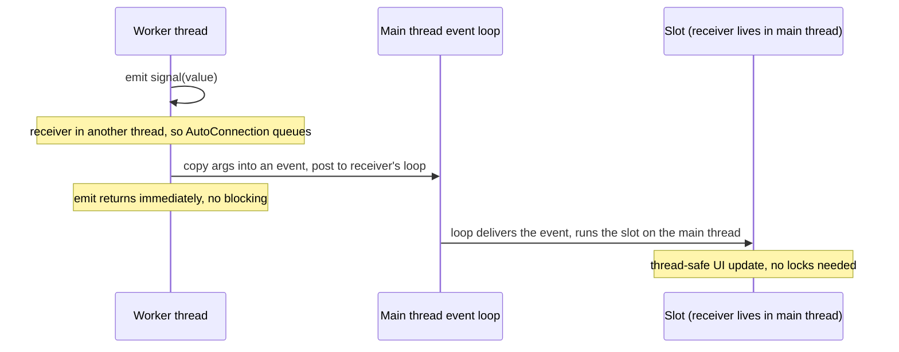

# Qt 6 Study Guide

A depth-first guide to Qt 6 — the C++ application framework behind KDE Plasma, OBS Studio, VirtualBox, Telegram Desktop, VLC's interface, and an enormous share of the world's automotive dashboards, medical devices, and industrial control panels — written for engineers who are comfortable programmers but have never used Qt, and who may be arriving from either of two directions: from the web (where the [Electron guide](ELECTRON_STUDY_GUIDE.md) is the sibling of this one), or from Python/backend work (where PySide6, Qt's official Python binding, is the on-ramp — it gets a full track in Part 13).

Qt's reputation is "a GUI toolkit," and that undersells it badly. Qt is closer to an *operating layer* for applications: it brings its own object model, its own memory-management discipline, its own event loop, its own string and container types, its own networking, database, and concurrency stacks — all portable across Windows, macOS, Linux, Android, iOS, and bare embedded boards. The cost of that completeness is that Qt code doesn't look or behave quite like the C++ (or Python) you already know, and most beginner confusion comes from not knowing *why*. So this guide is organized around four mental models, stated here and returned to constantly:

1. **The meta-object system.** A code generator (`moc`) gives every Qt object a runtime description of itself — its signals, slots, and properties. This is why Qt feels different from plain C++: it is C++ plus introspection, and signals/slots, QML bindings, and the property system are all built on it (Part 2).
2. **Parent-child ownership.** Qt's answer to memory management predates smart pointers and is still load-bearing: objects form trees, and deleting a parent deletes its children. Once you internalize the ownership tree, `new` without `delete` stops looking like a leak and starts looking like idiomatic Qt (Part 2).
3. **Everything is event-loop-driven.** One loop per thread dispatches everything — paint requests, timers, network readiness, queued signal deliveries. Block that loop and the UI freezes; understand it and Qt's entire async and threading story (Parts 3 and 10) becomes one coherent idea.
4. **Model/view separates data from presentation.** Your data lives in a model object; tables, lists, trees, and QML views are interchangeable renderings of it. This is Qt's most under-taught architectural idea and the one that most determines whether a large Qt app stays maintainable (Part 6).

The guide covers both of Qt's UI stacks — classic **Widgets** (Part 5) and declarative **Qt Quick/QML** (Part 7) — and is honest about when to use each, when to use Qt at all versus Electron or Tauri, and how Qt's dual licensing (LGPL vs. commercial) shapes real adoption decisions (Part 1). Code appears in both C++ and PySide6 throughout, because the architecture is identical and seeing both inoculates you against thinking either one *is* Qt.

Primary references: the [official Qt 6 documentation](https://doc.qt.io/qt-6/) (genuinely excellent — start with the [module list](https://doc.qt.io/qt-6/qtmodules.html) as a map, and read [Signals & Slots](https://doc.qt.io/qt-6/signalsandslots.html), [The Meta-Object System](https://doc.qt.io/qt-6/metaobjects.html), and [Model/View Programming](https://doc.qt.io/qt-6/model-view-programming.html) in full); the [Qt for Python / PySide6 docs](https://doc.qt.io/qtforpython-6/); the [Qt Wiki](https://wiki.qt.io/) for community how-tos; and the [KDAB blog](https://www.kdab.com/blog/) — KDAB are the most prolific independent Qt experts, and their posts on threading, QML performance, and modern CMake are the best third-party material available. For Widgets-with-Python tutorials, [pythonguis.com](https://www.pythonguis.com/) is the standout. Companion guides in this repo: [Electron](ELECTRON_STUDY_GUIDE.md) (the comparison runs through both guides), [C++26](CPP26_STUDY_GUIDE.md), [SQLite](SQLITE_STUDY_GUIDE.md), [Python Concurrency](PYTHON_CONCURRENCY.md), and [WebSockets](WEBSOCKETS_STUDY_GUIDE.md).

---

## Table of Contents

1. [Part 1 — What Qt Is, and When to Choose It](#part-1--what-qt-is-and-when-to-choose-it)
2. [Part 2 — QObject, the Meta-Object System & Ownership](#part-2--qobject-the-meta-object-system--ownership)
3. [Part 3 — The Event Loop: Qt's Heartbeat](#part-3--the-event-loop-qts-heartbeat)
4. [Part 4 — Qt Core's Everyday Toolkit](#part-4--qt-cores-everyday-toolkit)
5. [Part 5 — Widgets: The Classic Desktop Stack](#part-5--widgets-the-classic-desktop-stack)
6. [Part 6 — Model/View: Separating Data from Presentation](#part-6--modelview-separating-data-from-presentation)
7. [Part 7 — QML & Qt Quick: The Declarative Stack](#part-7--qml--qt-quick-the-declarative-stack)
8. [Part 8 — Talking to the World: Network & Devices](#part-8--talking-to-the-world-network--devices)
9. [Part 9 — Data Persistence with Qt SQL](#part-9--data-persistence-with-qt-sql)
10. [Part 10 — Concurrency: Threads Done Right](#part-10--concurrency-threads-done-right)
11. [Part 11 — Multimedia](#part-11--multimedia)
12. [Part 12 — Production: Testing, i18n & Deployment](#part-12--production-testing-i18n--deployment)
13. [Part 13 — The PySide6 Track](#part-13--the-pyside6-track)
14. [Part 14 — Capstone Projects & Where to Go Next](#part-14--capstone-projects--where-to-go-next)
15. [Appendix — Reference Map](#appendix--reference-map)

---

## Part 1 — What Qt Is, and When to Choose It

Qt (pronounced "cute" by its developers, "cue-tee" by most of the world) began at Trolltech in 1995, passed through Nokia, and is now stewarded by the Qt Group with development in the open at [qt.io](https://www.qt.io/) and [code.qt.io](https://code.qt.io/). Thirty years of continuous development have produced something rare: a framework that is simultaneously the *traditional* choice for native desktop software and the *dominant* choice for embedded UIs — the screens in cars, medical instruments, industrial machines, and set-top boxes. When you evaluate Qt, you're evaluating a mature, enormous, professionally maintained ecosystem, not a fashionable library that may be abandoned in three years. That maturity is the headline feature and, occasionally, the headline frustration (some APIs carry visible geological strata from the Qt 4 era).

### One Framework, Two UI Stacks

The first structural fact to absorb: Qt ships **two complete, largely separate ways to build a UI**, and you must choose between them per project.

**Qt Widgets** ([docs](https://doc.qt.io/qt-6/qtwidgets-index.html)) is the classic stack: C++ classes like `QPushButton` and `QTableView`, painted by the CPU through a style engine that imitates each platform's native look. Widgets are mature, dense, and keyboard-friendly — the natural choice for tools that look like *applications*: IDEs, audio workstations, CAD, admin panels, anything with menus, dockable panels, and ten thousand cells of data on screen.

**Qt Quick / QML** ([docs](https://doc.qt.io/qt-6/qtquick-index.html)) is the modern stack: you describe the UI in **QML**, a declarative language with embedded JavaScript, and it renders on the GPU through a scene graph. Qt Quick is the natural choice for fluid, animated, touch-first interfaces — embedded HMIs, kiosks, mobile apps, anything where the UI *is* the product's identity rather than a shell around forms.

The honest trade-off, which the marketing tends to blur:

| | Qt Widgets | Qt Quick / QML |
|---|---|---|
| Rendering | CPU raster, native-look styles | GPU scene graph, custom-look styles |
| Sweet spot | Dense desktop tools, data-heavy UIs | Animated, touch, embedded, mobile UIs |
| Built-in desktop machinery | Excellent (docking, MDI, item views, dialogs) | Thinner — you build or buy more |
| Animation & visual effects | Possible but laborious | The whole point; trivial |
| Language for UI logic | C++ (or Python) | QML/JavaScript, with C++ behind it |
| Maturity & API stability | Extremely high, feature-complete | Actively evolving |
| Maintenance status | Maintained, not where new investment goes | Where Qt's R&D goes |

A defensible rule: **if your app is a desktop tool with tables, trees, forms, and menus, choose Widgets; if it has a designed, animated, touch-or-TV interface, choose Quick.** Learn one well before touching the other — they share everything below the UI (Parts 2–4, 6, 8–10 apply identically to both), so nothing you learn is wasted.

### Qt vs. Electron vs. Tauri

If your target is the desktop, the live alternatives are Electron and Tauri (both covered comparatively in the [Electron guide](ELECTRON_STUDY_GUIDE.md), from the other side of the fence). The decision compresses to this:

| | Qt | Electron | Tauri |
|---|---|---|---|
| UI technology | Native widgets or GPU scene graph | Chromium (web) | OS webview (web) |
| Languages | C++ / Python (PySide6) | JS/TS + Node | Rust + JS/TS |
| Memory baseline | ~30–80 MB | ~150–300 MB | ~50–100 MB |
| Binary size | ~20–60 MB (shared Qt libs) | ~100–150 MB | ~3–15 MB |
| Rendering consistency | Identical everywhere (Qt draws it) | Identical everywhere (Chromium) | Varies by OS webview |
| Startup time | Fast | Slow | Fast |
| Team skill reuse | C++/Python skills | Web skills | Rust + web skills |
| Embedded/automotive | The industry standard | No | No |

The pattern in practice: teams of web developers ship Electron because the framework cost is lower than the retraining cost; teams who need small footprints, instant startup, deep OS or hardware integration, or embedded deployment ship Qt; Tauri sits between. Qt's real advantages are performance and reach (one codebase from a Raspberry Pi dashboard to a Windows desktop app — see the [Raspberry Pi guide](RASPBERRY_PI_STUDY_GUIDE.md)); its real costs are a steeper learning curve, a smaller hiring pool than web tech, and the licensing question below. If you remember one comparison: **Electron ships a browser to reuse your skills; Qt asks you to learn a framework to ship a native program.**

### Licensing: The Question That Shapes Adoption

No Qt evaluation is complete without licensing, because it genuinely changes what companies do. Qt is dual-licensed ([official overview](https://www.qt.io/licensing/)):

- **Open source**: most of Qt under **LGPLv3** (some add-on modules, e.g. Qt Charts and Qt Data Visualization, are GPLv3-only in the open-source edition). LGPLv3 lets you ship closed-source applications **provided** users can replace the Qt libraries — in practice this means you *dynamically link* Qt, ship the license texts, and don't lock the device against relinking. For a normal desktop app this is easy and thousands of commercial products do exactly this. PySide6 is LGPLv3, which is precisely why it exists alongside the older GPL-licensed PyQt.
- **Commercial**: a paid per-developer license that removes the LGPL obligations — static linking, locked-down embedded devices (where the user *can't* swap libraries, the LGPL's "anti-Tivoization" terms bite), access to a few commercial-only modules and official support. Embedded and automotive shops almost always buy it; desktop ISVs usually don't need it.

The decision tree is short: open-source app → use Qt freely under (L)GPL. Closed-source desktop app → LGPL with dynamic linking is almost always fine, but have someone actually read the obligations. Closed-source *embedded* device → budget for the commercial license. The widespread belief that "commercial software requires a Qt license" is false, and the widespread belief that "LGPL means no obligations" is also false; both errors are expensive.

### C++ or Python?

Qt is written in C++, and C++ is where every API is documented first. **PySide6** ("Qt for Python", [docs](https://doc.qt.io/qtforpython-6/)) is the official binding, maintained by the Qt Group itself, and it is *complete* — the object model, signals/slots, model/view, QML integration, everything. The architecture you learn is identical; only the syntax and the performance envelope differ. Choose C++ when you need maximum performance, minimal memory, embedded targets, or you're integrating with a C++ codebase; choose PySide6 when developer velocity, the Python ecosystem (NumPy, pandas, ML tooling), or your team's existing skills dominate — which describes a great deal of scientific and internal-tools software. This guide shows both throughout and gives PySide6 its own track in Part 13. (If you're choosing between PySide6 and PyQt6: they are nearly API-identical; PySide6 is official and LGPL, PyQt6 is third-party and GPL/commercial. New projects should default to PySide6.)

### How to Read Qt's Documentation

One habit multiplies everything that follows. Each class page at [doc.qt.io/qt-6](https://doc.qt.io/qt-6/) has the same anatomy — a prose *Detailed Description* (read it; it's where the design intent lives), then properties, signals, and member functions — and most classes link to an *overview page* for their subsystem (the event system, model/view, threading) that explains the architecture the class participates in. The overview pages are the textbook chapters; the class pages are the dictionary. Beginners who only ever land on class pages via search find Qt arbitrary; reading the linked overview first is usually the difference between memorizing an API and understanding it. PySide6 pages at [doc.qt.io/qtforpython-6](https://doc.qt.io/qtforpython-6/) mirror the C++ ones — when a Python page is thin, read the C++ page and translate, which after Part 13 you'll do without noticing.

If you remember one thing from Part 1: **Qt is two UI stacks on one shared foundation — pick Widgets for dense desktop tools and Quick for fluid/touch UIs, pick Qt itself when performance, footprint, or embedded reach beats web-skill reuse, and settle the LGPL-vs-commercial question before you write code, not after.**

---

## Part 2 — QObject, the Meta-Object System & Ownership

Everything distinctive about Qt flows from one class and one code generator. The class is `QObject` ([docs](https://doc.qt.io/qt-6/qobject.html)); the generator is **moc**, the Meta-Object Compiler. Understand these and Qt stops feeling like magic; skip them and every error message will be a riddle.

### The Meta-Object System: Why Qt Doesn't Feel Like Plain C++

Standard C++ has almost no runtime introspection: at runtime, a compiled C++ object doesn't know its own class name, can't list its methods, and can't call a method given its name as a string. Qt needed all of that — to connect signals to slots, to let QML read and bind C++ properties by name, to serialize objects — decades before C++ had any reflection story. The solution was pragmatic: **generate the introspection data at build time**.

Here's the pipeline. When a class contains the `Q_OBJECT` macro:

```cpp
class Thermostat : public QObject {
    Q_OBJECT                 // <- the marker moc looks for
    Q_PROPERTY(double target READ target WRITE setTarget NOTIFY targetChanged)
public:
    explicit Thermostat(QObject *parent = nullptr);
    double target() const;
    void setTarget(double t);
signals:
    void targetChanged(double t);   // declared here, *implemented by moc*
};
```

the build system runs **moc** over the header, and moc emits a generated C++ file (`moc_thermostat.cpp`) containing: a static `QMetaObject` — string tables describing the class name, its signals, slots, and properties; the *implementations* of your signals (a signal is a real member function whose body, written by moc, walks the connection list and invokes every connected slot); and a dispatch function (`qt_metacall`) that can invoke any slot or read any property *by index*, which is what makes string-based and queued invocation possible. CMake's `qt_standard_project_setup()` turns on `AUTOMOC` so all this happens invisibly ([docs: The Meta-Object System](https://doc.qt.io/qt-6/metaobjects.html), [Why does Qt use moc?](https://doc.qt.io/qt-6/why-moc.html)).

This single design decision explains most of Qt's texture:

- `signals:` and `slots:` and `emit` are not C++ keywords — they're macros (mostly expanding to nothing or to `public`/`protected`) that exist as *markers for moc*. `emit progress(50);` compiles as a plain call to `progress(50)`; the moc-generated body of `progress` does the actual delivery.
- `qobject_cast<Worker*>(obj)` is a dynamic cast that works without C++ RTTI, by consulting the meta-object.
- QML can write `thermostat.target = 22.5` and bind to changes, because the property's name, getter, setter, and notify signal are all in the meta-object, readable at runtime.
- The classic beginner build error — *"undefined reference to vtable for Thermostat"* — almost always means moc never ran on that class: you added `Q_OBJECT` to a class defined in a `.cpp` file (moc scans headers by default; add `#include "thermostat.moc"` at the bottom or move the class to a header), or you forgot `Q_OBJECT` entirely, or the build is stale. Decode that one error and you'll save hours.

You can watch the meta-object work directly, which makes it concrete:

```cpp
Thermostat t;
const QMetaObject *mo = t.metaObject();
qDebug() << mo->className();                       // "Thermostat" — at runtime, from C++!
t.setProperty("target", 22.5);                     // set a property BY NAME, type-checked
qDebug() << t.property("target").toDouble();       // 22.5 — read it back the same way
for (int i = 0; i < mo->propertyCount(); ++i)
    qDebug() << mo->property(i).name();            // enumerate properties generically
```

That `setProperty`-by-string call is, in miniature, exactly what QML does every time it touches a C++ object (Part 7), what generic persistence layers do, and what Qt's property animation system drives. The mental model to keep: **every QObject carries a runtime description of itself, generated at build time.** Qt is C++ with reflection bolted on — that's why it can offer dynamic, loosely-coupled facilities (signals/slots, QML bindings, property animation) that plain C++ can't express.

In PySide6 there is no moc and no build step, because Python is already introspectable — the `Signal`/`Slot`/`Property` objects from `PySide6.QtCore` plug directly into the same meta-object machinery at class-creation time. Same system, no code generator.

### Signals and Slots

Signals and slots are Qt's implementation of the observer pattern, and they're the connective tissue of every Qt program: a **signal** announces that something happened; a **slot** is any callable that reacts; `connect()` wires them with full type-safety and automatic disconnection when either side is destroyed ([docs](https://doc.qt.io/qt-6/signalsandslots.html)).

```cpp
class Downloader : public QObject {
    Q_OBJECT
public:
    using QObject::QObject;
    void start();
signals:
    void progress(int percent);     // signals: declared, never defined by you
    void finished(QString path);
};

auto *dl = new Downloader(this);
auto *bar = new QProgressBar(this);

QObject::connect(dl, &Downloader::progress, bar, &QProgressBar::setValue);
QObject::connect(dl, &Downloader::finished, this, [this](const QString &path) {
    statusBar()->showMessage(tr("Saved to %1").arg(path));
});
dl->start();
```

Notice what's *not* here: `Downloader` knows nothing about progress bars or status bars. The emitter announces; whoever cares subscribes. Multiple slots can connect to one signal (called in connection order), one slot can serve many signals, and signals can connect to signals. This loose coupling is why Qt codebases can stay modular at enormous size.

**The connect syntax has evolved, and you will meet all three generations in the wild.** Qt 4 used string-based macros:

```cpp
connect(dl, SIGNAL(progress(int)), bar, SLOT(setValue(int)));   // legacy — avoid
```

The strings are matched against the meta-object's string tables *at runtime* — a typo or signature mismatch compiles fine and fails silently with only a console warning. Qt 5 introduced the **pointer-to-member syntax** used above, which is checked by the *compiler*, survives refactoring/renaming, allows implicit argument conversions, and accepts lambdas and free functions. Always prefer it. The third form is the lambda connection — and here the **context object** (the third argument) matters more than it looks:

```cpp
connect(dl, &Downloader::progress, this, [this](int pct) { updateUi(pct); });
//                                 ^^^^ context: lifetime + thread
```

The context object does two jobs: the connection is automatically severed when the context is destroyed (without it, a lambda capturing `this` can fire after `this` is deleted — a classic crash), and the lambda runs *in the context object's thread* (which is what makes cross-thread delivery in Part 10 safe). Rule of thumb: **never write a capturing-lambda connection without a context object.**

A connection's *delivery mode* is its **connection type**, the optional fifth argument. The default, `Qt::AutoConnection`, decides at emit time: if the receiver lives in the thread that is emitting, the slot is called **directly** — synchronously, like a normal function call, before `emit` returns; if the receiver lives in another thread, the call is **queued** — the arguments are copied into an event, posted to the receiver's event loop, and the slot runs later in the receiver's thread. This automatic, correct-by-default behavior is the heart of Qt's threading story, and Part 10 builds on it; for now, internalize that *within one thread, signals are just function calls* — there is no event loop involvement, no async hop, no overhead beyond an indirect call.

PySide6 makes the same machinery feel native to Python:

```python
from PySide6.QtCore import QObject, Signal, Slot

class Downloader(QObject):
    progress = Signal(int)              # class attribute, typed
    finished = Signal(str)

    def start(self):
        for pct in (25, 50, 75, 100):
            self.progress.emit(pct)
        self.finished.emit("/tmp/file.bin")

dl = Downloader()
dl.progress.connect(lambda pct: print(f"{pct}%"))   # any Python callable is a slot
dl.start()
```

Any Python callable can be a slot; the `@Slot(int)` decorator is optional but gives a real meta-object slot (slightly faster dispatch, required for some QML and threading cases — cheap insurance, use it on anything called across threads or from QML).

### Properties and Qt 6 Bindables

`Q_PROPERTY` formalizes "a value with a getter, setter, and change signal" so that the property is visible through the meta-object — which is what lets QML bind to it, `QSettings`-style code read it by name, and animations drive it. Qt 6 added **bindable properties** ([docs](https://doc.qt.io/qt-6/bindableproperties.html)): wrap the storage in `QProperty<T>` and dependent values can recompute automatically, spreadsheet-style, with no `connect()` calls:

```cpp
class Thermostat : public QObject {
    Q_OBJECT
    Q_PROPERTY(double target READ target WRITE setTarget BINDABLE bindableTarget)
public:
    double target() const { return m_target; }
    void setTarget(double t) { m_target = t; }
    QBindable<double> bindableTarget() { return &m_target; }
private:
    QProperty<double> m_target{20.0};
};

Thermostat t;
QProperty<QString> label;
label.setBinding([&] { return QStringLiteral("Target: %1°C").arg(t.bindableTarget().value()); });
qDebug() << label.value();   // "Target: 20°C"
t.setTarget(22.5);
qDebug() << label.value();   // "Target: 22.5°C" — recomputed, no connect() in sight
```

This is the same reactive idea QML has had since the beginning (Part 7), surfacing in C++. New code that exposes state to QML should use `Q_PROPERTY` with `NOTIFY` or `BINDABLE` religiously — an un-notifying property is invisible to QML bindings and produces "why doesn't my UI update" bugs.

### Parent-Child Ownership: Qt's Answer to Memory Management

Now the second central mental model. Every `QObject` constructor takes an optional **parent**. Setting it does two things: the child is added to the parent's list of children, and **when the parent is destroyed, it deletes all of its children** — recursively, the whole tree. This is Qt's memory management, designed in 1995 and still the idiom today:

```cpp
auto *window  = new QMainWindow;                    // no parent — we own this one
auto *central = new QWidget(window);                // window owns it
auto *layout  = new QVBoxLayout(central);           // central owns it
auto *button  = new QPushButton("Go", central);     // central owns it
layout->addWidget(button);
window->setCentralWidget(central);
// ...
delete window;   // deletes central, layout, button — the entire tree, exactly once
```

To a modern C++ eye, `new` with no matching `delete` looks like a leak. In Qt it's the *intended style*: heap-allocate QObjects, parent them, and let the tree manage lifetimes. The bookkeeping is bidirectional and self-correcting — if you delete a child manually, it removes itself from its parent's list first, so there is no double-delete. For widgets, parenting carries a second meaning: a child widget is *displayed inside* its parent, so the visual hierarchy and the ownership hierarchy are the same tree.

What this means for C++ lifetimes, in rules you can keep:

- **QObjects on the heap, parented; plain data on the stack or in containers.** Don't wrap parented QObjects in `std::unique_ptr`/`std::shared_ptr` — two owners (the smart pointer and the parent) is a double-delete waiting to happen. Smart pointers are for *unparented* objects only.
- **QObjects are non-copyable.** They have identity (connections, children, a place in a tree), not value semantics. You pass `QObject*` around; the type system enforces this.
- **Stack allocation is fine for tree roots** (`QApplication app; MainWindow w;` in `main()` is the canonical pattern), but beware ordering: if a stack-allocated object is also given a parent, the parent must outlive it *or* destruction order must run child-first, or the parent will `delete` a stack object — undefined behavior. The simple discipline: stack-allocate only parentless roots.
- **Use `obj->deleteLater()` instead of `delete obj` when the object might be in use further up the call stack** — e.g., deleting `sender()` from within a slot it triggered. `deleteLater()` posts a deferred deletion event; the object dies when control returns to the event loop (Part 3). This is also why network replies are cleaned up with `deleteLater()` in Part 8.
- **Dangling-pointer insurance is `QPointer<T>`** — a weak pointer that nulls itself when its QObject dies. Useful when you hold a non-owning pointer to something whose lifetime you don't control.

In PySide6 the same tree exists, layered with Python's reference counting: a parented QObject is kept alive by its parent on the C++ side even if no Python reference remains; an *unparented* one is destroyed when Python garbage-collects it. The infamous symptom is a window or timer that vanishes instantly because it was created as a local variable with no parent and no surviving reference — keep a reference (e.g., `self.timer = QTimer(self)`) or set a parent, and the problem disappears.

If you remember one thing from Part 2: **moc gives every QObject a runtime self-description — that's what powers signals/slots and QML — and the parent-child tree is the memory manager: parent your QObjects and let the tree delete them, exactly once, in one place.**

```quiz
Q: Why does Qt need moc (the Meta-Object Compiler) at all?
- [ ] To speed up compilation
- [x] Standard C++ has almost no runtime introspection — Qt generates the class's self-description (name, signals, slots, properties) at build time, which is what powers signals/slots, QML bindings, and by-name property access
- [ ] To convert C++ to QML
- [ ] To replace the C++ compiler
> A compiled C++ object can't list its methods or call one by string name, but Qt needs exactly that for `connect()`, QML's `thermostat.target = 22.5`, and property animation. moc scans for `Q_OBJECT` and emits a static `QMetaObject` plus the signal implementations and an index-based dispatch function. The classic "undefined reference to vtable" error almost always means moc never ran on that class.

Q: `delete window;` with no other deletes frees the central widget, layout, and button too. What makes this safe rather than a leak-or-double-free hazard?
- [ ] Qt uses garbage collection
- [x] Parent-child ownership: a parent deletes all its children recursively, and the bookkeeping is bidirectional — a manually-deleted child removes itself from its parent's list first, so nothing is freed twice
- [ ] Widgets are stack-allocated internally
- [ ] The compiler inserts the deletes
> Heap-allocate QObjects, parent them, and let the tree manage lifetimes — that's the intended idiom, not a leak. The corollary rules: don't wrap parented QObjects in smart pointers (two owners = double delete), stack-allocate only parentless roots, and use `deleteLater()` when the object might still be in use up the call stack (it dies when control returns to the event loop).

Q: Why must a capturing-lambda `connect()` always include a context object (the third argument)?
- [ ] It's required syntax since Qt 6
- [x] The context severs the connection when it's destroyed (otherwise a lambda capturing `this` can fire after `this` is deleted — a classic crash) and determines which thread the lambda runs in
- [ ] It makes the lambda faster
- [ ] It enables string-based connects
> Without a context, the connection outlives the objects the lambda captures, so a later emit calls into freed memory. With `this` as context, destruction of the receiver automatically disconnects, and the lambda executes in the context object's thread — the same mechanism that makes cross-thread queued delivery safe in Part 10. Rule: never write a capturing-lambda connection without one.
```

---

## Part 3 — The Event Loop: Qt's Heartbeat

The third central mental model. Strip any Qt application to its skeleton and you find this:

```cpp
int main(int argc, char *argv[]) {
    QApplication app(argc, argv);
    MainWindow w;
    w.show();
    return app.exec();    // <- the program lives inside this call
}
```

`app.exec()` starts the **event loop** ([docs: The Event System](https://doc.qt.io/qt-6/eventsandfilters.html)), and the program spends its entire life inside it. Conceptually it's a dispatcher: wait for an event from the operating system (mouse moved, key pressed, window needs repainting, socket has data, timer expired), wrap it in a `QEvent`, deliver it to the target `QObject`'s `event()` method, repeat. Every line of *your* code after `exec()` runs as a **callback** — a slot, an event handler, a timer handler — invoked by the loop, expected to do its work and *return quickly*. Qt applications aren't programs with a beginning, middle, and end; they're collections of reactions, exactly like a Node.js service or a browser page (the [Advanced Node.js guide](ADVANCED_NODEJS_STUDY_GUIDE.md) describes the same architecture; Qt and Node are the same shape in different languages).

### Why Blocking the Loop Freezes the UI

Here is the most common Qt bug, in four lines:

```cpp
void MainWindow::onSyncClicked() {
    const auto data = fetchEverythingFromServer();   // takes 8 seconds, synchronously
    populateTable(data);
}
```

Click the button and the app "freezes": the window stops repainting, drag does nothing, the OS may grey the window and offer to kill it. Nothing crashed. The mechanics are worth spelling out because they make the fix obvious: the slot is *itself a callback running inside the event loop's dispatch step*. While it runs, the loop is not looping. Paint events aren't processed, so the window can't redraw; mouse and key events queue up unprocessed, so input is dead; timers don't fire; queued signal deliveries wait. The window manager notices the app hasn't pumped its queue and declares it unresponsive. **The UI thread's only job is to keep the loop spinning**; anything slow — network calls, big file reads, heavy computation, `sleep()` — must be made asynchronous (Qt's I/O classes are async-first, Part 8) or moved to another thread (Part 10).

You will find old code "fixing" freezes with `QCoreApplication::processEvents()` sprinkled inside long loops — manually pumping the queue mid-task. Treat it as a red flag, not a tool: it makes your function *re-entrant* (the user can click the button again while the first click is still executing, events fire against half-mutated state), and it's the source of legendarily unreproducible bugs. The honest fixes are async APIs and worker threads.

### Timers, Deferred Work, and Queued Delivery

Once you see the loop, several idioms snap into focus. A `QTimer` ([docs](https://doc.qt.io/qt-6/qtimer.html)) is not a thread — it's a request that the loop deliver you an event after an interval:

```cpp
auto *timer = new QTimer(this);
connect(timer, &QTimer::timeout, this, &Dashboard::refresh);
timer->start(5000);                                   // refresh every 5s — while the loop runs

QTimer::singleShot(0, this, &Dashboard::buildHeavyView);   // "run this on the next loop iteration"
```

That second form — a **zero-timeout single-shot** — is the standard "defer until the loop is idle" trick: schedule work after the constructor finishes, after the window is shown, after the current event is fully processed. `deleteLater()` from Part 2 is the same idea applied to destruction. And the **queued signal delivery** from Part 2 is now fully explainable: a cross-thread signal emission copies its arguments into a `QMetaCallEvent` and posts it to the receiver's event loop, which delivers it like any other event — *signals across threads are just events in the queue*. One mechanism, no special cases — this is why Qt's threading model is learnable at all.

Two consequences worth pinning: a thread without a running event loop can't receive queued signals or timer events (relevant in Part 10), and `exec()` must be reached before any of this machinery works — code that emits queued signals before the loop starts simply queues them until it does.

### Events vs. Signals

Newcomers conflate the two; they're different layers. **Events** come from *outside* (the OS, mostly) and are delivered top-down to one object: `mousePressEvent()`, `keyPressEvent()`, `paintEvent()`, `resizeEvent()` — protected virtual methods you *override* when subclassing a widget to change how it behaves. **Signals** are emitted by objects *about themselves* and broadcast to whoever connected — the public, composable layer. A `QPushButton` receives low-level mouse events, interprets them (press + release inside its bounds), and emits the high-level signal `clicked()`. You *handle events* when implementing a component; you *connect signals* when composing components. If you're writing `connect` you're composing; if you're overriding `*Event` you're implementing. The shape of the implementing side, for when you get there:

```cpp
class ZoomableCanvas : public QWidget {
    Q_OBJECT
protected:
    void wheelEvent(QWheelEvent *ev) override {
        if (ev->modifiers() & Qt::ControlModifier) {     // Ctrl+wheel = zoom, a desktop convention
            m_zoom *= ev->angleDelta().y() > 0 ? 1.1 : 0.9;
            update();                                    // schedule a repaint (Part 5)
            ev->accept();                                // we consumed it
        } else {
            QWidget::wheelEvent(ev);                     // not ours — let the base class handle it
        }
    }
};
```

The `accept()`/`ignore()` calls matter more than they look: an ignored event *propagates* to the parent widget, which is how a click on a passive child still reaches the container that cares about it. There's also `installEventFilter()` ([docs](https://doc.qt.io/qt-6/qobject.html#installEventFilter)) for intercepting another object's events without subclassing — handy, occasionally indispensable, easy to overuse.

If you remember one thing from Part 3: **one loop per thread dispatches everything — input, painting, timers, network readiness, queued signals, deferred deletions — so your callbacks must return fast, and anything slow belongs in async APIs or another thread, never in a slot on the UI thread.**

```quiz
Q: A slot makes a synchronous 8-second server call and the whole window freezes — no repaint, dead input. Why?
- [ ] The network call crashed the render thread
- [x] The slot is a callback running *inside* the event loop's dispatch step — while it runs the loop isn't looping, so paint events, input, timers, and queued signals all wait
- [ ] Qt throttles slow applications
- [ ] The window manager killed the process
> Everything after `app.exec()` runs as callbacks invoked by the loop, and the loop can't process the next event until the current callback returns. A slow slot stalls painting, queues input unprocessed, and makes the OS declare the app unresponsive. The UI thread's only job is to keep the loop spinning — slow work goes to async APIs or a worker thread.

Q: Old code "fixes" freezes by calling `processEvents()` inside long loops. Why is that a red flag?
- [ ] processEvents is deprecated
- [x] It makes the function re-entrant — the user can click the button again mid-task and events fire against half-mutated state — the source of legendarily unreproducible bugs; the honest fixes are async APIs and worker threads
- [ ] It leaks memory
- [ ] It only works on Windows
> Manually pumping the queue mid-task means arbitrary other code (including the same slot, triggered again) runs while your function is half-done. State invariants you assumed hold across the function body no longer do. Treat `processEvents()` in application code as a smell pointing at work that belongs off the UI thread.

Q: What's the difference between handling events and connecting signals?
- [ ] They're two names for the same mechanism
- [x] Events come from outside (OS) and are delivered top-down to one object via overridable `*Event()` methods — the *implementing* layer; signals are emitted by objects about themselves and broadcast to subscribers — the *composing* layer
- [ ] Signals are faster than events
- [ ] Events only exist in widgets
> A `QPushButton` receives low-level mouse events, interprets them, and emits the high-level `clicked()` signal. You override `*Event` methods when building a component's behavior (and call `accept()`/`ignore()` to control propagation to the parent); you `connect()` signals when wiring components together. If you're writing `connect` you're composing; if you're overriding `mousePressEvent` you're implementing.
```

---

## Part 4 — Qt Core's Everyday Toolkit

Before the UI stacks, a short tour of the vocabulary you'll use on every page of Qt code. `Qt Core` ([docs](https://doc.qt.io/qt-6/qtcore-index.html)) predates `std::` having answers to many of these problems, so Qt has its own types — and they're not mere legacy: they integrate with the meta-object system, QML, and each other in ways the standard library can't.

**Strings.** `QString` is a UTF-16 Unicode string (same internal representation as JavaScript and Java strings). It's the currency of every Qt API, rich in convenience (`split`, `arg`, `toInt`, locale-aware comparison), and converts to/from UTF-8 `std::string` at the boundaries of your code (`toStdString()`, `fromStdString()`). `QByteArray` is the raw-bytes counterpart, used for I/O, network payloads, and serialization. The practical rule: use Qt strings inside Qt code, convert only at the edges, and format with `QStringLiteral("...")` for compile-time string construction and `tr()` for anything user-visible (Part 12 explains why).

**Containers and implicit sharing.** `QList`, `QHash`, `QMap` mirror `std::vector`/`unordered_map`/`map` and interoperate with STL algorithms and range-for. Their distinctive feature is **implicit sharing** (copy-on-write, [docs](https://doc.qt.io/qt-6/implicit-sharing.html)): copying a `QString`, `QList`, `QImage`, or most Qt value types copies a pointer and bumps a refcount; the real copy happens only if one side later mutates. This is why Qt APIs cheerfully pass containers *by value* — it costs nothing — and why signals can carry `QString` payloads across threads safely (each side ends up with its own copy on write). You mostly never think about it; you just stop fearing value semantics.

**`QVariant`** ([docs](https://doc.qt.io/qt-6/qvariant.html)) is a type-erased "any" that can hold any meta-type-registered value. It looks clunky next to `std::variant`, but it's load-bearing: it's how model/view passes arbitrary cell data (Part 6), how `QSettings` stores values, and how values cross the C++/QML boundary. In PySide6, QVariant is invisible — Python objects convert automatically.

**Files, settings, JSON.** `QFile`/`QDir`/`QStandardPaths` give portable filesystem access (`QStandardPaths::writableLocation(QStandardPaths::AppDataLocation)` answers "where may I save data on this OS?" — the question every desktop app must ask). `QSettings` ([docs](https://doc.qt.io/qt-6/qsettings.html)) persists key/value preferences in each platform's native location (registry on Windows, plists on macOS, INI files on Linux) — window geometry, recent files, user options — with no code differences. `QJsonDocument`/`QJsonObject`/`QJsonArray` parse and produce JSON, the lingua franca of Part 8's network code. The three together cover most of an app's "remember things between runs" needs in a dozen lines:

```cpp
QSettings settings;                                       // org/app names set once on QCoreApplication
settings.setValue("window/geometry", saveGeometry());     // hierarchical keys, QVariant values
restoreGeometry(settings.value("window/geometry").toByteArray());

QFile f(QStandardPaths::locate(QStandardPaths::AppConfigLocation, "config.json"));
if (f.open(QIODevice::ReadOnly)) {
    const QJsonObject cfg = QJsonDocument::fromJson(f.readAll()).object();
    m_endpoint     = cfg["endpoint"].toString("https://api.example.com");   // with defaults
    m_pollInterval = cfg["pollSeconds"].toInt(30);
}
```

**The resource system** ([docs](https://doc.qt.io/qt-6/resources.html)) compiles assets — icons, QML files, translations, stylesheets — *into the executable*. Files declared in CMake via `qt_add_resources()` (or a `.qrc` manifest) become accessible under the `:/` path prefix: `QIcon(":/icons/save.svg")` works identically on every platform with no installation-path headaches, because the icon travels inside the binary. QML applications lean on this heavily — your `.qml` files ship as resources, not loose files.

One paragraph of practice advice: build something headless with Qt Core alone — a CLI tool that watches a directory (`QFileSystemWatcher`), parses JSON config, persists state in `QSettings`, and signals on changes, run under a `QCoreApplication` (the GUI-less application class whose `exec()` is the same event loop). Forcing yourself to use the event loop, ownership trees, and signals *without* a UI is the fastest way to verify the Part 2–3 mental models actually took.

---

## Part 5 — Widgets: The Classic Desktop Stack

Qt Widgets ([docs](https://doc.qt.io/qt-6/qtwidgets-index.html)) is the stack that made Qt's name, and it remains the most complete desktop UI toolkit in existence. A **widget** is a `QObject` subclass (`QWidget`) that owns a rectangle of screen: it paints itself when asked (a `paintEvent` from the loop — Part 3), receives input events, and may contain child widgets, with the ownership tree doubling as the visual containment tree (Part 2). Everything on screen, from a button to the main window itself, is a widget; complex widgets like `QTableView` are compositions of simpler ones.

### Layouts: Never Position by Pixel

The first discipline of widget programming: you don't place widgets at coordinates; you hand them to a **layout manager** ([docs](https://doc.qt.io/qt-6/layout.html)) that computes geometry from each widget's size hints and the available space, and re-computes on every resize, font change, or translation. `QHBoxLayout` and `QVBoxLayout` arrange in rows and columns, `QGridLayout` in a grid, `QFormLayout` in the label–field pattern of every settings page, and they nest arbitrarily:

```cpp
auto *form = new QFormLayout;
form->addRow(tr("Name:"),  m_nameEdit  = new QLineEdit);
form->addRow(tr("Email:"), m_emailEdit = new QLineEdit);

auto *buttons = new QHBoxLayout;
buttons->addStretch();                          // flexible space pushes buttons right
buttons->addWidget(m_cancel = new QPushButton(tr("Cancel")));
buttons->addWidget(m_save   = new QPushButton(tr("Save")));

auto *outer = new QVBoxLayout(this);            // 'this' = the dialog being built
outer->addLayout(form);
outer->addStretch();
outer->addLayout(buttons);
```

Hand-positioned UIs break the moment a user picks a bigger font, a longer language, or a smaller window; layout-managed UIs adapt for free. If you've written flexbox, the model (size hints + stretch factors + flexible spacing) will feel familiar — the main difference is that the *widgets themselves* report sensible minimum and preferred sizes (`sizeHint()`), so a layout-managed form is usable at every window size without you specifying a single pixel dimension.

A note on the widget catalog itself, because its breadth is the point of choosing this stack: beyond buttons and line edits there are calendar widgets, font and color pickers, tabbed and stacked containers, splitters, scroll areas, progress bars, sliders, dials, tree and table views, a rich-text editor (`QTextEdit` renders a useful HTML subset), and the `QCompleter` machinery for autocomplete — all themable, all keyboard-accessible, all documented under the [widget gallery](https://doc.qt.io/qt-6/gallery.html). The professional instinct is to *survey before building*: a surprising fraction of "custom widget" work in real codebases reimplements something the catalog already ships.

### QMainWindow, Actions, and the Anatomy of a Desktop App

`QMainWindow` ([docs](https://doc.qt.io/qt-6/qmainwindow.html)) provides the desktop application frame: a menu bar, toolbars, dockable side panels (`QDockWidget`), a status bar, and a central widget. Its essential companion is `QAction` ([docs](https://doc.qt.io/qt-6/qaction.html)), which solves a real problem elegantly: a user command — "Save", "Add Item" — typically appears in a menu, on a toolbar, *and* as a keyboard shortcut, and its enabled/checked state must stay consistent across all three. An action *is* the command, as one object; the surfaces merely display it:

```cpp
auto *addAction = new QAction(QIcon(":/icons/add.svg"), tr("&Add Item"), this);
addAction->setShortcut(QKeySequence::New);
connect(addAction, &QAction::triggered, this, &MainWindow::openEditDialog);

menuBar()->addMenu(tr("&File"))->addAction(addAction);
addToolBar(tr("Main"))->addAction(addAction);   // same action, two surfaces, one handler
```

Disable the action once (`addAction->setEnabled(false)`) and the menu item greys out, the toolbar button greys out, and the shortcut goes dead — consistency by construction. Add `QSettings`-backed `saveGeometry()`/`restoreGeometry()` and a model-backed table view (Part 6) and you have the skeleton of essentially every serious desktop tool.

Dialogs follow the same composition pattern: subclass `QDialog`, build with layouts, and choose between `exec()` (modal — note that it runs a *nested event loop*, the one sanctioned use of that idea) and `show()` (modeless). A complete edit dialog is short enough to show whole, and it demonstrates the idiom of exposing results through accessors rather than letting callers poke at internal widgets:

```cpp
class EditItemDialog : public QDialog {
    Q_OBJECT
public:
    explicit EditItemDialog(QWidget *parent = nullptr) : QDialog(parent) {
        setWindowTitle(tr("Edit Item"));
        auto *form = new QFormLayout;
        form->addRow(tr("Name:"), m_name = new QLineEdit);
        form->addRow(tr("Qty:"),  m_qty  = new QSpinBox);
        m_qty->setRange(0, 100000);

        auto *box = new QDialogButtonBox(QDialogButtonBox::Ok | QDialogButtonBox::Cancel);
        connect(box, &QDialogButtonBox::accepted, this, &QDialog::accept);
        connect(box, &QDialogButtonBox::rejected, this, &QDialog::reject);

        auto *outer = new QVBoxLayout(this);
        outer->addLayout(form);
        outer->addWidget(box);
    }
    QString name() const { return m_name->text(); }
    int     qty()  const { return m_qty->value(); }
private:
    QLineEdit *m_name;
    QSpinBox  *m_qty;
};

// At the call site — typically inside the QAction handler from above:
EditItemDialog dlg(this);
if (dlg.exec() == QDialog::Accepted)
    m_model->addDevice({dlg.name(), true});      // hand the result to the Part 6 model
```

`QDialogButtonBox` is a small thing that buys real polish: it places OK/Cancel in each platform's *native order* (OK-then-Cancel on Windows, the reverse on macOS and GNOME) so you don't hard-code one platform's convention. For the standard cases — message boxes, file pickers, color choosers — `QMessageBox` and `QFileDialog` wrap the *native* OS dialogs, which is part of why Widgets apps feel at home on each platform.

There is also a visual designer: **Qt Designer** (standalone or inside Qt Creator, [docs](https://doc.qt.io/qt-6/qtdesigner-manual.html)) produces `.ui` XML files that the build turns into code (`AUTOUIC` in CMake, `pyside6-uic` in Python). Teams are split on it; a reasonable position is that Designer is excellent for form-heavy dialogs and fine to skip for everything else, but you should know how to *read* `.ui`-based code because you will inherit some.

### The Painting Layer Underneath

Widgets sit on `Qt GUI` ([docs](https://doc.qt.io/qt-6/qtgui-index.html)), the layer that owns windows, screens, fonts, images, and the 2D painter. When no stock widget fits — a waveform display, a custom gauge, an annotation canvas — you subclass `QWidget` and override `paintEvent()`:

```cpp
void Canvas::paintEvent(QPaintEvent *) {
    QPainter p(this);
    p.setRenderHint(QPainter::Antialiasing);
    p.fillRect(rect(), Qt::white);
    p.setPen(QPen(Qt::darkBlue, 2));
    for (const QRectF &r : m_regions)         // m_regions are in widget coordinates
        p.drawRect(r);
    p.drawText(rect(), Qt::AlignCenter, tr("%1 regions").arg(m_regions.size()));
}
```

Two rules keep custom painting sane. First, **you never paint outside a paint event**; when your data changes, call `update()`, which *schedules* a repaint through the event loop (Part 3 again — even painting is event-driven), coalescing multiple requests into one pass. Second, know the **`QImage` vs. `QPixmap`** split: `QImage` is pixels in your memory — manipulate, filter, access per-pixel, safe in worker threads; `QPixmap` is display-optimized and main-thread-only. Load and process as `QImage`, convert to `QPixmap` to show; confusing the two is behind a surprising share of image-performance bugs. For vector assets, `QSvgRenderer` ([Qt SVG docs](https://doc.qt.io/qt-6/qtsvg-index.html)) renders SVG icons crisply at any size and DPI — the right way to do icons in a high-DPI world.

### Styling Widgets: QSS

Widgets are themed with **Qt Style Sheets** ([docs](https://doc.qt.io/qt-6/stylesheet.html)), a CSS-like language applied per-widget or application-wide:

```css
/* app.qss — loaded and applied with qApp->setStyleSheet() */
QPushButton           { background: #2d6cdf; color: white; border-radius: 6px; padding: 6px 14px; }
QPushButton:hover     { background: #3b7ae6; }
QPushButton:disabled  { background: #9aa7bd; }
QLineEdit[invalid="true"] { border: 1px solid #d23; }   /* selects on a dynamic property */
```

That last selector enables a clean validation idiom — set a dynamic property and let the stylesheet restyle the field — with one wrinkle: property changes don't re-evaluate styles automatically, so you nudge the style engine:

```cpp
edit->setProperty("invalid", true);
edit->style()->unpolish(edit);
edit->style()->polish(edit);     // re-evaluate the stylesheet for this widget
```

Use QSS for branding and theming, but with restraint: the moment you style one aspect of a complex widget (say, a `QComboBox`), you often inherit responsibility for styling *all* of it, and heavy cascading sheets have a measurable performance cost. The native-look default is a feature; many of the best Widgets apps barely touch QSS and invest in layout and workflow instead. (Qt Quick has a completely separate styling system — Part 7; the two do not overlap.)

If you remember one thing from Part 5: **widgets are QObject trees that paint rectangles — compose them with layouts (never pixel positions), drive commands through QActions so menus/toolbars/shortcuts stay consistent, repaint only via update() through the event loop, and treat QSS theming as a deliberate budget, not free paint.**

---

## Part 6 — Model/View: Separating Data from Presentation

The fourth central mental model, and the part of Qt most worth over-learning. The naive way to fill a table is to copy your data into it — create items, set text, cell by cell. It works for a demo and collapses immediately after: now your data lives in two places (your structures *and* the widget), every update means re-synchronizing them, sorting/filtering mutate the copy, and showing the same data in a second view doubles everything. Qt's answer is the **model/view architecture** ([docs: Model/View Programming](https://doc.qt.io/qt-6/model-view-programming.html)): your data stays wherever it lives, wrapped in a **model** object exposing a standard interface (`QAbstractItemModel`); **views** — `QListView`, `QTableView`, `QTreeView`, and QML's `ListView`/`GridView`/`Repeater` alike — render whatever the interface exposes and stay synchronized automatically. The same model can feed a desktop table and a QML list *at the same time*.

The interface's vocabulary: a model is a (potentially hierarchical) grid addressed by `QModelIndex` (row, column, parent); each index answers `data()` requests for various **roles** — `Qt::DisplayRole` is the visible text, `Qt::DecorationRole` an icon, `Qt::ToolTipRole`, `Qt::EditRole`, and custom roles from `Qt::UserRole` up carry your domain values. Roles are the trick that keeps one method (`data()`) serving every facet of presentation without the model knowing anything about widgets.

### Implementing a Model: QAbstractListModel

For a flat list, subclass `QAbstractListModel` ([docs](https://doc.qt.io/qt-6/qabstractlistmodel.html)). The contract is small — report the row count, answer data requests, and *announce mutations* — and the announcement discipline is the part beginners miss, so the example marks it:

```cpp
struct Device { QString name; bool online; };

class DeviceModel : public QAbstractListModel {
    Q_OBJECT
public:
    enum Roles { NameRole = Qt::UserRole + 1, OnlineRole };
    using QAbstractListModel::QAbstractListModel;

    int rowCount(const QModelIndex &parent = {}) const override {
        return parent.isValid() ? 0 : m_devices.size();   // flat list: no children
    }

    QVariant data(const QModelIndex &idx, int role) const override {
        if (!idx.isValid() || idx.row() >= m_devices.size())
            return {};
        const Device &d = m_devices.at(idx.row());
        switch (role) {
        case Qt::DisplayRole:
        case NameRole:    return d.name;
        case OnlineRole:  return d.online;
        default:          return {};
        }
    }

    QHash<int, QByteArray> roleNames() const override {       // what QML sees (Part 7)
        return { {NameRole, "name"}, {OnlineRole, "online"} };
    }

    void addDevice(const Device &d) {
        beginInsertRows({}, m_devices.size(), m_devices.size());  // announce BEFORE mutating
        m_devices.append(d);
        endInsertRows();                                          // every attached view updates
    }

    void setOnline(int row, bool online) {
        if (row < 0 || row >= m_devices.size()) return;
        m_devices[row].online = online;
        const QModelIndex idx = index(row);
        emit dataChanged(idx, idx, {OnlineRole});                 // announce the change
    }

private:
    QList<Device> m_devices;
};
```

Walk through what each piece buys. `rowCount()`/`data()` are the read interface — note `data()` is called *constantly* during scrolling and painting, so it must stay cheap: no I/O, no allocation-heavy work, just lookups. The `begin*/end*` pairs around insertion (and their `beginRemoveRows`/`endRemoveRows` siblings) are how views learn the *shape* changed — they let every view update selections, scroll positions, and visible items incrementally instead of rebuilding. Skip them and views silently desynchronize or crash; this is the number-one model/view bug. `dataChanged` is the lighter announcement for *values* changing within existing cells. And `roleNames()` maps role numbers to names so QML delegates can write `text: name` — the bridge that makes one model serve both UI stacks (used in Part 7).

Attaching it to a view is one line — and **sorting and filtering come free** by interposing a proxy model rather than touching your data:

```cpp
auto *model = new DeviceModel(this);
auto *proxy = new QSortFilterProxyModel(this);
proxy->setSourceModel(model);
proxy->setFilterCaseSensitivity(Qt::CaseInsensitive);
view->setModel(proxy);
view->setSortingEnabled(true);          // click headers to sort — model data never moves
connect(searchBox, &QLineEdit::textChanged,
        proxy, &QSortFilterProxyModel::setFilterFixedString);
```

`QSortFilterProxyModel` ([docs](https://doc.qt.io/qt-6/qsortfilterproxymodel.html)) is itself a model that wraps another, re-mapping indexes — proxies stack, so "filtered then sorted" is two lines, and your actual data is never reordered or copied. This is the separation paying off: search, sort, multiple synchronized views, and even a later Widgets→QML migration become *configuration*, not rewrites.

For grids, `QAbstractTableModel` adds `columnCount()` and `headerData()`. Editing flows through the same interface in reverse — implement two more overrides and views grow in-place editors automatically (double-click a cell in a `QTableView` and an editor appears, no view code required):

```cpp
Qt::ItemFlags flags(const QModelIndex &idx) const override {
    return QAbstractListModel::flags(idx) | Qt::ItemIsEditable;   // advertise editability
}

bool setData(const QModelIndex &idx, const QVariant &value, int role = Qt::EditRole) override {
    if (!idx.isValid() || role != Qt::EditRole)
        return false;
    m_devices[idx.row()].name = value.toString();
    emit dataChanged(idx, idx, {Qt::DisplayRole, NameRole});      // announce, as always
    return true;
}
```

The symmetry is the lesson: the view *reads* through `data()` and *writes* through `setData()`, consulting `flags()` to learn what's allowed — and your data structures remain the single source of truth throughout. When a cell needs custom rendering or a custom editor — a progress bar, a combo box, a star rating — that's a **delegate** (`QStyledItemDelegate`, [docs](https://doc.qt.io/qt-6/qstyleditemdelegate.html)): the view asks the delegate to paint each cell and to create editors, completing the triad of model (data), view (arrangement), delegate (per-item appearance). And before hand-rolling anything, check the ready-made models: `QStringListModel`, `QStandardItemModel` for ad-hoc trees, `QFileSystemModel`, and `QSqlTableModel` (Part 9), which puts a database table behind this same interface.

The PySide6 rendition is structurally identical, which is the point — learn the contract once:

```python
from PySide6.QtCore import QAbstractListModel, QModelIndex, Qt

class DeviceModel(QAbstractListModel):
    NameRole   = Qt.ItemDataRole.UserRole + 1
    OnlineRole = Qt.ItemDataRole.UserRole + 2

    def __init__(self, parent=None):
        super().__init__(parent)
        self._devices = []                       # list of dicts: {"name": ..., "online": ...}

    def rowCount(self, parent=QModelIndex()):
        return 0 if parent.isValid() else len(self._devices)

    def data(self, index, role=Qt.ItemDataRole.DisplayRole):
        if not index.isValid() or index.row() >= len(self._devices):
            return None
        d = self._devices[index.row()]
        if role in (Qt.ItemDataRole.DisplayRole, self.NameRole):
            return d["name"]
        if role == self.OnlineRole:
            return d["online"]
        return None

    def roleNames(self):
        return {self.NameRole: b"name", self.OnlineRole: b"online"}

    def add_device(self, device):
        row = len(self._devices)
        self.beginInsertRows(QModelIndex(), row, row)   # same announce-then-mutate discipline
        self._devices.append(device)
        self.endInsertRows()
```

If you remember one thing from Part 6: **keep data in a model object that answers rowCount/data by role and announces every mutation with begin/end pairs or dataChanged — then views (Widgets and QML alike), sorting, filtering, and editing all attach to it without your data ever being copied into a UI.**

```quiz
Q: Why does inserting into a model require the `beginInsertRows`/`endInsertRows` pair *around* the mutation?
- [ ] It locks the model against other threads
- [x] The pair is how views learn the model's *shape* changed, letting them update selections, scroll positions, and visible items incrementally — skipping it makes views silently desynchronize or crash, the number-one model/view bug
- [ ] It's only needed for tree models
- [ ] It batches the inserts for speed
> Views attached to a model maintain their own derived state (what's visible, what's selected). The begin call announces *before* mutation so they can prepare; the end call says it's done so they update incrementally. `dataChanged` is the lighter sibling for value changes within existing cells. The announce-then-mutate discipline is the whole model contract — break it and the views can't trust the shape they're rendering.

Q: Why must `data()` stay cheap (no I/O, no heavy allocation)?
- [ ] It's called once per row at load
- [x] It's called *constantly* during scrolling and painting — every visible cell, every repaint, for every role — so anything slow there makes the view stutter
- [ ] Qt caches all data() results forever
- [ ] Slow data() throws an exception
> The view pulls data on demand as cells become visible, repaint, or change roles, so `data()` is on the hot path of every scroll frame. It should be a lookup into your existing structures. Expensive derivation belongs precomputed in the model's storage (updated via the announcement discipline), not computed per call.

Q: How do you add sorting and live filtering to a model-backed table without touching your data?
- [ ] Re-sort the underlying QList on every keystroke
- [x] Interpose a `QSortFilterProxyModel` between model and view — the proxy presents a sorted/filtered *view* of the source while the model's data never moves
- [ ] Subclass the view and override paint
- [ ] Copy filtered rows into a second model
> The proxy pattern is the payoff of model/view separation: `proxy->setSourceModel(model); view->setModel(proxy)` and header-click sorting plus `setFilterFixedString` filtering work against the proxy's mapping, leaving your data untouched and every other attached view unaffected. The same source model can simultaneously feed a desktop table and a QML list — which is exactly why data is never copied into a UI.
```

---

## Part 7 — QML & Qt Quick: The Declarative Stack

Qt Quick is Qt's second answer to "what is a UI," and it starts from a different premise than Widgets. A widget UI is *imperative*: you construct objects and mutate them in response to events. A QML UI is *declarative*: you describe what the interface looks like as a function of application state, and the runtime keeps screen and state in sync. If you've used Vue or React (see the [Vue guide](VUE_STUDY_GUIDE.md)), the philosophy will feel familiar — QML had reactive declarative UI in 2010, before either — but the implementation is its own thing: a dedicated language, a JavaScript engine for expressions, and a GPU scene graph for rendering ([docs: Qt Qml](https://doc.qt.io/qt-6/qtqml-index.html), [Qt Quick](https://doc.qt.io/qt-6/qtquick-index.html)).

### The Language and the Big Idea: Property Bindings

QML describes a tree of objects with properties. Here is a complete, runnable UI:

```qml
import QtQuick
import QtQuick.Controls

ApplicationWindow {
    id: window
    visible: true
    width: 400; height: 300
    title: qsTr("Counter")

    property int count: 0                       // custom state lives right on the object

    Column {
        anchors.centerIn: parent
        spacing: 12

        Text {
            text: "Count: " + window.count      // a BINDING, not an assignment
            font.pixelSize: 24
            color: window.count > 10 ? "firebrick" : "black"   // bindings can be expressions
            anchors.horizontalCenter: parent.horizontalCenter
        }
        Button {
            text: qsTr("Increment")
            onClicked: window.count++           // signal handler — imperative JS allowed here
        }
    }
}
```

The line `text: "Count: " + window.count` is the heart of QML: it is not an assignment evaluated once but a **property binding** ([docs](https://doc.qt.io/qt-6/qtqml-syntax-propertybinding.html)) — a live expression. The engine records which properties the expression read (`window.count`), and whenever any of them changes, the expression re-evaluates and the text updates. No observer wiring, no manual `setText` calls; the dependency graph is built for you. The same applies to the `color` ternary, to layout geometry, to anything. The one classic trap: assigning to a bound property from imperative JavaScript (`someText.text = "hi"`) *destroys the binding* permanently — a frequent source of "my UI stopped updating" bugs. State should flow downward through bindings; events flow upward through signal handlers (`onClicked`, and `onCountChanged` exists automatically for every declared property — the meta-object system again).

Under the rendering hood, Qt Quick batches the visible items into a **scene graph** drawn by the GPU each frame — through Vulkan, Metal, Direct3D, or OpenGL via Qt 6's rendering hardware interface (RHI). This is why animation is Qt Quick's native dialect rather than an afterthought: `Behavior on x { NumberAnimation { duration: 150 } }` makes every change to `x` glide, and `State`/`Transition` objects let you declare named UI states with animated movement between them:

```qml
Rectangle {
    id: card
    state: api.loading ? "loading" : "ready"      // state selection is itself a binding
    states: [
        State { name: "loading"; PropertyChanges { spinner.running: true;  content.opacity: 0.3 } },
        State { name: "ready";   PropertyChanges { spinner.running: false; content.opacity: 1.0 } }
    ]
    transitions: Transition {
        NumberAnimation { properties: "opacity"; duration: 150 }
    }
}
```

Read what's absent: no `if (loading) { showSpinner(); dimContent(); } else { ... }` handler pairs that drift out of sync — each state *declares* the complete look, the `state` binding selects one, and the transition animates the difference. Sixty-FPS dashboards are the default outcome, not an achievement.

### Controls and Layouts

Raw Qt Quick gives you `Item`, `Rectangle`, `Text`, `Image`, `MouseArea` — primitives. **Qt Quick Controls** ([docs](https://doc.qt.io/qt-6/qtquickcontrols-index.html)) supplies the application vocabulary: `ApplicationWindow`, `Page`, `StackView` for navigation, `Button`, `TextField`, `ComboBox`, `Dialog`, `Drawer`. A multi-page app shell is a few lines:

```qml
import QtQuick.Controls

ApplicationWindow {
    visible: true; width: 480; height: 800
    header: ToolBar {
        Label { text: stack.currentItem?.title ?? qsTr("App"); anchors.centerIn: parent }
    }
    StackView { id: stack; anchors.fill: parent; initialItem: "HomePage.qml" }
}
```

Controls come with selectable **styles** — Basic, Fusion, Material, Universal — chosen at startup and themed via attached properties ([docs: Styling Qt Quick Controls](https://doc.qt.io/qt-6/qtquickcontrols-styles.html)):

```qml
import QtQuick.Controls.Material
ApplicationWindow {
    Material.theme: Material.Dark
    Material.accent: Material.Teal
}
```

Note this is a completely different system from the Widgets QSS of Part 5 — they share nothing, and a `Material.*` property is a silent no-op under a non-Material style. For arranging items, prefer **Qt Quick Layouts** (`RowLayout`, `ColumnLayout`, `GridLayout` with `Layout.fillWidth` and friends, [docs](https://doc.qt.io/qt-6/qtquicklayouts-index.html)) over hand-set geometry, for exactly the Part 5 reasons; `anchors` are fine for simple attachment ("fill the parent", "center in"), but mixing anchors and layouts on the *same item* is the classic source of QML sizing bugs — pick one per item.

### Integrating C++ (or Python): The Architectural Boundary

A pure-QML app is a prototype; a real one keeps QML for presentation and puts logic, I/O, models, and state in C++ or Python. There are two mechanisms for crossing the boundary, and the choice is architectural, not cosmetic.

The quick way is a **context property** — inject an object into the QML namespace by name:

```cpp
QQmlApplicationEngine engine;
engine.rootContext()->setContextProperty("api", new ApiClient(&engine));   // visible everywhere
engine.loadFromModule("Acme.App", "Main");
```

Every QML file can now call `api.refresh()`. It works, and you'll see it in countless tutorials — but it's stringly-typed and *ambient*: tooling can't see it (no autocomplete, no qmllint checking), nothing declares where `api` comes from, and tests must recreate the injection. Context properties are fine for small apps and prototypes; large codebases drown in them.

The modern way is to **register the type into a QML module** so QML can instantiate and type-check it like any built-in ([docs: Defining QML Types from C++](https://doc.qt.io/qt-6/qtqml-cppintegration-definetypes.html)):

```cpp
class ApiClient : public QObject {
    Q_OBJECT
    QML_ELEMENT                          // registered into this target's QML module
    Q_PROPERTY(bool loading READ loading NOTIFY loadingChanged)
public:
    using QObject::QObject;
    bool loading() const { return m_loading; }
    Q_INVOKABLE void refresh();          // callable directly from QML
signals:
    void loadingChanged();
private:
    bool m_loading = false;
};
```

```cmake
qt_add_qml_module(app
    URI Acme.App
    VERSION 1.0
    QML_FILES Main.qml Dashboard.qml
    SOURCES apiclient.cpp apiclient.h
)
```

```qml
import Acme.App

ApiClient {
    id: api
    Component.onCompleted: api.refresh()
}
BusyIndicator { running: api.loading }     // bound to the Q_PROPERTY's NOTIFY signal
```

Everything connects to earlier parts: `Q_PROPERTY` + `NOTIFY` (Part 2) is what makes `api.loading` *bindable*; `Q_INVOKABLE` exposes methods through the meta-object; for app-wide services, `QML_SINGLETON` alongside `QML_ELEMENT` gives you one shared, importable instance — the disciplined replacement for most context-property use. The rule of thumb: **context properties for quick experiments; registered types and singletons in modules for anything you intend to maintain.** PySide6 mirrors all of it with the `@QmlElement`/`@QmlSingleton` decorators ([docs](https://doc.qt.io/qtforpython-6/PySide6/QtQml/QmlElement.html)).

The payoff of Part 6 also lands here: expose a `QAbstractListModel` (with `roleNames()` implemented) to QML, and delegates read roles by name:

```qml
ListView {
    anchors.fill: parent
    model: deviceModel                     // the DeviceModel from Part 6
    spacing: 4
    delegate: ItemDelegate {
        width: ListView.view.width
        text: name + (online ? "  ●" : "  ○")    // 'name' and 'online' come from roleNames()
        onClicked: stack.push("DetailPage.qml", { deviceName: name })
    }
}
```

The view instantiates delegates *only for visible rows* and recycles them while scrolling — which is why a `ListView` over a 100,000-row model is smooth, and why heavy work in `data()` (Part 6's warning) hurts here too.

### Components, Reuse & Performance

QML's unit of reuse could not be simpler: **every `.qml` file is a component, and the file name is the type name.** Put a `StatusCard.qml` in your module and `StatusCard { }` is instantly available, with its `property` declarations forming its public API and its `signal` declarations its outputs:

```qml
// StatusCard.qml — the file name defines the type
import QtQuick
import QtQuick.Controls
import QtQuick.Layouts

Frame {
    id: card
    property string title
    property real value
    readonly property bool alert: value > 90        // derived state: a binding, naturally
    signal activated()

    background: Rectangle {
        color: card.alert ? "#fdecea" : "#f5f7fa"
        radius: 8
        Behavior on color { ColorAnimation { duration: 200 } }   // alerts fade in, free
    }
    ColumnLayout {
        anchors.fill: parent
        Label { text: card.title; font.bold: true }
        Label { text: card.value.toFixed(1) + " %"; font.pixelSize: 22 }
    }
    TapHandler { onTapped: card.activated() }
}
```

```qml
// Used like any built-in type — three live dashboards in four lines each:
StatusCard { title: qsTr("CPU");    value: stats.cpu;  onActivated: stack.push("CpuPage.qml") }
StatusCard { title: qsTr("Memory"); value: stats.mem }
StatusCard { title: qsTr("Disk");   value: stats.disk }
```

Extract components early and aggressively — the failure mode of QML codebases is one giant `Main.qml`, and the cure is free. Three performance habits round out the stack: let `qt_add_qml_module()` compile your QML ahead of time (it runs `qmlcachegen`, removing parse cost from startup — and the commercial-only `qmlsc` compiles further to C++); use a `Loader` to defer instantiating heavy, rarely-visible UI (settings pages, dialogs) until needed; and watch the console for *binding loop* warnings — a binding that directly or indirectly depends on its own result, QML's equivalent of infinite recursion, almost always caused by two items sizing themselves from each other.

Keep the boundary honest: QML/JavaScript should own presentation and interaction flow, never business rules, I/O, or anything CPU-heavy — the JS engine is single-threaded *on the UI thread*, so a slow JS function is exactly the Part 3 freeze. When QML files balloon with logic, that's the signal to push code down into C++/Python types. Two tools enforce hygiene at scale: `qmllint` (static checking of QML, which works *because* registered types are visible to tooling — another strike against context properties) and the QML profiler in Qt Creator.

If you remember one thing from Part 7: **QML is a dependency-tracked binding engine over a GPU scene graph — declare state as properties, let bindings propagate it, never assign over a binding, and keep logic in C++/Python types registered into QML modules (not stringly context properties) so the boundary stays typed, testable, and tool-checkable.**

```quiz
Q: `text: "Count: " + window.count` in QML differs from an assignment how?
- [ ] It runs once at startup like any assignment
- [x] It's a live property binding — the engine records which properties the expression read and re-evaluates it whenever any of them changes, with no observer wiring
- [ ] It polls window.count every frame
- [ ] It requires a connect() call elsewhere
> A binding is a dependency-tracked expression: reading `window.count` during evaluation subscribes the binding, and any change re-runs it and updates the property. The same applies to the color ternary and to geometry. State flows downward through bindings; events flow upward through signal handlers — the framework builds the dependency graph for you.

Q: After `someText.text = "hi"` in a signal handler, the text never updates from its original binding again. Why?
- [ ] Strings can't be bound
- [x] Imperatively assigning to a bound property *destroys the binding permanently* — a classic "my UI stopped updating" bug; state changes should go through the properties the binding depends on
- [ ] The handler runs in another thread
- [ ] Bindings re-attach on the next frame
> A binding survives only until something assigns over it; the imperative write replaces the live expression with a static value. The fix is to mutate the upstream state (`window.count++`) and let the binding propagate, or use `Qt.binding()` if you genuinely must restore one. This one rule prevents a whole category of silent UI staleness.

Q: Why does the guide prefer registering C++ types into QML modules (`QML_ELEMENT` + `qt_add_qml_module`) over `setContextProperty`?
- [ ] Context properties are slower at runtime
- [x] Context properties are stringly-typed and ambient — invisible to tooling (no autocomplete or qmllint), undeclared in any import, and awkward to test; registered types are instantiated, type-checked, and tool-checkable like built-ins
- [ ] setContextProperty was removed in Qt 6
- [ ] Registered types skip the meta-object system
> `setContextProperty("api", ...)` injects a name every QML file can use but nothing declares — tooling can't see it, qmllint can't check calls against it, and tests must recreate the injection. Registering the type into a module makes the boundary explicit: QML imports it, instantiates it, and the engine type-checks property access. Fine for prototypes; large codebases drown in ambient context properties.
```

---

## Part 8 — Talking to the World: Network & Devices

Qt's I/O classes are where the event-loop model (Part 3) pays its dividend: they are **asynchronous by design**. There is no blocking `fetch()` in Qt's HTTP client — not as a gap, but as a statement: a blocking call on the UI thread is a frozen app, so the API simply doesn't offer one. Every transfer starts immediately, returns control to the loop, and reports completion via signals. If you've internalized Parts 2–3, networking is just more of the same pattern ([docs: Qt Network](https://doc.qt.io/qt-6/qtnetwork-index.html)).

### HTTP with QNetworkAccessManager

The triad is `QNetworkAccessManager` (the long-lived engine — one per app or per service object, *never* one per request), `QNetworkRequest` (URL + headers + options), and `QNetworkReply` (one in-flight transfer, itself a QObject emitting signals):

```cpp
// In a service class — networking belongs in a service layer, not in widgets.
auto *nam = new QNetworkAccessManager(this);

QNetworkRequest req(QUrl("https://api.example.com/items"));
req.setRawHeader("Authorization", "Bearer " + token);
req.setTransferTimeout(10'000);                    // always set one; default is no timeout

QNetworkReply *reply = nam->get(req);              // returns immediately; transfer is underway
connect(reply, &QNetworkReply::finished, this, [this, reply] {
    reply->deleteLater();                          // replies are NEVER auto-deleted — your job
    if (reply->error() != QNetworkReply::NoError) {
        emit loadFailed(reply->errorString());
        return;
    }
    const auto doc = QJsonDocument::fromJson(reply->readAll());
    m_model->populate(doc.array());                // feed the Part 6 model; views update
});
```

Three habits make this production-grade rather than tutorial-grade. First, **the reply's lifetime is yours**: it's heap-allocated, parented to the manager, and must be `deleteLater()`-ed (not `delete`-d — you're inside its own signal handler; Part 2's rule) or long-running apps leak replies. Second, **set transfer timeouts** — the default is to wait forever, and "forever" is what flaky Wi-Fi serves. Third, **wrap it in a service class** with signals like `itemsLoaded`/`loadFailed`: retries, auth refresh, and error taxonomy (transport failure vs. HTTP status vs. malformed body) then live in one place instead of scattered across lambdas attached to buttons. The manager handles redirects, HTTP/2, cookies, caching, proxies, and TLS (`https://` URLs just work, given OpenSSL on Linux/Windows); progress for large transfers comes from the reply's `downloadProgress` signal — bind it to a progress bar and you've earned your event-loop merit badge. Qt 6.7 added `QRestAccessManager` ([docs](https://doc.qt.io/qt-6/qrestaccessmanager.html)), a thin convenience wrapper for JSON-API patterns worth knowing exists.

The same service in PySide6 — included because Python developers reflexively reach for `requests`, which is synchronous and therefore a Part 3 freeze if called from a slot; QtNetwork gives you async HTTP with no threads at all:

```python
import json
from PySide6.QtCore import QObject, QUrl, Signal
from PySide6.QtNetwork import QNetworkAccessManager, QNetworkRequest, QNetworkReply

class ItemService(QObject):
    itemsLoaded = Signal(list)
    loadFailed  = Signal(str)

    def __init__(self, parent=None):
        super().__init__(parent)
        self._nam = QNetworkAccessManager(self)          # one manager, long-lived

    def fetch(self):
        req = QNetworkRequest(QUrl("https://api.example.com/items"))
        req.setTransferTimeout(10_000)
        reply = self._nam.get(req)
        reply.finished.connect(lambda: self._on_finished(reply))

    def _on_finished(self, reply):
        reply.deleteLater()                              # same lifetime rule as C++
        if reply.error() != QNetworkReply.NetworkError.NoError:
            self.loadFailed.emit(reply.errorString())
            return
        self.itemsLoaded.emit(json.loads(bytes(reply.readAll())))
```

(Using `requests` or `httpx` inside a Part 10 worker thread is also legitimate and common in Python shops — but know that the no-thread option exists and is what the framework intends.)

### Sockets: TCP, WebSockets, Serial

Below HTTP, `QTcpSocket`/`QTcpServer`/`QUdpSocket` expose the same async shape: `connectToHost()` returns immediately, `connected` fires, `readyRead` fires *whenever bytes arrive*. The crucial discipline for any stream transport — TCP or serial alike — is that **reads do not arrive as whole messages**; the wire hands you arbitrary chunks, so you buffer and frame:

```cpp
connect(&socket, &QTcpSocket::readyRead, this, [this] {
    m_buffer += socket.readAll();                 // arbitrary-sized chunks
    int nl;
    while ((nl = m_buffer.indexOf('\n')) != -1) { // newline-framed protocol
        const QByteArray frame = m_buffer.left(nl);
        m_buffer.remove(0, nl + 1);
        handleFrame(frame);                       // exactly one complete message
    }
});
```

This buffering loop is the same whether the bytes come from a TCP socket, a `QSerialPort` talking to a device on `/dev/ttyUSB0` ([Qt Serial Port docs](https://doc.qt.io/qt-6/qtserialport-index.html) — enumerate with `QSerialPortInfo::availablePorts()` rather than hard-coding names), or a `QBluetoothSocket`. Serial work in particular is mostly *failure tolerance*: partial frames, unplugged cables, device resets, corrupted bytes — design the parser to resynchronize, not just to consume ideal traffic.

For real-time push, `QWebSocket` ([Qt WebSockets docs](https://doc.qt.io/qt-6/qtwebsockets-index.html); protocol background in the [WebSockets guide](WEBSOCKETS_STUDY_GUIDE.md)) handles the upgrade and framing; what separates a toy from a product is the *reconnect policy*, which composes neatly from a timer and the disconnect signal:

```cpp
auto *ws = new QWebSocket;
connect(ws, &QWebSocket::connected, this, [this] { m_backoff = 1000; });   // reset on success
connect(ws, &QWebSocket::textMessageReceived, this, &Client::onMessage);
connect(ws, &QWebSocket::disconnected, this, [this, ws] {
    QTimer::singleShot(m_backoff, this, [this, ws] { ws->open(m_url); });
    m_backoff = qMin(m_backoff * 2, 30'000);      // exponential backoff, 30s cap
});
ws->open(m_url);
```

Surface the connection state in the UI (live / reconnecting / stale) — real-time UX is as much about degraded behavior as connected behavior, and a user who can *see* "reconnecting…" forgives what a user staring at silently stale numbers will not.

A final scoping note: Qt Network is a *client-side* toolkit with a serviceable TCP/WebSocket server story for device-local use (a debug port, a companion-app listener), but it is not a web framework — if your architecture needs a real HTTP backend, build it with a server stack and let your Qt app be its client, exactly as the service-layer pattern above assumes.

If you remember one thing from Part 8: **Qt I/O is async-first because blocking would freeze the loop — start the operation, return, react to signals; own each QNetworkReply's deletion, always set timeouts, treat every stream as unframed bytes you must buffer, and put all of it behind a service layer with signals.**

---

## Part 9 — Data Persistence with Qt SQL

Desktop and embedded apps overwhelmingly persist data the local-first way: an SQLite file in the app-data directory (the [SQLite guide](SQLITE_STUDY_GUIDE.md) covers the engine itself; this part covers Qt's layer over it). `Qt SQL` ([docs](https://doc.qt.io/qt-6/qtsql-index.html)) is a driver-based abstraction — the same code runs against SQLite, PostgreSQL, or MySQL by changing the driver name — with one genuinely distinctive feature: models that plug a database table straight into Part 6's model/view machinery.

Opening a database and writing correctly looks like this, and both halves of "correctly" matter:

```cpp
QSqlDatabase db = QSqlDatabase::addDatabase("QSQLITE");
db.setDatabaseName(dataDir.filePath("inventory.db"));   // a QStandardPaths location, Part 4
if (!db.open())
    qFatal("db: %s", qPrintable(db.lastError().text()));

QSqlQuery q;
q.prepare("INSERT INTO items (name, qty) VALUES (?, ?)");   // prepared: structure fixed first

db.transaction();
for (const Item &it : batch) {
    q.addBindValue(it.name);
    q.addBindValue(it.qty);
    if (!q.exec()) { db.rollback(); return reportError(q.lastError()); }
}
db.commit();                          // one fsync instead of N — orders of magnitude faster
```

The **prepared statement** is non-negotiable, for the same two reasons as everywhere else in software: safety — values are bound, never spliced into SQL text, so a name like `O'Brien` (or a hostile input) can't break or subvert the query — and speed, since the statement is parsed once and executed N times. String-concatenated SQL in a code review is a finding, full stop. The **transaction** wrapper matters because SQLite makes each standalone write a synced-to-disk transaction of its own; batching turns minutes into milliseconds. Both habits transfer verbatim to PySide6 — or you may reasonably use Python's own `sqlite3` module for data access and feed results into your models by hand; the Qt route earns its keep when you want the model classes below:

```python
from PySide6.QtSql import QSqlDatabase, QSqlQuery

db = QSqlDatabase.addDatabase("QSQLITE")
db.setDatabaseName(str(data_dir / "inventory.db"))
if not db.open():
    raise RuntimeError(db.lastError().text())

q = QSqlQuery()
q.prepare("INSERT INTO items (name, qty) VALUES (?, ?)")    # same rule, same reasons
db.transaction()
for name, qty in batch:
    q.addBindValue(name)
    q.addBindValue(qty)
    if not q.exec():
        db.rollback()
        raise RuntimeError(q.lastError().text())
db.commit()
```

The model/view payoff: `QSqlTableModel` and `QSqlRelationalTableModel` *are* `QAbstractItemModel`s, so an editable, sortable database grid is a few lines — `model->setTable("items"); model->select(); view->setModel(model);` — with edits written back to the database. Everything from Part 6 (proxies for filtering, delegates for custom cells) applies unchanged. For read-only result sets, `QSqlQueryModel` wraps any query.

Two production notes. First, the threading rule, stated here and explained in Part 10: **a database connection may only be used from the thread that created it** — workers that touch the database open their own named connection (`QSqlDatabase::addDatabase("QSQLITE", "worker")`). Second, plan schema migrations from day one: store a `PRAGMA user_version` (or a version table), check it at startup, and apply migration steps in a transaction — apps live for years and their databases must survive every upgrade. If you remember one thing from Part 9: **prepared statements always, transactions around batches, one connection per thread, and let QSqlTableModel carry database rows into the same model/view pipeline as everything else.**

---

## Part 10 — Concurrency: Threads Done Right

Qt threading has a reputation for being hard, which is undeserved — it's actually one of the *safer* threading models in mainstream use, because the event loop gives it a disciplined backbone. But it has rules, the rules are strict, and code that ignores them works on the developer's machine and crashes at customers'. This part states the rules precisely, then gives you the two patterns that cover nearly everything ([docs: Threading Basics](https://doc.qt.io/qt-6/thread-basics.html), [Threads and QObjects](https://doc.qt.io/qt-6/threads-qtobject.html)).

### The Rules: Thread Affinity and Connection Types

Every `QObject` has a **thread affinity**: it "lives in" exactly one thread — by default, the thread that created it (`obj->thread()` tells you which). Affinity governs everything: the object's timers fire in its thread, queued events and queued signal deliveries are processed by *its thread's* event loop, and it is only safe to call the object's methods from its own thread unless they're documented thread-safe. Two hard prohibitions sit on top: **widgets and all GUI classes may only be touched from the main thread** (also called the GUI thread — the one that ran `app.exec()`), and an object's parent must live in the same thread (which is why worker objects are created parentless below). You can re-home an object with `obj->moveToThread(t)` — pushing it *from* its current thread only, children included.

Now the precise signal/slot semantics, completing Part 2's preview. `connect()`'s fifth argument is the **connection type** ([docs](https://doc.qt.io/qt-6/qt.html#ConnectionType-enum)):

| Type | Slot runs in | When |
|---|---|---|
| `Qt::AutoConnection` (default) | Decided **at emit time**: direct if receiver's thread == emitting thread, queued otherwise | The right default — leave it |
| `Qt::DirectConnection` | The *emitting* thread, synchronously, before `emit` returns | Same-thread calls; forcing it cross-thread is how you call a slot in the wrong thread — almost always a bug |
| `Qt::QueuedConnection` | The *receiver's* thread, later — arguments **copied** into an event posted to the receiver's event loop | Cross-thread delivery; requires the receiver's thread to be running its loop, and argument types to be registered metatypes (Qt types and registered customs are) |
| `Qt::BlockingQueuedConnection` | Receiver's thread; the *emitter blocks* until the slot finishes | Rare; **deadlocks instantly if sender and receiver share a thread** |

Read the auto-connection row again, because it's the whole design: emit a signal from a worker thread at an object living in the main thread, and Qt copies the arguments, posts an event, and the slot runs safely on the main thread when its loop gets there. **Cross-thread signals are queued events** (Part 3's model) — which means thread-safe UI updates require no locks, no condition variables, nothing: just emit. The decision is made per-emission, at runtime, by comparing the *currently executing* thread against the receiver's affinity. This is the mechanism every pattern below leans on.



### Pattern One: Qt Concurrent for One-Shot Work

For "run this function off the main thread and give me the result" — parsing a big file, a heavy computation, a thumbnail batch — skip threads entirely and use `QtConcurrent::run()` ([docs](https://doc.qt.io/qt-6/qtconcurrent-index.html)), which executes a callable on the global thread pool and returns a `QFuture`; a `QFutureWatcher` converts completion into a signal on your thread:

```cpp
QFuture<int> future = QtConcurrent::run([path] { return countLines(path); });

auto *watcher = new QFutureWatcher<int>(this);
connect(watcher, &QFutureWatcher<int>::finished, this, [this, watcher] {
    showResult(watcher->result());      // runs on the UI thread — safe to touch widgets
    watcher->deleteLater();
});
watcher->setFuture(future);
```

Qt 6's `QFuture` also supports continuations (`.then()`, with an optional context object choosing the thread — the same context rule as Part 2's lambdas) and cancellation. The constraint to respect: the lambda runs *outside* any event loop, on a pooled thread, so it must be a pure-ish computation — no widgets, no thread-affine objects, no per-thread resources like Part 9's database connections.

### Pattern Two: QThread + Worker Object for Long-Lived Services

When the background work is a *stateful, long-running service* — a device poller, a file indexer, a sync engine that owns a socket and reacts to commands — the right tool is `QThread` with the **worker-object pattern**. First, clear the famous misconception: **`QThread` is not the thread; it's a QObject that manages one.** The legacy pattern — subclass `QThread`, override `run()` — is how it was taught for years and is now discouraged for good reasons: your code in `run()` executes in the new thread, but *the QThread object itself lives in the thread that created it*, a confusion that breeds wrong-thread slot calls; and a custom `run()` replaces the default one, which is just `exec()` — the event loop that queued delivery needs. The worker-object pattern keeps the default loop and moves your logic in as a passenger:

```cpp
auto *thread = new QThread;
auto *worker = new Indexer;            // plain QObject; created PARENTLESS —
worker->moveToThread(thread);          //   parented objects can't change threads

connect(thread, &QThread::started,  worker, &Indexer::run);          // queued: runs in thread
connect(worker, &Indexer::progress, this,   &MainWindow::setProgress); // queued: runs in GUI
connect(worker, &Indexer::finished, thread, &QThread::quit);
connect(thread, &QThread::finished, worker, &QObject::deleteLater);  // teardown, in order
connect(thread, &QThread::finished, thread, &QObject::deleteLater);
thread->start();

// From now on, NEVER call worker's methods directly from this thread —
// communicate by emitting signals connected to its slots (they'll be queued).
```

Trace the affinities and the whole design clicks: `worker` now lives in the new thread, whose default `run()` runs an event loop; every signal *into* the worker is auto-queued and executes in the worker's thread; every signal *out* (progress, results, errors) is auto-queued back and executes in the GUI thread. State stays inside the worker, messages cross the boundary, no mutexes appear. It's the actor model, assembled from parts you already had. The discipline that keeps it sound is the comment at the bottom: calling `worker->doSomething()` directly from the GUI thread executes the method *in the GUI thread* against state owned by the worker thread — the data race the pattern exists to prevent. For cancellation, an `std::atomic<bool> m_stop` flag checked in the worker's loop is the one piece of classic shared-state synchronization you'll routinely need.

One related tool completes the kit: when you need to run a call in another object's thread *without* declaring a signal for it, `QMetaObject::invokeMethod` posts it through the same queued machinery —

```cpp
QMetaObject::invokeMethod(worker, [worker] { worker->reload(); }, Qt::QueuedConnection);
// the lambda executes in worker's thread, via its event loop — a one-off queued "signal"
```

— useful for ad-hoc cases and for marshalling back to the GUI thread from non-Qt callback APIs (a C library's callback thread, for instance). It's the same mechanism as everything else in this part; by now that sentence should sound like a refrain.

Choosing between the patterns is straightforward: **Qt Concurrent for one-shot computations, worker-object QThread for long-lived stateful services.** Mutexes, wait conditions, and semaphores exist in Qt (`QMutex`, `QWaitCondition`) and are occasionally necessary, but in idiomatic Qt they're a last resort — if your design needs many of them, you've probably bypassed the message-passing model that was there to help.

In PySide6 every word above applies — affinity, connection types, worker objects — plus one Python-specific fact: the GIL means Python threads don't parallelize *CPU-bound Python code* (see the [Python Concurrency guide](PYTHON_CONCURRENCY.md)). Worker threads still deliver exactly what GUI apps need most — keeping I/O, database, and C-extension work (NumPy releases the GIL) off the UI thread — but for parallel pure-Python computation you'd reach for `multiprocessing`. The freeze rule is unchanged: long Python code in a slot blocks the loop just as surely as long C++.

If you remember one thing from Part 10: **every QObject lives in one thread, only that thread may touch it, and auto-connected signals bridge threads by queuing the call into the receiver's event loop — so put background work in worker objects (or QtConcurrent), communicate only by signals, and you get thread safety without writing a single lock.**

```quiz
Q: In the worker-object pattern, why is calling `worker->doSomething()` directly from the GUI thread the exact bug the pattern exists to prevent?
- [ ] Direct calls are slower than signals
- [x] A direct call executes the method *in the GUI thread* against state owned by the worker's thread — a data race; emitting a signal connected to the worker's slot queues the call into the worker's event loop instead
- [ ] The compiler forbids it
- [ ] It deadlocks immediately
> Thread affinity means the worker's state belongs to the worker's thread. A direct method call runs wherever the caller is, so the GUI thread mutates worker-owned state concurrently with the worker. Auto-connected signals detect the cross-thread case and queue the invocation into the receiver's loop, so the slot runs in the right thread. State stays inside the worker, messages cross the boundary, no mutexes — the actor model from parts you already had.

Q: Why is "subclass QThread and override run()" discouraged in favor of `moveToThread` with a worker object?
- [ ] Subclassing is slow
- [x] The QThread *object* lives in the thread that created it (breeding wrong-thread slot calls), and a custom `run()` replaces the default one — which is just `exec()`, the event loop that queued delivery needs
- [ ] run() can't access members
- [ ] moveToThread is the only API since Qt 6
> `QThread` is not the thread; it's a QObject managing one. Code in an overridden `run()` executes in the new thread, but slots on the QThread subclass run in the creating thread — a recurring confusion. And replacing `run()` discards the default event loop, so queued signals into the thread never arrive. The worker-object pattern keeps `exec()` running and moves your logic in as a passenger (created parentless, since parented objects can't change threads).

Q: When do you choose QtConcurrent::run versus a QThread worker object?
- [ ] QtConcurrent for C++, QThread for Python
- [x] QtConcurrent for one-shot computations on a pooled thread (no event loop, pure-ish work); a worker-object QThread for long-lived stateful services that own resources and react to commands
- [ ] They're interchangeable
- [ ] QThread is deprecated
> `QtConcurrent::run` borrows a pool thread for a single computation — combined with `QFutureWatcher` (or `.then()` with a context) the result lands back on the UI thread safely. But the lambda runs outside any event loop, so it can't host thread-affine objects, sockets, or per-thread DB connections. A device poller or sync engine that owns state and a socket wants the worker-object pattern with its own running loop.
```

---

## Part 11 — Multimedia

Qt Multimedia ([docs](https://doc.qt.io/qt-6/qtmultimedia-index.html)) covers playback, capture, and camera work, and it earns a short part because the API is small but the *territory* is treacherous: this is the least abstract corner of Qt, where your code meets codecs, drivers, and OS media stacks. Qt 6 rebuilt the module (the Qt 5 API is incompatible — beware old tutorials) and since 6.5 ships a cross-platform FFmpeg backend as the default, which dramatically improved consistency across OSes.

The Qt 6 design decomposes playback into objects you wire together — a player, an audio output, a video output — rather than one monolith:

```cpp
auto *player = new QMediaPlayer(this);
auto *audio  = new QAudioOutput(this);               // a Qt 6 change from Qt 5's all-in-one player
player->setAudioOutput(audio);
player->setVideoOutput(videoWidget);                 // a QVideoWidget, or a QML VideoOutput
player->setSource(QUrl::fromLocalFile(path));
connect(player, &QMediaPlayer::errorOccurred, this,
        [](QMediaPlayer::Error, const QString &msg) { qWarning() << msg; });
player->play();
```

Capture mirrors it: a `QMediaCaptureSession` aggregates a `QCamera` (chosen via `QMediaDevices`), an audio input, and sinks — a video widget for preview, a `QMediaRecorder` for recording, a `QImageCapture` for stills. Everything is asynchronous and signal-driven (playback state, position, errors), which by Part 10 you can now read as: media decoding happens on internal threads, and signals deliver state safely back to yours. The QML face of the same engine is pleasantly terse — and note that the position slider is *just a binding* (Part 7):

```qml
import QtMultimedia

MediaPlayer  { id: player; source: "file:///path/clip.mp4"
               videoOutput: video; audioOutput: AudioOutput {} }
VideoOutput  { id: video; anchors.fill: parent }
Slider {
    from: 0; to: player.duration; value: player.position    // binding tracks playback
    onMoved: player.position = value                        // user seek
}
```

The engineering advice outweighs the API here: always connect `errorOccurred` (media fails in ways your machine never showed you); treat codec support as *empirical* — test the exact formats you ship on the exact platforms you ship to; and keep playback state in your own state object that the UI observes, rather than scattering player queries through widgets. Multimedia rewards early validation on target hardware more than any other Qt module.

---

## Part 12 — Production: Testing, i18n & Deployment

Everything before this part makes software that works; this part makes software you can *ship* — tested, translated, and packaged for machines that aren't yours. These concerns are cheap to adopt early and expensive to retrofit, which is why they're in the guide and not an appendix.

### Testing Event-Driven Code: Qt Test

Qt Test ([docs](https://doc.qt.io/qt-6/qttest-index.html)) is a lightweight framework whose value over a generic assertion library is that it *understands Qt*: each private slot of a test class is a test case, and the toolkit includes pieces purpose-built for signal-driven code. The star is `QSignalSpy` — a recorder you attach to a signal:

```cpp
class TestIndexer : public QObject {
    Q_OBJECT
private slots:
    void emitsFinalProgress() {
        Indexer ix;
        QSignalSpy spy(&ix, &Indexer::progress);     // records every emission + arguments
        ix.indexDirectory(m_fixtureDir);
        QVERIFY(spy.wait(2000));                     // spins an event loop until emission/timeout
        QCOMPARE(spy.last().at(0).toInt(), 100);     // last progress report was 100%
    }
};
QTEST_MAIN(TestIndexer)
#include "test_indexer.moc"                          // Part 2: moc for a .cpp-defined class
```

Two details carry the philosophy. `spy.wait()` and the `QTRY_COMPARE`/`QTRY_VERIFY` macros *run an event loop while waiting* — the honest way to test async code, as opposed to `sleep()` calls that make suites slow and flaky at the same time. And data-driven tests (`QTest::addColumn`/`QTest::newRow`/`QFETCH`) run one test body over a table of cases, which suits the parser- and protocol-shaped code Parts 8–9 generate. The architectural prerequisite is the one this guide has been pushing throughout: logic in QObject service classes with signals, *out* of widgets — that's what makes it testable without driving a GUI. For the GUI itself, `QTest::mouseClick`/`keyClicks` simulate input on widgets when you need it. Wiring the suite into the build is plain CTest, which means it runs in any CI (the [GitHub Actions guide](GITHUB_ACTIONS_STUDY_GUIDE.md) covers the pipeline side):

```cmake
enable_testing()
qt_add_executable(test_indexer test_indexer.cpp indexer.cpp)
target_link_libraries(test_indexer PRIVATE Qt6::Test Qt6::Core)
add_test(NAME test_indexer COMMAND test_indexer)   # 'ctest' now runs it
```

One model/view-specific gift: `QAbstractItemModelTester` (instantiate it with your model inside a test) hammers your model with consistency checks and catches most begin/end-announcement mistakes from Part 6 automatically — cheap insurance every custom model should have.

### Internationalization

Qt's i18n pipeline ([docs](https://doc.qt.io/qt-6/internationalization.html)) starts with a habit you adopt on day one, because retrofitting it means touching every string in the codebase: **every user-visible string goes through `tr()`** (in QObject classes) or `qsTr()` (in QML):

```cpp
label->setText(tr("Save changes?"));
status->setText(tr("%n file(s) copied", nullptr, count));   // %n: plural-aware, per-language
```

Two rules prevent the classic translation bugs: never build sentences by concatenation (word order differs across languages — use `%1`/`%2` placeholders and let translators reorder), and let `%n` handle plurals (languages have between one and six plural forms; Qt's per-language rules pick correctly). The toolchain is a three-step cycle: `lupdate` scans sources and collects `tr()` strings into `.ts` XML files, translators work in the **Qt Linguist** GUI ([manual](https://doc.qt.io/qt-6/qtlinguist-index.html)) with source-code context shown, `lrelease` compiles `.ts` into compact binary `.qm` files you ship (usually as `:/i18n/...` resources, Part 4). At startup, load before building any UI:

```cpp
QTranslator translator;
if (translator.load(QLocale(), "app", "_", ":/i18n"))   // picks app_de.qm for a German locale
    QCoreApplication::installTranslator(&translator);
```

QML participates in the same pipeline: `qsTr()` strings are collected by the same `lupdate` (point it at `.qml` files, or let the CMake `qt_add_translations()` helper manage the whole cycle), and Qt 6's automatic *retranslation* re-evaluates `qsTr()` bindings when a new translator is installed — so a language switcher in a QML app updates live, no restart. Because Part 5's layouts size themselves from content, translated UIs mostly *reflow correctly for free* — the payoff of never positioning by pixel. Test early with a long-word language (German) and an RTL one (Arabic — Qt mirrors layouts automatically) rather than discovering truncation at release.

### Building and Deploying

Qt 6 standardizes on **CMake** ([docs: Build with CMake](https://doc.qt.io/qt-6/cmake-get-started.html)), and a complete project file is honestly small:

```cmake
cmake_minimum_required(VERSION 3.21)
project(app LANGUAGES CXX)

find_package(Qt6 REQUIRED COMPONENTS Core Widgets Network Sql)
qt_standard_project_setup()                  # C++ standard + AUTOMOC / AUTORCC / AUTOUIC
qt_add_executable(app main.cpp mainwindow.cpp devicemodel.cpp)
target_link_libraries(app PRIVATE Qt6::Core Qt6::Widgets Qt6::Network Qt6::Sql)
```

`qt_standard_project_setup()` is what switches on `AUTOMOC` — the automatic moc invocation that makes Part 2's `Q_OBJECT` work without manual build steps — plus the resource and `.ui` compilers; QML apps add `qt_add_qml_module()` from Part 7. Qt Creator (the official IDE, with the best Qt-aware tooling) and CLion/VS Code (via CMake) all consume this directly.

Then comes the part desktop newcomers underestimate, the same lesson Part 8 of the [Electron guide](ELECTRON_STUDY_GUIDE.md) teaches: **your machine has Qt installed; your users' machines don't.** Shipping means bundling the Qt libraries *and plugins* your app loads at runtime — and plugins are the trap, because the platform plugin (`qwindows.dll` and kin), image-format plugins, and SQL drivers are loaded dynamically, so nothing fails at link time when they're missing; the app just doesn't start, or PNGs silently don't decode, on the customer's machine. The per-platform deploy tools exist to compute and copy that closure ([docs: Deployment](https://doc.qt.io/qt-6/deployment.html)):

```bash
windeployqt app.exe          # Windows: copies the needed Qt DLLs + plugins beside the .exe
macdeployqt app.app -dmg     # macOS: bundles frameworks into the .app, optionally builds a .dmg
# Linux: linuxdeploy/linuxdeployqt into an AppImage, or Flatpak — no single official tool
```

CMake can generate a deploy step (`qt_generate_deploy_app_script()`) so packaging is part of the build rather than a ritual. Beyond bundling lie the OS gatekeepers: macOS requires code signing and notarization, Windows increasingly expects Authenticode signing — unsigned binaries face scary warnings or refusal. And recall Part 1: dynamic linking is also what keeps you comfortably inside the LGPL. The habit that makes all of this cheap: produce a double-clickable artifact on a clean machine (or VM) *early* in the project, then keep it working — discovering deployment at the end is how releases slip by weeks.

If you remember one thing from Part 12: **test through signals (QSignalSpy and QTRY_, never sleep), wrap every user-visible string in tr() from day one with placeholders and %n, and treat deployment — bundled libraries, the easily-forgotten plugins, signing — as a feature you build early, because "works on my machine" is precisely the claim deployment exists to delete.**

---

## Part 13 — The PySide6 Track

Everything in Parts 1–12 applies to Python. That sentence is the whole thesis of this part, and it's worth stating because the most common PySide6 mistake is treating it as "a Python GUI library" — a Tkinter with nicer buttons — rather than what it is: **the entire Qt framework, driven from Python.** The object model, ownership tree, event loop, signals/slots semantics, model/view contract, threading rules, and QML integration are not Python re-implementations; they are the same C++ machinery, exposed through bindings generated by Shiboken (Qt's binding generator). Teams succeed with PySide6 when they keep Qt's architecture intact and merely write it in Python; they struggle when they assume Python's garbage collector, threading habits, or quick-script style override Qt's rules. They don't.

First, the naming thicket, because every newcomer hits it. **PySide6** is the official binding, developed by the Qt Group under the project name *Qt for Python* ([docs](https://doc.qt.io/qtforpython-6/)), licensed LGPLv3 like Qt itself. **PyQt6** is an older, independent, third-party binding (Riverbank Computing) with a nearly identical API but GPL/commercial licensing. Most code translates between them with changed imports; tutorials for either mostly apply to both. New projects should default to PySide6: official, LGPL, and where Qt's own investment goes. Setup is refreshingly boring — the wheels bundle the Qt binaries, so there is no separate Qt installation:

```bash
python -m venv .venv && source .venv/bin/activate
pip install pyside6          # Qt libraries included; ~/Qt installer not required
```

### A Complete Application, Compactly

Here is a small but real Widgets application — main window, custom model, proxy-filtered table, live search — that exercises Parts 2, 3, 5, and 6 in one page of Python. Read it as a translation exercise: every line has a C++ counterpart earlier in this guide.

```python
import sys
from PySide6.QtCore import Qt, QAbstractTableModel, QModelIndex, QSortFilterProxyModel
from PySide6.QtWidgets import (QApplication, QMainWindow, QTableView,
                               QLineEdit, QVBoxLayout, QWidget)

class InventoryModel(QAbstractTableModel):
    HEADERS = ("Name", "Qty")

    def __init__(self, rows, parent=None):
        super().__init__(parent)
        self._rows = rows                            # list of [name, qty]

    def rowCount(self, parent=QModelIndex()):
        return 0 if parent.isValid() else len(self._rows)

    def columnCount(self, parent=QModelIndex()):
        return len(self.HEADERS)

    def data(self, index, role=Qt.ItemDataRole.DisplayRole):
        if index.isValid() and role == Qt.ItemDataRole.DisplayRole:
            return self._rows[index.row()][index.column()]
        return None

    def headerData(self, section, orientation, role=Qt.ItemDataRole.DisplayRole):
        if orientation == Qt.Orientation.Horizontal and role == Qt.ItemDataRole.DisplayRole:
            return self.HEADERS[section]
        return None

    def add_row(self, name, qty):
        n = len(self._rows)
        self.beginInsertRows(QModelIndex(), n, n)    # Part 6: announce, mutate, conclude
        self._rows.append([name, qty])
        self.endInsertRows()

class MainWindow(QMainWindow):
    def __init__(self):
        super().__init__()
        self.setWindowTitle(self.tr("Inventory"))

        self.model = InventoryModel([["Bolt", 120], ["Nut", 340], ["Washer", 75]], self)
        self.proxy = QSortFilterProxyModel(self)     # Part 6: sorting/filtering for free
        self.proxy.setSourceModel(self.model)
        self.proxy.setFilterCaseSensitivity(Qt.CaseSensitivity.CaseInsensitive)

        self.search = QLineEdit(placeholderText=self.tr("Filter…"))
        self.search.textChanged.connect(self.proxy.setFilterFixedString)

        self.view = QTableView(sortingEnabled=True)
        self.view.setModel(self.proxy)

        central = QWidget()
        layout = QVBoxLayout(central)                # Part 5: layouts, never coordinates
        layout.addWidget(self.search)
        layout.addWidget(self.view)
        self.setCentralWidget(central)

if __name__ == "__main__":
    app = QApplication(sys.argv)
    win = MainWindow()                               # reference kept until exec() returns
    win.show()
    sys.exit(app.exec())                             # Part 3: the program lives in here
```

Note what carried over unchanged: the model announces mutations with `beginInsertRows`/`endInsertRows`, the proxy interposes for search and sorting, layouts manage geometry, the event loop owns the runtime. Note also the small Python conveniences: keyword arguments in constructors set Qt properties (`QTableView(sortingEnabled=True)`), enums are scoped (`Qt.ItemDataRole.DisplayRole`), and no build system exists at all — `python main.py` runs it.

### What Python Changes (and What It Doesn't)

**Object lifetime is a two-system negotiation.** Python's reference counting and Qt's parent-child tree (Part 2) coexist: a *parented* QObject is kept alive by its C++ parent even if no Python name refers to it, while an *unparented* one dies when its last Python reference does. Both directions produce signature bugs. The vanished-widget bug: create a window or `QTimer` as a local variable with no parent and no stored reference, and it's garbage-collected the moment the function returns — the window flashes and disappears. Cure: parent it or keep a reference (`self.timer = QTimer(self)`). The inverse bug: hold a Python reference to an object whose C++ side was deleted (its parent died, or you called `deleteLater()`), then touch it — `RuntimeError: Internal C++ object already deleted`. Cure: respect the ownership tree; don't stash references to objects whose lifetimes belong to a parent. Neither bug is mysterious once you remember there are two lifetime systems shaking hands.

**Threading rules are identical, plus the GIL.** Widgets are main-thread-only, affinity governs delivery, and the worker-object pattern translates line for line:

```python
from PySide6.QtCore import QObject, QThread, Signal, Slot

class Indexer(QObject):
    progress = Signal(int)
    finished = Signal()

    @Slot()                                  # real meta-object slot — use it across threads
    def run(self):
        for pct in self.scan():              # long-running work, off the GUI thread
            self.progress.emit(pct)          # auto-queued back to the GUI thread (Part 10)
        self.finished.emit()

self.thread = QThread()                      # references on self: lifetime, as above
self.worker = Indexer()                      # parentless — it's changing threads
self.worker.moveToThread(self.thread)
self.thread.started.connect(self.worker.run)
self.worker.progress.connect(self.progress_bar.setValue)   # safe: queued to GUI thread
self.worker.finished.connect(self.thread.quit)
self.thread.finished.connect(self.worker.deleteLater)
self.thread.finished.connect(self.thread.deleteLater)
self.thread.start()
```

The GIL caveat from Part 10 bears repeating because it sets expectations: this pattern keeps the UI responsive during I/O, database work, and GIL-releasing C extensions (NumPy, image libraries), which is what GUI apps need 95% of the time — but it will not parallelize CPU-bound pure Python; that's `multiprocessing` or a native extension's job. One additional PySide6 habit: long-running Python slots block the loop exactly as C++ ones do, and Python makes it *easier* to accidentally write slow code (a pandas operation, a requests call) directly in a slot. The discipline is the same; the temptation is greater.

**QML integration is first-class.** The decorators mirror Part 7's macros — a Python class becomes an importable, tool-visible QML type:

```python
from PySide6.QtCore import QObject, Property, Signal, Slot
from PySide6.QtQml import QmlElement

QML_IMPORT_NAME = "Acme.App"
QML_IMPORT_MAJOR_VERSION = 1

@QmlElement
class ApiClient(QObject):
    loadingChanged = Signal()

    def __init__(self, parent=None):
        super().__init__(parent)
        self._loading = False

    @Property(bool, notify=loadingChanged)   # bindable from QML, exactly as in C++
    def loading(self):
        return self._loading

    @Slot()
    def refresh(self):
        ...
```

with the engine loading QML that does `import Acme.App` and binds to `api.loading` precisely as in Part 7 — same registered-types-over-context-properties advice included.

**Tooling mirrors the C++ toolchain**, prefixed with `pyside6-`: `pyside6-designer` (the Part 5 form designer), `pyside6-uic` to compile `.ui` files to Python classes, `pyside6-rcc` for resources, `pyside6-lupdate`/`pyside6-lrelease` for Part 12's translation cycle ([tools index](https://doc.qt.io/qtforpython-6/tools/index.html)). Deployment is the honest weak spot relative to C++: a Python app isn't a binary, so shipping means freezing the interpreter plus Qt — `pyside6-deploy` ([docs](https://doc.qt.io/qtforpython-6/deployment/deployment-pyside6-deploy.html)) wraps Nuitka into a one-command bundle, with PyInstaller as the common alternative. Expect artifacts in the 50–150 MB range and test the frozen build early (Part 12's lesson applies double — import detection and Qt plugin bundling both have failure modes that only appear in the deployed artifact).

So when do you choose which language? Choose **PySide6** when iteration speed matters more than footprint, when the app leans on Python's ecosystem (data science, ML, scientific computing, scripting), or when the team is Python-native — it is a thoroughly production-grade choice for desktop tools, and the entire scientific-GUI world runs on Qt-for-Python bindings. Choose **C++** when you need minimal memory and startup time, embedded targets, tight integration with C++ code, or maximal runtime performance. And remember the option is not exclusive: a common professional pattern is C++ for performance-critical models and services, QML for the UI, and Python for tooling around the edges.

If you remember one thing from Part 13: **PySide6 is Qt, not a Python toolkit that resembles Qt — every rule in this guide (ownership, affinity, the loop, model contracts) still binds, with two Python-specific additions: manage the C++/Python lifetime handshake by parenting or holding references, and respect the GIL's limits on CPU-bound threading.**

---

## Part 14 — Capstone Projects & Where to Go Next

Qt is learned by building — the framework is too large to absorb from reading, and its architecture only proves itself when several modules meet in one program. The sequencing advice, compressed from everything above: get Parts 2 and 3 (objects, ownership, the loop) genuinely solid first, because most Qt bugs that look visual are lifecycle or event-loop bugs underneath; pick *one* UI stack (Part 1's table) and defer the other; put model/view (Part 6) ahead of UI polish, because it determines your architecture; and finish projects all the way through Part 12 — translated, packaged, runnable on a machine that isn't yours — because the last 10% is where the unlearned lessons hide. Qt's own example programs (shipped with the installer, browsable in Qt Creator) are unusually good; reading how Qt's authors structure a model class or a service object is a fast way to absorb idiom.

Three capstones, in rising order of integration, each designed so that no part of this guide goes unexercised:

**1. Desktop operations console** (Widgets track — Parts 2–6, 8, 9, 12). A `QMainWindow` tool with a searchable, sortable table over a custom `QAbstractTableModel` + proxy, edit dialogs, actions driving menu/toolbar/shortcuts, `QSettings`-persisted window state, an SQLite store with prepared statements and one schema migration, and a sync service that pulls JSON over `QNetworkAccessManager` into the model. This is the shape of an enormous amount of real-world Qt — internal tools, admin consoles, enterprise desktop — and it's done when it's translated into one other language and `windeployqt`/`macdeployqt` produces a double-clickable artifact that runs on a clean machine.

**2. Live dashboard** (Quick track — Parts 6, 7, 8, 10). A QML application: `ApplicationWindow` with `StackView` navigation, Material theming with a light/dark toggle, a `ListView` over a C++ or Python list model fed by a `QWebSocket` with exponential-backoff reconnection, animated state transitions for loading/error/stale-data, and connection health visible in the UI. Resize-test it across phone and desktop form factors; the exercise is reactive state discipline — bindings down, signals up, logic below the QML line.

**3. Device companion tool** (integration — Parts 5 or 7, 8, 10, 11). An app that discovers a serial device (`QSerialPortInfo`), talks a framed protocol to it from a worker-object thread with visible cancellation, captures camera stills or media alongside (`QMediaCaptureSession`), and logs structured results to SQLite. This one earns its keep by crossing every boundary at once — UI thread vs. worker, bytes vs. frames, hardware variability vs. clean abstractions — which is exactly the skill mix embedded-adjacent Qt jobs ask for.

When the guide's territory is mapped, the next modules worth knowing exist: the [Graphics View framework](https://doc.qt.io/qt-6/graphicsview.html) (a 2D canvas of interactive items — diagram editors, node graphs), [Qt Charts](https://doc.qt.io/qt-6/qtcharts-index.html) and [Qt Quick 3D](https://doc.qt.io/qt-6/qtquick3d-index.html), [Qt Bluetooth](https://doc.qt.io/qt-6/qtbluetooth-index.html) (pairs naturally with the [ESP32 guide](ESP32_STUDY_GUIDE.md) — a desktop companion app for a BLE device is a superb project), [Qt WebEngine](https://doc.qt.io/qt-6/qtwebengine-index.html) (embedded Chromium, for when a Qt app needs to host web content — irony noted), the [State Machine framework](https://doc.qt.io/qt-6/qtstatemachine-index.html), and Qt's Android/iOS deployment story. For staying current: the [Qt blog](https://www.qt.io/blog), the [KDAB blog](https://www.kdab.com/blog/) (especially their QML and threading deep-dives), and [Qt World Summit talks](https://www.qt.io/qt-world-summit) on YouTube.

A note on community, since Qt's is older and differently shaped than the npm-era ecosystems: the [Qt Forum](https://forum.qt.io/) and the `qt` tags on Stack Overflow are well-tended (several prolific answerers are Qt maintainers or KDAB engineers); the [Qt bug tracker](https://bugreports.qt.io/) is public and searchable, and checking it is the professional move when you suspect the framework rather than your code; and Qt's source is readable and locally available — stepping *into* Qt code in a debugger is routine practice among experienced Qt developers and the fastest way to resolve "what does it actually do" questions that documentation can't settle.

A closing thought on what you've actually learned. The four mental models from the introduction — moc-generated introspection, the ownership tree, the event loop, model/view separation — are not just Qt trivia; they're a coherent philosophy of application architecture: *objects that describe themselves, owned in trees, communicating through declared signals, on a message loop, with data separated from its presentation.* Frameworks that came later (including the reactive web stacks and the actor-model concurrency that other guides in this repo cover) keep rediscovering pieces of it. Qt's syntax is thirty years old in places; its architecture mostly isn't dated at all — and once it clicks, the framework stops reading like a giant class catalog and starts reading like one idea, applied everywhere.

---

## Appendix — Reference Map

A curated link index, organized by the part of the guide it deepens. Use it as a map after you've hit a real problem, not as a reading list before you start — the class reference becomes dramatically more useful once a project of yours needs the exact idiom it documents.

**Foundations (Parts 1–4):**

- [All Qt 6 Modules](https://doc.qt.io/qt-6/qtmodules.html) — the territory map; skim once so you know what exists
- [The Meta-Object System](https://doc.qt.io/qt-6/metaobjects.html) and [Why Does Qt Use Moc?](https://doc.qt.io/qt-6/why-moc.html) — the Part 2 story from the source
- [Signals & Slots](https://doc.qt.io/qt-6/signalsandslots.html) and [Qt Bindable Properties](https://doc.qt.io/qt-6/bindableproperties.html)
- [Object Trees & Ownership](https://doc.qt.io/qt-6/objecttrees.html) — the parent-child contract, precisely stated
- [The Event System](https://doc.qt.io/qt-6/eventsandfilters.html) and [Timers](https://doc.qt.io/qt-6/timers.html)
- [Implicit Sharing](https://doc.qt.io/qt-6/implicit-sharing.html), [Container Classes](https://doc.qt.io/qt-6/containers.html), [The Qt Resource System](https://doc.qt.io/qt-6/resources.html)
- [Qt Licensing](https://www.qt.io/licensing/) and the [Qt Wiki licensing FAQ](https://wiki.qt.io/Licensing-talk-about-mixing) — read before shipping commercially

**Widgets & Model/View (Parts 5–6):**

- [Qt Widgets](https://doc.qt.io/qt-6/qtwidgets-index.html), [Layout Management](https://doc.qt.io/qt-6/layout.html), [QMainWindow](https://doc.qt.io/qt-6/qmainwindow.html), [QAction](https://doc.qt.io/qt-6/qaction.html)
- [Qt Style Sheets Reference](https://doc.qt.io/qt-6/stylesheet-reference.html) — the selector/property catalog for QSS
- [Model/View Programming](https://doc.qt.io/qt-6/model-view-programming.html) — the long-form treatment; worth a full read
- [QAbstractItemModel](https://doc.qt.io/qt-6/qabstractitemmodel.html), [QSortFilterProxyModel](https://doc.qt.io/qt-6/qsortfilterproxymodel.html), [QStyledItemDelegate](https://doc.qt.io/qt-6/qstyleditemdelegate.html)
- [Model Subclassing Reference](https://doc.qt.io/qt-6/model-view-programming.html#model-subclassing-reference) — which overrides each model type requires

**QML & Qt Quick (Part 7):**

- [QML Tutorial](https://doc.qt.io/qt-6/qml-tutorial.html) and the [QML Book](https://www.qt.io/product/qt6/qml-book) — the latter is the best long-form QML text, free online
- [Property Binding](https://doc.qt.io/qt-6/qtqml-syntax-propertybinding.html) and [Interacting with QML from C++](https://doc.qt.io/qt-6/qtqml-cppintegration-overview.html)
- [Qt Quick Controls](https://doc.qt.io/qt-6/qtquickcontrols-index.html) and [Styling Qt Quick Controls](https://doc.qt.io/qt-6/qtquickcontrols-styles.html)
- [Qt Quick Performance](https://doc.qt.io/qt-6/qtquick-performance.html) — the official optimization checklist
- KDAB's [QML engine internals series](https://www.kdab.com/category/blogs/) — when you want to know *why* bindings behave as they do

**I/O, Data & Concurrency (Parts 8–10):**

- [Qt Network](https://doc.qt.io/qt-6/qtnetwork-index.html), [QNetworkAccessManager](https://doc.qt.io/qt-6/qnetworkaccessmanager.html), [Qt WebSockets](https://doc.qt.io/qt-6/qtwebsockets-index.html), [Qt Serial Port](https://doc.qt.io/qt-6/qtserialport-index.html)
- [Qt SQL](https://doc.qt.io/qt-6/qtsql-index.html) and [SQL Database Drivers](https://doc.qt.io/qt-6/sql-driver.html) (driver availability per platform — check before assuming)
- [Threading Basics](https://doc.qt.io/qt-6/thread-basics.html) and [Threads and QObjects](https://doc.qt.io/qt-6/threads-qtobject.html) — the two pages that, read carefully, prevent every classic Qt threading bug
- [Qt Concurrent](https://doc.qt.io/qt-6/qtconcurrent-index.html) and [QFuture](https://doc.qt.io/qt-6/qfuture.html)
- KDAB, ["You're doing it wrong"](https://www.kdab.com/the-eight-rules-of-multithreaded-qt/) and their multithreading rules posts — the canonical third-party treatment of QThread misuse

**Production (Parts 11–12):**

- [Qt Multimedia](https://doc.qt.io/qt-6/qtmultimedia-index.html) and the [multimedia overview](https://doc.qt.io/qt-6/multimediaoverview.html)
- [Qt Test](https://doc.qt.io/qt-6/qttest-index.html) and [Qt Test Tutorial](https://doc.qt.io/qt-6/qttest-tutorial.html)
- [Internationalization with Qt](https://doc.qt.io/qt-6/internationalization.html) and the [Qt Linguist Manual](https://doc.qt.io/qt-6/qtlinguist-index.html)
- [Build with CMake](https://doc.qt.io/qt-6/cmake-get-started.html), [qt_add_qml_module](https://doc.qt.io/qt-6/qt-add-qml-module.html), [Deploying Qt Applications](https://doc.qt.io/qt-6/deployment.html)

**PySide6 (Part 13):**

- [Qt for Python](https://doc.qt.io/qtforpython-6/) — home of all PySide6 docs
- [Getting Started](https://doc.qt.io/qtforpython-6/gettingstarted.html), [Tutorials](https://doc.qt.io/qtforpython-6/tutorials/index.html), and [Examples](https://doc.qt.io/qtforpython-6/examples/index.html)
- [Tools index](https://doc.qt.io/qtforpython-6/tools/index.html) (`pyside6-designer`, `-uic`, `-rcc`, `-lupdate`) and [pyside6-deploy](https://doc.qt.io/qtforpython-6/deployment/deployment-pyside6-deploy.html)
- [pythonguis.com](https://www.pythonguis.com/) — the best project-driven PySide6/PyQt tutorial site

**Staying current:** the [Qt blog](https://www.qt.io/blog) for releases and roadmaps, the [KDAB blog](https://www.kdab.com/blog/) for engineering depth, [Qt World Summit](https://www.qt.io/qt-world-summit) talks on YouTube, and the `#qt` tag on Stack Overflow — unusually well-tended by Qt maintainers and KDAB engineers — for the long tail.
