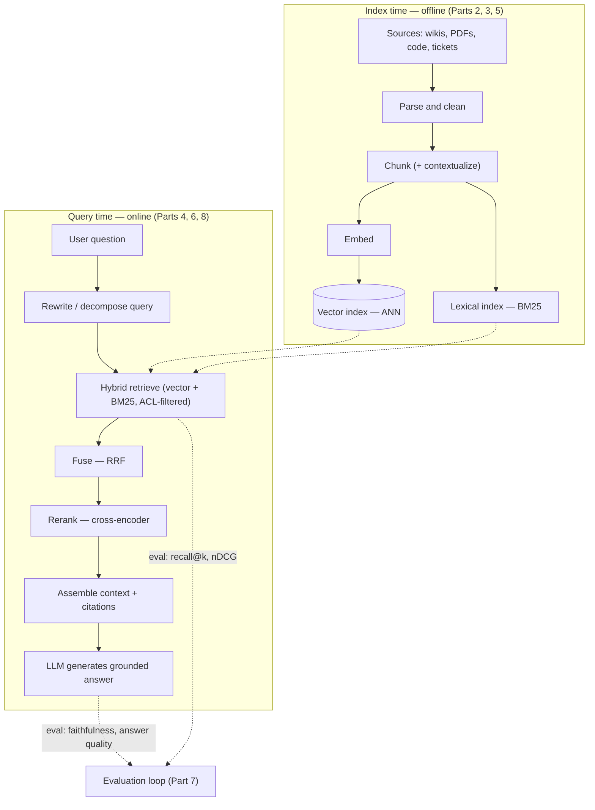
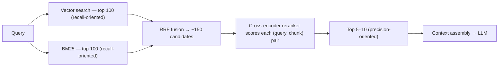
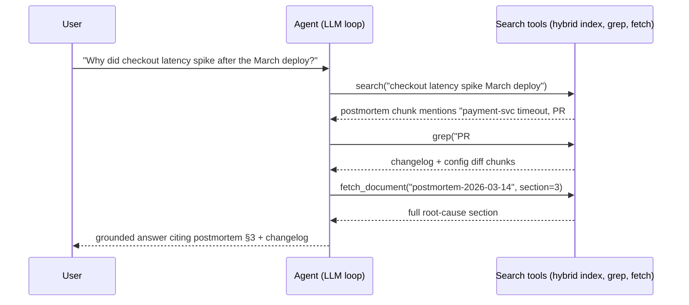

# RAG & Retrieval Engineering Study Guide

A depth-first guide to retrieval-augmented generation for engineers who already build LLM applications and now need the retrieval half to actually work. It assumes you're comfortable with the material in the [LLM Application Development guide](LLM_APP_DEV_STUDY_GUIDE.md) — API calls, tokens, context windows, tool use, and the basic RAG pattern of "chunk, embed, search, stuff the prompt." What it does not assume is that you've ever measured whether your retriever retrieves the right things, and that gap is where nearly every disappointing RAG system lives.

The organizing idea: **RAG is a search problem wearing an AI costume.** When a RAG system gives a bad answer, the cause is almost never the language model — modern LLMs are excellent at synthesizing an answer from context that actually contains the answer. The cause is that the right passage never made it into the context: it was chunked apart, embedded into the wrong neighborhood, ranked eleventh when you retrieved ten, filtered out, or never indexed at all. So this guide is mostly about search — embeddings and their geometry, lexical ranking, approximate-nearest-neighbor indexes, hybrid fusion, reranking — and its spine is evaluation, because retrieval quality is measurable in a way "prompt vibes" never will be, and the teams that measure it are the ones whose systems improve. The trajectory of 2023–2026 only sharpened this: long context windows didn't kill retrieval, they repriced it, and agentic search turned retrieval from a one-shot pipeline stage into a tool an agent wields repeatedly — both shifts reward engineers who understand search deeply and punish those who treated RAG as a framework import.

Primary references, all worth your time: the original [RAG paper](https://arxiv.org/abs/2005.11401) (Lewis et al., 2020) — the source of the name and the retriever-plus-generator framing everything since descends from; [*Introduction to Information Retrieval*](https://nlp.stanford.edu/IR-book/) (Manning, Raghavan & Schütze — free online) — the field you are actually working in existed for decades before embeddings, and this is its definitive textbook; the [HNSW paper](https://arxiv.org/abs/1603.09320) (Malkov & Yashunin) — the index behind almost every vector store you'll touch, and genuinely readable; the [pgvector README](https://github.com/pgvector/pgvector) — the best concise operational document on running vector search in production; and the [MTEB paper](https://arxiv.org/abs/2210.07316) with its [leaderboard](https://huggingface.co/spaces/mteb/leaderboard) — how embedding models are compared, and (as Part 2 explains) how that comparison misleads.

This guide has siblings that go deeper on adjacent ground: the [LLM App Dev guide](LLM_APP_DEV_STUDY_GUIDE.md) (the layer below — API mechanics, prompting, tool use), the [AI Agents guide](AI_AGENTS_STUDY_GUIDE.md) (the agentic loops that consume retrieval as a tool), the [Postgres Extensions guide](POSTGRES_EXTENSIONS.md) (pgvector's operational detail — index builds, memory, the planner), the [Web LLM Security guide](WEB_LLM_SECURITY_STUDY_GUIDE.md) (RAG poisoning, prompt injection via documents, cross-tenant isolation), and the [Data Engineering guide](DATA_ENGINEERING_STUDY_GUIDE.md) (the ingestion and sync pipelines that feed the index).

---

## Table of Contents

1. [Part 1 — Why Retrieval Exists](#part-1--why-retrieval-exists)
2. [Part 2 — Embeddings](#part-2--embeddings)
3. [Part 3 — Chunking & Document Preparation](#part-3--chunking--document-preparation)
4. [Part 4 — Lexical Search, Hybrid Search & Reranking](#part-4--lexical-search-hybrid-search--reranking)
5. [Part 5 — ANN Indexes & the Storage Decision](#part-5--ann-indexes--the-storage-decision)
6. [Part 6 — Query Understanding & Agentic Retrieval](#part-6--query-understanding--agentic-retrieval)
7. [Part 7 — Evaluation: The Spine of the Discipline](#part-7--evaluation-the-spine-of-the-discipline)
8. [Part 8 — RAG in Production & a Worked Walkthrough](#part-8--rag-in-production--a-worked-walkthrough)
9. [If You Remember a Handful of Things](#if-you-remember-a-handful-of-things)
10. [Where to Go Next](#where-to-go-next)

---

## Part 1 — Why Retrieval Exists

Start with the honest question, because in 2026 it's the one every design review asks first: context windows hold a million-plus tokens now, so why not just put the documents in the prompt?

### The Four Reasons Retrieval Survives

Sometimes you should just put the documents in the prompt — that's the point of the debate below. But four constraints keep retrieval alive for real systems, and they're worth internalizing because they predict *which* systems need it:

1. **Corpus size.** Context windows are measured in megabytes; corpora are measured in gigabytes to terabytes. A million tokens is roughly 1,500 pages — a wiki, a codebase, a support-ticket archive, or a document-management system is orders of magnitude past that. For most enterprise knowledge bases, "put it all in the prompt" is not an economics question, it's a physics question, and the answer is no.
2. **Cost and latency.** You pay per input token, per query, forever. Stuffing 500,000 tokens of context into every request costs hundreds of times more than retrieving the relevant 5,000 — and prefill time scales with input length, so it's slower too. Prompt caching changes this arithmetic when the *same* large context is reused across many queries (cached input tokens are typically ~10× cheaper), which is exactly why small-corpus long-context RAG-less designs became viable. But caching only pays when the context is stable; a corpus that changes hourly, or per-user context assembly, resets the cache.
3. **Freshness.** Model weights update on a training cadence; a retrieval index updates in seconds. If your data changes — tickets close, prices change, docs get edited — the index is the only layer that can keep up. Fine-tuning is not a freshness mechanism, and neither is waiting for the next model release.
4. **Access control.** Different users are allowed to see different documents. You cannot bake per-user permissions into model weights, and you cannot safely put documents user A may see into a context that answers user B. Retrieval is the layer where a `WHERE tenant_id = $1 AND acl && $2` filter can be *enforced* (Part 8) — which makes it a security boundary, not just a relevance mechanism.

Notice what's *not* on the list: "the model doesn't know your data." That's true but incomplete — the model could know it via the context window. The four constraints above are what make retrieval the *right way* to get it there.

### The Long-Context Debate, Honestly

The 2023–2024 argument that "long context kills RAG" deserves a fair hearing, because it was half right. What long context actually did was **change the economics of the small-corpus case**. If your entire corpus fits comfortably in the window — a single contract, one product's docs, a few hundred pages — retrieval adds a failure mode (you might retrieve the wrong chunks) to solve a problem you don't have. Load it all, cache the prefix, and let attention do the ranking. That design was foolish in 2023 and is often correct now, and a guide that pretends otherwise is selling you something.

Three things stopped the argument from generalizing. First, the constraints above — size, cost-at-scale, freshness, permissions — don't move no matter how long the window gets. Second, effective use of long context lags nominal capacity: [*Lost in the Middle*](https://arxiv.org/abs/2307.03172) (Liu et al.) documented that models retrieve information best from the beginning and end of long contexts and degrade in the middle. Newer models have substantially improved on the needle-in-a-haystack version of this, but "the model attends well to everything in a million tokens of *distracting, similar-looking* material" remains a stronger claim than benchmarks support — and stuffing irrelevant text into the window measurably invites the model to use it. Third, and most interesting: **agentic search re-shuffled the deck again.** By 2025, the strongest retrieval consumers were no longer one-shot pipelines but agents that *iterate* — issue a search, read results, refine the query, grep for an exact string, open the full document (Part 6). An agent with search tools tolerates imperfect recall on any single search because it can search again; what it can't tolerate is a search tool with bad ranking or an index that hides structure. The skill that transfers across all three eras — classic RAG, long context, agentic search — is knowing how to make a corpus *searchable and measurable*. That's this guide.

### Anatomy of the Pipeline

Everything this guide dissects sits in one of two loops: an **index-time** (offline) pipeline that turns documents into searchable structures, and a **query-time** (online) pipeline that turns a question into a grounded answer. The evaluation loop in Part 7 wraps both.



Two observations about this picture drive the rest of the guide. First, **the LLM sees only what the retrieval stages hand it.** Every upstream decision — how documents were parsed, where chunk boundaries fell, which embedding model was chosen, how candidates were fused and ranked — is invisible to the model and decisive for the answer. When output quality disappoints, debug the pipeline stages in order, not the prompt first. Second, **every stage is independently measurable.** You can compute recall@k for the retriever without ever calling the generation model (Part 7), which means retrieval improvements can be validated cheaply, in CI, before any end-to-end test. Teams that exploit this iterate ten times faster than teams that judge every change by reading final answers.

A note on lineage, because the term is used loosely: the [Lewis et al. paper](https://arxiv.org/abs/2005.11401) that named RAG in 2020 trained a dense retriever and a generator *jointly*, with the retriever's embeddings updated by the generation loss. Almost nobody does that today. Modern "RAG" is **in-context retrieval augmentation**: an off-the-shelf retriever, an off-the-shelf model, glued at the prompt. The paper still matters because it established the framing — parametric knowledge (weights) versus non-parametric knowledge (an index you can edit) — and the dense-retrieval substrate it built on, [DPR](https://arxiv.org/abs/2004.04906), is the direct ancestor of every embedding model in Part 2.

```quiz
Q: Your corpus is 300 pages of stable product documentation, queried thousands of times a day. Per this Part, what deserves serious consideration before building a retrieval pipeline?
- [x] Putting the whole corpus in the prompt with prompt caching — a small stable corpus makes cached long context economically viable and removes retrieval's failure modes
- [ ] Fine-tuning the model on the documentation so no context is needed
- [ ] Building the standard chunk-embed-index pipeline, since RAG always outperforms long context
- [ ] Sharding the documentation across multiple models
> Long context changed the economics of exactly this case: the corpus fits, it's stable (so the cached prefix is reused), and retrieval would only add ways to miss the right passage. The four constraints that mandate retrieval — corpus size, per-query cost at scale, freshness, access control — mostly don't bind here. Fine-tuning, by contrast, is neither a freshness nor a grounding mechanism.

Q: Why is access control a reason retrieval survives arbitrarily long context windows?
- [ ] Long-context models cannot read permission metadata
- [ ] Encryption of documents requires a vector database
- [ ] Access control lists are too large to fit in any context window
- [x] Per-user permissions must be enforced by filtering which documents enter the context, and the retrieval layer is where that filter can actually be applied
> You can't bake per-user permissions into weights, and once a document is in the context, the model may use it — so the enforcement point has to be upstream of the prompt. A retrieval query with a tenant/ACL filter is a security boundary; "please ignore documents the user can't see" is not.

Q: A RAG system gives a wrong answer. Per this guide's organizing idea, what is the most likely cause and the right first debugging move?
- [x] The right passage never reached the context — chunked apart, ranked too low, or filtered out; inspect what was actually retrieved for that query
- [ ] The prompt lacks few-shot examples; add some
- [ ] The model hallucinated; switch to a larger model
- [ ] The temperature is too high; set it to zero
> Modern LLMs rarely fail to synthesize from context that contains the answer; they fail when it doesn't. The pipeline stages upstream of the model are invisible in the output but decisive for it, so the first debugging move is always "show me the retrieved chunks for this query" — which is also why Part 7's retrieval metrics can be measured without the LLM at all.

Q: How did agentic search change what matters about retrieval, compared with one-shot RAG?
- [ ] It made retrieval obsolete, since agents read entire corpora directly
- [x] Iteration makes single-search recall failures recoverable, so the premium shifts to good ranking, exposed structure, and tools an agent can refine queries against
- [ ] It requires all indexes to be rebuilt per conversation
- [ ] It eliminated the need for lexical search
> An agent that can search again, grep an exact string, or open the full document tolerates an imperfect first search — unlike a one-shot pipeline where whatever top-k returns is final. What it cannot tolerate is a search tool with bad ranking or an index that hides document structure. The corpus still has to be searchable; the interface just became conversational.
```

---

## Part 2 — Embeddings

Everything in dense retrieval rests on one move: encoding a piece of text as a point in high-dimensional space such that *texts that should match end up near each other*. Get comfortable with what that sentence does and doesn't promise, because most embedding surprises trace back to over-trusting it.

### What an Embedding Is, Geometrically

An **embedding model** is a neural network (almost always a transformer) that reads a text and outputs a fixed-length vector — 256 to 4,096 floats, typically normalized to unit length so every text is a point on the surface of a hypersphere. Similarity between two texts is the **cosine similarity** of their vectors (equivalently, for unit vectors, their dot product; the pgvector operator `<=>` in Part 5 computes cosine *distance*, `1 − cos`). Nearness on the sphere is meant to encode semantic relatedness: "How do I reset my password?" lands near "Steps to recover account access" despite sharing almost no words.

The critical word is *meant*. The geometry is not discovered, it's **trained** — via contrastive learning on enormous sets of (query, relevant passage) pairs, pulling matched pairs together and pushing mismatched pairs apart. This has three consequences that bite in practice:

- **"Similar" means whatever the training data said it means.** Models trained on web search pairs learn topical, question-to-answer similarity. Whether two legal clauses are "similar" in the sense *your* application needs — same obligation type? same party? same effect? — is not something the model was asked. When your domain's notion of relevance diverges from web-search relevance, cosine scores quietly measure the wrong thing.
- **Retrieval is asymmetric, and good models are trained that way.** A query ("password reset") and its answer (a 400-token procedure) are very different texts that must land near each other. Many models handle this with distinct instructions or prefixes for queries versus passages — check your model's documentation, because embedding queries as if they were passages measurably hurts retrieval quality.
- **Absolute scores are meaningless; only ranking is real.** A cosine of 0.83 is not "83% relevant" — score distributions vary by model, by domain, and even by text length. Thresholding scores to decide "is anything relevant?" needs calibration on your own data, and comparing scores across models is nonsense. This is also why rank-based fusion (Part 4's RRF) beats score mixing.

The lineage worth knowing: [Sentence-BERT](https://arxiv.org/abs/1908.10084) established the practical recipe of fine-tuning transformers into sentence-level encoders (its descendant library, [sentence-transformers](https://www.sbert.net/), remains the standard way to run open embedding and reranker models), and [DPR](https://arxiv.org/abs/2004.04906) proved dense retrieval could beat BM25 on open-domain QA, kicking off the race that produced today's models.

### Bi-Encoders vs Cross-Encoders: The Trade That Structures Everything

This distinction organizes the entire retrieval stack, so nail it down:

- A **bi-encoder** embeds the query and each document *independently*: `score = sim(f(q), f(d))`. Because `f(d)` doesn't depend on the query, you compute every document's vector **once, at index time**, and search reduces to nearest-neighbor lookup — millions of documents in milliseconds (Part 5). The price: all of a document's meaning must be compressed into one fixed vector *before knowing what question will be asked*. Nuance the query cares about may simply not have survived the compression.
- A **cross-encoder** reads the query and document *together* — one transformer pass over the concatenated pair, attention flowing between them — and outputs a relevance score. It can notice exactly the interaction that matters ("the query asks about *refunds after 30 days* and this paragraph's exception clause covers precisely that"). The price: nothing is precomputable. Scoring a corpus of a million documents means a million transformer passes *per query*.

So bi-encoders are scalable and approximate; cross-encoders are accurate and unscalable. The entire architecture of modern retrieval — cheap broad recall first, expensive precise scoring on a shortlist second — falls out of this one trade-off, and Part 4's reranking section is its direct application. (There's a middle point, late interaction, also in Part 4.)

### Choosing a Model: MTEB and Its Discontents

The [Massive Text Embedding Benchmark](https://arxiv.org/abs/2210.07316) (MTEB) and its [leaderboard](https://huggingface.co/spaces/mteb/leaderboard) are where every model comparison starts: dozens of tasks spanning retrieval, classification, clustering, and reranking, in many languages. Use it — as a *shortlist generator*, not a decision procedure. The caveats are structural, not gossip:

- **Leaderboard overfitting is real.** MTEB's test sets are public, and the incentive to top the board is enormous. Training on benchmark-adjacent data (the same source corpora, paraphrases of test queries) inflates scores in ways that don't transfer. A model two points "better" on MTEB is not reliably better on your corpus; treat small gaps as noise and large gaps as hypotheses.
- **The averaged score hides your task.** MTEB averages over task families you don't care about. If you're building retrieval, look only at the retrieval tasks — a model can rank highly overall while being mediocre at retrieval — and note that [BEIR](https://arxiv.org/abs/2104.08663) (the zero-shot retrieval suite MTEB absorbed) exists precisely because in-domain and out-of-domain retrieval quality diverge sharply.
- **Your domain is not in the benchmark.** Internal jargon, product names, code, log lines, legal boilerplate — the distribution shift between web text and your corpus routinely reorders the leaderboard. The only comparison that settles anything is the one on **your own labeled query set** (Part 7), which typically takes an afternoon once the eval harness exists.

The practical menu, mid-2026: hosted embedding APIs from [OpenAI](https://platform.openai.com/docs/guides/embeddings) (`text-embedding-3-*`) and [Voyage AI](https://docs.voyageai.com/) (strong retrieval-specialized and code-specialized models, now part of MongoDB), and a deep bench of open-weights families (BGE, GTE, E5, Qwen and Gemma-based embedders, and other multi-billion-parameter LLM-derived encoders that now top MTEB) runnable via [sentence-transformers](https://www.sbert.net/). Hosted APIs win on zero ops; open weights win on cost at volume, data residency, and the option to fine-tune. All current first-tier models are multilingual and handle at least ~8K token inputs; beyond that, differences on *your* eval set dwarf differences on the leaderboard.

### Dimensions, Matryoshka, and Quantization

An embedding's dimension count is a capacity/cost dial. More dimensions give the model more room to separate meanings, but cost scales linearly and mercilessly: memory (a 3,072-dim float32 vector is 12 KB — 10M of them is 120 GB *before* the index), distance-computation time, and index size. Three techniques manage the dial:

- **Just use fewer dimensions.** Retrieval quality degrades surprisingly gracefully with dimension for most corpora; 512–1,024 dims is the workhorse range, and the difference between 1,536 and 3,072 dims is often invisible next to chunking or hybrid-search improvements.
- **[Matryoshka embeddings](https://arxiv.org/abs/2205.13147)** (Matryoshka Representation Learning) train the model so information concentrates in the leading dimensions — any *prefix* of the vector is itself a usable embedding, like the nested doll. One 2,048-dim embedding gives you a 256-dim version (truncate and renormalize) for a cheap, fast first-pass search and the full vector for rescoring the shortlist. Most current API models are Matryoshka-trained (that's what the `dimensions` request parameter does).
- **Quantization** shrinks each dimension's representation: **float32 → int8** cuts memory 4× with typically negligible retrieval loss; **binary quantization** (1 bit per dimension, sign of each component) cuts it 32× and turns distance into Hamming distance — XOR and popcount, absurdly fast. Binary costs real recall used alone, so the standard pattern is **oversample and rescore**: retrieve, say, 4× your k with binary vectors, then rescore those candidates with full-precision vectors (kept on disk) before returning k. pgvector's `halfvec` (float16) and `bit` types (Part 5) are this same lever, and dedicated stores automate the whole oversample-rescore dance.

These compose: a Matryoshka-truncated, int8-quantized 512-dim vector is ~24× smaller than the 3,072-dim float32 original and often retrieves within a point or two of it — measured, as always, on your eval set, since the honest answer to "how much does quantization cost?" is corpus-dependent.

### Fine-Tuning Embeddings, Briefly

You can fine-tune an open embedding model on your own (query, relevant passage) pairs — sentence-transformers makes the mechanics straightforward — and for jargon-dense domains where general models genuinely misunderstand the vocabulary (biomedical, legal, a proprietary codebase), the gains can be large. The costs are underrated: you need thousands of good pairs (mining them from click logs or LLM-generated queries with human spot-checks is its own project), you now own model hosting and versioning, and — the trap — **every embedding-model change requires re-embedding the entire corpus**, because vectors from different models (or different fine-tunes) live in incompatible spaces and cannot be compared. Before fine-tuning, exhaust the cheaper levers, in this order: hybrid search (Part 4 — lexical search already handles the jargon exact-match case), a reranker (Part 4 — a cross-encoder is a query-time fix that needs no re-embedding), and contextual chunking (Part 3). Fine-tuning is the right tool *last*.

```quiz
Q: Why can't you compare cosine-similarity scores from two different embedding models, or treat 0.83 as "83% relevant"?
- [ ] Cosine similarity is only defined for binary vectors
- [x] Score distributions are artifacts of each model's training; only the ranking a model induces is meaningful, and even thresholds need per-domain calibration
- [ ] Scores are meaningful, but only after normalizing vector lengths
- [ ] Because higher-dimensional models always produce higher scores
> The geometry is trained, not canonical: each model's contrastive training produces its own score distribution, which shifts further with domain and text length. Rankings are comparable; raw scores aren't — which is exactly why Part 4's fusion method (RRF) uses ranks and ignores scores.

Q: Your corpus is full of internal product codenames the embedding model has never seen, and exact-name queries retrieve poorly. What's the cheapest effective fix?
- [ ] Fine-tune the embedding model on internal documents
- [ ] Switch to the current top model on the MTEB leaderboard
- [ ] Double the embedding dimensions
- [x] Add lexical search in a hybrid setup — exact term matching handles unknown identifiers without touching the embeddings
> Unknown jargon is precisely where dense retrieval is weakest and BM25 is strongest (Part 4): an exact term match doesn't care whether the token was in training data. Fine-tuning can eventually help but costs a labeled-pair dataset, model ownership, and a full corpus re-embed; the leaderboard model has the same blind spot; more dimensions can't encode what the model never learned.

Q: What does a cross-encoder buy over a bi-encoder, and what does it cost?
- [ ] It's faster because it skips the vector index, but requires more training data
- [ ] It produces smaller vectors at the cost of multilinguality
- [ ] It removes the need for chunking, at the cost of latency
- [x] Attention flows between query and document, catching interactions a single precomputed vector loses — but nothing is precomputable, so it can't scan a large corpus per query
> A bi-encoder must compress a document into one vector before knowing the question; a cross-encoder reads the pair together and can notice exactly the clause the query cares about. But that means one transformer pass per (query, document) pair at query time — fine for reranking a shortlist of 100, ruinous for a corpus of millions. This one trade-off is why retrieval is architected as broad-then-precise.

Q: What makes Matryoshka-trained embeddings operationally useful?
- [x] Any prefix of the vector is a valid embedding, so you can search cheaply at low dimension and rescore a shortlist at full dimension from the same stored vector
- [ ] They allow one model to serve multiple languages
- [ ] They eliminate the need for quantization
- [ ] They compress documents so chunking becomes unnecessary
> MRL training concentrates information in the leading dimensions, so truncate-and-renormalize gives a usable low-dim embedding — a free coarse-search tier. It composes with quantization (truncate and int8/binary-quantize) for compounding memory savings, with the recall cost measured on your own eval set rather than assumed.

Q: Why is "we'll re-run the MTEB winner on our corpus later" a backwards plan, per this Part?
- [x] Public-benchmark scores are inflated by leaderboard overfitting and averaged over irrelevant tasks, so the only decisive comparison is your own labeled query set — which should exist before model selection, not after
- [ ] MTEB only covers English, so its rankings never transfer
- [ ] Because hosted models cannot be evaluated locally
- [ ] Because the leaderboard updates too often to be useful
> MTEB is a fine shortlist generator, but test sets are public, training data creeps toward them, and the averaged score hides retrieval-specific performance (BEIR exists because in-domain and zero-shot quality diverge). Since a labeled eval set takes an afternoon once the harness exists (Part 7), building it first turns model choice from leaderboard faith into a measurement.
```

---

## Part 3 — Chunking & Document Preparation

Chunking looks like a preprocessing detail and is actually one of the highest-leverage decisions in the pipeline. It exists for a deeper reason than "embedding models have token limits," and getting the reason right tells you how to do it well.

### Why Chunking Exists

Three forces, in increasing order of importance:

1. **Input limits.** Embedding models accept bounded input (~512 tokens for older open models, 8K–32K for current ones). This is the weakest reason — modern limits are generous.
2. **Context budget.** Whatever you retrieve gets stuffed into the prompt, multiplied by k, per query, forever. Retrieval units need to be small enough that ten of them fit comfortably alongside the conversation.
3. **Vector dilution — the real reason.** A bi-encoder compresses its *entire input* into one fixed-size point. Embed a 5,000-token document covering eight topics and you get a vector that is a blurry average of all eight — near nothing in particular, retrievable by nothing specific. Embed a 300-token passage about one thing and the vector is *sharp*. Chunking is how you control what a vector is "about," which makes it a **retrieval-precision decision, not a storage decision**.

The tension: smaller chunks give sharper vectors but fragment meaning — a procedure split mid-step, a pronoun severed from its referent, a table row separated from its header. Larger chunks preserve coherence but dilute the vector and drag irrelevant text into the context. There is no universal optimum; 200–800 tokens is the defensible range, and the *right* value for your corpus is an empirical question your eval set answers (Part 7) — measured, not debated.

### Chunking Strategies

In ascending sophistication:

- **Fixed-size with overlap** — every N tokens, with 10–20% overlap so sentences straddling a boundary appear whole in at least one chunk. Count in tokens (via [tiktoken](https://github.com/openai/tiktoken) or your model's tokenizer), not characters. Dumb, predictable, and the baseline everything else must beat — which it does less often than you'd hope.
- **Recursive** — try to split on the largest natural boundary (section, then paragraph, then sentence, then word) that yields chunks under the target size. This is the pragmatic default, and the [text-splitter implementations in LangChain](https://python.langchain.com/docs/concepts/text_splitters/) are the reference everyone copies. It respects structure when structure exists and degrades to fixed-size when it doesn't.
- **Structural / document-aware** — use the document's own semantics as boundaries: Markdown headings (chunk = section, with the heading path retained), code by function or class (a language-aware splitter beats any generic one for code), HTML by semantic tags, PDFs by detected layout blocks. Parsing is the unglamorous hard part — real corpora are PDFs with multi-column layouts, scanned tables, and slide decks, and a layout-aware extraction library like [Unstructured](https://github.com/Unstructured-IO/unstructured) (or a commercial document-parsing API) frequently moves retrieval quality more than any downstream tuning, because garbage text in means garbage vectors out.
- **Semantic** — embed sentences, walk the document, and cut where consecutive-sentence similarity drops (a topic shift). Appealing in theory; in practice it costs an embedding pass at index time and evaluations are mixed — structural boundaries, when available, encode the author's own topic segmentation for free. Test it against recursive before believing in it.

### A Chunk Is More Than Its Text: Metadata

Every chunk should carry structured metadata: source document ID and title, section heading path, URL or citation locator (page number, line range), timestamps, author or system of origin, language, and — non-negotiable in multi-tenant systems — tenant and ACL tags (Part 8). Metadata serves three distinct masters, and conflating them causes bugs:

- **Filtering**: `WHERE tenant_id = $1 AND doc_type = 'runbook' AND updated_at > ...` — the filtered-search problem this creates for ANN indexes is Part 5's hardest section.
- **Display and citation**: the answer must link back to the source with enough locator precision that a human can verify it (Part 8).
- **Embedding enrichment**: what you *embed* need not equal what you *store and display*. Prepending the title and heading path to the text before embedding ("Payments API > Refunds > Partial refunds: ...") sharpens the vector at near-zero cost, while the stored chunk remains the clean original.

That last distinction — embed-text versus display-text — is the cheap trick that generalizes into the technique below.

### Contextual Retrieval

A chunk ripped from its document loses the context that made it intelligible: "the fee is waived in the cases above" embeds to a vector about fee waiving *in general*, with no trace of which fee or which cases. **Contextual retrieval** — named and popularized by [Anthropic's engineering post](https://www.anthropic.com/engineering/contextual-retrieval), which is the canonical reference — attacks this directly: at index time, an LLM is shown the *whole document* plus the chunk and asked to write a sentence or two situating the chunk ("This chunk is from the ACME 2024 pricing agreement, section on late-payment fees for enterprise customers..."); that context is prepended to the chunk *for embedding and for the BM25 index*, while the original text is what's returned. In Anthropic's published evaluation this cut retrieval failure rates by roughly a third (contextual embeddings + contextual BM25), and by ~two-thirds combined with reranking. The catch is index-time cost — one LLM call per chunk over the full document — made tolerable by prompt caching (the document is the shared cached prefix across all its chunks' calls). It's the strongest evidence yet for this Part's theme: the highest-leverage RAG work happens before anything is embedded.

Two related patterns close the gap between "retrieve small" and "read big":

- **Small-to-big (parent-document) retrieval**: embed fine-grained chunks for sharp matching, but return the enclosing section or parent chunk to the LLM. The vector's precision and the context's completeness stop being the same knob.
- **Neighbor expansion**: return the matched chunk plus its adjacent chunks — cheap, dumb, effective for procedures and narratives that overrun boundaries.

Both require storing the document structure (parent IDs, chunk ordering) alongside the vectors — one more reason the "vector store" is really a document store with an index attached, a theme Part 5 picks up.

```quiz
Q: What is the deepest reason chunking exists, beyond token limits and context budget?
- [ ] Vector databases charge per stored vector
- [ ] Embedding APIs reject documents with mixed languages
- [ ] LLMs cannot read documents longer than one chunk
- [x] A single vector averages everything in its input — long multi-topic text produces a blurry embedding near nothing in particular, so chunk boundaries control what each vector is sharply "about"
> Bi-encoder compression is lossy in proportion to how much the input covers: eight topics into one point yields a centroid retrievable by nothing specific. That makes chunking a retrieval-precision decision — and explains both why smaller chunks match more sharply and why the fix for their lost context is enrichment (contextual retrieval, small-to-big) rather than simply making chunks bigger again.

Q: How does contextual retrieval fix the "orphaned chunk" problem, and what makes it affordable?
- [ ] It stores the entire document in every chunk; affordable because storage is cheap
- [x] An LLM writes a short document-situating preamble per chunk, prepended for embedding and BM25 indexing; prompt caching makes the per-chunk calls cheap because the full document is a shared cached prefix
- [ ] It replaces chunking with semantic splitting; affordable because embeddings are free
- [ ] It embeds each chunk twice with different models and averages the vectors
> "The fee is waived in the cases above" is unintelligible — and unretrievable — without knowing which fee, which agreement. Generating that situating context at index time restores it to both the dense and lexical indexes, cutting retrieval failures by roughly a third in Anthropic's evaluation (two-thirds with reranking). The full document rides along as a cached prefix across all its chunks' calls, which is what keeps the index-time LLM bill sane.

Q: Your retrieval matches the right chunk, but answers are wrong because procedures span several chunks and the model only sees step 3. Which fix targets this directly?
- [x] Small-to-big retrieval or neighbor expansion — match on fine-grained chunks but hand the LLM the enclosing section or adjacent chunks
- [ ] Switch from cosine to inner-product distance
- [ ] Increase ef_search so the index returns more accurate neighbors
- [ ] Lower the chunk overlap to reduce duplication
> The failure isn't matching (retrieval found the right place) — it's that the retrieval unit and the reading unit were forced to be the same size. Decoupling them lets the vector stay sharp while the context stays complete; it requires storing parent IDs and chunk order, which is why the store must be more than a bag of vectors. Index tuning and distance metrics don't touch this failure mode.

Q: Why does this Part claim document parsing quality often moves retrieval more than downstream tuning?
- [x] Because mangled extraction — shredded tables, interleaved columns, lost headings — produces garbage text whose embeddings are garbage regardless of model, index, or chunk size
- [ ] Because parsers determine which embedding model can be used
- [ ] Because unparsed documents cannot be stored in Postgres
- [ ] Because parsing is the only stage that affects lexical search
> Every downstream stage operates on the text the parser emitted. A multi-column PDF read in raster order produces sentences no human wrote; no embedding model recovers meaning that extraction destroyed. It's the unglamorous stage with the fewest conference talks and, on messy real-world corpora, frequently the largest quality delta.
```

---

## Part 4 — Lexical Search, Hybrid Search & Reranking

The most common architectural mistake in RAG is treating vector search as the successor to keyword search rather than its complement. Lexical ranking is not legacy — it's forty years of information retrieval that happens to be exactly strong where embeddings are weak, and the production-grade pattern is both at once, fused, then reranked.

### BM25: How Lexical Ranking Actually Works

**BM25** (Best Match 25, from the Okapi system — the [IR-book chapter](https://nlp.stanford.edu/IR-book/html/htmledition/okapi-bm25-a-non-binary-model-1.html) is the canonical short treatment) scores a document for a query as a sum over the query's terms of three intuitions, each with a knob:

- **Term frequency, saturated.** A document mentioning `kubernetes` five times is more relevant than one mentioning it once — but not five times more. TF enters through `tf·(k1+1) / (tf + k1·…)`, which rises steeply then flattens; the parameter `k1` (typically ~1.2) sets how quickly repeated mentions stop mattering. This saturation is BM25's big improvement over raw TF-IDF.
- **Inverse document frequency.** Rare terms carry the signal: in a Kubernetes runbook corpus, `kubernetes` appears everywhere (worthless), while `CrashLoopBackOff` appears in exactly the documents you want. IDF weights each term by `log((N − df + 0.5)/(df + 0.5))` — corpus-wide statistics, which is why BM25 needs an index over the whole collection, and why Postgres's native `ts_rank` (which has no corpus statistics, hence no IDF) plateaus in relevance quality compared to real BM25 — the gap [ParadeDB's pg_search](https://docs.paradedb.com/) exists to close (see the [Postgres Extensions guide](POSTGRES_EXTENSIONS.md)).
- **Length normalization.** A 200-word document that mentions your term twice is more *about* it than a 20,000-word document that does the same. The parameter `b` (typically 0.75) sets how strongly document length discounts the score.

BM25 is the default relevance function in Lucene, hence in [Elasticsearch](https://www.elastic.co/docs) and [OpenSearch](https://opensearch.org/docs/latest/), and its zero-shot robustness is legendary: on the [BEIR benchmark](https://arxiv.org/abs/2104.08663), plain BM25 beat most early dense retrievers out-of-domain, and it remains an embarrassingly strong baseline that many tuned vector pipelines fail to beat on identifier-heavy corpora. It is also *interpretable* — you can see exactly which terms matched and why a document scored high, which makes debugging lexical retrieval trivially easier than debugging cosine similarity.

### Why Exact Tokens Defeat Embeddings

The failure mode that makes hybrid search non-optional: queries containing **identifiers** — error codes (`ERR_CONN_RESET_4032`), part numbers, function names, ticket IDs, legal citation strings, product codenames. Embeddings fail here for two compounding reasons. First, the tokenizer shreds a rare string into subword fragments (`ERR`, `_CONN`, `_RES`, `ET`, `_40`, `32`) whose composed embedding bears no stable relationship to the identifier's meaning. Second, contrastive training data contains few or no pairs teaching the model that this exact string matters more than its fuzzy neighborhood — so `ERR_CONN_RESET_4032` and `ERR_CONN_RESET_4031` land essentially on top of each other in vector space, when the entire point of the query was the distinction. BM25 doesn't care: the term either matches or it doesn't, and a rare term match dominates the score via IDF. Every corpus containing code, logs, SKUs, or citations has this failure mode; the only question is what fraction of queries hit it.

### Hybrid Search and Reciprocal Rank Fusion

**Hybrid search** runs both retrievers — dense (semantic paraphrase, "what's this about") and lexical (exact terms, "does this string occur") — and fuses the ranked lists. Fusing by mixing raw scores is a trap: cosine similarities and BM25 scores live on incommensurable scales, and any weighted sum needs per-corpus normalization that drifts as the corpus grows. The standard answer is **Reciprocal Rank Fusion** ([Cormack, Clarke & Büttcher](https://plg.uwaterloo.ca/~gvcormac/cormacksigir09-rrf.pdf)), which ignores scores entirely and uses only ranks:

```text
RRF(d) = Σ over result lists r of:  1 / (k + rank_r(d))     with k ≈ 60
```

A document ranked 1st in one list and absent from the other scores 1/61; ranked 3rd in both, 2/63. The constant k damps the difference between adjacent high ranks so a single retriever's #1 doesn't automatically dominate. RRF's virtues are exactly what production wants: no calibration, no training, robust to adding a third or fourth result list (multi-query in Part 6 fuses the same way), and empirically hard to beat — the original paper showed it outperforming trained fusion methods, and it has aged remarkably well. Every serious engine ships it natively (Elasticsearch, OpenSearch, Qdrant, Weaviate); in pgvector-land you write it as SQL over two CTEs (Part 8's walkthrough does exactly this).

### Reranking: Spending the Cross-Encoder Where It Counts

Part 2 established the trade: cross-encoders are the accurate architecture and can't scan a corpus. Reranking is the pattern that gets their accuracy anyway — **retrieve broadly and cheaply, then rerank the shortlist expensively**:



The two stages have different jobs and should be measured differently: the first stage is judged on **recall** (is the right chunk *anywhere* in the candidate set? — recall@100), the reranker on **precision at the top** (did it rise into the handful the LLM sees? — nDCG@10, Part 7). This division also changes how you tune: first-stage k stops being "how many chunks does the LLM get" and becomes "how wide a net does the reranker see," so widening it is nearly free accuracy as long as the reranker can keep up.

Your reranker options, in the order most teams try them: **hosted APIs** — [Cohere Rerank](https://docs.cohere.com/docs/rerank) is the category-defining product (send query + up to ~1,000 candidate texts, get scores back), with Voyage and others offering equivalents — one API call, no infrastructure, per-query pricing; **open cross-encoder models** (the BGE and Qwen reranker families and the classic MS-MARCO cross-encoders, runnable via [sentence-transformers](https://www.sbert.net/)) — GPU inference you own, sensible at volume or for data-residency; and **LLM-as-reranker** — prompting a small, fast LLM to score or order candidates, which is slower and pricier per query but effectively free to prototype (and listwise variants, where the model sees candidates together and orders them, are increasingly competitive). Latency is the budget item: reranking 100 candidates adds tens to a few hundred milliseconds. Almost every serious pipeline accepts it; when Anthropic's contextual-retrieval numbers (Part 3) say "two-thirds fewer retrieval failures," the reranker is a load-bearing part of that stack.

### Late Interaction: ColBERT

Between the bi-encoder (one vector per text, no query-document interaction) and the cross-encoder (full interaction, no precomputation) sits **late interaction**, introduced by [ColBERT](https://arxiv.org/abs/2004.12832): embed every *token* of the document at index time (precomputable, like a bi-encoder), and at query time score a document as the sum over query tokens of each one's best match among the document's token vectors (**MaxSim** — interaction, like a cross-encoder, but cheap because it's just dot products). You keep most of the cross-encoder's fine-grained matching — an identifier token in the query can find its exact counterpart token — while retaining an indexable representation. The cost is storage: ~a hundred vectors per chunk instead of one. [ColBERTv2](https://arxiv.org/abs/2112.01488) attacks that with aggressive residual compression (and the [reference implementation](https://github.com/stanford-futuredata/ColBERT) ships the PLAID engine for fast late-interaction search); several engines (Qdrant, Vespa among them) support multi-vector/late-interaction natively, and recent multi-vector embedding models keep the approach current. Where it fits in practice: strongest as a *reranker* or on corpora where token-level precision matters (code, technical docs) and the storage multiple is affordable — for a first system, hybrid BM25+dense with a cross-encoder reranker remains the simpler, better-supported default.

```quiz
Q: Why do embeddings fail on a query like `ERR_CONN_RESET_4032` while BM25 handles it easily?
- [ ] Embedding models refuse inputs containing underscores
- [ ] BM25 understands the semantics of error codes
- [ ] Vector indexes cannot store numeric characters
- [x] The tokenizer shreds the rare string into subwords with no stable meaning, and training never taught the model that this exact token matters — while BM25 rewards the exact rare-term match via IDF
> `ERR_CONN_RESET_4032` and `..._4031` land essentially on top of each other in embedding space precisely when the distinction is the whole query. BM25 has the opposite bias: a term either occurs or it doesn't, and rarity makes the match dominate the score. Neither system "understands" the code — they just fail and succeed on complementary axes, which is the entire argument for hybrid.

Q: Why does Reciprocal Rank Fusion use ranks instead of the retrievers' scores?
- [ ] Ranks are faster to compute than scores
- [x] Cosine and BM25 scores live on incommensurable, drifting scales, so any score-mixing needs fragile per-corpus calibration — ranks need none and stay robust as lists are added
- [ ] Scores are unavailable from most vector databases
- [ ] Using scores would require the two indexes to share a tokenizer
> A weighted sum of a 0-to-1 cosine and an unbounded BM25 score is an apples-to-orbits calculation whose weights rot as the corpus grows. RRF's 1/(k+rank) needs no calibration, extends to any number of lists (multi-query fusion reuses it), and empirically beat trained fusion in the original paper. It's the rank-based cousin of Part 2's rule that only rankings, not scores, are meaningful.

Q: In the retrieve-broadly-then-rerank pattern, how should the two stages be measured?
- [ ] Both on end-to-end answer quality, since that's what users see
- [ ] First stage on latency, reranker on recall@100
- [ ] Both on nDCG@10, since ranking is ranking
- [x] First stage on recall at its candidate depth (is the right chunk anywhere in the net?), reranker on precision at the top (did it surface into what the LLM sees?)
> The stages have different jobs: the cheap stage casts a wide net and only fails if the right chunk is absent entirely (recall@100); the cross-encoder's job is to rise it into the top handful (nDCG@10 / recall@5). Measuring them separately tells you which stage to fix — a distinction end-to-end metrics blur, and the reason Part 7 insists on component-level eval.

Q: What is ColBERT's "late interaction" trading, relative to bi- and cross-encoders?
- [ ] Accuracy for multilinguality
- [x] Storage — roughly a vector per token instead of one per chunk — in exchange for token-level query-document matching that stays precomputable and indexable
- [ ] Precomputation for exact search, eliminating the ANN index
- [ ] Interpretability for speed
> MaxSim keeps the interaction (each query token finds its best document token, so exact identifiers can meet their counterparts) while document token vectors are still computed offline — the middle point between one-vector compression and per-pair transformer passes. The price is the storage multiple, which ColBERTv2's residual compression exists to shrink.

Q: Postgres's native full-text `ts_rank` plateaus in relevance quality compared to Elasticsearch or pg_search. What's the root cause?
- [x] ts_rank computes no corpus-wide statistics, so it has no IDF — it can't know that a rare term matters more than a ubiquitous one
- [ ] ts_rank ignores term frequency entirely
- [ ] Postgres cannot index text columns efficiently
- [ ] tsvector storage loses word order
> IDF is the ingredient that requires knowing document frequencies across the whole collection, and it's what makes `CrashLoopBackOff` outweigh `kubernetes` in a runbook corpus. BM25 = saturated TF + IDF + length normalization; remove IDF and relevance quality caps out regardless of tuning — the specific gap ParadeDB's BM25 index closes inside Postgres.
```

---

## Part 5 — ANN Indexes & the Storage Decision

Nearest-neighbor search over a handful of vectors is a for-loop. Over a hundred million, it's a data-structures problem with real trade-offs — and the store you choose is mostly a bet on how those trade-offs, plus operations, will treat you at your scale.

### Exact Search, and When It's Honestly Enough

Brute-force ("flat") search computes the query's distance to every vector: O(n·d) per query, embarrassingly SIMD-parallel, **recall = 100% by definition**. On modern hardware a flat scan over 100K × 1,024-dim float32 vectors returns in a few tens of milliseconds — beneath the latency of the LLM call by two orders of magnitude. The honest advice, rarely given by vendors: **below a few hundred thousand vectors, you may not need an ANN index at all**, and exact search has no recall knob to mistune, no build time, and no drift. [FAISS](https://github.com/facebookresearch/faiss) (Meta's library, the reference implementation for most of this Part's ideas — its [wiki](https://github.com/facebookresearch/faiss/wiki) is the best practical index-selection guide in existence) calls this `IndexFlat`, and it's also how you compute the **ground truth** against which every approximate index's recall is measured. That's worth restating: "recall" for an ANN index means agreement with exact search — `|approximate top-k ∩ true top-k| / k` — a definition you'll reuse when tuning.

### Approximate Nearest Neighbor: The Triangle

Past the flat-scan regime, you trade exactness for speed. Every ANN design lives inside a triangle of **recall, latency, and memory** — you can push toward any two corners at the third's expense — and every "tuning parameter" you'll ever meet is a slider along one edge.

**HNSW** (Hierarchical Navigable Small World — [Malkov & Yashunin](https://arxiv.org/abs/1603.09320)) is the dominant graph-based design. Picture a skip list generalized to a graph: every vector is a node in a bottom-layer proximity graph where each node links to its ~M nearest neighbors; a random exponentially-thinning subset of nodes also appears in higher layers whose long-range links span the space. A query greedily descends: start at the top layer's entry point, hop to whichever neighbor is closest to the query, drop a layer when no neighbor improves, and on the bottom layer run a beam search that maintains the `ef_search` best candidates seen. The three knobs map directly onto the triangle:

- **M** (links per node, typically 16–64): more edges → better-connected graph → higher recall, more memory (the graph structure itself often rivals the vectors in size), slower inserts. Set at build time, effectively permanent.
- **ef_construction** (beam width during build, typically 64–512): how carefully each inserted node finds its true neighbors. Higher → better graph quality → better recall ceiling, at the cost of build time only — the cheapest quality knob, since you pay it once.
- **ef_search** (beam width at query time): *the* operational dial. Raise it and recall climbs toward exact-search agreement while latency climbs with it; it can be changed per query with no rebuild. Tuning ef_search against measured recall@k on your own queries (Part 7) is the single most routine piece of ANN operations.

HNSW's strengths: excellent recall/latency, incremental inserts (no training phase), the default in pgvector, Qdrant, Weaviate, Milvus, and Lucene. Its weaknesses: the whole graph wants to live in RAM — memory is the corner of the triangle it sacrifices — and **deletes are awkward** (removing nodes tears holes in the graph, so implementations tombstone and filter at query time, degrading until a rebuild or vacuum; pgvector inherits Postgres MVCC semantics, where `VACUUM` compacts but a bloated index may want a `REINDEX`).

**IVF** (inverted file) is the partitioning alternative: k-means the corpus into `nlists` clusters; at query time probe only the `nprobe` nearest clusters. Much cheaper and faster to build than HNSW, less memory, and recall/latency tunes through `nprobe` — but it needs *representative training data* before it can index anything (the clusters come from k-means over an existing sample), and as the corpus drifts from the training distribution, recall quietly degrades until you re-cluster. That's the pgvector `IVFFlat` trade discussed in the [Postgres Extensions guide](POSTGRES_EXTENSIONS.md): build cost versus staying power.

**Product quantization** ([Jégou, Douze & Schmid](https://inria.hal.science/inria-00514462/document)) attacks memory rather than search order: split each vector into m subvectors, learn a 256-centroid codebook per subspace, and store each subvector as a 1-byte centroid ID — a 1,024-dim float32 vector (4 KB) becomes m bytes (e.g., 64), a 64× compression, with distances computed against codebooks via lookup tables. Combined as IVF-PQ (FAISS's workhorse for the 100M+ regime), it makes billion-vector search fit in memory that would otherwise hold millions. The recall cost is real, so PQ systems keep full-precision vectors on disk and **rescore** the candidate list — the same oversample-and-refine pattern as Part 2's binary quantization, which you can think of as PQ's crudest special case. Rounding out the family: **DiskANN** ([Microsoft's graph-on-SSD design](https://github.com/microsoft/DiskANN)) keeps a compressed graph traversable with few disk reads, trading RAM for NVMe latency — the design [pgvectorscale](https://github.com/timescale/pgvectorscale) brings to Postgres for the 50M+ regime where HNSW's memory bill hurts.

### Filtered Search: The Hard Case Everyone Competes On

Real queries are never pure similarity: it's *nearest neighbors WHERE tenant_id = 42 AND doc_type = 'runbook' AND updated_at > January*. This "trivial" AND is the genuinely hard problem of vector search, because the index was built over the whole corpus and knows nothing about your predicate. Three strategies, all flawed:

- **Post-filtering**: search the ANN index for top-k, then apply the filter. If the filter is selective — say it keeps 1% of the corpus — your k results filter down to ~k/100, maybe zero, and the right answer (the nearest vector *satisfying the predicate*) may never have been in the candidate list at all. Over-fetching (retrieve 10k, filter, keep k) mitigates but never guarantees. This is exactly the pgvector planner gotcha the [Postgres Extensions guide](POSTGRES_EXTENSIONS.md) flags: the ANN index serves `ORDER BY embedding <=> $1 LIMIT k` and the WHERE applies *after*; pgvector 0.8+ added **iterative index scans** that keep pulling candidates until the filter is satisfied — better, but latency now depends on filter selectivity.
- **Pre-filtering**: resolve the predicate first, then search only matching vectors. Perfectly correct — but the ANN index can't help you search an arbitrary subset, so this degrades to a flat scan of the filtered set. Great when the filter is highly selective (scan 5,000 vectors exactly), terrible when it keeps half the corpus.
- **In-graph filtering**: evaluate the predicate *during* graph traversal, skipping non-matching nodes but still routing through them. This is where dedicated engines earn their keep — [Qdrant](https://qdrant.tech/documentation/)'s filterable HNSW, which builds additional graph connectivity informed by payload-filter patterns so the graph doesn't shatter into disconnected islands under selective filters, is the flagship example, and every serious engine has an answer here (and switches between strategies by estimated selectivity, which is a query planner by another name).

The operational takeaway: **benchmark filtered queries specifically, at your real selectivities**. An engine's glossy unfiltered recall/QPS numbers tell you nothing about `WHERE tenant_id = ...` performance, and multi-tenant RAG (Part 8) makes *every* query a filtered query.

### The Storage Decision, Worked Honestly

"Which vector database?" is the wrong first question — it's four questions: how many vectors (with headroom), how selective and frequent are your filters, who operates it, and where does the data already live. The market sorted into four families:

| Family | Representatives | Reach for it when | The catch |
|---|---|---|---|
| **Postgres + pgvector** | [pgvector](https://github.com/pgvector/pgvector), + [pgvectorscale](https://github.com/timescale/pgvectorscale) / [pg_search](https://docs.paradedb.com/) | Your documents/metadata already live in Postgres; ≲ 5–10M vectors per node; you value joins, transactions, ACLs, and one system to operate | HNSW build times and RAM at scale; filtered search needs pgvector 0.8+ care; you own the tuning |
| **Dedicated vector engines** | [Qdrant](https://qdrant.tech/documentation/), [Weaviate](https://weaviate.io/developers/weaviate), [Milvus](https://github.com/milvus-io/milvus) | Tens of millions to billions of vectors; heavy filtered search; built-in quantization/hybrid/multi-vector; horizontal scale | A second stateful system to run, sync, secure, and back up — the data-gravity tax is perpetual |
| **Search engines with vectors** | [Elasticsearch](https://www.elastic.co/docs), [OpenSearch](https://opensearch.org/docs/latest/) | You already operate one; first-class BM25 + dense + RRF in a single engine; mature ops tooling, aggregations, security model | JVM-grade operational weight; vector performance historically trails specialists (the gap has narrowed) |
| **Managed / serverless** | [Pinecone](https://docs.pinecone.io/), [Vertex AI Vector Search](https://cloud.google.com/vertex-ai/docs/vector-search/overview), [turbopuffer](https://turbopuffer.com/) | Zero ops appetite; spiky or massively multi-tenant workloads (object-storage-backed engines price cold namespaces near zero); cloud-native stacks | Cost at sustained high QPS; data leaves your infrastructure; per-vendor API lock-in |

The decision criteria in priority order for most teams: **data gravity first** — embeddings are derived data that want to live next to the rows they describe, joinable and transactionally consistent; a second store means a sync pipeline (Part 8) whose failure modes you'll own forever. **Ops burden second** — a vector database is a stateful service with backups, upgrades, and 3 a.m. pages; "we already run Postgres/Elasticsearch" is a legitimate architectural argument. **Filtering third** — if every query carries selective predicates, the dedicated engines' filtered-ANN work is their strongest concrete advantage. **Scale last** — because most systems never reach the tens of millions of vectors where it dominates, and the ones that do usually know it in advance. Hence the default that's boring and correct: **start with pgvector; leave when a measured limit — not a benchmark blog post — says so.** And a framing worth keeping: there is no such thing as a pure vector store in production. Every real system stores documents, metadata, filters, and increasingly a lexical index alongside vectors — you are choosing a *retrieval database*, and vector similarity is one index type inside it.

```quiz
Q: What does "recall" mean when tuning an ANN index, and against what is it measured?
- [ ] The fraction of user queries that return any results, measured in production
- [x] Agreement with exact search — the fraction of the true k nearest neighbors (from a flat scan) that the approximate index returns
- [ ] The fraction of relevant documents retrieved, judged by human labels
- [ ] The probability the index returns results within the latency SLO
> ANN recall is a property of the index alone: |approximate ∩ exact| / k against brute-force ground truth. It's distinct from Part 7's retrieval recall@k (which needs human relevance labels) — an index can have 99% ANN recall while retrieval quality is terrible, because the embeddings put the wrong things nearby. Conflating the two is a classic evaluation bug.

Q: Why are HNSW's ef_construction and ef_search tuned so differently in practice?
- [x] ef_construction is paid once at build time (raise it generously for graph quality); ef_search is paid on every query and can be changed live, so it's tuned continuously against measured recall vs latency
- [ ] ef_construction controls memory while ef_search controls disk
- [ ] ef_search requires a rebuild to change, so it's set conservatively
- [ ] They must always be set equal for the graph to be valid
> Both are beam widths, but their costs land in different budgets: build quality is a one-time expense with a lasting recall ceiling, while ef_search converts latency into recall on every single query — and needs no rebuild, making it the routine operational dial. M, by contrast, is the memory/connectivity knob you're stuck with until you re-index.

Q: A selective filter (`WHERE tenant_id = 42`, matching 0.5% of vectors) returns almost no results from your HNSW-backed top-10 query. What happened?
- [ ] The tenant's vectors were never indexed
- [ ] HNSW cannot evaluate WHERE clauses, so Postgres ignored the filter
- [ ] ef_search is too low for multi-tenant data
- [x] The index found the 10 globally nearest vectors first, and the filter then discarded the ~99.5% belonging to other tenants — post-filtering starves selective queries
> The ANN index answers "nearest overall," not "nearest satisfying your predicate," so selectivity multiplies through: 10 candidates × 0.5% ≈ 0. The remedies are over-fetching, pgvector's iterative scans, pre-filtering (exact scan of the tenant's vectors — excellent when selective), or an engine with filter-aware graph traversal. This is the benchmark case that separates vector stores in practice.

Q: When is IVF a better index choice than HNSW, and what's its hidden maintenance cost?
- [ ] When recall must be exactly 100%; the cost is slower queries
- [x] When build cost and memory dominate — IVF builds far cheaper — but its k-means clusters reflect the data at training time, so recall silently degrades as the corpus drifts until you re-cluster
- [ ] When the corpus is under 100K vectors; the cost is extra RAM
- [ ] When deletes are frequent; the cost is larger vectors
> IVF partitions space with k-means and probes a few cells; there's no expensive graph to build, which is why it wins on build time and memory. But the partition is a snapshot: index a support corpus in January, and by June new-product queries land in cells drawn for January's data. HNSW has no training phase and inserts incrementally — its pain is RAM and deletes instead.

Q: Per this Part, what should usually be the *first* criterion in the storage decision — and why?
- [ ] Maximum vectors per node, since migrations are impossible later
- [ ] Benchmark QPS, since latency is user-visible
- [ ] Whether the engine supports binary quantization
- [x] Data gravity — embeddings are derived data that want to live joinable and transactionally next to the source rows; a second store means owning a sync pipeline and its failure modes forever
> Scale limits matter but most systems never hit them; benchmarks measure unfiltered workloads you don't run. The perpetual cost is operational: two stores means ingestion sync, delete propagation, ACL duplication, and consistency drift (Part 8). That's why "start with pgvector, leave on measured evidence" is the boring correct default — and why dedicated engines earn their place through filtered-search performance and scale you can demonstrate you need.
```

---

## Part 6 — Query Understanding & Agentic Retrieval

Everything so far assumed the query was given. But user queries are the worst text in the whole pipeline: short, ambiguous, riddled with pronouns, and phrased nothing like the documents that answer them. The stage that fixes queries is the cheapest place to buy retrieval quality — and its logical endpoint, the agent that writes its own queries, is where retrieval has been heading since 2025.

### The Query Is Not the Question

In a chat interface, the literal user message is often unusable as a search query. The canonical failure: a conversation about the EU data-residency policy, then the user asks *"does that apply to backups?"* Embed that string and you retrieve chunks about backups-in-general; the actual question — "does the EU data-residency policy apply to backups" — exists only across turns. **Query rewriting** (also called query condensation) fixes this with one cheap LLM call: given the conversation and the latest message, produce a standalone search query. If you build only one technique from this Part, build this one — conversational RAG without it is broken by design, and it's a two-line prompt.

The same LLM-in-front-of-the-retriever pattern generalizes:

- **Decomposition**: multi-hop questions ("compare our churn in the quarter after the pricing change to the same quarter last year") can't be answered by any single chunk. Split into sub-queries, retrieve for each, assemble the union. This is the static-pipeline ancestor of agentic retrieval below — the difference is whether the sub-queries are planned up front or iteratively.
- **Multi-query expansion**: generate 3–5 paraphrases of the query, retrieve for all, fuse with RRF (Part 4 — rank fusion's indifference to score scales is what makes this free to bolt on). Buys recall against the luck-of-phrasing problem: whether the user's wording happens to land near the document's wording.
- **[HyDE](https://arxiv.org/abs/2212.10496)** (Hypothetical Document Embeddings): ask an LLM to *hallucinate an answer* to the query, then embed the hallucination and search with that. The insight is asymmetry (Part 2): a question and its answer are different kinds of text, but a *fake* answer is the same kind of text as a real one, so it lands nearer the true answer's neighborhood than the question does. It shines zero-shot on corpora where queries and documents are stylistically far apart; its costs are an LLM call of latency and a failure mode where confident hallucinated specifics (wrong version numbers, wrong names) steer retrieval toward the wrong neighborhood. Test against multi-query before adopting.
- **Routing**: classify the query and send it to the right index or the right *mechanism* — semantic search for prose questions, SQL for "how many tickets closed last week" (aggregation questions are unanswerable by chunk retrieval — a wrongness no amount of embedding quality fixes), the runbook corpus versus the HR corpus. A small fast LLM with a constrained-output classification prompt is the standard implementation.

All of these spend LLM tokens *before* retrieval to make retrieval better — worthwhile precisely because Part 1's arithmetic says retrieval failures are unrecoverable in a one-shot pipeline. Which raises the question: what if the pipeline weren't one-shot?

### Agentic Retrieval

**Agentic retrieval** hands search to the model as a tool (see the [AI Agents guide](AI_AGENTS_STUDY_GUIDE.md) for the loop mechanics): the agent issues a query, *reads the results*, and decides what to do next — refine the wording, decompose, grep for an exact identifier it just learned, open the full document a promising chunk came from, or stop and answer. The static pipeline's query-understanding stage becomes a live policy executed by the model itself.



Note what happened in that trace: the agent's second query contains an identifier *it learned from the first result*. No one-shot pipeline, however well tuned, can do that — and this recoverability is why agentic retrieval tolerates weaker per-search recall while producing better end-to-end answers. The evidence that iteration + lexical search is a formidable combination is as close as your terminal: coding agents like Claude Code retrieve over codebases with grep and glob — no embeddings at all — and navigate repositories effectively because exact-match search plus an agent that reads results and refines beats one-shot semantic top-k on corpora full of identifiers. That's an existence proof, not a eulogy for embeddings: semantic search remains the right tool for prose corpora and vague queries, and the strongest agents get *both* as tools.

Agentic consumption changes what you should build, in concrete ways:

- **Expose primitives, not just a pipeline.** A one-shot system wants a single `retrieve(question) → top-k` endpoint. An agent wants a *toolbox*: hybrid search with a filter parameter, exact/regex match, fetch-full-document, list-sections, get-neighboring-chunks. Stable document IDs across calls stop being nice-to-have and become load-bearing (the agent will fetch by ID two turns later).
- **Result presentation is prompt engineering.** The agent decides its next action from what the tool returns — so return titles, section paths, dates, and snippets that make results *skimmable and judgeable*, not bare chunk text. A search tool whose results the agent can't evaluate produces flailing loops.
- **Ranking still rules.** The agent reads the first page of results like a hurried human; if the good stuff is ranked 40th, iteration mostly won't save you — it'll refine toward what it *did* see. Everything in Parts 2–5 still binds.
- **Budget the loop.** Each search round is an LLM round-trip; five rounds of retrieval behind a chat message is seconds of latency and real money. Production agentic RAG sets tool-call budgets and uses fast models for the search loop — and for high-volume, low-complexity query traffic, a well-tuned one-shot pipeline remains the right cost tier. The two designs coexist; route between them (see routing, above).

```quiz
Q: In a multi-turn chat, why is embedding the user's literal last message often broken by design?
- [ ] Chat messages are too short to embed reliably
- [x] The actual question frequently exists only across turns — pronouns and ellipsis ("does that apply to backups?") refer to earlier context the retriever never sees
- [ ] Embedding models are trained on documents, not questions
- [ ] Conversation history exceeds the embedding model's token limit
> "Does that apply to backups?" retrieves backups-in-general; the real query — "does the EU data-residency policy apply to backups" — was assembled across the conversation. Query rewriting condenses history plus the latest turn into a standalone query with one cheap LLM call. It's the single highest-value technique in this Part precisely because the failure it fixes is total, not marginal.

Q: What is HyDE's core insight, and its characteristic failure mode?
- [x] A hallucinated answer is the same *kind* of text as a real answer, so it embeds nearer the true answer's neighborhood than the question does — but confidently wrong specifics can steer retrieval into the wrong neighborhood
- [ ] Queries should be expanded with synonyms; it fails on rare words
- [ ] Real answers are shorter than questions; it fails on long documents
- [ ] Questions should be embedded twice and averaged; it fails on ambiguity
> HyDE attacks Part 2's asymmetry problem stylistically: don't search with a question-shaped vector, search with an answer-shaped one — even a fake answer shares the target's register. The trap is that hallucinated version numbers or names are strong retrieval signals pointing at the wrong place, plus an LLM call of latency. Hence: benchmark against cheaper multi-query expansion before adopting.

Q: Why does agentic retrieval tolerate weaker recall on any single search than a one-shot pipeline can?
- [ ] Agents use larger context windows, so more chunks fit
- [ ] Agents cache previous searches, raising effective recall
- [x] The agent reads results and searches again — including with identifiers learned *from* earlier results — so a single miss is recoverable rather than final
- [ ] Agentic search bypasses the ANN index's approximation
> In one-shot RAG, whatever top-k returns is the answer's ceiling. An agent that finds "PR #4812" in a postmortem and then greps for it performs a retrieval no static pipeline could have planned. But note the limit: the agent judges from what it sees, so if ranking buries the good result on page three, iteration refines toward the wrong scent — Parts 2–5 still bind.

Q: You're redesigning a retrieval API that agents (not a fixed pipeline) will consume. Which change matters most, per this Part?
- [ ] Raising the default top-k from 5 to 50
- [ ] Switching all indexes from HNSW to IVF for cheaper rebuilds
- [x] Exposing a toolbox — filtered hybrid search, exact match, fetch-by-ID, section listing — with stable IDs and skimmable result presentation, instead of one retrieve() endpoint
- [ ] Removing BM25, since agents compensate for semantic misses
> An agent's power is choosing its next move, which requires primitives to choose among and results it can judge (titles, section paths, dates — result formatting is prompt engineering). Stable IDs are load-bearing because the agent fetches by ID turns later. Removing lexical search is exactly backwards: grep-plus-iteration over identifier-rich corpora is the pattern coding agents proved.
```

---

## Part 7 — Evaluation: The Spine of the Discipline

Here is the uncomfortable truth about most RAG systems in production: nobody knows how well they retrieve. Changes ship because the demo looked better; regressions arrive silently inside a chunking tweak or an embedding-model upgrade; debugging means reading transcripts and guessing. The alternative isn't exotic — information retrieval has been a measured discipline for fifty years (the [IR book's evaluation chapter](https://nlp.stanford.edu/IR-book/html/htmledition/evaluation-in-information-retrieval-1.html) covers everything here), and the entire apparatus transfers. This Part is the guide's spine because it's the difference between engineering and vibes: every technique in Parts 2–6 was sold with the phrase "measured on your eval set," and this is where that set comes from.

### Two Layers, Evaluated Separately

A RAG system fails at two independent layers, and conflating them wastes debugging time:

- **Retrieval**: did the passages that answer the question make it into the retrieved set? Measurable with labels and arithmetic — no LLM, no judge, milliseconds per query.
- **Generation**: given the retrieved context, did the model produce a faithful, relevant answer? Requires judging text — slower, noisier, LLM-assisted.

Evaluate retrieval first and fix it first: **if the answer isn't in the context, generation quality is irrelevant**, and retrieval metrics are cheap enough to run in CI on every change while end-to-end metrics are not. Most "the model hallucinated" bug reports are retrieval failures wearing a generation costume — the model, given nothing relevant, did what models do with a vacuum.

### The Retrieval Metrics That Matter

All of these operate on a ranked result list and a set of labeled relevant items (the **qrels**, in IR jargon):

- **Recall@k** — of the relevant chunks, what fraction appeared in the top k? The workhorse for RAG, because the LLM (or the reranker) reads all k results and doesn't much care about order *within* them: what matters is presence. Measure recall@k at the k you actually pass to the model (recall@5, recall@10), and — per Part 4 — recall@100 for the pre-rerank candidate stage.
- **MRR (Mean Reciprocal Rank)** — 1/rank of the *first* relevant result, averaged over queries. The right metric when one good hit suffices and position matters (search-UI-like uses, agentic search where the model reads top-down).
- **nDCG@k (normalized Discounted Cumulative Gain)** — sums the *graded* relevance of results, discounted logarithmically by position, normalized by the ideal ordering. The most complete metric: it rewards putting highly-relevant items above marginally-relevant ones. Use it when your labels have grades (perfect/good/marginal) and for judging rerankers, whose whole job is ordering.

```python
def recall_at_k(ranked_ids: list[str], relevant_ids: set[str], k: int) -> float:
    return len(set(ranked_ids[:k]) & relevant_ids) / len(relevant_ids)

def reciprocal_rank(ranked_ids: list[str], relevant_ids: set[str]) -> float:
    for i, doc_id in enumerate(ranked_ids, start=1):
        if doc_id in relevant_ids:
            return 1.0 / i
    return 0.0
```

That's the whole implementation — the point being that retrieval eval has no infrastructure excuse. (For graded labels and the full metric zoo, use the reference tooling: NIST's [trec_eval](https://github.com/usnistgov/trec_eval) is the standard the field validates against.) Report the mean *and look at the per-query distribution*: a mean recall@5 of 0.85 hides whether you have a uniform 85% or a bimodal system that aces prose questions and zeroes every identifier query (Part 4 says: check the identifier queries).

One disambiguation, because the word "recall" is now doing triple duty: ANN recall (Part 5 — index agreement with exact search), retrieval recall@k (this section — labeled-relevance coverage), and the reranker-stage recall@100 (Part 4). They're different measurements with different fixes; a debugging session that doesn't know which one is low isn't debugging yet.

### Building the Labeled Eval Set

The eval set is the asset; the metrics are arithmetic on top of it. What it looks like: **50–300 queries, each labeled with the chunk(s) or document(s) that answer it.** How to build it without a labeling team:

1. **Source queries from reality.** Pull real user queries from logs (once you have them) or collect them from the domain experts who'll use the system. Write synthetic queries only to fill coverage gaps — and never by showing an LLM a chunk and asking "write a question this answers" *unedited*: such questions quote the chunk's vocabulary back at it, making retrieval artificially easy and your scores flattering fiction. If you must generate, generate from *document summaries* or ask for the question a user would plausibly type before reading the document, then paraphrase-check.
2. **Label with an LLM, verify with humans.** For each query, retrieve a deep candidate pool (top 50, from *multiple* retrievers so the pool isn't biased toward the system under test — this is the classic IR *pooling* method), have an LLM judge each (query, chunk) pair relevant/marginal/irrelevant with a rubric prompt, then **human-spot-check 10–20%** of the judgments, prioritizing the LLM's "relevant" calls on borderline queries. LLM judges are good enough at passage relevance to make this cheap, and wrong enough to make the spot-check non-optional; where the humans and the judge disagree, tighten the rubric and re-run.
3. **Version it with the corpus.** The eval set references chunk/document IDs, so corpus changes (re-chunking especially) can orphan labels. Label at the *document* level as well as chunk level where possible — document-level labels survive re-chunking; recompute chunk-level qrels mechanically after chunking changes.
4. **Refresh it.** Add the queries that failed in production (users tell you your eval set's blind spots for free); retire queries whose documents left the corpus. An eval set is a garden, not a monument.

An afternoon of this — 100 queries, LLM-assisted labels, human spot-check — is the highest-ROI afternoon in RAG engineering: it converts every subsequent decision in Parts 2–6 (chunk size, embedding model, hybrid weights, ef_search, reranker on/off) from an argument into a measurement.

### Evaluating Generation: Faithfulness and Friends

End-to-end, the questions become: is the answer **faithful** (every claim supported by the retrieved context — the anti-hallucination property, often called groundedness), **relevant** (does it answer what was asked), and **complete** (did it use what was retrieved)? These require judging free text, so the judge is an LLM with a rubric — decompose the answer into atomic claims, check each claim's support against the supplied context, score the fraction supported. [RAGAS](https://docs.ragas.io/) (from the [paper](https://arxiv.org/abs/2309.15217) of the same name) packaged this into the metric suite most teams start with: faithfulness, answer relevance, and context precision/recall (LLM-judged retrieval metrics for when you lack labels).

Use these with three caveats sized in proportion to how often they're ignored. **First, LLM judges are noisy instruments**: scores vary across judge models, judge-model versions, and prompt phrasings — treat absolute values as meaningless, use them for *relative comparison under a pinned judge*, and spot-check judgments before trusting a number that will drive a decision. **Second, judged "context recall" is not labeled recall**: RAGAS-style reference-free retrieval metrics ask an LLM to guess relevance; they're a bootstrap for day one, not a replacement for the labeled set above — teams that stop at reference-free metrics have replaced measurement with a more expensive vibe. **Third, metric definitions drift across library versions**, so pin versions and re-baseline when upgrading — a faithfulness "improvement" that coincides with a RAGAS upgrade is a change of ruler, not of system.

### Retrieval in CI: Regression Testing

The payoff for all of the above is that retrieval quality becomes a **regression-testable property**, exactly like a unit-tested function:

- **On every retrieval-affecting change** — chunking parameters, embedding model, index settings, fusion weights, reranker version — run the eval set, compute recall@k / MRR / nDCG, and diff against the committed baseline. This is seconds of compute (no LLM in the loop for labeled retrieval metrics) and catches the silent killers: the "harmless" chunk-size tweak that drops recall six points, the embedding-model upgrade that reshuffles everything (and, per Part 2, *requires* re-embedding the corpus — the eval run is how you verify the migration).
- **Gate on per-query diffs, not just aggregates.** A change that lifts mean recall but zeroes five previously-passing queries deserves a human look — aggregate-only gates launder localized regressions. Print the newly-failing queries in the CI output; they're the most information-dense artifact the pipeline produces.
- **Run end-to-end judged evals on a schedule, not per-commit** — nightly or pre-release, with the pinned judge, over a smaller curated query set. Harnesses like [promptfoo](https://www.promptfoo.dev/) wire LLM-judged assertions into CI if you'd rather configure than build; a few hundred lines of pytest against your own qrels works just as well and is easier to trust.
- **Log production retrievals** (query, retrieved IDs, ranks, which chunks the answer actually cited) — this is both your debugging trace and next quarter's eval-set queries.

```quiz
Q: Why does this guide insist retrieval be evaluated before and separately from generation?
- [ ] Because generation quality cannot be measured at all
- [x] If the answer isn't in the retrieved context the model can't ground it — and labeled retrieval metrics are cheap, deterministic arithmetic runnable in CI, while generation eval needs noisy LLM judges
- [ ] Because retrieval metrics and generation metrics always agree
- [ ] Because generation is evaluated by the vector database vendor
> The layers fail independently and are measured with different instruments: recall@k needs a for-loop and labels; faithfulness needs a judge with a rubric and variance. Fixing retrieval first respects the causal order — most "hallucination" reports are retrieval failures wearing a generation costume — and the cost asymmetry means retrieval eval can gate every commit while judged evals run nightly.

Q: An engineer builds an eval set by showing the LLM each chunk and asking "write a question this chunk answers," then celebrates recall@5 of 0.97. What's wrong?
- [ ] Nothing — synthetic queries are the standard practice
- [ ] The set is too small for statistical significance
- [x] Generated questions quote the chunk's own vocabulary back at it, making retrieval artificially easy — the score flatters a system that will miss real users' differently-phrased queries
- [ ] recall@5 is the wrong metric; nDCG would fix the bias
> A question sharing its target's exact wording is trivially retrievable by both BM25 and embeddings — the luck-of-phrasing gap that makes real retrieval hard has been defined away. Real queries from logs and experts come first; synthetic fills gaps only when generated away from the target's surface form (from summaries, paraphrase-checked). No metric choice repairs biased labels.

Q: When is nDCG worth its extra complexity over recall@k?
- [ ] Never — recall@k strictly dominates for RAG
- [ ] When the eval set has fewer than 50 queries
- [x] When relevance is graded and ordering matters — such as judging a reranker, whose entire job is putting highly-relevant results above marginal ones
- [ ] When the corpus exceeds one million chunks
> Recall@k is blind to order within the top k and treats relevance as binary — usually fine, since the LLM reads all k. But a reranker evaluated by recall@k gets no credit for its actual work; nDCG's graded, position-discounted gain measures exactly that. Metric choice follows the component's job: recall@100 for the candidate stage, nDCG@10 for the reranker, recall@k-you-serve for the pipeline.

Q: What is the right way to use RAGAS-style LLM-judged metrics, given their caveats?
- [x] As relative comparisons under a pinned judge model and library version, with spot-checked judgments — never as absolute truths or a substitute for a labeled retrieval set
- [ ] As the primary CI gate, since they need no labels
- [ ] Only with the largest available judge model, which removes the noise
- [ ] As absolute scores, provided temperature is set to zero
> LLM judges vary across models, versions, and prompt phrasings, and reference-free "context recall" is an LLM's guess about relevance, not a measurement against labels. That makes judged metrics a useful bootstrap and a decent nightly trend line — and a change of judge or library version a change of ruler. Determinism tricks reduce variance without making the ruler honest; the labeled set does that.

Q: Why gate CI on per-query diffs rather than only the aggregate metric?
- [ ] Aggregates are too expensive to compute on every commit
- [ ] Per-query results are needed to retrain the embedding model
- [x] A change can lift the mean while silently breaking a cluster of previously-passing queries — aggregate-only gates launder localized regressions that users will find immediately
- [ ] Because recall@k is undefined over multiple queries
> Retrieval changes reshuffle: a new chunk size that helps prose queries can zero the identifier queries, netting out positive in the mean. The newly-failing-query list is the most information-dense artifact CI produces — it names exactly what broke and joins the eval set's next refresh. Means are for dashboards; diffs are for decisions.
```

---

## Part 8 — RAG in Production & a Worked Walkthrough

Everything before this Part was about making retrieval *good*; this Part is about keeping it good while documents churn, tenants multiply, and the finance team asks what the vector cluster costs. It ends with the walkthrough the whole guide has been building toward: one query's full journey through a production-shaped pipeline.

### Ingestion Is a Data Pipeline, Not a Script

The notebook that embedded your corpus once is not an ingestion system. Production ingestion is an incremental sync pipeline (the [Data Engineering guide](DATA_ENGINEERING_STUDY_GUIDE.md) covers the general discipline) with RAG-specific wrinkles:

- **Incremental sync by content hash.** Store a hash of each source document (and of each chunk); on sync, re-parse/re-chunk/re-embed only what changed. Full re-embeds of an unchanged corpus are the most common accidental cloud bill in RAG.
- **The delete problem.** When a source document is removed or access-revoked, its chunks must leave the index — promptly. Orphaned chunks are stale knowledge at best; at worst they're a compliance incident (the deleted-by-legal-request document that keeps answering questions). Deletes are also where ANN indexes are weakest (Part 5's tombstones), so deletion needs both a pipeline path *and* index maintenance (vacuum/rebuild cadence).
- **Embedding versioning.** Tag every vector with the embedding model + version that produced it, because vectors from different models are incomparable (Part 2) — a partial re-embed leaves you searching a corpus that's half in one space and half in another, which fails *quietly* (similarities are computable, just meaningless). Model migrations are blue-green: build the new index in full alongside the old, verify with the eval set (Part 7), cut over, drop.
- **Idempotency and ordering.** Sync jobs retry and overlap; upserts keyed on stable chunk IDs (e.g., `doc_id:chunk_seq:content_hash`) make replays harmless.

### Access Control Is a Retrieval Filter, Never a Prompt Instruction

In any multi-user system, the retrieval query must carry the user's permissions as a **hard filter in the store** — `WHERE tenant_id = $1 AND acl_groups && $2` — evaluated by the database, not by the LLM. The failure modes of doing it anywhere else are absolute: content placed in the context is available to the model regardless of instructions ("only use documents the user may see" is a suggestion, and prompt injection turns suggestions into levers), and post-retrieval filtering in application code is one refactor away from a leak. This makes every production query a *filtered* ANN query — Part 5's hard case, and a load-bearing reason multi-tenant RAG either colocates vectors with the ACL data (pgvector, where the filter is a join away and transactionally current) or picks an engine whose filtered search is proven at your selectivity. Two adjacent hazards, covered properly in the [Web LLM Security guide](WEB_LLM_SECURITY_STUDY_GUIDE.md): **cross-tenant leakage** through shared caches and shared indexes missing a filter, and **RAG poisoning** — your index is an *input channel to the model*, so anyone who can write to the corpus (public wikis, inbound email, user uploads) can plant adversarial instructions that surface as trusted context; treat retrieved text as untrusted data, never as instructions.

### Citations: Grounding as UX

A RAG answer without citations asks to be trusted; one with citations asks to be *verified* — a much easier ask, and the single best mitigation for residual hallucination reaching users as fact. Mechanically: pass chunks with stable identifiers and source locators, instruct the model to attach them per claim, and render them as links to the exact section (the metadata from Part 3 earns its keep here). Prompt-based citing works but models occasionally cite the wrong supporting chunk; API-native citation support (e.g., [Anthropic's Citations](https://platform.claude.com/docs/en/build-with-claude/citations), which returns which spans of the provided documents ground which spans of the answer) is more reliable than asking nicely, and citation-click-through logs are a free relevance signal for Part 7's eval refresh.

### The Cost Model, on a Napkin

Where the money actually goes, for a system at, say, 100K queries/day over 5M chunks:

- **Context tokens dominate.** k=10 chunks × 500 tokens plus prompt scaffolding ≈ 6K input tokens per query — at 100K queries/day, ~600M input tokens/day. This dwarfs everything else; it's why retrieval *precision* is a cost lever (fewer, better chunks), why reranking often *pays for itself* by letting you pass 5 chunks instead of 15, and why prompt-cacheable scaffolding matters.
- **Embedding is cheap and one-time.** 5M chunks × 500 tokens = 2.5B tokens embedded *once* — typically tens to a couple hundred dollars at current API pricing, plus trickle re-embeds on churn. Query embeddings are noise (one short text per query).
- **Vector memory is the infra line.** 5M × 1,024-dim float32 ≈ 20 GB of vectors plus HNSW graph overhead — a RAM-resident index on a real machine. This is what Part 2's quantization and Matryoshka truncation are *for* operationally: int8 turns 20 GB into 5.
- **Rerankers and query-understanding LLM calls** are per-query costs that buy quality; price them against the context tokens they save and the answers they fix.

### The Walkthrough: One Query, End to End

The pipeline in the flesh — Postgres + pgvector, hybrid retrieval with RRF in SQL, a reranker, and cited generation. Schema first:

```sql
CREATE EXTENSION IF NOT EXISTS vector;

CREATE TABLE chunks (
    id            text PRIMARY KEY,            -- doc_id:seq:content_hash
    doc_id        text NOT NULL,
    tenant_id     text NOT NULL,
    title         text NOT NULL,               -- doc title + section path
    content       text NOT NULL,               -- what the LLM sees
    embed_text    text NOT NULL,               -- contextualized text that was embedded (Part 3)
    embedding     vector(1024) NOT NULL,       -- pinned: voyage-3-large@2026-01, say
    tsv           tsvector GENERATED ALWAYS AS (to_tsvector('english', embed_text)) STORED,
    updated_at    timestamptz NOT NULL DEFAULT now()
);

CREATE INDEX ON chunks USING hnsw (embedding vector_cosine_ops) WITH (m = 16, ef_construction = 128);
CREATE INDEX ON chunks USING gin (tsv);
CREATE INDEX ON chunks (tenant_id);
```

The user, three turns into a conversation about the March incident, asks: *"was that the same root cause as the January one?"*

**Step 1 — rewrite the query** (Part 6). One fast-model call over the conversation yields a standalone query: `"checkout latency incident March 2026 root cause compared to January 2026 incident"`. Decomposition would also be defensible here (two incidents → two sub-queries); we'll let hybrid retrieval carry it.

**Step 2 — hybrid retrieve under the tenant filter** (Parts 4, 5, 8). Both retrievers run in one statement, fused with RRF in SQL:

```sql
WITH vec AS (
    SELECT id, row_number() OVER (ORDER BY embedding <=> $1) AS rank
    FROM chunks
    WHERE tenant_id = $2
    ORDER BY embedding <=> $1
    LIMIT 50
),
lex AS (
    SELECT id, row_number() OVER (ORDER BY ts_rank_cd(tsv, q) DESC) AS rank
    FROM chunks, websearch_to_tsquery('english', $3) q
    WHERE tenant_id = $2 AND tsv @@ q
    LIMIT 50
)
SELECT c.id, c.title, c.content,
       coalesce(1.0/(60 + vec.rank), 0) + coalesce(1.0/(60 + lex.rank), 0) AS rrf
FROM chunks c
LEFT JOIN vec ON vec.id = c.id
LEFT JOIN lex ON lex.id = c.id
WHERE vec.id IS NOT NULL OR lex.id IS NOT NULL
ORDER BY rrf DESC
LIMIT 30;
```

(`$1` is the rewritten query's embedding, `$3` the rewritten query text; with `SET hnsw.ef_search = 100` session-side, and — per Part 5 — the tenant filter's selectivity is something we've *benchmarked*, relying on pgvector's iterative scans. Native Postgres FTS ranking lacks IDF, which we accept here because RRF only consumes its *ranking* and the dense side plus reranker compensate — the honest upgrade path is a BM25 index via pg_search.) The lexical arm catches what embeddings would blur: `"January"` and `"March"` are exactly the kind of discriminating tokens (Part 4) that cosine similarity treats as near-synonyms.

**Step 3 — rerank** (Part 4). The 30 candidates go to a cross-encoder with the rewritten query:

```python
import cohere
co = cohere.ClientV2()

reranked = co.rerank(
    model="rerank-v3.5",
    query=rewritten_query,
    documents=[c["title"] + "\n" + c["content"] for c in candidates],
    top_n=6,
)
top = [candidates[r.index] for r in reranked.results]
```

The two postmortems — March §3 (root cause) and January §2 — rise to the top precisely because the cross-encoder can see that the query is *comparative* and both documents are needed.

**Step 4 — assemble context and generate with citations** (Parts 1, 8):

```python
docs = "\n\n".join(
    f'<document id="{c["id"]}" title="{c["title"]}">\n{c["content"]}\n</document>'
    for c in top
)
prompt = f"""Answer using ONLY the documents below. Cite the document id in
brackets after each claim, e.g. [postmortem-2026-03:3:a1f2]. If the documents
don't contain the answer, say so.

<documents>
{docs}
</documents>

Question: {user_question_in_context}"""
```

The model answers: both incidents trace to connection-pool exhaustion in `payment-svc`, but January's was triggered by a config change and March's by the deploy in PR #4812 — with a citation per claim, each rendering as a link to the postmortem section (the `id` is the stable chunk ID from the schema; the UI resolves it to `doc_id` + anchor). **Step 5 — log everything** (Part 7): the rewritten query, the 30 candidate IDs with both ranks, the reranker's ordering, the cited IDs. Tonight the eval job replays it; next quarter it's a labeled query. Every stage in this walkthrough was a Part of this guide, and every one is now a measured, versioned, regression-tested component — which is the whole thesis: the model call at the end was the easy part.

```quiz
Q: A document is deleted for legal reasons, but the RAG system keeps citing it for weeks. Which two mechanisms failed?
- [ ] The LLM memorized the document; only retraining removes it
- [x] The sync pipeline had no delete propagation path, and the ANN index's tombstone/vacuum maintenance never reclaimed the vectors
- [ ] The prompt failed to instruct the model to ignore deleted documents
- [ ] The embedding model version was not pinned
> Deletion needs a pipeline path (source deletions must reach the index promptly — orphaned chunks are stale knowledge or a compliance incident) and index maintenance (graph indexes tombstone deletes and degrade until vacuum/rebuild). The model memorized nothing; it faithfully used the context it was handed. Prompt instructions can't fix what retrieval keeps serving.

Q: Why must tenant isolation be a store-level filter rather than a prompt instruction or app-side post-filter?
- [ ] Because prompt tokens are too expensive for ACL lists
- [ ] Because vector stores cannot return more than k results to filter
- [x] Anything placed in the context is available to the model regardless of instructions — injection turns "ignore other tenants' docs" into a lever — and app-side filtering is one refactor from a leak; only the database filter is a boundary
- [ ] Because embeddings of different tenants share vector space
> The context window has no permission bits: once cross-tenant content is retrieved, containment depends on the model's obedience, which is exactly what prompt injection attacks. Enforcing `tenant_id` in the store makes leakage structurally impossible rather than behaviorally discouraged — and makes every query a filtered ANN query, which is why Part 5's filtered-search benchmarking is a security requirement, not a performance nicety.

Q: A partial corpus re-embed with a new model version "works" — queries return results, nothing errors. What's actually wrong?
- [x] Vectors from different models live in incompatible spaces, so half the corpus is silently unreachable-or-noise for any given query embedding; migrations must be blue-green with an eval-set check before cutover
- [ ] Nothing, provided both models have the same dimension count
- [ ] The HNSW index must be switched to IVF before mixed vectors work
- [ ] Only the lexical index is affected
> Cosine between vectors from different embedding spaces is computable and meaningless — the failure is quiet, which makes it worse than an error. Same dimensionality doesn't help; the spaces are unrelated. Hence per-vector model tags, full-index blue-green rebuilds, and Part 7's eval run as the migration gate: recall@k against the labeled set is how you know the new index actually works.

Q: In the napkin cost model, why can adding a paid reranker *reduce* total system cost?
- [ ] Rerankers are free below 1M queries per month
- [ ] It replaces the embedding model, removing index costs
- [x] Context tokens dominate spend, and a reranker's precision lets you pass 5 well-chosen chunks instead of 15 speculative ones — the LLM input-token savings outrun the reranker's per-query price
- [ ] It eliminates the need for query rewriting
> At scale the big line item is k × chunk-tokens × queries flowing into the LLM every single request. Retrieval precision is therefore a cost lever, not just a quality one: fewer, better chunks cut the dominant cost while improving answers. The reranker also buys the option to *widen* first-stage retrieval (recall) without widening the prompt — the funnel earning its keep twice.

Q: In the walkthrough, why did the lexical arm matter for "was that the same root cause as the January one?" even after query rewriting?
- [ ] Because the tenant filter only applies to lexical search
- [ ] Because tsvector search is faster than HNSW at this scale
- [x] The rewritten query's discriminating tokens — "January", "March" — are exactly what embeddings blur into near-synonyms and what exact term matching keeps distinct, so the lexical ranking pulls both specific postmortems into the fused candidates
- [ ] Because the reranker requires candidates from two sources
> Month names, versions, and IDs are the identifier-shaped tokens of Part 4: semantically adjacent in embedding space precisely when the query hinges on the distinction. Hybrid retrieval means each arm covers the other's blind spot — the dense arm understands "root cause," the lexical arm insists on "January" — and RRF composes them without caring that their scores are incommensurable.
```

---

## If You Remember a Handful of Things

1. **RAG is a search problem wearing an AI costume.** The model is rarely the failure point; what reaches its context is — so debug and invest in the pipeline, not the prompt, first.
2. **The eval set is the asset.** A hundred labeled queries turn every decision in this guide — chunk size, model choice, index tuning, reranker — from an argument into a measurement, and retrieval metrics are cheap enough to gate CI.
3. **Only rankings are real.** Embedding scores are uncalibrated artifacts of training; rank-based methods (RRF) and rank-based metrics (recall@k, nDCG) are built on the honest signal.
4. **Hybrid is the default, not the upgrade.** Embeddings and BM25 fail on complementary axes — paraphrase versus identifier — and every real corpus contains both kinds of query.
5. **Chunking is a retrieval-precision decision.** A vector is a lossy summary of its input; chunk boundaries and contextual enrichment control what each vector is sharply about.
6. **Spend the cross-encoder on a shortlist.** Retrieve broadly for recall, rerank for precision — the bi-/cross-encoder trade-off is the load-bearing architecture of the whole field.
7. **Filtered search is the real workload.** Tenancy, ACLs, and metadata make every production query a filtered ANN query — benchmark that, and enforce permissions in the store, never in the prompt.
8. **Long context and agents repriced retrieval; they didn't repeal it.** Small stable corpora belong in the (cached) prompt; agents made retrieval an iterated tool — and both shifts reward a corpus that is well-parsed, well-indexed, and measurable.

## Where to Go Next

- **Read [*Introduction to Information Retrieval*](https://nlp.stanford.edu/IR-book/)** (Manning, Raghavan & Schütze — free online). RAG rediscovered a fifty-year-old discipline; the book gives you its full apparatus — indexing, ranking, evaluation — and makes most "new" RAG techniques legible as classics wearing new names.
- **Build and *evaluate* a retriever on a real corpus.** Take a corpus you know (your team's wiki, a project's docs), build the labeled query set from Part 7 — 100 real queries, LLM-assisted labels, human spot-checks — then implement hybrid retrieval and measure recall@k before and after each change. The eval-first habit is the single skill that separates retrieval engineering from retrieval guessing.
- **Read the source papers while they're fresh:** [Lewis et al. (RAG)](https://arxiv.org/abs/2005.11401), [HNSW](https://arxiv.org/abs/1603.09320), [ColBERT](https://arxiv.org/abs/2004.12832), [HyDE](https://arxiv.org/abs/2212.10496), [Matryoshka representation learning](https://arxiv.org/abs/2205.13147), the [RRF paper](https://plg.uwaterloo.ca/~gvcormac/cormacksigir09-rrf.pdf), and [BEIR](https://arxiv.org/abs/2104.08663) — plus [Anthropic's contextual retrieval post](https://www.anthropic.com/engineering/contextual-retrieval) as the canonical write-up of a named technique.
- **Run one stack deeply, and break it.** Index a real corpus twice — once in [pgvector](https://github.com/pgvector/pgvector), once in a dedicated engine like [Qdrant](https://qdrant.tech/documentation/) — and measure recall@k on your labeled set as you vary chunk size, `ef_search`, and quantization; run your real filters and watch what selectivity does to each engine; then poison one document with adversarial instructions and watch it surface into a generated answer. Nothing teaches the recall/latency/memory triangle — or the threat model — like watching your own numbers move.
- **Adjacent guides in this repo:** the [LLM App Dev guide](LLM_APP_DEV_STUDY_GUIDE.md) (the API layer beneath all of this), the [AI Agents guide](AI_AGENTS_STUDY_GUIDE.md) (the loops that consume retrieval as a tool), the [Postgres Extensions guide](POSTGRES_EXTENSIONS.md) (pgvector operations in depth), the [Web LLM Security guide](WEB_LLM_SECURITY_STUDY_GUIDE.md) (poisoning, injection, tenancy), and the [Data Engineering guide](DATA_ENGINEERING_STUDY_GUIDE.md) (the pipelines that feed the index).

From here, the highest-leverage next action is unambiguous: pick a corpus you actually know, spend the afternoon building the labeled eval set, and let recall@k — not the demo — tell you what to fix next. Retrieval engineering starts the day you can measure it.
