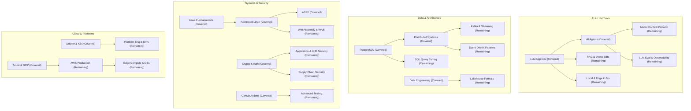

# 2026 Senior Software Engineering - Remaining Study Guide Roadmap

This document maps out the key technical domains, paradigms, and concrete topics that a **Senior Software Engineer in 2026** needs to master, but which are **not yet covered** in the existing study guides. 

As engineering in 2026 matures, two forces dominate: **Agentic AI systems** have shifted from experimental novelties to production-grade architectures, and **infrastructure engineering** has doubled down on security, safety, and deterministic foundations to support these non-deterministic workloads.

---

## 🗺️ Remaining Guides Roadmap by Domain

### 1. AI Engineering (Beyond Basic LLM APIs)
*The existing [LLM App Dev](LLM_APP_DEV_STUDY_GUIDE.md) and [AI Agents](AI_AGENTS_STUDY_GUIDE.md) guides cover prompt structures and agent loops. The remaining pieces focus on retrieval quality, standard interfaces, local deployments, and evaluations.*

*   **Model Context Protocol (MCP) in Depth**
    *   **Why it matters in 2026:** MCP has emerged as the universal standard (the "USB-C of AI") for connecting LLMs to local/remote tools, filesystems, and databases.
    *   **Core Concepts:** Host-client-server architecture, JSON-RPC 2.0 transport (SSE and stdio), resource/tool/prompt primitives, cursor/context sharing.
    *   **Practical Workflows:** Building a custom MCP server in Node.js/Python, securing tool permissions, exposing databases securely to models.
*   **Production RAG & Vector Databases**
    *   **Why it matters in 2026:** Simple vector search fails in production. Senior engineers must design complex retrieval pipelines.
    *   **Core Concepts:** Embeddings, chunking strategies (semantic, parent-child, overlapping), ANN indexing algorithms (HNSW, IVF), hybrid search (dense + sparse BM25), reranking (Cross-Encoders, Cohere Rerank), GraphRAG.
    *   **Tooling/Tradeoffs:** Dedicated vector stores (Qdrant, Weaviate, Milvus) vs. relational extensions ([pgvector](POSTGRES.md)).
*   **LLM Evaluation & Observability**
    *   **Why it matters in 2026:** AI applications are non-deterministic, making traditional testing methods insufficient. Evals are what separate a demo from a robust product.
    *   **Core Concepts:** LLM-as-a-judge, semantic validation, regression testing prompt versions in CI/CD, tracing token costs, latency profiling, and caching.
    *   **Tooling:** LangSmith, Phoenix, Promptfoo, Braintrust.
*   **Local & Edge LLMs**
    *   **Why it matters in 2026:** Data privacy, latency, and cost have driven a massive push toward running Small Language Models (SLMs) locally or on the edge.
    *   **Core Concepts:** Quantization types (GGUF, AWQ, EXL2), WebGPU acceleration, ONNX Runtime, llama.cpp, Ollama, running models in browser or on mobile (Gemini Nano, Phi-3/4).
*   **Fine-Tuning & PEFT (Parameter-Efficient Fine-Tuning)**
    *   **Why it matters in 2026:** When RAG is not enough (e.g., domain adaptation, formatting adherence), engineers must fine-tune open weights.
    *   **Core Concepts:** LoRA, QLoRA, dataset curation, validation loss curves, hardware requirements (VRAM calculation), PEFT libraries, hosting custom weights.

---

### 2. Architecture & Distributed Data Systems
*While the [Distributed Systems](DISTRIBUTED_SYSTEMS_STUDY_GUIDE.md) and [Postgres](POSTGRES.md) guides lay the groundwork, the following specialized guides represent massive production load-bearers.*

*   **Kafka & Real-Time Event Streaming**
    *   **Why it matters in 2026:** Event streaming is the backbone of microservices, real-time analytics, and agent event loops.
    *   **Core Concepts:** Topic partitioning, consumer group rebalancing, commit log semantics, Exactly-Once Semantics (EOS), tombstone records, compaction.
    *   **Operational Tradeoffs:** Segment retention, disk I/O bottlenecks, Zookeeper-less mode (KRaft), Kafka vs. Redpanda/Pulsar.
*   **Engine-Agnostic SQL & Query Performance Tuning**
    *   **Why it matters in 2026:** Relational databases remain the primary source of truth, yet query optimization remains a rare skill.
    *   **Core Concepts:** Query planner internals, join strategies (hash, nested loop, merge), CTE and window function performance, partition pruning, indexing (indexes beyond B-Trees: GIN, BRIN, Partial).
*   **Event-Driven Architecture & Transactional Patterns**
    *   **Why it matters in 2026:** Ensuring data consistency across distributed boundaries without 2-Phase Commit (2PC).
    *   **Core Concepts:** Event Sourcing, CQRS, Saga Pattern (orchestration vs. choreography), Transactional Outbox Pattern, idempotency keys, handling out-of-order events.
*   **Modern Lakehouse Table Formats**
    *   **Why it matters in 2026:** The convergence of data lakes and data warehouses for big data analytics.
    *   **Core Concepts:** Apache Iceberg, Delta Lake, Apache Hudi, metadata layers, schema evolution, time travel queries, copy-on-write vs. merge-on-read.
*   **DuckDB & the Local OLAP Stack**
    *   **Why it matters in 2026:** The shift toward in-process analytics where "small data is most data," avoiding the overhead of Spark or Snowflake.
    *   **Core Concepts:** Columnar vector execution, Parquet integration, serverless query execution, querying HTTP/S3 datasets directly.

---

### 3. Systems & Platform Engineering
*This domain complements [Advanced Linux](ADVANCED_LINUX_STUDY_GUIDE.md), [eBPF](EBPF_STUDY_GUIDE.md), and [Kubernetes](k8s/KUBERNETES_STUDY_GUIDE.md).*

*   **WebAssembly (Wasm) & WASI (WebAssembly System Interface)**
    *   **Why it matters in 2026:** Wasm is no longer just for the browser. It is the dominant sandboxing technology for serverless, edge computing, and plugin systems.
    *   **Core Concepts:** Wasm Component Model, WASI (WebAssembly System Interface) specs, edge runtimes (Wasmtime, Wasmer), building polyglot Wasm modules.
*   **Advanced Async Rust & System Patterns**
    *   **Why it matters in 2026:** Rust has become mainstream for infrastructure and high-performance services. Moving past the fundamentals is critical.
    *   **Core Concepts:** Async runtime internals (Tokio), `Pin`/`Unpin` mechanics, lifetimes in async code, unsafe Rust safety rules, FFI, lock-free concurrency.
*   **Platform Engineering & Internal Developer Platforms (IDPs)**
    *   **Why it matters in 2026:** The transition from raw DevOps (where developers manage infrastructure files directly) to paved-road golden paths.
    *   **Core Concepts:** Backstage, platform orchestrators, Infrastructure-as-Code (IaC) abstraction layers, GitOps reconciliation engines (ArgoCD/Flux) at scale.
*   **Embedded Linux & Single-Board Systems**
    *   **Why it matters in 2026:** Building edge hardware, IoT gateways, or local dev boxes.
    *   **Core Concepts:** Bootloaders, device trees, kernel modules, systemd-networkd, GPIO/I2C/SPI interfaces, cross-compilation for ARM/RISC-V.

---

### 4. Security & Testing
*The existing security guides cover [Crypto Fundamentals](CRYPTO_FUNDAMENTALS.md) and [Authentication/Authorization](AUTH_STUDY_GUIDE.md). The missing guides focus on software supply chains, application vulnerability classes, and advanced test execution.*

*   **Advanced Testing & Non-Deterministic Systems**
    *   **Why it matters in 2026:** Standard unit tests are insufficient for modern systems. Engineers need strategies to test flaky networks, distributed states, and AI agents.
    *   **Core Concepts:** Property-based testing (Hypothesis/QuickCheck), mutation testing, simulating network latency/partitions, mocking external AI providers, testing eventual consistency.
*   **Web Application & LLM Security (Defensive OWASP)**
    *   **Why it matters in 2026:** Complementing the offensive [Kali Linux guide](KALI_LINUX_STUDY_GUIDE.md). Includes both classic web bugs and the new LLM attack vector.
    *   **Core Concepts:** SSRF, CORS, CSP headers, XSS/SQLi in modern contexts, OAuth flow misconfigurations, plus LLM-specific vulnerabilities: prompt injection, insecure tool bindings, and data exfiltration.
*   **Software Supply Chain Security**
    *   **Why it matters in 2026:** Securing the build pipeline from source code to deployment.
    *   **Core Concepts:** Software Bill of Materials (SBOM), SLSA (Supply-chain Levels for Software Artifacts) framework, signing artifacts (Cosign/Sigstore), dependency scanning, pinning digests (SHA256) vs. tags.

---

### 5. Cloud & Edge Computing
*Translating cloud concepts beyond the AWS/Azure transition ([Azure for AWS](AZURE_FOR_AWS_SOLUTIONS_ARCHITECT.md)) into depth-first cloud deployment handbooks.*

*   **Amazon Web Services (AWS) Production Handbook**
    *   **Why it matters in 2026:** AWS remains the largest cloud platform. A companion guide is needed for deep, production-grade architecture.
    *   **Core Concepts:** Deep VPC topologies, Transit Gateways, IAM permission boundaries and resource policies, ECS/EKS sizing, AWS Bedrock integration, cost optimization strategies for multi-tenant SaaS.
*   **[GCP for AWS Solutions Architect (Covered)](GCP_FOR_AWS_SOLUTIONS_ARCHITECT.md)**
    *   **Why it matters in 2026:** The go-to cloud for many Kubernetes, data engineering, and AI workloads, mapped from AWS primitives.
*   **Edge Compute & Serverless Databases**
    *   **Why it matters in 2026:** Deploying compute and data closer to the user to minimize latency.
    *   **Core Concepts:** Cloudflare Workers / Vercel Edge middleware, Edge-native SQLite databases (Turso, Cloudflare D1), global database replication, sync engines, cold-start mitigation.

---

### 6. Frontend & Modern Web UI
*While the repo features specific framework guides like [Next.js](NEXTJS_STUDY_GUIDE.md) and [Vue](VUE_STUDY_GUIDE.md), these guides cover the foundational blocks and runtimes under them.*

*   **React 19 & React Server Components (RSC)**
    *   **Why it matters in 2026:** React 19 is standard, yet the transition to React Server Components, Server Actions, and compiler-driven optimization has radically altered the mental model of React.
    *   **Core Concepts:** Client vs. Server Components, Server Actions, Suspense hydration, compiler directives, avoiding hydration mismatch.
*   **Modern JS Runtimes & Build Tooling**
    *   **Why it matters in 2026:** Moving past Webpack and legacy Node tooling to ultra-fast modern runtimes and builders.
    *   **Core Concepts:** Bun and Deno runtimes, build engines (Vite, Biome, Turbopack, Rsbuild), package-manager performance, ESM vs. CommonJS compatibility.
*   **Modern CSS Architecture**
    *   **Why it matters in 2026:** CSS has evolved to the point where heavy utility frameworks are often unnecessary.
    *   **Core Concepts:** CSS Grid & Subgrid, Container Queries, CSS cascade layers (`@layer`), CSS Custom Properties (Variables), modern pseudo-classes (`:has()`, `:is()`).

---

## 🗺️ Visual Map: Gaps vs. Covered Areas

The diagram below highlights the relation between what is covered (bolded) and where the remaining guides fit to complete the engineering puzzle:

---

## 📈 Prioritized Execution Path

If you are expanding this repository, here is the suggested sequence based on **2026 market demand** and **adjacency** to the existing guides:

1.  **Web Application & LLM Security**
    *   *Adjacency:* High. Complements the offensive security in [Kali Linux](KALI_LINUX_STUDY_GUIDE.md), and backend implementation in [Auth](AUTH_STUDY_GUIDE.md) and [Crypto](CRYPTO_FUNDAMENTALS.md).
2.  **AWS Production Handbook**
    *   *Adjacency:* High. Completes the cloud story begun by the [Azure for AWS solutions architect guide](AZURE_FOR_AWS_SOLUTIONS_ARCHITECT.md).
3.  **Production RAG & Vector Databases**
    *   *Adjacency:* Medium. Extends the data engineering/SQL track and bridges it with the LLM Application development track.
4.  **Kafka & Real-Time Event Streaming**
    *   *Adjacency:* High. Essential companion to [Distributed Systems](DISTRIBUTED_SYSTEMS_STUDY_GUIDE.md) and [Data Engineering](DATA_ENGINEERING_STUDY_GUIDE.md).
5.  **Advanced Testing & Non-Deterministic Systems**
    *   *Adjacency:* Extreme. Every single language guide (Python, Go, Node, C++, Rust, Swift) needs a solid testing strategy, especially with AI in the mix.
