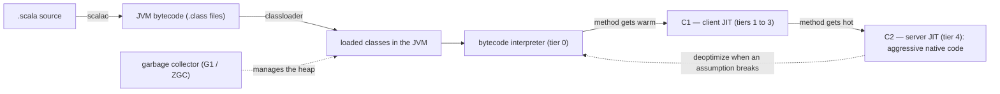
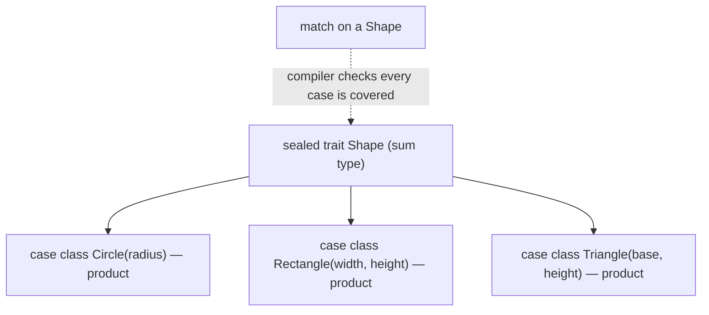
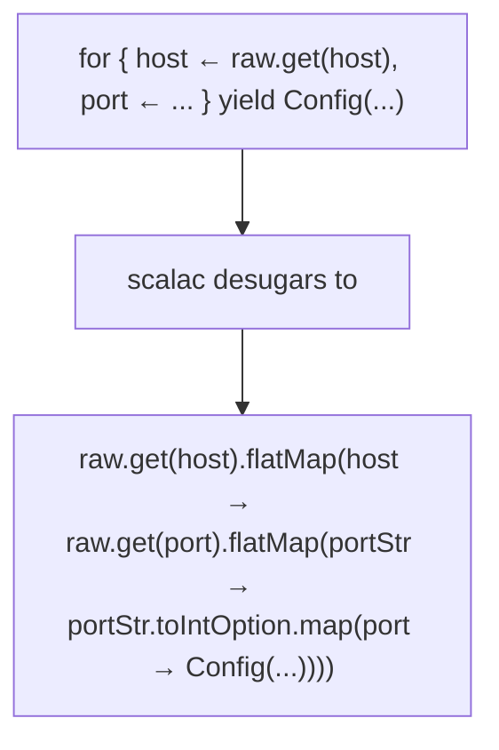
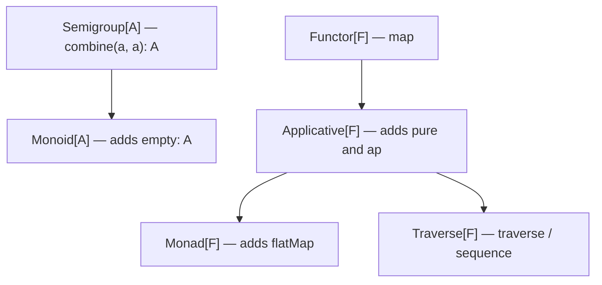
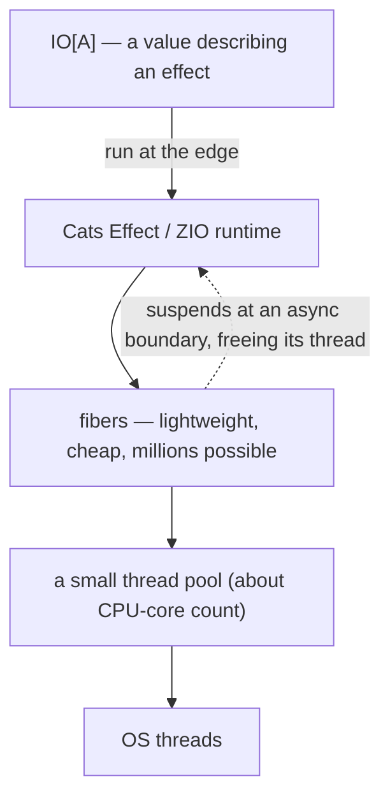

# Scala and the JVM: Functional Programming on the Managed Runtime

This guide is for engineers who can already program — you're fluent in at least one language, comfortable with objects, and you've met generics and closures — and who want to learn Scala *properly*, as the functional language it is, while understanding the JVM it compiles down to. It does not assume you know Scala or Java; where Java knowledge helps, the guide supplies it. It pairs naturally with the [Compiler Internals guide](COMPILER_INTERNALS_STUDY_GUIDE.md), which teaches JIT compilation, SSA, and garbage collection in the abstract — this guide is the concrete JVM instantiation of that theory, and the place that guide's HotSpot references point to. If you come from Python, the [Rust for Python Developers guide](RUST_FOR_PYTHON_DEVS.md) covers the same functional ideas (algebraic data types, pattern matching, `Option`/`Result`) in a different language, and reading the two side by side makes the *shared* ideas pop out from the language-specific syntax.

The organizing idea, and the through-line for everything below: **Scala fuses functional and object-oriented programming into a type system of unusual expressive power — but every bit of it erases down to ordinary JVM bytecode running on HotSpot.** That dual nature is the whole story. The functional half — immutability, algebraic data types, pattern matching, higher-order functions, `for`-comprehensions, type classes, higher-kinded types, effect systems — is what makes Scala a joy to model with and a magnet for hard problems in data and distributed systems. The runtime half — bytecode, the tiered JIT, generational GC, type erasure, autoboxing — is what determines whether your elegant code is also fast, and it's where the leaky abstractions live. Senior Scala work happens at *both* ends: you reach for a `Monad` type class and a higher-kinded abstraction at the top, and you reason about an allocation in a hot loop and a megamorphic call site at the bottom. We build the runtime foundation first, then climb through the functional features, then end with effect systems and tooling — and at every step we connect the abstraction to the bytecode it becomes.

Primary references, all worth keeping open: Martin Odersky (Scala's creator), Lex Spoon, and Bill Venners, [*Programming in Scala*](https://www.artima.com/shop/programming_in_scala_5ed) — the definitive book, updated for Scala 3; the official [Scala 3 Book](https://docs.scala-lang.org/scala3/book/introduction.html) and [language reference](https://docs.scala-lang.org/scala3/reference/), which are genuinely good and current; Paul Chiusano and Rúnar Bjarnason, [*Functional Programming in Scala*](https://www.manning.com/books/functional-programming-in-scala-second-edition) (the "red book") — the canonical text for the FP half, building the abstractions from first principles; the [Typelevel Cats](https://typelevel.org/cats/), [Cats Effect](https://typelevel.org/cats-effect/), and [ZIO](https://zio.dev/) documentation for the modern functional-effects ecosystem; and for the runtime, Aleksey Shipilëv's [JVM Anatomy Quarks](https://shipilev.net/jvm/anatomy-quarks/) — short, rigorous, myth-busting essays on how the JVM actually behaves — alongside the [Java Virtual Machine Specification](https://docs.oracle.com/javase/specs/jvms/se21/html/) itself.

Sibling guides in this repo deepen the ground on both sides: the [Compiler Internals guide](COMPILER_INTERNALS_STUDY_GUIDE.md) (JIT tiers, GC algorithms, IR — the theory the JVM implements), the [.NET for Python Developers guide](DOTNET_FOR_PYTHON_DEVS.md) (the other big managed runtime — IL, JIT, GC — a close structural parallel to the JVM), the [Rust for Python Developers guide](RUST_FOR_PYTHON_DEVS.md) and [Advanced Rust guide](ADVANCED_RUST_STUDY_GUIDE.md) (ADTs, pattern matching, and `Option`/`Result` without a GC), the [TypeScript guide](TYPESCRIPT_STUDY_GUIDE.md) (another rich structural type system with union types and inference), the [Python Concurrency](PYTHON_CONCURRENCY.md) and [Asyncio guides](ASYNCIO_STUDY_GUIDE.md) (concurrency models to contrast with fibers), and the [Data Engineering](DATA_ENGINEERING_STUDY_GUIDE.md) and [Distributed Systems guides](DISTRIBUTED_SYSTEMS_STUDY_GUIDE.md) (Spark, Kafka, and Akka — the systems Scala is most used to build).

## Table of Contents

1. [Part 1 — The Mental Model: Scala on the JVM](#part-1--the-mental-model-scala-on-the-jvm)
2. [Part 2 — The JVM Runtime: Bytecode, the Tiered JIT, and GC](#part-2--the-jvm-runtime-bytecode-the-tiered-jit-and-gc)
3. [Part 3 — Expressions, Immutability, and Referential Transparency](#part-3--expressions-immutability-and-referential-transparency)
4. [Part 4 — Algebraic Data Types and Pattern Matching](#part-4--algebraic-data-types-and-pattern-matching)
5. [Part 5 — Functions as First-Class Values and Composition](#part-5--functions-as-first-class-values-and-composition)
6. [Part 6 — Option, Either, Try, and For-Comprehensions](#part-6--option-either-try-and-for-comprehensions)
7. [Part 7 — The Collections Library and Laziness](#part-7--the-collections-library-and-laziness)
8. [Part 8 — Type Classes, Givens, and Ad-hoc Polymorphism](#part-8--type-classes-givens-and-ad-hoc-polymorphism)
9. [Part 9 — The Type System at Depth](#part-9--the-type-system-at-depth)
10. [Part 10 — Functional Effects and Concurrency: Cats Effect and ZIO](#part-10--functional-effects-and-concurrency-cats-effect-and-zio)
11. [Part 11 — Tooling, Ecosystem, and When to Reach for Scala](#part-11--tooling-ecosystem-and-when-to-reach-for-scala)
12. [If You Remember a Handful of Things](#if-you-remember-a-handful-of-things)
13. [Where to Go Next](#where-to-go-next)

---

## Part 1 — The Mental Model: Scala on the JVM

*Docs: [Scala 3 Book — Introduction](https://docs.scala-lang.org/scala3/book/introduction.html), [Scala/Java interoperability](https://docs.scala-lang.org/scala3/book/interacting-with-java.html).*

Scala is a statically-typed language that **fuses object-oriented and functional programming** and compiles to **JVM bytecode**. Both halves of that sentence are load-bearing. Unlike languages that bolt FP features onto an OO core (or vice versa), Scala was designed from the start so the two paradigms are the same thing viewed two ways: every value is an object (even functions — a function is an object with an `apply` method), and every operation is a method call, yet the whole language is built to support immutability, expressions, and higher-order functions as the default style. The slogan from Odersky is "scalable language" — the same constructs scale from a one-liner script to a type-level library.

The second half — *compiles to JVM bytecode* — is why this guide spends its second part on the runtime. `scalac` emits `.class` files indistinguishable in format from what `javac` emits. That buys Scala three enormous things: **the JVM's mature runtime** (a world-class JIT and garbage collectors, decades of tuning), **the entire Java ecosystem** (every Java library is a Scala library — you call Java APIs directly, and Spark, Kafka, and Akka are built on this), and **portability** (write once, run on any JVM). The cost is that Scala inherits the JVM's constraints: **type erasure** (generics vanish at runtime), **autoboxing** (primitives versus boxed objects), and a GC you must occasionally reason about. The leaky abstractions in Part 2 are all consequences of standing on the JVM.

### Scala 3, and why it matters

This guide targets **Scala 3** (the "Dotty" rewrite, current since 2021), which kept the language's essence while cleaning up its most criticized corners. The headline changes you'll meet: **optional braces** (significant indentation, Python-like, replaces most `{}`); **`given`/`using`** replacing the old `implicit` keyword for the type-class mechanism (Part 8); **`enum`** as first-class syntax for algebraic data types (Part 4); **`extension` methods** as a clean way to add methods to existing types; and a more principled type system (union and intersection types, opaque types — Part 9). Where Scala 2 and 3 differ in a way that matters, the guide flags it; otherwise assume Scala 3.

### A first taste, both paradigms at once

```scala
// OO: a trait (≈ interface) and classes implementing it
trait Greeter:
  def greet(name: String): String

// FP: immutable data, an expression body, no `return`
class Formal extends Greeter:
  def greet(name: String): String = s"Good evening, $name."

// FP: functions are values; map is a higher-order function
val names = List("Ada", "Alan", "Grace")          // immutable List
val greeter = Formal()                            // `new` is optional in Scala 3
val greetings = names.map(greeter.greet)          // List[String], nothing mutated
greetings.foreach(println)
```

Notice what's already FP-flavored even in this tiny example: `val` (immutable binding, not `var`), `List` (an immutable collection), `map` (a higher-order function taking another function), method bodies that are *expressions* returning a value rather than statement sequences, and no nulls or mutation in sight. That default-functional posture, on top of a full OO type system, on top of the JVM — that's Scala.

### When Scala is (and isn't) the right tool

Scala's sweet spot is **data-intensive and concurrent systems where a strong type system pays for itself**: Apache Spark (written in Scala) for big data, Kafka (Scala) for streaming, Akka/Pekko for actor systems, and backend services where correctness matters enough to invest in types. It's a poor fit where startup time and simplicity dominate (the JVM's warmup, Part 2, hurts short-lived CLIs), where the team won't invest in the learning curve (Scala is genuinely harder than Go or Python), or where you'd fight the FP-heavy ecosystem to write imperative code. The honest summary: Scala rewards teams that want functional programming with industrial-strength types and JVM-grade performance, and punishes teams that want it to be "Java with less typing."

```quiz
Q: Why does Scala get "the entire Java ecosystem" for free, and what does it pay for that?
- [ ] Scala transpiles to Java source code, which is then compiled by javac
- [x] scalac emits JVM bytecode indistinguishable from javac's, so any Java library is directly callable — at the cost of inheriting JVM constraints like type erasure and autoboxing
- [ ] Scala ships a copy of every Java library rewritten in Scala
- [ ] Scala runs on a custom VM that emulates the JVM
> Scala compiles straight to JVM bytecode (.class files), so a Scala program and the Java libraries it uses are the same kind of artifact running on the same VM — Spark, Kafka, and every Maven Central library are callable as-is. The price is that Scala lives under the JVM's rules: generics are erased at runtime, primitives may be boxed into objects, and the GC and JIT are the ones it gets. Those constraints drive most of the runtime gotchas in Part 2.

Q: In Scala, a function value like the one passed to `list.map(...)` is, at runtime, fundamentally what?
- [ ] A C-style function pointer
- [ ] A macro expanded at the call site
- [x] An object — an instance of a Function type with an `apply` method — because in Scala everything is an object and a function is just an object you can call
- [ ] A special bytecode primitive with no object representation
> Scala's "everything is an object, every operation is a method call" unification means functions are objects implementing a FunctionN trait with an `apply` method; calling `f(x)` is sugar for `f.apply(x)`. This is what makes functions first-class values you can store, pass, and return (Part 5). On modern JVMs many of these compile to efficient invokedynamic-based lambdas rather than anonymous classes, but the *model* is "function = object."

Q: What is the most accurate statement of Scala's relationship between OO and FP?
- [ ] It's an FP language with OO bolted on for compatibility
- [ ] It's an OO language with a few functional helpers
- [x] It's designed so the two are unified — every value is an object and every function is an object, yet immutability, expressions, and higher-order functions are the default style
- [ ] It forces you to choose one paradigm per file
> Scala doesn't pick a side; it fuses them. The OO machinery (traits, classes, subtyping) and the FP machinery (immutability, ADTs, higher-order functions, type classes) are expressed in one consistent object model. That fusion is the language's defining trait — and why this guide can treat pattern matching, type classes, and effect systems as natural, not exotic.
```

---

## Part 2 — The JVM Runtime: Bytecode, the Tiered JIT, and GC

*Docs: [JVM Specification](https://docs.oracle.com/javase/specs/jvms/se21/html/), [JVM Anatomy Quarks](https://shipilev.net/jvm/anatomy-quarks/). See also the [Compiler Internals guide](COMPILER_INTERNALS_STUDY_GUIDE.md).*

This is the part the [Compiler Internals guide](COMPILER_INTERNALS_STUDY_GUIDE.md) points to: a real, production tiered JIT and generational GC, concretely. Understanding it is what lets you reason about Scala performance instead of guessing.

### From source to native, in tiers

When you run a Scala program, it does **not** start as native machine code. It starts as bytecode, gets *interpreted*, and only the hot parts get compiled — adaptively, while the program runs:



The lifecycle, which explains a lot of JVM behavior: every method begins **interpreted** (fast to start, slow to run). HotSpot counts method invocations and loop iterations; once a method crosses a threshold it's compiled by **C1** (the client compiler — quick, lightly optimized) with profiling instrumentation; if it stays hot, **C2** (the server compiler — slow to compile, aggressively optimized) recompiles it into highly optimized native code using the profile C1 gathered. This is **tiered compilation**, and the practical consequence is **JIT warmup**: a freshly started JVM is slow for the first seconds-to-minutes until the hot paths reach C2. This is why JVM services are benchmarked *after* warmup, why short-lived CLIs feel sluggish on the JVM, and why long-running servers are the JVM's home turf. The deoptimization arrow is the clever part: C2 makes speculative bets (e.g. "this call site is always `Circle`, so inline it"), and if a bet is later violated, the JVM *deoptimizes* back to the interpreter and recompiles — so optimistic optimization stays safe.

### Why this bites Scala specifically

Two JVM facts shape how you write fast Scala:

- **Megamorphic call sites.** C2 loves call sites that hit one or two concrete types — it inlines them. Scala's heavy use of traits and higher-order functions can produce call sites that see *many* implementations (megamorphic), which the JIT can't inline, leaving a virtual dispatch in the hot loop. The fix is often making a hot type `final` or restructuring so the JIT sees few types.
- **Boxing and erasure.** The JVM separates **primitives** (`int`, `long`, `double` — unboxed, on the stack) from **objects**. Generics are **erased** — `List[Int]` is `List` at runtime — so a generic container stores *boxed* `Integer` objects, each a heap allocation. A `List[Int]` is not an array of machine ints; it's a linked structure of boxed integers. This is the single biggest Scala performance surprise: innocent-looking generic, functional code can allocate heavily. Specialized collections (`Array[Int]` stays unboxed), value classes, and libraries that avoid boxing exist precisely to fight this.

### Garbage collection, briefly

The JVM manages the heap with a **generational, mostly-concurrent garbage collector** (the [Compiler Internals guide](COMPILER_INTERNALS_STUDY_GUIDE.md) covers the theory). The key idea is the **generational hypothesis**: most objects die young. So the heap is split into a **young generation** (where new objects are allocated and collected cheaply and often) and an **old generation** (long-lived objects, collected rarely and more expensively). The default modern collector, **G1** (Garbage-First), divides the heap into regions and prioritizes collecting the ones with the most garbage to hit a pause-time target; **ZGC** and **Shenandoah** are concurrent collectors targeting sub-millisecond pauses for large heaps. Why a Scala programmer cares: functional, immutable code **allocates a lot** (every "modified" copy is a new object), and the generational GC is what makes that affordable — short-lived intermediate objects from a `map`/`filter` chain are born and die in the young generation, collected cheaply. Idiomatic immutable Scala is viable *because* the JVM's GC is good at exactly the garbage it produces.

```quiz
Q: A JVM service shows terrible latency for the first 30 seconds after deploy, then becomes fast and stable. What's happening?
- [ ] A memory leak that the GC eventually cleans up
- [ ] DNS resolution is slow on the first requests
- [x] JIT warmup: methods start interpreted and are only compiled to optimized native code (C1 then C2) once they're hot, so early requests run slow until the hot paths reach C2
- [ ] The thread pool is being created lazily
> HotSpot runs bytecode interpreted at first and tiers it up — C1 once warm, C2 once hot — using runtime profiles. Until the hot paths reach C2, the service runs far below peak. This is why JVM benchmarks measure post-warmup throughput, why short-lived processes never amortize the cost, and why long-running servers are the JVM's strength. Pre-warming or AOT options (GraalVM native image) exist for when warmup is unacceptable.

Q: Why can a generic `List[Int]` in Scala allocate far more than you'd expect, where an `Array[Int]` does not?
- [ ] List is always slower because it's functional
- [x] Generics are erased and the JVM separates primitives from objects, so List[Int] stores *boxed* Integer objects (heap allocations), while Array[Int] holds unboxed machine ints
- [ ] List copies all its elements on every access
- [ ] Int is a 64-bit type and Array compresses it
> Type erasure means List[Int] is just List at runtime, holding `Object` references — so each Int is boxed into an Integer on the heap. Array[Int] is special-cased to a primitive int[] with no boxing. This primitive-vs-object split is the JVM's, and it's the root of Scala's biggest performance surprise: idiomatic generic functional code can allocate heavily. Knowing where boxing happens is core to writing fast Scala.

Q: Why is idiomatic immutable Scala — which creates a new object for every "change" — performant in practice rather than catastrophically slow?
- [ ] The compiler secretly mutates objects in place
- [ ] Immutable objects are stored in a special fast region
- [x] The generational GC is cheap for short-lived garbage: the intermediate objects from map/filter chains are born and die in the young generation, which is collected quickly and often
- [ ] map and filter don't actually allocate
> The generational hypothesis — most objects die young — matches functional code's allocation pattern exactly: transformation chains spew short-lived intermediates that never reach the old generation. The young-generation collector reclaims them cheaply, so heavy allocation of ephemeral objects is affordable. Immutable Scala is practical *because* it produces precisely the kind of garbage the JVM collects best; persistent data structures (Part 7) reduce the rest via structural sharing.

Q: C2 inlines a call site assuming it's always `Circle`, then a `Square` shows up. What does the JVM do?
- [ ] Crashes with a type error
- [ ] Silently calls the wrong method
- [x] Deoptimizes — falls back to the interpreter for that code and recompiles without the broken assumption — so speculative optimization stays correct
- [ ] Ignores the Square and treats it as a Circle
> Speculative optimization (inlining a monomorphic-looking call) is only safe because the JVM can undo it. When a guarded assumption is violated, HotSpot deoptimizes the affected code back to the interpreter and later recompiles with a more conservative profile. This is what lets the JIT bet aggressively on observed behavior — and why a call site that suddenly sees many types (megamorphic) loses inlining and slows down.
```

---

## Part 3 — Expressions, Immutability, and Referential Transparency

*Docs: [Scala 3 Book — Variables and Data Types](https://docs.scala-lang.org/scala3/book/taste-vars-data-types.html), [Control Structures](https://docs.scala-lang.org/scala3/book/control-structures.html).*

Now we climb into the functional half. The foundation of FP in Scala is three habits the language nudges you toward by default: bind values immutably, write everything as an expression, and keep functions referentially transparent.

### `val`, `var`, `def`, and `lazy val`

```scala
val x = 41          // immutable binding — x can never be reassigned (prefer this, always)
var y = 0           // mutable binding — reassignable (avoid unless you have a reason)
def z = expensive() // a method/definition — re-evaluated on every reference
lazy val w = costly() // evaluated once, on first access, then cached (memoized)
```

The distinction is sharper than it looks. `val` evaluates its right-hand side **once, immediately**, and the name is forever bound to that value. `def` evaluates the body **every time** it's referenced — it's a method. `lazy val` is the clever middle: it evaluates **once, on first access**, and caches the result — perfect for expensive initialization you might not need, and the building block of safe lazy data structures (Part 7). Reaching for `var` is the exception, not the rule: idiomatic Scala expresses change as transformation (compute a new `val`) rather than mutation (reassign a `var`), which is what makes code easy to reason about and safe to run concurrently.

### Everything is an expression

In Scala there is no statement/expression divide the way there is in Java or Python — **`if`, `match`, `try`, and blocks all return values.** This is more than syntactic sugar; it's what makes the immutable style natural, because you assign the *result* of a computation to a `val` instead of mutating a variable across branches:

```scala
// imperative (other languages): declare, then mutate across branches
// functional Scala: the `if` IS the value
val label = if score >= 90 then "A" else if score >= 80 then "B" else "C"

// a block returns its last expression
val area =
  val r = radius
  math.Pi * r * r        // this is the block's value, assigned to `area`

// match is an expression too (Part 4)
val kind = shape match
  case Circle(_)    => "round"
  case Rectangle(_, _) => "boxy"
```

Because the `if` returns a value, there's no need for a mutable `var label` that you assign in each branch — you bind the whole expression's result once. Expression-orientation and immutability reinforce each other: when every construct yields a value, you rarely need to mutate.

### Referential transparency: the property that makes FP work

An expression is **referentially transparent** if you can replace it with its value without changing the program's meaning — equivalently, the function is *pure*: same inputs always produce the same output, and it has no side effects (no mutation, no I/O, no clock or randomness). `add(2, 3)` is referentially transparent; you can replace it with `5` anywhere. `readLine()` is not; replacing it with whatever it returned the first time changes the program. This is the deepest idea in functional programming, because referential transparency is what makes code **substitutable** — and substitutability is what makes it composable, testable (no mocks for pure functions — just pass inputs), parallelizable (no shared state to race), and amenable to *equational reasoning* (you reason about code like algebra). Part 10's whole effect-system machinery exists to recover referential transparency even for code that does I/O, by turning effects into values. Hold this concept; everything functional in the rest of the guide is in service of it.

```quiz
Q: What's the difference between `val x = compute()`, `lazy val y = compute()`, and `def z = compute()`?
- [ ] They're three syntaxes for the same thing
- [x] val evaluates compute() once immediately; lazy val evaluates it once on first access and caches; def re-evaluates compute() on every reference
- [ ] val and lazy val are immutable; def is mutable
- [ ] def is evaluated at compile time
> The axis is *when and how often* the right-hand side runs. val is eager-once, lazy val is deferred-once-then-cached (memoized), and def is a method body re-run on each use. Choosing among them is a real design decision: lazy val for expensive maybe-unneeded initialization, def for something that should recompute, val for the common eager-immutable case. lazy val also underpins safe lazy data structures (Part 7).

Q: Why does Scala making `if`/`match`/blocks into expressions (not statements) reinforce immutability?
- [ ] It doesn't — they're unrelated features
- [ ] Because expressions execute faster than statements
- [x] Because you can bind the *result* of a branching computation to a single val, instead of declaring a mutable var and assigning it in each branch
- [ ] Because expressions can't have side effects
> When `if` returns a value, `val label = if cond then a else b` captures the whole decision in one immutable binding. In a statement-oriented language you'd declare a mutable variable and assign it inside each branch. Expression-orientation removes the *need* to mutate, which is why the two features pull in the same direction: pervasive expressions make the immutable style the path of least resistance.

Q: A function is referentially transparent. Why does that property matter so much in FP?
- [ ] It makes the function run in constant time
- [ ] It allows the function to perform I/O safely
- [x] You can replace any call with its result without changing meaning — which makes code composable, trivially testable, safely parallelizable, and reasoned about like algebra
- [ ] It guarantees the function never throws
> Referential transparency = purity = substitutability. If `f(x)` can always be swapped for its value, then functions compose predictably, tests need only inputs and outputs (no mocks/state), parallel execution can't introduce races (nothing shared mutates), and you can reason equationally. It's the foundation everything functional rests on — and recovering it for effectful code (I/O) is exactly what the IO monad in Part 10 is for.
```

---

## Part 4 — Algebraic Data Types and Pattern Matching

*Docs: [Scala 3 Book — Algebraic Data Types](https://docs.scala-lang.org/scala3/book/types-adts-gadts.html), [Pattern Matching](https://docs.scala-lang.org/scala3/book/control-structures.html#match-expressions).*

This is one of Scala's signature functional features and the one that most changes how you model data. An **algebraic data type (ADT)** is a type built by combining other types two ways: **products** (a thing that is an A *and* a B *and* a C — a record) and **sums** (a thing that is an A *or* a B *or* a C — a choice). Scala expresses products with **case classes** and sums with **sealed traits** (or, in Scala 3, **`enum`**), and the payoff is that you model your domain as *exactly the set of valid states and no more* — making illegal states unrepresentable.

### Case classes (products) and sealed hierarchies (sums)

```scala
// A sum type: a Shape is a Circle OR a Rectangle OR a Triangle, and nothing else.
// `sealed` means all subtypes must be in this file — so the compiler knows the full set.
sealed trait Shape
case class Circle(radius: Double) extends Shape                 // product: has a radius
case class Rectangle(width: Double, height: Double) extends Shape  // product: width AND height
case class Triangle(base: Double, height: Double) extends Shape

// Scala 3 enum syntax — the same ADT, more concisely:
enum Shape3:
  case Circle(radius: Double)
  case Rectangle(width: Double, height: Double)
  case Triangle(base: Double, height: Double)
```

A **`case class`** is a product type with a pile of free machinery: an immutable value with a public constructor (no `new` needed), structural **`equals`/`hashCode`** (two `Circle(2.0)` are equal), a readable **`toString`**, a **`copy`** method for making modified versions (`c.copy(radius = 3.0)`), and — crucially — an **extractor** so it works in pattern matching. The combination of a **`sealed`** trait and case classes is the sum-of-products ADT:



### Pattern matching, and why exhaustivity is the killer feature

Pattern matching destructures an ADT and dispatches on its shape. It is far more than a `switch`: it binds the inner fields, nests, and matches on structure, literals, types, and guards:

```scala
def area(s: Shape): Double = s match
  case Circle(r)         => math.Pi * r * r       // binds r from inside the Circle
  case Rectangle(w, h)   => w * h
  case Triangle(b, h)    => 0.5 * b * h

// nested patterns, guards, and literal matches all compose:
def describe(s: Shape): String = s match
  case Circle(r) if r > 100 => "a huge circle"
  case Circle(_)            => "a circle"
  case Rectangle(w, h) if w == h => "a square"
  case _                    => "some shape"
```

Here is the feature that makes ADTs transformative: because the trait is **`sealed`, the compiler knows the complete set of subtypes**, so it can check that your `match` covers all of them — **exhaustivity checking**. Forget the `Triangle` case and the compiler *warns you at compile time* that the match isn't exhaustive. Now make this concrete and powerful: when you add a fourth shape to the ADT six months later, the compiler immediately flags *every* `match` in the codebase that doesn't handle it. The set of states and the code that processes them are kept in sync *by the type checker*, not by your memory. This — modeling the domain as a sealed ADT and letting exhaustivity catch every place a new case must be handled — is the single highest-leverage functional technique Scala offers, and the reason FP programmers reach for ADTs first when modeling anything.

```quiz
Q: What does a `case class` give you beyond a plain class?
- [ ] Faster method dispatch
- [x] Structural equals/hashCode, a readable toString, a copy method, no-new construction, and an extractor for pattern matching — the machinery that makes it a usable immutable value and ADT member
- [ ] Mutable fields by default
- [ ] Automatic database persistence
> A case class is Scala's product-type building block, and the compiler generates the boilerplate that makes immutable value types pleasant: value equality (two Circle(2.0) are equal), a copy for "modified" versions, factory construction, and the unapply extractor that lets it appear in match patterns. That extractor is what connects case classes to pattern matching and makes them the natural members of a sealed ADT.

Q: Why is `sealed` on a trait the key to exhaustivity checking?
- [ ] It makes the trait final so no one can extend it
- [x] It restricts all subtypes to the same file, so the compiler knows the complete set of cases and can warn when a match doesn't cover them all
- [ ] It encrypts the trait's methods
- [ ] It forces every subtype to be a case class
> sealed means the full list of direct subtypes is known at compile time (they must live in the same file). With the complete set in hand, the compiler can prove whether a match handles every case and warn when one is missing. Without sealed, a subtype could exist anywhere, so the compiler can't know the match is exhaustive — losing the property that makes ADTs so safe.

Q: You add a fourth subtype to a sealed ADT. What's the practical benefit of exhaustivity checking at that moment?
- [ ] The new type is automatically handled everywhere with default behavior
- [ ] Nothing changes until you run the tests
- [x] The compiler flags every non-exhaustive match in the codebase, so you can't forget to handle the new case anywhere
- [ ] All existing matches throw at runtime when they hit the new case
> This is the superpower: the type checker, not your discipline, keeps the data model and its handling in sync. Add a case and every match that now fails to cover all cases becomes a compile-time warning (or error, if configured), giving you a precise to-do list of every place that must change. That "make illegal states unrepresentable, then let the compiler find the gaps" loop is why ADTs are the FP modeler's first reach.
```

---

## Part 5 — Functions as First-Class Values and Composition

*Docs: [Scala 3 Book — First-Class Functions](https://docs.scala-lang.org/scala3/book/fun-intro.html), [Higher-Order Functions](https://docs.scala-lang.org/scala3/book/fun-hofs.html).*

Functions in Scala are **values**: you can store them in `val`s, pass them as arguments, and return them from other functions. A function that takes or returns a function is a **higher-order function (HOF)**, and HOFs are the mortar of functional code.

```scala
val double: Int => Int = x => x * 2        // a function value: type Int => Int
val nums = List(1, 2, 3, 4)
nums.map(double)                           // pass a function — List(2, 4, 6, 8)
nums.map(_ * 2)                            // underscore shorthand for x => x * 2
nums.filter(_ % 2 == 0)                    // List(2, 4)
nums.foldLeft(0)(_ + _)                    // 10 — collapse with a binary function
```

`map`, `filter`, and `foldLeft` are HOFs: each takes a function and applies it across a structure. The underscore (`_`) is shorthand for an anonymous parameter, so `_ * 2` *is* `x => x * 2`. Once functions are values, whole families of loops collapse into a `map` or `fold`, and the *what* (transform each element) separates cleanly from the *how* (iterate) — that separation is most of FP's expressive power.

### Currying, partial application, and composition

```scala
// a curried function: takes its arguments in separate lists
def multiply(factor: Int)(x: Int): Int = factor * x
val triple = multiply(3)          // partially applied: Int => Int, with factor fixed at 3
triple(10)                        // 30

// composition: build new functions by chaining existing ones
val addOne: Int => Int = _ + 1
val timesTwo: Int => Int = _ * 2
val combined = addOne andThen timesTwo   // (x + 1) * 2
val combined2 = addOne compose timesTwo  // (x * 2) + 1   — note the order
combined(5)                       // 12
```

**Currying** turns a multi-argument function into a chain of single-argument functions, which makes **partial application** natural: fix some arguments now, supply the rest later (`multiply(3)` yields a "triple" function). **Composition** (`andThen`, `compose`) builds bigger functions from smaller ones — `f andThen g` means "do f, then g," while `f compose g` means "do g, then f" (mathematical order). The instinct to cultivate: build behavior by *composing small, pure, named functions* rather than writing one big procedure, because each piece is independently testable and the composition reads like a pipeline.

### By-name parameters: controlling evaluation

```scala
def unless(cond: Boolean)(body: => Unit): Unit =   // `=> Unit` is by-name: not evaluated yet
  if !cond then body                               // body runs only if we reach here

unless(loggedIn) {
  println("please log in")     // this block is passed unevaluated; runs only if !loggedIn
}
```

A **by-name parameter** (`body: => Unit`) is passed *unevaluated* and only runs where it's used in the body — which lets you write control structures (and short-circuiting, and lazy logging) as ordinary functions. This is a small but characteristic Scala move: because evaluation can be deferred and functions are values, you can build constructs that look like language keywords (`unless`, `using`, retry-with-backoff) entirely in library code.

```quiz
Q: What does it mean that functions are "first-class values" in Scala, and why does it matter?
- [ ] Functions run in a privileged execution mode
- [x] Functions can be stored in vals, passed as arguments, and returned from functions — which lets higher-order functions like map/filter/fold replace whole families of hand-written loops
- [ ] Functions are checked first by the compiler
- [ ] Only top-level functions get this treatment
> First-class means functions are ordinary values. That's the precondition for higher-order functions: map takes the transform as an argument, fold takes the combining function. The win is separating *what* you do to each element from the *how* of iterating, collapsing bespoke loops into declarative transformations and making behavior something you pass around and compose rather than inline.

Q: `f andThen g` and `f compose g` — what's the difference?
- [ ] They're identical
- [x] andThen runs f first then g; compose runs g first then f (the mathematical g∘f order)
- [ ] andThen is for pure functions, compose for impure ones
- [ ] compose is lazy, andThen is eager
> Both build a new function from two, but the order is opposite. `f andThen g` reads left-to-right like a pipeline: apply f, feed the result to g. `f compose g` follows math's g(f(x))... actually (f∘g)(x)=f(g(x)), so compose applies g first. Mixing them up silently swaps your pipeline's order, so pick andThen when you want left-to-right reading, which is usually clearer.

Q: Why is a by-name parameter (`body: => A`) useful for building control structures like a custom `unless` or a retry helper?
- [ ] It makes the parameter mutable
- [x] It passes the argument unevaluated, so the function decides whether and when to run it — enabling short-circuiting, lazy logging, and keyword-like library constructs
- [ ] It evaluates the argument in parallel
- [ ] It caches the argument's value
> A normal (by-value) parameter is evaluated before the call. A by-name parameter defers evaluation to wherever the body uses it, so the function controls execution: run it conditionally (unless), run it repeatedly (retry), or never run it (short-circuit). Combined with functions-as-values, this is how Scala lets libraries define things that feel like built-in control flow.
```

---

## Part 6 — Option, Either, Try, and For-Comprehensions

*Docs: [Scala 3 Book — Functional Error Handling](https://docs.scala-lang.org/scala3/book/fp-functional-error-handling.html), [`scala.Option`](https://www.scala-lang.org/api/current/scala/Option.html).*

Functional Scala does not use `null` and avoids throwing exceptions for expected failures. Instead it makes "might be absent" and "might fail" **explicit in the type**, using three ADTs from the standard library — and then `for`-comprehensions make chaining them readable.

### The three error-handling types

- **`Option[A]`** — a value that may be absent: `Some(a)` or `None`. It replaces `null`. A function that might not find something returns `Option[A]`, so the *type* forces the caller to handle absence — there is no `NullPointerException` waiting to happen, because there is no `null`.
- **`Either[E, A]`** — a result that is either an error `Left(e)` or a success `Right(a)`. Use it when you want to *carry information about the failure*, not just signal absence.
- **`Try[A]`** — `Success(a)` or `Failure(throwable)`. It captures exceptions as values, for bridging exception-throwing (often Java) code into the functional world.

```scala
def findUser(id: Long): Option[User] = ...      // None if not found — no null, ever
def parsePort(s: String): Either[String, Int] = // Left("bad port") or Right(8080)
  s.toIntOption.toRight(s"not a number: $s")
```

The crucial property: these are all **ADTs you pattern-match on** (Part 4) and **functors/monads you map and flatMap over** (Part 8). `opt.map(f)` transforms the value *if present* and does nothing if `None`; `either.map(f)` transforms the `Right` and passes a `Left` through untouched. Absence and errors propagate automatically along the happy path without a single `if x != null` or `try/catch`.

### For-comprehensions: monadic chaining made readable

Chaining several operations that each might fail gets ugly with nested `flatMap`/`map`. Scala's **`for`-comprehension** is *syntactic sugar* that makes it read like a sequence of steps:

```scala
def loadConfig(raw: Map[String, String]): Option[Config] =
  for
    host <- raw.get("host")        // each <- is a flatMap; short-circuits to None if absent
    portStr <- raw.get("port")
    port <- portStr.toIntOption
  yield Config(host, port)          // the yield is a final map
```

If any step yields `None`, the whole comprehension yields `None` and the rest is skipped — the failure short-circuits. And here is the key insight that unlocks half of Scala: **the `for`-comprehension is not loop syntax; it desugars to `flatMap` and `map` calls.** That exact code becomes:



Because the comprehension is pure desugaring to `flatMap`/`map`, **it works for *anything* that has those methods** — not just `Option`. The identical syntax chains `Either` (short-circuiting on the first `Left`), `Try`, `List` (Cartesian product), `Future`, and the `IO` of Part 10. Learn the `for`-comprehension once and you can sequence *any* monadic type the same way. This is the central FP abstraction Scala makes ergonomic: "do these steps in order, threading the context (absence, error, async, effect) through automatically," expressed as readable straight-line code.

```quiz
Q: Why does idiomatic Scala return `Option[User]` instead of `User` (possibly null) from a lookup?
- [ ] Option is faster than a null check
- [x] It makes absence explicit in the type, so the caller must handle the "not found" case — eliminating NullPointerExceptions because there is no null to forget
- [ ] Option automatically retries the lookup
- [ ] null is not allowed on the JVM
> Returning Option[User] encodes "might not be here" in the type system. The caller can't accidentally treat absence as presence — the compiler makes them deal with None (via map, getOrElse, pattern match). Compare null, which is invisible in the type and blows up at runtime when forgotten. This is "make illegal states unrepresentable" (Part 4) applied to absence: no null means no NPE.

Q: A `for`-comprehension over `Option` short-circuits to `None` if any step is absent. Mechanically, how?
- [ ] It uses exceptions and a try/catch under the hood
- [ ] The runtime special-cases for-comprehensions on Option
- [x] It desugars to flatMap/map calls, and flatMap on None returns None without invoking the rest of the chain
- [ ] It loops until it finds a Some
> The for-comprehension is pure syntactic sugar: each `<-` becomes a flatMap and the final yield a map. Since None.flatMap(f) returns None without calling f, the moment any step is None the remaining steps are skipped and the whole expression is None. No special runtime support, no exceptions — just the monadic flatMap behavior of Option, made readable.

Q: The same `for`-comprehension syntax works for Option, Either, Try, List, Future, and IO. Why?
- [ ] Each is a subclass of a common Comprehension base class
- [ ] The compiler has hard-coded support for each type
- [x] Because the comprehension desugars to flatMap/map, it works for any type providing those methods — so one syntax sequences any monadic context
- [ ] They all extend Iterable
> The for-comprehension is defined by desugaring, not by a fixed list of supported types: anything with flatMap and map (and withFilter for guards) participates. That's why the identical "do steps in order" syntax threads absence (Option), errors (Either), async (Future), or effects (IO) automatically. It's the practical face of the monad abstraction (Part 8) — learn it once, apply it everywhere.

Q: When would you choose `Either[E, A]` over `Option[A]`?
- [ ] When the value is never absent
- [ ] When you need the result to be mutable
- [x] When you want to carry information about *why* it failed, not just signal that a value is missing
- [ ] When performance is critical
> Option says "present or absent" — fine when there's only one way to be empty and no detail to report. Either says "succeeded with A, or failed with E," carrying a description of the failure in the Left. Use Either (or a richer validated type) when the caller needs to know what went wrong — a parse error message, a validation reason — and Option when absence alone is the whole story.
```

---

## Part 7 — The Collections Library and Laziness

*Docs: [Scala 3 Book — Collections](https://docs.scala-lang.org/scala3/book/collections-intro.html), [Collections architecture](https://docs.scala-lang.org/overviews/collections-2.13/introduction.html).*

Scala's collections library is one of its most celebrated assets: a large, consistent hierarchy where the same rich set of transformation methods works across every collection type, with **immutable collections as the default**.

### Immutable by default, with structural sharing

When you `import scala.collection` the unqualified names (`List`, `Vector`, `Map`, `Set`) are the **immutable** ones — "modifying" them returns a new collection and leaves the original untouched. This sounds expensive but usually isn't, thanks to **persistent data structures** that use **structural sharing**: prepending to an immutable `List` creates one new cell pointing at the *same* unchanged tail, so it's O(1) and copies nothing. `Vector` is a wide tree (a "32-way trie") giving effectively-constant-time indexed access, update, append, and prepend while sharing almost all structure between versions. The mental model: an "update" produces a new version that shares the bulk of its data with the old one, so immutability is cheap *and* you keep every prior version intact (great for undo, snapshots, and concurrency — no copy needed to share data across threads, because nothing mutates).

```scala
val a = List(2, 3, 4)
val b = 1 :: a          // prepend: O(1), b shares a's cells; a is unchanged → List(2,3,4)
val m = Map("x" -> 1)
val m2 = m + ("y" -> 2) // m is still Map("x" -> 1); m2 is the new version
```

### The transformation vocabulary, uniform across collections

The reason the library feels coherent is that the same higher-order methods (Part 5) work everywhere — on `List`, `Vector`, `Set`, `Map`, and lazy collections alike:

```scala
val xs = (1 to 10).toList
xs.map(_ * 2)             // transform each
xs.filter(_ % 2 == 0)     // keep matching
xs.collect { case n if n > 5 => n * 10 }  // filter + map in one (partial function)
xs.groupBy(_ % 3)         // Map[Int, List[Int]] keyed by remainder
xs.partition(_ > 5)       // (matching, non-matching)
xs.foldLeft(0)(_ + _)     // reduce to a single value
xs.zip(xs.reverse)        // pair up
```

Learning this vocabulary *once* is most of becoming productive in Scala, because it transfers to every collection and, via the `for`-comprehension and type classes, to `Option`, `Either`, `Future`, and beyond.

### Strict vs lazy: `LazyList` and views

By default these operations are **strict** (eager): `xs.map(f).filter(g)` builds a full intermediate collection from `map`, then another from `filter`. For large data or pipelines where that intermediate is wasteful, Scala offers **laziness** two ways. A **`LazyList`** (Scala 3's name for the old `Stream`) computes elements **on demand** and memoizes them — it can even be *infinite*, because only the elements you actually consume are ever produced:

```scala
lazy val naturals: LazyList[Int] = 0 #:: naturals.map(_ + 1)  // infinite, lazily defined
naturals.take(5).toList     // List(0, 1, 2, 3, 4) — only 5 elements ever computed
```

A **view** (`xs.view.map(f).filter(g).toList`) makes a transformation pipeline lazy *without changing the collection type*: it fuses the operations so each element flows through `map` then `filter` once, with **no intermediate collections** allocated, materializing only at the final `toList`. The practical rule: reach for `.view` (or `LazyList`/`Iterator`) when chaining several transformations over a large collection where the intermediate copies would dominate — it turns "allocate, allocate, allocate" into a single fused pass, directly addressing the allocation pressure Part 2 warned about.

```quiz
Q: How can prepending to an immutable `List` be O(1) and copy nothing, given that the original must stay unchanged?
- [ ] It secretly mutates the list and restores it
- [x] Persistent data structures use structural sharing: the new list is one new cell pointing at the original's unchanged tail, so both versions coexist without copying
- [ ] Immutable lists are actually mutable under the hood
- [ ] It copies the list but does so very quickly
> Structural sharing is the trick that makes immutability affordable. A cons-list prepend allocates a single node whose tail *is* the original list — the old list is untouched and the new one reuses all of it. Both versions are valid simultaneously, which is also why immutable collections are safe to share across threads with no copying: there's nothing to race because nothing mutates. Vector generalizes this with a wide tree for fast indexed ops.

Q: What does `xs.view.map(f).filter(g).toList` do differently from `xs.map(f).filter(g)`?
- [ ] Nothing; view is just documentation
- [x] view makes the pipeline lazy and fused — each element passes through map then filter in one pass with no intermediate collection — materializing only at toList
- [ ] view runs the operations in parallel
- [ ] view caches the result for reuse
> Without view, map builds a full intermediate collection and filter builds another — two allocations proportional to the data. view defers and fuses: it produces a lightweight pipeline so each element flows through the whole chain once, allocating only the final result at toList. For large collections with multi-step transforms, that eliminates the intermediate-copy allocation pressure the JVM section flagged.

Q: A `LazyList` can represent an infinite sequence like all natural numbers. Why doesn't constructing it hang forever?
- [ ] It computes the first million elements and assumes that's enough
- [x] Elements are computed on demand and memoized, so only the ones you actually consume (e.g. via take(5)) are ever produced
- [ ] It runs the computation on a background thread
- [ ] Infinite collections are an illusion; it's secretly finite
> A LazyList computes each element only when accessed and caches it. Defining `naturals` describes how to produce the next element, but nothing is computed until you demand it; `take(5)` forces exactly five. This lazy-on-demand evaluation is what lets you express infinite or very large sequences and consume just the prefix you need — the same deferral idea as lazy val (Part 3), applied to a sequence.
```

---

## Part 8 — Type Classes, Givens, and Ad-hoc Polymorphism

*Docs: [Scala 3 Book — Contextual Abstractions](https://docs.scala-lang.org/scala3/book/ca-contextual-abstractions-intro.html), [Type Classes](https://docs.scala-lang.org/scala3/book/ca-type-classes.html), [Cats — type classes](https://typelevel.org/cats/typeclasses.html).*

This is the deepest and most distinctively-functional feature in Scala, the one that powers the entire Cats/ZIO ecosystem. A **type class** is a way to add behavior to a type *without modifying it and without inheritance* — "ad-hoc polymorphism." Where OO says "this behavior comes from a type's place in an inheritance hierarchy," a type class says "this behavior is a separate piece of evidence that some type supports an operation, supplied where needed."

### The mechanism: a trait, instances, and `given`/`using`

A type class is three parts: a **trait** parameterized by a type, **instances** for specific types, and a way to **summon** the right instance automatically. Scala 3 expresses the last part with **`given`** (define an instance) and **`using`** (require one):

```scala
// 1. The type class: "an A that can be shown as a String"
trait Show[A]:
  def show(a: A): String

// 2. Instances (given values) for specific types
given Show[Int]    with { def show(a: Int): String = a.toString }
given Show[Boolean] with { def show(a: Boolean): String = if a then "yes" else "no" }

// 3. A function that works for ANY A that has a Show instance
def display[A](a: A)(using s: Show[A]): String = s.show(a)

display(42)     // "42"  — the compiler finds the given Show[Int] and passes it
display(true)   // "yes" — finds given Show[Boolean]
// display(3.14) — compile error: no given Show[Double] in scope
```

The magic is in step 3: the `using` parameter is supplied **implicitly by the compiler**, which searches the scope for a `given` instance of the required type and passes it automatically. (In Scala 2 this was the `implicit` keyword; Scala 3 renamed it to `given`/`using` to make the intent clear.) The result is polymorphism that's **opt-in per type** and **decoupled from the type's definition** — you can give `Show` an instance for a type you don't own (a Java class, a library type) without touching it. A **context bound** `def display[A: Show](a: A)` is shorthand for the same `using` parameter.

### Why type classes beat inheritance for this

Inheritance forces behavior in at definition time and couples every capability to the type hierarchy: to make a type "showable" you'd have to make it extend a `Showable` base, which you can't do for types you don't control and which doesn't compose (a type can sit in only one hierarchy). Type classes invert this: capabilities are **separate evidence** you supply where needed, so a type can participate in *any number* of type classes (be a `Show`, a `Monoid`, a `JsonEncoder`) independently, including types from libraries and Java. This is **retroactive, composable polymorphism**, and it's why the FP ecosystem models *everything* — equality, ordering, serialization, and the algebraic structures below — as type classes.

### The Cats hierarchy: Functor, Monad, Monoid

The [Cats](https://typelevel.org/cats/) library encodes the algebraic structures of functional programming as type classes. The two families you must know:



A **`Monoid[A]`** is "a type with an associative `combine` and an identity `empty`" — exactly what `String` (concatenation, `""`), `Int` (addition, `0`), and `List` (concatenation, `Nil`) all are, so one generic `combineAll` folds any of them. A **`Functor[F]`** is "a type constructor `F` you can `map` over" (`Option`, `List`, `Either`, `Future` — all functors). A **`Monad[F]`** adds `flatMap` and `pure` — and *that* is the abstraction the `for`-comprehension (Part 6) is secretly programmed against. The whole edifice connects: because `Option`, `Either`, `List`, and `IO` are all monads, the same `for`-comprehension and the same generic functions written against `Monad[F]` work for all of them. Type classes are how Scala turns "these all support flatMap" into a reusable, checkable abstraction rather than a coincidence.

```quiz
Q: What problem do type classes solve that inheritance cannot?
- [ ] They make method calls faster
- [x] They add behavior to a type without modifying it or putting it in a hierarchy — so you can make a library or Java type "showable"/"comparable"/"a monad" retroactively, and a type can participate in any number of type classes independently
- [ ] They replace the need for generics
- [ ] They enforce that all types share a common base class
> Inheritance bakes capabilities into a type at definition and confines it to one hierarchy — useless for types you don't own and non-composable. A type class supplies behavior as separate evidence (a given instance) resolved where needed, so any type — including library and Java types — can opt into any number of capabilities without modification. That retroactive, composable polymorphism is exactly what the FP ecosystem is built on.

Q: In `def display[A](a: A)(using s: Show[A])`, how does `s` get supplied at a call like `display(42)`?
- [ ] You must pass it explicitly every time
- [ ] It defaults to null and is checked at runtime
- [x] The compiler searches the scope for a `given Show[A]` matching the call's type and passes it automatically — a compile error if none exists
- [ ] It's resolved by reflection at runtime
> The `using` parameter is filled by implicit resolution: at display(42) the compiler needs a Show[Int], finds the given Show[Int] in scope, and passes it. No instance in scope means a compile-time error, not a runtime surprise. This compiler-driven instance selection is the heart of the type-class mechanism (Scala 2's `implicit`, Scala 3's given/using) and what makes ad-hoc polymorphism ergonomic.

Q: The `for`-comprehension works for Option, Either, List, Future, and IO alike. Which type class is it really programmed against?
- [ ] Iterable
- [ ] Functor
- [x] Monad — it provides flatMap (and pure), which is exactly what for-comprehension desugaring needs
- [ ] Semigroup
> Desugaring a for-comprehension produces flatMap and map calls; the abstraction that guarantees both (plus pure) is Monad. Because Option, Either, List, Future, and IO all have Monad instances, the same comprehension and any generic code written against Monad[F] work uniformly across them. This is the concrete payoff of encoding algebraic structures as type classes: "they all support flatMap" becomes a reusable, type-checked abstraction.

Q: What makes a type a `Monoid`, and why is that useful generically?
- [ ] It can be compared for ordering
- [x] It has an associative combine operation and an identity (empty) element — so one generic combineAll/fold works for String, Int-addition, List, and any other monoid
- [ ] It can be serialized to JSON
- [ ] It supports map and flatMap
> A Monoid is the algebra of "combinable with a neutral element": String with concatenation and "", Int with addition and 0, List with ++ and Nil. Capturing that pattern as a type class lets you write one generic function (combine a whole collection, fold in parallel, merge configs) that works for every monoid, instead of re-implementing the fold per type. It's a small abstraction that recurs constantly once you see it.
```

---

## Part 9 — The Type System at Depth

*Docs: [Scala 3 Reference — Types](https://docs.scala-lang.org/scala3/reference/), [Variances](https://docs.scala-lang.org/scala3/book/types-variance.html).*

Scala's type system is what *enables* the functional abstractions of Parts 6–8; here are the pieces that most repay understanding. The good news for readers of the [TypeScript guide](TYPESCRIPT_STUDY_GUIDE.md): many ideas (variance, union types, structural reasoning) rhyme across the two.

### Variance: how generics relate under subtyping

If `Cat` is a subtype of `Animal`, is `List[Cat]` a subtype of `List[Animal]`? The answer is a **variance** annotation on the type parameter:

- **Covariant** `class List[+A]` — `List[Cat]` *is* a `List[Animal]`. Safe for types you only *read out of* (producers). Scala's immutable collections are covariant.
- **Contravariant** `trait Printer[-A]` — a `Printer[Animal]` *is* a `Printer[Cat]` (it can print any animal, so it can print a cat). Safe for types you only *consume* (consumers). Function arguments are contravariant.
- **Invariant** `class Array[A]` — no subtyping relationship; required for things you both read and write (mutable containers).

The mnemonic is "producers are covariant, consumers are contravariant," and `Function1[-A, +R]` shows both at once: a function is contravariant in its argument and covariant in its result. Getting variance right is what lets `List[Cat]` flow where a `List[Animal]` is expected without sacrificing soundness.

### Higher-kinded types: abstracting over the container

This is the feature that makes Cats possible. An ordinary generic abstracts over a *type* (`List[A]` abstracts over the element type `A`). A **higher-kinded type** abstracts over a *type constructor* — over `F[_]` itself, the "shape of a container":

```scala
// F[_] is a type constructor (List, Option, ...); this abstracts over the container
trait Functor[F[_]]:
  def map[A, B](fa: F[A])(f: A => B): F[B]
```

`Functor[F[_]]` says "for *any* one-hole type constructor `F` — `List`, `Option`, `Future`, anything that takes one type argument — here is what `map` means." Without higher-kinded types you could not write `Monad[F[_]]` or the `for`-comprehension's underlying abstraction generically; you'd be stuck writing the same code once per container. HKTs are why "works for any monad" is expressible at all, and they're a capability most mainstream languages lack — a large part of why the FP-library ecosystem chose Scala.

### Scala 3's type-system additions

Scala 3 added several features that make the type system both safer and more ergonomic:

- **Union and intersection types**: `String | Int` (a value that is one or the other) and `Resettable & Growable` (a value that is both) — composable types without a named supertype, much like the [TypeScript guide](TYPESCRIPT_STUDY_GUIDE.md)'s unions.
- **Opaque types**: `opaque type UserId = Long` gives you a distinct type that *is* a `Long` at runtime (zero boxing, zero overhead) but is incompatible with raw `Long`s at compile time — so you can't accidentally pass a `ProductId` where a `UserId` is expected. This is "newtype" / branded-type safety with no runtime cost, the same goal as the TypeScript guide's branded types but enforced more strongly.
- **Path-dependent types**: a type that depends on a *value* (e.g. an `inner` type nested in a specific instance), enabling precise APIs where one object's types are tied to another's.

The thread through all of this: Scala's type system is unusually *expressive*, and that expressiveness is not academic decoration — it's the substrate that lets the functional abstractions (type classes, monads, effect systems) be written once and checked by the compiler.

```quiz
Q: Why are Scala's immutable collections covariant (`List[+A]`) while mutable `Array[A]` is invariant?
- [ ] Arrays are older and predate variance
- [x] Covariance is sound for read-only producers, so List[Cat] can safely be a List[Animal]; a mutable Array supports both reads and writes, and allowing covariant writes would let you store a Dog into an Array[Cat], so it must be invariant
- [ ] Immutable collections are faster when covariant
- [ ] Invariance only applies to primitive arrays
> Variance soundness hinges on read vs write. If you only read elements out (immutable List), treating List[Cat] as List[Animal] is safe — every element really is an Animal. But a mutable container you can write to could accept a Dog through the Animal-typed view, corrupting an Array[Cat]; the type system forbids that by making mutable containers invariant. "Producers covariant, consumers contravariant, mutable invariant" is the rule.

Q: What does a higher-kinded type like `Functor[F[_]]` let you do that an ordinary generic cannot?
- [ ] Abstract over the element type of a list
- [x] Abstract over the *type constructor* (the container shape F itself), so one definition of map/flatMap works for List, Option, Future, and any one-hole F — which is what makes Monad and the generic for-comprehension expressible
- [ ] Store types at runtime despite erasure
- [ ] Make any type covariant
> An ordinary generic fixes the container and varies the element (List[A]). A higher-kinded type varies the *container itself* (F[_]), letting you say "for any single-argument type constructor, here is map." That's the abstraction power behind Cats: Functor, Monad, Traverse are all parameterized by F[_], so generic code works across every container. Most mainstream languages lack HKTs, which is a big reason the FP ecosystem lives on Scala.

Q: What does `opaque type UserId = Long` buy you over a plain `type UserId = Long` alias?
- [ ] It stores the UserId as a String for safety
- [ ] It boxes the Long to add type information at runtime
- [x] At compile time UserId is a distinct, incompatible type (you can't pass a raw Long or a ProductId where a UserId is expected), but at runtime it's just a Long with zero overhead
- [ ] It makes the field immutable
> A plain alias is interchangeable with Long — no extra safety. An opaque type is a separate type to the compiler (preventing mix-ups like passing a ProductId as a UserId) while compiling away to a bare Long at runtime: no wrapper object, no boxing, no cost. It's the "newtype"/branded-type pattern done with zero runtime overhead — stronger than the TypeScript guide's structural brands because the distinction is enforced nominally.
```

---

## Part 10 — Functional Effects and Concurrency: Cats Effect and ZIO

*Docs: [Cats Effect](https://typelevel.org/cats-effect/docs/getting-started), [ZIO](https://zio.dev/overview/getting-started). Contrast with the [Asyncio](ASYNCIO_STUDY_GUIDE.md) and [Python Concurrency](PYTHON_CONCURRENCY.md) guides.*

We end the functional climb at its summit: how Scala does side effects and concurrency *while keeping referential transparency* (Part 3). The answer is the **functional effect system** — the `IO` monad — and it's the foundation of the modern Scala backend ecosystem ([Cats Effect](https://typelevel.org/cats-effect/) and [ZIO](https://zio.dev/)).

### The core trick: an effect is a value

A normal `println("hi")` *runs* the moment it's evaluated — it's not referentially transparent, so it breaks all the reasoning of Part 3. The functional effect system's move is to make an effect a **description** instead of an **action**:

```scala
import cats.effect.IO

val program: IO[Unit] = IO.println("hello")   // does NOTHING yet — it's a value describing a print
val doubled: IO[Unit] = program *> program    // a value describing TWO prints; still nothing has run
// only at the "end of the world" — usually IOApp's run — is it executed:
```

`IO[A]` is a **pure value that *describes* a computation that, when run, will produce an `A` (and may perform effects)**. Building an `IO`, combining `IO`s with `map`/`flatMap`/`for`-comprehensions, sequencing them — all of that is pure value manipulation that runs nothing. The actual effects happen only once, at the program's edge (the `IOApp` entry point), when the runtime *interprets* the description. This recovers referential transparency: `val x = IO.println("hi"); x *> x` really does print twice and you really can reason about `x` as a value, because the value is the *plan*, not the *act*. The whole point is that you get to keep equational reasoning, testability, and composability even for code that talks to the network, the disk, and the clock — the thing Part 3 said effects normally destroy.

### Fibers: lightweight concurrency on the JVM

Cats Effect and ZIO run effects on **fibers** — extremely lightweight, runtime-scheduled threads (green threads), thousands of which multiplex onto a small pool of JVM threads:



The payoff mirrors what the [Asyncio](ASYNCIO_STUDY_GUIDE.md) and [Go](GOLANG_FOR_PYTHON_DEVS.md) guides describe, achieved differently: a fiber that's waiting on I/O **suspends and releases its underlying JVM thread**, so a handful of OS threads serve tens of thousands of concurrent fibers — the same "don't burn a thread per blocked connection" win, but you write straight-line `for`-comprehension code and the runtime handles the suspension. On top of fibers these libraries provide **structured concurrency** (child fibers are tied to their parent's lifetime, so cancellation and cleanup are automatic and leak-free), safe **cancellation**, and resource management (`Resource` guarantees acquire/release even on failure). This is where Scala's FP and the JVM's threading meet: pure effect values, scheduled as fibers, running on the JIT-compiled, GC-managed runtime of Part 2.

### ZIO vs Cats Effect, briefly

Both are production-grade functional effect systems. **Cats Effect** is the Typelevel ecosystem's runtime, building on the Cats type-class hierarchy (Part 8) — its `IO[A]` is minimal and you compose capabilities via type classes. **ZIO** offers a richer effect type `ZIO[R, E, A]` that bakes the dependency environment (`R`), typed errors (`E`), and the success value (`A`) into one type, with a large batteries-included standard library. The choice is largely ecosystem and taste; both deliver the same core wins — effects as values, fibers, structured concurrency. Learning either teaches the model.

```quiz
Q: How does an `IO[Unit]` value preserve referential transparency where a bare `println` does not?
- [ ] IO runs the effect on a background thread so it doesn't block
- [x] IO is a *description* of an effect, not the effect itself — building and combining IO values runs nothing; the effect happens only when the runtime interprets the description at the program's edge
- [ ] IO disables side effects entirely
- [ ] IO caches the output of println
> A bare println runs on evaluation, so it's not substitutable — the cornerstone of FP reasoning breaks. IO[Unit] is a pure value that *describes* "print this when run." Constructing, mapping, and sequencing IOs is pure data manipulation that executes nothing; only at the end of the world (IOApp.run) does the runtime perform the effects. So `val x = IO.println("hi"); x *> x` is a value you can reason about that, when finally run, prints twice — referential transparency recovered for effectful code.

Q: Why can a Cats Effect / ZIO application handle tens of thousands of concurrent operations on only a handful of OS threads?
- [ ] It creates one OS thread per operation but they're cheap on the JVM
- [x] Operations run on fibers (lightweight green threads); a fiber waiting on I/O suspends and frees its JVM thread, so a small pool serves many fibers — without you writing callbacks
- [ ] It blocks each thread but the GC compacts them
- [ ] It runs everything sequentially and just appears concurrent
> Fibers are runtime-scheduled and far cheaper than OS threads; the runtime multiplexes many fibers onto a small thread pool. When a fiber blocks on I/O it suspends and returns its thread to the pool, so threads are never idle-blocked and a few of them serve enormous concurrency. You still write straight-line for-comprehension code — the runtime inserts the suspension — which is the same "don't burn a thread per blocked task" payoff as asyncio and goroutines, achieved with effect values.

Q: What does "structured concurrency" give you in these effect systems?
- [ ] It runs all fibers in strict sequence
- [x] Child fibers are tied to their parent's lifetime, so cancellation propagates and cleanup/resource release happen automatically — no leaked background fibers
- [ ] It guarantees effects are pure
- [ ] It pins each fiber to one CPU core
> Structured concurrency scopes child fibers to their parent: if the parent finishes or is cancelled, its children are cancelled and their resources released, so you can't accidentally leak a background fiber or skip cleanup. Combined with Resource (guaranteed acquire/release even on failure), it makes concurrent, effectful code safe by construction — the leak-and-dangling-task problems that plague unstructured concurrency are designed out.
```

---

## Part 11 — Tooling, Ecosystem, and When to Reach for Scala

*Docs: [sbt documentation](https://www.scala-sbt.org/1.x/docs/), [Scala tools — Metals](https://scalameta.org/metals/), [Scaladex (library index)](https://index.scala-lang.org/).*

The model is built; this is how you actually work in Scala day to day.

### The build: sbt (and the alternatives)

**sbt** ("Scala Build Tool") is the dominant build tool — itself written in Scala, with a build defined in Scala. A minimal `build.sbt`:

```scala
scalaVersion := "3.4.2"
libraryDependencies ++= Seq(
  "org.typelevel" %% "cats-effect" % "3.5.4",   // %% appends the Scala version to the artifact name
  "org.scalatest" %% "scalatest"  % "3.2.18" % Test
)
```

The `%%` operator is the one Scala-specific thing to internalize: because a library compiled for Scala 3 is a different artifact from one compiled for Scala 2.13, `%%` automatically appends the Scala binary version to the artifact name, so you get the right build. sbt's other defining trait is **interactive, incremental compilation** — run `sbt` once to get a shell, then `~compile` or `~test` recompiles and reruns *on every file save*, which (combined with the JVM warmup story of Part 2) is how you avoid paying JVM startup on every build. Alternatives exist — **Mill** (simpler, faster for many) and **scala-cli** (excellent for scripts and small programs, no ceremony) — and scala-cli is the friendliest way to start.

### Editor support, the REPL, and worksheets

**Metals** is the Scala language server (LSP), giving you completion, type-on-hover, go-to-definition, and inline errors in VS Code and other editors — and it's genuinely good, which matters because Scala's type inference means you often want the editor to *show* you the inferred types. The **REPL** (`scala` or `sbt console`) lets you evaluate expressions interactively, and **worksheets** (`.worksheet.sc` files in Metals) evaluate as you type and show each line's result inline — the fastest way to explore an API or check your understanding of a type. Reaching for the REPL or a worksheet to *try* something is the core Scala learning loop.

### The ecosystem, and the honest trade-off

Scala's libraries cluster into two cultural camps worth knowing: the **Typelevel** stack (Cats, Cats Effect, http4s, fs2, doobie, circe) — pure-FP, type-class-driven, the subject of Parts 6–10 — and the **lighter / Java-interop** stack (Akka/Pekko actors, Play, the Spark API). You can write Scala anywhere on the spectrum from "Java with better syntax" to "category theory," and a real decision when adopting Scala is *where on that spectrum your team will live*. The honest trade-off to close on: Scala gives you a uniquely powerful fusion of FP and a strong type system on the JVM's industrial runtime — unmatched for data engineering (Spark), streaming, and correctness-critical backends — at the cost of a real learning curve, slower compile times than Go, JVM warmup, and an ecosystem where you must choose your subculture. It rewards teams that genuinely want functional programming with strong types; it frustrates teams that wanted a slightly nicer Java. Know which you are before you commit.

---

## If You Remember a Handful of Things

1. **Scala is FP and OO fused, and it all erases to JVM bytecode.** The functional features (ADTs, type classes, monads, effects) sit on top; the runtime (tiered JIT, generational GC, erasure, boxing) sits underneath. Senior work happens at both ends, and connecting an abstraction to the bytecode it becomes is the skill.
2. **The JVM is interpreted-then-JIT-compiled, with a generational GC.** Warmup is real (long-running servers win, short CLIs lose), erasure means generic collections box their elements (allocation surprises), and immutable functional code is affordable precisely *because* the young-generation GC is cheap for the short-lived garbage it produces.
3. **Model with algebraic data types and let exhaustivity work for you.** Sealed traits / enums (sums) of case classes (products) make illegal states unrepresentable, and pattern-match exhaustivity turns "add a case" into a compile-time checklist of every place that must change — the highest-leverage functional technique Scala offers.
4. **`Option`/`Either`/`Try` make absence and failure explicit, and the `for`-comprehension is just `flatMap`/`map` sugar.** Because it desugars to those methods, the same straight-line syntax sequences any monad — `Option`, `Either`, `List`, `Future`, `IO` — threading absence, error, or effect through automatically. No null, no exceptions on the happy path.
5. **Type classes (`given`/`using`) are how Scala adds composable, retroactive behavior, and effect systems make side effects pure values.** Type classes (built on higher-kinded types) power the whole Cats/ZIO ecosystem; `IO` turns an effect into a *description* run only at the program's edge, recovering referential transparency and running on cheap fibers — pure FP meeting the JVM's threads.

---

## Where to Go Next

- **Read the definitive book and the FP red book.** Odersky, Spoon, and Venners' [*Programming in Scala*](https://www.artima.com/shop/programming_in_scala_5ed) is the comprehensive language reference from the creator; Chiusano and Bjarnason's [*Functional Programming in Scala*](https://www.manning.com/books/functional-programming-in-scala-second-edition) builds the functional abstractions (Parts 4–10 of this guide) from first principles and is the single best way to *internalize* them. Keep the [Scala 3 Book](https://docs.scala-lang.org/scala3/book/introduction.html) open as the current, free reference.
- **Do the exercises and live in a worksheet.** Install [scala-cli](https://scala-cli.virtuslab.org/) and [Metals](https://scalameta.org/metals/), and work through the type-class and monad exercises in the red book in a worksheet, watching the inferred types as you go — building the abstractions yourself is what makes them click, and the worksheet's instant feedback is the fastest loop.
- **Read the runtime sources while they're fresh.** Aleksey Shipilëv's [JVM Anatomy Quarks](https://shipilev.net/jvm/anatomy-quarks/) on boxing, escape analysis, and GC are short and rigorous; pair them with the [Compiler Internals guide](COMPILER_INTERNALS_STUDY_GUIDE.md) so the JIT-and-GC theory and its JVM realization sit side by side.
- **Build and break a real Scala program — this is the high-leverage part.** On a throwaway project: model a small domain as a sealed ADT and delete a `match` case to watch exhaustivity catch it; write a generic function against `Monad[F]` and run it on both `Option` and `IO`; spin up tens of thousands of fibers in Cats Effect or ZIO and watch a handful of threads serve them; deliberately box a `List[Int]` in a hot loop, profile the allocations, then fix it with an `Array[Int]` or a `.view`; and benchmark a service *before and after* JIT warmup so you feel the tiered compiler engage. Each turns a Part above into intuition.
- **Adjacent guides in this repo, by the slice they deepen:** the [Compiler Internals guide](COMPILER_INTERNALS_STUDY_GUIDE.md) for the JIT/GC theory the JVM implements; the [.NET for Python Developers guide](DOTNET_FOR_PYTHON_DEVS.md) for the other major managed runtime as a close parallel; the [Rust for Python Developers](RUST_FOR_PYTHON_DEVS.md) and [Advanced Rust](ADVANCED_RUST_STUDY_GUIDE.md) guides for ADTs and `Option`/`Result` without a GC; the [TypeScript guide](TYPESCRIPT_STUDY_GUIDE.md) for a kindred rich type system (unions, variance, branded types); the [Asyncio](ASYNCIO_STUDY_GUIDE.md) and [Python Concurrency](PYTHON_CONCURRENCY.md) guides for concurrency models to contrast with fibers; and the [Data Engineering](DATA_ENGINEERING_STUDY_GUIDE.md) and [Distributed Systems](DISTRIBUTED_SYSTEMS_STUDY_GUIDE.md) guides for Spark, Kafka, and the systems Scala most often builds.

The single highest-leverage next action: take one real problem — a small parser, a data pipeline, an HTTP service — and build it twice, once in the imperative "Java with nicer syntax" style and once in the functional style (ADTs, `Option`/`Either`, type classes, an `IO` effect), then compare how each handles a new requirement and a new error case. The gap between the two versions when the requirements change is the entire argument for functional Scala, felt rather than told.
