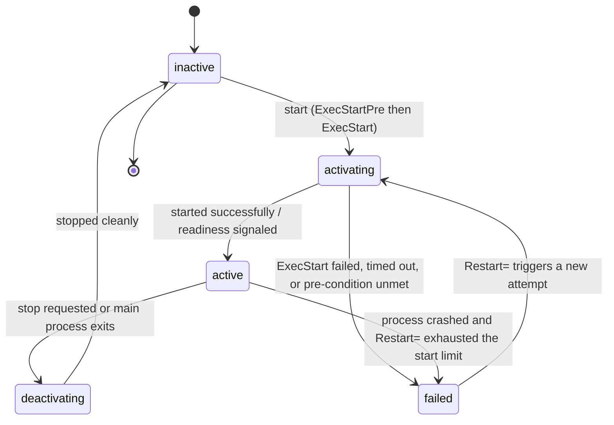
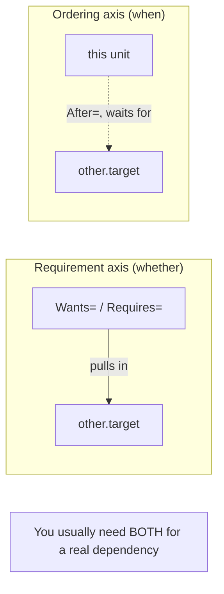
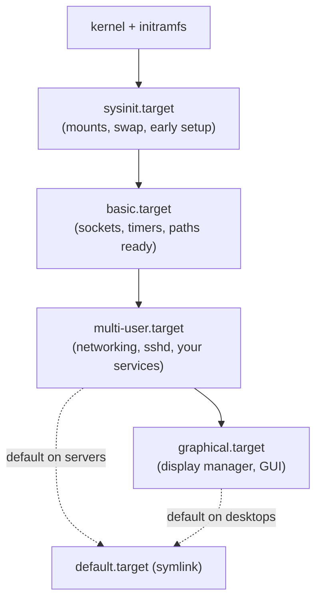
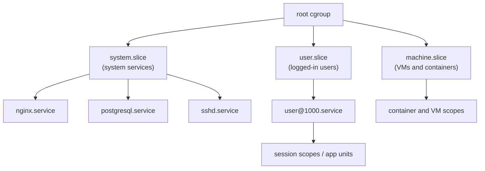
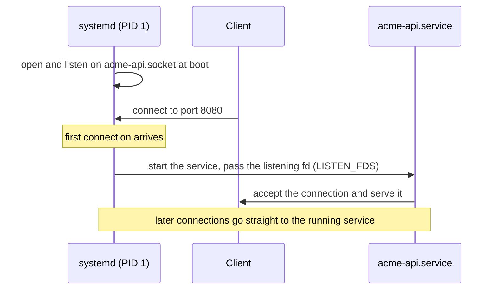

# systemd: A Depth-First Guide for System Administrators

This guide is for engineers who already run Linux servers — you can edit config files, read `ps` and `journalctl` output, and you know what a daemon is — but who have only ever *used* systemd by copying `.service` snippets off the internet and running `systemctl restart`. It assumes the substrate covered in the [Linux Fundamentals guide](LINUX_FUNDAMENTALS_STUDY_GUIDE.md) (processes, `fork`/`exec`, signals, PID 1, namespaces, and especially cgroups), and it does not re-teach those; instead it builds the layer that sits on top of them. The goal is to make you fluent enough that writing a hardened, dependency-correct, resource-limited service from scratch is routine, and debugging a failed boot is a methodical procedure rather than a panic.

The organizing idea, and the through-line for everything below: **systemd is not "an init system with extra features" — it is a single, uniform model in which every manageable thing on the machine is a *unit*, units declare *dependencies* on each other, and the manager tracks every process through *cgroups*.** Once you internalize that, the apparent sprawl collapses: services, sockets, timers, mounts, devices, login sessions, network targets, and resource limits are all the same kind of object, configured the same way, inspected with the same tools, and wired together with the same dependency grammar. Boot is just the largest instance of that dependency graph being resolved. Logging, scheduling, sandboxing, and resource control are not bolt-ons; they fall out of the model because systemd is PID 1 and therefore owns every process's lifecycle and cgroup. We build the model first, then ride it through services, dependencies, boot, the journal, timers, cgroups, sandboxing, and socket activation, and end by operating it all day to day.

Primary references, all worth keeping open: the **systemd man pages** — above all [`systemd.unit(5)`](https://man7.org/linux/man-pages/man5/systemd.unit.5.html), [`systemd.service(5)`](https://man7.org/linux/man-pages/man5/systemd.service.5.html), [`systemd.exec(5)`](https://man7.org/linux/man-pages/man5/systemd.exec.5.html), [`systemctl(1)`](https://man7.org/linux/man-pages/man1/systemctl.1.html), and [`journalctl(1)`](https://man7.org/linux/man-pages/man1/journalctl.1.html) — which are the authoritative, exhaustive, and surprisingly readable specification (and [`systemd.directives(7)`](https://man7.org/linux/man-pages/man7/systemd.directives.7.html) is the index that tells you *which* man page a setting lives in); the [systemd.io documentation hub](https://systemd.io/) and the upstream [project docs](https://www.freedesktop.org/wiki/Software/systemd/); Lennart Poettering's [*systemd for Administrators*](https://0pointer.net/blog/projects/systemd-for-admins-1.html) blog series — the canonical from-the-author tutorial, dated in places but unmatched on the *why*; and the [Arch Wiki systemd page](https://wiki.archlinux.org/title/Systemd), which is the best concise practical reference anywhere. When this guide says "see the docs," it means the man page named in that section's `*Docs:*` line.

Sibling guides in this repo go deeper on the ground systemd stands on and the systems it manages: the [Linux Fundamentals guide](LINUX_FUNDAMENTALS_STUDY_GUIDE.md) (processes, signals, the PID 1 problem, namespaces and cgroups — the primitives), the [Advanced Linux guide](ADVANCED_LINUX_STUDY_GUIDE.md) (the cgroup v2 controllers, the scheduler, and kernel tuning that systemd's resource directives drive), the [Observability guide](OBSERVABILITY_STUDY_GUIDE.md) (where the journal hands off to logs, metrics, and SLOs), the [Docker guide](DOCKER_STUDY_GUIDE.md) (containers are the same namespaces-and-cgroups primitives systemd uses, applied differently), the [Linux Networking guide](LINUX_NETWORKING_STUDY_GUIDE.md) (the network units and `systemd-networkd`/`resolved` neighbors), and the [Raspberry Pi guide](RASPBERRY_PI_STUDY_GUIDE.md) (systemd as the thing that brings a board up after the kernel hands off).

## Table of Contents

1. [Part 1 — The Mental Model: Units, the Manager, and Why systemd Won](#part-1--the-mental-model-units-the-manager-and-why-systemd-won)
2. [Part 2 — Unit Files: Anatomy, Locations, and Overrides](#part-2--unit-files-anatomy-locations-and-overrides)
3. [Part 3 — Service Units in Depth](#part-3--service-units-in-depth)
4. [Part 4 — Dependencies, Ordering, and Targets](#part-4--dependencies-ordering-and-targets)
5. [Part 5 — The Boot Process and Analyzing It](#part-5--the-boot-process-and-analyzing-it)
6. [Part 6 — The Journal: Logging with journald](#part-6--the-journal-logging-with-journald)
7. [Part 7 — Timers: A Better Cron](#part-7--timers-a-better-cron)
8. [Part 8 — Resource Control with cgroups](#part-8--resource-control-with-cgroups)
9. [Part 9 — Sandboxing and Security Hardening](#part-9--sandboxing-and-security-hardening)
10. [Part 10 — Socket, Path, and On-Demand Activation](#part-10--socket-path-and-on-demand-activation)
11. [Part 11 — Operating systemd Day to Day](#part-11--operating-systemd-day-to-day)
12. [If You Remember a Handful of Things](#if-you-remember-a-handful-of-things)
13. [Where to Go Next](#where-to-go-next)

---

## Part 1 — The Mental Model: Units, the Manager, and Why systemd Won

*Docs: [`systemd(1)`](https://man7.org/linux/man-pages/man1/systemd.1.html), [`systemd.unit(5)`](https://man7.org/linux/man-pages/man5/systemd.unit.5.html).*

The thing the kernel starts after it mounts the root filesystem is a single userspace process with PID 1. That process is **systemd**, and it has two jobs that the name "init" undersells: it is the **system and service manager**. As the [Linux Fundamentals guide](LINUX_FUNDAMENTALS_STUDY_GUIDE.md) explains, PID 1 is special — it reaps orphaned processes and it can never die without panicking the kernel — and systemd uses that position to own the lifecycle of *every* service on the machine.

### Why systemd replaced SysV init

The old model, **SysV init**, ran a sequence of shell scripts in `/etc/rc.d/` in lexical order (`S01...`, `S20...`), one after another, each blocking until it finished. That design has four fatal weaknesses systemd was built to fix, and understanding them is understanding why systemd looks the way it does:

- **Serial startup is slow.** Scripts ran one at a time even when independent. systemd starts everything it can **in parallel**, constrained only by declared dependencies — which is why boot went from "watch the scrolling text for a minute" to a few seconds.
- **Dependencies were implicit and fragile.** Ordering was encoded in filename numbers a human maintained. systemd makes dependencies **explicit, declarative data** (`After=`, `Requires=`), so the manager computes a correct startup order from a graph instead of trusting your numbering.
- **Process tracking was unreliable.** A SysV script started a daemon and forgot about it; if the daemon double-forked, the init system lost track of it, and "is it running?" became a `pidfile`-and-`grep` guessing game. systemd places every service in its own **cgroup** (Part 8), so it knows with certainty every process a service spawned, can stop them all reliably, and can attribute resource usage precisely. This is the single deepest architectural difference.
- **Everything needed a daemon running all the time.** systemd can start services **on demand** — on the first socket connection, on a file appearing, on a timer — so idle services cost nothing (Part 10).

The cost of all this is real and worth naming: systemd is large, it absorbed responsibilities (logging, login management, DNS, NTP, network config) that critics argue should stay separate, and its uniform model means you learn *its* way of doing things rather than composing small tools. The trade the Linux world overwhelmingly accepted is that one coherent, introspectable model beats a pile of bespoke scripts — and that is the trade this guide teaches you to exploit.

### Everything is a unit

A **unit** is systemd's word for any resource it knows how to manage. The unit's *type* is its filename suffix, and there are eleven of them — but you will spend almost all your time on the first three:

| Unit type | Suffix | What it manages |
|---|---|---|
| **Service** | `.service` | A daemon or process — the workhorse (Part 3) |
| **Socket** | `.socket` | An IPC/network socket for activation (Part 10) |
| **Target** | `.target` | A named grouping/synchronization point (Part 4) |
| Timer | `.timer` | A scheduled trigger for another unit (Part 7) |
| Mount | `.mount` | A filesystem mount point |
| Automount | `.automount` | On-demand mounting |
| Path | `.path` | Activation on filesystem changes (Part 10) |
| Slice | `.slice` | A node in the cgroup resource tree (Part 8) |
| Scope | `.scope` | A cgroup for externally-created processes |
| Device | `.device` | A kernel device (from udev) |
| Swap | `.swap` | A swap area |

The payoff of this uniformity is that one set of verbs operates on all of them. `systemctl status nginx.service`, `systemctl status sshd.socket`, and `systemctl status data.mount` all work, return the same shape of information, and read from the same dependency graph. Learn the model once; apply it eleven ways.

### The manager(s) and your interface to them

There is one **system manager** (PID 1, running as root, managing system-wide units), and there is a separate **per-user manager** for each logged-in user — a `systemd --user` instance that manages that user's own units (their `pipewire`, their `gpg-agent`, their personal timers). The two are deliberately parallel: the same unit-file format and the same `systemctl` commands, just add `--user`.

Your primary interface to the manager is [`systemctl(1)`](https://man7.org/linux/man-pages/man1/systemctl.1.html). It is the one command you will type ten thousand times:

```bash
systemctl status nginx          # is it running? recent logs, PID, cgroup, memory
systemctl start nginx           # start it now (this boot)
systemctl stop nginx            # stop it now
systemctl restart nginx         # stop then start
systemctl reload nginx          # re-read config without dropping connections (if supported)
systemctl enable nginx          # start automatically at boot (persists)
systemctl disable nginx         # don't start at boot
systemctl enable --now nginx    # enable AND start in one step
systemctl list-units --type=service          # what's loaded and active
systemctl list-unit-files --state=enabled    # what's set to start at boot
```

The two distinctions that trip up beginners, worth fixing immediately: **`start`/`stop` affect the running system right now; `enable`/`disable` affect what happens at the *next* boot.** They are independent — a service can be enabled but stopped, or running but disabled. And `.service` is the default suffix `systemctl` assumes, so `systemctl status nginx` and `systemctl status nginx.service` are identical; you only need the suffix to talk about a non-service unit.

```quiz
Q: What is the single deepest architectural reason systemd can reliably stop a service and all the processes it spawned, where SysV init could not?
- [ ] systemd sends SIGKILL to every process on the system and restarts the survivors
- [ ] systemd reads each daemon's pidfile and kills that PID
- [x] systemd places every service in its own cgroup, so the kernel tells it exactly which processes belong to the service — including double-forked grandchildren
- [ ] systemd requires every daemon to register over D-Bus before it can be tracked
> A pidfile records one PID and is lost the moment a daemon double-forks or spawns workers. A cgroup is a kernel-maintained set membership: every process a service forks stays in the service's cgroup, so systemd can enumerate and signal all of them with certainty. This is also what makes per-service resource accounting (Part 8) possible, and it's the architectural break from SysV that everything else builds on.

Q: A service is "enabled but not running." What does that mean and how did it happen?
- [ ] It's a corrupted state; run systemctl daemon-reload to fix it
- [x] It's configured to start at the next boot (enable created the symlink) but is not currently active — e.g. it was enabled then stopped, or enabled but not yet started this boot
- [ ] enable always starts the service, so this state is impossible
- [ ] The unit file is masked
> enable/disable control boot-time autostart (by creating or removing a symlink in a target's .wants directory); start/stop control the live system. They're orthogonal, so "enabled but stopped" and "running but disabled" are both normal. Use `systemctl enable --now` when you want both at once, and remember `is-enabled` and `is-active` answer the two questions separately.

Q: Why does `systemctl status sshd.socket` work the same way as `systemctl status sshd.service`?
- [ ] Because sockets are a special case hard-coded into systemctl
- [ ] Because the .socket is automatically generated from the .service
- [x] Because both are *units*, and systemctl's verbs operate uniformly on every unit type — the type is just the filename suffix
- [ ] Because status only reads from the journal, which is type-agnostic
> "Everything is a unit" is not a slogan — it's the architecture. Services, sockets, targets, timers, mounts, and slices are all units sharing one configuration format, one dependency graph, and one set of management verbs. The uniformity is exactly what lets you learn the model once and apply it to all eleven unit types.
```

---

## Part 2 — Unit Files: Anatomy, Locations, and Overrides

*Docs: [`systemd.unit(5)`](https://man7.org/linux/man-pages/man5/systemd.unit.5.html), [`systemctl(1)`](https://man7.org/linux/man-pages/man1/systemctl.1.html).*

A unit file is an INI-style text file. Every unit file has a `[Unit]` section (generic metadata and dependencies), a type-specific section (`[Service]`, `[Socket]`, `[Timer]`, …), and — if the unit can be enabled — an `[Install]` section describing *how* it gets enabled. Here is a minimal but complete service:

```ini
[Unit]
Description=Acme API server
Documentation=https://example.com/docs
After=network-online.target
Wants=network-online.target

[Service]
ExecStart=/usr/local/bin/acme-api --port 8080
Restart=on-failure
User=acme

[Install]
WantedBy=multi-user.target
```

`Description=` is what you see in `systemctl status` and the boot output — write a useful one. `Documentation=` is shown in status and is good hygiene. The `[Service]` directives are Part 3. The `[Install]` section's `WantedBy=multi-user.target` is the line that makes `systemctl enable` work: enabling this unit creates a symlink from `multi-user.target.wants/` to it, which is how "start at boot" is actually implemented (Part 4).

### Where unit files live, and who wins

The same unit name can exist in several directories, and **the directory determines precedence**. From lowest to highest priority:

```
/usr/lib/systemd/system/   ← shipped by your distro packages (don't edit these)
/run/systemd/system/       ← runtime, volatile (generated, gone on reboot)
/etc/systemd/system/       ← your local administrator overrides (highest priority)
```

The rule that matters: **if a unit of the same name exists in `/etc`, it completely replaces the one in `/usr/lib`.** This is the supported way to override a vendor unit you want to rewrite — but it's a blunt instrument, because your copy stops tracking package updates to the original. Most of the time you don't want to replace the whole file; you want to change one line. That's what drop-ins are for.

### Drop-ins: change one line, keep the rest

A **drop-in** is a partial unit file in a `<unit>.d/` directory whose settings are *merged on top of* the original. Create `/etc/systemd/system/nginx.service.d/override.conf`, put only the directives you want to change in it, and systemd combines it with the vendor unit. This is almost always the right way to customize a packaged service, because the vendor's file keeps getting package updates and your one change rides along on top.

The tool that does this for you is `systemctl edit`:

```bash
systemctl edit nginx          # opens a drop-in (override.conf) in $EDITOR
systemctl edit --full nginx   # opens a full copy in /etc to replace the vendor unit
systemctl cat nginx           # show the effective unit: vendor file + every drop-in, in order
```

`systemctl cat` is the command to reach for whenever you're confused about *why* a service behaves a certain way — it prints the merged, effective configuration with each source file labeled, so you can see exactly which drop-in set which value.

One sharp edge with merging: list-valued directives like `ExecStart=` and `Environment=` are tricky. Assigning `ExecStart=` again in a drop-in does **not** add a second command — for most such settings you must first clear the list with an empty assignment (`ExecStart=`) and then set the new value, or the result is undefined. The man page marks which directives are list-resettable; when a drop-in seems ignored, this is the usual cause.

### daemon-reload: the step everyone forgets

systemd reads unit files into memory at startup and caches them. **When you change a unit file on disk, the running manager does not see it until you tell it to re-read.** That command is:

```bash
systemctl daemon-reload
```

Forgetting `daemon-reload` after editing a unit is the single most common "why isn't my change taking effect?" — `systemctl edit` runs it for you, but a manual edit of a file in `/etc` does not. Note the distinction: `daemon-reload` reloads systemd's *own* configuration (the unit files); `systemctl reload nginx` tells the *nginx service* to re-read *its* config. Different layers, different commands.

```quiz
Q: You want to change only the `Restart=` setting of a distro-packaged service while still receiving package updates to the rest of its unit file. What do you do?
- [ ] Edit /usr/lib/systemd/system/foo.service directly
- [x] Create a drop-in (systemctl edit foo) with just `[Service]` and the new `Restart=` line, so it merges on top of the vendor unit
- [ ] Copy the unit to /etc and edit it there
- [ ] Set Restart= with an environment variable
> Editing /usr/lib gets clobbered on package upgrade. Copying to /etc (systemctl edit --full) overrides the whole file but then freezes your copy — you stop getting the vendor's future fixes. A drop-in changes only the directives you specify and lets the rest of the vendor file keep updating, which is exactly the surgical override you want.

Q: After hand-editing `/etc/systemd/system/foo.service`, `systemctl restart foo` runs the *old* configuration. Why?
- [ ] The file has a syntax error that was silently ignored
- [ ] You need to reboot for unit-file changes to take effect
- [x] systemd caches unit files in memory; you must run `systemctl daemon-reload` so it re-reads the changed file
- [ ] restart doesn't re-read unit files; only start does
> The manager parses unit files once and caches them. A disk edit is invisible until `daemon-reload` re-reads them into memory. `systemctl edit` does this automatically, which is one more reason to prefer it; a manual edit in /etc does not, so daemon-reload is the easy-to-forget second step.

Q: What does `systemctl cat foo` show that simply opening the unit file does not?
- [ ] The service's current memory and CPU usage
- [ ] The last 10 lines of the service's logs
- [x] The *effective* unit — the vendor file plus every drop-in merged in order, each source labeled
- [ ] A syntax-checked, validated version of the file
> A real service's behavior is often the sum of a vendor unit plus several drop-ins from /etc and /run. `systemctl cat` prints that merged, effective configuration with file headers, so when a setting isn't what you expect you can see exactly which file set it — the fastest way to debug "where is this value coming from?"
```

---

## Part 3 — Service Units in Depth

*Docs: [`systemd.service(5)`](https://man7.org/linux/man-pages/man5/systemd.service.5.html), [`systemd.exec(5)`](https://man7.org/linux/man-pages/man5/systemd.exec.5.html), [`systemd.kill(5)`](https://man7.org/linux/man-pages/man5/systemd.kill.5.html).*

The `.service` unit is where you'll spend most of your time. Its behavior turns on a small number of high-leverage directives.

### `Type=`: the readiness contract

`Type=` tells systemd **how to know your service has finished starting** — which matters because other units ordered `After=` yours must wait for "started" to mean something real. Getting this wrong is the cause of most "the dependent service started before mine was ready" races.

- **`Type=simple`** (the default if `ExecStart=` is set and `Type=`/`BusName=` are not): systemd considers the service started **the instant it forks `ExecStart`**. It does *not* wait for the program to be ready to serve. Fine for simple cases; dangerous when others depend on readiness.
- **`Type=exec`** (the modern default-of-choice): like `simple`, but "started" means the binary was successfully `execve`'d. Catches the case where the binary doesn't exist or can't run.
- **`Type=forking`**: for traditional daemons that fork a child and exit the parent. You should set `PIDFile=` so systemd can track the right process. This is the legacy double-fork model; prefer `notify` or `simple` for new code.
- **`Type=oneshot`**: the process runs to completion and exits, and *then* the unit is considered "done" (and, with `RemainAfterExit=yes`, stays "active" afterward). For setup scripts, migrations, one-off tasks. Ordering `After=` a oneshot waits for it to *finish* — exactly what you want for "run the migration before starting the app."
- **`Type=notify`**: the gold standard. The service actively tells systemd "I am ready now" by calling [`sd_notify(3)`](https://man7.org/linux/man-pages/man3/sd_notify.3.html) with `READY=1`. systemd holds dependent units until that signal arrives, so readiness is *exact*, not guessed. Modern daemons (nginx with the right build, systemd's own units) use this.
- **`Type=dbus`**: started when the service acquires a name on the D-Bus, given by `BusName=`.
- **`Type=idle`**: like simple, but delays execution slightly so its output doesn't interleave with shell prompts — a cosmetic tweak for late-boot units.

The lesson: if other things depend on your service being *ready* (not merely *launched*), use `Type=notify` and emit `READY=1`, or use `Type=oneshot` for tasks that must complete first. `Type=simple` plus `After=` is the classic source of flaky startup ordering.

### The `Exec*` family

```ini
[Service]
ExecStartPre=/usr/local/bin/acme-api --check-config   # runs before ExecStart; failure aborts start
ExecStart=/usr/local/bin/acme-api --port 8080         # the main process
ExecStartPost=/usr/local/bin/notify-deploy            # runs after the service is up
ExecReload=/bin/kill -HUP $MAINPID                    # what `systemctl reload` does
ExecStop=/usr/local/bin/acme-api --graceful-stop      # optional; default is SIGTERM to the cgroup
```

A few rules with teeth: `ExecStart=` takes an **absolute path** (systemd does not search `$PATH`). Prefix an `Exec*` line with `-` to ignore its failure (`ExecStartPre=-/usr/bin/optional-thing`). `$MAINPID` and `$MAINPID`-style specifiers are available in these lines. By default, stopping a service sends `SIGTERM` to **every process in its cgroup**, waits `TimeoutStopSec`, then `SIGKILL`s — you rarely need `ExecStop=` at all, because the cgroup-wide signal is more reliable than any script.

### `Restart=`: self-healing, and how to avoid a crash loop

```ini
[Service]
Restart=on-failure        # restart if it exits non-zero, is killed, or times out
RestartSec=2              # wait 2s between restarts (default is 100ms — too aggressive)
StartLimitIntervalSec=60  # within this window...
StartLimitBurst=5         # ...allow at most 5 starts, then give up and stay failed
```

`Restart=` options run from `no` (default) through `on-failure` (the usual production choice), `on-abnormal`, `on-watchdog`, to `always`. The trap that bites everyone: a service that crashes immediately on a bad config will, with `Restart=always` and a short `RestartSec`, **restart forever in a tight loop**, hammering the disk and filling the journal. The **start limiter** (`StartLimitBurst`/`StartLimitIntervalSec`) is the safety valve: after too many restarts too fast, systemd marks the unit `failed` and stops trying, so a broken deploy fails loudly instead of melting the box. When you see `start request repeated too quickly`, that's the limiter doing its job — fix the underlying crash, then `systemctl reset-failed foo` to clear the counter.

### Environment, identity, and working directory

```ini
[Service]
Environment=LOG_LEVEL=info GOMAXPROCS=4      # inline key=values
EnvironmentFile=/etc/acme/api.env            # load from a file (one KEY=value per line); prefix - to make it optional
User=acme                                    # run as this user (drops root)
Group=acme
WorkingDirectory=/var/lib/acme
```

`User=` is the first and cheapest security control — run services as a dedicated unprivileged user, never root, unless they genuinely need privilege (Part 9 goes much further). `EnvironmentFile=` is how you keep secrets and per-host config out of the unit file. `WorkingDirectory=` sets the CWD; combined with `Type=oneshot` and `RemainAfterExit=`, these directives cover the long tail of real services.

### The service lifecycle

A unit moves through a small state machine, and `systemctl status` always tells you where it is. Understanding the states makes failure investigation systematic:



`active (running)` is the steady state for a daemon; `active (exited)` is normal for a `oneshot` with `RemainAfterExit=yes`; `failed` means it died and won't be retried (until you intervene); `activating` that never reaches `active` usually means a `Type` mismatch or a readiness timeout.

```quiz
Q: A database service must be *fully accepting connections* before the app that depends on it starts. The app uses `After=db.service`. Which `Type=` on the database makes `After=` actually wait for readiness?
- [ ] Type=simple — After= already waits for readiness
- [ ] Type=forking with no PIDFile
- [x] Type=notify, with the database calling sd_notify(READY=1) once it's accepting connections
- [ ] Type=idle
> With Type=simple, "started" means "forked" — After= will release the app the instant the DB process exists, long before it's listening, causing connection-refused races. Type=notify makes "started" mean "the service said READY=1," so After= waits for true readiness. (Type=oneshot is the other readiness-exact option, for tasks that run to completion.) This Type/After interaction is the most common startup-ordering bug.

Q: A misconfigured service with `Restart=always` and `RestartSec=100ms` crashes on startup. What stops it from restarting forever and thrashing the machine?
- [ ] Nothing — Restart=always means infinite restarts; you must catch it manually
- [x] The start limiter (StartLimitBurst within StartLimitIntervalSec): after too many starts too fast, systemd marks the unit failed and stops retrying
- [ ] systemd automatically increases RestartSec exponentially
- [ ] The OOM killer terminates the restart loop
> Restart=always restarts on *every* exit, but the start limiter caps the *rate*: exceed StartLimitBurst starts within StartLimitIntervalSec and the unit enters `failed` with "start request repeated too quickly." That converts a silent meltdown into a loud failure. Fix the root cause, then `systemctl reset-failed` to clear the counter before trying again.

Q: Why does systemd usually stop a service correctly without any `ExecStop=` line?
- [ ] Because it reboots the machine to guarantee the process is gone
- [ ] Because it reads the PID from the unit file and kills it
- [x] Because the default stop sends SIGTERM to every process in the service's cgroup, then SIGKILL after a timeout — more reliable than any cleanup script
- [ ] Because services are required to handle their own shutdown over D-Bus
> Stopping is cgroup-wide by default: SIGTERM to all processes the service spawned, wait TimeoutStopSec, then SIGKILL the survivors. Because cgroup membership catches workers and double-forked children a pidfile would miss, this is more robust than a hand-written ExecStop. Reserve ExecStop= for services that need a specific graceful-drain command before the signal.

Q: `ExecStart=acme-api --port 8080` fails with "No such file or directory" even though `acme-api` is on your `$PATH`. Why?
- [ ] systemd ran it as the wrong user
- [ ] The binary needs the executable bit set, which systemd clears
- [x] ExecStart= requires an absolute path; systemd does not search $PATH
- [ ] You must quote the whole command
> systemd runs Exec lines directly, not through a shell, and does not consult $PATH. Use the absolute path (`/usr/local/bin/acme-api`). This also means shell features (pipes, globs, variable expansion) don't work in Exec lines unless you explicitly invoke a shell — another frequent surprise when porting an init script.
```

---

## Part 4 — Dependencies, Ordering, and Targets

*Docs: [`systemd.unit(5)`](https://man7.org/linux/man-pages/man5/systemd.unit.5.html), [`systemd.target(5)`](https://man7.org/linux/man-pages/man5/systemd.target.5.html), [`systemd.special(7)`](https://man7.org/linux/man-pages/man7/systemd.special.7.html).*

This is the conceptual heart of systemd, and the place where the most expensive misunderstandings live. There are **two completely independent axes** of relationship between units, and conflating them causes races that are maddening to debug.

### Axis 1: requirement (whether) — `Wants`, `Requires`, and friends

These say *which other units should be pulled in* when this one starts. They say **nothing about order.**

- **`Wants=other.service`** — a soft dependency. Starting this unit also tries to start `other`, but if `other` fails, this unit starts anyway. **This is the dependency you want by default** — it expresses "I'd like this too" without coupling failure.
- **`Requires=other.service`** — a hard dependency. If `other` fails to start, this unit is not started either. Use sparingly; it propagates failure.
- **`Requisite=other.service`** — like `Requires`, but if `other` isn't *already* started, this fails immediately instead of starting it.
- **`BindsTo=other.service`** — stronger than `Requires`: if `other` stops *for any reason later*, this stops too. Good for tying a service to a device.
- **`PartOf=other.service`** — one-directional propagation of stop/restart: stopping/restarting `other` also stops/restarts this, but not vice versa. Common for "manage this group together."
- **`Conflicts=other.service`** — negative dependency: starting this stops `other`, and vice versa.

### Axis 2: ordering (when) — `Before` and `After`

These say *what sequence* to start (or stop) units in. They say **nothing about whether** a unit gets pulled in.

- **`After=other.service`** — start this unit *after* `other` has finished starting (what "finished" means depends on `other`'s `Type=`, per Part 3). On shutdown, the order reverses automatically.
- **`Before=other.service`** — the inverse.

**The crucial point, stated once and worth re-reading: requirement and ordering are orthogonal.** `Wants=network-online.target` says "pull network-online in"; it does *not* say "wait for it." If you want both — pull it in *and* wait for it — you need both lines:

```ini
[Unit]
Wants=network-online.target
After=network-online.target
```

A unit with only `Wants=` (no `After=`) may well start *before* the thing it wanted, because nothing told systemd to wait. This single confusion is responsible for a large share of "works on reboot sometimes" bugs. The shape above — `Wants=` plus matching `After=` — is the canonical "I depend on X being up" idiom.



### Targets: named synchronization points

A **target** is a unit that does nothing by itself — it has no process — but acts as a **named grouping and synchronization point** for other units. Targets replace SysV **runlevels**, and they are how systemd structures boot into stages. The ones you must know:

| Target | Role (rough SysV runlevel) |
|---|---|
| `sysinit.target` | Early boot: mounts, swap, low-level setup |
| `basic.target` | Sockets, timers, paths are up; base for normal services |
| `multi-user.target` | Full multi-user, networking, no GUI (runlevel 3) — the server default |
| `graphical.target` | `multi-user` plus a display manager (runlevel 5) — the desktop default |
| `network-online.target` | A synchronization point meaning "the network is configured and reachable" |
| `rescue.target` | Single-user maintenance mode (runlevel 1) |
| `emergency.target` | Barest minimal shell, root FS read-only — for when even rescue won't come up |

The **`default.target`** is what the machine boots into — it's a symlink (usually to `multi-user.target` on servers or `graphical.target` on desktops). Change it with `systemctl set-default multi-user.target`. Switch the *running* system between targets with `systemctl isolate rescue.target`.

### How `enable` actually works

Now the `[Install]` section from Part 2 makes sense. `WantedBy=multi-user.target` means: *when this unit is enabled, create a symlink in `multi-user.target.wants/` pointing to it.* That symlink is a `Wants=` dependency from the target to your service — so when boot reaches `multi-user.target`, it pulls in your service. **`systemctl enable` is, mechanically, just creating that symlink; `disable` removes it.** There is no magic registry; the dependency graph *is* the filesystem of `.wants/` directories plus the `[Unit]` directives, and you can inspect the whole resolved graph with `systemctl list-dependencies foo`.

```quiz
Q: A unit has `Wants=network-online.target` but no `After=`. At boot it sometimes starts before the network is up. Why, and what's the fix?
- [ ] Wants= is broken; use Requires= instead
- [x] Wants= only pulls the target in — it says nothing about order — so add `After=network-online.target` to make this unit wait for it
- [ ] network-online.target is unreliable; poll for connectivity in the service
- [ ] The fix is RestartSec=30 to delay startup
> Requirement (Wants/Requires) and ordering (Before/After) are independent axes. Wants= guarantees the target is pulled into the transaction, but with no After= systemd is free to start your unit concurrently with — or before — it. The canonical "depend on X" idiom is the pair: Wants=X plus After=X. Switching to Requires= would couple failure but still wouldn't fix the *ordering*.

Q: What is the practical difference between `Wants=db.service` and `Requires=db.service`?
- [ ] Wants waits for db; Requires does not
- [x] With Wants, if db fails to start your unit starts anyway; with Requires, a db start-failure prevents your unit from starting
- [ ] Requires implies After but Wants does not
- [ ] They are identical aliases
> Both pull db into the transaction; the difference is failure propagation. Wants is the loose-coupling default — your service still comes up if the optional dependency fails. Requires hard-couples them: db's failure cascades to your unit. Neither implies ordering, so you still add After=db.service if you need to start after it. Reach for Requires only when your service genuinely cannot function without the other.

Q: Mechanically, what does `systemctl enable foo.service` do?
- [ ] Adds foo to a database of boot services
- [ ] Starts foo and marks it to be monitored
- [x] Creates a symlink in the directory named by foo's `[Install] WantedBy=` (e.g. multi-user.target.wants/) so the target pulls foo in at boot
- [ ] Copies foo into /usr/lib/systemd/system
> enable reads the [Install] section and creates the .wants/ symlink it describes; that symlink *is* a Wants= edge from the target to your unit. So "enable" is pure filesystem manipulation of the dependency graph, which is why a unit with no [Install] section "cannot be enabled" — there's nothing telling systemd where to hang the symlink. disable just removes it.

Q: What is a `.target` unit, fundamentally?
- [ ] A script that runs at a specific runlevel
- [ ] The main process group of the desktop environment
- [x] A unit with no process of its own that serves as a named grouping and ordering synchronization point for other units
- [ ] A timer that fires at boot
> Targets are processless units — they exist purely to be depended on. multi-user.target doesn't *do* anything; reaching it means "everything WantedBy/RequiredBy it has started." This is how systemd replaces runlevels with composable milestones, and why `isolate` (switch to a target) and `set-default` (choose the boot target) are the runlevel operations' successors.
```

---

## Part 5 — The Boot Process and Analyzing It

*Docs: [`bootup(7)`](https://man7.org/linux/man-pages/man7/bootup.7.html), [`systemd-analyze(1)`](https://man7.org/linux/man-pages/man1/systemd-analyze.1.html).*

Boot is just the dependency graph from Part 4 being resolved at scale. After firmware, the bootloader, and the kernel hand off (the [Raspberry Pi guide](RASPBERRY_PI_STUDY_GUIDE.md) covers the pre-systemd stages in detail), the kernel mounts the initramfs, then the real root filesystem, then executes `/sbin/init` — which is systemd. From there, systemd walks toward `default.target`, pulling in and ordering everything along the way:



Each arrow is an `After=`/`Wants=` chain. Everything *within* a stage that has no ordering constraint between its members starts in parallel — that parallelism is why systemd boots fast.

### Measuring and debugging boot

[`systemd-analyze`](https://man7.org/linux/man-pages/man1/systemd-analyze.1.html) is the boot profiler, and it is genuinely good:

```bash
systemd-analyze                    # total boot time, split kernel / initrd / userspace
systemd-analyze blame              # every unit ranked by how long it took to start
systemd-analyze critical-chain     # the dependency chain that actually gated boot time
systemd-analyze critical-chain foo.service   # what gated a specific unit
systemd-analyze plot > boot.svg    # a visual timeline of the whole boot
```

The subtlety worth internalizing: `blame` shows the *slowest units*, but the slowest unit is not necessarily what made your boot slow — if it started in parallel with everything else, shaving it saves nothing. **`critical-chain` shows the actual critical path** — the sequence of dependencies where each had to wait for the previous — and that's where boot-time optimization money is. Chasing `blame` instead of `critical-chain` is the classic wasted afternoon.

### When boot breaks

If the system won't reach `default.target`, you have escape hatches. Append `systemd.unit=rescue.target` (single-user, most services off) or `systemd.unit=emergency.target` (bare shell, root FS read-only) to the kernel command line in the bootloader. From a running system, `systemctl rescue` or `systemctl emergency` get you there. Once in, `systemctl --failed` lists what broke, `journalctl -b` shows this boot's log, and `journalctl -b -1` shows the *previous* boot's — indispensable when a machine reboots and you need to know why.

```quiz
Q: `systemd-analyze blame` says `foo.service` took 25 seconds — the slowest unit. You make it instant, but total boot time barely changes. Why?
- [ ] blame is inaccurate and should be ignored
- [x] foo started in parallel with the rest of boot, so it wasn't on the critical path; only units on the critical chain gate total boot time
- [ ] You forgot to run daemon-reload after optimizing
- [ ] Boot time is dominated by the kernel, which blame doesn't measure
> blame ranks units by individual start duration, but systemd starts independent units concurrently. A slow unit that overlaps with everything else costs nothing in wall-clock boot time. `systemd-analyze critical-chain` shows the serialized dependency path that actually determines total time — optimize there, not at the top of blame.

Q: A server reboots unexpectedly overnight and you need to know why. Which command shows the logs from the boot *before* the current one?
- [ ] journalctl -f
- [ ] journalctl --since yesterday
- [x] journalctl -b -1
- [ ] systemd-analyze blame -1
> journalctl indexes logs by boot. `-b` is the current boot; `-b -1` is the previous boot, `-b -2` the one before, and `journalctl --list-boots` enumerates them. This requires persistent journald storage (Part 6) — without it, the previous boot's logs are gone after reboot, which is exactly why persistence matters on servers.

Q: The system fails to reach its default target. What's the most direct way to get a maintenance shell to investigate?
- [ ] Reinstall the OS
- [ ] Boot a live USB and chroot in
- [x] Append `systemd.unit=rescue.target` (or `emergency.target`) to the kernel command line in the bootloader
- [ ] Hold the power button to force fsck
> systemd reads the target to boot into from the kernel command line, so overriding it with rescue.target (single-user, minimal services) or emergency.target (bare shell, read-only root) drops you to a shell without a working full boot. From there `systemctl --failed` and `journalctl -b` tell you what broke. A live USB works too but is far heavier than a one-line kernel-argument edit.
```

---

## Part 6 — The Journal: Logging with journald

*Docs: [`journalctl(1)`](https://man7.org/linux/man-pages/man1/journalctl.1.html), [`systemd-journald.service(8)`](https://man7.org/linux/man-pages/man8/systemd-journald.service.8.html), [`journald.conf(5)`](https://man7.org/linux/man-pages/man5/journald.conf.5.html).*

Because systemd starts every service and owns its cgroup, it can capture everything a service writes to stdout/stderr and attribute it to the right unit — automatically, with no per-service logging config. That capture is **`systemd-journald`**, and it stores logs as **structured, indexed, binary records** rather than flat text lines. Each entry carries fields — `_SYSTEMD_UNIT`, `_PID`, `_UID`, `PRIORITY`, `_BOOT_ID`, the message, and any custom fields the program emitted — which is what makes the journal *queryable* in ways `grep` over `/var/log` never was.

### journalctl: the queries that matter

```bash
journalctl -u nginx               # all logs for one unit
journalctl -u nginx -f            # follow (tail -f) one unit live
journalctl -u nginx --since "1 hour ago" --until "10 min ago"
journalctl -b                     # this boot only
journalctl -b -1                  # the previous boot
journalctl -p err                 # priority err and worse (emerg..err); also: warning, info, debug
journalctl -k                     # kernel messages (the dmesg replacement)
journalctl -u nginx -o json-pretty   # full structured output, all fields
journalctl _UID=1000              # filter by any field — here, one user's messages
journalctl -u nginx -n 50 --no-pager # last 50 lines
journalctl -xe                    # the reflex after a failed start: end of log + explanatory hints
```

The mental upgrade from text logs: you are not grepping lines, you are **filtering structured records by field**. `journalctl _SYSTEMD_UNIT=sshd.service _PID=1234 PRIORITY=3` composes field matches with AND. `-u foo` is shorthand for the unit field. This is why "show me only errors from nginx during the last boot" is three flags, not a pipeline of `grep`.

### Persistence: the setting servers must get right

By default on many distros the journal is stored in `/run/log/journal/` — which is **`tmpfs`, wiped on every reboot.** That means `journalctl -b -1` returns nothing, and a crash-reboot erases the evidence of why it crashed. To make the journal survive reboots, set `Storage=persistent` in [`journald.conf`](https://man7.org/linux/man-pages/man5/journald.conf.5.html) (or just `mkdir -p /var/log/journal` and `systemctl restart systemd-journald`), which moves storage to disk under `/var/log/journal/`. **On any server you care about, enable persistent storage** — it's the difference between post-mortem debugging being possible or not.

### Disk usage and rotation

The journal grows, and you control its bounds:

```bash
journalctl --disk-usage                       # how much space the journal uses
journalctl --vacuum-size=500M                 # delete old entries until under 500M
journalctl --vacuum-time=2weeks               # delete entries older than 2 weeks
```

Set persistent caps in `journald.conf` with `SystemMaxUse=` (hard cap), `SystemKeepFree=`, and `MaxRetentionSec=`. journald also **rate-limits** by default (`RateLimitIntervalSec`/`RateLimitBurst`) so a runaway service can't flood the disk — if you see `Suppressed N messages`, that's the limiter, and a chatty service is the thing to fix, not the limiter to disable. If your shop centralizes logs, journald can forward to a traditional syslog daemon, or you ship the journal to a remote collector — which is where the [Observability guide](OBSERVABILITY_STUDY_GUIDE.md) picks up the story of logs, metrics, and traces at fleet scale.

```quiz
Q: After a crash-reboot, `journalctl -b -1` returns nothing on a fresh server. What's the most likely cause?
- [ ] The crash corrupted the journal database
- [x] The journal is using the default volatile storage in /run (tmpfs), which is wiped on reboot — so the previous boot's logs were lost; enable Storage=persistent
- [ ] journalctl can only show the current boot
- [ ] The service didn't log anything before crashing
> Out of the box many distros keep the journal in /run/log/journal (tmpfs), so it evaporates on reboot and the very logs you need after a crash are gone. Creating /var/log/journal (or setting Storage=persistent in journald.conf) moves it to disk so prior boots survive. This is the single most important journald setting on a real server.

Q: What makes the journal fundamentally different from grepping text files in /var/log?
- [ ] It compresses logs, so it uses less disk
- [x] Entries are structured, indexed records you filter by field (_SYSTEMD_UNIT, PRIORITY, _PID, _BOOT_ID, …), composing matches instead of pattern-matching lines
- [ ] It's stored remotely by default
- [ ] It only keeps errors, discarding info-level lines
> journald captures each message with metadata fields — which unit, PID, UID, priority, boot — and indexes them. So "errors from nginx this boot" is `journalctl -u nginx -p err -b`, a field query, not a fragile grep. The binary format is the enabler; it's also why you read the journal with journalctl rather than `cat`.

Q: You see "Suppressed 1423 messages from foo.service" in the journal. What happened and what's the right response?
- [ ] The journal is full; run --vacuum-size
- [ ] A permissions error blocked logging
- [x] journald's rate limiter dropped messages because the service logged too fast; the fix is to quiet the chatty service, not to disable the limiter
- [ ] The messages were below the configured priority threshold
> journald rate-limits per service (RateLimitIntervalSec/RateLimitBurst) so one runaway daemon can't fill the disk or drown out everything else. Suppression is a symptom: a service emitting thousands of messages a second almost always has a bug or a misconfigured log level. Raising the limit hides the problem; fixing the service's logging is the real remedy.
```

---

## Part 7 — Timers: A Better Cron

*Docs: [`systemd.timer(5)`](https://man7.org/linux/man-pages/man5/systemd.timer.5.html), [`systemd.time(7)`](https://man7.org/linux/man-pages/man7/systemd.time.7.html).*

A **timer unit** runs another unit on a schedule. It is systemd's replacement for cron, and once you see why it wins you stop writing crontabs. A timer comes in a **pair**: `backup.timer` defines *when*, and it activates `backup.service` (same basename by default), which defines *what*. The service is a normal — usually `Type=oneshot` — unit:

```ini
# /etc/systemd/system/backup.service
[Unit]
Description=Nightly backup
[Service]
Type=oneshot
ExecStart=/usr/local/bin/backup.sh
```

```ini
# /etc/systemd/system/backup.timer
[Unit]
Description=Run the nightly backup
[Timer]
OnCalendar=*-*-* 02:30:00     # every day at 02:30
Persistent=true              # if the machine was off at 02:30, run on next boot
RandomizedDelaySec=300       # spread load: fire up to 5 min late, at random
[Install]
WantedBy=timers.target
```

Then `systemctl enable --now backup.timer` (you enable the *timer*, not the service). `systemctl list-timers` shows every timer, when it last ran, and when it fires next — a dashboard cron never had.

### Calendar vs monotonic schedules

Two families of trigger, and you'll use both:

- **Calendar** (`OnCalendar=`) — wall-clock schedules: `daily`, `weekly`, `Mon *-*-* 09:00`, `*-*-1 00:00` (first of the month). Validate any expression with `systemd-analyze calendar "Mon *-*-* 09:00"`, which prints the next few times it will fire — do this before trusting a schedule.
- **Monotonic** (`OnBootSec=`, `OnStartupSec=`, `OnUnitActiveSec=`, `OnActiveSec=`) — relative to an event. `OnBootSec=15min` runs 15 minutes after boot; `OnUnitActiveSec=1h` runs an hour after the service last activated, giving you "every hour while up" without clock alignment.

### Why timers beat cron

Every advantage flows from "the job is a real unit": its output goes to the **journal** (`journalctl -u backup.service` — cron's "email root and hope" is gone); it can declare **dependencies** (`After=network-online.target`, `Requires=postgresql.service`); it runs under full **resource control and sandboxing** (Parts 8–9) like any service; and **`Persistent=true`** handles the laptop/VM case cron never could — if the machine was asleep at the scheduled time, the job runs at the next opportunity instead of being silently skipped. `RandomizedDelaySec=` and `AccuracySec=` let you deliberately *de-sync* many machines so a fleet doesn't stampede a backup server at exactly 02:30.

```quiz
Q: You want a job every night at 02:30, and you want it to still run if the server happened to be powered off at 02:30. Which timer settings?
- [ ] OnBootSec=02:30
- [x] OnCalendar=*-*-* 02:30:00 with Persistent=true
- [ ] OnUnitActiveSec=1d with Persistent=false
- [ ] OnCalendar=daily and nothing else
> OnCalendar gives the wall-clock schedule; Persistent=true makes systemd record the last run and fire a missed job on the next boot — exactly the catch-up behavior cron lacks. OnBootSec is monotonic (relative to boot, not a clock time), and without Persistent a missed calendar run is simply skipped. Validate the expression with `systemd-analyze calendar` before trusting it.

Q: A timer's job failed last night. Where do you look, and why is this better than cron?
- [ ] Check root's mailbox for cron's error email
- [x] `journalctl -u backup.service` — the job is a real unit, so its stdout/stderr and exit status are captured in the journal and queryable
- [ ] Re-run the script manually and watch the terminal
- [ ] timers don't capture output; add logging to the script
> Because a timer triggers a normal service unit, everything that service prints is captured by journald and attributed to backup.service, with timestamps, exit code, and resource usage. That's structured, searchable history versus cron's fire-and-email model. It's also why timers inherit dependencies, sandboxing, and resource limits — they're services that happen to be scheduled.

Q: You enable backup.timer with `systemctl enable --now backup.timer` but the *service* shows as inactive. Is something wrong?
- [ ] Yes — you must also enable backup.service
- [ ] Yes — the timer and service must be merged into one file
- [x] No — the service is inactive between runs by design; the timer activates it on schedule, and `systemctl list-timers` shows the next fire time
- [ ] No — but you must run daemon-reload first
> A oneshot service triggered by a timer is *supposed* to be inactive when it isn't running; "active (exited)" or "inactive" between runs is normal. You enable the timer (not the service) so the schedule persists across reboots. `systemctl list-timers` is the right dashboard: last run, next run, and the unit each timer activates.
```

---

## Part 8 — Resource Control with cgroups

*Docs: [`systemd.resource-control(5)`](https://man7.org/linux/man-pages/man5/systemd.resource-control.5.html), [`systemd.slice(5)`](https://man7.org/linux/man-pages/man5/systemd.slice.5.html).*

Because systemd already puts every service in a cgroup for tracking (Part 1), it can also use that cgroup to **limit and account for resources** — CPU, memory, I/O, and task count — with one or two lines in a unit. The [Advanced Linux guide](ADVANCED_LINUX_STUDY_GUIDE.md) covers the kernel-side controllers in depth; here we drive them from systemd, which is how you'll actually use them on a server.

### The slice hierarchy

cgroups form a tree, and systemd organizes the whole machine's processes into it via **slices** (cgroup tree nodes), **services**, and **scopes** (cgroups for processes systemd didn't fork itself, like login sessions and `machinectl` containers):



Limits set on a slice cap *everything inside it* collectively — so you can cap all of `user.slice` to keep interactive users from starving system services, then cap individual services beneath that. Custom slices let you group related services under a shared budget (e.g. put three batch jobs in a `batch.slice` limited to 50% CPU).

### The limits you'll actually set

```ini
[Service]
MemoryMax=2G          # hard cap: exceed it and the cgroup OOM-kills a process inside
MemoryHigh=1500M      # soft cap: throttle (reclaim hard) above this, but don't kill yet
CPUQuota=50%          # at most half of one CPU's time (200% = two full cores)
CPUWeight=100         # relative share under contention (default 100; higher = more)
IOWeight=100          # relative disk-I/O share under contention
TasksMax=512          # cap the number of processes/threads (fork-bomb protection)
```

The distinction worth holding: **`MemoryHigh` throttles, `MemoryMax` kills.** `MemoryHigh` is the gentle ceiling — the kernel aggressively reclaims memory and slows the service when it pushes past, giving it a chance to recover; `MemoryMax` is the hard wall where the cgroup OOM killer fires. The good pattern is `MemoryHigh` a bit below `MemoryMax`, so a service gets squeezed before it gets shot. Likewise **`CPUQuota` is an absolute cap** (this service never exceeds 50% of a core, even on an idle box) while **`CPUWeight` is a relative share** that only matters under contention (give this service twice the CPU of that one *when they compete*). Mixing these up — setting a hard `CPUQuota` when you meant a weight — is why a service mysteriously throttles on an otherwise-idle machine, the same trap the [Advanced Linux guide](ADVANCED_LINUX_STUDY_GUIDE.md) describes for Kubernetes CPU limits.

### Inspecting it live

```bash
systemd-cgls                          # the cgroup tree, services nested by slice
systemd-cgtop                         # top(1) for cgroups: live CPU/mem/IO per slice & service
systemctl status nginx                # shows the service's cgroup, current memory, tasks
systemctl show nginx -p MemoryMax -p CPUQuotaPerSecUSec   # query effective limits
systemctl set-property nginx MemoryMax=1G   # set a limit at runtime (add --runtime for non-persistent)
```

`systemd-cgtop` is the tool to reach for when "the box is slow" and you want to know *which service* is eating CPU, memory, or I/O — it attributes resource use to units, which `top`'s per-process view makes you assemble by hand.

```quiz
Q: What's the difference between `MemoryHigh=1500M` and `MemoryMax=2G`?
- [ ] They're synonyms; use whichever you prefer
- [ ] MemoryHigh kills the process; MemoryMax only logs a warning
- [x] MemoryHigh is a soft limit that triggers aggressive reclaim/throttling above it; MemoryMax is the hard limit where the cgroup OOM killer terminates a process
- [ ] MemoryHigh applies to the slice and MemoryMax to the service
> MemoryHigh squeezes — past it the kernel reclaims hard and slows the service, giving it a chance to shed memory and survive. MemoryMax is the wall: cross it and a process in the cgroup is OOM-killed. Setting High a little below Max means a memory-hungry service degrades before it dies, which is far easier to diagnose than an abrupt kill.

Q: A service has `CPUQuota=50%` and is the only busy thing on an otherwise-idle 8-core server, yet it never uses more than half a core. Is this a bug?
- [ ] Yes — CPUQuota should only apply under contention
- [x] No — CPUQuota is an absolute cap; 50% means half of one core regardless of idle capacity. Use CPUWeight if you wanted a relative share instead
- [ ] Yes — you must also set CPUWeight for the quota to lift
- [ ] No — but the limit only applies after StartLimitBurst is exceeded
> CPUQuota is a hard ceiling, not a contention-time share: 50% caps the service at half a core even when seven cores sit idle. CPUWeight is the relative knob — it only redistributes CPU when services actually compete. Choosing quota when you meant weight is the classic "why is my service throttled on an empty box?" — exactly the trap Kubernetes CPU *limits* (a quota) create versus *requests* (a weight).

Q: The machine is slow and you want to know which *service* is responsible for the CPU and I/O load. Best tool?
- [ ] top, then map PIDs to services by hand
- [ ] journalctl -p warning
- [x] systemd-cgtop, which attributes live CPU/memory/I/O to slices and services directly
- [ ] systemd-analyze blame
> systemd-cgtop is top(1) for the cgroup tree: it rolls up resource usage per slice and per service, so "postgresql.service is eating the disk" is immediate. Plain top shows processes, leaving you to reassemble which service each PID belongs to. systemd-analyze blame is about *boot* time, not steady-state load.
```

---

## Part 9 — Sandboxing and Security Hardening

*Docs: [`systemd.exec(5)`](https://man7.org/linux/man-pages/man5/systemd.exec.5.html) (the sandboxing section), [`systemd-analyze(1)`](https://man7.org/linux/man-pages/man1/systemd-analyze.1.html).*

This is where systemd quietly became one of the most useful security tools on a Linux box. Because it launches every service, it can wrap each one in a **sandbox** built from the kernel's namespaces, capabilities, seccomp, and mount restrictions (the same primitives containers use — see the [Docker guide](DOCKER_STUDY_GUIDE.md) and [Linux Fundamentals guide](LINUX_FUNDAMENTALS_STUDY_GUIDE.md)) — turning on serious confinement with a handful of unit directives and *no changes to the service's code*.

### The high-value directives

Start with these; they buy the most safety for the least risk:

```ini
[Service]
User=acme                       # never run as root if you can avoid it
DynamicUser=yes                 # systemd allocates a transient UID for this service only
NoNewPrivileges=yes             # the process and its children can never gain privileges (no setuid escalation)
ProtectSystem=strict            # / mounted read-only for this service (except a few paths)
ProtectHome=yes                 # /home, /root, /run/user invisible to the service
PrivateTmp=yes                  # a private /tmp namespace, isolated from everyone else
PrivateDevices=yes              # an empty /dev with only the basics; no raw hardware
ReadWritePaths=/var/lib/acme    # the only writable paths, even under ProtectSystem=strict
```

Going further, by attack surface:

- **Capabilities:** `CapabilityBoundingSet=` whitelists Linux capabilities (drop everything, add back only what's needed — e.g. `CAP_NET_BIND_SERVICE` to bind port 80 without being root). `AmbientCapabilities=` grants a capability to an otherwise-unprivileged service.
- **Filesystem:** `ProtectSystem=strict` plus a tight `ReadWritePaths=` is the single biggest win — most services need to write only a couple of directories. `InaccessiblePaths=`, `ReadOnlyPaths=` refine it.
- **Kernel:** `ProtectKernelTunables=yes`, `ProtectKernelModules=yes`, `ProtectKernelLogs=yes`, `ProtectControlGroups=yes` make `/proc/sys`, module loading, and the cgroup FS off-limits.
- **Syscalls and networking:** `SystemCallFilter=@system-service` allows a sane default seccomp set and blocks the rest; `RestrictAddressFamilies=AF_INET AF_INET6` stops a service from using exotic socket families; `MemoryDenyWriteExecute=yes` blocks the classic W^X exploit primitive; `RestrictNamespaces=yes` stops the service creating its own namespaces.

### Measure your exposure: `systemd-analyze security`

The killer feature: [`systemd-analyze security`](https://man7.org/linux/man-pages/man1/systemd-analyze.1.html) scores how exposed each service is, directive by directive, with an overall 0–10 "exposure" number (lower is better) and a checklist of what's on and off:

```bash
systemd-analyze security                  # rank all services by exposure
systemd-analyze security nginx.service    # the full hardening checklist for one service
```

It turns hardening from guesswork into a scored, iterative game: run it, see which protections are missing, add the safe ones in a drop-in, re-run, watch the number drop. A freshly packaged service often scores 9+/10 ("UNSAFE"); a well-hardened one lands in the low single digits. The honest caveat is that some directives can break a service that genuinely needs the access (a tight `SystemCallFilter` can kill a program that makes an unusual syscall), so harden incrementally and test — but the score gives you a precise, prioritized to-do list, and `DynamicUser=yes` plus `ProtectSystem=strict` plus `PrivateTmp=yes` is a safe, high-impact starting trio for most network services.

```quiz
Q: What does `systemd-analyze security nginx.service` give you that reading the unit file does not?
- [ ] The service's live memory usage
- [x] A scored, prioritized checklist of which sandboxing protections are enabled or missing, plus an overall exposure number — turning hardening into a measurable, iterative task
- [ ] A list of CVEs affecting nginx
- [ ] The seccomp profile compiled to BPF bytecode
> systemd-analyze security inspects the effective unit and rates each hardening directive (ProtectSystem, PrivateTmp, NoNewPrivileges, SystemCallFilter, …), summing to a 0–10 exposure score. It converts "is this service hardened?" from vibes into a concrete to-do list: add the missing safe directives in a drop-in, re-run, and watch the number fall. Fresh vendor units often score in the 9s.

Q: A network service needs to bind port 80 but you don't want it running as root. Which approach fits the systemd model best?
- [ ] Run it as root and hope ProtectSystem contains the damage
- [ ] Use setuid on the binary
- [x] Run as an unprivileged User= and grant CAP_NET_BIND_SERVICE via AmbientCapabilities / CapabilityBoundingSet
- [ ] Move the service to port 8080 and give up on 80
> Binding ports below 1024 needs CAP_NET_BIND_SERVICE, not full root. systemd lets you run as an unprivileged user and grant just that one capability (AmbientCapabilities=CAP_NET_BIND_SERVICE, bounded by CapabilityBoundingSet), so a compromise of the service can't do anything else privileged. This is least privilege made declarative — far better than running the whole daemon as root.

Q: Which trio is a safe, high-impact starting point for hardening a typical network service?
- [ ] Restart=always, MemoryMax=1G, CPUQuota=50%
- [ ] PrivateNetwork=yes, RestrictNamespaces=yes, MemoryDenyWriteExecute=yes
- [x] DynamicUser=yes (or a dedicated User=), ProtectSystem=strict with a tight ReadWritePaths=, and PrivateTmp=yes
- [ ] ProtectKernelLogs=yes, ProtectControlGroups=yes, ProtectClock=yes
> Those three cover the biggest attack surfaces with the least breakage: a non-persistent unprivileged identity, a read-only filesystem with only the needed paths writable, and an isolated /tmp. They rarely break a normal service and dramatically cut what a compromise can touch. The more aggressive directives (PrivateNetwork, tight SystemCallFilter) are powerful but more likely to break things, so add them incrementally while watching the service and the security score.
```

---

## Part 10 — Socket, Path, and On-Demand Activation

*Docs: [`systemd.socket(5)`](https://man7.org/linux/man-pages/man5/systemd.socket.5.html), [`systemd.path(5)`](https://man7.org/linux/man-pages/man5/systemd.path.5.html), [`sd_listen_fds(3)`](https://man7.org/linux/man-pages/man3/sd_listen_fds.3.html).*

The last big idea: services don't have to be running to be *available*. systemd can hold a resource — a socket, a watched file — and start the real service only when something actually uses it.

### Socket activation

A **`.socket` unit** tells systemd to open and listen on a socket *itself*, at boot, before the service runs. When the first connection arrives, systemd starts the matching `.service`, hands it the already-open listening file descriptor, and the service serves the connection. To the client there's no difference; the service was simply not consuming resources until needed.

```ini
# /etc/systemd/system/acme-api.socket
[Socket]
ListenStream=8080            # listen on TCP 8080 (also: ListenDatagram, ListenStream=/run/foo.sock for Unix)
[Install]
WantedBy=sockets.target
```

Enable the *socket* (`systemctl enable --now acme-api.socket`); the service starts on demand. The service picks up the inherited fd via [`sd_listen_fds(3)`](https://man7.org/linux/man-pages/man3/sd_listen_fds.3.html) (the `LISTEN_FDS` protocol).



Why this matters beyond saving idle RAM: it **parallelizes and de-races boot**, because systemd can open *all* sockets up front, so a client of service B can connect before B has fully started — the connection just queues in the socket buffer until B is ready, removing a whole class of "A must start before B" ordering constraints. It also enables **privilege separation** (systemd binds the privileged port as root, the service runs unprivileged) and **on-demand activation** (rarely-used services cost nothing until hit). This is the same model `inetd` pioneered, done properly and integrated with the dependency graph.

### Path activation

A **`.path` unit** watches the filesystem with inotify and activates a service when a path appears or changes — `PathExists=`, `PathChanged=`, `PathModified=`, `DirectoryNotEmpty=`. The canonical use is a spool directory: a `.path` watches `/var/spool/incoming`, and the moment a file lands there, the processing service starts, handles it, and exits. No polling loop, no always-running watcher — the kernel's inotify does the waiting, exactly the efficiency argument the [Linux Fundamentals guide](LINUX_FUNDAMENTALS_STUDY_GUIDE.md) makes for `epoll`.

```quiz
Q: With socket activation, who opens the listening socket, and when does the service start?
- [ ] The service opens the socket at boot; systemd just monitors it
- [x] systemd opens and listens on the socket at boot, then starts the service on the first connection and passes it the open file descriptor
- [ ] The client opens a socket the service later connects to
- [ ] The socket and service start simultaneously at boot
> The .socket unit makes systemd own the listening fd from boot. The service stays stopped until a connection arrives; then systemd starts it and hands over the already-open socket via the LISTEN_FDS protocol (sd_listen_fds). The client never notices — its connection sat in the socket buffer until the service was ready to accept it.

Q: Beyond saving idle memory, why does socket activation reduce startup-ordering problems between services?
- [ ] It starts every service in strict alphabetical order
- [x] systemd can open all sockets up front, so a client can connect before the target service is fully started — the connection queues in the socket buffer instead of failing, removing an ordering dependency
- [ ] It disables After= so nothing has to wait
- [ ] It runs each service in its own namespace
> Because the socket exists before the service does, "A connects to B" no longer requires "B started before A." A's connection lands in B's socket buffer and is served once B is up. That lets systemd parallelize more of boot and deletes a class of brittle Before=/After= constraints — one of the subtler but most valuable payoffs of the model.

Q: You want a service to run automatically whenever a file is dropped into a spool directory, without a polling loop. Which unit type?
- [ ] A .timer firing every second
- [ ] A .service with a while-true loop
- [x] A .path unit watching the directory (DirectoryNotEmpty=/PathChanged=), which activates the processing service on the filesystem event
- [ ] A .mount unit on the spool directory
> A .path unit uses the kernel's inotify to wait for filesystem changes and activates a service when they happen — event-driven, zero idle cost, no polling. A per-second timer wastes wakeups and adds latency; a busy-loop service wastes a whole process. Path activation is the systemd-native way to react to files appearing, the same "let the kernel do the waiting" principle behind epoll.
```

---

## Part 11 — Operating systemd Day to Day

*Docs: [`systemctl(1)`](https://man7.org/linux/man-pages/man1/systemctl.1.html), [`loginctl(1)`](https://man7.org/linux/man-pages/man1/loginctl.1.html), [`systemd-run(1)`](https://man7.org/linux/man-pages/man1/systemd-run.1.html).*

The model is in place; this is the operator's muscle memory.

### The systemctl verbs you reach for

Beyond start/stop/restart/reload/enable/disable, the ones that earn their keep:

```bash
systemctl status foo            # state, PID, cgroup, memory, last log lines — your first look
systemctl is-active foo         # scriptable: "active" / "inactive" / "failed"
systemctl is-enabled foo        # scriptable: "enabled" / "disabled" / "masked" / "static"
systemctl --failed              # everything currently in the failed state
systemctl reset-failed foo      # clear the failed state and the start-limit counter
systemctl list-dependencies foo # the resolved dependency tree for a unit
systemctl show foo              # every effective property as key=value (scriptable)
systemctl mask foo              # symlink the unit to /dev/null so it CANNOT be started, by anyone
systemctl unmask foo            # undo a mask
```

**`mask` vs `disable`** is the distinction that saves you: `disable` stops a unit from auto-starting at boot, but it can still be started manually or pulled in as a dependency. `mask` makes the unit **un-startable entirely** — it points the unit name at `/dev/null`, so even `systemctl start` and dependency activation fail. Use `mask` to truly nail down a service you must guarantee never runs (a conflicting service before installing its replacement, say); use `disable` for ordinary "don't start at boot."

### Failure investigation, as a routine

When a service won't come up, the same three-step procedure works every time:

1. `systemctl status foo` — the state, the exit code, and the last few log lines, all in one screen.
2. `journalctl -u foo -b` (or `journalctl -xeu foo`) — the full log for this boot, with explanatory hints.
3. `systemctl cat foo` and `systemd-analyze verify foo.service` — confirm the *effective* config is what you think and that the unit file has no syntax errors.

That sequence — status, journal, config — resolves the overwhelming majority of "it won't start."

### Ad-hoc and the rest of the toolbox

`systemd-run` runs a one-off command *as a transient unit* — so it gets a cgroup, resource limits, and journal capture without writing a unit file: `systemd-run --uid=acme --property=MemoryMax=500M /usr/local/bin/backfill`. It's the right way to run a heavy ad-hoc job under control. The wider family you'll meet: `loginctl` (login sessions and seats), `hostnamectl`/`timedatectl`/`localectl` (hostname, time/NTP, locale), and `machinectl` (containers and VMs in `machine.slice`). Each is the same uniform-CLI philosophy applied to its domain — once `systemctl` is in your fingers, the rest read the same way.

### Walkthrough: a hardened, resource-limited service end to end

Putting the whole guide together — deploy a web API as a non-root, sandboxed, memory-capped, dependency-correct, on-demand service:

```ini
# /etc/systemd/system/acme-api.socket
[Socket]
ListenStream=8080
[Install]
WantedBy=sockets.target
```

```ini
# /etc/systemd/system/acme-api.service
[Unit]
Description=Acme API
After=network-online.target postgresql.service
Wants=network-online.target
Requires=acme-api.socket

[Service]
Type=notify                      # Part 3: exact readiness
ExecStart=/usr/local/bin/acme-api
Restart=on-failure               # Part 3: self-heal
RestartSec=2
DynamicUser=yes                  # Part 9: transient unprivileged user
ProtectSystem=strict             # Part 9: read-only FS
ReadWritePaths=/var/lib/acme     # Part 9: except this
PrivateTmp=yes                   # Part 9
NoNewPrivileges=yes              # Part 9
MemoryHigh=900M                  # Part 8: throttle before...
MemoryMax=1G                     # Part 8: ...the hard kill
CPUWeight=200                    # Part 8: relative priority under load
TasksMax=256                     # Part 8: fork-bomb cap

[Install]
WantedBy=multi-user.target
```

Then: `systemctl daemon-reload`, `systemctl enable --now acme-api.socket`, and verify with `systemd-analyze security acme-api.service` and `systemctl status acme-api`. Every line traces to a Part above — which is the point: the model is small, and real-world units are just it, applied.

---

## If You Remember a Handful of Things

1. **Everything is a unit, and the manager tracks every process through cgroups.** Services, sockets, targets, timers, mounts, and slices share one format, one dependency graph, one toolset — and because each lives in a cgroup, systemd can reliably stop, account for, and limit it. This one fact generates the whole system.
2. **Requirement and ordering are independent.** `Wants=`/`Requires=` decide *whether* a unit is pulled in; `Before=`/`After=` decide *when*. A real "depends on X" needs both `Wants=X` and `After=X` — the missing `After=` is the bug behind most flaky-on-reboot races.
3. **`Type=` is the readiness contract.** `simple` means "forked," not "ready"; use `Type=notify` (with `sd_notify`) or `Type=oneshot` when other units must wait for yours to be genuinely up. Most startup-ordering bugs are a `Type=simple` plus `After=` that doesn't actually wait.
4. **`enable`/`start` and `mask`/`disable` are different axes.** `start`/`stop` act now; `enable`/`disable` act at next boot; `mask` makes a unit un-startable entirely. Drop-ins (`systemctl edit`) override one line and survive package updates — and `daemon-reload` is the step you'll forget.
5. **The journal, timers, resource control, and sandboxing all fall out of being PID 1.** Persistent journald for post-mortems, timers that beat cron because the job is a real unit, `MemoryHigh` throttles while `MemoryMax` kills, and `systemd-analyze security` turns hardening into a score you drive down — none are bolt-ons; they're the unit model applied.

---

## Where to Go Next

- **Read the man pages as the spec they are.** Start with [`systemd.unit(5)`](https://man7.org/linux/man-pages/man5/systemd.unit.5.html), [`systemd.service(5)`](https://man7.org/linux/man-pages/man5/systemd.service.5.html), and [`systemd.exec(5)`](https://man7.org/linux/man-pages/man5/systemd.exec.5.html) — they are exhaustive, accurate, and the final word when behavior surprises you; [`systemd.directives(7)`](https://man7.org/linux/man-pages/man7/systemd.directives.7.html) tells you which page any setting lives in.
- **Read *systemd for Administrators* for the "why."** Lennart Poettering's [blog series](https://0pointer.net/blog/projects/systemd-for-admins-1.html) is the canonical, opinionated tour from the author; pair it with the consistently excellent [Arch Wiki systemd page](https://wiki.archlinux.org/title/Systemd) as your practical quick reference.
- **Operate and break a real machine — this is the high-leverage part.** On a throwaway VM: write a `Type=notify` service from scratch and watch `After=` actually wait; set `MemoryMax` deliberately low and trigger the cgroup OOM kill, then watch it in `systemd-cgtop`; run `systemd-analyze security` on every service and drive the worst score below 3 with drop-ins; enable persistent journald and confirm `journalctl -b -1` survives a reboot; convert a crontab to a `.timer` with `Persistent=true`; and force a broken boot to land in `emergency.target` and recover it. Each of these turns a Part above into reflex.
- **Adjacent guides in this repo, by the slice they deepen:** the [Linux Fundamentals guide](LINUX_FUNDAMENTALS_STUDY_GUIDE.md) for the processes, signals, namespaces, and cgroups systemd is built on; the [Advanced Linux guide](ADVANCED_LINUX_STUDY_GUIDE.md) for the cgroup v2 controllers and kernel tuning behind the resource directives; the [Observability guide](OBSERVABILITY_STUDY_GUIDE.md) for where the journal hands off to fleet-wide logs, metrics, and SLOs; the [Docker guide](DOCKER_STUDY_GUIDE.md) for the same namespaces-and-cgroups primitives applied to containers; the [Linux Networking guide](LINUX_NETWORKING_STUDY_GUIDE.md) for the `systemd-networkd`/`resolved` neighbors and the sockets units bind to; and the [Raspberry Pi guide](RASPBERRY_PI_STUDY_GUIDE.md) for the boot stages that precede PID 1.

The single highest-leverage next action: pick one real service on a machine you own, and rewrite its unit from scratch as a hardened, resource-limited, `Type=notify` (or socket-activated) unit — running `systemd-analyze security` before and after — until the model is in your fingers and you reach for a drop-in and `journalctl -u` without thinking.
