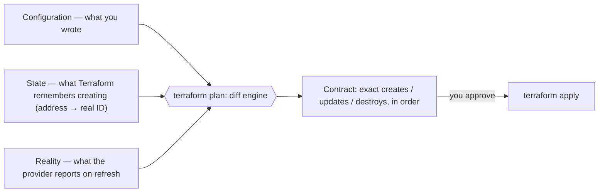

# Terraform Study Guide

A depth-first guide to Terraform for engineers who want to run real infrastructure with it — not just demo a VM into existence, but operate shared state safely, review plans like migrations, refactor without destroying production, and know when Terraform is the wrong tool. It assumes you can use a terminal and have touched at least one cloud console, but not that you've ever written HCL or understand why everyone is so paranoid about a JSON file called `terraform.tfstate`.

The thesis, and the throughline for everything below: **Terraform is a graph builder and a diff engine, and state is the source of record that makes the diff possible.** You describe desired infrastructure as a set of declarative blocks; Terraform builds a dependency graph from the references between them, asks provider plugins to translate each node into real API calls, and computes a diff between three things — what you wrote, what it remembers creating (state), and what actually exists (the refreshed view). The plan is that diff, presented as a contract: *if you approve this, here is exactly what I will create, change, and destroy.* Nearly every Terraform concept — backends, locking, workspaces, `moved` blocks, `for_each` keys, drift, the danger of hand-editing state — is a consequence of protecting that contract. Internalize the graph-and-diff model and Terraform stops being a pile of commands and becomes one coherent system.

This guide tracks modern Terraform 1.x. As of April 2026, HashiCorp's docs list **Terraform v1.14.x as the latest stable line** (v1.15.x in beta); features that arrived mid-1.x are flagged inline (e.g., `import` blocks in 1.5, `terraform test` GA in 1.6, `removed` blocks in 1.7, ephemeral values in 1.10), because you will absolutely encounter repos pinned to older versions. Everything here also applies to [OpenTofu](https://opentofu.org/), the open-source fork, except where noted in [Part 15](#part-15--the-landscape-opentofu-terragrunt--alternatives).

Primary references: the official [Terraform Language docs](https://developer.hashicorp.com/terraform/language) and [CLI docs](https://developer.hashicorp.com/terraform/cli) (the canonical textbook — Terraform core is smaller than people think, and these are genuinely readable), the [Terraform Registry](https://registry.terraform.io/) (where provider docs live — most day-to-day Terraform work is provider-docs literacy), Yevgeniy Brikman's [*Terraform: Up & Running*](https://www.terraformupandrunning.com/) (3rd ed., the best book-length treatment, especially on state, environments, and testing), the [Gruntwork blog's Comprehensive Guide to Terraform](https://blog.gruntwork.io/a-comprehensive-guide-to-terraform-b3d32832baca) (the classic series behind the book), and the [OpenTofu docs](https://opentofu.org/docs/) for the fork's divergences.

---

## Table of Contents

1. [Part 1 — The Mental Model: A Graph Builder and a Diff Engine](#part-1--the-mental-model-a-graph-builder-and-a-diff-engine)
2. [Part 2 — The Core Workflow: init, plan, apply](#part-2--the-core-workflow-init-plan-apply)
3. [Part 3 — The Language: HCL](#part-3--the-language-hcl)
4. [Part 4 — Repetition & Lifecycle: the Meta-arguments](#part-4--repetition--lifecycle-the-meta-arguments)
5. [Part 5 — State: The Source of Record](#part-5--state-the-source-of-record)
6. [Part 6 — Backends, Locking & Remote State](#part-6--backends-locking--remote-state)
7. [Part 7 — Environments: Workspaces vs Directories vs Branches](#part-7--environments-workspaces-vs-directories-vs-branches)
8. [Part 8 — Providers in Depth](#part-8--providers-in-depth)
9. [Part 9 — Modules & Reusable Architecture](#part-9--modules--reusable-architecture)
10. [Part 10 — Refactoring & Brownfield Adoption: import, moved, removed](#part-10--refactoring--brownfield-adoption-import-moved-removed)
11. [Part 11 — Validation & Testing](#part-11--validation--testing)
12. [Part 12 — Secrets & Sensitive Data](#part-12--secrets--sensitive-data)
13. [Part 13 — Team Workflows: CI/CD, HCP Terraform & Policy](#part-13--team-workflows-cicd-hcp-terraform--policy)
14. [Part 14 — Operating at Scale: Failure Modes & Production Judgment](#part-14--operating-at-scale-failure-modes--production-judgment)
15. [Part 15 — The Landscape: OpenTofu, Terragrunt & Alternatives](#part-15--the-landscape-opentofu-terragrunt--alternatives)
16. [Part 16 — Version History & A Practical Learning Path](#part-16--version-history--a-practical-learning-path)

---

## Part 1 — The Mental Model: A Graph Builder and a Diff Engine

Before any syntax, get the model right, because the model is what makes plan output, drift, and state surgery comprehensible later.

### Declarative means convergent

Terraform is **declarative**: you describe the end state you want — "an object storage bucket named `acme-logs` with versioning enabled" — and Terraform figures out the steps. This is the opposite of a shell script, which describes steps and hopes the end state follows. The practical consequence is **convergence**: running `terraform apply` twice in a row against an unchanged world should produce zero changes the second time. The script-vs-declaration distinction sounds academic until you've maintained both. A script that creates a bucket fails the second time you run it ("bucket already exists") unless you write the existence check yourself, and the check for every property of every resource, and the deletion logic for things you no longer want. Terraform *is* that existence-check-and-reconcile machinery, generalized over every resource type a provider knows about. The official [Terraform Language overview](https://developer.hashicorp.com/terraform/language) and [core workflow docs](https://developer.hashicorp.com/terraform/cli/run) both open with this framing, and it's worth taking seriously: when convergence breaks — when a re-run shows changes you didn't make — Terraform is telling you something true about the world (drift, a provider default, an unstable expression), not malfunctioning.

### The four layers

Every Terraform run involves four distinct layers, and debugging gets dramatically easier once you habitually ask *which layer owns this problem*:

| Layer | What it does | Where its problems show up |
|---|---|---|
| **Your HCL** | Declares desired resources and the data flow between them | Syntax errors, type errors, bad module interfaces |
| **Terraform core** | Parses config, builds the graph, computes the diff, orchestrates | Plan logic, state handling, cycles, `moved`/`import` mechanics |
| **Provider plugins** | Translate resource schemas into real API calls | "Works in console, fails in Terraform," replace-vs-update surprises, schema changes between versions |
| **The remote API** | The actual cloud/SaaS platform | Rate limits, eventual consistency, permissions, quota |

Terraform core does not know what a VPC is. It knows about blocks, references, and diffs. The **provider** — a separate plugin binary, versioned independently, downloaded by `terraform init` — owns all knowledge of the AWS/Azure/GCP/Cloudflare/Datadog API: which arguments exist, which are required, which force replacement when changed. This is why the [Registry provider docs](https://registry.terraform.io/) matter more to your daily work than Terraform core docs, and why a provider upgrade can change plan behavior without you touching a line of HCL.

### The graph

Terraform builds a **directed acyclic graph (DAG)** of every resource, data source, variable, and output, with edges inferred from *references*. You almost never declare ordering explicitly; you create it by using one resource's attribute in another:

```hcl
resource "aws_vpc" "main" {
  cidr_block = "10.0.0.0/16"
}

resource "aws_subnet" "app" {
  vpc_id     = aws_vpc.main.id   # ← this reference IS the dependency
  cidr_block = "10.0.1.0/24"
}
```

Because `aws_subnet.app` reads `aws_vpc.main.id`, Terraform knows the VPC must exist first — and, just as importantly, that the subnet must be destroyed first when tearing down. Independent branches of the graph are created **in parallel** (10 concurrent operations by default, tunable with `-parallelism`). This is why well-modeled Terraform needs `depends_on` only rarely: if you find yourself writing explicit ordering everywhere, the real problem is usually that a dependency isn't expressed as data flow — a module isn't exporting the output the next layer needs. The [expressions](https://developer.hashicorp.com/terraform/language/expressions) and [meta-arguments](https://developer.hashicorp.com/terraform/language/meta-arguments) docs cover the mechanics; the design instinct — *model dependencies as data, not as ordering hacks* — is the skill.

### The diff: three inputs, one contract

When you run `terraform plan`, Terraform reconciles **three views of the world**:

1. **Configuration** — what you wrote (desired state).
2. **State** — what Terraform remembers creating, including the mapping from config addresses like `aws_subnet.app` to real-world IDs like `subnet-0a1b2c3d` ([Part 5](#part-5--state-the-source-of-record)).
3. **Reality** — what the provider reports when Terraform refreshes each known object against the live API.

The plan is the computed difference, and you should read it as a **contract**: these exact creations, updates, and destructions, in this order, and nothing else. Everything in professional Terraform practice flows from treating the plan that way — saving plans to a file so the thing reviewed is the thing applied, reviewing replacements like schema migrations, refusing to apply a plan you don't understand. A surprising diff is never noise; it's one of the three inputs disagreeing with the others, and your job is to figure out which one and why.



If you remember one thing from Part 1: **Terraform builds a dependency graph from references, asks providers to translate nodes into API calls, and plans by diffing config against state against reality — every confusing behavior you'll ever see is one of those three inputs disagreeing.**

```quiz
Q: What does it mean that Terraform is "declarative means convergent"?
- [x] You describe the end state and Terraform figures out the steps — so `apply` twice against an unchanged world produces zero changes the second time; Terraform *is* the existence-check-and-reconcile machinery a script would make you write by hand
- [ ] It runs the same commands every time regardless of state
- [ ] It only creates resources, never updates them
- [ ] Convergence means it retries failed operations
> When convergence breaks (a re-run shows changes you didn't make), Terraform is telling you something true — drift, a provider default, an unstable expression — not malfunctioning.

Q: How does Terraform know a subnet depends on its VPC, given you never wrote depends_on?
- [x] The reference `aws_vpc.main.id` inside the subnet creates a graph edge — Terraform builds a DAG from references, so dependencies are inferred from data flow; independent branches run in parallel
- [ ] It alphabetizes resources
- [ ] Resources are created in file order
- [ ] depends_on is always required
> Model dependencies as data, not ordering hacks. If you're writing depends_on everywhere, a dependency usually isn't expressed as data flow (a module isn't exporting the output the next layer needs).

Q: A `terraform plan` reconciles three views of the world. Which three, and how should you read the plan?
- [x] Configuration (what you wrote), State (what Terraform remembers creating, mapping addresses to real IDs), and Reality (what the provider reports on refresh) — read the plan as a *contract* of exact changes, and a surprising diff means one of the three disagrees
- [ ] Dev, staging, and prod
- [ ] HCL, JSON, and YAML
- [ ] Past, present, and future state files
> "A surprising diff is never noise" — it's the three inputs disagreeing, and your job is to find which and why. This is why pros save plans to a file so the reviewed plan is the applied plan.
```

---

## Part 2 — The Core Workflow: init, plan, apply

The CLI loop is small enough to learn in an afternoon and deep enough that teams get it wrong for years. This part covers the loop itself plus the project hygiene — layout, formatting, the lock file — that makes the loop boring, which is the goal.

### A conventional project layout

Terraform loads **every `.tf` file in the working directory** as one configuration; file names are purely for humans. That freedom is exactly why the community converged on a convention (codified in HashiCorp's [Style Guide](https://developer.hashicorp.com/terraform/language/style)), and you should start with it rather than inventing your own:

```text
.
├── terraform.tf    # required_version, required_providers
├── providers.tf    # provider configuration (region, auth strategy)
├── backend.tf      # where state lives (Part 6)
├── variables.tf    # input variables — the module's public API
├── locals.tf       # derived names, standard tags, repeated expressions
├── main.tf         # core resources
├── outputs.tf      # what this configuration exposes
└── modules/
    ├── network/
    └── app/
```

Once `main.tf` grows noisy, split by domain — `network.tf`, `compute.tf`, `dns.tf` — but resist scattering a 10-resource config across a dozen files. The test is discoverability: can a reviewer who has never seen this repo find the thing they're looking for on the first guess?

The `terraform` block is the configuration's preamble, and pinning versions here is the cheapest insurance you will ever buy:

```hcl
terraform {
  required_version = "~> 1.14"   # allow 1.14.x patch releases, refuse 1.15

  required_providers {
    aws = {
      source  = "hashicorp/aws"
      version = "~> 6.0"         # allow 6.x minor/patch, refuse 7.0
    }
  }
}
```

The `~>` ("pessimistic") constraint allows rightmost-component upgrades only. Skip the pins and every developer and CI runner silently installs whatever is newest, which works fine right up until a provider major release changes a resource schema and your colleague's plan looks nothing like yours. The [provider requirements docs](https://developer.hashicorp.com/terraform/language/providers/requirements) cover the full constraint syntax.

While you're setting up the repo, write the `.gitignore` *before* the first apply, because the things it excludes are the things that hurt most in Git history:

```gitignore
.terraform/            # provider binaries and module cache — large, regenerable
*.tfstate
*.tfstate.*            # state and its backups: SECRETS — never in Git
crash.log
*.tfplan               # saved plans can embed sensitive values
*.auto.tfvars          # often environment/developer-specific values
# NOT ignored: .terraform.lock.hcl — commit it (see below)
```

The asymmetry to memorize: `.terraform/` and state files never enter version control, while `.terraform.lock.hcl` always does. Teams get this backwards in both directions, and one direction leaks secrets.

### init: prepare the workspace

```bash
terraform init
```

`init` does three jobs: configures the **backend** (where state lives), downloads **provider plugins** into `.terraform/`, and fetches **modules**. Re-run it whenever any of those three change — new provider, changed backend, new module source. It is safe to run repeatedly.

The first `init` also writes **`.terraform.lock.hcl`**, the [dependency lock file](https://developer.hashicorp.com/terraform/language/files/dependency-lock), recording the exact provider versions selected and their checksums. **Commit it.** It is to providers what `package-lock.json` is to npm: the difference between "we all run aws provider 6.4.0, verifiably" and "we all run something compatible-ish." Upgrade deliberately with `terraform init -upgrade`, review the lock-file diff like any dependency bump, and if your team spans macOS and Linux runners, record checksums for all platforms with `terraform providers lock -platform=linux_amd64 -platform=darwin_arm64`. Note what the lock file does *not* cover: module versions. Those are pinned (or not) in each `module` block ([Part 9](#part-9--modules--reusable-architecture)).

### plan: compute and read the contract

```bash
terraform plan                # show the diff
terraform plan -out=tfplan    # save the exact plan as an artifact
```

Plan output uses a small symbol vocabulary worth memorizing, because one of these symbols is much more dangerous than the others:

| Symbol | Meaning |
|---|---|
| `+` | create |
| `-` | destroy |
| `~` | update in place |
| `-/+` | **destroy and recreate** (replacement) |
| `<=` | read (data source deferred to apply time) |

Here is what a plan actually looks like, lightly trimmed, with the parts you must not skim annotated:

```text
Terraform will perform the following actions:

  # aws_db_instance.main must be replaced
-/+ resource "aws_db_instance" "main" {
      ~ address        = "acme-prod.cxyz.eu-west-2.rds.amazonaws.com" -> (known after apply)
      ~ engine_version = "15.4" -> "16.1"
      ~ identifier     = "acme-prod" -> "acme-production" # forces replacement
        instance_class = "db.r6g.large"
        # ... unchanged attributes hidden ...
    }

  # aws_security_group_rule.db_ingress will be updated in-place
  ~ resource "aws_security_group_rule" "db_ingress" {
      ~ cidr_blocks = [
          - "10.0.0.0/16",
          + "10.0.0.0/8",
        ]
    }

Plan: 1 to add, 1 to change, 1 to destroy.
```

Read it the way an operator does. The summary line (`1 to add, 1 to change, 1 to destroy`) is the headline: any nonzero destroy count demands an explanation you can say out loud. The `# forces replacement` annotation tells you *exactly which attribute* caused the `-/+` — here, renaming the identifier means destroying and recreating the database, almost certainly not what the author intended by a "rename." `(known after apply)` marks values that can't exist until the API call returns. And the in-place `~` change widening a CIDR from `/16` to `/8` is the kind of line that's syntactically tiny and semantically a security review. None of this is hidden; plan output is verbose precisely so the information is there. The failure mode is human: scrolling to the summary and typing "yes."

The symbol that causes incidents is `-/+`. Some arguments can't be changed on a live object — you cannot change the availability zone of an existing subnet — so the provider marks the change as *forces replacement*, and Terraform plans a destroy-then-create. A "one-line change" to a database identifier can be a plan to delete the database. The plan tells you, every time, in the `# forces replacement` annotation next to the offending attribute; the operational skill is actually reading it. `lifecycle { create_before_destroy = true }` ([Part 4](#part-4--repetition--lifecycle-the-meta-arguments)) can reorder the replacement when the resource type allows two to coexist.

The `-out=tfplan` form matters for teams: it makes the reviewed plan and the applied plan **the same immutable artifact**. Without it, "plan in the PR, apply after merge" recomputes the diff against a world that may have moved — the thing your reviewer approved is not necessarily the thing that runs. CI systems ([Part 13](#part-13--team-workflows-cicd-hcp-terraform--policy)) are built around this. For machine consumption — policy engines, custom checks — `terraform show -json tfplan` renders the saved plan as JSON ([docs](https://developer.hashicorp.com/terraform/cli/commands/show)).

### apply, destroy, and targeted surgery

```bash
terraform apply tfplan        # execute exactly the saved plan, no re-confirmation
terraform apply               # plan + interactive approval in one step (fine solo)
terraform destroy             # plan the destruction of everything in state
terraform apply -replace=aws_instance.web   # force one resource to be recreated
```

`apply` with a saved plan executes precisely that plan; if the world changed since the plan was created, the apply errors rather than improvising — that's the contract being enforced. `-replace` (which superseded the deprecated `terraform taint`) is for the "this VM is corrupted, rebuild it" case: it plans a targeted destroy-and-create without you touching the config. Practice `destroy` early and on purpose — ephemeral environments and cost hygiene are real parts of the job, and you want your first destroy to be in a sandbox, not an emergency.

After an apply, `terraform output` reads the root module's outputs from state — `terraform output -raw db_endpoint` for scripts, `terraform output -json` for tools — which is how operators and downstream automation consume values without anyone grepping raw state ([output command docs](https://developer.hashicorp.com/terraform/cli/commands/output)).

There is also `-target=ADDRESS`, which restricts a plan/apply to one resource and its dependencies. Treat it as an incident-response tool, not a workflow: routinely targeting subsets means your state no longer converges as a whole, and the [docs](https://developer.hashicorp.com/terraform/cli/commands/plan#target-address) say as much.

### The hygiene pair: fmt and validate

```bash
terraform fmt -recursive   # canonical formatting, no arguments about style
terraform validate         # syntax + internal consistency, no cloud access needed
```

`fmt` ends formatting discussion forever; run it on save and enforce `fmt -check` in CI. `validate` catches what parsing alone can't — references to undeclared variables, wrong types, malformed blocks — without contacting any API, which makes it free to run on every commit. Neither catches semantic problems (that's what plans and tests are for), but together they eliminate the entire bottom tier of review noise. Two commands, near-zero cost, highest signal-to-effort ratio in the toolchain ([fmt docs](https://developer.hashicorp.com/terraform/cli/commands/fmt), [validate docs](https://developer.hashicorp.com/terraform/cli/commands/validate)).

If you remember one thing from Part 2: **pin versions, commit the lock file, and make the reviewed plan and the applied plan the same saved artifact — the workflow is `init → plan -out → review → apply`, and every shortcut you take from it is a place surprises get in.**

```quiz
Q: In a Terraform plan, which symbol "causes incidents," and how does the plan tell you?
- [x] `-/+` (destroy and recreate) — some attributes can't change on a live object, so the provider marks the change as *forces replacement* and Terraform plans a destroy-then-create; the plan prints `# forces replacement` next to the exact attribute, so a "one-line rename" of a database identifier can be a plan to delete the database
- [ ] `~` (update in place), because in-place edits are irreversible
- [ ] `<=` (read), because data sources run arbitrary code
- [ ] `+` (create), because new resources cost money
> The dangerous one is replacement, and the information is never hidden — the `# forces replacement` annotation names the attribute that triggered it, and the summary's destroy count is the headline you must explain out loud. The failure mode is human: scrolling to the summary and typing "yes." Reading the plan is the operational skill; `create_before_destroy` can reorder a replacement when the resource type allows two to coexist.

Q: Why does `terraform plan -out=tfplan` matter for team workflows?
- [ ] It makes the plan run faster
- [x] It saves the exact diff as an immutable artifact, so the reviewed plan and the applied plan are the *same thing* — without it, "plan in the PR, apply after merge" recomputes the diff against a world that may have moved, so what runs isn't necessarily what your reviewer approved
- [ ] It encrypts the plan output
- [ ] It skips the approval step
> `apply tfplan` executes precisely the saved plan and errors if the world changed since — that's the contract being enforced. Without the saved artifact, the apply improvises against current reality, breaking the link between review and execution. CI systems are built around this (and `terraform show -json tfplan` renders it for policy engines).

Q: Which file does Terraform hygiene say to commit, and which must never enter Git?
- [ ] Commit the state file; ignore the lock file
- [ ] Commit both; they're regenerable
- [x] Commit `.terraform.lock.hcl` (the provider dependency lock — like `package-lock.json`); never commit `*.tfstate` (it holds secrets in plaintext) or `.terraform/` (large, regenerable) — teams get this backwards in both directions, and one direction leaks secrets
- [ ] Ignore both; Terraform regenerates them
> The lock file records exact provider versions and checksums, so committing it is the difference between "we all verifiably run aws 6.4.0" and "we all run something compatible-ish." State files contain resource attributes including secrets and so are a credential, never version-controlled. The asymmetry — lock file in, state out — is one of the cheapest correctness wins in the toolchain.
```

---

## Part 3 — The Language: HCL

HCL (HashiCorp Configuration Language) looks like "JSON with less punctuation" for the first hour, and then you discover it has a real expression language — types, conditionals, comprehensions, functions — underneath. The structure is simple: a configuration is a tree of **blocks** (resource, variable, output, module, provider…) containing **arguments** (`name = value`), where values are **expressions**. Mastering Terraform-the-language mostly means mastering expressions, because that's where copy-paste turns into reusable logic. The [language docs](https://developer.hashicorp.com/terraform/language) are the reference for everything in this part.

### Resources and data sources

The `resource` block is the heart of the language — it declares one infrastructure object Terraform should create and manage:

```hcl
resource "aws_s3_bucket" "logs" {
  bucket = "acme-logs-${var.environment}"

  tags = local.standard_tags
}
```

Read the header as *type* + *local name*: `aws_s3_bucket` is the resource type (defined by the AWS provider — the `aws_` prefix tells you which plugin owns it), and `logs` is the name *within this configuration*. Together they form the **resource address** `aws_s3_bucket.logs`, which is how every other part of the system — references, state, plan output, `moved` blocks — identifies this object. The local name never reaches the cloud; renaming it is a refactor with state consequences ([Part 10](#part-10--refactoring--brownfield-adoption-import-moved-removed)), not a cosmetic edit. Which arguments are valid, which are required, and which force replacement live in the [provider's registry docs](https://registry.terraform.io/providers/hashicorp/aws/latest/docs), not Terraform core's.

A `data` block is the read-only sibling: it *looks up* something Terraform does not manage, so you can reference it without owning its lifecycle:

```hcl
data "aws_ami" "ubuntu" {
  most_recent = true
  owners      = ["099720109477"]   # Canonical

  filter {
    name   = "name"
    values = ["ubuntu/images/hvm-ssd/ubuntu-jammy-22.04-amd64-server-*"]
  }
}

resource "aws_instance" "web" {
  ami           = data.aws_ami.ubuntu.id
  instance_type = "t3.micro"
}
```

Data sources are how separately-managed layers connect — look up the VPC the platform team owns, the DNS zone managed in another repo. Use them at the *edges* of a configuration and sparingly: a module that performs ambient lookups against half the platform has hidden dependencies that make plans fragile and debugging archaeological. Also note this `most_recent = true` example is deliberately double-edged — when Canonical publishes a new AMI, your next plan wants to replace the instance. Convenient discovery and plan stability pull against each other; for production, pin the AMI and upgrade deliberately ([data sources docs](https://developer.hashicorp.com/terraform/language/data-sources)).

### Variables: your module's public API

Input variables are not "config knobs"; they are the **typed public interface** of a configuration, and they deserve the same care as a function signature:

```hcl
variable "environment" {
  type        = string
  description = "Deployment environment, used in names and tags."

  validation {
    condition     = contains(["dev", "staging", "prod"], var.environment)
    error_message = "environment must be one of: dev, staging, prod."
  }
}

variable "subnets" {
  type = map(object({
    cidr_block = string
    public     = optional(bool, false)   # optional() with default: Terraform 1.3+
  }))
  description = "Subnets to create, keyed by short name (e.g. \"app\", \"db\")."
}
```

Three habits embedded here are worth making reflexive. **Precise types**: `map(object({...}))` instead of `any` means a consumer who passes the wrong shape gets a clear error at plan time instead of a baffling provider error mid-apply. **`optional()` attributes** (1.3+) let object types grow new fields without breaking every caller. **Validation blocks** turn module assumptions into enforceable, self-documenting contracts — the error message fires before any API is touched. Since Terraform 1.9, validation conditions can reference other variables and data sources, enabling cross-field rules like "if `public` is true, `nat_gateway` must be set" ([variables docs](https://developer.hashicorp.com/terraform/language/values/variables), [validation docs](https://developer.hashicorp.com/terraform/language/validate)).

Values arrive through several channels, with a precedence order you'll eventually need at 2 a.m.: command-line `-var` and `-var-file` (highest), then `*.auto.tfvars` (alphabetical), then `terraform.tfvars`, then `TF_VAR_name` environment variables, then defaults. When a plan uses the "wrong" value and nobody knows why, walk that list top-down.

### Locals and outputs

`locals` name intermediate expressions — computed once, referenced as `local.name`:

```hcl
locals {
  name_prefix = "acme-${var.environment}"

  standard_tags = {
    Environment = var.environment
    ManagedBy   = "terraform"
    Repo        = "github.com/acme/infra"
  }
}
```

This is where naming conventions and tag standards should live: one definition, referenced everywhere, instead of the same string template pasted into forty resources. The failure mode is the opposite one — locals that merely rename a variable (`local.env = var.environment`) add indirection without value. A local should *earn* its existence by computing something ([locals docs](https://developer.hashicorp.com/terraform/language/values/locals)).

Outputs are the return values — the only way a module exposes anything to its caller, and the way a root module exposes values to operators and other systems:

```hcl
output "subnet_ids" {
  value       = { for k, s in aws_subnet.this : k => s.id }
  description = "Map of subnet short-name to subnet ID."
}
```

Export what the next layer actually needs and nothing more. Every output is API surface: dump forty attributes "just in case" and some downstream config will quietly depend on attribute thirty-seven, and your refactor two years later breaks it ([outputs docs](https://developer.hashicorp.com/terraform/language/values/outputs)).

### Expressions: conditionals, for, splat

The expression language is small but does real work. The conditional is the ternary you know:

```hcl
instance_type = var.environment == "prod" ? "m7g.large" : "t4g.small"
```

Fine for small decisions; a code smell at scale. A root module shot through with `var.environment == "prod"` branches is telling you the environments have diverged enough to deserve separate root modules ([Part 7](#part-7--environments-workspaces-vs-directories-vs-branches)).

`for` expressions transform collections, and they are the main tool for reshaping human-friendly input into provider-friendly structures:

```hcl
locals {
  # From map(object) input to just the CIDRs of public subnets:
  public_cidrs = [for k, s in var.subnets : s.cidr_block if s.public]

  # Invert a map; build lookup tables:
  subnet_by_cidr = { for k, s in var.subnets : s.cidr_block => k }
}
```

The square-bracket form yields a list, the curly-brace form a map, and the `if` clause filters. Alongside them, the **splat** shorthand `aws_instance.web[*].id` collapses "the `id` of every instance" without an explicit `for`. One more concept saves you hours of confusion: **known vs unknown values**. An attribute like an instance's IP doesn't exist until the API call returns, so during planning it's the placeholder `(known after apply)`. That's why plans sometimes can't tell you a final value, and why a `count`/`for_each` expression can't depend on an unknown — Terraform must know *how many* instances exist at plan time, even if not every attribute of them ([expressions docs](https://developer.hashicorp.com/terraform/language/expressions)).

### Functions, templates, and the console

Terraform ships a few dozen [built-in functions](https://developer.hashicorp.com/terraform/language/functions); you cannot define your own in HCL (though providers can ship their own functions as of 1.8). Fluency means knowing the small set you'll reach for constantly:

| Function | What you actually use it for |
|---|---|
| `merge()` | combine standard tags with per-resource extras |
| `lookup()`, `try()`, `can()` | read optional map keys / attributes without exploding |
| `coalesce()` | first non-null value — defaulting logic |
| `jsonencode()`, `yamlencode()` | IAM policies, cloud-init, app config — never hand-write escaped JSON in a string |
| `templatefile()` | render a file with variables — user data, config files |
| `flatten()`, `distinct()`, `toset()` | normalize collections before `for_each` |
| `cidrsubnet()`, `cidrhost()` | carve subnets out of a VPC CIDR — essential network math |
| `format()`, `join()`, `split()` | string assembly when interpolation gets ugly |

Two of these deserve a demonstration because they replace genuinely error-prone hand-rolling. `jsonencode` builds valid JSON from HCL structures — the canonical use is IAM policy documents, where a missing quote in a hand-written heredoc costs you twenty minutes:

```hcl
resource "aws_iam_role" "app" {
  name = "${local.name_prefix}-app"

  assume_role_policy = jsonencode({
    Version = "2012-10-17"
    Statement = [{
      Effect    = "Allow"
      Action    = "sts:AssumeRole"
      Principal = { Service = "ec2.amazonaws.com" }
    }]
  })
}
```

And `templatefile` keeps multi-line content (cloud-init, nginx config) out of your HCL entirely. The template file uses the same `${...}` interpolation and `%{ for }` directives as inline strings, but lives where your editor can syntax-highlight it:

```hcl
# main.tf
resource "aws_instance" "web" {
  # ...
  user_data = templatefile("${path.module}/templates/init.sh.tftpl", {
    app_port  = 8080
    upstreams = [for s in aws_instance.app : s.private_ip]
  })
}
```

```bash
# templates/init.sh.tftpl
#!/usr/bin/env bash
systemctl enable app
echo "PORT=${app_port}" >> /etc/app/env
%{ for ip in upstreams ~}
echo "upstream ${ip}" >> /etc/app/upstreams.conf
%{ endfor ~}
```

Note `path.module` — paths in Terraform are relative to the *working directory* by default, which breaks the moment the module is called from somewhere else; `path.module` anchors the path to the module's own location, and forgetting it is the classic "works in dev, file-not-found when consumed as a module" bug. The `~` in `%{ for ... ~}` strips the surrounding newline so the rendered file isn't full of blank lines. For short multi-line strings that don't merit a file, HCL has heredocs — prefer the `<<-EOT` indented form so the closing marker can be indented with your code — but the moment a template needs a loop or exceeds a screenful, it belongs in a `.tftpl` file.

Finally, **`terraform console`** is the REPL nobody tells beginners about: it loads your configuration and state and lets you evaluate any expression interactively, without running a plan:

```text
$ terraform console
> cidrsubnet("10.0.0.0/16", 8, 3)
"10.0.3.0/24"
> [for k, s in var.subnets : k if s.public]
[ "app" ]
> aws_subnet.this["db"].id          # reads from state — real values
"subnet-0a1b2c3d"
> jsonencode({ a = [1, 2] })
"{\"a\":[1,2]}"
```

Subnet math, collection transforms, "what does this resource's attribute actually contain right now" — each of these would otherwise cost you a plan cycle or a temporary `output` block. It's the fastest debugging loop in the toolchain; reach for it before you reach for print-statement-style outputs ([console docs](https://developer.hashicorp.com/terraform/cli/commands/console)).

If you remember one thing from Part 3: **treat variables and outputs as a typed public API with validation as its contract enforcement, and learn the expression language properly — `for` expressions, `jsonencode`, `templatefile`, and the console are the difference between transforming data and copy-pasting it.**

---

## Part 4 — Repetition & Lifecycle: the Meta-arguments

Meta-arguments are arguments Terraform core understands on *any* resource, regardless of provider: `count`, `for_each`, `depends_on`, `provider`, and `lifecycle`. They control how many instances exist, in what order, and how change is handled — which makes this the part of the language with the highest blast-radius-per-line.

### count vs for_each: the identity problem

Both create multiple instances from one block, and the difference between them is one of the most consequential small decisions in Terraform. `count` indexes instances by **position**:

```hcl
resource "aws_subnet" "app" {
  count      = 3
  vpc_id     = aws_vpc.main.id
  cidr_block = cidrsubnet(aws_vpc.main.cidr_block, 8, count.index)
}
# Addresses: aws_subnet.app[0], aws_subnet.app[1], aws_subnet.app[2]
```

`for_each` indexes them by **key**, from a map or set:

```hcl
resource "aws_subnet" "app" {
  for_each   = var.subnets          # the map(object) from Part 3
  vpc_id     = aws_vpc.main.id
  cidr_block = each.value.cidr_block

  tags = merge(local.standard_tags, { Name = "${local.name_prefix}-${each.key}" })
}
# Addresses: aws_subnet.app["app"], aws_subnet.app["db"], ...
```

Here is what breaks with `count`, and why `for_each` is the production default: state identity. Suppose you have three subnets via `count` and you delete the *first* one from your list. Every remaining element shifts down one index — `[1]` becomes `[0]`, `[2]` becomes `[1]` — and Terraform, which tracks instances by address, concludes that subnets 0 and 1 must be *modified to become their neighbors* and subnet 2 destroyed. Depending on which attributes can update in place, your "remove one subnet" plan becomes a cascade of replacements of infrastructure you meant to leave alone. The plan for "delete the first of three" looks like this, and it should horrify you slightly:

```text
  # aws_subnet.app[0] must be replaced   ← was [1], shifted down
-/+ resource "aws_subnet" "app" { ... }

  # aws_subnet.app[1] must be replaced   ← was [2], shifted down
-/+ resource "aws_subnet" "app" { ... }

  # aws_subnet.app[2] will be destroyed
  - resource "aws_subnet" "app" { ... }

Plan: 2 to add, 0 to change, 3 to destroy.
```

You asked to remove one subnet; Terraform plans to destroy three and rebuild two, because positional identity made the survivors look like different objects. With `for_each`, removing the `"db"` key destroys exactly `aws_subnet.app["db"]` and touches nothing else, because the other instances' identities are stable strings, not positions. Reserve `count` for two honest cases: genuinely fungible replicas where index identity is fine, and the boolean-existence idiom — Terraform's standing answer to "make this resource optional":

```hcl
resource "aws_cloudwatch_dashboard" "ops" {
  count = var.create_dashboard ? 1 : 0
  # ...
}

output "dashboard_name" {
  # one() yields the single element, or null if the resource wasn't created —
  # cleaner than the old join("", ...[*]) hacks for maybe-empty lists.
  value = one(aws_cloudwatch_dashboard.ops[*].dashboard_name)
}
```

The wart is visible in the output: a conditional resource is a *list* of zero or one, so every reference must reckon with `[0]`-might-not-exist, which `one()` and splats paper over. It's serviceable, everyone uses it, and it's a reason module interfaces increasingly prefer "pass an object or null" designs over boolean toggles. The Gruntwork series has the classic war-story treatment in [Terraform tips & tricks: loops, if-statements, and gotchas](https://blog.gruntwork.io/terraform-tips-tricks-loops-if-statements-and-gotchas-f739bbae55f9); official docs: [for_each](https://developer.hashicorp.com/terraform/language/meta-arguments/for_each), [count](https://developer.hashicorp.com/terraform/language/meta-arguments/count).

One constraint to internalize early: `for_each` requires a **map or set of strings known at plan time**. Lists must be normalized (`toset()`), and keys cannot be values that don't exist yet ("known after apply"). When you hit that error, the fix is usually to key the collection by something you chose (a name) rather than something the cloud generates (an ID).

### dynamic blocks: repetition for nested blocks

`for_each` repeats whole resources; **`dynamic` blocks** repeat *nested blocks inside* a resource, which some provider schemas demand (security group rules, lifecycle policies, ordered cache behaviors):

```hcl
resource "aws_security_group" "app" {
  name   = "${local.name_prefix}-app"
  vpc_id = aws_vpc.main.id

  dynamic "ingress" {
    for_each = var.ingress_rules    # list(object({ port=number, cidr=string, ... }))
    content {
      from_port   = ingress.value.port
      to_port     = ingress.value.port
      protocol    = "tcp"
      cidr_blocks = [ingress.value.cidr]
    }
  }
}
```

Each element of `var.ingress_rules` becomes one `ingress` block; inside `content`, the iterator is named after the block label. Use this exactly when the *number* of nested blocks must vary with input — and notice the smell if you find yourself nesting dynamics inside dynamics: that usually means your input variable is modeling the provider's schema instead of your team's intent, and a flatter interface would serve everyone better ([dynamic blocks docs](https://developer.hashicorp.com/terraform/language/expressions/dynamic-blocks)).

### lifecycle: negotiating with the diff engine

The `lifecycle` block changes how Terraform handles change itself, which makes it both a downtime-prevention tool and a drift-hiding hazard:

```hcl
resource "aws_launch_template" "app" {
  # ...
  lifecycle {
    create_before_destroy = true
  }
}

resource "aws_db_instance" "main" {
  # ...
  lifecycle {
    prevent_destroy = true
    ignore_changes  = [tags["LastScannedAt"]]   # some other system writes this tag
  }
}
```

Each argument is a different negotiation. **`create_before_destroy`** inverts replacement order — build the new object, then remove the old — turning replacement downtime into a brief overlap, *when* the resource type tolerates two coexisting (name collisions are the classic blocker). **`prevent_destroy`** makes any plan that would destroy the resource fail outright: a tripwire for databases and stateful stores. It guards against config mistakes, not malice — someone can delete the lifecycle block itself — but that two-step requirement is precisely the safety. **`ignore_changes`** tells Terraform to stop diffing specific arguments, which is the correct answer when another system legitimately co-owns an attribute (an autoscaler changing `desired_count`, a tagging bot) and a drift-concealing mistake everywhere else: every ignored attribute is a place your config silently stops describing reality. **`replace_triggered_by`** forces replacement when some *other* resource changes — glue for providers that don't model a relationship Terraform needs to honor. Use all of these sparingly and comment *why*, because each one is an exception to the mental model the next reader carries ([lifecycle docs](https://developer.hashicorp.com/terraform/language/meta-arguments/lifecycle)).

### depends_on: the escape hatch, labeled as such

When a dependency is real but invisible to the graph — an IAM policy attachment must exist before a Lambda can be invoked, but no attribute of one appears in the other — `depends_on` declares it explicitly:

```hcl
resource "aws_lambda_function" "etl" {
  # ...
  depends_on = [aws_iam_role_policy_attachment.etl]   # ordering with no data flow
}
```

This is correct usage: a genuine ordering requirement the API enforces but the schema doesn't express. What's *not* correct is reaching for `depends_on` because a plan failed once and explicit ordering felt safer — overuse makes the graph coarser (Terraform must be conservative about everything downstream), serializes work that could parallelize, and obscures the actual data flow from reviewers. Rule of thumb: every `depends_on` deserves a comment explaining the hidden dependency; if you can't write the comment, you probably want a reference instead.

If you remember one thing from Part 4: **prefer `for_each` over `count` because instances keyed by stable names survive refactoring while positional indexes cascade — and treat every `lifecycle` argument and `depends_on` as a documented exception to the model, not a habit.**

```quiz
Q: Why prefer for_each over count for creating multiple resources?
- [x] for_each keys instances by stable names (a map/set), so adding or removing one doesn't disturb the others; count uses positional indexes, so removing the middle item re-indexes everything after it, cascading into destroy-and-recreate
- [ ] for_each is faster
- [ ] count can't create more than 10 resources
- [ ] for_each works without state
> The classic count footgun: delete users[1] from a list of 5 and Terraform recreates users[2..4] because their addresses shifted. for_each addresses by key, so identity survives refactoring. Use count only for genuinely positional/toggle cases.

Q: How should you treat lifecycle arguments like prevent_destroy or ignore_changes, and depends_on?
- [x] As documented exceptions to the model, not habits — each one overrides Terraform's normal reconciliation, so it deserves a comment explaining why; reaching for them routinely usually means a dependency should be expressed as data flow instead
- [ ] As best-practice defaults on every resource
- [ ] As performance optimizations
- [ ] As required for production
> ignore_changes papers over drift; depends_on forces ordering the graph should infer. They're valid tools for real edge cases (a field a separate system mutates, a hidden API dependency) but each is a deviation to justify.
```

---

## Part 5 — State: The Source of Record

State is the concept that separates people who use Terraform from people who operate it. Everything dangerous, everything teams argue about, and most of what's genuinely clever in Terraform routes through this one artifact.

### Why state must exist

A recurring beginner question: "the cloud knows what exists — why does Terraform keep its own records?" Because three problems are unsolvable without it. **Mapping**: your config says `aws_subnet.app["db"]`; the cloud has `subnet-0a1b2c3d` among ten thousand others, some Terraform-managed, some not, possibly identically tagged. Something must record *this address corresponds to that object* — that mapping is the core of state, and without it Terraform cannot update, replace, or destroy the *correct* object later. **Deletion**: when you remove a resource block from config, the desired world no longer mentions it — only state remembers it existed and must now be destroyed. A stateless tool literally cannot know what to delete. **Performance and metadata**: state caches attribute values and dependency order, so Terraform doesn't have to enumerate an entire cloud account to plan, and knows the correct destroy order even after you've deleted the config that expressed it ([state docs](https://developer.hashicorp.com/terraform/language/state)).

The artifact itself is JSON — by default a local file `terraform.tfstate`. Peek inside one (a sandbox one) and the model snaps into focus:

```json
{
  "version": 4,
  "serial": 19,
  "lineage": "3f8a...-...",
  "resources": [
    {
      "type": "aws_subnet",
      "name": "app",
      "instances": [
        {
          "index_key": "db",
          "attributes": {
            "id": "subnet-0a1b2c3d",
            "cidr_block": "10.0.2.0/24",
            "vpc_id": "vpc-0fe1..."
          },
          "dependencies": ["aws_vpc.main"]
        }
      ]
    }
  ]
}
```

There it all is: address → real ID, cached attributes, recorded dependencies, plus a `serial` (monotonic version counter) and `lineage` (a unique ID for this state's ancestry, which lets Terraform refuse to overwrite state with an unrelated one). Two operational truths follow immediately from looking at this file. First, **state contains every attribute value** — including database passwords and private keys if any resource has them — so state is a secret and must be stored and access-controlled like one ([Part 12](#part-12--secrets--sensitive-data)). Second, it's "just JSON," and the temptation to fix problems by editing it is exactly how people convert a confusing afternoon into an irrecoverable one. **Never hand-edit state.** Every legitimate state operation has a command or a declarative block.

### Refresh and drift

Before computing a diff, Terraform **refreshes**: it asks the provider for the current real attributes of every object in state. When reality has changed out from under the recorded values — someone clicked something in a console, an autoscaler scaled, a security team script retagged everything — that's **drift**, and it surfaces as plan changes you didn't author. The crucial reframing: *drift is information, not malfunction*. Terraform is reporting, accurately, that the live world and your declared world disagree, and you have a decision to make — revert reality to match config (apply), or codify reality into config (edit, then apply produces no changes). To see drift without risking changes, use:

```bash
terraform plan -refresh-only    # show what changed in reality; optionally update state to match
```

A `-refresh-only` apply updates *state only* — it never touches infrastructure — making it the safe way to acknowledge out-of-band changes. The legacy `terraform refresh` command does the same without preview and is best avoided.

### The state command family

For inspection and (occasionally) surgery, the [`terraform state` subcommands](https://developer.hashicorp.com/terraform/cli/commands/state):

```bash
terraform state list                       # every address in state
terraform state show aws_subnet.app[\"db\"]  # full recorded attributes of one resource
terraform state mv  aws_instance.a aws_instance.b   # re-address without touching infra
terraform state rm  aws_instance.legacy    # forget (NOT destroy) an object
terraform state pull > backup.tfstate      # snapshot remote state locally
```

`list` and `show` are everyday read-only tools, and their output is exactly what you'd expect from the state anatomy above:

```text
$ terraform state list
aws_vpc.main
aws_subnet.app["app"]
aws_subnet.app["db"]
module.database.aws_db_instance.main

$ terraform state show 'aws_subnet.app["db"]'
# aws_subnet.app["db"]:
resource "aws_subnet" "app" {
    cidr_block = "10.0.2.0/24"
    id         = "subnet-0a1b2c3d"
    vpc_id     = "vpc-0fe1..."
    ...
}
```

Note the quoting — bracketed, quoted instance keys collide with shell syntax, and single-quoting the whole address is the habit that avoids twenty minutes of escaping confusion. `state list` is also your inventory tool when joining an unfamiliar codebase: it answers "what does this root actually manage?" faster than reading the HCL. `mv` and `rm` mutate the mapping itself and should make you slightly nervous: `state mv` re-labels which address owns a real object; `state rm` makes Terraform forget an object exists (the object lives on, unmanaged — and if the config block remains, the next plan wants to *create a duplicate*). Both have declarative successors — `moved` and `removed` blocks ([Part 10](#part-10--refactoring--brownfield-adoption-import-moved-removed)) — which are better for the same reason config is better than clicking: they're reviewable in a PR and repeatable across every workspace. Use the imperative commands for one-off repairs; use the blocks for refactors. And before any state surgery whatsoever: `terraform state pull > backup.tfstate`.

If you remember one thing from Part 5: **state is the authoritative mapping from config addresses to real-world object IDs — Terraform cannot update, destroy, or even notice anything without it, it contains your secrets in plaintext, and every safe way to change it is a command or block, never a text editor.**

```quiz
Q: What is Terraform state, and why can't Terraform work without it?
- [x] The authoritative mapping from config addresses (aws_subnet.app) to real-world IDs (subnet-0a1b2c3d) — without it Terraform can't update, destroy, or even notice an existing object, because it wouldn't know which real resource a config block refers to
- [ ] A cache that speeds up plans but is optional
- [ ] A log of past applies
- [ ] A copy of your HCL files
> Lose the state-to-reality mapping and Terraform would try to recreate everything (it sees config but no record of what it made). State is the source of record, which is why every mutation goes through a command or block.

Q: Why must you never edit the state file with a text editor?
- [x] State is structured and consistency-critical; safe changes go through commands (state mv, import, rm) or blocks (moved, import, removed) that keep it valid — and it contains secrets in plaintext, so it's also a credential to protect
- [ ] The file is encrypted and unreadable
- [ ] Editing it is fine if you reformat the JSON
- [ ] Text editors corrupt the checksums only
> Hand-editing risks an inconsistent state that breaks every future plan. Because state holds secrets (resource attributes like passwords) in cleartext, access to state is access to those secrets — control it like production credentials.
```

---

## Part 6 — Backends, Locking & Remote State

Local state is fine for exactly one situation: a single human learning Terraform on a laptop. The moment a second person — or a CI pipeline, which is a very fast second person — needs to run plans, three problems appear at once: the state file isn't *shared*, isn't *locked*, and isn't *safe* (it's a plaintext secrets file sitting in a working directory, one `git add .` away from history). Backends solve all three.

### What a backend is

A **backend** determines where state is stored and how operations coordinate around it. It's declared in the `terraform` block, and changing it is an `init`-level event (Terraform will offer to migrate existing state). The workhorse outside HCP Terraform is the S3 backend:

```hcl
terraform {
  backend "s3" {
    bucket       = "acme-terraform-state"
    key          = "network/prod/terraform.tfstate"   # path within the bucket — one per root module
    region       = "eu-west-2"
    encrypt      = true
    use_lockfile = true   # S3-native locking — GA in Terraform 1.11
  }
}
```

Every line is doing load-bearing work. The `key` is the namespacing scheme for your whole organization — one state object per root-module-per-environment, and a naming convention (`<layer>/<env>/terraform.tfstate`) you'll live with for years. `encrypt` enables server-side encryption, which you want because of what Part 5 said state contains. And `use_lockfile` is the locking story: for years S3 locking required a companion DynamoDB table (`dynamodb_table = "..."`, still supported but deprecated); Terraform 1.10 introduced — and 1.11 stabilized — native locking via S3 conditional writes, eliminating the extra moving part. The bucket itself should have versioning enabled, which gives you state history and a recovery path for free.

One bootstrapping wrinkle worth knowing: backend blocks **cannot contain variables or expressions** — they're read before the language is fully evaluated. Teams handle this with partial configuration (`terraform init -backend-config=prod.s3.tfbackend`) or with wrapper tooling like Terragrunt ([Part 15](#part-15--the-landscape-opentofu-terragrunt--alternatives)). And the state bucket itself is a chicken-and-egg resource — most teams create it once by hand or in a tiny bootstrap config with local state, and never touch it again.

### Migrating between backends

Backend changes are routine over a codebase's life — local to S3 when a project graduates from laptop to team, S3 to HCP Terraform if you adopt it, bucket-to-bucket during account restructures — and Terraform makes them a guided operation rather than a manual copy:

```bash
# 1. Edit the backend block to point at the new location, then:
terraform init -migrate-state
# Terraform: "Do you want to copy existing state to the new backend?" → yes

# The other flag, for when the backend LOCATION is the same but its
# config changed (new credentials profile, renamed parameter):
terraform init -reconfigure   # re-init WITHOUT touching/copying state
```

The two flags answer opposite questions and confusing them is the classic mistake: `-migrate-state` means "the state should *move* to where the config now points"; `-reconfigure` means "the config text changed but the state is already where it belongs — don't copy anything." Before any migration, take the same precaution as before state surgery (`terraform state pull > backup.tfstate`), and afterward run `terraform plan` expecting **no changes** — the no-op plan is your proof the move carried everything. The lineage and serial fields from Part 5 protect you here too: Terraform will warn loudly if you attempt to overwrite a state with an unrelated lineage, which usually means you pointed two different root modules at the same backend `key` — a misconfiguration worth catching at the warning stage rather than the incident stage.

### Why locking is non-negotiable

Imagine two applies running concurrently against the same state — you and CI, or two pipelines triggered seconds apart. Both read state at serial 19, both mutate infrastructure, both write back serial 20. The second write silently discards the first's record: now an object exists in the cloud that no state remembers (an orphan you'll find on a billing report), or worse, both runs tried to create the "missing" resource and one crashed mid-flight. **Locking** prevents the entire class: the first operation takes a lock, the second fails fast with "state locked by <who>, at <when>" instead of corrupting the shared record. You'll occasionally need `terraform force-unlock <LOCK_ID>` after a crashed run holds a stale lock — read the holder info first and make very sure the other run is actually dead, because force-unlocking a *live* run recreates exactly the race the lock exists to prevent ([state locking docs](https://developer.hashicorp.com/terraform/language/state/locking)).

### Choosing a backend

| Backend | Locking | Notes |
|---|---|---|
| `local` (default) | file-level only | learning and throwaway sandboxes; not for teams |
| `s3` | native (1.11+) or DynamoDB | the de facto standard on AWS; versioned bucket = state history |
| `azurerm` | blob lease | Azure-native equivalent; locking built in |
| `gcs` | native | GCS object versioning + built-in locking |
| HCP Terraform / `remote` | built-in | state + remote execution + RBAC + run history in one ([docs](https://developer.hashicorp.com/terraform/cloud-docs)) |
| `http` and others | varies | escape hatch for custom state services (GitLab uses this) |

The honest trade-off summary: an object-store backend (S3/GCS/azurerm) gives you everything you *need* — durability, encryption, versioning, locking — and you keep full control and zero per-run cost; HCP Terraform additionally gives you things you eventually *want* — remote execution, access control on state that's separate from cloud credentials, audit history, policy hooks — at the price of a SaaS dependency and its pricing model. HashiCorp's docs steer firmly toward HCP Terraform; understand that recommendation as both technically reasonable and commercially motivated, and decide on your own requirements. Gruntwork's [How to manage Terraform state](https://blog.gruntwork.io/how-to-manage-terraform-state-28f5697e68fa) remains the classic walkthrough of the trade-offs.

### Reading another root's state — carefully

Once state lives in a shared backend, one root module can read another's outputs via the `terraform_remote_state` data source:

```hcl
data "terraform_remote_state" "network" {
  backend = "s3"
  config = {
    bucket = "acme-terraform-state"
    key    = "network/prod/terraform.tfstate"
    region = "eu-west-2"
  }
}

# Then: data.terraform_remote_state.network.outputs.subnet_ids
```

It works, and it creates the tightest possible coupling between roots — the consumer can read *all* outputs and needs *read access to the entire state file*, secrets included. A looser pattern that scales better: have the producing root publish the handful of values consumers need into a parameter store (SSM, Consul, even tagged resources found via plain data sources), so consumers depend on a published interface rather than on another team's state file. Treat `terraform_remote_state` as acceptable within a team, suspicious across teams.

If you remember one thing from Part 6: **shared infrastructure needs remote, encrypted, versioned, locked state — a correctly configured S3/GCS/azurerm backend is table stakes, locking is what stands between you and two concurrent applies corrupting the source of record, and access to state is access to its secrets.**

```quiz
Q: Why does shared infrastructure need a remote backend with locking, not local state?
- [x] State locking prevents two concurrent applies from corrupting the source of record — without it, two people running apply simultaneously can interleave writes and produce inconsistent state; remote backends also make state shared, encrypted, and versioned
- [ ] Remote backends are faster
- [ ] Local state can't store secrets
- [ ] It's only needed for compliance
> Local state on one laptop can't be shared or locked. A correctly configured S3/GCS/azurerm backend is table stakes for teams: locking serializes applies, versioning enables recovery, encryption protects the plaintext secrets, and shared access lets the team collaborate on one source of record.
```

---

## Part 7 — Environments: Workspaces vs Directories vs Branches

Every team hits this question within the first month: we have dev, staging, and prod — how do we structure the code? There are three common answers, one of which is a trap, and the right choice depends on a single question: *how much do your environments actually differ?*

### Option 1: CLI workspaces

```bash
terraform workspace new staging
terraform workspace select staging
terraform apply        # same config, separate state
```

A [CLI workspace](https://developer.hashicorp.com/terraform/cli/commands/workspace) is **a named, parallel state file for the same configuration** — nothing more. Same code, same backend, same provider config; only the state (and therefore the set of real objects) differs. With the S3 backend, workspace states land under an `env:/` prefix in the same bucket, which tells you everything about how thin the isolation is. Inside the config, `terraform.workspace` exposes the current name, which people immediately use to fork behavior:

```hcl
locals {
  instance_type = terraform.workspace == "default" ? "m7g.large" : "t4g.micro"
  name_prefix   = "app-${terraform.workspace}"
}
```

This works, and it's also the first step down the conditional-spaghetti path — note that the environment's *identity* now lives in a CLI side-channel rather than in any reviewable file. Workspaces are genuinely good for *ephemeral copies of the same thing*: a feature-branch test stack, a per-developer sandbox, spun up and destroyed within days.

As your *only* environment mechanism, they're a trap, for reasons that compound. The current workspace is invisible ambient state — nothing in the code or the directory tells you whether your next `apply` hits dev or prod; you're one forgotten `workspace select` from a production incident. All workspaces share one backend and usually one set of credentials, so "dev access" and "prod access" can't be separated at the storage or IAM layer. And because the code is shared, environments can only differ through variables and conditionals, which drags you toward `var.environment == "prod"` spaghetti. Even HashiCorp's docs caution that CLI workspaces are not a complete environment-isolation mechanism. (Confusingly, **HCP Terraform "workspaces" are a different, much heavier concept** — a managed unit of config + variables + state + run history, closer to "one root module deployment." Don't let the shared name fool you; see [Part 13](#part-13--team-workflows-cicd-hcp-terraform--policy).)

### Option 2: a directory per environment

The production-grade default. Each environment is its own root module — its own directory, backend key, variable values, and plan/apply lifecycle — composing shared modules:

```text
live/
├── dev/
│   ├── backend.tf      # key = "app/dev/terraform.tfstate"
│   ├── main.tf         # module "app" { source = "../../modules/app", instances = 1, ... }
│   └── terraform.tfvars
├── staging/
└── prod/
    ├── backend.tf      # key = "app/prod/terraform.tfstate" — different bucket/account if you like
    ├── main.tf         # module "app" { source = "../../modules/app", instances = 6, ... }
    └── terraform.tfvars
modules/
└── app/
```

Everything the workspace approach obscures becomes explicit: *where you are* is the directory you're standing in; prod state can live in a different bucket in a different account behind different credentials; environments can diverge in topology (prod has read replicas and a WAF, dev doesn't) by simply writing different composition in each root, rather than threading conditionals through shared code. The cost is repetition — each root repeats backend and provider boilerplate — which is precisely the problem Terragrunt was built to DRY up ([Part 15](#part-15--the-landscape-opentofu-terragrunt--alternatives)), and which plain Terraform teams accept as a tolerable tax for explicitness. This layout is the one *Terraform: Up & Running* and most platform teams converge on.

### Option 3: a branch per environment — don't

It looks symmetrical with application Git-flow: `dev` branch deploys dev, `main` deploys prod, promote by merging. In practice it fights both Git and Terraform. Long-lived environment branches drift apart precisely where they must not (provider versions, module versions, hotfixes applied to one branch), merges between them are where subtle production-only differences hide, and at any moment it's genuinely hard to answer "what is deployed to prod?" because the answer is "whatever the last apply of some commit on that branch did." Infrastructure code wants **one trunk** describing all environments, with environment differences expressed in *files you can see side by side* (option 2), not in branch deltas you have to diff. Promote changes by editing the staging directory, then the prod directory — reviewable, explicit, no merge archaeology.

### The comparison

| | CLI workspaces | Directory per env | Branch per env |
|---|---|---|---|
| State isolation | separate files, same backend | fully separate, can differ per env | same as directories, but obscured |
| Credential/blast-radius isolation | weak (shared backend & auth) | strong (per-env accounts possible) | possible but tangled |
| Environments can diverge structurally | painfully (conditionals) | naturally (different composition) | via branch drift (the bad way) |
| "Where am I pointing?" | invisible ambient state | the directory you're in | the branch you're on |
| Best for | ephemeral copies, sandboxes | real environments | (nothing — avoid) |

If you remember one thing from Part 7: **use directories for environments and workspaces for ephemera — real environments deserve explicit roots with their own state, credentials, and visible differences, because the most expensive Terraform mistakes start with "I thought I was pointed at dev."**

```quiz
Q: Terraform CLI workspaces are good for one thing and a trap as another. Which is which?
- [x] Good for *ephemeral copies of the same config* (a feature-branch stack, a per-developer sandbox); a trap as your *only* environment mechanism — the current workspace is invisible ambient state (one forgotten `workspace select` from a prod incident), all workspaces share one backend and credentials, and divergence forces `var.environment == "prod"` conditional spaghetti
- [ ] Good for prod/staging isolation; a trap for sandboxes
- [ ] Good for storing secrets; a trap for storing state
- [ ] They're equivalent to directories in every way
> A CLI workspace is just a named parallel state file for the same configuration — same code, same backend, same auth. That thin isolation is fine for throwaway copies but dangerous as the dev/staging/prod boundary, because nothing in the code or directory tells you which one your next apply hits. (Note: HCP Terraform "workspaces" are a different, much heavier concept — don't conflate them.)

Q: Why is "a branch per environment" (dev branch → dev, main → prod) the trap to avoid?
- [ ] Git can't deploy from multiple branches
- [x] Long-lived environment branches drift apart exactly where they must not (provider/module versions, hotfixes), merges hide production-only differences, and "what's deployed to prod?" becomes hard to answer — infrastructure wants one trunk with environment differences in files you can diff side by side, not branch deltas
- [ ] Branches can't have separate state files
- [ ] It requires Terragrunt to work
> It looks symmetrical with app Git-flow but fights both Git and Terraform. The production-grade default is a directory per environment: each is its own root module with its own backend key, variables, and lifecycle, composing shared modules — so *where you are* is the directory you're standing in, prod state can live in a different account, and environments diverge by writing different composition rather than threading conditionals through shared code.

Q: With the directory-per-environment layout, how can prod and dev differ in *topology* (prod has read replicas and a WAF; dev doesn't)?
- [ ] Only by setting `terraform.workspace` conditionals
- [ ] They can't; shared modules force identical topology
- [x] Each environment is its own root module, so you write different composition in each root (different module calls, different counts) rather than threading `var.environment == "prod"` conditionals through shared code — the explicitness is the point
- [ ] By maintaining separate Git branches that drift
> The directory layout makes everything the workspace approach obscures explicit: state can live in a different bucket/account, and structural divergence is just different HCL in each root. The cost is repetition (each root repeats backend/provider boilerplate), the tax plain-Terraform teams accept for explicitness and which Terragrunt exists to DRY up. The asymmetry favors it: visible, reviewable differences beat invisible ambient state.
```

---

## Part 8 — Providers in Depth

Providers are where Terraform's abstraction meets reality, and most "Terraform problems" in a working team are actually provider problems — version skew, auth context, schema changes, API behavior. This part is short but disproportionately useful.

### What a provider actually is

A provider is a **separate plugin binary** speaking a gRPC protocol to Terraform core. It ships a *schema* (resource types, their arguments, which changes force replacement) and the *CRUD logic* mapping each resource to API calls. `terraform init` downloads providers from a registry based on the `required_providers` block you saw in Part 2; the source address `hashicorp/aws` is shorthand for `registry.terraform.io/hashicorp/aws`. Because the provider owns the schema, **a provider upgrade can change plan behavior with zero HCL changes** — new defaults, deprecated arguments, attributes that now force replacement. That's the entire case for `~>` version constraints plus the committed lock file: provider upgrades should be deliberate events with reviewable diffs, never ambient drift between one developer's laptop and CI ([provider requirements docs](https://developer.hashicorp.com/terraform/language/providers/requirements)).

The `provider` block configures the plugin — region, auth strategy, default tags:

```hcl
provider "aws" {
  region = "eu-west-2"

  default_tags {            # AWS-provider feature: tags applied to everything
    tags = local.standard_tags
  }
  # Note what is NOT here: no access keys. Credentials come from the
  # environment — SSO session, instance role, OIDC in CI — never from HCL.
}
```

Keep credentials out of configuration entirely; provider auth should be inherited from the execution context, which also means "who can apply this" is controlled where it belongs (IAM/CI), not in a file. A surprisingly large share of "Terraform is broken" reports are simply the provider authenticating as someone other than who the operator assumed — when a provider call fails with permissions errors, your first question is *which identity is this run actually using?*

### Aliases: multi-region and multi-account

One configuration often must talk to several regions or accounts. **Provider aliases** create multiple configured instances of the same plugin, and resources choose one with the `provider` meta-argument:

```hcl
provider "aws" {
  region = "eu-west-2"
}

provider "aws" {
  alias  = "us"
  region = "us-east-1"      # CloudFront certificates must live here, e.g.
}

resource "aws_acm_certificate" "cdn" {
  provider    = aws.us       # explicit: this resource goes to us-east-1
  domain_name = "cdn.acme.example"
  # ...
}
```

Modules complicate this pleasantly: by default a child module inherits the caller's default providers, but multi-region modules should declare the providers they require and have the caller pass them explicitly:

```hcl
# Inside modules/replicated_bucket/terraform.tf — declare what this module needs:
terraform {
  required_providers {
    aws = {
      source                = "hashicorp/aws"
      configuration_aliases = [aws.primary, aws.replica]
    }
  }
}

# In the caller — wire concrete provider configs to the module's named slots:
module "assets" {
  source = "../../modules/replicated_bucket"
  providers = {
    aws.primary = aws        # the default eu-west-2 config
    aws.replica = aws.us     # the aliased us-east-1 config
  }
  # ...
}
```

The explicitness is the feature: a reviewer can see exactly which account/region every module instance targets, instead of discovering it from behavior. The anti-pattern this prevents is the module that configures its own `provider "aws" { region = "us-east-1" }` block internally — legal-looking, but it breaks `for_each` on the module, complicates destroys, and hides a region decision where no reviewer will look ([provider configuration docs](https://developer.hashicorp.com/terraform/language/providers/configuration)).

If you remember one thing from Part 8: **providers are independently versioned plugins that own all real-world knowledge — pin them, lock them, let credentials come from the execution context, and make multi-region/multi-account wiring explicit with aliases passed into modules.**

---

## Part 9 — Modules & Reusable Architecture

Modules are Terraform's only abstraction mechanism — its functions, in the software sense: a parameterized, reusable unit with typed inputs (variables), return values (outputs), and an implementation (resources) the caller doesn't see. Every working directory you've built so far *is* a module (the **root module**); the step up is composing **child modules** deliberately.

### Calling a module

```hcl
module "network" {
  source  = "terraform-aws-modules/vpc/aws"   # registry module
  version = "~> 5.8"                          # ALWAYS pin remote modules

  name            = local.name_prefix
  cidr            = "10.0.0.0/16"
  azs             = ["eu-west-2a", "eu-west-2b", "eu-west-2c"]
  private_subnets = ["10.0.1.0/24", "10.0.2.0/24", "10.0.3.0/24"]
}

module "app" {
  source     = "../../modules/app"            # local module — versioned with the repo
  subnet_ids = module.network.private_subnets # outputs wire modules together
  # ...
}
```

The `source` argument accepts local paths, [registry addresses](https://registry.terraform.io/browse/modules), and Git URLs (`git::https://github.com/acme/terraform-modules.git//app?ref=v1.4.0`). The rule that saves future-you: **every remote module gets a pinned version** — `version` for registry modules, a `ref` tag for Git. Remember from Part 2 that the lock file does *not* cover modules; an unpinned module source means every `init` can silently pull different code into production roots. Local-path modules need no pin because they version with the repo — which is also their limitation, since separate repos/registries are what let two teams consume different module versions at their own pace ([modules docs](https://developer.hashicorp.com/terraform/language/modules), [module block reference](https://developer.hashicorp.com/terraform/language/block/module)).

Note also how `module.network.private_subnets` feeds `module.app` — module outputs are how composition happens, and those references create graph edges exactly like resource references do. And modules participate in `for_each` themselves, which is the clean pattern when the *module* is the repeated unit:

```hcl
module "service" {
  source   = "../../modules/service"
  for_each = var.services          # map of service-name => settings object

  name   = each.key
  cpu    = each.value.cpu
  memory = each.value.memory
}
```

### Anatomy of a small module

Here is a complete (if minimal) child module — `modules/static_site/` — showing how the pieces you already know arrange themselves into an interface, an implementation, and return values:

```hcl
# modules/static_site/variables.tf — the public API
variable "name" {
  type        = string
  description = "Site name; used for the bucket and all tags."

  validation {
    condition     = can(regex("^[a-z0-9-]{3,40}$", var.name))
    error_message = "name must be 3-40 chars of lowercase letters, digits, and hyphens."
  }
}

variable "tags" {
  type        = map(string)
  description = "Extra tags merged onto module defaults."
  default     = {}
}
```

```hcl
# modules/static_site/main.tf — the implementation (callers never see inside)
locals {
  tags = merge({ Module = "static_site", Name = var.name }, var.tags)
}

resource "aws_s3_bucket" "this" {
  bucket = var.name
  tags   = local.tags
}

resource "aws_s3_bucket_website_configuration" "this" {
  bucket = aws_s3_bucket.this.id
  index_document { suffix = "index.html" }
}
```

```hcl
# modules/static_site/outputs.tf — the return values
output "bucket_name" {
  value       = aws_s3_bucket.this.bucket
  description = "Bucket to deploy site content into."
}

output "website_endpoint" {
  value       = aws_s3_bucket_website_configuration.this.website_endpoint
  description = "Public website endpoint, for DNS records."
}
```

Small as it is, every structural convention is visible: the resource is named `this` (idiomatic when a module manages one primary object — the module name already says what it is, so `aws_s3_bucket.site_bucket_for_static_site` would be redundant); validation guards the interface; defaults make optional inputs genuinely optional; tags merge module-standard values with caller extras rather than choosing one; and the outputs are exactly the two values a caller plausibly needs — deploy target and DNS target — not a dump of every attribute. Add a `README.md` documenting inputs and outputs (or generate one with [terraform-docs](https://terraform-docs.io/)) and a `tests/` directory ([Part 11](#part-11--validation--testing)), and this is the complete shape that scales from ten-line modules to the [terraform-aws-modules](https://github.com/terraform-aws-modules) VPC module's thousands.

### What makes a module good

The design rules mirror good API design, because that's what this is. **One coherent purpose**: `network`, `postgres`, `service` — a noun your architecture diagram already has. The kitchen-sink module ("our-entire-platform") is unreusable, untestable, and unreviewable; if a module's variables file needs a table of contents, it's several modules. **A deliberate interface**: every variable typed and described, validation enforcing assumptions ([Part 3](#part-3--the-language-hcl)), outputs limited to what the next layer needs — module interfaces are infrastructure API surface, and breaking changes to a shared module are breaking changes for every consuming team, semver and changelog included. **Portability**: child modules should not configure providers, backends, or credentials — those belong to the root. A module that hardcodes a region or assumes an account is a module that works exactly once. **Composition over cleverness**: when a module grows expression-heavy and conditional-dense trying to serve every caller, the fix is almost always *two simpler modules* rather than more HCL wizardry ([module development docs](https://developer.hashicorp.com/terraform/language/modules/develop), [composition patterns](https://developer.hashicorp.com/terraform/language/modules/develop/composition)).

And one rule about *when*: write the pattern inline twice before extracting a module. Premature abstraction hurts in Terraform exactly as in application code, with the bonus pain that refactoring resources into a module changes their state addresses — fixable with `moved` blocks ([Part 10](#part-10--refactoring--brownfield-adoption-import-moved-removed)), but a cost you shouldn't pay for speculative reuse.

### The shape of a production codebase

Put Parts 7 and 9 together and the standard production architecture emerges: **shared modules underneath, environment roots on top**. Modules encode *how we build a network / database / service* once, with versions; each environment root (`live/prod`, `live/staging`) is a thin assembly layer that picks module versions, supplies environment-specific values, and owns its own state and credentials. Code is reused aggressively; **state is never shared** between environments. Distribution-wise, teams progress through stages as they grow — modules in the same repo, then a dedicated modules repo consumed by Git tag, then a private registry (HCP Terraform ships one; so do GitLab and others) once "infrastructure modules" become a product with consumers, versioning policy, and upgrade notes. *Terraform: Up & Running* dedicates its best chapters to exactly this progression, and the [terraform-aws-modules](https://github.com/terraform-aws-modules) GitHub org is the reference example of mature open-source module design worth reading for style alone.

If you remember one thing from Part 9: **modules are typed functions for infrastructure — single-purpose, deliberately-interfaced, provider-agnostic inside, version-pinned at every remote call site — and production Terraform is thin environment roots composing versioned shared modules, sharing code but never state.**

```quiz
Q: What's the right mental model for a Terraform module, and what does "production Terraform" look like?
- [x] A typed function for infrastructure — single-purpose, with a deliberate input/output interface, version-pinned at every remote call site; production is thin environment roots composing versioned shared modules, sharing *code* but never *state*
- [ ] A copy-paste template you fork per environment
- [ ] A wrapper that hides the provider entirely
- [ ] A state file shared across all environments
> "Share code, not state" is the key discipline: dev and prod call the same versioned module but keep separate state. Pinning the module version at the call site means an upgrade is a deliberate, reviewable bump, not a surprise.

Q: Why pin module versions at every remote call site?
- [x] So a change to the shared module doesn't silently alter every consumer's next plan — the version bump becomes a deliberate, reviewable event, the same reproducibility discipline as pinning provider and Terraform versions
- [ ] To make plans run faster
- [ ] Modules don't work without a version
- [ ] To reduce the module's size
> An unpinned module reference (or a moving branch) means someone else's edit can change your infrastructure on your next apply. Pinning makes upgrades intentional — and the no-changes plan after a bump confirms it was safe.
```

---

## Part 10 — Refactoring & Brownfield Adoption: import, moved, removed

Most real Terraform work is brownfield: infrastructure already exists, or code already exists and needs restructuring without touching the infrastructure it manages. This is the skill set that separates "can write HCL" from "can be trusted with production state," and since Terraform 1.1–1.7 it has first-class, declarative, *plan-reviewable* tooling: `import`, `moved`, and `removed` blocks.

### import: adopting existing infrastructure (1.5+)

The problem: a bucket exists, created by hand in 2019, and you want Terraform to manage it. Creating a matching `resource` block alone is wrong — Terraform doesn't know the block corresponds to the existing bucket, so it plans to *create another one* (or errors on the name collision). You must connect config address to real-world ID, which is precisely a state operation. Since Terraform 1.5, the good way is declarative:

```hcl
import {
  to = aws_s3_bucket.legacy_assets
  id = "acme-assets-2019"           # the provider-specific real-world ID
}

resource "aws_s3_bucket" "legacy_assets" {
  bucket = "acme-assets-2019"
  # ... must match reality, or the next plan shows "changes"
}
```

The next `terraform plan` shows `aws_s3_bucket.legacy_assets will be imported` — reviewable in a PR, applied with everything else, and the block can be deleted once applied. Even better for bulk adoption, Terraform can *write the config for you*: with just the `import` block present, `terraform plan -generate-config-out=generated.tf` asks the provider to render HCL matching the live object. Treat generated config as a first draft — it's exhaustive, flat, and unstyled — but it turns "import 40 resources" from a week into an afternoon. (Since 1.7, `import` blocks support `for_each` for importing collections.) The older imperative `terraform import aws_s3_bucket.legacy_assets acme-assets-2019` still exists and is fine for one-offs; the block form wins for anything a team should review ([import docs](https://developer.hashicorp.com/terraform/language/import)).

The critical mindset: **import success is the beginning, not the end.** Import means "Terraform now knows this object exists at this address." The job is done when `terraform plan` shows *no changes* — config fully matching reality — and every diff between them is one you've consciously decided to either adopt into code or apply onto the object.

### moved: renaming without destroying (1.1+)

State tracks resources by address, so renaming a resource — or moving it into a module — looks to Terraform like *destroy the old address, create the new one*. For a stateless resource that's wasteful; for a database it's catastrophic. The `moved` block tells Terraform the two addresses are the same object:

```hcl
# Was: resource "aws_instance" "web"
# Now: resource "aws_instance" "web_server"   (renamed for clarity)

moved {
  from = aws_instance.web
  to   = aws_instance.web_server
}

# The other classic: resources extracted into a module
moved {
  from = aws_db_instance.main
  to   = module.database.aws_db_instance.main
}
```

The next plan shows the move as a no-op state update, with zero infrastructure changes — and *that plan is your proof the refactor is safe*:

```text
Terraform will perform the following actions:

  # aws_instance.web has moved to aws_instance.web_server
    resource "aws_instance" "web_server" {
        id = "i-0abc123def456"
        # (no changes)
    }

Plan: 0 to add, 0 to change, 0 to destroy.
```

Contrast that with the plan you'd get from a bare rename without the `moved` block — `1 to add, 1 to destroy` — and the value is plain: same code change, opposite blast radius. This covers renames, moves into/out of modules, and `count`→`for_each` migrations (`from = aws_subnet.app[0]`, `to = aws_subnet.app["primary"]`); since 1.8, providers can even support moves between related resource *types*. Compared to its imperative ancestor `terraform state mv`, the block is reviewable, lands atomically with the code change it accompanies, and — decisive for module authors — ships *inside* shared modules, so a module's internal refactor upgrades cleanly for every consumer. Leave `moved` blocks in place as history; module authors especially should never delete them while any consumer might upgrade across the rename ([moved block docs](https://developer.hashicorp.com/terraform/language/block/moved), [refactoring guide](https://developer.hashicorp.com/terraform/language/modules/develop/refactoring)).

### removed: forgetting without destroying (1.7+)

The inverse of import: Terraform should *stop managing* an object that should *keep existing* — ownership is moving to another team, another root module, or another tool. Deleting the resource block alone plans a **destroy**, which is exactly wrong. The `removed` block (1.7+) expresses the real intent:

```hcl
removed {
  from = aws_s3_bucket.handed_off

  lifecycle {
    destroy = false    # forget it in state; leave the real bucket alone
  }
}
```

Delete the `resource` block, add this, and the plan reads `will no longer be managed, but will not be destroyed`. Like `moved`, it's the declarative, reviewable successor to an imperative command (`terraform state rm`), and the same preference applies. The danger it averts is worth spelling out: every Terraform team eventually has a near-miss where "remove this from our repo" almost became "delete this from production" because the person doing it didn't know deletion-from-config means destruction-of-object ([removed block docs](https://developer.hashicorp.com/terraform/language/block/removed)).

### The refactoring discipline

Whatever the operation, the procedure is the same, and it's the procedure that makes you trustworthy: snapshot state first (`terraform state pull > backup.tfstate`); make the change with declarative blocks in a PR; run the plan and **read it as the proof artifact** — a correct refactor plans as moves/imports/forgets with *zero* unintended creates or destroys; only then apply. Treat any plan you can't fully explain as a failed refactor, not an inconvenience. State-aware refactors are schema migrations for infrastructure: the change itself is easy, and the entire skill is proving the blast radius before execution.

If you remember one thing from Part 10: **`import`, `moved`, and `removed` blocks let you adopt, rename, and release infrastructure declaratively, with the plan as reviewable proof — and the no-changes plan after an import or refactor is the artifact that says you did it right.**

```quiz
Q: You rename a resource (`aws_instance.web` → `aws_instance.web_server`). Without a `moved` block, what does the plan show, and why does it matter?
- [x] `1 to add, 1 to destroy` — Terraform tracks resources by address, so a rename looks like destroy-the-old, create-the-new; for a database that's catastrophic. A `moved { from … to … }` block tells Terraform they're the same object, and the plan becomes `0 to add, 0 to change, 0 to destroy`
- [ ] No changes, because Terraform matches by attributes
- [ ] An error that blocks the plan entirely
- [ ] `1 to change` (in-place update)
> State addresses are identity, so renaming without telling Terraform plans a replacement — same code change, opposite blast radius. The `moved` block (also for moves into/out of modules and `count`→`for_each` migrations) makes the next plan a no-op state update, *and that plan is your proof the refactor is safe*. Module authors ship `moved` blocks inside modules so internal refactors upgrade cleanly for every consumer.

Q: A resource should stop being managed by Terraform but *keep existing* (ownership moves to another team). What do you use?
- [ ] Just delete the `resource` block
- [ ] `terraform destroy -target`
- [x] A `removed` block with `lifecycle { destroy = false }` — deleting the resource block alone plans a *destroy*, which is exactly wrong; the `removed` block makes the plan read "will no longer be managed, but will not be destroyed"
- [ ] `terraform taint` then apply
> This is the inverse of import, and the danger it averts is real: every team eventually has a near-miss where "remove this from our repo" almost became "delete this from production," because deletion-from-config means destruction-of-object. The `removed` block expresses the actual intent declaratively and reviewably (the successor to the imperative `terraform state rm`).

Q: After writing an `import` block to adopt a hand-created bucket, when is the import actually "done"?
- [ ] As soon as `terraform plan` shows it will be imported
- [ ] After the first `apply`, regardless of subsequent diffs
- [x] When `terraform plan` shows *no changes* — import success only means "Terraform now knows this object exists at this address"; the job is finished when your config fully matches reality and every remaining diff is one you consciously decided to adopt or apply
- [ ] When you delete the `import` block
> "Import success is the beginning, not the end." Adopting infrastructure connects a config address to a real-world ID, but if the `resource` block doesn't match the live object, the next plan shows spurious changes. The no-changes plan is the artifact that proves the adoption is clean — the same proof-by-plan discipline as `moved` and `removed`. (`-generate-config-out` can draft the matching HCL for bulk imports.)
```

---

## Part 11 — Validation & Testing

Terraform testing used to mean "we run plan and squint." Since the early-1.x releases it's a proper ladder, from in-language assertions that run on every plan to a native test framework (`terraform test`, GA in 1.6) that can stand up real infrastructure and verify it. The trick is knowing which rung catches which class of mistake, because they overlap less than they appear to.

### The in-language rungs: validation, conditions, checks

You met `validation` blocks on variables in Part 3 — they reject bad *inputs* before any planning happens. One level deeper, **preconditions and postconditions** (1.2+) assert facts about *resources and data* during plan and apply:

```hcl
data "aws_ami" "app" {
  id = var.ami_id

  lifecycle {
    postcondition {
      condition     = self.architecture == "arm64"
      error_message = "This service runs on Graviton; AMI ${var.ami_id} is ${self.architecture}."
    }
  }
}

resource "aws_instance" "app" {
  ami           = data.aws_ami.app.id
  instance_type = var.instance_type

  lifecycle {
    precondition {
      condition     = data.aws_subnet.chosen.map_public_ip_on_launch == false
      error_message = "App instances must launch in private subnets."
    }
  }
}
```

The division of labor: variable validation guards the *interface* ("you passed nonsense"), a precondition guards an *assumption* ("the world upstream of this resource is what I require"), and a postcondition guards a *guarantee* ("the object I just read/created actually satisfies my intent — even if provider defaults filled in something legal-but-wrong"). All three fail the run loudly with your message instead of letting a violated assumption surface three resources later as an inscrutable provider error. They also double as documentation that can't go stale, which README files cannot claim. The fourth rung, **`check` blocks** (1.5+), are assertions that *warn* rather than fail — suited to post-provisioning health questions ("does the cert actually resolve and have >30 days validity?") where you want a signal on every plan but not a blocked pipeline ([custom conditions docs](https://developer.hashicorp.com/terraform/language/validate)).

### terraform test: the native framework (GA in 1.6)

`terraform test` runs test files written in HCL (`.tftest.hcl`, conventionally under `tests/`), each containing `run` blocks that execute a plan or a real apply against your module and assert on the results:

```hcl
# tests/network.tftest.hcl

variables {                      # inputs for every run in this file
  environment = "dev"
  subnets = {
    app = { cidr_block = "10.0.1.0/24" }
    db  = { cidr_block = "10.0.2.0/24" }
  }
}

run "subnets_are_planned_correctly" {
  command = plan                 # plan-only: fast, free, no real infra

  assert {
    condition     = length(aws_subnet.this) == 2
    error_message = "Expected exactly two subnets from two input keys."
  }

  assert {
    condition     = aws_subnet.this["db"].cidr_block == "10.0.2.0/24"
    error_message = "db subnet CIDR did not propagate from input."
  }
}

run "rejects_bad_environment" {
  command = plan

  variables {
    environment = "production"   # not in the allowed list
  }

  expect_failures = [var.environment]   # the test PASSES because validation fails
}
```

Run it with `terraform test`. The design decisions to notice: `command = plan` tests are cheap and catch logic errors — wiring, counts, naming, validation behavior — in seconds; `command = apply` (the default) **creates real infrastructure**, asserts against real state, and destroys everything at the end, which is as honest as infrastructure testing gets and also means real cost, real credentials, and a sandbox account requirement. `expect_failures` inverts a test so you can verify your guardrails guard.

Since 1.7 you can also **mock providers**, which fills the gap between plan-mode tests (which can't see computed attributes — they're "known after apply") and real applies (which cost time and money). A `mock_provider` block stands in for the real plugin and fabricates results, so `command = apply` runs entirely offline:

```hcl
mock_provider "aws" {
  mock_resource "aws_subnet" {
    defaults = {
      id  = "subnet-mock0001"
      arn = "arn:aws:ec2:eu-west-2:123456789012:subnet/subnet-mock0001"
    }
  }
}

run "outputs_expose_subnet_ids" {
  command = apply              # "applies" against the mock — no cloud, no cost

  assert {
    condition     = output.subnet_ids["app"] == "subnet-mock0001"
    error_message = "subnet_ids output should map keys to created subnet IDs."
  }
}
```

The honest caveat: mocks verify *your logic* against *your assumptions* about what the provider returns — they will happily pass tests the real API would fail (invalid CIDRs, name collisions, permission errors). That's the standard unit-vs-integration trade, and it's why shared modules want both tiers, not either. CI integration is served by JSON and JUnit-XML output options ([tests docs](https://developer.hashicorp.com/terraform/language/tests), [terraform test command](https://developer.hashicorp.com/terraform/cli/commands/test)). Before the native framework, the standard was Gruntwork's Go-based [Terratest](https://terratest.gruntwork.io/), which remains relevant when verification needs to *exercise* infrastructure (HTTP calls against the deployed service, SSH probes) rather than assert on plans and state.

### Static analysis and the testing pyramid

Below and beside the native tests sit the linters: [TFLint](https://github.com/terraform-linters/tflint) catches what `validate` can't because it knows provider specifics and your org's rules (invalid instance types, deprecated arguments, naming conventions); security scanners like [Trivy](https://aquasecurity.github.io/trivy/) (which absorbed tfsec) and [Checkov](https://www.checkov.io/) pattern-match configurations for known bad shapes — public buckets, open security groups, unencrypted volumes — and are cheap enough to run on every commit. Stack the whole ladder by cost and you get the Terraform testing pyramid, applied with judgment about what *deserves* each tier:

| Tier | Tool | Cost | Catches |
|---|---|---|---|
| Format/syntax | `fmt -check`, `validate` | free, every commit | typos, type errors |
| Lint/security | TFLint, Trivy/Checkov | seconds, every commit | provider misuse, insecure patterns |
| Unit | `terraform test` with `command = plan` / mocks | seconds, every PR | logic, wiring, guardrails |
| Integration | `terraform test` with real applies / Terratest | minutes + money, shared modules on merge or nightly | real-world behavior, provider truth |

Not every root module needs the top tier; every *widely shared module* does, because its bugs are multiplied by its consumers. And add validation and tests *before* a module is widely adopted — retrofitting contracts after three teams depend on undocumented behavior is an order of magnitude harder.

If you remember one thing from Part 11: **encode assumptions as validation/conditions so violations fail loudly with your error message, and test shared modules with `terraform test` — plan-mode runs for fast logic checks, real applies for the truth — scaled to how many consumers the module has.**

---

## Part 12 — Secrets & Sensitive Data

Terraform's secrets story has one central, uncomfortable fact, and every technique in this part is a response to it: **state stores resource attributes in plaintext, and plans can carry the same values.** A database password set via Terraform is in the state file. Marking things "sensitive" changes what gets *displayed*, not what gets *stored*. Internalize that and the rest is a set of increasingly good mitigations.

### What `sensitive` actually does

```hcl
variable "db_password" {
  type      = string
  sensitive = true
}

output "connection_string" {
  value     = "postgres://app:${var.db_password}@${aws_db_instance.main.address}/app"
  sensitive = true    # required — Terraform detects the tainted value and insists
}
```

`sensitive = true` redacts the value from plan output, apply logs, and `terraform output` — it prints `(sensitive value)` instead. Sensitivity also *propagates*: any expression derived from a sensitive value is itself sensitive, which is why the output above must be marked or the run errors. This is genuinely valuable (CI logs are forever, and screenshots of plans get pasted into Slack), and it is **purely cosmetic with respect to storage**: `terraform state pull | jq` shows the password in cleartext. The threat model conclusion writes itself — *whoever can read state can read every secret Terraform ever touched* — so backend access control, encryption at rest, and audit logging on the state store are secret-management controls, not infrastructure nice-to-haves ([sensitive data docs](https://developer.hashicorp.com/terraform/language/manage-sensitive-data)).

The first-order hygiene rules follow: never hardcode credentials in `.tf` or committed `.tfvars` files (they enter Git history instantly and outlive every rotation); feed secrets at run time via `TF_VAR_*` environment variables, CI secret stores, or HCP workspace variables; and prefer designs where Terraform *grants access to* secrets rather than *handling* them. The shape of that last principle in code:

```hcl
# Terraform creates the CONTAINER and the PERMISSION — not the secret value:
resource "aws_secretsmanager_secret" "db_password" {
  name = "${local.name_prefix}/db-password"
}

resource "aws_iam_role_policy" "app_reads_secret" {
  role = aws_iam_role.app.id
  policy = jsonencode({
    Version = "2012-10-17"
    Statement = [{
      Effect   = "Allow"
      Action   = "secretsmanager:GetSecretValue"
      Resource = aws_secretsmanager_secret.db_password.arn
    }]
  })
}
# The VALUE is set by RDS's managed-password feature, a rotation Lambda, or
# an operator — and the application reads it at runtime. It never enters
# Terraform's variables, plan, or state.
```

Compare the tempting alternative — `resource "random_password" "db" {}` piped into the database — which works in one apply and stores the generated password in state forever. The architecture above costs one more moving part and removes Terraform from the secret's custody chain entirely; for everything where a runtime lookup is possible, it's the strongest answer available on any Terraform version.

### Ephemeral values (1.10+) and write-only arguments (1.11+)

For years the advice stopped at "mitigate." Terraform 1.10 changed the architecture with **ephemeral values**: variables, outputs, and a new block type — `ephemeral` resources — whose values exist only during the run and are *never persisted to state or plan files*:

```hcl
variable "vault_token" {
  type      = string
  ephemeral = true            # exists in memory for this run only
}

# An ephemeral resource: opened during the run, closed after, never stored
ephemeral "aws_secretsmanager_secret_version" "db_password" {
  secret_id = aws_secretsmanager_secret.db.id
}
```

The catch — and the reason 1.11's companion feature exists — is that an ephemeral value can't flow into a normal resource argument, because normal arguments are stored in state, which would defeat the point. **Write-only arguments** (1.11+) close the loop: provider-designated arguments (by convention suffixed `_wo`) that are *sent* to the API but never *read back or stored*:

```hcl
resource "aws_db_instance" "main" {
  # ...
  password_wo         = ephemeral.aws_secretsmanager_secret_version.db_password.secret_string
  password_wo_version = 1     # bump to signal "the secret rotated, re-send it"
}
```

Trace the whole path: the password is fetched ephemerally, passed through a write-only argument, set on the database — and appears in neither plan nor state at any point. The `_wo_version` counter exists because Terraform can't diff a value it refuses to store; you tell it when the value changed. This pair of features (plus provider support, which is still rolling out across resources) is the first time Terraform-managed secrets can be genuinely absent from state rather than merely redacted — and it's version-gated, so check `required_version` before designing around it ([ephemeral values docs](https://developer.hashicorp.com/terraform/language/values/variables#exclude-values-from-state), [write-only arguments docs](https://developer.hashicorp.com/terraform/language/resources/ephemeral/write-only)). Worth knowing for the landscape discussion: OpenTofu attacked the same problem from a different angle with client-side **state encryption** (OpenTofu 1.7+), which encrypts the whole artifact rather than excluding values from it ([Part 15](#part-15--the-landscape-opentofu-terragrunt--alternatives)).

If you remember one thing from Part 12: **`sensitive` redacts display while state stores plaintext — so control state access like production credentials, keep secrets out of code and committed tfvars, and on 1.10/1.11+ use ephemeral values with write-only arguments to keep secrets out of state entirely.**

```quiz
Q: You mark a variable `sensitive = true` and apply. Where can the secret value still be read in plaintext?
- [ ] Nowhere — `sensitive` encrypts the value end to end
- [x] In the state file, which stores the resolved value unencrypted
- [ ] Only in the provider's memory, never on disk
- [ ] In the plan output, but never in state
> `sensitive` is purely a display filter: it redacts the value in `plan`/`apply` output and `terraform output`, but the value is still written to state as plaintext. That is why you must treat state access as equivalent to handing over the secrets themselves — encrypt the backend, lock down who can read it, and prefer ephemeral/write-only mechanisms when you want the secret to never land in state at all.

Q: Why are ephemeral values and write-only arguments (Terraform 1.10/1.11+) a stronger guarantee than `sensitive` for a database password?
- [ ] They compress the value so it can't be reconstructed
- [ ] They move the secret into the lock table instead of state
- [x] The value is used during the run but never persisted to state
- [ ] They mark the value sensitive automatically in the UI
> `sensitive` only hides the value while it still sits in state in cleartext. Ephemeral values exist only for the duration of a single run and are never written to state or plan files, and write-only arguments let a provider consume a secret without storing it back — so a leaked state file simply doesn't contain the password. That is a structural guarantee, not just a redacted display.
```

---

## Part 13 — Team Workflows: CI/CD, HCP Terraform & Policy

Solo Terraform is a CLI habit; team Terraform is a delivery system. The transition has a standard shape regardless of tooling — changes enter through version control, plans are reviewed as part of the PR, applies happen from a controlled environment with approvals — and then a build-vs-buy decision about who runs it.

### The canonical loop: plan on PR, apply on merge

The workflow nearly every team converges on, whatever executes it:

1. An engineer opens a PR changing HCL.
2. CI runs the cheap gates — `fmt -check`, `validate`, TFLint, security scan, `terraform test` plan-mode runs ([Part 11](#part-11--validation--testing)).
3. CI runs `terraform plan -out=tfplan` and posts the human-readable plan on the PR — a **speculative plan**, the single highest-value feedback loop in infrastructure review, because reviewers see *real consequences* ("this replaces the prod database") rather than guessing them from the diff.
4. Review covers both the code and the plan; approval means approving the blast radius.
5. After merge, the pipeline applies — ideally the *saved plan artifact* (Part 2's contract), with a human approval gate in front of production applies.

Run this from a generic CI system and the load-bearing details are: state must already be remote and locked ([Part 6](#part-6--backends-locking--remote-state)); the runner should authenticate via short-lived OIDC federation rather than long-lived cloud keys (your [GitHub Actions guide](GITHUB_ACTIONS_STUDY_GUIDE.md) covers the mechanism); plan artifacts and logs must be treated as potentially secret-bearing; and concurrent runs against one state must be serialized — the lock makes the second run *fail*, but only queueing makes it *succeed afterward*. Those last two requirements are exactly why purpose-built executors exist.

To make it concrete, here is the skeleton of the PR-side half in GitHub Actions — deliberately minimal, but every line maps to a principle from earlier parts:

```yaml
name: terraform-plan
on:
  pull_request:
    paths: ["live/prod/**"]

permissions:
  id-token: write        # OIDC federation — no long-lived cloud keys in secrets
  contents: read
  pull-requests: write   # to post the plan as a comment

jobs:
  plan:
    runs-on: ubuntu-latest
    defaults:
      run:
        working-directory: live/prod
    steps:
      - uses: actions/checkout@v4
      - uses: aws-actions/configure-aws-credentials@v4
        with:
          role-to-assume: arn:aws:iam::123456789012:role/terraform-plan   # read-mostly role
          aws-region: eu-west-2
      - uses: hashicorp/setup-terraform@v3
        with:
          terraform_version: "1.14.4"     # pinned, matching required_version

      - run: terraform fmt -check -recursive
      - run: terraform init -input=false  # backend + lockfile-verified providers
      - run: terraform validate
      - run: terraform plan -input=false -out=tfplan
      - run: terraform show -no-color tfplan > plan.txt
      # ... post plan.txt as a PR comment; upload tfplan as the artifact
      #     the apply job (on merge, behind an environment approval) will use
```

Details that distinguish this from a naive version: the *plan* role is separate from (and weaker than) the *apply* role, because speculative plans run on unreviewed code; `tfplan` is uploaded so the merge-triggered apply executes the reviewed artifact rather than re-planning; the Terraform version is pinned to match `required_version`; and plan output is treated as an artifact with retention rules, since plans can carry sensitive values ([Part 12](#part-12--secrets--sensitive-data)). What this skeleton *lacks* — queueing concurrent runs per state, automatic plan-comment formatting, cross-root dependency ordering — is the exact feature list of the purpose-built executors below.

### The execution options

**HCP Terraform** (the artist formerly known as Terraform Cloud) is HashiCorp's hosted answer: each **workspace** (the heavy kind — one root module's config + variables + state + run history + RBAC) connects to a VCS repo; pushes trigger speculative plans on PRs and queued, approval-gated applies on merge; variables (including secrets) live server-side; runs execute remotely in consistent containers — or on self-hosted **agents** when runners need to reach private networks. State, locking, audit history, and a private module registry come built in. The free tier is generous for small teams; beyond it you're on resource-based pricing, and self-hosted **Terraform Enterprise** exists for the regulated end ([HCP Terraform docs](https://developer.hashicorp.com/terraform/cloud-docs), [workspaces](https://developer.hashicorp.com/terraform/cloud-docs/workspaces), [run modes](https://developer.hashicorp.com/terraform/cloud-docs/workspaces/run/modes-and-options)). The open-source alternative in the same shape is [Atlantis](https://www.runatlantis.io/) — a self-hosted bot that runs plans on PRs and applies on comment commands (`atlantis apply`) — and a newer commercial tier (Spacelift, Env0, Scalr; [Digger](https://digger.dev/) reuses your existing CI runners) competes feature-for-feature, much of it OpenTofu-first. The honest trade-off: HCP Terraform is the lowest-friction path and deepens the single-vendor relationship; generic CI is the most controllable and leaves you assembling queueing, plan-commenting, and RBAC yourself; the middle products exist precisely because both ends leave gaps.

### Policy as code and drift detection

Once plans are machine-readable JSON (`terraform show -json`), governance becomes programmable. **Policy-as-code** engines evaluate every plan against organizational rules before apply — mandatory tags, forbidden instance types, "no security group open to 0.0.0.0/0", cost ceilings — with graduated enforcement: *advisory* (warn, educate), *soft-mandatory* (block unless explicitly overridden, with an audit trail), *hard-mandatory* (block, full stop). HCP Terraform runs [Sentinel](https://developer.hashicorp.com/terraform/cloud-docs/policy-enforcement) (HashiCorp's language) and [OPA/Rego](https://developer.hashicorp.com/terraform/cloud-docs/policy-enforcement/define-policies/opa); in generic CI, [OPA](https://www.openpolicyagent.org/) or [Conftest](https://www.conftest.dev/) against the plan JSON achieves the same gate. Start advisory — a new hard-mandatory policy against a thousand existing violations teaches everyone to route around the platform team.

The same machinery, run on a schedule instead of a trigger, gives you **drift detection**: re-plan every workspace periodically and alert when the world has moved (HCP Terraform packages this as [health assessments](https://developer.hashicorp.com/terraform/cloud-docs/workspaces/health), alongside *continuous validation* that re-checks your `check` blocks post-apply; a cron job running `terraform plan -detailed-exitcode` — exit code 2 means "changes present" — is the self-hosted version). The point isn't the alert; it's that drift discovered Tuesday morning is a conversation, while drift discovered during Friday's emergency apply is an incident multiplier.

If you remember one thing from Part 13: **team Terraform is plan-on-PR, apply-on-merge with the plan as the reviewed artifact — whether HCP Terraform, Atlantis, or your own CI executes it — with policy gates evaluating plan JSON and scheduled drift detection so surprises arrive on your calendar, not during incidents.**

```quiz
Q: In the canonical team workflow, what does a "speculative plan" posted on the PR provide that a code diff alone cannot?
- [x] Real consequences — reviewers see "this replaces the prod database" rather than guessing the blast radius from the HCL diff — so approving the PR means approving the blast radius, the single highest-value feedback loop in infrastructure review
- [ ] Faster CI runs
- [ ] Automatic application after approval
- [ ] A guarantee the apply will never fail
> Plan-on-PR, apply-on-merge is the shape nearly every team converges on. The plan makes the effects of a change legible at review time, which is where infrastructure mistakes are cheapest to catch. The merge-triggered apply should run the *saved* plan artifact (Part 2's contract), behind a human approval gate for production.

Q: Why should the CI *plan* role be weaker than the *apply* role?
- [ ] To make plans run faster
- [x] Speculative plans run on *unreviewed* code (anyone's PR), so the identity that plans should be read-mostly — separating it from the stronger apply role limits what unreviewed code can do, and pairs with OIDC federation (short-lived credentials) instead of long-lived cloud keys in secrets
- [ ] Apply needs fewer permissions than plan
- [ ] They must be identical for the artifact to match
> A plan refreshes state and reads infrastructure, which a weaker role can do; granting it apply-level power means unreviewed PR code runs with write credentials. The skeleton's other details matter too: the reviewed `tfplan` is uploaded so the apply executes the artifact rather than re-planning, and the Terraform version is pinned to match `required_version`.

Q: How should you introduce a new policy-as-code rule against existing infrastructure, and what does scheduled drift detection buy you?
- [ ] Hard-mandatory immediately, to force compliance
- [x] Start *advisory* (warn, educate) — a new hard-mandatory policy against a thousand existing violations teaches everyone to route around the platform team — graduating to soft- then hard-mandatory; and re-planning on a schedule surfaces drift as a Tuesday-morning conversation instead of a Friday-emergency incident multiplier
- [ ] Skip advisory; go straight to soft-mandatory
- [ ] Policies can only run inside HCP Terraform
> Once plans are machine-readable JSON, governance is programmable (Sentinel or OPA/Conftest against the plan), with graduated enforcement: advisory → soft-mandatory (override with audit trail) → hard-mandatory (block). Rolling out hard rules onto a field of existing violations backfires. The same machinery on a cron (`plan -detailed-exitcode`, exit 2 = changes) is drift detection — surprises on your calendar, not during incidents.
```

---

## Part 14 — Operating at Scale: Failure Modes & Production Judgment

Everything so far makes one root module safe. Scale is a different problem: dozens of roots, hundreds of modules, thousands of resources, multiple teams — where the bottlenecks become plan times, blast radius, and human comprehension. This part is the judgment layer.

### Blast radius: the case for many small states

The single most consequential scale decision is how you partition resources into state files, because a state file is simultaneously a **failure domain** (corrupt it and everything in it is affected), a **lock domain** (one apply at a time), a **performance unit** (refresh time scales with resource count), and a **permission boundary** (state access is all-or-nothing per file). A monolithic everything-state degrades on all four axes at once: hour-long refreshes, teams queueing on each other's locks, every plan touching everything, and a bad day for anyone holding write access. Split along two lines that usually coincide: **ownership** (the team that operates it plans it) and **rate of change** (the VPC layer changes quarterly; services change daily — coupling them means your riskiest, rarest changes share a blast radius with your most frequent ones). The standard cut is layered: `network` → `data` → `platform` → per-service roots, each its own state, connected by published outputs rather than shared state ([Part 6](#part-6--backends-locking--remote-state)). The tension to manage honestly: more states means more boilerplate and more cross-state plumbing — which is the gap Terragrunt fills ([Part 15](#part-15--the-landscape-opentofu-terragrunt--alternatives)) — but the asymmetry favors splitting, because merging states later is easy (`import`/`moved`) while splitting a load-bearing monolith is surgery.

That surgery, when you do face it, is just Part 10's tools applied in sequence — worth writing out once because the order matters:

```bash
# In the OLD root: stop managing the resources WITHOUT destroying them
#   (removed blocks with destroy = false, one per resource — reviewable PR)
terraform state pull > pre-split-backup.tfstate
terraform plan      # must read "will no longer be managed... not destroyed"
terraform apply

# In the NEW root: adopt the same real objects
#   (import blocks targeting the same real-world IDs, plus the moved config)
terraform plan -generate-config-out=imported.tf   # draft config if needed
terraform plan      # must read "N to import, 0 to add, 0 to destroy"
terraform apply

# Both roots: the final proof
terraform plan      # no changes, anywhere
```

The invariant through every step: **the real infrastructure is never touched** — only which state file claims it changes hands. If any intermediate plan shows a create or destroy, stop; you're about to convert a bookkeeping operation into an outage. Run the split during a quiet window, one layer at a time, and keep the `pre-split-backup.tfstate` until the new arrangement has survived a few routine applies.

### The recurring failure modes

A field guide to what actually goes wrong, with the layer diagnosis from Part 1 attached:

| Symptom | Usual reality | First move |
|---|---|---|
| Auth errors mid-apply | wrong identity/expired session in the *execution context*, not Terraform | find out who the provider is authenticating as |
| Plan differs between laptop and CI | provider version skew — lock file not committed or not honored | `terraform version`, diff `.terraform.lock.hcl` |
| `Error: Cycle` | two resources/modules genuinely reference each other | restructure boundaries; often split layers/states |
| Endless diff on every plan | unstable expression (timestamps, unsorted collections), provider default fight, or `ignore_changes` candidate | read *which attribute* churns and ask who owns it |
| Plan wants to replace something precious | a force-replacement attribute changed — or drift made Terraform think it did | the `# forces replacement` annotation; `-refresh-only` first |
| Apply fails halfway | the partial apply is *fine* — state recorded what succeeded | re-plan, re-apply; resist heroic state editing |
| "Resource already exists" | object created outside Terraform, or a previous run crashed after the API call but before state write | `import` it, or verify and clean up |

Two of these deserve a paragraph. **Partial failure is normal and well-handled**: Terraform applies node by node, records each success in state immediately, and stops on error — so the recovery is almost always simply fixing the cause and re-running plan/apply, which converges from wherever the last run stopped. People get into trouble by *assuming* a failed apply is corrupt and starting state surgery. And **eventual consistency** explains a whole genre of flaky applies: the cloud API acknowledges creation before the object is fully visible, the dependent resource's creation races it and loses. Providers absorb most of this with internal retries; persistent cases occasionally justify a documented `depends_on` or, in genuine emergencies, splitting an apply — but recognize the pattern before blaming your HCL.

### The debugging toolkit

When the failure-mode table isn't enough, Terraform has a small diagnostic kit worth knowing before you need it:

```bash
TF_LOG=DEBUG terraform plan 2> debug.log     # core + provider trace logging
TF_LOG_PROVIDER=TRACE terraform apply ...    # provider-side only — usually what you want
terraform providers                          # which providers/versions this config resolved
terraform graph | dot -Tsvg > graph.svg      # render the actual dependency graph
terraform plan -parallelism=2                # throttle concurrent operations
terraform apply -refresh=false               # skip refresh when the API is rate-limiting (caution)
```

`TF_LOG` levels run TRACE/DEBUG/INFO/WARN/ERROR, and the provider-scoped variant matters because full TRACE output is a firehose — when the question is "what API call failed and with what response," provider logs answer it directly, including the raw HTTP exchanges. Two warnings: debug logs happily contain request bodies (and therefore secrets — handle like state), and `-refresh=false` trades drift-blindness for speed, acceptable for iterating on a plan during an API-throttling incident and wrong as a habit. `terraform graph` is underused: when "why does Terraform think these depend on each other?" comes up, rendering the real graph beats re-reading HCL. And `-parallelism` (default 10) is the knob for providers that rate-limit aggressively — turning it down makes runs slower and APIs happier.

Also worth a mental map: the `.terraform/` directory (never committed) is just a cache — provider binaries, module copies, and a `terraform.tfstate` that, confusingly, holds only *backend configuration*, not resource state. Deleting `.terraform/` and re-running `init` is the safe "have you tried turning it off and on" of Terraform, and setting `TF_PLUGIN_CACHE_DIR` in CI and on laptops stops every working directory from re-downloading hundred-megabyte providers.

### When Terraform is the wrong tool

The most senior judgment is scoping. Terraform excels at **infrastructure whose desired state changes at human review speed** — networks, clusters, databases, DNS, IAM — and degrades predictably outside it. **Application deployments**: Terraform can set an image tag, but rollout orchestration — canaries, progressive rollback, deploy-on-every-commit cadence — fights the plan/review/apply loop; use Terraform to provision the platform (the cluster, the registry, the [Kubernetes](k8s/KUBERNETES_STUDY_GUIDE.md) control plane) and a deployment tool to own releases. **In-machine configuration**: once a VM exists, packages and config files belong to image baking, cloud-init, or [Ansible](ANSIBLE_STUDY_GUIDE.md) — which is also the verdict on **provisioners**: `remote-exec`/`local-exec` run once at creation, aren't tracked in state, can't converge, and fail in ways Terraform can't reason about; HashiCorp's own docs label them a [last resort](https://developer.hashicorp.com/terraform/language/provisioners). (For lifecycle-aware glue without a real resource, [`terraform_data`](https://developer.hashicorp.com/terraform/language/resources/terraform-data) — 1.4+, the typed successor to `null_resource` — is the least-bad vehicle, and every `local-exec` you ship is operational debt the next person must reason about outside the graph.) **High-churn operational data**: feature flags, scaling setpoints, anything that changes faster than you're willing to review plans — if a human shouldn't approve each change, it doesn't belong in Terraform. **One-off imperative tasks**: restores, migrations, reboots are jobs, not desired state; forcing them into resource lifecycles produces fake resources whose "state" means nothing. The common thread: Terraform's value *is* the plan-review-apply contract, so anything that needs to bypass that contract — too fast, too imperative, too post-boot — belongs to a tool whose model fits.

If you remember one thing from Part 14: **partition state by ownership and rate of change because a state file is your failure, lock, performance, and permission boundary all at once — and keep Terraform scoped to infrastructure that changes at plan-review speed, handing releases, host config, and operational churn to tools built for them.**

```quiz
Q: Why is "how you partition resources into state files" called the single most consequential scale decision?
- [x] A state file is simultaneously a failure domain (corrupt it, everything in it is affected), a lock domain (one apply at a time), a performance unit (refresh scales with resource count), and a permission boundary (access is all-or-nothing) — so a monolithic state degrades on all four axes at once; split by ownership and rate of change
- [ ] Because more state files are always faster
- [ ] Because Terraform limits each state to 100 resources
- [ ] Because state files can't reference each other
> One everything-state means hour-long refreshes, teams queueing on each other's locks, every plan touching everything, and a bad day for anyone with write access. Split along ownership (the team that operates it plans it) and rate of change (quarterly VPC changes shouldn't share a blast radius with daily service changes). The asymmetry favors splitting: merging states later is easy (`import`/`moved`), while splitting a load-bearing monolith is surgery.

Q: An apply fails halfway through. What's the correct response?
- [ ] Assume the state is corrupt and start editing it by hand
- [ ] Restore the state from a week-old backup
- [x] Re-plan and re-apply — Terraform applies node by node and records each success in state immediately, so a partial apply is *fine*; the run converges from wherever it stopped, and heroic state surgery is how people turn a non-problem into a real one
- [ ] Delete everything and recreate from scratch
> Partial failure is normal and well-handled: state reflects exactly what succeeded, so fixing the cause and re-running converges. People get into trouble by *assuming* a failed apply left things corrupt. (Eventual consistency — the API acknowledging creation before the object is visible — explains a related genre of flaky applies that providers mostly absorb with retries.)

Q: Which workload does *not* belong in Terraform?
- [ ] A VPC, subnets, and security groups
- [ ] An RDS database and its parameter group
- [x] Application rollouts (canaries, deploy-on-every-commit) and high-churn operational data (feature flags, scaling setpoints) — anything that changes faster than you're willing to review a plan fights the plan/review/apply loop; provision the platform with Terraform and hand releases and host config to tools built for them
- [ ] DNS records and IAM roles
> Terraform excels at infrastructure whose desired state changes at human-review speed and degrades predictably outside it. App deployments want progressive rollout, not plan-and-apply; in-machine config belongs to image baking or Ansible; provisioners (`remote-exec`) are a documented last resort because they run once, aren't tracked, and can't converge. The through-line: Terraform's value *is* the plan-review-apply contract, so anything needing to bypass it belongs elsewhere.
```

---

## Part 15 — The Landscape: OpenTofu, Terragrunt & Alternatives

Terraform doesn't exist in a vacuum, and since 2023 "which Terraform" is a real question. This part maps the territory: the fork, the wrapper, and the genuinely different alternatives.

### The license change and OpenTofu

In August 2023 HashiCorp relicensed Terraform from the open-source MPL-2.0 to the **Business Source License (BUSL)** — source-available, but restricting use that's "competitive with HashiCorp," language aimed at the third-party automation platforms (Spacelift, Env0, et al.) built on Terraform. The response was a fork: **OpenTofu**, launched from the last MPL codebase, adopted by the Linux Foundation, with its first stable release (1.6, mirroring Terraform's versioning) in January 2024. It is a drop-in replacement at the CLI level — `tofu init`, `tofu plan` — reads the same HCL, uses the same providers via its own registry, and for most configurations migration is [mechanical](https://opentofu.org/docs/intro/migration/) (state files are compatible at the fork point; both projects have since added version-gated features, so cross-grade at matching feature levels and test).

Since the fork, OpenTofu has shipped genuine differentiators rather than just tracking upstream: **client-side state encryption** (1.7+ — the whole state artifact encrypted before it reaches the backend, the other answer to Part 12's plaintext problem), `.tofu` file extensions, early variable/locals evaluation in places Terraform forbids them (backend config, module sources), and **`for_each` on provider configurations** (1.9+ — dynamic multi-region without hand-writing every alias). State encryption is worth seeing, because nothing like it exists upstream:

```hcl
terraform {
  encryption {
    key_provider "aws_kms" "main" {
      kms_key_id = "arn:aws:kms:eu-west-2:123456789012:key/..."
      key_spec   = "AES_256"
    }
    method "aes_gcm" "main" {
      keys = key_provider.aws_kms.main
    }
    state {
      method = method.aes_gcm.main
    }
  }
}
```

With this block, the state object sitting in your bucket is ciphertext — bucket access alone no longer reads your secrets, which restructures Part 12's threat model rather than mitigating it. The trade: lose the encryption key and the state is gone in a way no bucket-versioning rollback fixes, so key management becomes part of your disaster-recovery story ([state encryption docs](https://opentofu.org/docs/language/state/encryption/)). Terraform, meanwhile, shipped ephemeral values, write-only arguments, and the deeper HCP integration. Choosing between them in 2026 is less about features — both are production-grade, and they remain similar enough that this entire guide applies to both — than about posture: OpenTofu if open governance and the third-party tooling ecosystem matter to you; Terraform if you're invested in HCP Terraform, Sentinel, and HashiCorp support. What you should *not* do is ignore the question for shared modules: module authors increasingly test against both ([OpenTofu docs](https://opentofu.org/docs/)).

### Terragrunt: the DRY wrapper

[Terragrunt](https://terragrunt.gruntwork.io/) (Gruntwork) is a thin wrapper that exists because of two plain-Terraform pain points you've already met: backend blocks can't use variables (Part 6), and directory-per-environment means repeating backend/provider boilerplate in every root (Part 7). Terragrunt generates that boilerplate from a hierarchy of `terragrunt.hcl` files:

```hcl
# live/terragrunt.hcl — root: one backend definition for the whole tree
remote_state {
  backend = "s3"
  config = {
    bucket       = "acme-terraform-state"
    key          = "${path_relative_to_include()}/terraform.tfstate"  # derived per-directory!
    region       = "eu-west-2"
    encrypt      = true
    use_lockfile = true
  }
}

# live/prod/app/terragrunt.hcl — leaf: just "which module, which inputs"
include "root" { path = find_in_parent_folders() }

terraform {
  source = "git::https://github.com/acme/modules.git//app?ref=v1.4.0"
}

dependency "network" { config_path = "../network" }

inputs = {
  environment = "prod"
  subnet_ids  = dependency.network.outputs.private_subnet_ids
}
```

Each leaf is a handful of lines instead of a repeated root module; `dependency` blocks wire outputs between states without `terraform_remote_state` boilerplate; and `terragrunt run-all plan` executes across an entire tree in dependency order — the multi-state orchestration plain Terraform simply doesn't have. The costs are real too: another tool with its own release cadence and idioms, a second layer to debug ("is this Terragrunt or Terraform?"), and reduced compatibility with HCP Terraform's VCS-driven model (Terragrunt pairs naturally with generic CI or the third-party platforms). The decision heuristic: under ~10 root modules, plain Terraform's repetition is annoying but honest; at 50+, Terragrunt (or an equivalent orchestrator — the space now includes [Terramate](https://terramate.io/) and others) is usually paying rent.

### The genuinely different alternatives

| Tool | Model | Choose it when |
|---|---|---|
| **Pulumi** | real languages (TypeScript/Python/Go) over the same provider ecosystem | your team wants loops/tests/abstractions in a language they already know, and accepts general-purpose-language complexity in infra code |
| **CDKTF** | TypeScript/Python that *synthesizes* Terraform JSON | you want languages but Terraform's engine/state underneath (note: community-maintained energy has shifted toward Pulumi) |
| **CloudFormation / Bicep** | the cloud vendor's native engine; state held by the platform | single-cloud, want vendor support end-to-end, accept slower resource coverage |
| **Crossplane** | Kubernetes controllers *continuously reconciling* infrastructure | you're K8s-native and want drift corrected automatically rather than surfaced in plans |
| **Ansible** | imperative-ish tasks, agentless, procedural | configuration *inside* machines; see the [Ansible guide](ANSIBLE_STUDY_GUIDE.md) |

The deep difference worth understanding is the last row's neighbor, Crossplane: Terraform is **plan-time reconciliation** (diffs computed when a human runs plan; drift waits to be noticed) while Crossplane is **continuous reconciliation** (controllers stamp out drift within seconds, no human in the loop). Each is the other's weakness — Terraform gives you the review gate, Crossplane gives you self-healing — and which you want is a statement about how much you trust automation versus review for a given layer.

If you remember one thing from Part 15: **OpenTofu is the MPL-licensed, Linux Foundation drop-in fork (with state encryption as its flagship divergence), Terragrunt is the DRY/orchestration layer for many-root codebases, and everything in this guide transfers to both — the genuinely different choices are real-language IaC (Pulumi) and continuous reconciliation (Crossplane).**

```quiz
Q: What is OpenTofu, and what's its flagship divergence from Terraform?
- [x] An MPL-licensed, Linux-Foundation fork created after HashiCorp relicensed Terraform to the BUSL — a drop-in replacement (`tofu init`/`plan`, same HCL and providers) whose standout feature is *client-side state encryption* (the whole state artifact encrypted before it reaches the backend), which has no Terraform equivalent
- [ ] A paid HashiCorp product that replaces Terraform Cloud
- [ ] A configuration language that replaces HCL with YAML
- [ ] A Terraform plugin for Kubernetes
> The 2023 BUSL relicense (aimed at third-party automation platforms) prompted the fork; OpenTofu hit stable 1.6 in January 2024 and has since shipped genuine differentiators. State encryption restructures Part 12's threat model — bucket access alone no longer reads secrets — at the cost that losing the key loses the state. Choosing in 2026 is about posture (open governance vs HCP investment), since this guide applies to both.

Q: When does Terragrunt start "paying rent"?
- [ ] On any project, from the first root module
- [ ] Never — it duplicates Terraform's features
- [x] Around 50+ root modules — under ~10, plain Terraform's directory-per-env repetition is annoying but honest; Terragrunt's value (generating backend boilerplate, wiring outputs between states with `dependency` blocks, `run-all` across a tree in dependency order) outweighs its costs only once the repetition and cross-state plumbing are substantial
- [ ] Only when migrating to OpenTofu
> Terragrunt is a thin wrapper addressing two plain-Terraform pains: backend blocks can't use variables, and directory-per-environment repeats boilerplate. Its costs are real — another tool with its own cadence, a second layer to debug, reduced HCP compatibility — so it's a scale tool, not a default. The decision is about how many roots you operate, and the multi-state orchestration plain Terraform simply lacks.

Q: What's the deep difference between Terraform and Crossplane?
- [ ] Crossplane only works on AWS
- [x] Terraform is *plan-time* reconciliation (diffs computed when a human runs plan; drift waits to be noticed, giving you a review gate), while Crossplane is *continuous* reconciliation (Kubernetes controllers stamp out drift within seconds, no human in the loop, giving you self-healing) — each is the other's weakness
- [ ] They're identical except for syntax
- [ ] Crossplane can't manage cloud resources
> Which you want is a statement about how much you trust automation versus review for a given layer. Terraform's review gate is exactly what you want for a VPC change; Crossplane's self-healing is what you want for resources that must never drift. The other genuinely different alternative is real-language IaC (Pulumi), for teams that want loops/tests/abstractions in a language they already use.
```

---

## Part 16 — Version History & A Practical Learning Path

### The 1.x timeline that matters

Terraform 1.0 (June 2021) came with compatibility promises — 1.x configurations and state stay compatible across the line — which is why teams upgrade minor versions routinely and why "which 1.x?" is mostly a question of *which features exist yet*. The ones worth knowing by version, because you'll meet repos pinned everywhere on this list:

| Version | Year | What it added |
|---|---|---|
| 1.1 | 2021 | `moved` blocks — declarative refactoring begins |
| 1.2 | 2022 | pre/postconditions (custom conditions) |
| 1.3 | 2022 | `optional()` object attributes with defaults |
| 1.4 | 2023 | `terraform_data` (typed successor to `null_resource`) |
| 1.5 | 2023 | `import` blocks + config generation; `check` blocks |
| 1.6 | 2023 | **`terraform test` GA**; (also the first BUSL-licensed release) |
| 1.7 | 2024 | `removed` blocks; test mocking; `for_each` in import blocks |
| 1.8 | 2024 | provider-defined functions; cross-type `moved` |
| 1.9 | 2024 | variable validation can reference other values |
| 1.10 | 2024 | **ephemeral values**; S3 native locking (experimental) |
| 1.11 | 2025 | **write-only arguments**; S3 native locking GA |
| 1.12–1.14 | 2025–26 | incremental refinement of the above — see the [changelog](https://github.com/hashicorp/terraform/blob/main/CHANGELOG.md); v1.14.x is the stable line as of April 2026, with v1.15 in beta |

When you open an unfamiliar repo, `required_version` plus this table tells you instantly which idioms are available — whether refactors will use `moved` blocks or `state mv` scripts, whether imports are declarative, whether secrets can be ephemeral.

Staying current is deliberately low-drama in the 1.x era: read the [upgrade guides](https://developer.hashicorp.com/terraform/language/upgrade-guides) (usually short), bump `required_version` and the CI pin together in one PR, run plans across your roots expecting no changes, and treat any diff as information about a behavior change worth understanding before merging. Provider upgrades deserve *more* caution than core upgrades — they're where schemas and defaults actually move — which is the lock-file discipline from Part 2 doing its job. The corresponding OpenTofu releases track their own [changelog](https://github.com/opentofu/opentofu/blob/main/CHANGELOG.md); if you maintain shared modules, a CI matrix that runs `terraform test` under both binaries is cheap insurance.

### A learning path that matches how the skill actually builds

**Stage 1 — the loop, solo.** One provider, one sandbox account, local state. Build a small root module with pinned versions, typed variables, locals, outputs, and a handful of resources; run `init → fmt → validate → plan -out → show → apply → destroy` until the loop is boring. Read every plan line by line — plan literacy is *the* core operational skill, and this is where it forms. Stick to one provider while the mental model sets; learning Terraform and a new cloud's semantics simultaneously doubles the confusion for no benefit.

**Stage 2 — language fluency.** Rebuild the same infrastructure from a `map(object)` input: `for_each` over subnets, `for` expressions reshaping input, `merge`d standard tags, a `templatefile` user-data script, validation on every variable. Live in `terraform console`. This stage is where copy-paste becomes data transformation.

**Stage 3 — state seriously.** Move state to a versioned, encrypted, locked remote backend and read the state file once (sandbox!) so Part 5 is concrete. Then run the drills *before you need them in anger*: rename a resource with `moved`, release one with `removed`, `import` something you clicked into existence, and prove each with a no-changes plan. Introduce deliberate drift, find it with `-refresh-only`, and decide — revert or codify — like an operator. Brownfield skills are the daily reality of mature teams, not edge cases.

**Stage 4 — modules and environments.** Extract `network` and `app` modules (you've now written each pattern twice, so the abstraction is earned), give them real interfaces — types, validation, minimal outputs — and `terraform test` files, then build `dev` and `prod` directory roots composing them with different shapes, separate states, separate credentials.

**Stage 5 — the team layer.** Wire the pipeline: `fmt`/`validate`/lint/test on PR, speculative plan posted for review, gated apply on merge — via HCP Terraform, Atlantis, or your CI. Add one advisory policy (mandatory tags is the classic) and scheduled drift detection. This is the stage that turns personal skill into platform capability, and it's also the stage to form opinions about OpenTofu and Terragrunt with your own hands rather than from blog posts.

A capstone that exercises everything: take some real, hand-built infrastructure (every long-lived account has some), import it, refactor it into tested modules under directory-per-environment roots with remote locked state and a plan-on-PR pipeline — then write the one-page runbook for plan review, apply approval, rollback thinking, and drift response. That artifact, more than any certification, is what "knows Terraform" looks like to the teams you'd want to join. ([Terraform tutorials](https://developer.hashicorp.com/terraform/tutorials) for guided variants; [HashiCorp certifications](https://developer.hashicorp.com/certifications) if a credential is useful to you.)

If you remember one thing from this guide, make it the thesis one more time: **Terraform is a graph builder and a diff engine; state is the source of record that maps your declarations to reality; providers translate the graph into API calls; and the plan is a contract. Read the contract — every time — and almost nothing in this guide can surprise you.**


---

## Where to Go Next

- **Keep the [Terraform language docs](https://developer.hashicorp.com/terraform/language) open while writing HCL** — expressions, meta-arguments, and functions are all there, and the [provider registry docs](https://registry.terraform.io/) (especially the [AWS provider](https://registry.terraform.io/providers/hashicorp/aws/latest/docs)) are the per-resource reference you'll live in.
- **Read the [state](https://developer.hashicorp.com/terraform/language/state) and [import](https://developer.hashicorp.com/terraform/language/import) docs** before your first production incident, not during it — moved blocks, `terraform state mv`, and import blocks are the recovery toolkit.
- **Set up the safety rails on one real repo:** remote state with locking, `terraform fmt`/`validate` in CI, [tflint](https://github.com/terraform-linters/tflint), plan-on-PR with required review, and [OpenTofu](https://opentofu.org/docs/) awareness if licensing matters to you.
- **Break and recover state in a sandbox.** Delete a resource out-of-band, watch the plan, import it back; rename a resource and use `moved` blocks; split a state with `state mv`. State surgery confidence is what separates Terraform users from Terraform operators.
- **Adjacent guides in this repo:** [AWS Fundamentals](AWS_FUNDAMENTALS_STUDY_GUIDE.md)/[GCP for AWS architects](GCP_FOR_AWS_SOLUTIONS_ARCHITECT.md)/[Azure for AWS architects](AZURE_FOR_AWS_SOLUTIONS_ARCHITECT.md) (the clouds being declared), [Ansible](ANSIBLE_STUDY_GUIDE.md) (configuration management vs provisioning), [GitHub Actions](GITHUB_ACTIONS_STUDY_GUIDE.md) (plan/apply pipelines), and [Kubernetes](k8s/KUBERNETES_STUDY_GUIDE.md) (the other declarative reconciler).
