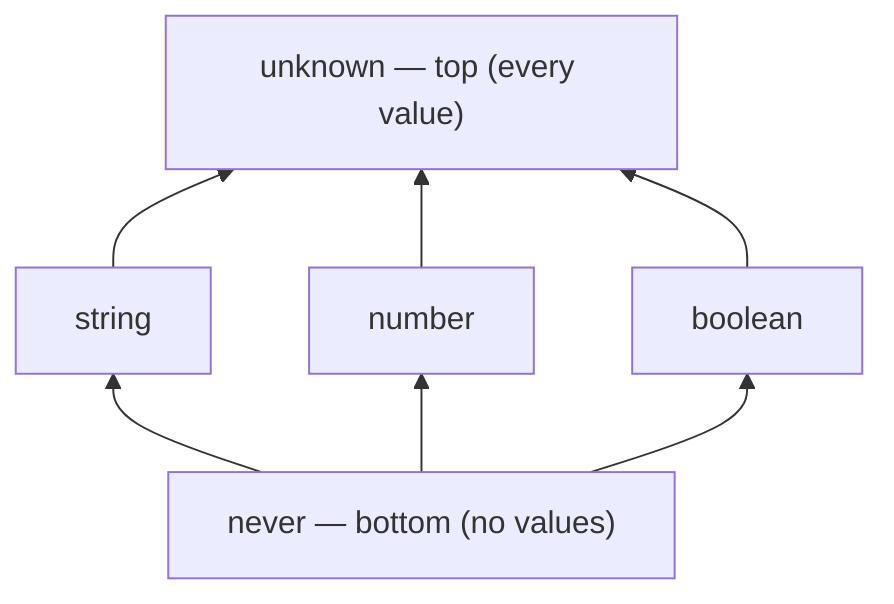

# TypeScript Deep Dive

A study guide focused on the type system. Assumes fluency with modern JavaScript (ES2015+): arrow functions, destructuring, modules, promises, async/await, iterators, classes. This guide skips the JS you already know and focuses on what TypeScript adds on top.

Primary references: [The TypeScript Handbook](https://www.typescriptlang.org/docs/handbook/intro.html) (the official guide — this study guide follows its arc at greater depth), the [release notes per version](https://www.typescriptlang.org/docs/handbook/release-notes/overview.html) (where new type-system features are actually explained), the [TSConfig reference](https://www.typescriptlang.org/tsconfig/) (every compiler option, with examples), the [TypeScript Playground](https://www.typescriptlang.org/play) (test any snippet in this guide live), and [Type Challenges](https://github.com/type-challenges/type-challenges) (the exercise set that makes Parts 9–17 stick).

---

## Table of Contents

1. [The Mental Model: Types Are Sets](#1-the-mental-model-types-are-sets)
2. [Basic Annotations & Inference](#2-basic-annotations--inference)
3. [Union & Intersection Types](#3-union--intersection-types)
4. [Literal Types & Narrowing](#4-literal-types--narrowing)
5. [Type Guards & Control Flow Analysis](#5-type-guards--control-flow-analysis)
6. [Functions: Overloads, Callbacks & `this`](#6-functions-overloads-callbacks--this)
7. [Generics](#7-generics)
8. [Utility Types](#8-utility-types)
9. [Conditional Types](#9-conditional-types)
10. [Mapped Types](#10-mapped-types)
11. [Template Literal Types](#11-template-literal-types)
12. [The `infer` Keyword](#12-the-infer-keyword)
13. [Enums vs Union Literals](#13-enums-vs-union-literals)
14. [Branded & Nominal Types](#14-branded--nominal-types)
15. [Declaration Merging & Module Augmentation](#15-declaration-merging--module-augmentation)
16. [`unknown`, `never`, `any`, `void` — The Special Types](#16-unknown-never-any-void--the-special-types)
17. [Type-Level Programming Patterns](#17-type-level-programming-patterns)
18. [Classes & TypeScript](#18-classes--typescript)
19. [Modules, Declaration Files & Type-Only Imports](#19-modules-declaration-files--type-only-imports)
20. [`tsconfig.json` — The Options That Matter](#20-tsconfigjson--the-options-that-matter)
21. [TypeScript in the Real World: Build, Tooling & Ecosystem](#21-typescript-in-the-real-world-build-tooling--ecosystem)
22. [Common Pitfalls](#22-common-pitfalls)

---

## 1. The Mental Model: Types Are Sets

Handbook: [TypeScript for JavaScript Programmers](https://www.typescriptlang.org/docs/handbook/typescript-in-javascript.html)

Every type in TypeScript is a **set of possible values**. This single idea explains almost everything about the type system:

| Type | Set of values |
|---|---|
| `never` | Empty set — no values |
| `"hello"` | Singleton set: just the string `"hello"` |
| `string` | All strings |
| `string \| number` | All strings + all numbers |
| `unknown` | Every possible value |

- **Union** (`A | B`) = set union. A value is in `A | B` if it's in `A` or in `B`.
- **Intersection** (`A & B`) = set intersection. A value is in `A & B` if it's in both `A` and `B`.
- **Subtype** = subset. `"hello"` is a subtype of `string` because `{"hello"} ⊂ {all strings}`.
- **Assignability** = "is a subset of." You can assign `x: Cat` to `y: Animal` because every `Cat` is an `Animal`.

This is why `never` is the bottom type (assignable to everything — the empty set is a subset of every set) and `unknown` is the top type (everything is assignable to it).



Arrows read "is assignable to": `never` flows up into every type, every type flows up into `unknown`. (`any` sits outside this lattice — it's assignable *both* ways because it switches type-checking off.)

### Structural Typing, Not Nominal

TypeScript doesn't care about what a type is *called* — it cares about what **shape** it has. If two types have the same structure, they're compatible:

```ts
interface Point { x: number; y: number }
interface Coordinate { x: number; y: number }

const p: Point = { x: 1, y: 2 };
const c: Coordinate = p;  // fine — same shape
```

This is fundamentally different from Java/C# (nominal typing) where `Point` and `Coordinate` would be unrelated types.

Reference: [Type Compatibility](https://www.typescriptlang.org/docs/handbook/type-compatibility.html)

```quiz
Q: If types are sets of values, why is `never` assignable to every other type?
- [ ] Because `never` means "any value"
- [x] `never` is the empty set, and the empty set is a subset of every set, so it satisfies any "is a subset of" assignability check
- [ ] Because the compiler special-cases it
- [ ] Because `never` is the same as `any`
> Assignability is "is a subset of," and the empty set is trivially a subset of everything — so a value of type `never` (of which there are none) can stand in anywhere. That makes `never` the bottom type. Symmetrically, `unknown` is the top type because every value is a member of it, so everything is assignable *to* `unknown`.

Q: Two interfaces `Point` and `Coordinate` both have `{ x: number; y: number }`. Why can you assign one to the other in TypeScript but not in Java?
- [ ] TypeScript ignores types at runtime
- [x] TypeScript is structurally typed — compatibility is by shape, not by name — whereas Java is nominal and treats differently-named types as unrelated
- [ ] The interfaces were declared in the same file
- [ ] `interface` always merges identical shapes
> TypeScript cares about the *shape* a type has, not what it's called, so any two types with the same structure are interchangeable. Nominal systems like Java/C# treat `Point` and `Coordinate` as distinct regardless of identical fields. This structural model is why duck-typed JavaScript objects fit TypeScript naturally — and why you sometimes need branded types (Section 14) to *force* nominal distinctions.

Q: Given the set model, what is the type `A & B` (intersection)?
- [ ] The values in A or B
- [x] The values that are in *both* A and B — set intersection
- [ ] The values in A but not B
- [ ] Always `never`
> `A | B` is set union (in A or in B) and `A & B` is set intersection (in both). For object types this means `A & B` has all the properties of both, since a value must satisfy both shapes. It's only `never` when the constraints are genuinely incompatible (e.g. `string & number`), because no value lives in both sets.
```

---

## 2. Basic Annotations & Inference

Handbook: [Everyday Types](https://www.typescriptlang.org/docs/handbook/2/everyday-types.html)

### Type Annotations

```ts
let name: string = "Alice";
let age: number = 30;
let active: boolean = true;
let items: string[] = ["a", "b"];
let pair: [string, number] = ["age", 30];  // tuple
let anything: any = 42;  // escape hatch — avoid
```

### When NOT to Annotate

TypeScript infers types from initializers. Don't annotate what the compiler already knows:

```ts
// redundant — TS infers string
let name: string = "Alice";

// better — TS infers "Alice" in const context, string for let
const name = "Alice";  // type: "Alice" (literal)
let name = "Alice";    // type: string (widened)
```

**Annotate** function parameters and return types (especially public APIs), object shapes at boundaries, and cases where inference would be too wide or too narrow.

**Don't annotate** local variables with obvious initializers, or inline callbacks where the parameter types are already known from context.

### `type` vs `interface`

Both define object shapes. The differences are small but real:

```ts
// interface — extendable, mergeable
interface User {
  id: number;
  name: string;
}
interface User {
  email: string;  // declaration merging — User now has all three fields
}

// type — more flexible, no merging
type User = {
  id: number;
  name: string;
};
type StringOrNumber = string | number;  // interfaces can't do this
type Pair<T> = [T, T];                  // or this
```

| Feature | `interface` | `type` |
|---|---|---|
| Object shapes | Yes | Yes |
| `extends` | Yes | Yes (via `&`) |
| Declaration merging | Yes | No |
| Unions, tuples, mapped types | No | Yes |
| Computed properties | No | Yes |

**Rule of thumb**: use `interface` for object shapes you expect to be extended (especially in libraries). Use `type` for everything else — unions, tuples, utility compositions, and when you want to prevent merging.

Reference: [Interfaces vs Type Aliases](https://www.typescriptlang.org/docs/handbook/2/everyday-types.html#differences-between-type-aliases-and-interfaces)

---

## 3. Union & Intersection Types

Handbook: [Unions and Intersections](https://www.typescriptlang.org/docs/handbook/2/everyday-types.html#union-types)

### Union Types (`|`)

A value that can be one of several types:

```ts
type Status = "loading" | "success" | "error";
type ID = string | number;

function printId(id: ID) {
  // can only use methods common to BOTH string and number
  console.log(id.toString());  // fine — both have toString

  // console.log(id.toUpperCase());  // error — number doesn't have this
  // must narrow first:
  if (typeof id === "string") {
    console.log(id.toUpperCase());  // fine — narrowed to string
  }
}
```

### Intersection Types (`&`)

Combine multiple types — the resulting type has **all** members:

```ts
type HasName = { name: string };
type HasAge = { age: number };
type Person = HasName & HasAge;
// Person = { name: string; age: number }

// for primitives, intersection usually produces never:
type Impossible = string & number;  // never — no value is both
```

### Discriminated Unions (Tagged Unions)

The single most important pattern for modeling state in TypeScript:

```ts
type Result<T> =
  | { status: "success"; data: T }
  | { status: "error"; error: Error }
  | { status: "loading" };

function handle(result: Result<User>) {
  switch (result.status) {
    case "success":
      console.log(result.data);   // TS knows data exists
      break;
    case "error":
      console.log(result.error);  // TS knows error exists
      break;
    case "loading":
      // result has no data or error here
      break;
  }
}
```

The **discriminant** (`status`) is a literal-typed property shared by all variants. TypeScript uses it to narrow the union inside each branch.

Reference: [Discriminated Unions](https://www.typescriptlang.org/docs/handbook/2/narrowing.html#discriminated-unions)

---

## 4. Literal Types & Narrowing

Handbook: [Literal Types](https://www.typescriptlang.org/docs/handbook/2/everyday-types.html#literal-types), [Narrowing](https://www.typescriptlang.org/docs/handbook/2/narrowing.html)

### Literal Types

A literal type is a type with exactly one value:

```ts
type Direction = "north" | "south" | "east" | "west";
type DiceRoll = 1 | 2 | 3 | 4 | 5 | 6;
type Toggle = true | false;  // equivalent to boolean
```

### `const` vs `let` Inference

```ts
const x = "hello";  // type: "hello" (literal)
let y = "hello";    // type: string (widened)
```

### `as const` — Deep Readonly Literal Inference

`as const` makes the compiler infer the narrowest possible type and marks everything `readonly`:

```ts
const config = {
  endpoint: "/api",
  retries: 3,
  methods: ["GET", "POST"],
} as const;
// type: {
//   readonly endpoint: "/api";
//   readonly retries: 3;
//   readonly methods: readonly ["GET", "POST"];
// }

// without as const:
const config2 = {
  endpoint: "/api",     // string
  retries: 3,           // number
  methods: ["GET", "POST"], // string[]
};
```

This is essential when you need objects or arrays to preserve their literal types — for example, passing tuple arguments to functions with specific parameter types.

### `satisfies` — Check a Type Without Widening

Added in TypeScript 4.9. Validates that a value conforms to a type while preserving the inferred (narrower) type:

```ts
type Color = "red" | "green" | "blue";
type Colors = Record<string, Color>;

// with a type annotation — loses specific key information:
const palette: Colors = { primary: "red", secondary: "blue" };
palette.primary;  // type: Color (widened)

// with satisfies — keeps specific key information:
const palette = {
  primary: "red",
  secondary: "blue",
} satisfies Colors;
palette.primary;  // type: "red" (literal preserved)
// palette.typo  // error — key doesn't exist
```

`satisfies` is for when you want the compiler to *verify* a type without *imposing* it.

Reference: [The `satisfies` Operator](https://www.typescriptlang.org/docs/handbook/release-notes/typescript-4-9.html#the-satisfies-operator)

### Narrowing

TypeScript tracks types through control flow. After a type guard, the type is narrowed:

```ts
function process(value: string | number | null) {
  if (value === null) return;        // value: string | number
  if (typeof value === "string") {
    value.toUpperCase();             // value: string
  } else {
    value.toFixed(2);                // value: number
  }
}
```

Narrowing also works with:
- `typeof` (`"string"`, `"number"`, `"boolean"`, `"object"`, `"function"`, `"undefined"`, `"bigint"`, `"symbol"`)
- `instanceof`
- Truthiness checks (`if (value)`)
- `in` operator (`if ("name" in obj)`)
- Equality (`===`, `!==`)
- Discriminant properties (see discriminated unions above)

---

## 5. Type Guards & Control Flow Analysis

Handbook: [Narrowing](https://www.typescriptlang.org/docs/handbook/2/narrowing.html)

### User-Defined Type Guards

When built-in narrowing isn't enough, write a function that returns a **type predicate**:

```ts
interface Fish { swim(): void }
interface Bird { fly(): void }

function isFish(pet: Fish | Bird): pet is Fish {
  return (pet as Fish).swim !== undefined;
}

function move(pet: Fish | Bird) {
  if (isFish(pet)) {
    pet.swim();  // narrowed to Fish
  } else {
    pet.fly();   // narrowed to Bird
  }
}
```

The `pet is Fish` return type is the type predicate — it tells TypeScript that if the function returns `true`, the parameter is `Fish` within the calling scope.

### `asserts` Type Guards

For assertion-style functions that throw instead of returning a boolean:

```ts
function assertIsString(val: unknown): asserts val is string {
  if (typeof val !== "string") {
    throw new Error(`Expected string, got ${typeof val}`);
  }
}

function process(input: unknown) {
  assertIsString(input);
  input.toUpperCase();  // narrowed to string after assertion
}
```

### Exhaustiveness Checking with `never`

Use `never` to catch unhandled cases in discriminated unions:

```ts
type Shape =
  | { kind: "circle"; radius: number }
  | { kind: "square"; side: number }
  | { kind: "triangle"; base: number; height: number };

function area(shape: Shape): number {
  switch (shape.kind) {
    case "circle":
      return Math.PI * shape.radius ** 2;
    case "square":
      return shape.side ** 2;
    case "triangle":
      return 0.5 * shape.base * shape.height;
    default:
      const _exhaustive: never = shape;
      return _exhaustive;
  }
}
// if you add a new variant to Shape and forget a case, the default
// branch will fail to compile because shape won't be assignable to never
```

```quiz
Q: What does the return type `pet is Fish` (a type predicate) tell the compiler?
- [ ] That `pet` is always a Fish
- [x] That when the function returns `true`, the argument should be narrowed to `Fish` in the caller's scope
- [ ] That Fish and Bird are the same type
- [ ] That the function throws if pet isn't a Fish
> A user-defined type guard's predicate connects the boolean result to a narrowing: TypeScript treats a `true` return as evidence the argument is `Fish` (and the `else` branch as `Bird`). Without the predicate, the function would just return `boolean` and no narrowing would occur. It's how you extend control-flow analysis past the built-in `typeof`/`instanceof`/`in` checks.

Q: In the exhaustiveness pattern, why does assigning `shape` to `const _exhaustive: never` catch a forgotten case?
- [ ] `never` accepts any value, so it always compiles
- [x] After all known cases are handled, a fully-handled union narrows to `never`; adding a new variant leaves a non-`never` type that won't assign to `never`, failing compilation
- [ ] It throws at runtime on unknown shapes
- [ ] `never` is an alias for `default`
> In the `default` branch, if every variant has been handled, `shape` has narrowed to `never` and the assignment succeeds. Add a new `Shape` variant and forget its `case`, and `shape` is now that variant — not assignable to `never` — so the compiler flags it. This turns "did I handle every case?" into a compile-time guarantee rather than a runtime surprise.

Q: How does an `asserts val is string` function differ from a `val is string` type guard?
- [ ] They're identical
- [x] The assertion function narrows by *throwing* if the condition fails (control continues only when true), rather than returning a boolean you branch on
- [ ] `asserts` works only on numbers
- [ ] `asserts` runs at compile time only
> A predicate guard returns a boolean you test in an `if`. An `asserts val is string` function instead narrows for the *rest of the scope* on the assumption it either threw or the condition held — so after calling it, `val` is `string` with no branch needed. It models runtime invariant checks (validate-or-throw) at the type level.
```

---

## 6. Functions: Overloads, Callbacks & `this`

Handbook: [More on Functions](https://www.typescriptlang.org/docs/handbook/2/functions.html)

### Function Signatures

```ts
// named function
function greet(name: string): string {
  return `Hello, ${name}`;
}

// arrow function
const greet = (name: string): string => `Hello, ${name}`;

// function type
type Greeter = (name: string) => string;

// call signature in an object type
type Logger = {
  (message: string): void;
  level: string;
};
```

### Optional & Default Parameters

```ts
function fetch(url: string, retries?: number): Promise<Response> {
  const attempts = retries ?? 3;  // ?? is nullish coalescing (ES2020)
  // ...
}

function fetch(url: string, retries: number = 3): Promise<Response> {
  // retries defaults to 3 — type is number, not number | undefined
}
```

### Rest Parameters with Tuples

```ts
function log(...args: [message: string, ...data: unknown[]]): void {
  console.log(args[0], ...args.slice(1));
}
// labeled tuple elements give names in editor tooltips
```

### Function Overloads

When a function has different return types based on input types, overloads let you express this:

```ts
// overload signatures — what callers see
function parse(input: string): number;
function parse(input: string[]): number[];

// implementation signature — must be compatible with all overloads
function parse(input: string | string[]): number | number[] {
  if (Array.isArray(input)) {
    return input.map(Number);
  }
  return Number(input);
}

const a = parse("42");      // number
const b = parse(["1", "2"]); // number[]
```

The implementation signature is **not callable directly** — only the overload signatures are visible to callers. Keep overloads minimal; often a generic or conditional return type is cleaner.

### `this` Parameters

TypeScript lets you declare the type of `this` in a function. It's erased at runtime — it only exists for type checking:

```ts
interface Button {
  label: string;
  onClick(this: Button): void;
}

const button: Button = {
  label: "Submit",
  onClick() {
    console.log(this.label);  // this is typed as Button
  },
};

// button.onClick.call({ wrong: true });  // error
```

### `void` vs `undefined` Return Types

```ts
type Callback = () => void;

// a void-returning callback is allowed to return anything — the return
// value is just ignored. This is why Array.forEach works with callbacks
// that happen to return values.
const nums: number[] = [];
const callback: Callback = () => nums.push(1);  // push returns number, but that's fine

// contrast with an explicit undefined return:
type Strict = () => undefined;
const f: Strict = () => nums.push(1);  // error — number is not undefined
```

---

## 7. Generics

Handbook: [Generics](https://www.typescriptlang.org/docs/handbook/2/generics.html)

Generics let you write code that works with any type while preserving type information through the operation.

### Basic Generics

```ts
function identity<T>(value: T): T {
  return value;
}

const a = identity("hello");  // T inferred as "hello"
const b = identity(42);       // T inferred as 42

// explicit type argument (rarely needed — inference usually works)
const c = identity<string>("hello");  // T = string
```

### Generic Constraints (`extends`)

Restrict what types a generic accepts:

```ts
function getLength<T extends { length: number }>(item: T): number {
  return item.length;
}

getLength("hello");     // fine — string has length
getLength([1, 2, 3]);   // fine — array has length
// getLength(42);        // error — number has no length
```

### `keyof` and Indexed Access

```ts
interface User {
  id: number;
  name: string;
  email: string;
}

type UserKeys = keyof User;  // "id" | "name" | "email"

// indexed access — look up a property type
type UserName = User["name"];      // string
type UserIdOrName = User["id" | "name"];  // number | string

// the classic pattern: type-safe property access
function getProperty<T, K extends keyof T>(obj: T, key: K): T[K] {
  return obj[key];
}

const user: User = { id: 1, name: "Alice", email: "a@b.com" };
const name = getProperty(user, "name");  // string
// getProperty(user, "age");              // error — "age" is not in keyof User
```

### Multiple Type Parameters

```ts
function map<T, U>(array: T[], fn: (item: T) => U): U[] {
  return array.map(fn);
}

const lengths = map(["hello", "world"], s => s.length);
// T = string, U = number — both inferred
```

### Generic Interfaces and Types

```ts
interface Repository<T> {
  getById(id: string): Promise<T>;
  save(entity: T): Promise<void>;
  delete(id: string): Promise<void>;
}

type ApiResponse<T> = {
  data: T;
  status: number;
  timestamp: Date;
};

// default type parameters
type Container<T = string> = { value: T };
const c: Container = { value: "hello" };  // T defaults to string
```

### Generic Constraints with Other Type Parameters

```ts
// K is constrained to be a key of T
function pick<T, K extends keyof T>(obj: T, keys: K[]): Pick<T, K> {
  const result = {} as Pick<T, K>;
  for (const key of keys) {
    result[key] = obj[key];
  }
  return result;
}

const user = { id: 1, name: "Alice", email: "a@b.com" };
const subset = pick(user, ["name", "email"]);
// type: Pick<{ id: number; name: string; email: string }, "name" | "email">
// = { name: string; email: string }
```

```quiz
Q: In `getProperty<T, K extends keyof T>(obj: T, key: K): T[K]`, what does constraining `K extends keyof T` buy you?
- [ ] It makes the function faster
- [x] It guarantees `key` is a real property of `obj`, and the return type `T[K]` is the precise type of that property — so `getProperty(user, "age")` is a compile error
- [ ] It forces all keys to be strings
- [ ] It copies the object
> `keyof T` is the union of `T`'s property names, so `K extends keyof T` restricts `key` to valid keys and rejects `"age"`. The indexed-access return `T[K]` then yields exactly that property's type (`string` for `"name"`), preserving precision through the lookup. This is the canonical type-safe property-access pattern generics enable.

Q: Why does `const a = identity("hello")` infer `T` as the literal `"hello"` rather than requiring you to write `identity<string>`?
- [ ] Because identity is a built-in
- [x] TypeScript infers type arguments from the call's actual arguments, so explicit type arguments are usually unnecessary
- [ ] Because the function has no constraints
- [ ] Because string literals can't be widened
> Generic type-parameter inference reads the argument types at the call site, so `T` is filled in automatically — explicit `<string>` is rarely needed. This is what lets generic code stay ergonomic: you write `map(["a"], s => s.length)` and both `T` and `U` are inferred. You only supply explicit type arguments when inference can't determine them.

Q: What is the purpose of a generic *constraint* like `T extends { length: number }`?
- [ ] To default T to a length-bearing type
- [x] To restrict which types T may be, so the body can safely use members the constraint guarantees (here, `.length`)
- [ ] To make T optional
- [ ] To convert T into a number
> Without a constraint, a generic `T` could be anything, so the body can't assume any properties. `T extends { length: number }` narrows the allowed types to those with a numeric `length`, letting `item.length` type-check while still accepting strings, arrays, or anything else shaped that way — and rejecting `number`. Constraints trade some generality for the ability to operate on the type.
```

---

## 8. Utility Types

Handbook: [Utility Types](https://www.typescriptlang.org/docs/handbook/utility-types.html)

TypeScript ships a set of built-in generic types for common transformations. These are all defined in terms of mapped and conditional types (covered later), but you'll use them constantly.

### Object Transformations

```ts
interface User {
  id: number;
  name: string;
  email: string;
  role: "admin" | "user";
}

// Partial<T> — all properties optional
type UserUpdate = Partial<User>;
// { id?: number; name?: string; email?: string; role?: "admin" | "user" }

// Required<T> — all properties required
type StrictUser = Required<Partial<User>>;  // back to User

// Readonly<T> — all properties readonly
type FrozenUser = Readonly<User>;
// { readonly id: number; readonly name: string; ... }

// Pick<T, K> — subset of properties
type UserPreview = Pick<User, "id" | "name">;
// { id: number; name: string }

// Omit<T, K> — everything except named properties
type UserWithoutEmail = Omit<User, "email">;
// { id: number; name: string; role: "admin" | "user" }
```

### Record

```ts
// Record<K, V> — object type with keys K and values V
type Roles = "admin" | "editor" | "viewer";
type Permissions = Record<Roles, boolean>;
// { admin: boolean; editor: boolean; viewer: boolean }

// useful for dictionaries:
type Cache = Record<string, unknown>;
```

### Union Transformations

```ts
type Status = "active" | "inactive" | "banned" | "pending";

// Exclude<T, U> — remove from union
type ActiveStatus = Exclude<Status, "banned" | "pending">;
// "active" | "inactive"

// Extract<T, U> — keep only matching
type RestrStatus = Extract<Status, "banned" | "pending">;
// "banned" | "pending"
```

### Nullability

```ts
// NonNullable<T> — remove null and undefined
type MaybeString = string | null | undefined;
type DefiniteString = NonNullable<MaybeString>;  // string
```

### Function Types

```ts
function createUser(name: string, age: number): User {
  return { id: 1, name, email: "", role: "user" };
}

type Params = Parameters<typeof createUser>;  // [name: string, age: number]
type Return = ReturnType<typeof createUser>;   // User
type Instance = InstanceType<typeof Date>;     // Date

// ConstructorParameters for class constructors:
type DateArgs = ConstructorParameters<typeof Date>;
```

### Awaited

```ts
// Awaited<T> — unwrap Promise (recursively)
type A = Awaited<Promise<string>>;                    // string
type B = Awaited<Promise<Promise<number>>>;           // number
type C = Awaited<string | Promise<boolean>>;          // string | boolean
```

---

## 9. Conditional Types

Handbook: [Conditional Types](https://www.typescriptlang.org/docs/handbook/2/conditional-types.html)

Conditional types are the `if/else` of the type system:

```ts
type IsString<T> = T extends string ? "yes" : "no";

type A = IsString<string>;   // "yes"
type B = IsString<number>;   // "no"
type C = IsString<"hello">;  // "yes" — "hello" extends string
```

### Distributive Conditional Types

When the checked type is a **bare type parameter** (not wrapped in anything), conditional types **distribute** over unions:

```ts
type ToArray<T> = T extends unknown ? T[] : never;

type A = ToArray<string | number>;
// distributes: ToArray<string> | ToArray<number>
// = string[] | number[]

// WITHOUT distribution (wrap T to prevent it):
type ToArrayNonDist<T> = [T] extends [unknown] ? T[] : never;
type B = ToArrayNonDist<string | number>;
// = (string | number)[]  — single array type
```

Distribution is the reason `Exclude` works:

```ts
// built-in definition:
type Exclude<T, U> = T extends U ? never : T;

// Exclude<"a" | "b" | "c", "a">
// distributes:
// ("a" extends "a" ? never : "a") | ("b" extends "a" ? never : "b") | ("c" extends "a" ? never : "c")
// = never | "b" | "c"
// = "b" | "c"
```

### Practical Example: API Response Unwrapping

```ts
type ApiResult<T> =
  T extends { data: infer D } ? D :
  T extends { error: infer E } ? E :
  never;

type UserData = ApiResult<{ data: User }>;     // User
type ErrorMsg = ApiResult<{ error: string }>;   // string
```

---

## 10. Mapped Types

Handbook: [Mapped Types](https://www.typescriptlang.org/docs/handbook/2/mapped-types.html)

Mapped types transform every property in a type. They're the `map()` of the type system:

```ts
// the syntax: iterate over keys and define each property
type Readonly<T> = {
  readonly [K in keyof T]: T[K];
};

type Partial<T> = {
  [K in keyof T]?: T[K];
};

type Nullable<T> = {
  [K in keyof T]: T[K] | null;
};
```

### Key Remapping with `as`

Rename or filter keys during mapping:

```ts
// prefix all keys with "get"
type Getters<T> = {
  [K in keyof T as `get${Capitalize<string & K>}`]: () => T[K];
};

interface User {
  name: string;
  age: number;
}

type UserGetters = Getters<User>;
// { getName: () => string; getAge: () => number }

// filter out keys by remapping to never
type RemoveFunctions<T> = {
  [K in keyof T as T[K] extends Function ? never : K]: T[K];
};
```

### Modifier Removal with `-`

Remove `readonly` or `?` modifiers:

```ts
type Mutable<T> = {
  -readonly [K in keyof T]: T[K];
};

type Concrete<T> = {
  [K in keyof T]-?: T[K];  // remove optionality
};
```

### Mapped Types + Conditional Types

The real power comes from combining them:

```ts
// make all function properties async
type Asyncify<T> = {
  [K in keyof T]: T[K] extends (...args: infer A) => infer R
    ? (...args: A) => Promise<R>
    : T[K];
};

interface Sync {
  getName(): string;
  getAge(): number;
  label: string;
}

type Async = Asyncify<Sync>;
// {
//   getName: () => Promise<string>;
//   getAge: () => Promise<number>;
//   label: string;  — non-function property unchanged
// }
```

---

## 11. Template Literal Types

Handbook: [Template Literal Types](https://www.typescriptlang.org/docs/handbook/2/template-literal-types.html)

Template literal types use the same backtick syntax as JS template literals, but at the type level:

```ts
type Greeting = `Hello, ${string}`;
const a: Greeting = "Hello, world";   // fine
// const b: Greeting = "Goodbye";     // error

type EventName = `on${Capitalize<string>}`;
// matches "onClick", "onHover", "onAnythingStartingWithCapital"

// combined with unions — distributes across all combinations
type Color = "red" | "blue";
type Size = "small" | "large";
type Variant = `${Color}-${Size}`;
// "red-small" | "red-large" | "blue-small" | "blue-large"
```

### Intrinsic String Types

TypeScript provides four built-in string manipulation types:

```ts
type A = Uppercase<"hello">;     // "HELLO"
type B = Lowercase<"HELLO">;     // "hello"
type C = Capitalize<"hello">;    // "Hello"
type D = Uncapitalize<"Hello">;  // "hello"
```

### Practical Example: Event Emitter Types

```ts
type EventMap = {
  click: { x: number; y: number };
  focus: { target: HTMLElement };
  keydown: { key: string; code: string };
};

type OnEvent = {
  [K in keyof EventMap as `on${Capitalize<string & K>}`]: (
    event: EventMap[K]
  ) => void;
};
// {
//   onClick: (event: { x: number; y: number }) => void;
//   onFocus: (event: { target: HTMLElement }) => void;
//   onKeydown: (event: { key: string; code: string }) => void;
// }
```

---

## 12. The `infer` Keyword

Handbook: [Inferring Within Conditional Types](https://www.typescriptlang.org/docs/handbook/2/conditional-types.html#inferring-within-conditional-types)

`infer` declares a type variable inside a conditional type's `extends` clause — it "pattern-matches" against a type and extracts parts of it:

```ts
// extract the return type of a function
type ReturnOf<T> = T extends (...args: any[]) => infer R ? R : never;

type A = ReturnOf<() => string>;              // string
type B = ReturnOf<(x: number) => boolean>;    // boolean

// extract the element type of an array
type ElementOf<T> = T extends (infer E)[] ? E : never;

type C = ElementOf<string[]>;            // string
type D = ElementOf<(number | boolean)[]>; // number | boolean

// extract Promise inner type
type Unwrap<T> = T extends Promise<infer U> ? Unwrap<U> : T;

type E = Unwrap<Promise<Promise<string>>>;  // string (recursive)
```

### Multiple `infer` Positions

```ts
// extract first and rest of a tuple
type Head<T extends unknown[]> = T extends [infer H, ...unknown[]] ? H : never;
type Tail<T extends unknown[]> = T extends [unknown, ...infer R] ? R : never;

type H = Head<[1, 2, 3]>;  // 1
type T = Tail<[1, 2, 3]>;  // [2, 3]
```

### `infer` with Constraints (TS 4.7+)

```ts
// only infer if the element extends string
type StringHead<T> = T extends [infer S extends string, ...unknown[]] ? S : never;

type A = StringHead<["hello", 42]>;  // "hello"
type B = StringHead<[42, "hello"]>;  // never
```

```quiz
Q: `type ToArray<T> = T extends unknown ? T[] : never`. Why does `ToArray<string | number>` give `string[] | number[]` rather than `(string | number)[]`?
- [ ] Because arrays can't hold unions
- [x] When the checked type is a bare type parameter, the conditional *distributes* over the union, applying separately to each member
- [ ] Because `unknown` excludes unions
- [ ] It's a compiler bug
> A conditional type whose checked type is a bare `T` distributes across unions: `ToArray<string | number>` becomes `ToArray<string> | ToArray<number>`. To suppress distribution you wrap both sides in tuples (`[T] extends [unknown]`), yielding `(string | number)[]`. This distribution is exactly why built-in `Exclude<T, U> = T extends U ? never : T` filters union members one at a time.

Q: What does the `infer` keyword do in `type ReturnOf<T> = T extends (...args: any[]) => infer R ? R : never`?
- [ ] It asserts T is a function
- [x] It pattern-matches the type and binds a new type variable `R` to the matched part (here, the function's return type) for use in the true branch
- [ ] It runs the function to get its return value
- [ ] It defaults R to `any`
> `infer R` declares a placeholder inside the `extends` pattern that TypeScript unifies with whatever occupies that position — the return type, an array element, a Promise's inner type, a tuple's head. If the pattern matches, `R` is available in the true branch; otherwise the false branch runs. It's structural pattern-matching at the type level, and it's how utilities like `ReturnType` and `Awaited` are built.

Q: Why does `Exclude<"a" | "b" | "c", "a">` evaluate to `"b" | "c"`?
- [ ] It removes the first element
- [x] Distribution applies `T extends "a" ? never : T` to each member; `"a"` becomes `never`, the others stay, and `never` vanishes from the union
- [ ] It alphabetically sorts and drops the first
- [ ] It only works on two-member unions
> `Exclude<T, U> = T extends U ? never : T` distributes over the union, testing each member against `"a"`: `"a"` maps to `never` while `"b"` and `"c"` map to themselves. Since `never` is the empty set, it disappears when unioned, leaving `"b" | "c"`. The whole behavior rests on distributive conditionals plus `never`'s identity in unions.
```

---

## 13. Enums vs Union Literals

Handbook: [Enums](https://www.typescriptlang.org/docs/handbook/enums.html)

### Enums

```ts
enum Direction {
  Up = "UP",
  Down = "DOWN",
  Left = "LEFT",
  Right = "RIGHT",
}

function move(dir: Direction) {}
move(Direction.Up);
```

Enums emit JavaScript code — they create a runtime object. Numeric enums also create reverse mappings:

```ts
enum Status {
  Active,   // 0
  Inactive, // 1
}
// emits:
// var Status;
// Status[Status["Active"] = 0] = "Active";
// Status[Status["Inactive"] = 1] = "Inactive";
```

### `const enum`

Inlined at compile time — no runtime object. But this has compatibility issues with `--isolatedModules` (which Vite, esbuild, and most modern toolchains require):

```ts
const enum Direction {
  Up = "UP",
  Down = "DOWN",
}
// Direction.Up is replaced with "UP" in the output
```

### Union Literals (Preferred)

In most cases, union literals are simpler and more predictable:

```ts
type Direction = "up" | "down" | "left" | "right";

function move(dir: Direction) {}
move("up");

// if you need a runtime collection of all values:
const DIRECTIONS = ["up", "down", "left", "right"] as const;
type Direction = (typeof DIRECTIONS)[number];
// "up" | "down" | "left" | "right"
```

| | `enum` | Union literal |
|---|---|---|
| Runtime code emitted | Yes | No |
| Tree-shakeable | Poorly | Yes |
| Works with `isolatedModules` | `const enum` doesn't | Yes |
| Iterable at runtime | Yes (`Object.values`) | Only with `as const` array |
| Refactor rename | IDE support | IDE support |

**Recommendation**: default to union literals. Reach for enums when you specifically need a runtime object with computed members or when interoperating with code that expects enums.

---

## 14. Branded & Nominal Types

TypeScript is structural. Sometimes you want *nominal* behavior — two types with the same shape that are not interchangeable.

### The Problem

```ts
type UserId = string;
type OrderId = string;

function getUser(id: UserId) { /* ... */ }

const orderId: OrderId = "order-123";
getUser(orderId);  // no error — both are just string
```

### The Solution: Branded Types

```ts
type Brand<T, B extends string> = T & { readonly __brand: B };

type UserId = Brand<string, "UserId">;
type OrderId = Brand<string, "OrderId">;

function userId(id: string): UserId {
  return id as UserId;
}

function orderId(id: string): OrderId {
  return id as OrderId;
}

function getUser(id: UserId) { /* ... */ }

const uid = userId("user-123");
const oid = orderId("order-123");

getUser(uid);  // fine
// getUser(oid);  // error — OrderId is not assignable to UserId
```

The `__brand` property doesn't exist at runtime — it's a phantom type that only the compiler sees. The `as` cast is the "constructor."

### Validated Branded Types

Use brands to encode validation in the type system:

```ts
type Email = Brand<string, "Email">;
type PositiveNumber = Brand<number, "PositiveNumber">;

function parseEmail(input: string): Email {
  if (!input.includes("@")) {
    throw new Error("Invalid email");
  }
  return input as Email;
}

function sendWelcome(email: Email) {
  // guaranteed to be validated — can't pass a raw string
}
```

```quiz
Q: `type UserId = string; type OrderId = string`. Why does `getUser(orderId)` compile even though they're "different" types?
- [ ] TypeScript ignores type aliases
- [x] Both are structurally just `string`, and a plain alias adds no distinguishing shape, so they're interchangeable
- [ ] `getUser` accepts any argument
- [ ] Aliases are erased so all become `any`
> A type alias is only a name for an existing type; `UserId` and `OrderId` are both literally `string`, and structural typing compares shape, not name. So nothing stops you passing one where the other is expected — a real source of mixed-up-ID bugs. Branding adds a phantom property to force a nominal distinction the structural system would otherwise collapse.

Q: In `type UserId = string & { readonly __brand: "UserId" }`, what is the `__brand` property and does it exist at runtime?
- [ ] A real string field set to "UserId"
- [x] A phantom/compile-only property that makes the type nominally distinct; it doesn't exist at runtime, and the `as` cast acts as the constructor
- [ ] A method that validates the value
- [ ] A field that must be assigned manually
> The intersection with `{ __brand: "UserId" }` gives the type a unique shape no plain `string` has, so `OrderId` (branded differently) isn't assignable to it. The property is never actually created — it's a type-level marker — so the value remains a normal string at runtime, and the `as UserId` cast in the factory function is what "constructs" the branded value.

Q: How do validated branded types (e.g. `parseEmail(input): Email`) make a function like `sendWelcome(email: Email)` safer?
- [ ] They check the email at runtime inside sendWelcome
- [x] Because only `parseEmail` can mint an `Email` (after validating), the type signature guarantees any `Email` argument was already validated — a raw string won't compile
- [ ] They convert the string to lowercase
- [ ] They make sendWelcome accept any string
> By making the brand obtainable only through `parseEmail` (which validates and casts), the `Email` type becomes a proof-of-validation token. `sendWelcome(email: Email)` then can't be called with an unvalidated raw string — the compiler rejects it — so the validation invariant is enforced at the boundary once, not re-checked everywhere. It encodes "this string passed validation" into the type.
```

---

## 15. Declaration Merging & Module Augmentation

Handbook: [Declaration Merging](https://www.typescriptlang.org/docs/handbook/declaration-merging.html)

### Interface Merging

Multiple declarations of the same interface are merged:

```ts
interface Window {
  myApp: { version: string };
}

// now window.myApp is typed without errors
console.log(window.myApp.version);
```

This is how `.d.ts` files extend global types. It's also why interfaces support merging and `type` aliases don't.

### Module Augmentation

Extend types from external modules without modifying their source:

```ts
// extend Express Request
import "express";

declare module "express" {
  interface Request {
    user?: { id: string; role: string };
  }
}

// now req.user is typed everywhere
```

```ts
// extend Vue's ComponentCustomProperties
declare module "vue" {
  interface ComponentCustomProperties {
    $formatDate: (date: Date) => string;
  }
}
```

### Global Augmentation

Add types to the global scope from within a module:

```ts
export {};  // makes this file a module

declare global {
  interface Array<T> {
    toShuffled(): T[];
  }

  var DEBUG: boolean;
}
```

---

## 16. `unknown`, `never`, `any`, `void` — The Special Types

### `any`

Opts out of type checking entirely. Every type is assignable to `any`, and `any` is assignable to every type:

```ts
let x: any = 42;
x.nonExistent.method();  // no error — no checking at all
const y: string = x;     // no error — any bypasses everything
```

**Avoid `any`** except when migrating JavaScript, interfacing with untyped libraries, or as a temporary escape hatch during prototyping. It propagates — one `any` can silently disable type checking across many functions.

### `unknown`

The type-safe counterpart to `any`. Every type is assignable to `unknown`, but `unknown` is **not** assignable to anything without narrowing:

```ts
let x: unknown = 42;
// x.toString();     // error — can't use unknown without narrowing
// const y: string = x;  // error

if (typeof x === "number") {
  x.toFixed(2);    // fine — narrowed to number
}
```

**Use `unknown` instead of `any`** for values whose type you don't know yet (API responses, parsed JSON, user input). It forces you to check before using.

### `never`

The type with no values — the empty set. Used for:

1. **Functions that never return** (throw or infinite loop):
   ```ts
   function fail(message: string): never {
     throw new Error(message);
   }
   ```

2. **Exhaustiveness checking** (see [Section 5](#5-type-guards--control-flow-analysis))

3. **Impossible states** in conditional types:
   ```ts
   type OnlyStrings<T> = T extends string ? T : never;
   type A = OnlyStrings<"a" | "b" | 42>;  // "a" | "b"
   ```

4. **Bottom of the type hierarchy**: `never` extends every type, and nothing extends `never` (except `never` itself).

### `void`

The return type of functions that don't return a value. Not the same as `undefined`:

```ts
function log(msg: string): void {
  console.log(msg);
  // implicit return — fine
}

// void is special for callbacks (see Section 6)
// a void-returning callback may return a value — it's just ignored
```

### The Hierarchy

```
unknown          ← top type (everything is assignable to it)
   ↑
string, number, boolean, object, ...
   ↑
literal types ("hello", 42, true)
   ↑
never            ← bottom type (assignable to everything)
```

```quiz
Q: Both `any` and `unknown` accept any value. What's the critical difference when you try to *use* the value?
- [ ] `any` is faster
- [x] `unknown` is not assignable to anything (and you can't call methods on it) until you narrow it; `any` disables all checking in both directions
- [ ] `unknown` only holds objects
- [ ] `any` requires narrowing, unknown doesn't
> Everything is assignable *to* both, but `any` is also assignable *from* — it bypasses checking entirely and propagates, silently disabling type safety across call chains. `unknown` blocks all use until you prove the type with a guard, making it the safe choice for API responses, parsed JSON, and user input. Reach for `unknown` and narrow; avoid `any` outside migration and untyped-library escape hatches.

Q: Why is a `void` return type not the same as an `undefined` return type, especially for callbacks?
- [ ] `void` means the function throws
- [x] A `void`-returning callback is allowed to return *any* value (it's ignored), so functions returning something still satisfy it — `undefined` would reject them
- [ ] They're identical
- [ ] `void` can only annotate variables
> `void` signals "the return value is not meant to be used," so a `() => void` callback accepts an implementation that happens to return a value (like `arr.push(x)` returning a number) — the value is simply discarded. An explicit `() => undefined` would reject that, since `number` isn't `undefined`. This is precisely why `Array.forEach` works with callbacks that return things.

Q: Which statement correctly places `never` and `unknown` in the type hierarchy?
- [ ] `never` is the top type; `unknown` is the bottom
- [x] `unknown` is the top type (everything assignable to it); `never` is the bottom type (assignable to everything)
- [ ] Both are top types
- [ ] `any` sits below `never`
> `unknown` sits at the top — every value belongs to it, so anything can be assigned to `unknown`. `never` sits at the bottom — it has no values, so it's assignable to every type while nothing (except `never`) is assignable to it. This is the set model again: top = the universal set, bottom = the empty set.
```

---

## 17. Type-Level Programming Patterns

### Recursive Types

```ts
type DeepPartial<T> = {
  [K in keyof T]?: T[K] extends object ? DeepPartial<T[K]> : T[K];
};

type Nested = {
  a: { b: { c: string } };
  d: number;
};

type DP = DeepPartial<Nested>;
// { a?: { b?: { c?: string } }; d?: number }
```

### Tuple Manipulation

```ts
type Push<T extends unknown[], V> = [...T, V];
type Unshift<T extends unknown[], V> = [V, ...T];
type Concat<A extends unknown[], B extends unknown[]> = [...A, ...B];

type A = Push<[1, 2], 3>;       // [1, 2, 3]
type B = Concat<[1, 2], [3, 4]>; // [1, 2, 3, 4]
```

### String Parsing at the Type Level

```ts
type Split<S extends string, D extends string> =
  S extends `${infer Head}${D}${infer Tail}`
    ? [Head, ...Split<Tail, D>]
    : [S];

type Parts = Split<"a.b.c", ".">;  // ["a", "b", "c"]
```

### Type-Safe Object Paths

```ts
type Path<T, K extends keyof T = keyof T> =
  K extends string | number
    ? T[K] extends object
      ? K | `${K}.${Path<T[K]>}`
      : K
    : never;

interface Config {
  db: { host: string; port: number };
  app: { name: string };
}

type ConfigPath = Path<Config>;
// "db" | "app" | "db.host" | "db.port" | "app.name"
```

### Builder Pattern with Generics

```ts
class QueryBuilder<T extends Record<string, unknown> = {}> {
  private conditions: Partial<T> = {};

  where<K extends string, V>(
    key: K,
    value: V
  ): QueryBuilder<T & Record<K, V>> {
    (this.conditions as any)[key] = value;
    return this as any;
  }

  build(): T {
    return this.conditions as T;
  }
}

const query = new QueryBuilder()
  .where("name", "Alice")
  .where("age", 30)
  .build();
// type: { name: string } & { age: number }
```

---

## 18. Classes & TypeScript

Handbook: [Classes](https://www.typescriptlang.org/docs/handbook/2/classes.html)

TypeScript adds access modifiers and other features on top of ES2022 classes.

### Access Modifiers

```ts
class User {
  public name: string;         // accessible everywhere (default)
  protected email: string;     // accessible in this class and subclasses
  private password: string;    // accessible only in this class
  readonly id: number;         // assignable only in constructor

  constructor(name: string, email: string, password: string) {
    this.id = Math.random();
    this.name = name;
    this.email = email;
    this.password = password;
  }
}
```

Note: TypeScript's `private` is compile-time only. For runtime privacy, use JavaScript's `#private` fields:

```ts
class User {
  #password: string;  // truly private at runtime
  constructor(pw: string) {
    this.#password = pw;
  }
}
```

### Parameter Properties

Shorthand that declares and assigns in the constructor signature:

```ts
class User {
  constructor(
    public name: string,
    private email: string,
    readonly id: number = Math.random()
  ) {}
  // name, email, and id are declared and assigned automatically
}
```

### `abstract` Classes

Can't be instantiated directly — must be subclassed:

```ts
abstract class Shape {
  abstract area(): number;   // subclasses must implement
  abstract perimeter(): number;

  describe(): string {       // concrete method — inherited as-is
    return `Area: ${this.area()}, Perimeter: ${this.perimeter()}`;
  }
}

class Circle extends Shape {
  constructor(private radius: number) { super(); }
  area() { return Math.PI * this.radius ** 2; }
  perimeter() { return 2 * Math.PI * this.radius; }
}
```

### `implements`

Check that a class satisfies an interface. Doesn't affect the class type — it's a compile-time check only:

```ts
interface Serializable {
  serialize(): string;
}

class User implements Serializable {
  constructor(public name: string) {}

  serialize(): string {
    return JSON.stringify({ name: this.name });
  }
}
```

A class can `implements` multiple interfaces. Keep in mind that `implements` doesn't add any types to the class — if you forget a method, you get an error, but you still have to write the implementation.

### Class Types Are Structural

```ts
class Foo { x = 1; }
class Bar { x = 1; }

const f: Foo = new Bar();  // fine — same shape
```

This surprises people from Java/C#. If you need classes to be non-interchangeable, use branded types (Section 14).

---

## 19. Modules, Declaration Files & Type-Only Imports

Handbook: [Modules](https://www.typescriptlang.org/docs/handbook/2/modules.html)

### ESM in TypeScript

TypeScript uses ES module syntax. The import/export semantics are the same as standard JavaScript:

```ts
// named exports
export interface User { id: number; name: string }
export function createUser(name: string): User { /* ... */ }

// default export
export default class UserService { /* ... */ }

// re-exports
export { User } from "./types";
export { default as UserService } from "./service";
```

### Type-Only Imports and Exports

When you import something used only as a type, mark it so bundlers can reliably remove it:

```ts
import type { User } from "./types";
import { createUser, type UserConfig } from "./service";

export type { User };
```

`import type` is erased entirely — it generates no JavaScript. This matters for:
- **Bundler correctness**: ensures unused type imports don't create side-effect imports
- **Circular dependency avoidance**: type-only imports can't create runtime cycles
- **`isolatedModules` compliance**: required by esbuild/Vite/SWC when they can't see across files

### Declaration Files (`.d.ts`)

Type information for JavaScript code. Created by `tsc --declaration` or written by hand:

```ts
// math.d.ts — describes math.js
export declare function add(a: number, b: number): number;
export declare const PI: number;
```

### DefinitelyTyped (`@types/*`)

Type definitions for JavaScript packages that don't ship their own:

```bash
npm install --save-dev @types/express @types/node @types/lodash
```

TypeScript automatically picks up `@types/*` packages. Check if a package ships its own types before installing `@types` — many modern packages do.

Reference: [DefinitelyTyped](https://github.com/DefinitelyTyped/DefinitelyTyped)

### `declare` Keyword

Tells TypeScript about things that exist at runtime but aren't defined in TypeScript:

```ts
// ambient variable (e.g., set by a script tag)
declare const API_URL: string;

// ambient module (for non-TS files)
declare module "*.svg" {
  const content: string;
  export default content;
}

declare module "*.css" {
  const classes: Record<string, string>;
  export default classes;
}
```

---

## 20. `tsconfig.json` — The Options That Matter

Reference: [TSConfig Reference](https://www.typescriptlang.org/tsconfig)

Most `tsconfig.json` options are irrelevant or have obvious defaults. These are the ones that actually affect how you write code:

### Strict Mode Options

Always enable `"strict": true`. It turns on all of these:

| Option | What it does |
|---|---|
| `strictNullChecks` | `null` and `undefined` are their own types — not assignable to everything |
| `strictFunctionTypes` | Function parameters are checked contravariantly (catches real bugs) |
| `strictBindCallApply` | `bind`, `call`, `apply` are type-checked |
| `strictPropertyInitialization` | Class properties must be initialized in the constructor |
| `noImplicitAny` | Error on expressions that would be `any` without an annotation |
| `noImplicitThis` | Error on `this` with implicit `any` type |
| `useUnknownInCatchVariables` | `catch(e)` gives `e` type `unknown` instead of `any` |
| `alwaysStrict` | Emit `"use strict"` in every file |

### Module Resolution

```jsonc
{
  "compilerOptions": {
    // for Node.js projects:
    "module": "NodeNext",
    "moduleResolution": "NodeNext",

    // for bundler-based projects (Vite, webpack, esbuild):
    "module": "ESNext",
    "moduleResolution": "Bundler",
  }
}
```

`"Bundler"` resolution is what you want for most frontend projects — it matches how Vite/webpack/esbuild actually resolve imports (no file extensions required, `package.json` `exports` supported).

`"NodeNext"` is for Node.js projects — it requires `.js` extensions in relative imports (even for `.ts` files) and enforces the `exports` map.

### Target & Lib

```jsonc
{
  "compilerOptions": {
    "target": "ES2022",  // emit syntax — match your deployment target
    "lib": ["ES2023", "DOM", "DOM.Iterable"],  // which APIs exist at runtime
  }
}
```

`target` controls which JavaScript syntax `tsc` emits (e.g., whether it downlevels `class` fields). `lib` controls which global types are available (e.g., `Promise`, `Map`, `document`). For server-side code, omit `DOM`.

### Additional Strictness (Not in `strict`)

```jsonc
{
  "compilerOptions": {
    "noUncheckedIndexedAccess": true,   // array/object index returns T | undefined
    "exactOptionalPropertyTypes": true, // { x?: string } means "missing" not "string | undefined"
    "noPropertyAccessFromIndexSignature": true,  // force bracket notation for index signatures
  }
}
```

`noUncheckedIndexedAccess` is worth enabling on new projects — it catches real bugs from `array[i]` being assumed defined.

### Path Aliases

```jsonc
{
  "compilerOptions": {
    "baseUrl": ".",
    "paths": {
      "@/*": ["src/*"],
      "@components/*": ["src/components/*"]
    }
  }
}
```

Note: `paths` only affects TypeScript's type resolution. Your bundler (Vite, webpack) needs matching configuration to actually resolve these at runtime.

### Recommended Starting Points

The TypeScript team publishes base configs for common environments:

```bash
npm install --save-dev @tsconfig/node22     # Node.js 22
npm install --save-dev @tsconfig/strictest   # maximum strictness
```

```jsonc
// tsconfig.json
{
  "extends": "@tsconfig/node22/tsconfig.json",
  "compilerOptions": {
    "outDir": "dist"
  }
}
```

Reference: [TSConfig Bases](https://github.com/tsconfig/bases)

---

## 21. TypeScript in the Real World: Build, Tooling & Ecosystem

The type system is the intellectually interesting part of TypeScript, but it is not the part you spend most of your time fighting on a real project. That part is the *tooling story* — how TypeScript becomes JavaScript, how its types flow through a build, how it integrates with the JavaScript ecosystem that vastly predates it — and it is where most newcomers' confusion actually lives. The single most clarifying fact, the one that reorganizes everything else, is this: **TypeScript's type system has no effect at runtime, because it is erased.** Compilation does two entirely separate jobs that it helps to think of as different programs: *type checking* (does this code obey the types?) and *transpilation* (rewrite the TS syntax as JS, deleting all the type annotations). The deleted types leave no trace in the output — there are no type checks at runtime, no `instanceof MyInterface`, no way to ask "what type is this?" of a TS type — which is the root cause of a whole family of beginner surprises and the reason runtime validation (below) is a separate concern the type system cannot cover.

### `tsc` checks; something else usually builds

Because checking and transpiling are separable, modern toolchains usually split them, and understanding *why* prevents a lot of misconfiguration. The TypeScript compiler `tsc` can do both, but its transpilation is slow (it type-checks as it goes) and it does not *bundle* — `tsc` turns one `.ts` file into one `.js` file, it does not resolve your imports into a single optimized artifact, minify, tree-shake, or handle CSS and assets. So real projects typically use a fast transpiler that *ignores types entirely* — esbuild, SWC, or the Vite/Next/Bun toolchains built on them — to produce the JavaScript, and run `tsc --noEmit` *separately* (in the editor and in CI) purely as the type *checker*. This is the mental model to hold: your bundler makes the code run, and `tsc --noEmit` is the gate that makes sure it's correct. The reason the fast transpilers can skip type-checking safely is that erasure makes types irrelevant to the output — deleting annotations is a purely syntactic transform that doesn't need to understand them — which is also why a file can *transpile* fine while still being full of type errors the bundler never reported. The lesson: **never treat "it builds" as "it type-checks"**; the two are different programs, and CI must run the checker explicitly or type errors ship.

```jsonc
// package.json — the real-world division of labor
{
  "scripts": {
    "dev": "vite",                       // esbuild under the hood: fast, no type-checking
    "build": "tsc --noEmit && vite build", // CHECK first, then bundle
    "typecheck": "tsc --noEmit",         // the gate CI runs
    "lint": "eslint ."
  }
}
```

### The `@types` ecosystem and `declare`

TypeScript arrived years into JavaScript's life, atop millions of lines of existing untyped JS, and its solution to "how do I get types for code that has none" is the **declaration file** (`.d.ts`) — a file of pure type information with no implementation, describing the *shape* of JavaScript that exists elsewhere. Libraries written in TypeScript ship their own `.d.ts` alongside their JS, so they "just work." Libraries written in plain JavaScript get their types from **DefinitelyTyped**, a vast community repository published under the `@types/*` scope — so `npm install lodash` gives you the runtime code and `npm install -D @types/lodash` gives you the types, two separate packages because the types are maintained separately from the (untyped) library. Knowing this dissolves the common "Could not find a declaration file for module X" error: it means the library has no bundled types and no `@types` package, and your options are to install one if it exists, write a minimal `declare module "x";` stub yourself, or contribute the types upstream. The `declare` keyword more broadly is how you tell TypeScript "trust me, this exists at runtime" — for a global injected by a script tag, an environment variable, or a module with no types — which is a small, honest hole you punch in the type system's knowledge, to be used deliberately and sparingly.

### Linting: the rules the type-checker doesn't enforce

The type-checker proves your types are *consistent*; it does not enforce *good practice*, and that gap is filled by **typescript-eslint**, the bridge that lets ESLint understand TypeScript's syntax and, crucially, its *types*. This is more powerful than ordinary linting because type-aware lint rules can reason about things a syntactic linter can't: the `no-floating-promises` rule (catching an `async` call you forgot to `await` — a leading source of silent bugs), `no-unsafe-*` rules (flagging where `any` is leaking through and quietly disabling type safety), and rules that enforce exhaustive `switch` handling. The division of labor to internalize is that `tsc` answers "is this type-correct?" and ESLint answers "is this *wise*?", and a production TypeScript setup runs both — the type-checker as the correctness gate and the linter as the consistency-and-safety gate, both in CI, because each catches a class of problem the other is blind to.

### The runtime-validation boundary

The most important architectural consequence of erasure is that **types cannot validate data that enters your program at runtime.** A `fetch` returns JSON you've annotated as `User`, an environment variable is typed as a number, a form submits a body you've typed as `OrderRequest` — but the annotation is a *claim*, not a *check*, and at the trust boundary where external data arrives, nothing verifies it. This is the exact spot where TypeScript's compile-time guarantee runs out and a runtime hole opens, and the ecosystem's answer is a **schema validation library** — Zod is the standard — that does double duty: it validates the data at runtime *and* infers a static type from the same schema, so a single `z.object({...})` gives you both the runtime guard and the compile-time type, kept automatically in sync.

```ts
import { z } from "zod";

const User = z.object({ id: z.string(), age: z.number().int().positive() });
type User = z.infer<typeof User>;          // the static type, derived from the schema

const data: User = User.parse(await res.json()); // validates at runtime AND types statically
```

The principle is the one the [Web Security guide](WEB_LLM_SECURITY_STUDY_GUIDE.md) states from the security side: never trust input from across a boundary. TypeScript's types are a within-the-program contract; the moment data crosses in from the network, the filesystem, or the user, you validate it at runtime and let the validator hand you back the type. Internalizing where the type system's reach ends — at the runtime boundary — is what separates someone who *knows TypeScript* from someone who knows the type system in isolation, which is the real subject of this section.

---

## 22. Common Pitfalls

### 1. Object Literal Excess Property Checking

TypeScript has a special rule: object literals are checked for *excess* properties, but variables are not:

```ts
interface Config {
  host: string;
  port: number;
}

// error — "timeout" is not in Config
const config: Config = { host: "localhost", port: 3000, timeout: 5000 };

// no error — structural compatibility allows extra properties on variables
const raw = { host: "localhost", port: 3000, timeout: 5000 };
const config: Config = raw;  // fine
```

This catches typos in object literals but doesn't apply to values passed indirectly.

### 2. Type Widening in Callbacks

```ts
const handlers = {
  onClick: (e: MouseEvent) => { /* ... */ },
  onKeydown: (e: KeyboardEvent) => { /* ... */ },
};

// this won't error because the handler functions are already typed
// but watch out for inline object literals vs variables
```

### 3. `readonly` Is Shallow

```ts
type Config = Readonly<{
  db: { host: string; port: number };
}>;

const config: Config = { db: { host: "localhost", port: 3000 } };
// config.db = { host: "other", port: 5432 };  // error — db is readonly
config.db.host = "other";  // no error — inner object is mutable
```

Use `as const` or recursive `DeepReadonly` types for true deep immutability.

### 4. `{}`  and `Object` Don't Mean What You Think

```ts
// {} means "any non-null, non-undefined value" — NOT "empty object"
const a: {} = "hello";  // fine
const b: {} = 42;       // fine
const c: {} = [];       // fine
// const d: {} = null;  // error
// const e: {} = undefined;  // error

// Object is similar — avoid it
// object (lowercase) means "any non-primitive" — use this when you mean it
const f: object = {};     // fine
const g: object = [];     // fine
// const h: object = 42;  // error — primitives excluded

// for "empty object" use Record<string, never> or a specific type
```

### 5. Enums Have Surprising Assignability

```ts
enum Status { Active, Inactive }

// numeric enums accept any number — no type safety
const s: Status = 999;  // no error!
```

This is a known TypeScript design limitation. Use string enums or union literals instead.

### 6. Type Assertions vs Declarations

```ts
interface User { name: string; email: string }

// assertion — tells TS "trust me, this is a User"
const user = {} as User;
user.name;  // no error... but undefined at runtime!

// declaration — TS checks the shape
const user: User = {};
// error: missing properties name and email
```

`as` silences the compiler. Prefer declarations (`: Type`) for variables and generics for functions. Reserve `as` for cases where you genuinely know more than the compiler.

### 7. `!` (Non-Null Assertion) Is a Lie

```ts
function getUser(): User | null { /* ... */ }

const user = getUser()!;  // "I promise this isn't null"
user.name;  // compiles fine, crashes at runtime if null
```

Prefer narrowing (`if (user)`) or optional chaining (`user?.name`). Use `!` only when you can prove the value is non-null and narrowing is impractical (e.g., after `document.getElementById` for an element you control).

### 8. Mutable Arrays and `push` Bypass Readonly

```ts
const arr: readonly string[] = ["a", "b"];
// arr.push("c");  // error — push doesn't exist on readonly array

// but aliasing removes the protection:
function addItem(items: string[]) {
  items.push("c");
}
// addItem(arr);  // error — readonly string[] not assignable to string[]

// however, the type system can't track every possible mutation path
```

### 9. Intersection of Primitives Is `never`

```ts
type Bad = string & number;  // never — no value is both
```

This is obvious in isolation but can produce confusing errors when intersections are generated by mapped or conditional types.

### 10. `typeof` in Type Position vs Expression Position

```ts
const config = { host: "localhost", port: 3000 };

// typeof in TYPE position — extracts the type from a value
type Config = typeof config;  // { host: string; port: number }

// typeof in EXPRESSION position — JavaScript runtime check
if (typeof config === "object") { /* ... */ }  // standard JS
```

These are completely different operations that happen to share a keyword.

---

## Quick Reference: What to Use When

| Situation | Reach for |
|---|---|
| Function works with any type | Generic (`<T>`) |
| Value is one of several types | Union (`A \| B`) |
| Value must satisfy multiple shapes | Intersection (`A & B`) |
| Model finite states with data | Discriminated union |
| Transform all properties of a type | Mapped type |
| Conditionally choose a type | Conditional type (`extends ? :`) |
| Extract part of a type | `infer` in conditional type |
| Ensure exhaustive handling | `never` in default/else |
| Type-safe string patterns | Template literal type |
| Validate without widening | `satisfies` |
| Deep literal inference | `as const` |
| Prevent accidental type swaps | Branded type |
| Extend third-party types | Module augmentation |
| Handle unknown input safely | `unknown` + narrowing |
| Escape hatch (last resort) | `any` |

---

## Where to Go Next

- **Do [Type Challenges](https://github.com/type-challenges/type-challenges)** — graded type-level puzzles (easy → extreme) that turn Parts 7–17 (generics, conditional/mapped/template-literal types, `infer`) from recognition into fluency. A few per week is the single highest-return TypeScript practice.
- **Read the [release notes](https://www.typescriptlang.org/docs/handbook/release-notes/overview.html) for the last few versions** — TypeScript evolves fast, and the release notes are where features like `satisfies`, const type parameters, and inference improvements are explained by their authors.
- **Keep the [TSConfig reference](https://www.typescriptlang.org/tsconfig/) open** when touching build config — and read [Total TypeScript](https://www.totaltypescript.com/articles) (Matt Pocock) for the ecosystem's best free articles on real-world patterns.
- **Experiment in the [Playground](https://www.typescriptlang.org/play)** — paste any snippet from this guide, hover everything, and flip compiler flags to see what changes. Hovering is how you learn what the compiler actually inferred.
- **Type one gnarly real thing** — a fetch wrapper with typed routes, an event emitter with per-event payloads, or a form-validation schema — using branded types and template literals. Production typing problems teach what puzzles can't: when to stop being clever.
- **Adjacent guides in this repo:** [Advanced Node.js](ADVANCED_NODEJS_STUDY_GUIDE.md) (the runtime under your TS), [Vue](VUE_STUDY_GUIDE.md)/[Next.js](NEXTJS_STUDY_GUIDE.md)/[SvelteKit](SVELTEKIT_STUDY_GUIDE.md) (frameworks where these types live), and [Testing](TESTING_STUDY_GUIDE.md).
