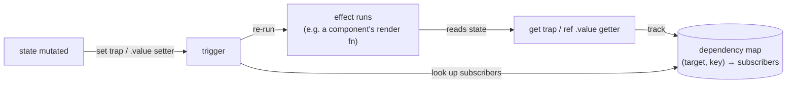

# Vue 3 in Depth

A study guide to modern Vue — Vue 3, the Composition API, and the ecosystem that surrounds it (Vite, Vue Router, Pinia, Vitest, Nuxt) — written for an engineer who is already fluent in JavaScript and TypeScript and wants to understand Vue *as a system*, not as a pile of API names. If you've worked through the [TypeScript guide](TYPESCRIPT_STUDY_GUIDE.md) in this repo, you'll feel at home: the same approach applies here. We build one central mental model — **Vue's reactivity system, a Proxy-based dependency-tracking engine in which effects automatically re-run when the data they read changes** — and then show that almost everything else in Vue (computed properties, watchers, component re-rendering, Pinia stores, composables) is just that one engine wearing different clothes. Once you can answer "what is being tracked, and which effect will re-run?" for any line of Vue code, the framework stops being magic.

The guide is honest about trade-offs. Vue has two component-authoring styles (Options and Composition), two reactive container types (`ref` and `reactive`), and at least three reasonable ways to share state across components — and the community has converged on clear defaults for each, for reasons worth understanding rather than memorizing. Where a comparison to React clarifies a design decision (and your mental model may be contaminated by React habits like dependency arrays and `useMemo`), we make the comparison explicit. Where Vue's official position is "either is fine," we say so instead of inventing a rule.

Primary references: the [official Vue guide](https://vuejs.org/guide/introduction.html) (genuinely one of the best-written framework docs in existence — this guide is a companion to it, not a replacement), the [Vue API reference](https://vuejs.org/api/), the [Vue Router](https://router.vuejs.org/) and [Pinia](https://pinia.vuejs.org/) docs, [Vitest](https://vitest.dev/) and [Vue Test Utils](https://test-utils.vuejs.org/) for testing, and the [SFC Playground](https://play.vuejs.org/) for trying anything in this guide instantly in the browser. For third-party depth: [Vue Mastery](https://www.vuemastery.com/) (video courses, including Evan You walking through the reactivity internals), [Michael Thiessen's blog](https://michaelnthiessen.com/) (the best prose writing on Vue patterns), and [VueUse](https://vueuse.org/) by Anthony Fu (read its source — it is a masterclass in composable design). Companion guides in this repo: [TypeScript](TYPESCRIPT_STUDY_GUIDE.md), [Electron](ELECTRON_STUDY_GUIDE.md) (which uses Vue for its renderer), and [GitHub Actions](GITHUB_ACTIONS_STUDY_GUIDE.md) (for CI).

---

## Table of Contents

1. [Part 1 — Orientation: What Vue Is](#part-1--orientation-what-vue-is)
2. [Part 2 — Tooling: Vite and the Modern Vue Project](#part-2--tooling-vite-and-the-modern-vue-project)
3. [Part 3 — Single-File Components and How They Compile](#part-3--single-file-components-and-how-they-compile)
4. [Part 4 — The Reactivity System (The Central Mental Model)](#part-4--the-reactivity-system-the-central-mental-model)
5. [Part 5 — Templates and Rendering](#part-5--templates-and-rendering)
6. [Part 6 — Components: Props, Events, v-model, and Slots](#part-6--components-props-events-v-model-and-slots)
7. [Part 7 — The Component Lifecycle and provide/inject](#part-7--the-component-lifecycle-and-provideinject)
8. [Part 8 — Composables: Vue's Unit of Logic Reuse](#part-8--composables-vues-unit-of-logic-reuse)
9. [Part 9 — Vue Router](#part-9--vue-router)
10. [Part 10 — State Management with Pinia](#part-10--state-management-with-pinia)
11. [Part 11 — Data Fetching and Forms](#part-11--data-fetching-and-forms)
12. [Part 12 — Transitions, Teleport, and the Other Built-ins](#part-12--transitions-teleport-and-the-other-built-ins)
13. [Part 13 — Testing: Vitest and Vue Test Utils](#part-13--testing-vitest-and-vue-test-utils)
14. [Part 14 — Performance](#part-14--performance)
15. [Part 15 — TypeScript Integration](#part-15--typescript-integration)
16. [Part 16 — Nuxt and When You Need It](#part-16--nuxt-and-when-you-need-it)
17. [Appendix — Common Pitfalls, Collected](#appendix--common-pitfalls-collected)
18. [Coda — How to Actually Learn This](#coda--how-to-actually-learn-this)

---

## Part 1 — Orientation: What Vue Is

Guide: [Introduction](https://vuejs.org/guide/introduction.html)

Vue calls itself "the progressive framework," and the phrase is load-bearing. It means Vue is designed to be adopted incrementally: you can sprinkle it onto a server-rendered page as a script tag, build a full single-page application with routing and stores, or render on the server with Nuxt — and the core programming model is the same at every scale. In practice, this guide targets the middle of that spectrum, which is also where the jobs are: a Vite-built single-page application written in TypeScript with `<script setup>` components, Vue Router, and Pinia.

At its core, Vue is two cooperating systems, and keeping them separate in your head pays off constantly:

1. **A reactivity system** — a standalone library (`@vue/reactivity`, usable entirely without components) that lets you declare *state* and *effects*, and guarantees that when state changes, exactly the effects that read that state re-run. This is Part 4, and it is the heart of everything.
2. **A renderer** — a virtual-DOM engine that knows how to turn a component's *render function* into real DOM nodes and patch them efficiently when they change. You almost never interact with this directly; the template compiler (Part 3) writes render functions for you, and the reactivity system decides when they re-run.

The marriage of the two is the whole framework: **a component's render function is just a reactive effect.** It reads reactive state while producing the virtual DOM; the reactivity system records what it read; when any of that state changes, the render effect is queued to re-run, the renderer diffs old against new, and the DOM updates. Every Vue feature you will meet — `computed`, `watch`, Pinia stores, the reactive `route` object — is either a kind of reactive state or a kind of effect.

### Vue and React, Framed Honestly

You will likely interview with people who know React, so it's worth being able to articulate the real differences rather than the tribal ones. Both are component-based virtual-DOM libraries with one-way data flow. The deep difference is the **change-detection model**:

| | React | Vue |
|---|---|---|
| How change is detected | You call `setState`/`setX`; React re-renders the component and its children by default | You mutate reactive state; Vue's Proxies *observe* the mutation |
| Granularity | Whole component subtree re-renders unless you memoize (`memo`, `useMemo`, `useCallback`) | Only components whose render effect actually *read* the changed state re-render |
| Derived state | `useMemo` with a manually maintained dependency array | `computed()` — dependencies tracked automatically |
| Performance tuning | Opt *out* of re-rendering (memoization) | Mostly automatic; opt out of *tracking* in rare cases (`shallowRef`, `v-memo`) |

React's model is "re-run everything and make it cheap"; Vue's is "know precisely what changed and re-run only that." The cost of Vue's model is the machinery you must understand — Proxies, refs, `.value` — which is exactly why Part 4 of this guide is the longest. The payoff is that there is no Vue equivalent of dependency-array bugs or `useCallback` ceremony: the framework tracks dependencies *at runtime, by observing actual reads*, so it is never wrong about them.

The other visible difference is templates versus JSX. Vue templates are constrained — they're declarative HTML with directives, not arbitrary code — and that constraint is a feature: because the compiler can statically analyze a template, it emits pre-optimized render code (Part 3) that a hand-written or JSX render function can't match without manual effort. Vue *supports* JSX when you genuinely need dynamic render logic, but idiomatic Vue uses templates, and you should too.

### Options API vs Composition API

Guide: [API Styles](https://vuejs.org/guide/introduction.html#api-styles), FAQ: [Composition API FAQ](https://vuejs.org/guide/extras/composition-api-faq.html)

Vue 3 supports two ways to author a component. The **Options API** organizes a component into named option buckets — `data()`, `computed`, `methods`, `watch`, lifecycle options like `mounted()` — and exposes state on `this`. The **Composition API** organizes a component as ordinary function code: you call `ref()`, `computed()`, `watch()`, and lifecycle hooks inside a single `setup` scope (in practice, the body of `<script setup>`), and what you declare is what the template sees.

This guide teaches the Composition API exclusively, because that is what the ecosystem has converged on for new code — Pinia's setup stores, VueUse, Nuxt's conventions, and TypeScript inference all assume it. But the honest accounting:

- **The Options API is not deprecated and is genuinely fine** for small-to-medium components. It enforces an organization (state here, methods there) that beginners and teams with rotating contributors sometimes benefit from, and it's what you'll find in older codebases you may be asked to maintain.
- **The Composition API wins as logic grows**, for two reasons. First, *colocation*: a feature's state, derived values, watchers, and cleanup can sit together instead of being smeared across five option buckets. Second — and this is the decisive one — *extraction*: any chunk of that code can be cut and pasted into a plain function (a composable, Part 8) and reused across components. The Options API's only reuse mechanism was mixins, which suffered from invisible property merging and name collisions; composables make data flow explicit.
- TypeScript support is dramatically better with Composition: types flow through ordinary function calls, whereas typing `this` in the Options API requires compiler heroics.

The pragmatic rule: read both fluently (you will encounter Options API code), write Composition API with `<script setup>` for everything new, and don't refactor working Options API components just for style points.

Since you'll need read-fluency, here is the same counter in both dialects, with the mapping made explicit — this is the only Options API code in the guide, and it's enough to decode any you encounter:

```vue
<!-- Options API -->
<script>
export default {
  props: { step: { type: Number, default: 1 } },
  data() { return { count: 0 } },                  // → ref()
  computed: { doubled() { return this.count * 2 } }, // → computed()
  watch: { count(val) { console.log(val) } },       // → watch()
  mounted() { console.log('ready') },               // → onMounted()
  methods: { increment() { this.count += this.step } }, // → plain functions
}
</script>
```

```vue
<!-- Composition API, <script setup> -->
<script setup>
import { ref, computed, watch, onMounted } from 'vue'

const props = defineProps({ step: { type: Number, default: 1 } })
const count = ref(0)
const doubled = computed(() => count.value * 2)
watch(count, (val) => console.log(val))
onMounted(() => console.log('ready'))
function increment() { count.value += props.step }
</script>
```

Same component, same reactivity engine underneath — the Options API is, in fact, *implemented on top of* the Composition API in Vue 3. The translation table is nearly mechanical (`data` → `ref`s, option buckets → function calls, `this.x` → `x` or `x.value`), which is also why migrating a component is usually an hour of typing, not a redesign.

```quiz
Q: The deep difference between React and Vue is the change-detection model. How does Vue detect that something changed?
- [ ] You call a setX function and Vue re-renders the component and its children
- [x] You mutate reactive state and Vue's Proxies *observe* the mutation, so only components whose render actually *read* the changed state re-render — dependencies are tracked at runtime by observing real reads, so they're never wrong
- [ ] Vue diffs the entire component tree on every tick
- [ ] Vue compares previous and next props with a shallow equality check
> React's model is "re-run everything and make it cheap" (re-render the subtree unless you memoize); Vue's is "know precisely what changed and re-run only that." The cost is the machinery you must learn (Proxies, refs, `.value`); the payoff is no dependency-array bugs or `useCallback` ceremony, because tracking happens by observing actual reads rather than a list you maintain.

Q: The guide says "a component's render function is just a reactive effect." What does that unify?
- [ ] It means components can't have side effects
- [ ] It means every component re-renders on every state change
- [x] The render function reads reactive state while producing virtual DOM; the engine records those reads and re-queues the render effect when any of that state changes — so re-rendering is the same dependency-tracking mechanism as `computed` and `watch`, not a separate system
- [ ] It means templates are interpreted at runtime
> Vue is two cooperating systems — a reactivity engine and a renderer — married by this one idea. Because the render function is an effect, the engine knows exactly which components depend on which state and re-runs only those. Every feature you meet (`computed`, `watch`, Pinia, the reactive route) is then just a kind of reactive state or a kind of effect, which is why one mental model explains the whole framework.

Q: Both Options and Composition APIs are supported. Why does the Composition API "win as logic grows"?
- [ ] It runs faster at runtime
- [ ] The Options API is deprecated
- [x] Colocation (a feature's state, derived values, watchers, and cleanup sit together instead of smeared across option buckets) and extraction (any chunk lifts into a plain composable function and is reused) — where the Options API's only reuse was mixins, with invisible merging and name collisions
- [ ] It requires less TypeScript
> Both compile to the same engine (the Options API is implemented on top of Composition). For small components the Options API's enforced organization is genuinely fine. But as a component grows, Composition lets related logic live together and, decisively, be extracted into composables with explicit data flow — solving exactly what mixins did badly. TypeScript inference is also far better through ordinary function calls than through `this`.
```

---

## Part 2 — Tooling: Vite and the Modern Vue Project

Guide: [Quick Start](https://vuejs.org/guide/quick-start.html), [Tooling](https://vuejs.org/guide/scaling-up/tooling.html), Vite: [Why Vite](https://vite.dev/guide/why.html)

Modern Vue projects are scaffolded with one command:

```bash
npm create vue@latest
```

This runs [create-vue](https://github.com/vuejs/create-vue), the official scaffolding tool (it replaced the old webpack-based Vue CLI years ago), and walks you through prompts for TypeScript, Vue Router, Pinia, Vitest, ESLint, and Prettier. Say yes to TypeScript, Router, Pinia, and Vitest — those are the assumed stack for the rest of this guide and for most job postings. What comes out is a [Vite](https://vite.dev/) project.

### Why Vite Is Fast (and Why You Should Care)

Vite's speed isn't an implementation detail to shrug at; it shapes how you work. Traditional bundlers (webpack) build a complete dependency graph and bundle *before* the dev server can respond. Vite inverts this: in development it serves your source files **as native ES modules**, transforming each file on demand the moment the browser requests it. Dependencies from `node_modules` are pre-bundled once with esbuild (written in Go, ~100x faster than JS-based tooling) and cached. The result is a dev server that starts in milliseconds regardless of app size, and hot module replacement (HMR) that stays instant at 10 or 10,000 components — when you edit a `.vue` file, Vite swaps just that module, and Vue's HMR integration preserves component state where it can.

For production, `vite build` switches to [Rollup](https://rollupjs.org/) for a traditional optimized bundle: tree-shaking, minification, asset hashing, and automatic code-splitting at every dynamic `import()` (which is what makes lazy-loaded routes in Part 9 a one-line change). The dev/prod asymmetry occasionally matters — always run `vite preview` against a production build before shipping, because dev mode's unbundled serving can mask issues like circular imports or incorrect asset paths.

Configuration lives in `vite.config.ts`, and the part you'll touch most is the `@` path alias (pointing at `src/`, set up by create-vue) and `server.proxy` for forwarding `/api` requests to a backend during development to avoid CORS pain.

### Project Structure

There is no enforced layout, but the community convention is stable enough to treat as a default:

```
src/
  assets/          # Static assets processed by Vite (images, global CSS)
  components/      # Reusable UI components
  composables/     # Shared Composition API logic (useX.ts files)
  layouts/         # Page-shell wrapper components
  views/ (pages/)  # Route-level components, one per route
  router/          # createRouter() and route definitions
  stores/          # Pinia stores
  services/        # API clients and external-service wrappers
  types/           # Shared TypeScript types
  utils/           # Pure, framework-free utility functions
  App.vue          # Root component
  main.ts          # createApp(), plugin installation, mount
```

Two boundaries in this layout deserve respect. **`views/` versus `components/`**: route-level components own data fetching and page composition; reusable components receive props and emit events. Keeping that line crisp is the cheapest architecture decision you'll ever make. **`services/` and `utils/` are framework-free**: code in them imports nothing from Vue, which keeps it trivially testable and portable. If a "utility" needs `ref` or lifecycle hooks, it's a composable and belongs in `composables/`.

`main.ts` is short and worth reading once in full, because it's the only imperative bootstrapping in the app:

```ts
import { createApp } from 'vue'
import { createPinia } from 'pinia'
import App from './App.vue'
import router from './router'

const app = createApp(App)
app.use(createPinia())   // installs Pinia (Part 10)
app.use(router)          // installs Vue Router (Part 9)
app.mount('#app')        // renders App into <div id="app"> in index.html
```

`createApp` returns an application instance; `use()` installs plugins; `mount()` kicks off the first render. Everything after this line is reactive and declarative.

### Environment Variables and Modes

Vite loads `.env` files per mode — `.env` always, `.env.development` and `.env.production` by build mode — and exposes variables to your code as `import.meta.env.VITE_API_URL`. The prefix rule is a security boundary, not a naming convention: **only `VITE_`-prefixed variables reach client code**, and everything that does reach client code ships, readable, in your bundle. So `VITE_*` is for *configuration* (API origins, feature flags, public keys); secrets have no legitimate home in a frontend build, full stop — anything secret belongs behind your API. The TypeScript types for your variables go in `env.d.ts` (augmenting `ImportMetaEnv`), which turns a typo'd variable name into a compile error instead of an `undefined` baked into production.

### Editor and Lint Tooling

Use VS Code with the official **Vue extension** (formerly called Volar; the marketplace name is simply "Vue"). It understands `.vue` files end-to-end — template expressions are type-checked against your script types, so a typo'd prop name or a `string` passed to a `number` prop is a red squiggle, not a runtime mystery. For CLI type-checking (CI, pre-commit), the scaffold wires up `vue-tsc`, a `tsc` wrapper that understands SFCs. Add [eslint-plugin-vue](https://eslint.vuejs.org/) with the `flat/recommended` config to catch Vue-specific correctness issues (missing `:key`, mutated props, mis-ordered SFC blocks), and let Prettier own formatting so reviews stay about substance. None of this is optional ceremony: Vue's template DSL only stays honest if tooling checks it.

```quiz
Q: Why does a Vite dev server start in milliseconds regardless of app size, where webpack slows as the app grows?
- [ ] Vite skips type-checking and linting in development
- [ ] Vite keeps the whole app in memory as one pre-built bundle
- [x] Vite serves source files as native ES modules, transforming each on demand when the browser requests it, and pre-bundles node_modules once with esbuild — so there's no up-front whole-graph bundle to build before the server can respond
- [ ] Vite compiles the app to WebAssembly
> Traditional bundlers build a complete dependency graph and bundle *before* serving; Vite inverts this, letting the browser's native ESM support pull modules on demand and transforming them lazily. Dependencies are pre-bundled with esbuild (Go, ~100× faster than JS tooling) and cached. The payoff is startup and HMR that stay instant at 10 or 10,000 components.

Q: `vite build` uses Rollup, but the dev server doesn't. What discipline does that dev/prod asymmetry demand?
- [x] Run `vite preview` against a production build before shipping — dev mode's unbundled native-ESM serving can mask issues (circular imports, wrong asset paths) that only appear in the Rollup-bundled, tree-shaken, code-split production output
- [ ] Never use dynamic import(), since it behaves differently in each
- [ ] Disable HMR so dev matches prod exactly
- [ ] Always build with esbuild instead of Rollup
> Dev serves unbundled modules for speed; production is a real optimized bundle (tree-shaking, minification, asset hashing, automatic code-splitting at every dynamic import). Because the two paths differ, a class of bugs is invisible in dev. `vite preview` runs the actual production build locally so you catch them before users do.

Q: Vite exposes env vars as `import.meta.env.*`, but only `VITE_`-prefixed ones reach your code. Why is that a security boundary, not just a naming rule?
- [ ] Non-prefixed variables simply load more slowly
- [ ] The prefix is required for TypeScript to type them
- [x] Everything that reaches client code ships readable in the bundle, so the prefix gates what becomes public — `VITE_*` is for configuration (API origins, feature flags, public keys), and secrets have no legitimate home in a frontend build at all
- [ ] VITE_ variables are encrypted in the bundle
> A frontend bundle is downloaded by every user, so any value baked into it is public by definition. The prefix forces an explicit decision about what's safe to expose. The corollary is absolute: secrets (API keys with write access, DB credentials) belong behind your API, never in `VITE_*` — anything in client code is one "view source" away from the world.
```

---

## Part 3 — Single-File Components and How They Compile

Guide: [SFC Syntax](https://vuejs.org/api/sfc-spec.html), [`<script setup>`](https://vuejs.org/api/sfc-script-setup.html), [SFC CSS Features](https://vuejs.org/api/sfc-css-features.html)

A Vue component is usually authored as a **Single-File Component** — a `.vue` file with three blocks:

```vue
<script setup lang="ts">
import { ref } from 'vue'

const count = ref(0)
function increment() {
  count.value++
}
</script>

<template>
  <button @click="increment">Count is {{ count }}</button>
</template>

<style scoped>
button {
  font-weight: 600;
}
</style>
```

The blocks map to the three concerns of any UI: logic, structure, presentation. The SFC's bet — opposite to React's "everything is JS" bet — is that these concerns belong in *one file per component* but in *separate languages within it*, each language being the best tool for its concern. After a few weeks this feels less like a constraint and more like a relief: you always know where to look.

### `<script setup>`: What the Macros Really Are

`<script setup>` is the modern authoring style, and it's worth understanding what it actually *is*: syntactic sugar, applied at compile time, for a component with a `setup()` function. Every top-level binding — variables, functions, imports — is automatically exposed to the template. There is no `export default`, no `return { count, increment }` boilerplate, no `this`. The compiler does that wiring.

Inside `<script setup>` you'll meet a family of **compiler macros**: `defineProps`, `defineEmits`, `defineModel`, `defineExpose`, `defineOptions`, `defineSlots`. These look like functions but *are not imported and do not exist at runtime* — the compiler recognizes them, extracts their type arguments or options into the component definition, and deletes the calls. This is why `defineProps<{ title: string }>()` can do something no real function can: turn a pure TypeScript type into runtime prop validation. We'll use each macro in context (props and emits in Part 6); for now, just internalize that they are compile-time declarations, not calls.

Two macros are worth flagging early because they answer "where did the old options go?": `defineOptions({ name: 'MyComponent', inheritAttrs: false })` covers the rare component options that have no macro of their own, and `defineExpose({ focus })` controls what a parent holding a template ref to your component can see (by default, `<script setup>` components are sealed — nothing is exposed, which is the right default).

An SFC may also carry a *second*, plain `<script>` block alongside `<script setup>` — it runs once at module load (not per instance) and is the home for module-scope exports like constants or helper types that other files import from the component. Rare, but when you see both blocks in one file, that's what's happening.

### The Compilation Pipeline: Template → Render Function

This is the second mental model of the guide (after reactivity), and it demystifies a lot. **Vue templates are not interpreted at runtime — they are compiled, at build time, into JavaScript render functions.** When Vite processes an SFC, `@vue/compiler-sfc` parses the template into an AST, applies transforms, and emits a function that builds virtual DOM nodes. Conceptually:

```html
<div class="card">
  <h2>{{ title }}</h2>
  <button @click="save">Save</button>
</div>
```

becomes (simplified):

```js
function render(_ctx) {
  return h('div', { class: 'card' }, [
    h('h2', null, toDisplayString(_ctx.title)),
    h('button', { onClick: _ctx.save }, 'Save'),
  ])
}
```

Each `h()` call creates a **vnode** — a plain object describing an element. When state changes, the render function re-runs, produces a new vnode tree, and the renderer diffs it against the previous tree to compute minimal DOM patches.

But the *actual* output is smarter than the simplified version, and this is where the template constraint pays off. Because the compiler can see that `class="card"` is static and only `{{ title }}` and the children can change, it emits **patch flags** — bitmasks attached to vnodes saying "only the text content of this node is dynamic" — and **hoists/caches static subtrees** so they're created once and reused on every re-render. It also organizes output into **block trees**: a block collects only its *dynamic* descendants into a flat array, so diffing skips static structure entirely instead of walking it. The result is that Vue's diff cost scales with the amount of *dynamic* content in a template, not its total size. This "compiler-informed virtual DOM" is the answer to "isn't virtual DOM diffing wasteful?" — Vue's compiler removes most of the waste because templates are analyzable. (The logical endpoint of this direction is **Vapor mode**, an experimental compilation strategy that skips the virtual DOM entirely and compiles templates to direct DOM operations — worth knowing the name, not worth waiting for.) You can watch all of this happen in the [Template Explorer](https://template-explorer.vuejs.org/) or the [SFC Playground](https://play.vuejs.org/), and you should spend ten minutes doing so; seeing the generated code once permanently grounds your model of what a template *is*.

The practical consequences: template expressions must be expressions (no statements — complex logic belongs in `computed`), templates can be statically validated by tooling (Part 2), and there is no runtime template-parsing cost in production builds.

### Scoped Styles

`<style scoped>` makes a component's CSS apply only to its own elements. The mechanism is simple and worth knowing because you'll eventually fight it: the compiler adds a unique data attribute (e.g. `data-v-7ba5bd90`) to every element rendered by the component, and rewrites your selectors to require it (`button` becomes `button[data-v-7ba5bd90]`). It is *compile-time scoping*, not shadow DOM — global CSS can still reach in, and specificity rules still apply.

The edges: a child component's *root* element receives the parent's scope attribute too (so the parent can set layout-ish styles on it), but nothing deeper. When you legitimately need to style a child's internals — a third-party component, say — use `:deep(.inner-class)` to opt one selector out of the rewrite. `:slotted()` targets content passed into your slots, and `:global()` escapes scoping entirely. There is also `<style module>` (CSS Modules, classes accessed as `$style.card`), which is preferable for library code where consumers shouldn't depend on your class names. For application code, `scoped` plus a utility framework like Tailwind covers nearly everything; the deeper trade-offs are a styling-architecture question, not a Vue question.

One more SFC trick that punches above its weight: `v-bind()` in CSS. Writing `color: v-bind(accentColor)` in a `<style>` block wires a CSS property to reactive state via a CSS custom property — the compiled output updates a `--xxxx` variable on the component root whenever `accentColor` changes. It's the cleanest way to drive styles from state without inline-style soup.

```quiz
Q: "Vue templates are not interpreted at runtime." What actually happens to a template?
- [ ] The browser parses the template string on each render
- [x] At build time `@vue/compiler-sfc` parses the template into an AST and emits a JavaScript render function that builds vnodes — so production has no template-parsing cost, and the template can be statically validated by tooling
- [ ] The template is sent to the server to render
- [ ] Templates are stored as strings and eval'd lazily
> Compiling templates ahead of time is what makes Vue's constrained template DSL pay off: the output is plain render code, there's zero runtime parsing, and tooling (the Vue extension, vue-tsc) can type-check template expressions against your script. It also enables the optimizations below — the compiler can analyze what's static because it sees the whole template at build time.

Q: How does Vue answer the objection "isn't virtual-DOM diffing wasteful?"
- [ ] It caches the entire DOM and never diffs
- [ ] It re-renders the whole component subtree like React
- [x] Because templates are statically analyzable, the compiler emits patch flags (which node is dynamic and how), hoists static subtrees to create them once, and builds block trees that collect only dynamic descendants — so diff cost scales with *dynamic* content, not template size
- [ ] It diffs on a background thread
> This "compiler-informed virtual DOM" is the key difference from a hand-written or JSX render function. The compiler sees that `class="card"` is static and only `{{ title }}` changes, so it marks exactly that and skips static structure during diffing. (Vapor mode is the experimental endpoint that drops the vnode layer entirely.) It's why Vue's templates can be both ergonomic and fast.

Q: `defineProps`, `defineEmits`, and `defineModel` look like functions but "do not exist at runtime." What are they?
- [ ] Global runtime helpers Vue injects into every component
- [ ] Ordinary functions re-exported from the 'vue' package
- [x] Compiler macros — the compiler recognizes them, extracts their type arguments or options into the component definition, and deletes the calls, which is why `defineProps<{ title: string }>()` can turn a pure TypeScript type into runtime prop validation
- [ ] Decorators that run during component mount
> Because they're compile-time declarations rather than calls, they can do things no real function could — most strikingly, lifting a TypeScript type into runtime validation, which a normal function (whose type arguments are erased) cannot. Internalizing "these are compile-time, not runtime" prevents confusion about why you don't import them and why they must be called at the top level of `<script setup>`.
```

---

## Part 4 — The Reactivity System (The Central Mental Model)

Guide: [Reactivity Fundamentals](https://vuejs.org/guide/essentials/reactivity-fundamentals.html), [Reactivity in Depth](https://vuejs.org/guide/extras/reactivity-in-depth.html)

Everything in this part repays careful reading. Reactivity is the one piece of Vue you cannot fake your way through: every confusing Vue bug you will ever debug — "why didn't my UI update?", "why did this watcher fire twice?", "why is my destructured value stale?" — is a reactivity question, and every one of them has a precise answer once you hold the model.

### The Problem Reactivity Solves

Start from first principles. In plain JavaScript, assignments are inert:

```js
let price = 10
let quantity = 2
let total = price * quantity   // 20

price = 20
console.log(total)             // still 20 — nothing "re-ran"
```

`total` was computed once; JavaScript has no notion of "keep this up to date." A UI framework's whole job is to fix this: when `price` changes, everything *derived from* `price` — computed totals, the DOM showing them — should update. There are two requirements hiding in that sentence:

1. **Detect** that `price` changed (interception).
2. **Know what depends on** `price`, so we re-run exactly that and nothing else (dependency tracking).

Vue solves (1) with Proxies and (2) with effects. Take them in turn.

### Interception: Proxies and Why `ref` Needs `.value`

JavaScript gives you exactly one general tool for observing property access on an object: the ES2015 [`Proxy`](https://developer.mozilla.org/en-US/docs/Web/JavaScript/Reference/Global_Objects/Proxy). A Proxy wraps a target object and lets you intercept operations on it — every property read hits your `get` trap, every write hits your `set` trap. This is what `reactive()` returns:

```js
import { reactive } from 'vue'

const state = reactive({ count: 0 })
// `state` is NOT the plain object — it's a Proxy around it.
// state.count        → get trap fires → Vue records "someone read 'count'"
// state.count = 1    → set trap fires → Vue notifies everyone who read 'count'
```

Crucially, a Proxy can only wrap an **object**. There is no mechanism in JavaScript to intercept reads and writes of a standalone primitive — `let count = 0; count = 1` is invisible to everyone. This single language limitation explains `ref`, the API that confuses every newcomer:

```js
import { ref } from 'vue'

const count = ref(0)
console.log(count.value)  // read through .value
count.value++             // write through .value
```

A `ref` is a tiny container object — conceptually `{ value: 0 }` — whose `value` property has a getter and setter. The getter *tracks* (records who's reading), the setter *triggers* (re-runs the readers). **`.value` is not bureaucracy; it is the interception point.** A primitive can't be observed, so Vue puts it in a box that can be. Once you see `.value` as "the door reactivity walks through," it stops feeling like noise — every `.value` in your code marks a spot where dependency tracking happens, which is genuinely useful information when reading code.

Two refinements complete the picture. First, refs holding **objects** get the best of both: `ref({ a: 1 })` stores a `reactive()` proxy of the object in `.value`, so deep mutations (`obj.value.a = 2`) are tracked too. Second, in **templates**, refs are auto-unwrapped — you write `{{ count }}`, not `{{ count.value }}` — because the compiler knows top-level bindings from `<script setup>` and inserts `.value` for you. The asymmetry (`.value` in script, bare in template) is the price of templates staying clean; you'll stop noticing it within a week.

### Dependency Tracking: Effects

The second half of the engine. An **effect** is a function that Vue runs while keeping a global note of "this effect is currently running." Every reactive read that happens during the run — every `get` trap, every ref `.value` getter — looks up that note and records the running effect as a **subscriber** of that particular object-property pair. When a `set` later fires on that pair, Vue re-runs the subscribed effects. In pseudocode, the entire mental model fits in a few lines:

```js
let activeEffect = null

function track(target, key) {           // called by every get trap
  if (activeEffect) subscribers(target, key).add(activeEffect)
}

function trigger(target, key) {          // called by every set trap
  for (const effect of subscribers(target, key)) effect.run()
}

function watchEffect(fn) {
  const effect = { run() { activeEffect = effect; fn(); activeEffect = null } }
  effect.run()                           // run once to collect dependencies
}
```



Three properties of this design are worth dwelling on, because they explain Vue's ergonomics:

- **Dependencies are discovered by running, not declared.** There is no dependency array to maintain and therefore no stale-dependency bug. If your effect reads `a.value` this run, it depends on `a` — period.
- **Dependencies are re-collected on every run.** If an effect has a branch — `if (show.value) text.value else 'hidden'` — then while `show` is false, the effect *isn't subscribed to `text` at all*, because it didn't read it. Changing `text` triggers nothing. This is exactly right (why re-run for a value you're not displaying?) and exactly the kind of behavior you can only predict by holding the model.
- **Tracking is per-property, not per-object.** An effect that reads `user.name` does not re-run when `user.email` changes. This is the fine granularity that lets Vue skip the manual memoization React requires.

And now the punchline from Part 1, stated precisely: **a component's render function runs inside an effect.** Rendering reads reactive state → the render effect subscribes to exactly those properties → mutating any of them queues a re-render of exactly the components that read them. `computed` and `watch` are the same machinery with different scheduling. There is one engine; everything is a client of it.

For the genuinely curious: the real implementation (rewritten in Vue 3.4 and again in 3.5 for memory and speed) lives in [`@vue/reactivity`](https://github.com/vuejs/core/tree/main/packages/reactivity) and is readable in an afternoon. Vue Mastery's [Vue 3 Reactivity course](https://www.vuemastery.com/courses/vue-3-reactivity/vue3-reactivity/) walks Evan You building this exact pseudocode up into the real thing.

### Why Destructuring Breaks Reactivity

This is the most common Composition API bug, and with the model in hand it isn't mysterious — it's obvious:

```js
const state = reactive({ count: 0 })
const { count } = state   // ❌ count is now a plain number: 0

count                      // no get trap — nothing is tracked
state.count = 5            // count is still 0; nothing observed this read
```

Destructuring is just property access plus assignment: it reads `state.count` **once** (firing the get trap once, during the destructure — uselessly, since no effect is collecting) and copies the *current value* into a new local binding. That local `count` is a plain number with no connection to the proxy. All future reads of it bypass the proxy entirely, so no effect ever subscribes, so nothing ever updates. The same applies to passing `state.count` as a function argument: the function receives `0`, not a reactive thing.

The rule that falls out: **reactivity lives in object property access (or `.value` access) — sever the property access and you sever the reactivity.** The fixes all preserve a trackable container:

```js
const { count } = toRefs(state)  // count is a Ref linked to state.count — reads/writes pass through
const count = toRef(state, 'count')  // same, for one property
// or simply: keep state.count access, or use ref() in the first place
```

`toRefs` converts each property of a reactive object into a ref whose getter/setter delegate to the original — destructuring refs is safe, because a ref *is itself* the trackable container; copying the ref copies the box, not the value. This, finally, is the deep reason the community default is `ref`:

### `ref` vs `reactive` — and Why `ref` Won

Both create reactive state; the API surface differs:

| | `ref(value)` | `reactive(obj)` |
|---|---|---|
| Holds | Anything, including primitives | Objects/arrays/Maps only |
| Access | `count.value` (auto-unwrapped in templates) | `state.count` directly |
| Replace wholesale | `count.value = newThing` ✅ | ❌ `state = newObj` disconnects the proxy |
| Destructure / pass around | Safe — the ref is the container | Breaks reactivity (above) |
| Return from composables | Natural | Hazardous (consumers will destructure) |

`reactive` reads more cleanly — no `.value` — and is tempting for grouped state like form models. But it has three sharp edges that `ref` doesn't: it can't hold primitives; it can't be reassigned (replacing a fetched object wholesale, a constant need in real apps, silently breaks every existing subscription); and it invites destructuring, which silently breaks reactivity. `ref`'s one cost is `.value`, which is visible, mechanical, and — per the model above — *informative*.

The community and the official docs have landed on the same default: **use `ref` for everything; reach for `reactive` only for a cohesive group of properties you will always access through the object and never replace** (a form model you mutate field-by-field is the classic legitimate case). Consistency matters more than the choice: a codebase that mixes both styles per-variable makes every reader re-derive which access pattern applies.

```quiz
Q: Why does a `ref` require `.value` in script while `reactive` objects don't?
- [ ] `.value` is legacy syntax Vue keeps for compatibility
- [x] A Proxy can only wrap an object, so primitives can't be observed directly; `ref` boxes the value in a container whose `.value` getter/setter is the interception point for tracking
- [ ] `.value` makes refs faster
- [ ] reactive is deprecated
> JavaScript offers no way to intercept reads/writes of a standalone primitive, so Vue can't track `let count = 0; count = 1`. A `ref` puts the value in a small object whose `.value` property has a getter (tracks) and setter (triggers) — `.value` is literally the door reactivity walks through. `reactive` works directly because a Proxy can wrap an object's property accesses; primitives have no such handle.

Q: `const { count } = reactive({ count: 0 })` then mutating `state.count` doesn't update `count`. Why?
- [ ] Destructuring is forbidden in Vue
- [x] Destructuring reads the property once and copies the current *value* into a plain local binding with no link to the proxy, so future reads bypass the get trap and nothing subscribes
- [ ] reactive only tracks the first property
- [ ] count needs to be a computed
> Reactivity lives in object property access — the get/set traps. Destructuring is just "read `state.count` once, copy the number into a new variable," and that local number has no connection to the proxy, so no effect ever tracks it. The fix is `toRefs(state)`, which gives each property as a ref; copying a ref copies the trackable container, not the value, so destructuring stays reactive.

Q: An effect contains `if (show.value) text.value else 'hidden'`. While `show` is false, mutating `text.value` triggers nothing. Why is that correct?
- [ ] It's a bug in dependency tracking
- [x] Dependencies are re-collected each run by what's actually *read*; with `show` false the effect never reads `text`, so it isn't subscribed to it — no point re-running for a value it isn't displaying
- [ ] text needs to be in a dependency array
- [ ] Vue caches the branch result
> Vue discovers dependencies by running the effect and recording every reactive read, re-collected each run. With `show` false, `text.value` is never read, so the effect doesn't subscribe to `text` and changing it does nothing. This per-run, per-property tracking is why there's no dependency array to maintain (no stale-deps bug) and why Vue skips re-renders React would need manual memoization to avoid.
```

Round out the toolbox with the escape hatches, each comprehensible from the model: `shallowRef`/`shallowReactive` track only the top level (use for large data structures or class instances where deep proxying is wasted cost — pair `shallowRef` with `triggerRef` to notify manually after deep mutation); `readonly()` wraps a proxy whose set trap warns instead of triggering (expose state without granting mutation); `markRaw()` brands an object "never proxy this" (essential for third-party instances — a Chart.js chart or a Map from a mapping library will misbehave if its internal identity checks meet a proxy wrapper); and `toRaw()` recovers the original target from a proxy at interop boundaries.

A last set of mechanics worth pinning down precisely, because they generate quiz-grade confusion: **when do refs unwrap?** Three rules cover it. In *templates*, only top-level bindings auto-unwrap — `{{ count }}` works, and so does `{{ obj.count }}` when `obj` is reactive, but a ref *inside a plain object* (`{{ wrapper.countRef }}`) does not unwrap unless it's also the whole expression. In *`reactive` objects*, nested refs unwrap transparently — `reactive({ count: ref(0) }).count` is `0`, not a ref, and assigning to it writes through to the ref (this is what makes `toRefs` round-trip cleanly). In *arrays and collections*, refs do **not** unwrap — `reactiveArr[0]` can be a ref you must `.value`. You don't need to engineer around these rules; you need to recognize them when an expression is mysteriously a `RefImpl` or mysteriously a number.

### `computed`: Derived State, Cached

Guide: [Computed Properties](https://vuejs.org/guide/essentials/computed.html)

A `computed` is a ref whose value is *defined by a function over other reactive state*:

```ts
const items = ref<CartItem[]>([])

const total = computed(() =>
  items.value.reduce((sum, i) => sum + i.price * i.qty, 0)
)
```

In the engine's terms, a computed is both an effect and a source: its getter runs as an effect (subscribing to `items`), and its result is a trackable ref that *other* effects can subscribe to. Three behaviors follow. It is **cached** — reading `total.value` ten times runs the getter once. It is **lazy** — the getter doesn't run until something reads it. And since Vue 3.4 it only notifies *its* subscribers when its computed value **actually changed**, so a re-derivation that lands on the same result doesn't ripple further.

The discipline: computed getters must be **pure** — no mutations, no async, no side effects. If you catch yourself wanting a side effect "when this derived value changes," that's a watcher. And whenever you find the same derivation expression in two places (template and script, or two templates), that's the signal it should be a computed. A writable computed (`computed({ get, set })`) exists for the narrow case of a two-way binding that translates between representations — useful with `v-model`, otherwise rare.

### `watch` vs `watchEffect`: Effects You Write Yourself

Guide: [Watchers](https://vuejs.org/guide/essentials/watchers.html)

Computeds *derive data*; watchers *perform side effects* — persist to localStorage, fire a network request, drive an imperative library. Vue gives you two shapes of the same underlying effect, and choosing between them is about how you want dependencies determined:

```ts
// watch: explicit source(s), lazy by default, gives old + new values
watch(searchQuery, async (newQuery, oldQuery) => {
  results.value = await api.search(newQuery)
})

// watchEffect: dependencies auto-tracked from whatever the body reads; runs immediately
watchEffect(() => {
  localStorage.setItem('draft', JSON.stringify(form.value))
})
```

**`watch`** is for "when *this specific thing* changes, do X." You name the source (a ref, a getter like `() => props.userId`, or an array of either); the callback gets old and new values; nothing runs until a change occurs (add `{ immediate: true }` to also run at setup). Because the *callback's* reads are not tracked — only the declared source is — `watch` cleanly separates "what I react to" from "what I use while reacting," which is usually what you want for data fetching.

**`watchEffect`** is for "keep this side effect in sync with whatever it reads." It runs once immediately, auto-tracks every reactive read in its body, and re-runs when any of them change. It shines when the trigger set and the used set are the same (the localStorage sync above) and gets dangerous when they aren't — an incidental read deep in the body silently becomes a trigger.

The options matter in practice. `{ deep: true }` on `watch` recursively touches every property of an object source so any nested change triggers (expensive on big structures — prefer watching a specific getter). `{ once: true }` (3.4+) self-disposes after the first trigger. `{ flush: 'post' }` defers the callback until after the DOM has updated — necessary when the watcher reads the DOM (`watchPostEffect` is the shorthand). And **cleanup**: a watcher callback receives an `onCleanup` registrar that runs before the *next* invocation and on stop — the correct home for aborting a stale fetch:

```ts
watch(searchQuery, async (query, _old, onCleanup) => {
  const controller = new AbortController()
  onCleanup(() => controller.abort())          // cancel if query changes again first
  results.value = await api.search(query, { signal: controller.signal })
})
```

Watchers created inside a component are stopped automatically when it unmounts. The decision heuristic, condensed: deriving a value → `computed`; reacting to a named change, especially async → `watch`; syncing a side effect with its own inputs → `watchEffect`. If you're using a watcher to compute state from other state, you've picked the wrong tool.

### Watching the Engine Work: Debugging Reactivity

Because tracking happens at runtime, you can *observe* it — and when a component re-renders mysteriously, observation beats theorizing. Two component hooks expose the render effect's bookkeeping in development builds:

```ts
import { onRenderTracked, onRenderTriggered } from 'vue'

onRenderTracked((e) => {
  // fires once per dependency the render effect subscribes to
  console.log('tracked', e.target, e.key)
})
onRenderTriggered((e) => {
  // fires when a dependency change queues a re-render — answers "why did it re-render?"
  console.log('triggered by', e.key, e.type)   // 'set' | 'add' | 'delete'
})
```

`watch` and `watchEffect` accept the same pair as `onTrack`/`onTrigger` options. [Vue DevTools](https://devtools.vuejs.org/) offers the no-code version: the component inspector shows live reactive state (editable in place — the fastest way to test "would the UI respond if this changed?"), and the timeline records re-renders with their triggers. Between the hooks and the devtools, "this updates too often" and "this doesn't update" both become five-minute investigations instead of console.log archaeology.

One more piece of machinery matters when you build abstractions: the **effect scope**. Every component implicitly creates one — a bag holding all effects (render, computeds, watchers) created during its setup — and unmounting disposes the whole bag at once, which is *why* watchers auto-stop with their component. The standalone API ([`effectScope()`](https://vuejs.org/api/reactivity-advanced.html#effectscope)) gives non-component code — a Pinia store, a long-lived composable — the same collect-and-dispose-together behavior; VueUse's safe-cleanup helpers are built on it. You'll rarely call it directly, but the concept answers "where do effects live, and who stops them?"

### Batching and `nextTick`

One last gear in the engine. Triggered effects do not run synchronously at the moment of the write — they are **queued and deduplicated**, then flushed on the next microtask. Mutate three refs in one handler and a component reading all three re-renders once, not three times. The consequence: immediately after a mutation, the DOM is stale.

```ts
import { nextTick } from 'vue'

showPanel.value = true
// document.querySelector('.panel')  → null! DOM not updated yet
await nextTick()
panelEl.value?.focus()               // now the DOM reflects the new state
```

`await nextTick()` resumes after the pending flush — it is the bridge you cross whenever post-update DOM access (focus, measurement, scroll) follows a state change. If you remember one thing from Part 4: **state is read through traps, effects subscribe by reading, writes trigger subscribed effects on the next microtask — and `.value` exists because primitives can't be trapped.** Every reactivity behavior in Vue is a corollary.

---

## Part 5 — Templates and Rendering

Guide: [Template Syntax](https://vuejs.org/guide/essentials/template-syntax.html), [Conditional Rendering](https://vuejs.org/guide/essentials/conditional.html), [List Rendering](https://vuejs.org/guide/essentials/list.html)

With compilation (Part 3) and reactivity (Part 4) in place, template syntax is mostly vocabulary — but a few constructs hide real semantics worth more than a flashcard.

The basics in one breath: `{{ expression }}` interpolates text (auto-escaped — XSS-safe by default); `v-bind:attr`, universally shortened to `:attr`, binds an attribute to an expression; `v-on:event`, shortened to `@event`, attaches a handler. Any single JavaScript *expression* is legal in these positions, but the working rule is to keep templates declarative: the moment an expression grows a ternary-inside-a-ternary or a method call chain, move it into a `computed` where it gains a name, a cache, and testability.

`:class` and `:style` get special treatment — they accept objects and arrays, which composes beautifully with reactive state:

```html
<button
  class="btn"
  :class="{ 'btn--primary': isPrimary, 'btn--loading': pending }"
  :disabled="pending"
>
```

Static `class` and bound `:class` merge; the object syntax reads as "apply this class when this condition holds," which is exactly how you think about it. Event modifiers fold common imperative noise into declarative suffixes — `@submit.prevent="save"` replaces a `preventDefault()` call, `@click.stop`, `@keyup.enter`, `@click.once` likewise — and are worth skimming [the full list](https://vuejs.org/guide/essentials/event-handling.html#event-modifiers) once so you stop writing event plumbing by hand.

### `v-if` vs `v-show`

Both conditionally display content; they do categorically different things. `v-if` is **structural**: when false, the subtree is not rendered at all — no vnodes, no component instances, no mounted hooks. Toggling it destroys and recreates components, with all the lifecycle and state-loss implications. `v-show` is **cosmetic**: the subtree always renders and mounts; toggling flips `display: none`. So: `v-if` for branches that are rarely shown or expensive to keep alive (it also short-circuits — guarded content like `v-if="user"` makes `user.name` inside safe); `v-show` for things toggled frequently where re-creation cost or state loss would hurt (tab panels, dropdown contents). If a component inside the branch must keep its state across toggles, that alone decides it: `v-show` (or `<KeepAlive>`, Part 12).

### `v-for` and Why Keys Actually Matter

```html
<li v-for="todo in todos" :key="todo.id">
  <input type="checkbox" v-model="todo.done" />
  {{ todo.text }}
</li>
```

The `:key` is not a lint formality; it is the identity hint the diffing algorithm uses to match old vnodes to new ones across re-renders. With stable keys (`todo.id`), reordering the array *moves DOM nodes*, preserving each row's element state (focus, checkbox state, child component state) along the way. With index keys — or no keys — Vue matches rows *positionally*: delete the first item and every row gets the *next* row's data patched into it, while any state that lives in the DOM or in child components stays behind in its old position. The classic bug is a list of items with input fields where deleting row 1 makes row 2's text appear in row 1's input. The rule is absolute for any list that can reorder, insert, or delete: **key by stable identity, never by index.** Index keys are acceptable only for lists that are append-only and never reorder.

### A Note on `v-html`

Interpolation (`{{ }}`) HTML-escapes its output, which is why Vue templates are XSS-safe by default — user content renders as text, never as markup. `v-html` is the deliberate exception: it assigns raw HTML to `innerHTML`, scripts-and-all semantics included. The rule is short because it must be absolute: **never feed `v-html` content a user influenced**, directly or through your database, unless it has passed through a real sanitizer ([DOMPurify](https://github.com/cure53/DOMPurify)) on the way. Rendering trusted, server-generated rich text (a CMS body, rendered Markdown) is the legitimate use; "it's just our users' comments" is the famous last words. Also note `v-html` content is invisible to scoped styles (it isn't compiled by Vue), which is your reminder that it's a hole in the template model, not part of it. More in [Security Best Practices](https://vuejs.org/guide/best-practices/security.html).

### Template Refs

Guide: [Template Refs](https://vuejs.org/guide/essentials/template-refs.html)

Sometimes you need the actual DOM element — to focus it, measure it, or hand it to a non-Vue library. Template refs are the sanctioned escape hatch:

```vue
<script setup lang="ts">
import { useTemplateRef, onMounted } from 'vue'

const input = useTemplateRef('search')   // Vue 3.5+; before: const input = ref<HTMLInputElement|null>(null)

onMounted(() => input.value?.focus())    // only populated after mount
</script>

<template>
  <input ref="search" placeholder="Search…" />
</template>
```

`useTemplateRef('search')` (Vue 3.5) returns a ref that Vue populates with the element matching `ref="search"` once the component mounts — before 3.5, the convention was a plain `ref(null)` whose *variable name* matched the attribute, which worked but was easy to get subtly wrong. Two rules keep refs honest: they are `null` until `onMounted` (and again after unmount), and they are for *imperative escape hatches only* — if you find yourself reading or writing application state through the DOM, you've abandoned the declarative model and the framework will fight you. A ref on a *component* yields the component's exposed instance instead of an element, which is rarer and gated by `defineExpose` (Part 3).

```quiz
Q: `v-if` and `v-show` both conditionally display content. What's the categorical difference, and when does it force your hand?
- [x] `v-if` is structural — false means no vnodes, no instance, no mounted hooks, so toggling destroys and recreates (losing component state); `v-show` is cosmetic — always rendered, toggling flips `display: none` — so a component that must keep state across toggles forces `v-show` (or `<KeepAlive>`)
- [ ] `v-if` is faster; `v-show` is always slower
- [ ] They're identical except `v-show` can't be used with components
- [ ] `v-show` removes the element from the DOM; `v-if` only hides it
> `v-if` is for branches rarely shown or expensive to keep alive (it also short-circuits, so `v-if="user"` makes `user.name` inside safe); `v-show` is for things toggled frequently where re-creation cost or state loss would hurt (tab panels, dropdown contents). The deciding question is often just "must the inner component keep its state across toggles?" — if yes, you can't use `v-if`.

Q: Why is `:key="todo.id"` on a `v-for` "not a lint formality"?
- [ ] It sorts the list automatically
- [ ] It makes the list reactive
- [x] It's the identity hint the diff uses to match old vnodes to new across re-renders — with stable keys, reordering *moves* DOM nodes and preserves each row's element/child state; with index keys, rows match positionally, so deleting row 1 patches row 2's data into row 1's element while DOM/child state stays behind
- [ ] It's only needed for server-side rendering
> The classic bug: a list of input rows where deleting the first makes the second's text appear in the first's input — because without stable keys Vue matches positionally and leaves DOM-resident state in place. The rule is absolute for any list that can reorder, insert, or delete: key by stable identity, never by index. Index keys are acceptable only for append-only lists that never reorder.

Q: Why are Vue templates "XSS-safe by default," and what is the one deliberate exception?
- [ ] Vue blocks all user input from templates
- [ ] Templates run in a sandboxed iframe
- [ ] Vue validates every expression against a schema
- [x] `{{ }}` interpolation HTML-escapes its output, so user content renders as text, never markup — the deliberate exception is `v-html`, which assigns raw HTML to innerHTML, so it must never receive user-influenced content unless sanitized (e.g. DOMPurify)
> Interpolation escaping is why the default is safe: an injected `<script>` shows up as literal text. `v-html` opts out for legitimate trusted rich text (a CMS body, rendered Markdown), but "it's just our users' comments" is the famous-last-words path to stored XSS. Sanitize anything a user influenced before `v-html`, and note such content is also invisible to scoped styles — a reminder it's a hole in the template model, not part of it.
```

---

## Part 6 — Components: Props, Events, v-model, and Slots

Guide: [Component Basics](https://vuejs.org/guide/essentials/component-basics.html), [Props](https://vuejs.org/guide/components/props.html), [Events](https://vuejs.org/guide/components/events.html), [Slots](https://vuejs.org/guide/components/slots.html)

A component is a unit of UI with a **contract**: data flows in through props, notifications flow out through events, and markup flows in through slots. Vue enforces the direction — props down, events up — and almost every component-design question reduces to "which side of the contract does this belong on?" This part walks the contract surface in the order you'll use it, with the TypeScript forms that production code actually uses.

### Props: Typed Inputs

In `<script setup lang="ts">`, props are declared with the `defineProps` macro and a type argument — recall from Part 3 that this is a compile-time declaration, so the TypeScript type *becomes* the runtime prop definition:

```vue
<script setup lang="ts">
interface Props {
  title: string
  items: Item[]
  dense?: boolean          // optional prop
}

const { title, items, dense = false } = defineProps<Props>()
</script>
```

Two things in this snippet deserve attention. First, the destructure: since Vue 3.5, destructured props are **reactive** — the compiler rewrites every use of `title` in the file into `props.title`, so reactivity survives. (Before 3.5 this destructure would have produced stale values, for exactly the Part 4 reasons; you'd keep `const props = defineProps<Props>()` and access `props.title`. Both styles are current and you'll see both.) Second, the default: `dense = false` in the destructure replaces the older, clunkier `withDefaults()` wrapper. One sharp edge survives the 3.5 sugar: passing a destructured prop *into* a function or watcher source still detaches it — `watch(dense, …)` watches a plain boolean; write `watch(() => dense, …)` so the getter re-reads the prop each time.

The semantics to internalize: **props are one-way and read-only.** Mutating a prop is a warning in development and a design smell always — the child would be silently fighting the parent, and the next parent re-render would stomp the change. When a child needs to *derive* from a prop, use a `computed`; when it needs to *change* the value, it must ask the parent via an event. Also remember props are matched camelCase in script, kebab-case in templates (`greetingMessage` ↔ `:greeting-message`), and that a bare attribute (`<Modal closable>`) means `closable: true`, matching HTML's boolean-attribute convention.

### Events: Typed Outputs

The mirror-image macro is `defineEmits`. The modern (3.3+) tuple syntax:

```vue
<script setup lang="ts">
const emit = defineEmits<{
  save: [draft: Draft]              // event name → payload tuple
  cancel: []
  'page-change': [page: number]
}>()

function onSubmit() {
  emit('save', currentDraft.value)   // payload type-checked
}
</script>
```

Emitting a misspelled event name or a wrong payload type is now a compile error — which matters because events, unlike props, would otherwise fail *silently*: an unlistened event just disappears. Name events by **semantic intent** (`save`, `page-change`), not by mechanism (`button-clicked`); the parent cares what happened, not which element was involved. In the parent's template, listeners attach with `@save="onSave"` and the payload arrives as the handler's argument.

### `v-model` on Components

Guide: [Component v-model](https://vuejs.org/guide/components/v-model.html)

On a native input, `v-model="text"` is sugar for binding `:value` and listening for `input`. On a *component*, it's sugar for a prop/event pair — and since Vue 3.4, the `defineModel` macro collapses the whole pattern into one line:

```vue
<!-- SearchBox.vue -->
<script setup lang="ts">
const query = defineModel<string>({ required: true })
</script>

<template>
  <input :value="query" @input="query = ($event.target as HTMLInputElement).value" />
</template>
```

```html
<!-- Parent -->
<SearchBox v-model="searchText" />
```

`defineModel` returns a ref that *feels* writable — but writing to it doesn't mutate parent state directly; under the hood it's still the `modelValue` prop plus an `update:modelValue` emit, so one-way data flow is preserved and the parent remains the owner of the state. Knowing the desugared form matters both for reading pre-3.4 code (where you'll see the prop/emit pair written out) and for understanding multiple models: `defineModel('title')` pairs with `v-model:title` on the parent, so a form component can expose several independent two-way bindings. Reach for `v-model` only when the component genuinely *edits a value the parent owns* — inputs, toggles, selects. For anything else, explicit props and events communicate intent better.

### Attribute Fallthrough

One contract detail that saves real debugging time: attributes a parent passes that match *no declared prop or emit* — `class`, `style`, `id`, `data-*`, listeners like `@focus` — automatically **fall through** to the component's single root element, with `class`/`style` merging rather than replacing. This is why `<SearchBox class="mt-4" />` just works without `class` being a prop. The mechanism needs your attention in two cases. A *multi-root* component has no obvious target, so Vue warns and you bind explicitly: `v-bind="$attrs"` on the element of your choosing. And a *wrapper* component (your `BaseInput` wrapping an `<input>` inside a styled `<div>`) usually wants the fallthrough redirected to the inner element — declare `defineOptions({ inheritAttrs: false })` and place `v-bind="$attrs"` on the `<input>`, so consumers' `placeholder`, `@blur`, and `aria-*` attributes land where they belong. Guide: [Fallthrough Attributes](https://vuejs.org/guide/components/attrs.html).

### Slots: Markup as Input

Props pass *data*; slots pass *markup*. A component with a `<slot/>` renders whatever children the parent placed between its tags, with fallback content available for when it places nothing:

```vue
<!-- Card.vue -->
<template>
  <div class="card">
    <header v-if="$slots.header" class="card__header">
      <slot name="header" />
    </header>
    <slot>No content provided.</slot>   <!-- default slot + fallback -->
  </div>
</template>
```

```html
<!-- Parent -->
<Card>
  <template #header><h2>Quarterly report</h2></template>
  <p>Body content goes in the default slot.</p>
</Card>
```

Named slots (`#header` is shorthand for `v-slot:header`) let a component own *layout* while the parent owns *content* — the `$slots.header` check makes the wrapper element conditional on the parent actually providing content, a small touch that separates polished components from rigid ones.

```quiz
Q: A child component mutates one of its props directly. Why is this a design smell, not just a style nit?
- [ ] Props are too slow to mutate
- [x] Props are one-way and read-only — the child would fight the parent, and the next parent re-render stomps the change; to alter the value the child must emit an event asking the parent
- [ ] Mutating props deletes them
- [ ] Vue forbids props entirely
> Data flows down through props and notifications flow up through events. A child writing to a prop breaks that direction: the parent owns the value, so its next render overwrites the child's mutation, producing confusing bugs. When a child needs to *derive* from a prop, use a `computed`; when it needs to *change* it, emit an event. Vue warns in dev precisely because this violates the contract.

Q: `defineModel()` returns a ref that feels writable. What actually happens when you assign to it?
- [ ] It mutates the parent's variable directly
- [x] It desugars to a `modelValue` prop plus an `update:modelValue` emit, so writing emits to the parent and one-way data flow is preserved — the parent stays the owner
- [ ] It creates a local copy disconnected from the parent
- [ ] It throws unless the parent is reactive
> `v-model` on a component is sugar for a prop/event pair, and `defineModel` collapses that into a single ref. Assigning to the ref doesn't reach into parent state; under the hood it emits `update:modelValue` and the parent updates its own binding. So two-way *convenience* is preserved without breaking the props-down/events-up rule — useful for inputs/toggles the parent owns, and `defineModel('title')` pairs with `v-model:title` for multiple bindings.

Q: Slot content the parent writes can see the parent's state but not the child's by default. What mechanism lets the child expose its data to that markup?
- [ ] provide/inject
- [x] Scoped slots — the child passes data out through the slot (e.g. `<slot :item="item" />`) and the parent receives it as slot props, so the child owns logic/iteration while the parent owns each row's appearance
- [ ] Emitting an event with the data
- [ ] A computed prop
> Slot content compiles in the *parent's* scope, so it can't see the child's internal state directly. Scoped slots invert that: the child binds data onto the `<slot>`, and the parent destructures it in the slot template. This is the renderless/headless pattern — a list component owns fetching and iteration while letting the parent decide what each item looks like — combining child logic with parent presentation.
```

The crucial scoping rule: slot content is compiled in the **parent's** scope. The markup the parent writes can see the parent's state, not the child's. Which immediately raises the question scoped slots answer: what if the child has data the parent's markup *needs* — say, a list component that owns fetching and iteration, while the parent decides what each row looks like? The child passes data *out through the slot*, and the parent receives it as slot props:

```vue
<!-- FilteredList.vue — owns the logic -->
<template>
  <ul>
    <li v-for="item in filtered" :key="item.id">
      <slot :item="item" :index="item.id" />   <!-- data flows out through the slot -->
    </li>
  </ul>
</template>
```

```html
<!-- Parent — owns the rendering -->
<FilteredList :source="users">
  <template #default="{ item }">
    <UserAvatar :user="item" /> {{ item.name }}
  </template>
</FilteredList>
```

This is the **scoped slot**, and it is Vue's most powerful composition primitive: it splits a component along the logic/rendering axis instead of the usual parent/child axis. Taken to its limit you get the **renderless component** — a component that renders *nothing itself*, only a slot with data — which is the architecture behind headless UI libraries ([Headless UI](https://headlessui.com/), [Reka UI](https://reka-ui.com/)): all the keyboard handling, ARIA wiring, and state machines of a dropdown, with every pixel of rendering delegated to you. When you find yourself copying interaction logic between visually different components, a renderless component (or its sibling, the composable — Part 8 discusses when to prefer which) is the answer.

Two slot footnotes complete the picture. In templates, `$slots` exposes which slots the parent filled (the `v-if="$slots.header"` trick above); in script, the same information comes from `useSlots()` — occasionally needed when logic, not just markup, depends on slot presence. And slot names can be dynamic (`<template #[slotName]>`), which enables table components whose column slots are data-driven (`#cell-${column.key}`) — powerful, and best confined to that kind of genuinely dynamic API, since discoverability drops fast.

### The Patterns Built on the Contract

A few recurring compositions of the above are worth recognizing by name. **Presentational vs. container**: dumb components take props and emit events; smart ones (usually route-level views) fetch data and wire stores — keeping most of your tree dumb keeps most of it trivially testable. **Compound components** (`<Tabs>`/`<Tab>`) coordinate through provide/inject (Part 7) so the consumer composes them naturally in the template. **Dynamic components** — `<component :is="currentView" />` — switch what renders based on state, useful for polymorphic rows and wizard steps. And **async components** — `defineAsyncComponent(() => import('./HeavyChart.vue'))` — defer a heavy component's code to a separate chunk loaded on first render, the component-granular version of route lazy-loading (Parts 9 and 14).

---

## Part 7 — The Component Lifecycle and provide/inject

Guide: [Lifecycle Hooks](https://vuejs.org/guide/essentials/lifecycle.html), [Provide / Inject](https://vuejs.org/guide/components/provide-inject.html)

### The Instance Lifecycle

Every time a component appears in the rendered tree, Vue creates a **component instance** and walks it through a fixed lifecycle. The stations: the instance is created and its `setup` runs (your entire `<script setup>` body — this is why there are no `created`/`beforeCreate` hooks in Composition API; top-level setup code *is* that phase); the render effect runs for the first time and DOM is created (**mount**); reactive changes re-run the render effect and patch the DOM (**update**, zero or more times); and when the component leaves the tree — a `v-if` turns false, a route changes, a parent re-renders it away — the instance is torn down (**unmount**), watchers stopped, children unmounted.

You register interest in these moments by calling lifecycle hooks during setup:

```vue
<script setup lang="ts">
import { onMounted, onUnmounted } from 'vue'

let socket: WebSocket | undefined

onMounted(() => {
  socket = new WebSocket('wss://example.com/feed')   // DOM exists; browser APIs safe
  socket.addEventListener('message', handleMessage)
})

onUnmounted(() => {
  socket?.close()                                     // ALWAYS pair acquisition with release
})
</script>
```

Note the shape: `onMounted(fn)` is a plain function call that registers `fn` against the *currently initializing instance* (Vue tracks which instance is running setup — the same "who is currently active?" trick the reactivity system uses for effects). This is why hooks must be called synchronously during setup, never inside an `await`, a callback, or a condition: after setup finishes, there is no current instance to register against.

In practice you need surprisingly few hooks. `onMounted` is for things that need real DOM or should only happen client-side: measuring, focusing, initializing third-party libraries (a chart, a map, an editor), subscribing to browser events. `onUnmounted` is its non-negotiable shadow: every listener, timer, socket, and observer acquired must be released, or you leak — and the leak is invisible until a user navigates back and forth a few dozen times. The rest are situational: `onUpdated` (post-DOM-patch — rarely correct; a `flush: 'post'` watcher targeting the specific state is usually better), `onActivated`/`onDeactivated` (for `<KeepAlive>`-cached components, Part 12), and `onErrorCaptured` (catch descendant errors — the building block for error-boundary components that show a fallback instead of a blank page).

One ordering fact prevents a classic confusion: for nested components, setup runs parent-first but **mounting completes child-first** (a parent isn't "mounted" until its subtree is). If a parent needs to do DOM work that depends on children being present, `onMounted` already guarantees it.

### provide/inject: Escaping Prop Drilling

Props serve parent→child handoff. But some values are *ambient* — the current theme, locale, authenticated user, or the coordination state of a compound component — and threading them as props through five intermediate layers that don't care ("prop drilling") couples everything to everything. `provide`/`inject` creates a direct channel from an ancestor to any depth of descendant:

```ts
// types/injection-keys.ts — typed keys make injection safe
import type { InjectionKey, Ref } from 'vue'
export const ThemeKey: InjectionKey<Ref<'light' | 'dark'>> = Symbol('theme')
```

```ts
// Ancestor
import { provide, ref } from 'vue'
const theme = ref<'light' | 'dark'>('dark')
provide(ThemeKey, theme)
```

```ts
// Any descendant, however deep
import { inject } from 'vue'
const theme = inject(ThemeKey)          // typed as Ref<'light'|'dark'> | undefined
const theme2 = inject(ThemeKey, ref('light'))  // with default: no undefined
```

Three notes of craft. **Use `InjectionKey` symbols, not strings** — you get collision-proof keys and full type inference at the inject site for free. **Provide reactive values** (a ref, as above) when consumers should see updates; providing a plain value is a one-time snapshot. And **keep mutation with the provider**: if descendants need to change the value, provide a mutator function alongside a `readonly()` view of the state, so the data-flow direction stays legible:

```ts
provide(ThemeKey, { theme: readonly(theme), setTheme: (t: Theme) => (theme.value = t) })
```

Where does provide/inject sit versus Pinia? The honest boundary: provide/inject is **scoped context** — it serves a *subtree*, can have different values in different subtrees (two `<Tabs>` instances each provide their own coordination state), and is invisible outside its subtree. Pinia is **application state** — global, devtools-inspectable, importable from anywhere including the router. Theme/locale/compound-component-internals → provide/inject; cart/session/cross-page data → Pinia. Using provide/inject as a poor man's global store gives you Pinia's coupling without its tooling; the full three-way comparison (including module-state composables) is in Part 10.

One scoping detail completes the picture: `app.provide(key, value)` in `main.ts` provides to *every* component — the mechanism plugins use to expose their services (Vue Router's `useRouter` and Pinia's stores both resolve through app-level injection under the hood). When a value is genuinely app-wide *and* has no reason to vary by subtree, app-level provide is lighter than a wrapper component.

```quiz
Q: Why must `onMounted` and other lifecycle hooks be called synchronously during setup — never inside an `await`, callback, or condition?
- [x] A hook call registers its callback against the *currently initializing instance* (Vue tracks which instance is running setup, the same "who's active?" trick the reactivity system uses); after setup finishes there is no current instance to register against
- [ ] Hooks are slow and async calls would block rendering
- [ ] Vue lints them but they actually work anywhere
- [ ] They must run before the reactivity system initializes
> `onMounted(fn)` is a plain function call, not a declaration — it works by side-effecting the active instance. That instance only exists during synchronous setup execution, so registering after an `await` (when setup has yielded) silently fails. This is the same active-context mechanism behind reactive effects, and it's why hook ordering in `<script setup>` is just call order.

Q: `onMounted` is for DOM/client-side setup. Why is `onUnmounted` called its "non-negotiable shadow"?
- [ ] Unmounting is required for the component to render
- [ ] It resets the component's props
- [x] Every listener, timer, socket, and observer acquired in `onMounted` must be released in `onUnmounted` or you leak — and the leak is invisible until a user navigates back and forth enough times to accumulate dozens of live subscriptions
- [ ] It's only needed for server-side rendering
> Resource acquisition and release must pair. A WebSocket opened on mount, an interval started, a listener added — each survives the component unless explicitly torn down, and an SPA mounts/unmounts components constantly. The bug doesn't show in a quick test; it shows as creeping memory and duplicate handlers after real navigation. Acquire in `onMounted`, release in `onUnmounted`, every time.

Q: When should state live in `provide`/`inject` rather than a Pinia store?
- [ ] Always — provide/inject replaces Pinia
- [x] When it's *scoped context* serving a subtree that can legitimately differ per subtree (theme, locale, a compound component's coordination state) and shouldn't be globally visible — Pinia is for *application* state (cart, session) that's global, devtools-inspectable, and importable anywhere
- [ ] Only for primitive values, never objects
- [ ] Whenever you want the value to be reactive
> provide/inject creates an ancestor→descendant channel scoped to a subtree, so two `<Tabs>` instances each provide their own state and neither is visible outside. That's the right tool for ambient, subtree-local values. Using it as a poor-man's global store gives you Pinia's coupling without its tooling. Craft notes: use `InjectionKey` symbols for type-safe keys, provide a *reactive* value if consumers should see updates, and keep mutation with the provider (expose a setter alongside a `readonly()` view).
```

---

## Part 8 — Composables: Vue's Unit of Logic Reuse

Guide: [Composables](https://vuejs.org/guide/reusability/composables.html)

The Composition API's payoff, promised in Part 1, is this: because component logic is just function calls in a setup scope, *any coherent chunk of it can be extracted into a plain function and reused*. Such a function — one that uses reactive state and/or lifecycle hooks, named `useX` by convention — is a **composable**. Composables are to Vue what hooks are to React, minus the rules about call order across re-renders (a composable runs *once* per component, during setup; there is no "every render" to worry about).

The pattern is best learned by building one properly, with every discipline included. Here is `useEventListener` — small, but it exhibits the full shape:

```ts
// composables/useEventListener.ts
import { toValue, watchEffect, type MaybeRefOrGetter } from 'vue'

export function useEventListener<K extends keyof WindowEventMap>(
  target: MaybeRefOrGetter<EventTarget | null | undefined>,
  event: K,
  handler: (e: WindowEventMap[K]) => void,
) {
  watchEffect((onCleanup) => {
    const el = toValue(target)            // unwrap ref | getter | raw value
    if (!el) return
    el.addEventListener(event, handler)
    onCleanup(() => el.removeEventListener(event, handler))
  })
}
```

Unpack the disciplines, because they generalize to every composable you'll write:

- **Flexible inputs via `toValue`.** The `MaybeRefOrGetter` type plus `toValue()` lets callers pass a raw value, a ref, or a getter — and because the unwrapping happens *inside* a reactive effect, a ref or getter input makes the composable *re-reactive to its arguments*: pass a template ref as `target` and the listener automatically re-attaches when the element appears or changes.
- **Cleanup is built in, not optional.** The `onCleanup` registrar (or `onUnmounted`, for setup-scoped resources) means no consumer of this composable can ever leak a listener. A composable that acquires without releasing is a bug factory with a nice name.
- **It composes.** This composable can be called by other composables; effect scope and lifecycle registration flow through transparently because it's all just setup-time function calls.

Now a state-owning composable — the canonical `useFetch` shape, demonstrating the return-refs contract and stale-response safety:

```ts
// composables/useFetch.ts
import { ref, watchEffect, toValue, type MaybeRefOrGetter } from 'vue'

export function useFetch<T>(url: MaybeRefOrGetter<string>) {
  const data = ref<T | null>(null)
  const error = ref<Error | null>(null)
  const pending = ref(false)

  watchEffect(async (onCleanup) => {
    const controller = new AbortController()
    onCleanup(() => controller.abort())     // a newer request cancels this one

    pending.value = true
    error.value = null
    try {
      const res = await fetch(toValue(url), { signal: controller.signal })
      if (!res.ok) throw new Error(`HTTP ${res.status}`)
      data.value = await res.json()
    } catch (e) {
      if ((e as Error).name !== 'AbortError') error.value = e as Error
    } finally {
      pending.value = false
    }
  })

  return { data, error, pending }           // refs out — consumers stay reactive
}
```

```vue
<script setup lang="ts">
const userId = ref(1)
// reactive URL: changing userId aborts the in-flight request and refetches
const { data: user, pending, error } = useFetch<User>(() => `/api/users/${userId.value}`)
</script>
```

The contract on the way out mirrors the one on the way in: **return refs** (individually destructurable without losing reactivity — Part 4 — which is precisely why composables return an object of refs rather than a `reactive()` object), and return `readonly(...)` views of any state consumers must not mutate directly. Internally, note how naturally the Part 4 primitives compose: a reactive input, an auto-tracking effect, abort-on-restale cleanup. Every loading/error/data pattern in every Vue app you'll ever work on is some elaboration of these twenty lines.

The rules that keep composables honest are few: call them at the top level of setup (or of another composable), never conditionally — they register against the current instance, per Part 7; keep them focused on one concern, composing small ones into larger ones (`useAuth` calling `useFetch` calling `useEventListener`); and name them `useX` so readers know lifecycle and reactivity are in play.

### VueUse, and Composable vs. Renderless Component

[VueUse](https://vueuse.org/) is the de facto standard library of composables — 200+ of them: `useLocalStorage`, `useDebouncedRef`, `useIntersectionObserver`, `onClickOutside`, `useDark`, `useWebSocket`. The right way to use it: build `useFetch`, `useLocalStorage`, and `useEventListener` yourself once (you just did one), so the patterns are yours; then depend on VueUse in real projects, because its versions handle SSR, edge cases, and cleanup more thoroughly than your first draft will. Its [source code](https://github.com/vueuse/vueuse) is the single best corpus of composable craft to read — Anthony Fu's patterns (`MaybeRefOrGetter` everywhere, configurable targets, `tryOnScopeDispose` for safe cleanup) are the idiom the ecosystem follows.

Finally, the design question Part 6 deferred: logic reuse via composable or via renderless component? The modern answer leans strongly composable — it imposes no component boundary, returns plain reactive values you can combine freely, and is cheaper (no extra instance). Renderless components earn their keep when the reused thing is intrinsically tied to *template structure* — it must wrap children, manage slots, or place itself in the tree (e.g., a `<DropZone>` that needs to be an element with listeners and render different slot content per drag state). Rule of thumb: state and behavior → composable; behavior that owns markup structure → renderless component.

```quiz
Q: How does a composable differ from a React hook regarding call order?
- [ ] Composables must also follow rules-of-hooks call order
- [x] A composable runs *once* per component during setup, so there's no "every render" — no rules about consistent call order across re-renders to worry about
- [ ] Composables can be called conditionally anywhere
- [ ] Composables run on every render like hooks
> Because setup runs once and reactivity tracks dependencies by execution, a composable is just function calls made once during setup — there's no re-render loop re-invoking it, so React's call-order rules don't apply. The one rule that remains: call composables at the top level of setup (or another composable), never inside an `await`/callback/condition, because lifecycle hooks register against the currently-initializing instance.

Q: Why does a composable return an object of *refs* (with `readonly` where appropriate) rather than a `reactive()` object?
- [ ] reactive is slower
- [x] Consumers destructure the return value, and refs survive destructuring (the ref is the container) while a reactive object would lose reactivity when destructured — readonly views also prevent consumers mutating state they shouldn't
- [ ] reactive can't hold functions
- [ ] It's purely stylistic
> Returning refs lets callers write `const { data, loading } = useFetch(...)` and keep reactivity, since copying a ref copies the trackable box. A `reactive()` return would break the moment a consumer destructured it, exactly the Part 4 hazard. Wrapping state consumers must not mutate in `readonly()` keeps the data-flow direction legible — they read, the composable owns writes.

Q: A composable like `useEventListener` takes `MaybeRefOrGetter` and calls `toValue(target)` *inside* a reactive effect. What does that buy?
- [ ] It makes the composable synchronous
- [x] It makes the composable re-reactive to its arguments — pass a ref or getter and the effect re-runs when it changes (e.g. re-attaching the listener when a template ref's element appears)
- [ ] It avoids needing cleanup
- [ ] It disables tracking
> Accepting a raw value, ref, or getter and unwrapping with `toValue` inside a `watchEffect` means a reactive input is read each run, so the composable responds to its arguments changing — a template ref passed as `target` causes the listener to re-attach when the element mounts or swaps. Paired with `onCleanup` removing the old listener, no consumer can leak. These disciplines (flexible inputs, built-in cleanup, composability) generalize to every composable.
```

---

## Part 9 — Vue Router

Docs: [Vue Router](https://router.vuejs.org/guide/) — read the Essentials section in full; it's short and precise.

A single-page application replaces the browser's page-per-URL model with one long-lived page that swaps views. Vue Router restores the part of the old model you actually want to keep: **the URL as the canonical, shareable, bookmarkable description of what the user is looking at.** Internalize that framing and most routing decisions make themselves — if a piece of view state matters enough that a reload or a shared link should restore it, it belongs in the URL (path or query); if not, it belongs in component or store state.

### Setup and Core Concepts

```ts
// router/index.ts
import { createRouter, createWebHistory } from 'vue-router'

const router = createRouter({
  history: createWebHistory(import.meta.env.BASE_URL),
  routes: [
    { path: '/', name: 'home', component: HomeView },
    {
      path: '/users/:id(\\d+)',                       // param with regex constraint
      name: 'user-detail',
      component: () => import('@/views/UserDetail.vue'),  // lazy-loaded chunk
      props: true,                                     // params become props
    },
    {
      path: '/settings',
      component: () => import('@/views/SettingsShell.vue'),
      children: [                                      // nested: shell + <RouterView/>
        { path: '', name: 'settings-profile', component: ProfilePane },
        { path: 'security', name: 'settings-security', component: SecurityPane },
      ],
      meta: { requiresAuth: true },
    },
    { path: '/:pathMatch(.*)*', name: 'not-found', component: NotFoundView },
  ],
  scrollBehavior(to, from, savedPosition) {
    return savedPosition ?? { top: 0 }   // restore on back/forward, top on new nav
  },
})

export default router
```

This one block carries most of the router's ideas, so walk it. `createWebHistory` uses the History API for clean URLs (`/users/42`); the alternative `createWebHashHistory` (`/#/users/42`) exists only for hosting that can't be configured — history mode requires the server to serve `index.html` for unknown paths (a one-line config on Netlify/nginx/Cloudflare Pages), and is what you should always ship. The `:id(\\d+)` segment is a **dynamic param** with an inline regex, so `/users/abc` falls through to the catch-all instead of rendering a broken page — validate URL shape at the router boundary, not inside components. The `() => import(...)` component is **route-level code splitting**: Vite turns each one into a separate chunk fetched on first navigation, the single highest-leverage bundle optimization available (Part 14). `children` define **nested routes** — the parent renders shared shell chrome plus its own `<RouterView/>` where the matched child appears, the natural fit for settings areas and dashboards. And `scrollBehavior` restores scroll position on back/forward — a polish item users feel immediately and developers forget routinely.

In templates, navigate declaratively with `<RouterLink :to="{ name: 'user-detail', params: { id: user.id } }">` — prefer named routes over path strings (rename a path once and string-built URLs break silently all over the app) and `<RouterLink>` over `<a>` (no full-page reload, automatic `router-link-active` classes for nav highlighting). In script, two composables cover everything:

```vue
<script setup lang="ts">
import { useRoute, useRouter } from 'vue-router'

const route = useRoute()    // reactive description of WHERE WE ARE
const router = useRouter()  // imperative service for GOING ELSEWHERE

const userId = computed(() => Number(route.params.id))

async function onSave() {
  await save()
  router.push({ name: 'user-detail', params: { id: userId.value } })
}
</script>
```

The distinction in the comments is the one to keep: `route` is **reactive state** — `route.params`, `route.query`, `route.meta` are tracked like any other reactive object, so computeds and watchers built on them update on navigation. This matters because of a behavior that surprises everyone once: navigating from `/users/1` to `/users/2` **reuses the same component instance** (same matched route, different params) — no remount, no second `onMounted`. The idiomatic fix falls straight out of Part 4: watch the param.

```ts
watch(() => route.params.id, (id) => loadUser(id), { immediate: true })
```

One `immediate` watcher handles both the first load and every param change — strictly better than an `onMounted` fetch that goes stale.

### Two Refinements: Named Views and Route Transitions

Occasionally a route should control *several* regions of the screen at once — main panel plus a context sidebar, say. **Named views** handle this: the route maps `components: { default: BillDetail, sidebar: RelatedBills }` and the layout renders `<RouterView />` and `<RouterView name="sidebar" />`. It's the right tool when the *pairing itself* varies by route; if the sidebar is the same everywhere, it's just layout.

Animated page transitions compose `<RouterView>`'s scoped slot (Part 6's pattern, used by the router itself) with `<Transition>` (Part 12):

```vue
<RouterView v-slot="{ Component }">
  <Transition name="fade" mode="out-in">
    <component :is="Component" />
  </Transition>
</RouterView>
```

The slot hands you the matched component; you decide how it's wrapped. `mode="out-in"` finishes the old page's exit before the new page enters, avoiding the both-pages-at-once layout jumble. Keep it to ~150ms — page transitions should orient, not entertain.

### Navigation Guards

Docs: [Navigation Guards](https://router.vuejs.org/guide/advanced/navigation-guards.html)

Guards are middleware for navigation: functions that run during a route transition and can allow it, cancel it, or redirect it — by **return value** (the modern API; the older `next()` callback style still works but don't write it):

```ts
// router/index.ts
router.beforeEach((to) => {
  const auth = useAuthStore()        // safe here: guards run after app setup
  if (to.meta.requiresAuth && !auth.isAuthenticated) {
    return { name: 'login', query: { redirect: to.fullPath } }  // redirect
  }
  // return nothing (undefined) → allow; return false → cancel
})

router.afterEach((to) => {
  document.title = (to.meta.title as string | undefined) ?? 'MyApp'
})
```

Returning a location redirects, `false` cancels, nothing allows — three outcomes, no callback bookkeeping. The auth pattern above is the canonical one: gate on `meta.requiresAuth` (declared on the route — `meta` is the router's extension point for exactly this kind of cross-cutting flag, typed app-wide by augmenting `RouteMeta`), and carry the intended destination in `query.redirect` so login can resume the journey. Three guard scopes exist for three granularities: global `beforeEach` for app-wide policy (auth, analytics), per-route `beforeEnter` for one route family's rules, and in-component `onBeforeRouteLeave` for the case only the component understands — the classic being unsaved-changes protection:

```ts
onBeforeRouteLeave(() => {
  if (form.isDirty && !confirm('Discard unsaved changes?')) return false
})
```

Guards can be async (return a Promise) — the router waits, which enables fetch-before-navigate flows. The trade-off versus fetch-in-component is responsiveness semantics: blocking in a guard means the old page stays visible until data is ready (no spinner, but a "dead" click if slow); fetching in the component shows the new page instantly with a loading state. Modern UX mostly prefers the latter; reserve guard-blocking for cheap checks like permissions.

```quiz
Q: Navigating from `/users/1` to `/users/2` doesn't re-run `onMounted`, so an onMounted fetch goes stale. Why, and what's the idiomatic fix?
- [ ] The router caches the page HTML
- [x] The same matched route with different params *reuses the component instance* (no remount); the fix is `watch(() => route.params.id, load, { immediate: true })`, which covers both first load and every param change
- [ ] You must call router.go(0) to force a reload
- [ ] onMounted is broken in Vue Router
> Same route, different params means Vue reuses the instance for efficiency — no unmount/remount, no second `onMounted`. Since `route` is reactive state, the idiomatic fix is a watcher on the param with `immediate: true`: one watcher handles the initial load and all subsequent param changes, strictly better than a mount-time fetch that never re-runs.

Q: What are the three outcomes a modern navigation guard expresses, and how?
- [ ] next(), next(false), next(route) callbacks
- [x] By return value — return a location to redirect, `false` to cancel, nothing (undefined) to allow
- [ ] Throwing, returning, or logging
- [ ] Only allow or cancel; redirects need a plugin
> The modern guard API is return-value-based: returning a route location redirects (the canonical auth pattern returns the login route with `query.redirect` carrying the intended destination), returning `false` cancels, returning nothing allows. The older `next()` callback style still works but shouldn't be written anew. Guards come in three scopes: global `beforeEach` for app policy, per-route `beforeEnter`, and in-component `onBeforeRouteLeave` for cases like unsaved-changes protection.

Q: When should data fetching block in an async guard versus happen in the component?
- [ ] Always block in the guard — it avoids spinners
- [x] Guard-blocking keeps the old page visible until data is ready (a "dead" click if slow); fetch-in-component shows the new page instantly with a loading state — modern UX mostly prefers the latter, reserving guards for cheap checks like permissions
- [ ] Always fetch in the component — guards can't be async
- [ ] Neither; fetch globally at app start
> Both work, but the semantics differ: an async guard makes the router wait, so a slow fetch leaves the user staring at the old page wondering if their click registered. Component-side fetching navigates immediately and shows a skeleton/spinner. The guide's recommendation: prefer in-component fetching for data, and use guard-blocking only for fast checks (auth/permissions) where the wait is imperceptible.
```

---

## Part 10 — State Management with Pinia

Docs: [Pinia](https://pinia.vuejs.org/core-concepts/) — Vuex's successor and the official state library; if you see Vuex, you're in a legacy codebase.

First, deflate the topic: in Vue 3, "state management" is not a technology — it's the question *"where should this reactive state live?"* The reactivity system works identically everywhere, so the candidates are: in a component (local state); in an ancestor, shared via provide/inject (subtree context, Part 7); in a module-scoped ref inside a composable (global, DIY); or in a Pinia store (global, with tooling). Most state should stay local — lifting state to a global store "to be safe" is the most common architecture mistake in Vue apps, and it buys you action-at-a-distance for nothing. Pinia earns its place for state that is genuinely cross-cutting: the session, a cart, notifications, anything two distant routes both touch.

### Stores in the Setup Syntax

Pinia offers two definition styles; learn the **setup syntax**, because it is literally the Composition API you already know — a store is a composable whose state is app-scoped instead of component-scoped:

```ts
// stores/cart.ts
import { defineStore } from 'pinia'
import { ref, computed } from 'vue'

export const useCartStore = defineStore('cart', () => {
  // state — refs
  const items = ref<CartItem[]>([])

  // getters — computeds
  const count = computed(() => items.value.reduce((n, i) => n + i.qty, 0))
  const total = computed(() => items.value.reduce((s, i) => s + i.price * i.qty, 0))

  // actions — functions (sync or async)
  function add(product: Product, qty = 1) {
    const existing = items.value.find((i) => i.id === product.id)
    if (existing) existing.qty += qty
    else items.value.push({ ...product, qty })
  }

  async function checkout() {
    await api.post('/checkout', { items: items.value })
    items.value = []
  }

  return { items, count, total, add, checkout }
})
```

(The alternative **options syntax** — `state`/`getters`/`actions` buckets — is fine and slightly more guard-railed; it's the Options API trade-off replayed in miniature. Setup syntax wins for the same reasons as before: you can use watchers, `inject`, and other composables inside the store, and TypeScript inference is effortless.)

Nothing here is new machinery — `ref`, `computed`, functions — which is exactly Pinia's appeal. What `defineStore` adds over a bare composable: the store is **instantiated once per app** (every `useCartStore()` call returns the same instance); it's registered with **Vue Devtools** (inspect state live, see which action caused each change, time-travel); it's a **plugin target** (persistence to localStorage via [pinia-plugin-persistedstate](https://prazdevs.github.io/pinia-plugin-persistedstate/) is a one-liner); and it's **SSR-safe** (state is per-request on the server and serialized to the client — the DIY pattern below is not).

### Using Stores — and the One Trap

```vue
<script setup lang="ts">
import { storeToRefs } from 'pinia'
import { useCartStore } from '@/stores/cart'

const cart = useCartStore()

const { items, total } = storeToRefs(cart)   // state/getters: keep reactivity
const { add, checkout } = cart               // actions: plain destructure is fine
</script>
```

The trap is Part 4 verbatim: a store instance is a `reactive()` object, so `const { total } = cart` copies a dead snapshot. `storeToRefs(cart)` is `toRefs` that skips functions — use it for state and getters; actions are plain functions and destructure freely. This one line is behind a remarkable share of "my component doesn't update" questions in Vue forums.

Conventions that keep stores healthy at scale: **one store per domain** (`useAuthStore`, `useCartStore`), not one mega-store; stores may call other stores (call `useOtherStore()` inside the action that needs it), but keep the dependency graph acyclic; and keep stores **thin** — state plus the transitions on that state. Complex orchestration ("submit order: validate, charge, clear cart, redirect, toast") reads better as a composable that *uses* several stores than as a store action that knows about routing and toasts.

```quiz
Q: `const { total } = cart` (a Pinia store) gives a value that never updates, but `const { total } = storeToRefs(cart)` works. Why?
- [ ] storeToRefs is faster
- [x] A store instance is a `reactive()` object, so plain destructuring copies a dead snapshot; `storeToRefs` is `toRefs` (skipping functions) so state/getters stay linked — actions, being functions, destructure freely
- [ ] total is a private field
- [ ] You must always use storeToRefs for everything
> The trap is Part 4 verbatim: destructuring a reactive object severs the property access and copies the current value. `storeToRefs(cart)` converts each state/getter into a ref that delegates to the store, preserving reactivity, while leaving actions out (they're plain functions you can destructure directly). This one line resolves a large share of "my component doesn't update" Pinia questions.

Q: What does a Pinia setup-syntax store add over a DIY module-scoped ref in a composable?
- [ ] Faster reactivity
- [x] Single per-app (and per-request on SSR) instance, Vue Devtools integration with time-travel, plugin targets like persistence, and SSR safety — the DIY pattern is not SSR-safe
- [ ] It uses a different reactivity engine
- [ ] Nothing — they're identical
> A store is just a composable whose state is app-scoped, so the machinery (`ref`, `computed`, functions) is familiar. `defineStore` adds the tooling: one instance per app, live Devtools inspection and time-travel, plugin hooks (one-line localStorage persistence), and per-request SSR state that serializes to the client. A module-level ref shared across requests on the server would leak one user's state into another's — which is why DIY globals aren't SSR-safe.

Q: The guide calls lifting state to a global store "to be safe" the most common Vue architecture mistake. Why?
- [ ] Global stores are slow
- [x] Most state should stay local; needlessly globalizing it buys action-at-a-distance for nothing — Pinia earns its place only for genuinely cross-cutting state two distant routes both touch
- [ ] Pinia can't hold local state
- [ ] Global state breaks reactivity
> Since reactivity works identically in a component, a provide/inject subtree, or a store, "where should this state live?" is the real question — and the cheapest correct answer is usually local. Hoisting everything global makes state mutable from anywhere, harder to reason about, and coupled across the app for no benefit. Reserve the store (session, cart, notifications) for state that's truly shared across distant parts; keep the rest local.
```

### The Store Instance API and Plugins

Every Pinia store instance carries a small `$`-prefixed API beyond your own state and actions, and two of its members earn regular use. **`$subscribe`** watches the store's state as a unit — the natural seam for persistence and analytics, better than N individual watchers:

```ts
cart.$subscribe((mutation, state) => {
  localStorage.setItem('cart', JSON.stringify(state.items))
}, { detached: true })   // survive the subscribing component's unmount
```

**`$onAction`** wraps every action call with before/after/error hooks — cross-cutting logging, timing, and optimistic-rollback live here, written once instead of per-action. The rest is situational: `$patch` groups several mutations into one devtools entry (and one batch — though Part 4's batching means it's rarely a *performance* tool); `$reset` restores initial state in options-syntax stores (in setup syntax you write your own `reset` action — one of the few options-syntax conveniences setup gives up); `$state` swaps the whole state object, mostly for SSR hydration.

**Plugins** are how behavior becomes uniform across stores: a function receiving each store as it's created, free to subscribe, wrap actions, or add properties. [pinia-plugin-persistedstate](https://prazdevs.github.io/pinia-plugin-persistedstate/) is the canonical example — `persist: true` per store, and the `$subscribe`-to-storage wiring above disappears into configuration. Persist deliberately, though: a stale cart restored from localStorage is a bug wearing a convenience costume, so whitelist paths (`pick`) rather than persisting whole stores by reflex.

### The Honest Three-Way Comparison

The composable pattern makes a DIY global store nearly trivial, which is why the comparison deserves real treatment rather than "always Pinia":

```ts
// composables/useNotifications.ts — module-state composable: global state, no library
import { ref, readonly } from 'vue'

const queue = ref<Notification[]>([])        // module scope = one instance per app

export function useNotifications() {
  function notify(message: string, kind: Kind = 'info') {
    const id = crypto.randomUUID()
    queue.value.push({ id, message, kind })
    setTimeout(() => dismiss(id), 5000)
  }
  function dismiss(id: string) {
    queue.value = queue.value.filter((n) => n.id !== id)
  }
  return { queue: readonly(queue), notify, dismiss }
}
```

| | Pinia store | provide/inject | Module-state composable |
|---|---|---|---|
| Scope | Global | Subtree (can differ per subtree) | Global (module singleton) |
| Devtools / time travel | ✅ | ❌ | ❌ |
| SSR safety | ✅ built in | ✅ (per-app) | ⚠️ shared across requests — leaks state between users |
| Plugins (persistence, etc.) | ✅ | ❌ | DIY |
| Testability | ✅ `createTestingPinia` | ✅ provide a fake in `mount` | ⚠️ module state persists across tests; needs manual reset |
| Dependencies / ceremony | One library, tiny | None | None |
| Best for | App state: session, cart, cross-page data | Ambient context: theme, locale, compound components | Small self-contained globals in SPA-only apps: toasts, feature flags |

All three are legitimate; the failure mode is using the wrong row. The module-state composable is the lightest and genuinely fine for a toast queue in a client-only app — but its SSR hazard is disqualifying the moment Nuxt enters (one user's "state" becomes everyone's), and its test-bleed is a slow tax. Provide/inject is unmatched for *per-subtree* context, which neither global option can express at all. Pinia is the default for everything that is truly application state, because devtools visibility and easy test seams compound over a project's life. If you can articulate this table out loud, you understand Vue state management.

---

## Part 11 — Data Fetching and Forms

Two everyday concerns that every Vue app must solve and the core framework deliberately doesn't: talking to servers, and managing form state. Both have settled ecosystem answers.

### Server State Is Different from Client State

The cart in Part 10 is **client state**: your app owns it, mutations are instant and authoritative. A user list fetched from an API is **server state**: the server owns it, your copy is a *cache* that is stale the moment it arrives, and the real problems are cache invalidation, request deduplication, refetching, and races. Treating server state like client state — `data` refs scattered through Pinia stores, hand-rolled `loading` flags everywhere — is how Vue apps rot. Keep the layers distinct:

**Layer 1 — a service module** isolates HTTP mechanics (base URL, auth header injection, error normalization) so components never see endpoint strings. Plain `fetch`, [ofetch](https://github.com/unjs/ofetch), or [axios](https://axios-http.com/) (whose interceptors remain the easiest way to centralize 401-refresh-retry logic) — the choice matters far less than the layer existing:

```ts
// services/api.ts — one place where every request gains auth and every 401 is handled
import axios from 'axios'

export const api = axios.create({ baseURL: import.meta.env.VITE_API_URL, timeout: 10_000 })

api.interceptors.request.use((config) => {
  const auth = useAuthStore()
  if (auth.token) config.headers.Authorization = `Bearer ${auth.token}`
  return config
})

api.interceptors.response.use(undefined, async (error) => {
  if (error.response?.status === 401 && !error.config._retried) {
    error.config._retried = true
    await useAuthStore().refresh()      // refresh the session once,
    return api(error.config)            // then replay the original request
  }
  throw error
})
```

With the cross-cutting concerns centralized, the per-resource modules become trivially thin — and that thinness is the feature, because it's also the seam tests mock (Part 13):

```ts
// services/users.ts — components import functions, not HTTP details
export const userService = {
  list: (params?: UserListParams) => api.get<User[]>('/users', { params }),
  get: (id: number) => api.get<User>(`/users/${id}`),
  update: (id: number, patch: UpdateUserDTO) => api.patch<User>(`/users/${id}`, patch),
}
```

**Layer 2 — a caching layer** manages the lifecycle of fetched data. For simple read-heavy apps, the `useFetch` composable from Part 8 (or VueUse's) is enough. Past a modest complexity threshold — shared data across views, pagination, mutations that must invalidate lists — reach for [TanStack Query](https://tanstack.com/query/latest/docs/framework/vue/overview) (Vue Query):

```ts
import { useQuery, useMutation, useQueryClient } from '@tanstack/vue-query'

const { data: users, isPending, error } = useQuery({
  queryKey: ['users', filters],            // reactive key: filter change → refetch
  queryFn: () => userService.list(toValue(filters)),
  staleTime: 30_000,
})

const queryClient = useQueryClient()
const { mutate: updateUser } = useMutation({
  mutationFn: ({ id, patch }: UpdateArgs) => userService.update(id, patch),
  onSuccess: () => queryClient.invalidateQueries({ queryKey: ['users'] }),
})
```

The conceptual core is the **query key**: a hierarchical, serializable identity for each piece of server data (`['users', filters]`, `['users', id]`). Identical keys share one cache entry and one in-flight request (deduplication); mutations invalidate by key prefix; stale-while-revalidate (serve cached instantly, refetch in background) comes free. Since query keys can contain refs, the Part 4 engine drives the cache: change a filter ref and the query refetches itself. The judgment call: a dashboard reading a handful of endpoints doesn't need it; an app with lists + detail views + edits almost certainly does, and adopting it late means unwinding a thicket of ad-hoc `loading` refs.

Whichever layer you use, three disciplines are non-negotiable: **every fetch renders all three of pending/error/data** (an unhandled error state is a blank screen in production); **stale responses must not clobber fresh state** (abort on re-trigger — Part 8's pattern — or let the cache layer handle it); and **server truth wins** — optimistic updates are a UX enhancement layered on top, with rollback, not a replacement for invalidation.

### Forms

Guide: [Form Input Bindings](https://vuejs.org/guide/essentials/forms.html)

Native `v-model` covers the mechanics — it adapts per element (text inputs bind `value`/`input`, checkboxes bind `checked`/`change`, `<select>` binds selection; the `.number`, `.trim`, `.lazy` modifiers handle the common massaging) — so a small form is honestly just a `reactive` model object and a submit handler, and adding a form library to a login form is ceremony. The complexity that justifies tooling is **validation lifecycle**: per-field error messages, validate-on-blur-then-revalidate-on-input timing, cross-field rules, dirty tracking, async submission state.

The production-standard stack is [VeeValidate](https://vee-validate.logaretm.com/v4/) with a [Zod](https://zod.dev/) schema (see the schema-validation discussion in the [TypeScript guide](TYPESCRIPT_STUDY_GUIDE.md)) — one schema yields runtime validation *and* the inferred TypeScript type of the form values:

```ts
import { useForm } from 'vee-validate'
import { toTypedSchema } from '@vee-validate/zod'
import { z } from 'zod'

const schema = z.object({
  email: z.string().email('Enter a valid email'),
  password: z.string().min(8, 'At least 8 characters'),
  confirm: z.string(),
}).refine((v) => v.password === v.confirm, {
  message: 'Passwords must match', path: ['confirm'],
})

const { handleSubmit, errors, isSubmitting, defineField } = useForm({
  validationSchema: toTypedSchema(schema),
})
const [email, emailAttrs] = defineField('email')

const onSubmit = handleSubmit(async (values) => {
  await authService.register(values)   // values: fully typed, fully validated
})
```

`handleSubmit` only invokes your callback when the schema passes, so the submit path handles *valid data by construction*. The patterns layered on this foundation are predictable once named: cross-field rules live in schema `refine`s; multi-step wizards validate per-step schemas while accumulating one model; **server-side errors map back onto fields** via `setFieldError` (the API rejecting "email already taken" should light up the email field, not a generic banner); and dirty tracking (`meta.dirty`) pairs with Part 9's `onBeforeRouteLeave` guard to protect unsaved work. Accessibility is part of correctness here, not garnish: every input labeled, every error linked via `aria-describedby`, focus moved to the first invalid field on failed submit.

```quiz
Q: Why is treating server state like client state "how Vue apps rot"?
- [ ] Server state can't be stored in refs
- [x] Client state your app owns (mutations instant and authoritative); server state is a *cache* of data the server owns — stale the moment it arrives — so the real problems are invalidation, request dedup, refetching, and races, which scattered `data` refs and hand-rolled `loading` flags don't address
- [ ] Server state must always go through Pinia
- [ ] The two are identical if you use TypeScript
> The distinction drives the architecture. The cart (client state) is authoritative locally; a fetched user list (server state) is a copy that can already be wrong. Conflating them yields ad-hoc loading flags everywhere and subtle staleness bugs. The fix is layered: a framework-free service module for HTTP mechanics, then a caching layer (a `useFetch` composable, or TanStack Query past modest complexity) that owns the cache lifecycle.

Q: TanStack Query's central concept is the *query key*. What does it buy you?
- [ ] It encrypts the request
- [ ] It's just a cache-busting timestamp
- [x] A hierarchical, serializable identity for each piece of server data — identical keys share one cache entry and one in-flight request (deduplication), mutations invalidate by key prefix, and stale-while-revalidate comes free; since keys can contain refs, changing a filter ref refetches the query automatically
- [ ] It names the component that made the request
> The query key (`['users', filters]`, `['users', id]`) is the identity the cache is organized around. Same key → shared data and a single network request even across components; a mutation invalidates `['users']` and dependents refetch. And because the Part 4 reactivity engine drives it, a reactive key turns "filter changed" into "refetch" with no manual wiring — the cache becomes reactive state.

Q: With VeeValidate + a Zod schema, `handleSubmit` only invokes your callback when the schema passes. Why does that matter, and what handles "email already taken"?
- [ ] It means you can skip client-side validation
- [x] The submit path handles *valid data by construction* (and the schema yields both runtime validation and the inferred TypeScript type of the values); server-side rejections map back onto the offending field via `setFieldError`, lighting up the email field rather than a generic banner
- [ ] Zod replaces the need for a backend check
- [ ] It disables the submit button permanently after one try
> One schema produces validation and the form's static type, so `values` inside the callback is fully typed and already valid — the happy path can't receive garbage. Validation isn't only client-side, though: the API rejecting a duplicate email should surface on that field (`setFieldError`), not as a vague message. Cross-field rules live in `refine`, multi-step wizards validate per step, and dirty tracking pairs with the route-leave guard to protect unsaved work.
```

---

## Part 12 — Transitions, Teleport, and the Other Built-ins

Guide: [Transition](https://vuejs.org/guide/built-ins/transition.html), [TransitionGroup](https://vuejs.org/guide/built-ins/transition-group.html), [Teleport](https://vuejs.org/guide/built-ins/teleport.html), [KeepAlive](https://vuejs.org/guide/built-ins/keep-alive.html), [Suspense](https://vuejs.org/guide/built-ins/suspense.html)

Vue ships a handful of built-in components that solve problems at the seam between declarative rendering and the messy realities of the DOM. They share a theme: each one intercepts a moment the virtual DOM normally handles invisibly — an element entering or leaving, a subtree's physical location, an instance's destruction — and gives you a declarative handle on it.

### `<Transition>`: Animating Enter and Leave

CSS can animate property *changes*, but it has no native answer for "animate this element as it's being removed" — by the time the animation would run, the element is gone. `<Transition>` solves exactly this: when its single child enters or leaves (via `v-if`/`v-show`/dynamic component), Vue applies a choreographed sequence of classes and *waits for your animation to finish before removing the element*:

```vue
<Transition name="fade">
  <p v-if="visible">Now you see me</p>
</Transition>

<style>
.fade-enter-active, .fade-leave-active { transition: opacity 0.2s ease; }
.fade-enter-from, .fade-leave-to { opacity: 0; }
</style>
```

The class lifecycle is mechanical once seen: on enter, `fade-enter-from` is applied for one frame (the starting state), then swapped for the transition toward normal, with `fade-enter-active` present throughout carrying the `transition` property; leave mirrors it toward `fade-leave-to`. Everything else is variation: JavaScript hooks (`@enter`, `@leave`) for animation libraries, `mode="out-in"` for crossfading between two elements (the staple of animated route transitions, via `<RouterView v-slot="{ Component }">` wrapping a `<Transition>`), and `appear` to animate initial mount. `<TransitionGroup>` extends the idea to `v-for` lists and adds the famous **FLIP move transitions**: give it a `move` class and reordered items glide to their new positions — which, note, only works because your list has proper identity keys (Part 5); the keys are how Vue knows item three *moved* rather than item three *changed*.

```vue
<TransitionGroup tag="ul" name="list">
  <li v-for="todo in sorted" :key="todo.id">{{ todo.text }}</li>
</TransitionGroup>

<style>
.list-move { transition: transform 0.3s ease; }          /* reorder glide */
.list-enter-active, .list-leave-active { transition: all 0.3s ease; }
.list-enter-from, .list-leave-to { opacity: 0; transform: translateX(20px); }
.list-leave-active { position: absolute; }  /* removed items leave the layout so others can glide */
</style>
```

Restraint is part of the skill: transitions should communicate state change (this appeared, that left, these reordered) in ~150–250ms, not perform. And respect [`prefers-reduced-motion`](https://developer.mozilla.org/en-US/docs/Web/CSS/@media/prefers-reduced-motion) — a media query disabling your transitions is a few lines of CSS and a real accessibility obligation.

### `<Teleport>`: Rendering Elsewhere

A modal logically belongs to the component that opens it — its state, its events — but *physically* it must render at the document root, or it will be clipped by some ancestor's `overflow: hidden` and stacked under someone's `z-index`. `<Teleport>` splits the difference exactly:

```vue
<Teleport to="body">
  <div v-if="open" class="modal-backdrop" @click.self="open = false">
    <slot />
  </div>
</Teleport>
```

The content renders as a child of `<body>`, but its *component* relationship is unchanged — same reactive scope, same provide/inject context, events and state flow as if it were inline. Modals, toasts, tooltips, dropdown menus: anything that must escape its container's CSS context is a Teleport.

### `<KeepAlive>`: Caching Instances Instead of Destroying Them

When a dynamic component or `v-if` branch swaps away, the outgoing instance is unmounted — state gone, per Part 7. Sometimes that's wrong: a half-filled search form on tab A shouldn't reset because the user peeked at tab B. `<KeepAlive>` wraps the switch point and *caches* deactivated instances instead of destroying them:

```vue
<KeepAlive :max="5">
  <component :is="activeTab" />
</KeepAlive>
```

Cached components don't unmount when swapped out — they **deactivate**, firing `onDeactivated` instead of `onUnmounted`, and `onActivated` on return. The practical consequence: a kept-alive component that starts polling in `onMounted` must pause it in `onDeactivated` and resume in `onActivated`, or it polls invisibly forever. Use `include`/`exclude` to cache selectively and `max` to bound memory; the classic application is route-level caching of expensive list views so "back" is instant.

### `<Suspense>`: Async Setup, Coordinated

`<Suspense>` lets a component use `await` directly at the top level of `<script setup>` (making it an "async component" in the setup sense) while an ancestor shows fallback content until the whole async subtree resolves — one loading boundary instead of a dozen scattered spinners. It remains officially experimental: the API may change, and the ecosystem's center of gravity for loading states is the explicit `pending` ref (Parts 8 and 11) or Nuxt's wrapping of Suspense for its own data fetching (Part 16). Know what it's for; don't build your architecture on it yet.

---

## Part 13 — Testing: Vitest and Vue Test Utils

Guide: [Testing](https://vuejs.org/guide/scaling-up/testing.html), tools: [Vitest](https://vitest.dev/), [Vue Test Utils](https://test-utils.vuejs.org/), [Testing Library Vue](https://testing-library.com/docs/vue-testing-library/intro/)

The strategy before the tools. A Vue codebase has four kinds of code, and each has a natural testing altitude: **pure logic** (`utils/`, `services/`) gets plain unit tests with no Vue involved — which is precisely why Part 2 told you to keep those layers framework-free; **composables and stores** get unit tests with light Vue scaffolding; **components** get behavior tests through their public contract (props in, emitted events and rendered DOM out); and **whole user flows** get a small number of end-to-end tests in a real browser ([Playwright](https://playwright.dev/) being the current default). The center of gravity belongs in the first three — fast, deterministic, run-on-every-save — with E2E reserved for the flows whose breakage would page you: login, checkout, the core CRUD path.

**Vitest** is the runner, and it's the obvious choice for a reason worth stating: it *reuses your Vite config*. The same plugins, aliases, and transforms that build your app build your tests — `.vue` files, `@/` imports, and TypeScript just work, where Jest would need a parallel universe of config to approximate. The API is Jest-compatible (`describe`/`it`/`expect`, `vi.fn()`/`vi.mock()` for mocking, fake timers via `vi.useFakeTimers()`), so existing testing knowledge transfers wholesale. Set `environment: 'jsdom'` (or `happy-dom`) in the test config so DOM APIs exist.

### Testing Components

[Vue Test Utils](https://test-utils.vuejs.org/) (VTU) is the official mounting library. The shape of every component test: mount with controlled inputs, interact the way a user would, assert on outputs the contract promises.

```ts
// CartLine.spec.ts
import { describe, it, expect } from 'vitest'
import { mount } from '@vue/test-utils'
import CartLine from '@/components/CartLine.vue'

const item = { id: 1, name: 'Coffee', price: 12, qty: 2 }

describe('CartLine', () => {
  it('renders the line total', () => {
    const wrapper = mount(CartLine, { props: { item } })
    expect(wrapper.text()).toContain('$24.00')
  })

  it('emits remove with the item id when the button is clicked', async () => {
    const wrapper = mount(CartLine, { props: { item } })
    await wrapper.find('[data-testid="remove"]').trigger('click')
    expect(wrapper.emitted('remove')).toEqual([[1]])
  })
})
```

Read the second test as a statement of the component's contract from Part 6: given this prop, clicking remove emits `remove` with payload `1`. Nothing about internal refs, method names, or markup structure — those can all change in a refactor without this test flinching, which is the entire point. The disciplines that keep component tests at this altitude:

- **`await` every interaction.** `trigger`, `setValue`, and `setProps` return promises that resolve after Vue's update flush (Part 4's batching, surfacing in tests). The single largest source of flaky Vue tests is asserting before the microtask queue drains; for code that resolves promises beyond Vue's own (a mocked fetch), `await flushPromises()` from VTU drains everything.
- **Select by role, label, or `data-testid`** — not by CSS classes, which belong to styling and change for styling reasons. If you adopt [Testing Library](https://testing-library.com/docs/vue-testing-library/intro/) on top of VTU, its `getByRole`/`getByLabelText` queries enforce this and double as a lightweight accessibility audit: if your test can't find the button by role, neither can a screen reader.
- **Prefer `mount` over `shallowMount`.** Rendering real children catches real integration; stub selectively (`global.stubs`) only when a child is genuinely disruptive — a chart binding to canvas, a heavy editor.
- **Mock at the service boundary.** `vi.mock('@/services/users')` replaces the layer you own; mocking `fetch` or axios internals couples tests to HTTP plumbing that the service layer exists to hide.

Components that touch the router or Pinia need their environment provided, and both have first-class answers — real router or a stubbed `RouterLink`, and [`createTestingPinia()`](https://pinia.vuejs.org/cookbook/testing.html), which supplies every store with writable state and auto-spied actions:

```ts
import { createTestingPinia } from '@pinia/testing'

const wrapper = mount(CartBadge, {
  global: {
    plugins: [createTestingPinia({
      initialState: { cart: { items: [item] } },   // arrange store state directly
    })],
  },
})
expect(wrapper.text()).toContain('2')
```

### Testing Composables and Stores

A composable that uses only reactivity (no lifecycle, no inject) is just a function — call it, mutate inputs, assert on the returned refs. One that registers lifecycle hooks needs a component instance to register against (Part 7), and the standard trick is a throwaway host:

```ts
// test-utils/withSetup.ts
import { createApp, type App } from 'vue'

export function withSetup<T>(composable: () => T): [T, App] {
  let result!: T
  const app = createApp({ setup() { result = composable(); return () => null } })
  app.mount(document.createElement('div'))
  return [result, app]   // call app.unmount() to exercise cleanup paths
}
```

`withSetup` is more useful than it looks: `app.unmount()` lets you *assert that cleanup happened* — that the listener detached, the socket closed — which is exactly the discipline Part 8 demanded and exactly what untested composables silently get wrong. Pinia stores in the setup syntax test the same way, minus the host: call `setActivePinia(createPinia())` in `beforeEach` (each test gets a fresh, isolated Pinia — note this is the test-bleed problem that module-state composables from Part 10 can't solve cleanly), then exercise the store like any object:

```ts
beforeEach(() => setActivePinia(createPinia()))

it('merges duplicate items by quantity', () => {
  const cart = useCartStore()
  cart.add(coffee); cart.add(coffee)
  expect(cart.items).toHaveLength(1)
  expect(cart.count).toBe(2)
})
```

The composite case — a component that fetches through the service layer on mount — brings the mocking and async disciplines together and is worth seeing whole:

```ts
import { vi } from 'vitest'
import { flushPromises, mount } from '@vue/test-utils'
import UserList from '@/views/UserList.vue'
import { userService } from '@/services/users'

vi.mock('@/services/users')   // the boundary we own (Part 11's layer 1)

it('shows users after loading resolves', async () => {
  vi.mocked(userService.list).mockResolvedValue([{ id: 1, name: 'Ada' }])

  const wrapper = mount(UserList)
  expect(wrapper.find('[data-testid="spinner"]').exists()).toBe(true)  // pending state

  await flushPromises()                                                // drain fetch + render
  expect(wrapper.text()).toContain('Ada')
})

it('shows the error state when loading fails', async () => {
  vi.mocked(userService.list).mockRejectedValue(new Error('boom'))
  const wrapper = mount(UserList)
  await flushPromises()
  expect(wrapper.find('[role="alert"]').text()).toMatch(/could not load/i)
})
```

Two tests, three states (Part 11's pending/error/data, verified rather than assumed), zero knowledge of HTTP. The error-path test is the one teams skip and the one production rewards.

### End-to-End: A Few Tests in a Real Browser

Everything above runs in jsdom — fast, but a simulation. The last layer runs your *built app* in a real browser and exercises whole journeys. [Playwright](https://playwright.dev/) is the current default (multi-browser, parallel, auto-waiting locators that retry instead of flaking; [Cypress](https://docs.cypress.io/) remains a fine alternative with a superb interactive runner):

```ts
// e2e/checkout.spec.ts
import { test, expect } from '@playwright/test'

test('a user can add an item and check out', async ({ page }) => {
  await page.goto('/')
  await page.getByRole('button', { name: 'Add to cart' }).first().click()
  await page.getByRole('link', { name: /cart/i }).click()
  await page.getByRole('button', { name: 'Checkout' }).click()
  await expect(page.getByText('Order confirmed')).toBeVisible()
})
```

Note that nothing here is Vue-specific — by this altitude the framework is invisible, which is the point: E2E tests survive a rewrite of your component internals, your store layout, even your framework. The costs are speed and brittleness-at-the-edges (real network, real timing), which is why the strategy says *few*: cover the journeys whose breakage costs money, isolate each test's data (no test depends on another having run), and run them headless in CI on every PR. Resist the temptation to E2E-test what a component test already covers — you'd be buying the same confidence at fifty times the price.

The summary heuristic for the whole part: **test each layer through its public contract, in the cheapest environment that can falsify it.** Pure logic in plain Vitest; composables via `withSetup`; components via mounted behavior; flows via Playwright — and if a test keeps breaking on refactors that didn't change behavior, it was written at the wrong altitude.

```quiz
Q: What's the guiding heuristic for *where* to test each kind of Vue code?
- [x] Test each layer through its public contract in the cheapest environment that can falsify it — pure logic in plain Vitest, composables via a throwaway host, components through mounted behavior (props in, events/DOM out), whole flows via a few Playwright tests
- [ ] Write end-to-end tests for everything to maximize confidence
- [ ] Test components by asserting on their internal refs and method names
- [ ] Put all logic in components so one test type covers it
> The four code kinds have natural altitudes, and most of the value sits in the first three (fast, deterministic, run-on-save), with E2E reserved for flows whose breakage would page you (login, checkout). A test written at the wrong altitude — asserting internals — breaks on refactors that didn't change behavior, which is the signal it's testing the wrong thing.

Q: A component test asserts that clicking remove emits `remove` with payload `1`, and nothing about internal refs or markup. Why is that the right shape?
- [ ] It makes the test run faster
- [ ] VTU can't access internal state anyway
- [x] It tests the component's *contract* (Part 6: props in, events/DOM out), so a refactor of internal refs, method names, or markup won't break it — coupling tests to internals is what makes them flake on changes that didn't alter behavior
- [ ] Emitted events are the only thing VTU can observe
> Testing the contract means the test survives exactly the changes that should be free (renaming a ref, restructuring markup) and fails exactly when behavior regresses. The discipline that supports it: `await` every interaction (`trigger`/`setProps` resolve after Vue's update flush — asserting too early is the top cause of flaky Vue tests), and select by role/label/`data-testid`, not CSS classes that change for styling reasons.

Q: When testing a component that fetches data, why `vi.mock('@/services/users')` rather than mocking `fetch` or axios?
- [ ] Mocking fetch is impossible in Vitest
- [ ] axios cannot be mocked at all
- [x] You mock at the *boundary you own* — the thin service layer (Part 11's layer 1) — so tests stay ignorant of HTTP plumbing; mocking fetch/axios internals couples the test to the very details the service layer exists to hide
- [ ] Service mocks run in a real browser
> The service module is the seam: components import `userService.list`, not endpoint strings, precisely so tests can replace that function and drive the three render states (pending/error/data) without touching transport. The error-path test (`mockRejectedValue`) is the one teams skip and the one production rewards — a fetch with no error branch is a blank screen when the API fails.
```

---

## Part 14 — Performance

Guide: [Performance Best Practices](https://vuejs.org/guide/best-practices/performance.html)

Begin with the calibration that the rest of this part depends on: **Vue's defaults are fast.** The compiler-optimized rendering of Part 3 and the fine-grained tracking of Part 4 mean that an idiomatic Vue app — stable keys, computeds for derivation, state at the right altitude — has no performance problem for it to solve at typical scales. When a real problem appears, it is almost always one of three things: shipping too much JavaScript up front, rendering too many DOM nodes, or paying reactivity overhead on data that didn't need it. Profile first (Chrome's Performance panel plus [Vue DevTools](https://devtools.vuejs.org/)' component render timings), then match the symptom to the section below. Optimizing without a measurement is how codebases accumulate `v-memo` cargo cult.

### Shipping Less: Bundle Size

Load performance is mostly about the initial chunk, and the highest-leverage fix was already wired up in Part 9: **lazy-loaded routes**. Every `component: () => import('./views/X.vue')` becomes its own chunk, so first paint pays only for the entry route. The same move applies inside a page via `defineAsyncComponent` for components that are heavy and conditional — the chart library behind a tab, the markdown editor behind an "edit" button:

```ts
const HeavyChart = defineAsyncComponent({
  loader: () => import('@/components/HeavyChart.vue'),
  loadingComponent: ChartSkeleton,
  delay: 200,            // don't flash the skeleton for fast loads
})
```

Beyond splitting: audit what you import (a date library imported for one `format` call is a classic; prefer tree-shakeable per-function imports like `lodash-es`), and *look* at the bundle before theorizing about it — [rollup-plugin-visualizer](https://github.com/btd/rollup-plugin-visualizer) renders a treemap of exactly which dependencies cost what. Most "Vue is slow to load" investigations end at a dependency nobody remembered adding.

### Rendering Less: DOM Scale

The browser does not care how efficiently you *computed* ten thousand table rows; it cares that they exist. Past roughly a thousand rendered items, the answer is **virtual scrolling** — render only the visible window plus a buffer, recycling DOM nodes as the user scrolls. [vue-virtual-scroller](https://github.com/Akryum/vue-virtual-scroller) and VueUse's [`useVirtualList`](https://vueuse.org/core/useVirtualList/) both implement it; the trade is that item heights and in-page find/anchor behavior need care. Below that threshold, the cheaper wins: paginate or truncate what users will never scan, keep `v-for` keys stable so reorders move nodes instead of rebuilding them (Part 5), and use `v-show`/`<KeepAlive>` (Part 12) where toggling would otherwise re-create expensive subtrees. The micro-directives `v-once` (render once, never update) and `v-memo` (skip a subtree unless listed values changed) exist for the last few percent in profiled hot lists — they are footnotes, not strategy.

### Tracking Less: Reactivity Overhead

Part 4's deep reactivity walks every nested property; that's free at form-model scale but real cost when you load a 50,000-row dataset or instantiate a third-party object graph. The escape hatches and their fit, in the order to reach for them: **`shallowRef`** for large *replace-wholesale* data — track only `.value` reassignment, and refresh by assigning a new array/object rather than mutating (which pairs naturally with the immutable-style responses you get from APIs anyway); **`markRaw`** for library instances (charts, maps, editors) that should never be proxied — both for speed and because proxy identity confuses libraries' internal checks; and plain non-reactive module constants for lookup tables the UI never mutates. The symptom that sends you here is slow *data loading or mutation* (long `reactive` setup, slow patches on big structures) rather than slow rendering — DevTools' profiler distinguishes the two.

One performance problem doesn't belong to Vue at all: heavy *computation* — parsing a large file, crunching rows for a chart — blocks the main thread no matter how it's rendered, and the fix is a [Web Worker](https://developer.mozilla.org/en-US/docs/Web/API/Web_Workers_API) (ergonomically, via [Comlink](https://github.com/GoogleChromeLabs/comlink) or VueUse's [`useWebWorkerFn`](https://vueuse.org/core/useWebWorkerFn/)), with the result landing back in a ref. Diagnose before reaching for it: a frozen UI during *data work* is a worker problem; a frozen UI during *rendering* is a Part 14 problem.

Finally, perceived performance is a budget too: skeleton screens instead of spinner-then-pop, optimistic UI where rollback is cheap (Part 11), and [`web-vitals`](https://github.com/GoogleChrome/web-vitals) measurement in production — because the metric that matters is on your users' devices, not your M-series laptop.

```quiz
Q: The performance part opens with "Vue's defaults are fast." What follows from that, and what are the three usual real problems?
- [x] An idiomatic app (stable keys, computeds, state at the right altitude) has no perf problem to solve at typical scale — so when one appears it's almost always too much JavaScript up front, too many DOM nodes, or reactivity overhead on data that didn't need it; profile first, then match symptom to fix
- [ ] You should preemptively add `v-memo` to every list
- [ ] Vue is slow, so you must hand-optimize rendering everywhere
- [ ] The fix is always to reduce reactivity
> Optimizing without a measurement is how codebases accumulate `v-memo` cargo cult. The compiler-optimized rendering (Part 3) and fine-grained tracking (Part 4) mean the framework isn't your bottleneck; a specific symptom is. Chrome's Performance panel plus Vue DevTools' render timings tell you which of the three you have before you change anything.

Q: A table renders ten thousand rows and scrolling is janky. What's the actual fix, and why don't micro-directives solve it?
- [ ] `v-once` on each row
- [ ] `v-memo` keyed on the row data
- [x] Virtual scrolling — render only the visible window plus a buffer, recycling DOM nodes — because the browser doesn't care how efficiently you *computed* the rows, only that ten thousand DOM nodes *exist*; `v-once`/`v-memo` are last-few-percent footnotes, not the strategy
- [ ] Move the table into a Web Worker
> Past roughly a thousand rendered items the problem is DOM scale, and the only real answer is not creating the nodes you can't see (vue-virtual-scroller, `useVirtualList`). Below that threshold, the cheaper wins are pagination, stable keys so reorders move nodes, and `v-show`/`<KeepAlive>` to avoid re-creating expensive subtrees. `v-once`/`v-memo` are for profiled hot lists after the structural fixes, not before.

Q: An app freezes while *loading* a 50,000-row dataset (not while rendering it). Which tool fits, and how do you tell this from a rendering problem?
- [ ] `v-memo`, because the list is large
- [x] Reactivity escape hatches — `shallowRef` for replace-wholesale data (track only `.value`, refresh by reassigning), `markRaw` for library instances that shouldn't be proxied — because deep reactivity walks every nested property; the symptom is slow *data loading or mutation*, which DevTools' profiler distinguishes from slow rendering
- [ ] Virtual scrolling, since the dataset is big
- [ ] A Web Worker for all reactive state
> Deep reactivity is free at form scale but real cost on huge structures or third-party object graphs. `shallowRef` tracks only reassignment (pairs naturally with immutable API responses); `markRaw` keeps charts/maps/editors unproxied (speed, and proxy identity confuses their internals). The diagnostic is *when* it's slow: data work → these hatches (or a Web Worker for pure computation); rendering → the DOM-scale fixes above.
```

---

## Part 15 — TypeScript Integration

Guide: [Using Vue with TypeScript](https://vuejs.org/guide/typescript/overview.html), [TS with Composition API](https://vuejs.org/guide/typescript/composition-api.html)

Vue 3 is written in TypeScript, and with the Composition API the integration is mostly *invisible* — which is the highest compliment a type system can earn. This part collects the places where you do write types, and the idioms that make them pay.

The baseline is inference. `ref(0)` is `Ref<number>`; `computed(() => items.value.length)` is `ComputedRef<number>`; a setup-syntax Pinia store's entire surface is inferred from its returns. You annotate only where inference can't reach — most commonly the "starts empty" cases:

```ts
const user = ref<User | null>(null)          // starts null, becomes User
const results = ref<SearchResult[]>([])      // [] alone would infer never[]
const status = ref<'idle' | 'loading' | 'done'>('idle')   // keep the union, not string
```

That last line matters more than it looks: `ref('idle')` infers `Ref<string>`, silently discarding the literal union that makes `if (status.value === 'laoding')` a compile error. Annotate state-machine refs explicitly. (Refresh [literal types and narrowing](TYPESCRIPT_STUDY_GUIDE.md) if that sentence didn't land.)

Component contracts you've already seen typed in Part 6 — `defineProps<Props>()`, `defineEmits<{ save: [Draft] }>()`, `defineModel<string>()` — and that *is* the TypeScript story for components: types at the boundary, inference inside, with the Vue language extension type-checking template usage against those boundary types (a misspelled prop in a *consumer's template* is a squiggle in *their* file). Three more idioms complete the toolkit:

**Generic components** (`<script setup generic="T">`) make container components type-flow from input to slot — the scoped-slot list from Part 6, now fully typed end to end:

```vue
<script setup lang="ts" generic="T extends { id: string | number }">
const props = defineProps<{ items: T[] }>()
defineSlots<{ default(props: { item: T }): unknown }>()
</script>
```

A consumer passing `:items="users"` gets `item: User` inside their `#default="{ item }"` template — inference across a component boundary, which is the kind of thing that quietly eliminates a whole category of `as` casts. `defineSlots` is doing the declaring here: slots are part of the public contract, so they get types like props do.

**Typed injection keys** (`InjectionKey<T>`, Part 7) are the only thing standing between provide/inject and stringly-typed chaos — use them every time.

**Module augmentation** types the framework's extension points. Route `meta` is the canonical example — declare it once and every guard and component sees typed meta:

```ts
// types/router.d.ts
import 'vue-router'
declare module 'vue-router' {
  interface RouteMeta {
    requiresAuth?: boolean
    title?: string
  }
}
```

(The mechanics of `declare module` are covered in the [TypeScript guide's declaration-merging section](TYPESCRIPT_STUDY_GUIDE.md); Vue Router and Pinia plugins both rely on it.)

The judgment, condensed: put explicit types on every boundary (props, emits, slots, injection keys, service-layer DTOs, store returns if you want a narrower public surface than inference gives), and let inference own everything between boundaries. A Vue codebase with those two rules applied refactors like a statically-typed program, because it is one.

```quiz
Q: With the Composition API, when do you actually write type annotations versus letting Vue infer?
- [ ] Annotate everything; Vue infers nothing useful
- [x] Inference is the baseline (`ref(0)` is `Ref<number>`, a setup store's surface is inferred) — you annotate only where inference can't reach, most commonly "starts empty" cases like `ref<User | null>(null)` or `ref<SearchResult[]>([])`
- [ ] Only annotate function return types
- [ ] Annotations are required on every `ref`
> The integration is "mostly invisible," which is the compliment. You add types at the edges inference can't see: a ref that starts `null` and becomes a `User`, an array that would otherwise infer `never[]`. A subtle one: `ref('idle')` infers `Ref<string>`, silently discarding a literal union — annotate state-machine refs (`ref<'idle'|'loading'|'done'>('idle')`) so a typo'd state is a compile error.

Q: What's the one-sentence TypeScript discipline for a Vue codebase?
- [ ] Cast with `as` wherever the compiler complains
- [ ] Annotate every internal variable for clarity
- [x] Put explicit types on every boundary (props, emits, slots, injection keys, service DTOs, store returns) and let inference own everything between boundaries — a codebase with those two rules refactors like the statically-typed program it is
- [ ] Use `any` for props and validate only at runtime
> Boundaries are where types earn their keep and where inference can't follow: `defineProps<Props>()`, `defineEmits<{save:[Draft]}>()`, `defineSlots`, `InjectionKey<T>`. Inside, inference is reliable and noise-free. Generic components (`<script setup generic="T">`) even flow a caller's type through to slot props, eliminating casts. Module augmentation types framework extension points like Vue Router's `RouteMeta`.
```

---

## Part 16 — Nuxt and When You Need It

Docs: [Nuxt](https://nuxt.com/docs/getting-started/introduction), concepts: [Rendering Modes](https://nuxt.com/docs/guide/concepts/rendering)

Everything in this guide so far produces a **single-page application**: a static `index.html` whose JavaScript builds the entire UI in the browser. For a great deal of software — dashboards, internal tools, anything behind a login — that is exactly right, and you should resist framework-stacking reflexes that say otherwise. But the SPA model has two structural weaknesses you cannot patch from inside it: **the first paint is empty** until the bundle downloads, parses, and renders (a real cost on slow networks and devices), and **crawlers and link-unfurlers see that empty page** (a real cost when SEO or social previews matter). Fixing either requires rendering HTML *before* the browser — on a server per-request (SSR), or at build time (SSG) — and the moment you do that, you inherit a pile of problems: running your components in Node where `window` doesn't exist, serializing state from server to client, **hydration** (the client-side process of attaching reactivity and listeners to server-rendered HTML, which breaks subtly whenever server and client render differently), per-route rendering strategy, caching. [Nuxt](https://nuxt.com/) is the Vue-team-adjacent framework that owns this pile so you don't.

The decision, honestly stated: **need SEO, content-driven pages, or fast first paint on the open web → Nuxt; building an authenticated app where users wait for login anyway → plain Vue + Vite, which is operationally simpler** (static files on a CDN versus a Node server or build-time pipeline). Nuxt's conventions are pleasant enough that some teams use it even for SPAs (`ssr: false` mode) just for the structure — defensible, but know that's a taste choice, not a requirement.

What you get, mapped onto what you now know:

- **File-based routing.** The `pages/` directory *is* the route table: `pages/bills/[category]/[congress]/[number].vue` yields `/bills/hr/118/1` with typed params — Part 9's `routes` array, generated from the filesystem. At ten routes it's a wash; at fifty it's a maintenance win.
- **Auto-imports.** `ref`, `computed`, `useRoute`, your own `composables/` and `components/` — used without import statements. Polarizing (explicit imports document dependencies), configurable, and universal in Nuxt codebases, so read-fluency is mandatory.
- **Server-aware data fetching.** `useAsyncData`/`useFetch` are Part 8's `useFetch` upgraded for SSR: on the server they fetch during render; the payload is serialized into the HTML so **the client doesn't refetch on hydration**; keys deduplicate across components. `$fetch` is the imperative cousin for event handlers and mutations. The discipline transfers unchanged — pending/error/data, keys as identity (they're query keys, Part 11) — only the executor moved.
- **Nitro**, the server engine: `server/api/` file-based API routes (full-stack Vue in one repo), route rules, proxying, and deploy adapters for Node, serverless, and edge runtimes.
- **Per-route rendering strategy** — the headline feature, because real apps are heterogeneous:

| Mode | Rendered | Fits |
|---|---|---|
| SSR (default) | Per request, on the server | Personalized or always-fresh public pages |
| SSG / prerender | Once, at build time | Marketing pages, docs, blogs |
| ISR / SWR route rules | On demand, cached with TTL | Large mostly-static catalogs |
| `ssr: false` (SPA) | Client only | Authenticated app sections |

One `routeRules` map in `nuxt.config.ts` assigns these per path — `/` prerendered, `/app/**` SPA, `/products/**` ISR — which is the pragmatic answer to "but my app is several kinds of app at once."

### A Real Nuxt App, Annotated

Abstract feature lists undersell how these choices interact, so here is the shape of a production Nuxt app (a congressional-data explorer: read-heavy, public, SEO-relevant — previously dissected at length in this repo; this is the distillation) and the reasoning that generalizes:

- **Hybrid prerendering with an explicit route list.** The dozen high-traffic index pages (`/`, `/votes`, each bill-category list) are prerendered at build time; the thousands of detail pages (`/bills/hr/118/1`) render client-side on visit, with `crawlLinks: false` so the build doesn't try to crawl them all. Lesson: choose rendering *per route class* by traffic and cardinality, not one mode globally.
- **No Pinia at all.** Server data flows through `useAsyncData` with param-derived keys; composables expose stateless fetch functions; state lives in the pages that need it. For a read-heavy explorer this is *correct*, not lazy — Part 10's question ("where should this state live?") answered with "mostly nowhere." Stores earn their place when cross-page client state actually exists.
- **URL-driven filter state.** Every list-page filter (chamber, status, party, sort, search) syncs bidirectionally with the query string — watchers route→refs and refs→`router.replace()`, with an equality guard to stop the loop. Every filtered view is a shareable URL: Part 9's framing taken seriously. (VueUse's [`useRouteQuery`-style helpers](https://vueuse.org/router/useRouteQuery/) or a small composable tames the boilerplate.)
- **`.client.vue` components for browser-only libraries.** Chart components (Plotly needs `window`) are suffixed `.client.vue` so SSR skips them — Nuxt's cleanest answer to the hydration-mismatch class of bugs. The integration inside follows Part 7's lifecycle pattern exactly: template ref, init `onMounted`, `watch` props → `Plotly.react()`, destroy `onUnmounted`. Vue decides *when*; the library decides *how*.
- **Deploy-time runtime config.** A tiny script injected into `<head>` sets `window.__RUNTIME_CONFIG__`, letting a *static* deployment point at different API origins per environment without rebuilding — the standard workaround for "env vars are baked in at build time" on static hosts.

The honest critiques of the same app generalize too: 400-line page components that should have extracted a `useBillFilters()` composable and a `BillCard` component (the repetition threshold from Part 6 — three uses — was passed long ago), "Loading…" text where skeletons belong, and no error boundary (`onErrorCaptured`, Part 7) around unstable chart trees. Production code is where the patterns in this guide earn their keep — or visibly don't.

For completeness, Nuxt is not the only Vue meta-framework — but the others are specialized, not competitors: [VitePress](https://vitepress.dev/) renders Markdown-first static sites and is the right tool for docs and knowledge bases (the Vue, Vite, and Pinia docs all run on it); [Quasar](https://quasar.dev/) targets web, Electron, and mobile from one codebase with its own component kit; [Analog](https://analogjs.org/) is a lighter file-routing layer. For a general-purpose application with server rendering, Nuxt is the default by community size, module ecosystem, and proximity to the core team — choosing anything else should be a positive decision, not a coin flip.

### Shipping: Production Concerns in One Place

A few obligations apply to every deployed Vue app, Nuxt or not, and they're cheap if installed early:

- **Error handling, three tiers.** `app.config.errorHandler` as the global last resort, wired to [Sentry's Vue SDK](https://docs.sentry.io/platforms/javascript/guides/vue/) (which captures component name, props, and route per error); `onErrorCaptured`-based error-boundary components around volatile subtrees; explicit error states on every fetch (Part 11). Unhandled promise rejections are the gap to watch — Vue's handler doesn't catch them; Sentry's global hooks do.
- **Security.** Vue auto-escapes `{{ }}` interpolation, so XSS enters through the doors you open: `v-html` is the big one — never with user content unless sanitized through [DOMPurify](https://github.com/cure53/DOMPurify) — followed by `:href` with user-supplied `javascript:` URLs. `VITE_*`/`NUXT_PUBLIC_*` env vars ship to the client: configuration, never secrets. Prefer `httpOnly` cookies over `localStorage` for session tokens — localStorage is readable by any script that achieves XSS, which is precisely the failure you're defending against.
- **Accessibility.** Guide: [Accessibility](https://vuejs.org/guide/best-practices/accessibility.html). Vue neither helps nor hinders here — the obligations are the web's: semantic elements before ARIA (`<button>`, not a `<div @click>`; the former gives you keyboard activation, focus, and announcement for free), every interactive element reachable and operable by keyboard, and **focus management at the moments SPAs break it** — after route changes (focus the new page's heading; screen-reader users otherwise get silence where a page load used to be) and across modal open/close (trap focus inside, restore it on close — or use a headless library from Part 16's table that does this correctly). [eslint-plugin-vuejs-accessibility](https://vue-a11y.github.io/eslint-plugin-vuejs-accessibility/) catches template-level mistakes at lint time; an occasional manual pass with VoiceOver or NVDA catches what no linter can.
- **Builds and deployment.** `vite build`, verified locally with `vite preview`. SPAs deploy as static files anywhere (with the history-mode fallback rule from Part 9); SSR Nuxt deploys via Nitro presets to Node, serverless, or edge. CI (see the [GitHub Actions guide](GITHUB_ACTIONS_STUDY_GUIDE.md)) runs lint, `vue-tsc`, Vitest, and build on every PR — four parallel jobs, no exceptions.
- **Observability.** Vue DevTools in development (component tree, reactive state live-edit, Pinia time travel, render profiling — the fastest way to *see* Part 4 working); Sentry plus [web-vitals](https://github.com/GoogleChrome/web-vitals) in production; [Lighthouse CI](https://github.com/GoogleChrome/lighthouse-ci) to stop performance and accessibility regressions at the PR boundary rather than discovering them in quarterly audits.

### The Ecosystem Shortlist

The packages that turn up in real Vue codebases, beyond the core stack this guide already covered (Router, Pinia, TanStack Query, VeeValidate + Zod, VueUse):

| Need | Reach for |
|---|---|
| Accessible unstyled primitives | [Reka UI](https://reka-ui.com/) (Radix-style), [Headless UI](https://headlessui.com/) |
| Styled component kits | [shadcn-vue](https://www.shadcn-vue.com/), [PrimeVue](https://primevue.org/), [Vuetify](https://vuetifyjs.com/), [Naive UI](https://www.naiveui.com/) |
| Utility CSS | [Tailwind CSS](https://tailwindcss.com/), [UnoCSS](https://unocss.dev/) |
| i18n | [vue-i18n](https://vue-i18n.intlify.dev/) (or [@nuxtjs/i18n](https://i18n.nuxtjs.org/)) |
| Charts | [vue-echarts](https://github.com/ecomfe/vue-echarts), [vue-chartjs](https://vue-chartjs.org/) |
| Icons | [@iconify/vue](https://iconify.design/docs/icon-components/vue/) (every icon set, one API) |
| Tables / virtual lists | [TanStack Table](https://tanstack.com/table/latest/docs/framework/vue/overview), [vue-virtual-scroller](https://github.com/Akryum/vue-virtual-scroller) |
| Rich text | [Tiptap](https://tiptap.dev/docs/editor/getting-started/install/vue3) (ProseMirror-based) |
| Drag and drop | [vue-draggable-plus](https://vue-draggable-plus.pages.dev/en/) |
| Docs sites | [VitePress](https://vitepress.dev/) |
| Desktop / mobile from one codebase | [Quasar](https://quasar.dev/), or Vue inside [Electron](ELECTRON_STUDY_GUIDE.md)/[Tauri](https://tauri.app/) |

Selection heuristics over name-memorization: prefer headless primitives plus your own styling when design is custom and a kit when it isn't; check [bundlephobia](https://bundlephobia.com/) before adopting anything heavy; and for any imperative library without a Vue wrapper, you already own the integration pattern (template ref, `onMounted`, `watch`, `onUnmounted` — Part 16's chart example, Part 7's lifecycle).

---

## Appendix — Common Pitfalls, Collected

Every pitfall below appears somewhere in this guide in context; here they are in one place, in roughly the order you'll meet them. Each is a one-line diagnosis plus the fix — and notice how many are Part 4's destructuring rule wearing different costumes.

**1. Destructuring `reactive()` state.** `const { count } = reactive({...})` copies a dead value (Part 4). Fix: `toRefs`/`toRef`, keep property access, or use `ref` in the first place.

**2. Destructuring a store without `storeToRefs`.** Same bug, Pinia costume: `const { total } = useCartStore()` is a snapshot. Fix: `storeToRefs(store)` for state and getters; plain destructure only for actions (Part 10).

**3. Passing a reactive *value* where a reactive *source* is needed.**

```ts
watch(props.userId, ...)        // ❌ watches a plain number, warns and never fires
watch(() => props.userId, ...)  // ✅ getter re-reads the prop each check
```

The same applies to composable arguments — accept `MaybeRefOrGetter` and unwrap with `toValue()` inside the effect (Part 8), so callers can hand you something that stays live.

**4. Index as `v-for` key on a mutable list.** Positional matching makes row state (inputs, child components) stick to the wrong data after insert/delete/reorder (Part 5). Fix: key by stable identity, always.

**5. Reading the DOM right after a state change.** Effects flush on the microtask queue (Part 4), so the DOM is stale until `await nextTick()`. Symptom: `null` template refs, measurements of the previous frame.

**6. Mutating props.** It "works" until the parent re-renders and stomps it, and it inverts the data flow every reader assumes (Part 6). Fix: `computed` to derive, emit to request change, `defineModel` when two-way is the actual contract.

**7. Acquiring without releasing.** Listeners, timers, sockets, observers added in `onMounted` (or in effects) without `onUnmounted`/`onCleanup` counterparts leak invisibly until navigation count makes them visible (Parts 7–8). The `withSetup` + `unmount` test (Part 13) is how you *prove* cleanup.

**8. Calling composables conditionally, in callbacks, or after `await`.** Lifecycle and inject registration need the *current instance*, which only exists synchronously during setup (Part 7). Top-level `await` in `<script setup>` specifically makes the component require `<Suspense>` (Part 12) — usually you wanted an effect or an event handler instead.

**9. Replacing a `reactive()` object wholesale.** `state = newObj` (or `Object.assign` patterns that drop the proxy) disconnects every subscriber silently. This is `ref`'s core advantage — `.value = newObj` is safe — and half the reason it's the default (Part 4).

**10. `v-if` with `v-for` on the same element.** `v-if` evaluates *first* in Vue 3, so it can't see the loop variable. Fix: filter in a `computed` (usually what you meant), or nest the `v-if` inside.

**11. Proxying objects that must not be proxied.** Third-party instances (charts, maps, editors) misbehave or crawl when deep-reactive wrapped — identity checks fail, every internal property is tracked. Fix: `shallowRef` or `markRaw` (Parts 4, 14).

**12. Expecting `watchEffect` to behave like `watch`.** It runs immediately and re-runs on *anything it read* — an incidental read becomes a trigger. When the trigger set must be exact (data fetching on a specific input), name the source with `watch` (Part 4).

**13. Browser APIs during SSR.** In Nuxt, `window`/`document` access at setup time crashes the server render, and divergent server/client output corrupts hydration (Part 16). Fix: move it to `onMounted` (client-only by definition), `.client.vue` components, or `import.meta.client` guards.

**14. The silent event.** A typo'd emit (`@saved` listening for `save`) fails without an error — events have no required listener. Typed `defineEmits` (Part 6) makes the *emit* side safe; integration-style component tests asserting `wrapper.emitted()` (Part 13) close the loop on the listen side.

And the meta-pitfall behind several of these: **treating reactivity as magic rather than mechanism.** Things are reactive because reads pass through a trap and an effect was collecting; things go stale because somewhere a value was copied out of its container. When in doubt, ask Part 4's question — *what is tracked, and which effect re-runs?* — and the bug usually answers itself.

### A Task-to-API Map

For review, the guide compressed into a lookup table:

| You want to… | Reach for | Part |
|---|---|---|
| Hold reactive state | `ref()` (default), `reactive()` for cohesive never-replaced groups | 4 |
| Derive a value from state | `computed()` | 4 |
| Run a side effect when named state changes | `watch(source, cb)` (+ `onCleanup` for aborts) | 4 |
| Keep an effect in sync with whatever it reads | `watchEffect()` | 4 |
| Touch the DOM after an update | `await nextTick()` | 4 |
| Pass data down / notify up / two-way bind | `defineProps` / `defineEmits` / `defineModel` | 6 |
| Let the parent control markup | slots; scoped slots when child data drives it | 6 |
| Share ambient context in a subtree | `provide`/`inject` with `InjectionKey` | 7 |
| Run code at mount/unmount | `onMounted` / `onUnmounted` | 7 |
| Reuse stateful logic across components | a `useX` composable; check [VueUse](https://vueuse.org/) first | 8 |
| Reference a DOM element | `useTemplateRef` + `onMounted` | 5 |
| Map URLs to views, guard navigation | Vue Router: routes, `meta`, `beforeEach` | 9 |
| Hold cross-page application state | Pinia setup store + `storeToRefs` | 10 |
| Cache and invalidate server data | TanStack Query (`useQuery`/`useMutation`) | 11 |
| Validate a form with types | VeeValidate + Zod via `toTypedSchema` | 11 |
| Animate enter/leave; escape an overflow container; cache an instance | `<Transition>`; `<Teleport>`; `<KeepAlive>` | 12 |
| Test a component / composable / flow | VTU `mount` / `withSetup` / Playwright | 13 |
| Shrink the first load | lazy routes, `defineAsyncComponent`, visualizer | 14 |
| Render before the browser (SEO, first paint) | Nuxt, with per-route rendering rules | 16 |

---

## Coda — How to Actually Learn This

A reading list is not a skill. The path that works, in order, with each project sized to force one part of this guide into your fingers:

1. **Reactivity kata (an evening).** In the [SFC Playground](https://play.vuejs.org/), deliberately commit every Part 4 sin: destructure a `reactive`, watch a destructured prop, read the DOM before `nextTick`, mutate a `shallowRef` deeply. Predict each failure *before* you run it, from the model. This calibration pays off for years.
2. **A composable library (a weekend).** Build `useEventListener`, `useLocalStorage`, `useDebouncedRef`, `useClickOutside`, and `useFetch` from scratch with tests (`withSetup`, Part 13) — then read VueUse's implementations and write down every edge case you missed. That diff is your curriculum.
3. **A full SPA (two or three weeks).** A project tracker or storefront: typed components, Router with auth guards and an unsaved-changes guard, Pinia for session and cart, TanStack Query for server data, VeeValidate + Zod forms, transitions, a real test suite, deployed with CI. This is the portfolio piece, and every section of this guide gets exercised.
4. **A Nuxt rebuild (one week).** Port the public-facing slice of project 3 to Nuxt with per-route rendering rules. The contrast teaches you more about *both* architectures than either alone.
5. **Read source.** Pinia and VueUse are small, idiomatic, and superbly written; `@vue/reactivity` is the bonus level. An afternoon in each is worth a month of blog posts.

The bookmark bar, assembled from everything cited above:

- [Vue Guide](https://vuejs.org/guide/introduction.html) · [API Reference](https://vuejs.org/api/) · [Style Guide](https://vuejs.org/style-guide/) · [SFC Playground](https://play.vuejs.org/) · [Template Explorer](https://template-explorer.vuejs.org/)
- [Vue Router](https://router.vuejs.org/) · [Pinia](https://pinia.vuejs.org/) · [Vite](https://vite.dev/guide/) · [Nuxt](https://nuxt.com/docs)
- [Vitest](https://vitest.dev/) · [Vue Test Utils](https://test-utils.vuejs.org/) · [Testing Library Vue](https://testing-library.com/docs/vue-testing-library/intro/) · [Playwright](https://playwright.dev/)
- [VueUse](https://vueuse.org/) · [TanStack Query](https://tanstack.com/query/latest/docs/framework/vue/overview) · [VeeValidate](https://vee-validate.logaretm.com/v4/) · [Zod](https://zod.dev/)
- [Vue DevTools](https://devtools.vuejs.org/) · [Vue Mastery](https://www.vuemastery.com/) · [Michael Thiessen](https://michaelnthiessen.com/) · [Vue.js News](https://news.vuejs.org/)

Keep the official docs open throughout — this guide told you *why*; [vuejs.org](https://vuejs.org/guide/introduction.html) remains the best reference for *what*, and its [Style Guide](https://vuejs.org/style-guide/) settles team arguments by appeal to authority. And when something doesn't update on screen, you know the question to ask now: *what was tracked, and which effect should have re-run?* Everything in Vue is downstream of the answer.

---

## Where to Go Next

- **Read the official [Vue guide](https://vuejs.org/guide/introduction.html) end to end now that you have the mental model** — it's the best-written framework documentation in the ecosystem, and with this guide's *why* in your head, its *what* reads twice as fast. Settle team arguments with the [Style Guide](https://vuejs.org/style-guide/).
- **Go deeper on the reactivity engine** with the [Reactivity in Depth](https://vuejs.org/guide/extras/reactivity-in-depth.html) page and the [Vue.js docs on rendering mechanism](https://vuejs.org/guide/extras/rendering-mechanism.html) — the two pages that explain what's actually tracked and when effects re-run.
- **Learn the ecosystem pillars from their own docs:** [Pinia](https://pinia.vuejs.org/) (state), [Vue Router](https://router.vuejs.org/) (routing), [Vite](https://vite.dev/guide/) (build), and [Nuxt](https://nuxt.com/docs) when you need SSR/file-based routing.
- **Build one non-trivial composable** — extract real shared logic (a fetch-with-cache, a form state machine) into a `useX()` with proper cleanup, then compare against [VueUse](https://vueuse.org/)'s implementation of the same idea.
- **Adjacent guides in this repo:** [TypeScript](TYPESCRIPT_STUDY_GUIDE.md) (typed props/emits/composables), [Electron](ELECTRON_STUDY_GUIDE.md) (Vue as a desktop renderer), and [SvelteKit](SVELTEKIT_STUDY_GUIDE.md)/[Next.js](NEXTJS_STUDY_GUIDE.md) (the rival mental models — the contrast clarifies Vue's choices).
