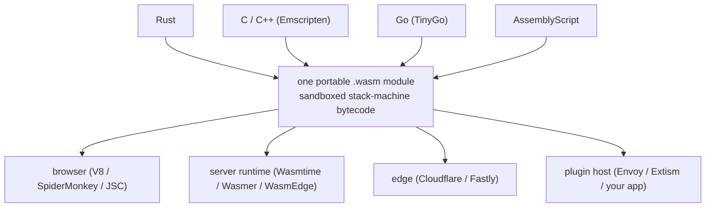
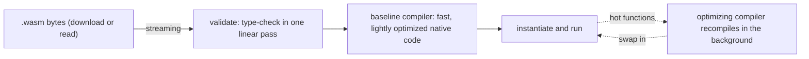
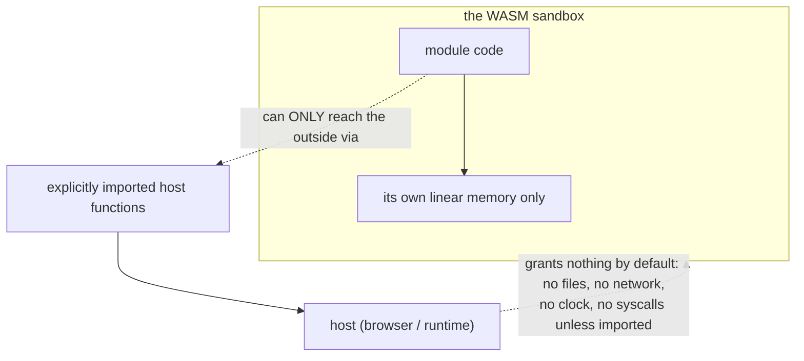
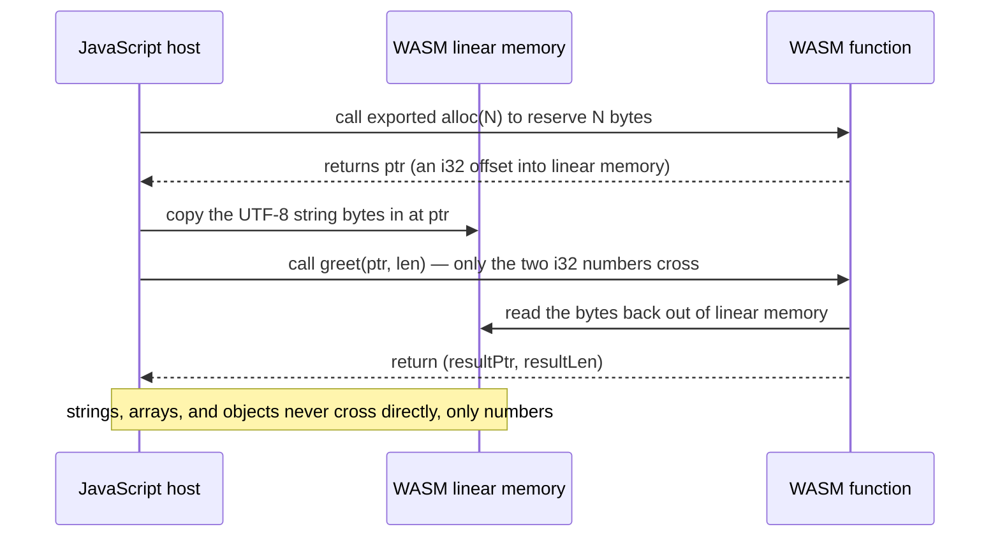
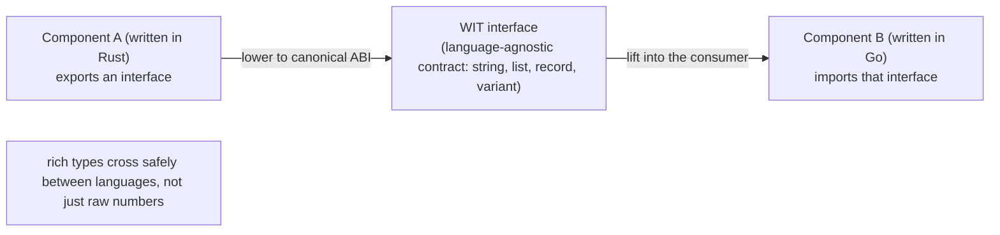

# WebAssembly: A Portable, Sandboxed Compilation Target and Its Runtimes

This guide is for engineers who can already program in at least one systems-ish language and want to understand WebAssembly *as a runtime and a compilation target* — not "how to make a website faster," but what WASM actually is, how it executes, how it talks to the world, and where it is genuinely the right tool. It assumes you understand compilation in the abstract (the [Compiler Internals guide](COMPILER_INTERNALS_STUDY_GUIDE.md) covers bytecode, JITs, and VMs, and this guide is a concrete instance of that theory), and it leans on Rust for examples because Rust has the best WASM story (the [Rust for Python Developers guide](RUST_FOR_PYTHON_DEVS.md) and [Advanced Rust guide](ADVANCED_RUST_STUDY_GUIDE.md) cover the language itself). You do not need prior WASM exposure.

The organizing idea, and the through-line for everything below: **WebAssembly is a portable, sandboxed, low-level bytecode for a virtual stack machine — a *compilation target*, not a language — designed so that any language can compile to it and run at near-native speed inside a secure sandbox, anywhere.** Every important property of WASM falls out of that one sentence. "Compilation target, not a language" is why you write Rust or C or Go and *produce* WASM, never write WASM by hand. "Portable bytecode for a virtual stack machine" is why one `.wasm` file runs unmodified in a browser, on a server, at the edge, or as a plugin. "Sandboxed" is why WASM is increasingly a *security* primitive — it can do nothing to the host it wasn't explicitly handed. "Near-native speed" is why people reach for it for compute. The hard, interesting parts — the ones senior work lives in — are the *boundaries*: the linear-memory model, how data crosses between WASM and its host (the answer, "only numbers cross natively," explains an enormous amount), the capability-based sandbox, and the system-interface story (WASI and the component model) that lets WASM escape the browser. We build the execution model first, then the memory and security model, then the host boundary and the standards that make "run anywhere" real, then the languages, runtimes, and the honest performance story.

Primary references, all worth keeping open: the [WebAssembly Specification](https://webassembly.github.io/spec/core/) — the authoritative, surprisingly readable definition of the bytecode, types, and validation; the [MDN WebAssembly documentation](https://developer.mozilla.org/en-US/docs/WebAssembly) — the best practical reference for the JavaScript API and the concepts; the [WASI documentation](https://wasi.dev/) and the [Bytecode Alliance](https://bytecodealliance.org/) (the home of Wasmtime and the standards work) for the outside-the-browser story; the [Component Model book](https://component-model.bytecodealliance.org/) for where WASM is heading; and the [Rust and WebAssembly book](https://rustwasm.github.io/docs/book/) for the canonical hands-on toolchain.

Sibling guides in this repo deepen the ground WASM stands on and the systems it plugs into: the [Compiler Internals guide](COMPILER_INTERNALS_STUDY_GUIDE.md) (bytecode, JIT tiers, and VMs — the theory WASM engines implement), the [Rust for Python Developers](RUST_FOR_PYTHON_DEVS.md) and [Advanced Rust guides](ADVANCED_RUST_STUDY_GUIDE.md) (the premier WASM source language, and its ownership model that makes the no-GC story work), the [C++26 guide](CPP26_STUDY_GUIDE.md) (compiled to WASM via Emscripten), the [Cloudflare guide](CLOUDFLARE_STUDY_GUIDE.md) (the edge, where WASM runs in production), the [WebGPU](WEBGPU_STUDY_GUIDE.md) and [WebGL/OpenGL guides](WEBGL_OPENGL_STUDY_GUIDE.md) (browser compute and graphics that pair with WASM for in-browser AI and ported games), the [Docker guide](DOCKER_STUDY_GUIDE.md) (containers as the sandboxing model WASM is increasingly compared to), and the [Scala guide](SCALA_STUDY_GUIDE.md) and [.NET for Python Developers guide](DOTNET_FOR_PYTHON_DEVS.md) (other managed runtimes, for contrast).

## Table of Contents

1. [Part 1 — The Mental Model: What WebAssembly Is (and Isn't)](#part-1--the-mental-model-what-webassembly-is-and-isnt)
2. [Part 2 — The Binary Format and the Stack Machine](#part-2--the-binary-format-and-the-stack-machine)
3. [Part 3 — Linear Memory and the Memory Model](#part-3--linear-memory-and-the-memory-model)
4. [Part 4 — The Sandbox and the Security Model](#part-4--the-sandbox-and-the-security-model)
5. [Part 5 — Talking to the Host: Imports, Exports, and the Boundary](#part-5--talking-to-the-host-imports-exports-and-the-boundary)
6. [Part 6 — WASI: WebAssembly Outside the Browser](#part-6--wasi-webassembly-outside-the-browser)
7. [Part 7 — The Component Model and WIT](#part-7--the-component-model-and-wit)
8. [Part 8 — Languages and Toolchains](#part-8--languages-and-toolchains)
9. [Part 9 — Runtimes and Where WASM Runs](#part-9--runtimes-and-where-wasm-runs)
10. [Part 10 — Performance, Limits, and When to Reach for WASM](#part-10--performance-limits-and-when-to-reach-for-wasm)
11. [If You Remember a Handful of Things](#if-you-remember-a-handful-of-things)
12. [Where to Go Next](#where-to-go-next)

---

## Part 1 — The Mental Model: What WebAssembly Is (and Isn't)

*Docs: [MDN — WebAssembly Concepts](https://developer.mozilla.org/en-US/docs/WebAssembly/Concepts), [webassembly.org](https://webassembly.org/).*

The single most important correction to make up front: **WebAssembly is not a language you write — it is a compilation target you produce.** You write Rust, C, C++, Go, or another language, and the compiler emits a `.wasm` binary, the way a C compiler emits x86 or ARM machine code. WASM is, in effect, the instruction set of a *virtual* CPU — a portable, abstract machine that real CPUs then execute via a runtime. Reading or hand-writing WASM is something you do to *understand* it, not to *use* it.

### The four design goals, and why each matters

WASM was designed (by a consortium of all the major browser vendors, standardized through the [W3C](https://www.w3.org/), reaching 1.0 in 2017) around four goals that explain every property it has:

- **Fast.** WASM is a low-level bytecode close to machine code — typed, with explicit operations — so a runtime can compile it to native code quickly and run it at **near-native speed** (typically within a small percentage of native for compute-heavy code). This is its original reason to exist: JavaScript hit a performance ceiling for things like games, video editing, and CAD in the browser.
- **Safe.** WASM runs in a **sandbox** with no access to anything — no files, no network, no memory outside its own — except what the host *explicitly* hands it. This is deny-by-default, capability-based security (Part 4), and it's why WASM has become a security primitive far beyond the browser.
- **Portable.** One `.wasm` module runs unmodified on any compliant runtime — any browser, any server runtime, the edge, a plugin host. The bytecode is defined independently of any CPU or OS.
- **Compact.** The binary format is small and designed for **streaming compilation** — a browser can start compiling a module while it's still downloading.

### It was never just for the browser

The name says "Web," and the browser was the first home, but the design goals — fast, safe, portable, compact — describe an ideal way to run **untrusted code anywhere**, and that is where WASM's growth now is: server-side functions, edge compute ([Cloudflare](CLOUDFLARE_STUDY_GUIDE.md) and Fastly run WASM at their edges), plugin systems (run a customer's untrusted plugin safely inside your app), and embedded scripting. The mental upgrade: think of WASM not as "fast code for web pages" but as **a universal, secure container for a unit of computation** — lighter than a [container](DOCKER_STUDY_GUIDE.md), safer than a native plugin, and portable across the whole stack. The whole thesis in one picture — many source languages converge on one portable module that runs in many places:



### What WASM deliberately is not

It helps to fix the boundaries. WASM is **not** a replacement for JavaScript (in the browser they cooperate — JS orchestrates, WASM crunches), it has **no direct access to the DOM** or most browser/OS APIs (it reaches them only by calling imported host functions — Part 5), and the core (MVP) standard has **no built-in garbage collector**, so garbage-collected languages historically had to ship their *own* runtime compiled into the module (the newer WasmGC proposal changes this — Part 8). Knowing what WASM *won't* do for you is half of using it well.

```quiz
Q: What is the most accurate description of what WebAssembly is?
- [ ] A faster dialect of JavaScript you write by hand
- [ ] A container runtime like Docker
- [x] A portable, sandboxed low-level bytecode for a virtual stack machine — a compilation target that languages like Rust, C, and Go compile to
- [ ] A browser API for 3D graphics
> WASM is the instruction set of a virtual CPU: you compile a real language down to it, and a runtime executes it. It's not a language you author, not a container (though it's used for similar isolation goals more cheaply), and not graphics-specific. Internalizing "compilation target, not language" is the foundation — it's why you reach for Rust or C and *produce* WASM rather than writing WASM directly.

Q: Why is WebAssembly increasingly used far outside the browser (servers, edge, plugins)?
- [ ] Because browsers became too slow to run it
- [x] Its design goals — fast, safe (sandboxed/capability-based), portable, and compact — describe an ideal way to run untrusted code anywhere, not just on web pages
- [ ] Because JavaScript was deprecated on the server
- [ ] Because it requires a GPU only servers have
> "Web" names its origin, not its limits. The same properties that made it good for the browser — near-native speed, a deny-by-default sandbox, one binary that runs on any compliant runtime, and a compact streamable format — make it an excellent universal container for a unit of computation: lighter than a Docker container, safer than a native plugin. That's why edge platforms and plugin systems adopted it.

Q: A WASM module needs to read a file or update the page's DOM. How does it do that?
- [ ] Directly, using built-in WASM filesystem and DOM instructions
- [ ] It cannot do anything at all, ever
- [x] Only by calling host functions that were explicitly imported into the module — WASM has no ambient access to files, network, or the DOM
- [ ] By switching out of sandbox mode at runtime
> WASM has no built-in I/O or DOM instructions and no ambient authority. The only way it affects the outside world is through functions the host *imported* into the module's environment (Part 5). This deny-by-default model is the whole basis of WASM's security story (Part 4): a module can do exactly what it was handed and nothing else — which is why "what crosses the boundary" is the central design concern.
```

---

## Part 2 — The Binary Format and the Stack Machine

*Docs: [WebAssembly Specification — Structure](https://webassembly.github.io/spec/core/syntax/index.html), [MDN — Understanding the text format](https://developer.mozilla.org/en-US/docs/WebAssembly/Understanding_the_text_format). See also the [Compiler Internals guide](COMPILER_INTERNALS_STUDY_GUIDE.md).*

A `.wasm` file is a **module**: a binary container of typed sections (function signatures, the functions' bytecode, imports, exports, the memory declaration, a table for indirect calls, global variables, and a data section to initialize memory). The execution model inside a function is a **stack machine**.

### The stack machine and the four numeric types

WASM instructions operate on an implicit **operand stack** rather than named registers: each instruction pops its inputs off the stack and pushes its result. The MVP has exactly **four value types** — `i32`, `i64` (32- and 64-bit integers) and `f32`, `f64` (32- and 64-bit floats) — plus `v128` (128-bit SIMD) and reference types added by later proposals. There is no `string`, no `struct`, no `bool`; everything is built from those numeric primitives, which is *the* fact that makes the host boundary (Part 5) tricky. A trivial function adding two integers, in the human-readable **text format (WAT)**:

```wat
(module
  (func $add (param $a i32) (param $b i32) (result i32)
    local.get $a      ;; push a onto the stack
    local.get $b      ;; push b onto the stack
    i32.add)          ;; pop two, push their sum
  (export "add" (func $add)))   ;; make $add callable from the host
```

WAT is a one-to-one textual rendering of the binary (an s-expression syntax); you read it to understand a module and almost never write it. The stack-machine design is deliberate: it's compact (no register-allocation encoding to store) and trivial for a runtime to validate and compile.

### Validation: the property that makes the sandbox cheap

Before a runtime runs a module, it **validates** it in a single linear pass: every instruction is type-checked against the operand stack, every branch target is checked, every memory access is structurally sound. Validation **proves the module is type-safe and structurally well-formed before a single instruction runs** — which is what lets the runtime skip per-operation safety checks later and is a pillar of the security model (Part 4). A module that doesn't validate is rejected outright. This is why WASM can be both fast *and* safe: the safety is established once, ahead of time, by validation, rather than re-checked on every operation.

### Compilation: streaming and tiered

A runtime turns validated bytecode into native machine code — and modern engines do this just like the JITs in the [Compiler Internals guide](COMPILER_INTERNALS_STUDY_GUIDE.md):



Because the format is designed for it, browsers do **streaming compilation** — they start compiling while the module is still downloading (`WebAssembly.instantiateStreaming`), so compile time overlaps network time. And engines are **tiered**: a fast **baseline** compiler gets you running quickly, then an **optimizing** compiler recompiles hot functions in the background — the same warmup-versus-peak trade the JVM makes (the [Scala guide](SCALA_STUDY_GUIDE.md) covers it), but WASM's baseline tier is much faster to reach than a bytecode interpreter, so WASM startup is far quicker than the JVM's.

```quiz
Q: Why does WebAssembly have only numeric value types (i32/i64/f32/f64, plus v128) and no string, struct, or bool?
- [ ] Because those types are too slow to implement
- [x] WASM is a low-level target close to machine code; higher-level types are built by the source language out of numbers and bytes in linear memory — which is exactly why passing strings/objects across the host boundary needs explicit copying
- [ ] Because the spec is unfinished
- [ ] Because strings are a security risk
> Like a real ISA, WASM deals in machine primitives; a "string" is just bytes the source language lays out in linear memory and tracks with a pointer and length. This minimalism keeps the bytecode simple to validate and compile, but it's the root cause of the boundary problem (Part 5): since only numbers exist at the WASM level, strings and objects can't cross to the host directly — they must be copied through linear memory.

Q: What does WASM *validation* accomplish, and why does it matter for performance?
- [ ] It optimizes the bytecode into faster instructions
- [x] In one pass before execution it proves the module is type-safe and structurally well-formed, so the runtime can compile to fast native code without inserting per-operation safety checks
- [ ] It downloads the module's dependencies
- [ ] It runs the module once to check for crashes
> Validation type-checks the operand stack, branch targets, and memory accesses up front and rejects malformed modules outright. Establishing safety once, ahead of time, is what lets WASM be both safe and fast: the engine doesn't re-verify each operation at runtime. It's a cornerstone of the sandbox (Part 4) — the security guarantees rest on the proof that validation performs before any instruction executes.

Q: How does WASM startup typically compare to JVM startup, and why?
- [ ] Slower, because WASM has no JIT
- [x] Faster, because WASM streams compilation (compiling while downloading) and its baseline tier produces native code quickly, versus the JVM starting in a bytecode interpreter that must warm up to the JIT
- [ ] Identical, since both run bytecode
- [ ] Faster only on GPUs
> Both are tiered (baseline then optimizing), but WASM was designed for fast startup: streaming compilation overlaps compile with network transfer, and the baseline compiler emits native code immediately rather than interpreting. The JVM begins interpreted and only reaches peak after warming up to C2 (Scala guide, Part 2). So WASM reaches "running native code" sooner — one reason it suits short-lived edge functions where JVM warmup would hurt.
```

---

## Part 3 — Linear Memory and the Memory Model

*Docs: [MDN — WebAssembly.Memory](https://developer.mozilla.org/en-US/docs/WebAssembly/JavaScript_interface/Memory), [Spec — Memory](https://webassembly.github.io/spec/core/syntax/modules.html#memories).*

A WASM module's entire heap is a **single, contiguous, byte-addressable block called linear memory** — conceptually one big array of bytes that grows in 64 KB **pages**. In the browser it's literally a JavaScript `ArrayBuffer`. This one design choice explains most of how WASM handles data.

### Memory is just a big array of bytes

There are no objects, no pointers-to-host-memory, no GC heap in core WASM. The module reads and writes its linear memory with load/store instructions at integer **offsets** — so a "pointer" in WASM is simply an `i32` offset into that one array. When you compile Rust or C to WASM, the language's own allocator (Rust's allocator, C's `malloc`) is compiled *into the module* and manages this linear memory as its heap. The module can request more with `memory.grow` (which appends pages), and memory only ever grows in the MVP.

```javascript
// the host sees linear memory as an ArrayBuffer it can read and write
const memory = new WebAssembly.Memory({ initial: 1, maximum: 10 }); // pages (64KB each)
const bytes = new Uint8Array(memory.buffer);   // a typed-array view over WASM's heap
bytes[0] = 42;                                  // the host can poke the module's memory directly
```

### Why this is the security boundary, and bounds checking

Linear memory is the heart of the sandbox: **a WASM module can only ever access its own linear memory, never the host's process memory.** Every memory access is bounds-checked against the current memory size — an out-of-bounds load or store **traps** (aborts cleanly) rather than reading arbitrary process memory. So even a buggy or malicious module with a wild pointer can, at worst, corrupt *its own* linear memory or trap; it cannot reach the host's heap, other modules' memory, or the OS. This is a strictly stronger guarantee than a native process: a buffer overflow in native C can read the whole address space; a buffer overflow inside WASM is confined to the module's own sandbox. (The flip side: memory-unsafe languages compiled to WASM can still corrupt their *own* linear memory — WASM contains the blast radius to the module, it doesn't make C memory-safe internally.)

### Shared memory, threads, and atomics

The original WASM was single-threaded. The **threads proposal** adds a `SharedArrayBuffer`-backed shared linear memory plus **atomic** instructions, so multiple WASM instances running on multiple host threads (Web Workers in the browser) can share one linear memory and coordinate with atomics — bringing real shared-memory parallelism to WASM, with the same data-race hazards (and the same need for synchronization) as any shared-memory model. SIMD (the `v128` type) adds data-parallelism within a single thread. Together they're how compute-heavy WASM (codecs, ML inference, simulation) reaches native-class throughput.

```quiz
Q: In WebAssembly, what *is* a "pointer"?
- [ ] A reference to an object on a garbage-collected heap
- [ ] A physical address in the host process's memory
- [x] An i32 offset into the module's single linear-memory byte array
- [ ] A handle into a table of host objects
> WASM's heap is one contiguous byte array (linear memory), and code accesses it by integer offset. So a pointer is just an i32 index into that array — there are no host addresses and no GC references at the core level. This is why a compiled language's own allocator (Rust's, C's malloc) runs *inside* the module managing linear memory, and why pointers are meaningless outside the module's own memory.

Q: A WASM module compiled from buggy C has a wild pointer that writes out of bounds. What's the blast radius?
- [ ] The host process's entire address space, like native C
- [x] At most the module's own linear memory — out-of-bounds accesses are bounds-checked and trap; the module can never touch the host's memory or other modules
- [ ] The operating system kernel
- [ ] Nothing — WASM makes C memory-safe
> WASM bounds-checks every memory access against the module's linear-memory size; an out-of-range access traps cleanly instead of reading the wider address space. So the damage from a memory bug is confined to the module's own sandbox — strictly safer than native, where the same overflow could read anything. Note the nuance: WASM contains the blast radius but doesn't make C internally memory-safe — the module can still corrupt *its own* linear memory.

Q: How does WebAssembly get real shared-memory parallelism?
- [ ] It can't; WASM is permanently single-threaded
- [x] The threads proposal adds a shared (SharedArrayBuffer-backed) linear memory plus atomic instructions, so multiple instances on multiple host threads share one memory and coordinate with atomics
- [ ] Each function automatically runs on its own core
- [ ] By spawning OS processes per call
> Core WASM was single-threaded; the threads proposal introduces shared linear memory and atomics so several instances (e.g. on Web Workers) operate on one shared heap with proper synchronization — bringing genuine shared-memory parallelism, along with the usual data-race hazards. That's separate from SIMD (the v128 type), which adds within-thread data parallelism. Compute-heavy WASM uses both to approach native throughput.
```

---

## Part 4 — The Sandbox and the Security Model

*Docs: [WebAssembly Security](https://webassembly.org/docs/security/), [Bytecode Alliance — security](https://bytecodealliance.org/).*

WASM's security is not a feature bolted on; it is the architecture. Three properties combine into a sandbox that is, for many uses, stronger and cheaper than a container or VM.

### Capability-based, deny-by-default

A WASM module starts with **zero authority**. It cannot open a file, make a network call, read the clock, or generate randomness — *none* of it — unless the host explicitly **imports** a function granting that ability (Part 5). There is no ambient authority the way a normal OS process has (a Unix process inherits the user's file access, network, environment). This is **capability-based security**: the module's power is exactly the set of functions handed to it, enumerable and auditable. Want a module that can compute but never touch the network? Don't import any networking function — and it provably cannot, because there is no other path to the network.



### Memory isolation and control-flow integrity

The two other pillars: **memory isolation** (Part 3 — a module reaches only its own bounds-checked linear memory, never the host's or another module's), and **control-flow integrity**. WASM has no raw jumps to arbitrary addresses; control flow is **structured** (typed blocks, `if`, `loop`, and a `br_table`), and indirect calls go through a **table** with runtime type-signature checks. This **structurally prevents the code-injection and return-oriented-programming attacks that plague native binaries** — there is no way to construct a jump to attacker-controlled data, because there are no computed gotos into the code and code is separate from linear memory (you cannot write bytes into memory and execute them). Validation (Part 2) proves all of this before execution.

### Why this matters: WASM as a security primitive

Put the three together — deny-by-default capabilities, memory isolation, control-flow integrity, all proven by validation — and you have a sandbox you can wrap around *untrusted* code with confidence and almost no overhead. That is why WASM is displacing heavier isolation in several places: edge platforms ([Cloudflare](CLOUDFLARE_STUDY_GUIDE.md), Fastly) run thousands of customers' untrusted WASM with far less per-tenant cost than a container or VM each; plugin systems (Envoy's filters, database UDFs, SaaS extension points) run customer code in-process without trusting it; and the startup cost is microseconds, not the seconds a [container](DOCKER_STUDY_GUIDE.md) or the longer still a VM needs. The honest caveat: the *runtime itself* is the trusted computing base — a bug in the WASM engine can break the sandbox — and side-channel attacks (Spectre-class) remain a concern as everywhere, so WASM isolation is excellent but not a substitute for defense in depth.

```quiz
Q: What does "capability-based, deny-by-default" mean for a WASM module's access to the outside world?
- [ ] It can access anything the user running it can access
- [x] It starts with zero authority and can only do what specific host-imported functions grant — so a module given no networking import provably cannot reach the network
- [ ] It must request permissions from the OS at runtime via a dialog
- [ ] It has full access until the host revokes it
> Unlike a normal OS process, which inherits ambient authority (the user's files, network, environment), a WASM module begins able to do nothing. Its powers are exactly the imported functions the host chooses to provide — an enumerable, auditable capability set. Omit the networking import and there is no other path to the network, so the restriction is provable, not merely configured. This is the core of why WASM is trusted to run untrusted code.

Q: Why does WASM structurally resist code-injection and return-oriented-programming attacks that affect native binaries?
- [ ] It encrypts all code in memory
- [x] Control flow is structured (typed blocks/if/loop, table-based indirect calls with signature checks) and code is separate from linear memory, so there's no way to jump to attacker-controlled data or execute written bytes
- [ ] It runs every function in a separate process
- [ ] It disables all function calls
> Native exploits hinge on hijacking control flow — overwriting a return address, jumping into injected bytes. WASM has no computed jumps to arbitrary addresses; branches target structured constructs and indirect calls go through a type-checked table. Crucially, code lives separately from the writable linear memory, so you cannot write bytes and then execute them. Combined with validation proving it all up front, whole exploit classes are designed out.

Q: What's the honest limitation of WASM's sandbox?
- [ ] It only works in the browser
- [ ] It makes programs run slower than the protection is worth
- [x] The runtime itself is the trusted computing base — an engine bug can break isolation — and side-channel (Spectre-class) attacks remain a concern, so it's not a substitute for defense in depth
- [ ] Modules can disable the sandbox at will
> The sandbox's guarantees are only as strong as the engine implementing them: a vulnerability in the WASM runtime can escape isolation, and CPU side channels (Spectre-family) can leak across boundaries as they do everywhere. WASM isolation is excellent and cheap, but it's one layer — production systems running untrusted WASM still apply defense in depth (process isolation around the runtime, resource limits, monitoring) rather than treating the sandbox as absolute.
```

---

## Part 5 — Talking to the Host: Imports, Exports, and the Boundary

*Docs: [MDN — WebAssembly JavaScript API](https://developer.mozilla.org/en-US/docs/WebAssembly/JavaScript_interface), [MDN — Exported functions](https://developer.mozilla.org/en-US/docs/WebAssembly/Exported_functions).*

A WASM module is inert by itself; it becomes useful through a two-way contract with its **host** (the browser's JS engine, or a server runtime). **Exports** are functions/memory the module exposes for the host to call; **imports** are functions the host provides for the module to call. Instantiating wires the two together:

```javascript
// host (JavaScript) instantiates a module, providing imports, and gets exports back
const importObject = {
  env: { log: (x) => console.log("wasm says", x) }   // a capability handed to the module
};
const { instance } = await WebAssembly.instantiateStreaming(fetch("add.wasm"), importObject);
instance.exports.add(2, 3);   // call into WASM → 5
```

The module calls the imported `log` to reach the console; the host calls the exported `add` to run WASM code. **This import/export list is the entire surface between WASM and the world** — which is exactly why the capability model of Part 4 works: the surface is small, explicit, and inspectable.

### The boundary problem: only numbers cross

Here is the fact that explains most of the friction in real WASM, and it follows directly from Part 2: **only the numeric value types (`i32`, `i64`, `f32`, `f64`) can cross the boundary directly.** A function exported from WASM cannot take a JavaScript string or return a struct, because at the WASM level those types don't exist. So to pass a string from JS into WASM you must: ask the module to allocate space in its linear memory, copy the string's bytes into that space from the host side, then call the WASM function passing the **pointer and length** (two `i32`s) — and to get a string *out*, reverse it. The host reads the result bytes out of the module's linear memory.



### Glue code and bindings generators

Doing that allocate-copy-call dance by hand is tedious and error-prone, so **bindings generators** automate it. For Rust, [`wasm-bindgen`](https://rustwasm.github.io/wasm-bindgen/) lets you write a Rust function taking a `String` and a JS function taking a string, and it generates the glue that marshals across the boundary (managing the linear-memory copies for you); `wasm-pack` packages the result for npm. For C/C++, [Emscripten](https://emscripten.org/) generates similar glue plus emulation of POSIX and even OpenGL-on-WebGL. The key understanding to carry: **these tools are hiding the "only numbers cross, everything else is a copy through linear memory" reality, not eliminating it** — which is why passing large or complex data across the boundary frequently has a real copy cost, and why the [component model](https://component-model.bytecodealliance.org/) (Part 7) exists to give this a proper standard rather than per-language glue.

```quiz
Q: Why can't you export a WASM function that directly takes a JavaScript string and returns a struct?
- [ ] WASM functions can only take one argument
- [x] Only numeric value types (i32/i64/f32/f64) cross the boundary, because at the WASM level strings and structs don't exist — they live as bytes in linear memory, so you pass a pointer and length instead
- [ ] Strings are blocked for security reasons
- [ ] You can, but only in the browser
> The boundary inherits WASM's type system: the only things that cross natively are numbers. A "string" is bytes in the module's linear memory tracked by a pointer (i32 offset) and length. So passing a string means copying its bytes into linear memory and handing the function the pointer+length pair; returning one reverses that. This single fact explains most real-world WASM friction and the need for bindings generators.

Q: To pass a string from JavaScript into a WASM function, what's the actual sequence?
- [ ] JS passes the string object directly; WASM reads it
- [x] JS calls a WASM allocator to reserve space in linear memory, copies the bytes in, then calls the function with the pointer and length (two i32s); WASM reads the bytes from its own memory
- [ ] JS serializes the string to JSON and WASM parses it natively
- [ ] WASM reads the string straight from the JS heap
> Because only numbers cross, the host must stage the data in the module's linear memory: ask the module to allocate, copy the UTF-8 bytes into that region, then call the function with ptr+len. WASM then reads from *its own* memory (it can't read the JS heap). Returning a string reverses the dance. This explicit allocate-copy-call protocol is exactly what wasm-bindgen and Emscripten generate for you.

Q: What is `wasm-bindgen` (or Emscripten's glue) actually doing for you?
- [ ] Making WASM able to pass objects directly with no copying
- [ ] Compiling JavaScript to WebAssembly
- [x] Generating the boilerplate that marshals high-level types across the boundary via linear-memory copies — hiding, not eliminating, the "only numbers cross" reality
- [ ] Replacing the WASM runtime with a faster one
> These tools let you write a Rust function taking a String and a JS function taking a string, and they emit the allocate-copy-call glue that bridges them. But the underlying mechanism is unchanged: data still crosses as numbers with bytes copied through linear memory, so large/complex payloads still carry a real copy cost. Recognizing that the abstraction hides a copy is what keeps you from being surprised by boundary-crossing overhead — and it's why the component model exists to standardize this.
```

---

## Part 6 — WASI: WebAssembly Outside the Browser

*Docs: [WASI.dev](https://wasi.dev/), [Wasmtime — WASI](https://docs.wasmtime.dev/wasi-intro.html).*

In the browser, the host functions a module imports are browser APIs (via JS). Outside the browser, "run anywhere" needs a *standard* set of host functions for the things programs need from an operating system — files, clocks, randomness, stdio, networking. That standard is **WASI, the WebAssembly System Interface**.

### A capability-based, portable syscall layer

WASI is, in effect, a **portable, capability-secured POSIX-ish API** that runtimes implement so that a single `.wasm` can do system-level work on any OS without being recompiled. Crucially, it keeps WASM's security model: WASI is **capability-based, not ambient**. A WASI program does **not** get to open any path it likes the way a Unix process can. Instead the host grants specific capabilities up front — for the filesystem, you **preopen** directories, and the module can only access paths under those preopened directories. So `wasmtime --dir=./data app.wasm` lets `app.wasm` touch `./data` and *nothing else* on the filesystem — sandboxed file access by construction, not by `chroot` or seccomp bolted on after.

```bash
# Wasmtime runs a WASI module; --dir grants access to exactly one directory
wasmtime run --dir=./data myapp.wasm    # the module can read/write ./data, nothing else
```

### Preview 1 vs Preview 2

There are two WASI generations, and the distinction matters when you read docs. **WASI Preview 1** (the long-stable version most tooling targets) is a flat set of POSIX-like function imports — files, clocks, args, env, stdio. **WASI Preview 2** (the modern direction, ratified 2024) is rebuilt on the **component model** (Part 7): instead of a flat function list it's a set of typed **interfaces** (`wasi:filesystem`, `wasi:http`, `wasi:cli`, `wasi:sockets`) defined in WIT, which makes WASI modular, versioned, and composable, and gives it rich types across the boundary instead of just numbers. Preview 1 is what most code targets *today*; Preview 2 is where it's going.

### Why WASI is the unlock for server-side WASM

Without WASI, a server-side WASM module is a pure function — it can compute but can't read input or write output portably. WASI is what turns WASM into a viable **universal server binary**: compile a program once to `wasm32-wasi`, and it runs identically on Linux, macOS, Windows, and any architecture with a compliant runtime, in a sandbox where its system access is exactly what you granted — no more. That combination (one portable binary + capability-secured system access + fast startup) is what makes WASM compelling for serverless functions, plugins that need files, and CLI tools you can ship as a single architecture-independent artifact. It's "write once, run anywhere" delivered more literally than the JVM, with a sandbox the JVM never had.

```quiz
Q: What problem does WASI solve that the core WASM spec does not?
- [ ] It makes WASM run faster
- [x] It provides a standard, portable set of host functions for system operations (files, clocks, stdio, networking) so one .wasm can do OS-level work on any compliant runtime without recompiling
- [ ] It adds garbage collection to WASM
- [ ] It lets WASM access the DOM
> Core WASM has no I/O — a module is a pure computation until the host imports functions. In the browser those come from JS APIs, but outside it there was no standard. WASI standardizes the system interface, so a wasm32-wasi binary gets files/clocks/stdio/sockets from any runtime that implements WASI. That's the missing piece that turns WASM into a portable *server* and CLI binary, not just an in-browser compute kernel.

Q: How does WASI give a module filesystem access while preserving WASM's sandbox?
- [ ] It grants full filesystem access like a normal process
- [x] Capability-based: the host preopens specific directories and the module can only access paths under them — e.g. `wasmtime --dir=./data` confines it to ./data
- [ ] It runs the module as root inside a container
- [ ] It denies all filesystem access permanently
> WASI keeps WASM's deny-by-default model. Rather than ambient authority (a Unix process can attempt any path the user can), the host preopens directories and the module's file access is confined to those — no path traversal outside them. So sandboxed file access is structural, granted explicitly at launch, not retrofitted with chroot/seccomp. This is capability security applied to the OS interface.

Q: What's the key difference between WASI Preview 1 and Preview 2?
- [ ] Preview 2 removes the sandbox
- [ ] Preview 1 is for browsers, Preview 2 for servers
- [x] Preview 1 is a flat set of POSIX-like function imports; Preview 2 is rebuilt on the component model as typed, versioned, composable WIT interfaces (wasi:filesystem, wasi:http, ...)
- [ ] Preview 2 is slower but more compatible
> Preview 1 (what most tooling targets today) is a flat list of syscall-like imports. Preview 2 (the 2024 direction) restructures WASI as component-model interfaces defined in WIT — modular, versioned, and carrying rich types across the boundary rather than just numbers. So Preview 2 isn't just "more functions"; it's WASI re-expressed in the component model (Part 7), which is the same shift moving the whole ecosystem beyond the numbers-only boundary.
```

---

## Part 7 — The Component Model and WIT

*Docs: [Component Model book](https://component-model.bytecodealliance.org/), [WIT format](https://component-model.bytecodealliance.org/design/wit.html).*

The component model is where WebAssembly is heading, and it's the answer to two problems we've already hit: the "only numbers cross the boundary" friction (Part 5) and the fact that a raw WASM **module** has no standard, language-agnostic way to describe its interface.

### From modules to components

A core WASM **module** speaks only in numbers and one shared linear memory — fine for talking to a single host through hand-written glue, painful for composing code from different languages. A **component** wraps one or more modules with a **typed, high-level interface** described in **WIT (WebAssembly Interface Types)**, a language-neutral interface definition language. WIT lets an interface declare real types — `string`, `list<T>`, records, variants (sum types), enums, results — and the component model defines the **canonical ABI** for **lifting** those high-level values out of a component's linear memory and **lowering** them into another's. In other words, it standardizes exactly the allocate-copy-call marshaling that Part 5 made you do by hand, and makes it work *between components in different languages*.



A WIT interface reads like a typed contract:

```wit
interface greeter {
  record person { name: string, age: u32 }
  greet: func(p: person) -> string
}
```

### Why this is a big deal

The component model delivers three things core WASM lacks. First, **language-agnostic composition**: a Rust component can call a Go component which calls a Python component, each compiled independently, linked by their WIT interfaces — true polyglot composition without shared-source or FFI gymnastics, because the canonical ABI handles the type translation. Second, **rich types across the boundary by default**, killing most of the hand-written glue of Part 5. Third, **virtualization and capability wiring**: a component's imports (its capabilities) are typed and explicit, so you compose a sandboxed system by *wiring components' interfaces together* — and this is exactly why WASI Preview 2 (Part 6) is built on it. The honest status as of 2026: the component model is stabilizing and increasingly usable (Wasmtime supports it, language toolchains are catching up), but it is newer and less universally supported than core modules — it's the clear future direction rather than the everywhere-default yet. Understanding it is understanding where WASM is going: from "fast sandboxed functions" to "a universal, polyglot, capability-secured component system."

```quiz
Q: What core problem does the component model (with WIT) solve over plain WASM modules?
- [ ] Modules run too slowly
- [x] Plain modules speak only in numbers with hand-written glue; components add a typed, language-agnostic interface (WIT) plus a canonical ABI to lift/lower rich types (strings, records, lists) across the boundary and between languages
- [ ] Modules can't be sandboxed
- [ ] Modules can't access the filesystem
> A core module's interface is just numeric imports/exports, so composing code — especially across languages — means bespoke marshaling glue (Part 5). The component model wraps modules with WIT interfaces describing real types and standardizes the marshaling (lifting/lowering via a canonical ABI). That turns the manual allocate-copy-call dance into a standard mechanism that works *between* components written in different languages.

Q: Why can a Rust component call a Go component under the component model without shared source or manual FFI?
- [ ] Both are recompiled into one language first
- [x] They're linked by their WIT interfaces, and the canonical ABI translates the high-level types between each component's linear memory — so they compose polyglot, compiled independently
- [ ] Go is transpiled to Rust at link time
- [ ] The runtime interprets both with reflection
> Each component declares its imports/exports as WIT interfaces with rich types. The component model's canonical ABI defines how those typed values are lowered out of one component and lifted into another's memory, regardless of source language. So independently compiled Rust and Go components interoperate purely through their shared WIT contract — genuine language-agnostic composition, which is the model's headline capability and the foundation of WASI Preview 2.

Q: What's the honest status of the component model as of 2026?
- [ ] It has fully replaced core modules everywhere
- [ ] It was abandoned in favor of plain modules
- [x] It's stabilizing and increasingly usable (Wasmtime support, toolchains catching up) but newer and less universally supported than core modules — the clear future direction, not yet the everywhere-default
- [ ] It only works in the browser
> The component model is real and shipping in leading runtimes, and WASI Preview 2 is built on it, but language toolchain support and ecosystem maturity still trail core modules, which run everywhere. So it's accurate to treat it as where WASM is heading — polyglot, typed, capability-wired composition — while recognizing that core modules remain the lowest-common-denominator format you can rely on today.
```

---

## Part 8 — Languages and Toolchains

*Docs: [Rust and WebAssembly book](https://rustwasm.github.io/docs/book/), [Emscripten](https://emscripten.org/), [TinyGo — WebAssembly](https://tinygo.org/docs/guides/webassembly/).*

Since WASM is a compilation target, the practical question is "what compiles to it well?" The answer divides sharply along one line: **does the language need a garbage collector and a heavy runtime?**

### The languages that fit naturally

- **Rust** — the best-supported WASM language, and not by accident. Rust has **no garbage collector and a tiny runtime**, so a Rust program compiles to a small, fast `.wasm` with almost no overhead — its [ownership model](ADVANCED_RUST_STUDY_GUIDE.md) manages linear memory without a GC to ship. Targets are `wasm32-unknown-unknown` (bare, for browser/embedding) and `wasm32-wasi` (with WASI); [`wasm-bindgen`](https://rustwasm.github.io/wasm-bindgen/) and `wasm-pack` handle the JS boundary. If you're choosing a language to *write* WASM in, Rust is the default.
- **C/C++** — compiled via [Emscripten](https://emscripten.org/) (an LLVM-based toolchain), which also emulates POSIX, SDL, and OpenGL-on-WebGL, so existing C/C++ codebases — and famously whole game engines (the [C++26](CPP26_STUDY_GUIDE.md) and [WebGL guides](WEBGL_OPENGL_STUDY_GUIDE.md) are relevant) — port to the browser. Like Rust, no GC to ship.
- **AssemblyScript** — a TypeScript-like language that compiles directly to WASM; comfortable for JS/TS developers, though a smaller ecosystem.

### The GC problem and WasmGC

Garbage-collected languages — Java, Kotlin, C#, Go, Python — had a problem: core WASM had no GC, so to run one of these you had to **compile the language's entire garbage collector and runtime into the module**, bloating size and duplicating work the host might already do. Go's standard compiler does this (large WASM output); **TinyGo** is a separate compiler producing far smaller WASM for the subset it supports, the usual choice for Go-on-WASM. The structural fix is the **[WasmGC proposal](https://github.com/WebAssembly/gc)** (shipping in major browsers since 2023), which adds *managed* heap types to WASM itself, so GC'd languages can use the **host's** garbage collector instead of shipping their own — dramatically shrinking modules for Java/Kotlin/Dart and making those languages first-class WASM citizens. The rule of thumb: GC-free languages (Rust, C/C++) were always a clean fit; GC languages were awkward until WasmGC, and are increasingly viable now.

### The toolchain shape

Whatever the language, the workflow rhymes: a compiler with a `wasm32` target produces the `.wasm`; a bindings generator (`wasm-bindgen`, Emscripten) produces the host glue for the boundary; a packager (`wasm-pack`, npm) bundles it for the host environment; and runtimes (Part 9) execute it. For server/CLI WASM, tools like [`cargo-component`](https://github.com/bytecodealliance/cargo-component) build *components* (Part 7) directly. The ecosystem is young enough that the toolchain is part of what you're choosing when you pick a source language.

```quiz
Q: Why is Rust the best-fit language for writing WebAssembly?
- [ ] It's the only language that can target WASM
- [x] It has no garbage collector and a tiny runtime, so it compiles to small, fast WASM with almost no overhead — its ownership model manages linear memory without a GC to ship
- [ ] It compiles WASM faster than other languages
- [ ] It was invented specifically for WASM
> The deciding factor for WASM fit is whether a language must drag a GC and heavy runtime into the module. Rust manages memory at compile time via ownership, so there's nothing extra to bundle — output is compact and fast, and the boundary tooling (wasm-bindgen/wasm-pack) is mature. C/C++ share the no-GC advantage via Emscripten. That's why GC-free systems languages were always the clean fit and why Rust is the default choice for authoring WASM.

Q: Before WasmGC, why did running Java, C#, or Go on WASM produce bloated modules?
- [ ] WASM rejected their bytecode
- [x] Core WASM had no garbage collector, so the language's entire GC and runtime had to be compiled into the module, duplicating work and inflating size
- [ ] Those languages can't compile to WASM at all
- [ ] The modules included full debug symbols by default
> Core WASM provides only linear memory and no managed heap, so a GC'd language had to ship its own collector and runtime inside the .wasm to manage that memory — large output and redundant machinery. (TinyGo exists precisely to produce smaller Go WASM.) The WasmGC proposal fixes this structurally by adding managed heap types to WASM so these languages can use the host's GC, shrinking modules and making GC'd languages first-class.

Q: What does WasmGC change for garbage-collected languages targeting WASM?
- [ ] It removes the need for any runtime at all
- [x] It adds managed heap types to WASM so GC'd languages can use the host's garbage collector instead of bundling their own, dramatically shrinking module size
- [ ] It makes Rust unnecessary
- [ ] It only helps with startup time, not size
> WasmGC introduces struct/array reference types managed by the host engine's collector. Instead of compiling a whole GC into the module, languages like Java, Kotlin, and Dart emit code that allocates on the host-managed heap — so modules get much smaller and these languages become viable WASM targets. It doesn't eliminate runtimes entirely, but it removes the biggest tax that made GC languages awkward on WASM.
```

---

## Part 9 — Runtimes and Where WASM Runs

*Docs: [Wasmtime](https://wasmtime.dev/), [Wasmer](https://wasmer.io/), [WasmEdge](https://wasmedge.org/), [wazero](https://wazero.io/).*

The same `.wasm` runs in many places because many runtimes implement the spec. Knowing the landscape tells you where WASM is actually used in production.

### Browser engines

Every major browser embeds a WASM engine inside its JavaScript engine — **V8** (Chrome/Edge/Node.js), **SpiderMonkey** (Firefox), and **JavaScriptCore** (Safari). They share the JS heap's host, do streaming and tiered compilation (Part 2), and expose WASM through the JS API (Part 5). This is the original deployment target and where WASM for graphics, games, codecs, and increasingly **in-browser AI inference** (pair with the [WebGPU guide](WEBGPU_STUDY_GUIDE.md)) lives.

### Standalone server runtimes

Outside the browser, a standalone runtime embeds a WASM engine in your application or runs modules directly via WASI (Part 6):

- **[Wasmtime](https://wasmtime.dev/)** — the Bytecode Alliance's reference runtime, the standards leader (component model, WASI Preview 2), built on the Cranelift compiler. The default choice for serious server-side WASM.
- **[Wasmer](https://wasmer.io/)** — another mature runtime with a focus on language embeddings and a package registry.
- **[WasmEdge](https://wasmedge.org/)** — a CNCF runtime tuned for cloud-native and edge, with AI-inference extensions.
- **[wazero](https://wazero.io/)** — a zero-dependency runtime written in pure Go, popular for embedding WASM plugins into Go applications without CGo.

### The edge, plugins, and embedding

Three production patterns matter most. **Edge compute**: [Cloudflare](CLOUDFLARE_STUDY_GUIDE.md) and Fastly run customer WASM at hundreds of locations, exploiting WASM's microsecond startup and per-tenant isolation to pack far more tenants per machine than containers (Cloudflare Workers run JS *and* WASM in V8 isolates). **Plugin systems**: Envoy's proxy filters, database UDFs, and SaaS extension points run untrusted customer code in-process via WASM, with [Extism](https://extism.org/) offering a cross-language plugin framework. **Embedding**: you link a runtime like Wasmtime or wazero into your own app to run user-supplied logic safely — the modern, lighter alternative to spawning a [container](DOCKER_STUDY_GUIDE.md) or trusting a native plugin. The unifying theme across all three: **WASM is the unit of safely-runnable untrusted computation**, and the runtime is how you embed that unit wherever you need it.

```quiz
Q: Why do edge platforms like Cloudflare and Fastly favor WASM over a container per tenant?
- [ ] WASM has access to more system resources
- [x] WASM's microsecond startup and strong per-tenant isolation let them pack far more untrusted tenants per machine than containers, which start in seconds and carry more overhead
- [ ] Containers can't run on edge hardware
- [ ] WASM tenants can share memory for speed
> Edge compute means running many customers' untrusted code at many locations, where density and cold-start latency dominate economics. WASM instances start in microseconds and isolate per-tenant via the sandbox, so a machine can host vastly more tenants than one container each (containers start far slower and weigh more). That density-and-startup advantage, with isolation intact, is exactly why edge platforms adopted WASM (Cloudflare runs JS and WASM in V8 isolates).

Q: What distinguishes Wasmtime among server-side WASM runtimes?
- [ ] It only runs in the browser
- [x] It's the Bytecode Alliance's reference runtime and the standards leader — first with the component model and WASI Preview 2 — built on the Cranelift compiler
- [ ] It's the only runtime that supports WASI
- [ ] It compiles WASM back to JavaScript
> Wasmtime is the de facto reference implementation from the organization driving WASM standards, so it leads on the component model and WASI Preview 2 and is the safe default for serious server-side and component work. Other runtimes serve niches — Wasmer (embeddings/registry), WasmEdge (cloud-native/edge/AI), wazero (pure-Go, no CGo for Go apps) — but Wasmtime tracks the standards most closely.

Q: What's the unifying theme across edge compute, plugin systems, and embedding a WASM runtime in your app?
- [ ] They all require a GPU
- [x] WASM is the unit of safely-runnable untrusted computation, and the runtime is how you embed that unit wherever you need it
- [ ] They all run only in the browser
- [ ] They all need the component model
> Edge platforms run customers' code, plugin systems run extension authors' code, and embedding runs user-supplied logic — in every case you're executing code you don't fully trust, in-process, cheaply. WASM's sandbox plus fast startup makes a module the portable, safe unit of that computation, and a runtime (Wasmtime, wazero, a browser engine) is how you host it in each context. That's the through-line that ties the whole ecosystem together.
```

---

## Part 10 — Performance, Limits, and When to Reach for WASM

*Docs: [MDN — WebAssembly](https://developer.mozilla.org/en-US/docs/WebAssembly), [V8 — WebAssembly](https://v8.dev/blog/tags/webassembly).*

WASM is fast, but "near-native" is a claim with edges, and using WASM well means knowing them and knowing when *not* to reach for it.

### Fast, but not magic

WASM runs compute-heavy code at **typically within ~10–50% of native**, sometimes closer — excellent, but a few structural costs keep it from matching native exactly: every memory access carries an implicit **bounds check** (cheap, but nonzero); the sandbox forbids some native tricks; and **SIMD**, while available (the `v128` type), is a portable subset, not the full native instruction set. The biggest practical cost, though, is usually not raw compute speed but the **boundary**: crossing between host and WASM, and especially **copying data through linear memory** (Part 5), can dominate if you do it in a hot loop. A WASM function that does a lot of work per call is great; one called millions of times with small payloads each crossing the boundary can be *slower* than staying on the host side. The performance rule: **WASM wins for compute-dense work with coarse-grained boundary crossings, and loses when the boundary is the bottleneck.**

### The honest limitations

- **No direct DOM/host-API access.** In the browser, every DOM touch is a call back into JS — so WASM is poor for DOM-churning UI work and great for the compute behind it.
- **Startup and size.** A module must be downloaded, compiled, and instantiated; for tiny tasks that overhead can exceed the work. GC-language modules can be large (pre-WasmGC).
- **Debugging and tooling are younger** than native or JS — source maps and DWARF support exist but the experience is rougher.
- **It doesn't make unsafe languages safe internally** (Part 3) — it contains the blast radius, it doesn't fix the bug.

### When to reach for it (and when not)

Reach for WASM when you have **compute-heavy work** (codecs, image/video processing, cryptography, ML inference, physics, parsers, format conversion), when you want to **reuse a C/C++/Rust library** in the browser or in a polyglot server, when you need to **run untrusted code safely** (plugins, edge multi-tenancy, sandboxed evaluation), or when you want **one portable binary** across OSes and architectures with capability-secured system access (WASI). *Don't* reach for it for DOM-heavy UI (use JS/a framework), for trivial logic where the boundary and startup overhead dwarf the work, or when your team would fight an immature toolchain for a problem plain JS or a native binary solves cleanly. The honest summary, and a fitting close: **WebAssembly is the right tool when you need near-native compute, strong sandboxing, or true portability for a unit of code — and the wrong one when the work is light, DOM-bound, or boundary-dominated.** It is not a replacement for your language or your runtime; it is a portable, secure place to run a computation, and its value is exactly proportional to how compute-dense and trust-sensitive that computation is.

```quiz
Q: A function is called millions of times with small payloads, each crossing the JS/WASM boundary. Why might moving it to WASM make it *slower*?
- [ ] WASM can't be called from JavaScript
- [x] The cost is dominated by boundary crossings and copying small data through linear memory, not by compute — so the marshaling overhead per call can outweigh any speedup
- [ ] WASM functions have a hard call-rate limit
- [ ] Small numbers can't cross the boundary
> WASM wins on compute density, but each host↔WASM crossing has overhead, and non-numeric data must be copied through linear memory (Part 5). A hot loop of tiny calls pays that cost millions of times, which can exceed the compute it saves — sometimes losing to staying on the host side. The rule: WASM pays off for heavy work behind coarse-grained boundary crossings, not for fine-grained chatter across the boundary.

Q: Why is WASM a poor fit for DOM-heavy UI work in the browser?
- [ ] WASM runs too slowly for any UI
- [x] WASM has no direct DOM access — every DOM operation is a call back into JS — so DOM-churning code pays constant boundary-crossing cost; WASM shines on the compute *behind* the UI instead
- [ ] The DOM is not available in any browser
- [ ] WASM can only render with WebGL
> WASM can't touch the DOM directly; it reaches it only by calling imported JS functions (Part 5). UI work that constantly mutates the DOM therefore crosses the boundary incessantly, which is exactly where WASM loses. The idiomatic split is JS orchestrating the DOM and WASM doing the heavy computation (a codec, a layout engine, image processing) behind it — each language where it's strong.

Q: Which workload is the clearest *good* fit for WebAssembly?
- [ ] A form-validation handler that updates a few DOM fields
- [ ] A trivial function called once at page load
- [x] An image/video codec or ML-inference kernel doing heavy compute per call, optionally reused from an existing C/C++/Rust library
- [ ] A function that mostly reads and writes the DOM
> Compute-dense work with coarse boundary crossings is WASM's sweet spot: a codec, cryptography, ML inference, a physics engine, or a parser does lots of work per call so the per-call boundary cost is negligible, and such code often already exists as a C/C++/Rust library you can compile to WASM. The poor fits — DOM churn, trivial logic, fine-grained boundary chatter — are exactly where startup and crossing overhead dominate the small amount of compute.
```

---

## If You Remember a Handful of Things

1. **WebAssembly is a portable, sandboxed bytecode for a virtual stack machine — a compilation target, not a language.** You write Rust/C/Go and *produce* `.wasm`; it runs at near-native speed, in a sandbox, on any compliant runtime, anywhere. Every other property follows from this.
2. **The heap is one linear memory, and only numbers cross the boundary.** A pointer is an `i32` offset into a single byte array; strings and objects don't exist at the WASM level, so passing them to the host means copying bytes through linear memory and passing a pointer and length. This one fact explains most real-world WASM friction (and why bindings generators and the component model exist).
3. **Security is the architecture, not a feature.** Deny-by-default capabilities (a module can only do what host-imported functions grant), memory isolation (bounds-checked access to its own memory only), and control-flow integrity (no jumps to injected code) — all proven by ahead-of-time validation — make WASM a sandbox you can wrap around untrusted code cheaply. That's why it's displacing containers at the edge and enabling safe plugins.
4. **WASI and the component model are how WASM escapes the browser and goes polyglot.** WASI is a capability-secured, portable system interface (sandboxed files via preopened directories), turning WASM into a universal server/CLI binary; the component model + WIT add typed, language-agnostic interfaces so components in different languages compose and rich types cross the boundary — the clear future direction.
5. **GC-free languages fit naturally; reach for WASM when work is compute-dense, trust-sensitive, or must be truly portable.** Rust and C/C++ compile to small, fast modules (WasmGC is making GC'd languages viable too). WASM wins for codecs, crypto, ML inference, untrusted plugins, and one-binary portability — and loses for DOM-heavy UI, trivial logic, and boundary-dominated workloads. It's a portable, secure place to run a computation, valuable in proportion to how heavy and untrusted that computation is.

---

## Where to Go Next

- **Read the spec and MDN as your two anchors.** The [WebAssembly Specification](https://webassembly.github.io/spec/core/) is the precise definition of the bytecode, types, and validation — dip into it when behavior surprises you — and the [MDN WebAssembly docs](https://developer.mozilla.org/en-US/docs/WebAssembly) are the best practical guide to the concepts and the JavaScript API.
- **Do the Rust+WASM tutorial end to end.** The [Rust and WebAssembly book](https://rustwasm.github.io/docs/book/)'s Game of Life walkthrough builds a real module with `wasm-bindgen`/`wasm-pack` and makes the boundary (Part 5) concrete by forcing you to pass data across it — building beats reading, and Rust is the cleanest first WASM language.
- **Read the system-interface and component docs while they're fresh.** The [WASI documentation](https://wasi.dev/) and the [Component Model book](https://component-model.bytecodealliance.org/) are where the future of WASM is being written; reading them now tells you where the ecosystem is going (typed, polyglot, capability-wired).
- **Run and break WASM in two runtimes — this is the high-leverage part.** On your machine: compile a Rust function to `wasm32-wasi`, run it under [Wasmtime](https://wasmtime.dev/) with `--dir` and then *without* it, and watch the capability sandbox deny file access; pass a large string across the boundary by hand (allocate, copy, call) to feel the "only numbers cross" cost; deliberately write out of bounds and watch it trap instead of corrupting the host; compile the same module and run it in a browser via `instantiateStreaming`; and build a tiny component with `cargo-component` and inspect its WIT. Each turns a Part above into intuition.
- **Adjacent guides in this repo, by the slice they deepen:** the [Compiler Internals guide](COMPILER_INTERNALS_STUDY_GUIDE.md) for the bytecode/JIT/VM theory WASM engines implement; the [Rust for Python Developers](RUST_FOR_PYTHON_DEVS.md) and [Advanced Rust](ADVANCED_RUST_STUDY_GUIDE.md) guides for the premier WASM language and the ownership model that makes the no-GC story work; the [C++26 guide](CPP26_STUDY_GUIDE.md) for the Emscripten path; the [Cloudflare guide](CLOUDFLARE_STUDY_GUIDE.md) for WASM at the production edge; the [WebGPU](WEBGPU_STUDY_GUIDE.md) and [WebGL/OpenGL](WEBGL_OPENGL_STUDY_GUIDE.md) guides for the browser compute and graphics that pair with WASM; and the [Docker guide](DOCKER_STUDY_GUIDE.md) for the container isolation model WASM is increasingly measured against.

The single highest-leverage next action: take one compute-heavy function you already have in C, C++, or Rust — an image filter, a parser, a hash — compile it to WASM, and call it from both a browser page and a Wasmtime CLI, measuring the boundary-crossing cost as you vary how much work each call does. The moment you feel where WASM beats the host and where the boundary beats WASM, you understand the technology better than most who only read about it.
