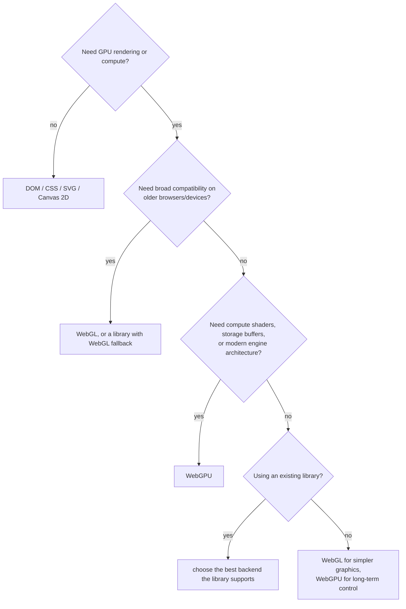

# WebGPU Study Guide

A depth-first guide to WebGPU for engineers who know JavaScript and the web platform but may not have written low-level graphics code before. It starts with what WebGPU is, why it exists, and how it differs from WebGL. It then builds the working mental model: adapters, devices, queues, buffers, textures, bind groups, pipelines, command encoders, render passes, compute passes, and WGSL shaders. The final chapters give a practical primer for drawing, moving data to the GPU, using textures, writing compute shaders, debugging, choosing libraries, and deciding when WebGPU or WebGL is the right tool.

The throughline is this: **WebGPU is the web's modern explicit GPU API**. WebGL made GPU graphics possible in the browser by exposing an OpenGL ES style API. WebGPU exposes a model closer to Vulkan, Metal, and Direct3D 12: explicit resources, immutable pipelines, command buffers, asynchronous errors, compute shaders, and a binding model designed for modern hardware. That extra explicitness is more work at first, but it buys performance, predictability, compute, and a better fit for advanced rendering and browser-side AI.

This guide pairs naturally with the [Advanced Node.js guide](ADVANCED_NODEJS_STUDY_GUIDE.md), [TypeScript guide](TYPESCRIPT_STUDY_GUIDE.md), [WebSockets guide](WEBSOCKETS_STUDY_GUIDE.md), [LLM Application Development guide](LLM_APP_DEV_STUDY_GUIDE.md), and [Electron guide](ELECTRON_STUDY_GUIDE.md). WebGPU is browser technology, but it touches systems thinking: memory layout, parallelism, pipelines, synchronization, and performance measurement.

Primary references: [MDN WebGPU API](https://developer.mozilla.org/en-US/docs/Web/API/WebGPU_API), [MDN WebGL API](https://developer.mozilla.org/en-US/docs/Web/API/WebGL_API), the [W3C WebGPU specification](https://www.w3.org/TR/webgpu/), the [W3C WGSL specification](https://www.w3.org/TR/WGSL/), Chrome's [Overview of WebGPU](https://developer.chrome.com/docs/web-platform/webgpu/overview), Chrome's [From WebGL to WebGPU](https://developer.chrome.com/docs/web-platform/webgpu/from-webgl-to-webgpu), Chrome's [GPU compute guide](https://developer.chrome.com/docs/capabilities/web-apis/gpu-compute), [WebGPU Fundamentals](https://webgpufundamentals.org/), and the official [WebGPU samples](https://webgpu.github.io/webgpu-samples/).

---

## Table of Contents

1. [Part 1 - What WebGPU Is](#part-1-what-webgpu-is)
2. [Part 2 - WebGPU vs WebGL](#part-2-webgpu-vs-webgl)
3. [Part 3 - When to Use WebGPU and When to Use WebGL](#part-3-when-to-use-webgpu-and-when-to-use-webgl)
4. [Part 4 - The WebGPU Mental Model](#part-4-the-webgpu-mental-model)
5. [Part 5 - WGSL: The Shader Language](#part-5-wgsl-the-shader-language)
6. [Part 6 - Your First WebGPU App](#part-6-your-first-webgpu-app)
7. [Part 7 - Buffers, Uniforms, and Bind Groups](#part-7-buffers-uniforms-and-bind-groups)
8. [Part 8 - Textures, Samplers, and Render Targets](#part-8-textures-samplers-and-render-targets)
9. [Part 9 - Compute Shaders](#part-9-compute-shaders)
10. [Part 10 - Render Loops, Resize, and Presentation](#part-10-render-loops-resize-and-presentation)
11. [Part 11 - Debugging, Errors, and Validation](#part-11-debugging-errors-and-validation)
12. [Part 12 - Performance and Production Practices](#part-12-performance-and-production-practices)
13. [Part 13 - Ecosystem, Migration, and Recipes](#part-13-ecosystem-migration-and-recipes)

---

## Part 1 - What WebGPU Is

WebGPU is a JavaScript API that lets web applications use the GPU for rendering and general-purpose computation. It is exposed through `navigator.gpu`, works with `canvas`, and uses a shader language called **WGSL** (WebGPU Shading Language).

If you have used the web platform for years, put WebGPU in this family:

| API | What it gives you |
|---|---|
| Canvas 2D | Immediate-mode 2D drawing from JavaScript |
| SVG | Declarative vector graphics in the DOM |
| CSS transforms/filters | Browser-managed GPU acceleration for UI effects |
| WebGL | Low-level GPU rasterization through an OpenGL ES style API |
| WebGPU | Modern explicit GPU rendering and compute |

WebGPU is not a scene graph, game engine, charting library, or magic performance button. It is a low-level API. You create GPU resources, write shaders, define pipelines, encode commands, submit them to a queue, and let the GPU execute them asynchronously.

### The One-Sentence Version

WebGPU lets JavaScript describe GPU work explicitly enough that the browser can map it efficiently onto Metal on Apple platforms, Direct3D 12 on Windows, Vulkan on many other platforms, and compatible lower-level backends where supported.

### Why It Exists

WebGL was a huge success. It brought programmable GPU graphics to browsers and powered games, maps, CAD viewers, data visualizations, creative coding, scientific visualization, and 3D engines. But WebGL is based on OpenGL ES, an older global-state graphics API. Modern native graphics moved toward explicit APIs:

- Metal,
- Vulkan,
- Direct3D 12.

Those APIs make the developer describe resources, bindings, synchronization, and pipelines more explicitly. That is more verbose, but it reduces hidden driver work and maps better to modern GPUs.

WebGPU brings that style to the web.

### What WebGPU Adds Over WebGL

The biggest additions:

- **Compute shaders** for general-purpose GPU work.
- **Storage buffers and storage textures** for large writable shader data.
- **Explicit pipelines** instead of many bits of mutable global state.
- **Command encoders and command buffers** to batch GPU work.
- **Modern binding model** through bind groups and pipeline layouts.
- **WGSL** as a safe, portable shader language for the web.
- **Better error model** with validation and asynchronous error scopes.
- **Better fit for modern engines** that already target Vulkan/Metal/D3D12.

### What WebGPU Does Not Do For You

WebGPU does not:

- load 3D models,
- manage cameras,
- build a material system,
- generate mipmaps automatically,
- choose your render graph,
- make bad shaders fast,
- hide memory layout rules,
- support every device identically,
- replace accessibility or semantic HTML.

If you want a high-level renderer, use Three.js, Babylon.js, PlayCanvas, regl, PixiJS, or engine-specific abstractions. Learn raw WebGPU when you need to understand what those libraries are doing or when you need control they do not expose.

### Current Support Reality

As of June 3, 2026, WebGPU is usable on modern browser stacks, but you should still treat it as progressive enhancement:

- MDN marks WebGPU as **limited availability** because some widely used browser/platform combinations do not support it.
- WebGPU requires a secure context, so use HTTPS or localhost.
- Chrome shipped WebGPU first and remains a strong target.
- Firefox and Safari have shipped support on important platforms, but platform coverage and feature details still need testing.
- WebGL remains the mature universal fallback for many web graphics products.

The practical rule: **feature-detect WebGPU and keep a fallback path when broad reach matters**.

```javascript
if (!('gpu' in navigator)) {
  showWebGLFallbackOrMessage();
}
```

---

## Part 2 - WebGPU vs WebGL

WebGPU and WebGL share the same big idea: JavaScript sends data and shader programs to the GPU, then the GPU runs massively parallel work to draw pixels. The difference is the programming model.

### Quick Comparison

| Dimension | WebGL | WebGPU |
|---|---|---|
| Era | OpenGL ES style | Vulkan/Metal/D3D12 style |
| Primary use | Graphics | Graphics and compute |
| Shader language | GLSL ES | WGSL |
| State model | Mutable global context state | Explicit immutable pipeline objects |
| Commands | Mostly immediate API calls on context | Recorded into command encoders and submitted |
| Compute shaders | No | Yes |
| Storage buffers | No direct equivalent | Yes |
| Error model | `gl.getError()` and context loss | Validation, error scopes, device loss |
| Resource binding | Texture units, uniforms, attributes | Bind groups, bind group layouts |
| Browser reach | Very broad and mature | Modern and growing, but still check support |
| Learning curve | Smaller for simple examples | Higher upfront, cleaner for large apps |
| Performance ceiling | Good, but constrained by old model | Higher for modern workloads |

### Global State vs Explicit Pipelines

WebGL is stateful:

```javascript
gl.bindBuffer(gl.ARRAY_BUFFER, vertexBuffer);
gl.vertexAttribPointer(positionLocation, 2, gl.FLOAT, false, 0, 0);
gl.useProgram(program);
gl.bindTexture(gl.TEXTURE_2D, texture);
gl.drawArrays(gl.TRIANGLES, 0, 3);
```

The current buffer, current program, current texture, current blend state, current viewport, and many other things live in the context. If another part of your code changes that state and forgets to restore it, your draw breaks.

WebGPU is explicit:

```javascript
const pass = encoder.beginRenderPass(renderPassDescriptor);
pass.setPipeline(pipeline);
pass.setVertexBuffer(0, vertexBuffer);
pass.setBindGroup(0, bindGroup);
pass.draw(3);
pass.end();
device.queue.submit([encoder.finish()]);
```

The pipeline bundles much of what WebGL stores as mutable state. Bind groups bundle resources. Command encoders batch work. This is more ceremony at first, but more reliable in larger systems.

### Synchronous vs Asynchronous Thinking

WebGL exposes synchronous queries like `gl.getError()`. Synchronous CPU-to-GPU checks can force the browser process and GPU process to coordinate immediately.

WebGPU is designed around async behavior:

- creating resources validates later,
- errors are reported through error scopes or events,
- reading GPU results uses promises,
- command submission returns before GPU work has necessarily completed.

That model matches real GPU execution. The CPU records work, the GPU consumes it later.

### GLSL vs WGSL

WebGL shaders use GLSL ES:

```glsl
attribute vec2 position;

void main() {
  gl_Position = vec4(position, 0.0, 1.0);
}
```

WebGPU shaders usually use WGSL:

```wgsl
@vertex
fn vertexMain(@location(0) position: vec2<f32>) -> @builtin(position) vec4<f32> {
  return vec4<f32>(position, 0.0, 1.0);
}
```

WGSL looks more explicit because it names shader stages, input locations, address spaces, bindings, and builtins directly in the language.

### Uniforms vs Bind Groups

WebGL code often sets uniforms directly:

```javascript
gl.useProgram(program);
gl.uniformMatrix4fv(matrixLocation, false, matrix);
```

WebGPU usually stores uniform data in a buffer and connects that buffer to a shader through a bind group:

```javascript
const bindGroup = device.createBindGroup({
  layout: pipeline.getBindGroupLayout(0),
  entries: [{ binding: 0, resource: { buffer: uniformBuffer } }],
});
```

In WGSL:

```wgsl
struct Uniforms {
  matrix: mat4x4<f32>,
};

@group(0) @binding(0)
var<uniform> uniforms: Uniforms;
```

This binding model is more verbose, but it scales better to many resources.

### Graphics Only vs Graphics Plus Compute

WebGL draws. You can abuse fragment shaders and textures for computation, but the API was not designed for general compute.

WebGPU has compute shaders:

```wgsl
@group(0) @binding(0) var<storage, read> input: array<f32>;
@group(0) @binding(1) var<storage, read_write> output: array<f32>;

@compute @workgroup_size(64)
fn main(@builtin(global_invocation_id) id: vec3<u32>) {
  let i = id.x;
  output[i] = input[i] * 2.0;
}
```

That opens use cases like:

- physics simulation,
- particles,
- image processing,
- video processing,
- data transforms,
- local ML inference,
- GPGPU algorithms,
- culling and level-of-detail preparation.

### Compatibility vs Capability

WebGL wins reach. WebGPU wins capability.

If you need maximum compatibility today, WebGL is still hard to beat. If you need compute, modern rendering, high object counts, GPU-side simulation, or a future-facing engine architecture, WebGPU is the better target.

```quiz
Q: What's the fundamental programming-model difference between WebGL and WebGPU?
- [ ] WebGPU is slower but easier
- [x] WebGL uses mutable global context state (current buffer/program/texture/blend) while WebGPU uses explicit immutable pipeline objects, bind groups, and recorded command buffers — more ceremony upfront, more reliable at scale
- [ ] WebGPU has no shaders
- [ ] They use the same API with different names
> WebGL's state machine means any code path can change global state and break a later draw if it forgets to restore it. WebGPU bundles render state into immutable pipelines, resources into bind groups, and work into command encoders that you record then submit. The cost is verbosity for simple examples; the payoff is large-system reliability and a higher performance ceiling.

Q: WebGPU's command submission "returns before GPU work has necessarily completed." Why is that async model the right design?
- [ ] To hide errors from the developer
- [x] It matches real GPU execution — the CPU records work and the GPU consumes it later — so errors surface via error scopes/events and reading results uses promises, avoiding synchronous CPU↔GPU stalls
- [ ] Because JavaScript can't be synchronous
- [ ] To make the API harder to misuse
> Synchronous queries like WebGL's `gl.getError()` force the browser and GPU processes to coordinate immediately, stalling the pipeline. WebGPU embraces the reality that the GPU runs behind the CPU: submission queues work and returns, validation and errors report asynchronously, and reading GPU buffers back is a promise. The model reflects the hardware instead of papering over it.

Q: What capability does WebGPU have that WebGL fundamentally lacks?
- [ ] Textures
- [x] First-class compute shaders with storage buffers — general GPGPU (physics, image processing, ML inference) rather than abusing fragment shaders and textures for computation
- [ ] The ability to draw triangles
- [ ] Hardware acceleration
> WebGL was designed to draw; you can coerce fragment shaders and textures into doing computation, but it's awkward and limited. WebGPU adds `@compute` shaders and read-write storage buffers as native concepts, opening GPU-side simulation, particles, data transforms, and local ML inference. That compute capability — plus the modern explicit model — is the main reason to choose WebGPU when reach isn't the deciding factor.
```

---

## Part 3 - When to Use WebGPU and When to Use WebGL

Do not choose WebGPU because it is newer. Choose it because the workload benefits from the model.

### Use WebGPU For

| Use case | Why WebGPU fits |
|---|---|
| Modern 3D engines | Pipelines, bind groups, storage buffers, compute, modern backend mapping |
| Browser games with many objects | Better batching, GPU culling, compute-driven updates |
| CAD/BIM/medical/scientific viewers | Large geometry, precise control, advanced rendering |
| Data visualization at scale | GPU transforms, instancing, large buffers |
| Image/video processing | Compute shaders, external textures, parallel pixel operations |
| Local ML inference | Compute shaders and storage buffers |
| Particle systems and simulations | Compute updates without CPU readback |
| Custom post-processing | Explicit render targets and texture pipelines |
| Native-to-web engine ports | Closer to Vulkan/Metal/D3D12 mental model |

### Use WebGL For

| Use case | Why WebGL still fits |
|---|---|
| Maximum browser reach | WebGL support is broader and more mature |
| Simple 2D/3D effects | Less ceremony for small projects |
| Existing stable app | Migration cost may not pay off |
| Library with mature WebGL backend | Three.js/Babylon/Pixi workflows may already solve the problem |
| Education and quick demos | Simpler first triangle path |
| Older devices/platforms | WebGPU may be unavailable or restricted |
| Fallback renderer | Essential for broad deployment |

### Use Neither For

| Use case | Better option |
|---|---|
| Normal UI layout | HTML and CSS |
| Simple charts | SVG, Canvas 2D, or a charting library |
| Accessible content | DOM first; canvas only for visualization |
| Basic image filters | CSS filters or Canvas 2D may be enough |
| Static diagrams | SVG |

GPU APIs are powerful, but they are not automatically the best user-interface tool. Canvas and GPU-rendered content usually need extra work for accessibility, text selection, forms, semantics, SEO, and responsive layout.

### Decision Tree



### Progressive Enhancement Strategy

For production apps:

```javascript
const supportsWebGPU = !!navigator.gpu;

if (supportsWebGPU) {
  await startWebGPURenderer();
} else if (supportsWebGL2()) {
  startWebGLRenderer();
} else {
  showStaticFallback();
}
```

Use WebGPU where it creates value. Keep WebGL where reach matters. Keep non-canvas fallbacks where accessibility and content matter.

---

## Part 4 - The WebGPU Mental Model

The most important step in learning WebGPU is getting the object model right.

### The Core Objects

| Object | What it means |
|---|---|
| `GPU` | Entry point at `navigator.gpu` |
| `GPUAdapter` | A physical or logical GPU option selected by the browser |
| `GPUDevice` | Your application's connection to that adapter |
| `GPUQueue` | Submission queue for command buffers and data uploads |
| `GPUBuffer` | Raw GPU memory |
| `GPUTexture` | Image-like GPU memory |
| `GPUSampler` | Texture sampling rules |
| `GPUShaderModule` | Compiled WGSL shader code |
| `GPURenderPipeline` | Immutable render state and shader entry points |
| `GPUComputePipeline` | Immutable compute state and shader entry point |
| `GPUBindGroupLayout` | Shape of resources expected by shaders |
| `GPUBindGroup` | Actual resources bound to shader slots |
| `GPUCommandEncoder` | Records commands |
| `GPURenderPassEncoder` | Records render pass commands |
| `GPUComputePassEncoder` | Records compute pass commands |
| `GPUCommandBuffer` | Finished command list submitted to the queue |

### The Basic Flow

Every WebGPU app follows this shape:

```text
1. Check navigator.gpu
2. Request an adapter
3. Request a device
4. Configure a canvas context
5. Create resources: buffers, textures, samplers
6. Create shader modules
7. Create pipelines
8. Create bind groups
9. Encode commands
10. Submit commands to the queue
11. Repeat per frame
```

### Adapter and Device

The adapter is the browser's representation of a GPU option:

```javascript
const adapter = await navigator.gpu.requestAdapter({
  powerPreference: 'high-performance',
});
```

The device is the object you actually use:

```javascript
const device = await adapter.requestDevice();
```

The split matters because the adapter exposes features and limits, while the device is created with the features and limits you request.

### Features and Limits

Do not assume every GPU supports everything. Ask:

```javascript
console.log(adapter.features);
console.log(adapter.limits);
```

Request optional features deliberately:

```javascript
const requiredFeatures = [];

if (adapter.features.has('timestamp-query')) {
  requiredFeatures.push('timestamp-query');
}

const device = await adapter.requestDevice({ requiredFeatures });
```

Do not request a feature just because it exists. Request features that your app can actually use, and keep fallbacks for devices that do not support them.

### Queue

The device has a queue:

```javascript
device.queue.submit([commandBuffer]);
device.queue.writeBuffer(buffer, 0, data);
device.queue.writeTexture(destination, data, dataLayout, size);
```

The queue is how CPU-side JavaScript sends work and data to the GPU.

### Buffers

Buffers are raw byte ranges with usage flags:

```javascript
const vertexBuffer = device.createBuffer({
  label: 'triangle vertices',
  size: vertices.byteLength,
  usage: GPUBufferUsage.VERTEX | GPUBufferUsage.COPY_DST,
});

device.queue.writeBuffer(vertexBuffer, 0, vertices);
```

Usage flags are not decorative. A buffer can only be used in ways declared at creation time. If you need a buffer as a vertex buffer and a copy destination, include both flags.

Common buffer usages:

| Usage | Meaning |
|---|---|
| `VERTEX` | Vertex input |
| `INDEX` | Index input |
| `UNIFORM` | Small read-only shader data |
| `STORAGE` | Larger shader data, possibly writable |
| `COPY_SRC` | Source of a GPU copy |
| `COPY_DST` | Destination of a GPU copy or `queue.writeBuffer` |
| `MAP_READ` | CPU can map for reading |
| `MAP_WRITE` | CPU can map for writing |

### Textures

Textures are image-like GPU resources:

```javascript
const texture = device.createTexture({
  label: 'color target',
  size: [width, height],
  format: 'rgba8unorm',
  usage: GPUTextureUsage.TEXTURE_BINDING |
         GPUTextureUsage.COPY_DST |
         GPUTextureUsage.RENDER_ATTACHMENT,
});
```

You usually bind a texture through a texture view:

```javascript
const view = texture.createView();
```

### Pipelines

A render pipeline describes:

- vertex shader,
- fragment shader,
- vertex buffer layouts,
- target texture formats,
- primitive topology,
- depth/stencil state,
- blending,
- multisampling,
- bind group layouts.

```javascript
const pipeline = device.createRenderPipeline({
  layout: 'auto',
  vertex: {
    module: shaderModule,
    entryPoint: 'vertexMain',
    buffers: [vertexBufferLayout],
  },
  fragment: {
    module: shaderModule,
    entryPoint: 'fragmentMain',
    targets: [{ format }],
  },
  primitive: { topology: 'triangle-list' },
});
```

Pipelines are immutable. If you need different blending or a different shader, create another pipeline.

### Bind Groups

Bind groups connect shader declarations to actual resources.

WGSL:

```wgsl
@group(0) @binding(0)
var<uniform> uniforms: Uniforms;
```

JavaScript:

```javascript
const bindGroup = device.createBindGroup({
  layout: pipeline.getBindGroupLayout(0),
  entries: [
    { binding: 0, resource: { buffer: uniformBuffer } },
  ],
});
```

The `group` and `binding` numbers in WGSL must match the JavaScript bind group entries.

### Command Encoding

You do not draw directly. You record commands:

```javascript
const encoder = device.createCommandEncoder();
const pass = encoder.beginRenderPass(renderPassDescriptor);
pass.setPipeline(pipeline);
pass.draw(3);
pass.end();

const commandBuffer = encoder.finish();
device.queue.submit([commandBuffer]);
```

This is the explicit API style. Record, finish, submit.

```quiz
Q: Why does WebGPU split the GPU into an *adapter* and a *device*?
- [ ] The adapter renders; the device handles input
- [x] The adapter is the browser's representation of a GPU option and exposes available features/limits; the device is the connection you actually use, created with the specific features and limits you request
- [ ] They're the same object with two names
- [ ] The device is for compute, the adapter for graphics
> You query an adapter to discover what a given GPU *can* do (`adapter.features`, `adapter.limits`), then request a device enabling only the features your app actually uses. This two-step makes capability negotiation explicit: you opt into optional features deliberately and keep fallbacks, rather than assuming every GPU supports everything.

Q: A buffer created with only `GPUBufferUsage.VERTEX` fails when you call `queue.writeBuffer` into it. Why?
- [ ] writeBuffer only works on textures
- [x] Usage flags are binding — a buffer can only be used in the ways declared at creation, so writing into it requires also including `COPY_DST`
- [ ] The buffer is too small
- [ ] VERTEX buffers are read-only forever
> WebGPU validates that every use of a resource matches the usage flags it was created with. `queue.writeBuffer` is a copy into the buffer, which needs `COPY_DST`; a vertex buffer you upload to therefore needs `VERTEX | COPY_DST`. Declaring usage up front lets the driver place and manage memory optimally — but it means you must anticipate every way a buffer will be used.

Q: You need the same geometry drawn with two different blend modes. What does WebGPU's pipeline model require?
- [ ] Toggle blend state with a setter before each draw
- [x] Create two pipelines — pipelines are immutable, baking shaders, blending, topology, and formats into one object, so different state means a different pipeline
- [ ] Use one pipeline and pass blend mode as a uniform
- [ ] Re-encode the shader at draw time
> Unlike WebGL's mutable global state, a WebGPU `GPURenderPipeline` is an immutable bundle of all render state validated once at creation. This front-loads validation (draw calls are cheap and can't fail on state mismatch) but means any change to blending, shaders, or formats requires building another pipeline. Bind groups, by contrast, are the mutable part you swap per draw to point at different resources.
```

---

## Part 5 - WGSL: The Shader Language

WGSL is the shader language for WebGPU. It is designed for safety, portability, and predictable translation to native GPU backends.

### Shader Stages

WebGPU has three programmable shader stages:

| Stage | Purpose |
|---|---|
| Vertex | Runs per vertex; emits clip-space position and varying data |
| Fragment | Runs per pixel/fragment; emits color/depth outputs |
| Compute | Runs arbitrary workgroups for non-render or render-adjacent computation |

### A Minimal Render Shader

```wgsl
struct VertexOut {
  @builtin(position) position: vec4<f32>,
  @location(0) color: vec3<f32>,
};

@vertex
fn vertexMain(@location(0) position: vec2<f32>,
              @location(1) color: vec3<f32>) -> VertexOut {
  var out: VertexOut;
  out.position = vec4<f32>(position, 0.0, 1.0);
  out.color = color;
  return out;
}

@fragment
fn fragmentMain(in: VertexOut) -> @location(0) vec4<f32> {
  return vec4<f32>(in.color, 1.0);
}
```

The vertex stage receives attributes at locations 0 and 1. It returns a struct containing the required built-in clip-space position plus a color passed to the fragment stage.

### Types

Common WGSL scalar types:

| Type | Meaning |
|---|---|
| `f32` | 32-bit float |
| `f16` | 16-bit float when feature-supported |
| `i32` | 32-bit signed integer |
| `u32` | 32-bit unsigned integer |
| `bool` | Boolean |

Common compound types:

```wgsl
vec2<f32>
vec3<f32>
vec4<f32>
mat4x4<f32>
array<f32, 16>
array<Particle>
```

### Address Spaces

WGSL variables can live in different address spaces:

| Address space | Use |
|---|---|
| `private` | Per-invocation private data |
| `function` | Function-local data |
| `uniform` | Read-only uniform buffer data |
| `storage` | Storage buffer data, readable or writable |
| `workgroup` | Shared memory for a compute workgroup |

Examples:

```wgsl
@group(0) @binding(0)
var<uniform> camera: Camera;

@group(0) @binding(1)
var<storage, read> particlesIn: array<Particle>;

@group(0) @binding(2)
var<storage, read_write> particlesOut: array<Particle>;
```

### Locations, Bindings, and Builtins

WGSL uses attributes:

| Attribute | Meaning |
|---|---|
| `@vertex` | Vertex shader entry point |
| `@fragment` | Fragment shader entry point |
| `@compute` | Compute shader entry point |
| `@location(n)` | User-defined input/output slot |
| `@builtin(name)` | Built-in value such as position or invocation ID |
| `@group(n)` | Bind group index |
| `@binding(n)` | Binding index within a group |
| `@workgroup_size(x, y, z)` | Compute workgroup dimensions |

### Memory Layout Matters

JavaScript writes bytes. WGSL reads typed values. Both sides must agree on layout.

Uniform buffers have alignment rules. A common beginner mistake is assuming a WGSL struct packs exactly like a JavaScript object.

For example:

```wgsl
struct Uniforms {
  color: vec4<f32>,
  scale: f32,
};
```

Do not casually write 20 bytes and assume you are done. Alignment and padding can make the expected buffer size larger. Use a helper library, carefully follow WGSL layout rules, or structure uniforms in simple aligned chunks such as `vec4<f32>` and `mat4x4<f32>`.

Practical beginner rule:

- use `Float32Array`,
- group values into 4-float chunks,
- keep matrices as 16 floats,
- verify offsets,
- label buffers and bind groups.

### WGSL Common Mistakes

| Mistake | Fix |
|---|---|
| Binding numbers do not match JavaScript | Keep `@group`/`@binding` and bind group entries side by side |
| Vertex attribute format mismatch | Match `float32x2`, `float32x3`, etc. to WGSL locations |
| Uniform buffer too small | Account for alignment and padding |
| Writing to read-only storage | Use `read_write` where needed |
| Using runtime array outside storage buffer | Runtime-sized arrays belong in storage buffers |
| Out-of-bounds indexing | Check lengths or dispatch exact work sizes |

```quiz
Q: What do WGSL address spaces like `uniform`, `storage`, and `workgroup` declare?
- [ ] The shader stage a variable belongs to
- [x] Where a variable's memory lives and its access rules — read-only uniform buffers, readable/writable storage buffers, shared workgroup memory for compute, per-invocation private data
- [ ] The variable's numeric precision
- [ ] The bind group index
> Every WGSL resource variable names its address space, making memory placement explicit: `var<uniform>` for small read-only data, `var<storage, read>`/`var<storage, read_write>` for larger buffers, `var<workgroup>` for memory shared across a compute workgroup, and `private`/`function` for local data. This explicitness is part of WGSL's safety/portability design — the compiler knows exactly how each value is accessed.

Q: A WGSL struct `{ color: vec4<f32>, scale: f32 }` is 20 bytes of data, but writing 20 bytes from JavaScript produces wrong values. Why?
- [ ] vec4 isn't supported in uniforms
- [x] Uniform buffers follow WGSL alignment/padding rules — a struct doesn't pack like a tight JavaScript object, so the real buffer size is larger; match the layout, pad to aligned chunks, or use a helper
- [ ] f32 must come before vec4
- [ ] The buffer needs STORAGE usage
> WGSL's std140-style layout aligns members (a `vec4` to 16 bytes, etc.) and inserts padding, so a CPU-side struct must reproduce those offsets exactly — assuming it packs like a JS object is a classic bug. The practical defense: use `Float32Array`, group values into 4-float chunks, keep matrices as 16 floats, and verify offsets. Both sides must agree on byte layout because JavaScript writes bytes and WGSL reads typed values.

Q: WGSL attributes like `@group(0) @binding(1)` in a shader must line up with what on the JavaScript side?
- [ ] The vertex buffer stride
- [x] The bind group's entries — the `@group`/`@binding` numbers must match the group index and `binding` values in the `createBindGroup` call, or the shader reads the wrong (or no) resource
- [ ] The canvas dimensions
- [ ] The workgroup size
> Bind groups connect shader resource declarations to actual buffers/textures by number: `@group(0) @binding(1)` in WGSL pairs with bind group 0's entry `{ binding: 1, ... }`. Mismatched numbers are a top WebGPU bug, which is why the guide advises keeping the WGSL bindings and the JavaScript entries side by side. The same kind of agreement applies to vertex attribute formats (`float32x3` ↔ a `vec3<f32>` location).
```

---

## Part 6 - Your First WebGPU App

This part builds the smallest useful WebGPU renderer: draw a colored triangle.

### HTML

```html
<canvas id="gpu-canvas"></canvas>
<script type="module" src="/main.js"></script>
```

Give the canvas a size in CSS and configure its drawing buffer in JavaScript.

### Initialization

```javascript
const canvas = document.querySelector('#gpu-canvas');

if (!navigator.gpu) {
  throw new Error('WebGPU is not supported in this browser.');
}

const adapter = await navigator.gpu.requestAdapter();
if (!adapter) {
  throw new Error('No suitable GPU adapter found.');
}

const device = await adapter.requestDevice();
const context = canvas.getContext('webgpu');
const format = navigator.gpu.getPreferredCanvasFormat();

context.configure({
  device,
  format,
  alphaMode: 'premultiplied',
});
```

Key points:

- `navigator.gpu` is the feature check.
- `requestAdapter()` can return `null`.
- `requestDevice()` can fail if you request unsupported features or limits.
- `getPreferredCanvasFormat()` chooses the best presentation format.
- `context.configure()` connects the canvas to the device.

### Vertex Data

Create interleaved position and color data:

```javascript
const vertices = new Float32Array([
  // x,    y,     r,   g,   b
   0.0,   0.6,   1.0, 0.2, 0.2,
  -0.6,  -0.6,   0.2, 1.0, 0.2,
   0.6,  -0.6,   0.2, 0.4, 1.0,
]);

const vertexBuffer = device.createBuffer({
  label: 'triangle vertex buffer',
  size: vertices.byteLength,
  usage: GPUBufferUsage.VERTEX | GPUBufferUsage.COPY_DST,
});

device.queue.writeBuffer(vertexBuffer, 0, vertices);
```

Each vertex has 5 floats:

- 2 floats for position,
- 3 floats for color.

Each float is 4 bytes, so each vertex is 20 bytes.

### Shader

```javascript
const shaderModule = device.createShaderModule({
  label: 'triangle shader',
  code: `
    struct VertexOut {
      @builtin(position) position: vec4<f32>,
      @location(0) color: vec3<f32>,
    };

    @vertex
    fn vertexMain(@location(0) position: vec2<f32>,
                  @location(1) color: vec3<f32>) -> VertexOut {
      var out: VertexOut;
      out.position = vec4<f32>(position, 0.0, 1.0);
      out.color = color;
      return out;
    }

    @fragment
    fn fragmentMain(in: VertexOut) -> @location(0) vec4<f32> {
      return vec4<f32>(in.color, 1.0);
    }
  `,
});
```

### Vertex Buffer Layout

Tell WebGPU how to read each vertex:

```javascript
const vertexBufferLayout = {
  arrayStride: 5 * 4,
  attributes: [
    {
      shaderLocation: 0,
      offset: 0,
      format: 'float32x2',
    },
    {
      shaderLocation: 1,
      offset: 2 * 4,
      format: 'float32x3',
    },
  ],
};
```

The `shaderLocation` values match WGSL `@location(0)` and `@location(1)`.

### Pipeline

```javascript
const pipeline = device.createRenderPipeline({
  label: 'triangle pipeline',
  layout: 'auto',
  vertex: {
    module: shaderModule,
    entryPoint: 'vertexMain',
    buffers: [vertexBufferLayout],
  },
  fragment: {
    module: shaderModule,
    entryPoint: 'fragmentMain',
    targets: [{ format }],
  },
  primitive: {
    topology: 'triangle-list',
  },
});
```

### Draw

```javascript
function render() {
  const encoder = device.createCommandEncoder({ label: 'triangle encoder' });
  const view = context.getCurrentTexture().createView();

  const pass = encoder.beginRenderPass({
    label: 'triangle render pass',
    colorAttachments: [
      {
        view,
        clearValue: { r: 0.02, g: 0.02, b: 0.03, a: 1 },
        loadOp: 'clear',
        storeOp: 'store',
      },
    ],
  });

  pass.setPipeline(pipeline);
  pass.setVertexBuffer(0, vertexBuffer);
  pass.draw(3);
  pass.end();

  device.queue.submit([encoder.finish()]);
}

render();
```

That is the full loop:

```text
buffer -> shader -> pipeline -> command encoder -> render pass -> submit
```

### Complete Minimal Module

```javascript
const canvas = document.querySelector('#gpu-canvas');

if (!navigator.gpu) {
  throw new Error('WebGPU is not supported in this browser.');
}

const adapter = await navigator.gpu.requestAdapter();
if (!adapter) {
  throw new Error('No suitable GPU adapter found.');
}

const device = await adapter.requestDevice();
const context = canvas.getContext('webgpu');
const format = navigator.gpu.getPreferredCanvasFormat();

context.configure({ device, format, alphaMode: 'premultiplied' });

const vertices = new Float32Array([
   0.0,   0.6,  1.0, 0.2, 0.2,
  -0.6,  -0.6,  0.2, 1.0, 0.2,
   0.6,  -0.6,  0.2, 0.4, 1.0,
]);

const vertexBuffer = device.createBuffer({
  label: 'triangle vertex buffer',
  size: vertices.byteLength,
  usage: GPUBufferUsage.VERTEX | GPUBufferUsage.COPY_DST,
});
device.queue.writeBuffer(vertexBuffer, 0, vertices);

const shaderModule = device.createShaderModule({
  label: 'triangle shader',
  code: `
    struct VertexOut {
      @builtin(position) position: vec4<f32>,
      @location(0) color: vec3<f32>,
    };

    @vertex
    fn vertexMain(@location(0) position: vec2<f32>,
                  @location(1) color: vec3<f32>) -> VertexOut {
      var out: VertexOut;
      out.position = vec4<f32>(position, 0.0, 1.0);
      out.color = color;
      return out;
    }

    @fragment
    fn fragmentMain(in: VertexOut) -> @location(0) vec4<f32> {
      return vec4<f32>(in.color, 1.0);
    }
  `,
});

const pipeline = device.createRenderPipeline({
  label: 'triangle pipeline',
  layout: 'auto',
  vertex: {
    module: shaderModule,
    entryPoint: 'vertexMain',
    buffers: [
      {
        arrayStride: 5 * 4,
        attributes: [
          { shaderLocation: 0, offset: 0, format: 'float32x2' },
          { shaderLocation: 1, offset: 2 * 4, format: 'float32x3' },
        ],
      },
    ],
  },
  fragment: {
    module: shaderModule,
    entryPoint: 'fragmentMain',
    targets: [{ format }],
  },
  primitive: { topology: 'triangle-list' },
});

const encoder = device.createCommandEncoder();
const pass = encoder.beginRenderPass({
  colorAttachments: [
    {
      view: context.getCurrentTexture().createView(),
      clearValue: { r: 0.02, g: 0.02, b: 0.03, a: 1 },
      loadOp: 'clear',
      storeOp: 'store',
    },
  ],
});
pass.setPipeline(pipeline);
pass.setVertexBuffer(0, vertexBuffer);
pass.draw(3);
pass.end();
device.queue.submit([encoder.finish()]);
```

---

## Part 7 - Buffers, Uniforms, and Bind Groups

The first triangle used only a vertex buffer. Real apps need changing data: camera matrices, time, colors, material parameters, lights, particle data, instance transforms, and compute inputs.

### Buffer Upload Patterns

There are three common CPU-to-GPU patterns:

| Pattern | Use |
|---|---|
| `queue.writeBuffer` | Simple updates from JavaScript to GPU |
| `mappedAtCreation` | Initialize buffer contents at creation |
| `mapAsync` | Read from or write to mappable buffers, often staging buffers |

For frequent small updates, `queue.writeBuffer` is usually the place to start.

### Uniform Buffer Example

WGSL:

```wgsl
struct Uniforms {
  color: vec4<f32>,
  offset: vec2<f32>,
  scale: vec2<f32>,
};

@group(0) @binding(0)
var<uniform> uniforms: Uniforms;

@vertex
fn vertexMain(@location(0) position: vec2<f32>) -> @builtin(position) vec4<f32> {
  let p = position * uniforms.scale + uniforms.offset;
  return vec4<f32>(p, 0.0, 1.0);
}

@fragment
fn fragmentMain() -> @location(0) vec4<f32> {
  return uniforms.color;
}
```

JavaScript:

```javascript
const uniformValues = new Float32Array([
  // color vec4
  1.0, 0.3, 0.2, 1.0,
  // offset vec2, scale vec2
  0.0, 0.0, 1.0, 1.0,
]);

const uniformBuffer = device.createBuffer({
  label: 'uniform buffer',
  size: uniformValues.byteLength,
  usage: GPUBufferUsage.UNIFORM | GPUBufferUsage.COPY_DST,
});

device.queue.writeBuffer(uniformBuffer, 0, uniformValues);

const bindGroup = device.createBindGroup({
  layout: pipeline.getBindGroupLayout(0),
  entries: [
    { binding: 0, resource: { buffer: uniformBuffer } },
  ],
});
```

In the render pass:

```javascript
pass.setPipeline(pipeline);
pass.setBindGroup(0, bindGroup);
pass.setVertexBuffer(0, vertexBuffer);
pass.draw(3);
```

### Updating Uniforms Per Frame

```javascript
function render(timeMs) {
  const t = timeMs * 0.001;
  uniformValues[4] = Math.sin(t) * 0.5; // offset x
  uniformValues[5] = Math.cos(t) * 0.3; // offset y
  device.queue.writeBuffer(uniformBuffer, 0, uniformValues);

  // encode render pass...
  requestAnimationFrame(render);
}
```

For small examples, this is fine. For large engines, you usually use ring buffers, dynamic offsets, or per-frame uniform allocations to avoid overwriting data the GPU may still be reading.

### Storage Buffers

Uniform buffers are for relatively small read-only data. Storage buffers can be much larger and can be writable in shaders.

WGSL:

```wgsl
struct Particle {
  position: vec2<f32>,
  velocity: vec2<f32>,
};

@group(0) @binding(0)
var<storage, read_write> particles: array<Particle>;
```

JavaScript:

```javascript
const particleBuffer = device.createBuffer({
  size: particleData.byteLength,
  usage: GPUBufferUsage.STORAGE |
         GPUBufferUsage.VERTEX |
         GPUBufferUsage.COPY_DST,
});
device.queue.writeBuffer(particleBuffer, 0, particleData);
```

Storage buffers are a major reason to use WebGPU. They enable GPU-side algorithms that are awkward or impossible in WebGL.

### Bind Group Design

A common layout:

```text
group 0: frame-global resources
  binding 0: camera uniforms
  binding 1: lights buffer
  binding 2: shadow map sampler

group 1: material resources
  binding 0: material uniforms
  binding 1: base color texture
  binding 2: normal texture
  binding 3: sampler

group 2: object resources
  binding 0: model matrix buffer
```

The goal is to minimize expensive changes. Put resources that change at the same frequency together.

### Usage Flags Are Contracts

If you create:

```javascript
usage: GPUBufferUsage.UNIFORM
```

you cannot later use that buffer as `COPY_DST`. Create it with all intended uses:

```javascript
usage: GPUBufferUsage.UNIFORM | GPUBufferUsage.COPY_DST
```

The same applies to textures.

---

## Part 8 - Textures, Samplers, and Render Targets

Textures are how you work with images, render targets, depth buffers, shadow maps, G-buffers, video frames, post-processing inputs, and storage images.

### Texture Basics

Create a texture:

```javascript
const texture = device.createTexture({
  label: 'image texture',
  size: [imageBitmap.width, imageBitmap.height],
  format: 'rgba8unorm',
  usage: GPUTextureUsage.TEXTURE_BINDING |
         GPUTextureUsage.COPY_DST |
         GPUTextureUsage.RENDER_ATTACHMENT,
});
```

Upload image data:

```javascript
device.queue.copyExternalImageToTexture(
  { source: imageBitmap },
  { texture },
  [imageBitmap.width, imageBitmap.height],
);
```

Create a view:

```javascript
const textureView = texture.createView();
```

Create a sampler:

```javascript
const sampler = device.createSampler({
  magFilter: 'linear',
  minFilter: 'linear',
  mipmapFilter: 'linear',
  addressModeU: 'repeat',
  addressModeV: 'repeat',
});
```

### WGSL Texture Sampling

```wgsl
@group(0) @binding(0)
var myTexture: texture_2d<f32>;

@group(0) @binding(1)
var mySampler: sampler;

@fragment
fn fragmentMain(@location(0) uv: vec2<f32>) -> @location(0) vec4<f32> {
  return textureSample(myTexture, mySampler, uv);
}
```

Bind group:

```javascript
const bindGroup = device.createBindGroup({
  layout: pipeline.getBindGroupLayout(0),
  entries: [
    { binding: 0, resource: textureView },
    { binding: 1, resource: sampler },
  ],
});
```

### Render Targets

The canvas texture is one render target:

```javascript
const view = context.getCurrentTexture().createView();
```

You can also render to your own texture:

```javascript
const offscreen = device.createTexture({
  size: [width, height],
  format,
  usage: GPUTextureUsage.RENDER_ATTACHMENT |
         GPUTextureUsage.TEXTURE_BINDING,
});
```

This enables:

- post-processing,
- shadow maps,
- reflections,
- deferred rendering,
- bloom,
- picking buffers,
- minimaps,
- multi-pass effects.

### Depth Textures

3D rendering usually needs depth:

```javascript
const depthTexture = device.createTexture({
  size: [canvas.width, canvas.height],
  format: 'depth24plus',
  usage: GPUTextureUsage.RENDER_ATTACHMENT,
});
```

Pipeline:

```javascript
depthStencil: {
  format: 'depth24plus',
  depthWriteEnabled: true,
  depthCompare: 'less',
}
```

Render pass:

```javascript
depthStencilAttachment: {
  view: depthTexture.createView(),
  depthClearValue: 1.0,
  depthLoadOp: 'clear',
  depthStoreOp: 'store',
}
```

Remember that WebGPU's clip-space depth range is `0..1`, unlike WebGL's `-1..1`.

### Mipmaps

WebGL has `gl.generateMipmap()`. WebGPU does not have a built-in one-call mipmap generator. You generate mipmaps yourself, use a helper library, or avoid mipmaps where appropriate.

This is a good example of the WebGPU philosophy: fewer hidden helpers, more explicit control.

---

## Part 9 - Compute Shaders

Compute shaders are the feature that most clearly separates WebGPU from WebGL.

### What Compute Is

A compute shader runs work items on the GPU without directly drawing triangles. You dispatch a grid of invocations. Each invocation runs the same shader function with a different ID.

Use compute when:

- the same operation applies to many elements,
- the data is already on the GPU or can stay there,
- the work is parallel,
- CPU round trips would be expensive.

### Doubling an Array

WGSL:

```wgsl
@group(0) @binding(0)
var<storage, read> inputData: array<f32>;

@group(0) @binding(1)
var<storage, read_write> outputData: array<f32>;

@compute @workgroup_size(64)
fn main(@builtin(global_invocation_id) id: vec3<u32>) {
  let i = id.x;
  outputData[i] = inputData[i] * 2.0;
}
```

JavaScript setup:

```javascript
const input = new Float32Array([1, 2, 3, 4, 5, 6, 7, 8]);

const inputBuffer = device.createBuffer({
  size: input.byteLength,
  usage: GPUBufferUsage.STORAGE | GPUBufferUsage.COPY_DST,
});
device.queue.writeBuffer(inputBuffer, 0, input);

const outputBuffer = device.createBuffer({
  size: input.byteLength,
  usage: GPUBufferUsage.STORAGE | GPUBufferUsage.COPY_SRC,
});

const readbackBuffer = device.createBuffer({
  size: input.byteLength,
  usage: GPUBufferUsage.COPY_DST | GPUBufferUsage.MAP_READ,
});
```

Pipeline and bind group:

```javascript
const shaderModule = device.createShaderModule({ code: computeShaderCode });

const pipeline = device.createComputePipeline({
  layout: 'auto',
  compute: {
    module: shaderModule,
    entryPoint: 'main',
  },
});

const bindGroup = device.createBindGroup({
  layout: pipeline.getBindGroupLayout(0),
  entries: [
    { binding: 0, resource: { buffer: inputBuffer } },
    { binding: 1, resource: { buffer: outputBuffer } },
  ],
});
```

Dispatch:

```javascript
const encoder = device.createCommandEncoder();
const pass = encoder.beginComputePass();
pass.setPipeline(pipeline);
pass.setBindGroup(0, bindGroup);
pass.dispatchWorkgroups(Math.ceil(input.length / 64));
pass.end();

encoder.copyBufferToBuffer(
  outputBuffer, 0,
  readbackBuffer, 0,
  input.byteLength,
);

device.queue.submit([encoder.finish()]);

await readbackBuffer.mapAsync(GPUMapMode.READ);
const result = new Float32Array(readbackBuffer.getMappedRange().slice(0));
readbackBuffer.unmap();

console.log(result);
```

### Bounds Checks

The example above has a hidden bug if the input length is not a multiple of 64: extra invocations write out of bounds. Pass the length:

```wgsl
struct Params {
  length: u32,
};

@group(0) @binding(2)
var<uniform> params: Params;

@compute @workgroup_size(64)
fn main(@builtin(global_invocation_id) id: vec3<u32>) {
  let i = id.x;
  if (i >= params.length) {
    return;
  }
  outputData[i] = inputData[i] * 2.0;
}
```

Always think about dispatch size vs data size.

### Workgroups

`@workgroup_size(64)` means each workgroup contains 64 invocations in x. Dispatching:

```javascript
pass.dispatchWorkgroups(10);
```

launches 10 workgroups, so 640 invocations.

For 2D image work:

```wgsl
@compute @workgroup_size(8, 8)
fn main(@builtin(global_invocation_id) id: vec3<u32>) {
  let x = id.x;
  let y = id.y;
  // process pixel x,y
}
```

Dispatch:

```javascript
pass.dispatchWorkgroups(
  Math.ceil(width / 8),
  Math.ceil(height / 8),
);
```

### Keep Data on the GPU

Readback is expensive. If compute output is used for rendering, keep it in a GPU buffer or texture and consume it in a render pass. Avoid:

```text
GPU -> CPU -> GPU
```

Prefer:

```text
GPU compute -> GPU render
```

This is how particle systems, GPU culling, simulations, and post-processing become fast.

```quiz
Q: A compute shader with `@workgroup_size(64)` dispatched as `dispatchWorkgroups(Math.ceil(length / 64))` corrupts memory when `length` isn't a multiple of 64. Why, and what's the fix?
- [ ] The workgroup size must equal the length
- [x] Rounding the dispatch up launches extra invocations past the data end that write out of bounds; pass the real length as a uniform and `return` early when `global_invocation_id.x >= length`
- [ ] 64 is too large a workgroup
- [ ] The buffer needs MAP_WRITE
> `dispatchWorkgroups` works in whole workgroups, so `ceil(length/64)` over-launches: for length 100 it runs 128 invocations, and indices 100–127 index past the array. The bounds check inside the shader (compare the builtin invocation id against a length uniform and bail) is mandatory — always reconcile dispatch size against actual data size.

Q: Why does the guide stress keeping compute output on the GPU (`GPU compute → GPU render`) rather than reading it back?
- [ ] CPU memory is smaller
- [x] GPU→CPU→GPU readback (via `mapAsync`) forces synchronization and a slow round trip; if the output feeds rendering, consuming it directly in a GPU buffer/texture avoids the stall — this is what makes particle systems and simulations fast
- [ ] Readback corrupts the data
- [ ] The CPU can't read GPU buffers at all
> Mapping a buffer back to the CPU requires waiting for the GPU to finish and copying across the PCIe boundary — expensive, and it serializes CPU and GPU. When compute results are themselves rendering inputs (particle positions, culled draw lists, post-process intermediates), binding the same GPU buffer into the render pass keeps everything on-device. Readback is only for results the CPU genuinely needs.

Q: What does `dispatchWorkgroups(10)` launch given `@workgroup_size(64)`?
- [ ] 10 invocations
- [x] 10 workgroups × 64 invocations = 640 total invocations, each running the shader with a different invocation id
- [ ] 64 invocations
- [ ] 74 invocations
> The dispatch count is in *workgroups*, and each workgroup contains `@workgroup_size` invocations, so the total is the product. This two-level grid (workgroups of invocations) is the compute execution model; for 2D work like image processing you use a 2D workgroup size (`8, 8`) and a 2D dispatch (`ceil(width/8), ceil(height/8)`), mapping invocation ids to pixels.
```

---

## Part 10 - Render Loops, Resize, and Presentation

A real renderer is not one draw call. It runs every frame, responds to canvas size changes, updates resources, and handles device loss.

### Animation Loop

```javascript
let lastTime = 0;

function frame(timeMs) {
  const dt = (timeMs - lastTime) * 0.001;
  lastTime = timeMs;

  update(dt);
  render();

  requestAnimationFrame(frame);
}

requestAnimationFrame(frame);
```

Keep CPU update and GPU command encoding conceptually separate:

```text
update app state
upload changed data
encode render/compute passes
submit
```

### Canvas Resize

The canvas has CSS size and drawing-buffer size. They are not the same.

```javascript
function resizeCanvasToDisplaySize(canvas) {
  const devicePixelRatio = window.devicePixelRatio || 1;
  const width = Math.max(1, Math.floor(canvas.clientWidth * devicePixelRatio));
  const height = Math.max(1, Math.floor(canvas.clientHeight * devicePixelRatio));

  if (canvas.width !== width || canvas.height !== height) {
    canvas.width = width;
    canvas.height = height;
    return true;
  }
  return false;
}
```

On resize, recreate size-dependent resources:

- depth texture,
- multisample texture,
- offscreen render targets,
- projection matrix,
- screen-space buffers.

### Device Pixel Ratio

Rendering at full device pixel ratio can be expensive on high-DPI screens. Consider a cap:

```javascript
const dpr = Math.min(window.devicePixelRatio || 1, 2);
```

This is a product decision. A CAD viewer may prefer crispness; a battery-sensitive app may prefer lower resolution.

### Multiple Passes

A frame may encode several passes:

```text
compute pass: update particles
render pass: shadow map
render pass: main scene to offscreen texture
render pass: post-process to canvas
```

In WebGPU, this is natural. You create one command encoder, record multiple passes, finish, and submit.

```javascript
const encoder = device.createCommandEncoder();

const computePass = encoder.beginComputePass();
// ...
computePass.end();

const renderPass = encoder.beginRenderPass(mainPassDescriptor);
// ...
renderPass.end();

device.queue.submit([encoder.finish()]);
```

### Presentation Format

Use:

```javascript
const format = navigator.gpu.getPreferredCanvasFormat();
```

Do not hardcode a canvas format unless you have a specific reason.

### Device Loss

Devices can be lost. Drivers reset. Browsers revoke resources. Laptops switch GPUs.

```javascript
device.lost.then((info) => {
  console.error(`WebGPU device lost: ${info.reason}`, info.message);
  // Reinitialize if appropriate.
});
```

Production apps need a plan:

- show a clear message,
- try to reinitialize,
- fall back to WebGL/static rendering,
- preserve user state if possible.

---

## Part 11 - Debugging, Errors, and Validation

WebGPU has a much better validation model than WebGL, but it is asynchronous and strict.

### Label Everything

Labels show up in errors and developer tools:

```javascript
const buffer = device.createBuffer({
  label: 'particles position buffer',
  size,
  usage: GPUBufferUsage.STORAGE | GPUBufferUsage.VERTEX,
});
```

Label:

- buffers,
- textures,
- shader modules,
- pipelines,
- bind groups,
- command encoders,
- passes.

Future you will be grateful.

### Uncaptured Errors

```javascript
device.addEventListener('uncapturederror', (event) => {
  console.error('WebGPU error:', event.error);
});
```

This catches errors that are not handled through an error scope.

### Error Scopes

Use error scopes around operations you expect might fail:

```javascript
device.pushErrorScope('validation');

const pipeline = device.createRenderPipeline(pipelineDescriptor);

const error = await device.popErrorScope();
if (error) {
  console.error('Pipeline validation failed:', error.message);
}
```

Common scope filters:

- `validation`,
- `out-of-memory`,
- `internal`.

### Shader Compilation Info

```javascript
const module = device.createShaderModule({ code });
const info = await module.getCompilationInfo();

for (const message of info.messages) {
  console.warn(`${message.type}: ${message.message}`);
}
```

Do this in development tools or shader hot-reload flows.

### Common Validation Errors

| Error | Likely cause |
|---|---|
| Buffer usage missing | Forgot `COPY_DST`, `VERTEX`, `UNIFORM`, etc. |
| Binding mismatch | WGSL `@binding` does not match bind group |
| Shader location mismatch | Vertex layout does not match `@location` inputs |
| Texture format mismatch | Pipeline target format differs from render attachment |
| Buffer too small | Uniform/storage buffer size or dynamic offset wrong |
| Resource destroyed | Using a destroyed GPU resource |
| Mapped buffer submitted | Buffer must be unmapped before GPU use |

### Debugging Strategy

1. Reduce to one pass.
2. Clear the screen to a loud color.
3. Draw a hardcoded triangle with no buffers.
4. Add vertex buffers.
5. Add uniforms.
6. Add textures.
7. Add depth.
8. Add compute.
9. Add post-processing.

When the screen is black, ask:

- did initialization succeed?
- is the canvas configured?
- is the render pass clearing?
- is the pipeline valid?
- are vertices in clip space?
- is depth testing hiding everything?
- is culling discarding triangles?
- are bind groups set?
- are texture formats correct?
- are command buffers submitted?

```quiz
Q: How does WebGPU's error model differ from WebGL's `gl.getError()`?
- [ ] It's identical, just renamed
- [x] It's asynchronous and structured — errors arrive via `uncapturederror` events or `pushErrorScope`/`popErrorScope` (promise-based), filterable by `validation`/`out-of-memory`/`internal`, instead of a synchronous polled error flag
- [ ] WebGPU has no error reporting
- [ ] Errors throw exceptions synchronously
> Matching its async execution model, WebGPU reports errors without forcing CPU↔GPU synchronization: an `uncapturederror` listener catches anything unhandled, and `pushErrorScope('validation')` ... `await popErrorScope()` brackets operations you expect might fail (like pipeline creation) to get a specific error or null. It's stricter and more informative than `gl.getError()`'s single global flag.

Q: Why does the guide insist on adding a `label` to buffers, pipelines, bind groups, and encoders?
- [ ] Labels are required by the spec
- [x] Labels appear in error messages and developer tools, so a validation failure names the actual resource instead of an anonymous handle — invaluable when debugging
- [ ] Labels improve GPU performance
- [ ] Labels set the resource's memory size
> WebGPU's validation messages reference resources by their label, so an unlabeled buffer shows up as an opaque object while `'particles position buffer'` points you straight at the problem. Labeling everything is cheap insurance that turns cryptic validation errors into actionable ones — the guide's "future you will be grateful."

Q: The recommended WebGPU debugging strategy for a black screen starts how?
- [ ] Rewrite the shaders from scratch
- [x] Reduce to one pass, clear the screen to a loud color, then draw a hardcoded triangle with no buffers — building complexity back up incrementally (vertex buffers, uniforms, textures, depth, compute)
- [ ] Check the GPU driver version
- [ ] Disable validation
> The strategy is bisection by construction: prove each layer works before adding the next. A loud clear color confirms the pass and canvas configuration; a buffer-free hardcoded triangle confirms the pipeline; then you add vertex buffers, uniforms, textures, and depth one at a time. When something breaks, it's almost certainly the layer you just added — far faster than staring at a black screen wondering which of a dozen things is wrong.
```

### Browser Tools

Use:

- browser console validation messages,
- Chrome WebGPU developer features where available,
- GPU object labels,
- shader compilation info,
- WebGPU samples for comparison,
- RenderDoc/native tools when using Dawn or wgpu outside the browser,
- small repros.

---

## Part 12 - Performance and Production Practices

WebGPU can be fast, but the API will not save a poor data flow.

### The Performance Thesis

Fast WebGPU code usually:

- creates pipelines up front,
- reuses buffers and bind groups,
- minimizes CPU-to-GPU uploads,
- avoids GPU-to-CPU readback,
- batches draws,
- uses instancing,
- keeps data in GPU-friendly layouts,
- avoids per-frame allocation churn,
- uses compute to prepare render data when useful,
- measures rather than guesses.

### Avoid Per-Frame Resource Creation

Bad:

```javascript
function render() {
  const buffer = device.createBuffer(...);
  const pipeline = device.createRenderPipeline(...);
  const bindGroup = device.createBindGroup(...);
}
```

Good:

```javascript
const pipeline = createPipeline();
const persistentBuffers = createBuffers();

function render() {
  updateBuffers();
  encodeCommands();
}
```

Some per-frame resources are normal, especially command encoders and current canvas texture views. Pipelines and large buffers usually are not.

### Batch Work

Each draw call has overhead. Use:

- instancing,
- texture atlases or arrays,
- material sorting,
- bind group reuse,
- indirect drawing where supported and useful,
- compute culling for large scenes.

### Minimize Readback

Reading GPU data back to JavaScript stalls your mental model and often your performance. It is necessary for:

- compute results needed by CPU,
- tests,
- screenshots/picking in some designs,
- diagnostics.

But avoid it in the frame loop unless you know the cost.

### Use Staging Buffers

Mappable buffers and GPU-usable buffers have different constraints. A common readback path:

```text
storage/output buffer -> copy to MAP_READ staging buffer -> mapAsync -> read
```

A common upload path:

```text
TypedArray -> queue.writeBuffer -> GPU buffer
```

For large streaming uploads, design a staging/ring-buffer system instead of allocating constantly.

### Measure Correctly

CPU time is not GPU time. `performance.now()` around `queue.submit()` measures command encoding and submission, not necessarily GPU execution.

Use:

- browser performance tools,
- timestamp queries where supported and enabled,
- frame-time graphs,
- GPU workload reduction experiments,
- controlled scene sizes,
- production telemetry for real devices.

### Feature Detection

Do not detect by browser name. Detect capabilities:

```javascript
if (!navigator.gpu) {
  return fallback();
}

const adapter = await navigator.gpu.requestAdapter();
if (!adapter) {
  return fallback();
}

if (!adapter.features.has('texture-compression-bc')) {
  useUncompressedOrAlternativeTextures();
}
```

### Security and Privacy Model

WebGPU is powerful, so browsers constrain it:

- secure contexts only,
- validation of API usage,
- shader language restrictions,
- limits to reduce fingerprinting,
- robust resource initialization,
- device loss and error handling,
- implementation-defined feature exposure.

Do not expect native-level unrestricted GPU access. The browser remains a security boundary.

### Production Checklist

- Feature-detect `navigator.gpu`.
- Provide WebGL/static fallback when needed.
- Request only required features and limits.
- Label all GPU objects in development.
- Handle adapter/device failure.
- Handle device loss.
- Recreate size-dependent textures on resize.
- Avoid creating pipelines in the frame loop.
- Avoid GPU readback in normal rendering.
- Validate memory layouts.
- Test on Chrome, Firefox, Safari, and target mobile devices.
- Test integrated and discrete GPUs.
- Cap device pixel ratio when appropriate.
- Track frame time, not only FPS.

---

## Part 13 - Ecosystem, Migration, and Recipes

Most production teams should not start with raw WebGPU for everything. Use the right layer.

### Libraries and Engines

| Tool | WebGPU role |
|---|---|
| Babylon.js | Mature engine with WebGPU support |
| Three.js | WebGPU renderer evolving alongside WebGL renderer |
| PlayCanvas | Web engine with WebGPU support |
| TensorFlow.js | WebGPU backend for many ML operators |
| ONNX Runtime Web | WebGPU execution provider in supported scenarios |
| wgpu | Rust/native/WebAssembly-friendly WebGPU-style implementation |
| Dawn | Chromium's native WebGPU implementation |
| webgpu-utils | Helpers for common WebGPU boilerplate |
| WebGPU Fundamentals | Learning resource with practical examples |

Use high-level libraries when:

- you need cameras, loaders, materials, lights, scene graphs,
- you need cross-browser fallbacks,
- your team is product-focused,
- raw GPU control is not the differentiator.

Use raw WebGPU when:

- you are building a renderer/engine,
- you need compute,
- you need custom memory/layout control,
- you are learning deeply,
- existing libraries hide the thing you need.

### Migrating from WebGL

Map concepts:

| WebGL | WebGPU |
|---|---|
| `WebGLRenderingContext` | `GPUDevice` plus canvas `GPUCanvasContext` |
| GLSL shaders | WGSL shader modules |
| Program | Render/compute pipeline |
| Global state | Pipeline plus explicit pass state |
| Uniforms | Uniform buffers and bind groups |
| Texture units | Bind group texture/sampler bindings |
| `gl.drawArrays` | `pass.draw` |
| `gl.drawElements` | `pass.drawIndexed` |
| Framebuffer | Render pass attachments / texture views |
| Transform feedback hacks | Compute shaders / storage buffers |
| `gl.getError()` | Error scopes and uncaptured errors |

Migration strategy:

1. Keep the WebGL renderer working.
2. Introduce an abstraction over renderer capabilities.
3. Port asset loading and math first.
4. Convert shaders from GLSL to WGSL.
5. Convert uniforms to buffers and bind groups.
6. Convert framebuffer passes to render pass descriptors.
7. Add WebGPU-only features after parity.
8. Keep fallback until analytics prove you can drop it.

### Recipe: Hardcoded Triangle Without Vertex Buffer

For debugging, draw a triangle from `vertex_index`:

```wgsl
@vertex
fn vertexMain(@builtin(vertex_index) i: u32) -> @builtin(position) vec4<f32> {
  var positions = array<vec2<f32>, 3>(
    vec2<f32>(0.0, 0.6),
    vec2<f32>(-0.6, -0.6),
    vec2<f32>(0.6, -0.6),
  );
  let p = positions[i];
  return vec4<f32>(p, 0.0, 1.0);
}

@fragment
fn fragmentMain() -> @location(0) vec4<f32> {
  return vec4<f32>(1.0, 0.4, 0.2, 1.0);
}
```

This removes vertex buffers from the equation. If this does not render, your issue is initialization, pipeline, render pass, or submission.

### Recipe: Instanced Drawing

Use one geometry buffer and draw many instances:

```javascript
pass.setPipeline(pipeline);
pass.setVertexBuffer(0, meshVertexBuffer);
pass.setVertexBuffer(1, instanceBuffer);
pass.draw(vertexCount, instanceCount);
```

Vertex layout:

```javascript
const instanceLayout = {
  arrayStride: 4 * 4,
  stepMode: 'instance',
  attributes: [
    { shaderLocation: 2, offset: 0, format: 'float32x2' }, // offset
    { shaderLocation: 3, offset: 8, format: 'float32x2' }, // scale
  ],
};
```

WGSL:

```wgsl
@vertex
fn vertexMain(@location(0) position: vec2<f32>,
              @location(2) offset: vec2<f32>,
              @location(3) scale: vec2<f32>) -> @builtin(position) vec4<f32> {
  let p = position * scale + offset;
  return vec4<f32>(p, 0.0, 1.0);
}
```

Instancing is a key technique for sprites, particles, vegetation, icons, markers, and repeated meshes.

### Recipe: Post-Processing

1. Render scene into an offscreen texture.
2. Bind that texture as input.
3. Draw a fullscreen triangle to the canvas.
4. Fragment shader samples and modifies color.

This supports:

- bloom,
- tone mapping,
- color grading,
- blur,
- edge detection,
- CRT effects,
- anti-aliasing passes.

### Recipe: GPU Particle System

```text
storage buffer A: current particles
storage buffer B: next particles

frame:
  compute pass reads A, writes B
  render pass draws B
  swap A and B
```

The CPU never reads particle positions. It only dispatches compute and draw work.

### Recipe: Picking

Options:

- CPU ray casting against simplified geometry,
- render object IDs to an offscreen integer-like target where supported,
- use a small picking pass around the cursor,
- maintain spatial acceleration structures.

Avoid reading a full frame back to the CPU. If you need GPU readback, read a tiny region.

### Learning Path

1. Draw a hardcoded triangle.
2. Draw a triangle from a vertex buffer.
3. Add uniforms for color and transform.
4. Animate with `requestAnimationFrame`.
5. Handle resize and depth.
6. Draw indexed geometry.
7. Load and sample a texture.
8. Render to an offscreen texture.
9. Add a post-processing pass.
10. Write a compute shader that transforms a buffer.
11. Feed compute output into rendering.
12. Build a small particle system.
13. Add profiling and cross-browser testing.

### The Final Mental Model

WebGPU is not "WebGL but faster." It is a different level of explicitness.

In WebGL, you often think:

```text
Set global state, then draw.
```

In WebGPU, think:

```text
Create resources and pipelines.
Bind resources explicitly.
Record commands.
Submit batches.
Keep data on the GPU.
Handle errors asynchronously.
```

That model is the price of admission. The reward is a browser GPU API that finally matches modern hardware: graphics, compute, predictable resource binding, and enough control to build the next generation of web games, creative tools, visualization systems, and local AI experiences.

---

## Where to Go Next

- **Work through [WebGPU Fundamentals](https://webgpufundamentals.org/)** — the same author and quality as webgl2fundamentals, covering pipelines, bind groups, and compute with live examples; it's the practice companion to this guide.
- **Keep the primary sources open:** the [W3C WebGPU spec](https://www.w3.org/TR/webgpu/) and [WGSL spec](https://www.w3.org/TR/WGSL/) (both readable as references), and the [MDN WebGPU docs](https://developer.mozilla.org/en-US/docs/Web/API/WebGPU_API) for API-by-API detail.
- **Write one real compute shader** — a particle system or image filter with workgroups, storage buffers, and a readback. Compute is WebGPU's genuinely new capability over WebGL, and one working dispatch teaches the binding model better than any diagram.
- **Go native when the browser constrains you:** [wgpu](https://wgpu.rs/) (Rust) and [Dawn](https://dawn.googlesource.com/dawn) (C++, Chrome's implementation) run the same API outside the browser — your WebGPU knowledge transfers directly.
- **Adjacent guides in this repo:** [WebGL/OpenGL](WEBGL_OPENGL_STUDY_GUIDE.md) (the predecessor model — read first if you haven't), [Advanced Rust](ADVANCED_RUST_STUDY_GUIDE.md) (the wgpu path), and [LLM App Development](LLM_APP_DEV_STUDY_GUIDE.md) (where browser GPU inference shows up).
