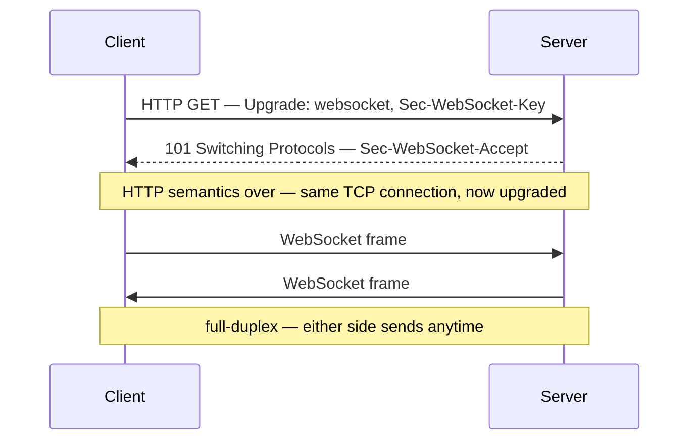

# WebSockets Study Guide

A depth-first guide to WebSockets for engineers building real-time features. Assumes you understand HTTP, TCP, and the request-response model (the [Networking Fundamentals](NETWORKING_FUNDAMENTALS.md) guide covers those), and that you can read JavaScript and Python. The guide is protocol-first: Part 1 grounds you in how WebSockets actually work on the wire, and every later part — across both Node.js and Python — refers back to it. Parts 1–10 are the fundamentals; Parts 11–12 are the applied recipes and an end-to-end build.

> *A WebSocket is just a TCP connection that started life as an HTTP request and never hung up. Everything else — frames, rooms, reconnection, scaling — is what you build on top of that one idea.*

Primary references: [RFC 6455](https://datatracker.ietf.org/doc/html/rfc6455) (the protocol — Part 1 is a guided tour of it), the [MDN WebSocket API docs](https://developer.mozilla.org/en-US/docs/Web/API/WebSockets_API) (the browser half), the [`ws`](https://github.com/websockets/ws) and [Socket.IO](https://socket.io/docs/v4/) docs (Node), and the [`websockets`](https://websockets.readthedocs.io/) library docs (Python — its deployment pages are quietly excellent).

---

## Table of Contents

- [Part 1 — Foundations & the Protocol](#part-1--foundations--the-protocol)
- [Part 2 — The Browser Client API](#part-2--the-browser-client-api)
- [Part 3 — Node.js Servers with `ws`](#part-3--nodejs-servers-with-ws)
- [Part 4 — Socket.IO](#part-4--socketio)
- [Part 5 — Python Servers](#part-5--python-servers)
- [Part 6 — Message Patterns & Application Design](#part-6--message-patterns--application-design)
- [Part 7 — Scaling WebSockets](#part-7--scaling-websockets)
- [Part 8 — Production Concerns](#part-8--production-concerns)
- [Part 9 — Reliability & Edge Cases](#part-9--reliability--edge-cases)
- [Part 10 — Alternatives & When Not to Use WebSockets](#part-10--alternatives--when-not-to-use-websockets)
- [Part 11 — Recipes](#part-11--recipes)
- [Part 12 — End-to-End Walkthrough](#part-12--end-to-end-walkthrough)

---

## Part 1 — Foundations & the Protocol

### 1.1 The Problem WebSockets Solve

HTTP is a request-response protocol: the client asks, the server answers, the exchange ends. The server has no way to speak first. For most of the web that's fine — you click a link, you get a page. But an entire class of applications needs the *server* to push data to the *client* the moment something happens: a chat message arrives, a stock price ticks, a teammate moves their cursor, a build finishes.

Before WebSockets, developers faked server push with three workarounds:

- **Short polling** — the client asks "anything new?" every few seconds. Simple, but wasteful: most requests return nothing, and you pay a full HTTP round trip (headers, TLS, connection setup) each time. Latency is bounded by your polling interval.
- **Long polling** — the client makes a request and the server *holds it open* until it has something to say, then responds; the client immediately reconnects. Lower latency, but still one HTTP request per message, and it ties up a connection per client on the server.
- **Server-Sent Events (SSE)** — a genuine one-way streaming channel from server to client over a single HTTP response (covered in [Part 10](#part-10--alternatives--when-not-to-use-websockets)). Great for feeds, but the client still can't send on the same channel.

WebSockets give you a **full-duplex, bidirectional, persistent connection**: after a one-time handshake, both sides can send messages at any time, independently, over a single long-lived TCP connection, with minimal per-message overhead (as little as 2 bytes of framing). That's the whole value proposition — low-latency, two-way, low-overhead communication.

References: [MDN: WebSocket API](https://developer.mozilla.org/en-US/docs/Web/API/WebSocket), [RFC 6455 (The WebSocket Protocol)](https://www.rfc-editor.org/rfc/rfc6455).

### 1.2 The Upgrade Handshake

A WebSocket connection begins its life as an ordinary HTTP/1.1 GET request carrying a few special headers that ask the server to *switch protocols*. This is the HTTP `Upgrade` mechanism.

The client sends:

```http
GET /chat HTTP/1.1
Host: example.com
Upgrade: websocket
Connection: Upgrade
Sec-WebSocket-Key: dGhlIHNhbXBsZSBub25jZQ==
Sec-WebSocket-Version: 13
Sec-WebSocket-Protocol: chat.v1
Origin: https://example.com
```

- `Upgrade: websocket` and `Connection: Upgrade` are the request to switch protocols.
- `Sec-WebSocket-Key` is a random 16-byte value, base64-encoded. It is **not** a security mechanism — it exists to prevent caching proxies and non-WebSocket servers from accidentally treating the request as a successful handshake.
- `Sec-WebSocket-Version: 13` is the protocol version (13 is the only version in real use).
- `Sec-WebSocket-Protocol` optionally negotiates an application-level subprotocol (Section 1.6).
- `Origin` tells the server which web origin initiated the connection — critical for security (see [Part 8](#part-8--production-concerns)).

The server proves it understood by responding `101 Switching Protocols`:

```http
HTTP/1.1 101 Switching Protocols
Upgrade: websocket
Connection: Upgrade
Sec-WebSocket-Accept: s3pPLMBiTxaQ9kYGzzhZRbK+xOo=
Sec-WebSocket-Protocol: chat.v1
```

The `Sec-WebSocket-Accept` value is computed deterministically: take the client's `Sec-WebSocket-Key`, concatenate the magic GUID `258EAFA5-E914-47DA-95CA-C5AB0DC85B11`, take the SHA-1 hash, and base64-encode it. The client verifies this to confirm it's really talking to a WebSocket server and not some other service that happened to return 101. Again — this is a correctness check, not encryption.

After the `101`, the HTTP semantics are over. The TCP connection stays open, and both sides now speak the **WebSocket framing protocol** instead of HTTP. The connection has been *upgraded*.



References: [RFC 6455 §1.3: Opening Handshake](https://www.rfc-editor.org/rfc/rfc6455#section-1.3), [MDN: Protocol upgrade mechanism](https://developer.mozilla.org/en-US/docs/Web/HTTP/Protocol_upgrade_mechanism).

### 1.3 Frames

Once upgraded, data is exchanged in **frames**, not HTTP messages. A frame is a compact binary structure. You almost never construct frames by hand — the library does it — but understanding the structure explains a lot of WebSocket behavior.

```
 0                   1                   2                   3
 0 1 2 3 4 5 6 7 8 9 0 1 2 3 4 5 6 7 8 9 0 1 2 3 4 5 6 7 8 9 0 1
+-+-+-+-+-------+-+-------------+-------------------------------+
|F|R|R|R| op    |M| Payload len |    Extended payload length    |
|I|S|S|S| code  |A|     (7)     |             (16/64)           |
|N|V|V|V| (4)   |S|             |   (if payload len==126/127)   |
| |1|2|3|       |K|             |                               |
+-+-+-+-+-------+-+-------------+ - - - - - - - - - - - - - - - +
|     Extended payload length continued, if payload len == 127  |
+ - - - - - - - - - - - - - - - +-------------------------------+
|                               | Masking-key, if MASK set to 1 |
+-------------------------------+-------------------------------+
| Masking-key (continued)       |          Payload Data         |
+-------------------------------- - - - - - - - - - - - - - - - +
:                     Payload Data continued ...                :
+---------------------------------------------------------------+
```

The pieces that matter in practice:

- **FIN bit** — is this the final frame of a message? A single logical message can be split across multiple frames (*fragmentation*); FIN marks the last one.
- **Opcode** — what kind of frame this is (Section 1.4).
- **MASK bit + Masking-key** — client-to-server frames **must** be masked with a random 32-bit key (the payload is XORed with it); server-to-client frames **must not** be masked. This rule exists to defeat a cache-poisoning attack against intermediaries that predate WebSockets — it is not confidentiality (that's what `wss://` is for).
- **Payload length** — 7 bits for lengths up to 125, then an escape to 16 or 64 bits for larger payloads. This variable-length encoding is why small messages have only ~2 bytes of overhead.

References: [RFC 6455 §5.2: Base Framing Protocol](https://www.rfc-editor.org/rfc/rfc6455#section-5.2).

### 1.4 Opcodes: Data Frames and Control Frames

The 4-bit opcode tells the receiver what a frame is:

| Opcode | Name | Purpose |
|--------|------|---------|
| `0x0` | Continuation | A non-first fragment of a fragmented message |
| `0x1` | Text | UTF-8 text payload |
| `0x2` | Binary | Arbitrary binary payload |
| `0x8` | Close | Begin closing the connection |
| `0x9` | Ping | Heartbeat request |
| `0xA` | Pong | Heartbeat response |

The split between **data frames** (text, binary, continuation) and **control frames** (close, ping, pong) is important. Control frames can be injected in the middle of a fragmented data message, are never fragmented themselves, and have a payload of at most 125 bytes. Ping/pong are the protocol's built-in liveness check (see [Part 8](#part-8--production-concerns)): either side can send a ping, and the peer must reply with a pong carrying the same payload.

Text vs. binary is a real distinction on the wire and in every API. Text frames carry UTF-8 (the library validates it); binary frames carry raw bytes. In the browser you choose how binary arrives — as a `Blob` or an `ArrayBuffer` ([Part 2](#part-2--the-browser-client-api)).

### 1.5 The Close Handshake and Close Codes

Closing is its own little handshake. One side sends a Close frame (opcode `0x8`) with an optional status code and reason; the peer replies with its own Close frame; then the underlying TCP connection is torn down. This lets both sides agree the closure was clean rather than a dropped network.

The status code explains *why*. The common ones:

| Code | Meaning |
|------|---------|
| `1000` | Normal closure |
| `1001` | Going away (server shutting down, browser navigating away) |
| `1002` | Protocol error |
| `1003` | Unsupported data (e.g. got binary but only handle text) |
| `1006` | Abnormal closure — connection dropped with **no** Close frame. Never sent on the wire; synthesized locally when the TCP connection just dies |
| `1008` | Policy violation (a catch-all, often used for auth failures) |
| `1009` | Message too big |
| `1011` | Internal server error |

`1006` is the one you'll see most in logs and bug reports: it means the connection vanished without a proper close handshake — a crashed server, a killed Wi-Fi connection, a proxy timeout. Your reconnection logic ([Part 2](#part-2--the-browser-client-api)) is what handles `1006`.

References: [RFC 6455 §7.4: Status Codes](https://www.rfc-editor.org/rfc/rfc6455#section-7.4), [MDN: CloseEvent codes](https://developer.mozilla.org/en-US/docs/Web/API/CloseEvent/code).

### 1.6 ws:// vs wss://, and Subprotocols

WebSockets have two URL schemes, exactly paralleling HTTP:

- **`ws://`** — unencrypted, default port 80.
- **`wss://`** — WebSocket over TLS, default port 443. This is the equivalent of HTTPS for WebSockets.

**Always use `wss://` in production.** Beyond the obvious confidentiality, `wss://` dramatically improves connection success rates: corporate proxies and middleboxes frequently mangle or block plaintext `ws://` upgrades because they don't understand them, whereas `wss://` traffic is opaque (encrypted) and passes through untouched. TLS here is the same TLS as everywhere else — see the [Cryptography](CRYPTO_FUNDAMENTALS.md) guide.

**Subprotocols** let the client and server agree on an application-level message format during the handshake, via `Sec-WebSocket-Protocol`. The client offers a list in preference order; the server picks one (or none) and echoes it back:

```javascript
// Client offers two; server will pick one and the client reads ws.protocol
const ws = new WebSocket("wss://example.com/api", ["graphql-transport-ws", "graphql-ws"]);
```

Real examples: `graphql-transport-ws` (GraphQL subscriptions), `mqtt` (MQTT over WebSockets), `wamp`. Subprotocols are also one of the few ways to smuggle an auth token past the browser's header restrictions ([Part 8](#part-8--production-concerns)).

References: [RFC 6455 §1.9: Subprotocols](https://www.rfc-editor.org/rfc/rfc6455#section-1.9), [IANA WebSocket Subprotocol Registry](https://www.iana.org/assignments/websocket/websocket.xml).

### 1.7 The Connection Lifecycle

Putting it together, every WebSocket moves through a fixed lifecycle, and every client/server API in this guide is just a different surface over these states:

```
   new WebSocket()
        │
        ▼
   CONNECTING ──── HTTP upgrade handshake (101) ────┐
        │                                            │ handshake fails
        ▼                                            ▼
      OPEN  ◄──── data frames flow both ways      CLOSED
        │         ping/pong keep it alive
        │  close() / Close frame / TCP drop
        ▼
    CLOSING ──── close handshake ────► CLOSED
```

Keep this picture in mind. When we talk about "broadcasting," we mean iterating over every connection currently in `OPEN`. When we talk about "reconnection," we mean detecting the transition to `CLOSED` and starting a new `CONNECTING`. When we talk about "backpressure," we mean a peer in `OPEN` that can't drain its send buffer fast enough.

```quiz
Q: What do WebSockets provide that short polling, long polling, and SSE each fall short of?
- [ ] Encrypted transport
- [x] A full-duplex, bidirectional, persistent connection — after one handshake both sides can send at any time over one TCP connection with as little as 2 bytes of per-message framing
- [ ] Guaranteed message delivery
- [ ] Compression by default
> Short polling wastes round trips and bounds latency by the interval; long polling still costs one HTTP request per message; SSE streams server→client but the client can't send on the same channel. WebSockets upgrade once and then both sides push frames independently with minimal overhead — low-latency, two-way communication is the whole value proposition.

Q: What is `Sec-WebSocket-Key`/`Sec-WebSocket-Accept` actually for?
- [ ] Encrypting the handshake
- [x] A correctness check — the deterministic SHA-1-of-key-plus-GUID response proves the server really speaks WebSocket, preventing caching proxies and non-WebSocket servers from accidentally "accepting" the upgrade; it is not a security mechanism
- [ ] Authenticating the user
- [ ] Negotiating compression
> The key is a random value and the accept is a deterministic hash anyone could compute — there's no secret. Its purpose is to ensure the 101 response came from something that genuinely understood the WebSocket handshake, not a confused intermediary. Confidentiality is `wss://`'s job (TLS), and client-frame masking similarly exists to defeat cache poisoning, not to hide data.

Q: Close code `1006` appears constantly in logs. What does it mean, and why is it special?
- [ ] Normal closure
- [x] Abnormal closure — the TCP connection died with *no* Close frame (crashed server, dropped Wi-Fi, proxy timeout); it's never sent on the wire, only synthesized locally, and it's the case reconnection logic exists to handle
- [ ] Message too big
- [ ] Policy violation
> A clean close is a handshake: Close frame, reply, teardown. `1006` is the absence of that — the connection just vanished, so the local side synthesizes the code. It's the most common close in production (network blips, proxy idle timeouts, crashes), which is why robust clients implement reconnection with backoff rather than treating it as exceptional.
```

---

## Part 2 — The Browser Client API

The browser ships a built-in `WebSocket` object. It's the reference client API, and understanding its surface — including its sharp edges — informs everything on the server side.

References: [MDN: WebSocket](https://developer.mozilla.org/en-US/docs/Web/API/WebSocket), [WHATWG: The WebSocket interface](https://websockets.spec.whatwg.org/).

### 2.1 Opening a Connection

```javascript
// url must be ws:// or wss://; the optional second arg is subprotocol(s)
const ws = new WebSocket("wss://example.com/chat", ["chat.v1"]);

ws.addEventListener("open", () => {
  console.log("connected; server chose subprotocol:", ws.protocol);
  ws.send("hello");
});
```

The constructor kicks off the handshake immediately and asynchronously. You can't send anything until the `open` event fires — calling `send()` while still `CONNECTING` throws an `InvalidStateError`.

**The critical limitation, stated up front:** the browser `WebSocket` constructor takes *only* a URL and an optional subprotocol list. **You cannot set custom request headers** — no `Authorization`, no custom `X-` headers. This single constraint shapes how WebSocket authentication is done in the browser, and we devote a section to it in [Part 8](#part-8--production-concerns). (Non-browser clients, like Node or Python, *can* set headers.)

### 2.2 The Four Events

The client API is entirely event-driven:

```javascript
const ws = new WebSocket("wss://example.com/chat");

ws.addEventListener("open", (event) => {
  // The connection is established and OPEN. Safe to send().
});

ws.addEventListener("message", (event) => {
  // A frame arrived. event.data is a string (text frame) OR
  // a Blob/ArrayBuffer (binary frame) depending on ws.binaryType.
  console.log("received:", event.data);
});

ws.addEventListener("close", (event) => {
  // event.code (e.g. 1000, 1006), event.reason (string),
  // event.wasClean (did we get a proper close handshake?)
  console.log(`closed: ${event.code} ${event.reason} clean=${event.wasClean}`);
});

ws.addEventListener("error", (event) => {
  // Something went wrong. The Error event carries almost no detail
  // (by design, for security). A 'close' event with code 1006
  // almost always follows. Use close.code for the real diagnosis.
});
```

A few non-obvious truths:

- The `error` event is deliberately information-free. The browser won't tell you *why* the handshake failed (was it a 401? a TLS error? a DNS failure?) to avoid leaking cross-origin information. You diagnose from the `close` event's code and from the network tab, not from `error`.
- `error` is essentially always followed by `close`. Put your reconnection logic in the `close` handler, not `error`.
- `close` with `wasClean: false` and `code: 1006` is the "the network died" signal.

### 2.3 Sending and Receiving Data

```javascript
// Sending: strings go as text frames; the rest go as binary frames
ws.send("a string");                       // text frame
ws.send(JSON.stringify({ type: "ping" }));  // text frame (the usual pattern)
ws.send(new Uint8Array([1, 2, 3]));         // binary frame
ws.send(new ArrayBuffer(8));                // binary frame
ws.send(blob);                              // binary frame
```

For incoming binary data, you choose the type via `binaryType`:

```javascript
ws.binaryType = "arraybuffer";  // event.data will be an ArrayBuffer (synchronous, in-memory)
// vs the default:
ws.binaryType = "blob";         // event.data will be a Blob (better for large data / files)
```

Use `"arraybuffer"` when you want to parse the bytes immediately (e.g. decode a MessagePack or Protobuf message); use `"blob"` for large opaque payloads you'll hand to something else (an ``, a download, the File API).

### 2.4 readyState and Closing

```javascript
// readyState is one of these constants
WebSocket.CONNECTING; // 0
WebSocket.OPEN;       // 1
WebSocket.CLOSING;    // 2
WebSocket.CLOSED;     // 3

if (ws.readyState === WebSocket.OPEN) {
  ws.send(payload);  // only safe to send when OPEN
}

// Initiate a clean close. Code must be 1000 or in the 3000–4999 range
// (application-defined). Reason is a short UTF-8 string (<= 123 bytes).
ws.close(1000, "user logged out");
```

The `3000–4999` range is reserved for application-defined close codes — use it to signal app-specific reasons (e.g. `4001 = "auth expired"`) that your own client can interpret on reconnect.

### 2.5 Backpressure: bufferedAmount

When you call `send()`, the data may not go out immediately — it's queued in an internal buffer if the network can't keep up. `bufferedAmount` is the number of bytes still queued:

```javascript
const MAX_BUFFER = 1 << 20; // 1 MB

function safeSend(ws, data) {
  // Don't pile data onto a socket that can't drain. Drop, or back off.
  if (ws.bufferedAmount > MAX_BUFFER) {
    console.warn("backpressure: skipping send");
    return false;
  }
  ws.send(data);
  return true;
}
```

This matters for high-frequency senders — a live dashboard pushing updates, a game loop. If you `send()` faster than the socket drains, `bufferedAmount` grows without bound and you'll exhaust memory. We return to backpressure on the server side in [Part 8](#part-8--production-concerns).

### 2.6 Reconnection with Exponential Backoff

The built-in `WebSocket` does **not** reconnect on its own. When the connection drops (the dreaded `1006`), it stays closed until you make a new one. Production clients need a reconnection wrapper. The essential ingredients are exponential backoff (don't hammer a server that's down) and jitter (don't let thousands of clients reconnect in lockstep — the "thundering herd," revisited in [Part 9](#part-9--reliability--edge-cases)):

```javascript
class ReconnectingSocket {
  constructor(url, protocols) {
    this.url = url;
    this.protocols = protocols;
    this.attempts = 0;
    this.maxDelay = 30_000; // cap backoff at 30s
    this.shouldReconnect = true;
    this.listeners = { message: [], open: [], close: [] };
    this.connect();
  }

  connect() {
    this.ws = new WebSocket(this.url, this.protocols);

    this.ws.addEventListener("open", (e) => {
      this.attempts = 0; // reset backoff on a successful connection
      this.listeners.open.forEach((fn) => fn(e));
    });

    this.ws.addEventListener("message", (e) => {
      this.listeners.message.forEach((fn) => fn(e));
    });

    this.ws.addEventListener("close", (e) => {
      this.listeners.close.forEach((fn) => fn(e));
      if (this.shouldReconnect) this.scheduleReconnect();
    });
  }

  scheduleReconnect() {
    this.attempts += 1;
    // Exponential backoff: 1s, 2s, 4s, 8s … capped, plus random jitter
    const base = Math.min(this.maxDelay, 1000 * 2 ** (this.attempts - 1));
    const delay = base / 2 + Math.random() * (base / 2); // 50–100% of base
    setTimeout(() => this.connect(), delay);
  }

  send(data) {
    if (this.ws.readyState === WebSocket.OPEN) this.ws.send(data);
  }

  on(event, fn) {
    this.listeners[event].push(fn);
  }

  close() {
    this.shouldReconnect = false; // disable auto-reconnect for an intentional close
    this.ws.close(1000, "client closing");
  }
}

// Usage
const conn = new ReconnectingSocket("wss://example.com/chat", ["chat.v1"]);
conn.on("open", () => conn.send(JSON.stringify({ type: "subscribe", room: "general" })));
conn.on("message", (e) => render(JSON.parse(e.data)));
```

This pattern — backoff, jitter, reset-on-open, distinguish-intentional-from-accidental-close — is the foundation. Libraries like [`reconnecting-websocket`](https://github.com/pladaria/reconnecting-websocket) (browser) and the auto-reconnect built into Socket.IO ([Part 4](#part-4--socketio)) package it up, but you should understand what they're doing. State recovery *after* reconnecting — replaying missed messages — is a harder problem we cover in [Part 9](#part-9--reliability--edge-cases).

```quiz
Q: Why does the reconnection wrapper add random *jitter* on top of exponential backoff?
- [ ] To make reconnects faster on average
- [x] Without jitter, thousands of clients disconnected by the same outage reconnect in lockstep at the same instants — a thundering herd that can knock the recovering server back over
- [ ] Jitter is required by RFC 6455
- [ ] To randomize close codes
> Exponential backoff stops one client from hammering a down server, but a mass disconnect synchronizes every client's retry schedule: at t=1s, 2s, 4s the whole fleet arrives at once. Randomizing each delay (here 50–100% of the base) spreads the reconnections out so the recovering server sees a ramp, not a spike. Backoff protects the server from one client; jitter protects it from all of them.

Q: A live dashboard calls `ws.send()` on every tick and the tab's memory grows until it crashes. What's the missing discipline?
- [ ] Calling close() between sends
- [x] Checking `bufferedAmount` — send() queues into an internal buffer when the network can't keep up, so a sender faster than the socket drains grows the buffer without bound; drop or back off when it's high
- [ ] Using text frames instead of binary
- [ ] Increasing the polling interval
> `send()` is non-blocking: data the network can't take yet sits in the socket's buffer, and `bufferedAmount` reports the queued bytes. High-frequency senders (dashboards, game loops) must treat a large `bufferedAmount` as backpressure — skip or coalesce updates rather than piling more on. The same problem exists server-side per slow client (Part 8).

Q: Why does the wrapper set `shouldReconnect = false` before an intentional `close()`?
- [ ] To free the listeners array
- [x] The close handler can't otherwise distinguish "user logged out" from "network died" — without the flag, an intentional close would trigger the reconnect loop and immediately reopen the connection
- [ ] close() fails if reconnect is enabled
- [ ] It resets the backoff counter
> Both an intentional `close(1000)` and an accidental drop fire the same `close` event, and the reconnect logic lives there. Distinguishing deliberate shutdown from failure (via a flag, or by inspecting the close code) is essential — otherwise logout becomes login. It's one of the four foundation ingredients: backoff, jitter, reset-on-open, and intentional-vs-accidental discrimination.
```

---

## Part 3 — Node.js Servers with `ws`

[`ws`](https://github.com/websockets/ws) is the foundational WebSocket library for Node.js — small, fast, spec-compliant, and the dependency under most higher-level tools (including Socket.IO's WebSocket transport). If you want raw WebSockets on the server with no extra protocol on top, this is the library.

Node.js has shipped a built-in `WebSocket` *client* (the same global API as the browser) since Node 22, but it has **no built-in WebSocket server** — for that you use `ws`.

References: [`ws` documentation](https://github.com/websockets/ws/blob/master/doc/ws.md), [`ws` on npm](https://www.npmjs.com/package/ws).

### 3.1 A Minimal Server

```javascript
// npm install ws
import { WebSocketServer } from "ws";

const wss = new WebSocketServer({ port: 8080 });

wss.on("connection", (ws, req) => {
  // `ws` is one client connection; `req` is the original HTTP upgrade request
  console.log("client connected from", req.socket.remoteAddress);

  ws.on("message", (data, isBinary) => {
    // data is a Buffer. isBinary distinguishes binary frames from text.
    const text = isBinary ? data : data.toString();
    console.log("received:", text);
    ws.send(`echo: ${text}`); // reply to just this client
  });

  ws.on("close", (code, reason) => {
    console.log(`client gone: ${code} ${reason}`);
  });

  ws.on("error", console.error);

  ws.send("welcome"); // server speaks first — impossible over plain HTTP
});
```

Note that incoming `message` data is a Node `Buffer`, not a string — `ws` doesn't assume text. The `isBinary` flag tells you whether the frame was a text or binary frame so you can decide whether to `.toString()` it.

### 3.2 Broadcasting

There's no built-in "send to everyone" — you iterate `wss.clients`, which is a `Set` of all connected sockets:

```javascript
import { WebSocketServer, WebSocket } from "ws";

const wss = new WebSocketServer({ port: 8080 });

function broadcast(message, except) {
  for (const client of wss.clients) {
    // Only send to sockets that are actually OPEN, optionally skipping the sender
    if (client.readyState === WebSocket.OPEN && client !== except) {
      client.send(message);
    }
  }
}

wss.on("connection", (ws) => {
  ws.on("message", (data) => {
    broadcast(data.toString(), ws); // relay to everyone else
  });
});
```

This naive broadcast is fine for a single server. The moment you run *two* server processes, clients on process A won't receive messages broadcast on process B — each `wss.clients` only knows its own connections. Solving that is the subject of [Part 7](#part-7--scaling-websockets).

### 3.3 Sharing a Port with an HTTP Server

In a real app you serve HTTP (your pages, your REST API) *and* WebSockets on the same port. Attach `ws` to an existing `http.Server`:

```javascript
import { createServer } from "node:http";
import { WebSocketServer } from "ws";

const server = createServer((req, res) => {
  res.writeHead(200);
  res.end("HTTP and WebSocket on the same port");
});

// `ws` will handle the 'upgrade' event on this server automatically
const wss = new WebSocketServer({ server });

wss.on("connection", (ws) => {
  ws.send("connected via the shared HTTP server");
});

server.listen(8080);
```

With Express or Fastify, the same idea applies — those frameworks *are* an `http.Server` request handler, so you create the server, pass it to both the framework and `ws`:

```javascript
import express from "express";
import { createServer } from "node:http";
import { WebSocketServer } from "ws";

const app = express();
app.get("/health", (req, res) => res.send("ok"));

const server = createServer(app);     // Express handles normal requests
const wss = new WebSocketServer({ server }); // ws handles upgrades

wss.on("connection", (ws) => ws.send("hi"));

server.listen(3000);
```

### 3.4 Manual Upgrade Handling (for Auth and Routing)

When you need to authenticate *before* accepting the connection, or route different URL paths to different WebSocket servers, use `noServer: true` and handle the HTTP `upgrade` event yourself. This is the most important production pattern in `ws`:

```javascript
import { createServer } from "node:http";
import { WebSocketServer } from "ws";

const server = createServer();
// noServer: we control exactly when handleUpgrade is called
const chatWss = new WebSocketServer({ noServer: true });
const feedWss = new WebSocketServer({ noServer: true });

server.on("upgrade", (req, socket, head) => {
  const { pathname } = new URL(req.url, `http://${req.headers.host}`);

  // Authenticate using the handshake request BEFORE completing the upgrade.
  // (req.headers has cookies, and you can read query params — see Part 8.)
  const user = authenticate(req);
  if (!user) {
    // Reject the handshake with an HTTP error; no WebSocket is established
    socket.write("HTTP/1.1 401 Unauthorized\r\n\r\n");
    socket.destroy();
    return;
  }

  // Route by path to the right WebSocketServer
  if (pathname === "/chat") {
    chatWss.handleUpgrade(req, socket, head, (ws) => {
      ws.user = user; // stash auth context on the socket for later
      chatWss.emit("connection", ws, req);
    });
  } else if (pathname === "/feed") {
    feedWss.handleUpgrade(req, socket, head, (ws) => {
      feedWss.emit("connection", ws, req);
    });
  } else {
    socket.destroy(); // unknown path
  }
});

chatWss.on("connection", (ws) => ws.send(`welcome ${ws.user.name}`));
server.listen(8080);
```

Rejecting at the upgrade stage is strictly better than accepting and then immediately closing: you never establish the connection, you return a real HTTP status the client can read, and you don't pay the cost of a short-lived socket.

### 3.5 Heartbeats: Detecting Dead Connections

TCP connections can die silently — a client's laptop sleeps, Wi-Fi drops, a NAT times out — without ever sending a Close frame. The server keeps the socket open forever, leaking memory. The fix is the protocol's built-in ping/pong ([Part 1](#part-1--foundations--the-protocol)): periodically ping every client and terminate any that didn't pong since the last round.

```javascript
import { WebSocketServer } from "ws";

const wss = new WebSocketServer({ port: 8080 });

wss.on("connection", (ws) => {
  ws.isAlive = true;
  // The client (browser) auto-replies to pings with a pong; ws fires 'pong'
  ws.on("pong", () => { ws.isAlive = true; });
});

// Every 30s, reap connections that didn't pong, then ping the rest
const interval = setInterval(() => {
  for (const ws of wss.clients) {
    if (ws.isAlive === false) {
      ws.terminate(); // hard close — the connection is dead
      continue;
    }
    ws.isAlive = false;
    ws.ping(); // browser answers automatically at the protocol level
  }
}, 30_000);

wss.on("close", () => clearInterval(interval));
```

`terminate()` is the abrupt teardown (RST the socket) versus `close()` which does the polite close handshake. For a connection you've already decided is dead, `terminate()` is correct. We come back to heartbeats and proxy idle-timeouts in [Part 8](#part-8--production-concerns).

### 3.6 Per-Message Limits and Compression

```javascript
import { WebSocketServer } from "ws";

const wss = new WebSocketServer({
  port: 8080,
  maxPayload: 1 * 1024 * 1024, // reject frames larger than 1 MB (DoS guard)
  perMessageDeflate: {
    // permessage-deflate compression (RFC 7692). Helps text-heavy traffic,
    // but costs CPU and memory per connection — benchmark before enabling.
    threshold: 1024, // only compress messages larger than 1 KB
  },
});
```

`maxPayload` is a basic denial-of-service guard — without it, a malicious client can announce a huge frame and exhaust your memory. Compression (`permessage-deflate`) can shrink JSON dramatically but adds CPU and per-connection memory overhead; it's off by default in `ws` for that reason. Measure with your real payloads before turning it on.

References: [`ws` server options](https://github.com/websockets/ws/blob/master/doc/ws.md#new-websocketserveroptions-callback), [RFC 7692: Compression Extensions](https://www.rfc-editor.org/rfc/rfc7692).

---

## Part 4 — Socket.IO

[Socket.IO](https://socket.io/) is **not** a WebSocket library — it's a real-time framework that *uses* WebSockets (and falls back to HTTP long-polling). This distinction trips people up constantly: a Socket.IO client **cannot** talk to a raw `ws` server, and a raw browser `WebSocket` **cannot** talk to a Socket.IO server. They speak different application protocols. Socket.IO layers its own message format, handshake, and features on top of the transport (via a lower layer called Engine.IO).

References: [Socket.IO documentation](https://socket.io/docs/v4/), [How Socket.IO works](https://socket.io/docs/v4/how-it-works/).

### 4.1 What Socket.IO Adds Over Raw WebSockets

Socket.IO exists because raw WebSockets leave a lot for you to build. It provides, out of the box:

- **Automatic reconnection** with backoff — the wrapper from [Part 2](#part-2--the-browser-client-api), built in.
- **Transport fallback** — if WebSockets are blocked (hostile proxy, ancient browser), it transparently falls back to HTTP long-polling, then upgrades to WebSocket when possible.
- **Named events** — emit and listen for `"chat message"`, `"user joined"`, etc., instead of hand-rolling a message-type field.
- **Acknowledgements** — request-response over the socket, with callbacks (the pattern we build manually in [Part 6](#part-6--message-patterns--application-design)).
- **Rooms and namespaces** — server-side grouping for targeted broadcasts.
- **Automatic JSON (and binary) serialization** — you emit objects, not strings.
- **A Redis adapter** for multi-server scaling ([Part 7](#part-7--scaling-websockets)).

The cost: a heavier client, a proprietary wire protocol, and overhead you may not need. The decision guide is in Section 4.6.

### 4.2 Server and Client Basics

```javascript
// Server — npm install socket.io
import { createServer } from "node:http";
import { Server } from "socket.io";

const httpServer = createServer();
const io = new Server(httpServer, {
  cors: { origin: "https://example.com" }, // Socket.IO needs CORS for its HTTP polling phase
});

io.on("connection", (socket) => {
  console.log("connected:", socket.id); // every connection gets a unique id

  // Listen for a named event from this client
  socket.on("chat message", (msg) => {
    console.log("message:", msg);
    io.emit("chat message", msg); // broadcast to ALL connected clients
  });

  socket.on("disconnect", (reason) => {
    console.log("disconnected:", reason);
  });
});

httpServer.listen(3000);
```

```javascript
// Client — npm install socket.io-client (or load from CDN in the browser)
import { io } from "socket.io-client";

const socket = io("https://example.com"); // auto-connects, auto-reconnects

socket.on("connect", () => console.log("connected as", socket.id));
socket.on("chat message", (msg) => render(msg)); // objects, not strings
socket.emit("chat message", { text: "hello", user: "alice" });
```

Notice you emit a plain object and receive a plain object — Socket.IO handles serialization. Compare this with the raw `ws` version where you `JSON.stringify`/`JSON.parse` and dispatch on a type field yourself.

### 4.3 Emitting: The Targeting Cheat Sheet

Socket.IO's real power is the variety of ways to target an emit. This table is worth memorizing:

```javascript
io.on("connection", (socket) => {
  socket.emit("event", data);                    // → just this client
  io.emit("event", data);                         // → every connected client
  socket.broadcast.emit("event", data);           // → everyone EXCEPT this client
  io.to("room1").emit("event", data);             // → everyone in room1
  socket.to("room1").emit("event", data);         // → room1 except this client
  io.to("room1").to("room2").emit("event", data); // → union of room1 and room2
  io.except("room3").emit("event", data);          // → everyone NOT in room3
  io.to(someSocketId).emit("event", data);         // → one specific socket (its id is a room)
});
```

### 4.4 Rooms

A **room** is a server-side label you attach to sockets so you can broadcast to a subset. Rooms are purely a server concept — the client never knows which rooms it's in and can't join them directly (the server decides, which is good for security).

```javascript
io.on("connection", (socket) => {
  socket.on("join room", (roomName) => {
    socket.join(roomName);                 // add this socket to the room
    socket.to(roomName).emit("system", `${socket.id} joined`);
  });

  socket.on("room message", ({ room, text }) => {
    // Only members of `room` receive this
    io.to(room).emit("room message", { from: socket.id, text });
  });

  socket.on("leave room", (roomName) => {
    socket.leave(roomName);
  });
});
```

Every socket automatically joins a room named after its own `socket.id`, which is how `io.to(socketId).emit(...)` delivers to a single client. Rooms are the building block for chat channels, per-document collaboration sessions, per-user notification streams, and game lobbies.

References: [Socket.IO Rooms](https://socket.io/docs/v4/rooms/).

### 4.5 Acknowledgements (Request-Response)

WebSockets are message-oriented, not request-response — there's no built-in "reply to this specific message." Socket.IO adds **acknowledgements**: pass a callback as the last argument to `emit`, and the receiver invokes it to reply.

```javascript
// Client asks and awaits a reply (with a timeout)
try {
  const response = await socket.timeout(5000).emitWithAck("create todo", { title: "Buy milk" });
  console.log("server assigned id:", response.id);
} catch (err) {
  console.error("server did not ack within 5s"); // handle the timeout
}
```

```javascript
// Server handles it and acks via the callback
socket.on("create todo", (todo, callback) => {
  const saved = db.insert(todo);
  callback({ id: saved.id, status: "created" }); // this resolves the client's promise
});
```

The `timeout()` is essential — without it, a dropped connection or a server that forgets to call the callback leaves the client's promise pending forever. This is the safe, ergonomic version of the correlation-id pattern we implement by hand for raw WebSockets in [Part 6](#part-6--message-patterns--application-design).

References: [Socket.IO Acknowledgements](https://socket.io/docs/v4/emitting-events/#acknowledgements).

### 4.6 When to Use Socket.IO vs. Raw `ws`

| Use raw `ws` (or browser `WebSocket`) when… | Use Socket.IO when… |
|---|---|
| You control both client and server and want a lean wire protocol | You want batteries-included reconnection, rooms, and acks without building them |
| You need to interoperate with non-Socket.IO clients or a standard subprotocol (GraphQL-WS, MQTT) | All your clients are your own Socket.IO clients |
| Every byte and millisecond matters (games, high-frequency data) | Developer velocity matters more than wire efficiency |
| You're behind infra that fully supports WebSockets | You must survive hostile proxies that block WebSockets (the long-polling fallback saves you) |
| You want the smallest possible client bundle | The extra client weight is acceptable |

A reasonable default: **start with raw `ws`** if your needs are simple and you control both ends; **reach for Socket.IO** when you find yourself reimplementing rooms, reconnection, and acks — because that's most of what Socket.IO is. Note also that Socket.IO with the long-polling fallback **requires sticky sessions** when running multiple servers, a constraint we unpack in [Part 7](#part-7--scaling-websockets).

---

## Part 5 — Python Servers

Python's WebSocket story is built on **asyncio**: a WebSocket server holds thousands of long-lived connections, and that's exactly the I/O-bound concurrency asyncio is designed for. If async Python isn't second nature yet, read the [Python Concurrency](PYTHON_CONCURRENCY.md) guide alongside this part — `async def`, `await`, and the event loop are assumed throughout.

There are four tools worth knowing, in rough order of "lowest-level" to "most batteries-included": the `websockets` library, Starlette/FastAPI, Django Channels, and `python-socketio`.

### 5.1 The `websockets` Library

[`websockets`](https://websockets.readthedocs.io/) is the standalone, asyncio-native WebSocket library — the Python counterpart to Node's `ws`. It's spec-compliant, well-documented, and has no framework baggage.

```python
# pip install websockets
import asyncio
from websockets.asyncio.server import serve

async def handler(websocket):
    # Iterate messages until the client disconnects. Each `message` is
    # a str (text frame) or bytes (binary frame).
    async for message in websocket:
        print("received:", message)
        await websocket.send(f"echo: {message}")

async def main():
    # serve() returns an async context manager; the server runs until cancelled
    async with serve(handler, "localhost", 8765):
        await asyncio.get_running_loop().create_future()  # run forever

asyncio.run(main())
```

A note on versions, because the API was modernized: the `websockets.asyncio.server` module shown here is the current (v13+) API. Older code and tutorials use `websockets.serve` with a two-argument handler `async def handler(websocket, path)`; in the new API the path lives on `websocket.request.path` instead. New projects should use the form above; recognize the legacy form when you see it.

**Receiving in two styles** — iterate, or call `recv()` explicitly:

```python
from websockets.exceptions import ConnectionClosed

async def handler(websocket):
    try:
        while True:
            message = await websocket.recv()  # waits for the next message
            await websocket.send(process(message))
    except ConnectionClosed:
        pass  # client disconnected; clean up here
```

The `async for` form is just sugar over `recv()` in a loop that ends cleanly on disconnect. Catching `ConnectionClosed` is how you detect the client going away when you call `recv()`/`send()` directly.

**Broadcasting** with `websockets` is, like `ws`, a matter of keeping your own set of connections:

```python
import asyncio
from websockets.asyncio.server import serve, broadcast

CONNECTIONS = set()

async def handler(websocket):
    CONNECTIONS.add(websocket)
    try:
        await websocket.wait_closed()  # park here until the client leaves
    finally:
        CONNECTIONS.discard(websocket)  # always clean up

async def push_updates():
    while True:
        await asyncio.sleep(1)
        # broadcast() is a library helper that sends to many connections,
        # skipping any that are slow or already closed
        broadcast(CONNECTIONS, f"the time is {asyncio.get_event_loop().time():.0f}")

async def main():
    async with serve(handler, "localhost", 8765):
        await push_updates()

asyncio.run(main())
```

References: [`websockets` documentation](https://websockets.readthedocs.io/en/stable/), [`websockets` intro/tutorial](https://websockets.readthedocs.io/en/stable/intro/index.html).

### 5.2 FastAPI / Starlette

If your app is already a [FastAPI](https://fastapi.tiangolo.com/) or [Starlette](https://www.starlette.io/) service, you get WebSocket endpoints in the same app, on the same port, sharing the same dependency-injection and middleware. FastAPI's WebSocket support comes straight from Starlette underneath.

```python
# pip install fastapi uvicorn
from fastapi import FastAPI, WebSocket, WebSocketDisconnect

app = FastAPI()

@app.websocket("/ws")
async def websocket_endpoint(websocket: WebSocket):
    await websocket.accept()  # complete the handshake — you MUST call this
    try:
        while True:
            data = await websocket.receive_text()   # or receive_bytes / receive_json
            await websocket.send_text(f"echo: {data}")
    except WebSocketDisconnect:
        print("client disconnected")
```

Run it with `uvicorn main:app`. The `receive_json`/`send_json` helpers are particularly handy — they do the `json.dumps`/`json.loads` for you, matching the JSON-envelope pattern from [Part 6](#part-6--message-patterns--application-design).

For broadcasting you maintain a connection registry — the idiomatic FastAPI approach is a small `ConnectionManager`:

```python
from fastapi import FastAPI, WebSocket, WebSocketDisconnect

class ConnectionManager:
    def __init__(self) -> None:
        self.active: list[WebSocket] = []

    async def connect(self, ws: WebSocket) -> None:
        await ws.accept()
        self.active.append(ws)

    def disconnect(self, ws: WebSocket) -> None:
        self.active.remove(ws)

    async def broadcast(self, message: str) -> None:
        for connection in self.active:
            await connection.send_text(message)

manager = ConnectionManager()
app = FastAPI()

@app.websocket("/ws/{room}")
async def chat(websocket: WebSocket, room: str):
    await manager.connect(websocket)
    try:
        while True:
            text = await websocket.receive_text()
            await manager.broadcast(f"[{room}] {text}")
    except WebSocketDisconnect:
        manager.disconnect(websocket)
```

This single-process `ConnectionManager` is the FastAPI equivalent of iterating `wss.clients`, and it hits the same wall at multi-server scale ([Part 7](#part-7--scaling-websockets)).

References: [FastAPI WebSockets](https://fastapi.tiangolo.com/advanced/websockets/), [Starlette WebSockets](https://www.starlette.io/websockets/).

### 5.3 Django Channels

Plain Django is synchronous and built around the request-response cycle — it can't hold WebSocket connections. [Django Channels](https://channels.readthedocs.io/) extends Django to ASGI and adds **consumers** (the WebSocket equivalent of views) and a **channel layer** (a shared message bus, almost always backed by Redis) that lets consumers across processes talk to each other.

```python
# consumers.py — pip install channels channels-redis
from channels.generic.websocket import AsyncJsonWebsocketConsumer

class ChatConsumer(AsyncJsonWebsocketConsumer):
    async def connect(self):
        self.room = self.scope["url_route"]["kwargs"]["room"]
        self.group = f"chat_{self.room}"
        # Join a group — the channel layer's version of a "room"
        await self.channel_layer.group_add(self.group, self.channel_name)
        await self.accept()

    async def disconnect(self, code):
        await self.channel_layer.group_discard(self.group, self.channel_name)

    async def receive_json(self, content):
        # Fan the message out to everyone in the group, across all server processes
        await self.channel_layer.group_send(
            self.group,
            {"type": "chat.message", "text": content["text"]},
        )

    async def chat_message(self, event):
        # Handler invoked for each "chat.message" the group receives.
        # The dotted "chat.message" type maps to this chat_message method.
        await self.send_json({"text": event["text"]})
```

```python
# routing.py
from django.urls import re_path
from .consumers import ChatConsumer

websocket_urlpatterns = [
    re_path(r"ws/chat/(?P<room>\w+)/$", ChatConsumer.as_asgi()),
]
```

The key insight: Channels' **channel layer already solves the multi-server broadcast problem** that we have to bolt on manually for `ws` and FastAPI. `group_send` reaches every consumer in the group regardless of which process holds the connection, because the channel layer routes through Redis. That makes Channels the most "scales out of the box" option here — at the cost of buying into Django and ASGI. Channels is the right pick when you already have a Django app and want real-time features that share its models, auth, and ORM.

References: [Django Channels documentation](https://channels.readthedocs.io/en/latest/), [Channels consumers](https://channels.readthedocs.io/en/latest/topics/consumers.html), [Channel layers](https://channels.readthedocs.io/en/latest/topics/channel_layers.html).

### 5.4 python-socketio

If your frontend uses the Socket.IO client (or you want Socket.IO's features in a Python backend), [`python-socketio`](https://python-socketio.readthedocs.io/) is a from-scratch Python implementation of the Socket.IO protocol. It interoperates with the JavaScript Socket.IO client and server, supports rooms, namespaces, and acknowledgements, and has a Redis manager for scaling.

```python
# pip install python-socketio uvicorn
import socketio

sio = socketio.AsyncServer(async_mode="asgi", cors_allowed_origins="*")
app = socketio.ASGIApp(sio)  # mount under uvicorn

@sio.event
async def connect(sid, environ, auth):
    print("connected:", sid)

@sio.event
async def chat_message(sid, data):
    await sio.emit("chat message", data)  # broadcast to all

@sio.event
async def join(sid, room):
    await sio.enter_room(sid, room)
    await sio.emit("system", f"{sid} joined", room=room)

@sio.event
async def disconnect(sid):
    print("disconnected:", sid)
```

This is the Python mirror of the Socket.IO server from [Part 4](#part-4--socketio), and the same trade-offs apply: you get rooms/acks/reconnection for free, but you're committed to the Socket.IO protocol on both ends.

References: [python-socketio documentation](https://python-socketio.readthedocs.io/en/stable/), [python-socketio server API](https://python-socketio.readthedocs.io/en/stable/server.html).

### 5.5 Choosing Among the Python Options

| Tool | Reach for it when… |
|------|--------------------|
| `websockets` | You want a standalone, standards-compliant WebSocket server with no framework. Lowest overhead. |
| FastAPI / Starlette | You already have (or want) a FastAPI/Starlette API and want WebSockets in the same app. |
| Django Channels | You have a Django app; you want real-time that shares Django's auth/ORM, with multi-server broadcast solved by the channel layer. |
| python-socketio | Your clients use the Socket.IO protocol, or you want rooms/acks/fallback without building them. |

---

## Part 6 — Message Patterns & Application Design

The raw APIs give you `send(bytes)` and `onmessage`. Everything an application actually needs — typed messages, channels, replies, presence — you design on top. This part covers the patterns that recur in every non-trivial WebSocket app, independent of language or library.

### 6.1 Design a Message Envelope First

Raw WebSocket gives you an undifferentiated stream of messages. Before writing any handler, define an **envelope**: a consistent structure that says what kind of message this is and carries its data. The near-universal choice is a JSON object with a `type` discriminator:

```json
{ "type": "chat.message", "id": "01J...", "payload": { "room": "general", "text": "hi" } }
```

```javascript
// Server-side dispatch on the type field — the WebSocket equivalent of routing
const HANDLERS = {
  "chat.message": handleChatMessage,
  "chat.join":    handleJoin,
  "presence.ping": handlePresencePing,
};

ws.on("message", (raw) => {
  let msg;
  try {
    msg = JSON.parse(raw);
  } catch {
    return ws.close(1003, "invalid JSON"); // 1003 = unsupported data
  }
  const handler = HANDLERS[msg.type];
  if (!handler) return ws.send(JSON.stringify({ type: "error", error: "unknown type" }));
  handler(ws, msg.payload, msg.id);
});
```

Include a few things in the envelope from day one, because retrofitting them hurts:

- **`type`** — the discriminator. Namespacing (`chat.message`, `presence.join`) keeps it organized as the protocol grows.
- **`id`** — a unique message id. Enables acknowledgements (Section 6.3), deduplication, and at-least-once delivery ([Part 9](#part-9--reliability--edge-cases)).
- **A version**, somewhere — even just `"v": 1`. Wire protocols outlive your assumptions; a version field lets clients and servers evolve independently.

### 6.2 Pub/Sub and Channels

The dominant WebSocket pattern is publish-subscribe: clients **subscribe** to topics (channels/rooms), publishers **publish** to a topic, and the server fans each message out to that topic's subscribers. Socket.IO rooms ([Part 4](#part-4--socketio)) and Channels groups ([Part 5](#part-5--python-servers)) are pub/sub primitives; with raw `ws` you maintain the topic→subscribers map yourself:

```javascript
// Topic → Set of subscribed sockets
const topics = new Map();

function subscribe(ws, topic) {
  if (!topics.has(topic)) topics.set(topic, new Set());
  topics.get(topic).add(ws);
  (ws.topics ??= new Set()).add(topic); // track on the socket for cleanup
}

function publish(topic, message) {
  const subs = topics.get(topic);
  if (!subs) return;
  const data = JSON.stringify(message);
  for (const ws of subs) if (ws.readyState === ws.OPEN) ws.send(data);
}

// On disconnect, remove the socket from every topic it joined (avoid leaks)
function cleanup(ws) {
  for (const topic of ws.topics ?? []) topics.get(topic)?.delete(ws);
}
```

This in-process map works for one server. Across servers, "publish to a topic" must reach subscribers on *other* processes — which is exactly where a Redis pub/sub backplane comes in ([Part 7](#part-7--scaling-websockets)). The application-level pattern stays identical; only the fan-out mechanism changes.

### 6.3 Request-Response over a Message Stream

WebSockets are bidirectional message streams, not request-response — there's no built-in way to say "this message is a reply to that one." When you need RPC semantics (ask the server something, await its answer), implement **correlation ids**: tag each request with a unique id; the server echoes that id in its response; the client matches replies to pending requests.

```javascript
// Client-side RPC wrapper over a raw WebSocket
const pending = new Map(); // id → { resolve, reject, timer }

function request(ws, type, payload, timeoutMs = 5000) {
  const id = crypto.randomUUID();
  return new Promise((resolve, reject) => {
    const timer = setTimeout(() => {
      pending.delete(id);
      reject(new Error("request timed out")); // never leave a promise dangling
    }, timeoutMs);
    pending.set(id, { resolve, reject, timer });
    ws.send(JSON.stringify({ type, id, payload }));
  });
}

ws.addEventListener("message", (e) => {
  const msg = JSON.parse(e.data);
  const p = pending.get(msg.id);
  if (p) {                       // it's a reply to one of our requests
    clearTimeout(p.timer);
    pending.delete(msg.id);
    p.resolve(msg.payload);
  } else {
    handleServerPush(msg);       // it's an unsolicited server push
  }
});

// Usage: const todo = await request(ws, "todo.create", { title: "Buy milk" });
```

This is precisely what Socket.IO acknowledgements ([Part 4](#part-4--socketio)) give you for free. If you find yourself building this by hand on top of `ws`, it's a signal to evaluate whether Socket.IO would pay for itself. The timeout is non-negotiable — without it, every dropped reply is a permanent memory leak of a pending promise.

### 6.4 Presence

"Who's online / who's in this room" is a deceptively tricky feature. The naive version — add to a set on connect, remove on disconnect — breaks on the `1006` abnormal-closure case, where the disconnect event may be delayed by minutes (until a heartbeat times out). A robust presence system therefore leans on:

- **Heartbeat-driven expiry** rather than only the disconnect event — treat a client as present only if it has pinged recently, so a silently-dead connection ages out ([Part 8](#part-8--production-concerns) covers heartbeats).
- **A shared store** (Redis) when you have multiple servers, since presence must be global, not per-process. A common implementation is a Redis sorted set per room, scored by last-seen timestamp; a periodic sweep evicts entries older than the heartbeat interval, and the membership is published to the room on change.

Presence is where the edge cases of [Part 9](#part-9--reliability--edge-cases) and the scaling of [Part 7](#part-7--scaling-websockets) collide, so we defer the full treatment — but flag it now because "show who's here" is one of the most-requested real-time features and one of the most commonly gotten wrong.

### 6.5 Framing: JSON, MessagePack, or Protobuf

JSON is the default message format and the right starting point: human-readable, debuggable in the browser network inspector, supported everywhere. But for high-frequency or bandwidth-sensitive workloads, a binary format cuts size and parse cost:

| Format | Size | Human-readable | Schema | Reach for it when… |
|--------|------|----------------|--------|--------------------|
| **JSON** (text frame) | Largest | Yes | No | Default. Debuggability wins until proven otherwise. |
| **MessagePack** (binary) | ~Smaller | No | No | Drop-in denser JSON; same dynamic shape, smaller and faster to parse. |
| **Protocol Buffers** (binary) | Smallest | No | Yes (`.proto`) | High-throughput, stable schema, cross-language contracts worth enforcing. |

The trade-off is debuggability and flexibility versus size and speed. A pragmatic path: ship JSON first, and only move the hot message types (the position updates in a game, the tick stream in a dashboard) to MessagePack or Protobuf once profiling shows the frame size or parse time actually matters. You can even mix — JSON text frames for control messages, binary frames for the high-volume data — since the opcode ([Part 1](#part-1--foundations--the-protocol)) tells the receiver which is which.

References: [MessagePack](https://msgpack.org/), [Protocol Buffers](https://protobuf.dev/).

---

## Part 7 — Scaling WebSockets

Everything so far assumed one server process. That assumption breaks the moment you need a second one — and WebSockets break in a way that stateless HTTP does not. This part is the most important operational content in the guide.

### 7.1 Why WebSockets Are Hard to Scale

A stateless HTTP request can go to any server behind a load balancer; nothing is remembered between requests. A WebSocket is the opposite: it's a **long-lived, stateful connection pinned to one specific server process** for its entire lifetime. That single fact creates two distinct problems:

1. **The broadcast problem.** Client Alice is connected to server A; client Bob to server B. Alice sends a chat message. Server A can deliver it to everyone on server A — but it has no idea Bob even exists. The in-process `clients` set, the `ConnectionManager`, the topics map — they only know their own process's connections. Broadcasting across processes requires a shared message bus.

2. **The routing problem.** When you have N servers, the load balancer must decide which one a new connection goes to, and (for some setups) keep a given client pinned there.

```
        ┌─────────────┐
        │ Load Balancer│
        └──┬───────┬───┘
           │       │
     ┌─────▼──┐ ┌──▼─────┐
     │Server A│ │Server B│
     │ Alice  │ │  Bob   │   ← Alice's message reaches Bob only if
     └────┬───┘ └───┬────┘     A and B share a backplane
          │         │
          └────┬────┘
          ┌────▼────┐
          │  Redis  │  ← pub/sub backplane: every server publishes here
          │ pub/sub │     and subscribes to relay to its local clients
          └─────────┘
```

### 7.2 The Redis Pub/Sub Backplane

The standard solution to the broadcast problem is a **backplane** (also called an adapter): every server subscribes to a shared Redis channel; when any server wants to broadcast, it publishes to Redis instead of only iterating its local connections; every server receives the published message and relays it to *its* connected clients. Now Alice's message reaches Bob.

Redis Pub/Sub is the most common backplane because it's simple, fast, and you probably already run Redis. (See the [Redis](REDIS_STUDY_GUIDE.md) guide for Pub/Sub mechanics and its caveats — notably that classic Pub/Sub is fire-and-forget: a server that's down misses messages sent while it was gone.)

Most frameworks give you this with a few lines:

```javascript
// Socket.IO with the Redis adapter — npm install @socket.io/redis-adapter redis
import { Server } from "socket.io";
import { createClient } from "redis";
import { createAdapter } from "@socket.io/redis-adapter";

const io = new Server(httpServer);
const pubClient = createClient({ url: "redis://localhost:6379" });
const subClient = pubClient.duplicate(); // pub/sub needs separate connections
await Promise.all([pubClient.connect(), subClient.connect()]);

io.adapter(createAdapter(pubClient, subClient));

// Now io.to("room").emit(...) reaches clients on EVERY server, not just this one.
```

```python
# Django Channels already uses Redis as its channel layer — this is why
# group_send() in Part 5 transparently worked across servers. settings.py:
CHANNEL_LAYERS = {
    "default": {
        "BACKEND": "channels_redis.core.RedisChannelLayer",
        "CONFIG": {"hosts": [("localhost", 6379)]},
    },
}
```

```python
# python-socketio with the Redis manager
import socketio

mgr = socketio.AsyncRedisManager("redis://localhost:6379")
sio = socketio.AsyncServer(client_manager=mgr, async_mode="asgi")
# sio.emit(..., room=...) now spans all servers
```

With raw `ws`/`websockets`, you wire the backplane yourself: subscribe to Redis on startup and relay incoming Redis messages to local subscribers; in your `publish()` function, `PUBLISH` to Redis instead of (or in addition to) the local fan-out. The application pub/sub pattern from [Part 6](#part-6--message-patterns--application-design) is unchanged; you've just swapped the in-process Map for a Redis channel.

References: [Socket.IO Redis adapter](https://socket.io/docs/v4/redis-adapter/), [Socket.IO scaling overview](https://socket.io/docs/v4/using-multiple-nodes/), [Channels channel layers](https://channels.readthedocs.io/en/latest/topics/channel_layers.html).

### 7.3 Sticky Sessions

The routing problem has two cases:

- **Pure WebSocket (no fallback):** a WebSocket is a single TCP connection established by the upgrade and kept open. Once the load balancer routes the upgrade to server A, that one connection naturally stays on A — there's nothing to "stick." You just need an L4/L7 load balancer that correctly proxies the upgrade.

- **Socket.IO (or anything with HTTP long-polling fallback):** here a single logical "connection" is actually a *series of HTTP requests* during the polling phase and the upgrade. If request 2 lands on server B while the session was created on server A, B has never heard of it and the handshake fails. So you **must** enable **sticky sessions** (session affinity) — configure the load balancer to route all requests from a given client to the same server, typically via a cookie or an IP hash.

```nginx
# Nginx: sticky sessions by client IP hash, plus the upgrade headers WebSockets need
upstream app {
    ip_hash;                      # pin each client IP to one backend
    server 10.0.0.1:3000;
    server 10.0.0.2:3000;
}
server {
    location / {
        proxy_pass http://app;
        proxy_http_version 1.1;            # required for upgrade
        proxy_set_header Upgrade $http_upgrade;
        proxy_set_header Connection "upgrade";
        proxy_set_header Host $host;
        proxy_read_timeout 3600s;          # don't kill idle WS connections (see 8.6)
    }
}
```

This is also why the simpler your transport, the simpler your scaling: pure `wss://` connections need a backplane for broadcast but not necessarily sticky sessions; Socket.IO with fallback needs both.

```quiz
Q: Alice is connected to server A, Bob to server B. Alice's chat message never reaches Bob. What's missing?
- [ ] Sticky sessions on the load balancer
- [x] A backplane — server A's in-process connection set only knows its own clients, so every server must publish broadcasts to a shared bus (Redis pub/sub) and relay what it receives to its local connections
- [ ] A bigger server A
- [ ] WebSocket compression
> A WebSocket is pinned to one server process for its lifetime, so each process's clients map covers only its own connections. The standard fix is the Redis pub/sub backplane: publish broadcasts to Redis, every server subscribes and relays to its local clients. Socket.IO's Redis adapter and Channels' channel layer are this pattern packaged; with raw `ws` you wire it yourself.

Q: Why does Socket.IO require sticky sessions at the load balancer while pure WebSockets often don't?
- [ ] Socket.IO uses UDP
- [x] Pure WebSocket is one TCP connection that naturally stays on the server that accepted the upgrade; Socket.IO's HTTP long-polling fallback makes one logical session a *series* of HTTP requests, which fail if they land on a server that's never heard of the session
- [ ] Sticky sessions improve latency
- [ ] Pure WebSockets can't be load balanced
> Once an upgrade is routed to server A, that single connection stays there — nothing to stick. But during Socket.IO's polling phase, each poll is a separate HTTP request; without session affinity (cookie or IP hash), request 2 can hit server B, which rejects the unknown session. Simpler transport, simpler scaling: pure `wss://` needs a backplane but not stickiness; fallback transports need both.

Q: At ~100k connections per node, what are the real resource ceilings?
- [ ] CPU clock speed
- [x] File descriptors (raise `ulimit -n` well above the target), memory per connection (10KB each is already 1GB at 100k), and ephemeral ports on proxies at high fan-in
- [ ] Database row limits
- [ ] TLS certificate size
> Event-driven I/O solved C10K long ago — Node and asyncio handle hundreds of thousands of connections per box. What actually binds: every socket is an open FD (defaults ~1024 must be raised), per-connection buffers and app state multiply by connection count (keep state lean), and a proxy funneling into a backend can exhaust ~64k source ports per destination tuple. Beyond one node, scale horizontally with the backplane.
```

### 7.4 Connection Limits and the C10K/C10M Problem

Each WebSocket connection consumes a file descriptor and some memory for buffers and bookkeeping. The classic "C10K problem" (10,000 concurrent connections on one box) was solved long ago by event-driven I/O — both Node's libuv and Python's asyncio are built for exactly this. Modern servers reach hundreds of thousands of connections per node, with the real ceilings being:

- **File descriptors** — every connection is an open socket. Raise the limits (`ulimit -n`, and the systemd `LimitNOFILE` setting shown in the [Caddy](CADDY_STUDY_GUIDE.md) guide) from the default ~1024 to a number well above your target connection count.
- **Memory per connection** — buffers plus your per-connection application state. At 100k connections, even 10 KB each is 1 GB. Keep per-connection state lean.
- **Ephemeral ports on the *client* side** — a single load balancer or proxy connecting to a backend is limited to ~64k source ports per destination tuple, which can bite at very high fan-in.

When you outgrow one node, you scale horizontally (more nodes + the backplane from 7.2) rather than trying to cram everything onto one giant server — horizontal scaling also gives you redundancy when a node dies and drops all its connections (clients reconnect, ideally to a survivor; see [Part 9](#part-9--reliability--edge-cases)).

### 7.5 A Note on Edge and Serverless

Traditional serverless functions (short-lived, request-scoped) are a poor fit for WebSockets, which need a process that lives as long as the connection. Two paths around this:

- **Managed WebSocket gateways** — e.g. AWS API Gateway's WebSocket APIs invoke a Lambda per *message* while the gateway holds the connection, or managed services like Ably/Pusher that operate the connection layer for you.
- **Stateful edge runtimes** — Cloudflare Durable Objects give each connection (or room) a single addressable, stateful actor at the edge, sidestepping the broadcast problem by design; see the [Cloudflare](CLOUDFLARE_STUDY_GUIDE.md) guide. This is an increasingly popular way to run rooms without operating your own backplane.

---

## Part 8 — Production Concerns

The gap between a working WebSocket demo and a production service is mostly this part: authentication, origin security, limits, heartbeats, and getting the connection cleanly through your proxies.

### 8.1 Authentication: The Header Problem

Recall the constraint from [Part 2](#part-2--the-browser-client-api): the browser `WebSocket` constructor **cannot set custom headers**, so the usual `Authorization: Bearer <token>` is simply unavailable. There are four real options, each with trade-offs:

**1. Cookie-based.** The handshake *is* an HTTP request, so the browser attaches cookies for the target origin automatically. If your users already have a session cookie, the WebSocket handshake carries it for free, and you authenticate in the upgrade handler. The catch is cross-site request forgery — because cookies are sent automatically, you **must** also validate the `Origin` header (Section 8.2) to prevent the hijacking attack below. Use `SameSite` cookies as defense in depth.

**2. Token in the query string.** `wss://example.com/ws?token=<jwt>`. Simple and works everywhere. The downside is that URLs (including query strings) tend to be logged — by proxies, load balancers, server access logs — so a token here can leak into logs. Mitigate by using **short-lived, single-use tokens**: the client fetches a 30-second connect-token from an authenticated HTTP endpoint, then immediately uses it for the WebSocket handshake.

**3. Subprotocol smuggling.** The `Sec-WebSocket-Protocol` header *is* settable from the browser (it's the one application-controlled handshake header). You can pass a token as a fake subprotocol — the trick the Kubernetes API server uses. It's a bit of a hack but keeps the token out of the URL:

```javascript
// Token rides in the subprotocol list; the server reads and validates it,
// then echoes back the "real" subprotocol it selected.
const ws = new WebSocket("wss://example.com/ws", [`auth.token.${jwt}`, "chat.v1"]);
```

**4. First-message authentication.** Accept the connection, but require an `auth` message as the very first thing the client sends; close the connection (e.g. code `4001`) if it doesn't arrive within a few seconds or the credentials are invalid. This keeps the token out of the URL and headers entirely. The cost is a brief window where an unauthenticated connection exists, so rate-limit and time-box it.

```javascript
// First-message auth, server side (ws)
wss.on("connection", (ws) => {
  let authed = false;
  const timer = setTimeout(() => { if (!authed) ws.close(4001, "auth timeout"); }, 5000);

  ws.on("message", (raw) => {
    const msg = JSON.parse(raw);
    if (!authed) {
      const user = verifyJwt(msg.token);          // first message MUST be auth
      if (msg.type !== "auth" || !user) return ws.close(4001, "auth failed");
      authed = true;
      ws.user = user;
      clearTimeout(timer);
      return ws.send(JSON.stringify({ type: "auth.ok" }));
    }
    handleMessage(ws, msg); // only reached after successful auth
  });
});
```

**Whichever you choose, prefer authenticating at the handshake** (options 1–3, in the upgrade handler from [Part 3](#part-3--nodejs-servers-with-ws)) over first-message auth when you can — rejecting before the WebSocket exists is cleaner and cheaper. And remember tokens **expire mid-connection**: for long-lived sockets, plan to re-validate periodically or push a "re-authenticate" message, then close with an app-specific code (e.g. `4002`) if the client doesn't.

### 8.2 Origin Checking and Cross-Site WebSocket Hijacking

This is the security issue most teams miss. **The browser same-origin policy does not apply to WebSockets, and there is no CORS preflight for them.** Any web page, on any origin, can open a WebSocket to your server — and because cookies are sent automatically (Section 8.1, option 1), that page can connect *as your logged-in user*. This attack is **Cross-Site WebSocket Hijacking (CSWSH)**.

The server's defense is to **validate the `Origin` header during the handshake** and reject origins you don't trust:

```javascript
const ALLOWED_ORIGINS = new Set(["https://example.com", "https://app.example.com"]);

server.on("upgrade", (req, socket, head) => {
  if (!ALLOWED_ORIGINS.has(req.headers.origin)) {
    socket.write("HTTP/1.1 403 Forbidden\r\n\r\n");
    socket.destroy();
    return;
  }
  // ... proceed with handleUpgrade
});
```

Origin checking is mandatory for any cookie-authenticated WebSocket. Note that `Origin` is set by browsers and can be forged by non-browser clients — so it defends against the *browser-based* hijacking attack specifically, which is exactly the threat for cookie auth. Token-based schemes (options 2–4) are inherently less exposed to CSWSH because a malicious page can't read another origin's tokens, but you should still check `Origin` as defense in depth.

References: [OWASP: Testing for Cross-Site WebSocket Hijacking](https://owasp.org/www-project-web-security-testing-guide/latest/4-Web_Application_Security_Testing/11-Client-side_Testing/10-Testing_WebSockets), [MDN: WebSocket security](https://developer.mozilla.org/en-US/docs/Web/API/WebSockets_API/Writing_WebSocket_servers#security_considerations).

### 8.3 Authorization

Authentication says *who* the client is; authorization says *what they can do*. WebSocket authorization happens at two moments:

- **At connect/subscribe time** — when a client asks to join room `project-42`, verify they're a member before calling `socket.join`. Never trust a client-supplied room name without an access check; otherwise anyone can subscribe to anyone's data.
- **At message time** — each incoming message is an action. A "delete message" command must check that this user owns that message, exactly as a REST `DELETE` endpoint would. A common mistake is to authorize the connection once and then trust every subsequent message; treat each message as an independent authorized action.

### 8.4 Input Validation and Rate Limiting

Every message is untrusted input. Validate the envelope and payload against a schema (Zod in TypeScript, Pydantic in Python) and reject malformed messages — don't let a missing field throw deep in a handler. And because a single open socket can fire thousands of messages a second, **rate-limit per connection**:

```javascript
// Token-bucket rate limit per socket
function makeRateLimiter(capacity = 20, refillPerSec = 10) {
  let tokens = capacity, last = Date.now();
  return () => {
    const now = Date.now();
    tokens = Math.min(capacity, tokens + ((now - last) / 1000) * refillPerSec);
    last = now;
    if (tokens < 1) return false; // over the limit — drop or close
    tokens -= 1;
    return true;
  };
}

wss.on("connection", (ws) => {
  const allow = makeRateLimiter();
  ws.on("message", (raw) => {
    if (!allow()) return ws.close(1008, "rate limit exceeded"); // 1008 = policy violation
    handle(ws, raw);
  });
});
```

Also cap message size (`maxPayload` in `ws`, Section 3.6) so a client can't send a multi-gigabyte frame to exhaust memory.

### 8.5 Backpressure on the Server

[Part 2](#part-2--the-browser-client-api) covered client-side backpressure; the server has the same problem, magnified. If you broadcast faster than a slow client can receive, that client's send buffer grows without bound and can take your server's memory with it. Watch the buffer and shed load:

```javascript
const MAX_BUFFER = 5 * 1024 * 1024; // 5 MB per socket

function sendOrDrop(ws, data) {
  if (ws.bufferedAmount > MAX_BUFFER) {
    // This client can't keep up. For a live feed, dropping is correct —
    // the next update supersedes this one anyway. For critical data,
    // disconnect them and let them reconnect + resync (Part 9).
    return;
  }
  ws.send(data);
}
```

The right policy depends on the data: for a live dashboard or game, **drop stale updates** (newest wins). For an event log where every message matters, **disconnect the slow consumer** and have it resync on reconnect rather than buffering unboundedly. Never let an unbounded buffer be the outcome.

### 8.6 Heartbeats and Idle Timeouts

Two independent reasons to send periodic ping/pong ([Part 3](#part-3--nodejs-servers-with-ws) showed the server loop):

1. **Detect dead connections.** A half-open TCP connection (sleeping laptop, dropped Wi-Fi) looks alive to the server until you try to write to it. Heartbeats surface the death promptly so you can free resources and update presence.
2. **Keep intermediaries from killing idle connections.** Load balancers and proxies close connections they consider idle. AWS ALB defaults to 60 seconds; many proxies default to 60–120s. A WebSocket that's quiet for longer than that idle timeout gets reaped by the proxy even though both endpoints think it's fine. A heartbeat well under the smallest idle timeout in your path keeps the connection "active." Set your ping interval below the tightest proxy timeout, and raise the proxy timeout itself where you can (`proxy_read_timeout` in Nginx, Section 7.3).

### 8.7 Reverse Proxies and TLS Termination

A WebSocket upgrade only survives a reverse proxy if the proxy forwards the `Upgrade` and `Connection` headers and switches to a tunneling mode for the connection. Behavior differs by proxy:

- **[Caddy](CADDY_STUDY_GUIDE.md)** handles WebSocket upgrades **automatically** — `reverse_proxy` detects the upgrade and tunnels it with no special configuration. (One reason Caddy is pleasant for real-time apps.)
- **Nginx** needs the explicit `proxy_http_version 1.1` + `Upgrade`/`Connection` header config shown in Section 7.3, *and* a raised `proxy_read_timeout` so it doesn't sever idle connections.
- **HAProxy, Envoy, cloud load balancers** each have their own knobs; the common theme is "allow the upgrade, and set a generous idle timeout."

Terminating TLS at the proxy (so the proxy speaks `wss://` to the browser and plain `ws://` to your backend on a trusted network) is standard and fine — the backend then sees `ws://` but the public connection is encrypted. Make sure the backend trusts `X-Forwarded-Proto`/`X-Forwarded-For` from the proxy so it knows the original connection was secure and what the real client IP was.

References: [Caddy reverse_proxy (WebSocket support)](https://caddyserver.com/docs/caddyfile/directives/reverse_proxy), [Nginx WebSocket proxying](https://nginx.org/en/docs/http/websocket.html).

```quiz
Q: What is Cross-Site WebSocket Hijacking (CSWSH), and what's the server's defense?
- [ ] An attack on the TLS handshake
- [x] The same-origin policy doesn't apply to WebSockets and there's no CORS preflight, so any page on any origin can open a socket to your server *as your logged-in user* (cookies attach automatically); the defense is validating the `Origin` header at the handshake
- [ ] Stealing tokens from the URL bar
- [ ] Forging the Sec-WebSocket-Key
> Browsers attach cookies to the upgrade request automatically and never block cross-origin WebSocket connections, so a malicious page can connect with the victim's session. Checking `Origin` against an allowlist during the handshake defeats the browser-based attack (the one cookie auth is exposed to); non-browser clients can forge Origin, but they can't steal cookies either. Origin checking is mandatory for any cookie-authenticated WebSocket.

Q: The browser WebSocket constructor can't set an `Authorization` header. Which auth options exist, and what's the preferred timing?
- [ ] Only cookies work
- [x] Cookies (with Origin checks), short-lived tokens in the query string, subprotocol smuggling, or first-message auth — preferring handshake-time auth, since rejecting before the WebSocket exists is cleaner and cheaper
- [ ] Custom headers via a polyfill
- [ ] Auth isn't possible for WebSockets
> Each option trades off differently: cookies are automatic but need CSWSH defenses; query-string tokens leak into logs (mitigate with 30-second single-use connect-tokens); the settable `Sec-WebSocket-Protocol` header can smuggle a token (the Kubernetes trick); first-message auth keeps tokens out of URLs but allows a brief unauthenticated window to time-box. And tokens expire mid-connection — long-lived sockets need re-validation.

Q: Why send heartbeat pings even when the application has nothing to say?
- [ ] To measure latency for analytics
- [x] To detect half-open dead connections (a sleeping laptop looks alive until you write) and to keep proxies/load balancers from reaping "idle" connections — the ping interval must beat the tightest idle timeout in the path
- [ ] The RFC requires a ping per minute
- [ ] To keep the event loop warm
> Two independent reasons: a half-open TCP connection only reveals its death when written to, so periodic pings surface it promptly for resource cleanup and presence; and intermediaries (AWS ALB defaults to 60s) kill connections they consider idle, so a quiet-but-healthy socket gets reaped unless heartbeats keep it active. Set the interval below the smallest proxy timeout and raise `proxy_read_timeout` where you control it.
```

---

## Part 9 — Reliability & Edge Cases

WebSockets feel reliable on localhost and over a good connection. Production is neither. This part is about the failure modes that only show up on real networks — and the fact that the *connection* being reliable (TCP) does not make your *application* reliable.

### 9.1 What WebSockets Guarantee — and What They Don't

Over a single connection, WebSockets ride on TCP, so you get **in-order, reliable delivery while the connection is up**. The trap is assuming that extends to your application. It does not:

- **There is no delivery guarantee across a disconnect.** When the connection drops (`1006`), messages the server sent during the gap are simply gone — TCP buffers don't survive a dead connection. By default, WebSocket messaging is **at-most-once**.
- **There is no built-in acknowledgement** that the *application* processed a message — only that TCP delivered the bytes to the OS. A message can arrive, then the handler crashes before acting on it.
- **There is no automatic replay** of what you missed while disconnected.

If your app can tolerate occasional loss (a live cursor, a metrics tick — the next update obsoletes the last), at-most-once is fine and you should not over-engineer. If it cannot (chat messages, financial events, anything a human would notice missing), you must build stronger guarantees on top. Decide which regime each message type is in.

### 9.2 At-Least-Once Delivery: Acks, Resend, Dedup

To upgrade from at-most-once to **at-least-once**, combine three things, all leaning on the message `id` from the envelope in [Part 6](#part-6--message-patterns--application-design):

1. **Acknowledge.** The receiver sends back an ack carrying the message `id` once it has *durably processed* the message (not merely received it).
2. **Resend unacked messages.** The sender keeps recently-sent messages in a buffer and resends any that aren't acked within a timeout (and after a reconnect).
3. **Deduplicate on the receiver.** Because resends mean a message can arrive twice, the receiver tracks seen `id`s and ignores duplicates — i.e., processing must be **idempotent**.

At-least-once + idempotent handling is the standard recipe; true exactly-once is a distributed-systems hard problem you almost never actually need. The cost is real (buffers, ack bookkeeping, dedup state), so apply it only to message types that warrant it.

```quiz
Q: TCP guarantees in-order reliable delivery, so why is WebSocket messaging still "at-most-once" by default?
- [ ] TCP drops packets under load
- [x] TCP's guarantee holds only while the connection is up — when it drops (`1006`), messages sent during the gap are gone, there's no application-level ack, and nothing replays what you missed
- [ ] WebSocket frames are unreliable
- [ ] Browsers discard queued messages
> The trap is extending TCP's per-connection guarantee to your application. A dead connection's buffers don't survive; "delivered" means bytes reached the OS, not that your handler processed them; and reconnection restores the *connection*, not the missed messages. If the next update obsoletes the last (cursors, metrics), at-most-once is fine; chat and financial events need stronger guarantees built on top.

Q: What's the three-part recipe for upgrading to at-least-once delivery?
- [ ] Compression, batching, and retries
- [x] Acks carrying the message id (sent after *durable processing*), sender-side resend of unacked messages, and receiver-side dedup by id — i.e., idempotent processing, because resends mean duplicates
- [ ] TLS, heartbeats, and sticky sessions
- [ ] Bigger buffers on both sides
> The receiver acks once it has durably processed (not merely received) a message; the sender buffers and resends anything unacked after a timeout or reconnect; and since resends create duplicates, the receiver tracks seen ids and ignores repeats. At-least-once plus idempotency is the standard; true exactly-once is a hard distributed-systems problem you almost never need — and the bookkeeping costs enough that you apply it only where loss is unacceptable.
```

### 9.3 State Recovery After Reconnect

The reconnection wrapper from [Part 2](#part-2--the-browser-client-api) re-establishes the *connection*; it does nothing about the *messages missed while disconnected*. Closing that gap is a separate, deliberate design. The dominant pattern is a **resume cursor**:

- The server tags every message in a stream with a monotonically increasing sequence number (or uses an event-store offset).
- The client remembers the last sequence number it successfully processed.
- On reconnect, the client sends `{"type": "resume", "since": <lastSeq>}`, and the server replays everything after that point before resuming live delivery.

```javascript
// Client: remember progress, request a resume on reconnect
let lastSeq = 0;
conn.on("message", (e) => {
  const msg = JSON.parse(e.data);
  if (msg.seq <= lastSeq) return;     // dedup: already saw this
  lastSeq = msg.seq;
  apply(msg);
});
conn.on("open", () => {
  conn.send(JSON.stringify({ type: "resume", since: lastSeq })); // catch up first
});
```

This requires the server to retain recent history to replay from — a bounded in-memory ring buffer per room, or a [Redis](REDIS_STUDY_GUIDE.md) Stream, or a real event log, depending on how far back you must recover. Socket.IO packages a version of this as **Connection State Recovery**, which transparently restores rooms and replays missed messages for a short window after a disconnect — worth using if you're on Socket.IO rather than rolling your own.

References: [Socket.IO Connection State Recovery](https://socket.io/docs/v4/connection-state-recovery/), [Redis Streams](https://redis.io/docs/latest/develop/data-types/streams/).

### 9.4 The Thundering Herd

When a server restarts or a network blip ends, **every** disconnected client tries to reconnect at once. Without care, that synchronized stampede hammers your servers the instant they come back — and can knock them straight back down. Two defenses, both introduced earlier:

- **Exponential backoff** ([Part 2](#part-2--the-browser-client-api)) so repeated failures space out rather than retry in a tight loop.
- **Jitter** — randomize each client's delay (the `base/2 + random()*base/2` in the Part 2 wrapper) so they *don't* all reconnect on the same tick. Jitter is the part people forget, and it's the part that actually spreads the load.

On the server side, having more than one node ([Part 7](#part-7--scaling-websockets)) means a single node's restart only sheds a fraction of total connections, and those clients can reconnect to the survivors.

### 9.5 Detecting and Handling Dead Connections

Pulling the threads together, "is this connection actually alive?" has no instant answer — TCP can hold a half-open connection open for a long time. Your liveness story is:

- **Server → client:** the heartbeat reaper from [Part 3](#part-3--nodejs-servers-with-ws)/[Part 8](#part-8--production-concerns) — ping periodically, `terminate()` anything that didn't pong.
- **Client → server:** if the client expects regular traffic or pongs and sees silence past a threshold, it should proactively close and reconnect rather than trust a possibly-dead socket.
- **Application-level timeouts:** for request-response over the socket ([Part 6](#part-6--message-patterns--application-design)), every pending request needs its own timeout, because the connection can die between request and reply.

The mindset that prevents most WebSocket bugs: **assume the connection will drop at the worst possible moment, and make every operation safe to retry after a reconnect.**

---

## Part 10 — Alternatives & When Not to Use WebSockets

WebSockets are the right tool for *bidirectional, low-latency* communication. Plenty of "real-time" needs are actually one-directional or latency-tolerant, and a simpler technology serves them better. Reaching for WebSockets reflexively is a common over-engineering mistake.

### 10.1 Server-Sent Events (SSE)

[Server-Sent Events](https://developer.mozilla.org/en-US/docs/Web/API/Server-sent_events) are a one-way streaming channel from server to client over a single long-lived HTTP response. The browser's `EventSource` API handles it, **including automatic reconnection and a built-in "last event id" resume mechanism** — the [Part 9](#part-9--reliability--edge-cases) state-recovery problem, solved for you.

```javascript
// Client — the browser reconnects automatically; no wrapper needed
const es = new EventSource("/notifications");
es.onmessage = (e) => render(JSON.parse(e.data));
es.addEventListener("price", (e) => updatePrice(JSON.parse(e.data))); // named events
```

SSE wins when data flows **server → client only**: live notifications, activity feeds, news/score tickers, log tailing, LLM token streaming, progress updates. Its advantages: it's plain HTTP (works through every proxy with no upgrade dance, no special config), it auto-reconnects and auto-resumes, and it's dramatically simpler. Its limits: **text only** (no binary), client can't send on the same channel (it uses normal HTTP requests for that), and over HTTP/1.1 there's a ~6-connection-per-domain browser cap (a non-issue over HTTP/2+, which multiplexes). If your "real-time" feature is really just "the server pushes updates," start with SSE.

### 10.2 Long-Polling

Long-polling — hold a request open until there's data, then immediately re-request — is the fallback that predates everything and still underpins Socket.IO's degraded mode. You rarely choose it deliberately today; it exists as the universal-compatibility floor for when WebSockets are blocked. Higher latency and more overhead than either SSE or WebSockets, but it works literally everywhere.

### 10.3 WebTransport

[WebTransport](https://developer.mozilla.org/en-US/docs/Web/API/WebTransport) is the modern successor for the cases WebSockets handle awkwardly. It runs over **HTTP/3 / QUIC (UDP)** rather than TCP, which unlocks two things WebSockets structurally cannot offer:

- **Unreliable datagrams** — fire-and-forget messages that may be dropped or reordered, like UDP. For 60-times-a-second game state where a lost packet should be *skipped*, not retransmitted, this avoids TCP head-of-line blocking entirely.
- **Multiple independent streams** over one connection — a stall in one stream doesn't block the others (no head-of-line blocking across streams), plus connection migration across network changes (Wi-Fi → cellular).

```javascript
const transport = new WebTransport("https://example.com:4433/wt");
await transport.ready;
// Unreliable datagrams — ideal for game position updates
const writer = transport.datagrams.writable.getWriter();
await writer.write(new Uint8Array([/* ... */]));
// Reliable streams are also available when you need ordering
```

The honest status: WebTransport is **not** a wholesale WebSocket replacement yet. It needs HTTP/3/QUIC infrastructure end to end (UDP, which some networks throttle or block), browser support trails WebSockets, and server libraries are less mature. Choose it specifically for lossy-tolerant, high-frequency, or multi-stream workloads (real-time games, live media); for everything else, WebSockets remain the pragmatic default. Keep a WebSocket fallback.

### 10.4 gRPC Streaming and WebRTC Data Channels

Two more specialized options round out the landscape:

- **gRPC streaming** — bidirectional streaming over HTTP/2, excellent for **service-to-service** real-time inside your backend (typed contracts, code generation; see the API-design tradeoffs in your stack). Not natively browser-reachable — browsers need a gRPC-Web proxy, and even then client-streaming is limited — so it's rarely the browser-facing choice.
- **WebRTC data channels** — **peer-to-peer**, low-latency, with optional unreliable/unordered delivery. The right tool when clients should talk *directly to each other* (video chat side-channels, P2P games, file transfer) rather than through your server. The cost is significant setup complexity (signaling, STUN/TURN for NAT traversal). If a server sits in the middle anyway, WebSockets (or WebTransport) are far simpler.

### 10.5 Decision Guide

| Need | Best fit |
|------|----------|
| Server → client updates only (feeds, notifications, token streaming) | **SSE** |
| Bidirectional, low-latency, browser ↔ server (chat, collaboration, dashboards with client input) | **WebSockets** |
| High-frequency lossy-tolerant data, multiple streams (real-time games, live media) | **WebTransport** (with a WebSocket fallback) |
| Maximum compatibility through hostile proxies | **Long-polling** (usually via Socket.IO's fallback) |
| Service-to-service streaming inside the backend | **gRPC streaming** |
| Direct peer-to-peer between clients | **WebRTC data channels** |

**When *not* to use WebSockets**, concretely: if the client never needs to push on the channel, SSE is simpler and auto-resumes. If updates every few seconds are acceptable, plain polling may be all you need. If you only have request-response interactions, regular HTTP is fine — don't open a stateful connection to avoid a fetch. WebSockets earn their operational cost (stateful connections, scaling backplane, reconnection logic) only when you genuinely need low-latency bidirectional messaging.

---

## Part 11 — Recipes

Copy-paste starting points for the most common real-time features, each with brief commentary on the decisions that matter. They draw on the patterns from earlier parts; cross-references point back to the relevant discussion. Recipes alternate between Node and Python to show both ecosystems.

### Recipe 1: Chat with Rooms (Node + `ws`)

The canonical WebSocket app: clients join named rooms and messages broadcast to roommates. Single-server; the [walkthrough](#part-12--end-to-end-walkthrough) adds auth and multi-server scaling.

```javascript
import { WebSocketServer, WebSocket } from "ws";

const wss = new WebSocketServer({ port: 8080 });
const rooms = new Map(); // roomName → Set<ws>

function join(ws, room) {
  ws.room = room;
  if (!rooms.has(room)) rooms.set(room, new Set());
  rooms.get(room).add(ws);
}

function publish(room, message, except) {
  const data = JSON.stringify(message);
  for (const client of rooms.get(room) ?? []) {
    if (client.readyState === WebSocket.OPEN && client !== except) client.send(data);
  }
}

wss.on("connection", (ws) => {
  ws.on("message", (raw) => {
    let msg;
    try { msg = JSON.parse(raw); } catch { return ws.close(1003, "bad JSON"); }

    switch (msg.type) {              // dispatch on the envelope type (Part 6)
      case "join":
        join(ws, msg.room);
        publish(msg.room, { type: "system", text: `${msg.user} joined` }, ws);
        break;
      case "message":
        publish(ws.room, { type: "message", user: msg.user, text: msg.text });
        break;
    }
  });

  ws.on("close", () => rooms.get(ws.room)?.delete(ws)); // always clean up (Part 6)
});
```

### Recipe 2: Live Notifications (Python + FastAPI, per-user channel)

Push notifications to a specific logged-in user wherever they're connected. Note this is **server → client only** — if that's *all* you need, [SSE](#part-10--alternatives--when-not-to-use-websockets) is simpler; use WebSockets here only if the same connection also carries client→server traffic.

```python
from fastapi import FastAPI, WebSocket, WebSocketDisconnect

app = FastAPI()
# user_id → set of that user's connections (they may have several tabs/devices)
connections: dict[str, set[WebSocket]] = {}

@app.websocket("/notifications/{user_id}")
async def notifications(ws: WebSocket, user_id: str):
    await ws.accept()                       # authenticate user_id for real in production (Part 8)
    connections.setdefault(user_id, set()).add(ws)
    try:
        while True:
            await ws.receive_text()         # keepalive; client may also send read-receipts
    except WebSocketDisconnect:
        connections[user_id].discard(ws)

async def notify(user_id: str, payload: dict) -> None:
    """Call from anywhere in your app to push to all of a user's connections."""
    for ws in list(connections.get(user_id, set())):
        await ws.send_json(payload)         # fan out to every tab/device
```

The "set of connections per user" shape matters: people open multiple tabs and use multiple devices, and a notification should reach all of them. For multi-server, `notify()` publishes to Redis and every server delivers to its local copies of that user's connections ([Part 7](#part-7--scaling-websockets)).

### Recipe 3: Real-Time Dashboard (Node, server-push metrics)

The server pushes metrics on an interval. The key production detail is **backpressure**: a dashboard tab on a slow link must not balloon the server's send buffer, and stale metrics are worthless — so drop rather than queue ([Part 8](#part-8--production-concerns)).

```javascript
import { WebSocketServer, WebSocket } from "ws";

const wss = new WebSocketServer({ port: 8080 });
const MAX_BUFFER = 1 << 20; // 1 MB

setInterval(() => {
  const snapshot = JSON.stringify({ type: "metrics", ts: Date.now(), cpu: readCpu(), rps: readRps() });
  for (const ws of wss.clients) {
    if (ws.readyState !== WebSocket.OPEN) continue;
    if (ws.bufferedAmount > MAX_BUFFER) continue; // slow client: skip this tick (newest-wins)
    ws.send(snapshot);
  }
}, 1000);
```

### Recipe 4: Collaborative Cursors / Presence (Node + `ws`)

Show every participant's live cursor in a shared document — high-frequency, loss-tolerant data where the latest position obsoletes the last. Broadcast to the room *except* the sender, and clean up presence on disconnect.

```javascript
const docs = new Map(); // docId → Map<clientId, ws>

wss.on("connection", (ws) => {
  ws.on("message", (raw) => {
    const msg = JSON.parse(raw);
    if (msg.type === "join-doc") {
      ws.docId = msg.docId; ws.clientId = msg.clientId;
      if (!docs.has(msg.docId)) docs.set(msg.docId, new Map());
      docs.get(msg.docId).set(msg.clientId, ws);
      // Tell the newcomer who's already here (initial presence snapshot)
      const others = [...docs.get(msg.docId).keys()].filter((id) => id !== msg.clientId);
      ws.send(JSON.stringify({ type: "presence", clients: others }));
    } else if (msg.type === "cursor") {
      // Fan out the cursor position to everyone else in the doc
      for (const [id, peer] of docs.get(ws.docId) ?? []) {
        if (id !== ws.clientId && peer.readyState === peer.OPEN) {
          peer.send(JSON.stringify({ type: "cursor", clientId: ws.clientId, x: msg.x, y: msg.y }));
        }
      }
    }
  });

  ws.on("close", () => {
    const doc = docs.get(ws.docId);
    if (!doc) return;
    doc.delete(ws.clientId);
    // Announce departure so peers remove the stale cursor
    for (const peer of doc.values()) {
      if (peer.readyState === peer.OPEN) {
        peer.send(JSON.stringify({ type: "leave", clientId: ws.clientId }));
      }
    }
  });
});
```

For cursors, throttle on the *client* (send at most ~20–30 updates/sec) and consider MessagePack ([Part 6](#part-6--message-patterns--application-design)) if the volume justifies it. Real collaborative *editing* (not just cursors) needs conflict resolution — CRDTs or operational transforms — which is a topic beyond the transport; WebSockets just carry the ops.

### Recipe 5: Multiplayer State Sync (Python + `websockets`, authoritative server)

A simple authoritative game loop: the server owns the state, clients send inputs, the server ticks and broadcasts snapshots. Inputs are loss-tolerant (the next tick supersedes them), which is the textbook case for eventually moving the hot path to [WebTransport](#part-10--alternatives--when-not-to-use-websockets) datagrams.

```python
import asyncio, json
from websockets.asyncio.server import serve, broadcast

players: dict = {}          # websocket → player state
connections = set()

async def handler(ws):
    connections.add(ws)
    players[ws] = {"x": 0, "y": 0}
    try:
        async for raw in ws:
            msg = json.loads(raw)
            if msg["type"] == "input":           # apply client input to authoritative state
                p = players[ws]
                p["x"] += msg["dx"]; p["y"] += msg["dy"]
    finally:
        connections.discard(ws); players.pop(ws, None)

async def game_loop():
    while True:
        await asyncio.sleep(1 / 20)              # 20 Hz tick
        snapshot = json.dumps({"type": "state",
                               "players": [{"x": p["x"], "y": p["y"]} for p in players.values()]})
        broadcast(connections, snapshot)         # library helper skips slow/closed sockets

async def main():
    async with serve(handler, "0.0.0.0", 8765):
        await game_loop()

asyncio.run(main())
```

Note the **authoritative-server** shape: clients send *intentions* (inputs), never authoritative positions, so a malicious client can't teleport. This is the same "validate every message, trust nothing from the client" principle as [Part 8](#part-8--production-concerns), applied to game state.

---

## Part 12 — End-to-End Walkthrough

Let's build a production-shaped chat service from an empty directory, narrating each decision. The target: rooms, JWT authentication, multi-server scaling via Redis, heartbeats, and a reconnecting client. This ties together every part of the guide.

### Step 1 — Choose the Stack

**Decision: raw `ws` on Node, not Socket.IO.** We control both client and server, want a lean wire protocol, and want to *see* the mechanics rather than hide them behind a framework ([Part 4](#part-4--socketio) decision guide). We'll add the few things Socket.IO would have given us — reconnection, rooms, a Redis backplane — deliberately, so the trade-off is explicit. For broadcast across servers we'll use Redis Pub/Sub ([Part 7](#part-7--scaling-websockets)).

### Step 2 — Authenticate at the Handshake

Users already authenticate over HTTP and hold a JWT. The browser can't send an `Authorization` header on a WebSocket ([Part 8](#part-8--production-concerns)), so we use a **short-lived token in the query string**: the client hits an authenticated `POST /ws-ticket` to get a 30-second token, then connects with `?token=…`. We validate it — and the `Origin` — in the upgrade handler, rejecting before any WebSocket exists.

```javascript
import { createServer } from "node:http";
import { WebSocketServer } from "ws";
import jwt from "jsonwebtoken";

const ALLOWED_ORIGINS = new Set(["https://chat.example.com"]);
const server = createServer();
const wss = new WebSocketServer({ noServer: true }); // we drive the upgrade (Part 3)

server.on("upgrade", (req, socket, head) => {
  // 1. Origin check — defends against Cross-Site WebSocket Hijacking (Part 8.2)
  if (!ALLOWED_ORIGINS.has(req.headers.origin)) {
    socket.write("HTTP/1.1 403 Forbidden\r\n\r\n"); socket.destroy(); return;
  }
  // 2. Validate the short-lived connect token from the query string (Part 8.1)
  const { searchParams } = new URL(req.url, `http://${req.headers.host}`);
  let user;
  try { user = jwt.verify(searchParams.get("token"), process.env.JWT_SECRET); }
  catch { socket.write("HTTP/1.1 401 Unauthorized\r\n\r\n"); socket.destroy(); return; }

  // 3. Only now complete the upgrade, stashing identity on the socket
  wss.handleUpgrade(req, socket, head, (ws) => {
    ws.user = user;
    wss.emit("connection", ws, req);
  });
});
```

### Step 3 — Rooms with a Redis Backplane

Each chat room is a topic. Locally we keep `room → Set<ws>` ([Part 6](#part-6--message-patterns--application-design)); to reach clients on other servers we publish every chat message to a Redis channel and relay what we receive ([Part 7](#part-7--scaling-websockets)). Authorization happens at join time — we check the user may enter the room before adding them ([Part 8](#part-8--production-concerns)).

```javascript
import { createClient } from "redis";

const rooms = new Map();                       // room → Set<ws> (this process only)
const pub = createClient({ url: process.env.REDIS_URL });
const sub = pub.duplicate();
await pub.connect(); await sub.connect();

// Relay messages from OTHER servers to our local room members
await sub.subscribe("chat", (payload) => {
  const { room, message } = JSON.parse(payload);
  for (const ws of rooms.get(room) ?? []) {
    if (ws.readyState === ws.OPEN) ws.send(message);
  }
});

function localJoin(ws, room) {
  ws.rooms ??= new Set(); ws.rooms.add(room);
  if (!rooms.has(room)) rooms.set(room, new Set());
  rooms.get(room).add(ws);
}

async function publish(room, messageObj) {
  // Publish to Redis; the subscriber above (on every server, including this one)
  // does the actual fan-out to connected clients. One code path, all servers.
  await pub.publish("chat", JSON.stringify({ room, message: JSON.stringify(messageObj) }));
}
```

### Step 4 — The Message Loop, with Limits

We dispatch on the envelope `type`, rate-limit per connection, validate input, and authorize each action ([Part 8](#part-8--production-concerns)). Every message reuses the `publish()` from Step 3, so single-server and multi-server behave identically.

```javascript
wss.on("connection", (ws) => {
  const allow = makeRateLimiter(20, 10);       // token bucket from Part 8.4

  ws.on("message", async (raw) => {
    if (!allow()) return ws.close(1008, "rate limit");
    if (raw.length > 16_384) return ws.close(1009, "message too big"); // Part 1 close codes

    let msg;
    try { msg = JSON.parse(raw); } catch { return ws.close(1003, "bad JSON"); }

    if (msg.type === "join") {
      if (!(await userMayJoin(ws.user, msg.room))) return;  // authorize (Part 8.3)
      localJoin(ws, msg.room);
      await publish(msg.room, { type: "system", text: `${ws.user.name} joined` });

    } else if (msg.type === "message") {
      if (!ws.rooms?.has(msg.room)) return;     // can't post to a room you're not in
      const text = String(msg.text ?? "").slice(0, 2000); // validate + clamp
      await publish(msg.room, { type: "message", user: ws.user.name, text, ts: Date.now() });
    }
  });

  ws.on("close", () => {
    for (const room of ws.rooms ?? []) rooms.get(room)?.delete(ws); // cleanup (Part 6)
  });
});
```

### Step 5 — Heartbeats

Add the reaper from [Part 3](#part-3--nodejs-servers-with-ws)/[Part 8](#part-8--production-concerns) so dead connections (sleeping laptops, dropped Wi-Fi) are detected and don't leak, and so idle connections survive proxy timeouts. Ping interval sits below the tightest proxy idle timeout in our path.

```javascript
wss.on("connection", (ws) => { ws.isAlive = true; ws.on("pong", () => { ws.isAlive = true; }); });

setInterval(() => {
  for (const ws of wss.clients) {
    if (!ws.isAlive) { ws.terminate(); continue; } // missed last pong → dead
    ws.isAlive = false; ws.ping();
  }
}, 30_000);

server.listen(8080);
```

### Step 6 — The Client

The browser side uses the reconnecting wrapper from [Part 2](#part-2--the-browser-client-api), fetches a fresh connect-ticket before each connection attempt (tickets are short-lived), and re-joins its rooms on every `open` — because a reconnect is a brand-new connection that the server knows nothing about.

```javascript
async function getTicket() {
  const res = await fetch("/ws-ticket", { method: "POST", credentials: "include" });
  return (await res.json()).token; // short-lived JWT for the WS handshake
}

async function connect() {
  const token = await getTicket();
  const ws = new WebSocket(`wss://chat.example.com/ws?token=${token}`);

  ws.addEventListener("open", () => {
    ws.send(JSON.stringify({ type: "join", room: currentRoom })); // re-join after every (re)connect
  });
  ws.addEventListener("message", (e) => renderMessage(JSON.parse(e.data)));
  ws.addEventListener("close", (e) => {
    if (e.code !== 1000) scheduleReconnect(connect); // backoff + jitter (Part 2, Part 9.4)
  });
  return ws;
}
```

### Step 7 — Deploy Behind a Proxy and Scale Out

Run several instances of the server; put [Caddy](CADDY_STUDY_GUIDE.md) in front (it tunnels WebSocket upgrades automatically and terminates TLS, so clients get `wss://` and the backends see plain `ws://`):

```caddyfile
chat.example.com {
    reverse_proxy node-1:8080 node-2:8080 node-3:8080
}
```

Because every server shares the Redis backplane (Step 3), a client on `node-1` and a client on `node-3` are in the same conversation. Because the connect-token is validated per handshake (Step 2) and we use pure `wss://` (no long-polling), we don't even need sticky sessions ([Part 7](#part-7--scaling-websockets)) — any node can accept any connection. Add nodes to handle more connections; Redis carries the cross-node fan-out.

### What We Built, Mapped to the Guide

- **Protocol & framing** ([Part 1](#part-1--foundations--the-protocol)) — close codes `1003`/`1008`/`1009`, ping/pong heartbeats.
- **Client** ([Part 2](#part-2--the-browser-client-api)) — reconnection with backoff + jitter, re-join on open.
- **Server** ([Part 3](#part-3--nodejs-servers-with-ws)) — `noServer` manual upgrade, the heartbeat reaper.
- **Message design** ([Part 6](#part-6--message-patterns--application-design)) — typed envelope, type dispatch, pub/sub rooms, connection cleanup.
- **Scaling** ([Part 7](#part-7--scaling-websockets)) — Redis Pub/Sub backplane; pure-WSS means no sticky sessions.
- **Security** ([Part 8](#part-8--production-concerns)) — handshake auth, origin check, per-message authorization, rate limiting, input validation, size caps.
- **Reliability** ([Part 9](#part-9--reliability--edge-cases)) — re-join on reconnect; for guaranteed history you'd add the resume-cursor from Part 9.3.

That's the arc from "a TCP connection that started as HTTP" to a service that survives real networks and scales across nodes. The protocol is small; the engineering around it — auth, scaling, reliability — is where the work lives, and where this guide spent most of its pages.

---

## Where to Go Next

- **Read [RFC 6455](https://datatracker.ietf.org/doc/html/rfc6455) §1 and §5** — the overview and framing sections — with Part 1 fresh; the spec is short and surprisingly readable, and frames stop being abstract once you've seen the bit layout in its own words.
- **Read the [`websockets` deployment docs](https://websockets.readthedocs.io/en/stable/deploy/index.html)** (Python) and the [`ws` docs](https://github.com/websockets/ws) (Node) — both are the production-grade reference for their half of this guide's code.
- **Build the end-to-end project from Part 12** and then *break* it: kill the server mid-message, drop the network, restart a node behind the load balancer — reconnection and resume logic are where real-time engineering actually lives.
- **Know the alternatives before defaulting:** [Server-Sent Events](https://developer.mozilla.org/en-US/docs/Web/API/Server-sent_events) for one-way push (simpler than you remember) and [WebTransport](https://developer.mozilla.org/en-US/docs/Web/API/WebTransport_API) (the QUIC-based successor to watch).
- **Adjacent guides in this repo:** [Networking Fundamentals](NETWORKING_FUNDAMENTALS.md) (TCP/HTTP beneath the upgrade), [Auth](AUTH_STUDY_GUIDE.md) (the cookie/ticket auth patterns for the handshake), [Asyncio](ASYNCIO_STUDY_GUIDE.md)/[Advanced Node.js](ADVANCED_NODEJS_STUDY_GUIDE.md) (the event loops underneath), and [Redis](REDIS_STUDY_GUIDE.md) (pub/sub for multi-node fan-out).
