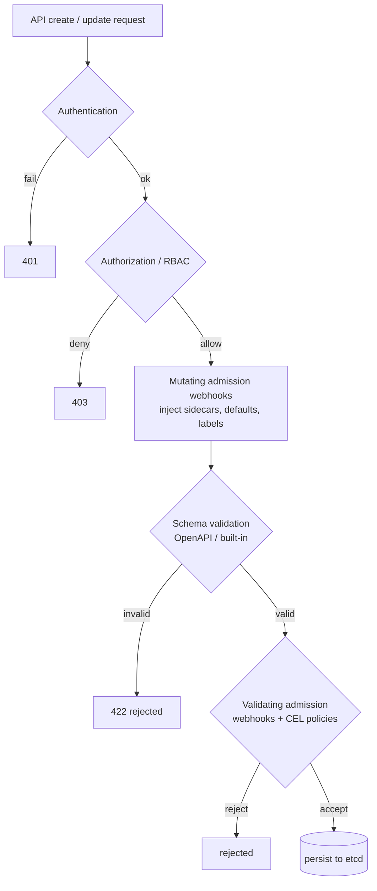

# Advanced Kubernetes Study Guide

A depth-first guide to running Kubernetes in production, extending it, and building platforms on it — for engineers who already operate clusters and want to go deeper. It assumes you're comfortable with the core API (Pods, Deployments, Services, ConfigMaps, Secrets, Ingress, RBAC, `kubectl`), have read the sibling [Kubernetes Mastery guide](KUBERNETES_STUDY_GUIDE.md) (workloads, scheduling, storage, observability), the [Kubernetes Security guide](KUBERNETES_SECURITY_STUDY_GUIDE.md) (RBAC, Pod Security, admission control), and the [Docker & Kubernetes Networking guide](DOCKER_KUBERNETES_NETWORKING_STUDY_GUIDE.md) (Services, NetworkPolicy, service mesh, Gateway API). This guide picks up where those leave off: the control plane's internals, the pattern of extending it with operators, advanced scheduling and multi-tenancy, GitOps as continuous delivery, multi-cluster and federation, supply-chain security, production-grade upgrade strategy, and the emerging "platform engineering" discipline that layers a developer experience on top of all of it.

The throughline is one mental-model shift: **Kubernetes is not a runtime to configure but a distributed database (etcd) and a reconciliation engine you program against.** Every controller, every operator, and every platform abstraction is a loop that watches desired state in that database and drives the real world to match it. The deeper you understand the reconciliation model, the more productively you extend it — and the less painful it is when it breaks at 3 AM.

This guide has natural companions throughout the repo: the [Distributed Systems guide](../DISTRIBUTED_SYSTEMS_STUDY_GUIDE.md) (consensus, etcd, replication — the underpinnings), the [Observability guide](../OBSERVABILITY_STUDY_GUIDE.md) (SLOs, tracing, Prometheus), the [GitHub Actions guide](../GITHUB_ACTIONS_STUDY_GUIDE.md) (CI that feeds CD), the [Caddy guide](../CADDY_STUDY_GUIDE.md) (reverse-proxy concepts that map to Ingress/Gateway), the [Docker guide](../DOCKER_STUDY_GUIDE.md) (images and layers), and the [Advanced Go guide](../ADVANCED_GO_STUDY_GUIDE.md) (because operators and controllers are almost always Go).

Primary references: the [Kubernetes documentation](https://kubernetes.io/docs/) (especially the [API concepts](https://kubernetes.io/docs/concepts/) and [tasks](https://kubernetes.io/docs/tasks/) sections), the [client-go](https://github.com/kubernetes/client-go) library (the official Go SDK for controllers), [controller-runtime](https://github.com/kubernetes-sigs/controller-runtime) and [Kubebuilder](https://book.kubebuilder.io/) (the framework and scaffolder for building operators), and Kelsey Hightower's [Kubernetes the Hard Way](https://github.com/kelseyhightower/kubernetes-the-hard-way) for bootstrapping a cluster from scratch.

---

## Table of Contents

1. [Part 1 — The Control Plane, Deeply](#part-1--the-control-plane-deeply)
2. [Part 2 — The API Machinery & Extension Model](#part-2--the-api-machinery--extension-model)
3. [Part 3 — Building Operators](#part-3--building-operators)
4. [Part 4 — Advanced Scheduling](#part-4--advanced-scheduling)
5. [Part 5 — Advanced Workloads & Scaling](#part-5--advanced-workloads--scaling)
6. [Part 6 — Multi-Tenancy & Resource Governance](#part-6--multi-tenancy--resource-governance)
7. [Part 7 — GitOps & Continuous Delivery](#part-7--gitops--continuous-delivery)
8. [Part 8 — Multi-Cluster & Federation](#part-8--multi-cluster--federation)
9. [Part 9 — Supply-Chain Security & Production Operations](#part-9--supply-chain-security--production-operations)
10. [Part 10 — Platform Engineering](#part-10--platform-engineering)

---

## Part 1 — The Control Plane, Deeply

The [Kubernetes Mastery guide](KUBERNETES_STUDY_GUIDE.md) named the control-plane components; this part is about how they interact under the hood and why that matters when things go wrong. Your [Distributed Systems](../DISTRIBUTED_SYSTEMS_STUDY_GUIDE.md) foundation — consensus, the replicated log, leader election — applies directly: the control plane *is* a distributed system, and it fails like one.

### etcd Is the Cluster

Everything the cluster "knows" — every Pod, every Service, every ConfigMap, every CRD — is a key in **etcd**, a strongly-consistent key-value store backed by Raft (covered in depth in the [Distributed Systems guide](../DISTRIBUTED_SYSTEMS_STUDY_GUIDE.md), Part 4). The API server is etcd's *only* client; nothing else reads or writes etcd directly. Lose etcd and you lose the cluster's memory.

Operational implications:

- **etcd performance is the control plane's ceiling.** Disk latency is the critical metric — etcd fsync's the WAL on every write. SSDs (preferably NVMe, local not network-attached) are non-negotiable for production etcd; spinning disks or high-latency network volumes cause leader elections, API-server timeouts, and cascading failures.
- **etcd size limits matter.** The default database size limit is **2 GB** (raisable to 8 GB). A cluster with tens of thousands of objects (large CRD-heavy platforms, or uncontrolled Event proliferation) can approach this. Monitor `etcd_mvcc_db_total_size_in_bytes`. If it grows unbounded, investigate: stale CRD instances, excessive Events, or resources that should have TTLs.
- **Compaction and defragmentation.** etcd keeps old key versions (multi-version concurrency control, the same concept as Postgres's MVCC — see the [Postgres guide](../ADVANCED_POSTGRES.md#1-the-storage--mvcc-engine)). Periodic compaction discards old versions; defragmentation reclaims disk space. Managed services handle this; self-managed clusters must automate it or face growing disk usage and slow range queries.
- **Backup etcd, not just the manifests.** `etcdctl snapshot save` produces a point-in-time backup of *all cluster state*. Restoring from it is how you recover from a catastrophic control-plane failure. Your disaster-recovery plan must include etcd snapshots, tested recovery, and a documented RTO.

### The API Server: A Database Frontend

`kube-apiserver` is a **stateless REST/gRPC server** that translates CRUD operations into etcd reads/writes, plus authentication, authorization (RBAC), admission control, and **watch** semantics. Key advanced details:

- **Watches are the nervous system.** Almost every controller works by *watching* the API server for changes (`Watch` in the API, an `Informer` in client-go). A watch is a long-lived HTTP/2 stream that pushes events (`ADDED`, `MODIFIED`, `DELETED`) to the client. The API server keeps a **watch cache** (an in-memory copy of the latest state per resource type) so that watches don't hit etcd on every event. When you see API-server memory climb, the watch cache for a large resource type (Pods in a 5,000-node cluster) is often the driver.
- **API priority and fairness (APF)** (GA since 1.29) is how the API server prevents one misbehaving controller from monopolizing it. Requests are classified into **priority levels** and **flow schemas**, each with a concurrency budget. If a runaway controller floods the API server with list calls, APF throttles *that flow* while letting other flows (kubectl, the scheduler) proceed. You'll see `429 Too Many Requests` when APF kicks in — an important signal to investigate the offending client, not to blindly raise limits.
- **Admission webhooks** (covered in the Security guide's Phase 2) are where your policies live — mutating and validating webhooks that intercept every create/update. Their latency *adds to every API call that matches*, so a slow webhook is a global control-plane tax. Monitor webhook latency; set `failurePolicy: Fail` only when you can guarantee availability (or the webhook's unavailability blocks all matching operations, which can deadlock a cluster).

### Controllers and the Reconciliation Loop

Every built-in behavior — creating Pods from a Deployment, scheduling them, assigning IPs — is implemented by a **controller**: a loop that watches the API for the *desired state* (the spec), compares it to the *actual state*, and takes action to close the gap. The architecture is deliberately **level-triggered, not edge-triggered**: a controller doesn't say "Pod X was just deleted, react to that event." It says "the desired state says 3 replicas; the actual state has 2; I should create one." This means:

- **Idempotency is built in.** A controller can miss an event (network hiccup, restart) and catch up on the next pass because it reads the *current* state, not a history of events. This is robustness by design.
- **Multiple controllers collaborate without coordination.** The Deployment controller creates ReplicaSets; the ReplicaSet controller creates Pods; the scheduler assigns Pods to nodes; the kubelet runs them. None talk to each other — each watches a different resource and acts on its own. The *API server's data* (etcd) is their shared communication medium.

This is the pattern you replicate when building your own operators (Part 3). Understanding that Kubernetes is a set of independent, idempotent reconcile loops over a shared database is the single deepest insight for advanced work.

### How the Scheduler Actually Decides

The scheduler watches for unscheduled Pods (Pods with no `.spec.nodeName`) and assigns them to nodes via a two-phase pipeline:

1. **Filtering** — eliminate nodes that can't run the Pod: insufficient resources, taints the Pod doesn't tolerate, node selectors/affinity that don't match, PV topology constraints, etc.
2. **Scoring** — rank the remaining candidates: spread vs. pack (balanced allocation), image locality (is the image already cached on a node?), inter-pod affinity/anti-affinity, etc.

The scheduler is pluggable: **scheduling profiles** let you weight or disable individual scoring plugins, and **scheduler extenders** or the full **Scheduling Framework** (Part 4) let you add custom logic. The practical takeaway is that the scheduler works on a **point-in-time snapshot** — by the time it decides, conditions may have changed (a node filled up, another Pod got scheduled). This is why **resource requests must be set accurately** (they're what the scheduler sees, not actual usage) and why Pods sometimes get evicted shortly after scheduling (the request was wrong, or the node was overcommitted).

### Leader Election Everywhere

The controller-manager, the scheduler, and many operators run multiple replicas for availability but only **one active** at a time — selected by **Lease-based leader election** (the exact pattern from the [Distributed Systems guide](../DISTRIBUTED_SYSTEMS_STUDY_GUIDE.md), Part 6, implemented with the `Lease` API object in etcd). The non-leaders watch the Lease and take over if it expires. When debugging "why isn't the scheduler doing anything?" — check whether it's actually the leader (`kubectl get leases -n kube-system`).

If you remember one thing from Part 1: **Kubernetes is etcd (a consensus-replicated database) fronted by the API server, driven by independent reconciliation loops (controllers) that watch desired state and converge reality to match it — and the control plane's health depends on etcd latency, API-server fairness, and webhook performance.**

```quiz
Q: Why is etcd disk latency the control plane's performance ceiling?
- [x] etcd fsyncs the WAL on every write (Raft durability), so slow disks cause leader elections, API-server timeouts, and cascading failures — production etcd needs local NVMe, not network volumes
- [ ] etcd holds all state in memory and latency doesn't matter
- [ ] The API server caches everything, bypassing etcd
- [ ] etcd only writes during backups
> The same fsync-on-commit story as any consensus log. etcd also has a 2 GB default size limit (raisable to 8 GB) and needs compaction/defrag — uncontrolled Events or stale CRD instances can approach the ceiling.

Q: Why is the controller architecture "level-triggered, not edge-triggered," and what does that buy?
- [x] A controller reads the *current* desired and actual state and closes the gap, rather than reacting to a history of events — so it can miss an event (restart, network hiccup) and catch up on the next pass; idempotency is built in
- [ ] It reacts to each event exactly once, in order
- [ ] It requires controllers to coordinate with each other
- [ ] It replays the etcd log to rebuild state
> "Desired says 3 replicas, actual has 2, create one" survives any missed event. Multiple controllers collaborate without talking — each watches a different resource and uses etcd (via the API server) as the shared medium.

Q: You see `429 Too Many Requests` from the API server. What's happening, and what's the right response?
- [x] API Priority and Fairness is throttling a flow — likely a runaway controller flooding the API with list calls; investigate the offending client rather than blindly raising limits
- [ ] etcd is out of disk
- [ ] The cluster needs more master nodes
- [ ] A webhook timed out
> APF classifies requests into priority levels and flow schemas with concurrency budgets, so one misbehaving controller can't starve kubectl or the scheduler. The 429 is a signal to find the offender.

Q: Why is a slow admission webhook a "global control-plane tax," and when is failurePolicy: Fail dangerous?
- [x] Its latency adds to every API call that matches it; failurePolicy: Fail means the webhook's unavailability blocks all matching operations — which can deadlock a cluster if the webhook itself can't start
- [ ] Webhooks run async and don't affect latency
- [ ] Fail is always safer than Ignore
- [ ] Webhooks only run during deploys
> Mutating webhooks run before validating ones, so validators see the final object. Monitor webhook latency, and reserve failurePolicy: Fail for webhooks whose availability you can guarantee.
```

---

## Part 2 — The API Machinery & Extension Model

The Kubernetes API is not a fixed set of endpoints — it's a framework for *adding new endpoints* (the official [API concepts page](https://kubernetes.io/docs/reference/using-api/api-concepts/) is the canonical reference). Understanding the machinery is what lets you extend Kubernetes with your own resources and controllers (Part 3), and it explains the structure behind every manifest you've ever written.

### Groups, Versions, and Resources (GVR)

Every API resource is identified by three coordinates:

```text
GROUP          VERSION   RESOURCE       example GVR
apps           v1        deployments    apps/v1/deployments
batch          v1        jobs           batch/v1/jobs
(core)         v1        pods           core/v1/pods  (the "" group)
networking.k8s.io  v1    networkpolicies
stable.example.com v1   widgets        ← your custom resource
```

The **group** namespaces the API (like a Go package); the **version** tracks evolution (alpha → beta → stable); the **resource** names the object kind. Custom Resource Definitions (CRDs) register new GVRs in exactly the same framework — your `Widget` is first-class alongside `Deployment`.

### API Versioning and the Stability Contract

Kubernetes takes API compatibility seriously — here's the contract:

- **`v1` (GA/stable):** will not change in backward-incompatible ways. Safe to depend on.
- **`v1beta1` etc.:** may change or be removed; the three-release deprecation policy applies.
- **`v1alpha1`:** experimental, may vanish at any time, no migration guarantee.

A single resource can be served at **multiple versions** simultaneously (conversion webhooks translate between them). When you see a CRD with versions `v1` and `v1alpha2`, the **storage version** is what etcd persists; the others are computed on the fly. Managing this multi-version evolution — with conversion webhooks and proper deprecation — is one of the harder parts of maintaining a production CRD.

### Custom Resource Definitions (CRDs)

A CRD tells the API server "there is now a new resource type called Widget in group stable.example.com." After applying the CRD, you can `kubectl create`, `get`, `watch`, and `delete` Widgets — they live in etcd just like Pods. A CRD is, concretely, a YAML document that defines:

- The **group, version, names** (kind, plural, short names).
- The **OpenAPI v3 schema** that validates every Widget instance. This is your data model — strongly type it; a CRD without validation is a source of silent data corruption.
- **Subresources:** `/status` (so users can read spec but only the controller writes status — a crucial separation) and `/scale` (so the autoscaler can interact with your resource).
- **Additional printer columns** — what `kubectl get widgets` shows.
- **Categories** (e.g., `all` so `kubectl get all` includes your resource).

```yaml
apiVersion: apiextensions.k8s.io/v1
kind: CustomResourceDefinition
metadata:
  name: widgets.stable.example.com
spec:
  group: stable.example.com
  versions:
    - name: v1
      served: true
      storage: true
      schema:
        openAPIV3Schema:
          type: object
          properties:
            spec:
              type: object
              required: [color, size]
              properties:
                color: { type: string, enum: [red, blue, green] }
                size:  { type: integer, minimum: 1 }
            status:
              type: object
              properties:
                ready: { type: boolean }
      subresources:
        status: {}      # enables /status subresource
      additionalPrinterColumns:
        - name: Color
          type: string
          jsonPath: .spec.color
  scope: Namespaced
  names:
    kind: Widget
    plural: widgets
    singular: widget
    shortNames: [wg]
    categories: [all]
```

After `kubectl apply -f widget-crd.yaml`, the cluster has a new first-class API — but it's **just storage**: create and get Widgets, and they sit inert. Making them *do something* is the job of an operator (Part 3).

### Admission Control: The Extensible Gate

Every API mutation passes through a chain of **admission controllers** — built-in ones (resource quotas, Pod Security) and your webhooks:

1. **Mutating admission webhooks** — modify the object (inject sidecars, set defaults, add labels).
2. **Schema validation** — the CRD's OpenAPI schema (or built-in validation).
3. **Validating admission webhooks** — accept or reject without modifying.

The order is important: mutating happens first, so validating webhooks see the *final* object. For policy enforcement (Part 6), validating admission policies — including the newer **CEL-based ValidatingAdmissionPolicy** (GA in 1.30, no webhook required) — are the modern tool.



### Server-Side Apply and Field Ownership

**Server-Side Apply (SSA)** is the modern approach to declarative management, replacing `kubectl apply`'s client-side three-way merge with a **server-side field-ownership model**. Each field in an object is tagged with its **manager** (who last set it), and conflicts (two managers trying to set the same field) are explicit rather than silently merged. SSA matters for operators (Part 3) because it lets a controller and a human both manage *different fields* of the same object without clobbering each other — the controller owns `.status`, the user owns `.spec`, and SSA tracks the boundary.

If you remember one thing from Part 2: **the Kubernetes API is an extensible framework — CRDs add new resource types with full validation and subresources, admission webhooks enforce policy, and Server-Side Apply tracks field ownership — so "extending Kubernetes" is adding rows to its database and controllers that act on them, using the same machinery the built-ins use.**

```quiz
Q: After you apply a CRD, what can your new Widget resource do on its own?
- [x] Nothing but exist in etcd — you can create/get/watch/delete Widgets, but they sit inert; making them *do* something requires an operator (a controller)
- [ ] It automatically creates the Deployments it describes
- [ ] It runs the reconciliation loop built into the CRD
- [ ] It validates other resources
> A CRD is "just storage" — it registers a new GVR and (via OpenAPI v3 schema) validates instances. The /status subresource separates user-written spec from controller-written status; the controller is the half that acts.

Q: A CRD serves both v1 and v1alpha2. Which version does etcd actually store?
- [x] The *storage version* — the others are computed on the fly by conversion webhooks; managing multi-version evolution with conversion and deprecation is one of the harder parts of a production CRD
- [ ] Both, duplicated
- [ ] Always the newest version
- [ ] Whichever the client requested
> The stability contract: v1 (GA) won't break backward-compatibly, v1beta1 may change under a 3-release policy, v1alpha1 can vanish anytime. One resource served at multiple versions is normal; the storage version is the canonical bytes.

Q: What does Server-Side Apply's field-ownership model solve that client-side apply doesn't?
- [x] It tags each field with its *manager*, so a controller (owning .status) and a human (owning .spec) can manage different fields of the same object without clobbering each other — conflicts become explicit
- [ ] It applies manifests faster
- [ ] It eliminates the need for CRDs
- [ ] It encrypts the object in etcd
> Client-side apply did a three-way merge that could silently lose changes. SSA tracks who set what at the server, making it the right tool for operators that share objects with humans or other controllers.
```

---

## Part 3 — Building Operators

An operator ([official operator pattern docs](https://kubernetes.io/docs/concepts/extend-kubernetes/operator/)) is a **custom controller that encodes domain knowledge** — "how to run and operate a specific application" — into software that watches CRDs and drives the application's lifecycle automatically. The Prometheus Operator, the Cert-Manager, the Postgres Operator, the Kafka Operator — each replaces runbooks with reconciliation loops. This is the part where you go from *using* Kubernetes to *programming* it, and your [Advanced Go](../ADVANCED_GO_STUDY_GUIDE.md) skills apply directly.

### The Operator Pattern

The simplest description: a CRD (the "what I want," Part 2) plus a controller (the "how to make it happen") plus operational knowledge (the "what to do when things go wrong"). Concretely:

```text
User creates:    PostgresCluster (a CR) with spec: { replicas: 3, version: "16" }
                         │
                         ▼
Operator watches → sees desired state ≠ actual state
                         │
                         ▼
Operator acts:   creates StatefulSet, Services, ConfigMaps, sets up replication,
                 handles failover, backups, upgrades — all encoded in Go code
                         │
                         ▼
Operator updates: PostgresCluster .status.ready = true, .status.replicas = 3
```

The user declares *intent* (`PostgresCluster`); the operator handles *mechanism* (the dozens of Kubernetes resources and the Postgres-specific operational steps to realize it). The key insight from Part 1 applies: **the controller is level-triggered and idempotent** — it converges toward the desired state on every pass, handles missed events by re-reading current state, and can be restarted at any time without losing progress.

### The Framework: Kubebuilder / controller-runtime

You *can* write a controller directly against `client-go`'s informers and work queues, but the standard approach is **Kubebuilder** (the scaffolder) with **controller-runtime** (the library):

```bash
# Scaffold a new operator project:
kubebuilder init --domain example.com --repo github.com/you/widget-operator
kubebuilder create api --group stable --version v1 --kind Widget
```

This generates:
- The **CRD types** (`api/v1/widget_types.go`) — your Go structs that define the CRD schema.
- The **controller** (`internal/controller/widget_controller.go`) — the reconciliation loop.
- The **manager** (`cmd/main.go`) — wires up the controller, starts informers, handles leader election.
- Kustomize manifests, RBAC, and webhook scaffolding.

The core of your work is in the **Reconcile function**:

```go
func (r *WidgetReconciler) Reconcile(ctx context.Context, req ctrl.Request) (ctrl.Result, error) {
    log := log.FromContext(ctx)

    // 1. Fetch the desired state (the CR).
    var widget stablev1.Widget
    if err := r.Get(ctx, req.NamespacedName, &widget); err != nil {
        return ctrl.Result{}, client.IgnoreNotFound(err)   // deleted → nothing to do
    }

    // 2. Compare desired to actual. Create/update owned resources to close the gap.
    dep := buildDeployment(&widget)
    if err := ctrl.SetControllerReference(&widget, dep, r.Scheme); err != nil {
        return ctrl.Result{}, err
    }
    // CreateOrUpdate: idempotent — create if missing, update if different.
    _, err := ctrl.CreateOrUpdate(ctx, r.Client, dep, func() error {
        dep.Spec.Replicas = widget.Spec.Replicas
        dep.Spec.Template.Spec.Containers[0].Image = widget.Spec.Image
        return nil
    })
    if err != nil { return ctrl.Result{}, err }

    // 3. Update the CR's status to reflect reality.
    widget.Status.Ready = true
    if err := r.Status().Update(ctx, &widget); err != nil {
        return ctrl.Result{}, err
    }

    log.Info("reconciled", "widget", req.NamespacedName)
    return ctrl.Result{}, nil   // no error, no requeue — wait for the next event
}
```

### The Rules of a Good Operator

Hard-won lessons from every production operator team:

- **Level-triggered, not edge-triggered.** Don't track "what event just happened." Read current desired state, read current actual state, compute the diff, act. Any sequence of events leading to the same state should produce the same outcome.
- **Idempotent.** Running reconcile twice on the same state should be a no-op. `CreateOrUpdate` and conditional checks achieve this. Never "create and hope" — check-then-act, or use SSA.
- **Own your resources** with `SetControllerReference`. Owner references are how Kubernetes knows that deleting the `Widget` should cascade-delete the `Deployment`, `Service`, etc. it created. Without them, your child resources become orphans.
- **Status reflects reality, not intent.** The spec is what the user wants; the status is what's true. Only the controller writes status; users write spec. The `/status` subresource (Part 2) enforces this split.
- **Requeue with backoff on transient failure.** Return `ctrl.Result{RequeueAfter: time.Second * 30}` when an external dependency is temporarily unavailable, and use exponential backoff so you don't hammer it.
- **Don't do heavy work in the reconcile goroutine.** The informer/work-queue model runs reconciles serially per key. Long-running operations (a database migration, a lengthy health check) should be tracked asynchronously — set a condition, requeue, and check on the next pass.
- **Observability from day one.** Emit Prometheus metrics for reconcile duration, error rate, and queue depth; structured logs with the resource's name/namespace; and Kubernetes Events to tell the user what happened (`r.Recorder.Eventf(&widget, "Normal", "Created", "Created deployment %s", dep.Name)`).

### Testing Operators

- **Unit tests** with `envtest` — spins up a real API server + etcd in-process (no kubelet, no scheduler), lets you create CRs and verify your reconciler's behavior against a real API. Fast and precise.
- **Integration tests** with a real cluster (kind, k3d) in CI — end-to-end lifecycle: create a CR, wait for the operator to converge, verify the child resources, delete the CR, verify cleanup.
- **Watch for flaky tests** from eventual consistency — the API server and your controller are async; use polling/retries in tests, not `time.Sleep`.

If you remember one thing from Part 3: **an operator is a CRD + a level-triggered, idempotent reconciliation loop that watches desired state, drives actual state, and writes status — scaffold it with Kubebuilder, own your resources with owner references, and keep reconcile fast and idempotent.**

```quiz
Q: What does an operator actually encode that a plain Deployment can't?
- [x] Domain/operational knowledge — "how to run and operate a specific application" (replication setup, failover, backups, upgrades) — turning runbooks into a reconciliation loop watching a CRD
- [ ] Faster Pod scheduling
- [ ] A custom container runtime
- [ ] Encrypted storage
> The user declares intent (PostgresCluster with replicas: 3); the operator handles mechanism (StatefulSets, Services, replication, failover). It's the step from *using* Kubernetes to *programming* it.

Q: Why must a Reconcile function be idempotent, and how is that achieved?
- [x] The work-queue can call reconcile multiple times on the same state (missed events, restarts), so running it twice must be a no-op — achieved with check-then-act, CreateOrUpdate, or Server-Side Apply, never "create and hope"
- [ ] Idempotency makes reconcile faster
- [ ] It's required only for stateful operators
- [ ] The framework enforces it automatically
> Level-triggered + idempotent is the core discipline: read desired, read actual, compute diff, act — any event sequence leading to the same state produces the same outcome. It's why a restarted operator loses no progress.

Q: Why call SetControllerReference on resources your operator creates?
- [x] Owner references are how Kubernetes cascades deletion — deleting the Widget then garbage-collects the Deployment/Service it created; without them, child resources become orphans
- [ ] It grants the operator RBAC permissions
- [ ] It speeds up reconciliation
- [ ] It writes to the status subresource
> Owner references build the deletion tree. The other rules: status reflects reality (only the controller writes it), requeue with backoff on transient failure, and don't block the reconcile goroutine on long-running work.
```

---

## Part 4 — Advanced Scheduling

The [Mastery guide](KUBERNETES_STUDY_GUIDE.md) covered affinity, taints, and tolerations. This part goes deeper: the scheduling framework, custom schedulers, topology-aware placement, and the GPU/accelerator scheduling that's become critical in the ML/AI era.

### The Scheduling Framework

Since 1.15, the scheduler is implemented as a **framework** with defined extension points — each step is a *plugin*:

```text
PreFilter → Filter → PostFilter → PreScore → Score → Reserve → Permit → PreBind → Bind → PostBind
```

Built-in plugins implement the standard behavior (node resources, affinity, taints, pod topology spread). You can **write custom plugins** in Go that hook into any of these extension points — for example, a scoring plugin that prefers nodes with a specific hardware accelerator, or a filter plugin that checks an external inventory system. This is a full alternative to the older (and now deprecated) scheduler extender webhook, which added HTTP round-trip latency per scheduling decision.

### Pod Topology Spread Constraints

Topology spread replaces the blunt instruments of pod anti-affinity with **fine-grained control** over how Pods distribute across failure domains:

```yaml
topologySpreadConstraints:
  - maxSkew: 1                           # at most 1 more Pod in any zone than the minimum
    topologyKey: topology.kubernetes.io/zone
    whenUnsatisfiable: DoNotSchedule     # strict — don't schedule if it would violate
    labelSelector:
      matchLabels: { app: frontend }
```

This says "spread my frontend Pods as evenly as possible across availability zones." `maxSkew: 1` means no zone can have more than 1 extra Pod compared to the least-loaded zone. In a 3-zone cluster with 6 replicas, you get 2 per zone. If a zone goes down, the remaining 4 Pods are in 2 zones — and if the scheduler can't place a new Pod without violating `maxSkew`, `DoNotSchedule` blocks it (use `ScheduleAnyway` for best-effort spread).

This is the modern replacement for pod anti-affinity for most use cases — it's more expressive, handles scale-down correctly, and understands multiple topology keys (zone *and* node simultaneously).

### GPU and Accelerator Scheduling

The 2024–2026 wave of ML/AI workloads has made GPU scheduling a first-class concern. The basics:

- **Device plugins** (the `kubelet` device-plugin API) expose hardware (GPUs, FPGAs, SR-IOV NICs) as **extended resources** (`nvidia.com/gpu`, `amd.com/gpu`). Request them in a container's `resources.limits`:

```yaml
resources:
  limits:
    nvidia.com/gpu: 1        # request one NVIDIA GPU — the device plugin handles assignment
```

- GPUs are **non-shareable by default** — one GPU, one container. Fractional GPU sharing (MIG on A100/H100, time-slicing with NVIDIA's device plugin config, or virtual-GPU solutions) is available but adds complexity.
- **Topology-aware scheduling** matters for multi-GPU workloads: two GPUs on the same PCIe switch or NVLink domain communicate orders of magnitude faster than two on different NUMA nodes. The **Topology Manager** (`kubelet` flag `--topology-manager-policy=best-effort|restricted|single-numa-node`) coordinates CPU, memory, and device allocation to respect NUMA boundaries — critical for distributed training jobs.
- **Dynamic Resource Allocation (DRA)** (beta in 1.31+) is the next-generation device-plugin API, giving structured, claim-based allocation (like PVCs for devices) with richer semantics — vendor-specific attributes, sharing policies, and preparation steps. Watch this space; it's where GPU scheduling is heading.

### Descheduling: Fixing Bad Placements After the Fact

The scheduler decides *once*, at Pod creation. But over time, the cluster's state drifts — nodes are added/removed, resource usage shifts, anti-affinity is violated by evictions. The **Descheduler** (a Kubernetes SIG project) periodically evaluates running Pods and evicts those that violate current policies (e.g., a Pod that ended up on a node with a taint it shouldn't tolerate, or Pods that are unevenly spread). It doesn't *re-schedule* — it evicts, and the scheduler places the replacement correctly. Run it as a CronJob or as a continuous controller; pair it with PodDisruptionBudgets (Part 5) so it doesn't evict too many Pods at once.

If you remember one thing from Part 4: **the scheduler is a plugin framework you can extend; topology spread constraints are the modern way to distribute Pods across failure domains; GPU scheduling requires device plugins and topology awareness; and the descheduler fixes drift that the one-time scheduling decision can't.**

---

## Part 5 — Advanced Workloads & Scaling

Beyond Deployments and StatefulSets — the workload patterns and scaling strategies that production platforms need.

### PodDisruptionBudgets (PDBs)

A PDB declares how many Pods of a workload must remain available during *voluntary* disruptions — node drains, cluster upgrades, descheduler evictions:

```yaml
apiVersion: policy/v1
kind: PodDisruptionBudget
metadata:
  name: frontend-pdb
spec:
  minAvailable: 2            # or maxUnavailable: 1 — either form
  selector:
    matchLabels: { app: frontend }
```

Without PDBs, a `kubectl drain` on a node can evict *all* your Pods at once — a guaranteed outage for any single-replica workload and a race against the scheduler for multi-replica ones. PDBs are **the #1 most-forgotten production protection**, and every workload with an availability requirement needs one.

PDB gotchas: a PDB with `minAvailable >= replicas` blocks *all* voluntary evictions — including node drains and cluster upgrades. This is a common misconfiguration that makes your cluster un-upgradeable. Always leave headroom: `minAvailable: replicas - 1` or `maxUnavailable: 1`.

### Vertical Pod Autoscaler (VPA) and Right-Sizing

The Horizontal Pod Autoscaler (HPA) scales *replicas* (the [Mastery guide](KUBERNETES_STUDY_GUIDE.md) covers it); VPA scales *requests and limits* on existing Pods, right-sizing them based on observed usage:

- **Recommender mode** (`updateMode: "Off"`) — just observes and suggests request/limit values (visible via `kubectl describe vpa`). This is how you *discover* the right sizing for workloads you've been guessing at.
- **Auto mode** (`updateMode: "Auto"`) — evicts and recreates Pods with updated requests. (In-place resource resize, GA in 1.33, allows resizing without eviction for CPU/memory — a major improvement.)

VPA and HPA **should generally not target the same metric** (e.g., both scaling on CPU) — they'll fight. The common pattern: HPA scales replicas on a custom metric (requests/sec, queue depth), VPA right-sizes the per-Pod resource requests.

### KEDA: Event-Driven Scaling

**[KEDA](https://keda.sh/docs/)** (Kubernetes Event-Driven Autoscaling) extends HPA with **ScaledObjects** that scale on external event sources — Kafka consumer lag, RabbitMQ queue depth, AWS SQS length, Prometheus queries, cron schedules, and 50+ scalers. It scales to *zero* when idle (HPA can't) and from zero when events arrive — critical for cost-effective serverless-style workloads on Kubernetes:

```yaml
apiVersion: keda.sh/v1alpha1
kind: ScaledObject
metadata: { name: order-processor }
spec:
  scaleTargetRef: { name: order-processor }
  minReplicaCount: 0                      # scale to zero when idle
  maxReplicaCount: 50
  triggers:
    - type: kafka
      metadata:
        bootstrapServers: kafka:9092
        consumerGroup: orders
        topic: incoming-orders
        lagThreshold: "100"               # scale up when lag > 100 per partition
```

### Rollout Strategies Beyond RollingUpdate

- **Canary rollouts** — route a percentage of traffic to the new version, observe error/latency, ramp up. Kubernetes Deployments don't natively support canary (it's all-or-nothing RollingUpdate); tools that add it: **Argo Rollouts** (a `Rollout` CRD with canary/blue-green steps, analysis, and automatic promotion/rollback) and **Flagger** (integrates with service meshes and ingress controllers for traffic splitting).
- **Blue-green** — run old and new side by side, switch traffic atomically. Argo Rollouts supports this as a built-in strategy.
- **Analysis-driven promotion** — Argo Rollouts' `AnalysisTemplate` runs Prometheus queries during a canary and **auto-rolls-back** if error rate exceeds a threshold. This is progressive delivery: automated, metric-gated rollouts that don't rely on a human watching a dashboard.

If you remember one thing from Part 5: **PodDisruptionBudgets are mandatory for production workloads; VPA right-sizes requests, KEDA scales on external events (including to zero), and Argo Rollouts adds canary/blue-green with metric-driven auto-rollback — the pieces that turn "deploy and hope" into progressive delivery.**

---

## Part 6 — Multi-Tenancy & Resource Governance

When a cluster serves multiple teams, the "any team can create anything" default becomes a liability. Multi-tenancy is about *isolation without separation* — sharing a cluster while preventing one tenant from starving, compromising, or debugging another.

### Namespace-Level Isolation

The baseline multi-tenancy model is **namespace-per-team/per-environment**, with layers of enforcement:

- **RBAC** scoped to namespace — each team's ServiceAccount and human identities get `Role`/`RoleBinding` only in their namespace (the [Security guide](KUBERNETES_SECURITY_STUDY_GUIDE.md) covers this).
- **ResourceQuotas** — hard caps on total CPU, memory, Pod count, PVC count, etc. per namespace. Without quotas, one team's `replicas: 1000` exhausts the cluster for everyone:

```yaml
apiVersion: v1
kind: ResourceQuota
metadata:
  name: team-alpha-quota
  namespace: team-alpha
spec:
  hard:
    requests.cpu: "40"
    requests.memory: 80Gi
    limits.cpu: "80"
    limits.memory: 160Gi
    pods: "200"
    persistentvolumeclaims: "50"
```

- **LimitRanges** — default and constrain per-Pod/container requests and limits within the namespace (e.g., "every container must request at least 100m CPU and at most 4 CPUs"). LimitRanges prevent the "forgot to set requests" Pod from being invisible to the scheduler and consuming unbounded resources.
- **NetworkPolicies** — enforce east-west isolation between namespaces (the [Networking guide](DOCKER_KUBERNETES_NETWORKING_STUDY_GUIDE.md)).
- **Pod Security Standards** — enforce workload hardening per namespace (the Security guide).

### Policy Engines: Kyverno, OPA/Gatekeeper, CEL

When admission webhooks get complex, a **policy engine** codifies rules declaratively:

- **Kyverno** — Kubernetes-native policies as CRDs (YAML, no new language). Validate, mutate, generate resources, verify image signatures. Excellent UX for platform teams.
- **OPA Gatekeeper** — policies in Rego (a purpose-built policy language). More powerful for complex logic; steeper learning curve.
- **CEL ValidatingAdmissionPolicy** (built-in, GA 1.30) — no webhook needed; policies as CEL expressions in the API server. Fastest and simplest for straightforward validation rules; growing rapidly.

The trend is toward **CEL for simple policies** (no external dependency) and **Kyverno for the rest** (Kubernetes-native, readable YAML, image-verification support).

### Cost Management and Chargeback

Multi-tenant clusters need **cost visibility** — which team is consuming how much. **Kubecost** (or the CNCF OpenCost project) correlates resource usage to namespaces/labels/teams and produces cost breakdowns. The key insight for platform engineers: Kubernetes resource *requests* are the unit of cost (they're what's reserved), not *usage* (which may be lower) — right-sizing requests (Part 5's VPA) directly reduces cost.

If you remember one thing from Part 6: **multi-tenancy is layered enforcement — RBAC for authorization, ResourceQuotas for capacity, LimitRanges for per-Pod defaults, NetworkPolicies for network isolation, and a policy engine (Kyverno/CEL) for everything else — and without these layers, a shared cluster is a shared footgun.**

```quiz
Q: Multi-tenancy on a shared cluster needs layered enforcement. What does each layer do?
- [x] RBAC authorizes *who* can do what, ResourceQuotas cap a namespace's total capacity, LimitRanges set per-Pod defaults/bounds, NetworkPolicies isolate traffic, and a policy engine (Kyverno/CEL) covers everything else
- [ ] A single namespace setting provides all of it
- [ ] RBAC alone is sufficient
- [ ] NetworkPolicies handle authorization
> No single control isolates tenants — namespaces scope names but don't isolate. The layers are complementary: skip ResourceQuotas and one tenant starves the cluster; skip NetworkPolicies and tenants reach each other freely.

Q: Why is a ResourceQuota without a LimitRange an incomplete setup?
- [x] A ResourceQuota that counts CPU/memory requires every Pod to *declare* requests/limits, or it rejects the Pod — a LimitRange supplies the per-Pod defaults so existing manifests without explicit resources still admit
- [ ] LimitRanges replace ResourceQuotas
- [ ] ResourceQuotas only work cluster-wide
- [ ] They do the same thing
> ResourceQuota enforces the namespace total; LimitRange fills in and bounds per-container values. Together they make capacity governance work without requiring every team to annotate every Pod.
```

---

## Part 7 — GitOps & Continuous Delivery

GitOps is the idea that **Git is the single source of truth for your cluster's desired state**, and a controller running *in the cluster* continuously reconciles reality to match it. It applies Kubernetes's own reconciliation philosophy (Part 1) to the deployment pipeline itself. Two tools dominate: **Argo CD** and **Flux**.

### The Model

```text
Developer pushes → Git repo (manifests / Kustomize / Helm) → GitOps controller sees diff
                                                                        │
                                                                        ▼
                                                              Cluster converges to match Git
```

The **pull model**: the cluster pulls its desired state from Git, not the other way around. No CI pipeline needs `kubectl apply` access to the cluster; no developer machine needs cluster credentials. Git becomes the audit log, the rollback mechanism, and the approval workflow.

### Argo CD

The most popular GitOps engine ([docs](https://argo-cd.readthedocs.io/en/stable/)). Core concepts:

- **Application** — a CRD that maps a **Git source** (repo + path + revision) to a **destination** (cluster + namespace). Argo CD watches the source, computes the diff, and syncs.
- **Sync** — apply the manifests from Git to the cluster. **Auto-sync** does this on every Git commit; manual sync requires a human click.
- **Drift detection** — Argo CD continuously compares the live state to the Git state and shows you what differs (someone `kubectl edit`ed something that doesn't match Git). With auto-sync + **self-heal**, it reverts drift automatically — the cluster can't diverge from Git.
- **App of Apps / ApplicationSets** — manage many Applications declaratively. An `ApplicationSet` generates Applications from a template (one per cluster, per team, per PR, per directory), so onboarding a new service is adding a directory to Git, not manually creating an Argo CD Application.

### Flux

The CNCF alternative ([docs](https://fluxcd.io/flux/)), more Kubernetes-native (everything is CRDs, no UI by default):

- **GitRepository** — points at a Git repo. Flux polls or receives webhooks.
- **Kustomization** — reconciles a path of manifests (native Kustomize support). Flux applies it and reports health.
- **HelmRelease** — manages Helm charts declaratively. Flux installs/upgrades/rolls-back Helm releases based on the CR spec.

Flux is lighter, more modular (each component — source-controller, kustomize-controller, helm-controller — is separate), and more opinionated about the "everything is a CRD" model. Argo CD has a richer UI and stronger multi-tenancy/RBAC for the CD interface itself. Both are production-grade; the choice is often culture/preference.

### The Repo Structure

A common, scalable layout:

```text
infra/                   # cluster-level infra (cert-manager, ingress, monitoring)
  ├── base/
  └── overlays/
      ├── staging/
      └── production/
apps/
  ├── service-a/
  │   ├── base/          # Kustomize base (Deployment, Service, HPA)
  │   └── overlays/
  │       ├── staging/   # staging-specific patches (replicas, env, image tag)
  │       └── production/
  └── service-b/
      └── ...
```

**Kustomize** (built into `kubectl`) is the overlay engine — a `base/` defines the canonical manifests, and `overlays/staging/` patches just the fields that differ (image tag, replica count, config values). This is declarative, reviewable, and diff-friendly — the properties GitOps needs. Helm charts work too (via `HelmRelease` in Flux or an Application in Argo CD pointing to a Helm chart), but Kustomize's patch-based model is often simpler for per-environment customization.

### Image Automation

The final link in the chain: when CI builds a new container image, *something* must update the image tag in Git so the GitOps controller deploys it. Options:

- **CI writes to Git** — the CI pipeline (GitHub Actions) updates the image tag in the manifest and commits. Simple, widely used.
- **Flux Image Automation** — a set of controllers that *watch a container registry for new tags*, update the Git repo, and commit — fully automated, no CI-to-Git step needed.
- **Argo CD Image Updater** — similar, Argo CD-native.

If you remember one thing from Part 7: **GitOps makes Git the single source of truth for cluster state, with an in-cluster controller (Argo CD or Flux) that continuously reconciles reality to match — giving you audit trails, drift detection, instant rollback (revert the commit), and no direct cluster access from CI.**

```quiz
Q: What's the defining shift GitOps makes versus a CI pipeline that runs `kubectl apply`?
- [x] An in-cluster controller (Argo CD/Flux) continuously *pulls* desired state from Git and reconciles reality to match — so CI never touches the cluster, and you get drift detection and audit trails for free
- [ ] It deploys faster
- [ ] It eliminates the need for manifests
- [ ] It replaces etcd with Git
> Git becomes the single source of truth; the controller is the reconciliation loop (the same pattern as every controller). CI builds and pushes images + commits manifests; it gets no cluster credentials.

Q: With GitOps, how do you roll back a bad deploy, and why is drift detection valuable?
- [x] Revert the commit — the controller reconciles back to the previous state; drift detection catches anyone who changed the cluster directly (out-of-band kubectl edits) and reverts them to Git's truth
- [ ] Run kubectl rollout undo on the cluster
- [ ] Restore an etcd snapshot
- [ ] Manually re-apply old manifests
> Rollback is just `git revert`, fully audited. Drift detection enforces that the cluster equals Git — direct edits become visible and reversible, which is most of GitOps's operational value.
```

---

## Part 8 — Multi-Cluster & Federation

One cluster is a blast radius. Production platforms routinely run *multiple clusters* — per region, per environment (staging/prod), per team, or per compliance boundary. This part is about managing that complexity.

### Why Multiple Clusters

- **Blast radius isolation** — a bad deploy, a runaway controller, or a control-plane failure affects one cluster, not your whole infrastructure.
- **Region/latency** — serve users from nearby clusters (the [Distributed Systems guide](../DISTRIBUTED_SYSTEMS_STUDY_GUIDE.md)'s geography driver).
- **Compliance** — data-sovereignty requirements may mandate separate clusters per jurisdiction.
- **Upgrade isolation** — stage a Kubernetes version upgrade on one cluster before rolling it to others.
- **Scaling the control plane** — a single cluster's API server and etcd have practical limits (~5,000 nodes, ~150,000 Pods). Multiple clusters distribute this.

### Multi-Cluster Tooling

| Tool | What it does |
|---|---|
| **Cluster API (CAPI)** | Declaratively manage the *lifecycle* of clusters themselves — provision, upgrade, scale, delete clusters as Kubernetes resources (CRDs). Think "Terraform for clusters, but Kubernetes-native." |
| **Argo CD / Flux ApplicationSets** | Deploy workloads across multiple clusters from one Git source — the GitOps layer (Part 7) scales naturally to multi-cluster by targeting different cluster destinations. |
| **Submariner / Cilium ClusterMesh** | **Cross-cluster networking** — Service discovery and connectivity across clusters (Pod-to-Pod, Service-to-Service across clusters). |
| **Liqo / Admiralty / Karmada** | **Multi-cluster scheduling** — present multiple clusters as one logical pool and schedule workloads across them. |
| **Kubefed (deprecated)** | The original federation project; largely superseded by the tools above. |

### The Hub-and-Spoke Pattern

The most common multi-cluster architecture: one **management cluster** (the hub) runs Argo CD/Flux, CAPI, and your platform control plane. It pushes workloads and config to multiple **workload clusters** (the spokes). Workload clusters have minimal platform tooling — they receive their desired state from the hub, keeping them simpler and more replaceable (you can drain and replace a spoke with confidence that its state is in Git). The management cluster is the one you never lose; back it up heavily (Part 1's etcd backup applies doubly here).

If you remember one thing from Part 8: **run multiple clusters for blast-radius isolation and regional presence, manage them declaratively with Cluster API and GitOps ApplicationSets, and use a hub-and-spoke model where one management cluster drives the rest.**

---

## Part 9 — Supply-Chain Security & Production Operations

Two complementary topics: hardening what goes *into* your cluster (the software supply chain) and the operational discipline that keeps it running (upgrades, disaster recovery, incident response).

### Supply-Chain Security

The software you deploy is only as trustworthy as the pipeline that built it and the base images it rests on. The 2020s wave of supply-chain attacks (SolarWinds, Codecov, xz) has made this a first-class production concern:

- **Sign and verify container images.** **[Cosign](https://docs.sigstore.dev/cosign/signing/overview/)** (from the [Sigstore](https://www.sigstore.dev/) project) signs images and stores signatures alongside them in the registry. **Kyverno** or a Gatekeeper policy can then *verify signatures at admission* — rejecting any unsigned or untrusted image before it runs. This is the container equivalent of code signing from the [Electron guide](../ELECTRON_STUDY_GUIDE.md), enforced at the cluster gate.
- **Generate and attach SBOMs (Software Bills of Materials).** Tools like `syft` (Anchore) scan your images and produce an SBOM listing every dependency — which you sign and attach with Cosign. SBOMs are becoming a regulatory requirement and are the foundation for vulnerability response ("does this CVE affect any of our running images?").
- **SLSA (Supply-chain Levels for Software Artifacts).** A framework of progressively stronger guarantees about build provenance and integrity. At its core: "can you prove *who* built this artifact, *from what source*, on *what build system*?" Achieving SLSA Level 2+ means your CI produces signed, verifiable **provenance attestations** that the cluster can validate at admission.
- **Scan images for vulnerabilities.** Integrate **Trivy** or **Grype** into CI (scan before push) *and* runtime (continuous scanning of running images). Block deployments of images with critical CVEs via admission policies.
- **Restrict image sources.** Admission policies that allow images *only* from your trusted registries (e.g., `*.your-registry.com/*`) prevent anyone from deploying random Docker Hub images into production.

### Kubernetes Upgrade Strategy

Kubernetes releases three minor versions per year, each supported for ~14 months. Falling behind means running on an unsupported, un-patched control plane — a security and stability risk. The upgrade discipline:

- **Upgrade one minor version at a time** (e.g., 1.30 → 1.31 → 1.32, never 1.30 → 1.32). Skipping versions is unsupported and risks breaking changes.
- **Read the changelog and deprecation notices** for each version. `kubectl` will warn about deprecated API versions; run `kubectl convert` or `pluto` to find manifests that reference removed APIs.
- **Upgrade the control plane first, then the nodes.** The API server is backward-compatible with kubelets one minor version behind (the **version skew policy**).
- **Use a canary cluster.** Upgrade staging first; run your full test suite; soak for a few days; then upgrade production.
- **Managed Kubernetes (EKS/GKE/AKS) handles control-plane upgrades** but you still own node-pool upgrades and API-version migration. Don't confuse "managed" with "no upgrade work."

### Disaster Recovery

- **etcd backups** (Part 1) — automated, tested restores, stored off-cluster. The [Distributed Systems guide](../DISTRIBUTED_SYSTEMS_STUDY_GUIDE.md)'s replication is your friend: etcd is already replicated across 3+ members, but a bad upgrade or a bug can corrupt all replicas simultaneously.
- **GitOps as DR** (Part 7) — if your cluster state is in Git, a new cluster is a `git clone` + Argo CD sync away. The faster your GitOps is at provisioning, the faster your recovery.
- **Velero** — backs up Kubernetes resources *and* persistent volumes to object storage. Useful for stateful workloads where etcd backup alone doesn't capture PV data.
- **Test your recovery regularly.** A DR plan you haven't tested is a wish, not a plan.

### Production Observability for the Control Plane

Beyond application-level observability (the [Observability guide](../OBSERVABILITY_STUDY_GUIDE.md)), monitor the control plane itself:

| Metric | What it tells you |
|---|---|
| `apiserver_request_duration_seconds` (p99) | API-server latency; rising → etcd/webhook/load issues |
| `apiserver_current_inflight_requests` | saturation; APF should prevent this from spiking |
| `etcd_mvcc_db_total_size_in_bytes` | etcd growth; runaway → investigate CRD/Event bloat |
| `etcd_disk_wal_fsync_duration_seconds` | disk latency; >10 ms → SSD or storage issue |
| `scheduler_scheduling_duration_seconds` | scheduling latency; rising → filter/score plugin slowness |
| `workqueue_depth` / `workqueue_retries_total` | controller health; high depth → controller can't keep up |

If you remember one thing from Part 9: **sign and verify your images with Cosign + admission policy, upgrade one minor version at a time with a canary cluster, maintain tested etcd + Velero backups, and monitor the control plane's latency and etcd's disk — these are the habits that separate "it's running" from "it's production."**

---

## Part 10 — Platform Engineering

The closing chapter, and the one that ties the rest together as a discipline: **platform engineering** is building a self-service developer experience *on top of* Kubernetes, so application teams deploy safely and quickly without needing to be Kubernetes experts. It's the operational endgame of everything in this guide.

### The Problem Platform Engineering Solves

Kubernetes is powerful and complex. Asking every application developer to understand Deployments, Services, HPA, PDBs, NetworkPolicies, resource requests, probes, security contexts, Kustomize overlays, and GitOps — and to get them all right — doesn't scale. The result is either **cognitive overload** (slow, error-prone deploys) or **unguarded freedom** (no PDBs, no resource limits, no security context — a production incident in waiting).

A **platform** sits between raw Kubernetes and the developer, providing **golden paths**: opinionated, guardrailed, self-service workflows that make the right thing easy and the wrong thing hard. You've already built most of the pieces in this guide — now you're composing them.

### The Golden Path

A golden path might look like: a developer creates a YAML with 10 fields (service name, image, port, team, environment); the platform turns it into a complete set of Kubernetes resources (Deployment with probes and security context, Service, HPA, PDB, NetworkPolicy, ResourceQuota, monitoring dashboards) — with sane defaults, enforced policies, and GitOps delivery. The developer doesn't need to know what a PDB is; the platform ensures one exists.

Two implementation patterns:

- **Abstraction CRDs** — a custom CRD (`ApplicationDeployment`) that an operator expands into the underlying resources. The developer writes the CRD; the operator generates the Deployment, Service, etc. This is the operator pattern (Part 3) applied to the platform itself.
- **Template/scaffold systems** — Backstage (Spotify's open-source developer portal) with templates that scaffold a new service: create the Git repo, CI pipeline, Kustomize overlays, and Argo CD Application from a template. The developer fills in a form; the platform does the rest.

### Backstage: The Developer Portal

**[Backstage](https://backstage.io/docs/overview/what-is-backstage)** is the leading open-source **Internal Developer Portal (IDP)**. It provides:

- A **service catalog** — every service, its owner, its docs, its APIs, its deployment status, its on-call, in one place.
- **Software templates** — "create a new microservice" scaffolds a repo with CI, Dockerfiles, manifests, and GitOps wiring. A new service goes from "I want it" to "it's deploying" in minutes.
- **Tech docs** — docs-as-code rendered alongside the service catalog.
- A **plugin ecosystem** — Kubernetes, Argo CD, PagerDuty, Grafana, cost dashboards, and hundreds more.

Backstage doesn't *replace* Kubernetes tooling — it *composes* it into a single developer-facing surface, hiding the complexity behind a portal while preserving full power for platform engineers.

### The Platform Team's Stack

Putting it all together — the layered stack a platform team builds:

```text
    Developer Experience
    ┌──────────────────────────────────────────┐
    │  Backstage (portal, templates, catalog)  │
    │  Golden-path CRDs / abstraction layer    │
    ├──────────────────────────────────────────┤
    Delivery & Policy
    │  GitOps (Argo CD / Flux)                 │  ← Part 7
    │  Policy engine (Kyverno / CEL)           │  ← Part 6
    │  Image signing (Cosign)                  │  ← Part 9
    │  Progressive delivery (Argo Rollouts)    │  ← Part 5
    ├──────────────────────────────────────────┤
    Infrastructure
    │  Multi-cluster (CAPI, hub-spoke)         │  ← Part 8
    │  Observability (Prometheus, OTel, Grafana)│  ← Observability guide
    │  Networking (CNI, mesh, Gateway API)      │  ← Networking guide
    │  Security (RBAC, PSS, NetworkPolicy)      │  ← Security guide
    ├──────────────────────────────────────────┤
    │  Kubernetes (the reconciliation engine)   │  ← Parts 1-4
    │  etcd (the database)                      │
    └──────────────────────────────────────────┘
```

Each layer builds on the ones below, and each is covered by a part of this guide or a sibling guide in this repo. The platform team's job is to operate the bottom layers and expose the top layer, making the middle invisible to application developers.

### The Maturity Model

Platform engineering is a spectrum, not a destination:

1. **Docs and conventions** — written standards for manifests, naming, labels. Cost: low. Value: foundational.
2. **Templates and scaffolding** — Backstage templates, Kustomize bases, shared Helm charts. Developers start from a known-good baseline.
3. **Guardrails via policy** — Kyverno/CEL policies enforce the conventions automatically. Non-compliant manifests are rejected at admission.
4. **Self-service abstractions** — golden-path CRDs or a portal-driven workflow; developers deploy without writing Kubernetes YAML.
5. **Full internal platform** — automated provisioning, GitOps, progressive delivery, cost visibility, on-call integration — the Spotify/Shopify/Netflix-grade system.

Most teams should aim for **level 3** (templates + guardrails) before investing in 4–5. The value per effort peaks at guardrails; abstraction layers are powerful but expensive to build and maintain. Don't build a platform you don't need yet — but know the path so you can grow into it.

If you remember one thing from Part 10: **platform engineering is the discipline of making Kubernetes invisible to application developers through golden paths, templates, policy guardrails, and self-service abstractions — it's the operational endgame, built from the operators, GitOps, policy engines, and multi-cluster strategies in the rest of this guide.**

---

## Where to Go Next

- **Do [Kubernetes the Hard Way](https://github.com/kelseyhightower/kubernetes-the-hard-way)** once — bootstrapping the control plane by hand (certs, etcd, kube-apiserver, kubelet) makes Part 1 permanent in a way no diagram can.
- **Work through the [Kubebuilder book](https://book.kubebuilder.io/)** — it scaffolds a CRD + controller and walks you through your first reconcile loop, which is Part 3 as a hands-on afternoon. [*Programming Kubernetes*](https://www.oreilly.com/library/view/programming-kubernetes/9781492047094/) (Hausenblas & Schimanski) is the book-depth companion on the API machinery.
- **Read the primary docs while they're fresh:** [API concepts](https://kubernetes.io/docs/reference/using-api/api-concepts/), the [operator pattern](https://kubernetes.io/docs/concepts/extend-kubernetes/operator/), and the [Argo CD](https://argo-cd.readthedocs.io/en/stable/) or [Flux](https://fluxcd.io/flux/) docs for whichever GitOps engine you adopt.
- **Run one upgrade and one failure drill** on a non-production cluster: upgrade a minor version following Part 9's order, then delete a node and watch PDBs, rescheduling, and reconciliation do their jobs. Operating knowledge is acquired in drills, not incidents.
- **Sibling guides in this repo:** [Kubernetes Mastery](KUBERNETES_STUDY_GUIDE.md) (the foundation), [Kubernetes Security](KUBERNETES_SECURITY_STUDY_GUIDE.md), [Docker & Kubernetes Networking](DOCKER_KUBERNETES_NETWORKING_STUDY_GUIDE.md), plus [Distributed Systems](../DISTRIBUTED_SYSTEMS_STUDY_GUIDE.md) (etcd/consensus) and [Advanced Go](../ADVANCED_GO_STUDY_GUIDE.md) (the language of operators).

That's the guide. From here the highest-leverage next step depends on where you are: if you're operating clusters, set up `GOMEMLIMIT` on your Go services (Part 4 of the [Advanced Go guide](../ADVANCED_GO_STUDY_GUIDE.md)), add PodDisruptionBudgets to every workload that doesn't have one, and get GitOps running with Argo CD or Flux — those three are the highest-return, lowest-cost production improvements. If you're building platforms, scaffold an operator with Kubebuilder and write your first reconcile loop — it will permanently change how you think about Kubernetes, because you'll see that you've been *using* a reconciliation engine and now you're *programming* one.
