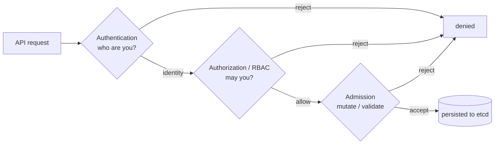

# Kubernetes Security Study Guide

A practical, depth-first guide to securing Kubernetes for engineers who already run clusters and now have to defend them. It assumes you can write a Deployment and read a `kubectl` error, but not that you've reasoned carefully about what an attacker does *after* they get a shell in one of your Pods. The approach is concept-first but relentlessly concrete: every control here is shown as the manifest you actually apply, motivated by the specific attack it stops, because Kubernetes security is a subject where the abstractions only stick once you've seen the exploit they prevent and the YAML that prevents it.

As of early 2026 the upstream documentation tracks `v1.35`; this guide assumes that era and flags where managed clusters (EKS, GKE, AKS) or older versions diverge. Treat version-specific defaults as directional and confirm against your provider — the *principles* move much more slowly than the flags.

The single thesis of the whole field is this: **there is no one control that secures a cluster, so security is the discipline of stacking independent layers such that any single failure — a leaked credential, an exploited container, a permissive RoleBinding, a partially compromised node — is contained instead of catastrophic.** Every section below is one layer, and the recurring question is always the same: *when this layer fails, what is the blast radius, and what is the next layer that limits it?*

This guide has siblings that share its ground: the [Kubernetes guide](KUBERNETES_STUDY_GUIDE.md) (the platform itself), the [Advanced Kubernetes guide](ADVANCED_KUBERNETES_STUDY_GUIDE.md) (operators, multi-tenancy, the reconciliation model), the [Docker/Kubernetes Networking guide](DOCKER_KUBERNETES_NETWORKING_STUDY_GUIDE.md) (the data path NetworkPolicy rides on), the [Linux Fundamentals guide](../LINUX_FUNDAMENTALS_STUDY_GUIDE.md) (namespaces, cgroups, and capabilities — the substrate container isolation is built from), and the [Auth guide](../AUTH_STUDY_GUIDE.md) (OIDC, tokens, the identity concepts RBAC consumes).

Primary references, all worth reading in full: the upstream [Security Checklist](https://kubernetes.io/docs/concepts/security/security-checklist/) and [Application Security Checklist](https://kubernetes.io/docs/concepts/security/application-security-checklist/); [Controlling Access to the Kubernetes API](https://kubernetes.io/docs/concepts/security/controlling-access/); [RBAC Good Practices](https://kubernetes.io/docs/concepts/security/rbac-good-practices/); [Pod Security Standards](https://kubernetes.io/docs/concepts/security/pod-security-standards/); and the [NSA/CISA Kubernetes Hardening Guidance](https://media.defense.gov/2022/Aug/29/2003066362/-1/-1/0/CTR_KUBERNETES_HARDENING_GUIDANCE_1.2_20220829.PDF), which remains the best single document tying the layers together.

---

## Table of Contents

1. [Part 1 — The Security Model & Threat Model](#part-1--the-security-model--threat-model)
2. [Part 2 — Authentication: Who Are You](#part-2--authentication-who-are-you)
3. [Part 3 — Authorization: What You May Do (RBAC)](#part-3--authorization-what-you-may-do-rbac)
4. [Part 4 — Admission Control: The Policy Chokepoint](#part-4--admission-control-the-policy-chokepoint)
5. [Part 5 — Workload & Container Hardening](#part-5--workload--container-hardening)
6. [Part 6 — Network Security & Multi-Tenancy](#part-6--network-security--multi-tenancy)
7. [Part 7 — Secrets & Data Protection](#part-7--secrets--data-protection)
8. [Part 8 — Supply Chain Security](#part-8--supply-chain-security)
9. [Part 9 — Audit, Detection & Response](#part-9--audit-detection--response)
10. [Part 10 — Putting It Together: A Hardened Cluster](#part-10--putting-it-together-a-hardened-cluster)
11. [Hands-On Labs](#hands-on-labs)

---

## Part 1 — The Security Model & Threat Model

Before any control, get the model right. Most Kubernetes security failures trace back to a single failure of imagination: treating the cluster as one trust boundary — "we're inside the VPC, we're fine" — when it is in fact a dense lattice of *many* boundaries, most of which are wide open by default.

### The 4Cs, and where your responsibility actually sits

The canonical framing is the **4Cs of Cloud Native Security**: Cloud, Cluster, Container, Code, nested like Russian dolls. The Cloud (or datacenter) is the trust base everything else assumes; the Cluster is the Kubernetes control and data planes; the Container is the running workload and its image; the Code is your application logic. The model's real lesson is the *direction of dependence*: you cannot secure an inner layer against a compromised outer one. A perfectly hardened Pod on a node whose kubelet API is exposed to the internet is not secure; airtight RBAC on a cluster whose cloud IAM lets any instance assume the cluster-admin role is not secure. **Secure outside-in, audit inside-out.**

Where your work lands depends on who runs the control plane. On a self-managed cluster (kubeadm, kops, bare metal) you own everything: etcd encryption, API server flags, kubelet configuration, certificate rotation, the lot. On a managed cluster the provider owns the control plane's availability and patching — but *not* its authorization. This is the most expensive misconception in the managed world: EKS, GKE, and AKS hand you a running, reachable API server and leave RBAC, network policy, Pod hardening, secrets, and workload identity entirely to you. "Managed" means managed *uptime*, not managed *security*.

### The mental model that matters: blast radius

The productive way to think about every decision in this guide is not "is this secure?" (an unanswerable yes/no) but "**what is the blast radius when this fails?**" — because things will fail, and the only question that has an actionable answer is how far the damage spreads. Hold four assumptions as permanent design premises:

- **A credential will leak.** A developer's kubeconfig ends up in a Slack message; a CI token is printed in a build log; a Pod's service-account token is read by an exploited process. Design so that no single leaked credential is cluster-admin.
- **A Pod will be exploited.** Some container is running a library with a CVE, and an attacker gets remote code execution inside it. Design so that a shell in one Pod is *not* a shell in every Pod, a reader of every Secret, or a path to the node.
- **A node will be partially compromised.** An attacker who breaks out of a container, or who lands on a node another way, should not thereby own the cluster or read every tenant's data in cleartext.
- **A mistake will be merged.** Someone will push a manifest with `privileged: true`, a `RoleBinding` to `cluster-admin`, or a forgotten namespace with no NetworkPolicy. Layered controls exist so that a single bad change is caught by *some other* layer.

These are not pessimism; they are the partial-failure premise of distributed systems (see the [Distributed Systems guide](../DISTRIBUTED_SYSTEMS_STUDY_GUIDE.md)) applied to security. A control that only works when nothing else has gone wrong is not a security control.

### The API server is the chokepoint — guard it, never bypass it

Almost every control in this guide — authentication, authorization, admission, audit — happens at one place: the **API server**. That concentration is a gift, because it gives you a single point at which to enforce and observe policy. It is also a liability, because anything that reaches cluster state *without* going through the API server bypasses your entire enforcement and audit story at once. The upstream [API Server Bypass Risks](https://kubernetes.io/docs/concepts/security/api-server-bypass-risks/) page enumerates the paths that matter: the **kubelet API** (port 10250 — a direct `exec`/`logs`/`run` interface into Pods that must require authentication and authorization, never `--anonymous-auth=true`), **etcd** (the database of record — anyone who can read it reads every Secret in cleartext, so it must be on its own network with mutual TLS), the **read-only kubelet port** (10255, historically unauthenticated — disable it), and **static Pods** the kubelet runs straight from a directory on disk with no API-server involvement at all. A recurring shape of real incidents is an attacker who never authenticates to the API server because they found a side door into one of these. The defensive instinct to build: every component that can mutate cluster or node state should be reachable only over an authenticated, authorized, audited path, and you should be able to name the ones that aren't.

### Defaults are functional, not safe

The last premise is cultural. Kubernetes defaults are tuned to make a cluster *work* the moment you stand it up, which means they are tuned *against* security: Pods can reach every other Pod on the network with no policy in place; a workload with no `securityContext` can run as root; a Secret is base64, not encryption; a freshly created ServiceAccount is mounted into every Pod that uses it whether the app needs the API or not. Production security is, to a first approximation, the disciplined work of *intentionally tightening every default that ships open* — and the rest of this guide is a tour of which ones, in what order, and what each one stops.

```quiz
Q: "Our EKS cluster is managed, so security is handled." What's wrong with this?
- [x] "Managed" means managed *uptime and patching* of the control plane, not managed *security* — RBAC, NetworkPolicy, Pod hardening, secrets, and workload identity are entirely yours
- [ ] Managed clusters can't run NetworkPolicies
- [ ] The provider owns your RBAC too
- [ ] Managed clusters are less secure than self-managed
> The most expensive misconception in the managed world. The provider hands you a running, reachable API server and leaves authorization to you. Secure outside-in (4Cs — you can't secure an inner layer against a compromised outer one), audit inside-out.

Q: Why is "what is the blast radius when this fails?" a better question than "is this secure?"
- [x] Things will fail (credentials leak, Pods get exploited, mistakes get merged), so the only actionable design question is how far the damage spreads — a control that only works when nothing else went wrong isn't a security control
- [ ] "Is this secure?" is always answerable yes/no
- [ ] Blast radius only matters for network security
- [ ] It's a way to avoid implementing controls
> The four permanent premises: a credential will leak, a Pod will be exploited, a node will be partially compromised, a mistake will be merged. Layered controls exist so a single failure is caught by *some other* layer — the partial-failure premise of distributed systems applied to security.

Q: Why is the kubelet API (port 10250) a dangerous "API server bypass"?
- [x] It's a direct exec/logs/run interface into Pods that bypasses the API server's auth/authz/admission/audit entirely — so it must require authentication (never --anonymous-auth=true); attackers often never authenticate to the API server because they found a side door
- [ ] It's where the scheduler runs
- [ ] It only serves metrics
- [ ] It's encrypted and safe by default
> Every control (authn, authz, admission, audit) concentrates at the API server — a gift and a liability. etcd, the read-only kubelet port (10255), and static Pods are the other bypass paths to name and lock down.
```

---

## Part 2 — Authentication: Who Are You

Authentication answers one question — *what identity is making this API request?* — and it is the foundation the entire authorization stack is built on, because RBAC can only make decisions about a name it has been given. Get the names wrong and every rule downstream is reasoning about the wrong subject.

### The request lifecycle: four gates

Every request to the API server passes through four sequential gates, and understanding the sequence is most of understanding Kubernetes access control:



Authentication establishes the identity; authorization (Part 3) decides whether that identity may perform the action; admission (Part 4) gets the last word, mutating or rejecting the object even after authorization passed. A request that fails any gate is rejected, and — critically — these are *independent* layers, so a misconfiguration in one is often caught by another. The flow is documented at [Controlling Access to the Kubernetes API](https://kubernetes.io/docs/concepts/security/controlling-access/).

### Two kinds of identity, and the one that surprises people

Kubernetes recognizes two categories of identity, and the distinction is load-bearing. **Normal users** — humans, and the automation that acts on their behalf — are *not Kubernetes objects*. There is no `User` resource, no `kubectl create user`. The API server simply trusts an external authenticator to assert "this request is from `alice@example.com`, in groups `engineering` and `oncall`," and RBAC reasons about that asserted name. **ServiceAccounts**, by contrast, *are* first-class namespaced objects, created and managed in-cluster, intended for the identity of Pods.

The surprise, and a frequent source of confusion, is that **users live outside the cluster and ServiceAccounts live inside it** — which means your strategy for human access is fundamentally a question of *which external system the API server trusts*, while your strategy for workload access is a question of *how you scope and mount in-cluster tokens*. They are different problems with different tools.

### Human access: OIDC is the production answer

The authenticators the API server can use range from "fine for a lab" to "fine for production," and the dividing line matters. **Static token files** and **basic auth** are deprecated and disqualifying for anything real — they cannot be revoked without an API-server restart and they have no group story. **X.509 client certificates** work and are how the control-plane components authenticate to each other, but as a *human* strategy they have a fatal operational flaw: Kubernetes provides no certificate revocation, so a leaked client cert is valid until it expires, and you cannot un-issue it. Use certs for break-glass admin access (kept offline) and component identity, not as your everyday human path.

The production pattern for human access is **OpenID Connect (OIDC)**: the API server is configured to trust an external identity provider (Okta, Entra ID, Google, Keycloak, or your cloud's IAM), users authenticate to that IdP and receive a short-lived JWT, and the API server validates the token's signature and extracts the username and groups from configured claims. The configuration on the API server side:

```
--oidc-issuer-url=https://idp.example.com
--oidc-client-id=kubernetes
--oidc-username-claim=email
--oidc-groups-claim=groups
--oidc-groups-prefix=oidc:        # so IdP group "admins" becomes "oidc:admins", avoiding collisions
```

Everything good about this flows from one property: **the IdP is the single source of truth for identity and group membership**, so off-boarding a person, rotating their access, or enforcing MFA happens in *one* place that you already operate, and the token they carry is short-lived, so a leak is a problem for minutes, not forever. RBAC then binds to the IdP-provided groups (`oidc:admins`), never to individual emails — group-based bindings are what make access reviews tractable and what keep your RBAC stable as people come and go. The user-side flow is handled by a plugin like [`kubelogin`](https://github.com/int128/kubelogin), which performs the browser login and refreshes the token transparently.

Managed clusters wire this to cloud IAM and it is worth knowing the shape of each, because the integration point is where the most dangerous misconfigurations live. **EKS** maps AWS IAM principals to Kubernetes identities — historically through the `aws-auth` ConfigMap, now through the cleaner EKS Access Entries API; the classic EKS footgun is that the IAM identity which *created* the cluster is permanently cluster-admin and invisible in RBAC, so audit *who that is*. **GKE** ties Google IAM to Kubernetes RBAC and adds Workload Identity for Pods (below). **AKS** integrates Entra ID and supports Azure RBAC for Kubernetes. In all three, the lesson is the same: there is a cloud-IAM path to cluster access that lives *outside* your Kubernetes RBAC, and you must audit it as carefully as RBAC itself.

### Workload identity: the token in every Pod

Every Pod gets a ServiceAccount (the `default` one in its namespace if you don't specify), and a token for that account is, by default, **automounted** into the container's filesystem at `/var/run/secrets/kubernetes.io/serviceaccount/token`. That token is a credential to the API server, and the first hardening move is to stop handing it to workloads that don't use it:

```yaml
apiVersion: v1
kind: ServiceAccount
metadata:
  name: payments-api
  namespace: payments
automountServiceAccountToken: false   # default-deny the token; opt in per workload
---
apiVersion: apps/v1
kind: Deployment
metadata:
  name: payments-api
  namespace: payments
spec:
  template:
    spec:
      serviceAccountName: payments-api
      automountServiceAccountToken: false   # also settable on the Pod, which wins
      containers:
        - name: app
          image: registry.example.com/payments-api@sha256:...
```

The reasoning is pure blast radius: most application containers never call the Kubernetes API, so the token mounted into them is *purely* attack surface — a credential an exploited process can read and replay. Mounting it only where it is needed turns a leaked token from "every Pod is a foothold" into "only the few Pods that legitimately talk to the API are." Modern clusters further use **bound, projected service-account tokens** (audience-scoped, time-limited, auto-rotated) instead of the legacy long-lived Secret-based tokens, which removes the never-expiring token from etcd entirely; this is the default for the automounted token on current versions.

For Pods that need to talk to *cloud* APIs (read an S3 bucket, a GCS object, a Key Vault secret), the right pattern is **cloud workload identity** — EKS IRSA / Pod Identity, GKE Workload Identity, AKS Workload Identity — which exchanges the Pod's projected Kubernetes token for short-lived cloud credentials with no long-lived secret stored anywhere. The anti-pattern it replaces, putting static cloud access keys in a Kubernetes Secret, is one of the most common ways a single exploited Pod becomes a cloud-account breach, because that key is long-lived, broadly scoped, and sitting in cleartext-to-the-Pod environment variables.

```quiz
Q: Why is OIDC the production answer for human cluster access, and what should RBAC bind to?
- [x] The IdP is the single source of truth for identity and group membership (off-boarding, MFA, rotation happen in one place) and tokens are short-lived; RBAC binds to IdP *groups*, never individual emails
- [ ] OIDC tokens never expire, so they're convenient
- [ ] X.509 client certs are the production standard
- [ ] OIDC replaces the need for authorization
> Static tokens and basic auth can't be revoked without an API-server restart; client certs can't be revoked at all (no CRL). Group-based bindings make access reviews tractable and keep RBAC stable as people come and go.

Q: Why turn off automountServiceAccountToken for app containers that don't call the Kubernetes API?
- [x] The automounted token is a credential to the API server — for a container that never uses it, it's *pure* attack surface an exploited process can read and replay; mounting it only where needed shrinks "every Pod is a foothold" to "only the few that legitimately talk to the API"
- [ ] It speeds up Pod startup
- [ ] The token is required for DNS to work
- [ ] It prevents the Pod from being scheduled
> Pure blast-radius reasoning. Modern clusters use bound, projected tokens (audience-scoped, time-limited, auto-rotated) instead of legacy never-expiring Secret tokens — removing the long-lived token from etcd.

Q: A Pod needs to read an S3 bucket. What's the right pattern and the anti-pattern it replaces?
- [x] Cloud workload identity (IRSA / GKE Workload Identity / AKS) exchanges the Pod's projected K8s token for short-lived cloud credentials with no stored secret — replacing static cloud access keys in a Kubernetes Secret, which turn one exploited Pod into a cloud-account breach
- [ ] Mount the AWS keys as environment variables
- [ ] Use a shared cluster-wide IAM role
- [ ] Store the keys in a ConfigMap
> Static keys are long-lived, broadly scoped, and sit cleartext-to-the-Pod. Workload identity issues short-lived, narrowly-scoped credentials with nothing durable to steal.
```

---

## Part 3 — Authorization: What You May Do (RBAC)

Authentication gave the request a name; authorization decides what that name may do. Kubernetes supports several authorizers (Node, ABAC, Webhook, and RBAC), evaluated such that any one of them can *allow* a request — but in practice the one you design, review, and live with is **RBAC**, and mastering it is the highest-leverage skill in this entire guide because RBAC is where the "a credential will leak" premise is either contained or catastrophic.

### The four objects, and the additive-only rule

RBAC has exactly four object kinds, and they pair on two axes. A **Role** is a namespaced set of permissions; a **ClusterRole** is the same thing but cluster-scoped (and also the only way to grant permissions on non-namespaced resources like nodes). A **RoleBinding** grants a Role (or a ClusterRole) to subjects *within one namespace*; a **ClusterRoleBinding** grants a ClusterRole *across the whole cluster*. The combination that trips people up is RoleBinding-to-ClusterRole: it grants the ClusterRole's permissions but *scoped to the binding's namespace* — which is exactly how you reuse a single well-defined ClusterRole (say, "deployer") across many namespaces without duplicating it.

The property that makes RBAC reasoning tractable is that **it is purely additive — there are no deny rules.** A subject's permissions are the union of everything bound to them and their groups; nothing subtracts. This has a profound consequence for how you design: you cannot "grant broad access then carve out exceptions," because there are no exceptions. You must grant *only* what is needed, from zero, which is least privilege not as a slogan but as the only model the system supports.

A concrete least-privilege Role — read-only access to Pods and their logs in one namespace, the kind of thing a support engineer or a dashboard actually needs:

```yaml
apiVersion: rbac.authorization.k8s.io/v1
kind: Role
metadata:
  namespace: payments
  name: pod-reader
rules:
  - apiGroups: [""]                       # "" is the core API group
    resources: ["pods", "pods/log"]
    verbs: ["get", "list", "watch"]
---
apiVersion: rbac.authorization.k8s.io/v1
kind: RoleBinding
metadata:
  namespace: payments
  name: support-can-read-pods
subjects:
  - kind: Group                            # bind to a group from your IdP, never individuals
    name: "oidc:payments-support"
    apiGroup: rbac.authorization.k8s.io
roleRef:
  kind: Role
  name: pod-reader
  apiGroup: rbac.authorization.k8s.io
```

Read the manifest as a sentence: members of the IdP group `payments-support` may get/list/watch Pods and read their logs, in the `payments` namespace, and *nothing else*. Note `pods/log` as a distinct resource — RBAC's subresources are how you grant "read logs" without granting "read the Pod spec," and the same mechanism (`pods/exec`, `pods/portforward`, `pods/attach`) is what lets you *deny* the dangerous interactive subresources while allowing the benign ones.

### The permissions that are secretly cluster-admin

Some RBAC grants look narrow but are, transitively, a path to total control, and recognizing them is the difference between a real access review and a rubber-stamp. The [RBAC Good Practices](https://kubernetes.io/docs/concepts/security/rbac-good-practices/) page is the authoritative list; the ones to internalize:

- **`create` on Pods (or any controller that makes Pods)** in a namespace is *node-level code execution* in that namespace: the holder can schedule a Pod that mounts the host filesystem, runs privileged, or mounts another ServiceAccount's token — so "can deploy" is much closer to "can root the node" than it reads.
- **`get`/`list` on Secrets** is read access to every credential in scope, in cleartext (the API server decrypts on read). A Role that "just reads Secrets to populate a dashboard" reads your database passwords.
- **`escalate` and `bind` on Roles** let the holder grant themselves permissions they don't have — the explicit RBAC self-escalation verbs, which exist precisely so you can *deny* them and which are why RBAC normally won't let you create a binding more powerful than your own.
- **`impersonate`** lets the holder act as any other user, group, or ServiceAccount — a complete authorization bypass if granted broadly.
- **The `*` wildcard** on resources or verbs grants permissions on resources that *don't exist yet* — a CRD installed next month is automatically in scope. Enumerate; never wildcard.

The unifying instinct: when reviewing a Role, don't ask "does this look broad?" — ask "what is the most damaging thing the holder can do by *combining* these verbs?" The answer is frequently "more than the author intended."

```quiz
Q: RBAC is "purely additive — there are no deny rules." What does this force on your design?
- [x] You can't grant broad access then carve out exceptions (there are none) — you must grant only what's needed from zero, so least privilege is the only model the system supports
- [ ] You can add deny rules with a ClusterRole
- [ ] Permissions subtract when bound to multiple groups
- [ ] It means RBAC can't restrict anything
> A subject's permissions are the union of everything bound to them and their groups. The four objects: Role (namespaced) / ClusterRole (cluster-scoped) granted by RoleBinding (one namespace) / ClusterRoleBinding (whole cluster).

Q: Which of these narrow-looking RBAC grants is secretly close to cluster-admin?
- [x] `create` on Pods in a namespace — the holder can schedule a Pod that mounts the host filesystem, runs privileged, or mounts another ServiceAccount's token, making "can deploy" close to "can root the node"
- [ ] `get` on ConfigMaps
- [ ] `list` on Services
- [ ] `watch` on Events
> Also secretly-admin: get/list on Secrets (reads every credential in cleartext — the API server decrypts on read), escalate/bind on Roles (self-escalation), impersonate (act as anyone), and the `*` wildcard (covers resources that don't exist yet). Review by asking what the *combination* enables.

Q: How do you verify (and assert in CI) what a subject can do?
- [x] kubectl auth can-i — e.g. `can-i create pods --as=system:serviceaccount:payments:default -n payments` — used both to confirm a grant works and to assert a sensitive permission is *absent*
- [ ] kubectl describe rolebinding
- [ ] Reading the RBAC YAML manually
- [ ] There's no way to test RBAC
> The goal state most clusters are far from: small named human groups with scoped namespace access, ServiceAccounts with exactly their workload's permissions, and cluster-admin held by approximately nobody day-to-day.
```

### Auditing and the practical workflow

Two habits keep RBAC honest. First, `kubectl auth can-i` is your assertion language — `kubectl auth can-i create pods --as=system:serviceaccount:payments:default -n payments` answers "can this subject do this thing?" directly, and you should use it both to verify a grant did what you meant and, in CI, to assert that a sensitive permission is *absent*. Second, audit for the dangerous bindings continuously: anything bound to the built-in `cluster-admin` ClusterRole, any ClusterRoleBinding (cluster-scoped grants are the ones that escape namespace containment), and any subject with the secretly-admin verbs above. Tools like [`rbac-tool`](https://github.com/alcideio/rbac-tool) and `kubectl-who-can` turn "who can read Secrets in production?" from a manual graph-walk into a query. The goal state is one most clusters are far from at first: a small, named set of human groups with deliberately scoped namespace access, ServiceAccounts with exactly the permissions their workload uses, and `cluster-admin` held by approximately nobody on a day-to-day basis.

---

## Part 4 — Admission Control: The Policy Chokepoint

Authentication and authorization decide *whether* a request is allowed; admission control decides *what the object is allowed to be*. It is the last gate before persistence, it runs on every create and update, and it is where most *organizational* security policy — "no privileged Pods," "every image from our registry," "every namespace has resource limits" — is actually enforced. RBAC cannot express these rules (it reasons about verbs and resources, not field values); admission control can, and that makes it the security layer where the most leverage per line of policy lives.

### Two phases, and why order matters

Admission runs in two phases. **Mutating** admission controllers run first and may *change* the object — inject a sidecar, set a default `securityContext`, add a label. **Validating** controllers run second and may only *accept or reject* — they see the object in its final, post-mutation form. The ordering is deliberate and exploitable for good: you mutate to set safe defaults, then validate to enforce that the result (defaults included) is acceptable. Both phases can call out to **webhooks** — your own HTTPS services the API server consults — which is the extension point the entire policy ecosystem is built on.

### Pod Security Admission: the built-in baseline

The native, no-install workload control is **Pod Security Admission (PSA)**, which enforces the three **Pod Security Standards** — `privileged` (no restrictions), `baseline` (blocks the well-known dangerous settings: host namespaces, privileged containers, most host mounts), and `restricted` (the genuinely locked-down profile: non-root, no privilege escalation, dropped capabilities, seccomp on). PSA is configured per namespace with labels, and its best feature is three independent *modes* that make rollout safe:

```yaml
apiVersion: v1
kind: Namespace
metadata:
  name: payments
  labels:
    # enforce: reject Pods that violate the standard
    pod-security.kubernetes.io/enforce: restricted
    pod-security.kubernetes.io/enforce-version: latest
    # audit: record violations in the audit log (visibility without breakage)
    pod-security.kubernetes.io/audit: restricted
    # warn: return a warning to the user who applied the manifest
    pod-security.kubernetes.io/warn: restricted
```

The rollout discipline this enables is the same one that makes any enforcement change safe: start with `warn` and `audit` only, watch what *would* have been rejected without breaking anything, fix the workloads, then promote to `enforce`. Apply `restricted` to your application namespaces and reserve `privileged` for the genuinely exceptional ones (a CNI plugin's namespace, a node-level agent) — and treat every `privileged`-labeled namespace as a documented, reviewed exception, not a default. PSA's deliberate limitation is that it enforces *only* the fixed Pod Security Standards; it cannot express "images must come from our registry" or "every Pod must have a `team` label." For those you need a policy engine.

### Policy engines: OPA Gatekeeper and Kyverno

When the rule you want isn't one of the three standards, you reach for a validating-webhook policy engine, and the field has effectively two answers. **OPA Gatekeeper** expresses policy in Rego (a purpose-built declarative query language) and is the more powerful and more complex option — its strength is arbitrary logic across multiple resources, its cost is that Rego is a language your team has to learn. **Kyverno** expresses policy as Kubernetes-native YAML, which most teams find dramatically more approachable because a policy reads like the resources it governs. A Kyverno policy that enforces the two rules PSA can't — registry allowlisting and required labels:

```yaml
apiVersion: kyverno.io/v1
kind: ClusterPolicy
metadata:
  name: require-trusted-registry
spec:
  validationFailureAction: Enforce       # Audit first in a real rollout, then Enforce
  rules:
    - name: images-from-our-registry
      match:
        any:
          - resources: { kinds: ["Pod"] }
      validate:
        message: "Images must come from registry.example.com"
        pattern:
          spec:
            containers:
              - image: "registry.example.com/*"
```

Whichever engine you choose, three operational truths apply. First, run policies in audit/warn mode before enforce — a too-strict policy that rejects every Deployment is an outage, and the engine's mistakes are *your* mistakes. Second, a validating webhook is in the critical path of every relevant API write, so its availability is your cluster's availability — set `failurePolicy` deliberately (`Fail` is more secure but means a down webhook blocks deploys; `Ignore` is more available but means a down webhook is a policy bypass), and exclude `kube-system` so a broken policy can't brick the control plane. Third, **admission control is enforcement, not detection** — it stops bad objects at creation but says nothing about what's already running or what changes out-of-band, which is why Part 9's audit and runtime layers exist alongside it.

```quiz
Q: Why is admission control able to enforce "no privileged Pods" when RBAC cannot?
- [x] RBAC reasons about verbs and resources, not field *values*; admission control sees the object's fields, so it's where policies like "no privileged: true," "images from our registry," "every namespace has limits" are enforced
- [ ] RBAC can express it with a deny rule
- [ ] Admission runs before authentication
- [ ] They enforce the same things
> Admission is the last gate before persistence, running on every create/update. Mutating runs first (set safe defaults), validating second (sees the final object, accept/reject) — the ordering lets you default-then-enforce.

Q: What's the safe rollout discipline for Pod Security Admission, and what's its deliberate limitation?
- [x] Start with warn + audit only (see what *would* be rejected without breaking anything), fix workloads, then promote to enforce — and PSA enforces *only* the three fixed Pod Security Standards, so "images from our registry" needs a policy engine
- [ ] Enforce restricted everywhere immediately
- [ ] PSA can express arbitrary custom rules
- [ ] PSA replaces NetworkPolicy
> Three independent modes (enforce/audit/warn) make the rollout safe — the same start-in-observe-mode discipline as any enforcement change. PSA's three standards: privileged, baseline, restricted.

Q: A validating webhook policy engine is in the critical path of every relevant API write. What does that mean for failurePolicy?
- [x] Its availability is your cluster's availability — Fail is more secure but a down webhook blocks deploys; Ignore is more available but a down webhook is a policy bypass; either way, exclude kube-system so a broken policy can't brick the control plane
- [ ] failurePolicy doesn't affect availability
- [ ] Fail is always the right choice
- [ ] Webhooks run async and can't block writes
> And admission is enforcement, not detection — it stops bad objects at creation but says nothing about what's already running or changed out-of-band, which is why audit and runtime layers exist alongside it.
```

---

## Part 5 — Workload & Container Hardening

This is the layer that contains the "a Pod will be exploited" premise. Everything so far decided who may *create* a workload; this part decides what that workload can *do* to the node and its neighbors once it is running and, hypothetically, compromised. It is also the highest-density manifest skill in Kubernetes security, because almost all of it lives in one field: `securityContext`.

### Containers are processes, not VMs

The foundational fact, which determines everything else: **a container is not a virtual machine; it is a Linux process (or process tree) that shares the host kernel**, isolated by namespaces (its own view of PIDs, mounts, network) and constrained by cgroups (its share of CPU and memory) — the exact mechanisms the [Linux Fundamentals guide](../LINUX_FUNDAMENTALS_STUDY_GUIDE.md) covers in depth. The security consequence is stark: container isolation is *kernel* isolation, and a kernel vulnerability or a misconfiguration that hands a container kernel-level privilege is a host compromise. "It's just a container, it's sandboxed" is false in exactly the cases that matter. Hardening a workload is therefore the work of shrinking what its process can ask the kernel for.

### The securityContext that every production Pod should carry

A handful of `securityContext` settings, applied together, turn a default-permissive container into a hardened one. The canonical hardened Pod:

```yaml
apiVersion: v1
kind: Pod
metadata:
  name: hardened
spec:
  securityContext:                  # Pod-level: applies to all containers
    runAsNonRoot: true              # refuse to start if the image's user is root
    runAsUser: 10001
    runAsGroup: 10001
    fsGroup: 10001
    seccompProfile:
      type: RuntimeDefault          # block the ~44 dangerous syscalls the runtime blocklists
  containers:
    - name: app
      image: registry.example.com/app@sha256:...
      securityContext:              # container-level: overrides/augments
        allowPrivilegeEscalation: false   # no setuid path to more privilege than the parent
        readOnlyRootFilesystem: true      # the image's filesystem is immutable at runtime
        privileged: false
        capabilities:
          drop: ["ALL"]                   # start from zero kernel capabilities
          # add: ["NET_BIND_SERVICE"]     # then add back only what's provably needed
      volumeMounts:
        - name: tmp
          mountPath: /tmp           # read-only root needs writable tmp mounted explicitly
  volumes:
    - name: tmp
      emptyDir: {}
```

Each line is a specific attack removed, and it's worth knowing which:

- **`runAsNonRoot` + `runAsUser`** stops the container running as UID 0. Root in a container is root on the host kernel for any operation namespaces don't isolate; running as an unprivileged UID means a container escape lands as a nobody, not as root.
- **`allowPrivilegeEscalation: false`** sets the kernel's `no_new_privs` bit, closing the setuid-binary path by which a process re-acquires privileges its parent dropped — without it, dropping capabilities can be partially undone by a setuid binary in the image.
- **`readOnlyRootFilesystem: true`** makes the image immutable at runtime, which defeats the entire class of attacks that depend on writing a payload, dropping a tool, or modifying a binary in place. Most apps need only a writable `/tmp` and a data volume, mounted explicitly as above.
- **`capabilities: drop: ["ALL"]`** is the highest-leverage line. Linux capabilities slice root's power into ~40 pieces (bind low ports, change file ownership, load kernel modules, trace processes); containers get a permissive default set, and almost every app needs *none* of them. Drop all, add back only the specific capability the app provably requires (a web server binding port 80 needs `NET_BIND_SERVICE` — or better, just bind a high port).
- **`seccompProfile: RuntimeDefault`** applies the container runtime's syscall blocklist, cutting off the dangerous and rarely-needed syscalls (`keyctl`, `ptrace` of others, mount operations) that kernel exploits reach for. It is on by default for new clusters but worth asserting.

The `privileged: true` setting deserves its own sentence: it disables essentially all of the above at once — full capabilities, host device access, the works — and a privileged container is, for security purposes, **root on the node**. It is occasionally legitimate (a CNI agent, a storage driver, a node-level monitor) but it is never the default, every instance must be a reviewed exception with a named reason, and the single most valuable cluster-wide policy you can write is "no privileged Pods outside this short allowlist of system namespaces."

### When process isolation isn't enough

For genuinely hostile multi-tenancy — running untrusted code, a SaaS that executes customer workloads — shared-kernel isolation is the wrong trust boundary, and the answer is a **sandboxed runtime**: **gVisor** (a user-space kernel that intercepts the container's syscalls so they never reach the host kernel directly) or **Kata Containers** (a lightweight VM per Pod, restoring a hardware isolation boundary). Both are wired in per-workload through a `RuntimeClass`, so you can run most Pods on the fast default runtime and reserve the heavier sandbox for the untrusted ones. Knowing these exist — and knowing that the default `runc` is *not* a security boundary against determined untrusted code — is the senior judgment call this section builds toward.

```quiz
Q: "It's just a container, it's sandboxed." When is this false?
- [x] Always, in the cases that matter — a container is a Linux process sharing the host kernel, isolated by namespaces and cgroups; a kernel vuln or a misconfig handing kernel privilege is a host compromise. runc is not a security boundary against determined untrusted code
- [ ] Only on older kernels
- [ ] Containers are fully VM-isolated
- [ ] It's true unless privileged: true is set
> Container isolation is kernel isolation. For genuinely hostile multi-tenancy, use a sandboxed runtime (gVisor's user-space kernel, or Kata's VM-per-Pod) via RuntimeClass. Hardening is shrinking what the process can ask the kernel for.

Q: Which single securityContext line is described as the highest-leverage, and why?
- [x] capabilities: drop: ["ALL"] — Linux capabilities slice root's power into ~40 pieces, containers get a permissive default set, and almost every app needs *none*; drop all, add back only what's provably required
- [ ] privileged: false
- [ ] runAsUser: 10001
- [ ] fsGroup: 10001
> The full hardened set works together: runAsNonRoot (escape lands as nobody), allowPrivilegeEscalation: false (no_new_privs, closes the setuid re-escalation path), readOnlyRootFilesystem (defeats write-a-payload attacks), seccompProfile: RuntimeDefault (blocks dangerous syscalls).

Q: Why is privileged: true effectively "root on the node"?
- [x] It disables essentially all the hardening at once — full capabilities, host device access — so the single most valuable cluster-wide policy is "no privileged Pods outside a short allowlist of system namespaces," every instance a reviewed exception
- [ ] It only grants extra CPU
- [ ] It's required for any networking
- [ ] It's the same as runAsRoot
> Privileged containers are occasionally legitimate (CNI agent, storage driver, node monitor) but never the default. Each must be a documented, named exception — and a cluster-wide deny policy catches the accidental privileged: true that gets merged.
```

---

## Part 6 — Network Security & Multi-Tenancy

By default, **every Pod can reach every other Pod in the cluster** — a flat, unrestricted network where a single compromised workload can scan and connect to your databases, your internal APIs, and your neighbors' services with nothing in its way. This is the "a Pod will be exploited" premise meeting the network, and the layer that contains it is the **NetworkPolicy**.

### Default-deny is the whole game

A NetworkPolicy is a namespaced firewall for Pod traffic, selecting Pods by label and specifying allowed ingress and egress. The single most important fact about it is that **policies are deny-by-omission only once a policy selects a Pod**: a Pod with no policy is wide open, but the moment *any* policy selects it for a given direction, all traffic in that direction is denied except what the policy explicitly allows. This is what makes the foundational move possible — a default-deny policy that selects everything:

```yaml
apiVersion: networking.k8s.io/v1
kind: NetworkPolicy
metadata:
  name: default-deny-all
  namespace: payments
spec:
  podSelector: {}                  # select every Pod in the namespace
  policyTypes: ["Ingress", "Egress"]
  # no ingress/egress rules ⇒ deny all of both
```

Apply that to a namespace and nothing can talk to or from those Pods until you write the allows — which is exactly the posture you want, because now connectivity is an explicit, reviewable decision rather than an accident. You then add back the specific flows each app needs:

```yaml
apiVersion: networking.k8s.io/v1
kind: NetworkPolicy
metadata:
  name: api-allows
  namespace: payments
spec:
  podSelector:
    matchLabels: { app: payments-api }
  policyTypes: ["Ingress", "Egress"]
  ingress:
    - from:
        - namespaceSelector:                 # only the ingress controller's namespace
            matchLabels: { kubernetes.io/metadata.name: ingress-nginx }
      ports:
        - { protocol: TCP, port: 8080 }
  egress:
    - to:
        - podSelector:                       # only the database Pods, same namespace
            matchLabels: { app: postgres }
      ports:
        - { protocol: TCP, port: 5432 }
    - to: []                                 # and DNS, or nothing resolves
      ports:
        - { protocol: UDP, port: 53 }
        - { protocol: TCP, port: 53 }
```

Two practical notes that bite everyone once. First, **egress default-deny breaks DNS** until you explicitly allow port 53 to kube-dns — the `egress` block above includes it, and forgetting it is the classic "why can't my Pod resolve anything" incident. Second, **NetworkPolicy requires a CNI that implements it** — Calico, Cilium, and most managed CNIs do, but the bare default in some setups does not, and a NetworkPolicy applied to a cluster whose CNI ignores it is a dangerous illusion of protection. Verify enforcement, don't assume it.

The rollout discipline mirrors PSA's: never flip a busy namespace to default-deny blind. Map the real traffic first (a CNI with flow logs, or Cilium's Hubble, shows you what actually talks to what), write the allow policies, apply default-deny, and watch for breakage. The end state — every namespace default-denied, every cross-service flow an explicit allow — converts the flat network into a segmented one where an exploited Pod can reach only its declared dependencies.

### North-south, mTLS, and the service mesh question

NetworkPolicy governs *east-west* (Pod-to-Pod) L3/L4 traffic and nothing else. Two adjacent concerns need other tools. **North-south** traffic — the internet reaching your Ingress — is the province of your ingress controller, WAF, and TLS termination, a different layer with its own hardening (rate limits, request validation, cert management). And **identity-based, encrypted east-west** — "service A may call service B, proven by mutual TLS, regardless of IP" — is what a **service mesh** (Istio, Linkerd) adds: automatic mTLS between Pods (so traffic is encrypted and *authenticated* even inside the cluster) and L7 authorization policies (per-path, per-method). A mesh is real operational weight, so the honest guidance is to adopt it when you specifically need mTLS-everywhere or fine-grained L7 service-to-service authz, not reflexively — NetworkPolicy plus good ingress hardening covers a great deal of the threat model at a fraction of the cost.

### Multi-tenancy: namespaces are a soft boundary

The most consequential design judgment in this part is how strong a wall you actually need between tenants, because **a namespace is an organizational boundary, not a hard security boundary**. Namespaces scope names and RBAC and NetworkPolicy, but tenants in different namespaces still share one API server, one set of nodes, and — critically — one kernel per node, so a container escape or a kernel exploit crosses namespace lines. This gives a spectrum. *Soft multi-tenancy* (trusted teams in one cluster, separated by namespace + RBAC + NetworkPolicy + ResourceQuota) is appropriate when tenants are internal and broadly trusted. *Hard multi-tenancy* (untrusted tenants, e.g. a SaaS running customer code) needs more: sandboxed runtimes (Part 5), and frequently the conclusion that the only boundary you trust is a **separate cluster per tenant** — because at the limit, the strongest isolation Kubernetes offers within a cluster is weaker than a fresh cluster, and pretending otherwise is how cross-tenant breaches happen. Naming where your workload sits on that spectrum, honestly, is the senior call.

```quiz
Q: A NetworkPolicy is "deny-by-omission only once a policy selects a Pod." What does that mean in practice?
- [ ] Every Pod is denied all traffic by default until you write an allow
- [x] A Pod with no policy selecting it is wide open, but the moment any policy selects it for a direction, all traffic in that direction is denied except what the policy explicitly allows — so a default-deny policy selecting every Pod is the foundational move
- [ ] Policies subtract from a default-allow baseline using deny rules
- [ ] A Pod can be selected by only one policy at a time
> By default every Pod can reach every other Pod — a flat network where one compromised workload scans your databases and neighbors freely. NetworkPolicy flips that per-direction, but only for Pods a policy actually selects. So you apply `podSelector: {}` with no rules to default-deny a whole namespace, then add back the specific flows, making connectivity an explicit, reviewable decision instead of an accident.

Q: After applying default-deny egress to a namespace, Pods can't resolve any hostnames. Why — and what else can silently make a NetworkPolicy useless?
- [ ] Default-deny corrupts the Pod's /etc/resolv.conf
- [ ] DNS uses TCP only, which the policy can't match
- [x] Egress default-deny blocks DNS until you explicitly allow port 53 to kube-dns; separately, NetworkPolicy only works if the CNI implements it — on a CNI that ignores it, the policy is a dangerous illusion of protection
- [ ] NetworkPolicy always allows DNS automatically
> Two things bite everyone once. Forgetting to allow UDP/TCP 53 to kube-dns is the classic "why can't my Pod resolve anything" incident, because egress denial includes DNS. And NetworkPolicy is enforced by the CNI (Calico, Cilium, most managed ones do; some bare defaults don't), so you must *verify* enforcement rather than assume it — an unenforced policy looks applied but protects nothing.

Q: Why is a namespace described as "a soft boundary, not a hard security boundary"?
- [ ] Any user can delete a namespace
- [ ] Namespaces provide no isolation whatsoever
- [ ] A namespace becomes a hard boundary once NetworkPolicy is applied
- [x] Namespaces scope names, RBAC, and NetworkPolicy, but tenants still share one API server, one set of nodes, and one kernel per node — so a container escape or kernel exploit crosses namespace lines, which is why genuinely untrusted multi-tenancy often needs a separate cluster per tenant
> Namespaces are an organizational boundary, fine for *soft* multi-tenancy (trusted internal teams separated by namespace + RBAC + NetworkPolicy + ResourceQuota). But they share the kernel, so they don't contain a container escape. *Hard* multi-tenancy (untrusted customer code) needs sandboxed runtimes and frequently the honest conclusion that the only boundary you trust is a fresh cluster — pretending otherwise is how cross-tenant breaches happen.
```

---

## Part 7 — Secrets & Data Protection

Secrets are where a small mistake becomes a large one fastest, because the entire point of a Secret is that it unlocks something else. The defining fact you must internalize first: **a Kubernetes Secret is not encrypted — it is base64-encoded**, which is encoding, not protection. `echo <value> | base64 -d` reverses it instantly. Everything in this part is about adding the protection that the name falsely implies.

### Three places a Secret is exposed, and the control for each

A Secret is at risk in three distinct places, and a real secrets strategy addresses all three rather than congratulating itself for fixing one.

**At rest in etcd.** By default, Secrets sit in etcd as base64 — so anyone who can read etcd (a node backup, a compromised control-plane host, an attacker who reached the database directly) reads every credential in the cluster in cleartext. The native fix is **encryption at rest**, configured with an `EncryptionConfiguration` on the API server:

```yaml
apiVersion: apiserver.config.k8s.io/v1
kind: EncryptionConfiguration
resources:
  - resources: ["secrets"]
    providers:
      - kms:                       # envelope encryption: data keys wrapped by a cloud KMS
          apiVersion: v2
          name: my-kms
          endpoint: unix:///var/run/kmsplugin/socket.sock
      - identity: {}               # fallback so existing un-encrypted secrets still read
```

The strongly preferred provider is **KMS v2** (envelope encryption, where data is encrypted with a local key that is itself encrypted by a cloud KMS, so the root key never lands on the node) rather than a static `aesgcm` key sitting in a file on the control-plane host — a static key in a file is barely better than no key, because it lives next to the data it protects. On managed clusters this is often a checkbox (enable KMS encryption), and it is one you should always check. Note the subtlety: enabling encryption only encrypts Secrets written *after* it's on, so you must rewrite existing Secrets (`kubectl get secrets -A -o json | kubectl replace -f -`) to actually protect them.

**In transit and at use.** The API server decrypts Secrets on read, so any identity with `get` on Secrets gets cleartext (Part 3's "secretly cluster-admin" verb) — which is why RBAC on Secrets is part of secrets security, not separate from it. And a Secret injected as an environment variable is readable by anything that can see the process environment (a crash dump, a `/proc/<pid>/environ` read, a logging library that dumps env on error); injecting Secrets as *mounted files* rather than env vars is a meaningful hardening, because files are easier to permission and don't leak into the dozen places env vars do.

### The architecture question: where does the source of truth live?

The deeper decision is *where secrets actually originate*, and the modern answer increasingly is **not in etcd at all**. The dominant pattern is an **external secret store** — HashiCorp Vault, AWS Secrets Manager, GCP Secret Manager, Azure Key Vault — as the source of truth, with one of two bridges into Kubernetes. The **External Secrets Operator** syncs from the external store into Kubernetes Secrets (so workloads consume them normally, but the canonical copy and the rotation live in the store). The **Secrets Store CSI Driver** mounts secrets directly from the external store into the Pod as a volume, so they never become a Kubernetes Secret object at all. Both centralize the things that matter — rotation, audit, fine-grained access, dynamic short-lived credentials (Vault can issue a database password that expires in an hour) — in a system built for them.

A separate, common need is **secrets in Git** for GitOps, where the literal Secret manifest obviously cannot be committed in cleartext. The two answers are **Sealed Secrets** (a controller holds a private key; you encrypt the Secret with the matching public key, commit the encrypted blob safely, and only the in-cluster controller can decrypt it) and the External-Secrets approach (commit a *reference* to a secret in an external store, not the secret itself). Sealed Secrets is simpler and self-contained; external stores are stronger on rotation and central audit. The honest trade: for a small platform, encryption-at-rest plus Sealed Secrets is a perfectly defensible posture; for a larger or compliance-bound one, an external store with the CSI driver or ESO is where you end up, because the value is less the encryption and more the *operational* properties — one place to rotate, one audit trail, short-lived dynamic credentials. Whatever you choose, the disqualifying anti-patterns are constant: secrets in plain ConfigMaps, secrets baked into images, secrets in environment variables in the manifest, and static long-lived cloud keys in a Secret when workload identity (Part 2) would issue short-lived ones.

```quiz
Q: A teammate says "our Secrets are safe — they're base64-encoded in etcd." What's wrong, and where are the three places a Secret is exposed?
- [x] base64 is encoding, not encryption (`base64 -d` reverses it instantly) — a Secret is at risk at rest in etcd, in transit/at use (any identity with `get` reads cleartext; env vars leak widely), and at its source of truth, and a real strategy addresses all three
- [ ] Nothing is wrong — only the API server can read etcd
- [ ] Secrets are transparently encrypted by default on every cluster
- [ ] The only real risk is network interception in transit
> The name "Secret" falsely implies protection. Encoding is reversible by anyone who reads the bytes — a node backup, a compromised control-plane host, an attacker who reached etcd directly. The fix is encryption at rest for etcd, tight RBAC plus file-mounts-over-env-vars for use, and an external source of truth for origin — fixing one of the three while ignoring the other two is the common self-congratulatory mistake.

Q: For encryption at rest, why is KMS v2 strongly preferred over a static aesgcm key — and what's the catch right after you enable it?
- [ ] KMS v2 is simply faster; security-wise the two are equivalent
- [ ] A static key is more secure because it can be kept offline
- [x] KMS v2 uses envelope encryption — a local data key wrapped by a cloud KMS, so the root key never lands on the node — whereas a static key sits in a file next to the data it protects; and enabling encryption only affects Secrets written *after*, so existing ones must be rewritten
- [ ] Enabling encryption retroactively encrypts all existing Secrets
> A static `aesgcm` key on the control-plane host is co-located with the etcd data, so one host compromise yields both. KMS v2 keeps the root key in the cloud KMS and only ever places a wrapped data key on the node. And because encryption applies on write, existing Secrets stay cleartext until rewritten (`kubectl get secrets -A -o json | kubectl replace -f -`) — a subtlety that silently leaves old credentials exposed.

Q: The modern pattern moves the source of truth for secrets out of etcd into an external store (Vault, cloud secret managers). What's the real payoff, beyond encryption?
- [ ] External stores are the only way to get any encryption at all
- [x] The value is operational — one place to rotate, one audit trail, fine-grained access, and dynamic short-lived credentials (Vault can issue a DB password that expires in an hour) — bridged in by the External Secrets Operator (syncs into K8s Secrets) or the Secrets Store CSI Driver (mounts directly, never becoming a Secret object)
- [ ] etcd cannot store values larger than 1 MB
- [ ] It removes the need for RBAC on Secrets
> Encryption-at-rest plus Sealed Secrets is a defensible posture for a small platform. You graduate to an external store for the *operational* properties: centralized rotation and audit, and short-lived dynamic credentials that shrink the value of any single leak. For GitOps, Sealed Secrets (encrypt to a cluster public key, commit the blob safely) or committing a *reference* keeps cleartext out of git — the constant anti-patterns are secrets in ConfigMaps, images, or manifest env vars.
```

---

## Part 8 — Supply Chain Security

Everything so far defends the cluster against what runs in it; supply chain security asks the prior question — *do you actually know what you're running, and that it's what you think it is?* It has risen from a footnote to a first-class concern because the attacks moved there: it is easier to compromise a popular base image or a CI pipeline than to break a hardened cluster, and a poisoned image sails through every control in Parts 1–7 because it was *admitted legitimately*.

### Know what's in the image, and prove what it is

The chain has a few links, each with a control. **Image provenance and minimalism**: every byte in your image is attack surface and potential CVE, so the move is toward minimal bases — `distroless` images (no shell, no package manager, just your app and its runtime) or `scratch` for static binaries — which removes the `curl`/`bash`/`apt` toolkit an attacker uses *after* landing in your container. A container with no shell is a container an exploit can't easily pivot from. **Vulnerability scanning**: tools like Trivy, Grype, or your registry's built-in scanner check images against CVE databases, and the right place to run them is *in CI as a gate* (fail the build on a critical CVE) plus *continuously on the registry* (because a CVE disclosed tomorrow affects an image you built and shipped today, and you want to learn that without rebuilding). **SBOMs** (Software Bills of Materials) make the contents explicit and queryable, so when the next Log4Shell-class disclosure lands you can answer "are we affected, and where?" in minutes instead of an audit.

The strongest link is **signing and admission-time verification**. With **Sigstore/cosign**, your CI signs every image it builds (keylessly, against an OIDC identity, so there's no signing key to leak), and an admission policy *refuses to run any image that isn't signed by your pipeline*. This is the control that closes the loop, because it makes provenance enforceable rather than aspirational:

```yaml
apiVersion: kyverno.io/v1
kind: ClusterPolicy
metadata:
  name: verify-image-signatures
spec:
  validationFailureAction: Enforce
  rules:
    - name: require-our-signature
      match:
        any:
          - resources: { kinds: ["Pod"] }
      verifyImages:
        - imageReferences: ["registry.example.com/*"]
          attestors:
            - entries:
                - keyless:
                    subject: "https://github.com/our-org/*"      # only images CI built
                    issuer: "https://token.actions.githubusercontent.com"
```

Read it as the enforced version of "we only run our own builds": a Pod whose image lacks a valid signature from our GitHub Actions identity is rejected at admission, so a compromised image — even one pushed to our registry by an attacker who never gained signing capability — cannot run. Combined with **digest pinning** (referencing images by `@sha256:...` rather than a mutable `:latest` tag, so what you tested is byte-for-byte what runs, and nobody can swap the image out from under a tag) and a tightly controlled **registry allowlist** (Part 4), this is the supply-chain posture that turns "we hope this image is clean" into "this image is provably ours and provably scanned."

```quiz
Q: Why does supply chain security defend against a threat that Parts 1–7 cannot touch?
- [ ] Supply chain attacks disable the API server's admission stage
- [x] A poisoned image is *admitted legitimately* — it passes authn, authz, admission, NetworkPolicy, and Pod hardening because nothing about it looks wrong — so every runtime control ends up defending a workload that was malicious before it started
- [ ] Parts 1–7 only apply to self-managed clusters
- [ ] It is just another form of leaked credential
> The attacks moved upstream because it's easier to compromise a popular base image or a CI pipeline than to break a hardened cluster. The runtime layers all assume the workload is *yours*; supply chain security earns that assumption — minimal images, scanning, SBOMs, signing — so the thing those controls protect isn't already compromised at admission.

Q: Why scan images both in CI as a gate *and* continuously on the registry?
- [ ] Registry scanning is just a slower duplicate of the CI scan
- [ ] CI scanning also catches runtime exploits
- [ ] Continuous scanning makes the CI gate unnecessary
- [x] A CI gate fails the build on a known critical CVE before it ships, but a CVE disclosed *tomorrow* affects an image you shipped *today* — continuous registry scanning (plus SBOMs) answers "are we affected, and where?" in minutes without rebuilding everything
> Vulnerability knowledge changes after build time, so a one-time gate is necessary but not sufficient. The CI gate stops known-bad images from shipping; continuous scanning catches the next Log4Shell-class disclosure in images already running, and an SBOM turns "which of our images bundle this library?" from an audit into a query. Both, because they catch the problem at different moments.

Q: How does Sigstore/cosign signing with admission-time verification "close the loop," and what does digest pinning add?
- [x] CI signs every image keylessly against an OIDC identity (no signing key to leak), and an admission policy refuses any image lacking that signature — so even an image an attacker pushed to your registry can't run; digest pinning (`@sha256:...` over `:latest`) ensures what you tested is byte-for-byte what runs
- [ ] Signing encrypts the image so its contents can't be read
- [ ] Verification happens at runtime, inside the container
- [ ] Digest pinning signs the image automatically
> Scanning and minimal bases reduce risk; signing makes provenance *enforceable*. Keyless signing ties the signature to the pipeline's OIDC identity (nothing durable to steal), and an admission policy turns "we hope this image is ours" into "this image is provably ours, or it doesn't run." Digest pinning closes the mutable-tag gap so nobody swaps the image out from under `:latest` after you tested it.
```

---

## Part 9 — Audit, Detection & Response

Every preceding layer is *prevention* — stopping bad things from happening. This part is *detection and response* — knowing when prevention failed, and being able to reconstruct and contain it. The premise here is the humblest and most important: **prevention will be incomplete, so a cluster you cannot see into is a cluster you cannot defend.** A breach you can't detect is a breach that runs until the attacker is done.

### The audit log is the cluster's flight recorder

The API server can emit an **audit log** — a structured record of every request: who made it, what they did, to what, when, and whether it was allowed. It is the single most valuable security signal in Kubernetes because it captures intent at the chokepoint, and it is *off or minimal by default* on many clusters, which is the first thing to fix. Audit behavior is governed by a policy that sets the verbosity per resource, and the craft is logging enough to investigate without drowning:

```yaml
apiVersion: audit.k8s.io/v1
kind: Policy
rules:
  - level: RequestResponse                 # full detail for the crown jewels
    resources:
      - group: ""
        resources: ["secrets", "serviceaccounts"]
      - group: "rbac.authorization.k8s.io"
        resources: ["roles", "clusterroles", "rolebindings", "clusterrolebindings"]
  - level: Metadata                        # who/what/when for everything else
    omitStages: ["RequestReceived"]
  - level: None                            # drop the noise
    users: ["system:kube-scheduler"]
    verbs: ["get", "watch", "list"]
```

The policy above says: capture *full request and response* for anything touching Secrets, ServiceAccounts, or RBAC (the high-value targets), capture *metadata* for everything else, and drop the high-volume read noise from system components. With this in place, the questions an investigation actually asks become answerable: who created this RoleBinding, who read this Secret, who exec'd into this Pod, what did this now-compromised ServiceAccount do in the last 24 hours? Ship the log off-cluster (to a SIEM, or at least durable storage an attacker on the cluster can't edit) — an audit log that lives only on a compromised control-plane node is an audit log the attacker deletes. On managed clusters the control-plane audit log is a provider feature (CloudTrail/Cloud Logging integration) you enable and route; do it.

### Runtime detection: the layer most clusters are missing

Audit logs see API-server activity, but they are blind to what happens *inside* a running container — a process that spawns a shell, opens an unexpected outbound connection, reads `/etc/shadow`, or loads a kernel module. Catching that needs **runtime detection**, and the standard tool is **Falco** (now graduated in the CNCF), which uses eBPF to watch syscalls against a ruleset of suspicious behavior: "a shell was spawned in a container," "a sensitive file was read," "a process wrote to a binary directory," "an outbound connection went to an unexpected destination." This is the layer that catches the *post-exploitation* activity all the prevention layers are designed to make hard — the moment an attacker who got into a Pod tries to do something with it. Most clusters don't run it, which is precisely why it's worth running: prevention tells you a Pod *can't* do X; runtime detection tells you a Pod *just tried* to.

### Incident response: assume you'll need it

The response side is mostly about having decided things in advance. The key Kubernetes-specific moves: **isolate** a compromised Pod (apply a NetworkPolicy that cuts all its traffic, rather than deleting it and destroying the forensic evidence), **revoke** the relevant credentials (rotate the ServiceAccount token, the leaked kubeconfig, the cloud keys), **preserve** evidence (snapshot the node, capture the Pod's filesystem and the audit trail before anything is torn down), and **understand the escalation graph** before you're in it — knowing, ahead of time, that an attacker in namespace X with ServiceAccount Y can reach Z is what lets you scope the blast radius in minutes during an incident rather than discovering it during the post-mortem. Drift detection (continuously checking that the running cluster still matches policy — that no one disabled a NetworkPolicy or added a privileged Pod out of band) is the quieter companion to all of this: it catches the slow erosion of your posture that no single audit event flags.

```quiz
Q: Why is the API-server audit log the single most valuable security signal — and why must it ship off-cluster?
- [ ] It records the contents of every Pod's memory
- [ ] It runs at full verbosity by default, so there's nothing to configure
- [x] It captures intent at the chokepoint — who did what, to what, when, and whether it was allowed — so investigations can answer "who read this Secret / created this RoleBinding / exec'd into this Pod"; but a log on a compromised control-plane node is one the attacker deletes, so ship it to a SIEM or durable off-cluster storage
- [ ] It makes runtime detection unnecessary
> Every control concentrates at the API server, so its audit log sees intent at the one chokepoint — and it's off or minimal by default on many clusters, the first thing to fix. The craft is logging enough to investigate without drowning: `RequestResponse` for Secrets/ServiceAccounts/RBAC, `Metadata` for the rest, `None` for system read-noise. And it only helps if the attacker can't erase it, hence off-cluster.

Q: Audit logging is on, yet an attacker spawns a shell inside a Pod and reads /etc/shadow. Why might the audit log miss it, and what catches it?
- [ ] The audit log captures it, just at the wrong verbosity level
- [x] The audit log sees API-server activity but is blind to what happens *inside* a container — runtime detection (Falco, via eBPF watching syscalls) flags the spawned shell, sensitive-file read, or unexpected outbound connection: the post-exploitation activity prevention is meant to make hard
- [ ] Nothing can ever detect in-container activity
- [ ] Only the cloud provider can see it
> Prevention tells you a Pod *can't* do X; runtime detection tells you a Pod *just tried* to. Audit logs cover requests to the API server, not syscalls within a container, so an attacker operating entirely inside an exploited Pod is invisible to them. Falco (CNCF-graduated) watches kernel syscalls against a ruleset of suspicious behavior — the layer most clusters are missing, which is exactly why it's worth running.

Q: You discover a compromised Pod. Why isolate it with a NetworkPolicy rather than delete it?
- [ ] Deleting Pods is disallowed during an incident
- [ ] A NetworkPolicy can't affect an already-running Pod
- [ ] Isolation and deletion amount to the same thing
- [x] Deleting it destroys the forensic evidence (the live process, the filesystem, what it was doing); a NetworkPolicy that cuts all its traffic contains the blast radius while preserving the Pod — alongside revoking its credentials and snapshotting the node before teardown
> Incident response is mostly decisions made in advance. The Kubernetes-specific moves: isolate (cut traffic, don't destroy evidence), revoke (rotate the ServiceAccount token, kubeconfig, and cloud keys the Pod could reach), preserve (snapshot node and filesystem, capture the audit trail), and know the escalation graph beforehand so you can scope "what could this Pod reach" in minutes, not during the post-mortem. Drift detection catches the slow erosion no single event flags.
```

---

## Part 10 — Putting It Together: A Hardened Cluster

The layers only matter as a stack, so here is what "good" looks like, assembled — the posture a defensible production cluster actually holds, with each item carrying its blast-radius justification.

**Identity and access.** Human access is OIDC through your IdP, with RBAC bound to IdP groups and never to individuals; `cluster-admin` is held by approximately nobody day-to-day and break-glass admin is a separate, audited, offline-kept path. Every ServiceAccount has exactly the permissions its workload uses, token automounting is off except where the API is genuinely called, and the secretly-cluster-admin verbs (Secrets read, Pod create, `escalate`/`bind`/`impersonate`, wildcards) are inventoried and justified. The cloud-IAM path to the cluster is audited as carefully as RBAC, because it bypasses it.

**Workloads.** Pod Security Admission enforces `restricted` on application namespaces; `privileged` namespaces are a short, reviewed allowlist. Every production Pod carries the hardened `securityContext` — non-root, no privilege escalation, read-only root filesystem, all capabilities dropped, seccomp on — and privileged containers are a named exception, never a default. Untrusted code, if any, runs on a sandboxed runtime.

**Network.** Every namespace is default-deny ingress and egress, with explicit allows for each real flow (DNS included); the CNI provably enforces NetworkPolicy; ingress is hardened separately; mTLS via a mesh is present where the threat model needs identity-based east-west encryption, absent where it doesn't. Tenancy is honestly classified — soft tenants share a cluster, genuinely untrusted ones get their own.

**Secrets and supply chain.** Encryption at rest is on with a KMS provider; secrets originate in an external store with rotation and audit, or at minimum are Sealed for GitOps; nothing lives in ConfigMaps, images, or manifest env vars. Images are minimal, scanned in CI and continuously, signed by the pipeline, verified at admission, and pinned by digest from an allowlisted registry.

**Detection.** API-server audit logging captures full detail on Secrets and RBAC, ships off-cluster, and is queryable; Falco watches runtime behavior; drift detection catches out-of-band erosion; the escalation graph is understood before an incident, not during one.

The thread through all of it is the opening thesis, now concrete: no single one of these stops a determined attacker, but the *stack* means that a leaked credential meets least-privilege RBAC, an exploited Pod meets a dropped-capabilities securityContext and a default-deny network, a node compromise meets encrypted secrets and a sandboxed runtime, and a bad manifest meets admission control — and at every layer, the question you can now answer is the only one that matters: *when this fails, how far does it spread, and what catches it next?*

---

## Hands-On Labs

These build the instincts the prose describes. Each is doable on a local cluster (kind, minikube, or k3s) except where a managed cluster is called for.

**Lab 1 — RBAC blast radius.** Create a ServiceAccount, bind it a Role with `create` on Pods in one namespace, and use `kubectl auth can-i --as=...` to confirm its grants. Then, *as that ServiceAccount*, schedule a Pod that mounts the host root filesystem and reads a file from the node — demonstrating to yourself that "can create Pods" is "can read the node." Now write the admission policy (PSA `restricted` or a Kyverno rule) that stops it, and prove the second attempt is rejected.

**Lab 2 — ServiceAccount token hardening.** Deploy an app with `automountServiceAccountToken: true`, exec in, and read the token from `/var/run/secrets/...`; use it against the API to show what it can do. Set automounting to `false`, redeploy, and confirm the token is gone and the app still works — quantifying the attack surface you just removed.

**Lab 3 — Default-deny network rollout.** In a namespace with a frontend, an API, and a database, first prove the flat network: exec into the frontend and connect directly to the database, bypassing the API. Apply default-deny, watch everything (including DNS) break, then add back exactly the flows that should exist, and prove the frontend can no longer reach the database directly while the real path works.

**Lab 4 — Pod Security Admission rollout.** Label a namespace `warn` + `audit: restricted` and deploy a deliberately non-compliant workload (root, privileged, writable root fs); read the warnings without breakage. Fix the workload's `securityContext` until it's clean, then promote the namespace to `enforce` and confirm the original manifest is now rejected.

**Lab 5 — Secrets, three ways.** Store the same credential as (a) a base64 Secret — then decode it to prove it's not encrypted; (b) a Secret under encryption-at-rest — then read it raw from etcd to prove the difference; (c) a Sealed Secret committed to a git repo — proving the encrypted blob is safe to commit. Write the one-paragraph comparison of operational properties (rotation, audit, git-safety) you'd hand a teammate.

**Lab 6 — Audit investigation.** Enable an audit policy that logs Secret reads at `RequestResponse`. Have one identity read a Secret, then play investigator: from the audit log alone, reconstruct who read what, when, and from where — the exact exercise a real incident demands.

**Lab 7 — Supply chain gate.** Sign an image with cosign in a CI step, write the admission policy that requires your signature, and prove two things: your signed image runs, and an unsigned image (or one signed by a different key) is rejected at admission — closing the loop from build to runtime.

---

## Where to Go Next

- **Work the upstream [Security Checklist](https://kubernetes.io/docs/concepts/security/security-checklist/) against a real cluster** — it is the closest thing to an official audit script, and every line maps to a part of this guide. Pair it with the [NSA/CISA Hardening Guidance](https://media.defense.gov/2022/Aug/29/2003066362/-1/-1/0/CTR_KUBERNETES_HARDENING_GUIDANCE_1.2_20220829.PDF) for the layered rationale.
- **Run the CIS Kubernetes Benchmark with [kube-bench](https://github.com/aquasecurity/kube-bench)** and triage the findings — the benchmark is the de facto compliance bar, and explaining *why* each finding matters (or doesn't, on your managed provider) is a better education than reading it.
- **Do the labs.** The seven hands-on labs above are the actual curriculum — especially Lab 2 (escalate via a stolen ServiceAccount token) and Lab 7 (signature-gated admission); attack-then-defend is how this subject sticks.
- **Read the [Kubernetes security docs section](https://kubernetes.io/docs/concepts/security/) end to end** — it's short, current, and includes the pages this guide cites (RBAC good practices, PSA, API-server bypass risks).
- **Sibling guides in this repo:** [Kubernetes Mastery](KUBERNETES_STUDY_GUIDE.md), [Advanced Kubernetes](ADVANCED_KUBERNETES_STUDY_GUIDE.md) (supply chain + multi-tenancy at platform depth), [Docker & Kubernetes Networking](DOCKER_KUBERNETES_NETWORKING_STUDY_GUIDE.md) (NetworkPolicy's data path), [Linux Fundamentals](../LINUX_FUNDAMENTALS_STUDY_GUIDE.md) (the isolation primitives), [Auth](../AUTH_STUDY_GUIDE.md) (OIDC/tokens), and [eBPF](../EBPF_STUDY_GUIDE.md) (Tetragon/Falco runtime detection).
